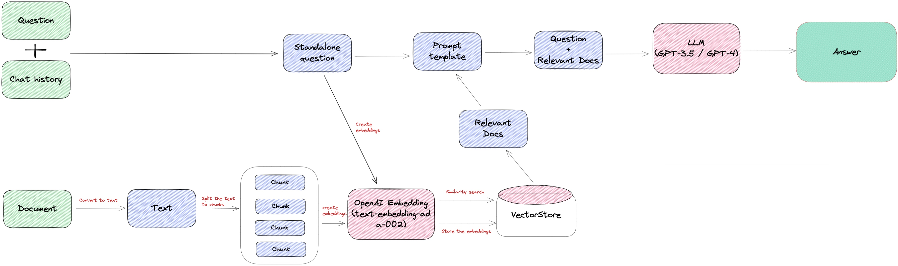
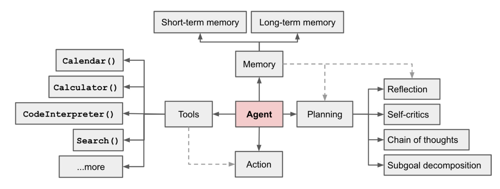

# 【AI】LLM

* [【AI】LLM](#aillm)
  * [概述](#概述)
  * [提示工程](#提示工程)
  * [模型优化](#模型优化)
    * [RAG](#rag)
    * [相似性搜索](#相似性搜索)
  * [应用开发](#应用开发)
    * [Langchain](#langchain)
  * [文章参考](#文章参考)

## 概述
**LLM（Large Language Model）大规模语言模型**，是生成式 AI 模型的一种，除了处理其他任务，还能理解和生成自然语言文本。LLM 本质上是一个 **Token（标记）** 预测器，即在已有的文本基础上，不断地预测下一个 Token

LLM 中的 Large 指的是模型的参数量大，同时模型训练的数据量也大，其预测能力就是这个条件下涌现出来的。**涌现能力（Emergent Abilities）** 是指模型具有从原始训练数据中自动学习并发现新的、更高层次的特征和模式的能力，这些能力在相对较小的模型中不存在

LLM 基于一种被称为 **深度学习（Deep Learning）** 的 **机器学习（Machine Learning）** 类型之上，具体来说，其所使用的模型是一种被称为 **转换器模型（Transformer Model）** 的 **神经网络（Neural Network）**

LLM 中的 Token 指的是文本数据作为模型输入的基本单位，在不同的语言层面上，Token 通常表示文本中的一个字符、单词或者子词，比如每个字母和标点符号可以被视为一个 Token，每个单词也可以被视为一个 Token，作为单词的每个子词同样可以被视为一个 Token

每一步的 Token 预测，LLM 都会生成一个带有概率的 Token 列表，Token 的统计排名越高其对应概率越高，然后根据概率随机性地选择不同排名的 Token。如果总是选择统计排名最高的 Token，生成的内容将会很平淡且丢失创造力，因此 LLM 会通过 Softmax 函数根据 Token 的统计排名计算出 Token 的选择概率

这个随机性的程度跟 LLM 的 **温度（Temperature）** 参数相关，该参数本质上是 Softmax 函数中的缩放参数，控制了 Token 列表的概率分布的均匀度。较高的温度参数会使概率分布更加平滑，导致 LLM 更倾向于生成多样化的 Token 序列；而较低的温度则会使概率分布更加尖锐，导致 LLM 更倾向于生成统计概率较高的 Token 序列

LLM 这样的技术能力很强大，能够总结一些规律来理解和生成人类语言，但它并不是万能的。与人类神经网络一样，对于具有 **计算不可约性（Computational Irreducibility）** 的任务，比如 SHA 摘要的生成，由于其处理过程需要明确地逐步计算，就属于超过 LLM 可以完成的事情了，除非它能够有效地借助外部的计算系统作为工具

常用网站有：[Huggingface AI 模型和数据集社区](https://huggingface.co/)、[opencompass 模型评测平台](https://rank.opencompass.org.cn/home)

## 提示工程
LLM 的工作模式通常是在给定一些部分文本的情况下生成更多自然语言文本，而 **提示词（Prompt）** 就是这些已给定的文本，通常是一句话或一段话，作为 LLM 的输入。**提示工程（Prompt Engineering）** 则指对 Prompt 进行设计、优化和调整的过程，可以根据特定目标和语境设计出一系列问题或任务，使得 LLM 生成更加准确、连贯和有意义的自然语言文本

LLM 可以根据当前的对话上下文来调整自己的参数和预测，这称为模型的 **基于上下文学习（In-Context Learning，ICL）** 能力，提示工程是利用这种 ICL 能力的最直接的方式

根据想要 LLM 完成的任务类型，比如文本摘要、问答、角色扮演等，所编写的 Prompt 可包含以下几个要素：
- **Role**：角色定义
- **Task or Instruction**：任务或指令描述
- **Context**：包含外部信息或额外的上下文信息，引导语言模型更好地响应
- **Input**：用户输入的内容或问题
- **Output Indicator**：指定输出的类型或格式

**幻觉（Hallucinations）** 是指在 LLM 有时会出现不合理或不真实的结果。对于更复杂的进阶问题，采用更多的 Prompt 技巧能更好地引导模型，而 **More Context，More Accuracy** 就是最常见的 Prompt 技巧，即提供越多上下文，模型预测会越准确

增加和强化 Context 信息能更好地发掘模型的 ICL 潜力，这种方式是想把 LLM 当做一个模仿机器人，在 Prompt 中给足信息后，使其模仿人类解决问题的方式或者得到事实性的信息。参考 [Prompting Techniques](https://www.promptingguide.ai/techniques) ，为 Prompt 增加和强化 Context 的主要技巧如下：
- **Few-Shot**：即增加一些案例，是一个特别能提高 LLM 回答准确性的方法，相对应没有提供案例时也被称为 **0-Shot**
- **Few-Shot COT**：COT 全称 **思维链（Chain Of Thought）**，即在 Few-Shot 的基础上，为案例补充解答的过程，包括列出已知条件，做出假设并一步一步进行推导，使 LLM 的回答也带有思考的中间过程
- **0-Shot COT**：在没有提供案例的情况下，通过补充一句 `Think it step by step`，让 LLM 不再凭直觉回答，同样会一步一步地推导，带有思考的过程
- **Consistency**：在 Few-Shot COT 的基础上，不同案例采样多个不同的推理路径，并使用生成结果选择最一致的答案，有助于提高 LLM 的推理性能
- **Reason+Act**：在 Few-Shot COT 的基础上，通过 `Reason ... Act... Obs... [finish]` 的案例格式，让 LLM 学会任务分解和动态推理，还支持按需使用工具，并暂停生成观察工具返回，最后以特定符号作为任务完成的标志

## 模型优化
LLM 的语料内容在训练时就已经固定，虽然广泛但并不精通，因此直接应用于一个专精或全新的方向的话，通常无法生成期望的内容。为了改善这种情况，真正定制化为己所用，有两种常见的方式：
- **微调（Fine-Tuning）**：即让已经做过通用训练的模型，再用特定行业或特定任务的内容继续进行训练。但这样做的成本很高，一个是高质量的行业数据集的积累是个大工程，其次 GPU 进行训练的成本也是一方面，而且行业如果发展比较快，模型还得持续的做调整

- **检索增强生成（Retrieval-Based Generation，RAG）**：即利用检索的内容来补充当前对话的上下文。这种方式同样也是利用了模型的 ICL 能力，但其缺陷是由于对话内容较多，会使 LLM 的预测速度变慢，并且内存需求也比较大

### RAG
RAG 将已知文本保存到 **向量数据库（Vector-Database）**，构建出一个支持语义检索的知识库，在每次对话时，从知识库中检索出和问题语义相关的文本，作为参考信息补充到问题之上，从而为 LLM 的预测丰富上下文，使其生成的准确性会更好

RAG 是一个常规且低成本的方案，既缓解了 LLM 不了解私有化内容的问题，也缓解了上下文长度受限的问题，即输入的内容是有限的，常见的 Token 最大数量为 8k，更大长度的会有性能下降问题以及使用成本会更高

对于传统数据库，其搜索功能都是基于不同的索引方式（B Tree、倒排索引等）加上精确匹配和排序算法（BM25、TF-IDF）等实现的。本质还是基于文本的精确匹配，这种索引和搜索算法对于关键字的搜索功能非常合适，但对于语义搜索功能就非常弱

向量数据库也被称为 **嵌入式数据库（Embedding Database）**，其应用的核心思想是根据语义特征将文本转换成向量，然后将向量存储在数据库中，在进行数据库查询时，也将查询文本转换成向量，然后在数据库中检索出最相似的数个向量，最后返回这些向量对应的文本

RAG 知识库来使用，包含了以下几个主要过程：

- **文本预处理（Text Preprocessing）**

  包括从网站或者从文件中读取文本，以及将文本按照一定规则进行拆分，可以按格式、按字符或按语义进行拆分，Langchain 中提供了一系列的 [文档读取](https://python.langchain.com/docs/modules/data_connection/document_loaders/) 和[文本拆分](https://python.langchain.com/docs/modules/data_connection/document_transformers/) 模块

- **文本向量化（Text Embedding）**

  也被称为 **文本嵌入**，嵌入可以看作是一种尝试使用向量数据表示事物本质的方式，使得相近的事物能由附近的向量来表示。会根据不同的算法生成高维度的向量，代表着数据的不同特征，这些特征代表了数据的不同维度
  
  对于文本，这些特征可能包括词汇、语法、语义、情感、情绪、主题、上下文等；若对于音频，这些特征可能包括音调、节奏、音高、音色、音量、语音、音乐等。只有将事物的特征标签进行关联，才能实现语义搜索。而如何将生成和挑选特征这个过程，也被称为 **特征工程（Feature Engineering)**，它是将原始数据转化成更好的表达问题本质的特征的过程

  文本向量化模型选型：
  - 英语模型：[Huggingface 检索](https://huggingface.co/models?pipeline_tag=sentence-similarity&language=en&sort=trending)，常用有 `
sentence-transformers/all-MiniLM-L6-v2`、`sentence-transformers/all-mpnet-base-v2`
  - 中文模型：[Huggingface 检索](https://huggingface.co/models?pipeline_tag=sentence-similarity&language=zh&sort=trending)，常用有 `shibing624/text2vec-base-chinese`、`BAAI/bge-large-zh`

- **相似性搜索（Similarity Search）**

  是向量数据库的核心实现，在一个海量的数据中找到和某个向量最相似的向量。若搜索过程需要对数据库中的每个向量进行一次比较计算，这样的计算量是非常巨大的，因此需要一种高效的算法来解决这个问题
  
  向量数据库选型：
  - Chroma：基于本地内存的轻量级向量数据库，同时也能提供持久化和服务端模式，[官方文档](https://docs.trychroma.com/)
  - Milvus：存储计算分离、无状态、云原生的高性能向量数据库，[官方文档](https://milvus.io/docs/v2.0.x/overview.md)
  - Qdrant：支持高负载具有便捷 API的向量数据库，为扩展过滤支持而定制，[官方文档](https://github.com/qdrant/qdrant)
  - Typesense：支持快速和容错搜索的向量数据库，是 ES 等搜索引擎产品的替代方案，[官方文档](https://typesense.org/docs/guide/)

### 相似性搜索
在相似性搜索的向量表示中，向量方向代表了事物的特征，而向量长度代表了事物的重要度。对于两个向量的相似性度量，存在以下几种方式：
- **欧几里得距离（Euclidean Distance）**：指两个向量之间的距离。可以反映向量的绝对距离，适用于需要考虑向量长度的相似性计算
- **余弦相似度（Cosine Similarity）**：指两个向量之间的夹角余弦值。对向量长度不敏感，只关注向量方向，适用于高维向量的的相似性计算
- **点积相似度 (Dot product Similarity)**：指两个向量之间的点积值。简单易懂，计算速度快，并且兼顾了向量的长度和方向，适用于许多实际场景

相似性搜索算法的主要思想是通过以下两种方式来提高搜索效率：
- **缩小搜索范围**：可以通过聚类或将向量组织成基于树形、图形结构来实现，并限制搜索范围仅在最接近的簇中进行，或者通过最相似的分支进行过滤
- **减少向量大小**：通过降维或减少表示向量值的长度

基于 **K-Means 和 Faiss 聚类** 的相似性搜索算法，在每次搜索时，只需要先判断搜索向量属于哪个簇，然后再在这一个簇中进行搜索，大大减少了搜索的范围。这种搜索方式也有一些缺点，例如在搜索的时候，如果搜索的内容正好处于两个分类区域的中间，就很有可能遗漏掉最相似的向量
  
为了解决搜索时可能存在的遗漏问题，可以将搜索范围动态调整，例如当 `nprobe = 1` 时，只搜索最近的一个聚类中心，当 `nprobe = 2` 时，搜索最近的两个聚类中心

实际上，除了暴力搜索能完美的搜索出最相邻，所有的搜索算法只能在速度和质量还有内存上做一个权衡，这些算法也被称为 **近似最相邻（Approximate Nearest Neighbor）**

在大规模数据集中，聚类算法最大的问题在于内存占用太大。这主要体现在两个方面：
- 需要保存每个向量的坐标，而每个坐标都是一个浮点数

  对于这个问题，可以通过 **量化（Quantization）** 的方式解决，也就是常见的有损压缩。例如在内存中可以将聚类中心里面每一个向量都用聚类中心的向量来表示，并维护一个所有向量到聚类中心的码本，码本中包含相关向量的索引表示，比如索引可以是与中心的绝对距离，这样就能大大减少内存的占用

- 需要维护聚类中心和每个向量的聚类中心索引

  在高维坐标系中，需要指数级增长的聚类中心点将数据点分成更小的簇，才能提高分类的质量。否则向量和自己的聚类中心距离很远，会极大的降低搜索的速度和质量。想要维持分类和搜索质量，就需要维护数量庞大的聚类中心，从而极大的增加了内存的消耗

  通过 **乘积量化（Product Quantization）** 来解决这个问题，其方法是将向量分解为多个子向量，然后对每个子向量独立进行量化，降低聚类的维度从而减少聚类中心的数量，从而降低内存开销，同时加快搜索的速度，它唯一的问题是搜索的质量会有所下降

  将向量进行编码后，也将得到多个编码值，将它们拼起来就是该向量的最终编码值。在搜索时可以将查询向量也分解为子向量，并对每个子向量进行量化，然后使用笛卡尔积距离来衡量查询向量与数据库中向量的相似度，从而得到最终的搜索结果

除了基于聚类以外，也可以通过构建树或者构建图的方式来实现近似最近邻搜索的算法。**HNSW（Hierarchical Navigable Small World）** 的基本思想是每次将向量加到数据库中的时候，就先找到与它最相邻的向量，然后将它们连接起来，这样就构成了一个图。当需要搜索的时候，就可以从图中的某个节点开始，不断的进行最相邻搜索和最短路径计算，直到找到最相似的向量

HNSW 继承了相同的分层格式，最高层具有更长的边缘，用于快速搜索；而较低层具有较短的边缘，用于准确搜索。与常见的跳表算法相似，避免搜索的时候需要遍历所有的节点。它是一种经典的空间换时间的算法，它的搜索质量和搜索速度都比较高，但是它的内存开销也比较大，因为不仅需要将所有的向量都存储在内存中，还需要维护一个图的结构

**局部敏感哈希（Locality Sensitive Hashing）** 也是一种用于近似最近邻搜索的算法。其特点是快速，同时仍然提供一个近似、非穷举的结果。LSH 使用一组哈希函数将相似向量映射到桶中，从而使相似向量具有相同的哈希值。这样，就可以通过比较哈希值来判断向量之间的相似度

等搜索特定向量时，为了找到给定查询向量的最近邻居，使用相同的哈希函数将类似向量分桶到哈希表中。查询向量被散列到特定表中，然后与该表中的其他向量进行比较以找到最接近的匹配项

在高维空间中，数据点之间的距离往往非常稀疏，数据点之间的距离会随着维度的增加呈指数级增长。导致计算出来的桶非常多，最极端的情况是每个桶中就一个向量，并且计算速度非常慢

所以实际上在实现 LSH 算法的时候，会考虑使用 **随机投影（Random Projection）** 的方式，使用随机投影矩阵将高维空间的数据点投影到低维空间，从而减少计算的时间和提高查询的质量

随机投影会创建一个由随机数构成的矩阵，其大小将是所需的目标低维值。当进行查询时，再使用相同的投影矩阵将查询向量投影到低维空间。然后将投影的查询向量与数据库中的投影向量进行比较，以找到最近邻居。由于数据的维数降低了，搜索过程比在整个高维空间中搜索要快得多。这也是一种近似方法，并且投影质量取决于投影矩阵，通常情况下投影矩阵的随机性越大，其映射质量就越好

在实际的业务场景中，往往不需要在整个向量数据库中进行相似性搜索，而是通过部分的业务字段进行过滤再进行查询。向量数据库通常维护两个索引，一个是向量索引，另一个是元数据索引。元数据过滤可以在相似性搜索之前或之后执行：
- **Pre-filtering**：在向量搜索之前进行元数据过滤。虽然这可以帮助减少搜索空间，但也可能由于误过滤忽略一些潜在的相关结果，而且需要设计和实现更有效的过滤算法
- **Post-filtering**：在向量搜索完成后进行元数据过滤。这可以确保考虑所有相关结果，在搜索完成后对相关结果进行筛选。但这会增加搜索时间以及浪费计算资源

但无论哪种情况下，都存在导致查询过程变慢的情况，因此平衡搜索性能和筛选精度之间的权衡，对于提供高效且相关的向量数据库查询结果至关重要

## 应用开发
LLM 应用指的是基于 LLM 开发的各种应用场景和应用程序，其开发流程可以总结为：
1. 根据任务类型选一个基础 LLM，可根据需要进行微调
2. 根据模型和任务类型设计一个 Prompt，反复调试找到最优效果
3. 可通过 RAG 来丰富上下文，也可通过存储维护的 LLM 记忆来丰富上下文
4. 可结合工具来增强 LLM 的能力，也可使用 Agent 进行任务编排、记忆读取和工具使用
5. 封装为直接与用户交互的应用，便捷地完成该类型的任务

Agent 不仅可以基于固定的流水线，还可以由 LLM 驱动进行自动决策，直到完成目标为止，LLM 就像是 Agent 的大脑，这种 Agent 被称为 **LLM-powered Autonomous Agent**。使用其构造的系统的主要组成如下：

- **规划（Planning）**
    - 子目标和分解：Agent 能够将大型任务分解为较小的、可管理的子目标，以便高效的处理复杂任务
    - 反思和细化：Agent 可以对过去的行为进行自我批评和反省，从错误中吸取经验教训，并为接下来的行动进行分析、总结和提炼，这种反思和细化可以帮助 Agents 提高自身的智能和适应性，从而提高最终结果的质量
- **记忆 （Memory）**
    - 短期记忆：所有上下文学习都是依赖模型的短期记忆能力进行的
    - 长期记忆：使得 Agent 能够长期保存和调用无限信息的能力，一般通过外部载体存储和快速检索来实现
- **工具（Tools）**
    - 外部 API：Agent 调用以获取模型权重中缺少的额外信息，这些信息通常在预训练后很难更改，包括当前信息、代码执行能力、对专有信息源的访问等

### Langchain
**Langchain** 是一个用于开发 LLM 应用的框架，使应用能够为 LLM 提供上下文来源，以及使用 LLM 进行推断，[官方文档](https://python.langchain.com/docs/get_started/introduction)

Langchain 通过 **Chains** 来构建应用的运行流程，**Chains** 指一连串实现了 `Runnable` 接口的可调用组件，包括 LLM 使用 、工具使用或者数据处理等组件，这些可调用组件被称为 **Chain**，每个 Chain 都定义好了输入和输出的格式

**LCEL（LangChain Expression Language）** 能简便地将各个 Chain 组合起来，其主要特点有支持流传输、异步处理和并行处理，便于重试、错误处理和查看中间结果，并可以通过 **LangSmith** 进行完整追踪

为了更灵活地构建 Chains，Langchain 还提供了许多名为 `RunnableXXX` 的 Chain，从而实现参数传递、参数合并、函数运行、分支选择、错误处理等能力，[使用文档](https://python.langchain.com/docs/expression_language/how_to/)

Langchain 的主要模块如下，其中包含一些最基本的 Chain：
- **Model I/O**：

  提供各种 LLM 模型的使用封装，根据底层 LLM 模型的 API 类型，这些封装被划分为了 LLMs 和 Chat Models 两种，分别具有不同的输入和输出。比如 OpenAI 的 `gpt-4-turbo-preview` 需通过 Chat Models 来使用，而其 `gpt-3.5-turbo-instruct` 模型需通过 LLM 来使用
  
  LLMs 的输入和输出都是字符串，[LLMs 使用文档](https://python.langchain.com/docs/integrations/llms/)；而 Chat Models 的输入为消息列表，输出为单个消息，其中每个消息指包含了角色和内容属性，[Chat Models 使用文档](https://python.langchain.com/docs/integrations/chat/)
  
  还提供了模型使用过程中涉及的工具，包括多种类型的提示词模版 Prompt Templates、代表各种角色的消息 Messages、处理模型输出结果的解析器 Output Parsers

- **Retrieval**

  提供用于实现 RAG 的多种类型的检索器 Retrievers，不同类型的检索器具有不同的使用场景，其主要区别在于是否基于向量数据库或文档数据库进行索引、是否使用 LLM 模型等
  
  还提供了检索涉及的相关工具，包括文档读取器 Document Loaders、文本切割工具 Text Splitters、文本嵌入模型的使用封装 Text Embedding Models、向量数据库的使用封装 Vector Stores

- **Agents**

  提供具有不同类型的代理 Agents，这些代理能通过不同的提示词风格、输入格式化和输出解析方式，从而实现不同的机制，使用 LLM 来选择即将采取的一系列行动

  Agent 的输入是之前已执行的动作及对应输出，而输出是后续的一系列动作或者结束，需要通过 AgentExecutor 进行执行，其作用是不断从 Agent 中获取最新的一系列动作并执行，直到 Agent 返回结束

## 文章参考
- [ChatGPT 在做什么](https://waytoagi.feishu.cn/wiki/LnMOwmKIwihcRakRalcczNgrnjf)
- [提示工程指南](https://www.promptingguide.ai/zh)
- [吴恩达联手 OpenAI 提示工程课程](https://www.deeplearning.ai/short-courses/chatgpt-prompt-engineering-for-developers/)，[对应课程笔记](https://mp.weixin.qq.com/s/gParPJMkdc1rXvxr3IGqzQ)
- [向量数据库](https://guangzhengli.com/blog/zh/vector-database/)
- [LLM Powered Autonomous Agents](https://lilianweng.github.io/posts/2023-06-23-agent/#agent-system-overview)
