# 【AI】机器学习

* [【AI】机器学习](#ai机器学习)
  * [简介](#简介)
    * [符号定义](#符号定义)
  * [监督学习](#监督学习)
    * [线性回归](#线性回归)
      * [梯度下降法](#梯度下降法)
        * [批量梯度下降](#批量梯度下降)
        * [随机梯度下降](#随机梯度下降)
        * [小批量梯度下降](#小批量梯度下降)
        * [梯度下降应用](#梯度下降应用)
        * [梯度下降评估](#梯度下降评估)
      * [在线学习](#在线学习)
      * [正规方程法](#正规方程法)
    * [逻辑回归](#逻辑回归)
      * [正则化](#正则化)
    * [神经网络](#神经网络)
      * [反向传播算法](#反向传播算法)
      * [梯度检测](#梯度检测)
      * [随机初始化](#随机初始化)
      * [神经网络实现](#神经网络实现)
    * [支持向量机](#支持向量机)
      * [核函数](#核函数)
      * [支持向量机应用](#支持向量机应用)
    * [决策树](#决策树)
      * [最优划分属性选择](#最优划分属性选择)
      * [分枝生成和剪枝处理](#分枝生成和剪枝处理)
      * [连续值和缺失值处理](#连续值和缺失值处理)
      * [回归树](#回归树)
    * [集成学习](#集成学习)
      * [Bosting](#bosting)
        * [AdaBoost](#adaboost)
        * [提升树](#提升树)
        * [梯度提升树](#梯度提升树)
        * [XGBoost](#xgboost)
      * [Bagging](#bagging)
      * [Stacking](#stacking)
  * [无监督学习](#无监督学习)
    * [K 均值](#k-均值)
    * [主成分分析](#主成分分析)
    * [离群点检测](#离群点检测)
      * [基于高斯分布](#基于高斯分布)
      * [基于多元高斯分布](#基于多元高斯分布)
  * [模型评估](#模型评估)
    * [回归指标](#回归指标)
    * [分类指标](#分类指标)
    * [评估方法](#评估方法)
    * [误差分析](#误差分析)
      * [学习算法误差分解](#学习算法误差分解)
      * [模型诊断](#模型诊断)
      * [学习曲线](#学习曲线)
    * [映射简化](#映射简化)
  * [推荐算法](#推荐算法)
    * [基于内容](#基于内容)
    * [基于协同过滤](#基于协同过滤)

## 简介
通俗来说，机器学习就是通过机器从历史经验中总结出某种潜在的规律，并使用该规律来对不确定场景进行决策

用术语来说，机器学习就是通过机器从 **数据集（Data Set）或称为训练集（Train Set）** 中学得 **模型（Model）或称为假说（Hypothesis）、学习器（Learner）**，并且使用该模型来完成 **学习任务（Learning Task）**

这个学得模型的过程称为 **训练（Train）或学习（Learn）**，该过程通过执行某个 **学习算法（Algorithm）** 来完成，并且会不断地改善模型的 **性能度量 (Performance Measure）**，即完成学习任务的正确率

数据集中的每条数据称为 **样本（Sample）**，样本的性质信息称为 **属性（Attribute）或特征（Feature）、输入（Input）**，样本的结果信息称为 **标记（Label）或输出（Ontput）**

根据训练集的样本是否拥有标记，机器学习的学习任务大致可以分为 **监督学习（Supervised learning）** 和 **无监督学习（Unsupervised learning）** 两类

监督学习，是从 **拥有标记** 的训练集中训练得到一个模型，该模型需要能根据样本的特征，预测样本的标记，代表的学习任务有：
- **回归（Regression）**：预测的标记为连续数值
- **分类（Classification）**：预测的标记为离散数值

无监督学习，是从 **不拥有标记** 的训练集中训练得到一个模型，该模型需要根据样本的特征，对样本进行一系列的操作，代表的学习任务有：
- **聚类（Clustering）**：将具有相似特征的样本划分到同一个簇中，而不用关心这个簇代表什么

### 符号定义
| 符号 | 含义 |
| --- | --- |
| $m$ | 训练集的数目 |
| $x^{(i)}$ | 第 $i$ 个样本的特征，或不带标记的样本 |
| $y^{(i)}$ | 第 $i$ 个样本的标记|
| $(x^{(i)}, y^{(i)})$ | 表示第 $i$ 个带标记的样本 |
| $n$ | 样本的特征数目 |
| $x_j$ | 样本的第 $j$ 个特征 |

$L$ 表示 **损失函数（Loss Function）** ，是对于单个样本的模型预测的误差度量

$J$ 表示 **代价函数（Cost Function）**，是对于所有样本的模型预测误差度量

**假说空间** 是坐标轴包含样本特征和标记的空间，用于描述回归任务

**特征空间** 空间是坐标轴只包含样本特征的空间，用于描述分类、无监督学习任务

**参数** 指通过执行学习算法学得的参数，和训练集相关，不需要人为设定，这些参数构成了模型，如：特征权重 $\theta$

**超参数** 指用于确定学习算法的参数，和训练集无关，需要人为设定，这些参数影响了模型，如：正则化参数 $\lambda$、学习速率 $\alpha$

## 监督学习
### 线性回归
**线性回归（Linear Regression）** 是通过样本特征的线性组合来拟合样本的输出，完成回归任务

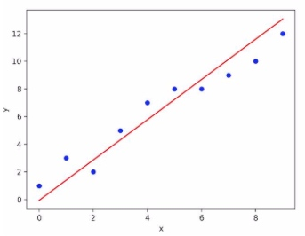

线性回归的模型为：

$$h_\theta(x) = \sum^n_{j=0}\theta_jx_j=\theta^Tx$$

> $j$ 表示样本的特征数目
> $x$ 表示样本特征向量 $\{x_1,\dots,x_j\}$，$x_j$ 表示样本的第 $j$ 个特征，定义 $x_0$ 恒等于 1
> $\theta$ 表示参数或权重向量 $\{\theta_1,\dots,\theta_j\}$，$\theta_j$ 表示样本第 $j$ 个特征的参数

损失函数使用的是单个样本的残差的平方误差：

$$L(h_\theta,(x^{(i)},y^{(i)}))=(h_\theta(x^{(i)})-y^{(i)})^2$$

代价函数使用的是所有样本的残差的 **均方误差（MSE）**：

$$J(h_\theta) = \frac{1}{2m}\sum_{i=1}^{m}L(h_\theta,(x^{(i)},y^{(i)}))=\frac{1}{2m}\sum_{i=1}^{m}(h_\theta(x^{(i)})-y^{(i)})^2$$

> 增加系数 $\frac{1}{2}$ ，以简化求导结果 

学得最优模型，也就是得到最优参数 $\theta$ 的目标是：

$$\min\limits_{\theta}\ J(h_\theta)$$

最小化代价函数可看作是找到一条直线，使所有样本到直线对应点的距离之和最小化，这个方法也称为 **最小二乘法**

**多项式回归** 是通过构造高阶组合特征，并使用线性回归算法来构造非线性模型，属于广义上的线性回归，对于直线无法很好拟合的复杂数据，可以使用多项式回归进行拟合

首先要基于样本的原特征去构造高阶组合特征，如原特征数目为 2 的 2 阶组合特征为 $\{x_0,x_1,x_2,x_1x_2,x_1^2,x_2^2\}$，其多项式回归模型为：

$$h_\theta(x) = \theta_0x_0+\theta_1x_1+\theta_2x_2++\theta_3x_1x_2+\theta_4x_1^2+\theta_5x_2^2$$ 

当样本的原特征很多时，则高阶组合特征的数目会很庞大，此时通过多项式回归来建立非线性模型不是一个很好的做法

#### 梯度下降法
**梯度下降法（Gradient Descent）** 可以求得使代价函数最小化的最优解，对于线性回归，就是求得最优参数 $\theta$

梯度下降的过程可以类比成下山，一个可微的函数是一座山，而函数的局部最小值就是山底，梯度下降就是找到当前位置最陡峭的方向，然后沿着此方向向下走，从而到达山底

对于某个点，梯度是函数上升最快的方向，因此负梯度就是函数下降最快的方向，也就是最陡峭的方向

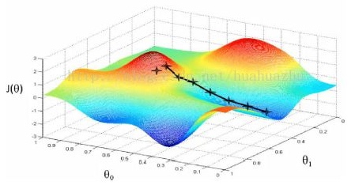

梯度 $\delta$ 是一个向量 $\{\frac{\partial}{\partial\theta_0}J(h_\theta),\dots,\frac{\partial}{\partial\theta_j}J(h_\theta)\}$

梯度向量中的每个 $\frac{\partial}{\partial\theta_j}J(h_\theta)$ 是 $J(h_\theta)$ 对 $\theta_j$ 的偏导数，表示当 $\theta_j$ 减小 $\Delta\theta_j$ 时，$J(h_\theta)$ 减小 $\frac{\partial}{\partial\theta_j}J(h_\theta)$，也就是在当前位置每个 $\theta_j$ 减小对 $J(h_\theta)$ 减小的影响程度

要使 $J(h_\theta)$ 要达到下降最快，每次下降每个 $\theta_j$ 都应该减少 $\frac{\partial}{\partial\theta_j}J(h_\theta)$，即每个 $\theta_j$ 都按照其影响程度的比例来减小，也就是影响程度相对大的 $\theta_j$ 应该减小相对大的值

##### 批量梯度下降
**批量梯度下降（Batch Gradient Descent）** 的每次下降都是对代价函数的优化，即同时对于所有样本的损失函数进行优化，需要遍历所有样本

当样本数量太大时，每次更新参数的计算成本太大，学习速度很缓慢

对于线性回归，批量梯度下降过程：
1. 随机初始化 $\theta$
3. 重复执行，直到 $J(h_\theta)$ 收敛，即到达局部最小值
    1. 分别计算 $J(h_\theta)$ 对每个参数 ${\theta_0,\ldots,\theta_n}$ 的偏导数
       $\frac{\partial J(h_\theta)}{\partial\theta_j}=\frac{1}{m}\sum\limits_{i=1}^m(h_\theta(x^{(i)})-y^{(i)})x_j^{(i)}$
       向量化后，即计算梯度 $\delta=\frac{\partial J(h_\theta)}{\partial\theta}$
           
    2. 同时改变所有参数 ${\theta_0,\ldots,\theta_n}$，减去偏导数
       $\theta_j:=\theta_j-\alpha\frac{\partial J(h_\theta)}{\partial\theta_j}$
       向量化后，即 $\theta:=\theta-\alpha\delta$

向量化是通过向量来表示一些值，利用向量库可以使计算更加的高效

##### 随机梯度下降
**随机梯度下降（Stochastic Gradient Descent** 的每次下降是对随机某个样本的损失函数进行优化，每次参数更新的速度大大加快

对于线性回归，随机梯度下降过程：
1. 使样本随机重新排列
2. 重复执行，直到 $J(h_\theta)$ 收敛，即到达局部最小值
    1. 从重新排列的样本集每次迭代一个样本
        1. 分别计算 $L(h_\theta,(x^{(i)},y^{(i)}))$ 对每个参数 ${\theta_0,\ldots,\theta_n}$ 的偏导数
           $\frac{\partial L(h_\theta,(x^{(i)},y^{(i)}))}{\partial\theta_j}=(h_\theta(x^{(i)})-y^{(i)})x_j^{(i)}$
           
        2. 同时改变所有参数 ${\theta_0,\ldots,\theta_n}$，减去偏导数
           $\theta_j:=\theta_j-\frac{\partial L(h_\theta,(x^{(i)},y^{(i)}))}{\partial\theta_j}$
           
##### 小批量梯度下降
**小批量梯度下降(Mini-Batch Gradient Descent)** 的每次下降是对小批量样本的损失函数进行优化，介于批量梯度下降和随机梯度下降之间

对于线性回归，小批量梯度下降过程：
1. 设定小批量样本个数 $b$
2. 重复进行，直到 $J(h_\theta)$ 收敛，即到达局部最小值
    1. 从样本集中每次迭代 $b$ 个样本
        1. 分别计算 $\frac{1}{b}\sum\limits^{k+b-1}_{i=k}L(h_\theta,(x^{(i)},y^{(i)}))$ 对每个参数 ${\theta_0,\ldots,\theta_n}$ 的偏导数
           $\frac{1}{b}\sum\limits^{k+b-1}_{i=k}L(h_\theta,(x^{(i)},y^{(i)}))=\frac{1}{b}\sum\limits^{k+b-1}_{i=k}(h_\theta(x^{(i)})-y^{(i)})x_j^{(i)}$
        
        2. 同时改变所有参数 ${\theta_0,\ldots,\theta_n}$，减去偏导数
           $\theta_j:=\theta_j-\frac{1}{b}\sum\limits^{k+b-1}_{i=k}L(h_\theta,(x^{(i)},y^{(i)}))$
           
通常选择 $b$ 在 2-100 之间，由于每次优化对 $b$ 个样本的损失函数，可以通过向量化平行处理，总体表现可能会比批量梯度下降和随机梯度下降更好           

##### 梯度下降应用
注意每次参数都需要同时改变，不可以先改变部分的参数，在程序中实现则应该先用临时变量存储偏导数计算结果，然后更新所有参数

若代价函数存在一个以上的局部最小值，不同的初始值有可能导致代价函数的不同局部最小值，因此可以尝试多次随机初始化，比较得到的局部最小值

每次所有 $\theta_j$ 按照梯度定义的比例减小，能让代价函数最快地下降，而 $\alpha$ 用于控制所有 $\theta_j$ 每次减小的程度，称为 **学习速率或步长**

若 $\alpha$ 太小，会导致代价函数每次下降的程度太小，学习速度缓慢；若 $\alpha$ 太大，会导致代价函数跨过局部最低点，无法收敛甚至发散

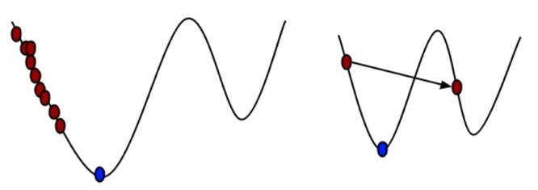

在保证代价函数不跨过局部最低点的情况下，$\alpha$ 越大代价函数每次下降的程度越大，学习速度越快

学习速率的选择，一般以每个 $1^m \times 3^n$ 来进行尝试，选出最合适的值，如：$\dots,0.001,0.003,0.01,0.03,\dots$

也可以令学习率随着迭代次数的增加而减小，如：$\alpha=\frac{c_1}{iterNumber+c_2}$，但这样会让学习速度变得比较慢

进行梯度下降前的需要进行的特征处理有 **特征缩放** 和 **均值归一化**

特征缩放指确保特征的取值在一个相似的范围，可以使代价函数更快地收敛，一般范围在 $-1\leq x_n\leq 1$；均值归一化指确保特征的所有样本平均值为 0

实现为使用 $\frac{x_n-\mu_n}{s_n}$ 代替 $x_n$，其中 $\mu_n$ 为 $x_n$ 的平均值，$s_n$ 为该 $x_n$ 标准差

$$\mu_n=\frac{1}{m}\sum^m_{i=1}x^{(i)}_n$$

$$s_n=\sqrt{\frac{1}{m}\sum^m_{i=1}(x^{(i)}_n-\mu_n)^2}$$

##### 梯度下降评估
对于批量梯度下降工作正常的确认，绘制代价函数对应迭代次数的曲线图，观察代价函数是否一直随着迭代次数的增大而减小

如果存在代价函数随着迭代次数的增大而增大的部分，则表示梯度下降工作异常，应该选用更小的学习速率，只要学习速率足够小，梯度下降一定能够正常工作

对于大数据规模学习下，绘制代价函数对应迭代次数的曲线图计算代价太大，而大数据规模学习可以使用随机梯度下降

对于随机梯度下降，每迭代到一个样本，都在参数更新前计算的对于该样本的损失函数，然后每迭代 $n$ 个样本后，统计一次对于这 $n$ 个损失函数的平均值，绘制这个平均值对应迭代次数的曲线图，观察这个平均值是否逐渐下降收敛

$n$ 的值选取得越大，图的噪声越小，下降趋势越平滑，但是趋势反馈的实时性最低

更多计算最小化代价函数的最优参数的高级算法：
- 共轭梯度法（Conjugate Gradient）
- 拟牛顿法（BFGS）
- 拟牛顿法（L-BFGS）

它们的优势是不需要手动提供学习速率 $\alpha$，并且通常比梯度下降法高效，劣势是比梯度下降法复杂很多

#### 在线学习
利用类似随机梯度下降的机制，每次只对单一样本进行学习，可以构造在线学习机制：

- 服务接收到数据则执行
    -  同时更新所有的 $\theta$
    $\theta_j-\alpha\frac{\partial}{\partial\theta_j}L(\theta,(x^{(i)},y^{(i)}))$
    $=\theta_j-\alpha(h_\theta(x^{(i)})-y^{(i)})x_j^{(i)}$ 

一旦模型完成了对一个数据的学习，就可以丢弃该数据，不需要再存储下来，这样模型可以根据新的数据不断地更新

#### 正规方程法
可以更快地计算出线性回归模型最优的参数 $\theta$，使代价函数最小化

实现原理是先计算出代价函数对于每个参数的偏导数函数，再计算出当这些偏导数函数都为 0 时，也就是即梯度 $\delta$ 为 0 时，对应每个参数的值

$x$ 是 $j+1$ 维度的样本特征向量，$\theta$ 是$j+1$ 维度的参数向量，$y$ 是 $m$ 维度的样本标记向量

定义一个 $m\times j+1$ 的矩阵 $X$ 来表示所有样本的特征：

$$X = [\begin{matrix}(x^{(1)})^T \\\dots \\(x^{(m)})^T\end{matrix}]= [\begin{matrix}x^{(1)}_0 &\dots &x^{(1)}_j \\\dots &\dots &\dots \\x^{(m)}_0 &\dots &x^{(m)}_j \end{matrix}]$$

$J(h_\theta)$ 向量化后表示为：

$$J(h_\theta)=\frac{1}{2m}(y-X\theta)^T(y-X\theta)$$

计算当梯度 $\delta=\frac{\partial}{\partial\theta}J(h_\theta)=0$ 时的 $\theta$：

$$\begin{array}\ 
\frac{\partial}{\partial\theta}\frac{1}{2m}(y-X\theta)^T(y-X\theta)&=0\\
\frac{1}{m}X^T(y-X\theta)&=0\\
X^TX\theta&=X^Ty\\
\theta &= (X^TX)^{-1}X^Ty\end{array}$$

正规方程法对比梯度下降法：

| 梯度下降法 | 正规方程法 |
| --- | --- |
| 需要选择学习速率 $\alpha$ | 不需要选择参数 |
| 需要多次迭代计算 | 可以直接计算出结果 |
| 特征数目很大时可以很好地运行 | 特征很大时（上万级别）计算 $(X^TX)-1$ 会运行很慢 |

### 逻辑回归
**逻辑回归（Linear Regression）** 是通过样本特征的线性组合，结合一个近似单位跃阶函数的单调可微函数来拟合样本的标记，完成分类任务

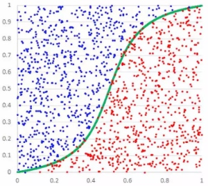

假设线性组合 $\theta^Tx$ 为 $z$，逻辑回归需要一个函数 $g(z)$ 将线性组合转化为符合分类任务的输出 $[0,1]$，这个函数称为 **激活函数**,最理想的激活函数就是单位跃阶函数：

$$ g(z)=\begin{cases}
0 & z<0 \\
0.5 & z=0 \\
1 & z>0\end{cases}$$

> 输出 1 表示分为正类，输出 0 表示分为负类，输出 0.5 则表示临界值可以任意分类

由于单位跃阶函数不单调可微，不便于进行梯度下降，因此使用近似的 **对数几率函数** 作为激活函数，它是一种 **sigmoid 函数**：

$$g(z)=\frac{1}{1+e^{-z}}$$

也可以表示为：

$$\ln\frac{g(z)}{1-g(z)}=z$$

> 正类和反类的可能性的比值（正类的相对可能性）称为几率，对几率取对数则得到对数几率，而 $z$ 正是被转化为这个对数几率

对数几率函数的求导也非常方便：

$$g\prime(z)=g(z)(1-g(z))$$

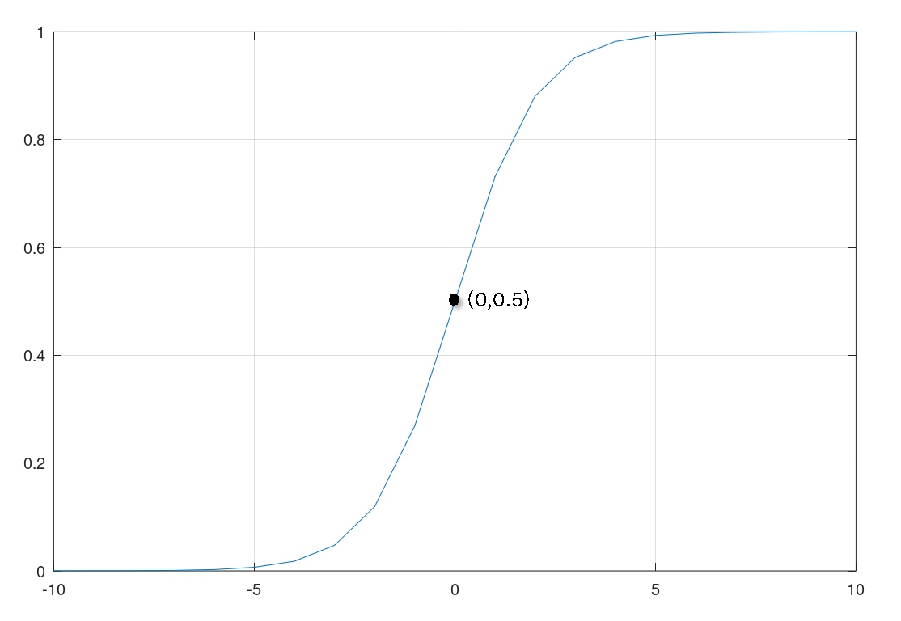

逻辑回归的模型为：

$$h_\theta(x)=\frac{1}{1+e^{-\theta^Tx}}=P(y=1|x;\theta)$$

对于模型 $h_\theta(x)$，即 $\theta$ 已确定，由于 $\theta^Tx=0$ 时模型输出为 0.5，也就是临界点，因此变量为 $x$ 的 $\theta^Tx=0$ 函数称为 **决策边界**，也就是在上图的特征空间中的绿色线（决策边界是对模型的描述，不是对训练集的描述）

若使用均方误差作为代价函数，它会存在许多的局部最小值，不利于梯度下降求解，因此逻辑回归使用的是 **极大似然法** 来分析模型的误差情况：

$h_\theta$ 对于单个样本的似然，若样本是正类表示为 $h_\theta(x^{(i)})$，若样本是反类表示为 $1-h_\theta(x^{(i)})$，结合两者表示为：

$$P((x^{(i)},y^{(i)})|h_\theta)=h_\theta(x^{(i)})^{y^{(i)}}(1-h_\theta(x^{(i)}))^{1-y^{(i)}}$$

> 对于 $P((x,y)|\theta)$，如果 $(x,y)$ 是已知而 $\theta$ 是变量，则称为似然，它描述对于不同的 $\theta$ 能够预测 $(x,y)$ 的概率，即根据原因推测该原因导致结果发生的概率

而对于所有样本，即样本集 $D$ 的似然为：

$$P(D|h_\theta)=\prod\limits_{i=1}^mh_\theta(x^{(i)})^{y^{(i)}}(1-h_\theta(x^{(i)}))^{1-y^{(i)}}$$

根据极大似然估计，似然越大则表示模型的预测误差越小，反之表示模型的预测误差越大，因此可以通过 $-\ln P(D|h_\theta)$ 表示模型的代价函数，取对数可以将其变成求和形式：

$$\begin{array}\ J(h_\theta)&=-\ln P(D|h_\theta)\\
&=\sum^m_{i=1}-y^{(i)}\ln h_\theta(x^{(i)})-(1-y^{(i)})\ln(1-h_\theta(x^{(i)}))\end{array}$$

也可以得到对单个样本的损失函数：

$$\begin{array}\ L(h_\theta,(x^{(i)},y^{(i)}))&=\begin{cases}
-\ln(1-h_\theta(x^{(i)})) & y^{(i)}=0 \\
-\ln(h_\theta(x^{(i)})) & y^{(i)}=1\end{cases}\\
&=-y^{(i)}\ln(h_\theta(x^{(i)}))-(1-y^{(i)})\ln(1-h_\theta(x^{(i)}))\end{array}$$

学得最优模型，也就是得到最优参数 $\theta$ 的目标是：

$$\min\limits_{\theta}\ J(h_\theta)$$

由于 $J(h_\theta)$ 可微，目标的最优解通过梯度下降法可求得

对于多类分类，为每种分类都当作二分类问题来处理，并生成对应模型，若总共 $C$ 种分类，第 $c$ 种分类，对应使用参数 $\Theta^{(c)}$ 的假说：
$$h_{\Theta^{(c)}}(x)=P(y=1|x;\Theta^{(c)})\ \text{for} \ i=1,\dots,C$$

预测结果类型为最大的模型输出概率的对应类型：
$$\max\limits_c\ h_{\Theta^{(c)}}(x)$$

#### 正则化
**正则化（Regularization）** 是为代价函数增加一个对于参数的惩罚项，来对代价函数中的参数进行一些限制，分为 **L1 正则化** 和 **L2 正则化** 两种

L2 正则化能限制每个参数都变得很小，对模型进行了简化，使其不容易发生过拟合

对于线性回归和逻辑回归，L2 正则化项为：

$$\Omega(h_\theta)=\frac{\lambda}{2m}\sum^n_{j=1}\theta^2_j$$

> 对于偏置参数 $\theta_0$ 不进行惩罚
> $\frac{\lambda}{2m}$ 中的系数 $\frac{1}{2}$  是为了方便求导

包含原代价函数和 L2 正则化项的等高线图：
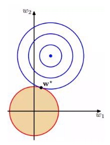
L2 正则化项在零点附近比较平缓，和原代价函数的交点就是训练目标，交点容易落在圆的边上从而使参数都变得很小

$\frac{\lambda}{2m}$ 中的 $\lambda$ 称为正则化参数，控制着参数惩罚的力度，如果 $\lambda$ 太大，则会使得参数变得太小，几乎只取决于 $\theta_0$

L2 正则化后，在批量梯度下降法中每次参数改变：

$\theta_j:=\theta_j(1-\alpha\frac{\lambda}{m})-\alpha\frac{\partial J(h_\theta)}{\partial\theta_j}\ \mbox{for}\ j = 1,\ldots,n$

> $1-\alpha\frac{\lambda}{m}$ 的取值应该略小于 1

L2 正则化后，对于正规方程法计算线性回参数：

$$\theta = (X^TX + \lambda A)^{-1}X^Ty$$

> $A$ 是首行为 0 的 $n+1$ 维度单位矩阵 $[\begin{matrix}0 &0 &0 \\0  &1 &0 \\0  &0 &1\end{matrix}]$

L1 正则化是限制不重要的参数变小，产生稀疏参数向量或矩阵，相当于去除了该特征，用于特征选择

对于线性回归和逻辑回归，L1 正则化项为：

$$\Omega(h_\theta)=\frac{\lambda}{m}\sum^n_{j=1}|\theta_j|$$

包含原代价函数和 L1 正则化项的等高线图：
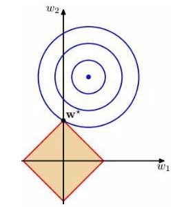
L1 正则化项在零点附近具有很明显的棱角，和原代价函数的交点就是训练目标，交点容易落在棱角上从而使部分参数为零 

进行了 L1 正则化的线性回归模型称为 **岭回归模型**，而进行了 L2 正则化的线性回归模型称为 **Lasso 回归模型**

### 神经网络
**神经网络（Neural Network）** 是借鉴了生物神经网络的工作原理形成的非线性模型，它既可以用来完成监督学习的任务，包括分类和回归，也可以用来完成无监督学习的任务

对比多项式回归，神经网络更适合用于实现样本特征较多的的非线性模型

神经元，表示一个接收输入并输出的模型：
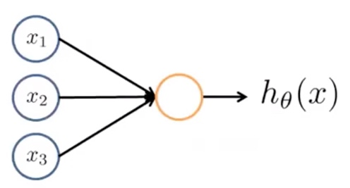

神经网络，就是基于神经元组成的网络：

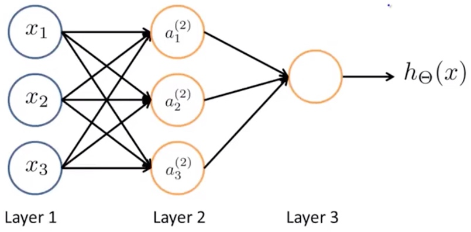

在神经网络中，第一层是输入层，最后一层是输出层，中间的层都是隐藏层

对于以上 3 层的神经网络模型，其前向传播为：

$$a^{(2)}_1=g(z^{(2)}_1)=g(\Theta^{(1)}_{10}x_0+\Theta^{(1)}_{11}x_1+\Theta^{(1)}_{12}x_2+\Theta^{(1)}_{13}x_3)$$

$$a^{(2)}_2=g(z^{(2)}_2)=g(\Theta^{(1)}_{20}x_0+\Theta^{(1)}_{21}x_1+\Theta^{(1)}_{22}x_2+\Theta^{(1)}_{23}x_3)$$

$$a^{(2)}_3=g(z^{(2)}_3)=g(\Theta^{(1)}_{30}x_0+\Theta^{(1)}_{31}x_1+\Theta^{(1)}_{32}x_2+\Theta^{(1)}_{33}x_3)$$

$$h_\Theta(x)=a^{(3)}_1=g(z^{(3)}_1)=g(\Theta^{(2)}_{10}a^{(2)}_0+\Theta^{(2)}_{11}a^{(2)}_1+\Theta^{(2)}_{12}a^{(2)}_2+\Theta^{(2)}_{13}a^{(2)}_3)$$

> $h_\Theta(x)$ 表示整个神经网络模型
> $L$ 表示神经网络的层数
> $s_l$ 表示神经网络的第 $l$ 层的神经元数
> $\Theta^{(l)}$ 是一个 $s_{l+1} \times s_l+1$ 的权重矩阵，表示第 $l$ 层的神经元的激活项作为第 $l+1$ 层神经元输入时的权重
> $\Theta^{(l)}_{jn}$ 表示 $l+1$ 层中的第 $j$ 个神经元的第 $n$ 个输入的权重
> $z^{(l)}_j$ 表示第 $l$ 层的第 $j$ 个神经元的输入线性组合，$g(z)$ 表示激活函数
> $a^{(l)}_j$ 表示第 $l$ 层的第 $j$ 个神经元的激活项，激活项是神经元将输入的线性组合通过激活函数转化得到的输出
> $x_0$ 表示偏置样本输入，$a^{(l)}_0$ 表示第 $l$ 层的偏置激活项，均恒等于1

向量化后可以表示为：
$$a^{(2)}=g(z^{(1)})=g(\Theta^{(1)}x)$$

$$h_\Theta(x)=a^{(3)}=g(z^{(2)})=g(\Theta^{(2)}a^{(2)})=g(\Theta^{(2)}a^{(2)})$$

> $a^{(l)}$ 是向量 $\{a^{(l)}_0,\dots,a^{(l)}_{s_l+1}\}$
> $z^{(l)}$ 是向量 $\{z^{(l)}_1,\dots,z^{(l)}_{s_{l-1}+1}\}$

对于二分类神经网络模型，神经元可等价于一个逻辑回归模型，激活函数使用的是对数几率函数

对单个样本的损失函数：

$$L(h_\Theta,(x^{(i)},y^{(i)}))=-y^{(i)}\ln(h_\Theta(x^{(i)}))-(1-y^{(i)})\ln(1-h_\Theta(x^{(i)}))$$

对所有样本的代价函数：

$$\begin{array}\ J(h_\Theta)&=\frac{1}{m}\sum^m_{i=1}L(h_\Theta(x^{(i)}),y^{(i)})\\
&=-\frac{1}{m}\sum\limits^m_{i=1}\big[y^{(i)}\ln(h_\Theta(x^{(i)}))+(1-y^{(i)}\ln(1-h_\Theta(x^{(i)}))\big]\end{array}$$

L2 正则化后的代价函数：
$$\begin{array}\ J(h_\Theta)&=\frac{1}{m}\sum^m_{i=1}L(h_\Theta(x^{(i)}),y^{(i)})+\Omega(h_\Theta)\\
&=-\frac{1}{m}\sum\limits^m_{i=1}\big[y^{(i)}\ln(h_\Theta(x^{(i)}))+(1-y^{(i)}\ln(1-h_\Theta(x^{(i)}))\big]+\frac{\lambda}{2m}\sum^L_{l=1}\sum^{s_l}_{n=1}\sum^{s_{l+1}}_{j=1}(\Theta^{(l)}_{jn})^2\end{array}\ $$

神经网络的多类分类和逻辑回归的多类分类相同，通过 $K$ 个类别对应 $K$ 个输出项，通过一个 $K$ 维度的向量 $h_\Theta(x)$ 来表示

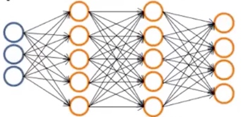

第 $k$ 个分类对应的输出项为 $(h_\Theta(x))_k$，当 $(h_\Theta(x))_c$ 为 1，而其他 $(h_\Theta(x))_k\ (k\ne c)$ 输出为 0，即表示预测为第 $k$ 个分类

L2 正则化后的代价函数为：

$$J(h_\Theta)=-\frac{1}{m}\sum\limits^m_{i=1}\sum\limits^K_{k=1}\big[y^{(i)}_k\ln(h_\Theta(x^{(i)})_k)+(1-y_k^{(i)}\ln(1-h_\Theta(x^{(i)}_k))\big]+\frac{\lambda}{2m}\sum^L_{l=1}\sum^{s_l}_{n=1}\sum^{s_{l+1}}_{j=1}(\Theta^{(l)}_{jn})^2$$

#### 反向传播算法
**反向传播算法（BP）** 用于计算使得神经网络代价函数对于 $\Theta$ 中每个参数的偏导数

$\delta^{(l)}_j$ 表示第 $i$ 个样本的损失函数，对第 $l$ 层的第 $j$ 个神经元的输入线性组合 $z^{(l)}_j$ 的偏导数：

$$\delta^{(l)}_j=\frac{\partial}{\partial z^{(l)}_j}L(h_\Theta,(x^{(i)}, y^{(i)}))$$

对于二分类神经网络模型，激活函数使用的是对数几率函数，其求导为：

$$g\prime(z)=g(z)(1-g(z))$$

$\delta^{(l)}_j$ 向量化后可以得到：
 
$$\begin{array}\ \delta^{(l)}&=\frac{\partial}{\partial z^{(l)}}L(h_\Theta,(x^{(i)}, y^{(i)}))=\frac{\partial}{\partial\Theta^{(l-1)}g(z^{(l-1)})}L(h_\Theta,(x^{(i)}, y^{(i)}))\\
\delta^{(l-1)}&=\frac{\partial}{\partial z^{(l-1)}}L(h_\Theta,(x^{(i)}, y^{(i)}))\\
&=\sum\limits^{s_{l-1}}_{j=1}\frac{\partial}{\partial\Theta^{(l-1)}_jg(z^{(l-1)}_j)}L(h_\Theta,(x^{(i)}, y^{(i)}))\frac{\partial\Theta^{(l-1)}_jg(z^{(l-1)}_j)}{\partial z^{(l-1)}_j}\\
&=(\Theta^{(l-1)})^T\frac{\partial}{\partial\Theta^{(l-1)}g(z^{(l-1)})}L(h_\Theta,(x^{(i)}, y^{(i)})).*g(z^{(l-1)}).*(1-z^{(l-1)})\\
&=(\Theta^{(l-1)})^T\delta^{(l)}.*g(z^{(l-1)}).*(1-z^{(l-1)})\end{array}$$

将 $\delta^{(l-1)}$ 中的 $l-1$ 替换为 $l$ 即：

$$\delta^{(l)}=(\Theta^{(l)})^T\delta^{(l+1)}.*g(z^{(l)}).*(1-z^{(l)})$$

第 $i$ 个样本的损失函数，对第 $l$ 层的第 $j$ 个神经元的第 $n$ 个输入的权重 $\Theta^{(l)}_{jn}$ 的偏导数：

$$\frac{\partial}{\partial\Theta^{(l)}_{jn}}L(h_\Theta,(x^{(i)}, y^{(i)}))=\frac{\partial L(h_\Theta,(x^{(i)}, y^{(i)}))}{\partial z^{(l)}_{j}}\times\frac{\partial z^{(l)}_{j}}{\partial\Theta^{(l)}_{jn}}=\delta^{(l)}_ja^{(l-1)}_n$$

反向传播算法过程：

1. 构造和 $\Theta$ 相同维度的矩阵 $\Delta$，其中 $\Delta^{(l)}_{jn}=0\ \text{for all }  l,j,n$，每个 $\Delta^{(l)}_{jn}$ 表示已迭代样本损失函数对 $\Theta^{(l)}_{jn}$ 的偏导数的累加 $\sum\limits^m_{i=1}L(h_\Theta,(x^{(i)}, y^{(i)}))$
2. 迭代样本本集中的每个样本
    1. 设置 $a^{(1)}=x^{(i)}$
    2. 执行前向传播，计算 $a^{(l)}\ \ (\text{for}\ l=2,\dots,L)$
    3. 使用 $y^{(i)}$，计算 $\delta^{(L)}=L(h_\Theta,(x^{(i)}, y^{(i)}))$
    4. 执行反向传播，计算 $\delta^{(L-1)},\dots,\delta^{(2)}$
    5. 对每个 $\Delta^{(l)}_{jn}$，执行 $\Delta^{(l)}_{jn}=\Delta^{(l)}_{jn}+\delta^{(l+1)}_ja^{(l)}_n$
       向量化后即 $\Delta^{(l)}=\Delta^{(l)}+\delta^{(l+1)}(a^{(l)})^T$
3. $\frac{1}{m}\Delta^{(l)}_{jn}$ 加上 L2 正则化项的偏导数，得到对于所有样本的代价函数对 $\Theta^{(l)}_{jn}$ 的偏导数 $\frac{\partial J(h_\Theta)}{\partial\Theta^{(l)}_{jn}}$
   当 $n\neq0$，$\frac{\partial J(h_\Theta)}{\partial\Theta^{(l)}_{jn}}:=\frac{1}{m}\Delta^{(l)}_{jn}+\frac{\lambda}{m}\Theta^{(l)}_{jn}$
  当 $n=0$，$\frac{\partial J(h_\Theta)}{\partial\Theta^{(l)}_{jn}}:=\frac{1}{m}\Delta^{(l)}_{jn}$

得到代价函数对于 $\Theta$ 中每个参数的偏导数 $\frac{\partial J(h_\Theta)}{\partial\Theta^{(l)}_{jn}}$ 后，可以执行梯度下降得到参数的最优解

#### 梯度检测
梯度检测通过计算得到偏导数近似值，并且和反向传播算法得到的偏导数进行对比，以检测反向传播算法得到的偏导数是否正确

导数近似值可以通过双侧差分得到：

$$\frac{\partial J(h_\theta)}{\partial\theta}\approx\frac{J(\theta+\epsilon)-J(\theta-\epsilon)}{2\epsilon}$$

$\epsilon$ 通常使用 $10^-4$ 程度的值，然后通过对 $\Theta^{(l)}_{jn}$ 进行操作，得到对于 $\Theta^{(l)}_{jn}$ 的偏导数近似值

$$\frac{\partial J(h_\Theta)}{\partial\Theta^{(l)}_{jn}}\approx\frac{J(\Theta^{(l)}_{jn}+\epsilon)-J(\Theta^{(l)}_{jn}-\epsilon)}{2\epsilon}$$

加入梯度检测的最优参数计算步骤：
1. 使用反向传播算法得到各个偏导数
2. 使用梯度检测计算出各个偏导数近似值
3. 对比各个偏导数近似值和偏导数，保证其相差很小，至少存在小数点后四位有效数字相同
4. 关闭梯度检测，开始进行梯度下降，不要再计算偏导数近似值，因为其执行性能很差

#### 随机初始化
在使用各个参数的偏导数进行梯度下降之前，需要对每个参数进行随机初始化，否则在神经网络中，会导致隐藏层的所有激活项在下一层神经元的权重相等，且输入层的每个输入项在下一层神经元的权重相同

以 3 层神经网络为例，输入层的输入项数目 3，隐藏层的神经元数目为 3，假设每个参数初始化为 0：

对于 $\Theta^{(2)}$：

由于隐藏层参数 $\Theta^{(1)}_{1}=\Theta^{(1)}_{2}=0$

可得 $z^{(2)}_1=z^{(2)}_2$

可得 $a^{(2)}_1=a^{(2)}_2$

可得 $\frac{\partial L(h_\Theta,(x^{(i)},y^{(i)}))}{\partial\Theta^{(2)}_{11}}=\delta^{(3)}_{1}a^{(2)}_1=\delta^{(3)}_{1}a^{(2)}_2=\frac{\partial L(h_\Theta,(x^{(i)},y^{(i)}))}{\partial\Theta^{(2)}_{12}}$

迭代完所有样本后，得到 $\frac{\partial J(h_\Theta)}{\partial\Theta^{(2)}_{11}}=\frac{\partial J(h_\Theta)}{\partial\Theta^{(2)}_{12}}$

因此梯度下降前 $\Theta^{(2)}_{11}=\Theta^{(2)}_{12}=0$，减去相同的值 $\frac{\partial J(\Theta)}{\partial\Theta^{(2)}_{11}}=\frac{\partial J(\Theta)}{\partial\Theta^{(2)}_{12}}$

最终结果 $\Theta^{(2)}_{11}=\Theta^{(2)}_{12}$，即隐藏层的所有激活项在下一层神经元的权重相等

对于输入层参数 $\Theta^{(1)}$：

由于 $\Theta^{(1)}_{1}=\Theta^{(1)}_{2}=0$

可得 $z^{(2)}_1=z^{(2)}_2$

可得 $\delta^{(2)}_1=\frac{\partial L(h_\Theta,(x^{(i)},y^{(i)}))}{\partial z^{(2)}_1}=\frac{\partial L(h_\Theta,(x^{(i)},y^{(i)}))}{\partial z^{(2)}_2}=\delta^{(2)}_2$

$n$ 表示输入层的第 $n$ 个输入

可得 $\frac{\partial L(h_\Theta,(x^{(i)},y^{(i)}))}{\partial\Theta^{(2)}_{1n}}=\delta^{(1)}_{1}x_n=\delta^{(2)}_{2}x_n=\frac{\partial L(h_\Theta,(x^{(i)},y^{(i)}))}{\partial\Theta^{(1)}_{2n}}$

迭代完所有样本后，得到 $\frac{\partial J(h_\Theta)}{\partial\Theta^{(1)}_{1n}}=\frac{\partial J(h_\Theta)}{\partial\Theta^{(1)}_{2n}}$

因此梯度下降前 $\Theta^{(1)}_{1n}=\Theta^{(1)}_{2n}=0$，减去相同的值 $\frac{\partial J(\Theta)}{\partial\Theta^{(1)}_{1n}}=\frac{\partial J(\Theta)}{\partial\Theta^{(1)}_{2n}}$

最终结果 $\Theta^{(1)}_{1n}=\Theta^{(2)}_{2n}$

即输入层的每个输入项在下一层神经元的权重相同

随机初始化时，保证每个参数 $\Theta^{(l)}_{ij}$ 的初始值在 $[-\epsilon,\epsilon]$ 内随机，$\epsilon$ 通常使用 $10^{-4}$ 大小程度的值

#### 神经网络实现
关于神经网络架构的选择：
- 定义输入层的输入项数目，取决于样本的特征数
- 定义输出层的输出项数目，取决于分类的类别数
- 定义隐藏层的数目以及每个隐藏层的单元数，通常每个隐藏层的单元数是一样的

通常来说，隐藏层的数目为1，且每个隐藏层的单元数和特征数相同或是倍数，也可以通过验证集进行模型评估和选择得到

神经网络模型的实现步骤：
1. 选择网络架构
2. 随机初始化参数
3. 执行前向传播，得到所有的激活项
4. 执行反向传播，代价函数对各个参数偏导数
6. 使用梯度检测，通过比较各个参数的偏导数近似值确认反向传播得到结果正确，然后关闭梯度检测
7. 使用梯度下降或其他高级优化算法，得到使代价函数最小化的最优参数

神经网络的规模：

| 小型神经网络 | 大型神经网络 |
| --- | --- |
| 很少的参数、输入层和隐藏层 | 更多的参数、输入层和隐藏层 |
| 容易欠拟合 | 容易过拟合，但通过正则化可改善 |
| 性能度量较低 | 性能度量更效，但计算量大很多 |

### 支持向量机
**支持向量机（SVM）** 又称为大间距分类器，主要思想是在特征空间中建立一个最优决策超平面，使得该平面两侧距最近的两类样本之间的距离最大化，从而对分类任务提供良好的泛化能力

最优决策超平面两侧距最近的这两类样本，被称为支持向量，也就是下图圈红的样本

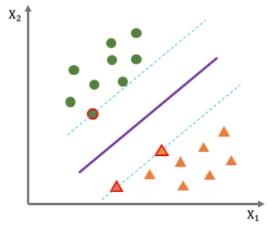

支持向量机的模型和逻辑回归一样：

$$h_\theta(x)=\frac{1}{1+e^{-\theta^Tx}}=P(y=1|x;\theta)$$

使 $h_\theta(x)=0.5$，即决策边界为 $\theta^Tx=0$

决策超平面就是决策边界，样本到决策边界的距离根据点到平面距离表示为：

$$r=\frac{\theta^Tx}{||\theta^T||}$$

> $||\theta^T||$ 表示 $\theta$ 的欧氏长度，即它的模

对于训练集，假设决策边界两侧距最近的两类样本之间的距离为 $d$，则对于训练集的所有样本，决策边界应该满足以下条件：

$$\begin{cases}
\frac{\theta^Tx^{(i)}}{||\theta^T||}\le d & y^{(i)}=-1\\
\frac{\theta^Tx^{(i)}}{||\theta^T||}\ge d & y^{(i)}=1\end{cases}$$

由于 $||\theta^T||$ 和 $d$ 都为标量，在不改变 $\theta$ 方向的基础上，可以得到任意的 $||\theta^T||$， 因此令 $d=\frac{1}{||\theta||}$，化简后得到：

$$\begin{cases}
\theta^Tx^{(i)}\le -1 & y^{(i)}=-1\\
\theta^Tx^{(i)}\ge 1 & y^{(i)}=1\end{cases}$$

$$y^{(i)}(\theta^Tx^{(i)})\ge 1$$

最优 $\theta$ 要使决策边界满足以上条件，则目标为：

$$\min\limits_{\theta} \sum\limits^m_{i=1}(1-y^{(i)}(\theta^Tx^{(i)}))$$

最优 $\theta$ 要使 $d=\frac{1}{||\theta||}$ 最大化，则目标为：

$$\min\limits_{\theta} \sum\limits^j_{n=1}\theta_n^2$$

综合以上两个最优 $\theta$ 的目标：

$$\min\limits_{\theta} C\sum\limits^m_{i=1}(1-y^{(i)}(\theta^Tx^{(i)}))+\frac{1}{2}\sum\limits^n_{j=1}\theta_j^2$$

> $C$ 是控制满足决策边界条件的重要性的参数，一般选用较大的值
> $\frac{1}{2}$ 系数是为了让 $\sum\limits^n_{j=1}\theta_j^2$ 便于求导

$C$ 如果选用太大的值，模型容易低偏差高方差，选用太小的值，模型容易高偏差低方差

通过拉格朗日乘子法可以实现目标求得 $\theta$ 的最优解

#### 核函数
**核函数（Kernel）** 用于为样本构造更复杂的高维度特征，再使用支持向量机模型得到非线性的决策边界，完成更复杂的分类任务

$f_j$ 表示使用核函数基于 $x$ 构造得到的第 $j$ 个新特征，新特征数目为 $N$，则用 $N+1$ 维度的向量 $f$ 表示，其中 $f_0$ 恒为 1

支持向量机模型中的 $\Theta^Tx$ 则更新为 $\Theta^Tf$：

$$h_\theta(x)=\frac{1}{1+e^{-\theta^Tf}}$$

**高斯核函数** 的实现为：预选定 $N$ 个标记点 ${l^{(1)},\dots,l^{(N)}}$，新特征 $f_j$ 则由 $x$ 和第 $j$ 个标记点的近似程度来表示：

$$f_j=\text{similarity}(x,l^{(j)})=k(x,l^{(j)})=e^{(-\frac{||x-l^{(j)}||^2}{2\sigma^2})}$$

> $||x-l^{(j)}||^2$ 表示欧氏距离的平方，$\sum\limits^n_{k=1}(x_k-l^{(j)}_k)^2$
> $\sigma^2$ 表示高斯核参数

当样本 $x$ 距离标记点 $l^{(j)}$ 之间的距离很近时，则 $f_j \approx 1$，当距离很远时，则 $f_j \approx 0$

高斯核参数 $\sigma^2$ 越小时，$f_j$ 的值随着样本 $x$ 距离标记点 $l^{(j)}$ 之间的距离变化而变化越快，模型容易低偏差高方差；反之变化越慢，模型容易高偏差低方差

对于标记点的选取，一般是使用训练集的所有样本作为标记点，即选取个 $m$ 标记点，并且 $l^{(j)}=x^{(j)}$

使用了高斯核函数后的支持向量机目标为：

$$\min\limits_{\theta} C\sum\limits^m_{i=1}(1-y^{(i)}(\theta^Tf^{(i)}))+\theta^TM\theta$$

> $\frac{1}{2}\sum^n_{j=1}\theta_j^2$ 项被优化为 $\theta^TM\theta$，其中 $M$ 是一个根据核函数而选择的不同的矩阵，可以简化计算

核函数的思想理论上可以应用于其他模型，但由于无法选择合适的 $M$ 来简化计算，因此计算会非常耗时，导致核函数只合适应用于支持向量机

#### 支持向量机应用
实际的支持向量机实现中，$\Theta$ 的计算可以通过库来解决，以下是需要自行决定的：
- 参数 $C$ 的选择
- 核函数的选择
- 若选择高斯核函数，则需要选择 $\sigma^2$，并对样本的原特征进行特征缩放和均值归一化

核函数类型：
- 无核函数，即线性核函数
- 高斯核函数
- 其他少用的核函数
    - 多项式核函数
    - 字符串核函数
    - 卡方核函数
    - 直方图交集核函数
    - 更多

不是所有核函数都是有效的，只有满足莫塞尔定理的核函数，也就是 $\frac{1}{2}\sum^n_{j=1}\theta_j^2$ 项能被优化为 $\theta^TM\theta$，才能被支持向量机库正确地进行数值优化处理，简化计算

使用支持向量机的进行多类分类和逻辑回归进行多类分类的方式一样
    
假设样本特征数为 $n$，样本数为 $m$，对于分类算法的选择：
- $n$ 相对于 $m$ 来说很大，使用逻辑回归或无核函数的支持向量机
- $n$ 较小，$m$ 中等（如 n<1000，m<100000），使用高斯核函数的支持向量机
- $n$ 较小，$m$ 较大（如 n<1000，m>500000），增加特征后使用逻辑回归或者使用无核函数的支持向量机
- 神经网络适用于以上所有情况，但训练速度比较慢

尽量选择支持向量机的原因主要在于它的代价函数是凸函数，不存在局部最小值

### 决策树
**决策树（Descision Tree）** 是通过树结构来进行决策，以完成分类和回归任务的，根据完成的任务不同决策树可分为 **分类树（Classification Tree）** 和 **回归树（Regression Tree）**

决策树的结构，包含一个根点、若干个内部节点和叶结点，每个内部结点对应一个特征判断，每个叶结点对应一个决策结果，整颗决策树可以看作一组 if-then 规则的集合，以 $T(x)$ 表示

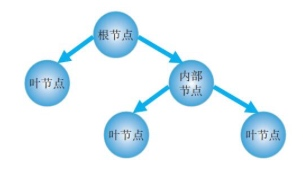

决策树的算法主要有以下三个：

| 算法 | 学习任务 | 特征选择 | 生成树结构 |
| --- | --- | --- | --- |
| ID3 | 分类 | 信息增益 |多叉树 | 
| C4.5 | 分类 | 信息增益率 |多叉树 | 
| CART | 分类和回归 | 基尼系数 |二叉树 | 

决策树构造是通过多次递归完成的，每次递归都会接收一个样本集，当前递归的过程会决定下一次递归的样本集或停止递归，所有递归完成，则得到决策树 $T(x)$

对于分类树构造，其每次递归的过程分为：
- 最优划分属性选择，CART 算法还要进行最优二值划分点选择
- 分枝生成
- 剪枝处理

分类树所形成的决策边界是轴平行的，要使决策边界符合真实的复杂情况，则需要实现多变量决策树

多变量分类树中，每个内部结点不再是简单的单个特征判断，而是一个多特征组合判断的分类器，如逻辑回归模型 $\sum\limits_{j=0}^n\theta_jx_j$

#### 最优划分属性选择
在信息论中，**熵（Entropy）** 是表示随机变量不确定性的度量，假设当前样本集合 $D$ 中第 $k$ 类样本所占的比例为 $p_k\ (k=1,\dots,K)$，则 $D$ 的熵表示为：

$$H(D)=-\sum\limits^{K}_{k=1}p_k\log_2p_k$$

> $H(D)$ 越小，则样本集合 $D$ 的不确定性越低

**条件熵（Condition）** 是表示随机变量在随机条件下的不确定性的度量，对于离散属性 $a$ 有 $V$ 个可能取值 $\{a^1,\dots,a^V\}$，$D^v$ 表示在属性 $a$ 上取值为 $a^v$ 的样本集合，$|D|$ 表示样本集合 $D$ 的样本数，则 $D$ 在 $a$ 下的条件熵表示为：

$$H(D|a)=\sum\limits^{V}_{v=1}p_vH(D|a=a^v)=\sum\limits^{V}_{v=1}\frac{|D^v|}{|D|}H(D^v)$$

则属性 $a$ 对于样本集合 $D$ 进行划分后的 **信息增益（Imformation Gain）** 为：

$$\text{Gain}(D,a)=H(D)-H(D|a)=H(D)-\sum\limits^{V}_{v=1}\frac{|D^v|}{|D|}H(D^v)$$

> $\text{Gain}(D,a)$ 越大，表示使用 $a$ 属性来进行划分后所得到的信息增益最大，即集合 $D$ 的不确定性的降低程度地越高

ID3 算法的最优划分属性选择是基于信息增益的，其目标为：

$$\max\limits_{a}\ \text{Gain}(D,a)$$

实际上，基于信息增益对可取值数目较多的属性有偏好，容易导致过拟合问题，因此可以使用 **增益率（Gain Retio）**：

$$\text{Gain_ratio}(D,a)=\frac{\text{Gain}(D,a)}{H_a(D)}$$

> $H_a(D)$ 表示 $D$ 中 $a$ 属性的熵，$H_a(D)=-\sum\limits^{V}_{v=1}p_v\log_2p_v=-\sum\limits^{V}_{v=1}\frac{|D^v|}{|D|}\log_2\frac{|D^v|}{|D|}$，当 $V$ 越大则 $H_a(D)$ 越大

C4.5 算法的最优划分属性选择是基于增益率的，其目标为：

$$\max\limits_{a}\ \text{Gain_ratio}(D,a)$$

在 CART 算法中，使用 **基尼值（Gini）** 代替信息熵来表示随机变量不确定性的指标：

$$\text{Gini}(D)=\sum\limits^{\Upsilon}_{k=1}\sum\limits_{j\ne k}p_kp_j=1-\sum\limits^{\Upsilon}_{k=1}p_k^2$$

$\text{Gini}(D)$ 反映了从数据集合 $D$ 中随机抽取两个样本，两者不属于同一类的概率，因此 $\text{Gini}(D)$ 越小，数据集合 $D$ 的不确定性越低

数据集合 $D$ 使用属性 $a$ 中的 $a^s$ 点进行二分划分后分割成 $D_1$ 和 $D_2$ 两部分，其 **基尼系数（Gini Index）** 为：

$$\text{Gini_index}(D,a^s)=\sum\limits^{2}_{r=1}\frac{|D_r|}{|D|}\text{Gini}(D_r)$$

> $\text{Gini_index}(D,a)$ 越小，表示使用 $a$ 属性来进行划分后的不确定性的越低

CART 决策树算法的最优划分属性以及最优二值划分点选择是基于基尼系数的，其目标为：

$$\min\limits_{a^s}\ \text{Gini_index}(D,a^s)$$

在二类分类问题中，熵之半、基尼系数、分类误差率用于相似的曲线，前两者都可以近似地代表分类误差率

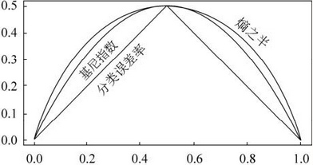

#### 分枝生成和剪枝处理
使用 ID3、C4.5 算法的分枝生成过程：
1. 为样本集 $D$ 生成结点 $\text{Node}$
2. 如果 $D$ 中只存在一个分类，则标记 $\text{Node}$ 为该分类的叶结点，停止递归
3. 如果属性集 $A$ 为空或 $D$ 在 $A$ 所有属性上取值相同，则标记 $\text{Node}$ 为样本数最多的分类的叶结点，停止递归
4. 从属性集 $A$ 中选择最优划分属性 $a$
5. 迭代 $a$ 中的每个 $a^v$
    1. 为 $\text{Node}$ 生成分枝，$D^v$ 为 $D$ 中 $a$ 属性为 $a^v$ 的子集
    2. 如果 $D_v$ 为空，标记分支为 $D$ 中样本数最多的分类的叶结点，否则传入 $D^v$ 继续递归
    
使用 CART 算法的分枝生成过程：

1. 为样本集 $D$ 生成结点 $\text{Node}$
2. 如果 $D$ 中只存在一个分类，则标记 $\text{Node}$ 为该分类的叶结点，停止递归
3. 如果属性集 $A$ 为空或 $D$ 在 $A$ 所有属性上取值相同，则标记 $\text{Node}$ 为样本数最多的分类的叶结点，停止递归
4. 从属性集 $A$ 中选择最优划分属性以及最优划分点 $a^s$
5. 为 $\text{Node}$ 生成分枝，$D_r$ 为 $D$ 根据 $a^s$ 划分的子集
6. 迭代每个 $D_r$
    1. 如果 $D_r$ 为空，标记分支为 $D$ 中样本数最多的分类的叶结点，否则传入 $D^r$ 继续递归

决策树构造过程中，由于不断根据数据生成分枝，很容易出现过拟合问题，剪枝处理是决策树解决过拟合的主要手段，其策略分为预剪枝和后剪枝

预剪枝是在决策树生成过程中，使用验证集对每个结点在划分前先进行评估，对于分类树，比较划分前后的验证集精度是否降低，若是则不划分并将当前结点标记为结点中样本数最多的分类的叶结点

> 若结点中样本最多的分类不唯一，则任选其中一类作为该结点的分类

后剪枝是对于已生成的决策树，使用验证集自底向上地对非叶结点进行评估，对于分类树，比较将结点对应子树替换为叶结点前后的验证集精度是否提高，若是则将该子树替换为子树中样本数最多的分类叶结点

#### 连续值和缺失值处理
当属性是连续属性时，可取值数目不再有限时，因此不能根据属性的可取值来对结点进行划分

C4.5 算法采用了 **二分法（bi-partition）** 对连续属性进行处理，假定连续属性 $a$ 在样本集合 $D$ 出现了 $n$ 个不同的取值，这些值从小到大排序后的集合为 $\{a^1,\dots,a^n\}$，则对于任意 $a^i$，划分点在 $[a^i,a^{i+1})$ 区间中取任意值对样本的划分结果相同

因此需要评估的候选划分点集合为：

$T_a=\big\{\frac{a^i+a^{1+1}}{2}|1\le i\le n-1\big\}$

对于最优划分属性选择的目标，C4.5 决策树算法要改造为：

$\max\limits_{a,t\in T_a}\ \text{Gain}(D,a,t)$

现实中的样本常会遇到某些属性值缺失的情况，如果直接放弃样本，是对数据信息的极大浪费

C4.5 算法通过 **概率权重（Probability Weights）** 来处理属性值缺失的样本

给定数据集合 $D$ 和属性 $a$，$\tilde{D}$ 表示 $D$ 中在属性 $a$ 上没有缺失值的子集，$\tilde{D}^v$ 表示 $\tilde{D}$ 在属性 $a$ 上取值为 $a^v$ 的子集，$\tilde{D}_k$ 表示 $\tilde{D}$ 中属于第 $k$ 类 $(k=1,\dots,\Upsilon)$ 的子集

在决策树学习开始前，为根结点各样本的权重 $w_x$ 初始化为 1，并定义：

$\tilde{D}$ 对于 $D$ 的权重占比：$\rho=\frac{\sum_{x\in \tilde{D}}w_x}{\sum_{x\in D}w_x}$

$\tilde{D}_k$ 对于 $\tilde{D}$ 的权重占比：$\tilde{p}_k=\frac{\sum_{x\in \tilde{D}_k}w_x}{\sum_{x\in \tilde{D}}w_x}$

$\tilde{D}^v$ 对于 $\tilde{D}$ 的权重占比：$\tilde{r}_v=\frac{\sum_{x\in \tilde{D}^v}w_x}{\sum_{x\in \tilde{D}}w_x}$

对于最优划分属性选择，C4.5 决策树算法要进行以下改造：

$\text{Ent}(\tilde{D})=-\sum\limits^{\Upsilon}_{k=1}\tilde{p}_k\log_2\tilde{p}_k$

$\text{Gain}(D,a)=\rho\times\text{Gain}(\tilde{D},a)=\rho\times\big(\text{Ent}(\tilde{D})-\sum\limits^{V}_{v=1}\tilde{r}_v\text{Ent}(\tilde{D}^v)\big)$

对于决策树生成，若样本 $x$ 在划分属性 $a$ 上的取值未知，则将 $x$ 同时划入所有子节点，且样本权重调整为 $\tilde{r}_v\times w_x$

#### 回归树
回归树是通过 CART 算法构造的，算法基于均方误差最小化选择最优切分点，通过递归预定的次数完成

每次递归都是为了切分样本集，即生成分枝，需要选择最优的切分样本和切分点，过程为：

若选择第 $j$ 个样本 $x^{(j)}$ 和其取值 $s$ 作为切分样本和切分点，因此能定义出两个区域：

$$\begin{cases}R_1(j,s)=\{x|x^{(j)}\le s\}\\
R_2(j,s)=\{x|x^{(j)}\ > s\}\end{cases}$$

通过最小化均方误差来选择最优切分点，因此对于每个区域中单个样本，其损失函数为：

$$L((x^{(i)},y^{(i)}),c_n)=(y^{(i)}-T(x^{(i)}))^2$$

对于每个区域中所有样本，其代价函数为：

$$J(j,s,n)=\frac{1}{2|R_n(j,s)|}\sum\limits_{x^{(i)}\in R_n(j,s)}(y^{(i)}-T(x^{(i)}))^2$$

定义 $c_n=T(x),x\in R_n$，表示切分后区域 $R_n$ 的预测输出，代价函数 $J(j,s,n)$ 可表示为 $J(c_n)$，使得其最小化的最优预测输出 $\bar{c_n}$ 为：

$$\bar{c_n}=\frac{1}{|R_n(j,s)|}\sum\limits^{|R_n(j,s)|}_{i=1}y^{(i)}$$

两个切分后区域的联合总目标为：

$\min\limits_{j,s}\big[\min\limits_{c_1}J(c_n)+\min\limits_{c_2}J(c_n)\big]=\min\limits_{j,s}\big[J(\bar{c_1})+J(\bar{c_2})\big]$

完成目标得到的最优切分样本和切分点，用作分枝的特征判断，最优预测输出则用作子结点是叶子结点时的输出

### 集成学习
**集成学习（Ensemble Learning）** 通过构建并结合多个学习器来完成学习任务，相比于单个学习器通常能得到更好的泛化性能或预测精度

假设个体学习器存在 "好而不同" 的特性，即多个分类精度大于 50% 且误差相对独立

比如将多个 "好而不同" 的弱学习器（分类精度稍大于 50%）组合起来采用投票法选择分类结果，当少数学习器出现错误时，也可以通过多数学习器来纠正，因此得到了更好的泛化性能，并且个体学习器数目越多，效果越好

集成学习的一般结构是先产生一组个体学习器，然后用某种策略将它们组合起来

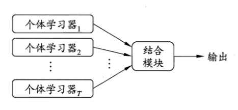

根据个体学习器的生成方式，集成学习的集成方法可以分为两类： 
- 序列化集成方法，个体学习器之间存在强依赖关系，必须串行生成，代表有 **Boosting**
- 并行化集成方法，个体学习器之间不存在强依赖关系，可以并行生成，代表有 **Bagging** 和 **Stacking**

根据个体学习器的基础模型，集成学习可以分为两类： 
- 同质集成，个体学习器使用相同的基础模型，如 Boosting、Bagging
- 异质集成，个体学习器使用不同的基础模型，如 Stacking

Boosting 是通过迭代生成基学习器以优化代价函数，由于各个基学习器之间强相关，因此无法降低方差，主要关注的是降低偏差，提高拟合精度，适合二类分类任务

> 但其中的 XGBoost 通过正则化来降低了方差，提高了泛化能力

Bagging 是通过对多个相对独立的基学习器的预测结果平均化，由于独立基学习器之间的偏差相似，因此无法降低偏差，主要关注的是降低方差，提高泛化能力，适合多类分类、回归任务

Stacking 是通过对多种单体学习器进行混合后，既能够提高拟合精度，并且保证了泛化能力，拥有很高的模型性能度量，但计算量非常大

#### Bosting
Boosting 表示提升，是一族通过迭代生成基学习器来优化代价函数，可以将弱学习器提升为强学习器的算法，该族算法常见有 **AdaBoost**、**提升树（Boosting Tree）**、**梯度提升树（GDBT）**、**XGBoost**

##### AdaBoost
AdaBoost 表示自适应提升，其加法模型的工作机制为：
- 从初始训练集训练出一个基学习器
- 根据基学习器的表现对训练集样本权重分布进行调整，使得先前基学习器做错的样本在后续受到更多关注，然后基于调整后的样本分布来训练下一个基学习器
- 直至基学习器数目达到事先指定的值，最终将这些基学习器进行加权结合

加法模型表示为基学习器的线性组合，其中的基学习器是弱分类器：

$$H_T(x)=\sum\limits^T_{t=1}a_th_t(x)$$
> $H_T(x)$ 表示由 $T$ 个基学习器集成的模型
> $h_t$ 表示第 $t$ 个基学习器
> $a_t$ 表示第 $t$ 个基学习器的权重

通过前向分步算法，计算使得 $H_t(x)$ 代价函数最小化的基学习器 $h_t$ 的最优权重 $a_t$，已经迭代生成了 $t$ 个基学习器并集成得到的 $H_t(x)$ 表示为：

$$H_t(x)=H_{t-1}(x)+a_th_t(x)$$

对于分类任务的模型，其基学习器模型使用近似符号函数作为激活函数：

$$h(x)=\begin{cases}1 & 正类\\
0 & 任意类\\ -1 & 反类\end{cases}$$
> 符号函数 $\text{sign}(z)$ 当 $z>0$ 其值为 1；当 $z<0$ 则值为 -1；当 $z=0$ 则值为 0

使用近似指示函数来表示 $H_t(x)$ 对于单个样本的损失函数：

$$L(H_t,(x^{(i)},y^{(i)}))=I(H_t(x^{(i)})\ne y^{(i)})\le e^{-y^{(i)}H_t(x^{(i)})}$$
> 其中 $I(z)$ 表示指示函数，当 $z$ 条件符合是值为 1，否则值为 0

$H_t(x)$ 对于所有样本的代价函数为：

$$\begin{array}\ J(H_t)&=\sum\limits_{i=1}^mL(h_t,(x^{(i)},y^{(i)}))\\
&=\sum\limits_{i=1}^me^{-y^{(i)}H_t(x^{(i)})}\\
&=\sum\limits_{i=1}^me^{-y^{(i)}(H_{t-1}(x^{(i)})+a_th_t(x^{(i)}))}\\
&=\sum\limits_{i=1}^me^{-y^{(i)}H_{t-1}(x^{(i)})}e^{-y^{(i)}a_th_t(x^{(i)})}\end{array}$$

由于 $e^{-y^{(i)}H_{t-1}(x^{(i)})}$ 为常量，定义为 $\tilde{w}_{t,i},t>1$，表示第 $i$ 个样本在代价函数 $J(H_t)$ 中的权重，则目标可简化为：

$$\min\limits_{a_t}\ \sum\limits_{i=1}^me^{-y^{(i)}a_th_t(x^{(i)})}$$

计算 $h_t$ 的误差率 $\epsilon_t$，即存在 $m\epsilon_t$ 个样本符合 $y^{(i)}h_t(x^{(i)})=-1$，$m(1-\epsilon_t)$ 个样本符合 $y^{(i)}h_t(x^{(i)})=1$，目标可再简化为：

$$\min\limits_{a_t}\ m\epsilon_te^{-a_t}+m(1-\epsilon_t)e^{a_t}=m(\epsilon_te^{-a_t}+(1-\epsilon_t)e^{a_t})$$

实现最小化目标，令 $\frac{\partial m(\epsilon_te^{a_t}+(1-\epsilon_t)e^{-a_t})}{\partial a_t}=0$，可得：

$$\begin{array}\ \epsilon_te^{a_t}-(1-\epsilon_t)e^{-a_t}&=0\\
a_t&=\frac{1}{2}\ln\frac{1-\epsilon_t}{\epsilon_t}\end{array}$$

计算用于训练 $h_t$ 的样本集权重分布 $D_t$：

若定义 $\tilde{w}_{t,i}=e^{-y^{(i)}H_{t-1}(x^{(i)})}$

通过前向分步算法得到：

$$\begin{array}\ \tilde{w}_{t+1,i}&=e^{-y^{(i)}H_t(x^{(i)})}\\
&=e^{-y^{(i)}H_{t-1}(x^{(i)})}e^{-y^{(i)}a_th_t(x^{(i)})}\\
&=\tilde{w}_{t,i}e^{-y^{(i)}a_th_t(x^{(i)})}\end{array}$$

样本的权重更新可以表示为：

$$\tilde{w}_{t+1,i}=\begin{cases}\tilde{w}_{t,i}e^{-a_t} & y^{(i)}=h_t(x^{(i)})\\
\tilde{w}_{t,i}e^{a_t} & y^{(i)}\ne h_t(x^{(i)})\end{cases}$$

由于 $a_t=\frac{1}{2}\ln\frac{1-\epsilon_t}{\epsilon_t}>0$，因此在代价函数中的样本权重更新满足，增大做对样本的权重，减小做错样本的权重

因此定义 $\tilde{w}_{t,i}=e^{-y^{(i)}H_{t-1}(x^{(i)})}$ 有效

而代价函数中的样本权重 $\tilde{w}_{t,i}$ 间的相对关系等价于样本集权重分布中 $w_{t,i}$ 间的相对关系，为了保证 $D_{t+1}$ 为一个分布，为 $w_{t+1,i}$ 的更新引入规范化因子 $Z_t$，则有：

$$w_{t+1,i}=\frac{w_{t,i}e^{-y^{(i)}a_th_t(x^{(i)})}}{Z_t}$$
> $w_{t,i}$ 表示第 $t$ 次训练时第 $i$ 个样本的权重
> $D_t$ 表示第 $t$ 次训练的训练集样本权重分布，$D_t=(w_{t,1},\dots,w_{t,m})$
> $Z_t$ 是规范化因子，$Z_t=\sum\limits^{m}_{i=1}w_{t,i}e^{-y^{(i))}a_th_t(x^{(i)})}$，以保证 $D_{t+1}$ 是一个分布，即 $\sum\limits^{m}_{i=1}w_{ti}=1$

对于分类模型，AdaBoost 算法过程为：
1. 初始化训练集样本权重分布 $D_1$，其中 $w_{1,i}=\frac{1}{m}$
2. 迭代 $t=1,\dots,T$
    1. 学习满足 $D_t$ 分布的训练集得到 $h_t$
    2. 计算 $h_t$ 的误差率 $\epsilon_t$，如果 $\epsilon_t>0.5$ 则退出
    3. 计算 $h_t$ 的权重 $a_t=\frac{1}{2}\ln\frac{1-\epsilon_t}{\epsilon_t}$，累加得到 $H_t$
    4. 计算 $D_{t+1}$，其中 $w_{t+1,i}=\frac{w_{t,i}e^{-y^{(i))}a_th_t(x^{(i)})}}{Z_t}$
3. 输出模型 $H_T$

##### 提升树
提升树是以 CART 决策树作为基学习器的 boosting 算法，可以用于分类和回归，分别对应使用二叉分类树和二叉回归树

加法模型可表示为决策树的线性组合，其中的决策树是弱分类器：

$$H_K(x) = \sum\limits_{k=1}^KT_k(x)$$

> $T_k(x)$ 表示第 $k$ 次迭代生成的决策树

通过前向分布算法，计算使 $H_k(x)$ 代价函数最小化的决策树 $T_k$，已经迭代生成了 $t$ 个决策树并集成得到的 $H_t(x)$ 表示为：

$$H_k(x)=H_{k-1}(x)+T_k(x)$$

对于回归任务，残差平方作为损失函数，即使用均方误差作为代价函数：

$$\begin{array}\ J(H_k)&=\frac{1}{2m}\sum\limits_{i=1}^mL(H_k,(x^{(i)},y^{(i)}))\\
&=\frac{1}{2m}\sum\limits_{i=1}^m(y^{(i)}-H_{k-1}(x^{(i)})-T_k(x^{(i)}))^2\end{array}$$

因此目标 $\min\limits_{T_k}\ J(H_k)$ 可以转化为：

$$T_k(x^{(i)})=y^{(i)}-H_{k-1}(x^{(i)})=r_{k,i}$$
> $r_{k,i}$ 表示当前模型对与第 i 个样本的误差残差

即生成拟合当前模型对于所有样本的残差的决策树 $T_k(x)$

回归任务的提升树算法过程为：
1. 初始化 $H_1(x)=0$
2. 迭代 $k=1,\dots,K$
    1. 计算当前模型对于每个样本的残差 $r_{k,i}$
    2. 拟合所有残差得到决策树 $T_k(x;)$
    3. 更新模型 $H_k(x)=H_{k-1}(x)+T_k(x)$
3. 得到提升树 $H_K(x)$

##### 梯度提升树
当模型不是用于回归任务，或者损失函数使用的不是残差平方，而使用对数函数或者其他函数，则无法通过拟合残差得到下一个最优的决策树

梯度提升树使用损失函数对于当前模型的负梯度，作为下一个的拟合目标，使得算法通用于所有损失函数

对于每个样本，根据梯度下降法，每次满足最快降低损失函数的模型更新公式为：

$$H_k(x^{(i)})=H_{k-1}(x^{(i)})-\frac{\partial L(H_{k-1},(x^{(i)},y^{(i)}))}{\partial H_{k-1}}$$

而根据前向分步算法，提升树的模型更新公式为：

$$H_k(x^{(i)})=H_{k-1}(x^{(i)})+T_k(x^{(i)})$$

要达到最快降低损失函数的目标，需要达到：

$$T_k(x^{(i)})=-\frac{\partial L(H_{k-1},(x^{(i)},y^{(i)}))}{\partial H_{k-1}}$$

梯度提升树算法过程为：
1. 初始化 $H_0(x)=c$，使得 $\min\limits_c\ \sum\limits^m_{i=1}L(c,(x^{(i)},y^{(i)}))$，即 $c=\frac{1}{m}\sum\limits^m_{i=1}y^{(i)}$
2. 迭代 $k=1,\dots,K$
    1. 计算当前模型对于每个样本的负梯度
    2. 拟合所有负梯度得到决策树 $T_k(x)$
    3. 更新模型 $H_k(x)=H_{k-1}(x)+T_k(x)$
3. 得到提升树 $H_K(x)$

##### XGBoost
XGBoost 表示极端梯度提升树，在梯度提升树的基础上，通过为代价函数增加正则化项，来降低模型的复杂度，从而得到更好的泛化能力

XGBoost 模型表示为：

$$H_K(x) = \sum\limits_{k=1}^KT_k(x)$$

回归树的复杂度表示：

$$\Omega(T) = \gamma N+\sum\limits^{N}_{n=1}\lambda w^2_n=\gamma N+\sum\limits^{N}_{n=1}\lambda T(x;x\in L_n)$$

> $\gamma$ 和 $\lambda$ 参数分别控制叶子结点的数目和权重对复杂度的影响程度
> $N$ 表示叶子结点的数目
> $L_n$ 表示第 $n$ 个叶子结点
> $w_n$ 表示第 $n$ 个叶子结点的权重，即其对应的值

XGBoost 复杂度可以表示为其子回归树复杂度的累加：

$$\Omega(H_K)=\sum\limits_{k=1}^K\Omega(T_k)$$

增加了正则化项来对模型的复杂度进行惩罚的代价函数为：

$$J(H_K)=\sum\limits_{i=1}^mL(H_K,(x^{(i)},y^{(i)}))+\Omega(H_K)$$

根据前向分布法，假设已经完成回归树 $T_k$ 的生成，代入代价函数：

$$J(H_k)=\sum\limits_{i=1}^mL(H_{k-1}+T_k,(x^{(i)},y^{(i)}))+\Omega(H_k)+\sum\limits_{j=1}^{k-1}\Omega(H_j)$$

对目标损失函数进行泰勒二阶展开，$H_{k-1}$ 看作 $x$，$T_k$ 看作 $\Delta x$：

$$L(H_{k-1}+T_k,(x^{(i)},y^{(i)}))\approx L(H_{k-1},(x^{(i)},y^{(i)}))+g_iT_k(x^{(i)})+\frac{1}{2}h_iT_k(x^{(i)})$$

> 泰勒展开是为了简化对非残差平方的损失函数的计算
> 泰勒二阶展开公式为 $f(x+\Delta x)\approx f(x)+f\prime(x)\Delta x+\frac{1}{2}f\prime\prime(x)\Delta x^2$
> 当前模型的损失函数为 $L(H_{k-1},(x^{(i)},y^{(i)}))$
> $g_i$ 表示当前模型的损失函数对于 $T_k$ 在第 $i$ 个样本上的一阶导数，$\frac{\partial L(H_{k-1},(x^{(i)},y^{(i)}))}{\partial T_k(x^{(i)})}$
> $h_i$ 表示当前模型的损失函数对于 $T_k$ 在第 $i$ 个样本上的二阶导数，$\frac{\partial^2 L(H_{k-1},(x^{(i)},y^{(i)}))}{\partial T_k(x^{(i)})^2}$

则生成 $T_k$ 的目标为：

$$\begin{array}
\min\ J(H_k)&\approx \sum\limits_{i=1}^m\big[L(H_{k-1},(x^{(i)},y^{(i)}))+g_iT_k(x^{(i)})+\frac{1}{2}h_iT_k(x^{(i)})\big]+\Omega(H_k)+\sum\limits_{j=1}^{k-1}\Omega(H_j) \\
&= \sum\limits_{i=1}^m\big[g_iT_k(x^{(i)})+\frac{1}{2}h_iT_k(x^{(i)})\big]\big]+\Omega(H_k)\\
&=\sum\limits_{i=1}^m\big[g_iT_k(x^{(i)})+\frac{1}{2}h_iT_k(x^{(i)})\big]\big]+\gamma N+\sum\limits^{N}_{n=1}\lambda w^2_n\\
&=\sum\limits^{N}_{n=1}\big[(\sum\limits_{x^{(i)}\in L_n}g_i)w_n+\frac{1}{2}(\sum\limits_{x^{(i)}\in L_n}h_i+\lambda)w_n^2\big]+\gamma N\end{array}$$

> $\sum\limits_{i=1}^mL(H_{k-1},(x^{(i)},y^{(i)}))$ 和 $\sum\limits_{j=1}^{k-1}\Omega(H_j)$ 为常数，可以忽略

由二次函数的最小值得到 $w_n$ 的最优取值：

$$\min\ (\sum\limits_{x^{(i)}\in L_n}g_i)w_n+\frac{1}{2}(\sum\limits_{x^{(i)}\in L_n}h_i+\lambda)w_n^2$$ 

即 $w_n=-\frac{\sum\limits_{x^{(i)}\in L_n}g_i}{\sum\limits_{x^{(i)}\in L_n}h_i+\lambda}$ 时，代价函数得到最小值：

$$J(H_k)=-\frac{1}{2}\sum\limits^{N}_{n=1}\frac{(\sum\limits_{x^{(i)}\in L_n}g_i)^2}{\sum\limits_{x^{(i)}\in L_n}h_i+\lambda}+\gamma N$$

$N$ 的最优取值，以及树的结构生成则按照回归树的 CART 生成算法进行

#### Bagging
Bagging 表示引导汇聚，是一族使基学习器的结果平均汇聚起来，对于分类结果使用投票法，对于回归结果使用平均法，以取得更好的泛化能力的算法

Bagging 族算法中的基础算法过程：
1. 使用自助采样法，从原本数据集中抽取包含 $m$ 个样本的训练集，再用这个训练集训练得到一个基学习器，
2. 反复进行直到基学习器数目达到事先指定的值
3. 对于分类和回归任务，分别将这些基学习器的结果采用投票法或平均法得到模型输出，每个基学习器的权重相同

**随机森林（Random Forest）** 是在使用 CART 决策树为基学习器构建 Bagging 集成，进一步在决策树的训练过程中引入了随机特征选择

随机森林算法为：
1. 使用自助采样法，从原本数据集中抽取包含 $m$ 个样本的训练集
2. 用这个训练集训练得到一个决策树，并且在选择划分特征时，先随机选择包含 $n$ 个特征的特征集，再从其中选择最优划分特征
3. 对于分类和回归任务，分别将这些基学习器的结果采用投票法或平均法得到模型输出，每个基学习器的权重相同

一般推荐 $n=\log_2|A|$，$|A|$ 表示特征数量

#### Stacking
Stacking 表示堆叠，是一种使个体学习器以学习法组合自来的算法

Stacking 算法为：
1. 迭代 $t=1,\dots,T$
    1. 使用不同的初级学习算法和训练集 $D$ 训练得到初级模型 $h_t$
2. 迭代 $i=1,\dots,m$
    1. 迭代 $t=1,\dots,T$
        1. 构造第 $i$ 个新样本 $z$ 的第 $t$ 个特征，$z^{(i)}_t=h_t(x^{(i)})$ 
3. 构造集合 $D\prime={((z^{(i)}_1,\dots,z^{(i)}_T),y^{(i)})}$
4. 使用次级学习算法和训练集 $D\prime$ 得到次级模型 $h\prime$

可以选用多响应线性回归作为次级学习算法效果较好

## 无监督学习
### K 均值
**K 均值（K-mean）** 以距离作为样本相似性度的标准，根据 $k$ 个点和样本间的距离，将样本集划分为 $k$ 个簇，而这些点又分别由簇内样本的均值所决定，最终完成聚类任务

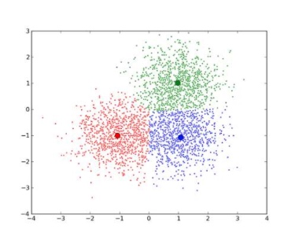

对于单个样本的损失函数为：

$$L(c^{(i)},\mu_c^{(i)},x^{(i)})= ||x^{(i)}-\mu_c^{(i)}||$$

> $c^{(i)}$ 表示样本 $x^{(i)}$ 所关联的聚类中心的编号，取值为 $1-K$
> $\mu_k$ 表示第 $k$ 个聚类中心
> $\mu_c^{(i)}$ 表示样本 $x^{(i)}$ 关联的聚类中心
> $x$ 为 $n$ 维向量，即不包含 $x_0$
> $||x^{(i)}-\mu_c^{(i)}||$ 表示欧式距离

对于所有样本的代价函数为：

$$J(c^{(1)},\dots,c^{(m)},\mu_1,\dots,\mu_K)= \frac{1}{m}\sum^m_{i=1}||x^{(i)}-\mu_c^{(i)}||$$

此代价函数也称为失真函数，或 K 均值算法的失真

K 均值算法的实现步骤：
1. 随机初始化聚类中心
    1. 确定 $K$ 的值，即目标的簇数目，使 $K<m$
    2. 随机选择 $K$ 个聚类中心，可以随机选择 $K$ 个样本，使聚类中心 $\mu_1,\dots,\mu_k$ 分别与这 $K$ 个样本相等
1. 重复直到每个聚类中心都不再变化
    1. 对每个样本进行簇分类，将其和欧式距离最近的聚类中心关联起来，关联到同一聚类中心的样本则为一个簇
    2. 对每个聚类中心进行移动，计算其簇内样本的平均点，并移动到该平均点

> 对于随机初始化选择的聚类中心，如果不存在任何样本关联，则直接移除掉该聚类中心，或者重新进行选择

重复步骤的目标：

$$\min\limits_{c^{(1)},\dots,c^{(m)},\mu_1,\dots,\mu_K}\ J(c^{(1)},\dots,c^{(m)},\mu_1,\dots,\mu_K)$$

簇分类是固定了 $\mu_1,\dots,\mu_K$，通过改变 $c^{(1)},\dots,c^{(m)}$ 来完成目标；移动聚类中心则固定了$c^{(1)},\dots,c^{(m)}$，通过改变 $\mu_1,\dots,\mu_K$ 来完成目标

如果以上两步都正常工作，那么每次重复步骤后，失真函数都会变小

通过多次（一般在 $50-1000$ 次）随机初始化聚类中心，训练得到模型，分别计算每个模型的失真函数，使用最小失真函数的对应模型，来避免 K 均值算法的局部最优解

以上方法在 $K$ 较小（一般在 $2-10$）时比较有效，因为更容易得到局部最优解，但如果 $K$ 较大，得到的结果就不会太差，因此这么做可能只会稍微地改善

选择聚类数 $K$，一般是通过人工观察可视化图像来选择，或者根据聚类的动机来选择（最推荐的选法）

也存在使用“肘部法则”来选择，即通过画出 $K$ 对应失真函数结果的图像，这个图像很像一个向右的手肘，失真函数结果随着 $K$ 增大而减小，选择关节位置失真函数开始下降变慢的 $K$

### 主成分分析
**主成分分析（PCA）** 是一种运用线性代数的知识来完成降维任务的方法，它将多个相关度高的维度转换为少数几个不相关的综合维度，来比较全面地反映整个数据集

这些包含信息量大的维度，称为主成分，各主成分之间彼此不相关，即所代表的的信息不重叠

降维的动机：
- 数据压缩，可以节约内存空间或磁盘空间需求，并且让算法运算得更快
- 数据可视化和去噪，便于观察数据，和寻找更好的解决方案

主成分分析实现将 $n$ 维数据降维 $k$ 维数据是：找到 $k$ 个方向向量，当所有的数据都投影到这些向量组成的空间上时，使得投影均方误差最小化，也就是数据的特征损失最小化

方向向量是一个经过原点的向量，而投影误差是从特征向量向该方向向量（向量组成的空间）作垂线的长度

主成分分析的目标可以有两种表达，但意义一致：
- 最小化投影误差
- 最大化投影后数据的方差

主成分分析与线性回归的区别：
- 线性回归最小化的是预测误差，用来预测结果
- 主成分分析最小化的是投影误差，不作任何预测

主成分分析算法的步骤：
1. 数据预处理，进行特征缩放和均值归一化
2. 计算 **协方差矩阵（covariance matrix）** $\sigma=\frac{1}{m}\sum\limits^m_{i=1}(x^{(i)})(x^{(i)})^T$，是一个 $n\times n$ 维度的矩阵
3. 计算 $\sigma$ 的 **特征向量（eigenvectors）**
    1. 通过 **奇异值分解（SVD）** 来得到左奇异变量 $U$，它是一个具有与数据之间最小投影误差的方向向量构成的矩阵，每一行表示一个基的变换，每一列表示一个变换后的维度，也是一个 $n\times n$ 矩阵
    2. 将数据从 $n$ 维降至 $k$ 维，只需要从 $U$ 中选取前 $k$ 个向量，获得一个 $n\times k$ 矩阵，使用 $U_r$ 表示
    3. 计算新特征向量 $z^{(i)}$：$z^{(i)}=U_r^Tx^{(i)}$，结果是一个 $k\times 1$ 向量

通过直接评估方差损失来选择降维目标维度 $k$：
1. 计算样本集总方差 $\frac{1}{m}\sum^m_{i=1}||x^{(i)}||^2$

2. 计算平均投影误差（也可以看为投影后丢失的方差 $\frac{1}{m}\sum^m_{i=1}||x^{(i)}-x_{approx}^{(i)}||^2$
   
3. 一般来说，在保证平均投影误差不超过原数据总方差的 1% 的情况下选择尽量小的 $k$，也就是保留 99% 的原数据总方差：

   $\frac{\frac{1}{m}\sum^m_{i=1}||x^{(i)}-x_{approx}^{(i)}||^2}{\frac{1}{m}\sum^m_{i=1}||x^{(i)}||^2}\le0.01$
   
  可以从 $k=1$ 开始，逐渐增大 $k$ 的值，直到不满足保留 99% 的原数据总方差，然后 $k$ 的选择就是上一个值
  
也可以通过奇异值分解（SVD）得到的右奇异变量 $S$ 来评估方差选择降维目标维度 $k$：
1. $S$ 是一个 $n\times n$ 矩阵，左上对角线的值奇异值，$S_{ii}$ 表示第 $i$ 个方向向量对于协方差矩阵的主要程度，其他项都为 0
2. 平均投影误差不超过原数据总方差的 1% 可以这样表示：

    $\frac{\frac{1}{m}\sum^m_{i=1}||x^{(i)}-x_{approx}^{(i)}||^2}{\frac{1}{m}\sum^m_{i=1}||x^{(i)}||^2}=1-\frac{\sum^k_{i=1}S_{ii}}{\sum^m_{i=1}S_{ii}}\le0.01$

将 PCA 用于为监督学习计算加速的步骤：
1. 对训练集的样本 $(x,y)$ 降维后获取新的样本 $(z,y)$
2. 训练得到模型 $h_\theta(z)$
3. 将验证集、测试集或新样本 $x$ 转化为 $z$，代入 $h_\theta(z)$ 得到预测结果

PCA 的应用误区：
- 用于减少了特征数量来防止过拟合，原因在于 PCA 只是近似地丢弃掉一些特征，并不考虑任何与结果变化有关的信息，因此可能会丢失非常重要的特征。应该使用正则化来代替，正则化会考虑到结果变化，不会丢掉重要的信息
- 作为学习过程中的一部分，最好还是从所有原始特征开始，只在有必要的时候（算法运行太慢或者占用太多内存）才考虑使用

### 离群点检测
**离群点检测（Outlier Detection）** 假设正常数据服从同一分布，通过包含离群点的训练数据，模型会尝试拟合出训练数据中内围点聚集的区域, 忽略有偏离的观测值

模型根据新样本和正常数据服从的同一分布的可能性，来预测其新样本是否为离群点，即是否异常，这种判断方法称为密度估计，表达如下：

$$p(x)\begin{cases}>\epsilon & 正常\\
\ge\epsilon & 异常\end{cases}$$
> $\epsilon$ 是定义的可能性阈值

离群点检测可以用于异常检测，主要是通过找出与正常数据差异较大的离群点，把离群点作为异常点，应用于用户欺诈行为检测、服务器检测、产品质量检测等场景

离群点检测和监督学习的使用场景区别：

| 离群点检测 | 监督学习 |
| --- | --- |
| 正类样本相对非常少 | 正反类样本都很多 |
| 异常的可能性很多，正类样本无法囊括 | 正类样本很多，基本囊括了异常的可能性 |
| 欺诈行为检测、服务器检测、质量检测 | 邮件过滤器、天气预报、肿瘤分类 |

#### 基于高斯分布
**高斯分布（Gaussian distribution）** 又称为 **正态分布（Normal distribution）**，假设训练集中的正常样本 $x$ 服从高斯分布，记为：

$$x\text{~}N(\mu,\sigma^2)$$
> $\mu$ 表示均值，$\mu=\frac{1}{m}\sum^m_{i=1}x^{(i)}$
> $\sigma^2$ 是方差，$\sigma^2=\frac{1}{m}\sum^m_{i=1}(x^{(i)}-\mu)^2$，$\sigma$ 是标准差

且 $x$ 的概率密度函数为：

$$p(x;\mu,\sigma^2)=\frac{1}{\sqrt{2\pi\sigma}}exp(-\frac{(x-\mu)^2}{2\sigma^2})$$

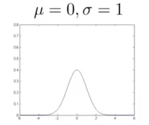

若 $x\text{~}N(\mu,\sigma^2)$，则 $x$ 的每个特征 $x_1,\dots,x_n$ 都服从高斯分布 $x_n\text{~}N(\mu_n,\sigma_n^2)$

$$\begin{array}p(x;\mu,\sigma^2)&=p(x_1;\mu_1,\sigma_1^2)p(x_2;\mu_2,\sigma_2^2)\dots p(x_n;\mu_n,\sigma_n^2)\\
&=\prod^n_{j=1}p(x_j;\mu_j,\sigma_j^2)\end{array}$$ 

基于高斯分布的离群点检测算法步骤：
1. 定义概率阈值 $\epsilon$ 
2. 选择和样本异常相关的特征
3. 计算得到这些特征服从高斯分布的参数 $\mu_1,\dots,\mu_n,\sigma_1^2,\dots,\sigma_n^2$
4. 计算新样本服从训练集的高斯分布的概率 $p(x)=\prod^n_{j=1}p(x_j;\mu_j,\sigma_j^2)$，若 $p(x)<\epsilon$ 则异常

离群点检测是无监督学习，但对于该模型评估的验证集和测试集却需要带标记的样本：
1. 无监督学习得到模型
2. 使用带标记的验证集评估模型和选择 $\epsilon$ 
    1. 区分验证样本的真正类、假正类、假反类、真反类 
    2. 计算查准率和召回率
    3. 选择使得 $F_1$ 值最大化的 $\epsilon$ 
3.  使用带标记的测试集评估模型，量化性能度量

> 验证集和测试集分别划分 50% 已知标记异常的样本

基于高斯分布的离群点检测是假设所有特征服从高斯分布，如果特征表现不服从高斯分布，虽然算法能够工作，但为了最好的效果还是需要转换成服从高斯分布

一般非高斯分布特征 $x_n$ 可以通过对数函数 $\log(x_n+c)$ 或指数函数 $x_n^{\frac{1}{c}}$ 转换成高斯分布

模型的预测结果，目标是异常样本的 $p(x)$ 能较大，而正常样本的 $p(x)$ 较小

若异常样本的 $p(x)$ 相对 $p(x)$ 不够大，那么需要选取或组合新特征，对于异常样本来说，该新特征值会较大地波动，使异常样本能从正常样本中区分出来

#### 基于多元高斯分布
在特征的值域范围比较宽的情况下，一般的基于高斯分布模型由于是尝试同时抓住所有特征的偏差，会创造出一个比较大的判定边界，因此可能不能很好地识别异常数据

当 $x$ 服从多元高斯分布，记为：

$$x\text{~}N(\mu,\Sigma)$$
> $\mu$ 是均值，$\mu=\frac{1}{m}\sum^m_{i=1}x^{(i)}$
> $\Sigma$ 是协方差矩阵，$\Sigma=\frac{1}{m}\sum^m_{i=1}(x^{(i)}-\mu)(x^{(i)}-\mu)^T$

其概率密度函数为：

$$p(x;\mu,\Sigma)=\frac{1}{(2\pi)^{\frac{n}{2}}|\Sigma|^{\frac{1}{2}}}exp(-\frac{1}{2}(x-\mu)^T\Sigma^{-1}(x-\mu))$$
> $|\Sigma|$ 是协方差矩阵的行列式

$\Sigma$ 左上斜对角线的值 $\Sigma_{nn}$ 的值越大，特征 $x_n$ 的方差越大，概率密度下降速度越缓慢；非对角线上的值 $\Sigma_{ij}$ 或 $\Sigma_{ji}$ 则表示特征 $x_i$ 和特征 $x_j$ 的概率密度相关程度

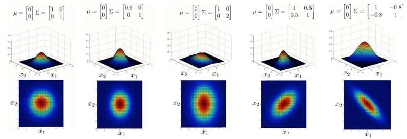

从左往右依次分析上图 5 个不同的模型：
1. 是一个一般的高斯分布模型
2. 通过协方差矩阵，令特征 $x_1$ 拥有较小的方差，同时保持特征 $x_2$ 的偏差
3. 通过协方差矩阵，令特征 $x_2$ 拥有较大的方差，同时保持特征 $x_1$ 的偏差
4. 通过协方差矩阵，在不改变两个特征的原有方差的基础上，增加两者之间的正相关性
5. 通过协方差矩阵，在不改变两个特征的原有方差的基础上，增加两者之间的负相关性

一般高斯分布是轴对称的，无法表现特征间的相关性，因此当一个多元高斯分布的 $\Sigma$ 非对角线上的值都为 0，这个多元高斯分布就是一般高斯分布，此时每个 $\Sigma_{nn}$ 就等于一般高斯分布中的 $\sigma_n^2$

一般高斯分布和多元高斯分布的区别：

| 一般高斯分布 | 多元高斯分布 |
| --- | --- |
| 不能捕捉特征之间的相关性 可通过将组合特征来解决 | 自动捕捉特征之间的相关性 |
| 计算代价低，能适应大规模的特征 | 由于协方差矩阵 $\Sigma$，计算代价较高 |
| $m$ 较小时仍然可以有效 | 必须 $m>n$，否则协方差矩阵 $\Sigma$ 不可逆，通常需要 $m>10n$；存在冗余特征（特征线性相关）时也不可逆 |

## 模型评估
### 回归指标
**残差（Residual）** 指单个样本的模型预测和输出的差值

$$r_i = h(x^{(i)})-y^{(i)}$$

**均方误差（MSE, Mean Square Error）** 是所有样本的残差平方均值，用于描述回归模型预测误差，通过平方的形式便于求导，常被用作损失函数

$$\text{MSE}=\frac{1}{m}\sum\limits^m_{i=1}(h(x^{(i)})-y^{(i)})^2$$

**均方根误差（RMSE, Root Mean Square Error）**  是均方误差的开根，用于描述回归模型预测误差，更贴近数据便于描述结果

$$\text{RMSE}=\sqrt{\text{MSE}}=\sqrt{\frac{1}{m}\sum\limits^m_{i=1}(h(x^{(i)})-y^{(i)})^2}$$

**平均绝对误差（MAE, Mean Absolute Error）** 是所有样本的残差绝对差值均值，用于描述回归模型预测误差，更好地反映模型预测误差的实际情况

$$\text{MAE}=\frac{1}{m}\sum\limits^m_{i=1}|h(x^{(i)})-y^{(i)}|$$

MSE 和 RMSE 会对较大的样本残差（$> 1$）进行放大，如果样本集中存在异常样本，则会导致这两个值比较大；MAE 会将所有的残差平均化，更贴近实际情况

MSE 和 RMSE 适合描述异常样本较少的样本集，而 MAE 反之，对于模型训练，MSE 和 RMSE 更适合，因为这两个值较小，则代表了样本存在的最大残差也是较小的

**决定系数（R2）** 是 MSE 的标准化版本，正常值范围在 $[0,1]$，用于描述模型预测性能，并且标准化后更好地量化描述，即表示模型拟合样本集的程度

$$\begin{array}\ TSS&=\sum\limits^m_{i=1}(y^{(i)}-\overline{y})^2\\
&=\sum\limits^m_{i=1}(y^{(i)}-h(x^{(i)}))^2+2\sum\limits^m_{i=1}(h(x^{(i)})-y^{(i)})(h(x^{(i)})-\overline{y})+\sum\limits^m_{i=1}(h(x^{(i)})-\overline{y})^2\\
&=\sum\limits^m_{i=1}(h(x^{(i)})-y^{(i)})^2+\sum\limits^m_{i=1}(h(x^{(i)})-\overline{y})^2\\
&=ESS+RSS\end{array}$$

> TSS 是样本的输出和平均输出的差值平方和
> ESS 是样本的模型预测和平均输出的差值平方和
> RSS 是样本的残差平方和
> $\overline{y}$ 是样本的输出均值 $\overline{y}=\frac{1}{m}\sum\limits^m_{i=1}y^{(i)}$
> $2\sum\limits^m_{i=1}(h(x^{(i)})-y^{(i)})(h(x^{(i)})-\overline{y})$ 当 RSS 达到最小值时，即达到最小二乘法的目标，可证明等于 0

$$\begin{array}\ R^2&=\frac{ESS}{TSS}=\frac{\sum\limits^m_{i=1}(h(x^{(i)})-\overline{y})^2}{\sum\limits^m_{i=1}(y^{(i)}-\overline{y})^2}\\
&=1-\frac{RSS}{TSS}=1-\frac{\sum\limits^m_{i=1}(h(x^{(i)})-y^{(i)})^2}{\sum\limits^m_{i=1}(y^{(i)}-\overline{y})^2}\end{array}$$

> R2 越接近 1，表示样本的模型预测和输出相关性越高，则预测性能越好

### 分类指标
根据样本的标记和预测，对样本集进行以下划分：

| 预测/标记 | 1 | 0 |
| --- | --- | --- |
| 1 | 真正类（TP） | 假正类（FP） |
| 0 | 假反类（FN） | 真反类（TN） |

**精度（Accuracy）** 或称为 **准确率**，反映模型预测的准确程度：

$$\text{Accuracy}=\frac{TP+TN}{TP+FP+FN+TN}$$

**查准率（Precision）** 反映预测为正类的样本的精度，即预测为正类的样本中，是真的正类样本的概率

$$\text{Precision}=\frac{TP}{TP+FP}$$

**召回率（Recall）** 反映标记为正类的样本的精度，即标记为正类的样本中，是被预测为正类样本的概率

$$\text{Recall}=\frac{TP}{TP+FN}$$

当分类偏斜时，即样本集中的正类要比反类的比例小得多，会导致模型作用于样本集的精度，低于固定判断为反类的精度

如正类 $y = 1$ 在样本集中比例为 0.05%，模型作用于样本集的精度为 99%，而固定判断 $h(x) = 0$ 作用于测试集的精度为 99.5%，前者低于后者

此时通过模型的查准率和召回率，比通过精度来评估模型的准程度更有效，理想的模型应该同时拥有较高的是查准率和召回率，固定判断 $h(x) = 0$ 的查准率和召回率都为 0，因此该预测无效

当 $h_\theta(x) \geq 0.5$ 分为正类，其中的 0.5 则为分类概率界限，通过改变模型的分类概率界限来调整查准率和召回率，它们是此消彼长的

当增大模型的分类概率界限时，FP 会减小，FN 会增大，因此 降低查准率，提高召回率，反之当降低模型的分类概率界限时，FP 会增大，FN 会减小，因此提高查准率，降低召回率

**F1 值（$F_1-\text{Score}）$** 表示查准率和召回率的调和平均，当查准率和召回率越大且越相等时 $F_1$ 值越大，模型越有效

$$F_1 = 2\frac{PR}{P+R}$$

### 评估方法
通过模型的泛化性能可以评估模型的性能度量，即模型的有效性，在实际工程中，用于训练和评估模型的样本集，都是总样本集的互斥子集

一般来说，将样本集划分为三个部分：
- 训练集，用于训练模型，得到多个模型
- 验证集，用于评估模型，进而选出最优的模型和对应超参数
- 测试集，用于评估模型，进而量化最优模型的性能度量

> 根据选用的指标，训练模型是最小化拟合误差，评估模型是计算泛化误差
> 回归问题常用指标是均方误差，分类问题常用指标是精度

对于不同数据规模的样本集，其划分比例：
- 对于小数据规模（$m<50000$），训练集、验证集和测试集可以按照 6:2:2 划分
- 对于大数据规模（$m>50000$），使验证集和测试集在 10000 左右即可

样本集先进行随机化，留出指定比例的测试集，然后余下部分则划分为训练集和验证集，常用划分和使用方法有： 

**留出法** 的实现步骤：
1. 重复进行 $p$ 次
    1. 样本集随机化
    2. 按照比例留出训练集和验证集
    3. 对于每组模型和对应超参数，都训练得到模型，然后评估模型得到结果
2. 将 $p$ 次结果平均化，分别作为每组模型和对应超参数的选择依据
3. 选出其中最优的模型和对应参数

**交叉验证法** 的实现步骤：
1. 重复进行 $p$ 次
    1. 样本集随机化
    2. 将样本集分为 $k$ 份 $\{D_1,\dots,D_k\}$
    3. 迭代每份样本子集 $D_n$
        1. 使用 $D_n$ 作为验证集，其他子集作为训练集
        2. 对于每组模型和对应超参数，都训练得到模型，然后评估模型得到结果
2. 将 $p\times k$ 次结果平均化，分别作为每组模型和对应参数的选择依据
3. 选出最优的模型和对应参数

> 当 $k = m$，又称为留一法，最有效地利用样本集，但计算量非常大

**自助法** 的实现步骤：
1. 构建空集合 $D_1$ 和 $D_2$ 重复样本集数目 $m$ 次
    1. 随机抽取一个样本，放入 $D_1$，然后放回
2. 将一直未被抽中的样本都放入 $D_2$，这个比例为 $\lim\limits_{m\rightarrow\infty}(1-\frac{1}{m})^m=\frac{1}{e}\approx0.368$
3. 将 $D_1$ 作为训练集，$D_2$ 作为验证集
4. 对于每组模型和对应超参数，都训练得到模型，然后评估模型得到结果，分别作为每组模型和对应超参数的选择依据
5. 选出最优的模型和对应超参数

三种方法的比较：

| 方法 | 缺点 | 适用场景 |
| --- | --- | --- |
| 留出法 | 需要自定义划分比例 | 样本数足够，甚至很大 |
| 交叉验证法 | 计算量很大 | 样本数足够 |
| 自助法 | 样本训练时重复使用，产生偏差 | 样本数不足 |

超参数搜索方法：
- 穷举法，即遍历所有超参数组合的可能
- 随机搜索，从分布中采样固定数量的超参数组合，迭代次数固定
- 贝叶斯优化，通过建立对目标函数的替代函数，以便更好地选择下一组要评估的超参数，迭代次数更少

 工作机制：
 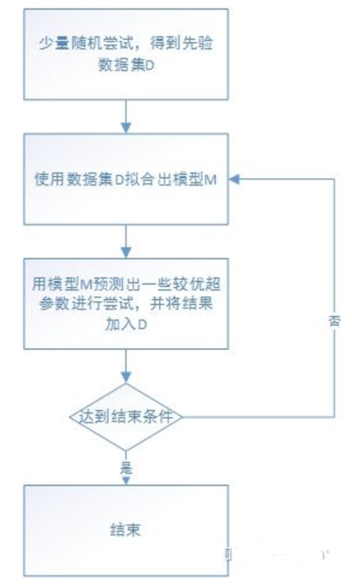

### 误差分析
#### 学习算法误差分解
对于监督学习，假设存在一个包含所有可能且无噪声的样本集，通过完全拟合该样本集来学习得到一个模型，该模型的泛化误差为 0，称为 “真实模型”

在实际工程中，由于无法得到这样一个包含所有可能的样本集，因此学习过程的目标，就是在训练集上执行学习算法，以得到无限接近真实模型的模型

从实际样本集中抽取组成不同，规模相同的训练集 ${D_1,\dots,D_n}$ ，在这些训练集上执行相同的学习算法，学得的模型 ${h_1,\dots,h_n}$ 不同

对于单个测试样本，$x$ 是在训练集中的特征，${y_1,\dots,y_n}$ 是在训练集中的标记，$y$ 是真实标记：
- 通过 ${h_1,\dots,h_n}$ 这些模型预测的期望 $E_n[h_n(x)]$ 表示学习算法的期望预测

- 通过 ${h_1,\dots,h_n}$ 这些模型预测和真实标记（或真实模型的预测）的平方误差的期望 $E_n[(h_n(x)-y)^2]$ 表示学习算法的泛化误差

- 通过测试样本在样本集中的标记 ${y_1,\dots,y_n}$ 和真实标记的平方误差的期望 $E_n[(y_n-y)^2]$ 表示在样本集中的噪声

对于单个测试样本，学习算法的泛化误差可以被被分解为 **偏差（Bias）**、**方差（Variance）** 与 **噪声（Noise）** 之和

$$E_n[h_n(x)]=\text{Bias}^2(x)+\text{Var}(x)+\sigma^2$$

其中：

$$\text{Bias}^2(x)=(E_n[h_n(x)]-y)^2$$

$$\text{Var}(x)=E_n[(h_n(x)-E_n[h_n(x)])^2]$$

$$\sigma^2=E_n[(h_n(x)-E_n[h_n(x)])^2]$$

偏差度量了学习算法的预测期望和真实标记（或真实模型的预测）之间的偏离程度，为了方便通常取平方，反映了学习算法本身的拟合能力

方差度量了训练集变动所导致的学习性能变化程度，反映了学习算法的稳定性

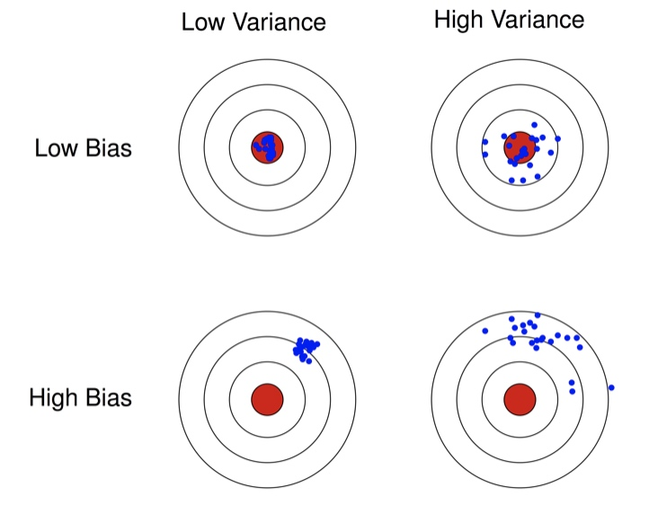

噪声表了示在当前实际样本集下任何学习算法所能达到的泛化误差下限，反映了学习任务的难度，通常假设噪声为零

对于所有测试集样本，泛化误差的分析也和以上相同，因此为了得到度量性能好的模型，则需要选用偏差和方差都很小的学习算法

但通常偏差和方差是冲突的，越简单的模型，其偏差越大，方差越小；越复杂的模型，其偏差越小，方差越大，因此需要控制学习算法的超参数，得到复杂度适中的模型

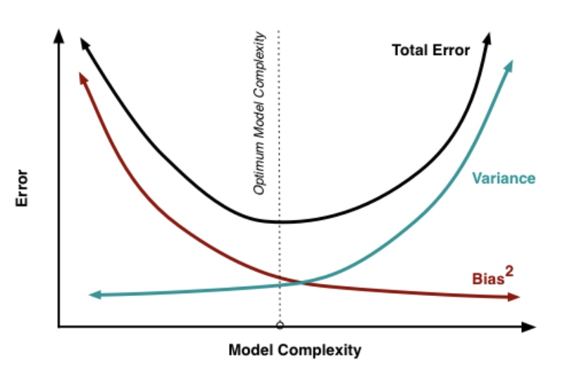

如果由于学习算法的偏差过高导致学得的模型无效，称为高偏差问题，如果学习算法的方差过高导致学到的模型无效，称为高方差问题

#### 模型诊断
有效的模型，是既能很好地拟合现有的数据，又能拟合新的数据的：
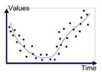

模型无效的问题可以分为：
- **欠拟合或高偏差**：模型过于简单，不能很好地拟合现有的数据

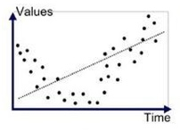

- **过拟合或高偏差**：模型过于复杂，很好地拟合了现有的数据，但无法拟合新的数据

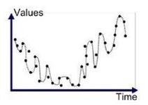

根据训练误差和验证误差来诊断问题：
- 当训练误差很大，验证误差约等于训练误差时，属于欠拟合或高偏差，即模型无法描述数据规律

- 当训练误差很小，验证误差远大于训练误差时，属于过拟合或高方差，反映了模型对训练集过度敏感，丢失了数据规律

高偏差模型的改善方式：
- 收集新的样本特征
- 利用现有的样本特征生成新的样本特征
- 降低正则化参数 $\lambda$

高方差模型的改善方式：
- 获取更多的样本
- 减少现有的样本特征
- 增大正则化参数 $\lambda$

正则化参数 $\lambda$ 和偏差、方差的关系：
当 $\lambda$ 太大时，会出现高偏差
当 $\lambda$ 太小时，会出现高方差
当 $\lambda$ 刚好时，才能达到训练误差很小，验证误差约等于训练误差的最优情况

选择在模型训练时使用的正则化参数：
1. 逐步尝试 $\lambda=0,较小的起始值,\dots,终止值$，以 2 倍速度增长 如 $\lambda=0,0.01,0.02,\dots,10$，
2. 在训练集上，使得加入不同正则化项的训练误差最小化，学习得到不同的模型
3. 使不同的模型作用于验证集，计算得到验证误差，选择验证误差最小的模型对应的 $\lambda$ 值

#### 学习曲线
**学习曲线（Learning curve）** 可以用于评估模型的有效性，诊断是否存在高偏差或高方差问题

在学习曲线的图中，横坐标是训练集大小，纵坐标是误差大小，两条曲线分别是训练误差和验证误差

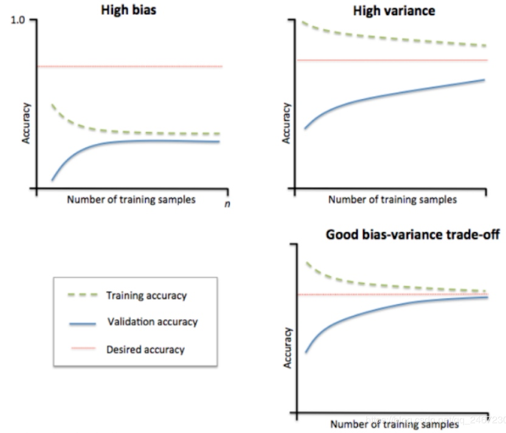

高偏差的图：训练误差随训练集增大而增大，验证误差随训练集增大而减小，当训练集大小到达某个值后，两者的走向都会逐渐平稳在一个很大的值，两者差距很小

> 当模型存在高偏差问题时，继续增大训练集，模型并不能得到优化

高方差的图：训练误差随训练集增大而增大，验证误差随训练集增大而减小，后者远远大于前者

> 当模型存在高方差问题时，继续再增大训练集，模型能够得到优化

选用算法，得到模型的优先级：
1. 快速实现一个简单的算法，训练得到模型并进行验证
2. 绘制学习曲线，决定如何继续优化算法
3. 进行误差分析，分析在验证中发生错误的样本，找到其相同点，继续优化算法

### 映射简化
对于大规模数据学习，使用批量梯度下降算法的计算代价非常大，但如果将数据集分配给多个 CPU 或多台计算机，分别处理数据集的一个子集，然后将所有计算结果汇总在求和，这样的方法叫做 **映射简化（Map Reduce）**

例如有 400 个训练样本，将批量梯度下降的求和任务分配给 4 台计算机并行处理：
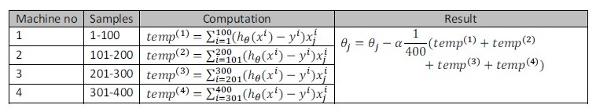

许多的算法都可以表示成求和的方式，然后分布到不同的计算节点来实现加速

很多高级的线性代数函数库已经能够利用多核 CPU 来并行地处理矩阵运算，这也是算法向量化重要的原因

## 推荐算法
### 基于内容
已知电影内容，即样本 $x^{(i)}$，使用回归任务的算法，为每个用户构建一个模型，根据电影内容特征来预测用户的打分，下面使用线性回归

对于第 $j$ 个用户，学习得到用户偏好，即参数 $\theta^{(j)}$，对第 $i$ 个电影的预测打分为：

$$y^{(i,j)}=(\theta^{(j)})^Tx^{(i)}$$
> $x^{(i)}$ 表示第 $i$ 个电影
> $y^{(i,j)}$ 表示第 $j$ 个用对第 $i$ 个电影的打分

对于第 $j$ 个用户，根据 $x^{(i)},\dots,x^{(n_m)}$ 学习参数 $\theta^{(j)}$ 的目标为：

$$\min\limits_{\theta^{(j)}}=\frac{1}{2m^{(j)}}\sum_{i:r(i,j)=1}((\theta^{(j)})^Tx^{(i)}-y^{(i,j)})^2+\frac{\lambda}{2m^{(j)}}\sum^n_{k=1}(\theta^{(j)}_k)^2$$
> $n_m$ 表示电影数目
> $n$ 表示电影的特征数目
> $r(i,j)$ 的值为 1 表示第 $j$ 个用户已对第 $i$ 个电影打分
> $m^{(j)}$ 表示第 $j$ 个用户已打分的电影数目

对于所有用户，根据 $x^{(i)},\dots,x^{(n_m)}$ 学习参数 $\theta^{(1)},\dots,\theta^{(n_u)}$ 的目标为：

$$\min\limits_{\theta^{(1)},\dots,\theta^{(j)}}=\frac{1}{2m^{(j)}}\sum^{n_u}_{j=1}\sum_{i:r(i,j)=1}((\theta^{(j)})^Tx^{(i)}-y^{(i,j)})^2+\frac{\lambda}{2m^{(j)}}\sum^{n_u}_{j=1}\sum^n_{k=1}(\theta^{(j)}_k)^2$$
> $n_u$ 表示用户数目

通过梯度下降，求得达成对于所有用户的目标，每次下降过程为：

$$\theta^{(j)}_k := \theta^{(j)}_k-\alpha\sum_{i:r(i,j)=1}((\theta^{(j)})^Tx^{(i)}-y^{(i,j)})x_k^{(i)}\ (\text{for}\ k=0)$$

$$\theta^{(j)}_k := \theta^{(j)}_k-\alpha\big(\sum_{i:r(i,j)=1}((\theta^{(j)})^Tx^{(i)}-y^{(i,j)})x_k^{(i)}+\lambda\theta^{(j)}_k\big)\ (\text{for}\ k\ne0)$$

### 基于协同过滤
不知道电影内容，也不知道用户偏好，通过 **协同过滤(Collaborative Filtering)** 来构建模型，为电影预测用户的打分

在基于内容的模型中，已经得到对于所有用户，根据 $x^{(i)},\dots,x^{(n_m)}$ 学习参数 $\theta^{(1)},\dots,\theta^{(n_u)}$ 的目标

而对于第 $i$ 个电影，根据 $\theta^{(1)},\dots,\theta^{(n_u)}$ 学习 $x^{(i)}$ 的目标为：

$$\min\limits{_x^{(i)}}=\frac{1}{2m^{(j)}}\sum_{j:r(i,j)=1}((\theta^{(j)})^Tx^{(i)}-y^{(i,j)})^2+\frac{\lambda}{2m^{(j)}}\sum^n_{k=1}(x^{(i)}_k)^2$$

对所有电影，根据 $\theta^{(1)},\dots,\theta^{(n_u)}$ 学习 $x^{(1)},\dots,x^{(n_m)}$ 的目标为：

$$\min\limits_{x^{(1)},\dots,x^{(n_m)}}=\frac{1}{2m^{(j)}}\sum^{n_m}_{i=1}\sum_{j:r(i,j)=1}((\theta^{(j)})^Tx^{(i)}-y^{(i,j)})^2+\frac{\lambda}{2m^{(j)}}\sum^{n_m}_{i=1}\sum^n_{k=1}(x^{(i)}_k)^2$$

通过梯度下降，也能求得达成对于所有电影的目标，每次下降过程为：

$$x^{(i)}_k := x^{(i)}_k-\alpha\sum_{j:r(i,j)=1}((\theta^{(j)})^Tx^{(i)}-y^{(i,j)})\theta_k^{(j)}\ (\text{for}\ k=0)$$

$$x^{(i)}_k := x^{(i)}_k-\alpha\big(\sum_{j:r(i,j)=1}((\theta^{(j)})^Tx^{(i)}-y^{(i,j)})\theta_k^{(j)}+\lambda x^{(i)}_k\big)\ (\text{for}\ k\ne1)$$

在每个电影都被部分用户打过分，而且每个用户都对部分电影打过分的情况下，将 $\theta^{(1)},\dots,\theta^{(n_u)}$ 和 $x^{(1)},\dots,x^{(n_m)}$ 这些未知值都随机初始化为较小值

然后通过用户偏好学习得到电影特征，再通过电影特征学习得到用户偏好，如此反复直到所有值变得最优，使得两个目标都能达成，这就是协同过滤的基本思想

协同过滤中的协同有两层意思：
- 用户偏好和电影特征之间协同为对方得到更优的值
- 每个用户的打分都在协同使整个模型的预测更有效

结合两个目标，使用户偏好和电影特征的学习同时进行：

$$\begin{array}\ \min\limits_{x^{(1)},\dots,x^{(n_m)},\theta^{(1)},\dots,\theta^{(n_u)}}&=\frac{1}{2}\sum^{n_m}_{i=1}\sum_{(i,j):r(i,j)=1}((\theta^{(j)})^Tx^{(i)}-y^{(i,j)})^2\\
&+\frac{\lambda}{2}\sum^{n_m}_{i=1}\sum^n_{k=1}(x^{(i)}_k)^2+\frac{\lambda}{2}\sum^{n_u}_{j=1}\sum^n_{k=1}(\theta^{(j)}_k)^2\end{array}$$
> 省略 $\frac{1}{m^{(j)}} 系数，便于计算$

通过梯度下降达成目标，每次下降的过程为：

$$\theta^{(j)}_k := \theta^{(j)}_k-\alpha\big(\sum_{i:r(i,j)=1}((\theta^{(j)})^Tx^{(i)}-y^{(i,j)})x_k^{(i)}+\lambda\theta^{(j)}_k\big)$$

$$x^{(i)}_k := x^{(i)}_k-\alpha\big(\sum_{j:r(i,j)=1}((\theta^{(j)})^Tx^{(i)}-y^{(i,j)})\theta_k^{(j)}+\lambda x^{(i)}_k\big)$$

协同过滤的完成步骤：
1. $x^{(i)}$ 和 $\theta^{(j)}$ 都去除偏置项，即为 $n$ 维向量
2. 随机初始化所有的 $\theta^{(1)},\dots,\theta^{(n_u)}$ 和 $x^{(1)},\dots,x^{(n_m)}$ 为较小的值
3. 通过梯度下降达到目标，得到 $\theta^{(1)},\dots,\theta^{(n_u)}$ 和 $x^{(1)},\dots,x^{(n_m)}$ 的最优解
4. 可以通过 $(\theta^{(j)})^Tx^{(i)}$ 预测第 $j$ 个用户对第 $i$ 个电影的打分
5. 根据 $||x^{(i)}-x^{(j)}||$ 的大小，可以为正在观看 $x^{(i)}$ 或打分高的用户推荐 $x^{(j)}$

为了提高计算效率，进行向量化后：

$$X=\big[\begin{matrix}(x^{(1)})^T \\\dots \\(x^{(n_m)})^T\end{matrix}\big]\ \Theta=\big[\begin{matrix}(\theta^{(1)})^T \\\dots \\(\theta^{(n_u)})^T\end{matrix}\big]$$

$$Y=\big[\begin{matrix}(\theta^{(1)})^Tx^{(1)} &\dots &(\theta^{(n_u)})^Tx^{(1)} \\\dots &\dots &\dots \\(\theta^{(1)})^Tx^{(n_m)} &\dots &(\theta^{(n_u)})^Tx^{(n_m)}\end{matrix}\big]=X\Theta^T$$

预测矩阵 $X\Theta^T$ 是低秩矩阵，因此协同过滤算法也叫低秩矩阵分解

当预测矩阵 $Y$ 未进行均值归一化时，如果一个用户未给任何一部电影打过分，那么预测该用户的打分结果都会是 0

对预测矩阵 $Y$ 进行均值归一化：
1. 计算各个电影 $i$ 的平均分 $\mu_i$，未打分项此处计为 0
2. 使用 $Y_{ij}-\mu_i$ 来替代 $Y_{ij}$，除了未打分项
3. 预测的用户 $j$ 为电影 $i$ 的打分为 $(\theta^{(j)})^Tx^{(i)}+\mu_i$

均值归一化后，当一个用户未给任何一部电影打分，那么预测该用户为第 $i$ 电影的打分会是 $\mu_i$

同样地，如果存在一部电影未被任何一个用户打分，那么对预测矩阵 $Y$ 进行均值归一化时，可以通过计算各个用户 $j$ 的平均打分 $\mu_j$，使用 $Y_{ij}-\mu_j$ 来替代 $Y_{ij}$

如果不对未打过分用户进行推荐，不推荐未被打过分的电影，不做预测矩阵 $Y$ 均值归一化也是可以的