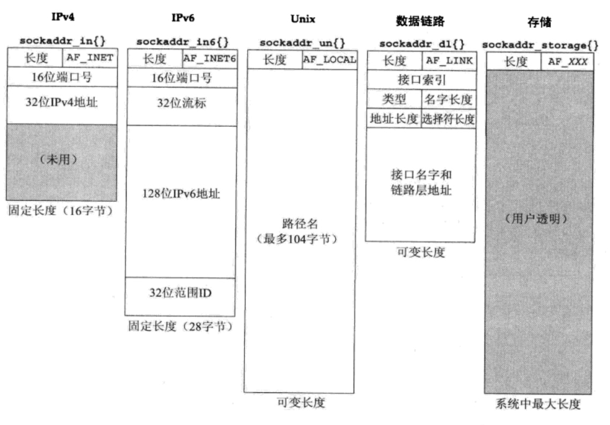

# 【C】Sockets 编程

* [【C】Sockets 编程](#csockets-编程)
   * [概述](#概述)
   * [Unix 编程基础](#unix-编程基础)
      * [错误处理](#错误处理)
      * [字节序转换](#字节序转换)
      * [多字节对象](#多字节对象)
      * [参数传递](#参数传递)
      * [不可重入函数](#不可重入函数)
      * [信号处理](#信号处理)
      * [守护进程](#守护进程)
   * [地址结构](#地址结构)
      * [IPv4 地址结构](#ipv4-地址结构)
      * [IPv6 地址结构](#ipv6-地址结构)
      * [IP 地址转换](#ip-地址转换)
      * [解析和反解析](#解析和反解析)
      * [双栈通信](#双栈通信)
   * [TCP Sockets](#tcp-sockets)
      * [socket()](#socket)
      * [connect() 和 bind()](#connect-和-bind)
      * [listen() 和 accept()](#listen-和-accept)
      * [close() 和 shutdown()](#close-和-shutdown)
      * [read() 和 write()](#read-和-write)
      * [带外数据](#带外数据)
   * [UDP Sockets](#udp-sockets)
      * [connect() 的作用](#connect-的作用)
      * [readfrom() 和 sendto()](#readfrom-和-sendto)
      * [其他注意点](#其他注意点)
      * [广播和多播](#广播和多播)
   * [设置和选项](#设置和选项)
      * [ioctl() 和 fnctl()](#ioctl-和-fnctl)
      * [Sockets 选项](#sockets-选项)
      * [IP 头部选项](#ip-头部选项)
   * [Sockets IO](#sockets-io)
      * [超时设置](#超时设置)
      * [其他 IO 函数](#其他-io-函数)
      * [辅助数据](#辅助数据)
      * [非阻塞 IO](#非阻塞-io)
      * [信号驱动 IO](#信号驱动-io)
   * [其他 Sockets](#其他-sockets)
      * [Unix Domain Sockets](#unix-domain-sockets)
      * [Route Sockets](#route-sockets)
      * [Key Management Sockets](#key-management-sockets)
      * [Raw Sockets](#raw-sockets)
      * [Data Link Sockets](#data-link-sockets)
   * [服务端开发](#服务端开发)
      * [多线程](#多线程)
      * [开发范式总结](#开发范式总结)

## 概述
**Sockets API** 又称为 **套接字接口**，是 Unix API 的一部分，并遵循 **POSIX/SUS** 规范，是 Unix 用于提供网络协议栈访问的一组抽象接口，其实现构建于内核暴露在用户空间的系统调用之上。**Sockets 编程** 指基于 C 语言的应用进程，使用公共函数库中的 Sockets API 来完成基于 TCP/IP 网络的双向通信，同时这也是进程间通信的一种方式

OSI 标准中的参考模型、TCP/IP 协议族中的分层模型和 Sockets API 之间的映射关系如下：


用户进程利用 Sockets API 能够使用 TCP/IP 协议族中的具体协议，其中各个协议及其使用场景如下：


## Unix 编程基础
### 错误处理
Unix 中的 `errno` 是一个线程间独立的全局变量，当调用的 Unix 函数发生错误时，函数通常会返回一个负数值比如 `-1`，而 `error` 则通常会被设置成一个代表不同错误类型的正整数，在 `<error.h>` 中定义了各种错误类型，均为以 `E` 开头的正整数常量

使用 `strerror()` 可以得到 `errno` 值所对应的错误信息，并以字符串指针的形式进行返回。使用 `perror()` 可以对标准错误写入一条基于 `errno` 值的错误消息，且错误消息的前缀内容可以通过参数传入

通过自定义 `sys_err()` 函数，来根据 `errno` 输出格式化的错误信息，并且使用 `exit()` 终止进程运行，其定义如下：

``` c
// 输出系统调用关联的错误信息，并终止进程运行
void err_sys(const char *fmt, ...) {
    va_list ap;
    char    buf[MAXLINE];
        
    // 拼接信息
    va_start(ap, fmt);
    vsnprintf(buf, MAXLINE, fmt, ap);
    snprintf(buf+strlen(buf), MAXLINE-strlen(buf), ": %s",
        strerror(error));
    strcat(buf, "\n");
    
    // 输出信息
    fflush(stdout);     // 刷新标准输出
    fputs(buf, stderr);
    fflush(NULL);       // 刷新所有标准 IO 流
    va_end(ap);
    exit(1);
}
```

对于可能发生错误的函数，可以通过自定义包裹函数进行错误的判断以及处理，一个包裹函数通常以首字母大写的函数名表示，比如 `socket()` 的包裹函数定义如下：
``` c
int Socket(int family, int type, int protocol) {
    int n;
    if ((n = socket(family, type, protocol)) < 0)
        err_sys("socket error")
    return n;
}
```

线程函数遇到错误时并不按标准地设置 `errno`，而是会直接将 `errno` 的值返回给调用者，这时则需要分配一个变量存储该返回值，并手动在调用 `err_sys()` 前将 `errno` 设为该值，比如 `pthread_mutex_lock()` 的包裹函数定义如下：

```c
void Pthread_mutex_lock(pthread_mutex_t *mptr) {
    int n;
    
    if ((n = pthread_mutex_lock(mptr)) == 0)
        return;
    errno = n;
    err_sys("Pthread_mutex_lock");
}
```

### 字节序转换
网络字节序统一使用大端序，而本地字节序并没有统一的标准，因此将当前平台所使用的字节序标准被称为 **主机字节序（Host Byte Order）**，以下是网络字节序和主机字节序的常用转化函数：

```c
// network to host long
#define ntohl(x)        ((__uint32_t)(x))
// network to host short
#define ntohs(x)        ((__uint16_t)(x))
// host to network long
#define htonl(x)        ((__uint32_t)(x))
// host to network short
#define htons(x)        ((__uint16_t)(x))
```

对于标准化 RFC 文档中的协议描述，排列在左边的字节是高序字节，而每个字节中排列在左边的位是高序位，在网络传输中优先处理高序字节和高序位，也就是从左到右传输数据，协议描述用例如下：


### 多字节对象
常用于操作多字节对象的函数有两组，分别是以 `b` 为开头的 BSD 系统函数，以及以 `mem` 开头的 C 标准函数，其中常用的函数如下：

``` c 
// --- BSD 系统函数 ---

// 置零指定长度的字节
void bzero(void *s, size_t n)

// 复制指定长度的字节
void bcopy(const void *src, void *dst, size_t len)

// 比较指定长度的字节，返回 0 表示完全相等，否则返回非 0
int bcmp(const void *, const void *, size_t)

// --- C 标准函数 ---

// 设置指定长度的字节为指定值
void *memset(void *__b, int __c, size_t __len)

// 从 s2 复制指定长度的字节到 s1，并返回 s1
// 通过 restrict 限定 s1 和 s2 不允许内存重叠
void *memcpy(void * restrict __s1, const void * restrict __s2, sizt_t __n)

// 从 s2 复制指定长度的字节到 s1，并返回 s1
// s1 和 s2 允许内存重叠，使用临时缓存处理，性能较差
void *memmove(void *__s1, const void *__s2, sizt_t __n)

// 比较指定长度的字节
// 返回 0 表示完全相等，否则当出现首个不同的字符时，若前者字符的底层整数更大则返回 -1，否则返回 1
int memcmp(const void *__s1, const void *__s2, size_t __n);
```

### 参数传递
当一个 Sockets API 需要传递 Sockets 地址结构时，通常需要传入指向地址结构的指针以及地址结构的实际长度，这两个传入的实参都作为值，告知内核从用户空间的哪个位置开始复制多少数据进来，这样的参数被称为 **值参数**


当一个 Sockets API 需要获取 Socket 地址结构时，同样需要传入指向地址结构的指针以及地址结构的大小，前者作为值，告知内核从用户空间的哪个位置开始写入数据；后者既作为值，告知内核该地址结构的大小以免写入时超过边界，也作为结果，让内核能告知进程最终内核所写入的数据大小，这种参数被称为 **值-结果参数** 


### 不可重入函数
函数不可重入可以理解为线程不安全，其原因是多次函数执行过程中所用的变量，在本进程中仅存在一个副本，并且对该副本缺乏并发访问控制，常见的不可重入函数及其常见特征如下：


- 使用了静态数据结构
- 调用了不可重入函数，比如 `malloc()`、`free()`，以及标准 IO 函数
- 进行了浮点运算，大多使用协处理器或者软件模拟来实现

将一个使用静态结构的不可重入函数，改造为可重入函数的方法有以下两种：
- 由调用者分配结构，并通过参数传入函数中，以供函数填写，这样容易导致函数参数过于复杂
- 由函数动态分配结果，并返回给调用者，这样需要调用者对返回结果进行内存回收

### 信号处理

使用 `singal()` 可以为 POSIX 信号设置信号处理动作，而使用 `sigaction()` 配合 `sigaction` 结构的参数，可以为 POSIX 信号设置和修改信号处理动作，具体用法如下：

``` c
// 设置信号处理动作为指定函数
// func 为 SIG_IGN 时表示忽略处理
// 若成功返回指向函数的指针，若失败则返回 SIG_ERR
void(*signal(int signo, void (*func)(int)))(int);

// 设置或修改信号处理动作为 sigaction 所表示的方式，有更复杂的控制方式
// 若成功返回 0，否则返回 -1
int sigaction(int signo, const struct sigaction *new, struct sigaction *old);

struct  sigaction {
	union __sigaction_u __sigaction_u;  // 信号处理函数
	sigset_t sa_mask;                   // 信号处理过程中需要阻塞的信号集合
	int     sa_flags;                   // 信号标志，包含 SA_ 为前缀的多种标记
};
```

当进程阻塞于一个慢系统调用时，同时捕获到某个信号，而该信号的处理函数又返回时，则这个系统调用会被中断，如果内核无法自动重启这个慢系统调用，就会返回错误且设置 `errno` 为 `EINTR`，错误信息为 `Interrupted system call`，表示系统调用被中断

默认情况下，进程接收到信号后会立即停止当前执行，然后去执行信号的处理函数。在不希望进程忽略该信号，而是仅对其进行延时处理的情况下，则可以通过 `sigprocmask()` 来阻塞信号，其相关用法如下：

``` c
// 初始化信号集并将所有信号清 0
// 若成功返回 0，否则返回 -1
int sigemptyset(sigset_t *set);

// 将指定信号加入信号集
// 若成功返回 0，否则返回 -1
int sigaddset(sigset_t *set, int signo);

// 将指定信号从信号集删除
// 若成功返回 0，否则返回 -1
int sigdelset(sigset_t *set, int signo);

// 使用指定方式来屏蔽信号集
// 若成功返回 0，否则返回 -1
int sigprocmask(int how, const sigset_t *set, sigset_t *oldset);

/*
set 用于传递需要进行操作的新屏蔽信号集
oldset 用于接收原来的屏蔽信号集，便于后续还原
how 则有以下三个取值：
- SIG_BLOCK：设置屏蔽信号集为 oldset 和 set 的并集，set 表示所有需要新增屏蔽的信号
- SIG_UNBLOCK：设置屏蔽信号集为 oldset 和 set 补集的交集，set 表示所有需要取消屏蔽的信号
- SIG_SETMASK：设置屏蔽信号集为 set，set 表示所有需要屏蔽的信号
*/
```

`pselect()` 将设置信号掩码、测试描述符和恢复信号掩码封装为一个原子操作，避免在描述符测试之前触发信号，导致一直测试描述符的过程一直阻塞下去，其用法如下：
``` c
// 前面的参数与 select 相同，仅多出一个 sigmask 表示需要阻塞的信号
int pselect(int maxfdp1, fd_set *readset, fd_set *writeset,
    fd_set *exceptet, const struct timespec *timeout,
    const sigset_t *sigmask)
```

`sigsetjump()` 和 `siglongjump()` 可用于实现跨函数之间的非局部跳转，前者用于设置跳转点，而后者用于进行跳转，其用法如下：

``` c
// 设置跳转点，返回值取决于调用方式
int sigsetjmp(sigjmp_buf env, int savemask);

// 进行跳转，并设置跳转值 val
void siglongjmp(sigjmp_buf env, int val);

/*
sigsetjmp() 具有多次返回：
- 对于直接调用者（主函数），它返回 0
- 对于从 siglongjmp() 调用，则返回 siglongjmp() 中的 val 参数值
- 为了避免混淆，最好不要在调用 siglongjmp() 时使 val 参数为 0

sigsetjmp() 中的 env 类型为 sigjmp_buf，其中保存了用于恢复栈状态的所有信息，由于在另一函数中调用 siglongjmp()，需要传入所保存的 env 变量，因此 env 变量通常被定义为全局变量

sigsetjmp() 中的 savemask 若非 0，则会在 env 中保存进程的当前信号屏蔽集，当另一函数调用 siglongjmp() 时，则能够恢复所保存的信号屏蔽字
*/
```

### 守护进程
将普通进程转化为守护进程，需要使用 `fork()`、`setsid()` 等函数并通过一定的步骤流程来完成，因此自定义 `daemon_init` 函数来实现守护进程的转化：

``` c
#define    MAXFD    64

int daemon_init(const char *pname, int facility)
{
    int        i;
    pid_t    pid;
    
    // 结束父进程，保证继续的进程不是 session leader 进程
    // 控制终端是针对于 session 来绑定的
    // session leader 进程不允许调用 setsid() 函数
    if ( (pid = fork()) < 0)
        return (-1);
    else if (pid)
        _exit(0);

    // 新建 session，使当前进程为 session leader 进程
    // 新 session 的 ession leader 进程不再具有控制终端
    if (setsid() < 0)
        return (-1);
    
    // 忽略 SIGHUP 并结束当前进程，保证当前进程为新 session 的非 session leader 进程
    // session leader 进程结束时，会向所有 session 中的进程发送S IGHUP 信号
    // session leader 进程打开一个终端设备时，会自动绑定为它的控制终端
    // 而非 session leader 进程不会自动绑定控制终端
    signal(SIGHUP, SIG_IGN);
    if ( (pid = fork()) < 0)
        return (-1);
    else if (pid)
        _exit(0);

    // 改变工作目录并关闭所有已打开 fd
    chdir("/");
    for (i = 0; i < MAXFD; i++)
        close(i);
    
    // 重定向标准输入、标准输出、错误输出
    // 分别所代表的 fd 为 0、1、2
    open("/dev/null", O_RDONLY);
    open("/dev/null", O_RDWR);
    open("/dev/null", O_RDWR);

    return (0);
}
```

## 地址结构
大多数的 Sockets API 都需要一个指向 Sockets 地址结构的指针作为参数，而每个 **协议族（Protocol Family）** 都定义了专用的 Socket 地址结构，这些结构的名字都以 `sockaddr_` 开头，并以对应于协议族的后缀结尾

Sockets 地址信息比如 IP 地址、端口号、MAC 地址、路径名等，在 Sockets 地址结构中总是以网络子节序进行存储，即以大端序进行存储，必要时需要使用字节序转换函数进行处理

### IPv4 地址结构
IPv4 Sockets 地址结构 `sockaddr_in`，其定义如下：

``` c
struct in_addr {
	in_addr_t s_addr;  // uint32，IP 地址
};

struct sockaddr_in {
	__uint8_t       sin_len;       // uint8，地址结构长度，统一不同长度的地址结构的处理
	sa_family_t     sin_family;    // uint8，协议族，值需要为 AF_INET
	in_port_t       sin_port;      // uint16，端口号
	struct in_addr  sin_addr;      // uint32，IP 地址
	char            sin_zero[8];   // 64 bits，填充字段
}; // 结构总长度为 16 bytes
```

Sockets API 为支持处理多种协议族的 Sockets 地址结构，而定义了一个通用地址结构 `sockaddr`，并将其指针类型作为形参类型，来接收多种协议族的 Socket 地址结构，其定义如下：

``` c
struct sockaddr {
	__uint8_t       sa_len;         // uint8，地址结构长度
	sa_family_t     sa_family;      // uint8，协议族
	char            sa_data[14];    // 112 Bits，存储地址值，实际长度可变，并可能超过结构边界
}; // 结构总长度为 16 bytes
```

在调用以 `sockaddr *` 作为形参类型的 Sockets API 时，需要将指向具体协议族的 Socket 地址结构的指针，先强制转化为 `sockaddr *` 后再作为实参传入，调用实例如下：

``` c
struct sockaddr_in bind_sa;

if(bind(sockfd, (struct sockaddr *)&bind_sa, len) < 0) {
    err_sys("bind failed: %s\n", strerror(errno));
}
```

### IPv6 地址结构
IPv6 的 Socket 地址结构 `sockaddr_in6`，其定义如下：
``` c
typedef struct in6_addr {
	union {
		__uint8_t   __u6_addr8[16];
		__uint16_t  __u6_addr16[8];
		__uint32_t  __u6_addr32[4];
	} __u6_addr;                   /* 128-bit IP6 address */
} in6_addr_t;

struct sockaddr_in6 {
	__uint8_t       sin6_len;       // uint8，地址结构长度
	sa_family_t     sin6_family;    // uint8，协议族，值需要为 AF_INET6
	in_port_t       sin6_port;      // uint16，端口号
	__uint32_t      sin6_flowinfo;  // uint32，IPv6 流信息
	struct in6_addr sin6_addr;      // 128 Bits，IPv6 地址
	__uint32_t      sin6_scope_id;  // uint32，范围空间
};  // 结构总长度为 28 bytes
```

作为 IPv6 Sockets 的一部分，其定义了一个新的通用地址结构 `sockaddr_storage`，它对比于 `sockaddr`，不仅足够容纳任何系统所支持的地址结构，而且能够满足苛刻的内存对齐要求，其定义如下：

``` c
#define _SS_MAXSIZE     128

#define _SS_ALIGNSIZE   (sizeof(__int64_t))

#define _SS_PAD1SIZE    \
	        (_SS_ALIGNSIZE - sizeof(__uint8_t) - sizeof(sa_family_t))
	        
#define _SS_PAD2SIZE    \
	        (_SS_MAXSIZE - sizeof(__uint8_t) - sizeof(sa_family_t) - \
	                        _SS_PAD1SIZE - _SS_ALIGNSIZE)

struct sockaddr_storage {
	__uint8_t       ss_len;         // uint8，地址结构长度
	sa_family_t     ss_family;      // uint8，协议族
	char            __ss_pad1[_SS_PAD1SIZE];   // 填充至内存对齐
	__int64_t       __ss_align;                // 构造内存对其
	char            __ss_pad2[_SS_PAD2SIZE];   // 填充至内存对齐
};  // 后三个字段对于结构使用者来说是透明的，仅用于构造内存对齐
    // 结构总长度为 128 bytes
```

常用的 Sockets 地址结构除了 IPv4 和 IPv6 这两种，还有 Unix 和数据链路，而这四种不同协议族的地址结构都能够被存放到 `sockaddr_storage` 之中，并且而不会超过结构体的大小边界：



Linux 实现中的地址结构，不存在与长度相关的字段，比如 `sockaddr_in` 不存在 `sin_len` 字段、`sockaddr_storage` 不存在 `ss_len` 字段等

### IP 地址转换
在处理地址转换时，常常需要将 ASCII 点分字符串转化为网络字节序的二进制值，对于 IPv4 地址来说，前者是人类常用的形式如 `10.5.4.3`，后者则是需要存储到 Sockets 地址结构中的形式，其中常用函数汇总如下：


而各个函数的具体用法如下：

``` c
// --- 仅用于 IPv4 协议族 ---

// 转化字符串 IP 地址为二进制 IP 地址
// 若字符串有效则返回 1，否则返回 0
int inet_aton(const char *, struct in_addr *);

// 转化字符串 IP 地址为二进制 IP 地址
// 若字符串有效则返回地址，否则返回 INADDR_NONE
// 由于 INADDR_NONE 是全为 1 的常值，会造成歧义，因此已经被废弃
in_addr_t inet_addr(const char *);

// 转化二进制 IP 地址为字符串 IP 地址
// 返回指向字符串的指针
char *inet_ntoa(struct in_addr);

// --- 可用于 IPv4 和 IPv6 协议族 ---

// 根据协议族和字符串 IP 地址，转化为二进制 IP 地址
// 若字符串有效果则返回 1，否则返回 0
int inet_pton(int family, const char *strptr, void *addrptr);

// 根据协议族和二进制 IP 地址，转化为字符串 IP 地址
// 若成功则返回传入的 *addrptr，否则返回 NULL
// 需要指定字符串的长度，当长度不足无法写入结果时 errno 为 ENOSPC
const char *inet_ntop(int family, const void *addrptr,
    char *strptr, socklen_t len);
```

### 解析和反解析
通过本地 `/etc/hosts` 记录或 DNS，能完成主机名和 IP 地址的互相转换，而通过本地 `/etc/services` 记录，能完成服务名和端口号的互相转换，从而避免使用难以记忆的主机名和端口号进行通信，这个转换过程所涉及的函数，及其用法如下：

``` c
// hostent 表示 DNS 解析结果，IP 地址是网络序
struct hostent {
	char  *h_name;          // 官方主机名
	char  **h_aliases;      // 别名指针数组，NULL 元素表示数组结束
	int   h_addrtype;       // 地址协议族
	int   h_length;         // 地址长度
	char  **h_addr_list;    // 地址指针数组，NULL 元素表示数组结束
};

// 解析主机名为 IP 地址
// 根据其 A 记录返回 hostent 结构，仅能为 IPv4 地址
// 出错返回 NULL，并设置 h_errno
struct hostent *gethostbyname(const char *hostname);

// 反解析 IP 地址为主机名
// 根据其 PTR 记录返回 hostent 结构，仅能为 IPv4 地址
// 出错返回 NULL，并设置 h_errno
struct hostent	*gethostbyaddr(const void *addr, socklen_t len, int family);

/*
gethostbyname() 和 gethostbyaddr() 出错时与其他标准函数不同，
它不会设置 errno，而是设置一个同样是全局变量 h_errno，常见的错误有：
- HOST_NOT_FIND：未找到权威的服务器
- TRY_AGAIN：临时的服务器错误
- NO_RECOVERY：不可恢复的服务器错误
- NO_DATA/NO_ADDRESS：主机名有效，但找不到对应 A 记录

gethostbyname() 和 gethostbyaddr() 都是不可重入函数，其可重入版的函数为
gethostbyname_r() 和 gethostbyaddr_r()
*/

// servent 代表服务解析记录，端口号是网络序
struct servent {
	char  *s_name;      // 官方服务名
	char  **s_aliases;  // 别名指针列表
	int   s_port;       // 端口号
	char  *s_proto;     // 所用协议
};

// 解析服务名为端口号
// 若成功返回 servent 结构，出错则返回 NULL
struct servent	*getservbyname(const char *servname, const char *protoname);

// 反解析端口号为服务名
// 若成功返回 servent 结构，出错则返回 NULL
struct servent	*getservbyport(int port, const char *protoname);
```

以上 IP 地址的解析仅用于 IPv4，并且端口的解析需要单独进行，而 `getaddrinfo()` 则能够兼容 IPv6 地址并且同时进行端口的解析，其用法如下：

``` c
// 地址信息链表
    struct addrinfo {
    int	ai_flags;       // 地址标志，值为 AI_xxx
    int	ai_family;      // 地址协议族，值为 AF_xxx
    int	ai_socktype;    // Socket 类型，值为 SOCK_xxx
    int	ai_protocol;    // 协议类型，值为 0 或 针对 IPv4 and IPv6 的 IPPROTO_xxx
    socklen_t ai_addrlen;   // 地址长度
    char	*ai_canonname;  // canonical name for hostname */
    struct	sockaddr *ai_addr;	// 二进制地址
    struct	addrinfo *ai_next;	// 链表的下个结构
};

// 解析字符串形式的 IP 地址和端口，得到完整的地址信息
// hostname 可以是主机名或地址串
// service 可以是服务名或数字串
// hints 可以是 NULL 或对于结果的期望信息
// results 是解析结果，为指向地址信息链表的二级针
// 若成功返回 0，否则返回非 0 值
int getaddrinfo(const char *hostname, const char *service, 
    const struct addrinfo *hints, struct addrinfo **results);

/*
hints 中可以设置的字段包括：
- int	ai_flags：当 hints 为 NULL 时默认取 0
- int	ai_family：当 hints 为 NULL 时默认取 0
- int	ai_socktype：当 hints 为 NULL 时默认取 0
- int	ai_protocol：当 hints 为 NULL 时默认取 AF_UNSPEC

results 返回包含地址信息的链表的情况：
- 与 hostname 关联的地址存在多个
- 支持 service 的 Socket 类型存在多种

ai_flags 可以设置地址用于主动 socket 还是被动 sokcet：
- 主动时若地址为空，则表示本地地址
- 被动时若地址为空，则表示通配地址
*/

// 解析 getaddrinfo() 返回的非 0 值为错误字符串
const char	*gai_strerror(int);

// 释放地址信息链表中的所有对象
void	freeaddrinfo(struct addrinfo *ai);

// 反解析 sockaddr 为主机名和服务名
// flags 是用于改变解析操作的标志
// 若成功返回 0，否则返回非 0
int getnameinfo(const struct sockaddr *addr, socklen_t addrlen, 
    char *hostname, socklen_t hostlen, 
    char *servname, socklen_t servlen, 
    int flags);
```

与网络通信相关的四类信息，即主机 `host`、网络 `net`、协议 `proto`、服务 `serv`，其对应的本地数据文件、结构及其解析和反解析函数如下：


对于主机和网络信息，若解析的内存于本地数据文件中不存在时，就会使用 DNS 进行解析，但网络一般不用 DNS。如果期望仅查询本地文件而不是用 DNS，可以使用以下基于顺序处理数据文件的函数：
- `setXXXent()`：打开文件并设置下一表项为首个表项
- `getXXXent()`：获取下一表项
- `endXXXent()`：关闭文件

### 双栈通信
在内核包含 IPv4 和 IPv6 双协议栈的主机中，能够使 IPv4 地址和 IPv6 地址之间相互映射，其映射规则是 `xx.xx.xx.xx` 对应于 `::ffff:0:xx:xx:xx:xx`

当服务端同时具有 A 记录和 AAAA 记录时，未设置 `IPV6_V6ONLY` 标志的 IPv6 Sockets 能够同时响应 IPv4 和 IPv6 的客户端，其中数据包的接收过程如下：


当服务端仅具有 A 记录时，若客户端在调用 `getaddrinfo()` 时为 `hints` 设置 `AI_V4MAPPED` 标志，则能够返回由 A 记录映射得到的 IPv6 地址，从而使 IPv6 Sockets 能够同时请求 IPv4 和 IPv6 的服务端

在单栈和双栈主机中，不同协议栈的客户端与服务端的相互操作性如下：


> 星号表示取决于客户端所选择的记录类型，若选择 AAAA 记录则无法工作
> 
> IPv6 的客户端和服务端都通常运行于双栈主机上，因此第二行以及第二列都可以忽略掉

通过类函数宏 `IN6_IS_ADDR_XXX()` 能够对 IPv6 地址的类型进行测试，其中包括判断是否为 IPv4 所映射的地址

## TCP Sockets
TCP 连接的生命周期可以分为三次握手、数据交换和四次挥手三个部分，其过程以及所需要调用的函数如下：


### socket()
Unix 之中一切皆文件，`socket` 结构也不例外，内核为所有的已打开文件，维护了一张全局的文件表，并且为每个进程维护了一张文件描述表

文件描述表的索引是文件描述符 `fd`，而其表项则是一个指向文件表项的指针，文件表项则包含了文件状态标志、文件偏移量、以及一个指向文件结构的指针，`socket` 就是其中一种类型的文件结构


`socket()` 函数用于创建一个特定的 `socket` 结构，并获得它所对应的 `sockfd`，后续传入其他 Sockets API 以指定所需要操作的 `socket`。`socket()` 的用法如下：

``` c
// 创建指定协议族、类型和协议的 socket
// 若成功返回一个 sockfd，是一个非负整数，否则返回 -1
int socket(int family, int type, int protocol)

/*
协议族 family 的常值包括：
- AF_INET：IPv4 套接字
- AF_INET6：IPv6 套接字
- AF_LOCAL：Unix 套接字
- AF_ROUTE：路由套接字
- AF_KEY：密钥套接字

类型 type 的常值包括：
- SOCK_STREAM：字节流套接字
- SOCK_DGRAM：数据报套接字
- SOCK_RAW：原始套接字

协议 protocol 的常值包括：
- IPPROTO_TCP：TCP 套接字
- IPPROTO_UDP：UDP 套接字

family 和 type 并非所有的组合都是有效的
以下是有效的组合以及所能指定的协议，OK 表示不涉及协议：

|             | AF_INET | AF_INET6 | AF_LOCAL | AF_ROUTE | AF_KEY |
| SOCK_STREAM |   TCP   |   TCP    |    OK    |          |        |
| SOCK_DGRAM  |   UDP   |   UDP    |    OK    |          |        |
| SOCK_RAW    |  IPv4   |  IPv6    |          |    OK    |   OK   |

protocol 用于指定协议，若为 0 则表示组合的默认协议或不涉及协议，因此常常不需关注
*/
```
> 协议族的常值有以 `AF_` 开头和 `PF_` 开头的两套常值，但其后缀和值都是一致的，之所以如此是原有设想一个协议族可以支持多个地址簇，但从未得到实现，因此后来都习惯统一使用以 `AF_` 开头的常值表示协议族

### connect() 和 bind()
`connect()` 函数用于 TCP 客户端建立与 TCP 服务端的连接，其用法如下：

``` c
// 使用指定 socket 与指定目的地址建立连接，需要经历三次握手
// 若成功返回 0，否则返回 -1
// 客户端并不一定需要为 socket 绑定地址，内核会自动确定可达的 IP 地址和随机的端口
int connect(int fd, const struct sockaddr *serveraddr, socklen_t addrlen)

/*
当建立连接失败时，查看 errno 可能会出现以下几种错误情况：
- ETIMEOUT：SYN 经过多次超时重传，并累计等待一定时间后，都没收到 SYN 响应
- ECONNREFUSED：是一种硬错误，SYN 发送后收到的响应是 RST，通常情况有：
                - 对端的目的端口没有正在监听的进程
                - 对端期望断开当前连接
                - 对端收到一个无效的报文段，比如丢失了之前的连接信息
- EHOSTUNREACH：是一种软错误，在触发 ETIMEOUT 的场景下，并且
                - 在本地路由表中不存在送往目的地的路由
                - 收到路由器返回的 ICMP 目的地不可达报文
- EHOSTUNREACH：同 EHOSTUNREACH

硬错误指必须调整对端才能解决的错误
软错误指调整本端或其他中间因素可解决的错误

connect() 失败之后，socket 不可再次使用，若要再次建立连接则必须创建新的 socket
*/
```

`bind()` 函数用于将一个本地协议地址绑定到指定 `socket` 上，之后 `socket` 可以使用这个地址进行网络通信，其用法如下：

``` c
// 绑定一个通用地址结构到指定 socket
// 若成功返回 0，否则返回 -1
int bind(int fd, const struct sockaddr *addrptr, socklen_t addlen)

/*
socket 若在 listen() 或 connect() 之前，未使用 bind() 绑定一个完整的地址
即仅绑定了 IP 地址或端口，或两者都未绑定时，则内核会自动为其确定

内核会进行 listen() 的 socket 绑定一个通配 IP 地址
为进行 connect() 的 socket 绑定一个可达目的地的 IP 地址
并且会为以上两者都选择一个随机的端口

由于服务端是需要对外提供服务的，因此通常需要先绑定一个确定的端口
但 IP 地址可以是通配地址，表示接收目的为任意本地 IP 地址的数据包

IPv4 的通配地址是 INADDR_ANY， IPv6 的通配地址是 IN6ADDR_ANY_INIT
两个通配地址的用法根据地址结构有所不同

bind() 常见的 errno 错误为 EADDRINUSE，表示地址已经被使用
*/
``` 

### listen() 和 accept()
`listen()` 函数用于 TCP 服务端监听由 TCP 客户端发来的连接建立请求，将未连接的 `socket` 转化为被动等待连接的 `socket`，其用法如下：

``` c
// 使内核开始接收目的为指定 socket 的连接建立请求
// 同时 backlog 指示内核接收连接时所使用的连接队列大小
// 若成功返回 0，否则返回 -1
int listen(int fd, int backlog)
```

`accept()` 函数用于 TCP 服务端获取已建立连接的 `socket`，通过这个 `socket` 可以进行后续的双向数据交互，其用法如下：

``` c
// 使内核取出已连接队列的队头 socket
// 返回已连接 socket 的 fd
// cliaddr、addrlen 都是值结果参数
int accept(int fd, struct sockaddr *cliaddr, socklen_t *addrlen)
```

内核为处于监听或等待连接的 `socket` 维护了两个队列，当接收到 SYN 连接建立请求时，会为其创建一个对应的 `socket`，并通过这两个队列进行维护，这两个队列分别为：


- **未完成连接队列（Imcomplete）**：收到 SYN 连接建立请求，正在等待三次握手的完成，其中的 `socket` 处于 `SYN_RCVD` 状态
- **已完成连接队列（Completed）**：已完成三次握手，其中的 `socket` 处于 `ESTABLISHED` 状态，待调用 `accept()` 函数时，将队头的 `socket` 取出并返回 

`backlog` 便是用于影响以上两个队列的大小，限制已完成连接队列大小的意义，在于当进程停止接收连接后，限制内核不要再接收过多的连接；而限制未完成连接队列大小的意义，则是防止因 SYN 攻击导致未完成连接过多，很久都无法接收新的连接

在不同的 Uinx 操作系统中，根据 `backlog` 来设置以上两个队列的大小，具有不同的计算策略，比如 Linux 的计算策略如下：
- 相关的内核参数有：最大连接数 `somaxconn`、最大的未完成连接队列大小 `max_syn_backlog`
- 未完成连接队列的大小为：2 的指数次幂，且大于 `somaxconn`、`max_syn_backlog`、`backlog` 中的较小值
- 已完成连接队列的大小为：`somaxconn` 和 `backlog` 中的较小值

对于已连接 Sockets，`getsockname()` 函数用于获取本地协议地址，而 `getpeername()` 函数用于获取对端协议地址，其用法如下：

``` c
// 函数名中的 name 表示完整的地址信息，即地址结构中所包含的信息

// 从指定 socket 中获取本地协议地址
// 若成功返回 0，否则返回 -1
int getsockname(int fd, struct sockaddr *localaddr, socklen_t *addrlen)

// 从指定 socket 中获取对端协议地址
// 若成功返回 0，否则返回 -1 
int getpeername(int fd, struct sockaddr *localaddr, socklen_t *addrlen)
```

### close() 和 shutdown()
`close()` 函数用于关闭 `sockfd` 并终止 TCP 连接，已关闭的 `sockfd` 不可以再被使用于其他 Socket API 函数进行操作，其用法如下：

``` c
// 使内核将指定的 sockfd 标记为关闭，但不意味着 socket 被关闭
// 若成功返回 0，否则返回 -1
int close(int fd)
```

每个文件表项都具有一个引用计数器，若一个 `socket` 所对应的 `sockfd` 因 `fork()` 或其他原因发生了复制，则该计数器将变为 2。若仅有一个 `sockfd` 被 `close()` 并不能真正关闭 `socket`，只有当计数器变为 0 时，`socket` 才能被真正关闭和回收

`shutdown()` 函数用于更灵活地关闭 `sockfd` 和终止 TCP 连接，对比 `close()` 函数它无视了 `sockfd` 对应文件表项的引用计数器，并且能够指定如何去关闭 TCP 连接，其用法如下：

``` c
// 使用指定方式来关闭 sockfd
// 若成功返回 0，否则返回 -1
int shutdown(int fd, int howto)

/*
howto 支持以下几种方式：
- SHUT_RD：关闭连接的读方向，进程不再能够对连接进行读操作，并且连接对于后续收到的数据包，会自动确认并进行丢弃
- SHUT_WR：关闭连接的写方向，进程不再能够对连接进行写操作，当前缓冲区的数据发送完成后，会正常关闭 TCP 连接
- SHUT_RDWR：关闭连接的读写方向，相当于分别调用了 SHUT_RD 和 SHUT_WR
*/
```

### read() 和 write()
`read()` 和 `write()` 函数分别用于对连接进行读数据和写数据，其实际读写的对象是位于内核空间的 Sockets 读缓冲区和 Sockets 写缓冲区，因此缓冲区的大小会限制函数进行读写的数据大小，其用法如下：

``` c
// 从指定面向连接的 socket 读取数据
// 返回最终读取的字节数，若为 0 表示对端已关闭连接
ssize_t read(int fd, void *buf, size_t n);

// 向指定面向连接的 socket 写入数据
// 返回最终写入的字节数
ssize_t write(int fd, void *buf, size_t n)
```

当进程向一个已收到 RST 或已发送 FIN 的连接写入数据时，内核会向该进程发送 SIGPIPE 信号，该信号默认的处理方式是终止进程

TCP Sockets 的数据写入、发送缓冲区和数据大小限制的关系如下：


### 带外数据
传输层中的 **带外数据（Out-Of-Band Data，OOB Date）** 也被称为 **经加速数据（Expedited Data）**，用于在某些重要事件发生时能迅速通知到连接对端，即对比普通数据具有更高的优先级

TCP 没有实现真正意义上的带外数据，而是将 **紧急模式（Urgent Mode）** 所传输的 1 Byte 紧急数据，作为带外数据的实现

当发送端 TCP Sockets 通过带 `MSG_OOB` 标志调用 `send()` 函数发送带外数据时，内核会将该数据写入发送缓冲区的下一个可用位置，并将连接的 **紧急指针（Urgent Pointer）** 置为再下一个可用位置，而紧急指针所指向位置的前一个字节则被标记为 OOB，即所写的带外数据的最后一个 Byte 被标记为紧急数据


内核为紧急模式的连接构造设置了 URG 标志的报文段，直到 OOB 数据被发出，并对于每个报文段，都根据其数据部分的 Seq 和所属连接的紧急指针来设置 **紧急偏移**，此时 `seq + 紧急偏移 - 1` 的数据部分位置则为 OOB 数据

当接收端 TCP Sockets 收取到一个包含 USG 标志以及 OOB 数据的报文段时，或者收到一个包含新的紧急偏移的报文段时，则内核会向 Sockets 的所属进程发出 `SIGURG` 信号，同时也能够使用 `select()` 监听到 Sockets 的异常状态，OOB 数据以最新的紧急偏移为准

默认情况下，OOB 数据被放入单字节带外缓冲区，可以通过带 `MSG_OOB` 标志调用 `recv()`、 `recvfrom()` 或 `recvmsg()` 函数进行读取，旧的 OOB 数据若未读取会被新的 OOB 数据覆盖；当设置了 `SO_OOBINLINE` Sockets 选项时，OOB 数据被放入接收缓冲区，和普通数据一同被读取，不会丢失 OOB 数据

带外标记是发送端 Sockets 在发送 OOB 数据时，该单字节数据在数据部分的位置，即在接收端 Sockets 读取时，若下一个字节是 OOB 数据，则该 Sockets 处于带外标记，并且其读操作会被强制停止

带外标记对于设置和没设置 `SO_OOBINLINE` 的 Sockets 都适用，而一个 Sockets 是否处于带外标记，可通过以下两个函数确定：

```c
// 若处于带外标记返回 1，若不处于带外标记返回 0
// 出错则返回 -1
int sockamark(int sockfd)

// 通过 ioctl 使用 SIOCATMARK 请求也可确定
if (ioctl(sockfd, SIOCATMARK, &flag) < 0) {
    return -1
}
return (flag != 0);
```

## UDP Sockets
UDP 是面向无连接的，可以直接通过指定目的地址进行数据交换，这个过程以及所需要调用的函数如下：


### connect() 的作用
由 UDP `socket` 而引发的异步错误并不会被返回，除非这个 `socket` 已连接。比如进程调用 `sendto()` 时指定了一个不可达的地址或未启用的端口，因此异步引发的 ICMP 错误，该错误并不会在进程后续调用时返回，而是直接丢弃所写入的数据

这样设计的原因是，当进程使用同一个 UDP `socket` 发送多个数据包到不同地址时，其中一个地址出现异步错误，如果直接返回给进程，则进程无法判断是哪个数据包的发送出现异常

而对一个 UDP `socket` 使用 `connect()` 函数进行连接，是一个与 TCP `socket` 三次握手不同的本地行为，内核只会为其绑定一个目的地址，并检查是否存在立即可知的错误，比如地址不可达或端口未启用，然后该 UDP `socket` 就是一个已连接的 UDP `socket` 了

已连接的 UDP `socket` 与未连接的 UDP `socket` 主要有以下四个变化：
- 可以使用 `read()`、`recv()` 和 `recvmsg()` 函数进行数据读取，若未连接时会引发 `EDESTADDRREQ` 错误

- 可以使用 `write()`、`send()` 和 `sendmsg()` 函数进行数据写入，若未连接时会引发 `EDESTADDRREQ` 错误

- 不能使用指定了目的地址的 `sendto()`，否则引发 `EISCONN` 错误，并且不会接收到源地址为其他地址的数据包

- 由它所引发的异步错误，能够返回给它所在的进程

- 性能更好，发送和接收数据不需要每次都对地址结构的进行拷贝，并且内核处理发送时不需要反复连接和断连

TCP `socket` 不允许进行多次 `connect()`，而对 UDP `socket` 进行多次 `connect()` 的作用有以下两个：
- 指定新的目的地址
- 断开当前的连接，传入使用空地址或地址簇为 `AF_UNSPEC` 的地址

### readfrom() 和 sendto()
`readfrom()` 和 `sendto()` 函数分别用于对 UDP Sockets 进行读数据和写数据，其用法如下：

``` c
// 使用指定面向无连接的 socket 读取数据，能够获取来源地址
// 返回最终读取的字节数
ssize_t recvfrom(int fd, void *buf, size_t n,
    int flag, struct sockaddr *from, socklen_t *addrlen)
    
// 向指定面向无连接的 socket 写入数据，需要指定目的地址
// 返回最终写入的字节数
ssize_t sendto(int fd, const void *buf, size_t n,
    int flag, struct sockaddr *to, socklen_t addrlen) 
    
/*
readfrom() 和 sendto() 同样可以用于 TCP Sockets，
读取时使用空指针作为 from 来忽略地址，发送时则使用已连接的对端地址作为 to
但通常情况下没有这样使用的必要
*/
```

使用绑定了具体地址的 `socket` 进行 `recvfrom()`，表示仅接收目的地址匹配绑定地址的数据包；而使用绑定了通配地址的 `socket` 进行 `recvfrom()`，表示接收目的地与绑定至同一端口的其他套接字都不匹配的数据包

UDP Sockets 的数据写入、发送缓冲区和数据大小限制的关系如下：


### 其他注意点
UDP 缺乏流量控制，客户端的最大发包速度取决于其网卡带宽，而服务端的最大收包速度取决于其缓冲区的读取速度，因为客户端发出的包很容易就能淹没服务端的 UDP 接收缓冲区，此时服务端则会直接丢弃所达到的数据包

通过 `netstat -s` 查看 `receive buffer errors` 项，或者 `nstat -z` 查看 `UdpRcvbufErrors` 项都可以获取被丢弃的数据包数，其中前者显示了自系统启动以来的累计值，而后者是通过每秒周期性采样获取的，因此它们的值是不一致的

UDP 数据报是可能会出现截断的，通过 `recvmsg()` 结果中的 `msg_flags` 字段是否标志 `MSG_TUNC`，可以来判断应用缓冲区的容量是否不足以接收 UDP 数据报，但这取决于不同内核的实现。最稳妥的办法是分配比预期长度大 1 的应用缓冲区，若成功接收的长度等于缓冲区长度，则表示应用缓冲区的容量不足

### 广播和多播
广播和多播用于 UDP Sockets 和 Raw Sockets，不可用于 TCP Sockets。对多播的支持在 IPv4 中是可选的，而在 IPv6 中则是必须的，因为 IPv6 不支持广播，任何使用广播的 IPv4 程序移植为 IPv4 时都需要改为多播

广播数据包的发送和接收过程：


多播数据包的发送和接收过程：


以太网接口是通过广播 MAC 地址来接收广播数据帧的，而其接收多播数据帧的方式有以下三种：
- **完备过滤（Perfect Filtering）**

  当被告知需要接收某个组地址对应的目的 MAC 地址时，记录这些具体的目的 MAC 地址，并仅接收对应的数据帧，其可记录的地址数目具有容量限制

- **不完备过滤（Imperfect Filtering）**
    
  用于超出容量或不支持完备过滤的接口。先通过一个散列数组来维护所要接收的数据帧，当被告知需要接收某个组地址对应的目的 MAC 地址时，它会计算出该目的 MAC 地址的 Hash 值，并将散列数组中对应的位设为 1
  
  然后根据散列数组中设为 1 的位，接收目的 MAC 地址的 Hash 值与之匹配的所有数据帧，其接收到非关注数据帧的可能性随着散列数组的增长而降低

- **多播混杂模式（Multicaset Promiscuous）**

  用于无法使用完备过滤和不支持不完备过滤的接口，会接收任何目的 MAC 地址的数据帧

## 设置和选项
### ioctl() 和 fnctl()
`ioctl()` 可用于进行网络相关的控制请求，尽管某些控制请求存在功能相同的其他特定函数，但在网络编程在仍然十分常用，其用法如下：

```c
// 对指定描述符发起控制请求
// 若成功返回 0，否则返回 -1
int ioctl(int fd, unsigned long req, ... // args);

/*
req 请求可以划分为以下五类：
- 套接字操作：
    - SIOCATMARK：获取其是否位于带外标记
    - SIOCGPGRP：获取其进程 ID 或进程组 ID
    - SIOCSPGRP：设置其进程 ID 或进程组 ID

- 文件操作：
    - FIONBIO：设置或清除其非阻塞标志
    - FIOASUNC：设置或清除其信号驱动标志
    - FIONREAD：获取其接收缓冲区中的字节数
    - FIOGETOWN：等同 SIOCGPGRP
    - FIOSETOWN：等同 SIOCSPGRP

- 接口操作：fd 为任意的网际网套接字
    - SIOCGIFCONF：获取所有接口的列表，使用 ifconf 结构作为值-结果参数
    - SIOCXXX：获取和设置接口信息，使用 ifreq 结构作为值-结果参数

- ARP 高速缓存操作：fd 为任意的网际网套接字
    - SIOCSARP：创建或修改 ARP 表项，使用 arpreq 结构作为参数
    - SIOCGARP：获取 ARP 表项，使用 arpreq 结构作为参数
    - SIOCDARP：删除 ARP 表项，使用 arpreq 结构作为参数

- 路由表操作：fd 为任意的路由套接字
    - SIOCADDRT：增加路由表表项，使用 rtentry 结构作为参数
    - SIOCDELRT：删除路由表表项，使用 rtentry 结构作为参数
*/
```

`fcntl()` 函数可用于对各种文件描述符进行控制操作，包括可通过不同的命令 `socket` 进行一系列设置，其用法如下：

``` c
// 对指定文件描述符进行指定控制操作
// 若成功则返回取决于 cmd，否则返回 -1
int fcntl(int fd, int cmd, ... /* args*/);

/*
作用于 socket 的常见控制操作包括：
- F_SETFL：设置其状态标志，包括：
           - O_NONBLOCK：非阻塞模式
           - O_ASYNC：信号驱动模式
- F_GETFL：获取其状态标记
- F_SETOWN：设置用于接收其 SIGIO 和 SIGURG 信号的属主进程 PID
- F_GETOWN：获取用于接收SIGIO 和 SIGURG 信号的属主进程 PID

SIGIO 用于内核通知进程，关于某个信号驱动模式 socket 已就绪
SIGURG 用于内核通知进程，用于在某个 socket 接收到带外数据，带外数据指优先级更高的紧急数据，TCP 有实现但 UDP 没有实现
*/
```

### Sockets 选项
通过为具体 `socket` 设置 Sockets 选项，能够影响其相关的属性和特性，这些选项可以粗略分为两类，一是用于启用或禁用某个特性的二元选项，也称为 **标志选项（Flag Option）**；二是用于检查或设置的某个特定值的选项，也称为 **值选项**

`getsockopt()` 和 `setsockopt()` 函数分别用于 Sockets 选项的检查和设置，其用法如下：

``` c
// 获取 socket 中指定的选项值
// level 表示选项所作用的级别，optname 是选项名
// optval 和 optlen 用于接收选项值
// 若成功返回 0，否则返回 -1
int getsockopt(int fd, int level, int optname, void *optval, socklen_t *optlen);


// 设置 socket 中指定的选项值
// 若成功返回 0，否则返回 -1
int setsockopt(int fd, int level, int optname, void *optval, socklen_t optlen);
```

各个级别的 Sockets 选项如下：


 
- `SOL_SOCKET`：以 `SO_` 开头，包含一些与协议无关的选项，也称为通用 Sockets 选项
- `IPPROTO_IP`：以 `IP_` 或 `MACST_` 开头，包含一些与 IPv4 协议相关的选项
- `IPPROTO_IPV6`：以 `IPV6_` 或 `MACST_` 开头，包含一些与 IPv6 协议相关的选项
- `IPPROTO_ICMPV6`：以 `ICMP6_` 开头，包含一些与 ICMPv6 协议相关的选项
- `IPPROTO_TCP`：以 `TCP_` 开头，包含一些与 TCP 协议相关的选项
 
> 对于 TCP Sockets 来说，连接 `socket` 上的一些表示状态的选项，都是从其对应的监听 `socket` 继承过来的，因此一些希望作用于连接 `socket` 的特性，需要预先为监听 `socket` 先设置好

### IP 头部选项

IPv4 头部支持最大 40 Bytes 的选项字段，并且使用 `setsockopt()` 和 `getsockopt()` 函数传入 `IP_OPTIONS` 来进行设置和读取，`optval` 参数需要指向一个大小为 44 Bytes 的缓冲区

其中常用的 IPv4 头部选项类型有以下几种：
- **无操作（No-Operation，NOP）**：用于选项总大小对齐 4 Bytes 的边界填充

- **列表结尾（End-Of-List，EOL）**：用于终止选项的处理，为使选项总大小对齐 4 Bytes 可能连续出现多个

- **宽松源路径（Loose Source Record Route，LSRR）**：由发送端指定的一个 IP 地址列表，数据包必须逐一经过所列的节点，但也能经过其他未列的节点

- **严格源路径（Strict Source Record Route，SSRR）**：由发送端指定的一个 IP 地址列表，数据包必须且只能逐一经过所列的节点

- **时间戳（Timestamp，TS）**：发送数据包的时间戳

- **记录路由（Record Route，RR）**：途径的路由器都将自身出口 IP 地址记录到列表

- **路由器警告（Router Alert，RA）**：途径的路由器都查看数据包的内容

> 源路径选项允许接受端逆转 IP 地址列表，得到沿相反方向回到发生端的路径，比如从已连接的 Sockets 获取源路径就会得到 SYN 请求包的源路径逆转列表
>
> 源路径选项因容易被欺骗攻击，许多组织机构和服务提供商都将路由器禁用该特性

除了两个源路径选项，其余头部选项在缓冲区中的格式就是写入 IPv4 头部的格式，而缓冲区大小之所以需要为 44 Bytes，是为了处理这两个源路径选项而准备的，其格式如下：


- `code` 对于 LSRR 是 `0x83`，对于 SSRR 是 `0x89`
- `len` 的长度是：`3 Byte 选项头部 + (源路径 IP 地址数目 * 4 Byte) + 目的 IP 地址 4 Byte`
- `ptr` 是下一个待处理 IP 地址的偏移量，初始值为 4

IPv6 的扩展头部相当于 IPv4 的选项，不同的是其设置和读取方式，先使用 `setsockopt()` 和 `getsockopt()` 函数传入对应不同扩展头部的 `IPV6_XXX` 来设置和确认是否启用辅助数据设置

然后使用 `sendmsg()` 或 `recvmsg()` 来传递具体需要在扩展头部设置的内容，并且对于辅助数据的数据部分的构造，针对不同的扩展头部也有特定的函数可以使用，开发者不需要关心其在 IPv6 头部中的格式。分片扩展头部比较特殊，是完全由内核来处理的

## Sockets IO
### 超时设置
为 Sockets IO 进行超时设置的方式有以下三种：
- 调用 `alarm()` 函数，使在指定超时后产生 `SIGALRM` 信号
- 使用 `select()` 阻塞等待 IO 操作完成，并指定等待超时时间
- 使用 `SO_RCVTIMEO` 和 `SO_SNDTIMEO` Sockets 选项

套接字选项尽可用于读写操作比如 `read()`、`write()`，而不能用于 `connect()` 等操作，并且仅可用于 `sockfd`，而前两项技术则可以用于任何描述符的任何操作

`SIGALRM` 信号会令阻塞 IO 函数立即返回，并将 `errno` 设置为 `EINTR`，程序接收到错误后可自行进行后续的超时处理

### 其他 IO 函数
`recv()` 和 `send()` 对比 `read()` 和 `write()`，额外支持传入标志参数，来为 IO 操作设置更多特性，其常用标志和用法如下：


``` c
// 接收数据，返回成功接收的字节数
ssize_t recv(int sockfd, void *buff, size_t n, int flags);

// 发送数据，返回成功发送的字节数
ssize_t send(int sockfd, const void *buff, size_t n, int flags);
```

`readv()` 和 `writev()` 对比 `read()` 和 `write()`，能够允许单次调用读入或写出自一个或多个应用缓冲区，这些操作分别称为 **集中读（Scatter Read）** 和 **分散写（Gather Write）**，其用法如下：

``` c
// 表示一个用于 IO 的缓冲区
struct iovec {
	void *   iov_base;      // 存储数据的缓冲区
	size_t   iov_len;       // 缓冲区大小
};

// 接收数据并写入 iovec 数组，返回成功接收的字节数
ssize_t readv(int sockfd, const struct iovec *iov, int iovcnt)

// 读取 iovec 数组中的数据并发送，返回成功发送的字节数
ssize_t writev(int sockfd, const struct iovec *iov, int iovcnt) 
```

`sendmsg()` 和 `recvmsg()` 是最通用的 IO 函数，这两个函数将大多数参数封装在 `msghdr` 结构中，对比 `recv()` 和 `send()`，不仅能够传入标志，还能够从内核接收标志更新，其用法如下：

``` c
// 表示一个用于 IO 的消息结构
struct msghdr {
	void            *msg_name;      // 对端地址结构，用于未连接 socket，已连接 socket 直接设为 NULL
	socklen_t       msg_namelen;    // 对端地址结构的长度
	struct          iovec *msg_iov; // 存储数据的缓冲区数组
	int             msg_iovlen;     // 缓冲区数组长度
	void            *msg_control;   // 辅助数据数组
	socklen_t       msg_controllen; // 辅助数据数组的长度
	int             msg_flags;      // 标志，不同于 flags 参数是可以接收结果
};

// 接收数据并写入 msghdr，返回成功接收的字节数
ssize_t recvmsg(int sockfd, struct msghdr *msg, int flags)

// 读取 msghdr 中的数据并发送，返回成功发送的字节数
ssize_t sendmsg(int sockfd, const struct msghdr *msg, int flags)
```

只有 `recvmsg()` 会使用 `msg_flags`，先将 `flags` 参数的值复制到其中在进行标识检查，然后将结果更新到其中，而 `sendmsg()` 则仅使用检查 `flags` 参数的值，不同标志的设置和结果读取方式如下：


总共五组的 Unix IO 函数的特性和差异如下：


`socket` 除了通过 Unix IO 函数来进行读写，还可以通过标准 IO 函数进行读写。先通过 `fdopen()` 函数将指定文件描述符转化为一个标准 IO 流，再使用 `fgets()` 和 `fputs()` 等标准 IO 函数进行读写，但这种使用情况比较罕见

标准 IO 函数的 IO 方式是缓冲 IO，即不保证每次函数调用都会执行 IO 操作，而是基于以下三种缓冲规则来执行：
- **完全缓冲（Fully Buffering）**：仅当缓冲区满、显式调用 `fflush()`、程序通过 `exit()` 退出时才执行 IO 操作，标准 IO 缓冲区大小通常为 8192 Bytes
- **完行缓冲（Line Buffering）**：仅当遇到换行符、显式调用 `fflush()`、程序通过 `exit()` 退出时才执行 IO 操作
- **不缓冲（Unbuffering）**：每次调用都执行 IO 
操作

### 辅助数据
**辅助数据（Ancilary Data）** 也称为 **控制信息（Control Imformation）** 通过 `msg_control` 和 `msg_controllen` 字段进行发送和接收，并通过 `cmsghdr` 结构进行存储，其类型和存储结构如下：


``` c
struct cmsghdr {
	socklen_t       cmsg_len;       // 辅助数据长度
	int             cmsg_level;     // 辅助数据级别
	int             cmsg_type;      // 辅助数据类型 
   // unsigned char cmsg_data[]; 数据本身，其填充需要通过 CMSG_XXX() 函数完成
};

// 返回指向第一个 cmsghdr 结构的指针，若无则返回 NULL
struct cmsghdr *cmsg CMSG_FIRSTHDR(struct msghdr *mhdr)

// 返回指向下一个 cmsghdr 结构的指针，若无则返回 NULL
struct cmsghdr *cmsg CMSG_NXTHDR(struct msghdr *mhdr, struct cmsghdr *cmsg)

// 返回 cmsghdr 结构中的数据的首个字节
unsigned char * CMSG_DATA(struct cmsghdr *cmsg)

// 返回指定数据长度下 cmsghdr 结构的有效长度，不计算内存对齐的填充部分，用于 cmsg_len 字段
unsigned int CMSG_LEN(unsigned int l)

// 返回指定数据长度下 cmsghdr 结构的长度，计算内存对齐的填充部分
unsigned int CMSG_SPACE(unsigned int l)
```

当 Linux 中绑定通配地址的 IPv4 UDP 接受数据报时，可使用 `IP_RECVDSTADDR` 辅助数据来获取数据报的目的地址，设置方式是通过 `setsockopt()` 设置 `IP_RECVORIGDSTADDR` 选项，还可使用 `IP_RECVIF` 辅助数据来获取数据报的目的接口索引，设置方式是通过 `setsockopt()` 设置 `IP_RECVIF` 选项

而使用 `IP_PKTINFO` 辅助数据可以同时获取数据报的目的地址和目的接口索引，设置方式是通过 `setsockopt()` 设置 `IP_PKTINFO` 选项，辅助数据的结构为 `in_pktinfo`，具体如下：

``` c
struct in_pktinfo {
	unsigned int    ipi_ifindex;    /* 目的接口索引 */
	struct in_addr  ipi_spec_dst;   /* 本地 IP 地址 */
	struct in_addr  ipi_addr;       /* 目的 IP 地址 */
};
```

IPv6 UDP 则只能使用 `IPV6_PKTINFO` 同时获取数据报的目的地址和目的接口索引，设置方式是通过 `setsockopt()` 设置 `IPV6_PKTINFO` 选项，辅助数据的结构为 `in6_pktinfo`，具体如下：

``` c
struct in6_pktinfo {
	struct in6_addr ipi6_addr;      /* 目的 IPv6 地址 */
	unsigned int    ipi6_ifindex;   /* 目的接口索引 */
};
```

### 非阻塞 IO
Sockets 默认是阻塞的，可通过用 `socket()` 创建时为 `type` 参数设置 `SOCK_NONBLOCK`，或通过用 `fcntl()` 进行控制时传入 `SETFL O_NONBLOCK`，来得到非阻塞的 Sockets

若对非阻塞 Sockets 调用无法立即完成的读写操作，则会触发 `EWOULDBLOCK` 错误，应当稍后再次执行

UDP Sockets 不存在真正的发送缓冲区，内核只是复制用户数据并沿协议栈向下处理和传送。因此对即便对阻塞的 UDP Sockets 调用发送函数，也不会像 TCP Sockets 那样因发送缓冲区写满而阻塞，但是会因其他原因比如计算资源不足、多线程的锁冲突而导致阻塞

若对非阻塞 Sockets 调用无法立即完成的连接操作，则触发 `EINPROGRESS` 错误，这表示连接行为已启动但尚未完成，应当稍后进行检查

对非阻塞 Sokcets 执行 `select()` 和 `connect()` 的规则是，若连接成功则描述符变为可写，若连接失败则描述符变为可读又可写，但由于不能保证对端在连接成功后不发送数据，因此两者所表现的读写状态是一致的

调用 `select()` 等待描述符的可读或可写的状态就绪后，需要要进一步判断是否连接成功，若不成功则获取其错误信息，有以下几种方式：
- 直接调用 `getsockopt()` 获取其待处理错误，若有错误表示连接失败

- 调用读取长度为 0 的 `read()`，若返回 0 则表示连接成功，否则会触发具体的连接错误

- 先调用 `getpeername()` 获取对端地址结构，若触发 `ENOTCONN` 表示连接失败，再紧接着调用 `getsockopt()` 获取其待处理错误

阻塞 Sockets 执行 `connect()` 但触发 `EINTR` 的情况，因此无法再次调用 `connect()` 等待连接行为完成，只能像对待非阻塞 Sockets 那样，等待描述符可读或可写状态就绪然后，进一步判断连接是否成功

客户端在 `select()` 返回描述符可读之后，在服务端调用 `accept()` 之前，主动关闭连接并通过 `SO_LINGER` Sockets 选项立即发送 RST 报文，此时如果一个阻塞状态的监听 Sockets 调用 `accept()` 则会导致长时间阻塞

为了防止这个现象，监听 Sockets 在调用 `accept()` 之前通常会设置为非阻塞状态，并且忽略以下三种客户端关闭连接在不同实现下的错误 `EWOULDBLOCK`、`ECONNABORTED` 和 `EPROTO`，以及系统调用被中断的错误 `EINTR`

### 信号驱动 IO
对一个套接字使用信号驱动式 IO 的三个步骤：
- 建立 `SIGIO` 信号的处理函数
- 设置 Sockets 的所属进程或进程组
- 打开 Sockets 的 `O_ASYNC` 信号驱动标志

UDP Sockets 在发生以下事件时产生  `SIGIO` 信号：
- 数据报达到 Sockets
- Sockets 上发生异步错误

TCP Sockets 在发生以下事件时产生  `SIGIO` 信号：
- 监听 Sockets 上完成连接请求
- 半连接 Sockets 已经关闭
- 已连接 Sockets 已经发出 FIN 请求或完成 FIN 确认
- 数据达到 Sockets 或已从 Sockets 送出
- Sockets 上发生异步错误

## 其他 Sockets
### Unix Domain Sockets
**Unix 套接字（Unix Domain Sockets）** 基于 Unix Doamin 协议族，它并不是一个实际的协议族，而是一种同主机进程间进行双向通信的方式，因此又称为 **本地跨进程通信（Local IPC）**

Unix Domain Sockets 不仅能通过 Sockets API 进行操作，而且具有更好的性能，它通过指定 `AF_UNIX` 或 `AF_LOCAL` 协议族进程创建，并且支持 `SOCK_STREAM` 和 `SOCK_DGRAM` 两种类型，不涉及指定协议

UNIX Domain 地址是普通文件系统的绝对路径名，且路径名所对应的文件必须是一个与 Sockets 绑定的 `sock` 类型文件。Unix 的 Sockets 地址结构 `sockaddr_un` 如下：

``` c
struct sockaddr_un {
	unsigned char   sun_len;        // 地址结构长度
	sa_family_t     sun_family;     // 协议族，值需要为 AF_UNIX，等同于 AF_LOCAL
	char            sun_path[104];  // 绝对路径名，必须以空字符结尾
	                                // Linux 实现中长度为 108
};

// 返回地址结构的有效长度，不计算无效的数组空间
size_t SUN_LEN(struct sockaddr_un *addr)
```

使用 `bind()` 为 Unix Domain Sockets 绑定地址结构时，需要保证路径名对应的文件不存在，否则会绑定失败，当绑定成功时，会创建一个路径名对应的 `sock` 类型文件

若对于未绑定地址结构的 Unix Domain Sockets 使用 `send()` 或 `sendto()` 发送数据，内核并不会为其自动绑定地址结构，因此接收端无法正常应答发送端

而使用 connect() 连接指定地址结构时，路径名对应的文件必须已存在，以及跟一个 Unix Domain Sockets 存在绑定关系，并且其 Sockets 类型相符

`socketpair()` 用于创建一对已连接起来的 Unix Domain Sockets，且这对 Sockets 是未命名的，即不存在路径名，其用法如下：

``` c
// 创建两个已连接的 Unix Domain Sockets，并将对应 fd 写入 sockfd 数组
// 若成功返回 0，否则返回 -1
// family 必须为 AF_LOCAL
// type 可以为 SOCK_STREAM 和 SOCK_DGRAM
// protocol 必须为 0
int socketpair(int family, int type, int protocol, int *sockfd[2])
```

这样已连接的一对未命名 Sockets 在功能上相当于 **匿名管道（Pipe）**，但对比 `pipe()` 得到的半双工管道，`socketpair()` 所得到的是全双工管道

跨进程传递已打开的描述符通常有两个方法，一是 `fork()` 后的子进程共享父进程已打开的描述符，二是 `exec()` 后所打开的描述符保持不变。除此之外，Unix Domain Sockets 能够在无亲缘关系的进程间，通过 `sendmsg()` 发送一个有内核处理的特殊消息，从而传递已打开的描述符

接受端需通过应用协议来预知何时期待接收传递过来的描述符，否则如果接受端在 `recvmsg()` 时没有分配用于接收描述符的空间，并且之前已有一个描述符等待被读取，此时这个等待被读取的描述符将会被关闭

通过 `msghdr` 的辅助数据进行发送描述符，而辅助数据 `cmsghdr` 的类型需设为 `SCM_RIGHTS`，描述符保存在的数据缓冲区中。在发送描述符的消息中，通常至少会发送和读取 1 Byte 的数据，但不对数据进行任何处理，否则接收端难以辨别 `readmsg()` 所返回的 `0` 是无数据还是 `socket` 已关闭

### Route Sockets
**路由套接字（Route Sockets）** 的主要作用是往内核发送和从内核接收与路由系统相关的消息，比如进行路由表项的增加和删除，或者接收内核通知的已收到并处理一个 ICMP 重定向消息

Route Sockets 通过指定 `AF_ROUTE` 协议族进行创建，且类型仅支持 `SOCK_RAW`，不涉及指定协议，需要拥有 Root 权限

Route Sockets 返回的一些消息中包含的数据链路 Sockets 的地址结构 `sockaddr_dl`，其具体结构如下：

```c
struct sockaddr_dl {
	u_char  sdl_len;        // uint8，地址结构长度
	u_char  sdl_family;     // uint8，协议族，必须为 AF_LINK
	u_short sdl_index;      // uint16，系统为接口分配的非 0 索引值
	u_char  sdl_type;       // uint8，类型，以太网为 IFT_ETHER
	u_char  sdl_nlen;       // uint8，接口名长度，不以空字符结尾
	u_char  sdl_alen;       // uint8，MAC 地址长度
	u_char  sdl_slen;       // uint8，选择器长度，如果类型存在选择器的话
	char    sdl_data[12];   // 96 bit，包括接口名、 MAC 地址和选择器，实际长度可扩展
}   // 结构总大小 28 Bytes
```

对于每个数据链路地址结构，都具有唯一的接口名和索引，这两个值能够通过以下四个函数进行处理，其用法如下：

``` c
// 根据接口名获取接口索引
// 若成功返回索引值，若失败则返回 0
unsigned int if_nametoindex(const char *ifname);

// 根据接口索引获取接口名
// 若成功返回指向接口名的指针，即传入的指针，若失败则返回 NULL
char *if_indextoname(unsigned int ifindex, char *ifname);

// 表示一对接口名和接口索引的映射关系
struct if_nameindex {
	unsigned int     if_index;
	char            *if_name;
};

// 返回一个 if_nameindex 结构数组，包含所有接口名字和索引对
struct if_nameindex *if_nameindex(void);

// 释放 if_nameindex 结构数组
void if_freenameindex(struct if_nameindex *);
```

路由套接字与内核的进行读写交互时，不需要绑定本地地址和指定目的地址，对于不同的消息类型使用不同的结构类型来表示，具体消息类型和作用如下：


`sysctl()` 函数能够对内核进行指定的控制操作，并且不需要 Root 权限，常用于获取路由表和接口列表，其用法如下：
``` c
// 对内核进行指定的控制操作
// name 是指定名字的整数数组，名字通过分层结构来表示所要进行的操作
// 当需要获取值时，oldp 是一个供内核存放的缓冲区
// 当需要设置值时，newp 是一个供内核读取的缓冲区
int sysctl(int *name, u_int namelen, void *oldp, 
    size_t *oldplen, void *newp, size_t newlen);
```

名字是分层结构的整数数组，比如首个整数表示内核的哪个子系统，第二个整数表示子系统的哪个部分，以此类推如下所示：


常用的控制操作以及对应的名字整数数组如下：


### Key Management Sockets
**IPsec（Internet Protocol Security ）** 基于 **安全关联（Security Association，SA）** 为数据包提供安全服务，SA 描述了五元组信息、安全机制以及密钥素材的组合，每个数据包的流通方向都可以应用不止一个 SA，比如一个 SA 用于认证，一个 SA 用于加密，而这些所有的 SA 信息存放于 **安全关联数据库（SADB）** 中

IPsec 还基于 **安全策略（Security Policy，SP）** 描述每个数据包的流通方向的安全需求，这些所有的 SP 信息存放于 **安全策略数据库（SPDB）** 中，但 SPDB 并没有一个标准的管理机制

**密钥管理套接字（Key Management Sockets）** 用于提供一个 SADB 的标准管理机制，密钥管理守护进程始终打开着 Key Management Sockets，它通过 Key Management Sockets 可以向内核和其他密钥管理守护进程写入或读取消息，比如增加和删除 SADB 表项，与其他密钥管理守护进程交换 SA，获取当前 SADB 的所有表项

Key Management Sockets 通过指定 `AF_KEY` 协议族进行创建，并且仅支持 `SOCK_RAW` 类型，不设置指定协议，以及需要拥有 Root 权限

### Raw Sockets
**原始套接字（Raw Sockets）** 可用于收发 ICMPv4、IGMPv4 和 ICMPv6 等数据包，也可用于收发其上层协议不被内核所处理的 IP 数据包，比如 OSPF 路由选择协议的数据包，还可用于自行构造 TCP 或 UDP 数据包甚至自行构造 IPv4 头部

Raw Sockets 通过指定 `SOCK_RAW` 类型进行创建，可指定 `AF_INET` 或 `AF_INET6` 协议族表示网际网，以及指定 `IPPROTO_XXXX` 协议表示选用的具体协议，需要拥有 Root 权限

Raw Sockets 可以使用 `bind()` 绑定地址，但比较少用，并且不存在绑定端口号的概念；也可以使用 `connect()` 连接地址，连接的作用与无连接的 UDP 类型，不存在连接端口号的概念

默认情况下，通过 IPv4 Raw Sockets 发送数据由内核自动构造 IPv4 头部，而通过为其 `IP_HDRINCR` 选项，则 IPv4 头部由进程自行构造，但首部的校验和字段始终由内核进行计算和存储，分片处理也由内核执行

IPv6 Raw Sockets 不支持通过设置 Sockets 选项来自行构造 IPv6 头部；除了 ICMPv6 Raw Sockets，其他 IPv6 Raw Sockets 可以通过 `IPV6_CHECKSUM` 选项来设置内核是否计算首部的校验和字段

其上层协议被内核所处理的 IP 数据包不会被传递至 Raw Sockets，比如 TCP 或 UDP 数据包，因此如果希望收到完整的 IP 、TCP、 UDP 数据包，则需要用到数据链路层 Sockets

内核接收到一个需要传递到 Raw Sockets 的 IP 数据包，会先检查并找出所有匹配的 Raw Sockets，并为每个匹配的 Raw Sockets 传递一个该 IP 数据包的拷贝，匹配的内容主要有：
- 对于创建时指定非 0 协议参数的 Raw Sockets，IP 数据包的协议字段和该协议参数相同
- 对于已绑定的 Raw Sockets，IP 数据包的目的地址和所绑定的本地地址相同
- 对于已连接的 Raw Sockets，IP 数据包的来源地址和所连接的对端地址相同

如果一个 Raw Sockets 创建时指定的协议参数为 0，并且没有进行过绑定和连接，则它能够匹配任何需要传递到 Raw Sockets 的 IP 数据包

对于 IPv4，进程从 Raw Sockets 收到的是包括头部的完整 IP 数据包，而对于 IPv6，进程从 Raw Sockets 收到的是剥离了 IPv6 头部的数据部分

由于 ICMPv6 对比 ICMPv4 集成了更多的功能，因此  ICMPv6 Raw Sockets 容易接收到更多不关注的数据包，此时可以通过 `ICMP6_FILTER_XXX()` 函数自行设置一个过滤器，并通过 `ICMP6_FILTER` 选项将过滤器绑定至 Raw Sockets，优化收取和处理数据包的效率

类似 UDP Sockets 的服务进程，配合 ICMP Raw Sockets 的守护进程，能够实现及时获取和处理异步错误的能力，其架构如下：


### Data Link Sockets
**数据链路套接字（Data Link Sockets）** 可用于监视有数据链路层接收的数据帧，并且能令用户进程在不基于内核处理的情况下，实现上层协议的各种处理

Data Link Sockets 通过指定 `AF_PACKET` 协议族进行创建，然后可以指定 `SOCK_DGRAM` 类型表示去除数据链路头部的数据帧，或者指定 `SOCK_RAW` 类型表示完整的数据帧，然后指定 `ETH_XXXX` 协议表示选用以太网帧类型，创建者需要拥有 Root 权限

常用的以太网帧类型有 `ETH_P_ALL` 表示任何以太网数据帧，`ETH_P_IP` 表示 IPv4 以太网数据帧，`ETH_P_IPV6` 表示 IPv6 以太网数据帧，`ETH_P_ARP` 表示 ARP 以太网数据帧

通过 `PACKET_ADD_MEMBERSHIP` Sockets 选项可以设置混杂模式，若套接字已设置了混杂模式，还需要将网络接口设备也设置为混杂模式

Unix 访问数据链路层的方式除了 Data Link Sockets，还有有数据包过滤器 BPF 和数据链路提供者接口 DLPI 两种方式

在支持 BPF 的内核中，数据链路驱动程序会在每个数据包接收后尽早调用 BPF，以及在每个数据包发出之前尽晚调用 BPF，保证提供给 BPF 精准的时间戳，调用 BPF 所递交的是数据包的副本，用户进程从 BPF 接收数据包的工作原理如下：


 
BPF 实现了一个基于寄存器型机器码的过滤器，并通过以下三个技术来降低开销：
- 过滤处理在内核进行，减少了内核空间到用户空间的内存拷贝开销
- 由 BPF 传递到用户进程的只是每个数据帧的定长部分，这个定长也称为 **捕获长度（Capture Length）** 或 **快照长度（Snapshot Length）**
- BPF 为每个用户进程分别缓冲数据，只有当缓冲区满或者读取超时时，缓冲区的数据才被复制到用户进程
- BPF 使用 **双缓冲（Double Buffering）** 技术，为每个用户进程维护了两个缓冲区，在其中一个缓冲区中的数据被复制到用户进程时，另一个缓冲区被用于填装数据

用户进程除了可以从 BPF 接收数据包之外，还可以向 BPF 写入数据包，写入的数据包会通过数据链路分别往向下的网络和向上的 IP 协议栈发出去，但这种使用场景比较少，除非是需要向网络发出非 IP 协议的数据报

BPF 的访问是通过打开 BPF 设备 `/dev/bpf` 进行的，并且通过 `ioctl()` 函数可以为其进行附接网络接口、装载过滤器、缓冲区大小、读取超时等设置，然后通过 `read()` 和 `write()` 函数进行读写

DLPI 的打开方式有两种，一是先打开一个伪设备，再使用 DLPI 控制为其附接某个网络接口；二是直接打开某个网络接口设备，无论是哪种打开方式，都需要通过负责内核数据包过滤的 `pfmod` 模块和缓冲数据包的 `bufmod` 模块来提高效率

用户进程从 DLPI 接收数据包的工作原理如下：


DLPI 通过 `pfmod` 模块实现了一个基于堆栈型机器码的过滤器的过滤器，其效率通常是比 BPF 要差的，另外 BPF 总是先过滤再复制，而 `pfmod` 模块和 `bufmod` 模块相对独立，其数据包的复制次数可能会比 BPF 要多，具体取决于实现

Data Link Sockets 对比 BPF 和 DLPI 存在如下差别：
- 不提供内核缓冲区，即便套接字本身带有缓冲区，但其无法保证累计缓冲多个帧后合并读取，开销较大
- 较新的内核才提供内核过滤数据帧
- 较新的内核才提供针对网络接口设备的过滤

函数库 `libpacp` 以与实现无关的方式提供访问操作系统提供的数据包捕获机制，其库函数都以 `pacp_xxx()` 命名，是目前 `tcpdump` 命令所使用的函数库

函数库 `libnet` 以与实现无关的方式提供构造任意协议的数据包并输出到网络的接口，是对 RWA Sockets 和 Data Link Sockets 的访问包装，其库函数都以 `pacp_xxx()` 命名

## 服务端开发
### 多线程
**POSIX 线程** 也称为 **Pthread**，多线程对比于多进程能够更轻量化地进行请求的并发处理，其相关的标准函数都以 `pthread_` 开头，其用法如下：

``` c
// 创建主线程以外的其他线程
// tid 用于接收线程 id
// attr 用于设置线程属性，比如优先级、初始栈大小，是否守护线程等
// func 和 args 是线程执行的函数和参数
// 若成功返回 0，否则返回正整数的 Exxx 值
int pthread_create(pthread_t *tid, const pthread_attr_t *attt,
    void *(*func)(void *), void *args);

// 等待指定线程终止，并通过 status 接收终止状态
// 线程所执行 func 的返回值就是代表终止状态的对象
// 若成功返回 0，否则返回正整数的 Exxx 值 
int pthread_join(pthread_t tid, void **status);

// 返回当前线程的 tid
pthread_t pthread_join(void);

// 线程默认是可汇合的，即可以被等待终止并获取终止状态
// 指定线程为脱离的，即不能被等待终止，并在终止时自动释放所有资源
// 若成功返回 0，否则返回正整数的 Exxx 值 
int pthread_detach(pthread_t tid);

// 终止当前线程
// 若线程是可汇合的，则其终止状态和 tid 一直保留直到被 pthread_join()
// 进程终止时，则其中的所有线程将强制终止
void pthread_exit(void *status);
```

**线程特定数据** 也被称为 **线程私有数据**，是一种存储和查找一个特定线程相关数据的机制，每个线程访问它自己独立的数据拷贝，而不用担心和其它线程的访问的同步

线程特定数据涉及两个数据结构，其中 `key` 数组结构由进程统一维护，而 `pthread` 线程结构则由线程自身维护。每个进程支持有限数量个线程特定数据，通常限制为 128 个，并且维护在 `key` 数组结构中，其结构如下：


`key[n]` 中的标志用于指示该元素是否已被使用，而其析构函数指针则关联到具体 `pthread` 线程结构中的 `pkey[n]`，而 `pkey[n]` 则指向一份独立的内存对象


特定线程数据的相关函数用法如下：

``` c
// 分配用于标识线程特定数据的 key，与线程中的 pkey 的值是一致的，进程全局操作
// 若成功返回 0，否则返回正整数的 Exxx 值 
int pthread_key_create(pthread_key_t *key, void (*destr_function) (void *));

// 删除 key 指定的线程特定数据，进程全局操作
// 若成功返回 0，否则返回正整数的 Exxx 值 
int pthread_key_delete(pthread_key_t key);

// 设置 key 指定的线程特定数据，线程局部操作
// 若成功返回 0，否则返回正整数的 Exxx 值 
int pthread_setspecific(pthread_key_t key, const void *pointer);

// 获取 key 指定的线程特定数据，线程局部操作
// 若成功返回 0，否则返回正整数的 Exxx 值 
void * pthread_getspecific(pthread_key_t key);
```

使用全局的互斥锁可以保护线程间的共享变量，防止竞态冲突，其用法如下：

``` c
// 使用指定锁进行持有
// 若成功返回 0，否则返回正整数的 Exxx 值 
int pthread_mutex_lock(pthread_mutex_t *);

// 使用指定锁进行释放
// 若成功返回 0，否则返回正整数的 Exxx 值 
int pthread_mutex_unlock(pthread_mutex_t *);
```

使用全局的条件变量可以进行线程间的状态同步，结合了互斥锁来更好地任务协作，其用法如下：

``` c
// 阻塞等待直到条件变量的信号到达
// 若成功返回 0，否则返回正整数的 Exxx 值 
int pthread_cond_wait(pthread_cond_t *, pthread_mutex_t *) 

// 发送信号到达条件变量，唤醒单个等待的线程
// 若成功返回 0，否则返回正整数的 Exxx 值 
int pthread_cond_signal(pthread_cond_t *);

// 阻塞等待直到条件变量的信号到达或者超时
// 若成功返回 0，否则返回正整数的 Exxx 值 
int pthread_cond_timedwait(pthread_cond_t *, 
    pthread_mutex_t *, const struct timespec *)

// 发送信号到达条件变量，唤醒所有等待的线程
// 若成功返回 0，否则返回正整数的 Exxx 值    
int pthread_cond_broadcast(pthread_cond_t *);

/*
调用 pthread_cond_wait() 的线程，内部会在持锁期间检查条件变量，若条件变量不为真，则进入睡眠并释放锁；
当线程因条件变量为真而唤醒时，重新持有锁并返回

以上函数需要在持锁期间调用，以及等待操作内部进行锁操作的原因就是：
保证全局的条件变量在同一时刻，只有一个线程在进行检查或设置
*/
```

### 开发范式总结
以 TCP 服务端为例，以下是不同的开发范式及其处理特定数量请求时所消耗的 CPU 时间：


以下是不同的请求接收方式及其子进程或子线程的请求分布情况：


从上图可以得出的结论如下：
- 在多进程或多线程的情况下，使用 `fcntl()` 对 `sockfd` 进行文件上锁，其开销要比全局的互斥锁要大，跨进程需要通过 `mmap()` 来共享互斥锁

- 多个进程或多个线程同时调用 `accept()` 等待连接，通常比主进程或主线程自行调用 `accept()` 等待并传递连接要来得简单高效，但在高负载下，由于进程数组内部有序，因此会有连接分配不均的问题

多个进程在无锁保护的情况下共同操作一个 `sockfd` 并阻塞时，一旦操作条件满足时，则所有进程都会被内核同时唤醒，但仅有一个进程能够完成操作，其他进程继续回到睡眠状态，这种导致额外开销的现象称为 **惊群效应（Thundering Herd）**

多个进程对同一个 `sockfd` 进行 `select()` 时，由于在 `socket` 结构中仅能存放一个事件就绪时应该唤醒的进程 ID，因此当事件就绪时，内核必须唤醒阻塞在 `select()` 的所有进程，这种 `select()` 函数的冲突会导致开销比 IO 操作更大的惊群效应

除了通过加锁保护避免惊群效应之外，使用 `SO_REUSEPORT` Sockets 选项，能够创建多个绑定相同端口的 `socket`，然后多个进程或线程能够分别对其中的某个 `socket` 进行单独 `accept()`，当链接到来时，由内核负载均衡地唤醒其中一个进程，同时避免了惊群效应和连接分配不均的问题
