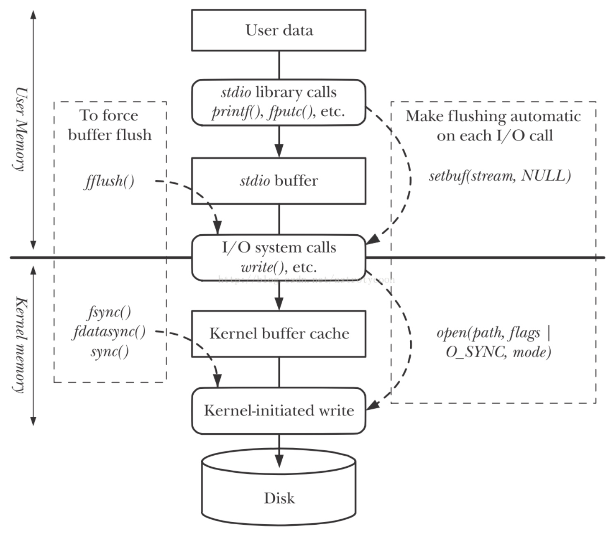

# Unix 编程

* [【C】Unix 编程](#cunix编程)
    * [概述](#概述)
    * [Unix 实现差异](#Unix-实现差异)
    * [文件 IO](#文件-IO)
    	* [文件打开](#文件打开)
    	* [文件读写](#文件读写)
    	* [文件共享](#文件共享)
    	* [文件控制](#文件控制)
    * [文件和目录](#文件和目录)
    	* [文件信息](#文件信息)
    	* [文件权限](#文件权限)
    	* [文件管理](#文件管理)
    * [标准 IO 库](#标准-IO-库)
    	* [文件流打开](#文件流打开)
    	* [文件流读写](#文件流读写)
    * [进程环境和控制](#进程环境和控制)
    	* [启动和终止](#启动和终止)
    	* [环境和限制](#环境和限制)

## 概述
**内核（Kernel）** 是 **操作系统（Operating System，OS）** 的核心，控制着计算机硬件资源，为用户程序提供运环境。内核的接口被称为 **系统调用（System Call）**，**公共函数库（Libs）** 构建在系统调用之上，**应用程序（Application）** 既可通过系统调用也可通过公共函数库，来完成与内核之间的通信

所有的操作系统都提供多种服务的入口点，以支持程序向内核请求指定的服务，这些良好定义、数量有限的入口点称为系统调用。为了向程序屏蔽在不同 Unix 实现中发起系统调用的技术差异性，Unix 为每个系统调用在 C 公共函数库中设置一个具有相同名字的函数，让程序能使用这些函数来发起系统调用，因此这些函数被称为 **系统调用接口（System Call API）**，并可被程序直接视为系统调用

Unix 标准化后最终形成了 **POSIX 规范（The POSIX Specification）**，其中的 POSIX 指 **可移植操作系统接口（Portable Operation System Interface）**，而 **SUS 规范（Single UNIX Specification）** 是 POSIX 规范的一个超集，也可以视为同一个 Unix 标准

C 标准不仅定义了 C 语言的语法和语义，还定义了 C 标准库，而 Unix 标准则定义了 **Unix 操作系统接口规范（Unix API）**，其中既包含了 C 标准库中定义的接口，还包含了所有的系统调用接口，以公共函数库的形式提供给应用程序使用，而不同的 Unix 操作系统对其中的函数有不同的实现

## Unix 实现差异
**GUN** 所使用的内核是 **Linux**，因此也被称为 **GUN/Linux**，或简称为 **Linux**，它是以 Unix 为原型而创造的类 Unix 操作系统，但同样能够提供 Unix 编程环境，因此，属于 Unix 实现的一种，其他的 Unix 实现还有 **BSD**、**FreeBSD** 和 **MacOS/Darwin** 等

限制可分为编译时限制和运行时限制两种，前者在给定的 Unix 实现中不会被改变，后者则会随着 Unix 环境的变化而变化。编译时限制以常量的形式定义在 `<limits.h>` 之中，其中包括了 C 标准所定义的语言相关限制，以及 Unix 标准所定义的操作系统相关限制

操作系统相关的编译时限制，其名字以 `_POSIX_` 开头，且所表示的是最小可接收值，由于这些值太小通常并不直接使用，需要获取其在给定的 Unix 环境中的对应运行时限制，然后再进行使用

运行时限制可分为操作系统相关限制和文件或目录相关限制，通过以下函数可根据限制名来获取其对应值，其中操作系统相关的限制名以 `_SC_` 开头，文件或目录相关的限制名以 `_PC_` 开头，函数使用方式如下：

``` c
#include "<unistd.h>"

// 获取操作系统相关的运行时限制
long sysconf(int name);

// 获取路径相关的运行时限制
long pathconf(const char *pathname, int name);

// 获取文件相关的运行时限制
long fpathconf(int fd, int name);
```

比如对于操作系统相关限制 `ARG_MAX`，表示了 `exec()` 函数族参数最大长度，其对应的编译时限制名为 `_POSIX_ARG_MAX`，其对应的运行时限制名为 `_SC_ARG_MAX`，但对于每个操作系统相关限制，Unix 实现并不保证其编译时限制被定义在 `<limits.h>` 之中，或可通过相关函数查询到其运行时限制

当一种操作系统相关限制，其编译时限制和运行时限制都不能被确定时，则只能通过尝试性的编程来避免兼容性问题，比如以下案例：
- 根据路径名长度限制 `PATH_MAX` 来分配路径名对象：先猜测的初始长度并分配一个字符串，再尝试调用使用该字符串的函数比如 `getcwd()`，若字符串的容量不足则会调用失败，接下来通过不断地增大容量和尝试调用函数，最终得到容量合适的路径名对象

- 根据最大打开文件数 `OPEN_MAX` 来关闭所有打开文件：先猜测的最大文件描述符，然后从 0 开始递增，循环地关闭该文件描述符，这是不保证完全正确工作的最好方法。极端情况下，也可循环地先调用其错误值可区分文件描述符过大情况的函数比如 `dup()`，若没发生文件描述符过大错误再关闭该文件描述符，直到发生文件描述符过大错误

选项用于表示 Unix 实现和 Unix 环境的特性，其处理方式和限制类似，也可分为编译时选项和运行时选项，其中编译时选项定义在 `<unistd.h>` 之中，而操作系统相关的运行时选项通过 `sysconfig()` 函数来判断， 文件或目录相关的运行时选项通过 `pathconf()` 或 `fpathconf()` 函数判断

基本系统数据类型用于关联到特定的 Unix 系统变量，其定义在 `<sys/types>` 之中，并且类型名以 `_t` 结尾，程序通过这些基本系统数据类型来屏蔽不同 Unix 实现之间的实现细节

## 文件 IO
### 文件打开
对于内核而言，所有打开的文件都通过 **文件描述符（File Descriptor，FD）** 引用。文件描述符是一个非负整数，当进程通过系统调用打开或新建一个文件时，内核会向进程返回一个指向该文件的文件描述符，同时将该文件描述符保存到进程的文件描述表中，其范围是 `0 ~ OPEN_MAX - 1`

每个进程的文件描述表中都默认保存了三个文件描述符，分别对应已打开的 **标准输入（Stdin）**、**标准输出（Stdout）** 和 **标准错误（Stderr）**，其值分别为 **0、1 和 2**，在 `<unistd.h>` 中对应的常量分别为 `STDIN_FILENO`、`STDOUT_FILENO` 和 `STDERR_FILENO`

`open()` 和 `openat()` 函数既可用于打开一个文件，也可通过传入指定的标识来新建一个文件，而 `create()` 则仅用于新建一个文件，`close()` 则用于关闭一个文件，以上函数的用法如下：

``` c
#include <fcntl.h>

// 打开一个文件，成功则返回其文件描述符
// 返回的文件描述符一定是值最小的未用文件描述符
int open(const char *path, int oflag, ... );

// 当 path 为绝对路径时，效果和 open() 一致
// 当 path 为相对路径时，fd 表示相对路径名所在的目录，若使用常量 AT_FDCWD 则表示工作目录，效果也和 open() 一致
int openat(int fd, const char *path, int oflag, ...);

// 常用的 oflag 打开选项：
// - 以下选项是必选且仅能选一个的：
//   - O_RDONLY：只读打开
//   - O_WRONLY：只写打开
//   - O_RDWR：读写打开
//   - O_EXEC：只执行打开
//
// - 以下选项是可选的：
//   - O_CLOEXEC：进程调用 exec() 族函数时自动关闭文件
//   - O_APPEND：每次写时都追加到文件末尾，和 O_WRONLY 同用才有效
//   - O_CREAT：若文件不存在则创建，同时需额外传入 mode 确定新文件的访问权限
//   - O_EXCL：与 O_CREAT 同时用时，若文件存在则出错，且测试与创建为一个原子操作
//   - O_TRUNC：若文件存在且为只写或读写打开，则将其内容长度截断为 0
//   - O_DIRECTORY：若打开的是非目录则出错
//   - O_NONBLOCK：以非阻塞 IO 模式打开
//   - O_DIRECT：以直接 IO 方式打开
//   - O_SYNC：每次等待写操作同步完成，包括数据和属性
//   - O_DSYNC：每次等待写操作同步完成，仅包括数据

// 新建一个文件，成功则返回其文件描述符
// 仅能只写打开文件，等效于 open(path, O_WRONLY | O_CREAT | O_TRUNC)
// 若需要创建后读写文件，可用 open(path, O_RDWR | O_CREAT | O_TRUNC) 代替
int creat(const char *path, mode_t mode);

// ------------------------------------------

#include <unistd.h>

// 关闭一个已打开文件
// 当一个进程终止时，内核会自动关闭其所有打开的文件
int close(int fd);
```

`openat()` 对比 `open()` 除了可以让线程使用相对路径名来打开文件之外，还能避免 **TOCTTOU（Time-Of-Check-To-Time-Of-Use）** 错误，该错误的思想是当有两个基于文件的函数调用，而第二个调用依赖于第一个调用的结果时，那么两个调用之间文件可能会被改变，导致非预期的结果。比如第一个调用是检查文件权限，第二个调用是打开文件时，期间文件的相对目录被重命名或链接到其他目录，则会导致打开无权限的文件，而 `openat()` 则通过 `fd` 来锁定该相对目录，防止了这样的现象，其他的 `xxxat()` 函数同样有着这样的作用

当创建一个文件名大于 `NAME_MAX` 限制的文件，若 `_POSIX_NO_TRUNC` 选项有效，则会直接出错返回，并将错误设置为 `ENAMETOOLONG`，否则会对文件名进行截断，但截断会出现无法再次确定来原文件名的问题

### 文件读写
每个已打开文件都有一个与其相关联的 **当前文件偏移量（Current File Offset）**，它通常是一个非负整数，表示文件发送读写操作的起始位置。默认情况下打开一个文件，除非使用了 `O_APPEND` 选项，否则其当前文件偏移量会被设置为 `0`

`lseek()` 可用于设置一个已打开文件的偏移量，`read()` 用于从已打开文件中读取数据，`write` 用于向已打开文件写入数据，以上函数的用法如下：

``` c
#include <unistd.h>

// 设置一个已打开文件的偏移量，成功则返回新的当前文件偏移量
// 某些设备可能允许负整数的偏移量，应通过等于 -1 来判断函数出错，而并非小于 0
// offset 表示相对偏移量，其效果取决于 whence 的值
off_t lseek(int fildes, off_t offset, int whence);

// whence 的可选值及其含义：
// - SEEK_SET：以 offset 作为新的当前文件偏移量
// - SEEK_CUR：从当前文件偏移量往后增加 offset 作为新的当前文件偏移量，offet 允许为负值
// - SEEK_END：从文件末尾往后增加 offset 作为新的当前文件偏移量，offet 允许负值的出现

// 读取一个文件的数据，成功则返回读到的字节数，若已到达文件末尾，则返回 0
// count 表示期望读取的字节数，实际读到的字节数可能少于此值
ssize_t read(int fd, void *buf, size_t count);

// 写入数据到一个文件，成功则返回写入的字节数
// count 表示期望写入的字节数，返回值通常与此值相等，否则表示出错
ssize_t write(int fd, const void *buf, size_t count);
```

使用 `lseek(fd, 0, SEEK_CUR)` 既能用于获取一个已打开文件最新的当前文件偏移量，又能用于判断一个已打开文件是否可以设置偏移量，若文件描述符指向的是一个管道、FIFO 或 Socket，则会发送 `ESPIPE` 错误

文件偏移量可以大于文件的当前长度，在这种情况下，下一次写入将加长该文件并在文件中构成一块字节全为 `0` 的空洞，文件中的空洞并不要求在磁盘上占用存储区，即在真正写入数据之前不需要分配磁盘块，具体处理方式取决于文件系统的实现

关于读写一个固定大小文件的 IO 效率：
- 当文件系统支持 Cache 预读技术且预读长度为 32 字节时，将读写缓冲大小设置为 32 或其倍数的值，所消耗的时钟时间无法继续下降。因为小于 32 字节的 IO 操作效率是一致的，降低了 IO 操作次数，因此降低了总的时钟时间

- 当文件系统的磁盘块大小为 4096 字节时，将读写缓冲大小设置为 4096 或其倍数的值，所消耗的系统 CPU 时间基本达到最小，此时内核对于磁盘块操作的次数是最少的

Unix 基础 IO 比如 `read()` 和 `write()` 等函数被称为 **不带缓冲的 IO（Unbuffered IO）**，是针对 **文件描述符** 的 IO 操作，而 Unix 标准 IO 比如 `fget()` 和  `fput()` 等函数被称为 **带缓冲的 IO（Buffered IO）**，是针对 **文件流（File Stream）** 的 IO 操作。此处的是否带缓冲指的是用户缓冲区而并非指内核缓冲区，不带缓冲即每次函数调用都会直接发起系统调用，而并非将多次函数调用的内容缓存起来延迟发起系统调用

对于 Unix 基础 IO，根据其是否需要经过内核缓冲区，又可以分为 **缓冲 IO（Buffered IO）** 和 **直接 IO（Direct IO）**，其中直接 IO 需要通过在 `open()` 打开文件时设置 `O_DIRECT` 选项来实现，而缓冲 IO 是绝大多数文件系统的默认 IO 操作



当使用缓冲 IO 向文件写入数据时，内核通常先将数据复制到内核缓冲区，然后排入队列，延迟一段时间再批量写入磁盘。为了保证磁盘上实际文件系统与内核缓冲区中内容的一致性，内核提供了以下三个用于同步的函数：

``` c
#include <unistd.h>

// 对指定文件起作用，并且阻塞等待写磁盘操作结束后返回
// 会同步文件中除数据部分外的属性部分
int fsync(int fd);

// 类似于 fsync 但只影响文件的数据部分，而不会同步文件的属性部分
int fdatasync(int fd);

// 仅将所有修改过的块缓冲区排入写队列就返回，不等待实际写入磁盘
// 内核守护进程会周期性第调用 sync()
void sync(void);
```

### 文件共享
内核使用了三种数据结构来表示打开文件，他们之间的关系决定了进程间文件共享方面的互相影响：


- 内核为所有进程维护了一张进程表，每个进程表项中包含一张文件描述表，文件描述符则作为文件描述表项的索引，文件描述表项中包含了文件描述符标志，是否自动关闭和指向文件表项的指针

- 内核为所有已打开文件维护了一张文件表，文件表项中包含了文件状态标志、当前文件偏移量和指向该文件 v-node 表项的指针

- 内核为所有文件维护了一张 v-node 表，v-node 表项中包含了文件类型和对此文件进行各种操作函数的指针。对于大多数文件，v-node 表项还包含了该文件的 **i-node** 结构，其中包含文件的具体信息，比如文件所有者、文件长度、所占的磁盘块的指针等

> 文件描述符标志目前仅有 `FD_CLOEXEC`，表示进程调用 exec() 族时是否自动关闭文件，文件状态标志则包括其打开模式、IO 模式等标志
>
> 在 Linux 中没有使用 v-node，而是直接使用了通用的 i-node，即代表一个已打开文件的文件表项，其中包含直接指向该文件 i-node 结构的指针

当两个独立进程各自打开了同一个文件，每个进程会各自使用一个文件描述表项，并各自获得一个文件表项，但最终都指向同一个 v-node 表项，因为对于一个给定的文件只存在一个 v-node 表项


由于每个进程对于打开同一个文件后仍拥有独立的文件表项，因此每个进程都有它自身对于该文件的当前文件偏移量，但若进程发生了 `fork()` 之后，父进程和子进程将共享一个文件表项，但使用了独立的文件描述表项

为了解决两个进程对同一文件的进行追加写的相互覆盖问题，需要利用将 `lseek()` 和 `write()` 捆绑为一个原子操作，一种方式是在打开文件时设置 `O_APPEND` 选项，另一种方式是使用 `pread()` 和 `pwrite()` 函数，其用法如下：

``` c
#include <unistd.h>

// 从一个文件的指定偏移量读取数据，成功则返回读到的字节数
ssize_t pread(int fd, void *buf, size_t count, off_t offset);

// 向一个文件的指定偏移量写入数据，成功则返回写入的字节数
ssize_t pwrite(int fd, const void *buf, size_t count, off_t offset);

// 区别于先调用 lseek() 再调用和 read() 或 write()，其不会更新当前文件偏移量
```

为了解决两个进程对同一文件的创建相互影响问题，同样需要将测试文件是否存在和创建文件捆绑为一个原子操作，这则通过用 `open()` 在创建文件时设置 `O_CREAT` 和 `O_EXCL` 选项实现

`dup()` 和 `dup2()` 函数用于复制一个现有的文件描述符，同时用于 `fork()` 过程中进行文件描述符复制，其用法如下：

``` c
#include <unistd.h>

// 复制指定文件描述符并返回，会使用当前最小的未用文件描述符
// 等效于 fcntl(fd, F_DUPDF, 0)
int dup(int oldfd);

// 复制指定文件描述符到另一个指定的文件描述符并返回
// 若 newfd 已打开且不等于 oldfd，自动先关闭再进行复制，这是一个原子操作
// 若 newfd 已打开且等于 oldfd，则清除 oldfd 的文件描述符标志
// 等效于原子操作化的 close(fd2) + fcntl(oldfd, F_DUPDF, newfd)
int dup2(int oldfd, int newfd);
```

复制得到的文件描述符共享一个文件表项，因此它们共享同一文件状态标志以及同一当前文件偏移量，但具有独立的文件描述符标志，常常使用 `dup2()` 来清除指定文件描述符的 `FD_CLOEXEC` 标志

### 文件控制
`fcntl()` 函数可以获取和设置已打开文件的属性，其用法如下：

``` c
#include <fcntl.h>

// 对指定文件发出控制，成功则返回 cmd 对应的结果
int fcntl(int fd, int cmd, ... /* int arg */ );

// cmd 的值主要可以分为以下五种功能：
// - 复制一个已有的描述符（F_DUPFD 或 F_DUPDF_CLOECEC）
// - 获取或设置文件描述符标志（F_GETFD 或 F_SETFD）
// - 获取或设置文件状态标志（F_GETFL 或 F_SETFL）
// - 获取或设置异步 IO 所有权（F_GETOWN 或 F_SETOWN）
// - 获取或设置记录锁（F_GETLK、F_SETLK 或 F_SETLKW）
```

可获取和设置的文件状态标志中，Linux 没有实现 `O_SEARCH`、`O_RSYNC` 和 `O_FSYNC`，其对应含义如下：


前五个访问方式标志并不各占一位，因此需要先用屏蔽字 `O_ACCMODE` 获得访问方式位，然后将结果于这五个值中的每一个相比较，其实例如下：

``` c
int	val;
int   fd = 0;
 
if ((val = fcntl(fd, F_GETFL, 0)) < 0)
	err_sys("fcntl error for fd %d", atoi(argv[1]));
 
switch (val & O_ACCMODE) {
case O_RDONLY:
	printf("read only");
	break;
 
case O_WRONLY:
	printf("write only");
	break;
 
case O_RDWR:
	printf("read write");
	break;
	
case O_EXEC:
    printf("exec only");
    break;
 
default:
	err_dump("unknown access mode");
```

`ioctl()` 是 IO 操作的杂物箱，针对 IO 设备发出控制请求，不能使用其他函数表示的 IO 操作通常都可由 `ioctl()` 来完成，其中终端 IO 是使用 `ioctl()` 最多的地方，其用法如下：

``` c
#include <sys/ioctl.h>

// 向指定文件发送 IO 请求，若成功返回 0
int ioctl(int fd, unsigned long request, ...);

// 按照 IO 对象的类型可以将请求分为以下五种：
// - DIOxxx：IO 对象为盘标号，请求数包含 4 个
// - FIOxxx：IO 对象为文件，请求数包含 14 个
// - MTIOxxx：IO 对象为磁带，请求数包含 11 个
// - SIOxxx：IO 对象为套接字，请求数包含 73 个
// - TIOxxx：IO 对象为终端，请求数包含 43 个
```

通常的 Unix 操作系统提供名为 `/dev/fd` 的目录，其目录项是名为数字比如 `0`、`1`、`2` 等的文件，代表了进程中的默认已打开文件描述符，而打开这些文件等效于复制该文件描述符，共享同一个文件表项

但 Linux 这个实现是例外，它把这些默认文件描述符映射成指向底层物理文件的符号链接，因此打开 `/dev/fd` 目录项得到的文件描述符，具有独立的文件表项，和 `/dev/fd` 目录项的文件表项无关

## 文件和目录
### 文件信息
`stat` 结构用于保存一个文件的元数据，其中包含了该文件的所有信息，使用 `stat()` 系列函数可获取指定文件的 `stat` 结构，`stat` 结构的定义和 `stat()` 系列函数的用法如下：

``` c
#include <sys/stat.h>

// 一个文件的元数据，包含了该文件的所有信息
struct stat {
       dev_t     st_dev;         // 文件所在的主、次设备 ID
       ino_t     st_ino;         // Inode 号码
       mode_t    st_mode;        // 文件模式，包括类型和访问权限
       nlink_t   st_nlink;       // 硬连接数目
       uid_t     st_uid;         // 所属 UID
       gid_t     st_gid;         // 所属 GID
       dev_t     st_rdev;        // 针对字符特殊设备和块特殊设备本身的主、次设备 ID
       off_t     st_size;        // 文件大小
       blksize_t st_blksize;     // 文件系统的磁盘块大小
       blkcnt_t  st_blocks;      // 所分配的磁盘块数目
       struct timespec st_atim;  // 最近访问时间，支持纳秒精度
       struct timespec st_mtim;  // 最近修改时间，支持纳秒精度
       struct timespec st_ctim;  // 最近元数据改变时间，支持纳秒精度
};

// 通过路径名获取指定文件的 stat 结构
int stat(const char *restrict pathname,
        struct stat *restrict statbuf);

// 通过文件描述符获取指定文件的 stat 结构
int fstat(int fd, struct stat *statbuf);

// 和 stat() 效果一致，但直接获取符号链接文件本身的 stat 结构，而非目标文件
int lstat(const char *restrict pathname,
        struct stat *restrict statbuf);

// 使用绝对路径名和 stat() 效果一致
// 使用相对路径则根据文件描述符指定其所在目录
// 当 flag 被设置为 AT_SYMLINK_NOFOLLOW，则和 lstat() 的效果一致
int fstatat(int dirfd, const char *restrict pathname, 
        struct stat *restrict statbuf, int flags);
``` 

Unix 操作系统中的文件类型包含以下几种：
- **普通文件（Regular File）**：最常见的文件类型，其中包含某种形式的数据

- **目录文件（Directory File）**：包含其他文件的名字和指向与这些文件有关信息的指针

- **块特殊文件（Block Special File）**：提供对设备比如磁盘的带缓冲访问，并每次访问都以固定长度为单位进行

- **字符特殊文件（Char Special File）**：提供对设备比如磁盘的不带缓冲访问，并每次访问的长度是可变的，系统中的所有设备要么是块特殊文件，要么是字符特殊文件

- **FIFO**：也称为命名管道，用于进程间通信

- **套接字（Socket）**：用于任意进程间的网络通信，也用于本地进程间的非网络通信

- **符号链接（Symbolic Link）**：指向另一个文件

### 文件权限
Unix 操作系统使用 **用户 ID（User ID，UID）** 标识各个不同的用户，其中 UID 为 `0` 的用户是 **根用户（Root）**，也被称为 **超级用户（Superuser）**，使用 **组 ID（Group ID，GID）** 标识各个不同的用户组，用户组能让同组的多个用户之间进行资源共享。UID 和 GID 都是一个 32 位的整数，每个用户具有一个 UID、一个主 GID 和最多十六个附属 GID

Unix 操作系统基于三种文件元数据来保护其访问权限，分别是 `st_uid`、`st_uid` 和 `st_mode`，`st_mode` 中还包含了文件的 **访问权限（Access Permission）**。而每个文件的访问权限包含了九个访问权限位，每三个位分为一组，分别为用户访问权限、用户组访问权限和其他访问权限，而每组中的三个位分别为可读、可写和可执行，另外还有 **SUID（Set-UID）、SGID（Set-GID） 和 SBIT（Sticky-BIT）** 三种特殊的访问权限位，这些访问权限位所对应的常量定义如下：


由某个用户创建的进程，将具有与该用户相关联的一系列 ID，分别有用于表示身份的一个实际 UID 和一个实际 GID，用于文件访问权限检查的一个有效 UID、一个有效 GID 和最多十六个附属 GID。在 Linux 实现中，对于进程新建的文件，该文件的所属 UID 将设置为进程的有效 UID，而所属 GID 将继承为所在目录的所属 GID

在通常情况下，实际 UID 和有效 UID 是一致的，实际 GID 和有效 GID 是一致的。只有当可执行文件设置了 SUID 访问权限位时，对于文件执行得到的进程，其有效用户 ID 等于文件的所属 UID，而不是 实际 UID；类似地，当目录设置了SGID 访问权限位，则进程在此目录之下，其有效 GID 等于目录的所属 GID，而不是实际 GID

根用户进程能够访问任何文件，并且不需遵循其访问权限，而其他用户进程则需要遵循用户访问权限，来访问那些所属 UID 与有效 UID 一致的文件，或遵循用户组访问权限，来访问所属 GID 与有效 GID 或附属 GID 一致的文件，或循序其他访问权限，来访问其他的文件

使用 `access()` 和 `faccessat()` 函数可以基于进程的实际 UID 和实际 GID，来测试其对于某个文件的访问能力，其使用方式如下：

``` c
#include <unistd.h>

// 通过路径名以实际 UID 和实际 GID 来测试指定文件访问权限
// mode 为 F_OK 表示测试文件是否存在
// mode 为 R_OK、W_OK、X_OK 的按位或表示测试文件的具体访问权限
int access(const char *pathname, int mode);

// 使用绝对路径名和 access() 效果一致
// 使用相对路径则根据文件描述符指定其所在目录
// 当 flag 被设置为 AT_EACCESS，则以有效 UID 和有效 GID 来测试
int faccessat(int dirfd, const char *pathname, int mode, int flags);
```

进程新建一个文件时，需要通过 `mode` 参数指定该文件的访问权限，而使用 `umask()` 函数可以为进程关联的文件模式创建屏蔽字，以保证新建的文件不会具有指定的访问权限；另外使用 `chmod()` 系列函数能过更改指定文件的访问权限，这些函数的用法如下：

``` c
#include <sys/stat.h>

// 设置新的文件模式创建屏蔽字，返回之前的文件模式创建屏蔽字
mode_t umask(mode_t mask);

// 更改通过路径名指定的文件的文件模式
// 若要改变一个文件的访问权限位，则进程的有效 UID 必须为文件所属 UID 或者为根用户 UID
int chmod(const char *pathname, mode_t mode);

// 更改通过文件描述符指定的文件的文件模式
int fchmod(int fd, mode_t mode);

// 使用绝对路径名和 chmod() 效果一致
// 使用相对路径则根据文件描述符指定其所在目录
// 当 flag 被设置为 AT_SYMLINK_NOFOLLOW，则仅更改符号链接文件本身
int fchmodat(int dirfd, const char *pathname, mode_t mode, int flags);
```

文件的所属 UID 和所属 GID 可以通过 `chown()` 系列函数来更改，但仅有根用户进程能修改文件的所属 UID，而根用户进程和所属用户进程能将文件的所属 GID 修改为该进程的有效 GID 和附属 GID，其用法如下：

``` c
#include <unistd.h>

// 更改通过路径名指定的文件的所属用户和所属组
int chown(const char *pathname, uid_t owner, gid_t group);

// 更改通过文件描述符指定的文件的所属用户和所属组
int fchown(int fd, uid_t owner, gid_t group);

// 等效于 chown()，但仅更改链接文件本身
int lchown(const char *pathname, uid_t owner, gid_t group);
   
// 使用绝对路径名和 chown() 效果一致
// 使用相对路径则根据文件描述符指定其所在目录
// 当 flag 被设置为 AT_SYMLINK_NOFOLLOW，则仅更改符号链接文件本身
int fchownat(int dirfd, const char *pathname,
            uid_t owner, gid_t group, int flags);
```

### 文件管理
文件元数据 `st_size` 表示以字节为单位的文件长度，仅对普通文件、目录文件和符号链接有意义，其中普通文件的长度可以为 0，目录文件的长度通常是一个数的整倍数，而符号链接的长度则是其目标路径名的实际长度

使用 `truncate()` 系列函数能过在文件末尾处截去一些数据以缩短文件，甚至可以通过 `O_TRUNC` 标志将其长度截断为 0，其用法如下：

```c
#include <unistd.h>

// 将通过路径名指定的文件截断为指定长度
// 若 length 大于当前文件长度，则会造成文件空洞
int truncate(const char *path, off_t length);

// 将通过文件描述符指定的文件截断为指定长度
int ftruncate(int fd, off_t length);
```

磁盘可以被分成一个或多个分区，每个分区可以包含一个文件系统，i-node 是固定长度的记录项，其中包含了文件的大部分信息，它们之间的组成关系如下：


目录块是数据块的一种，被目录文件的 i-node 所指向，其占用的目录块保存了一系列的目录项，目录项包含目录中的文件名和 i-node 编号。根据目录项引用相同数据块的不同方式，可分为两种 **硬链接（Hard Link）** 和 **符号链接（Symbolic Link）**

硬链接是指向同一个 i-node 的不同目录项，i-node 指向占用的数据块。每个 i-node 中都有一个链接计数，表示指向该 i-node 的目录项数，只有当这个链接计数为 0 时，才能真正释放这个文件所占有的数据块，完成文件的实际删除

 

符号链接也被称为 **软链接（Soft Link）**，是指向独立 i-node 的目录项，并且是一种文件类型，其占用的数据块中保存是目标文件的路径名，文件系统根据针对这种文件，会根据目标文件的路径名能依次访问到目标文件的目录项、i-node 和占用的数据块，因此可以跨文件系统

一个目录项不能指向另一个文件系统的 i-node，文件删除也可理解为先删除对应目录项和减少 i-node 的链接计数，因此删除一个文件的函数会被称为 `unlink()`，而文件移动和重命名可以理解为更改目录项的内容，并不会涉及数据块的内容移动

对于目录类型的 i-node，如果不包含其他子目录，则其链接计数为 `2`，来源于父目录块中的本身目录项和该目录块中的 `.` 目录项，如果包含 `n` 个其他子目录，则其链接计数为 `n+2`，还来源于子目录块中的 `..` 目录项，因此目录文件和其他文件的删除方式不一样


使用 `link()`、`remove()`、`rename()`、`symlink()` 系列函数可以进行与目录项相关的操作，包括硬链接的创建、文件的删除，文件的重命名、符号链接的创建等，这些函数的用法如下：

``` c
#include <unistd.h>

// 创建一个指向现有文件的硬链接
// 非超级用户不允许创建指向目录文件的硬连接
int link(const char *oldpath, const char *newpath);

// 使用绝对路径名和 link() 效果一致
// 使用相对路径则根据文件描述符指定其所在目录
// 当 flag 被设置为 AT_SYMLINK_NOFOLLOW，则指向符号链接文件本身
int linkat(int olddirfd, const char *oldpath,
          int newdirfd, const char *newpath, int flags);
          
// 删除一个指定的文件，即解除一个目录项的链接
// 文件 i-node 的链接计数为 0，且未被任何进程打开时，才会被实际删除
// 在进程中提前 unlink() 临时文件，可以防止进程意外终止而被遗留下来
int unlink(const char *pathname);

// 使用绝对路径名和 unlink() 效果一致
// 使用相对路径则根据文件描述符指定其所在目录
// 当 flag 被设置为 AT_REMOVEDIR，则可以实现删除目录文件
int unlinkat(int dirfd, const char *pathname, int flags);

// 删除一个指定的文件或目录
int remove(const char *pathname);

// 重命名一个指定的目录项
// 不允许对 . 和 .. 进行重命名
int rename(const char *oldpath, const char *newpath);

// 使用绝对路径名和 rename() 效果一致
// 使用相对路径则根据文件描述符指定其所在目录
int renameat(int olddirfd, const char *oldpath,
            int newdirfd, const char *newpath);
            
// 创建一个指向现有文件的符号链接
int symlink(const char *target, const char *linkpath);

// 使用绝对路径名和 symlink() 效果一致
// 使用相对路径则根据文件描述符指定其所在目录
int symlinkat(const char *target, int newdirfd, const char *linkpath);

// 获取指定符号链接的目标路径名
ssize_t readlink(const char *restrict pathname, 
                    char *restrict buf, size_t bufsiz);


// 使用绝对路径名和 readlink() 效果一致
// 使用相对路径则根据文件描述符指定其所在目录
ssize_t readlinkat(int dirfd, const char *restrict pathname,
                        char *restrict buf, size_t bufsiz);
```

进程进行文件删除，进程有效 UID 需要为根用户，或者同时为文件所属 UID 和父目录所属 UID。当一个目录设置了 SBIT 访问权限位时，则对于该目录下新建的文件或目录，则进程的有效 UID 也必须为文件所属 UID 或者为根用户 UID 才能过删除该文件

各种针对文件进行操作的函数，默认情况下是跟随符号链接处理目标文件，还是处理符号链接本身，如下所示：


各种针对文件进行操作的函数，是否会影响文件元数据中的 `st_ctim`、`st_mtim` 和 `st_mtim` 三个时间戳，其对应关系如下：


通过 `utimes()` 系列函数可以更改一个文件的访问时间和修改时间，其使用方式如下：

``` c
// 更改以路径名指定的文件的访问时间和修改时间
// times 是包含了两个时间的数组
// 由于访问时间和修改时间被更改，因此状态变更时间必定被更新
int utimes(const char *pathname, const struct timespec times[2]);

// 更改以文件描述符指定的文件的访问时间和修改时间
int futimens(int fd, const struct timespec times[2]);

// 使用绝对路径名和 utimes() 效果一致
// 使用相对路径则根据文件描述符指定其所在目录
// 当 flag 被设置为 AT_SYMLINK_NOFOLLOW，则更改符号链接文件本身
int utimensat(int dirfd, const char *pathname,
             const struct timespec times[2], int flags);
```

使用 `mkdir()` 系列函数可以创建一个目录，使用 `rmdir()` 函数可以删除一个目录，`chdir()` 系列函数可以切换工作目录，使用 `getcwd()` 系列函数可以获取工作目录，其用法如下：

``` c
// 创建一个目录，其中的 . 和 .. 目录项会被自动创建
// 目录至少应该设置一个执行权限位，以允许切换进入目录
int mkdir(const char *pathname, mode_t mode);

// 使用绝对路径名和 mkdir() 效果一致
// 使用相对路径则根据文件描述符指定其所在目录
int mkdirat(int dirfd, const char *pathname, mode_t mode);

// 删除一个目录，等同使用了 AT_REMOVEDIR 标志的 unlinkat()
// 若目录的链接计数只来源于目的目录项和自身目录块中的 . 目录项，则该目录会被实际删除
// 此时若仍有进程打开该目录，则目录不会立即实际删除，但不允许再创建新文件
int rmdir(const char *pathname);

// 切换工作目录到以路径名指定的目录
int chdir(const char *path);

// 切换工作目录到以文件描述符指定的目录
int fchdir(int fd);

// 获取当前工作目录
char *getcwd(char *buf, size_t size);
```

一个目录的执行权限位决定是否能切换进入目录，读权限位则决定是否能查看该目录的文件，而写权限位决定了在该目录是否能过新建以及删除文件，这些权限不包含允许往目录块的写入内容，这是内核的专有权限

每个文件系统所在的存储设备都由其主、次设备 ID 表示，其中主设备 ID 是被设备驱动程序，次设备 ID 标识特定的子设备，比如一个磁盘驱动器上的各个文件系统，通常具有相同的主设备 ID，但次设备 ID 不同

文件元数据 `st_dev` 表示所在的存储设备，但对于块设备特殊文件和字符设备特殊文件，还有 元数据 `st_rdev` 表示其本身代表的实际设备的主、次设备 ID，使用 `major()` 和 `minor()` 两个宏能够访问 `dev_t` 类型中主、次设备 ID

## 标准 IO 库
### 文件流打开
Unix 标准 IO 是针对流进行 IO 操作的，使用标准 IO 函数打开或新建一个文件时，将会使一个文件流与一个文件相关联，并得到一个指向 `FILE` 结构的指针，`FILE` 结构中了包含了文件流管理所需的所有信息，比如实际进行 IO 的文件描述符、指向缓冲区的指针、缓冲区的长度、当前在缓冲区的字符数和出错标志等

一个进程会默认打开的标准输入、标准输出和标准错误三个文件，相对应地也预定义了三个文件流，其 `FILE` 结构的指针分别通过 `<stdio.h>` 中的 `stdin`、`stdout` 和 `stderr` 进行引用

标准 IO 文件流可支持单字节或多字节的字符集，对应于文件流是字节定向还是宽定向。新建的文件流是未定向的，若在其之上使用单字节 IO 函数或多字节 IO 函数，则会将文件流设置为对应的定向，使用 `fwide()` 或 `freopen()` 函数可改变文件流的定向，而通过 `fopen()` 系列函数可以打开并新建一个文件流，这些函数的用法如下：

``` c
#include <stdio.h>

// 打开以路径名指定的文件并新建与之关联的文件流
// type 为文件流的打开类型
FILE *fopen(const char *restrict pathname, const char *restrict type);

// 打开以路径名指定的文件并关联到指定文件流
// 若文件流已打开则先关闭该文件流，若文件流已定向则先清除定向
// type 为文件流的打开类型
// pathname 传入 NULL 可以仅改变文件流的打开模式
FILE *freopen(const char *restrict pathname, const char *restrict type,
    FILE *restrict stream);

// 以文件描述符指定已打开的文件并新建与之关联的文件流
// type 为文件流的打开类型
FILE *fdopen(int fd, const char *type);

// 关闭一个已打开的文件流
// 会自动冲洗文件流的缓冲区，若缓冲区由标准 IO 库分配，则释放该缓冲区
int fclose(FILE *stream);

#include <wchar.h>

// 设置未定向文件流的定向，并返回当前定向
// 若文件流已定向，则无法设置仅能获取当前定向
// mode 为正值表示宽定向，负值表示字节定向，0 表示仅获取
// 返回值为正值表示宽定向，负值表示字节定向，0 表示未定向
int fwide(FILE *stream, int mode);

// 返回指定文件流中的文件描述符
int fileno(FILE *stream);
```

文件流的打开类型可以有 15 种不同的值，其中使用 `b` 后缀用于标准 IO 库区分文本文件和二进制文件，而 `+` 表示在当前类型之上扩展读类型或写类型，所有值如下所示：


使用 `fdopen()` 时需要指定已打开的文件，该文件是否截断取决于其通过 `open()` 打开时的选项，而不会受到使用 `fdopen()` 时指定的打开类型影响。打开类型所有值可归纳为以下六种打开方式，其对应的限制如下：


以可读又可写的方式打开一个文件流时，为了保证读操作和写操作的有效性，应该遵循以下两个限制：
- 若中途没有 `fflush()`、`fseek()`、`fsetpos()` 或 `rewind()`，则写操作后面不能直接跟随读操作

- 若中途没有 `fseek()`、`fsetpos()`、`rewind()`，或一个写操作没有到达文件末尾，则读操作后面不能直接跟随写操作

### 文件流读写
Unix 标准 IO 是带缓冲的 IO，其目的是尽可能减少发起 `read()` 和 `write()` 系统调用的次数，并对每个文件流自动地进行缓冲管理。其提供了以下三种类型的缓冲：
- **全缓冲（Full-Buffered）**

  在缓冲区完全填满后才进行实际的 IO 操作。对于存储在磁盘上的文件，标准 IO 库默认是使用全缓冲的。在一个文件流上执行首次 IO 操作时，相关的标准 IO 函数会调用 `malloc()` 分配所需的缓冲区

- **行缓冲（Line-Buffered）**

  当遇到换行符时才进行实际的 IO 操作。当文件流涉及一个终端时，比如标准输入和标准输出，标准 IO 库默认是使用行缓冲的。行缓冲的缓冲区大小也是固定的，因此若填满了缓冲区，即使还未遇到换行符，也会进行实际的 IO 操作

- **不带缓冲（Unbuffered）**

  不对字符进行缓冲，直接进行实际的 IO 操作，对于标准错误，标准 IO 库是使用不带缓冲的，可使得出错信息可以尽快显示出来

使用 `setbuf()` 或 `setvbuf()` 函数可以更改文件流的缓冲类型，这些函数应该在对该文件流进行任何一个其他操作之前调用，其用法如下：

``` c
#include <stdio.h>

// 打开或关闭全缓冲
// 打开全缓冲，则 buf 需指定长度为 BUFSIZ 的缓冲区
// 关闭全缓冲，则 buf 需指定为 NULL
void setbuf(FILE *restrict stream, char *restrict buf);

// 设置精确的缓冲类型
// mode 表示缓冲类型，三种类型分别以 _IOFBF、_IOLBF、_IONBF 表示
// buf 和 size 可选择性地指定缓冲区及其长度
// 若设置为带缓冲的类型，而 buf 为 NULL，则标准 IO 库会自动为其分配缓冲区
int setvbuf(FILE *restrict stream, char *restrict buf,
           int mode, size_t size);
```

**冲洗（Flush）** 说明将缓冲区中的内容清空，在标准 IO 库会发起系统调用将这些内容写入文件，缓冲区可以由标准 IO 按规则自动冲洗，或者可以调用 `fflush()` 函数主动冲洗，其用法如下：

``` c
// 强制冲洗指定的文件流
int fflush(FILE *stream);
```

用于文件流进行读写操作的非格式化 IO，可以分为 **每次一个字符的 IO**、**每次一个字符串的 IO** 和 **每次多个对象的 IO** 以下三种类型，具体的函数和用法如下：

``` c
 #include <stdio.h>

// ----- 每次一个字符的 IO ------

// 从文件流中读取一个字符并返回
// 若已到达文件尾端或出错，则返回为负值的 EOF
int fgetc(FILE *stream);

// 等同于 fgetc()，区别是可以被实现为宏
int getc(FILE *stream);

// 等同于 fgetc(stdin)
int getchar(void);

// 向文件流末尾压回一个字符，但不能是 EOF 
int ungetc(int c, FILE *stream);

// 向文件流中写入一个字符并返回
// 若出错则返回为负值的 EOF
int fputc(int c, FILE *stream);

// 等同于 fputc()，区别是可以被实现为宏
int putc(int c, FILE *stream);

// 等同于 fputc(stdout)
int putchar(int c);

// ----- 每次一个字符串的 IO ------

// 从文件流中读取一个字符串并返回，读缓冲的结果总是以 NULL 结尾
// n 用于指定读缓冲的长度，防止内存溢出
// 若已到达文件尾端或出错，则返回为负值的 EOF
char *fgets(char *restrict s, int n, FILE *restrict stream);

// 等同于 fgets(stdin)
// 但无法指定读缓冲的长度，不安全因此已废弃
char *gets(char *restrict s, int n, FILE *restrict stream);

// 向文件流中写入一个字符串，字符串总是以 NULL 结尾的
char *fputs(char *restrict s, FILE *restrict stream);

// 等同于 fputs(stdin)
// 但会每次自动写入一个换行符
char *fputs(char *restrict s);

// ----- 每次多个对象的 IO ------
// 对象由于系统环境和编译环境的差异性，因此只适合在本地环境进行读写，不适合跨环境进行读写

// 从文件流中读取多个对象，并返回读到的对象数
// size 为每个数组元素的长度，nmemb 为期望读取元素的个数
size_t fread(void *restrict ptr, size_t size, size_t nmemb,
                    FILE *restrict stream);

// 向文件流中写入多个对象，并返回写入的对象数
// size 为每个数组元素的长度，nmemb 为期望读取元素的个数
size_t fwrite(const void *restrict ptr, size_t size, size_t nmemb,
                    FILE *restrict stream);
``` 

在读取文件流时，无论是到达末尾还是出错都会返回 `EOF`，使用 `ferror()` 或 `feof()`函数可区分这两种情况，因为 `FILE` 结构中维护了出错标志和文件结束标志，而通过 `clearerr()` 可以清除出错标志，其用法如下：

``` c
#include <stdio.h>

// 若文件流出错，则返回非 0，否则返回 0
int ferror(FILE *stream);

// 等同于 ferror()
int feof(FILE *stream);

// 清除文件流的出错标志
void clearerr(FILE *stream);
```

关于读写一个固定大小文件的 IO 效率，与全缓冲的基础 IO 相比：
- 当基础 IO 选择了较差的读写缓冲大小，标准 IO 在系统 CPU 时间上将远小于 基础 IO，因为标准 IO 库自动选择了最佳的读写缓冲大小

- 当基础 IO 选择了最佳的读写缓冲大小，两者的系统 CPU 时间相差无几，都实现了最少的系统调用次数和磁盘块操作次数，但标准 IO 的用户 CPU 时间稍大，因为涉及标准 IO 库的缓冲区开销

标准 IO 文件流的定位可以通过以下三类函数进行，其用法如下：
 
``` c
#include <stdio.h>

// ----- 整数类型作为偏移量 -----

// 返回文件流的当前偏移量
long ftell(FILE *stream);

// 设置文件流的当前偏移量，并返回当前偏移量
// whence 与 lseek() 中的参数效果一致
int fseek(FILE *stream, long offset, int whence);

// 设置文件流的当前偏移量到起始位置
void rewind(FILE *stream);

// ----- off_t 类型作为偏移量 -----

// 返回文件流的当前偏移量
off_t ftello(FILE *stream);

// 设置文件流的当前偏移量，并返回当前偏移量
// whence 与 lseek() 中的参数效果一致
int fseeko(FILE *stream, long offset, int whence);

// ----- fpos_t 类型作为偏移量 -----

// 获取文件流的当前偏移量
int fgetpos(FILE *restrict stream, fpos_t *restrict pos);

// 设置文件流的当前偏移量
int fsetpos(FILE *stream, const fpos_t *pos);
```

用于文件流进行读写操作的格式化 IO，其中写操作通过 `printf()` 或 `vprintf()` 族函数进行，而读操作通过 `scanf()` 或 `vsacnf()` 族函数进行，两种操作所用的格式不一样，前者用输入格式，旨在将字符串转化为变量，后者用输出格式，旨在将变量转化为字符串，这些函数的用法如下：

``` c
#include <stdio.h>

// 将格式化数据写入标准输出
int printf(const char *restrict format, ...);
int vprintf(const char *restrict format, va_list ap);

// 将格式化数据写入指定文件流
int fprintf(FILE *restrict stream,
           const char *restrict format, ...);
int vfprintf(FILE *restrict stream,
           const char *restrict format, va_list ap);
           
// 将格式化数据写入指定文件描述符
int dprintf(int fd,
           const char *restrict format, ...);
int vdprintf(int fd,
           const char *restrict format, va_list ap);
           
// 将格式化数据写入指定字符数组  
int sprintf(char *restrict str,
           const char *restrict format, ...);
int vsprintf(char *restrict str,
           const char *restrict format, va_list ap);
           
// 将格式化数据写入指定长度的字符数组
int snprintf(char *restrict str, size_t size,
           const char *restrict format, ...);
int vsnprintf(char *restrict str, size_t size,
           const char *restrict format, va_list ap);

// 从标准输入读取格式化数据并保存到变量中         
int scanf(const char *restrict format, ...);
int vscanf(const char *restrict format, va_list ap);

// 从指定文件流读取格式化数据并保存到变量中         
int fscanf(FILE *restrict stream,
          const char *restrict format, ...);
int vfscanf(FILE *restrict stream,
          const char *restrict format, va_list ap);          

// 从指定字符数组读取格式化数据并保存到变量中                   
int sscanf(const char *restrict str,
          const char *restrict format, ...);
int vsscanf(const char *restrict str,
          const char *restrict format, va_list ap);
```

通过 `tmpnam()` 和 `tmpfile()` 函数可以实现临时文件的创建，通过 `mkdtemp()` 和 `mkstemp()` 可以实现快速创建文件和目录，其用法如下：

``` c
#include <stdio.h>

// 生成唯一路径名并返回
// 若 s 为 NULL，则字符串存储在静态变量中
// 使用唯一路径名创建并打开文件，然后立即对其 unlink()，可以实现临时文件
char *tmpnam(char *s);

// 创建并打开一个临时文件，其打开类型为 wb+
// 基于 unlink() 实现，使在关闭该文件或程序删除时自动删除
FILE *tmpfile(void);

#include <stdlib.h>

// 创建一个拥有唯一名字的目录并返回目录名，但并不会自动删除目录
// template 表示目录名的生成模版，后 6 个字符会被随机替换
char *mkdtemp(char *template);

// 创建一个拥有唯一名字的文件并返回文件名，但并不会自动删除文件
// template 表示文件名的生成模版，后 6 个字符会被随机替换
char *mkstemp(char *template);
```

标准 IO 除了与文件相关联的文件流，还支持没有关联底层文件的内存流，所有 IO 操作都是通过基于缓冲区完成，但仍然通过 `FILE` 指针对其进行访问，非常适合字符串的创建，其相关函数的用法如下：

``` c
#include <stdio.h>

// 创建一个内存流并返回
// buf 和 size 可选择性地指定缓冲区及其长度
// type 表示内存流的打开类型
// 当前位置以缓冲区中的第一个 null 字节表示
FILE *fmemopen(void *buf, size_t size, const char *type);

// 创建一个字节定向的内存流并返回
// 与 fmemopen() 的区别是：
// - 打开类型只能是可写
// - 不能自行指定缓冲区，但可以通过 ptr 和 sizeloc 访问缓冲区地址和大小
// - 关闭流后需要自行释放缓冲区
// - 对流添加字节会增加缓冲区大小
FILE *open_memstream(char **ptr, size_t *sizeloc);

#include <wchar.h>

// 创建一个宽定向的内存流并返回
// 与 fmemopen() 的区别与 open_memstream() 一致
FILE *open_wmemstream(wchar_t **ptr, size_t *sizeloc);
```

## 进程环境和控制
### 启动和终止
C 程序经过编译和链接得到的可执行文件，会将一个特殊的启动例程指定为程序的起始地址。进程通过 `exec()` 函数执行 C 程序时，内核会先调用启动例程，然后启动例程从内核取得命令行参数和环境变量，并调用 `main()` 函数开始执行，待 `main()` 函数返回后，立即调用 `exit()` 函数终止进程


启动例程常常用汇编语言编写，若以 C 代码表示，其调用 `main()` 函数的过程可以表示为 `exit(main(argc, argv))`，因此在 `main()` 函数中使用 `exit()` 和 `retuen()` 是等价的

就 C 程序而言，使进程终止的方式可分为以下两类：
- **主动的正常终止**
    - 从 `main()` 函数返回
    - 调用 `exit()` 函数
    - 调用 `_exit()` 或 `_Exit()` 函数
    - 最后一个线程从起启动例程返回
    - 从最后一个线程调用 `pthread_exit()` 函数

- **被动的异常终止方式**
    - 调用 `abort()` 函数，向自身发送 `SIGABRT` 终止信号
    - 接收到一个任意类型的终止信号
    - 最后一个线程对取消请求作出响应

有三个用于正常终止进程的函数，还有一个用于注册终止处理程序的函数，这些函数的用法如下：

``` c
#include <stdlib.h>

// 先执行一系列终止处理程序和标准 IO 清理程序，然后发起系统调用终止进程
// status 表示终止状态，可用于传递进程的终止原因
void exit(int status);

// 直接发起系统调用终止进程
void _exit(int status);

#include <stdlib.h>

// 直接发起系统调用终止进程
void _Exit(int status);

// 注册指定函数的指针作为一个进程的终止处理程序，由 exit() 自动调用
// 函数无需传递任何参数，同一可被重复注册并且会被重复执行
// 函数的执行顺序和其注册顺序相反，一个进程最多可注册 32 个函数
int atexit(void (*function)(void));
```

### 环境和限制
每个程序都接收到一个环境表，可通过静态外部链接变量 `environ` 进行访问，其结构与 `main()` 函数中的 `argv` 一样是一个字符指针数组，其中每个指针表示一个环境变量字符串 `name=value`，如下所示：


对比于直接访问 `environ` 变量，使用 `getenv()` 函数能够更好地读取一个环境变量的值，另外还有 `putenv()`、`setenv()` 和 `unsetenv()` 这些用于修改境变量的函数，其用法如下：

``` c
#include <stdlib.h>

// 获取一个指定名字的环境变量
char *getenv(const char *name);

// 修改一个环境变量，字符串格式为 名字=值 
int putenv(char *string);

// 设置一个指定名字的环境变量
// overwrite 表示覆盖已存在的环境变量
int setenv(const char *name, const char *value, int overwrite);

// 删除一个指定名字的环境变量
int unsetenv(const char *name);
```

每个进程都有一组资源限制，使用 `getrlimit()` 和 `setrlimit()` 函数能够查询和更改这些资源限制，其用法如下：

``` c
#include <sys/resource.h>

// 保存了资源的软限制值和硬限制值
struct rlimit {
   rlim_t rlim_cur;  // 软限制值
   rlim_t rlim_max;  // 硬限制值
};

// 获取指定的资源限制
int getrlimit(int resource, struct rlimit *rlim);

// 设置指定的资源限制
// 修改软限制时，必须小于或等于硬限制
// 修改硬限制时，必须大于或等于软限制
// 只有跟用户循序提高硬限制
int setrlimit(int resource, const struct rlimit *rlim);
```