# 【C】基础知识

* [【C】基础知识](#c基础知识)
   * [简介](#简介)
   * [基础语法](#基础语法)
      * [规则规范](#规则规范)
      * [变量](#变量)
      * [函数](#函数)
   * [数据类型](#数据类型)
      * [字面值](#字面值)
      * [基本类型](#基本类型)
      * [字符串](#字符串)
      * [数组](#数组)
      * [枚举](#枚举)
      * [结构](#结构)
      * [联合](#联合)
      * [指针](#指针)
      * [运算](#运算)
      * [类型转换](#类型转换)
   * [控制语句](#控制语句)
      * [条件控制](#条件控制)
      * [循环控制](#循环控制)
   * [预处理指令](#预处理指令)
      * [文件包含](#文件包含)
      * [宏定义](#宏定义)
      * [条件编译](#条件编译)
      * [其他指令](#其他指令)
   * [内存管理](#内存管理)
      * [标识符描述](#标识符描述)
      * [对象描述](#对象描述)
      * [变量存储类型](#变量存储类型)
      * [函数存储类型](#函数存储类型)
      * [说明符](#说明符)
      * [动态内存管理](#动态内存管理)
      * [字节对齐](#字节对齐)
   * [项目结构](#项目结构)

## 简介
C 是一门 **编译型的**、**静态类型的**、**强类型定义的**、**面向过程的** 编程语言，是为了开发 UNIX 操作系统而设计的

C 具有汇编语言才具有的 **微调控制能力**，能够根据实际情况获得最大运行速度以及有效利用内存，并且其 **代码紧凑**，所生成的程序更小，同时具有很好的 **跨平台能力**，常常应用于操作系统、驱动程序、基础服务程序的开发

C 标准按照时间发展，首个标准为 `ANSI/ISO C`，也称为 `C89/C90`，后续的标准有 `C99/C9x`、`C11`，对于 GCC 编译器已经完成了对 `C11` 的支持，但其他编译器只能保证至少对 `C89/C90` 的支持

C 作为编译型的编程语言，其源代码转化为可执行文件需要经过 **先编译后链接** 两个步骤。这是一种分而治之的思想，方便对程序进行模块化，可以独立编译单独的模块，稍后再用链接器合并已编译的模块，避免每次代码改动都需要重新编译所有模块。具体过程如下：

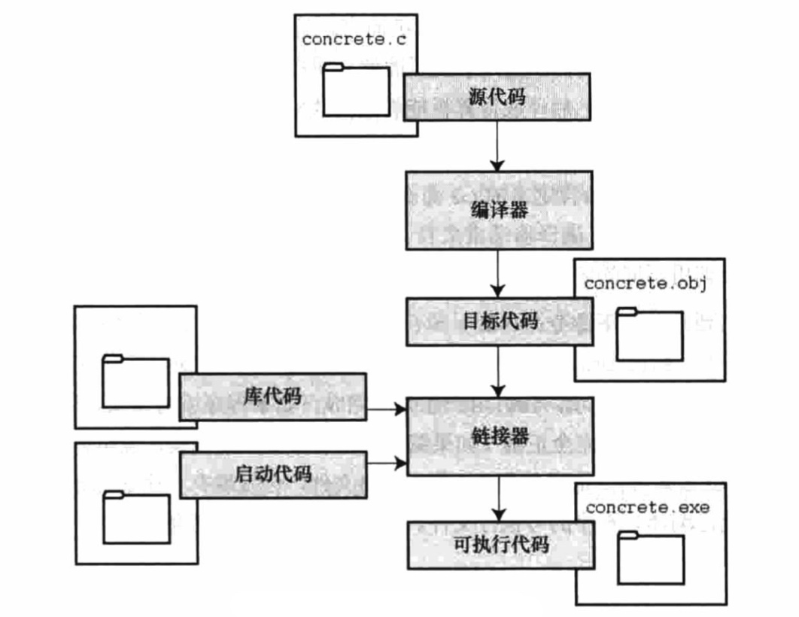

- **编译（Compile）**：编译器将后缀为 `.c` 的源代码转化为二进制的中间代码，存放于后缀为 `.o` 的目标文件中，因此中间代码也被称为目标代码

- **链接（link）**：链接器合并目标代码和其他代码，包括库代码和操作系统对应的启动代码，最终得到可执行文件

静态库是后缀为 `.a` 的文件，由多个后缀为 `.o` 的中间代码通过链接合并得到，链接过程中所合并的库代码指的就是静态库代码，因此使用静态库的程序最终生成的可执行文件的体积相对较大

动态库是后缀为 `.so` 的文件，也被称为共享库，可执行文件中不需要包含动态库代码，而只需在所有进程都可引用的存储区中保存它的一个副本。当程序首次执行或首次调用某个库函数时，用动态链接方法将程序与存储区中的动态库相链接，既能减小可执行文件的体积，又能便于升级库版本，虽然增加了一些运行时间开销 

## 基础语法
### 规则规范
C 代码规则：
- **逻辑行**：程序代码中的多个物理行被自动连接为一个逻辑行，每个逻辑行以 `;` 结尾，空白行会被自动忽略掉；预处理指令中的多个物理行则需要使用 `\` 来连接为一个逻辑行，但每个逻辑行不需要以 `;` 结尾

- **主函数**：`int main()` 是程序的入口函数，它向操作系统返回一个整数，作为运行该程序的进程的 **退出码（Exit Code）**

  主函数还有一种定义形式 `int main(int argc, char *argv[])`，以接收更多的参数，其中 `argc` 表示参数的数量，`argv` 表示包含参数指针的数组
  
  `argc` 在无程序执行参数时默认为 1，`argv[0]` 是指向程序的全路径，`argv[n]` 指向程序执行时的第 `n` 个参数，其中 `n < argc`，`argv[argc]` 为 `NULL`
  
- **标识符（Entity）**：变量名和函数名的统称，由小写字母、大写字母、数字和 `_` 组成，不能使用关键字，且首个字符必须为字母或 `_`，编译器仅识别局部标识符的前 63 个字符，外部标识符的前 31 个字符，且区分大小写  

- **退出函数**：使用 `exit(int)` 可以主动退出程序并返回一个退出码，主函数返回时会自动调用退出函数，`exit()` 推出前还会执行所有的退出回调函数，通过 `atexit(void (* _Nonnull)(void)` 能够注册退出回调函数

- **注释**：不会被编译为中间代码，可以通过下列方式表示

```c
// 单行注释

/* 
  多行注释
  多行注释
*/
```

C 代码规范：
- 宏的命名通常使用大写字母以及 `_` 组成
- 函数和变量的命名通常使用小写字母以及 `_` 组成
- 常量和枚举的命名通常使用大写字母以及 `_` 组成
- 类型别名通常使用小写字母以及 `_` 组成，并且附带 `_t` 后缀

### 变量
变量的类型声明相当于为分配内存地址，而变量的赋值相当于在其引用的内存地址中存储数据，然后通过变量就可以直接访问这个存储的数据

``` c
// 变量定义
int var_runoob = 10;
```

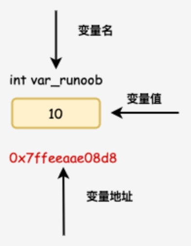

描述一个变量，除了使用数据类型和存储类型，还有以下的几个限定属性，在声明时确定这些属性，分别需要使用声明以下的类型限定符：
- `const`

  限定变量和函数形参为只读状态，用于变量时能将其转变为常量，用于函数形参时能够限定其在函数内不被改变，从而保护所传入的实惨
 
  当用于指针时，`const int * p` 表示指向 const int 类型的指针，`int * const p` 表示指向 int 类型的 const 指针

- `volatile`

  限定变量允许被非声明变量的线程所修改，通常用于基于硬件地址在多个线程中共享数据的情况。主要涉及编译器的优化，防止因高速缓存机制将这种跨线程的变量存储到 CPU 寄存器
  
- `restrict`

  限定该指针是访问对象的唯一方式，只能用于指针类型的变量或函数形参，从而允许编译器优化某部分的代码以更好支持运算，比如合并同一对象的多次计算

- `_Atomic`

  限定变量在同一时刻只能被一个线程所访问，用于在并发程序设计中解决多个线程共享数据的线程安全问题

对于指针类型的函数形参，新语法允许将 `static` 说明符和类型限定符的位置放到数组表示法的方括号中，新旧语法的实例如下：
``` c
// 旧语法，表示指针本身被限定
void old(int * const a, int * restrict b, int c)

// 新语法，指针可以使用数组表示法，并写入类型限定符到方括号中
void old(int a[const], int b[restrict], int c)

// static 还可以描述数组形参的最少元素个数
// 表示传入的实参为 int 数组且包含至少 20 个元素
void stick(int a[static 20])
```

### 函数
**函数（Function）** 指完成特定任务的独立程序代码单元，代码中可分为函数声明和和函数定义两部分，C 不允许在函数定义中不允许嵌套函数定义

函数声明和和函数定义的方式如下：
``` c
// 函数声明也称为函数原型，或者函数签名
// 用于向编译器提供函数的信息，确保函数正确调用
// 返回类型 函数名(形参列表);
int max(int num1, int num2);

// 函数声明可以忽略形参名字
int max(int, int);

// 函数定义包含函数声明和函数实现
// 用于描述具体需要执行的内容
int max(int num1, int num2){
    // 返回结果
    return num1 + num2
}

// 函数调用
int a = max(1, 3)
```

函数类型指的是函数的返回类型，若一个函数没有返回值，则其返回类型应该声明为 `void`

调用函数的传参方式可分为值传递和引用传递两种，C 使用值传递的方式，函数执行不会影响实参本身，若要实现引用传递的方式，则通过传递指针的值进行，使函数执行能够改变实参本身

函数的可变长参数通常在形参列表的末尾使用省略号 `...` 表示，在函数中通过以下几个函数的配合来获取这些参数，其原理是由于传入的实参栈区内存中是按顺序排列的，因此可以根据参数类型确定每个参数占有的空间大小，从而获取到下一个参数

``` c
int sum(int num_args, ...) {
   int val = 0;
   int i;
   
   // va_list 类型是用于存储参数的地址，在后续获取参数的函数都需要传入
   va_list ap;   
    
   // 开始获取参数，指定最后一个固定参数
   va_start(ap, num_args);
   
   for(i = 0; i < num_args; i++)
   {
     // 获取下一个参数并转换为 int 类型
      val += va_arg(ap, int);
   }
   
   // 结束获取参数，将 va_list 变量设置为 NULL
   va_end(ap);

   return val;
}
```

## 数据类型
### 字面值
**字面值（Literal）** 也称为**直接量**，表示一个 **区分数据类型的固定值（Fixed Value）**，直接用于赋值或传参。字面值类型包含以下几种：
- **整型字面值**
    - int 类型，如 `10`
    - long 类型，如 `100000L`
    - 以上例子是用十进制表示的，还可以用八进制表示，如 `071`，还可以用十六进制表示，如 `0xff`
    - 若字面值超过了对应数据类型的限制，则会触发编译错误

- **浮点型字面值**
    - float 类型，如 `11.4F`
    - double 类型，如 `1.21`

- **字符字面值**
    - char 类型，如 `'H'`
    - 可以用转义符来表示无法直接表示的字符，如 `\n`
    - 可以用 Unicode 编码表示，如 `\u0ff2`

- **字符串字面值**
    - char[] 类型，如 `"hello"`
    - 也可以使用转义符和 Unicode 编码表示

- **复合字面值**
    - type[] 类型，如 `{"a", "b"}`，用于对数组类型进行初始化和传参
    - struct 类型，如 `(struct_type){1, "ab"}`，用于对结构类型进行初始化和传参

### 基本类型
根据在计算机中的存储方式，可以将基本类型划分为以下两大类：
- **整数（Interger）**

  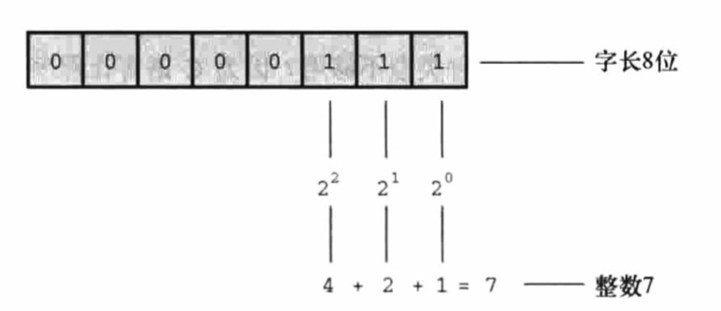

  无符号整数直接以二进制形式进行存储，有符号整数则将符号存储到最高位，而绝对值以二进制形式的补码存储到其他位
  
  当符号位为 0 时，表示为正整数，其补码与其原码相同；当符号位为 1 时，表示为负整数，其补码是其反码加 1
 
- **浮点数（Float）**

  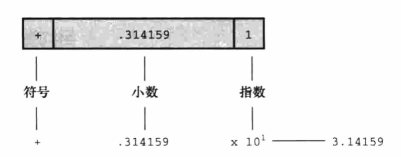
  
  浮点数先以科学计数法表示，即 $M \times 2^E$，然后存储时分为三个部分，分别是符号、小数部分（也称为尾数部分）和指数部分，其中小数部分以二进制形式进行存储，而指数部分加上中位数后以二进制形式进行存储
  
  由于二进制仅能表示无限小数的近似值，因此使用再多的位来存储，也会存在精度损失的情况，并且浮点数的运算相对于整数来说更慢一些

`int` 表示整数基本类型，可以通过 `short`、`long` 修饰符，来表示不同占用空间大小的整数型，如下：
- `int`：占用 32 bit 的空间大小，
- `short int`：可简写为 `short`，占用 16 bit 的空间大小
- `long int`：可简写为 `long`，占用 64 bit 的空间大小
- `long long int`：可简写为 `long long`，也占用 64 bit 的空间大小

对于以上整数型，还可以通过 `signed`、`unsigned` 修饰符来表示有无符号，若没有该修饰符的情况下默认为有符号整数

`char` 表示字符基本类型，从底层的存储方式来看其属于整数，占用 8 bit 的空间大小，其中正数部分的 `0 ~ 127` 分别对应 ASCII 编码中的字符

`char` 同样可以使用 `signed`、`unsigned` 修饰符来表示其底层存储的整数有无符号，若没有该修饰符的情况下，有无符号取决于编译器的实现，如果要针对该类型进行数值计算，则最好显式指定

`_Bool` 表示布尔基本类型，从底层的存储方式来看其属于整数，占用 1 bit 的空间大小，0 表示 false，1 表示 true

`float` 表示浮点数基本类型，占用 32 bit 的空间大小，其中小数部分占用 23 Bit 的空间大小，可精确表示至少 6 位有效数字

`double` 表示双精度浮点数基本类型，占用 64 bit 的空间大小，其中小数部分占用 52 Bit 的空间大小，可精确表示至少 10 位有效数字

`long double` 表示长双精度浮点数基本类型，占用 128 bit 的空间大小，具有更高的精度，可精确表示至少 18 位有效数字

对于以上浮点型，还可以通过 `signed`、`unsigned` 修饰符来表示有无符号，若没有该修饰符的情况下默认为有符号整数

以上基本类型的占用空间基于 Linux x86_64 环境，对于其他环境的占用空间情况如下：

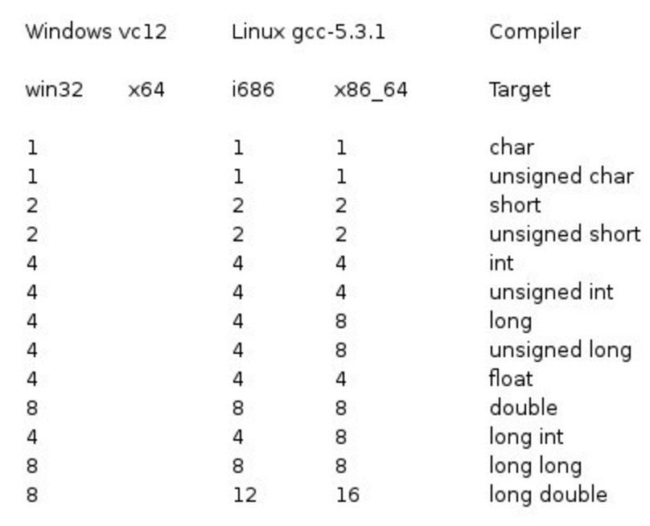

`typedef` 可以定义类型的别名，能够使类型用途更清晰，以及简化类型的使用。当定义在函数外时，别名具有文件作用域，当定义在函数中时，则别名具有块作用域，其用法如下：
``` c
// 自定义类型别名
typedef unsigned int u_int;

// 结合匿名结构使用
typedef struct {
    int a;
    int b;
} ab_struct_t;
```

`_Generic` 可以用于构造泛型选择表达式，即实参能够接收多种类型的数据，并根据其类型来返回不同的结果，使用方式如下：
``` c
// 由于变量 d 的类型匹配 int，因此返回结果为 0
// 类似 switch 语句，能够支持 default 项
int d = 5;
int rst = _Generic(d, int: 0, double: 1, char: 3, default: 4)

// 配合类函数宏定义，能够简化使用
#define MY_TYPE(x) _Generic(x, \
    int: 0, \
    double: 1, \
    char: 3, \
    default: 4)
    
int rst = MY_TYPE(d)
```

### 字符串
C 没有专用于存储字符 串的数据类型，而是通过字符类型的数组来实现的，因此 字符串变量也可以认为是个数组中首歌字符元素的指针

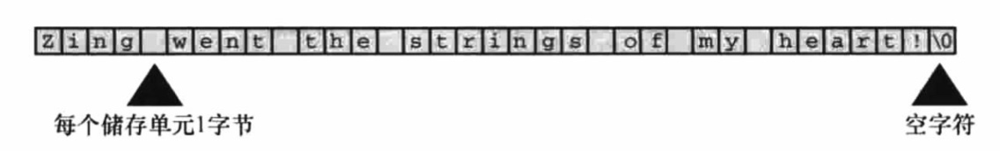

数组末尾的字符为 `\0`，这是一个 **空字符（Null Char）**，用于标记字符串的结束，这也意味着字符数组的容量必须比需要存储的字符串长度多 1

同时通过首字符指针来传递字符串实参时，也不需要传递字符串长度，因为可以通过判断空字符来获取完整字符串

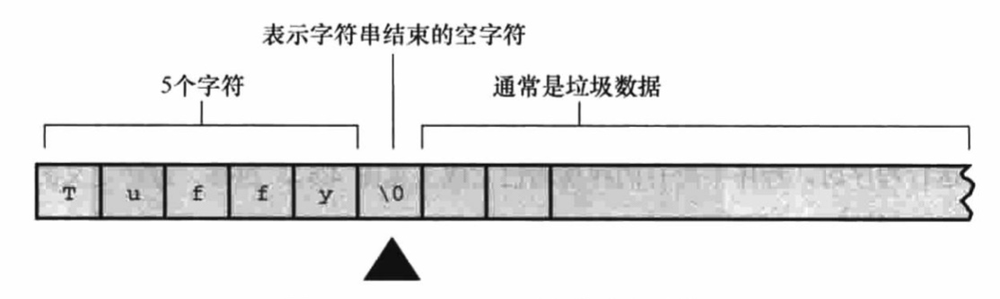

字符串的长度，指的是字符数组中在空字符前面的字符数目，而不是 `sizeof` 所得到的整个字符数组的空间大小

``` c
// 字符串定义
char str[6];

// 字符串初始化
char str[6] = "hello";

// 等价于使用数组的方式初始化
char str[6] = {
    "h", "e", "l", "l", "o", "\0"
};

// 没定义字符数组长度时，编译器会根据初始化内容决定长度
char str[] = "hello";
```

标准库提供了以下便于操作字符串的函数：
``` c
// 返回字符串的长度
size_t strlen(char *s)

// 将 s2 拼接到 s1 之后，返回 s1
// 当拼接后超出 str1 的字符数组容量时会出现越界问题
char *strcat(char *s1, char *s2)

// 只将 s2 的 n 个字符拼接到 s1 之后
char *strncat(char *s1, char *s2, int n)

// 比较两个字符串是否相同，如果相同则返回 0
// 如果不同，那就比较首个不同的字符，若 s1 中的字符的底层整数更大则返回 -1，否则返回 1
int *strcmp(char *s1, char *s2)

// 仅比较前 n 个字符
int *strncmp(char *s1, char *s2, int n)

// 将 s2 复制到 s1 之中，返回 s1
// 当 s2 的长度大于 s1 时会出现越界问题
char *strcpy(char *s1, char *s2)

// 仅复制前 n 个字符
char *strncpy(char *s1, char *s2, int n)

// 格式化字符串并填入 s1 中，成功则返回 0
int sprintf(char *s, char *format, ...)
```

### 数组
**数组（Array）** 用于有序存储一系列类型相同的数据，具有固定的长度，需要占用连续的内存空间，字符串类型便是由字符数组实现的

数组类型的定义和使用如下：
``` c
// 数组声明，表示存储 5 个 int 的数组，数组长度需要使用常量
int arr[5];

// 数组初始化，使用前先初始化，能防止脏数据的影响
int arr[5] = {0, 0, 0, 0, 0};

// 在初始化一个元素后，未初始化的其他元素会被置为 0
// 等同 {0, 0, 0, 0, 0};
int arr[5] = {0, 0, 0};

// 使用初始化器写法，可以指定某个元素的初始化
// 等同 {0, 0, 1, 2, 0};
int arr[5] = {0, [2] = 1, 2}

// 使用初始化器写法，不指定数组长度会自动分配合适长度
// 等同 {0, 0, 0, 0, 1, 2};
int arr[] = {0, [4] = 1, 2}

// 自动存储类型的数组支持使用变量来声明数组长度
int n = 5;
int arr[n];

// 通过下标访问数组中指定位置的元素，首个元素的下标为 0，末尾元素的下标为 size - 1 
int num = arr[4];
```
> 错误使用数组下标（index < 0 || index > size - 1），不会发生编译报错，而是会越界访问到一个不确定的内存地址，得到一个意料之外的值

多维数组的定义和初始化：
``` c
// 定义嵌套的二维数组
int num[4][4];

// 二维数组的初始化
int num[4][4] = {
    {0, 1, 2, 3},
    {0, 1, 2, 3}
    {0, 1, 2, 3}
    {0, 1, 2, 3}
};
```

C 变相利用了指针来高效处理数组，即数组变量实际上是指针类型，它所存储的值是数组首元素的地址，因此 `arr == &arr[0]` 的结果为 `true`。并且通过对数组变量进行指针运算，也能够访问数组中的指定元素

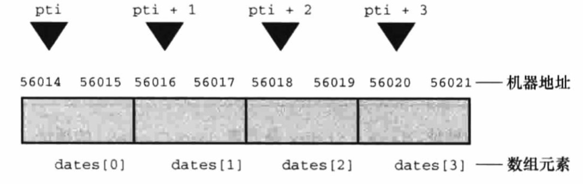

``` c
// int 类型占用空间为 4 bytes
int arr[5] = {1, 2, 3, 4, 5};

// 指针 + 1 表示右移 4 bytes
*arr == arr[0]
*(arr + 1) == arr[1] // true
*(arr + 2) == arr[2] // true

// 处理数组的函数，仅需要接收首元素指针和元素数目即可
void arr_func(int *first, int count);
// 两者等价，但此处可以使用下标
void arr_func(int arr[], int count);

// 在数组形参中使用 const，可以对数组中的数据进行保护
void arr_func(const int arr[], int count);

// 变长数组指通过其他形参来定义数组形参的长度
void arr_func(int count, int arr[count]);
```

除了 `strcpy()` 和 `strncpy()` 这两个支持字符串的复制函数，还有以下两个函数通过 `void` 指针类型参数，可以支持任意类型的复制函数，其用法如下：
``` c
// 将 s2 指定大小的内容复制到 s1，返回 s1
// 通过 restrict 假设了 s1 和 s2 没有内存重叠，可以直接进行复制
void *memcpy(void * restrict s1, const void * restrict s2, sizt_t size)

// 将 s2 指定大小的内容复制到 s1，返回 s1
// 允许s1 和 s2 存在内存重叠，利用了临时缓冲区来完成复制，性能较差
void *memmove(void * s1, const void * s2, sizt_t size)
```

### 枚举
**枚举（Enum）** 可理解为一系列命名整数常量的组合，这些命名整数常量又称为 **枚举常量**。当存放一个取值有限的数据时，使用枚举能够将所有的取值进行统一管理，以提高代码的可维护性

枚举类型的定义和使用如下：
``` c
// 定义
// 首个枚举常量没有指定值时，默认为 0
// 后续枚举常量没有指定值时，默认为上一个枚举常量的递增
enum weekday {Sun, Mon, Tue, Wed, Thu, Fri, Sat}; 
// 等同于 enum weekday {Sun=0, 
Mon=1, Tue=2, Wed=3, Thu=4, Fri=5, Sat=6}; 

// 枚举常量的值可以重复
enum weekday {Sun, Mon, Tue=1, Wed, Thu, Fri, Sat}; 
// 等同于 enum weekday {Sun=0, Mon=1, Tue=1, Wed=2, Thu=3, Fri=4, Sat=5}; 

// 使用
// 声明变量为枚举类型并赋值为对应枚举常量
enum weekday d = Sun;       

// 定义枚举类型同时声明其为变量类型
enum {Sun, Mon, Tue, Wed, Thu, Fri, Sat} d;

// 可以将枚举变量赋给整型变量
int i = d; 
```

`enum` 与 `typedef` 配合使用，能够通过类型别名来简化后续使用：

``` c
typeof enum {
    Sun, Mon, Tue, Wed, Thu, Fri, Sat
} weekday_t;

weekday_t d = Sun
```

枚举和类对象宏的功能类似，宏是在预处理阶段进行文本替换，而枚举则是在编译阶段来确定各个枚举常量的值，但宏不能形成便于管理的组合

### 结构
**结构（Struct）** 用于将一块连续内存空间划分为多个部分，每个部分可存储不同类型的数据，每个部分都拥有独立命名，也被称为 **成员（Member）** 或 **字段（Field）**。结构一种复合数据类型，并且占有固定的内存空间大小

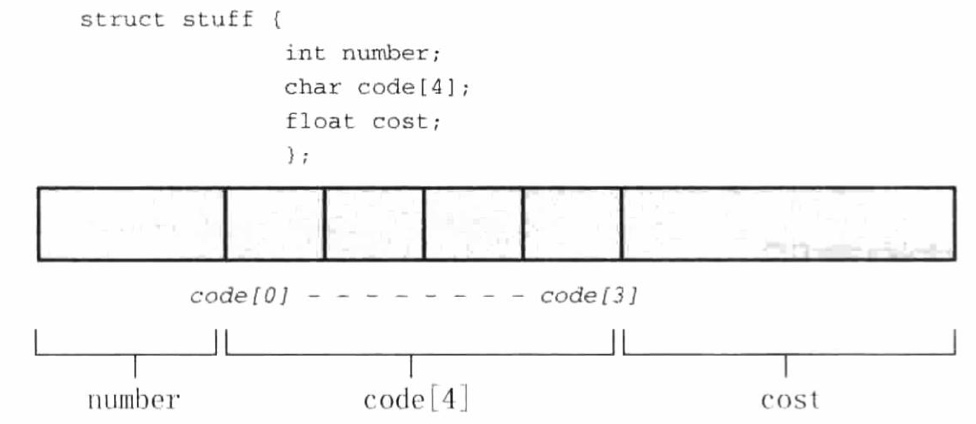

结构的定义和使用如下：
``` c
// 定义结构
struct my_struct {
    int a;
    char b[5];
    char c;
}

// 初始化结构
struct my_struct s = {
    1,
    "hehe",
    'v'
}

// 使用初始化器对指定成员进行初始化，没指定时表示为下一个成员
// 靠后的初始化会覆盖前面的初始化，下面 'w' 会覆盖 'z'
struct my_struct s1 = {
    .c = 'z',
    .b = "wawa",
    'w'
};

// `.` 成员运算符，用于通过结构体来访问其成员属性
s.a;    // 1

// `->` 间接成员运算符，用于通过指向结构体的指针来访问其成员属性
struct my_struct *ps = &s;
ps->b;  // "hehe"

// 相同结构的变量间可以进行赋值
s = s1
```

结构的最后一个成员支持定义为可伸缩性数组，通过动态分配内存来灵活确定该数组的长度
``` c
struct my_struct {
    int a;
    char b[];
}

// 将可伸缩数组的长度确定为 4
my_struct *my = malloc(sizeof(struct my_struct) + 4 * sizeof(char))
```

结构内部可以支持匿名结构和匿名联合，使用方式如下：
```c
// 定义包含匿名结构和匿名联合的结构
struct my_struct {
    int a;
    struct {
        char y[5];
        int  n;
    };
    union {
        double v;
        int w;  
    }; 
}

// 初始化结构
struct my_struct s = {
    1,
    {"wawa", 5},
    {1.1}
}

// 访问匿名结构中的成员，可以直接通过结构访问
struct my_struct *s1 = &s
s.y
s1 -> n

// 指定类型访问匿名联合，可以直接通过结构访问
s.v
s1 -> w
```

**位字段（Bit Field）** 是一个由具有特定数量的位组成的整数变量，整数类型可以是 `int`、`unsigned int` 或 `_Bool`，在结构中定义位字段，可以实现进行基于二进制的位操作

每个位字段通过使用标签来确定其所占的位数，位字段占用的总位数没有限制，但一个位字段不允许跨越两个所定义整数类型的边界，否则编译器会自动移动跨界的位字段以保持对齐，这样一来前面的整数类型将会留下一个未被任何位字段引用的洞

使用占用位数为 0 的位字段，可以强制使下一个位字段与下一个整数变量进行对齐

``` c
// 结构总共占用 3 个 unsigned int 的空间
// 后续的位字段总共占用 2 个 unsigned int 的空间
struct bmap {
    unsigned int f0;
    unsigned int f1 : 1;
    unsigned int f2 : 2;
    unsigned int f3 : 1;
    unsigned int f4 : 0;    // 强制对齐
    unsigned int f5 : 1;
    unsigned int f6 : 1;
}

// 按位赋值
struct bmap bm;
bm.f2 = 3
bm.f5 = 1

// 位字段组合并转化为 unsigned int
// 位字段存储在 unsigned int 顺序是从后往前的
unsigned int *i1 = (*int)(&bmap + 1)    // 6
unsigned int *i2 = (*int)(&bmap + 2)    // 1
```

### 联合
**联合（Union）** 能够在同一块内存空间存储多种类型中任一类型的数据，每种类型都拥有独立命名，代表当前访问内存所使用的类型，其占用的最大内存空间取决于占有内存空间最大的类型

联合的定义和使用方式如下：
``` c
// 联合定义，最大占有空间为 10 Bytes
union me {
    int age,
    char name[10];
    double size;
};

// 联合初始化，不指定类型时表示首个类型
union me a = {5};
union me a = {.name = "hehe"};

// 使用 `.` 运算符通过联合指定当前使用的数据类型
a.age

// 使用 `->` 运算符通过联合指定当前使用的数据类型
union me *b = &a
```

使用联合将位字段操作和位运算两种位操作方式结合到一个类型中

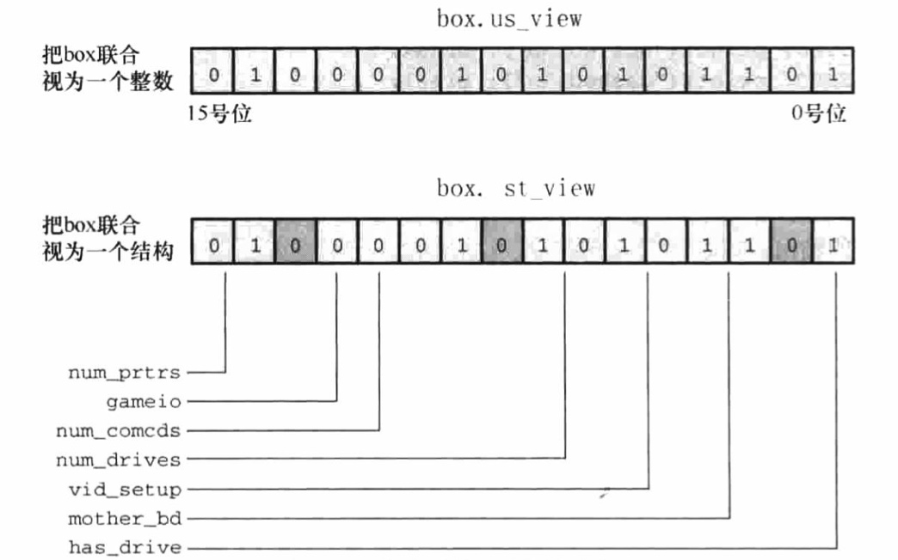

``` c
// 联合两种类型
union view {
    struct bit_map st_view;
    unsigned short us_view; 
};

// 使用位字段操作
union view v1;
v1.st_view.gameio = 1
v1.st_view.hasdrive = 1

// 使用位运算
union view v2;
v2.us_view | v1.us_view
```

### 指针
**指针（Pointer）** 用于存储指定类型数据在虚拟内存空间中的地址，地址是以 Byte 为单位划分的，通过指针能够在函数调用时实现引用传递

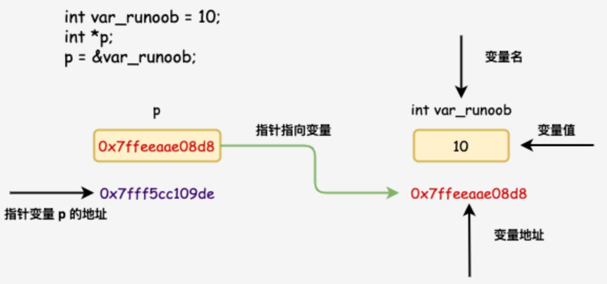

指针的使用方式如下：
```c
// 定义指针类型，表示一个指向整型的指针
int *intp;

// 指向 void 的指针，表示一个通用指针，可以强制转化为指向任意类型的指针
void *voidp;
int *intp = (int *)voidp

// 使用取址运算符，获取对象的内存地址
int a = 3;
intp = &a;

// 使用间接运算符，获取指针所引用的对象本身，也称为解引用
*intp = 5;
```
> 未初始化的指针可能包含随机脏数据，进行解引用可能会覆盖内存中的其他数据或者代码，导致程序崩溃

指针运算是依据存储单元进行的，而不是依据内存地址进行的，如下：
``` c
// 根据当前指针的指向类型，返回下 N 个存储单元的地址
intp ++;
intp += 2;

// 根据当前指针的指向类型，返回上 N 个存储单元的地址
intp --;
intp -= 2;

// 指针相等比较，可判断指针是否引用同一个数据
intp2 == intp1

// 相同类型的指针求差，返回两个指针之间相隔的存储单元数目
intp2 - intp1
```

与指针相关的复杂声明方法：
``` c
// 指针数组
int *p_arr[]

// 数组指针，由于 `[]` 的优先级更高，因此需要使用 `()`
int (*arr)[]

// 指向函数的指针，需要声明函数类型、形参类型
void (*pf)(char *)

// 将函数赋值到函数指针，可将函数作为实参传递
void Upper(char *);
pf = Upper
```

`NULL` 表示空指针，不会与任何内存地址相对应，在函数中通常用于返回一个有效的地址，以表示有特殊的情况发生

### 运算
表达式用于进行运算，可以由运算符和运算对象所组成，根据运算的返回内容，能够划分为三种种类型的运算

**返回数值的运算**

- **赋值运算符**

  等于 `=`、加等于 `+=`、减等于 `-=`、乘等于 `*=`、除等于 `/=`、取模等于 `%=`、 按位与等于 `＆=`、按位或等于 `|=`、按位异或等于 `^=`、按位左移等于 `<<=`、按位右移等于 `>>=`

  > 赋值运算符左边的值被称为 **左值（Left Value）**，而右边的值被称为 **右值（Right Value）**，C 中的赋值运算符会返回左值
  >
  > 除了 `=` 的其他运算符，表示先使用变量值进行运算，再赋值回变量中，且强制保持类型不变。比如 `short a = 5; a *= 5;`，结果 `a` 为 `25`
  > 
  > `a *= 5` 不等于 `a = a * 5`，因为前者类型保持不变，后者的 `a * 5` 会被转化为 int 类型，因此 `a *= 5` 等于 ` a = (short)(a * 5)`

- **算术运算符**

  加 `+`、减 `-`、乘 `*`、除 `/`、取模 `%`、自增 `++`、自减 `--`

  > `v++` 和 `v++` 分别表示变量 `v` 在被访问前自增和被访问后自增
  >
  > 当一个变量出现在一个函数的多个参数中时，不要使用自增和自减运算符，容易产生意料之外的结果

- **位运算符**

  按位与 `＆`、按位或 `|`、按位异或 `^`、按位取反 `~`、按位左移 `<<`、按位右移 `>>`

  > `<<` 和 `>>` 在移动过程中符号位不变，`>>>` 在移动过程中符号位会被置 0

- **其他运算符**

  `sizeof obj` 能够获取对象所占用的空间大小，`sizeof` 是一个运算符，但也能以函数调用的方式使用，即 `sizeof(obj)`
  
  `sizeof` 返回的结果类型为 `size_t`，是一个无符号整数类型的别名，它以 Byte 为单位

**返回布尔值的运算**
- **关系运算符**

  大于 `>`、大于等于 `>=`、小于 `<`、小于等于 `<=`、等于 `==`、不等于 `!=`

永远不要记忆和使用隐式的运算优先级，而是应该通过括号 `()` 来显式定义各个运算的优先级，便于保证代码的可读性

- **逻辑运算符**

  逻辑与 `&&`、逻辑或 `||`、逻辑非 `!`

  > 当运算结果已决定时，不会继续后续的运算，比如 `a && b`，若 `a` 表达式为 `false`，不会执行 `b` 表达式，这个现象称为短路现象

### 类型转换
当出现数据类型不匹配的情况时，C 不会直接报错，而是会采用一套规则进行 **类型自动转换**，以下能够触发类型自动转换的场景：
- 当使用不同的数据类型进行运算时，低级类型会转换为相同的高级类型

- 当使用不同的数据类型进行赋值时，右边的值会转换为左边变量的数据类型

- 当使用不同的数据类型进行函数调用传参时，实参会转换为形参的数据类型

- 当使用不同的数据类型进行函数返回时，返回值会转换为所定义的返回值类型

> 其中赋值运算符包含了运算和赋值两个场景

数据类型的级别定义，主要有以下三点规则：

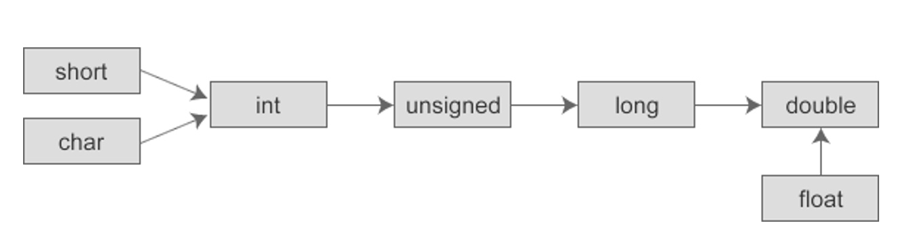
- 占用空间越大的数据类型越高级
- 无符号的数据类型比有符号的高级
- 浮点数类型比整数类型高级

在运算的场景中，为了保证结果的精度，当类型不匹配时，低级类型会自动转换为高级类型，这也称为 **类型升级(Type Promotion)**。此外还有以下两条类型升级规则：
- 由于 CPU 难以直接实现空间占用太小的数据类型运算，因此 `char` 和 `short` 会升级为 `int`
- 由于浮点数是基于双精度进行运算的，因此 `float` 间运算也会升级为 `double`

在除了运算的其他场景中，类型自动转换可能会导致 **类型降级（Type Demotion）**，从而损失数据的精度，这是需要开发者注意避免的

自动类型转换由于是隐式的，过于依赖可能会导致代码的可读性变差，以及无法准确地控制转换的目的数据类型，此时可以使用 **强制类型转换** 来规避这些问题，通过 `(type)` 作为运算符表示强制转换为指定类型

## 控制语句
### 条件控制
**if 条件语句**

``` java
if (布尔表达式 A) {
    // 布尔表达式 A 为 true 时执行
    语句 A;
} else if (布尔表达式 B) {
    // 布尔表达式 A 为 false，但布尔表达式 B 为 true 时执行
    语句 B;
} else {
    // 布尔表达式 A 和布尔表达式 B 都不为 true 时执行
    语句 C;
}

// 简写的条件语句
if (布尔表达式 A) 语句 A;
else 语句 B;

// 三元条件表达式，是 if else 的简便写法
// 布尔表达式为 true 时返回表达式 A 的结果，否则返回表达式 B 的结果
布尔表达式 ? 表达式 A : 表达式 B;
```
> 布尔表达式的结果判断都基于其底层存储的数字，仅有 0 表示 false，其他的值表示 true，而空字符串由于是字符数组，其底层存储的是首元素指针，因此也为 true

**switch 分支语句**

``` c
switch(表达式) {
    case 字面值 1 :
        // 表达式结果为字面值 1 时执行
        语句 A;
        // 若没有 break 语句，则会继续进入下一个 case，称为 case 穿透现象，应该避免
        break;
    // case 合并
    case 字面值 2 : case 字面值 3 :
        // 表达式结果为字面值 2 或字面值 3 时执行
        语句 B;
        break;    
    ...
    default :
        // 表达式结果不为任一 case 的值时执行
        语句 C;
}
```
> 表达式和值的类型只能为整数类型，包括 `int`、`char`

### 循环控制
**for 循环语句**

``` c
for (初始化表达式; 布尔表达式; 更新表达式) {
    // 布尔表达式为 true 时循环执行
    循环体;
}

// 可以使用 `,` 隔开，从而定义多个初始化表达式和更新表达式
for (初始化表达式1, 初始化表达式2; 布尔表达式; 更新表达式1, 更新表达式2) {
    // 布尔表达式为 true 时循环执行
    循环体;
}
```

**while 循环语句**
``` c
while (布尔表达式) {
    // 布尔表达式为 true 时循环执行
    循环体;
}
```

**do while 循环语句**

``` c
do {
    // 循环执行直到布尔表达式为 false
    循环体;
} while (布尔表达式);
```
> 循环体至少会执行一次

**内部控制语句**

- `break;`

  用在循环语句或者 switch 语句中，用来跳出整个语句块

- `continue;`

  可用于循环语句中，用于立刻跳转到下一次循环的迭代。在 for 循环中，即跳转到更新语句；在 while 或者 do while 循环中，即跳转到布尔表达式判断

- `goto`

  可用于任意位置中，通过指定一个已定义的标签，实现跳转到任意位置继续执行。但这个语句会增加代码复杂度，因此应该避免使用。语句使用和标签定义的方式如下：
  
  ``` c
  if (a > 2) {
    // 直接指定标签进行跳转
    goto part1;
  } 
  
  a += 1
  goto part2;gdb
  
  // 标签定义
  part1: a += 2;
  part2: a += 3;

  // 效果等同于仅使用 if else，但代码阅读复杂度变大很多
   if (a > 2) {
      a += 2;
  } else {
      a += 1;
  }
  a += 3;
  ```
  
## 预处理指令
**预处理（Preprocess）** 又称为 **预编译（Prebuild）**，编译器在正式开始编译程序之前，会执行一段预处理程序，又称为 **预处理器（Preprocessor）**，来完成对程序的预处理行为

### 文件包含
`#include` 指令用于引入头文件，预处理器会将指定头文件的内容插入到指定位置，从而把头文件和当前源文件连接成一个源文件，从而实现分离编译和代码复用

编译器把包含了其他头文件内容的源文件视为一个 **翻译单元（Translation Unit）**，即多文件程序是由多个翻译单元组成，并且每个翻译单元能够进行独立的编译

头文件以 `.h` 为后缀，用于存放宏定义、外部静态变量或常量、类型定义和函数原型，然后提供给各个源文件进行包含，然后与头文件相对应的函数实现代码，则存放在以 `.c` 为后缀的同名源文件中

``` c
// 引入标准库头文件或者实现版本所提供的头文件
// 通常在环境变量定义的目录中搜索
#include <文件名>

// 引入自定义头文件
// 通常在当前目录和环境变量定义的目录中搜索
#include "文件名"
```
> `C_INCLUDE_PATH` 或 `CPATH` 环境变量的默认值通常为 `/usr/local/include;/usr/include`

`#include` 语指令可以嵌套使用，预处理器最多允许 15 层的嵌套，使用 `#ifndef` 指令可以防止因嵌套导致的重复包含问题 

### 宏定义
`#define` 指令用于定义一个 **宏（Marco）**，预处理器会将所有后续出现的宏替换为指定内容，该过程被称为 **宏展开（Macros Explain）**，这是一种纯粹的文本替换操作

宏可以包括 **类对象型（Object-like）** 和 **类函数型（Funciton-like）** 两种，其用法如下：
``` c 
// 类对象型，可用于定义明示常量
#define COUNT 1000

// 宏定义可以引用已定义的宏
#define MAX_COUNT COUNT + 100

// 类函数型
#define SUM(a,b,c) a + b + c

// 使用 # 连接实参表示将其转为字符串
#define debug(str)   fprintf(#str)

// … 作为形参表示可变参数
// __VA_ARGS__ 会替换传入的所有实参
#define debug(...)   fprintf(stderr, __VA_ARGS__)

// 可以自定义可变参数的标识符
#define debug(Args...)   fprintf(stderr, Args)

// 当可变参数不是首个参数时，至少需要有一个实参传入
// 要允许没有参数传入，则使用 ##__VA_ARGS__，自动消除前面连接的逗号
#define debug(format, ...)   fprintf(format, ##__VA_ARGS__)
```

C 编译器内置了一些与运行环境相关的预定义宏，程序可以直接通过这些类对象宏获取环境信息：

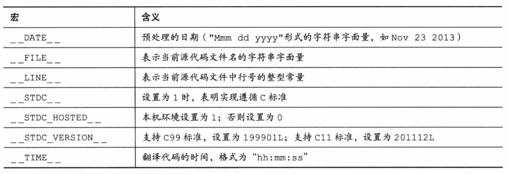
> 还有一个编译器内置的预标识符 `__func__`，可以获取当前执行的函数名

某些标准库的头文件中会通过类对象宏定义表示明示常量，比如 `limits.h` 中就声明与整数基本类型大小限制相关的数值。类对象宏和静态变量的区别主要包括：
- 后者会受到变量作用域的约束
- 前者不占用内存，不存在于编译器使用的中间表示里
- 前者能用于编译时的常量表达式

`#undef` 指令用于取消一个宏的定义，其用法如下：

``` c
// 取消类对象宏
#undef COUNT

// 取消类函数宏，只指定名字不需指定参数
#undef debug
```

### 条件编译
条件指令用于根据条件来指定需要预处理和编译的内容，包含了 `#if` 和 `#ifdef` 两个系列的指令，其用法如下：

``` c
#define A 0

// 当表达式为真时，则其中的内容会被预处理和编译
#if (A > 1)
    #define B 0
    printf("A > 1"); 

#elif (A == 1)
    #define B 1
    printf("A == 1");

#else
    #define B 2
    printf("A < 1");

#endif

// 当宏已定义时，则其中的内容会被预处理和编译
// 等同于 #if defined(A)
#ifdef A
    #define B 0
    printf("A"); 
#endif

// 当宏未定义时，则其中的内容会被预处理和编译
// 等同于 #if !defined(A)
#ifndef A
    #define A 0
#endif
```

### 其他指令
 `#line` 指令能够重置内置的 `__LINE__` 和 `__FILE__` 宏，其用法是：
``` c
// 仅重置当前行数
#line 1000

// 重置当前行数和执行文件名
#line 1000 "exec_name"
```

`#error` 指令能够触发编译错误并输出指定信息，其常见用法是：
``` c
#ifndef ENV
    #error Env Is Error
#endif
```

`#pragma` 指令能够替换为对应的编译器指令，以开启某些功能的支持，其常见用法是：
``` c
// 启用对 c99 标准的支持
#pragma c9x on
```

## 内存管理
C 提供了多种不同的 **存储类型（Storage Class）** 在内存中存储数据，每份数据所占用的存储单元称为 **对象（Object）**，对象可以通过 **标识符** 来引用，也可以通过指针来反引用

标识符可以通过 **作用域（Scope）** 和 **链接（Linkage）** 进行描述，而对象可以通过 **存储期（Storage Duration）** 进行描述，不同的存储类型具有不同的存储期、作用域和链接属性

### 标识符描述
作用域是程序中可以访问标识符的代码区域，一个标识符的作用域可以是以下四种情况：
- **块作用域**

  用于定义在块中的标识符，块是使用 `{}` 扩住的内容，可以是代码块、函数体和控制语句，控制语句中初始化的标识符也属于本块。这些标识符只能是变量，其可见范围是从定义处到包含该定义的块的末尾

- **函数作用域**
 
  用于 `goto` 语句的标签名，其可见范围是从标签定义处直到函数结束。与块作用域相比，其可见范围突破了块的限制，避免了在两个块中使用相同标签导致的代码混乱

- **函数原型作用域**

  用于函数原型中的形参名，其可见范围是从形参定义处到原型声明结束。只有在变长数组中，函数原型的形参名才有用，否则会被编译器忽略处理

- **文件作用域** 

  用于定义在函数之外的标识符，若是变量也称被为全局变量，其可见范围从定义处到该定义所在文件的末尾

标识符具有三种链接属性，分别是 **外部链接**、**内部链接** 和 **无链接**，其区分方式如下：
- 具有块作用域、函数作用域或函数原型作用域的标识符都属于无链接，即这些标识符被定义它们的块、函数或函数原型所私有

- 具有文件作用域的可以属于外部链接或内部链接，外部链接标识符可以在多个翻译单元中使用，而内部链接标识符只能在一个翻译单元中使用

### 对象描述
存储期是对象能够在内存中保留的时间，一个对象的存储期可以是以下四种情况：
- **静态存储期**

  具有文件作用域的标识符，其引用的对象都是静态存储期，静态存储期对象在程序执行期间一直存在，且在内存中是不会变动的，但并不代表值不会变化。静态存储期对象的数量在编译时确定，若静态存储期对象显式初始化，则编译器默认会将其初始化为 0

- **线程存储期**

  用于在并发程序设计中，程序执行被分为多个线程，具有线程存储期的对象，从被声明时到线程结束一直存在

- **自动存储期**

  具有块作用域的变量通常都具有自动存储期，从进入声明变量的块时到退出块一直存在变长数组是从声明处到块的末尾一直存在，而不是从入声明变量的块开始存在
  
  自动存储期变量所占的内存可以视为一个可重复利用的暂存区，静态存储期对象如果未主动初始化，则内存中可能存在垃圾数据
  
- **动态分配存储期**

  由程序代码动态控制对象的分配和回收

### 变量存储类型
为变量提供的存储类型有以下五种，分别具有不同的存储期、作用域和链接属性：

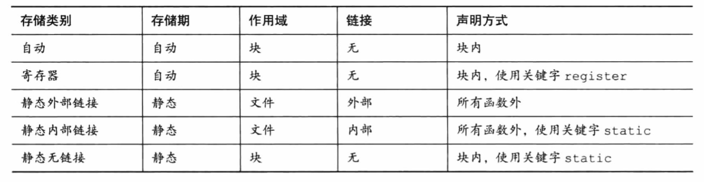

- **自动存储类型**

  在块内声明的变量默认属于自动存储类型，为了代码清晰，也可选择在声明时显式使用 `auto` 说明符，也被称为局部变量，对象存储在用户空间的栈段
  
- **寄存器存储类型**

  使用 `register` 说明符且在块内声明的变量属于寄存器存储类型，对象被存储在 CPU 寄存器而并非内存中，拥有更快的访问速度，但无法获取它的内存地址

- **静态外部链接存储类型**

  在函数外声明的变量属于静态外部链接存储类型，对象存储在用户空间的数据段，也被称为外部变量，可以在本文件中使用，或者被任意文件中使用 `extern` 说明符进行声明的标识符引用
  
- **静态内部链接存储类型**

  在文件中使用 `static` 说明符进行声明的函数属于静态内部链接存储类型，对象存储在用户空间的数据段，可以在本文件中使用，或者被本文件中使用 `extern` 说明符进行声明的变量引用
  
- **静态无链接存储类型**

  在块内声明并使用 `static` 关键字进行修饰的变量属于静态无链接存储类型，对象存储在用户空间的数据段，程序可以多次进入块和退出块的过程中访问这个变量

### 函数存储类型
为函数提供的存储类型有以下三种，其中两种与变量存储类型一致，还有一种则是函数所独有的存储类型：
- **静态外部链接存储类型**

  在文件中声明的函数属于静态外部链接存储类型，也被称为外部函数，可以在本文件中使用，或者被任意文件中使用 `extern` 说明符进行声明的标识符引用

- **静态内部链接存储类型**

  在文件中使用 `static` 说明符进行声明的函数属于静态内部链接存储类型，可以在本文件中使用，或者被本文件中使用 `extern` 说明符进行声明的变量引用
  
- **内联存储类型**

  在文件中使用 `inline` 说明符进行定义的函数属于内联类型，它具有文件作用域，必须使用 `static` 说明符将其表示为内部链接，因为跨文件时编译器无法还原内联函数，没有独立的存储期，只是调用它的父函数的一部分

### 说明符
存储类型的说明符，用于在声明标识符时表示其存储类型，通常情况下多个说明符不可一起使用，其用法如下：

``` c
//  说明符置于声明语句的开头
register int num = 1;
static void get_num();
```

表示说明符的关键字有以下六个：
- `auto`

  表示变量是自动存储类型，仅能用于块作用域的变量

- `register`

  表示变量是寄存器存储类型，仅能用于块作用域的变量

- `static` 

  表示标识符具有静态存储期，可用于块作用域的变量，表示变量是静态无链接存储类型，也可用于文件作用域的标识符，表示变量或函数是静态内部链接存储类型

- `extern`

  表示声明的标识符定义在本文件或其他文件的别处，如果用于文件作用域的标识符，则所引用的标识符必须具有外部链接属性，如果用于块作用域的变量，则所引用的变量必须具内部链接属性或外部链接属性

  对于函数声明是隐式使用的，而对于变量声明需要显式使用，这种声明通常存放于头文件中，从而引用对应源文件中定义的对象
  
  当与 `"C"` 连用时说明函数的编译方式，比如 `extern "C" func` 表示告知编译器在编译函数 `func` 时按着 C 的规则去翻译，而不是按照 C++ 的规则。目的是避免 C++ 由于支持重载，将函数名翻译得面目全非

- `_Thread_local`

  表示声明的变量是线程私有的，每个线程都具有一个该标识符的私有备份
  
- `inline`

  需要在函数定义时使用，而不是函数声明时使用。表示定义的函数是内联函数，内联函数在编译时会把内联函数调用转换为内联函数体，从而在运行时避免函数的频繁调用，减少重复开辟栈段带来大量的消耗
  
  内联函数只能对简单的函数，不能是递归函数，不能包含复杂的结构控制语句比如 `while`、`switch`
  
  内联函数是以代码膨胀为代价的，换取栈段内存的开辟消耗，若滥用将使程序的体积增大，从而消耗更多的程序段空间

### 动态内存管理
除了选用包含一定内存管理规则的存储类型，得到对应存储器的对象，还可以通过库函数进行动态地内存管理，得到自定义存储器的对象，然后通过指针反引用来引用这个对象

动态分配的对象被存放在用户空间的堆段，由于堆段是由程序自主管理的，可能会产生内存碎片，因此使用堆段内存通常比栈段内存的速度要慢

`stdlib.h` 标准库中用于内存管理的库函数如下：
``` c
// 分配指定内存空间大小的对象，并返回指向内存地址的通用指针
// 失败则返回空指针
void	*malloc(size_t __size)

// 分配指定存储单元个数和内存空间大小的对象
void *calloc（size_t __count, size_t __size）

// 对指定对象重新分配指定的内存空间大小
void *realloc（void *ptr, size_t __new_size）

// 分配指定对齐值和内存空间大小的对象
void *aligned_alloc(size_t alignment, size_t size)

// int 设置为 0，能够对分配的对象初始化，也可以用于对任何类型的对象初始化
void *memset(void *b, int c, size_t len)

// 释放指定对象的内存空间
void	free(void *);
```

使用 `malloc` 分配一组指定类型的对象时，可以得到一个变长数组对象，并且能通过下标来进行元素访问
``` c
struct TreeNode {
    int val;
    struct TreeNode *left;
    struct TreeNode *right;
};

int main(){
    struct TreeNode *node = (struct TreeNode*)malloc(sizeof(struct TreeNode)*100);
    // 使用下标
    node[0].val = 1;
    node[1].val = 2;
    // 使用指针偏移
    (*(node+1)).val = 3;
}
```

### 字节对齐
内存是以字节为单位进行编址的，理论上 CPU 可以从任意地址访问某种基本数据类型，但实际上大部分 CPU 并非逐字节大小地读写内存，而是以 2、4、8、16 甚至 32 倍数的字节块地读写内存

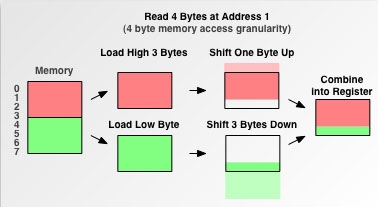

为了提高 CPU 的内存读写效率，则需要对基本数据类型的合法地址作出一些限制，比如其地址必须是 2、4、8、16 甚至 32 的倍数，也就要求各种数据类型需要按照这个限制在内存空间上排列，这就是 **对齐（Align）**，而这个倍数就是对齐值

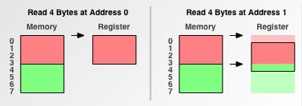

`_Alignof` 运算符可以获取指定类型的对齐值，而 `_Alignas` 说明符可以指定一个类型或变量的对齐值，其使用方式如下：
``` c
// 获取对齐值
size_t align_n = _Alignof(double);

// 指定对齐值，可以指定具体对齐值，或者指定类型的对齐值
_Alignas(double) int;
static _Alignas(8) int v2;
```

所指定的对齐值必须是 2 的非负整数次幂，并且不可以小于类型的基本对齐值

## 项目结构
C 项目最佳实践的目录结构如下：

```
Project
|-- Makefile           <- 编译配置
|-- README             <- 基本介绍
|-- bin                <- 所有的可执行文件
|-- docs               <- 项目相关文档
|-- build              <- 编译产生的目标文件和临时文件，每次需要清理
|-- include            <- 所有本项目的头文件
|-- lib                <- 编译所需要的第三方或其他所有库
|-- src                <- 所有本项目的源文件
`-- tests              <- 单元测试或其他测试文件
```

