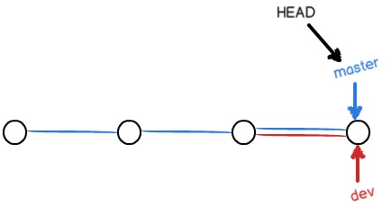

# 【Devops】Git

* [【Devops】Git](#devops-git)
    * [简介](#简介)
    	* [数据和对象](#数据和对象)
    	* [内容提交](#内容提交)
    * [常用操作](#常用操作)
    	* [帮助和配置](#帮助和配置)
    	* [获取本地仓库](#获取本地仓库)
    	* [提交内容](#提交内容)
    	* [版本回滚](#版本回滚)
    	* [删除和撤销](#删除和撤销)
    	* [远程仓库](#远程仓库)
    	* [标签管理](#标签管理)
    * [分支管理](#分支管理)
    	* [分支操作](#分支操作)
    	* [分支结构](#分支结构)
    	* [冲突解决](#冲突解决)
    	* [BUG 修复](#BUG-修复)
    	* [远程分支](#远程分支)
    * [自定义功能](#自定义功能)
    	* [忽略文件](#忽略文件)
    	* [追踪空目录](#追踪空目录)
    	* [命令别名](#命令别名)
    	* [指定私钥](#指定私钥)
    	* [批量修改提交](#批量修改提交)

## 简介
Git 是一个 **目前最强大的、开源的、基于快照的、分布式的版本控制系统**，能够快速高效地管理从小型到超大型项目的所有内容

Git 对比 **基于差异的、集中式的版本控制系统（如 SVN）** 的优势：
- **基于快照**：Git 通过直接记录快照来保存数据，并不是通过记录文件差异，版本提交和回滚都会更加高效

- **分布式**：每个开发者本地都存在完整的版本库，可以进行代码提交、回滚、查看历史等本地操作，后续再提交到中央版本库，而不需要一直保持连接，并且操作也更加高效

[官方网站](https://git-scm.com/) 和 [廖雪峰教程](https://www.liaoxuefeng.com/wiki/896043488029600)

### 数据和对象
Git 的数据管理涉及以下仓库和分区的划分：
- **远程仓库（Remote）**：远程主机上的 Git 仓库，如托管在 github 上的 Git 仓库

- **本地仓库**：本地的 Git 仓库
    - **工作区（Workspace）**：直接进行修改的分区，就是除了 `.git` 子目录的所有内容
    - **暂存区（Index / Stage）**：暂存已修改数据的分区，存在于版本库中，是 `.git/index` 子目录
    - **版本库（Repository）**：存放已提交数据的分区，就是 `.git` 子目录


每个 Git 仓库都是负责管理单个项目的目录，目录由对应项目的内容和 `.git` 子目录组成，因此将项目目录初始化为 Git 仓库，实际上就是为它初始化了一个 `.git` 子目录

`.git` 子目录存储着其所在 Git 仓库相关的所有对象和元信息，目录结构如下：

``` bash
.git
|-- HEAD         # 指向当前分支的指针，分支所指向的提交代表了该分支的版本
|-- config       # 项目配置信息
|-- description  # 项目描述信息
|-- hooks/       # 默认的钩子脚本目录
|-- index        # 索引文件，即暂存区
|-- logs/        # 每个 refs 的历史信息
|-- objects/     # 本地仓库的所有 Git 对象
|-- refs/        # 本地仓库的分支和标签
`-- remotes/     # 远程仓库的信息、分支和标签
```

Git 涉及的对象类型，即存在于 `.git/objects/` 目录中的对象类型，共有以下三种：
- **Tree**：代表一个目录，存储着目录的结构，其中存在指针会指向多个 Blob 对象
- **Blob**：代表一个文件，存储着文件内容
- **Commit**：代表一个提交，存储着提交信息，其中存在指针会指向一个 Tree 对象

三种对象在不同分区的表现形式如下：


在 `.git/refs/` 目录中，`heads/` 目录保存的是分支，`tags/` 目录中保存的是标签，这些分支和标签都是轻量级的指针，指向 `.git/objects/` 目录中的 Commit 对象，Commit 对象的数据结构如下：


包含其指向的 Tree 对象、父 Commit 对象、作者、提交者和 Commit 备注

### 内容提交
Git 仓库中的文件分为三种状态：
- **已修改（Modified）**：文件被修改了，仍处于工作区
- **已暂存（Staged）**：文件被修改了，已加入暂存区
- **已提交（Committed）**：文件已经被保存到版本库

内容提交的工作流程为：
1. 在工作区修改文件
2. 将想要下次提交的文件选择性地添加到暂存区
3. 提交暂存区的文件到版本库


提交操作的过程为：
1. 将已修改内容的快照永久性存储到版本库中
2. 根据所有内容生成 SHA-1 散列值，作为本次提交的 Commit Id
3. 将 HEAD 指向本次提交，严格来说是将当前分支的指针指向本次提交，而 HEAD 始终指向当前分支

## 常用操作
### 帮助和配置
``` bash
# 获取 git 使用帮助
git help

# 获取 git 子命令使用帮助
git help ${command}

# 查看 git 配置信息
git config --list

# 配置对当前 Git 仓库使用的用户名和邮箱
# --global 配置作用于全局，即对所有 Git 仓库生效
# 全局配置存储在 `~/.gitconfig` 文件
# 局部配置存储在 Git 仓库目录下的 `.git/config` 文件
git config user.name ${username}
git config user.email ${email}
```

### 获取本地仓库
``` bash
# 有两种方式：
# 1、将项目目录初始化为本地仓库，需要手动关联远程仓库
cd ${project}/
git init

# 2、克隆远程仓库为本地仓库，自动关联远程仓库
# git 支持多种协议如 https、ssh 的 ${remote_url}，但 ssh 的速度最快
git clone ${remote_url}
```

git clone 会自动关联远程仓库并命名为 origin，并拉去远程仓库中的所有分支，分支对应命名为 `remotes/origin/${branch}`，其中 `remotes/origin/HEAD` 为远程仓库默认分支，指向 `orgin/master`（等价于 `remotes/origin/master`）


远程仓库的信息、分支和标签都保存在 `.git/remotes/` 目录中，且所有远程的分支和标签都指向当前拉取到本地的 Commmit 对象，表示远程的分支和标签与本地仓库提交的对应关系

使用指定的私钥进行克隆远程仓库
``` bash
# 启用一个 ssh 客户端并执行 bash 终端，然后添加指定的私钥
ssh-agent bash
ssh-add ${private_key_path}
git clone ${remote_url}
```

### 提交内容
``` bash
# 查看本地仓库状态，可以得到以下信息：
# 1、当前分支
# 2、未添加到暂存区的已修改内容
# 3、已添加到暂存区的已修改内容
git status

# 查看指定文件在工作区和暂存区之间的差异
git diff ${path} 

# 查看指定文件在工作区和版本库指定提交间的差异
# ${commit} 可以是 HEAD 也可以是 commit id
# HEAD 为当前提交，HEAD^ 为上一个提交
# HEAD^^ 为上两个提交，HEAD~N 或 HEAD@{N} 为上 N 个提交
# -- 表示之后的内容都被视为目录或文件
`git diff ${commit} -- ${parh}`

# 查看指定文件在暂存区和版本库指定提交间的差异
`git diff --cached {commit} -- ${path}`

# 添加工作区的内容到暂存区
git add ${path}

# 撤销暂存区的内容到工作区
git restore --staged ${path}

# 提交暂存区的内容到版本库
git commit -m ${comment}
```

### 版本回滚
``` bash
# 查看版本库的提交记录
# –pretty=oneline 表示只显示 commit id 和备注
git log --pretty=oneline
# 查看存在或不存在于指定分支的提交记录
# 表示存在于分支 branch1 且不存在于分支 branch2
git log ${branch1} ^${branch2}

# 查看所有分支头部指针的指向变更记录
# 版本回退后，git log 无法查看较新提交的 commit id，需要用 git reflog 来查看
git reflog

# 回退版本
# 回退版本后再想回退至较新的提交，${commit} 的值必须用 commit id
git reset --hard ${commit}
# 影响回滚程度的参数：
# --soft    仅将 HEAD 指向指定的提交
# --mixed   在 --soft 基础上，将暂存区更新为指定的提交，默认程度
# --hard    在  --mixed 基础上，将工作区更新为指定的提交
```

### 删除和撤销
``` bash
# 删除工作区的内容，并记录该操作到暂存区
git rm ${path}

# 记录指定内容的删除操作到暂存区，但工作区不影响
git rm --cache ${path}

# 撤销工作区没有暂存的修改内容
git checkout -- ${path}

# 对于 rm 操作的文件删除，由于只影响了工作区，可以直接使用 git checkout 撤销
# 对于 git rm 操作的文件删除，由于同时影响了工作区和暂存区，需要使用 git reset --hard 来回退，会丢失最近一次提交后所修改的内容

# 对于文件添加修改，由于只影响了工作区，可以直接使用 git checkout 撤销
# 对于文件添加修改且暂存，由于同时影响了工作区和暂存区，可以先使用 git restore --stage 撤销暂存区的内容，再使用 git checkout 撤销
```
> 在 git 2.23 版本后，git switch 和 git restore 代替 git checkout 的功能，前者负责切换分支，后者负责撤销内容

### 远程仓库
``` bash
# 添加远程仓库并命名为 origin，origin 是 git clone 使用的默认远程仓库名
# 使用 ssh 不仅速度快，而且可以利用公钥进行认证，无需像 https 每次都需要输入验证
git remote add origin ${remote_url}

# 查看远程仓库及其权限
# fetch 表示有提取代码权限，push 表示有推送代码权限
git remote -v 

# 删除远程仓库
git remote rm ${remote_name}

# 推送内容到指定远程仓库 origin 的 master 分支
# -u 表示当前分支对远程仓库分支进行上游关联，后续再次使用 git pull、git push 时可以简化命令
git push -u origin master
# 进行上游关联后的简化命令
git push
# 仅当本地分支领先于远端分支的提交时，才允许完成推送
# 若要强制进行推送，可以使用 -f 选项
git push -f

# 从远程仓库 origin 的 master 分支拉取内容，并合并到当前分支
git pull -u origin master
# 进行上游关联后的简化命令
git pull
# 远程分支:本地分支 可合并到指定本地分支
git pull origin master:dev

# 从远程仓库 origin 的 master 分支拉取内容，但不进行合并动作
git fetch origin master
# 从远程仓库 origin 的所有分支拉取内容
git fetch
# git pull 相当于 git fetch + git merge，但并不推荐用前者，因为容易造成无意识的 merge

# 当前分支对指定远程仓库分支进行上游关联
git branch --set-upstream-to=${remote_branch}
```

### 标签管理
``` bash
# 创建标签，无 ${commit} 时默认使用 HEAD
git tag ${tag_name} ${commit}

# 查看所有标签
git tag

# 删除指定标签
git tag -d ${tag_name}

# 推送指定标签到远程仓库
git push origin ${tag_name}

# 推送所有未推送的标签到远程仓库
git push origin --tags

# 从远程仓库删除指定标签
git push origin :refs/tags/${tag_name}
```

## 分支管理
### 分支操作
``` bash
# 查看本地分支和当前分支
# -a 查看所有分支，包含远程分支
git branch

# 创建分支
# 初始化 Git 仓库时会自动创建 master 分支，也就是主分支
git branch ${branch}

# 创建远程分支，即推送本地分支到远程
git push origin ${branch}:${branch}

# 切换当前分支，即切换 HEAD 所指向的分支
# -b 表示先创建分支再进行切换
git checkout ${branch}

# 2.23 版本后，为了分解 git checkout 的功能，使用 git switch 来切换分支
# -c 表示先创建分支再进行切换
git switch ${branch}

# 合并指定分支到当前分支
# 如果合并过程是直接把当前分支指向指定分支的当前提交，则称为快进模式（Fast-forward）合并
# 快进模式合并的速度很快、无需备注，但 git log 无法查看分支合并历史
# --no-ff 可以禁用快进模式合并，当前分支会指向一个新提交，后续可以查看分支合并历史
git merge ${branch} -m ${comment}

# 删除分支
# -D 强制删除未合并的分支，默认仅允许删除已合并的分支
git branch -d ${branch}

# 查看指定分支（包括远程分支）对比当前分支的文件差异
# 接上 -- ${path} 可以比较指定文件
git diff ${branch} 
# 查看分支 2 对比分支 1 的文件差异
git diff ${branch1} ${branch2}

# 合并分支除了可以 merge，还可以使 rebase，而且可以使分支的 commit 记录保持线性
# 其作用是使当前分支基于指定分支，并将当前分支的提交差异进行提交
git rebase ${branch}
```

### 分支结构
Git 分支结构是一个有向无环图（DAG），仅存在单个分支时：


创建 dev 分支：


在 dev 分支进行一次新的提交：


合并 dev 分支到 master：



删除 dev 分支：


rebase 和 merge 分支，分支结构变化的区别如下：


### 冲突解决
当 master 分支和 feature1 分支各自都分别有新提交，分支结构如下：


若两个提交都对同一文件进行过修改，则分支合并后将发生冲突，冲突的文件显示如下：
``` bash
<<<<<<< HEAD
it is old_content
=======
it is new_content
>>>>>>> feature1
```

手动修改解决文件冲突，再次提交
``` bash
git add ${path}
git commit -m "conflict fixed"
```

<br>
解决冲突后，分支结构如下：


``` bash
# 查看分支合并结构图
git log --graph --pretty=oneline
```
结果如下：
```
*   c0dfce6f1ed9eb3f157da9ab4d6cdcc2bf1f124a conflict fixed
|\  
| * ab530888dbfcd4c2d6f78cf1ff7d453c31f99598 feature commit_1
* | f0169b10358c6646dd1d2bab961a457be846f9f2 master commit_2
|/  
* db0688a3b8c9935c3eb5a03eedfc52fae8f883f6 master commit_1
```

### BUG 修复
当开发过程中需要修复 BUG 时，可以先把当前分支的修改储存起来，然后新建临时分支来完成 BUG 修复，最后再恢复之前存储起来的修改

``` bash
# 存储当前分支工作区和暂存区的修改
git stash
git stash save ${comment}

# 查看所有的储存
s

# 查看储存的修改详情，无 ${stash} 时默认是最近的存储，即 stash@{0}
git stash show ${stash}

# 应用存储，无 ${stash} 时默认是最近的存储，即 stash@{0}
git stash apply ${stash}

# 删除存储，无 ${stash} 时默认是最近的存储，即 stash@{0}
git stash drop ${stash}

# 应用并删除存储，无 ${stash} 时默认是最近的存储，即 stash@{0}
git stash pop ${stash}

# 清除所有存储
git stash clear
```

当在 master 分支完成 BUG 修复后，由于 dev 分支是在修复前创建的，因此也存在 BUG，这时 dev 也需要完成一次这个提交以修复 BUG
``` bash
# 复制指定提交的修改到当前分支，并完成提交
git cherry-pick ${commit}
```

### 远程分支
``` bash
查看远程分支和本地分支对应的跟踪情况
git remote show origin

清理已被删除的远程分支
git remote prune origin
```

## 自定义功能
### 忽略文件
通过在 Git 仓库目录下添加 `.gitignore` 文件可以设置让 git 忽略不进行管理的文件

通常需要忽略的文件：
- 操作系统自动生成的文件
- 编译生成的中间文件、可执行文件
- 带有敏感信息的配置文件

[.gitignore 官方样例](https://github.com/github/gitignore)

### 追踪空目录
Git 无法追踪一个空目录，当用户需要追踪一个空目录时，则需要创建一个 `.gitkeep` 文件放到目录中

若希望忽略一个目录中的所有文件，但保留该目录，则需要搭配 `.gitignore` 来实现：
```
# ignore all files in lib/
lib/*
# except for .gitkeep
!.gitkeep
```

### 命令别名
通过修改 `~/.gitconfig` 文件或 Git 仓库目录下的 `.git/config` 文件，可以全局或者局部为 git 命令设置别名，以简化操作

修改样例：
``` ini
[alias]
    co = checkout
    ci = commit
    br = branch
    st = status
    last = log -1
```

### 指定私钥
通过修改 `~/.gitconfig` 文件或 Git 仓库目录下的 `.git/config` 文件，可以全局或者局部设置指定的 ssh 私钥

修改样例：
``` ini
[core]
    sshCommand = "ssh -i ~/ssh_key/my_private.key"
```

### 批量修改提交
定义脚本：
``` bash
#!/bin/sh
my
git filter-branch --env-filter '

# 之前的邮箱
OLD_EMAIL="my@bytedance.com"
# 修改后的用户名
CORRECT_NAME="near-notfaraway"
# 修改后的邮箱
CORRECT_EMAIL="near.notfaraway@gmail.com"

if [ "$GIT_COMMITTER_EMAIL" = "$OLD_EMAIL" ]
then
    export GIT_COMMITTER_NAME="$CORRECT_NAME"
    export GIT_COMMITTER_EMAIL="$CORRECT_EMAIL"
fi
if [ "$GIT_AUTHOR_EMAIL" = "$OLD_EMAIL" ]
then
    export GIT_AUTHOR_NAME="$CORRECT_NAME"
    export GIT_AUTHOR_EMAIL="$CORRECT_EMAIL"
fi
' --tag-name-filter cat -- --branches --tags
```

运行脚本后，强制推送到远程仓库：
``` bash
sh change_commits.sh
git push --force --tags origin 'refs/heads/*'
```