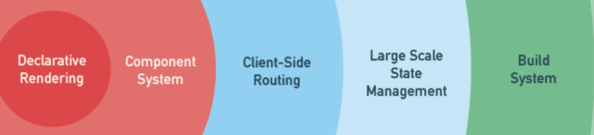
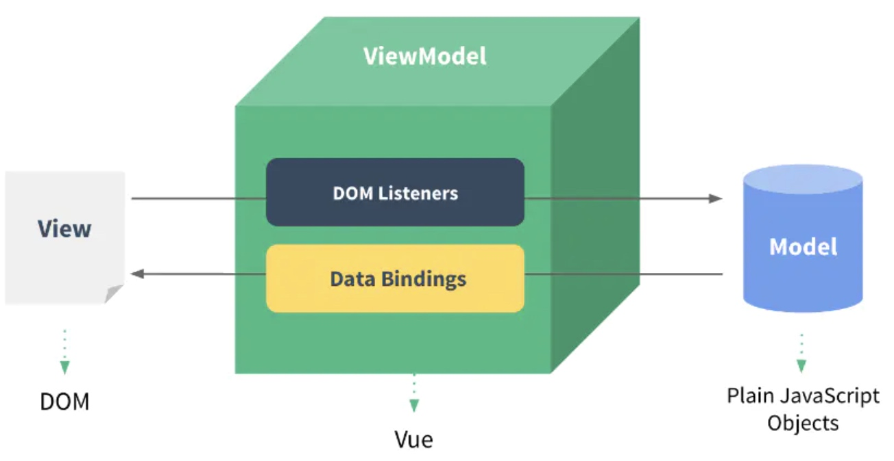
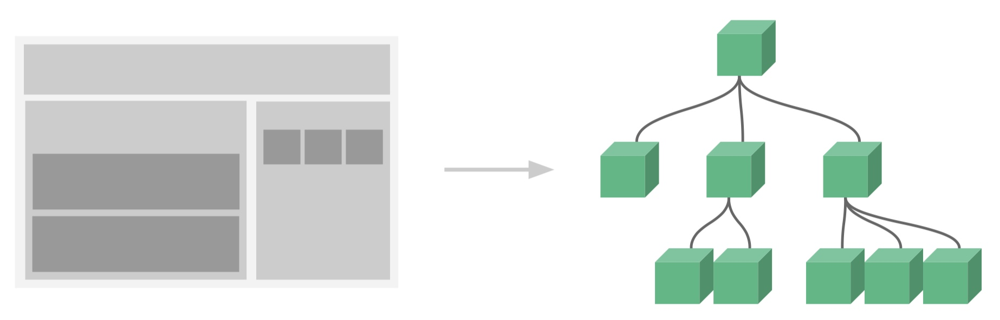
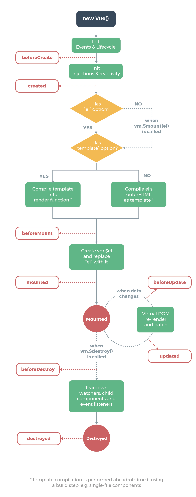
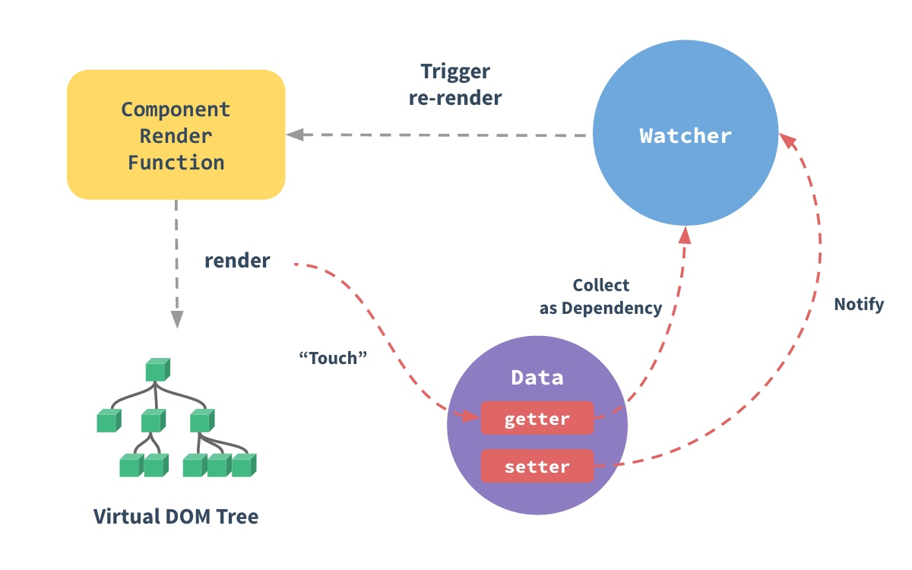
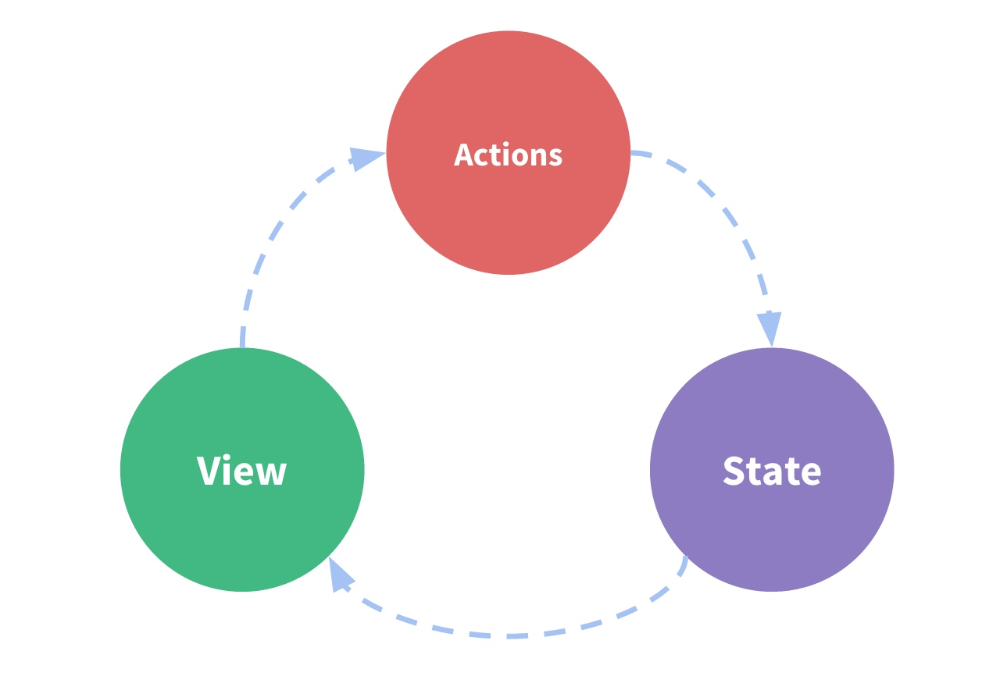
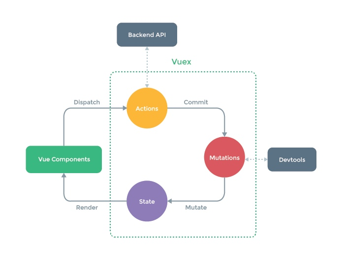

# 【Frontend】Vue2

* [【Frontend】Vue2](#frontendvue2)
   * [简介](#简介)
   * [Vue 实例](#vue-实例)
      * [创建和挂载](#创建和挂载)
      * [生命周期](#生命周期)
      * [响应式数据](#响应式数据)
      * [其他选项](#其他选项)
   * [Vue 组件](#vue-组件)
      * [组件注册](#组件注册)
      * [单文件组件](#单文件组件)
      * [属性传入](#属性传入)
      * [方法调入](#方法调入)
      * [事件抛出](#事件抛出)
      * [默认插槽](#默认插槽)
      * [具名插槽](#具名插槽)
      * [作用域插槽](#作用域插槽)
   * [Vue 模版](#vue-模版)
      * [语法和指令](#语法和指令)
      * [值渲染](#值渲染)
      * [样式渲染](#样式渲染)
      * [条件渲染](#条件渲染)
      * [循环渲染](#循环渲染)
      * [事件监听](#事件监听)
      * [输入绑定](#输入绑定)
   * [Vue 路由](#vue-路由)
      * [引入和设置](#引入和设置)
      * [基于模版控制路由](#基于模版控制路由)
      * [基于方法控制路由](#基于方法控制路由)
      * [嵌套路由](#嵌套路由)
   * [Vuex](#vuex)
      * [引入和设置](#引入和设置-1)
      * [状态和获取](#状态和获取)
      * [转变和动作](#转变和动作)
      * [模块化](#模块化)
   * [开发部署](#开发部署)
   * [相关插件框架](#相关插件框架)

## 简介
Vue.js 是一套用于构建用户界面的 **渐进式框架**，可以 **自底向上逐层应用**，其核心库只关注视图层，不仅易于上手，还便于与第三方库或既有项目整合，虽然目前已发布新的 3.x 版本，但生产环境的主流版本仍为 2.x 版本，[官方文档](https://cn.vuejs.org/v2/guide/)，[官方 API](https://cn.vuejs.org/v2/api/)

- **渐进式框架**：弱主张，可以只使用框架中所需要的部分，不需要捆绑接受太多相关的东西，比如将它作为作为工具在原有系统上使用

- **自底向上逐层应用** ：可以从直接面对用户的视图层开始，然后逐层进行使用框架来实现，自底向上的层次：

   

其两个核心特点如下：
- **数据双向绑定**

  Vue 基于 MVVM 模式实现了 DOM 和 Vue 实例的数据双向绑定：
  - **DOM -> Vue 实例**：通过注册 DOM 事件监听
  - **Vue 实例 -> DOM**：通过设置 Vue 实例对于数据的 `getter` 和 `setter` 方法

  

  其中 DOM 是文档对象模型，提供了 JavaScript 访问和操作 HTML 元素的标准接口，而 Vue 实例就是图中的纯对象，指的是通过 `{}` 或 `new` 创建出来的对象，一般是 key-value 形式的对象

  MVVM 模式的三个层级：
  - **模型层（Model）**：负责处理业务逻辑以及和服务器端进行交互
  - **视图层（View）**：负责将数据模型转化为页面展示出来
  - **视图模型层（ViewModel）**：作为 Model 和 View 之间的通信桥梁，维护了两者之间的数据同步

- **组件化管理**

  可以把页面拆分成多个组件，每个组件是资源独立，即所依赖的 CSS、JavaScript、HTML 模板、图片等资源是独立开发和维护

  并且组件在系统内部可复用，并且组件和组件之间可以嵌套

  

## Vue 实例
### 创建和挂载
一个 Vue 应用由一个通过 `new Vue()` 创建的根实例，以及可选的、嵌套的、可复用的组件实例树所组成。对于创建出来的 Vue 实例，需要通过挂载来确定和某个具体 DOM 元素之间的绑定关系

``` js
var vm = new Vue({
  // 这是一个选项对象 options object
  // 可以定义各个 Vue 实例选项
})

// 实例化时传入 el 选项来挂载 DOM 元素，其值是一个标签选择器
// 只在使用 new 创建 Vue 实例时有效
var vm = new Vue({
    el: '#app'
})

// 实例化时若没有传入 el 选项，则实例将处于未挂载状态
// 需要手动通过 $mount() 方法为实例挂载一个 DOM 元素
// 当没有传入参数时，默认挂载 id 为 app 的元素
vm.$mount('#app')
```

通过其他更高优先级的选项来完成实例的挂载

``` js
// template 选项优先级比 el 选项高
// 直接为实例挂载到所传入的 DOM 元素
var vm = new Vue({
    template: '<HTML></HTML>'
})

// render 选项优先级比 template 选项和 el 选项高
// 会为实例挂载到通过 createElement 方法创建得到的  DOM 元素
var vm = new Vue({
    render: function (createElement) {
                return createElement('h1', 'blogTitle')
            }
})
```

Vue 实例通常被命名为 `vm`（ViewModel），实例中包含一系列名为 `vm.${property}` 的实例属性，用于存放实例化时的选项对象以及运行过程中的信息，并且提供了一系列 名为 `vm.${method}` 实例方法，用于调用与数据、事件和生命周期相关的功能

``` js
var vm = new Vue({
  el: '#example',
  data: { a: 1 }
})

// 实例属性
vm.$data === data // => true
vm.$el === document.getElementById('example') // => true

// 实例方法
vm.$watch('a', function (newValue, oldValue) {
  // 这个 function 回调将在 `vm.a` 改变后调用
})
```

### 生命周期
从调用 `new Vue()` 实例化开始，Vue 实例需要经历各个生命周期阶段，通过 Vue 实例选项能创建相关的钩子函数，从而完成自定义的逻辑处理，其完整的生命周期阶段如下：



- 实例创建前后
  
    触发钩子：-> `beforeCreate` -> `created`
    
1. 触发 `beforeCreate`，此时实例完成了事件和生命周期相关的初始化，事件指父组件在子组件上定义的事件，只能通过 `this` 访问到 `vm.$parent` 和 `vm.$createElement` 等有限的属性和方法，常用于初始化一些非响应式的属性

2. 触发 `created`，此时实例完成了依赖注入和响应式相关的初始化，可以通过 `this` 访问到 `vm` 中的 `inject`、`props` 、`data`、`computed`、`methods`、`watch` 等大部分属性和方法，常用于进行简单的 ajax 请求和初始化，复杂的处理会导致页面白屏时间过长

- 实例挂载前后

    触发钩子：-> `beforeMount` -> `mounted`

1. 首先会判断 `vm.$options` 是否有 `el` 选项，若有则继续，若无则暂停直到在 `vm.$mount(el)` 被调用来设置 `el` 选项

2. 接下来会判断 `vm.$options` 是否有  `template` 选项，若有则将其作为模板，若无则将 `el.outerHTML` 作为模板，编译为 render 函数，然后触发 `beforeMount`

3. 判断 `vm.$options` 是否有 `render` 选项，若无则使用上面编译得到的 render 函数，若有则直接使用选项指定的 render 函数，然后传入数据进行渲染，将得到的节点赋值到 `vm.$el`，并挂载到 DOM 上

4. 触发 `mounted`，此时可以通过 `this` 访问到 `vm.$ref`、`vm.$el` 等属性，`vm.$el` 是已渲染的真实节点，常用语操作访问和操作节点，进行 ajax 请求

- 实例更新前后

    触发钩子：-> `beforeUpdate` -> `updated`

1. 当实例的数据发生了变化，则会触发 `beforeUpdate`，然后重新使用 render 函数和传入变化后的数据进行渲染，将得到的真实节点更新到 `vm.$el`，并挂载到 DOM 上，最后再触发 `updated`

- 实例销毁阶段

    触发钩子：-> `beforeDestroy` -> `destroyed`

1. 当实例被调用 `vm.$destroyed()` 进行销毁，会触发 `beforeDestroy`，此时常用于销毁定时器、解除全局时间、销毁插件对象等操作

2. 然后所有的数据监视、子组件都会、事件监听都会被移除，最后触发 `destroyed`

> 当一个组件不需要在页面中存在时，该组件就会自动被调用进行销毁，而再次需要该组件时，才会重新对其进行实例化和挂载

### 响应式数据
`data` 选项定义了 Vue 实例的数据对象，即包含一个或者多个 key-value 的字典，作为根实例选项时其值可以是一个对象或一个返回对象的函数，而作为组件实例选项时只能是一个返回对象的函数，因为组件可能被用来创建多个 Vue 实例，需要避免变量共享的情况

``` js
// 创建 Vue 根实例时
var vm = new Vue({
    el: "#app",
    data: {a: 123}
})

// 创建组件时
Vue.component('name', Vue.extend({
    // options...
    template: '<HTML></HTML>',
    data() {
        return {a: 123}
    }
}))
```

Vue 实例会递归地代理 `data` 对象中的所有属性，且为这些属性设置 `getter` 和 `setter` 方法，通过 `getter` 访问数据时会收集依赖，而通过 `setter` 修改数据时会触发依赖更新，从而使 `data` 对象中的属性都称为能够动态响应的数据



`data` 对象中以 `_` 或 `$` 开头的属性不会被 Vue 实例代理，因为它们可能和 Vue 内置的属性和方法名字发生冲突

响应式数据无法在 Vue 实例完成创建后添加，因此应该提前声明所有的响应式数据，并且为其设置一个初始值。在 Vue 实例完成创建后，可以通过 `vm.$data` 访问原始的数据对象

当数据类型是引用类型时，某些发送内存修改时并不能被 Vue 实例所响应，比如数组增加或删除元素能被响应，但数组中的元素发送改变不能被响应，对象修改已存在的属性能被响应，而对象新增新的属性不能被响应。可以使用 `vm.$set()` 方法来修改引用类型的数据，保证 Vue 实例能够做出响应

可以通过使用 `Object.freeze()` 方法来阻止修改指定对象现有的属性，同时意味着 Vue 无法再对其进行动态响应，用于不需再次改变的数据能够提升性能

### 其他选项
虽然模板中指令支持的表达式非常便利，但其设计的初衷是用于简单运算的，因此不应该放入太多的复杂逻辑，而是应当使用计算属性来代替

`computed` 选项定义了 Vue 实例的计算属性对象，和 `data` 选项一样其中的属性会递归地被 Vue 实例代理，通过计算属性的 `getter` 方法可以访问其值，而通过计算属性的 `setter` 方法可以设置其值

``` js
var vm = new Vue({
  el: '#example',
  data: {
    message: 'Hello',
    name: 'Mike'
  },
  computed: {
    // 仅指定计算属性的 getter 函数
    reversedMsg: function () {
      return this.message.split('').reverse().join('')
    },
      
    // 同时指定计算属性的 getter 和 setter 函数
    fullName: {
        get: function () {
            return this.name + " Chen"
        },
        set: function (newValue) {
            this.name = newValue.split(' ')[0]
        }
    }
})
```

对于一些需要触发的复杂处理逻辑，则通过为 Vue 实例自定义的方法来执行，`methods` 选项定义了 Vue 实例的方法对象，和 `data` 选项一样其中的属性会递归地被 Vue 实例代理

``` js
var vm = new Vue({
  el: '#example',
  data: {
    message: 'Hello'
  },
  method: {
    getReversedMsg: function () {
      return this.message.split('').reverse().join('')
    }
  }
})
```

看起来类似的计算属性和方法，其存在很大的区别：
- **访问方式不同**：访问计算属性直接能得到值，而访问方法则得到函数，需要调用才能得到值

- **执行机制不同**：计算属性是基于其依赖的数据进行缓存的，，只在相关依赖发生才会重新求值，而方法每次调用都会完整地执行。因此前者可以节约计算开销，而后者则可以执行不可省略的处理

若期望某个实例数据发生变动时，能够触发一些复杂的逻辑处理，类似融合了计算属性和方法的特点，则可以使用到侦听器

`watch` 选项定义了 Vue 实例的侦听器对象，其中对象的 Key 是需要侦听的实例数据，也可以使用表达式，而其 Value 则是实例数据变化后需要触发的回调函数

``` js
var vm = new Vue({
  el: '#watch-example',
  data: {
    question: '',
    answer: 'none of question!'
  },
  watch: {
    question: function (newQuestion, oldQuestion) {
      console.log(newQuestion)
      this.answer = 'answer for ' + newQuestion
    }
  },
}
```

Vue 实例选项中的函数或方法，比如各个生命周期钩子函数、`computed` 中的 `getter` 和 `setter` 函数、`method` 中的方法、`watch` 中回调函数对象中的函数，它们的调用方都是当前的 Vue 实例，因此其中都可以使用 `this` 指代当前的 Vue 实例

## Vue 组件
### 组件注册
组件是可复用的 Vue 实例，并且需要携带一个组册名字，和根实例所能接收的选项基本相同，除了一些根实例特有的选项如 `el`，以及组件实例特有的选项如 `name`、`prop`

组件的注册方式分为 **全局注册和局部组册** 两种，分别表示不同大小的组件作用域。全局注册后的组件可以在任何的新创建 Vue 实例的模版中使用，包括在其子组件中，并且全局注册需要在 Vue 实例初始化前进行：
``` js
Vue.component('name', {
    // options...
    template: '<HTML></HTML>'
})

// 等同于以下方式
// Vue.extend() 用于根据选项返回组件实例
Vue.component('name', Vue.extend({
    // options...
    template: '<HTML></HTML>'
}))
```

`Vue.component()` 方法中的 `name` 参数表示组件的注册名字。若注册使用了驼峰式命名，则引用时使用的组件标签既可以是驼峰式命名，也可以是中横杠式命名，比如注册命名为 `bottonRow`，所对应的组件标签可以是 `<bottonRow>` 或 `<botton-row>`；若注册时使用了中横杠式命名，则引用时使用的组件标签只能是中横杠式命名

局部注册后的组件，仅能在所属 Vue 实例的模版中使用，即使在其子组件中也不能使用，并且局部注册在创建 Vue 实例时通过 `components` 选项来定义：
``` js
var vm = new Vue({
    el: '#app',
    components: {
        name: {
            template: '<HTML></HTML>'
        }
    }
})
```
`components` 选项中的 `name` 键和 `Vue.component()` 方法中的 `name` 参数一样，表示组件的注册名字

当完成注册后，在组件的作用域内，可以通过类似于使用自定义标签的方式，进行任意次数地引用组件：
```
<template>
    <name></name>
    <name></name>
</template>
```

在组件实例中的 `name` 选项是非必选的，不能跟 `name` 参数做混淆，其主要有三个作用，分别是允许组件模板递归地调用自身、以及用于组件缓存的条件匹配、在使用 `vue-devtools` 调试时更友好地显示组件引用关系

### 单文件组件
扩展名为 `.vue` 的文件被称为 **单文件组件（Single-File Components）**，其在被导入时会自动被 Vue Loader 进行解析，然后得到一个包含 `template` 选项的 Vue 实例选项对象

``` html
<template></template>
<script></script>
<style></style>
```

- **template 部分**：挂载模版，是 HTML 结构，即组件需要挂载的 DOM 元素

- **script 部分**：实例选项，除了 `import` 命令，包含所有 Vue 实例选项的对象需要放在 `export default` 后面，表示默认将其导出

- **style 部分**：样式定义，针对 template 部分的 HTML 标签进行样式定义，`<style scope>` 表示组件私有样式，不对全局造成样式污染

导入单文件组件后进行的组件注册：
``` js
import bottomRow from './components/bottomRow.vue'

// 全局注册
// 通过 Vue.component() 方法
Vue.component('bottomRow', {
    // options...
    bottomRow,
}))

// 通过 Vue 根实例的 components 选项
var vm = new Vue({
    el: '#app',
    components: {
        // 等于命名为 bottomRow
        bottomRow
    }
})

// 局部注册
// 通过组件实例的 components 选项 
export default{
    components: {
        // 等于命名为 bottomRow
        bottomRow
    }
}
```

单文件组件、组件注册、组件标签一般都会使用 `-` 连接的中横杠式命名，若组件注册时使用了驼峰式命名，则引用组件时使用的组件标签既可以是驼峰式命名，也可以是中横杠式命名

### 属性传入
组件实例支持 `props` 选项，用于指定组件标签可接收的自定义属性，并将该属性转化为组件实例的属性，从而可以在模版中像使用 `data` 属性一样使用

组件模版实例：
``` html
<text :color='color'>This is {{title}}<text>
```

注册组件实例：
```js
Vue.component('blog-post', {
  props: ['title', 'color'],
  template: '<h3>{{ title }}</h3>'
})
```

引用组件实例：
``` html
<blog-post 
    title="My journey with Vue"
    color='red'></blog-post>
```

子组件接收的父组件的属性分为 **普通类型和引用类型**，普通类型仅支持值修改，而引用类型即支持值修改又支持内存修改。由于 Vue 组件之间的数据是单向流通的，即子组件是不允许直接对父组件传入的属性进行值修改，否则会出现报错

因此对于值修改的场景，可以先把传过来的属性赋值给 `data` 选项中的一个变量，然后再修改那个变量，这种修改只会产生创建一份新的数据，并不会影响父组件以及其他的子组件

子组件实例：
``` js
export default {
    props: ['myName'],
    data() {
        return {
            // 把传入的属性赋值给新的变量
            name : this.myName 
        }
    },
    methods: {
        changeName() {
            // 只修改 data 中定义的变量
            this.name = 'Lily'  
        },
    }
    watch: {
        myName(newVal) {
            // 对父组件传入的属性进行监听，若改变也对子组件内部的变量进行改变
            // 否则后续父组件传入的属性改变了，子组件是无法感知的
            this.name = newVal 
        }
    },
}
```

虽然对于内存修改的场景，并不会出现报错，但因为其底层数据是公用的，在子组件中修改后，父组件和其他子组件的也会被修改，除非有特殊需要否则不能轻易修改。或者通过深拷贝将传过来的属性赋值给 `data` 选项中的一个变量，然后再修改那个变量，相当于转化为值修改的场景

### 方法调入
在子组件上设置 `ref` 属性，能过把子组件挂载的 Vue 实例注册在父组件所挂载的 Vue 实例的 `vm.$refs` 属性中，父组件可以通过这个注册对象来调用子组件的方法

``` html
<component ref="mycomponent"/>
```

当 `<component>` 组件中设置了 `getData()` 方法时，则在父组件的方法中，可以通过 `this.$refs.mycomponent.getData()` 来调用这个子组件的方法

### 事件抛出
属性传入和方法调入都是从父组件到子组件的单向交互，而实现从子组件到父组件的交互则需要利用事件抛出。首先父组件需要对子组件注册事件监听

``` html
<component @costom-event="doSomething">
</component>
```

然后在子组件中通过 `vm.$emit()` 来向父组件抛出指定名字的事件，比如通过为某个按钮注册点击事件，在按钮被点击时向其父组件抛出 `costom-event` 事件
 
``` html
<button @click="$emit('costom-event')">
  emit event
</button>
```

调用 `vm.$emit()` 时除了传入事件名字，还可以额外传入一个代表事件值的参数，在父级组件在注册事件监听时，可以通过 `$event` 接收这个事件值，并将它作为事件回调的实参

``` html
<!-- 父组件 -->
<component @costom-event="doSomething($event)">
</component>

<!-- 子组件 -->
<button @click="$emit('costom-event', myValue)">
  emit event
</button>
```

### 默认插槽
在子组件的模版中，可以通过 `<slot>` 标签来接收父级组件传递进来的内容，并且在 `<slot>` 标签中内容会被定义该插槽的默认内容

没有设置 `name` 属性的 `<slot>` 称为默认插槽，比如在 `<component>` 组件的模版中使用默认插槽：
``` html
<template>
  <div>
    <slot>
        <span>默认</span>
    </slot>
  </div>
</template>
```

在父组件中使用 `<component>` 组件时，要向默认插槽传递内容，可以通过直接在组件内部添加内容完成，也可以通过使用了 `v-slot` 指令的 `<template>` 的标签完成：
``` html
<!-- 方式一 -->
<component>
    <span>传入的内容</span>
</component>

<!-- 方式二 -->
<component>
    <template v-slot>
        <span>传入的内容</span>
    </template>
</component>
```

利用了默认插槽的渲染结果为：
``` html
<div>
    <span>传入的内容</span>
</div>
```

### 具名插槽
当组件需要定义多个插槽时，则需要使用具名插槽来收父级组件传递进来的内容，具名插槽可以由设置了 `name` 属性的 `<slot>` 标签来定义

比如 `<component>` 组件的模版中，除了使用默认插槽外，还使用了多个具名插槽：
``` html
<template>
    <div>
      <header>
        <slot name="header"></slot>
      </header>
      <main>
        <slot></slot>
      </main>
      <footer>
        <slot name="footer"></slot>
      </footer>
    </div>
<template>
```

在父组件中使用 `<component>` 组件时，要向具名插槽传递内容，可以通过在标签上设置了 `slot` 属性来实现，也可以通过使用了 `v-slot` 指令的 `<template>` 标签来实现，此时 `v-slot` 指令的参数是插槽名，并且带有参数的 `v-slot` 指令可以缩写为 `#`：
``` html
<component>
    <!-- 传递给具名插槽的方式一 -->
    <h1 slot="header">Here might be a page title</h1>
    
    <!-- 传递给默认插槽 -->
    <p>A paragraph for the main content.</p>
    <p>And another one.</p>
    
    <!-- 传递给具名插槽的方式二 -->
    <template #footer">
        <p>Here's some contact info</p>
    </template>
</component>
```

利用了默认插槽和具名插槽的渲染结果为：

``` html
<div>
  <header>
    <h1>Here might be a page title</h1>
  </header>
  <main>
    <p>A paragraph for the main content.</p>
    <p>And another one.</p>
  </main>
  <footer>
    <p>Here's some contact info</p>
  </footer>
</div>
```

默认插槽其实可看作带有隐式名字 `default` 的具名插槽，而在组件标签内部添加内容，则相当于放在带有 `slot='default'` 的 `<template>` 标签中，`v-slot` 指令没有传递参数时，参数默认也为 `default`

在多层插槽传递内容的场景，比如 `父组件->子组件->孙组件`，可以在子组件的插槽 `<slot>` 中用 `slot` 属性或者封装为一个使用了 `v-slot` 指令的 `<template>`，将父组件传递进来的内容传递给孙组件

``` html
<!-- 子组件 -->
<!-- 接收父组件对 title 插槽传递的内容，传递到孙组件的 title 插槽-->

<!-- 方式一 -->
<slot name="title" slot="title"></slot>

<!-- 方式二 -->
<template #title>
    <slot name="title"></slot>
</template>
```

### 作用域插槽
当父组件为子组件的插槽传递内容时，若期望利用子组件为插槽设置的的自定义属性进行渲染，则可以通过作用域插槽实现。首先在子组件 `<component>` 中通过 `v-bind` 指令为插槽设置存放于作用域的属性

``` html
<ul>
  <li v-for="todo in todos">
    <slot name="item" v-bind:todo="todo">
    </slot>
  </li>
</ul>
```

在父组件中使用 `<component>` 组件时，要向插槽传递内容并利用子组件所设置的属性，则可以通过为插槽设置 `slot-scope` 属性，该属性的值代表了插槽的作用域名，子组件所设置的属性就保存在作用域中，也可以通过使用了 `v-slot` 的 `<template>` 标签来实现，此时 `v-slot` 指令的值是作用域名

``` html
<!-- 方式一 -->
<component v-bind:todos="todos">
  <template slot="item" slot-scope="slotProps">
    <span v-if="slotProps.todo.isComplete">✓</span>
    {{ slotProps.todo.text }}
  </template>
</component>

<!-- 方式二 -->
<component v-bind:todos="todos">
  <template v-slot:item="slotProps">
    <span v-if="slotProps.todo.isComplete">✓</span>
    {{ slotProps.todo.text }}
  </template>
</component>
```

利用了具名的作用域插槽的渲染结果为：

``` html
<!-- 
todos = [
    {
        isComplete: true,
        text: 'good'
    },
    {
        isComplete: false,
        text: 'night'
    },
    {
        isComplete: true,
        text: 'man'
    }
]
-->

<ul>
  <li>
    <span>good</span>
  </li>
  <li>
    <span>man</span>
  </li>
</ul>
```

为了合并具名插槽和作用域插槽的表示方式，因此后续尽量废弃 `slot` 和 `slot-scope` 属性，而是通过 `v-slot` 指令来代替

## Vue 模版
### 语法和指令
Vue 模版基于 HTML 语法，并且允许开发者声明式地将 DOM 和底层 Vue 实例的数据进行绑定，因此所有模板内容都是合法的 HTML，能被遵循规范的浏览器和 HTML 解析器所解析

在 Vue 实例的底层实现上，会将模板中的 DOM 编译成渲染函数，并保存在 `vm.$render` 中，并使用其他属性和方法配合完成最终页面的渲染

Vue 指令是带有 `v-` 前缀的特殊标签属性，指令的作用是根据指令值的变化，将其产生的连带影响，响应式地作用于 DOM

``` html
<a v-show="isDefault">...</a>
```

某些指令能够接收动态参数，在指令名称之后紧接 `:` 和参数名表示，而修饰符是以 `.` 指明的特殊后缀，紧接在指令参数之后，用于指出一个指令应该以特殊方式绑定

``` html
<!-- 动态参数 -->
<a v-on:click="doSomething">...</a>

<!-- 动态参数 + 修饰符 -->
<form v-on:submit.prevent="onSubmit">...</form>
```

对于所有的指令值，提供了完全的 JavaScript 表达式支持，但不支持 JavaScript 语句，但 `v-for` 指令是特殊情况，其值是一个特殊的循环定义语句

``` html
<a v-show="isDefault ? 1 : 1">...</a>
<a v-on:click="doSomething('a', 'b')">...</a>

<!-- 特殊情况 -->
<a v-for="item in items">...</a>
```

所有模板表达式都被放在一个沙盒环境中运行，这个环境只能访问全局变量的一个白名单，如 Math 和 Date 这些全局变量

### 值渲染
在模版中使用 `v-text` 指令或者 `{{ }}` 符号，能够绑定 Vue 实例中的对应数据，并将其渲染为普通文本。而使用 `v-once` 指令能执行一次性地值渲染，关闭响应式地更新数据

``` html
<!-- 两者一样 -->
<span v-text="name"></span>
<span>{{ name }}</span>

<!-- 一次性渲染 -->
<span v-once>{{ name }}</span>
```

在模版中使用 `v-html` 指令，能够绑定 Vue 实例中的对应数据，并将其渲染为 HTML 代码，但这部分 HTML 不能作为模板内容的补充，因为它们不会被编译到 Vue 实例的渲染函数中

``` html
<p>Using v-html directive: 
    <span v-html="rawHtml"></span>
</p>
```

在模版中使用 `v-bind` 指令或者其缩写 `:`，能够绑定 Vue 实例中的对应数据，并将其渲染为对应的标签属性。当数据为 `null`、`undefined` 或 `false` 时，则这个属性不会被渲染出来

``` html
<div>
	<span v-bind:title="myTitle"></span>
</div>

<!-- 当 myTitle = 'xxx'，渲染后为 -->
<div>
	<span title="xxx"></span>
</div>

<!-- 当 myTitle = null，渲染后为 -->
<div>
	<span></span>
</div>
```

### 样式渲染
在模版中使用 `v-bind` 指令为标签的 `class` 属性和 style 属性进行数据绑定，能够使其获得响应式的样式，这是一个常见用法。但若直接使用拼接的字符串作为指令值的话，会变得麻烦且易错，因此 `v-bind` 指令对这两个属性做了专门的增强，其值除了字符串之外，还可以是对象或数组

增强的样式渲染方式可分为以下几种：

**1. 为 `class` 属性绑定对象** 

``` html
<div class="static" :class="{ active: isActive }">
</div> 
``` 

表示仅渲染对象中 value 为 `true` 的 key 作为 `class` 列表的元素，可以与原本的 `class` 属性共存以及合并

若为一个自定义组件的 `class` 属性绑定对象时，则这些 value 为 `true` 的 key被添加到该组件的根标签上

**2. 为 `style` 属性绑定对象**

``` html
<div :style="{ color: activeColor, fontSize: fontSize }"></div>

<!-- 多重值 -->
<div :style="{ display: ['-webkit-box', '-ms-flexbox', 'flex'] }"></div>
```

表示渲染对象中的 key-value 作为 `style` 属性中的 key-value，可以与原本的 `style` 属性共存以及合并

若对象中的 value 是一个表示多重值的数组，则 Vue 只会渲染数组中最左一个被浏览器支持的值
 
**3. 为 `class` 属性绑定数组**

``` html
<div :class="[isActive ? 'active' : '', 'error']"></div>
```

表示渲染数组中的元素作为 `class` 列表的元素，数组中的元素可以使用三元表达式

**4. 为 `style` 属性绑定数组**

``` html
<div :style="[baseStyles, overridingStyles]"></div>
```

数组中的元素需要为对象，表示设置多个属性对象的key-value 作为 `style` 属性中的 key-value

### 条件渲染
在模版中使用 `v-if` 指令能生成 if 逻辑，令标签可以根据指令值的 true/false 来决定是否被渲染，类似地，使用 `v-else` 指令能生成 else 逻辑，使用 `v-else-if` 生成 elif 逻辑

`v-else` 指令必须紧跟使用了 `v-if` 指令或 `v-else-if` 指令的标签之后，`v-else-if` 指令必须紧跟使用了 `v-if` 指令的标签后面之后

``` html
<h1 v-if="ok > 0">Big</h1>
<h1 v-else-if="ok == 0">Unkonw</h1>
<h1 v-else>Small</h1>
```

因为 `v-if` 指令是作用于单个标签的，当希望作用于多个标签时，可以使用 `<template>` 标签当做不可见的包裹标签，并在上面使用 `v-if` 指令

``` html
<template v-if="ok">
    <span>A</span>
    <span>B</span>
    <span>C</span>
</template>
```

Vue 会尽可能高效地渲染元素，通常会复用已有 DOM 元素而不是从头开始渲染。比如以下因条件渲染切换模版时，将不会清除用户已经输入的内容，因为两个模版中使用了相同的标签 `<input>`，Vue 仅仅是替换了它的 `placeholder` 属性

``` html
<template v-if="loginType === 'username'">
  <label>Username</label>
  <input placeholder="Enter your username">
</template>
<template v-else>
  <label>Email</label>
  <input placeholder="Enter your email address">
</template>
```

当某些场景不希望 Vue 复用已渲染的 DOM 元素时，可以为
标签添加一个具有唯一值的 `key` 属性，这样一来 Vue 就会认为两个标签是完全独立的，不会进行复用。比如以下因条件渲染切换模版时，`<input>` 标签不会再被复用，但 `<label>` 标签仍然会被复用

``` html
<template v-if="loginType === 'username'">
  <label>Username</label>
  <input key="xxxx" placeholder="Enter your username">
</template>
<template v-else>
  <label>Email</label>
  <input key="yyyy" placeholder="Enter your email address">
</template>
```

使用 `v-show` 指令可以让标签根据其值的 true/false 来决定是否被显示，其和 `v-if` 指令的区别，就是使用了 `v-show` 指令的标签始终会被渲染并保留在 DOM 中，`v-show` 只是简单地切换标签的 `display` 样式来决定其是否被显示

``` html
<h1 v-show="ok">Hello!</h1>
```

`v-if` 指令有更高的切换开销，而 `v-show` 指令有更高的初始渲染开销。若在运行时条件很少改变，则使用前者较好，若需要非常频繁地切换，则使用后者较好

但 `v-show` 不支持 `<template>` 标签，并且也不支持紧跟类似 `v-else` 指令或 `v-else-if` 指令，无法组织更灵活的条件逻辑

### 循环渲染
在模版中使用 `v-for` 指令可以根据指定数据来循环渲染标签，其值是一个特殊的循环定义语句 `item in/of items`，其中 `items` 可以是数组或对象，而 `item` 是当前迭代元素的别名

``` html
<ul id="example-1">
  <li v-for="item in items">
    {{ item.message }}
  </li>
</ul>
```

在使用 `v-for` 指令的标签中，能够访问父作用域的所有属性，`v-for` 指令还支持一个可选的第二个参数，作为当前迭代元素的索引或者键

``` html
<ul id="example-2">
  <li v-for="(item, index) in items">
    {{ parentMessage }} - {{ index }} - {{ item.message }}
  </li>
</ul>
```

类似于 `v-if` 指令，也可以利用使用 `v-for` 指令的 `<template>` 标签来循环渲染包含多个元素的内容

Vue 不推荐在同一元素上使用 `v-if` 和 `v-for` 指令，若同时使用了，则 `v-for` 的优先级比 `v-if` 更高，即 `v-if` 将分别重复运行于每个 `v-for` 循环渲染的元素中

当在组件上使用 `v-for` 时，Vue 规定必须为组件设置一个不重复的 `key` 属性，防止 Vue 因复用已渲染的 DOM 元素，导致多个组件需要重新渲染，执行耗费性能的钩子函数，从而降低效率的情况

比如迭代数据从头部新增一个元素时，Vue 由于无法根据 `k
ey` 属性跟踪每个组件的变化，只能按迭代顺序将每个有改变的组件重新渲染，而并非直接渲染一个新的组件，如下所示：

``` html
<!-- 不设置 key 属性 --> 
<comp v-for="(num, index) in numbers">
  {{num}}
</comp>

<!-- 首次渲染 -->               <!-- 头部插入元素 --> 
<!-- numbers = [1, 2, 3] -->   <!-- numbers = [0, 1, 2, 3] -->

<comp>1</comp>      ->         <comp>0</comp>
<comp>2</comp>      ->         <comp>1</comp>
<comp>3</comp>      ->         <comp>2</comp>
                    ++         <comp>3</comp>

<!-- 设置 key 属性 --> 
<comp v-for="(num, index) in numbers" :key="index">
  {{num}}
</comp>

<!-- 首次渲染 -->                 <!-- 头部插入元素 --> 
<!-- numbers = [1, 2, 3] -->    <!-- numbers = [0, 1, 2, 3] -->

                    ++         <comp>0</comp>
<comp>1</comp>      ==         <comp>1</comp>
<comp>2</comp>      ==         <comp>2</comp>
<comp>3</comp>      ==         <comp>3</comp>
```

### 事件监听
在磨板中使用 `v-on` 指令或者其缩写 `@`，能够监听标签的 DOM 事件，并通过其值来指定一些 JavaScript 代码作为事件回调，在事件触发时运行

指定的代码可以是语句，也可以是实例方法名，或者调用实例方法的语句，当使用实例方法名时，会自动调用实例方法并传入原生 DOM 事件 `$event` 作为实参

``` html
<!-- 实例中定义了数据 counter、方法 alert(event) 和 alertNum(num) -> 
<!-- 以下三种方式效果一致 -> 

<button @click="counter += 1">Add 1</button>
<button @click="alert">Add 1</button>
<button @click="alertNum(1)">Add 1</button>
```

对应多层嵌套的标签，假如每层标签上都绑定了同样的事件，当最内层的标签触发了数据，事件传播的顺序有以下两种：
- **冒泡**：默认顺序，即从内层到外层依次传播事件
- **捕获**：即从外层到内层依次传播事件

`v-on` 指令支持以下修饰符，其作用分别如下：
- `.stop`：阻止事件传播，仅在标签本身触发事件

- `.capture`：以捕获的方式来传播事件

- `.self`：当标签本身触发事件时才运行事件回调

- `.once`：事件只能触发一次

- `.prevent`：阻止事件运行默认的回调

- `.passive`：立即执行事件的默认回调，不需进行 是否阻止默认回调的检查，提高流畅度

### 输入绑定
在模版中可以对表单控件标签或组件使用 `v-model` 指令，令其输入与 Vue 实例数据进行双向绑定，从而根据表单输入进行响应式地渲染以及提交表单数据

`v-model` 会忽略所有表单控件的 `value`、`checked`、`selected` 等属性的初始值，而总是将 Vue 实例数据作为其输入来源，因此表单控件的初始状态应该通过实例数据来声明

`v-model` 指令的绑定效果会随着表单控件的类型不同而不同，常见表单控件类型的绑定效果如下：

**1. 对于文本框 `<input>` 和 `<textarea>`**

实例数据被绑定为其输入的 `value` 属性值

``` html
<input v-model="message" placeholder="edit me"/>
<textarea v-model="message" placeholder="edit me"/>
```

**2. 对于复选框 `<input type='checkbox'>`** 

仅存在单个复选框时，实例数据被绑定为标签的 `checked` 属性值，而当存在多个复选框时，实例数据被绑定为包含所选择标签的的 `value` 属性值的列表

``` html
<!-- 单个选项，不需定义 value 属性 --> 
<input type="checkbox" id="checkbox" v-model="checked">
<label for="checkbox">Check</label>

<!-- 多个选项，需定义 value 属性 --> 
<input type="checkbox" id="jack" value="Jack" v-model="checkedNames">
<label for="jack">Jack</label>
<input type="checkbox" id="john" value="John" v-model="checkedNames">
<label for="john">John</label>
<input type="checkbox" id="mike" value="Mike" v-model="checkedNames">
<label for="mike">Mike</label>
```

**3. 对于单选框 `<radio>`**

实例数据被绑定为所选择标签的 `value` 属性值

``` html
<input type="radio" id="one" value="One" v-model="picked">
<label for="one">One</label>
<input type="radio" id="two" value="Two" v-model="picked">
<label for="two">Two</label>
```

**4. 对于选择框 `<select>`**

当限定单选时，实例数据被绑定为所选择选项 `<option>` 的 `value` 属性值或文本值，而当允许多选时，实例数据被绑定为所选择选项 `<option>` 的 `value` 属性值或文本值的列表，其中 `value` 属性值的优先级大于文本值

``` html
<!-- 限定单选 --> 
<select v-model="selected">
    <option>A</option>
    <option>B</option>
    <option>C</option>
</select>

<!-- 允许多选 --> 
<select v-model="selected" multiple style="width: 50px;">
    <option>A</option>
    <option>B</option>
    <option>C</option>
</select>
```

`v-model` 指令支持以下修饰符，其作用分别如下：
- `.lazy`：默认情况下，`v-model` 指令每次在表单控件的 input 事件触发后，都将其输入值与实例数据进行同步，使用该修饰符后，则仅当其 change 事件触发后才进行同步

- `.number`：自动将输入值转为数值类型

- `.trim`：自动过滤输入的首尾空白字符

## Vue 路由
Vue Router 是官方的路由管理器插件，它与 Vue 的核心深度集成，让单页面应用的构建变得轻而易举，[官方文档](https://router.vuejs.org/zh/)

### 引入和设置
在创建 Vue 根实例之前对 Vue Router 插件进行全局引入

``` js
import Vue from 'vue'
import router from 'router.js'

// 创建根实例并传入路由器实例作为选项
const app = new Vue({
  el: "#app",
  router
})
```

在 `router.js` 文件中定义的路由器实例如下：

``` js
import VueRouter from 'vue-router'
import Home from 'pages/home/index'
import About from 'pages/about/index'
import Msg from 'pages/msg/index'

// 引入路由器插件
Vue.use(VueRoute)

// 导出根据路由信息创建路由器实例
export default new VueRouter({

    // 路由信息通过一个包含所有路由记录对象的数组表示
    routes: [
      { path: '/', component: Home },
      { path: '/about', component: About },
      { path: '/msg', name: 'msg' , component: Msg }
    ]
})
```

路由信息数组中每个路由记录对象所支持的属性如下：
- `path`：路由路径，可以使用动态路由匹配，在路由路径中使用 `:参数名` 匹配对应的值，并以 Key-Value 的形式设置到路由地址对象的 `params` 属性中，即 `this.$route.params`

- `component`：组件，可以是通过 `Vue.extend()` 创建的组件实例，或者是组件的选项对象

- `name`：路由记录对象的唯一名字，当进行路由跳转时也可以用名字跳转

- `meta`：路由记录的元信息对象

- `children`：子路由记录数组

### 基于模版控制路由
使用 `<router-link>` 组件是一个跳转到目标路由的超链接，其中的 `to` 属性用于指定目标路由的路径，而使用 `v-bind` 指令来绑定 `to` 属性也能基于路径 `{ path: '' }` 或名字 `{ name: '' }` 来指定目标路由。而 `<router-view>` 组件则是根据目标路由进行匹配和渲染的组件

``` html
<div id="app">
  <h1>Hello App!</h1>
  <p>
    <router-link :to="/">Go to Home</router-link>
    <router-link :to="{path: '/about'}">Go to About</router-link>
    <router-link :to="{name: 'msg'">Go to Msg</router-link>
  </p>
  <!-- 路由匹配到的组件将渲染在这里 -->
  <router-view></router-view>
</div>
```

前端意义上的路由本质上是页面的 **锚点（Anchor）**，带锚点的页面路径表示为 `/Path#Anchor`，而 `<router-link>` 组件就是一个连接到指定锚点的 `<a>` 标签，

### 基于方法控制路由
在全局引入了 Vue Router 的应用中，每个 Vue 实例对象都会被注入路由器对象 `this.$router` 和路由地址对象 `this.$route`，其中前者是只写对象，在路由切换时被更新，后者是只读对象，在路由切换时被替换

通过 `this.$router` 的以下方法可以实现不同效果的路由控制：

**1. `this.$router.push()`**

``` js
// 字符串，表示路由路径
this.$routerrouter.push('home')

// 对象，表示路由地址对象的属性
this.$router.push({path: 'home'})

// 基于路由命名，并传递路由参数
this.$router.push({name: 'user', params: {userId: 123}})

// 基于路由路径，并传递查询参数，相当于 `/register?plan=private`
this.$router.push({path: 'register', query: {plan: "private"}});
```

跳转到指定的路由，且向 history 栈追加指定的路由记录，使在当前页面的进行路由返回时，能够回到上一个页面

**2. `this.$router.replace()`**

跳转到指定的路由，但替换 history 栈的当前路由记录为指定的路由记录，因此在当前页面的进行路由返回时，会回到上上个页面，而上一个页面的路由记录是不存在的

**3. `this.$router.back()`**

路由返回，即根据 history 栈跳转到前一个记录

**4. `this.$router.forward()`**

路由前进，即根据 history 栈跳转到后一个记录

**5. `this.$router.go(n)`**

路由返回或前进 N 个页面，即根据 history 栈跳转到向前或向后的第 N 个记录，`n` 为正数表示向后前进，`n` 为负数表示向前返回

而 `vm.$route` 的常见属性如下：
- `path`：当前路由对应的绝对路径

- `name`：当前路由对应的记录命名

- `params`：路由参数对象，包含动态路由匹配得到的所有键值对

- `query`：查询参数对象，包含路由中所有查询参数的键值对

- `matched`：匹配记录数组，包含当前路由路径匹配的所有路由记录对象，包括所有匹配的父路由记录对象和子路由记录对象，父路由记录对象排在数组前面

### 嵌套路由
应用界面通常由多层嵌套的组件组合而成，因此在 URL 中各段路径也按某种结构对应嵌套的各层组件，比如在一个需要根据路由来渲染的组件 `<router-view>` 中，同样可以包含嵌套的组件 `<router-view>`

此时 `routes.js` 定义的路由记录数组如下：
``` js
routes: [
    { path: '/user/:id', component: User,
      children: [
        {
          // 当 /user/:id/profile 匹配成功，
          // UserProfile 会被渲染在 User 的 <router-view> 中
          path: 'profile',
          component: UserProfile
        },
        {
          // 当 /user/:id/posts 匹配成功
          // UserPosts 会被渲染在 User 的 <router-view> 中
          path: 'posts',
          component: UserPosts
        }
      ]
```

而在 `<UserProfile>` 组件的模版中，则继续定义了嵌套的根据路由控制的组件

``` html
<template>
    <div class="user">
      <h2>User {{ $route.params.id }}</h2>
      <router-view></router-view>
    </div>
</template>
```

## Vuex
Vuex 是官方的状态管理插件，采用集中式存储的方式，管理应用中所有组件的共享状态，并以相应的规则保证状态能按照预期的方式来发生变化，[官方文档](https://v3.vuex.vuejs.org/zh)

状态可以理解为数据，而 Vue 以单向数据流的理念来提供响应式的数据，如下所示，即 State 代表数据，View 代表 DOM，Actions 代表在 View 上的用户输入而导致的数据变化



但当应用遇到多个组件需要共享状态时，单向数据流的简洁性就很容易被破坏，即多个 View 依赖于同一个 State，以及多个 View 的 Actions 需要变更同一个 State

为了解决这个问题，于是诞生了 Vuex 这种全局单例的状态管理模式，通过把多个组件的共享状态抽离出来，使得任何组件都能响应状态的变化或者触发改变状态的行为


Vuex 实例与普通全局对象主要有两点不同：
- 其中的状态是响应式的，若状态发生了变化，那么读取该状态的相应组件也会得到高效的更新

- 其中的状态是不能被直接改变的，改变状态的唯一途径是显式地提交 **转变事件（Mutation）**，这样方便规定和跟踪每个状态的变化

### 引入和设置
在创建 Vue 根实例之前对 Vue Router 插件进行全局引入

``` js
import Vue from 'vue'
import store from 'store.js'

// 引入状态管理插件
Vue.use(Vuex)

// 创建根实例并传入仓库实例作为选项
new Vue({
  el: '#app',
  store,
})
```

**仓库（Store）** 是 Vuex 的核心，其实例代表了一个储存共享状态的容器，在 `store.js` 文件中定义

``` js
import Vuex from 'vuex'

// 引入状态管理插件
Vue.use(Vuex)

// 导出根据仓库选项创建仓库实例
export default new Vuex.Store({
  state: {
    message: ""
  },
  mutations: {
    updateMessage(state, value) {
      state.message = value
    }
  }
})
```

在组件模版中使用 `message` 计算属性，其底层是存储在 Store 中的 `message` 状态，组件的 `computed` 选项定义为：

``` js
computed: {
  message: {
    get () {
      return this.$store.state.message
    },
    set (value) {
      this.$store.commit('updateMessage', value)
    }
  }
}
```

### 状态和获取
`state` 选项定义了 Store 实例的状态对象，表示存储在 Store 实例中的所有状态，它可以被定义为一个树状结构，形成包含了全部状态的的状态树

``` js
const store = new Vuex.Store({
  state: {
    count: 0
  }
})
```

在全局引入了 Vue Router 的应用中，每个 Vue 实例都被注入 Store 实例 `this.$store`，`this.$store` 代理了其中存储的所有状态，组件可以通过 `this.$store.{stata}` 进行访问

为了简化组件中的语法，可以使用 `mapState` 函数将 `computed` 计算属性的获取，映射为 Store 实例的对应状态的获取

``` js
import { mapState } from 'vuex'

computed: {
  // 通过 Store 实例访问
  count: this.$store.state.count,

  ...mapState([
     // 将 this.count 映射为 this.$store.state.count
    'count'   
  ]),
  
  ...mapState({
    // 将 this.ct 映射为 this.$store.state.count  
    ct: 'count'
  })
}

computed: {

}
```

`getter` 选项定义了 Store 实例的动态状态对象，类似于 Vue 实例的计算属性，动态状态的返回值会根据它的依赖被缓存起来，且只有当它的依赖发生了改变才会被重新计算，也用于对 Store 实例中的状态在取出前进行处理

``` js
const store = new Vuex.Store({
  state: {
    todos: [
      { id: 1, text: '...', done: true },
      { id: 2, text: '...', done: false }
    ]
  },
  getters: {
    // 通过 doneTodos 动态状态访问到一个对 todos 列表过滤后的列表，仅保留 done 为 true 条目
    doneTodos: state => {
      return state.todos.filter(todo => todo.done)
    },
    
    // 也可以返回一个函数，以实现给动态状态的 getter 传参
    // 通过 flagTodos 动态状态访问到一个对 todos 列表过滤后的列表，仅保留 done 为 flag 条目
    flagTodos: (state) => (flag) {
      return state.todos.filter(todo => todo.done === flag)
    }
  }
})
```

为了简化组件中的语法，可以使用 `mapGetters` 函数将 `computed` 计算属性的获取，映射为 Store 实例的对应动态状态的获取

``` js
import { mapGetters } from 'vuex'

computed: {
  ...mapGetters([
   // 将 this.count 映射为 this.$store.getters.count
    count
  ]),
  
  ...mapGetters({
    // 将 this.ct 映射为 this.$store.getters.count 
    ct: 'count'  
  })
}
```

### 转变和动作
`mutations` 选项定义了 Store 实例的转变事件对象，对象中的每个函数代表了一个转变事件，函数名是事件类型，函数本身是事件回调，回调必须是个同步函数，且接受 `state` 作为首参，第二个参数是提交转变时传入的内容

``` js
const store = new Vuex.Store({
  state: {
    count: 0
  },
  mutations: {
    increment (state, num) {
      state.count += num
    }
  }
})
```

在组件中通过 `this.$store.commit('increment', num)` 来提交上述定义的 `increment` 转变事件

`actions` 定义了 Store 实例的动作对象，对象中的每个函数代表了一个动作，动作类似于转变事件，但动作的回调并不能直接改变状态，需要通过提交转变事件来改变状态，并且回调可以包含任意异步操作，以及接受一个与 Store 实例具有相同方法和属性的 `context` 对象

``` js
const store = new Vuex.Store({
  state: {
    count: 0
  },
  mutations: {
    increment (state) {
      state.count++
    }
  },
  actions: {
    increment (context, num) {
      for (var i=0;i<num;i++) {
        context.commit('increment')
      }
    }
  }
})
```

在组件中通过 `this.$store.dispatch('increment', num)` 来调用上述定义的 `increment` 动作

为了简化组件中的语法，可以使用 `mapActions` 函数将 `methods` 方法的调用，映射为对 Store 实例的对应动作的调用

``` js
import { mapActions } from 'vuex'

methods: {
    ...mapActions([
      // 将 `this.increment()` 映射为 `this.$store.dispatch('increment')`
      'increment' 
    ]),
    
    ...mapActions({
      // 将 `this.add()` 映射为 `this.$store.dispatch('increment')`
      add: 'increment'
    })
  }
```

### 模块化
类似于 Vue 的组件化，Vuex 支持 Store 实例的模块化，每个 Store 模块拥有独立的选项，甚至是嵌套子模块

``` js
const moduleA = {
  state: { ... },
  ...
}

const moduleB = {
  state: { ... },
  ...
}

const store = new Vuex.Store({
  modules: {
    a: moduleA, 
    b: moduleB
  }
})

// 模块中的 State 以嵌套的方式暴露
store.state.a // 返回 moduleA 的 state
store.state.b // 返回 moduleB 的 state
```

- 对于模块内部的 Mutation 和 Getter，其回调接收到的首参是模块的局部 State 对象

- 对于模块内部的 Action，其回调接收到的首参是与模块实例具有相同方法和属性的 `context` 对象，因此局部 State 通过 `context.state` 访问，根节点 State 通过 ` context.rootState` 访问

- 对于模块内部的 Getter，根节点 State `rootState` 会作为回调的第三个参数，根节点的 Getters ` rootGetters` 会作为回调的第四个参数

默认情况下，模块内部的 Action、Mutation 和 Getter 是注册在全局命名空间的，这样一来，多个模块能够对同时作出响应

但可以通过在模块注册时添加 `namespaced: true` 模块选项，使模块成为带命名空间的模块，会自动根据模块注册的路径调整模块中的 Action、Mutation 和 Getter 的命名

``` js
const store = new Vuex.Store({
  modules: {
    account: {
      // 命名空间模块
      namespaced: true,

      // 其他模块选项
      // 模块中的 State 本就是嵌套的，因此不影响
      state: { ... }, 
      getters: {
        // -> getters['account/isAdmin']
        isAdmin () { ... } 
      },
      actions: {
        // -> dispatch('account/login')
        login () { ... } 
      },
      mutations: {
        // -> commit('account/login')
        login () { ... } 
      },

      // 嵌套模块
      modules: {
        // 继承父模块的命名空间
        myPage: {
          state: { ... },
          getters: {
            // -> getters['account/profile']
            profile () { ... } 
          }
        },

        // 进一步嵌套命名空间
        posts: {
          namespaced: true,

          state: { ... },
          getters: {
            // -> getters['account/posts/popular']
            popular () { ... } 
          }
        }
      }
    }
  }
})
```

在带命名空间的模块内需要触发全局的内容，会将 `{ root: true }` 作为第三参数传给 `dispatch` 或 `commit` 函数即可

``` js
{
    namespaced: true,
    actions: {
        someAction ({ dispatch, commit, getters, rootGetters }) {
            // 获取 'foo/someGetter'/
            getters.someGetter 
            // 获取 'someGetter'
            rootGetters.someGetter 
            
            // 触发 'foo/someOtherAction'
            dispatch('someOtherAction')
            // 触发 'someOtherAction'
            dispatch('someOtherAction', null, { root: true })
        }
}
```

在带命名空间的模块注册全局 Action，可添加 `root: true` 选项在定义动作的对象中

``` js
{
    actions: {
        // 定义为 'someAction'
        someAction: {
          root: true,
          handler (namespacedContext, payload) { ... }
    }
}
```

当需要使用 `mapState`、`mapGetters`、`mapActions` 分发其他子模块命名空间中的 State、Getter、Action 时，在第一个参数传入所在命名空间路径的字符串即可

``` js
computed: {
    ...mapState('moduleA', {
      'count'
    })
    
    ...mapGetters('moduleB', {
      'message'
    })
},
methods: {
    ...mapActions('moduleC', {
      'doSomething'
    })
}
```

## 开发部署
使用 `vue` 命令行进行项目创建

``` bash
# 创建应用项目
vue create ${project}

# 安装插件
vue add ${plugin}
```

使用 `vue-cli-service` 命令进行项目开发部署

``` bash
# 启动一个 Web 服务打开 Vue 应用，便于开发调试
vue-cli-service serve

# 编译 Vue 应用，输出到指定的目录
vue-cli-service build
```

当使用了 `npm` 工具时，`package.json` 文件默认有以下脚本配置：
``` json
{
  "scripts": {
    "serve": "vue-cli-service serve",
    "build": "vue-cli-service build"
  }
}
```

因此通过运行 npm 脚本就能运行以上命令，而且还可以自定义更多的命令

``` bash
# 执行 vue-cli-service serve
npm run serve

# 执行 vue-cli-service build
npm run build
```

编译后的 Vue 应用，为了保证放到 Web 服务后中文不会出现乱码，必须将为响应 Header `Content-Type` 设置为 `utf-8` 编码

## 相关插件框架
**Element** 是提供了 Vue 组件式的各种页面元素的插件，帮助开发者能快速方便地进行页面构建，[官方文档](http://element-cn.eleme.io/#/zh-CN/component/installation)

**D2Admin** 是企业中后台产品前端集成方案，基于 Vue 并使用最新的前端技术栈，已经做好大部分项目前期准备工作，并且带有大量示例代码，助力管理系统快速开发，[官方文档](https://d2.pub/zh/doc/d2-admin/)

**UNI-APP** 是通过使用 Vue 开发所有前端应用的统一框架，一套代码可发布到 IOS、Android、H5 Web、以及各种小程序、快应用等多个平台，[官方文档](https://uniapp.dcloud.io/README)
