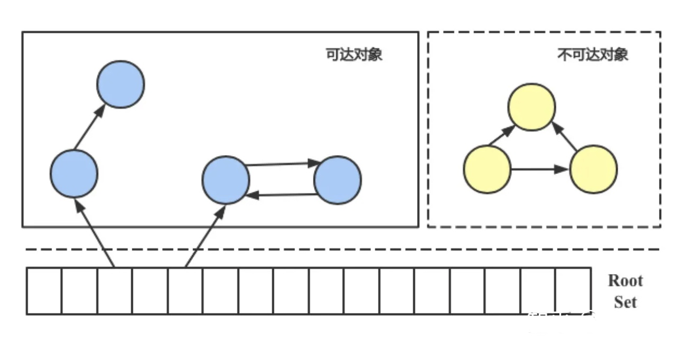

# 【Golang】Runtime

* [【Golang】Runtime](#golangruntime)
   * [简介](#简介)
   * [协程调度](#协程调度)
      * [线程模型](#线程模型)
      * [抽象结构](#抽象结构)
      * [Goroutine](#goroutine)
      * [Processor](#processor)
      * [Machine](#machine)
      * [调度流程](#调度流程)
   * [内存分配](#内存分配)
      * [组织结构](#组织结构)
      * [管理单元](#管理单元)
      * [管理组件](#管理组件)
         * [Mcache](#mcache)
         * [Mcentral](#mcentral)
         * [Mheap](#mheap)
         * [HeapArena](#heaparena)
      * [分配流程](#分配流程)
   * [垃圾回收](#垃圾回收)
      * [回收算法](#回收算法)
      * [三色标记法](#三色标记法)
      * [内存屏障](#内存屏障)
      * [回收流程](#回收流程)

## 简介
**Runtime** 的语义为 **运行时**，本身是一个通用抽象的术语，指计算机程序运行的时候所需要的一切代码库、框架、平台等，每种语言有着不同的实现，[Go Runtime 实现参考](https://github.com/golang-design/under-the-hood)

Java、Python 的 Runtime 实现是虚拟机，而在 Go 的 Runtime 实现是一个包，是每个 Go 程序的必需部分，在编译时会和用户代码打包在一起，成为一个可执行文件

`runtime` 包还提供了比如协程控制等与 Go Runtime 系统交互的操作，同时也包含了 `reflect` 包所使用的底层类型信息，[官方文档](https://pkg.go.dev/runtime)

Go Runtime 包含了 Go 程序运行的时候所需的基础设施，主要但不限于提供以下功能：


- 三大核心功能，协程调度、内存分配、垃圾回收
- SystemCall 操作系统调用相关的封装
- Pprof 性能分析、Trace 执行跟踪、Race 冲突检测的支持
-  `select` 等关键字、`channel`、`map` 等内置类型和反射的实现

## 协程调度
Go Runtime 中的调度器使用 GPM 调度模型，来为 **协程（Goroutine）** 提供基于多线程并行的并发调度，能最大限度提升执行效率，发挥多核处理器的能力

### 线程模型
**线程模型（Thread Model）** 是指用于实现并发和并行的线程管理方式和策略，它描述了线程的创建、调度、执行和销毁等方面的规则和机制，不同的编程语言可能采用不同的线程模型

Go 采用的 GPM 调度模型是一个 **混合线程模型（Hybrid Thread Model）**，用户线程和 KSE 是 `N:M` 的多对多关系，此处的用户线程就是指 Goroutine，KSE 是 **内核调度实体（Kernel Scheduling Entity）**，指内核线程


G 通过 P 多对多地被调度到 M 上执行，即用户调度器实现用户线程到 KSE 的调度，内核调度器实现 KSE 到 CPU 上的调度

对比 **用户级线程模型（User-Level Thread Model）**，用户线程和 KSE 是 `N:1` 的映射关系，用户线程都绑定在一个 KSE 上，因此内核调度器对用户线程是无感知的，会由于单个用户线程对 KSE 的阻塞系统调用，导致该其他用户线程都被阻塞

对比 **内核级线程模型（Kernel-Level Thread Model）**，用户线程和 KSE 是 `1:1` 的映射关系，此处的用户线程都是实际的内核线程，并且是一对一绑定的，用户线程的调度完全由内核调度器实现，无法实现协程，创建成本高

各个模型的优缺点对比如下：
| 线程模型 | 优点 | 缺点 |
| --- | --- | --- |
| 内核级 | 简单，真正并行 | 创建成本高 |
| 用户级 | 创建成本低 | 并发性能不完全 |
| 两级 | 综合上述的优点 | 避免上述的缺点 |

### 抽象结构
GPM 调度模型中的 G、P、M 抽象结构如下：


- **G（Goroutine）** 表示协程、用户线程，是用户代码定义的任务
- **P（Processor）** 表示逻辑处理器，是一个抽象概念，对 G 来说 P 是处理器，负责 G 的调度运行，对 M 来说 P 是运行引擎，提供为 G 的运行环境
- **M（Machine）** 表示物理处理器，拥有计算资源并负责实际调度运行，一对一地关联着内核线程

G、P、M 的绑定关系如下：
- P 上可以存在多个 G，这些 G 能够并发运行
- 可以存在多个 P，这些 P 能够使 G 并行运行
- 可以存在多个 M，M 和 P 是一对一绑定的
- 与 P 绑定后的 M，才能执行所绑定 P 上的 G

对于 M 来说，需要执行的运行队列有两个：
- **Local 运行队列**：是 M 当前所绑定 P 的运行队列，没有数据竞争问题，无需加锁处理，处理速度快
- **Global 运行队列**：是所有 M 共享的调度器的运行队列，为保证数据竞争问题，需要加锁处理，处理速度要低于 Local 运行队列

Global 运行队列中保存了未分配 P 的 G，为了保证多个 P 之间的平衡，任何 M 都允许从 Global 运行队列中取出 G，放入自己的 Local 运行队列中

因此当 M 所绑定的 P 的 Local 运行队列为空时，它会从 Global 运行队列中取出一批 G，或从其它 P 的 Local 运行队列中窃取一批 G，转移到该Local 运行队列

### Goroutine
G（Goroutine）通过 `g` 结构体表示，其中保存了 Goroutine 实例的运行时信息，包括其状态、启动函数、栈空间、运行上下文等，运行上下文主要包含 **PC（程序计数器，Program counter）** 和 **SP（栈指针，Stack Pointer）**。G 的生命周期和状态转换都围绕着 `g` 结构体进行

G 的生命周期的各个过程如下：
- **G 的新建**

  在 Go 程序启动时，主线程会新建第一个 G 来执行 `main` 函数，在 G 所执行的函数中使用 `go` 关键字，则会再新建一个 G 来执行指定函数

  G 的新建通过调用 `newproc()` 函数来完成的，G 的栈空间从堆中分配，每个新建的 G 仅会分配 2KB 最小栈空间，不同 Go 版本的最小栈空间不同，但它能随着实际使用动态地扩缩，64 Bit 机器最大可达 1GB
  
  Runtime 中没有设置 G 的数量上限，但其数量受系统资源的限制，比如 CPU、内存、文件描述符等。若 G 中没有大量资源占用，理论上没有资源上限，否则的话过多的 G 可能会导致 `Too many files open` 或 `Resource temporarily unavailable` 等系统错误

  新建的 G 会通过 `runqput()` 函数存到当前 G 所绑定 M 所绑定的 P 的 `p.runnext` 中，`p.runnext` 中只保存一个 G 并优先于 Local 运行队列，若 `p.runnext` 中已存在 G，则会用新建的 G 将其替换掉原来的 G，并将原来的 G 放到 P 的 Local 运行队列 `P.runq` 中，若 P 的 Local 运行队列满了，则将 P 的 Local 运行队列一半的 G 移动到调度器的 Global 运行队列 `sched.runq` 中
  
  将新建的 G 首先移动到 P 的 `p.runnext` 中主要是为了提高性能，因为 `p.runnext` 是 P 完全私有的字段，若将 G 直接放到 P 的 Local 运行队列中，则 Local 运行队列中的 G 可能因其他 M 的窃取而发生变化，因此从 P 的 Local 运行队列获取 G 时都需要执行 `atomic.LoadAcq` 和 `atomic.CasRel` 原子操作，这会带来额外的开销

- **G 的运行**

  G 需要绑定 M 才能被运行，而 M 需要绑定 P 才能运行 G，所以理论上并行运行 G 的数量等于 P 的数量，M 不保留 G 的运行上下文，G 将运行上下文保存到 `g.sched` 中，以便任意 M 都能从中获取其运行上下文，从而使 G 能跨 M 被调度运行
  
- **G 的销毁**

  G 在退出时会执行 `goexit()` 函数，G 的状态会从 `_Grunning` 转换为 `_Gdead`，但 G 并不会被直接释放，而是会通过 `gfput()` 被放入到所关联 P 的 Local 空闲列表 `p.gFree` 或者调度器的 Global 空闲列表 `sched.gFree` 中以便复用
  
  G 会被优先放入到 P 的 Local 空闲队列中，如果 Local 空闲队列中的 G 超过 64 个，则仅会在 Local 空闲队列中保存 32 个，把其他的 G 都放入到调度器的 Global 空闲队列中

G 的状态的作用类似于针对 G 的栈空间的锁机制，G 获取到锁即占用栈空间后，才有能力执行用户代码。各个状态和状态转换关系如下：


- `_Gidle`：刚被创建但未被初始化
- `_Grunnable`：存储在运行队列中，代码没有被执行，未占用栈空间
- `_Grunning`：代码正在被执行，已占用栈空间，已被绑定到 M 和 P
- `_Gsyscall`：正在执行系统调用，代码没有被执行，已占用栈空间，已被绑定到 M
- `_Gwaiting`：被 Runtime 阻塞，代码没有被执行，没有在运行队列中，未占用栈空间，除了信道操作可能读写的那部分
- `_Gdead`：未被使用，可能是运行完成刚退出到空闲队列，或者刚被初始化	处于退出状态
- `_Gcopystack`：栈正在被移动，代码没有被执行，且没有在运行队列中，它的栈空间被将它置为该状态的 G 所占用
- `_Gpreempted	`：由于抢占而被阻塞，等待唤醒
- `_GscanXXX`：处于 XXX 状态下，且 GC 正在扫描栈空间，比如 `_Gscanrunnable`、`_Gscanrunning`

### Processor
P（Processor）通过 `p` 结构体表示，其中保存了逻辑处理器实例用于调度运行 Goroutine 的信息，包括其状态、运行队列、空闲队列、内存缓存、调度情况等，P 的生命周期和状态转换都围绕着 `p` 结构体进行

P 的生命周期的各个过程如下：
- **P 的新建**

  P 的数量是在 `Runtime` 启动时初始化的，默认等于 CPU 的逻辑核数，在 `CPU 逻辑核数 >= P 的数量` 的前提下，P 的数量决定了程序运行过程中 G 的最大可并行数量
  
  P 的数量可在程序启动时通过 `GOMAXPROCS` 环境变量设置，或在程序运行中通过 `runtime.GOMAXPROCS()` 函数进行设置，设置的最大数量为 `256`，之后在程序运行过程中其数量是固定不变的
  
  在 IO 密集型场景下，可以适当调高 P 的数量，因为 M 需要与 P 绑定才能运行，而 M 在执行 G 时某些操作会陷入系统调用，此时与 M 关联的 P 处于等待状态，如果系统调用一直不返回那么等待系统调用这段时间的 CPU 资源其实是被浪费的
  
  虽然 Runtime 中有 `sysmon` 监控协程可以使因系统调用长时间阻塞的 P 重新绑定一个 M 来运行 G，但 `sysmon` 监控协程是周期性执行的，在这个周期内操作系统中可以执行多次线程切换，此时若 P 还有需要运行的 G，这部分 G 得不到执行，其实 CPU 资源是被浪费的

- **P 的销毁**

  若在程序运行过程中没有调整 `GOMAXPROCS`，未使用的 P 会放在调度器的 Global 闲置队列 `sched.pidle` 中，不会被销毁。若调小了 `GOMAXPROC`，则通过 `p.destroy()` 会将多余的 P 关联的资源释放掉并且会将 P 状态设置为 `_Pdead`，此时可能还有 M 与 P 相绑定，所以 P 本身不会被释放

P 的各个状态和状态转换关系如下：


- `_Pidle`：被初始化后的状态，未被用来运行用户代码或调度器，其运行队列为空
- `_Prunning`：已被 M 绑定，正被用来运行用户代码或调度器
- `_Psyscall`：被绑定的 M 进入系统调用，P 会被设置为该状态，并从绑定关系转为亲和关系，未被用来运行用户代码，可能会被其他 M 窃取
- `_Pgcstop`：被绑定的 M 发生 GC 时，P 会被设置为该状态
- `_Pdead`：在程序运行中将 `GOMAXPROCS` 数量减少时，多余的 P 会被设置为该状态，不会被 M 再次绑定运行

### Machine
M（Machine）通过 `m` 结构体表示，其中保存了内核线程实例用于实际调度运行 Goroutine 的信息，包括其状态，运行上下文、内核线程、绑定和执行的对象、系统调用情况等，M 的生命周期和状态转换都围绕着 `m` 结构体进行

M 的生命周期的各个过程如下：
- **M 的新建**

  每新建一个 M 同时会创建一个内核线程与其进行绑定，新建内核线程是通过 `clone()` 系统调用进行的。而新建 M 的情况有两种：一是程序启动时会创建主线程，也就是第一个 M 即 M0；二是当存在可运行的 G 和空闲的 P 时，会调用 `startm()` 先尝试从调度器的全局闲置队列 `sched.midle` 获取一个 M，若没有则会通过 `newm()` 新建一个 M，然后与空闲的 P 绑定来运行这些 G
  
  因此 M 的数量是不定的，由 Runtime 根据需要自动调整，为了防止创建过多的内核线程，耗尽系统资源或者触发系统的限制导致程序异常，或者造成过大的内核线程调度开销，目前默认最大限制为 `10000` 个，可以在程序运行时通过 `debug.SetMaxThreads(n)` 函数进行调整

- **M 的运行**

  M 需要与 P 绑定后才能运行 G，并且 M 与 P 有亲和性，比如 M 在运行过程中通过 `entersyscall()` 函数进入系统调用时，会主动与当前的 P 解绑，将它设置为 `_Psyscall` 状态，并将它记录到 `m.oldp` 中，实现亲和性，从而在通过 `exitsyscall()` 函数退出系统调用时，会优先绑定 `m.oldp` 中记录的 P

  当 M 运行调度逻辑时，其实正在运行 `m.g0`，即 M 启动时会自动新建的第一个 G，它包含调度代码且具有专用栈空间的 G，在根据调度策略从 P 中找到需要运行的 G 后，会通过 `gogo()` 函数，从 `m.g0` 的运行上下文切换为需要运行的 G 的运行上下文，继续运行用户代码

- **M 的销毁**

  M 不会被销毁，当找不到要运行的 G 或者绑定不到空闲的 P 时，会通过执行 `stopm()` 函数进入到睡眠状态，并且放到调度器的全局空闲队列 `sched.midle` 中。而进入到睡眠状态的情况有两种：

  一是当 M 绑定的 P 无可运行的 G 且无法从其它 P 窃取可运行的 G 时，M 会先尝试进入自旋状态以不断从其他 P 窃取可运行的 G，注意进入自旋状态的 M 数量不能超过非空闲状态的 P 数量的一半，若 M 在自旋状态未窃取到 G 或者未进入到自旋状态，则会直接进入到睡眠状态
  
  二是当 M 关联的 G 进入系统调用时，M 会主动和关联的 P 解绑并建立亲和性，当 M 关联的 G 执行 `exitsyscall()` 函数退出系统调用时，M 会优先找到有亲和性的 P 进行绑定，若该 P 已经被绑定则尝试找一个空闲的 P 进行绑定，如果找不到空闲的 P，则 M 会进入到睡眠状态
  
M 的各个状态和状态转换关系如下：


- `running`：正在进行 G 的调度运行
- `spinning`：不断自旋来获取可运行的 G
- `sleep`：内核线程进入休眠，不参与 G 的调度运行，以节约系统资源

### 调度流程
M 在和一个 P 绑定后构成一个 G 的执行单元，通过一个内核线程进入 **调度运行的循环**，其机制大致是：
- M 处于 `m.g0` 的运行上下文，运行调度逻辑
    - 尝试根据以下先后顺序获取 G
        - 尝试从所绑定的 P 的 `p.runnext` 中取出 G
        - 尝试从所绑定的 P 的 Local 运行队列中取出 G
        - 先从调度器的 Global 运行队列中取出一批 G，放到所绑定的 P 的 Local 队列中
        - 先从其他 P 的 Local 运行队列中窃取一批 G，放到所绑定的 P 的 Local 队列中
    - 若获取 G 失败，则 M 会与 P 解绑，然后进入休眠状态
    - 若获取 G 成功，M 切换为该 G 的运行上下文，继续运行用户代码
- 若 M 所运行的 G 中使用 `go` 关键字，创建了一个新的 G
    - 尝试根据以下先后顺序存入 G
        - 尝试存入所绑定的 P 的 `p.runnext`
        - 尝试存入所绑定的 P 的 Local 运行队列
        - 尝试从调度器 的 Global 运行队列
- 当 G 发生阻塞时，M 切换为该 `m.g0` 的运行上下文，运行调度逻辑
- 如此反复

执行 G 时 **可能发生阻塞的场景** 包含以下几种：
- 信道操作，比如 `select channel`
- `sync` 包中的同步原语，比如 `waitgroup.Wait()`
- 网络 IO 系统调用，比如发起 HTTP 请求
- 磁盘 IO 系统调用，比如打开文件

当 M 运行 G 的过程中发生阻塞时，需要获取并切换到了另外一个 G 的运行上下文继续执行，但其切换方式取决于 G 的阻塞类型，而以上的阻塞场景又可分为以下两种阻塞类型：
- **用户态阻塞和唤醒**

  包含前面三种阻塞场景，比如当 G 因为信道操作阻塞时，对应的 G 会通过 `Gopark()` 被放入信道另一端的 G2 的等待队列，该 G 的状态由 `_Gruning` 变为 `_Gwaitting`，而 M 会跳过该 G 尝试获取并执行下一个 G，若此时没有 G 供 M 运行，那么 M 将解绑 P，并进入休眠状态

  当阻塞的 G 被信道另一端的 G2 唤醒时，G 被标记为 `_GRunnable`，先尝试加入 G2 所在 P 的 `p.runnext`，然后再是 P 的 Local 队列和 Global 队列

- **系统调用阻塞**

  包含最后一种阻塞场景，当 G 被阻塞在某个系统调用上时，此时 G 会阻塞在 `_Gsyscall` 状态，M 也处于阻塞状态，此时的 G 可被 `sysmon` 协程进行 P 脱离
  
  即执行该 G 的 P，会与其它空闲的 M 绑定，并继续运行其它 G。如果没有其它空闲的 M，但 P 的 Local 队列中仍然有 G 需要执行，则创建一个新的 M

  当系统调用完成后，G 会重新尝试放入一个 P 的 Local 队列来恢复执行，如果没有空闲的 P，G 会被标记为 `_GRunnable` 加入到 Global 队列

网络 IO 系统调用之所以属于第一种阻塞类型，是因为 `netpoll` 机制的存在，并不会导致 M 陷入系统调用的阻塞中。而是通过异步系统调用 + IO 多路复用机制，完成 IO 状态的检测，从而转变为用户态阻塞和唤醒

当 M 运行 G 的过程中没有发生阻塞时，当运行时间过长后，不能放任 G 一直运行，否则其他 G 将无法获得运行时间，因此需要有 **抢占式调度** 机制，但由于 Runtime 的调度器没有时间片抢占的概念，因此该抢占机制其实要弱很多

Go 的抢占式调度机制主要通过 `sysmon` 监控协程实现，`sysmon` 是由 Runtime 创建的特殊的 G，不需要通过 P 便可被专用的 M 运行，并且每 20us~10ms 被唤醒一次

`sysmon` 会对运行时间超过 10 ms 的 G 发起抢占调度请求，即为 G 设置抢占标记，当 G 再通过 `newstack` 函数分配栈空间时，编译器安插的指令会检查这个标记，并且将当前 G 以 `Goched()` 的方式暂停，并将其加入到 Global 队列

`sysmon` 协程的主要功能如下：
- 针对长时间因系统调用而阻塞的 M，通过将 P 脱离，使 P 上的其他 G 得到运行
- 针对长时间运行的 G，通过发出抢占调度请求，保证其他 G 能够获得运行时间
- 如果超过 2min 没有 GC 垃圾回收，则强制执行
- 如果存在闲置超过 5min 的 `mspan` 内存空间，则进行释放

使 G 或 M 暂停运行的方式有以下几种：
- `Goched()`：将当前的 G 暂停，保存运行上下文，以 `_GRunnable` 状态放入 Global 队列中，让当前 M 继续执行其它任务。无需对 G 进行唤醒操作，是抢占调度所使用的方式

- `Gopark()`：与 `Goched()` 的最大区别是没有将 G 放回任务队列，而是以 `_Gwaitting` 状态放入某个 G 的等待队列，G 必须被手动 `Goready()` 唤醒，否则会丢失任务，用户态阻塞使用的方式

- `Goexit()`: 立即终止 G，不管其所处的调用栈层级，在终止前，确保所有 `defer` 都正确执行

- `notesleep()`: 阻塞 M 的运行，从而阻塞 G 的运行，不允许 G 和 P 重新调度，直接使所绑定的内核线程休眠直到被唤醒，等同 M 停止自旋后的情况，直到被 `notewakeup()` 唤醒

- `notetsleepg()`: 阻塞 M 的运行，从而阻塞 G 的运行，P 被解绑并可以和其它 M 绑定继续执行，等同 M 因系统调用阻塞时的情况，直到被 `notewakeup()` 唤醒，是 GC 标记阶段使用的方式

## 内存分配
Go Runtime 采用了自主管理的内存分配，而不是传统的内存分配，从而能够更灵活和高效地进行使用内存，比如通过内存池、预分配等机制，避免了每次内存分配都需要进行系统调用的开销

Runtime 内存分配算法主要源自 Google 为 C 语言开发的 **TCMalloc（Thread-Caching Malloc）** 算法，其核心思想就是把内存分为多级管理，从而降低锁的粒度。即可用的堆内存被划分为了两个级别的内存池，一是所有线程共享的全局内存池，二是线程自行维护的独立内存池，在进行内存分配时优先从线程的独立内存池中申请，当独立内存池不足时才会向全局内存池申请，以避免不同线程对全局内存池的频繁竞争

### 组织结构
Runtime 在程序启动时，会初始化一个表示全局堆区内存空间的 `mheap`，此时会立即向操作系统申请一系列的虚拟内存空间，并且后续根据使用情况，还会继续申请虚拟内存空间

申请得到的虚拟内存空间，除了小部分用来保存与内存管理相关的元数据，大部分都作为可动态增长的堆区空间，堆区空间此时并不会真正地被访问使用，即不会真正地被分配物理内存，只会被逻辑上切分成小块内存后进行自主管理

对于以 `arena` 为单位申请，从操作系统中得到的堆区空间，会使用一个堆区空间之外的 `heapArena` 结构对其进行表示，并保存到 `heapArena` 二维数组 `mheap.arenas` 中， 实现所有堆区内存的管理

`arena` 由一定数量的连续页 `page` 组成，`page` 不是指操作系统中的内存页，而是 Go 内存管理中的基本存储单元，即对内存空间进行储存管理的最小单元。在 64 位的系统下，每个 `page` 的大小为 8KB，每个 `arena` 的大小为 64MB，即每个 `arena` 包含了 8096 个 `page`

除了 `heapArena` 外，还有 `mheap`、`mcentral` `mcache` `mspan` 等与内存管理相关的元数据，与 `arena` 共同组成了 Go 程序所申请的全部虚拟内存空间。其整体组织结构如下：


### 管理单元
`mspan` 是内存管理中的基本管理单元，即对内存空间进行分配管理的最小单位，是由 `page` 组成的一段大小固定且连续的内存空间。`mspan` 是一个记录了起始地址、包含页数、规格类型等信息的双向链表节点，其主要的结构组成如下：


``` go
type mspan struct {
    next *mspan     // 下一个链表节点
    prev *mspan     // 上一个链表节点
	
    startAddr uintptr   // 起始地址，首个 Byte 的地址
    npages    uintptr   // 包含页数
    spanclass spanClass // 规格类型
    elemsize  uintptr   // 槽位大小，根据规格类型得到
    nelems    uintptr   // 包含槽位数，根据规格类型得到
    
    freeindex uintptr // 搜索下一个空闲对象的起始槽位索引，[0, nelems]
    allocBits *gcBits // 标识已分配的位图，1bit 对应 1 个对象槽位
    allocCount uint16 // 分配对象数
    allocCache uint64 // 缓存在 freeindex 位置的已分配位图，提高分配效率
}
```

`mspan` 会根据 `spanclass` 字段所定义的规格类型，将自身的内存空间切分成不同大小的槽位 `slot` ，每个槽位用于存储一个小于且接近其大小的对象 `object`。8bit 的 `spanClass` 记录了两个信息，其中高 7bit 表示 `mspan` 的大小类型，低 1bit 表示 `mspan` 是否不存储指针，因此不需被 GC 扫描它是否引用了其他活跃的对象

`mspan` 的大小类型在 `sizeclasses.go` 文件中共定义了 68 种，除了 `0` 大小类型外的其他大小类型，其对应槽位大小的范围在 `8B~32KB`，每种大小类型有对应的分配页数、尾部浪费，最小对齐值，从而更好地进行内存空间的分割和分配。而且根据对象大小来选择某个大小类型的 `mspan` 时，对象小于等于 1016B 时每递增 8B 存在一个选择，大于 1016B 时每递增 128B 会定义一种选择

除了常规的规格类型之外，`mspan` 还有另外两种特殊的规格类型，一种是微小类型 `TinySpanClass`，其大小类型为 `2` 且不需被 GC 扫描，对应槽位大小为 16B；另一种是巨大类型 `LargeSpanClass`，其大小类型为特殊的 `0` 且不需被 GC 扫描，对应槽位大小为根据对象需要且对齐页大小的 `n*8KB`，实际上直接从 `arena` 堆区分配而不是通过 `mspan` 分配

### 管理组件
#### Mcache
`mcache` 负责为单个 P 缓存小型对象以及保存本地分配状态，每个 P 都会绑定一个 `mcache`，多个 Goroutine 间不存在竞态冲突，内存分配时无需额外的锁操作开销。`mcache` 从无需 GC 的内存空间中分配，因此对于任何指向 `arena` 堆区的指针必须特别处理，确保和 GC 能够独立正常工作。其主要的结构组成如下：

``` go
type mcache struct {
    // 缓存用于分配的 mspan，包括微小类型的 mspan
    alloc [numSpanClasses]*mspan 
    
    // 为微小分配器记录分配状态
    tiny       uintptr // 微小内存块的起始地址
    tinyoffset uintptr // 微小内存块的当前偏移值
    tinyAllocs uintptr // 对微小对象的分配次数
}
```

对于常规的规格类型和微小类型的对象分配请求，分配器先从 Goroutine 所在 P 的 `mcache` 中分配，若该 P 的 `mcache` 中没有指定规格类型的 `mspan`，则会从指定规格类型的全局 `mcentral` 中分配，得到 `mspan` 后进行空闲对象槽位的获取并返回


#### Mcentral
`mcentral` 负责为所有 `mcache` 提供切分好的 `mspan`，每个 `central` 管理着一类特定规格的全局 `mspan` 列表，包括了已分配出去的和未分配出去的所有 `mspan`。 `mcentral` 被所有的 P 共享，多个 Goroutine 间存在竞态冲突，因此内存分配时需要额外的锁操作开销。其主要的结构组成如下：

``` go
type mcentral struct {
	spanclass spanClass // 规格类型

	partial [2]spanSet // 具有空闲对象槽位的 mspan 列表
	full    [2]spanSet // 没有空闲对象槽位的 mspan 列表
}
```

`partial` 和 `full` 列表的存在是为了高效地管理 `mspan`，当收到来自 `mcahce` 的新 `mspan` 分配请求时：
1. 分配器首先会尝试从 `partial` 列表中，通过清扫找到一个包含空闲槽位的 `mspan`，同时将完全使用的 `mspan` 移动到 `full` 列表
2. 若 `partial` 列表中的 `mspan` 都被完全使用，则从 `full` 列表中找一个包含空闲槽位的 `mspan`，将其移动到 `partial` 列表
3. 若 `full` 列表中的 `mspan` 也都被完全使用，则从 `arena` 堆区内存中分配一个 `mspan` 并初始化
4. 将包含空闲槽位的 `mspan` 分配到 `mcahce`


`partial` 列表和 `full` 列表实际上各自内部还包含了两个 `mspan` 列表，分别是已清扫的 `swept` 列表和未清扫的 `unswept` 列表，区分两个列表主要用于辅助 GC 高效地进行内存回收。在一次 GC 循环过程中：
1. 标记阶段：GC 会遍历栈区和全局变量等根对象，标记所有可达的对象，此时被访问过的 `mspan` 会被放入 `swept` 列表，而未被访问的 `mspan` 会被放入 `unswept` 列表
2. 清扫阶段，GC 会遍历 `swept` 列表中的 `mspan`，通过清扫直接对其中不可达的对象进行回收，并且会遍历 `unswept` 列表中的 `mspan`，再次判断其中的对象是否可达并进行标记，然后通过清扫对其中不可达的对象进行回收

被清扫后的 `mspan` 会从 `unswept` 列表转移到 `swept` 列表，即 `unswept` 列表一定会被内存分配或 GC 循环所清空，因此每次 GC 循环中 `swept` 列表和 `unswept` 列表都会进行角色交换

#### Mheap
`mheap` 负责管理 Go 程序可访问的所有堆区内存空间，在程序中通过一个全局对象 `_mheap` 进行维护，为 `mcentral` 或大对象分配提供内存资源，若资源不足时会发起系统调用申请新的内存。`mheap` 也被所有的 P 共享，多个 Goroutine 间存在竞态冲突，因此内存分配时需要额外的锁操作开销。其主要的结构组成如下：

``` go
type mheap struct {
   // 用于分配连续的空闲页
	pages pageAlloc 

   // 包含了所有已创建的 mspan
   allspans []*mspan

   // 管理所有堆区空间，是包含多个堆区空间对应结构的二维数组
	arenas [1 << arenaL1Bits]*[1 << arenaL2Bits]*heapArena
	
	// 管理特定规格类型所有的 central
	central [numSpanClasses]struct {
		mcentral mcentralååå
		pad      [cpu.CacheLinePadSize - unsafe.Sizeof(mcentral{})%cpu.CacheLinePadSize]byte
   }
   
   // 会向操作系统申请固定内存空间，即不会被 GC
   spanalloc             fixalloc // 用于分配 mspan
   cachealloc            fixalloc // 用于分配 mcache
   specialfinalizeralloc fixalloc // 用于分配 specialfinalizer
   specialprofilealloc   fixalloc // 用于分配 specialprofile
   specialReachableAlloc fixalloc // 用于分配 specialReachable
}
```

`pageAlloc` 是页分配器，用于分配连续的空闲页，其底层是多颗 **基数树（Radix Tree）** 所组成的索引，对于 64 位的系统，共有 `2^14` 棵基数树，每颗棵基数树覆盖 16GB 内存空间，总共可覆盖 `2^14*16GB=256TB` 内存空间

基数树每个节点 `pallocSum` 是一个 `uint64`，记录了当前节点所映射的内存空间的页使用情况，其中首 bit 弃而不用，右 21bit 表示内存空间前端存在多少个连续空闲页，左 21bit 表示内存空间末端存在多少个连续空闲页，中间 21bit 表示内存空间最大存在多少个连续空闲页，因此每个节点最大可覆盖 `2^21^8KB=16GB` 的内存空间


`pageAlloc` 中每颗基数树分为 `5` 层，第 `n` 层的节点数为 `8^(n-1)`，每个节点表示第 `n-1` 层节点的 `1/8`，根节点则表示了整颗树可覆盖的内存空间，即 16GB，末尾节点则表示了最小可统计的内存空间，即 `16GB/8^4=4MB`，也称为一个内存块 `chunk`


`arenas` 在 64 位系统下， 对应的二维数组容量为 `[1][2^22]`，而每个 堆区空间 `heapArena` 包含 8192 个页，大小总和为 64M，因此 `mheap`  可管理的堆区大小上限为 `2^22*64M=256T`，和 `pageAlloc` 可管理的空间大小一致

#### HeapArena
`heapArena` 记录了一段堆区空间的管理状态，其主要组成结构如下：

``` go
type heapArena struct {
   // 标识对应 arena 的内存状态，用于 GC
   bitmap [heapArenaBitmapBytes]byte
   
   // 标识 arena 中每个 page 所属的 mspan
   spans [pagesPerArena]*mspan
   
   // bitmap，结合 spans 标识哪些 mspan 是使用中的
   pageInUse [pagesPerArena / 8]uint8
   // bitmap，结合 spans 标识哪些 mspan 包含被标记对象
   pageMarks [pagesPerArena / 8]uint8
   // bitmap，结合 spans 标识哪些 mspan 有特殊属性
   pageSpecials [pagesPerArena / 8]uint8
}
```

`bitmap` 中每 1B 能够标识 `arena` 中 32B 的内存状态，即包含 4 个 8B 指针大小的 `word`，`bitmap` 的总大小为 `64MB/32B*1B=2MB`。 `bitmap` 中的每 1B 都分为两组标志位，低地址的 4bit 标识了对应 `word` 是否为需被 GC 访问的存活指针，高地址的 4bit 标识了对应 `word` 后面是否有其他 `word` 是同一次分配中的存活指针

`spans` 中每个 `*mspan` 对应了 `arena` 中的一个 `page`，使得通过 `page` 快速检索出所属的 `mspan`，`spans` 的总大小为 `64MB/8KB*8B=64KB`。多个 `page` 可能所属于同一个 `mspan`，因为 `mspan` 也由连续的 `page` 所组成

### 分配流程
`mallocgc()` 是为对象进行内存分配的入口函数，它会根据对象的大小和类型采用不同的分配策略，最终通过不同规格类型的 `mspan` 完成内存分配。`mallocgc()` 的内存分配流程可以看作一个多级缓存机制，由上而下的每个步骤只要成功则直接返回结果，若失败则进行后续步骤直到成功。其主要流程如下：


- 若是 **微小对象**，即小于 16B 且不存储指针
    1. 使用微小分配器 `Tiny Allocator`，根据当前 G 所属 P 的 `mcache` 中的 `tinyXXX` 分配状态，找到一个空闲槽位，过程无需进行锁操作
    2. 根据对应的规格类型 `spanClass`，从当前 G 所属 P 的 `mcache` 中的 `alloc` 缓存中，找到一个空闲 `mspan` 中的一个空闲槽位，过程无需进行锁操作
    3. 根据对应的的规格类型 `spanClass`，从对应的 `mcentral` 中的 `partial` 或 `full` 列表中获取空闲 `mspan`，填充到 `mcache.alloc` 中，再从该 `mspan` 中找到一个空闲槽位，过程需要 `spanSet` 粒度的锁操作
    4. 根据对应的的规格类型 `spanClass`，从 `mheap` 的 `pages` 页分配器中取得足够数量的连续空闲页，组装成对应 `mspan` 填充到 `mcache.alloc` 中，再从该 `mspan` 中找到一个空闲槽位，过程需要全局的锁操作
    5. `mheap` 发起系统调用，向操作系统申请内存，更新 `mheap.pages` 中的索引信息，然后重复步骤 4 完成内存分配，过程需要全局的锁操作

- 若是 **小对象**，即大于 16B 且小于 32KB，或小于 16B 但存储指针
    1. 对比微小对象的内存分配流程，跳过步骤 1，执行步骤 2-5
    
- 若是 **大对象**，即大于 32 KB
    1. 对比微小对象的内存分配流程，，跳过步骤 1-3，执行步骤 4-5


## 垃圾回收
Go Runtime 采用基于 **三色标记法（Three-Color Marking）** 的 **垃圾回收（Garbage Collection，GC）** 机制，使得在程序运行过程中，能自动识别不再使用的内存对象并回收，以便整理后重用于内存分配，同时减少内存泄漏和内存碎片

### 回收算法
垃圾回收的常见算法可分为以下两种：
- **引用计数（Reference Counting）**

  

  - 原理：对每个对象维护一个引用计数器，当该对象被其他对象引用时，其引用计数器加 1，当该引用失效时，则其引用计数减 1，直到引用计数器为 0 时，就可以回收掉该对象
  
  - 优点：原理和实现简单；即时回收，不需要等待特定时刻才触发回收；不需要暂停运行用户代码即可完成回收
  
  - 缺点：无法处理循环引用的回收问题；维护引用计数需要较大的时间和空间开销；短暂引用导致的频繁计数器增减会引入额外开销

- **可达性分析（Reachability Analysis）**

  

  - 原理：按一定策略循环执行，先从一组根对象出发，通过追踪其引用关系，逐步遍历所引用的对象，从而识别出内存空间中哪些是存活对象，哪些是无引用对象，然后完成对后者的回收

  - 优点：解决了循环引用的回收问题；开销小，因此也没有短暂引用所导致的额外开销问题

  - 缺点：回收不及时，取决于循环周期的设定；分析和回收期间为了要避免对象状态变化，需要进行 **STW（Stop The World）**，即暂停运行用户代码

常见的可达性分析算法有以下几种：
- **标记清除（Mark-Sweep）**

  

  - 原理：每次循环分为先后两个执行阶段，标记阶段会从根对象出发，遍历所有的可达对象，并将这些对象标记为存活对象；清除阶段则会遍历整个内存空间，回收掉那些没有被标记存活的对象

  - 优点：执行效率高，没有维护计数器或进行对象移动的时间开销；内存占用小，没有引入计数器或保留内存的空间开销

  - 缺点：容易产生内存碎片问题，即清除后产生不连续的内存空间，影响后续大对象的内存分配

- **标记复制（Mark-Copy）**

  

  - 原理：将一半的内存空间划分为保留区域，当非保留区域无法完成分配时触发一次循环，每次循环分为先后两个执行阶段，标记阶段会从根对象出发，遍历所有的可达对象，并将这些对象标记为存活对象；复制阶段则会将所有存活对象到保留区域，然后清空非保留区域，最后交换两个区域的角色

  - 优点：解决了内存碎片问题；无需像清除阶段那样遍历所有对象，提升了回收效率

  - 缺点：内存利用率低，相当于只有一半内存可用；可达对象较多时，复制对象的时间开销较大

- **标记整理（Mark-Compact）**

  

  - 原理：每次循环分为先后两个执行阶段，标记阶段会从根对象出发，遍历所有的可达对象，并将这些对象标记为存活对象；清除阶段则会遍历整个内存空间，回收掉那些没有被标记存活的对象，并将存活对象移动到内存空间的一端

  - 优点：综合了标记清除和标记复制的优点，没有内存碎片问题，内存利用率也不低；可达对象较多时，回收效率与标记清除相当

  - 缺点：整理的实现复杂，需要多次遍历内存空间，时间开销较大

### 三色标记法
上述可达性分析算法的共同缺陷，即每次 GC 循环需要进行全阶段 STW，影响程序的响应性能。而三色标记法是一种基于颜色标记、增量回收的可达性分析算法，它能使每次 GC 循环的标记阶段和清除阶段，都分别能和用户代码能够并发运行，从而最大程度地降低 STW 时间

基于颜色标记指的是，算法在标记阶段将内存空间中的对象分成以下三类：
- **白色对象（White Object）**：潜在垃圾，未被访问到的对象。在标记阶段开始时，所有对象被标记为白色，在标记阶段结束后，所有白色对象均为不可达
- **黑色对象（Black Object）**：活跃对象，已被访问且所有引用也已被遍历的对象，即不存在引用或不存在任何引用正指向白色对象，或者
- **灰色对象（Gray Object）**：活跃对象，已被访问但存在引用未被遍历的对象，即存在引用正指向白色对象

增量回收指的是，算法将标记阶段分解为多个增量步骤，允许 GC 在用户代码运行的间隙中逐步完成标记过程。首先标记阶段的工作步骤如下：


1. 标记阶段开始时，内存空间中所有对象被标记为白色，这时先将根对象标记为灰色
2. 选择一个灰色对象并将其标记为黑色，然后将该黑色节点所引用的对象都标记为灰色
3. 重复以上步骤直到内存空间中不存在灰色对象
4. 标记阶段结束后，内存空间中只存在黑色的存活对象以及白色的垃圾对象

增量回收的工作步骤并不能屏蔽对象的状态变化，因此并不能直接实现和用户代码并发运行，比如若并发运行过程中出现以下两种情况，就会导致活跃对象被错误回收的：
- 一个黑色对象指向了一个白色对象
- 一个白色对象失去了所有灰色对象对它的引用

想要保证标记阶段的并发正确性，则需要达成以下任意一种 **三色不变性（Tri-color invariant）**：
- **强三色不变性**：黑色对象不会指向白色对象，只会指向灰色对象或者黑色对象
- **弱三色不变性**：黑色对象指向的白色对象必须包含一条从灰色对象经由多个白色对象的可达路径

### 内存屏障
通过 STW 停止掉所有赋值器的操作，从而保证三色不变性，是保证并发正确性的解决方法之一，而通过 **内存屏障（Memory Barriers）** 技术，使赋值器的操作与 GC 进行状态同步，从而保证弱三色不变性，后者便是三色标记法所采用的解决方法

内存屏障指通过插入特定的屏障指令来限制处理器的优化行为，以保证内存操作的顺序性和一致性，即屏障前执行的操作必须先于屏障后执行的操作

GC 使用屏障技术，是通过编译器在编译期间生成一段代码，对用户代码进行对象指针的读写操作进行拦截并插入额外逻辑，相当于一个钩子方法。根据钩子所处的时机，可区分为 **读屏障（Read Barriers）** 和 **写屏障（Write Barriers）**，由于读屏障会较大地影响用户代码的执行性能，因此一般使用写屏障来实现

`Dijkstra` 插入写屏障，其行为是当为一个黑色对象写入指针引用时，若该引用指向的是白色对象，则将该白色对象标记为灰色，从而保证了强三色不变性。其缺点是保守地把有可能存活的对象都标记成了灰色，导致本该被回收的对象却可以存活到下一次循环

``` go
func DijkstraWritePointer(slot *unsafe.Pointer, ptr unsafe.Pointer) {
    // 为引用对象标记灰色
    shade(ptr)
    *slot = ptr
}
```


`Yuasa` 删除写屏障，其行为是当为一个对象写入指针引用时，将这个对象本身标记为灰色，从而保证了弱三色不变性。其缺点是把存在操作的对象都标记成了灰色，导致一些对象可能被重复扫描

```
// Yuasa 屏障
func YuasaWritePointer(slot *unsafe.Pointer, ptr unsafe.Pointer) {
    // 为当前对象标记灰色
    shade(*slot)
    *slot = ptr
}
```


两种写屏障都存在的共同问题是，栈区的对象也是需要扫描的根对象，但栈区空间容量小且要求响应速度高，不适合在标记阶段对其启用写屏障，因此实现上需要当栈区的对象发送写操作时，会将整个栈区标记为灰色，然后在标记阶段结束后，使用 STW 重新对栈区的对象进行一次三色标记

Go v1.8 后将 `Dijkstra` 插入写屏障和 `Yuasa` 删除写屏障进行组合，
称其为混合写屏障，主要是为了消除栈区的重新扫描过程，其基本思想是一旦栈被扫描变为黑色，则它会继续保持黑色，并要求将对象分配为黑色，虽然以降低其回收及时性作为了代价

混合写屏障的基本行为是：
- 标记阶段开始，扫描栈区的对象并标记为黑色
- 标记阶段期间，任何在栈区的新建对象直接标记为黑色
- 堆区的对象正常启用插入写屏障
- 堆区的对象正常启用删除写屏障

### 回收流程
Go 基于三色标记法和内存屏障技术实现了并发 GC，虽然不是全过程都能完全与用户代码并发运行，但已经很大程度地缩短了 STW 的时间。通过 `gcStart()` 函数能够开始新的一次 GC 循环，GC 循环的函数调用过程如下：


GC 循环的过程可以被分成以下四个步骤：
- **清除结束（Sweep Termination）**

  进行 STW，清除 `mcentral` 中未被回收的 `mspan`，确保当前循环的清除工作完成后，再开始一个新的循环
  
- **标记（Mark）**

  设置 GC 阶段为 `_GCmark`，将栈区对象、全局对象等根对象放入集合，启用混合写屏障，启用用户协程辅助
  
  取消 STW，并发使用三色标记法进行根对象集合进行扫描和标记，直到标记工作全部完成

- **标记结束（Mark Termination）**

  进行 STW，设置 GC 阶段为 `_GCmarktermination`，关闭用户协程辅助，清除标记工作遗留的缓存数据

- **清除（Sweep）**

  设置 GC 阶段为 `_GCoff`，关闭混合写屏障，取消 STW，并发根据标记对被 `mcentral` 中的 `mspan` 进行清除

触发 GC 循环的前提需要满足以下三个条件：
- `memstats.enablegc`：内存允许启用 GC
- `panicking == 0`：程序当前没有 `panic`
- `gcphase == _GCoff`：GC 阶段目前处于 `_Gcoff`

触发 GC 循环的时机有以下三种情况：
- `gcTriggerHeap`：堆区内存达到一定的阈值大小，由 `mallocgc` 内存分配函数触发
- `gcTriggerTime`：当前距离上一次 GC 超过一定的阈值时机，由 `sysmon` 和 `forcegchelper` 协程触发
- `gcTriggerCycle`：当前未开始 GC，由用户代码主动通过 `GC()` 函数触发

用户协程辅助又被称为 `Mutator Assist`，用于防止堆区内存分配太快, 在 GC 执行的过程中，若如果并发运行的用户 G 进行了内存分配, 那么该 G 会被要求执行一部分辅助 GC 进行标记或清扫的工作
