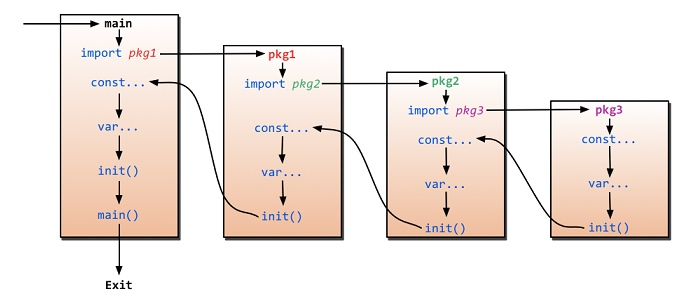
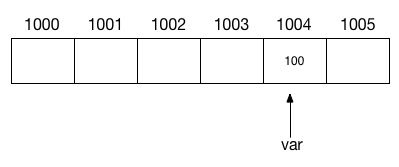
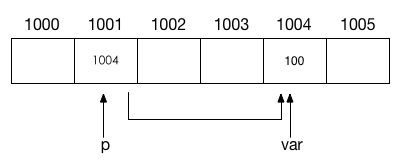
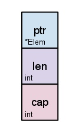
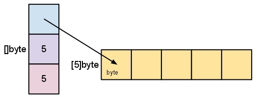
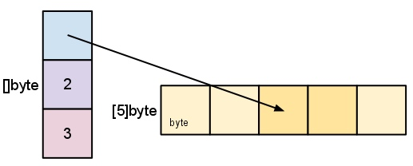

# 【Golang】基础知识

* [【Golang】基础知识](#golang基础知识)
   * [简介](#简介)
   * [安装和使用](#安装和使用)
   * [基础概念](#基础概念)
      * [包和导入](#包和导入)
      * [变量](#变量)
      * [常量](#常量)
      * [基本类型](#基本类型)
      * [函数和闭包](#函数和闭包)
   * [流程控制](#流程控制)
      * [循环控制](#循环控制)
      * [条件控制](#条件控制)
   * [其他类型](#其他类型)
      * [值类型和引用类型](#值类型和引用类型)
      * [指针](#指针)
      * [结构体](#结构体)
      * [数组](#数组)
      * [切片](#切片)
      * [映射](#映射)
   * [类型抽象](#类型抽象)
      * [方法](#方法)
      * [接口](#接口)
      * [泛型](#泛型)
   * [测试](#测试)
      * [testing](#testing)
      * [testify](#testify)
      * [convey](#convey)
      * [gomonkey](#gomonkey)

## 简介
Go 是一门由 Google 支持的 **编译型的**、**静态类型的**、**强类型定义的** 开源编程语言，旨在保持一个在静态编译型语言的 **高性能** 和动态解释型语言的 **高效开发** 之间的良好平衡点。[官方网址](https://golang.google.cn)、[快速学习](https://go.dev/tour/welcome/1)、[进阶学习](https://go.dev/doc/effective_go.html)、[线上测试平台](https://play.golang.org)

其主要特性包括了由 **运行时（Runtime）** 提供的 **并发编程** 和 **内存管理**、丰富的标准库和工具链、多返回值函数、匿名函数与闭包、接口和反射机制、C/C++ 语言交互性等

## 安装和使用
Go 编译环境的安装步骤如下：
1. 通过 [官方下载地址](https://golang.org/dl/) 下载匹配操作系统和架构的二进制安装包
2. 解压并移动到指定目录 `${prefix}`
3. 将 `${prefix}/bin` 添加到 `PATH` 环境变量
4. 安装完成，可使用命令行工具 `go` 执行所需的操作

Go 根目录结构如下：

```
# 基于 go1.20.4 版本进行说明

|-- ${GOROOT}
|   |-- bin             存放可执行工具，如 go、gofmt 等
|   |-- src
|   |   |-- runtime     存放运行时 Runtime 源代码    
|   |   |-- cmd         存放命令行工具 go 源代码
|   |   |-- ...         存放标准库源代码    
|   |-- pkg
|   |   |-- include     存放依赖的 C 头文件
|   |   |-- tool/{GOOS}_{GOARCH} 存放工具链相关的可执行文件
|   |-- test            存放自身的测试代码
|   |-- misc            存放各种杂项的源代码
```

`go` 命令的常用操作如下：

``` bash
# 基于 go1.20.4 版本 GO111MODULE=on 进行说明
go ${command} [${arguments}]

# --------------------------

# 查看命令对应的帮助文档
go help ${command}

# --------------------------

# 查看 Go 当前使用到的环境变量，其修改方式和系统环境变量一致
# 常用的环境变量如下:
# - GOPATH      工作区目录绝对路径
# - GOBIN       可执行文件目录的绝对路径
# - GOROOT      编译环境安装目录的绝对路径
# - GO111MODULE 是否启用 mod 管理，默认启用
go env

# --------------------------

# 在当前目录进行 mod 初始化，创建 go.mod 和 go.sum 文件
# go.mod 用于维护当前包的直接和间接依赖
# go.sum 用于记录所有依赖的摘要信息，以防下载的依赖被恶意篡改
go mod init

# 为当前 mod 增加缺失的依赖和删除无用的依赖
go mod tidy

# 将当前 mod 的依赖下载到 ${GOPATH}/pkg/mod 模块缓存目录中
go mod download

# 基于 go.sum 验证当前 mod 所下载依赖的内容正确性
go mod verify

# --------------------------

# 解析指定版本的指定包，更新该包及其依赖到 go.mod
# 并下载对应源代码到 ${GOPATH}/pkg/mod 模块缓存目录中
# ${packages} 为 ./... 表示当前目录及子目录下的所有包
# ${packages} 不指定则表示当前目录下的包
go get [${flags}] [${packages}]

# ${packages} 格式为 ${module}@${version}
# ${module} 是包导入路径，而 ${version} 是 ${module} 仓库的标签、分支或提交
# ${version} 不指定时表示最新标签
go get golang.org/x/tools/gopls           # 最新标签
go get golang.org/x/tools/gopls@v0.1      # 指定标签
go get golang.org/x/tools/gopls@master    # 指定分支
go get golang.org/x/tools/gopls@342b231   # 指定提交

# ${version} 还可以为 none 表示从 go.mod 中删除包
go get golang.org/x/tools/gopls@none

# ${flags} 常用值如下：
# -t        更新包的测试用例的依赖，默认只会更新包本身而不更新其测试用例的依赖
# -u        更新包的依赖，默认只会更新包本身而不会更新其依赖
# -u=patch  更新包的依赖，但只更新到补丁版本，默认更新到主要或次要版本
# --------------------------

# 编译并运行指定的 main 包
# ${packages} 可以是 go 源码文件，也可以是包导入路径或者目录路径
# ${packages} 不指定表示当前目录下的包
go run [${packages}]

# --------------------------

# 编译指定的包，但不安装编译结果，如果是 main 包会生成可执行文件
# ${packages} 和 go run 中的一致
# ${flags} 使用 -o 能指定可执行文件的位置，默认为当前目录
go build [${flags}] [${packages}]

# --------------------------

# 编译指定版本的指定包，并安装编译结果
# main 包产生可执行文件，保存到 ${GOBIN} 目录
# 依赖包产生归档文件，保存到 ${GOPATH}/pkg/${GOOS}_${GOARCH} 目录
# ${packages} 和 go run 中的一致
go install [${packages}]
```

Go 工作区目录结构如下：

```
# 基于 go1.20.4 版本进行说明

|-- ${GOPATH}
|   |-- src                   存放目前开发的源码文件
|   |-- bin                   ${GOBIN} 的默认值，存放编译结果的可执行文件
|   |-- pkg 
|   |   |-- ${GOOS}_${GOARCH} 存放不同平台架构下编译结果的归档文件（.a 为文件后缀）
|   |   |-- mod               存放依赖包的源码文件
```

对于由于网络原因无法通过命令进行下载的包，比如 `golang.org/x/...` 等包，可以通过 `${GOPROXY}` 设置可用的包下载服务代理，或者手动通过 `git clone` 下载后移动到 `${GOPATH}/pkg/mod` 的对应位置中

## 基础概念
### 包和导入
**包（Package）** 是用来组织 Go 源代码的，以提供更好的可重用性与可读性，每个 Go 程序是通过包来构成的

同一个目录路径下只能存在一个包，一个包可以由多个 `.go` 文件组成，且每个 `.go` 文件开头都必须包含 `package` 语句，以声明该文件的所属包名

``` go
// 包声明语句
package name
```

`main` 是 Go 预留的特殊包名，需要编译生成可执行程序的源码，必须包含 `main` 包，并且 `main` 包下必须有且只有一个 `main` 函数，该函数就是程序的执行入口
 
所有包都可以包含 `init` 函数，`init` 函数不应该有任何返回值类型和参数，在代码中也不能显式地调用它，但包在初始化时会自动调用。一个包可以有多个 `init` 函数，允许分布在一个文件或分布于多个文件中

一个包的初始化过程是：先导入并初始化依赖包，再初始化包级别的常量和变量，然后调用 `init` 函数，按照编译器解析文件的顺序进行，如果是 `main` 包最后还会调用 `main` 函数 

`import` 语句用于导入当前代码所依赖的包

``` go
// 两种导入语句格式
import "packagePath1"
import "packagePath2"
    
import (
    "packagePath1",
    "packagePath2"
)
    
// 导入包中的名字到当前代码
import . "packagePath"
    
// 导入并别名包名
import aliasName "packagePath"
```
> packagePath 不仅可以本地导入路径，也可以使用远程导入路径，如 `github.com/user/package`

导入没有在代码中用到的包，编译时是会报错的

``` go
// 处于开发阶段，或只想运行包的 init 函数
// 可以通过空白符别名来屏蔽报错
import _ "packagePath"

// 也可以通过空白符变量对其使用来屏蔽报错
import "packagePath"
var _ = package.name
```

`import` 语句指定的是包的导入路径，和引用时的包名没关系。引用时的包名应该是该包使用 `package` 语句声明的包名，按照约定，一般导入路径的最后目录名和包名保持一致

在导入一个包时，只能引用其中已导出的名字，任何未导出的名字在该包外均无法引用。对于包的导出定义是，若包中的名字是以大写字母开头的，则该名字是已导出的，否则是未导出的

编译时的 `import` 语句的执行过程如下：



1. 先找到 `main` 包，然后开始 `main` 包的初始化，即按顺序导入并初始化其依赖包
2. 导入的依赖包中还存在其他依赖包，则会递归并初始化所有依赖相关的包
3. 每个包的初始化都是在完成依赖包的导入和初始化之后，再进行本包的变量
4. 初始化和执行 `init` 函数
5. `main` 包最后执行 `main` 函数

> 在整个编译的导入过程中，一个包被如果导入多次，实际上只会进行初始化一次

### 变量
**变量（Var）** 在 **声明（Declaration）** 后可以被多次 **赋值（Assignment）**，其本质是指向了一段内存空间的一个名字，这段内存空间由 Go 自动根据变量的 **类型（Type）** 的所需容量进行分配，用来存储具体的变量值

一段内存空间由一个或数个连续的存储单元组成，每个存储单元的大小为 8 bits，即 1 byte，该内存空间地址表示为首个存储单元的地址，这个地址通常表示为一个十六进制整数，可使用 `uintptr` 类型进行保存



Go 允许在一个 **语句（Statement）** 里同时对变量进行声明和赋值，声明用于指定该变量的名字和类型，而赋值则用于指定该变量的初始值。由于 Go 是强类型定义的语言，不允许已声明的变量被赋值为其他类型的值

``` go
// 变量声明
var varName Type

// 多个变量声明，括号写法
var (
    varName Type1
    varName Type2
)

// 声明并赋初始值
var varName Type = initialVal

// 类型推断，Go 能根据指定的初始值，自动推断变量类型
var varName = initialVal

// 多个变量的类型相同时，指定最后一个变量的类型即可
var varName1, varName2 Type = initialVal1, initialVal2

// 简短声明，在函数中使用、必须有初始值，并且左边的变量至少有一个是未声明过的
varName := initialValue
varName1, varName2 := initialVal1, initialVal2
```

在变量声明后，Go 会为变量分配一段内存空间并使它指向这段内存空间，如果指定了初始值，则把该初始值存储到内存空间中，否则会把变量类型对应的零值存储到内存空间中

为变量赋值时可以使用字面值也可以使用变量，字面值的种类分为字符串、布尔值或数值三种，使用字面值进行赋值，需要保证其种类和变量类型能够匹配；而使用变量进行赋值，需要保证两个变量的类型一致。由于 Go 不允许 **混合（Mixins）** 类型，因此两者的类型即使是别名关系也是不允许的

使用变量进行赋值实际上是会将老变量所指向的内存空间的存储值，复制一份储存到新变量所指向内存空间中

作用域指的是名字的有效范围，变量的作用域取决于其声明语句的位置，若声明语句在文件中则作用域为包，即 **全局变量（Global Var）**，若声明语句在函数中，则作用域为函数体，即 **局部变量（Local Var）**

### 常量
**常量（Const）** 在声明后只能被一次赋值，表示一个固定不变的值，常量的种类和字面值一样，可以分为字符串、布尔值或数值三种，但这不代表是常量的类型，常量通常都是指没有类型的常量

常量声明和赋值和变量类似，作用域也同样取决于声明语句的位置，但常量声明时通常不指定类型，并且必须赋初始值

常量赋值时可以使用字面值也可以使用常量，其中没有类型的常量可以被任意赋值，有类型的常量则需要保证右值的种类和常量类型是匹配的。常量的初始值都是需要在编译时确定的，因此常量赋值不能使用运行时的对象，比如变量、函数返回值等

``` go
// 常量声明
// 常量不能用 := 语句来声明
const cName = initialVal // 任何字面值或常量

// 有类型的常量声明
const cName Type = initialVal // 种类和类型匹配的字面值或常量
```

没有特殊说明的话，以下常量指的是没有类型的常量。常量在编译时才会根据上下文的需要被推断它的类型，因此变量使用常量进行赋值时，等价于使用字面值进行赋值，即常量能赋值给任何类型和种类其匹配的变量

``` go
// 以下常量的种类都是数值
const a = 5
const b = 'v'

// 以下变量类型所匹配的种类都是数值，因此赋值有效
var intVar int = a
var int32Var int32 = a
var float64Var float64 = b
var complex64Var complex64 = b
```

由于常量之间的运算也在编译时进行，并且发生在类型推断之前，因此数值常量可以在表达式中自由地组合运算，其运算结果也是数值常量，可赋值到类型匹配数值种类的变量上

``` go
// 不同数值格式的数值常量，运算是允许的
const a = 5
const b = 0.1
c := a/b

// 不同类型的数值变量，运算是不允许的，会报编译错误
a := 5
b := 0.1
c := a/b
```

有类型的常量无需在编译时进行类型推断，因此变量使用有类型的常量进行赋值时，等同于使用变量进行赋值，需要保证两者的类型完全一致，即使类型是别名关系也不允许，而使用常量则没有这个限制

``` go
// 创建新类型 myBool，是 bool 的别名
type myBool bool 

// 分别创建没有类型和带类型的常量
const trueConst = true
const typeTrueConst myBool= true

// 带类型的常量用于赋值时不允许混合类型
var defaultBool1 bool = trueConst // 允许
var defaultBool2 myBool = trueConst // 允许
var customBool1 myBool = typeTrueConst // 允许
var customBool2 bool = typeTrueConst // 不允许
```

`iota` 是常量计数器，只能在 `const` 语句中使用，`iota` 在 `const` 出现时将被重置为 `0`，可用于定义常量枚举。在一个 `const` 语句中的常量如果没有指定初始值，则会沿用上一个常量的类型和初始值

``` go
type customType int

const ( 
    ConstA customType = iota    // 0 
    ConstB                      // 1 相当于 ConstB customType = iota
    ConstC                      // 2 相当于 ConstC customType = iota
    ConstD                      // 3 相当于 ConstD customType = iota
    _                           // 使用空白符跳过一个值 4，相当于 _ customType = iota
    ConstE                      // 5 相当于 ConstD customType = iota
)
```

### 基本类型
**基本类型（Basic Type）** 根据所匹配的字面值种类进行划分，可分为以下三类：

**布尔类型（Bool）**

可用于赋值的字面值是布尔值，包括 `true` 或 `false`，其零值为 `false`

**字符串类型（String）**

可用于赋值的字面值是字符串，把内容放在双引号 `""` 之间，即得到一个字符串，其零值为 `""`，也可以把内容放在 ` `` ` 之间表示原始字符串，即不对字符如 `\n` 等进行转义的字符串
    
在 Go 中的字符串兼容 Unicode 字符集，并且使用 UTF-8 进行编码
    
字符串类型 `string` 等价于 `[]byte` 字节切片类型，使用索引可以获取字符串的每一个字节，但字符串是不可变的，一旦一个字符串被创建，将无法被修改，使用索引去修改其中的字符，会发生编译错误

``` go
// 声明字符串变量并赋值
stringName := "Hello World"

// 获取字符串长度
len(stringName)
    
// 获取子字符串
subString := stringName[6:]
    
// 使用 range 迭代字符串，range 会返回索引和对应字符
for index, rune := range stringName {
    fmt.Printf(index, rune)
}
```
    
**数值型（Numberic）** 
   
数值型包括了多种类型，这些类型可用于赋值的字面值都是数值，它们之间进行区分主要是根据数字格式和所占位数，如下所示:

|  类型 | 零值 | 说明 | 备注 |
| --- | --- | --- | --- |
| `int8`、`int16`、`int32`<br/>`int64`、`int` | `0` | 有符合整型，数字表示所占位数，`int` 则自动根据操作系统的位数来定义所占位数 | 没有特殊需求则使用 `int` |
| `uint8`、`uint16`、`uint32`<br/>`uint64`、`uint` | `0` |  无符号整型，数字表示所占位数，`uint` 则自动根据操作系统的位数来定义所占位数 | 没有特殊需求则使用 `uint` |
| `float32`、`float64` | `0.0` |  浮点型，数字表示所占的位数 | |
| `complex64、complex128` | `0i` | 复数型，实部和虚部所占位数相等，数字表示所占两部分所占的总位数 | |
| `byte` | `0` | 字节类型，等价于 `uint8` |
| `rune` | `0` | 表示一个 `Unicode` 代码点，等价于 `int32` | 字符放在 `''` 中表示一个码点 |
| `uintptr` | `0`| 无符号整型，自动根据操作系统的位数来定义所占的位数 | 足以容纳指针，一般在底层编程中使用 |

基本类型都是可比较的，不同类型之间的转换需要显式进行，并且不同类型之间不一定是可转换的

``` go
// 类型转换，需要声明新的变量来存储进行类型转换后的返回结果
var Type varName2 = Type(varName1)  
// 等价于 varName2 := Type(varName1)

// 可进行转化的不同类型例子
var i := 42
var f := float64(i)
var u := uint(f)
```

### 函数和闭包
**函数（Func）** 在 Go 中也是一种类型，即对于一个已声明的函数，可视为一个不可重新赋值的变量，函数名是变量名，函数体是变量值，用 `func` 替换掉函数名的函数签名是变量类型，因此函数也可以用于赋值和传递，比如用作其他函数的实参或返回值

**函数签名（Func Signature）** 用于描述一个函数，包括函数名、函数形参的数量和类型和函数返回的数量和类型。`func` 语句用于函数声明，必需要指定函数签名和函数体，这样声明的函数是命名函数，声明语句必须在文件中，作用域为整个包

``` go
// 函数声明
func funcName(arg1 argType1 ,arg2 argType2) resultType {
    return result
}

// funcName 的函数签名
funcName(argType1, argType2) resultType

// funcName 的类型
func (argType1 ,argType2) resultType

// 声明可以接收 funcName 作为实参的函数
func funcName1(f func (argType1 ,argType2) resultType) {
    return
}
```

`func` 语句还可以在任意位置创建匿名函数，其作用域取决于所赋值的已声明变量，若赋值给全局变量则作用域为包，若赋值给局部变量则作用域为函数体

``` go
var gFuncName func (arg1 argType1 ,arg2 argType2) resultType

func Foo() {
    // 创建函数并赋值给局部变量
    lFuncName := func (arg1 argType1 ,arg2 argType2) resultType {
        return result
    }
    
    // 创建函数并赋值给全局变量
    gFuncName = func (arg1 argType1 ,arg2 argType2) resultType {
        return result
    }
}
```

在函数类型和函数签名中，定义形参和返回还有以下几种表示形式：

``` go
// 形参的类型相同，除最后一个外，其他的类型定义可省略
func funcName(arg1, arg2 argType2) resultType {
    return result
}

// 多个返回值
func funcName(arg1 argType1 ,arg2 argType2) (resultType1, resultType2) {
    return result1, result2
}

// 命名返回值，命名的名字会被视作声明在函数顶部的局部变量，并在函数 return 时自动返回
// 返回值的类型相同，除最后一个外，其他的类型定义可省略
func funcName(arg1 argType1 ,arg2 argType2) (result1, result2 resultType) {
    result1 = arg1
    result2 = arg2
    return
}
```

函数调用和接收返回

``` go
// 函数调用
results := func_name(args)

// 使用空白符 _ 丢弃不需要的返回值
results, _ := func_name(args)
```

声明和创建包含可变参数的函数，通过 `args ...argType` 作为参数可以接收任意个 `argType` 类型的实参，并且将这些实参转化为一个 `[]argType` 切片，赋值到形参 `args` 中

调用包含可变参数的函数时，通过 `vSlice...` 可以将 `vSlice` 切片解开后传入函数，达到 `vSlice` 切片作为实参直接赋值到函数的可变参数的效果。由于切片是引用类型，在函数中对于切片的元素进行修改，能过影响到所传入切片的底层数组

``` go
// 声明可变参数函数
func funcName(argSlice ...argType) resultType {
     for i, v := range argSlice {
        fmt.Println("index:", i, " value:", v）
     }
    return result
}

// 可变参数函数调用
vSlice := make([]argType)
results := func_name(vSlice...)
```

`defer` 语句用于在函数中指定一个函数延迟调用，可以将指定的函数调用推迟到外层函数返回之后再执行，不论外层函数的执行过程是否异常，因此配合 `recover()` 可以实现异常捕获和恢复

``` go
// 函数返回前调用 func_name 函数
defer func_name(arg)

// 函数返回前进行异常捕捉和恢复
defer func() {
        // recover() 返回 panic() 传入的对象
        if r := recover(); r != nil {
            fmt.Println("Recovered. Error:\n", r)
        }
    }()
```

`defer` 推迟的函数调用所传入的实参会立即运算求值，但直到外层函数返回前，该函数调用都不会被执行

在一个函数中使用了多个 `defer` 语句，这些调用会被存进一个栈中，在函数返回后，这些调用会以后进先出的顺序执行，即使某个 `defer` 调用执行异常，其他 `defer` 调用依旧会被执行

函数还可以是一个 **闭包（Closure）**，当一个函数被调用时返回另一个函数，返回的这个函数就是闭包，被调用的函数则是它的外层函数

闭包可以引用其外层函数中的变量，这时该变量的对象会被 Go 分配到堆区，而非外层函数的栈区，使得即使外层函数返回后，闭包能够持续访问该变量所引用的对象，直到闭包被释放为止。由于每个闭包都会使得所关联变量的对象保存在堆区，因此内存开销很大，注意不能滥用闭包

``` go
// 在函数内创建闭包并返回
func adder() func(int) int {
	sum := 0
	return func(x int) int {
		sum += x
		return sum
	}
}

// 获取闭包，每个闭包都关联了其各自的 sum 变量
num1 = adder()
num2 = adder()

// 闭包调用
num1(1)     // 返回 1
num2(2)     // 返回 2
num1(5)     // 返回 6
num2(5)     // 返回 7
```

## 流程控制
### 循环控制
`for` 循环语句的组成包括以下三个部分：
- **初始化语句（Initialisation）**：在第一次迭代前执行，通常是一句短变量声明，此处需要使用 `:=`，不允许使用 `var` 语句，该变量的作用域在 `for` 语句内
- **条件表达式（Condition）**：在每次迭代前判断，表达式的结果必须为 `bool` 类型
- **后置语句（Post）**：在每次迭代结束执行，通常是对条件表示式判断相关的变量进行操作

`for` 循环语句的执行过程如下：
1. 先执行一次初始化语句
2. 判断条件表达式，如果为 `false` 则终止循环语句，否则执行循环体，在循环体结束后，执行后置语句
3. 循环上一步骤

``` go
// 循环语句用法
for initialisation; condition; post {
     // 循环体
}

// initialisation、post 是可选的
for ; condition; {
     // 循环体
}

// for 相当于 C 语言的 while 语句，因此分号也可省略
for condition {
     // 循环体
}

// 如果省略 condition，则会无限循环
// 在上面的使用中，也可以省略 condition 表示其结果为 true
for {
     // 循环体
}
```

在循环体中使用的循环控制语句：
- `break`： 立即结束循环体，并跳出整个循环语句
- `continue`：立即结束循环体，然后继续执行   

`goto` 无条件跳转语句，能够立即跳至所标记的行，然后继续执行，但不仅限于在循环控制中使用 

``` go
// 标记行，标记名一般使用全大写，statement 是声明语句，允许为空
FLAGNAME: statement
    
// 使用 BREAK 来标记行，实现 break 功能
for a := 1;a < 5;a++ {
      if a == 3 {
         goto BREAK
      }
      fmt.Printf("a的值为 : %d\n", a)
   }
   BREAK: fmt.Printf("结束") 
}

// 使用 CONT 来标记行，实现 continue 功能
for a := 1;a < 5;a++ {
      if a == 3 {
         goto BREAK
      }
      fmt.Printf("a的值为 : %d\n", a)
      BREAK: 
   }
   fmt.Printf("结束") 
```
    
### 条件控制
`if-else` 条件语句中的主要组成是条件表达式，其结果必须为 `bool` 类型，如果是 `true`，则表示条件判断为真

``` go
// 条件语句用法，else if 和 else 为可选语句
// if 语句的大括号 } 之后的 else 语句必须在同一行
if condition1 {
    // 条件1为真
} else if condition2 {
    // 条件1为假，条件2为真
} else {
    // 条件1、条件2都为假
}

// statement 代表变量声明语句，是可选部分，会在条件判断之前运行
// statement 中声明的变量的作用域仅在 if 和 else 语句中
if statement; condition {
    // 可访问 statement 声明的变量
} else {
    // 可访问 statement 声明的变量
}
```

`switch` 语句是一连串 `if-else` 语句的简便方法，其执行的过程如下：
1. 用表达式的结果依次和各个 `case` 语句的期望值进行比较
2. 如果存在匹配的 `case` 语句，则执行首个匹配的 `case` 语句的代码块，否则执行 `default` 语句的代码块，如果有 `default` 语句的话
3. 如果所执行的代码块中存在 `fallthrough` 语句，则跳转到下一个 `case` 或 `default` 语句，无需进行匹配直接执行其代码块
4. 结束 `switch` 语句

``` go
// switch 语句用法
switch expression {
    case expectValue1:
        // 表达式等于期望值1
    case expectValue2:
        // 表达式等于期望值2
    default:
        // 表达式不匹配任何期望值
}

// statement 代表变量声明语句，是可选部分，会在条件判断之前运行，声明的变量仅在 switch 语句的作用域可访问
switch statement expression {
    case expectValue1:
        // 表达式等于期望值1
    case expectValue2:
        // 表达式等于期望值2
}

// 多个期望值的 case 语句
switch expression {
    case expectValue1, expectValue2, expectValue3:
        // 表达式等于期望值1、期望值2、期望值3其中之一
    case expectValue4:
        // 表达式等于期望值4
}

// 无表达式的 switch，省略表达式时，表达式的值默认为 true，因此 case 语句中可以使用条件表达式
switch {
    case conndition1:
        // 条件1为真
    case conndition2:
        // 条件2为真
}
```

注意 `case` 语句定义的期望值不允许重复，否则编译器编译时会报错，`default` 语句的作用和在 `switch` 中的位置无关

`fallthrough` 语句可以在当前 `case` 或 `default` 语句的代码块执行完成后，不论表达式和期望值匹配结果如何，直接跳转到下一个 `case` 或 `default` 语句的代码块，而不是结束 `switch` 语句

`fallthrough` 语句必须是代码块的最后一个语句，否则编译器编译时会报错

## 其他类型
### 值类型和引用类型
- **值类型（Value Types）**
    - 值类型变量所指向的内存空间直接存储着变量值
    
    - 值类型变量用于赋值时，新老变量的底层数据是独立的，其中一者修改不影响两者
    
    - 包含字符串、布尔型、数值型、数组、结构体
    
- **引用类型（Reference Types）**

    - 引用类型变量所指向的内存空间，存储着以某种结构存在的指针，指针所指向的内存空间才存储着对应的底层值
    
    - 引用类型变量用于赋值时，新老变量的底层数据都是引用自同一个内存空间，其中一者修改会影响两者

    - 包含函数、指针、切片、映射、信道
    
    - 引用类型的零值为 `nil`，即所指向的内存空间中存储的指针都指向了值为 `nil` 的内存空间
    
    - 当切片、映射、信道为 `nil` 时，不能进行值操作，因为值为 `nil` 的内存空间不支持操作，而 Go 又不会为引用类型变量所指向的内存空间中存储的指针自动分配新的内存空间，因此需要使用 `make()` 函数来显式申请分配，来创建能进行值操作的引用类型变量
        
    - `make()` 函数会为引用变量所指向的内存空间中存储的指针申请分配内存空间，并且返回指定类型本身    

### 指针
**指针（pointer）** 存储了一个指定存储类型的内存空间地址，通常表示为一个十六进制整数，可使用 `uintptr` 类型保存，也可以说指针引用了这段内存空间



指针是引用类型，其零值为 `nil`，即没有引用任何内存空间，此时可以被赋值为其他符合存储类型的内存空间地址，该地址需要通过对其他变量进行取址操作得到，完成对其他变量进行引用

``` go
// 指针变量声明
// 变量存储 Type 类型的内存空间地址
var ptrName *Type

// 指针变量赋值，对其他变量进行引用
// & 取址操作符会返回所操作变量的内存空间地址
i := "hello"
ptrName = &i

// 通过指针变量间接修改所引用的变量
// * 取值操作符会返回所操作指针所引用内存空间的存储值，也叫指针的解引用
*ptrName = "hi"
```

指针不能直接进行运算，除非转化为 `uintptr` 类型，而且不同类型的指针也不能互相转化，如 `*Type1` 和 `*Type2` 之间不能转化

不要向函数传递数组的指针，不是符合 Go 惯用的实现方式，应该使用传递切片来实现

不能对值为 `nil` 指针直接进行解引用，如果希望使用一个新声明的指针来存储值，有两种方法，第一种方法是先使用 `new()` 函数申请一块内存空间，并将该内存空间地址赋值到指针变量，然后通过解引用进行赋值，`value` 可以为变量、常量或字面值

``` go
// new 函数签名
// new 函数会根据指定类型分配内存空间，并返回指向该内存空间的地址，即该内存空间第一个内存存储单元的地址
func new(Type) *Type

// 实现例子
var ptrName *Type
ptrName = new(Type)
*ptrName = value
```

第二种方法更简便，在声明指针变量时或之后进行赋值，使指针直接引用初始值的内存空间，这种方法不会额外分配内存，但 `value` 只能为变量

``` go
var ptrName *Type
ptrName = &value
// 等价于
ptrName := &value
```

### 结构体
**结构体（struct）** 是存储了一个包含一系列有不同名字和类型的 **字段（Field）** 的组合类型，每个 `struct` 类型都通过 `type` 语句进行声明

``` go
// 结构体类型声明
type structType struct {
	field1 Type1
	field2 Type2
}

// 包含匿名字段的结构体类型声明，此时字段类型就是对应字段名
type structType struct {
	Type1
	Type2
}

// 为字段定义标签，可以被 reflect 反射进行解析和使用
type structType struct {
	field1 Type1   `tagKey1:"tagval1" tagKey2:"tagval2" ...`
}
```

结构体是值类型，其零值是所有字段值为对应字段类型零值的结构体。只要结构体的每一个字段值都是可比较的，则该结构体也是可比较的。结构体的字段名也需要以大写开头才能被导出

``` go
// 结构体变量声明
var structName structType

// 结构体变量声明指定初始值
// 通过 value-list 形式创建结构体，值与字段顺序有关，必须列出所有字段值
structName := structType{value1, value2}

// 通过 key-value 形式创建结构体，值与字段顺序无关，不需列出所有字段值，没列出的字段值会自动取对应零值
structName := structType{field1: value1, field2: value2}

// 使用匿名结构体类型创建结构体
structName := struct {
	field1 Type1
	field2 Type2
}{value1, value2}

// 通过 . 来获取结构体的字段值
structName.field1   // value1

// 通过结构体指针隐式引用结构体的字段值
p = &structName
p.field1    // value1，等价于 (*p).field1
```

创建类型时的值部分，即 `{}` 中的内容，存在换行时必须附带 `,` 结尾

``` go
// value2 后的 , 不能省略 
varName := structType{
    field1: value1,
    field2: value2,
}
```

### 数组
**数组（Array）** 存储了一个包含一系列类型相同的值的组合类型，数组也可以看作是一个特殊的结构体，索引对应结构体的字段名。数组长度是其类型的一部分，因此数组不能改变大小

``` go
// 数组类型表示，类型可用于变量声明和创建数组
// 定义的类型为包含 N 个 Type 类型的值的数组
[N]Type

// 变量声明，自动创建包含多个对应零值的数组
var arrayName [N]Type

// 变量赋值，手动通过类型创建数组
arrayName := [N]Type{value1 ,... ,valueN}

// 创建数组实例时，通过 ... 自动计算数组长度，生成数组类型
arrayName := [...]Type{value1 ,... ,valueN}

// 通过 [index] 来引用数组中的值，index 从0开始
arrayName[N]    // valueN

// 获取数组长度
len(arrayName)
```

数组的其他使用方式：

``` go
// 使用 range 迭代数组，range 会返回索引和对应值
for i, v := range arrayName {
    // 循环体
}

// 迭代数组时，不需要索引，使用空白符 _ 丢弃
for _, v := range arrayName {
    // 循环体
}

// 二维和多维数组
// 一个包含 N 个 M 长度的 Type 类型元素的数组的数组
[N][M]Type
```

创建复杂类型的数组时，数组的值部分中，只需要填多个该复杂类型值部分即可

``` go
arrayName := [N]Struct{
    {value11, value12},
    ... ,
    {valueN1, valueN2},
}
```

### 切片
**切片（Slice）** 为数组元素提供一种动态大小的、灵活的视角，解决数组的大小都是固定的限制。切片本身不拥有任何数据，它们只是对底层数组的引用，切片的迭代和二维或多维切片使用方式与数组一致

切片的底层结构如下:
- `ptr` 切片的元素，是多个指向底层数组的元素所在内存存储单元的指针
- `len` 是切片的长度，是切片中的元素数
- `cap` 是切片的容量，是底层数组从创建切片索引开始到末尾的元素数



切片的零值为 `nil`，即长度和容量为 `0` 且没有引用的底层数组

``` go
// 获取切片长度
len(sliceName)

// 获取切片容量
cap(sliceName)
```

切片的创建方式如下：

``` go
// 切片类型表示
// 一个元素类型为 Type 的切片类型
[]Type

// 使用切片类型创建切片，在附带元素初始值时，会内部自动创建数组，然后再创建引用该数组的切片
sliceName := []byte{'', '', '', '', ''}

// 通过切片底层数组来创建切片
arrayName := [5]byte{}
sliceName := arrayName[:]   // 等同 var []byte = arrayName[:]

// 使用 make 函数创建切片
make([]Type, len, cap)
// 该函数会内部自动创建一个元素类型为 Type，元素值为零值的数组，并返回一个引用该数组的，并且长度为 len，容量为 cap 的切片
// cap 为可选，默认和 len 相等
sliceName := make([]byte, 5)
```

创建得到的切片底层结构如下:



对数组进行切片时，通过 `[startIndex:endIndex]` 来界定一个半开区间，包括了第 `startIndex` 个元素，但排除第 `endIndex` 个元素，并且 `startIndex`、`endIndexstart` 都为可选，前者默认为 0，后者默认为数组长度

对切片进行重新切片的方式如下：

``` go
// 在容量的限制之内
// 可以进行重新切片来向后调整切片的长度，容量不变
sliceName = sliceName[:1]   // 调整后长度为2，容量为5
sliceName = sliceName[:4]   // 调整后长度为4，容量为5

// 也可以对向前舍弃切片中的元素，长度和容量减少
sliceName = sliceName[2:]   // 舍弃切片前两个元素，舍弃后长度是2，容量减少2，是3
```

重新切片后的切片结构如下:



对切片进行修改，以及利用切片来实现动态数组的方式如下：

``` go
// 切片修改也是通过 [index] 来引用切片中的值
// 切片是对底层数组的引用，修改直接会影响底层数组
sliceName[1] = 2  

// 切片复制
// 将 srcSlice 切片底层数组的元素复制到 dstSlice 切片的底层数组，返回复制元素的数目
// 不同长度的切片之间的复制，只复制较短切片的长度个元素
// dstSlice 底层数组将被影响
copy(dstSlice, srcSlice)

// 切片动态追加相同类型的元素
sliceName = append(sliceName, value, ...)

// 切片动态追加相同类型的切片
// slice... 可将切片直接传入函数，作为实参赋值到可变参数
sliceName = append(sliceName, appendSlice...)
```

`append()` 函数的执行过程如下：
1. 创建追加切片 `appendSlice`，长度为 `n`
2. `sliceName` 的长度为 `m`、容量为 `c`
3. `appendSlice` 和 `sliceName` 两者的总长度为 `n+m` 
4. 若 `n+m <= c`，则复制 `appendSlice` 到 `sliceName[m:m+n]`，然后返回 `sliceName[m:m+n]`
5. 若 `c < n+m < 2c` ，则先创建 `2*c` 容量的 `newSlice`，若 `n+m > 2c`，则先创建 `n+m` 容量的 `newSlice`
6. 然后复制 `sliceName` 到 `newSlice[:m]`，复制 `appendSlice` 到 `sliceName[m:m+n]`
7. 最后返回 `newSlice[:m+n]`

由过程可以看出，若 `n+m <= c`，则 `sliceName` 的底层数组不变，后续的元素改动将影响该底层数组，否则由于 `newSlice` 的创建，内部创建了新的底层数组，后续的元素改动将不影响最初的底层数组

切片需要注意一种内存浪费陷阱的情况，即由于切片对底层数组一小部分数据的引用，导致内存需要保存底层数组的所有数组，其优化案例如下：

例如 `FindDigits()` 函数加载整个文件到内存，然后搜索首个连续的数字，以切片返回。这个切片会导致内存中需要保存整个文件的数据

``` go
func FindDigits(filename string) []byte {
    b, _ := ioutil.ReadFile(filename)
    digitRegexp := regexp.MustCompile("[0-9]+")
    return digitRegexp.Find(b)
}
```

通过 `append()` 或者 `copy()` 进行修复，使返回的切片引用的是新的底层数组，而非包含整个文件数组的底层数组

``` go
func FindDigits(filename string) []byte {
    b, _ := ioutil.ReadFile(filename)
    digitRegexp := regexp.MustCompile("[0-9]+")
    b = digitRegexp.Find(b)
    return append([]byte{} ,b...)
    // 通过 copy
    // c := make([]byte, len(b))
    // copy(c, b)
    // return c
}
```

切片和数组进行函数传递的区别，函数传递时会进行形参的赋值
由于前者是引用类型，函数中的修改会影响传入切片的底层数组，后者是值类型，函数中的修改不会影响传入数组

### 映射
**映射（Map）** 是保存了一系列 **键（Key）** 如何映射到 **值（Value）** 的类型，通过键可以获取对应的值。`map` 的零值为 `nil`，`nil` 表示该 `map` 既没有键，也不能添加键

映射的创建方式如下：

``` go
// 映射类型表示
// 一个键为 keyType 类型，值为 valueType 类型的 map 类型
map[keyType]valueType

// 通过映射类型创建映射，同时初始化
// 最后的映射条目和 } 不在同一行时，需要使用 , 结尾
mapName := map[keyType]valueType{
    key1: value1,
    key2: value2,
}

// 值为定义的类型
mapName := map[keyType]valueType{
    key1: {subValue1, subValue2},
    key2: {subValue1, subValue2},
}

// 使用 make 函数创建并初始化
mapName := make(map[keyType]valueType)
```

`map` 是引用类型，`map` 如果没有初始值，必须使用 `make()` 函数初始化，否则零值是没有键也不能添加键的。`map` 中元素的访问方式如下：

``` go
// 获取映射的长度
len(mapName)

// 添加元素
mapName[key] = value

// 获取元素
// 如果 key 不存在，则返回 value 类型的零值
value := mapName[key]

// 获取是否存在
value, ok := mapName[key]

// 删除元素
delete(mapName, key)

// 可以使用 range 迭代映射，range 返回键和对应值
for key, value := range mapName {
    fmt.Printf(key, value)
}
```

`map` 之间不能使用 `==`  操作符判断，编译时会报编译错误，`==` 只能用来检查其是否为 `nil`

对 `map` 删除元素，其实 `map` 占有的内存没有释放，只是修改了一个标记，`map = nil` 才能真正释放内存

## 类型抽象
### 方法
**方法（Method）** 只是一类能作用于特定类型的函数，这种特定类型叫做 **接收者（Receiver）**，接收者可以在方法的内部被访问，每个方法能且只能作用于一个接收者

``` go
// 接收者名字和类型的定义在 func 和 funcName 之间
// 定义作用于 receiverType 类型的接收者的方法
func (receiverName receiverType) funcName (arg argType) resultType {
    // 函数体中可以访问接收者
    return receiverName
}

// 接收者通过 . 来对其方法进行调用
var varName receiverType = value
varName.funcName(args)
```

接收者不仅仅可以是结构体类型，还可以是其他的类型，也就是说，除了结构体类型之外，任何类型都可以拥有方法。接收者的类型定义和方法声明必须在同一包内，不能为内建类型声明方法

``` go
type MyFloat float64

func (f MyFloat) Abs() float64 {
	if f < 0 {
		return float64(-f)
	}
	return float64(f)
}

var MyFloat f = 0.0
f.Abs()
```

Go 之所以需要方法的原因:
- Go 不是纯粹的面向对象编程语言，比如不支持类，基于类型的方法是一种实现的类相似的途径
- 相同名字的方法可以定义在不同的类型上，而相同名字的函数是不被允许的

除了上述作用于值接收者的方法，还可以创建作用于指针接收者的方法。两者区别在于，在指针接收者的方法内部的改变是会影响传入数据的，即该改变对于外部调用者是可见的

``` go
// 定义作用于 receiverType 指针类型的接收者的方法
func (receiverName *receiverType) funcName (arg argType) resultType {
    // 函数体中可以访问接收者
    // 如果接收者是结构体指针类型，可以隐式引用字段
    (*receiverName).field = value   // 等同 receiverName.field = value
    return
}

// 接收者通过 & 获取其指针，通过 . 来对其方法进行调用
// 可以进行隐式引用
var varName receiverType = value
varName.funcName(args)   // 等同 (&varName).funcName(args)
```

当内存拷贝一个结构体的代价过于昂贵时，使用指针接收者可以不拷贝结构体的值，只拷贝其指针到方法内。无论是指针接收者还是值接收者的方法，由于 Go 的隐式调用，都可以通过指定类型的指针或者值进行调用

结构体的匿名字段的方法可以被结构体直接调用，比如：

``` go
type address struct {
    city  string
    state string
}

func (a address) fullAddress() {
    fmt.Printf("Full address: %s, %s", a.city, a.state)
}

type person struct {
    name string
    address
}

func main() {
    p := person{
        name: "Elon",
        address: address {
            city:  "Los Angeles",
            state: "California",
        },
    }

    p.fullAddress() // 可访问 address 结构体的 fullAddress 方法
```

### 接口
**接口（interface）** 是由一组 **方法签名（Method Signature）** 定义的集合，接口指定了一个类型应该具有的方法，而类型指定了这些方法的具体实现

方法签名和函数签名一样，描述了一个方法的名字、形参类型以及返回类型。比如 `example(string, []byte) int`

当一个类型为接口中的所有方法提供了定义时，即代表这个类型实现了该接口，无需显示声明。接口类型的变量可以接收实现了该接口的类型的赋值

``` go
// 接口类型的定义，接口中定义了 funcName 方法签名
type InterfaceType interface {  
    funcName() resultType
}

// 为 Type 类型实现该接口类型
// 提供定义即可，无须显式声明
func (receiverName Type) funcName() resultType {
    return result
}

// 利用接口来调用方法
var v Type = value
var i InterfaceType = v
i.funcName()
```

一个接口底层包含了两个组成：
- 类型指针 `tab`：指向某些特定类型信息的指针
- 数据指针 `data`：如果存储数据是一个指针类型，那就直接存储，否则就存储指向该值的指针

接口类型本身不应该区分值类型和引用类型，一个接口被赋值后，内部会存储该所赋的值和类型，此时所赋值是值类型，该接口就是值类型，接口调用方法时会执行所赋值的类型的同名方法

接口的零值为 `nil`，即没有值也没有类型，为零值接口调用方法会产生运行错误。注意不需要使用一个指针指向一个接口类型，因为接口的底层数据就是一个指针

利用接口可以实现类似于面向对象编程的多态特性，即一个接口，多种实现：

``` go
// 当 Type1、type2 和 Type3 同时实现了接口 InterfaceType，接口中定义了 funcName 方法
// 可以通过 InterfaceType 类型的切片，可以迭代对不同类型的变量进行统一方法调用，却运行不同的方法实现
varName1 Type1 = value1
varName2 Type2 = value2
varName3 Type3 = value3

for _, i = range []InterfaceType{varName1, varName2, varName3} {
    i.funcName()
}
```

使用接口来调用方法时，若接口赋值是值类型，则没有隐式调用，接口类型中定义的方法会严格区分接收者是值类型和指针类型

没有包含方法的接口类型 `interface{}` 成为空接口类型，因此所有类型都实现了空接口

``` go
// 任何类型的值都可以传参给空接口类型形参
func funcName(arg interface{}) resultType {
    return result
}
 
// 空接口可以被收任何类型的返回值所赋值
varName interface{} = func funcName() interface{} {
    return result
}
```

类型断言提供了判断和访问接口底层值的方式

``` go
// 断言 interfaceName 接口的底层类型为 Type，若是则将底层值赋值给 varName，否则触发恐慌
varName := interfaceName.(Type)

// 接收断言是否成功的结果，不触发恐慌
// 若断言失败，varName 为 nil，ok 为 false
varName, ok := interfaceName.(Type)
```

类型选择用于按顺序将接口的底层类型与很多类型进行比较 ，与条件控制时的 `switch` 语句相似，但 `case` 语句的期望值为类型，而非变量值

``` go
switch interfaceName.(type) {
case Type1:
    // interfaceName 的底层类型为 Type1
case Type2:
    // interfaceName 的底层类型为 Type2
default:
    // 没有匹配
}
```

还可以将一个接口的底层类型和接口相比较，如果该底层类型实现了接口，则两者是匹配的

``` go
// 可以在 switch 语句中进行赋值
switch varName := interfaceName.(type) {
case interfaceType1:
    // interfaceName 的底层类型实现了 interfaceType1 接口
case interfaceType2:
    // interfaceName 的底层类型实现了 interfaceType1 接口
default:
    // 没有匹配
}
```

接口嵌套可以实现面向对象编程的继承特性，但是接口之间不允许发生循环嵌套

``` go
type interfaceType1 interface {  
    funcName1() Type
}

type interfaceType2 interface {  
    funcName2() Type
}

type interfaceType3 interface {  
    interfaceType1
    interfaceType2
}
```

### 泛型
Go 所实现的 **泛型（Generics）**，指的是通过引入 **类型形数（Type Parameter）** 的概念，使一个函数声明或类型声明，能够处理或接收多种不同类型数据，并且不需依赖实现复杂、性能不好的空接口加反射机制

**泛型类型（Generic Type）** 指使用了一个或多个类型形参进行声明的类型，而类型形参需要通过 **泛型约束（Type Constraint）** 来描述它所能接受的 **类型实参（Type Argument）**，泛型类型需要传入类型实参进行 **类型实例化（Type Instantiations）** 之后，才能像其他类型那样使用

泛型类型的声明和使用方式如下：

``` go
// 声明时，K、V 是类型形参，int | string、float32 分别是其类型约束
type MyMap[K any, V float32] map[K]V
// 使用时，string、float32 是类型实参
m := MyMap[string]float32{}

// 声明时，可以使用其他泛型类型，但需要实例化
type MySlice[T int | string] []MyMapp[T, float32]
// 使用时，int 是类型实参
s := MySlice[int]{}


// 声明时，类型形参可以相互套用
type WowStruct[T int | float32, S []T] struct {
    Data     S
    MaxValue T
}
// 使用时，类型实参需要符合套用关系
s := WowStruct[int, []int]{}
```

泛型类型在声明时需要注意以下几点：
- 目前不支持单独使用类型形参作为泛型类型，比如 `type MyT[T int] T`
- 对于表示指针类型约束时，可以使用 `interface{}` 来包住类型约束来避免歧义，比如 `type myT[interface{*int}] []T`
- 当类型实参和泛型类型的底层类型不匹配时，会出现编译错误，比如 `type MyT[T int] string`
- 匿名结构体不支持声明为泛型类型

泛型类型作为接收器的方法，以及泛型函数的声明和使用方式如下：

``` go
type MySlice[T int | float32] []T

// 声明时，若泛型类型作为接收器，则针对其中的泛型形参
// 方法的接收参数和响应可以使用泛型形参，方法内容也可以使用泛型形参
func (s MySlice[T]) Sum(v T) T {
    var sum T
    for _, value := range s {
        sum += value
    }
    return sum + v
}

// 使用时，只需要注意和泛型实参对应即可
s := MySlice[int]{}
s.Sum(123)

// 泛型函数，声明时类似泛型类型，可使用了一个或多个类型形参
// 然后接收参数和响应可以使用泛型形参，方法内容也可以使用泛型形参
func Add[T int | float32 | float64](a T, b T) T {
    return a + b
}
// 使用时，函数也需要实例化
Add[float32](1.0, 2.0)
```

泛型接收器的方法和泛型函数在声明时需要注意以下几点：
- 泛型类型定义的变量不能使用类型断言，因此若需要区分类型处理，需要思考是否适合使用泛型
- 匿名函数不支持声明为泛型函数
- 不支持泛型方法，即不支持为声明方法时，像泛型函数那样使用泛型形参

为了适配泛型，接口的概念从原来的方法集扩展为类型集，区分为 **基本接口(Basic Interface)** 和 **一般接口(General Interface)**，代表类型集的接口可以用作类型约束，若类型实参能够实现接口则表示满足类型约束，其所支持的行声明方法如下：

``` go
// 接口可组合多种类型
// 符号 | 表示类型的并集
type Int interface {
    int | int8 | int16 | int32 | int64
}

// 接口也可组合其他接口
type SliceElement interface {
    Int  | string
}

// 而多行定义的方式，则表示类型的交集
type SliceElement interface {
    Int
    int32    
}

// 表示空集的接口，即没有任何一种类型属于该接口
type SliceElement interface {
    Int
    string    
}

// 符号 ~ 表示底层类型，即底层类型相同就满足实现
// 若没有这个符号，则别名类型不可以满足实现
// ~ 后面的类型不能为接口且必须为基本类型
type Float interface {
    ~float64 | ~float32
}
```

原来的基础接口表示方法集，实现了所有方法就实现了接口，而扩展的一般接口表示类型集，则可以看作实现了所有方法的类型，都被包含在了接口中。因此接口实现存在新的定义：

``` go
// 若存在 类型 T 和 接口 I，满足以下任一条件：
// - 若 T 不是接口，类型 T 是接口 I 代表的类型集中的一个成员
// - 若 T 是接口，接口 T 代表的类型集是接口 I 代表的类型集的子集
// 则类型 T 实现了接口 I 

// 由定义便可理解，一般接口同时组合类型和方法的意义
// 一个类型如果要实现该接口，既要满足以上类型，又要实现以上的方法
type ReadWriter interface {
    ～string ｜ ～[]byte
    Read(p []byte) (n int, err error)
    Write(p []byte) (n int, err error)
}

// Go 新提供了两个内置接口供用于类型约束
// - any，等同于 interface{}，任何类型都满足约束
// - comparable，支持 == 和 != 操作的类型都满足约束
```

接口也支持泛型，而泛型接口的声明和使用方式如下：

``` go
// 声明时类似泛型类型，可使用了一个或多个类型形参
// 然后其中的类型和方法都可以使用泛型形参
type DataProcessor[T any] interface {
    ~[]T
    Process(oriData T) (newData T)
    Save(data T) error
}

// CSVProcessor 实现了通过 []byte 实例化的 DataProcessor
type type CSVProcessor []byte
func (c CSVProcessor) Process(oriData []byte) (newData []byte) {}
func (c CSVProcessor) Save(oriData []byte) error {}

// 因此使用时，先进行实例化即可
var processor DataProcessor[string] = CSVProcessor{}  
```

接口声明需要注意以下几点：
- 用 `|` 连接为类型并集时，非接口成员之间不能存在交集
- 类型并集成员多于一个时，不能并入 `comparable` 接口
- 类型并集成员多于一个时，不能并入带方法的接口
- 接口中不能直接内嵌类型形参
- 接口中不能直接或间接内嵌自身，即出现循环嵌套

## 测试
### testing
testing 包为 Go 包提供了一个自动化测试框架，可配合 `go test` 命令工具进行使用，用于编写单元测试、性能测试，甚至示例代码，以增加代码的正确性和稳定性，是 Go 标准库，[官方文档](https://pkg.go.dev/testing)

单元测试的编写方式如下：

``` go
import testing

// 测试函数的签名
func TestXxx(t *testing.T) {
    got := Xxx()
    if got != "xxx" {
        t.Errorf("Xxx() = %s; want xxx", got)
    }    
}
```

压力测试的编写方式如下：

``` go
import testing

// 压测函数的签名
func BenchmarkXxx(b *testing.B) {
    // 初始化并重置计时
    Init()
    b.ResetTimer()
    for i := 0; i < b.N; i++ {
        xxx()
    }
}

// 并行压测的函数
func BenchmarkXxxParallel(b *testing.B) {
    // 初始化并重置计时
    Init()
    b.ResetTimer()
    // 并行执行
    b.RunParallel(func(pb *testing.PB) {
        for pb.Next() {
            xxx()
        }
    })
}
```

运行测试的命令如下：

``` bash
# 测试指定包
# ${packages} 为 ./... 表示当前目录及子目录下的所有包
# ${packages} 不指定则表示当前目录下的包
go build [${flags}] [${packages}]

# 常用的 flag 如下:
# -test.count ${n}          运行 n 次测试，不使用缓存结果
# -test.run ${name}         仅运行名字匹配 name 的测试函数
# -cover                    统计测试的代码覆盖率
# -html=${file}             设置 -cover 并输出代码覆盖详细结果到 file 文件

# 代码覆盖详细结果显示为 html 查看
go tool cover -html=${cover_file}
```

### testify
testify 包基于 testing 框架提供了一系列的工具包，包括断言、Mock 等常用功能，用于简化单元测试的编写，其安装路径为 `github.com/stretchr/testify`，[官方文档](https://pkg.go.dev/github.com/stretchr/testify#section-readme)

其中的 `assert` 和 `require` 包提供了断言功能，其使用实例如下：

``` go
import (
  "testing"
  "github.com/stretchr/testify/assert"
  "github.com/stretchr/testify/require"
)

func TestSomething(t *testing.T) {
    // 断言值相等和不相等
    assert.Equal(123, 123, "they should be equal")
    assert.NotEqual(123, 456, "they should not be equal")
    
    // 断言对象为空和不为空，断言成功返回 True
    assert.Nil(object1)
    if assert.NotNil(object2) {
        assert.Equal("Something", object.Value)
    }
    
    // require 包具有 assert 包相类似的接口
    // 但判断失败时不是返回 false， 而是直接退出程序
    require.Equal(123, 123, "they should be equal")
    require.NotEqual(123, 456, "they should not be equal")
}
```

其中的 mock 包提供了快速构建 Mock 对象的功能，其使用实例如下：

``` go
import (
  "testing"
  "github.com/stretchr/testify/mock"
)

type MyInterface interface {
    DoSomething(number int) (bool, error) 
}

// 构造 mock 类型
type MockedObject struct{
  mock.Moc
}

func (m *MyMockedObject) DoSomething(number int) (bool, error) {
  // 调用 mock 并获取返回参数
  args := m.Called(number)
  return args.Bool(0), args.Error(1)
}

// 测试函数
func TestSomething(t *testing.T) {
  // 创建 Mock 对象，并注册输入和输出
  testObj := new(MyMockedObject)
  testObj.On("DoSomething", 123).Return(true, nil)

  // 调用 Mock 对象的测试代码
  targetFuncThatDoesSomethingWithObj(testObj)

  // 断言所有注册过的输入输出，都被调用过了
  testObj.AssertExpectations(t)
}
```

### convey
convey 包基于 testing 框架提供了更完善的测试框架，包括 Web 界面、断言工具、高可读性输出等，可更方便地构造和编排单元测试，并且得到更人性化的输出和展示，其安装路径是 `github.com/smartystreets/goconvey`，[官方文档](https://github.com/smartystreets/goconvey/wiki)

用于编写测试函数的实例如下：

``` go
import (
	"testing"
	"github.com/smartystreets/goconvey/convey"
)

func TestIntegerStuff(t *testing.T) {
	convey.Convey("Given some integer with a starting value", t, func() {
		x := 1
		
		Convey("When the integer is incremented", func() {
			x++
			
			 // 每个子 Convey 被执行前，其父 Convey 都会被执行
			Convey("The value should not be one", func() {
				So(x, ShouldNotEqual, 1)
			})
			Convey("The value should be greater by one", func() {
				So(x, ShouldEqual, 2)
			})
		})
	})
}
```

### gomonkey
gomonkey 包提供了在单元测试中进行 Monkey Patch 的简单方式，针对没有基于接口设计的代码，大大简化了其单元测试的编写。其安装路径为 `github.com/agiledragon/gomonkey@v2.0.2`，[官方用例](https://github.com/agiledragon/gomonkey/tree/master/test)

代码编译阶段如果启用内联，gomonkey 可能会无法 Patch 函数或方法，因此需要增加 `-gcflags=-l` 编译参数以禁止内联。并且 gomonkey 不是线程安全的，如果某个 函数或方法 同时被 Patch 和访问，则会触发 `panic`

Patch 一个函数和方法的使用实例如下：

``` go
import (
	"testing"
	"github.com/agiledragon/gomonkey/v2"
)

func TestIntegerStuff(t *testing.T) {
    // Patch 函数
    patches1 := gomonkey.ApplyFunc(fake.Exec, func(_ string, _ ...string) (string, error) {
		return outputExpect, nil
	})
    defer patches1.Reset()

    
    // Patch 对象的方法
    var s *fake.Slice
    patches2 := gomonkey.ApplyMethodFunc(s, "Add", func(_ int) error {
        return nil
    })
    patches2.gomonkey.ApplyMethodFunc(s, "Remove", func(_ int) error {
    			return fake.ErrElemNotExsit
    		})
    defer patches2.Reset()
}
```
