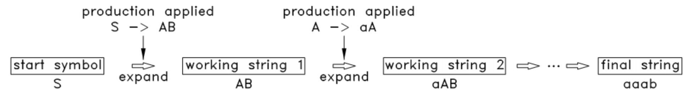
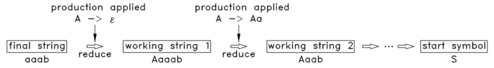

# Go 编译原理
## 概述
根据编译原理，**编译器（Compiler）** 从功能架构上可分为 **前端（Front-End）** 和 **后端（Back-end）**，前端负责生成和语言相关但和机器架构无关的中间代码，其过程包括：词法分析、语法分析、类型检查、中间代码生成，编译后端负责生成和机器架构相关的机器码，其过程包括：中间代码优化、机器码生成

版本为 `go1.20.4` 的 Go 编译器将其编译过程分为机器架构七个阶段，其中起始的两个阶段和末尾的两个阶段可以归为编译原理中的前端和后端，而中间的三个阶段则可以归为自定义的中端，具体的阶段如下：
- 词法和语法分析（Parsing）
- 类型检查（Type Checking）
- 中间表示构造（IR Construction）
- 中端优化 (IR Optimization)
- 中间表示替换 (IR Walk)
- 通用 SSA 生成（Generating Generic SSA）
- 机器码生成（Generating Machine Code）

## 核心逻辑
Go 编译器的代码实现位于 `src/cmd/compile` 目录中，内部包都放在 `src/cmd/compile/internal` 目录中，包名前缀为 `md/compile/internal/`，内部包的主函数入口是 `gc.Main()` 函数，该函数以包作为编译单元进行处理，其核心流程如下：
1. `gc.Main()` 函数会先根据 `GOARCH` 初始化 `ssagen.Arch` 变量，然后获取命令行传入的 `-gcflags` 编译器参数，并根据参数进行一系列的配置和初始化，随后会调用 `noder.LoadPackage()` 函数处理包中的所有文件
2. `noder.LoadPackage()` 函数会并发调用 `syntax.Parse()` 函数，对各个文件进行词法分析和语法分析并得到对应的 `AST` 结构，然后调用 `noder.check2()` 或 `nonder.unified()` 函数，将所有表示单个文件 `AST` 结构先通过 `noder.checkFiles()` 逐个进行类型检查后，再转化为表示单个包的 `IR` 结构，保存到 `ir.Target` 变量中
3. `gc.Main()` 函数接下来会调用多个函数对 `IR` 结构进行优化，然后对于 `IR` 结构中的 `ir.Func` 函数结点，逐个调用 `enqueueFunc()` 函数进行遍历处理，并加入到表示编译队列的 `gc.compilequeue` 变量中，然后调用 `gc.compileFunctions()` 函数进行处理
4. `gc.compileFunctions()` 函数会对并发调用调用 `ssagen.Compile()` 函数对每个 `ir.Func` 函数结点进行处理，该函数先将 `ir.Func` 函数结点转化为 `SSA` 结构，再经过一系列和机器架构无关的优化过程，以及一系列和机器架构无关的降级过程，最终得到机器码并保存在 `base.Ctxt` 变量中
6. `gc.Main()` 函数最后调用 `gc.dumpobj()` 函数，将表示整个包的机器码写入到磁盘的对象文件中，结束该包的编译过程

## 前端
### 词法分析
**词法分析（Lexical Analysis）** 又称为 **扫描（Scanning）**，其作用是扫描源代码文件，将文件中的字符流根据一定的规则转换为 **符号流（Token Stream）**，`Token` 指的是编程语言中具有实际意义的基本单位，比如名字、字面值、操作符、分隔符和关键字等

早期的 Go 编译器使用 `lex` 工具来作为词法分析器，后来则通过 Go 语言自身进行了实现，通过 `syntax.scanner` 结构表示，并通过反复调用 `syntax.scanner.next()` 方法驱动分析，逐个地从文件的字符流中获取 `Token`

Go 语言所支持的全部 `Token`，都以正整数常量的形式定义在 `src/syntax/tokens.go` 文件中，如下所示：

``` go
const (
	_    token = iota
	_EOF       // EOF
    
   // names and literals
	_Name    // name
	_Literal // literal
    
	// operators and operations
  // _Operator is excluding '*' (_Star)
	_Operator // op
	...

	// delimiters
	_Lparen    // (
	...

	// keywords
	_Break       // break
	...
	
	// empty line comment to exclude it from .String
	tokenCount //
)
```

### 文法和分析方法
**文法（Grammer）** 是用来形式化、精确描述某种编程语言的工具，一种语言的文法由四个部分组成，可被表示为一个四元祖 $(N,\Sigma,P,S)$，各部分的含义如下：
- $N$：有限个非终结符的集合，非终结符指可被展开的符号
- $\Sigma$：有限个终结符的集合，非终结符指无法再被展开的符号
- $P$：有限个生产规则的集合，将左边的非终结符转换为右边的字符串
- $S$：非终结符集合中唯一的开始符号，表示该文法中最大的成分

文法中最为重要的就是用于转换字符串的 **生产规则（Production Rule）**，生产规则的通用表达方式如下：

```
S -> [A|B]ab
A -> aa
A -> ε
B -> bb
--------------------------------
-> or =        表示符号转换
|              表示或者，任选一个符号
[] or {}       表示范围
ε              表示空字符串
```

根据生产规则的左边是否只有一个符号且为非终结符，即一个非终结符的转换结果是否会受到相邻符号的影响，将文法分为了以下两种类型：
- **上下文无关文法（CFG，Context-Free Grammar）**

  ```
  S -> aSb
  S -> ab
  S -> c
  ```
  
  能够描述较为简单的语言结构，包括大多数编程语言。在分析过程中，只要找到符合生产规则右边的字符串，就可以直接把它归约为对应的非终结符

- **上下文有关文法（CSG，Context-Sensitive Grammar）**

  ```
  S -> VS | GS
  VS -> ab
  GS -> bc
  ```

  能够描述更加复杂的语言结构和上下文信息，包括自然语言中的复杂句子结构。在分析过程中，找到符合生产规则右边的字符串后，将它的一部分归约为对应的某个非终结符时，还要确保它的其他部分是否能被归约为对应的其他符号

根据文法对给定的字符串进行语法分析，可以判断该字符串是否符合语法结构，以及分析出该字符串中包含哪些语法结构。语法分析的分析方法一般被分为以下两种类型，其区别可以通过下面分析实例进行理解：

```
// 上下文无关语法：
S –> AB
A –> aA | ε
B –> b | bB

// 给定要分析的字符串：
aabb
```

- **自顶向下（Top-Down）**

  从开始符号开始，不断的挑选出合适的生产规则，将中间字符串里的非终结符进行展开，最终展开到给定要分析的字符串
  
  
  
  使用了自顶向下分析方式的文法中，常见有 `LL(1)` 这种上下文无关文法。其对应的语法分析器实现是：从当前输入流的最左侧开始推导，从开始符号开始，对于输入流当前的输入符号，都尝试确定一个生产规则，使用生产规则右侧的符号替代当前的非终结符

- **自底向上（Bottom-Up）**

  从要分析的字符串开始，不断的挑选出合适的生产规则，将中间字符串中的子串折叠为非终结符，最终折叠到开始符号

  
  
  使用了自底向上分析方式的常见文法中，常见有 `LR(0)`、`SLR`、`LR(1)` 和 `LALR(1)` 四种上下文无关文法。其对应的语法分析器实现是：从输入流的最右侧开始推导，每次都尝试根据生产规则合并最右侧的多个符号，即分析器从最简单的符号进行推导，最后合并成开始符号

### 语法分析
**语法分析（Syntax Analysis）** 又称为 **解析（Parsing）**，其作用是分析 `Token` 序列，根据编程语言对应的文法检查是否符合语法规范，并输出对应的 `AST` 结构，即 **抽象语法树（Abstract Syntax Tree）** 

`AST` 结构能够以树状的形式表现编程语言的语法结构，树上的每个结点都表示源代码中的一种结构，即由一个或多个 `Token` 组成的表达式。而此处的抽象指 `AST` 结构不会表示出该编程语言的语法的每个细节，只是对当前源代码的结构的忠实表达

Go 语言使用了 `LALR(1)` 上下文无关文法，其文法的生产规则由 `syntax.parser` 结构的方法所实现，以下注释能够说明这些方法所代表的生产规则，其中 `SourceFile` 是 Go 文法中的开始符号：

``` go
// SourceFile = PackageClause ";" { ImportDecl ";" } { TopLevelDecl ";" }

// PackageClause  = "package" PackageName
// PackageName    = identifier

// ImportDecl     = "import" ( ImportSpec | "(" { ImportSpec ";" } ")" )
// ImportSpec     = [ "." | PackageName ] ImportPath
// ImportPath     = string_lit

// TopLevelDecl  = Declaration | FunctionDecl | MethodDecl
// Declaration   = ConstDecl | TypeDecl | VarDecl
// ...
```

Go 语法分析器通过 `syntax.parser` 结构体表示，词法分析器 `syntax.scanner` 结构内嵌在其中，通过 `syntax.parser.fileOrNil()` 方法对指定文件中的字符流逐个进行词法分析和语法分析，对于 `LALR(1)` 文法的分析方法是自底向上的

Go 语言分析器所输出的 `AST` 结构，其相关的结构都定义在 `src/syntax/nodes.go` 文件中，`AST` 结构的根结点是 `syntax.File` 结构，代表了源代码文件，`syntax.File` 的子结点是 `syntax.Decl` 接口，代表了不同种类的声明，然后不同种类的声明实现又包含不同种类的子结点，但所有的结点都实现了 `syntax.Node` 接口： 

``` go
// Nodes
type Node interface {
	// Pos() returns the position associated with the node 
	Pos() Pos
	aNode()
}

// package PkgName; DeclList[0], DeclList[1], ...
type File struct {
	Pragma    Pragma
	PkgName   *Name
	DeclList  []Decl
	EOF       Pos
	GoVersion string
	node
}

// Declarations includes：
// ImportDecl, ConstDecl, TypeDecl, VarDecl, FuncDecl
Decl interface {
	Node
	aDecl()
}
```

### 类型检查
**类型检查（Type Checking）** 对应编译原理中被称为 **语义分析（Semantic Analysis）** 的阶段，其作用是遍历检查 `AST` 结构，判断在结构上正确的源代码在语义上是否正确，即是否符合语言的类型系统和其他语义规则

Go 类型检查的入口是 `noder.checkFiles()` 函数，对同个包中的所有 `AST` 结构逐个进行类型检查，除了使用 Go 类型检查器 `types2.Checker` 之外，还有包含一些其他的类型检查，比如禁止匿名接口循环、禁止非堆类型作为类型参数等

Go 类型检查器使用 `types2.Checker.Files()` 方法对同个包中的所有 `AST` 结构进行类型检查，它会先遍历这些 `AST` 结构进行对象收集，并将 所有 `AST` 结点转化为 `types2.object` 对象，再基于这些 `types2.object` 对象进行对应的检查。`types2.object` 对象及不同种类的扩展对象，都定义在 `src/types2/object.go` 文件中：

``` go
// An object implements the common parts of an Object.
type object struct {...}

// A PkgName represents an imported Go package.
// PkgNames don't have a type.
type PkgName struct {object, ...}

// A Const represents a declared constant.
type Const struct {object, ...}

// A TypeName represents a name for a (defined or alias) type.
type TypeName struct {object}

// A Variable represents a declared variable (including function parameters and results, and struct fields).
type Var struct {object, ...}

// A Func represents a declared function, concrete method, or abstract (interface) method.
type Func struct {object, ...}

// A Label represents a declared label.
type Label struct {object, ...}

// Nil represents the predeclared value nil.
type Nil struct {object}
```
 
在对于 `types2.object` 对象的检查过程中，会将它们分成非别名类型对象 `non-alias TypeName`、别名类型对象 `alias TypeName`、其他对象 `others object` 三批，并按照先后顺序进行检查，而在每一批检查中，又会将它们分成类型未知 `white object`、类型已知 `black object`、类型推断中 `gray object` 三种，对于 `gray object` 需要额外检查是否存在初始化循环，然后再通过对应的 `checker.xxxDecl()` 方法检查所有对象的类型、赋值和初始值等，并将最终的类型信息设置回对象对应的 `AST` 结点中

`AST` 结构中使用的类型表示是通过 `syntax.Type` 接口进行定义的，而具体各种类型表示的实现则定义在 `type2` 模块中，其中包括 `type2.Basic`、`type2.Array`、`type2.Pointer`、`type2.Map` `type2.Slice` `type2.Signature` 等结构

## 中端
### 内部表示构造
**内部表示构造（IR Construction）** 也被称为 **结点化（Noding）**，其作用根据所有前端输出的，表达了单个文件的 `AST` 结构，构造一个中端自行定义和使用的，表达了整个包的 `AST` 结构，即 `IR` 结构，也称为 **内部表示（Internal Representation）**，以便后续的阶段进行处理

Go 编译器的中端从 C 代码实现的版本开始，就一直使用自行定义的 `AST` 结构和类型表示，因此本阶段需要把由 `syntax` 定义的 `AST` 结构和由 `type2` 定义的类型表示，转化为由 `ir` 定义的 `IR` 结构和由 `types` 定义的类型表示

结点化这个阶段在当前版本有两种实现，在历史版本有一种实现：
- `irgen`，也被称为 `noder2` 或 `-G=3`，是当前版本的默认实现，由`noder.type2()` 函数触发，先进行类型检查，再调用 `noder.irgen` 结构的 `noder.irgen.generate()` 方法进行结点化
- `Unified IR`，是当前版本的开发中实现，通过 `GOEXPERIMENT=unified` 编译器参数启用，由 `noder.unified()` 函数触发，先进行类型检查，再进行结点化
- `noder`，也被称为 `-G=0` 或 ，是历史版本的实现，由 `typecheck` 包中的函数触发，直接先进行结点化，再基于 `IR` 结构进行类型检查。后续版本移除了该实现后，`typecheck` 包就仅负责部分的转化处理和 `IR` 结构保存了

所有结点化实现输出的 `IR` 结构都保存在 `typecheck.Target` 变量中，其根结点通过 `ir.Package` 结构表示，其子结点都实现了 `ir.Node` 接口，而 `ir.Node` 具体实现中使用 `types.Type` 作为类型表示：

``` go
// A Package holds information about the package being compiled.
type Package struct {
	// Imports, listed in source order.
	Imports []*types.Pkg

	// Init functions, listed in source order.
	Inits []*Func

	// Top-level declarations.
	Decls []Node

	// Extern (package global) declarations.
	Externs []Node

	// Assembly function declarations.
	Asms []*Name

	// Cgo directives.
	CgoPragmas [][]string

	// Variables with //go:embed lines.
	Embeds []*Name

	// Exported (or re-exported) symbols.
	Exports []*Name
}
```

在 `irgen` 实现的 `noder.irgen.generate()` 方法中，对于已完成类型检查的所有 `AST` 结构，会先处理其中的 `syntax.ImportDecl` 结点，再处理其中的 `syntax.TypeDecl` 结点，然后处理剩下的其他结点，最后执行完剩余的任务，比如延迟函数执行、CGO 链接处理、注册内置函数、泛型的实例化和移除等，得到最终的 `IR` 结构

在 `Unified IR` 实现的 `noder.unified()` 函数中，先对所有 `AST` 结构进行类型检查，并输出这些 `AST` 结构所构成的包的 **存根（Stub）**，即包的导出数据，是能够表示包中所有文件的字符串，再读取包存根并处理为 `IR` 结构，然后使用 `typecheck.Stmt` 对顶级赋值的 `IR` 结点进行重复的类型检查，得到最终的 `IR` 结构

### 内部表示优化
**内部表示优化（IR Optimization）** 的作用是针对 `IR` 结构执行一系列优化步骤，包括无用代码消除、函数内联、去虚拟化、逃逸分析等，提高代码的执行效率和稳定性，减少代码的体积

无用代码消除需要遍历 `IR` 结构中的顶级声明 `ir.Package.Dcls`，并针对函数声明结点，即 `ir.Node.Op()` 为 `ir.ODCLFUNC` 的 `ir.Func` 结构，调用 `deadcode.Func()` 函数先判断 `ir.Func` 结点是否永不会被执行，若是则消除掉该结点的 `ir.Func.Body` 函数体字段 

函数内联指的是将多个函数结合为一个函数，提高执行的效率，通过 `inline.InlinePackage()` 函数进行，自底向上遍历 `IR` 结构中的函数声明结点，并分析其函数调用链，对于无递归、调用链长度大于 1、无特殊标记等一系列条件符合的函数调用链，将其内联称为单个函数声明结点

去虚拟化指的是接口方法在运行时判断对象的类型，会引入额外的开销，因此需要将其优化成使用固定函数来运行，需要遍历 `IR` 结构中的顶级声明 `ir.Package.Dcls`，并针对函数声明结点，调用 `devirtualize.Func()` 函数进行虚拟化

逃逸分析指的是将堆上分配的对象移动到栈上分配，减少堆分配和垃圾收集的开销，通过调用 `escape.Funcs()` 函数进行，该函数会自底向上遍历 `IR` 结构中的函数声明结点，并分析其函数调用链，对于无需在堆上分配的对象设置标记

### 内部表示遍历
**内部表示遍历（IR Walk）** 是最后一个处理 `IR` 结构的阶段，其作用是遍历 `IR` 结构的所有结点，并执行 **计算排序（Order Of Evaluation）** 和 **语法糖还原（Desugaring）** 两个步骤，为用于生成中间代码作准备最后的准备

`IR` 结构的遍历以函数定义结点为单位，对每个 `ir.Func` 结构调用 `walk.Walk()` 函数进行处理，该函数先会通过 `walk.order()` 函数进行计算排序，然后通过 `walk.walkStmtList()` 函数进行语法糖还原

计算排序的作用是将复杂的语句为简单独立的语句，并根据各个操作符具有预设的优先级和结合性，引入临时变量以确定各个操作符和操作数的计算顺序，保证语句能够按照预期的方式进行计算，避免出现歧义和错误

语法糖还原的作用是将 Go 语法中一些高级的语言结构转换成更基本的语言结构，比如 `switch` 语句转化为二分搜索或跳转表，`mpa` 和 `channel` 的操作转化为 `runtime` 包的调用，使得后续阶段的处理更加清晰和容易

``` go
// 语法糖还原为 runtime 包调用的主要情况：
map[i]          ->  runtime.mapaccess / runtime.mapassign
delete(map, i)  ->  runtime.mapdelete

<-chan          ->  runtime.chanrecv1 / runtime.chanrecv2
->chan          ->  runtime.chansend1
close(c)        ->  runtime.closechan

make(chan)      ->  runtime.makechan / runtime.makechan64
make(map)       ->  runtime.makemap / runtime.makemap64
make(slice)     ->  runtime.makeslice / runtime.makeslice64

                |-> runtime.block
select        --|-> runtime.seletcgo / runtime.seletcsetpc
                |-> runtime.seletcnbsend / runtime.seletnbrecv
                
panic           ->  runtime.gopanic
recover         ->  runtime.gorecover

new             ->  runtime.newobject   
```

## 后端
### 中间代码
**中间代码（Intermediate Code）** 在编译器中是介于源代码和目标代码之间的一种中间表示形式，它是一种和机器架构无关的形式化语言，相比于高级编程语言更加容易被优化和翻译，它有以下常见的表示形式：
- **三地址码（Three Address Code，TAC）**

一种类似于汇编语言的中间代码表示形式，每个指令都可以通过一个四元组来表示，其中包括两个操作数、一个操作符和一个结果，其优势是易于生成、理解和调试

``` go
// 代码
// i = 3 + 1 
// s[i] = i * (2 + 6)

t1 = 3 + 1
i = t1
t2 = 2 + 6
t3 = i * t2
s[i] = t3
```

- **P 代码（Pcode）**

一种类似于栈式机器的中间代码表示形式，它采用栈来存放操作数和结果，并使用单字节的操作码来表示不同的指令，其优势是代码紧凑以及较容易进行优化

``` go
// 代码
// i = 3 + 1 
// s[i] = i * (2 + 6)

push 3
push 1
add
pop i
push i
push 2
push 6
add
mul
push i
pop s[]
```

- **静态单赋值（Static Single-Assignment，SSA）**

一种基于三地址码变体的中间代码表示形式，但它的每个变量只能被赋值一次，并且在程序中的生命周期内都会保持不变，其优势是更容易进行复杂的优化，是 Go 编译器使用的中间代码表示形式

``` go
// 代码
// i = 3 + 1 
// s[i] = i * (2 + 6)

t1 = 3 + 1
i1 = t1
t3 = 2 + 6
t4 = t1 * t3
s[i1] = t4
```

### 通用 SSA 生成
**通用 SSA 生成（Generic SSA Generation）** 的作用是将 `IR` 结构编译为 SSA 形式的中间代码，这种较低级别的代码具有特定的属性，因此相比直接处理高级编程语言更加容易被优化和翻译，便于得到最终的机器码

通用 SSA 生成是通过 `ssagen.buildssa()` 函数对 `ir.Func` 函数结点进行逐个处理的，该函数通过 `ssagen.state` 结构保存处理过程的信息，会使用 `ssagen.stmtList()` 函数将 `IR` 结构转化为 `SSA` 结构，其根结点是 `ssa.Func` 结构，类型表示仍为 `types.Type`，其子结点由不同种类的 `ssa.Block` 块组成，转化结果保存到 `ssagen.state.f` 中

``` go
// A Func represents a Go func declaration (or function literal) and its body.
// This package compiles each Func independently.
// Funcs are single-use; a new Func must be created for every compiled function.
type Func struct {
	...
	Type   *types.Type // type signature of the function.
	Blocks []*Block    // unordered set of all basic blocks (note: not indexable by ID)
	Entry  *Block      // the entry basic block
	...
}

// Block represents a basic block in the control flow graph of a function.
type Block struct {
	...
	// The kind of block this is.
	Kind BlockKind

	// Subsequent blocks, if any. The number and order depend on the block kind.
	Succs []Edge
   ...
}

// BlockKind is the kind of SSA block.
const (
	BlockInvalid BlockKind = iota

	Block386EQ
	...
	
	BlockAMD64EQ
	...
	
	BlockARMEQ
	...
	
	BlockARM64EQ
	...
)
```

从 `IR` 结构转化为 `SSA` 结构的过程中，**内部函数（Function Intrinsics）** 会被应用，即特定的函数会被逐一替换为对应的内部函数，而内部函数由译器或底层系统进行特殊处理，属于高度优化的代码。同时某些 `IR` 结点也被降级为更简单的组件，以便后续的流程更好地进行处理，比如 `copy` 内置函数会被替换为 `memory move` 操作，`range` 循环会被替换为 `for` 循环

转化为 `SSA` 结构之后，调用 `ssa.Compile()` 对 `SSA` 结构进行编译，此时 `ssa.passes` 中定义的一系列与机器架构无关的 SSA 优化过程会被应用，这部分过程不涉及任何一个机器架构，因此可以在任何 `GOARCH` 表示的机器架构上运行。这些过程包括消除无用代码、删除不需要的 `nil` 检查、删除不需要的分支、使用用常量值替换重写表达式、优化乘法和浮点运算等

``` go
var passes = [...]pass{
	// TODO: combine phielim and copyelim into a single pass?
	{name: "number lines", fn: numberLines, required: true},
	{name: "early phielim", fn: phielim},
	{name: "early copyelim", fn: copyelim},
	{name: "early deadcode", fn: deadcode}, // remove generated dead code to avoid doing pointless work during opt
	{name: "short circuit", fn: shortcircuit},
	...
	// 通用 SSA 生成到此为止
	// 此过程之后的过程与机器架构相关
	{name: "lower", fn: lower, required: true},
   ...
}
```

### 机器码生成
**机器码生成（Machine Code Generation）** 的作用是翻译优化后的 SSA，生成可由目标硬件执行的实际机器码，而机器码的生成过程就是 SSA 的降级过程，Go 编译器也就是从这个阶段开始依赖目标机器架构

SSA 的降级过程是 `ssa.passes` 中定义的 **降级（Lower）** 及其之后的过程，这期间会将一些值重写成了目标 CPU 架构的特定值，降级过程处理了所有机器架构特定的重写规则，并对降级后的代码进行了一定程度的优化，比如再次消除无效代码、将数值移到离他们被使用更近的位置，删除从不被读取的局部变量、寄存器分配等

已完成优化和降级的 `SSA` 结构，被通过 `ssa.genssa()` 函数将其中包含的指令添加到 `objw.Progs` 结构中，并调用 `objw.Progs.Flush()` 函数将这些指令转化为对应的机器码，保存到 `base.Ctxt` 变量中，该变量表示了将机器码写出到对象文件所需的上下文 

当包中的所有函数都逐一完成机器码生成后，使用 `gc.dumpobj()` 根据 `base.Ctxt` 中的信息将机器码写出到 `base.Flag.LowerO` 指定的对象文件中。多个对象文件后续经过链接器的处理，就能得到用于执行的目标文件