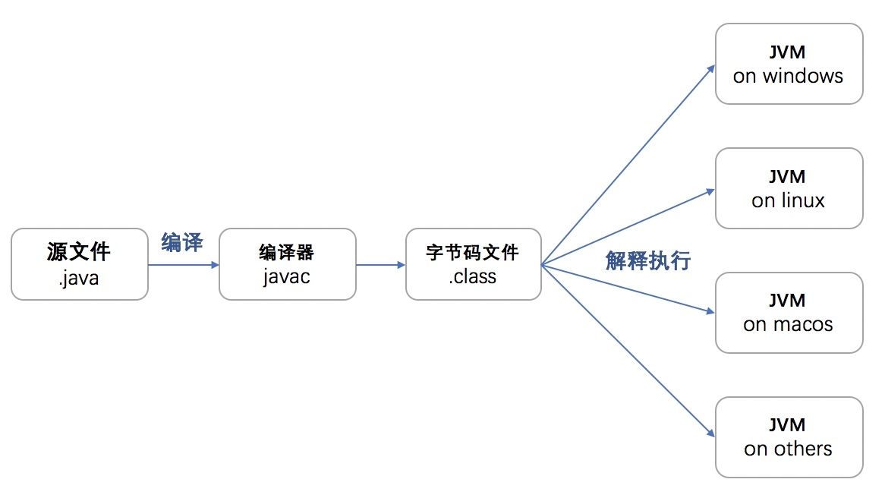
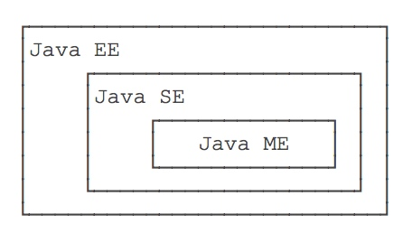
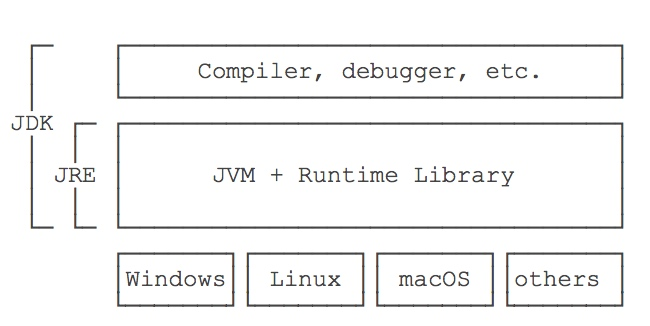
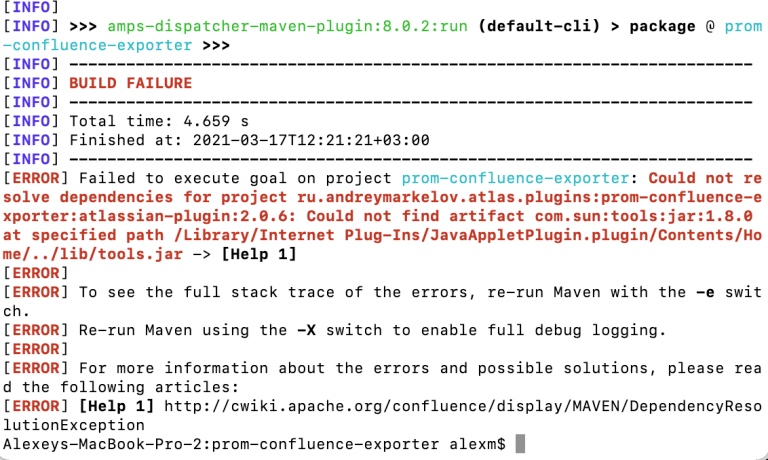
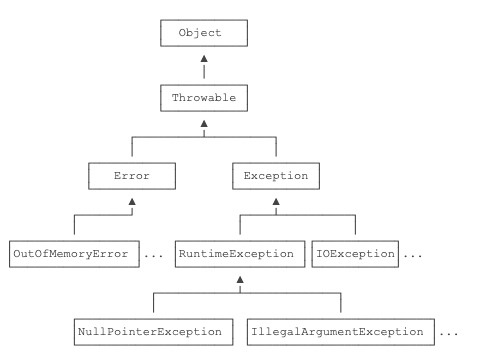

# 【Java】基础知识

* [【Java】基础知识](#java基础知识)
  * [简介](#简介)
    * [版本](#版本)
    * [安装](#安装)
    * [使用](#使用)
  * [基础语法](#基础语法)
    * [规则规范](#规则规范)
    * [包和类的导入](#包和类的导入)
    * [输入输出](#输入输出)
    * [变长形参](#变长形参)
    * [匿名函数](#匿名函数)
  * [控制语句](#控制语句)
    * [条件控制](#条件控制)
    * [循环控制](#循环控制)
  * [修饰符](#修饰符)
    * [访问修饰符](#访问修饰符)
    * [非访问修饰符](#非访问修饰符)
  * [异常处理](#异常处理)
    * [异常捕获](#异常捕获)
    * [异常抛出和声明](#异常抛出和声明)
    * [异常类型](#异常类型)

## 简介
Java 是一门 **混合型的**、**静态类型的**、**强类型定义的**、**面向对象的** 编程语言。[JavaCore 技术教程](https://dunwu.github.io/javacore/)，[Java 中文教程](https://www.w3cschool.cn/java/)

混合型语言介于编译型语言和解释型语言之间。Java 源代码（文件以 `.java` 为后缀）必须先通过编译器进行编译，得到介于源代码和机器码之间的中间码（也称为 Java 字节码，文件以 `.class` 为后缀，内容类似于抽象的 CPU 指令），这些中间码再通过针对不同平台的 JVM（Java 虚拟机，即 Java 解释器，引入了 JIT 动态编译）进行解释执行，其跨平台能力很强，可以做到 “一次编译，到处运行”，更加接近于解释型语言



跨平台能力对于开发者而言的，而对于 JVM，则需要为每个平台单独开发。并且为了保证不同平台、不同公司开发的虚拟机都能正确执行 Java 字节码，SUN 公司制定了一系列的 JVM 规范。并且从实践的角度看，JVM 的兼容性做得非常好，低版本的 Java 字节码完全可以正常运行在高版本的 JVM 上

### 版本
在 Java 早期，Java 版本统称为 JDK，而随着 Java 的发展，SUN 给 Java 又分出了以下三个不同的版本：


- Java SE（Standard Edition）：标准版，包含标准的 JVM 和标准库，是整个 Java 平台的核心

- Java EE（Enterprise Edition）：企业版，在 Java SE 的基础上增加了一些更便捷的应用框架，使用的虚拟机和 Java SE 完全相同

- Java ME（Micro Edition）：是针对嵌入式设备的裁剪版，在 Java ME 上无法使用 Java SE 的标准库，使用的虚拟机也是裁剪版

从 Java 标准版来看，从 1995 年开始发布了 JDK 1.0，目前最新的版本是 Java SE 15，由于版本命名上的区别，JDK 1.x 等价于 Java SE x，即 JDK 1.8 等价于 Java SE 8

### 安装
JRE（Java Runtime Environment）包含用于解释执行 Java 字节码的 JVM（JAVA 虚拟机）和一系列运行时的库，由 C++ 语言编写

JDK/Java SE 包括了 Java 的开发环境，而 JDK 除了包含 JRE，还提供了编译器、调试器等开发工具，用于将 Java 源代码编译成 Java 字节码，[下载地址](https://www.oracle.com/cn/java/technologies/javase-downloads.html)



JDK 安装后，在 `${JAVA_HOME}` 的 `bin` 目录下，存在一下可执行程序：
- `java`：用于解释执行 Java 字节码的 JVM
- `javac`：用于编译 Java 源代码的 Java 编译器
- `jar`：用于把一组 `.class` 文件打包成一个 `.jar` 包
- `javadoc`：用于从 Java 源代码中自动提取注释并生成文档
- `jdb`：用于开发阶段进行运行调试的 Java 调试器
- `javap`：用于反编译 Java 字节码，输出字节码中包含的类、变量和方法签名

需要添加 JAVA_HOME 环境变量：
``` bash
export JAVA_HOME= ${jdk_install_dir}
```

否则会出现一些依赖库无法找到的情况：



### 使用
命令用法：
``` bash
# 编译指定的源文件
javac ${java_path}
#   -d ${bytecode_path}       指定字节码文件的存放路径

# 执行指定的类
java ${java_class}

# 执行指定的 jar 包
java -jar ${jar_path}
```
<br>

每个 `.class` 字节码文件包含一个 Java 类，若一个 `.java` 文件中定义了多个类，则编译后可得到多个 `.class` 文件

通过 JVM 来执行指定的类，首先 JVM 会启动类加载器 `ClassLoader`，然后类加载器会从类路径`classpath` 中搜索到对应的 `.class` 文件，并加载到 JVM 内存中，最后由 JVM 解释执行

类路径 `classpath` 是 Java 使用的环境变量，格式为以 `:`  来分隔的目录、`.jar` 包和 `.zip` 包，用于搜索 `.class` 文件，没有配置时则默认为当前目录

Java 使用 `.jar` 包和 `.zip` 包作为归档文件，用于将一组 `.class` 文件打包成一个压缩文件，便于发布

## 基础语法
### 规则规范
Java 代码规则：
- 逻辑行：代码中的多个物理行被视为一个逻辑行，每个逻辑行以 `;` 结尾，空白行会被自动忽略掉

- 关键字：所有的关键字都由小写字母组成

- 标识符：所有标识符只能由字母、`_`、 `$` 和数字组成，并且由前三者开头，字母大小写敏感，不能使用关键字作为标识符

- 源文件名：每个源文件中最多有一个 public 类，且除去后缀的文件名必须和 public 类名相同，否则会导致编译错误

- 主方法：每个 Java 类被执行时，会先找到其类中的主方法  `public static void main(String[] args)` 开始执行，若没有主方法则会发生执行错误

- 代码注释：不会被编译到字节码文件中，可以通过下列方式表示

``` java
// 单行注释

/* 
多行注释
多行注释
*/

/**
* javadoc 注释
* javadoc 注释
* javadoc 注释
**/
```

Java 代码规范：
- 类名：对于所有的类来说，规范的类名使用大驼峰来表示，比如 `MyFirstJavaClass`

- 方法名和变量名：对于所有的类来说，规范的方法名使用小驼峰来表示，比如 `myFirstJavaMehtod`

- 方法名和变量名：对于所有的类来说，规范的方法名和变量名使用小驼峰来表示，比如 `myFirstJavaMehtod`、`myFirstJavaVar`

- 常量名：对于所有的类来说，规范的常量名使用全大写来表示，比如 `MY_STATIC_VALUE`
<br>

Java 程序示例 `HelloWorld.java`：
``` java
public class HelloWorld
{
    public static void main(String[] args) 
    {
        System.out.println("Hello World");
    }
}
```

### 包和类的导入
包主要用于对类和接口进行分类和管理，可以通过源文件首行的 `package` 语句，来声明该源文件下所定义类的所属包

包名为了保证唯一性，常用规范为 `公司域名 + 项目名 + 模块名 + 功能名`，并且需要对应字节码文件所在的目录名，否则类加载器会无法搜索到该类

若包声明为 `com.company.project.module.function`，则字节码文件需要放在编译工作目录的 `com/company/project/module/function` 相对目录下，一般来说源文件按规范也会放在该目录下

包名也要遵守标识符的命名规则。当一个类的源文件中使用了包机制后，其名字为 `包名 + 类名`

<br>
类的导入和使用：
- 同一个包下的类可以直接使用，而其他包下的类，则需要通过类名来使用，即 `包名 + 类名`

- 通过 `import` 语句对类进行导入后，能够直接使用该类，Java 编译器会根据导入路径找到该类

- `import` 既可以导入指定类 `import com.company.project.module.function.A`，也可以导入指定包的所有类 `import com.company.project.module.function.*`

- 当直接使用一个类时，Java 编译器会优先在当前包中查找该类，若没有时才会去查找所导入的类

- 无包的类可以访问有包的类，直接导入即可，但有包的类无法访问无包的类

- 包实际上是没有等级区分的，如 `java.awt` 和 `java.awt.color` 是两个地位相同的包，没有隶属关系

- `java.lang.*` 这些类是 Java 提供的核心类，不需要手动导入就可以直接使用

- 使用 `import static com.company.project.module.function.A` 进行静态导入，可以直接通过类名来访问所导入的类

<br>
在一个源文件中，可以包含一个 `package` 语句、多个 `import` 语句和类，但需要遵守以下声明规则：
- 一个源文件中最多有一个 public 类，但不是必须的，若有则类名需要和除去后缀的源文件名保持一致

- 一个源文件中可以有多个非 public 类

- 若要定义文件中的类在某个包中，那么 `package` 语句应该在源文件的首行，且不能为不同的类进行不同的包声明

- 如果源文件包含 `import` 语句，那么应该放在 `package` 语句之后，类定义之前

- `import` 语句和 `package` 语句对源文件中所有定义的类都有效

### 输入输出
**标准输出**

``` java
// 标准输出指定的内容，并换行
// content 是一个 String 对象
System.out.println(content); 
```

**标准输入**

``` java
import java.util.Scanner;

Scanner scanner = new Scanner(System.in);
// 等待直到有标准输入，返回输入的 String 内容
scanner.next();

// 等待直到有标准输入，返回输入的 int 内容
// 若输入不为 int 类型，则触发异常
scanner.nextInt();
```

### 变长形参
变长形参允许在调用方法时传入不定长度的实参，这些实参会被当成数组传入，使用方式：
``` java
public class Varargs {

    public void foo(String... args);
    
    public static void main(String[] args) {
        // 两种调用是等价的
        foo("arg1", "arg2", "arg3");
        foo(new String[]{"arg1", "arg2", "arg3"});
    }
    
    // 编译错误，参数使用有误
    public void error1(String... args, Object o) {}
    public void error2(String... args, Integer... i) {}
    
    // 编译错误，重复方法声明
    public void foo(String[] args){}
}

public class Varargs2 extends Varargs {
    // 方法覆盖，应该避免这样声明 
    public void foo(String[] args){}
}
```

变长形参使用的注意点：
- 变长形参只能作为方法的最后一个形参，且每个方法最多只能有一个
- 变长形参会被编译器转型为一个数组，若 `void foo(String[] args)` 方法在同一个类中存在，会出现重复声明；若在其子类中存在，则会出现方法覆盖，应该避免这样进行方法覆盖
- 变长形参不能和泛型机制配合使用，否则会出现 `generic array creation` 编译错误

存在方法重载时，如果既能够和固定参数的重载方法匹配，也能够与变长形参的重载方法匹配，则选择固定参数的方法
``` java
public class Varargs {

    public static void test(String... args) {
        System.out.println("version 1");
    }

    public static void test(String arg1, String arg2) {
        System.out.println("version 2");
    }
    public static void main(String[] args) {
        // 匹配固定参数的重载方法
        test("a","b");
        // 匹配变长形参的重载方法
        test();
    }
}
```
> 若调用一个被重载的方法时，如果此调用既能够和两个可变长形参的重载方法匹配，则编译出错

### 匿名函数
匿名方法又称为 lambda 表达式，允许把函数作为一个方法的参数，其使用语法为：
``` java
// 当仅有一个参数时，可以省略 ()，参数可以省略参数类型声明
// {} 中的内容为函数体，需要主动返回返回值
(parameters) -> {
    statements;
}

// 示例
(a, b) -> {
    return a + b;
}

// 当仅有一个语句，可以省略 {}，且视为表达式，自动返回该表达式的值
(parameters) -> expression

// 示例
(a, b) -> a + b
```

仅包含单个方法签名的接口，称为函数式接口，一个符合该方法签名的匿名函数，可以转化该接口的匿名类型对象。此时当调用该对象的接口方法时，就会调用到该匿名函数
``` java
// 示例，快速实现接口并实例化

interface MathOperation {
  int operation(int a, int b);
}

MathOperation addition = (a, b) -> a + b;

addition.operation(1, 2)    // 返回 3
```

当使用匿名函数只为了调用一个已经存在的方法时，可以使用 `::` 来进行方法引用，例如：
``` java
// 类的静态方法引用、成员方法引用
Classname::methodname

// 类的构造器引用
Classname::new

// 在方法内，对象的本身/父类方法引用
this::methodname/super::methodname

// 数组的构造器引用
Type[]::new

// 示例，简便地使用类的静态方法引用作为匿名函数
Class A {
    public static method(String s) {}
}
List<String> objs;
objs.foreach(A::method)
```

当在匿名函数中访问了函数外部的变量，也称为自由变量，此时该匿名函数也就形成了一个闭包，也就是说：当外部环境持有内部函数所依赖的自由变量，则对内部函数形成了闭包

在 Java 中，由于它的面向对象特性，类中任何一个成员方法所依赖的自由变量都来自于其所在类的实例，因此闭包无处不在，但对于面向对象语言一般都不把类叫成闭包

但在内部类中，若所依赖的自由变量来自外部类中的实例，这就和上述匿名函数一样，是典型的闭包结构了

闭包对于对于自由变量的捕获策略有以下两种:
- **值捕获（capture-by-value）**: 只需要在创建闭包的地方把捕获的值拷贝一份到对象里即可

- **引用捕获（capture-by-reference）**: 把被捕获的局部变量的引用保存到对象里

由于 Java 只实现了值捕获，但为了以后能进一步扩展成支持引用捕获，所以只允许自由变量为实际不变变量（effectively final variable）

因此依赖的自由变量可以为以下三种情况：
- 成员变量或静态变量，由于这两种变量可认为是通过 final 类型的局部变量 this 来进行引用的
- final 修饰的局部变量
- 在实际代码中，声明后没改变过引用地址的局部变量

## 控制语句
### 条件控制
**if 条件语句**

``` java
if (布尔表达式 A) {
    // 布尔表达式 A 为 true 时执行
    语句 A;
} else if (布尔表达式 B) {
    // 布尔表达式 A 为 false，但布尔表达式 B 为 true 时执行
    语句 B;
} else {
    // 布尔表达式 A 和布尔表达式 B 都不为 true 时执行
    语句 C;
}

// 单一执行语句的简单选择结构，省略了大括号，但不推荐使用
if (布尔表达式 A) 语句 A; else 语句 A;

// if else 选择结构用于赋值时可以通过三元表达式，也称为条件表达式来实现
// 当布尔表达式为 true 时，执行表达式 A，否则执行表达式 B
String s = 布尔表达式 ? 表达式 A : 表达式 B
```

> 基本类型 boolean 可以直接作为布尔表达式，但包装类型 Boolean 不可以直接作为布尔表达式，当其为 null 时会触发空指针异常

**switch 分支语句**

``` java
switch (表达式) {
    case 值 1 :
        // 表达式结果为值 1 时执行
        语句 A;
        // 若没有 break 语句，则会继续进入下一个 case，称为 case 穿透现象，应该避免
        break;
    // case 合并
    case 值 2 : case 值 3 :
        // 表达式结果为值 2 或值 3 时执行
        语句 B;
        break;    
    ...
    default :
        // 表达式结果不为任一 case 的值时执行
        语句 C;
}
```
> 表达式和值的类型只能为 int 类型和 String 类型，或者能自动转换为这两种类型的类型

### 循环控制
**for 循环语句**

``` java
for (初始化表达式; 布尔表达式; 更新表达式) {
    // 布尔表达式为 true 时循环执行
    循环体;
}

// 增强 for 循环
for (声明变量 : 可迭代对象) {
   // 循环遍历可迭代对象的所有元素，每次会将该元素赋值到声明变量中再执行
   // 可迭代对象的元素的数据类型必须能自动转化为变量的数据类型
}
```
> 可迭代对象包括数组和实现 Iterable 接口的类

**while 循环语句**

``` java
while (布尔表达式) {
    // 布尔表达式为 true 时循环执行
    循环体;
}
```

**do while 循环语句**

``` java
do {
    // 循环执行直到布尔表达式为 false
    循环体;
} while (布尔表达式);
```
> 循环体至少会执行一次

**内部控制语句**

- `break;`

  用在循环语句或者 switch 语句中，用来跳出整个语句块
  
- `continue;`

  适用于循环语句中，用于立刻跳转到下一次循环的迭代。在 for 循环中，即跳转到更新语句；在 while 或者 do while 循环中，即跳转到布尔表达式判断

## 修饰符
### 访问修饰符
不同的访问修饰符对应着不同的访问级别，以下按照严格程度从大到小排序：

| 修饰符 | 所属类 | 包内 | 子孙类 | 其他包 |
| --- | --- | --- |--- | --- | --- |
| public | Y | Y | Y | Y |
| protected | Y | Y | Y（有条件） | N |
| default |  Y | Y | N | N |
| private |  Y | N | N | N |

> 访问控制和方法继承后覆盖的规则：方法在子类中声明的访问权限，不能比在父类中声明的访问权限更严格

**default（无关键字）**

表示 “默认的” 的含义，可用于修饰变量、方法、类和接口。除了局部变量，其他被 `default` 所修饰的内容，对于同一个包内的任意类都是可见的

在接口之中，对于无关键字的方法，其隐式声明为 `public abstract`，而对于无关键字的成员变量，其隐式声明 `public static final`

**public** 

表示 “公共的” 的含义，可用于修饰变量（非局部变量）、方法、类和接口。被 `pubic` 所修饰的内容，对于任意包的任意类都是可见的

类的 `main` 方法必须为 `public`，否则 Java 解释器将不能运行该类

**protected**

表示 “受保护的” 的含义，可用于修饰变量（非局部变量）、方法和类（非顶级类）。被 `protected` 所修饰的内容，对同一包内的任意类以及任意包的子类都是可见的

当基类和子类不在同一包中时，子类实例可以访问其从基类继承而来的 `protected` 内容，但不能访问基类实例的 `protected` 内容

**private**

表示 “私有的” 的含义，是最严格的访问级别，可用于修饰变量（非局部变量）、方法和类（非顶级类）。被 `private` 所修饰的内容，只能对其所属类可见

声明为 `private` 的内容，需要通过类中声明 `public` 的 `get/set` 方法作为入口，才被外部类所访问

`private` 修饰符主要用来隐藏类的实现细节和保护类的数据

### 非访问修饰符
**static**

表示 “静态的” 的含义，可用于修饰属性（非局部变量）、方法、类（非顶级类）和代码块

- `static` 变量：称为静态变量或类变量，独立于对象存在，即无论一个类实例化多少对象，静态变量只有一份
  
- `static` 方法：称为静态方法或类方法，独立于对象存在，静态方法不能调用成员变量和成员方法

- `static` 类：称为静态内部类，独立于对象存在，静态内部类的方法中不能调用成员变量和成员方法
  
- `static` 代码块：在类加载时执行，并且只执行一次，通常用于完成一些类的初始化工作
  
类变量和类方法能够节约内存空间，并可直接通过 `类.变量名` 或 `类.方法名` 可以分别对它们进行访问

**final**

表示 “最终的” 的含义，可用于修饰变量、方法和类

- `final` 变量：
  - 若变量为基本类型，则变量为常量，值不能修改
  - 若变量为引用类型，则变量所引用的地址不能修改，但所引用的对象本身可以修改，而引用的对象也无法被垃圾回收
  - 若变量不为局部变量，则该变量声明时或者在构造器中必须进行初始化，否则编译会报错
    
  通常将 `final` 和 `static` 一起使用来修饰类非局部变量，以声明类常量

- `final` 方法：无法被子类覆盖，但仍然可以被继承，主要目的是防止该方法的内容被修改

- `final` 类：该类无法被继承，没有类能够继承其任何特性

**abstract**

表示 “抽象的” 的含义，可用于修饰方法和类

- `abstract` 方法：只能存在于 `abstract` 类或接口中，不能被为 `primary` 修饰，不能被 `final` 和 `static` 修饰，没有方法体并且需要以分号结尾，也称为方法签名
  
  不包含任何实现，具体实现由子类提供，任何继承了 `abstract` 类的子类，必须实现父类所有的 `abstract` 方法，除非该子类也是 `abstract` 类

- `abstract` 类：不能用来实例化对象，抽象类的唯一目的是为了将来对该类进行扩充，不能同时被 `final` 修饰

## 异常处理
### 异常捕获
异常捕获的语法：
``` java
try {
    // 业务逻辑
} catch (Exception1 e) {
   // 处理异常 Exception1
} catch (Exception2 e) {
   // 处理异常 Exception2
} finally {
   // 最后处理逻辑
}
```
`catch` 语句可以存在多个，JVM 在捕获到异常后，会从上到下匹配 `catch` 语句所捕获的异常，匹配成功后执行对应 `catch` 块代码

因此 `catch` 语句需要注意顺序，在上面的 `catch` 语句所捕捉的异常类型应该不包含下面的 `catch` 语句，否则下面的 `catch` 语句永远不会被执行

通过一个 catch 语句来捕获多个异常，可以使用 `catch (Exception1 | Exception2 | ...)` 实现

`finally` 语句总是在最后，而且是可选的，表示无论是否触发异常最终都会执行的逻辑，除非线程被中断

### 异常抛出和声明
通过 `throw` 语句可以进行异常的抛出，抛出的异常如果没有被捕获，异则会抛到更上层的调用方法中，其语法为：
``` java
// 初始化异常对象并抛出
throw new Exception(args,...);

// Exception 规定了多种构造器
// message 表示错误信息
// cause 表示引发该异常的原因异常
Exception(String message)
Exception(Throwable cause)
Exception(String message, Throwable cause)
```
> 如果在 `catch` 和 `finally` 语句中同时抛出异常，则 `catch` 语句中的 `throw` 语句将不会被执行，产生异常被屏蔽的现象

通过异常的 `printStackTrace` 方法的可以输出错误被抛出的方法调用栈，如：
```
java.lang.NumberFormatException: null
    at java.base/java.lang.Integer.parseInt(Integer.java:614)
    at java.base/java.lang.Integer.parseInt(Integer.java:770)
    at Main.process2(Main.java:16)
    at Main.process1(Main.java:12)
    at Main.main(Main.java:5)
```
> 上述信息表示：`NumberFormatException` 是在`java.lang.Integer.parseInt` 方法中被抛出的，从下往上看，其调用层次依次是：
1. `main()` 调用 `process1()`
2. `process1()` 调用`process2()`
3. `process2()` 调用`Integer.parseInt(String)`
4. `Integer.parseInt(String)` 调用 `Integer.parseInt(String, int)`

通过 `throw` 语句还可以为方法进行异常的声明，表示方法可能抛出的异常，其语法为：
``` java
public static returnType methodName(String s) throws Exception1, Exception2 {
    // 方法内容
}
```
如果一个方法声明了可能抛出的异常，且该异常类型是 Checked Exception，则其上级调用方法必须进行异常捕获或者也使用 `throw` 语句声明可能抛出

### 异常类型
Java 中的异常也是类，其主要的异常类型和对应继承关系如下：



`Throwable` 有两个子类：
- `Error` 表示程序代码无法处理的严重错误，不需要捕获，比如：
    - `OutOfMemoryError`：内存耗尽
    - `NoClassDefFoundError`：无法加载某个类
    - `StackOverflowError`：栈溢出
    
- `Exception` 表示运行时的错误，可以被捕获并处理，比如：
    - `NumberFormatException`：数值类型的格式错误
    - `IOException`：IO 操作失败
    - `FileNotFoundException`：未找到文件
    - `SocketException`：读取网络失败

`Exception` 子类 `RuntimeException` 表示不应该捕捉，而应修改程序逻辑修复的错误，比如：
- `NullPointerException`：访问空指针的方法或字段
- `IndexOutOfBoundsException`：数据索引越界

`Exception` 中除了 `RuntimeException` 的其他子类异常，编译器强制要求必须捕捉或声明可能抛出，这类的异常被称为 **Checked Exception**
 