# 【Java】工具框架

* [【Java】工具框架](#java工具框架)
    * [Maven](#Maven)
    	* [项目创建](#项目创建)
    	* [生命周期](#生命周期)
    	* [插件管理](#插件管理)
    	* [依赖管理](#依赖管理)
    	* [模块管理](#模块管理)
    * [OSGI](#OSGI)
    	* [规范内容](#规范内容)
    	* [模块层](#模块层)
    	* [生命周期层](#生命周期层)
    	* [服务层](#服务层)
    	* [Blueprint](#Blueprint)
    	* [Karaf](#Karaf)
    * [Spring Boot](#Spring-Boot)

## Maven
Maven 是一个 Java 项目管理和构建工具，它提供了一套标准化的项目结构和构建流程，还有项目依赖机制，并使用命令进行统一的自动化构建，[官方文档](https://maven.apache.org/index.html)

### 项目创建
每个项目都被 Maven 看作为一个 **POM（Project Object Moduel）**，具有标准化的项目结构，以及通过 `pom.xml` 文件来定义项目的内容

使用以下命令可以创建一个简单的 Maven 项目：

``` bash
# -DgroupId 定义了公司或组织名
# -DartifactId 定义了项目名
mvn -B archetype:generate -DgroupId=com.mycompany.app -DartifactId=my-app \
-DarchetypeArtifactId=maven-archetype-quickstart -DarchetypeVersion=1.4
```

首先命令会根据项目名 `my-app` 创建一个项目目录，其目录结构如下：

```
my-app
├── pom.xml
└── src
    ├── main
    │   └── java
    │       └── com
    │           └── mycompany
    │               └── app
    │                   └── App.java
    └── test
        └── java
            └── com
                └── mycompany
                    └── app
                        └── AppTest.java
```
- `my-app`：项目目录，使用项目名来命名，包含一个 `pom.xml` 文件
- `my-app/src/main/java`：存放项目源码的目录
- `my-app/src/test/main/java`：存放测试相关源码的目录

在根据项目需求添加了资源目录，以及项目构建后产生了输出目录后，其目录结构如下：
```
my-app
├── pom.xml
├── src
│   ├── main
│   │   ├── java
│   │   │   └── com
│   │   │       └── mycompany
│   │   │           └── app
│   │   │               └── App.java
│   │   └── resources
│   │       └── application.properties
│   └── test
│       ├── java
│       │   └── com
│       │       └── mycompany
│       │           └── app
│       │               └── AppTest.java
│       └── resources
│           └── test.properties
└── target
    ├── classes
    └── test-classes
```
- `my-app/src/main/resources`：存放项目配置和资源的目录
- `my-app/src/test/resources`：存放测试相关配置和资源的目录
- `target`：存放打包输出文件的目录
- `target/classes`：存放编译输出文件的目录
- `target/test-classes`：存放测试代码编译输出文件的目录

其次命令会为项目生成一个简单的 `pom.xml` 文件，其大致的内容格式如下：
``` xml
<project xmlns="http://maven.apache.org/POM/4.0.0" xmlns:xsi="http://www.w3.org/2001/XMLSchema-instance"
  xsi:schemaLocation="http://maven.apache.org/POM/4.0.0 http://maven.apache.org/xsd/maven-4.0.0.xsd">
  <modelVersion>4.0.0</modelVersion>
 
  <groupId>com.mycompany.app</groupId>
  <artifactId>my-app</artifactId>
  <version>1.0-SNAPSHOT</version>
  <packaging>jar</packaging>
 
  <name>my-app</name>
  <!-- FIXME change it to the project's website -->
  <url>http://www.example.com</url>
 
  <properties>
    <project.build.sourceEncoding>UTF-8</project.build.sourceEncoding>
    <maven.compiler.source>1.7</maven.compiler.source>
    <maven.compiler.target>1.7</maven.compiler.target>
  </properties>
 
  <dependencyManagement>
      <dependencies>
         ... lots of necessary dependencies
      </dependencies>
  </dependencyManagement>
  <dependencies>
     ... lots of necessary dependencies
  </dependencies>
 
  <build>
    <pluginManagement>
        <plugins>
           ... lots of helpful plugins
        </plugins>
    </pluginManagement>
    <plugins>
       ... lots of helpful plugins
    </plugins>
  </build>
</project>
```
- `<project>`：根元素，在属性上声明了 Maven 信息，项目的所有配置内容都包含在该元素内
- `<modelVersion>`：当前 POM 模型的版本，对于 Maven2 及 Maven 3 来说，只能是 4.0.0
- `<groupId>`：公司或组织名
- `<artifactId>`：项目名
- `<version>`：版本号
- `<packaging>`：项目打包输出的文件类型，元素值默认为 `jar`，表示输出 Jar 包，父模块需要为 `pom`，表示仅用于整合模块
- `<name>`：项目显示名，常用于生成站点文档
- `<url>`：项目站点，常用于生成站点文档
- `<properties>`：包含自定义的 Maven 属性，每个 `<属性名>` 子元素代表一个属性，在 POM 的其他位置可以通过 `${属性名}` 来引用这些属性
- `<dependencyManagement>`：包含依赖项目的版本声明，通常在父模块定义
- `<dependencies>`：在 `<dependencyManagement>` 之外时，包含具体依赖项目的信息，Maven 会根据这些信息下载依赖包
- `<build>`：包含项目目录结构声明和插件管理
- `<pluginManagement>`：包含一些插件的版本声明，通常在父模块定义
- `<pluins>`：在 `<pluginManagement>` 之外时，包含具体引入的插件，并可绑定到 Maven 相关的生命周期中

> 一个 Maven 项目由其 `<groupId>`、`<artifactId>` 和 `<version>` 作为联合唯一标识，若要对一个项目进行引用，可以通过 [Maven 搜索网站](http://search.maven.org) 来搜索获取它的以上标识信息
> 
> Jar 包就是后缀为 `.jar` 的文件，是 Java 代码的归档压缩文件，便于管理、分发和存储，JVM 能自动从 Jar 包中查找需要导入的类

### 生命周期
Maven 的 **生命周期（Lifecycle）** 是用于对项目的所有构建过程进行抽象和统一，其内置了三套生命周期：
- **default**：负责项目的编译
- **clean**：负责项目的环境清理
- **site**：负责生成项目的站点文档

每个生命周期内部都包含多个 **阶段（Phase）**，这些阶段需要被有序执行，某个阶段的执行前会先执行其前面的阶段

default 生命周期的主要阶段包含：
- **validate**：验证项目是否正确并且所有必要信息都可用
- **compile**：编译项目的源代码
- **test**：使用合适的单元测试框架运行测试，测试代码不会被打包和部署
- **package**：将编译后的代码打包成可分发的格式，比如 Jar 包
- **verify**：运行任何检查以验证包是否有效并符合质量标准
- **install**：安装项目包到本地仓库，供本地其他项目使用
- **deploy**：将项目包部署到远程仓库，供其他开发人员和项目使用

clean 生命周期的主要阶段是 **clean**：清理之前构建所生成的文件

site 生命周期的主要阶段是 **site**：生成项目的站点文档

> 各个生命周期的完整阶段参考 [官方说明](https://maven.apache.org/guides/introduction/introduction-to-the-lifecycle.html#lifecycle-reference)

Maven 通过 `mvn` 命令来执行构建任务，命令的实际执行基于生命周期的，其使用方式：
``` bash
# phase 表示构建任务需要完成执行的阶段
# args 是额外支持的参数
# Maven 会自动根据阶段所属的生命周期，完成其前置阶段的执行
mvn ${phase1} [${phase2}] ... ${args}

# 常用参数：
# -DskipTests：跳过测试阶段
# -T ${n}：启用 n 个线程完成编译
# -D ${property}=${value}：定义系统属性
```
常用的命令组合如下：
- `mvn clean`：执行到 clean 阶段，此时 `target` 目录的内容会被删除

- `mvn clean compile`：先执行到 clean 阶段，再执行到 compile 阶段，会自动安装依赖包到本地仓库，然后将编译结果输出到 `target` 目录

- `mvn clean test`：先执行 clean 阶段，再执行到测试阶段，会编译和运行测试代码

- `mvn clean package`：先执行 clean 阶段，再执行到 package 阶段，将打包结果输出到 `target` 目录

- `mvn clean install`：先执行清理阶段，再执行到安装阶段，会将打包结果安装到本地仓库

- `mvn clean deploy`：表示先执行 clean 阶段，再执行到 deploy 阶段，会将打包结果部署到远程仓库上

### 插件管理
Maven 的核心逻辑仅仅是定义了抽象的生命周期，而生命周期中每个阶段具体的任务执行通过 **插件（Plugin）** 完成的

Maven 插件以独立构件的形式存在，类似于 Maven 项目，为了能复用代码，每个插件中可能包含一个或多个功能。插件中的每个功能就叫做插件的 **目标（Goal）**，也就是每个插件可能包含一个或者多个目标

生命周期的阶段与插件目标绑定，以完成某个具体的构建任务。比如项目编译对应 default 生命周期的 compile 阶段，而 maven-compiler-plugin 插件的 compile 目标对应了项目编译的功能，因此将它们进行绑定，通过阶段的执行最终完成项目编译这个任务

内置的生命周期阶段和插件绑定关系：

| 生命周期 | 阶段 | 插件:目标 | 作用 |
| --- | --- | --- | --- |
| clean | clean | maven-clean-plugin:clean | 删除 `target` 目录的内容 |
| default | process-resources |	maven-resources-plugin:resources | 复制资源文件到`target/classes` 目录 |
| default | compile |	maven-compiler-plugin:compile | 编译代码输出到 `target/classes` 目录 |
| default | process-test-resources	| maven-resources-plugin:testResources | 复制资源文件到 `target/test-classes` 目录 |
| default | test-compile | maven-compiler-plugin:testCompile	| 编译测试代码输出到 `target/test-classes` 目录 |
| default | test | maven-surefire-plugin:test | 执行测试用例 |
| default | package	 | maven-jar-plugin:jar | 编译结果打包为 Jar 包输出到 `target` 目录 |
| default | install	 | maven-install-plugin:install | 打包结果安装到本地仓库 |
| default | deploy | maven-deploy-plugin:deploy | 打包结果部署到远程仓库 |

> 若内置的插件无法满足需求，还可以在 `pom.xml` 中声明使用其他插件，当上述的生命周期阶段存在显式的插件目标绑定时，内置的绑定关系将不会生效

以下是插件的版本和配置声明，不会实际引入插件，通常定义于父模块中：
``` xml
<pluginManagement>
    <plugins>
        <plugin>
            <groupId>org.apache.maven.plugins</groupId>
            <artifactId>maven-source-plugin</artifactId>
            <version>2.1</version>
            <configuration>
                <attach>true</attach>
            </configuration>
            <executions>
                <execution>
                    <phase>compile</phase>
                    <goals>
                        <goal>jar</goal>
                    </goals>
                </execution>
            </executions>
        </plugin>
    </plugins>
</pluginManagement>
```
- `<configuration>`：是插件的配置
- `<executions>`：每个子元素 `<execution>` 表示一个插件的执行项，包含一个生命周期阶段和一个或多个插件目标的绑定关系
- `<phase>` 需要绑定的生命周期阶段
- `<goals>`：用于绑定的插件目标

以下是插件的正式引用，并绑定到相关的生命周期阶段中，通常定义于子模块中：
``` xml
<plugins>
    <plugin>
        <groupId>org.apache.maven.plugins</groupId>
        <artifactId>maven-source-plugin</artifactId>
    </plugin>
</plugins>
```

若父模块存在以上的 `<dependencyManagement>`，则在子模块中，`</plugins>` 内的 `</plugin>` 每个仅需要指定插件的 `<groupId>` 和 `<artifactId>`，其他版本、配置、运行目标和所绑定阶段等均集成自父模块

对于每个引入的插件 `</plugin>`，配置信息优先使用本元素内，若本元素内不存在则从 `<dependencyManagement>` 的对应 `</plugin>` 中获取

可以通过 `mvn` 命令执行指定的插件目标，其使用方式如下：
``` bash
# plugin 是插件
# goal 是插件的目标
# args 是额外支持的参数
mvn ${plugin}:${goal} ${args}
```

### 依赖管理
以下是依赖的版本和配置声明，不会实际下载依赖包，通常定义于父模块中：
``` xml
<dependencyManagement>  
      <dependencies>  
            <dependency>  
                <groupId>org.springframework</groupId>  
                <artifactId>spring-core</artifactId>  
                <version>3.2.7</version>  
            </dependency>  
    </dependencies>  
</dependencyManagement> 
```

以下是依赖的正式引用，在 compile 阶段需要下载该依赖包，通常定义于子模块中：
``` xml
<dependencies>  
       <dependency>  
                <groupId>org.springframework</groupId>  
                <artifactId>spring-core</artifactId>  
       </dependency>  
</dependencies>
```

在 `<dependency>` 元素中可以通过 `<scope>` 元素定义项目之间的依赖关系，存在以下情况：
- **compile**：默认，表示项目在编译、测试、运行时都存在依赖
- **test**：表示项目在测试时存在依赖，如 JUnit 工具
- **runtime**：表示项目在编译时不依赖，但测试和运行时存在依赖，如 Mysql 驱动
- **provided**：表示项目在编译和测试时存在依赖，但运行时由 JDK 或其他服务器提供，如 Srvlet API
- **system**：跟 provided 相似，但存在依赖时 Maven 会从本地系统中查找，而不是从仓库中查找，需要配合 `<systemPath>` 子元素来设置系统路径

> 存在依赖指需要保证对应的依赖包存在于 `classpath` 中，`classpath` 是 JVM 搜索 Java 类对应文件的环境变量，而在运行时存在依赖则表示需要将对应的依赖包放入项目的打包结果内
> 
对于项目需要的依赖包，Maven 首先会从本地仓库中查找，若没有，则从远程仓库下载到本地仓库进行缓存，这样下次就可以直接使用了

仓库是一个统一的共享位置，用于所有 Maven 项目的构建结果，仓库存在以下分类：

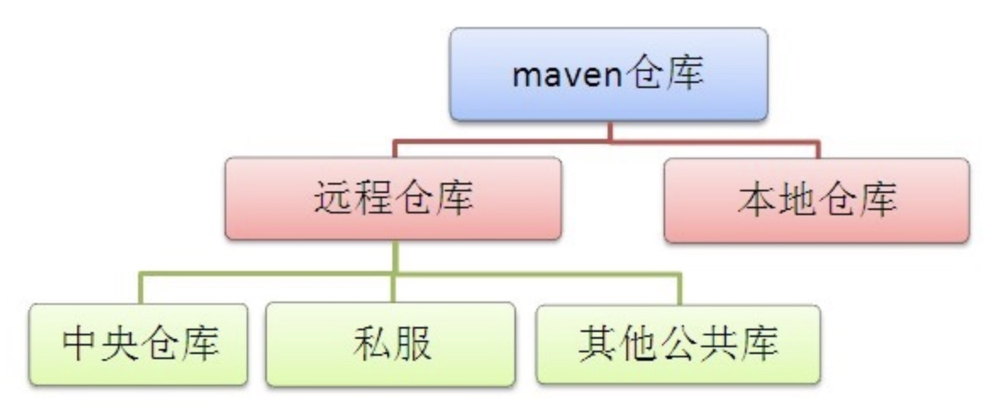

本地仓库就是一个指定的本机目录，其默认位置是 `~/.m2/repository`，可以通过 `~/.m2/settings.xml` 进行配置：
``` xml
<settings>  
  <localRepository>/repository/maven/repos</localRepository>  
</settings>   
```

远程仓库也是通过 `~/.m2/settings.xml` 进行配置，存在一下几种类型：
- 中央仓库：由 Maven 维护的官方仓库，包含所有第三方库所上传的包和对应信息，在配置文件中隐式表现一个 id 名为 central 的仓库，使用着默认的官方地址：

``` xml
<!--官方隐式配置-->
<profile>
  <id>repository-profile</id>
  <repositories>
    <!--项目仓库-->
    <repository>
      <id>central</id>
      <name>Central Repository</name>
      <layout>default</layout>
      <url>https://repo1.maven.apache.org/maven2</url>
      <snapshots><enabled>true</enabled></snapshots>
      <releases><enabled>true</enabled></releases>
    </repository>
  </repositories>
  <!--插件仓库-->
  <pluginRepositories>    
    <pluginRepository>    
        <id>central</id>    
        <name>Maven plugin</name>    
        <url>https://repo1.maven.org/maven2</url>    
        <layout>default</layout>    
        <snapshots>    
            <enabled>true</enabled>    
        </snapshots>    
        <releases>    
            <enabled>false</enabled>    
        </releases>    
    </pluginRepository>    
  </pluginRepositories>
</profile>
```

- 镜像仓库：是对指定仓库的镜像，由于中央仓库距离远速度慢，可以通过为其配置镜像仓库来改善这个问题，比如使用阿里云镜像：

``` xml
<mirror>
  <id>central-repository-mirror</id>
  <name>Central Repository Mirror</name>
  <mirrorOf>central</mirrorOf>
  <url>http://maven.aliyun.com/nexus/content/groups/public</url>
</mirror>
```

- 私服仓库：是指定的内部服务器，为内部开发人员提供统一的包管理，使用方式和中央仓库没有任何区别，配置如下：

``` xml
<!--私服密码验证-->
<servers>
    <server>
        <id>nexus</id>
        <username>deployment</username>
        <password>deployment123</password>
    </server>
</servers>

<!--私服配置-->
<profiles>
    <profile>
      <id>profile-nexus</id>
      <!--项目仓库-->
      <repositories>
        <repository>
          <id>nexus</id>
          <url>http://localhost:8081/nexus/content/groups/public/</url>
          <snapshots><enabled>true</enabled></snapshots>
          <releases><enabled>true</enabled></releases>
        </repository>
      </repositories>
      <!--插件仓库-->
      <pluginRepositories>
        <pluginRepository>
          <id>nexus</id>
          <url>http://localhost:8081/nexus/content/groups/public/</url>
          <snapshots><enabled>true</enabled></snapshots>
          <releases><enabled>true</enabled></releases>
        </pluginRepository>
      </pluginRepositories>
    </profile>
</profiles>

<!--激活私服配置-->
<activeProfiles>  
    <activeProfile>profile-nexus</activeProfile>
</activeProfiles> 
```
> 插件也相当于一个 Maven 项目，其查找方式和依赖包一致，除了它使用的是插件仓库，而不是项目仓库

仓库中的依赖包分为 **正式版本（releases）** 和 **快照版本（snapshots）**，版本带 `-SNAPSHOT` 后缀的版本为快照版本，比如 `3.1.0-SNAPSHOT`，主要用于开发模式下，即使被依赖的项目频繁地发布版本，也能被其他项目实时地使用到

因为快照版本的依赖包存在其获取机制不同，正式版本构建时会先在本次仓库中查找是否存在，若没有的话才去远程仓库中去拉取。但快照版本则可通过 `updatePolicy` 配置项设置一定的策略，使得无论本地仓库是否存在，都去远程仓库中去拉取的

### 模块管理
对于复杂的 Maven 项目，Maven 可以将它拆分为多个模块并进行有效地管理，每个模块都看作一个独立的 Maven 项目，拥有独立的 `pom.xml` 文件：

```
mutiple-project
|── pom.xml
├── parent
│   └── pom.xml
├── module-a
│   ├── pom.xml
│   └── src
├── module-b
│   ├── pom.xml
│   └── src
└── module-c
    ├── pom.xml
    └── src
```
多个模块的 `pom.xml` 存在许多共同部分，可以创建一个 parent 模块，并把这些共同部分提取到 parent 模块的 `pom.xml`，以减少重复的配置

各个 `pom.xml` 文件内容如下：
- 项目的 `pom.xml`

``` xml
<project...>
    <modelVersion>4.0.0</modelVersion>
    <groupId>com.my.java</groupId>
    <artifactId>build</artifactId>
    <version>1.0</version>
    <packaging>pom</packaging>
    <name>build</name>

    <modules>
        <module>parent</module>
        <module>module-a</module>
        <module>module-b</module>
        <module>module-c</module>
    </modules>
</project>
```
- parent 的 `pom.xml`

``` xml
<project...>
    <groupId>com.my.java</groupId>
    <artifactId>parent</artifactId>
    <version>1.0</version>
    <packaging>pom</packaging>
    <name>parent</name>

    <properties>
    <!--公共属性-->
    </properties>

    <dependencies>
    <!--公共依赖-->
    </dependencies>
</project>
```
- module-a 的 `pom.xml`

``` xml
<project...>
     <parent>
        <groupId>com.my.java</groupId>
        <artifactId>parent</artifactId>
        <version>1.0</version>
        <relativePath>../parent/pom.xml</relativePath>
    </parent>
    
    <artifactId>module-a</artifactId>
    <packaging>jar</packaging>  
    <name>module-a</name>

    <properties>
    <!--自有属性-->
    </properties>

    <dependencies>
    <!--自有依赖-->
    </dependencies>
</project>
```

## OSGI
OSGI 起初是由 OSGi 联盟发起的 **开放服务网关倡议（Open Service Gateway Initiative）**，在演进之后其最新定义为 **Java 平台动态模块化规范（The Dynamic Module System for Java）**，[官方网站](https://docs.osgi.org/)，[中文社区](http://osgi.com.cn/)

**模块化（Modularity）** 指将一个大系统从逻辑上分解为相互协作的部分，Java 传统的模块化是基于 Jar 包来实现的

Jar 包传统模块化的局限：
- **低层级的可见性控制**，访问修饰符只是工作于面向对象层，而不是逻辑模块层
- **易混淆的 classPath 概念**，classPath 隐藏了 Jar 包的版本、依赖和一致性等，存在不确定性
- **部署和管理支持上不足**，所有模块只能作为一个整体服务来被部署和管理

OSGI 动态模块化的优势：
- **严格且高层级的可见性控制**，在逻辑模块层定义了所包含包的可见性
- **动态部署和管理**，安装、卸载、启动、停止不同功能的模块，不需要重启整个服务
- **基于接口编程**，对于模块的访问调用完全隐藏其具体实现，代码扩展性好

OSGI 使得系统内的各个模块更好的达到高内聚、松耦合、可复用、热插拔

### 规范内容
OSGi 规范由一系列子规范构成，这些子规范主要可分为两大部分，一部用于定义核心的 **OSGi 框架（OSGi Framework）**，一部分用于定义 **OSGi 标准服务**

OSGi 框架表示可运行 OSGi 系统的最小集合，可用以下分层模型表示：

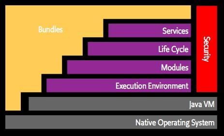
- **执行环境（Execution Environment）**：OSGi 为了更好地保证不同硬、软件环境的兼容性，在建立其他规范之前需定义好执行环境

- **安全层（Security Layer）**：描述了基于 Java 2 安全架构实现的代码验证、JAR 文件数字签名、数字证书服务，贯穿了框架的其他各个层级

- **模块层（Module Layer）**：从静态角度来描述 OSGi 模块，包括其元数据信息、执行环境、模块约束和解析过程、类加载顺序等内容，是框架中最基础的层级

- **生命周期层（Life Cycle Layer）**：从动态角度来描述 OSGi 模块，包括其从安装到被解析、启动、停止、更新、卸载的过程，以及在这些过程中的事件监听和上下文支持环境

- **服务层（Service Layer）**：描述 OSGi 服务的定义、注册、导出、查找、监听和使用，这层是所有 OSGi 标准服务的基础

> 原生操作系统（Native Operating System）和 Java 虚拟机（Java VM）是运行 OSGi 系统的基础设施

OSGI 框架中的主要层级，从底层到高层为 **模块层 -> 生命周期层 -> 服务层**，各层通过暴露的 API 实现层间交互，完成 OSGI 系统的聚合，其作用关系如下：

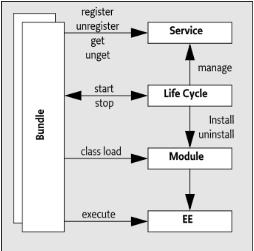

而各层的核心内容如下：

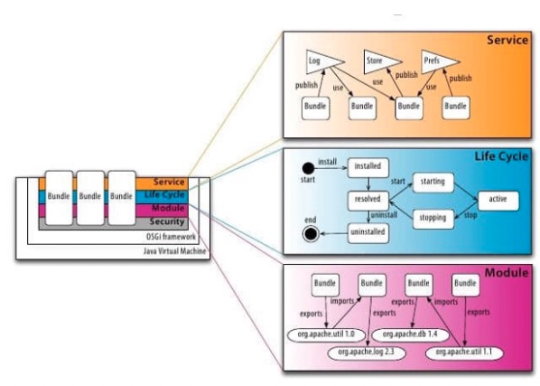

OSGi 标准服务旨在以 OSGi 框架为基础，在软件开发的各种场景中（如配置管理、设备访问、处理网络请求等），建立一套标准服务和编程接口

### 模块层
模块层关注于模块的代码打包和共享，定义了 OSGI 中的 **模块（Bundle）**：
- 在逻辑上，Bundle 是 OSGI 系统中提供独立功能的部分，是开发和部署的基本单元
- 在物理上，Bundle 也是个 Jar 包，但在包含类文件和资源文件之外，还包含用于描述 Bundle 的元数据

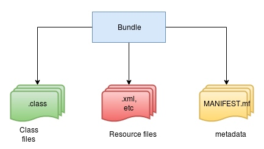

Bundle 的元数据保存在 `META-NF/MANIFEST.mf` 文件中，其中主要的信息包含：
- Bundle-SymbolicName：唯一标识名
- Bundle-Version：版本
- Export-Package：对外暴露的本身 Package
- Import-Package：需要引用的外部 Package
- Require-Bundle：需要引用的其他 Bundle
- Bundle-ClassPath：内部类在 Bundle 中的路径
- Bundle-Activator：所使用的激活器

> 编译环境配置 `<dependencies>` 是为了防止编译报错，而配置 Import-Package/Require-Bundle 才是真正为 Bundle 引入依赖

Bundle 不同依赖的引入方式：
- `java.*` Package：由 JDK 提供，代码中直接导入使用
- `org.osgi.*` Package：由 OSGI 规范提供的，包含在 OSGI 框架实现中，编译和测试时存在依赖，依赖类型为 `provided`
- 第三方 Jar 包：
    - 多 Bundle 共享：使用 wrap 包装为 Bundle 后放入到容器指定目录下或在容器中安装，`bundles:install wrap:mvn:commons-lang/commons-lang/2.4`
    - 单 Bundle 依赖：可以通过 maven-bundle-plugin 插件的 `<Embed-Dependency>` 将 Jar 包添加到其 Classpath
- 自行开发的 Bundle：被依赖 Bundle 定义 Export-Package 后，在依赖方 Import-Package 即可

通过 Maven 配合 org.apache.felix 插件可以对 **Bundle 打包** 并输出一个 Bundle 包，其 POM 文件配置实例如下：
``` xml
<project xmlns="http://maven.apache.org/POM/4.0.0"
         xmlns:xsi="http://www.w3.org/2001/XMLSchema-instance"
         xsi:schemaLocation="http://maven.apache.org/POM/4.0.0 http://maven.apache.org/xsd/maven-4.0.0.xsd">
    <modelVersion>4.0.0</modelVersion>
    <groupId>com.my</groupId>
    <artifactId>bundle</artifactId>
    <packaging>bundle</packaging>
    <version>3.1.1</version>

    <dependencies>
        <dependency>
            <groupId>com.my.nrc</groupId>
            <artifactId>north-impl</artifactId>
        </dependency>
    </dependencies>

    <build>
        <plugins>
            <plugin>
                <groupId>org.apache.felix</groupId>
                <artifactId>maven-bundle-plugin</artifactId>
                <extensions>true</extensions>
                <configuration>
                    <instructions>
                        <Bundle-Name>com.my.bundle</Bundle-Name>
                        <Import-Package>*</Import-Package>
                        <Export-Package>com.my.bundle.*</Export-Package>
                    </instructions>
                </configuration>
            </plugin>
        </plugins>
    </build>
</project>
```

**Bundle 激活器（Bundle Activator）** 用于处理 Bundle 的 `start` 和 `stop` 事件，当Bundle 启动或停止时会回调 `start` 和 `stop` 方法

**Bundle 上下文** 会在 OSGI 框架回调 Bundle 激活器方式时传入，用于Bundle 和底层框架的交互，其方法主要分为两部分：
- Bundle 部署与生命周期管理相关
- 使用服务层进行 Bundle 间的交互

Bundle 激活器的实现实例：
``` java
package com.my;

/**
* 根据需求选择，该类可有可无
*/
public class Activator implements BundleActivator{
    /**
     * Bundle启动时执行的方法
     * 用于对资源的初始化
     * @param bundleContext
     */
    public void start(BundleContext bundleContext) {
        logger.info("Bundle start");
    }

    /**
     * Bundle停止时执行的方法
     * 用于释放资源
     * @param bundleContext
     */
    public void stop(BundleContext bundleContext) {
        logger.info("Bundle stop");
    }
}
```

Bundle 类加载机制为了满足模块化间的隔离和动态插拔，其类加载模型不再是 JVM 中的父委派模型中的树状结构，而是更复杂的网状结构：

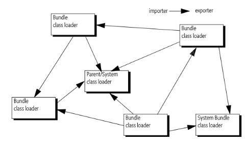

Bundle 中用到的类加载器类型：
- **父加载器**：由 JVM 提供，最典型的场景包括启动类加载器、扩展类加载器和应用程序类加载器，用于加载以`java.*` 类以及在父委派清单中声明的类
- **Bundle 类加载器**：每个 Bundle 都有独立的类加载器，用于加载本 Bundle 中的类和资源。当一个Bundle 去请求加载另一个 Bundle 导出的 Package 中的类时，要把加载请求委派给导出类的 Bundle 的类加载器处理
- **其他加载器**：譬如线程上下文类加载器、框架类加载器等

Bundle 的类加载顺序如图：

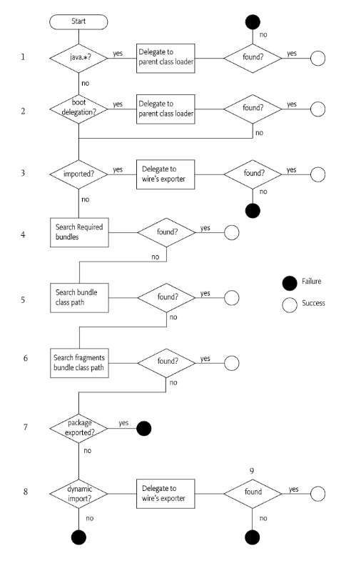

### 生命周期层
生命周期层关注于运行时的模块管理和对底层 OSGi 框架的访问，OSGI 框架会为每个已安装的 Bundle 创建和关联一个 Bundle 对象，并分配一个标识 ID，用于管理其生命周期

Bundle 在生命周期的过程中存在多种状态，其状态转换图如下：

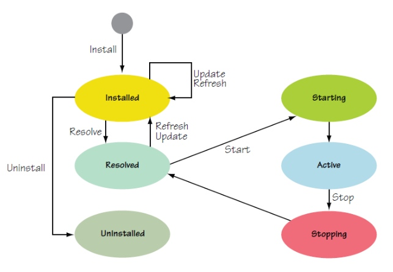
- **未安装（Uninstalled)**：状态值为 1，此时 Bundle 中的资源不可用
- **已安装（Installed)**：状态值为 2，此时 Bundle 已经通过了OSGI 框架校验并分配了 Bundle ID，本地资源已加载，但尚未对其依赖关系进行解析处理
- **已解析（Resolved)**：状态值为 4。此时 Bundle 已经完成了依赖关系解析并已经找到所有依赖包，而且自身导出的 Package 已可以被其它 Bundle 导入使用。此状态的 Bundle 要么是正准备运行，要么是被停止了
- **启动中（Starting)**：状态值为 8。此时 Bundle 激活器的 `start` 方法已被调用但尚未返回。若方法成功返回，Bundle 状态转换为 Active 状态，否则回退到 Resolved 状态
- **停止中（STOPPING)**：状态值为 16，此时 Bundle 激活器的 `stop` 方法已被调用但尚未返回。无论最后方法成功返回还是抛出异常，Bundle 状态都会将转换为 Resolved。
- **已激活（Active）**：状态值为 32，此时若 Bundle 没有额外的操作，则一直维持该状态

### 服务层
服务层关注于模块间的交互和通信，为模块提供服务实现和管理模型，可类比为在 JVM 内的面向服务架构（SOA）

OSGI 框架提供了一个中心化的注册表，该注册表遵从 `publish-find-bind` 模型：

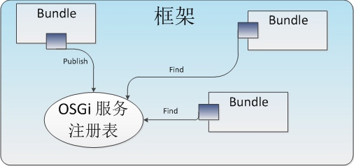

一个服务，其对外功能通过 Java 接口来定义，而具体实现则是注册在注册表中的 Java 对象，该对象类型实现了服务对应的 Java 接口。Bundle 可以注册、查找服务，或当注册状态发生变化时接收并处理事件

服务注册的方式有两种，一是传统地通过在 Bundle 激活器中使用 Bundle 上下文完成，其实现如下：

``` Java
package com.my; 
  
public class Activator implements BundleActivator{

    public void start(BundleContext bundleContext) { 
        // 服务的属性，可用于后续服务查询的过滤 
        Dictionary<String,String> dictionary = new Properties(); 
        dictionary.setProperty("name","duan2ping"); 
        dictionary.setProperty("type","test"); 
        
        // 注册服务（服务名称，服务实现，服务属性） 
        /* ServiceRegistration 对象可用于对服务属性的更新以及服务的注销，
        它和发布服务的 Bundle 的生命周期相互依存 */ 
        ServiceRegistration registration = bundleContext.registerService(UserService.class.getName(),
            new UserServiceImpl(),dictionary); 
    } 
        
    public void stop(BundleContext bundleContext) { 
            // 获取服务引用，真实服务的间接引用（实现对真实服务和调用者的解耦，避免直接依赖） 
            /* 第二个参数则是通过服务的属性对服务进行过滤，具体规则可参考
            OSGI 官方文档:https://osgi.org/specification/osgi.core/7.0.0/framework.service.html#framework.service.servicereferences */ 
            ServiceReference ref = context.getServiceReference(UserService.class.getName(),
                "(&(name=test)(objectClass=com.duan2ping.UserServiceImpl))"); 
            // 根据服务引用获取到真实的服务 
            UserService service = (UserService) context.getService(ref); 
    } 
}
```

传统服务注册方式的缺点：
- **产生较多的样板式代码**：每个需要注册服务的 Bundle 都依靠这些代码来完成，且伴随着其他 Bundle 的安装和卸载，每次使用服务前都需要重新获取服务引用

- **影响启动时间**：此方式注册服务时，需要实例化所有要发布的服务对象，因为 Bundle 激活器的 `start` 方法是同步调用的，因此会影响到整个应用的启动时间

- **加大内存的占用**：在激活器中注册服务时，我们需要实例化所有的服务对象，但是这些服务在应用运行期间，并不一定会用到，这在无形中加大了内存的占用

- **API 依赖引起的平台侵入性**：使用传统方式注册和使用服务会用到大量的 OSGI 框架 API，从而产生与OSGi 平台的耦合，如果要将代码复用到非 OSGi 场景之中，需要较多的重构工作

因此还有一种是通过 **Blueprint** 这个 OSGI 标准服务来完成

### Blueprint
根据 OSGI 标准服务规范，Blueprint 是一个具有 **DI（Dependancy Injection）依赖注入** 功能的 **IOC（Inversion of controller）控制反转** 容器，[规范文档](https://docs.osgi.org/specification/osgi.cmpn/7.0.0/service.blueprint.html)，服务实现 [Apache Aries Blueprint](https://aries.apache.org/documentation/modules/blueprint.html)

IOC 是一种编程思想，在传统的类操作方式中，当开发者使用到 A 对象时，才对其进行创建，而 A 对象如果依赖了 B 对象，需再对 B 对象进行创建，如下所示：


这也一来虽然很简单直接，但类之间的协调关系是由程序内部代码来控制的，没有统一的管理和配置

而如果使用到 IOC 编程思想后，把类看作一个包含大量 get/set 成员方法的 Bean，此时的类操作方式则是通过一个 IOC 容器来根据类之间的协调关系事先创建对象，当开发者使用到 A 对象时，直接通过 IOC 容器获取即可，不需要关注 A 对象的相关依赖，如下所示：

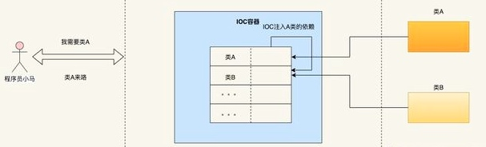

IOC 编程思想的常见的实现方式有：
- **依赖注入（DI，Dependancy Injection）**：使用者被动的接收依赖对象，比如在 A 对象的创建过程中自动创建了所依赖的 B 对象，并将其注入到 A 对象的属性中
- **依赖查找（DL，Dependency Lookup）**：使用者通过 IOC 容器主动索取相应类型的依赖对象，获得依赖对象的时间也可以在使用者的代码中自由控制

JAVA 官方还提供了通过注解完成依赖注入的规范，即 **上下文依赖注入（CDI，Contexts and Dependency Injection）**

依赖注入不仅可以用于服务注册，也可以用于类的初始化管理

Blueprint 配置实例：
- 文件配置：默认在 `resource/OSGI-INF/blueprint` 目录中，建立相关的 xml 文件，xml 文件的命名不需要固，所有在此目录的 xml 文件均会被加载。

``` xml
<blueprint xmlns="http://www.osgi.org/xmlns/blueprint/v1.0.0"> 
    <!-- bundle 内部使用，跟Spring 一样 bean 带有很多属性 
    scope：创建方式 
    - prototype：原型模式 
    - singleton：单例模式 
    factory-method：指定创建的构造函数 
    init-method：创建实例的初始化方法，实例创建时执行 
    destroy-method：实例销毁方法，实例销毁时执行 --> 
    <bean id="bookServiceImpl" class="com.duan2ping.service.impl.BookServiceImpl" scope="singleton"/> 
    
    <!-- 对外提供服务，暴露给其他bundle 使用，需要指定使用的 bean 和接口 --> 
    <service id="bookServcie" interface="com.duan2ping.api.BookServcie" ref="bookServiceImpl"> 
        <!-- 添加服务属性 --> 
        <service-properties> 
            <entry key="name" value="test"/> 
        </service-properties> 
    </service>
    
    <!-- 引用服务，调用其他bundle暴露的服务 --> 
    <reference id="systemService" interface="com.duan2ping.api.SystemService"/> 
</blueprint>
```

- 注解配置：代码中使用相关 CDI 注解，再在 POM 文件中配置用于注解扫描的插件

  常用注解：
  - Singleton：将该类加入Blueprint 容器管理并以单例方式创建
  - OsgiServiceProvider：将该类作为一个 OSGI 服务发布，这时必须添加 Singleton 注解，classes 为服务需实现的接口
  - Properties：配置服务的扩展属性。
等同于
  - OsgiService：引用 OSGI 服务，必须配合 Inject 注解使用，查找方式取决于 Inject 注解
  - Inject：从 Blueprint 容器中按类型查找依赖并注入。可通过 @Named 注解来按名字查找

注解使用代码：
``` java
package com.my; 

@OsgiServiceProvider(classes={BookService.class}) 
@Properties(@Property(name = "name",value = "test")) 
@Singleton 
public class BookServiceImpl implements BookService{

    @Inject @Named("bookDao") 
    private BookDao bookDao; 
    
    @Inject @OsgiService 
    private SystemService systemService; 
}
```

注解插件配置：

``` xml
<!-- 扫描osgi相关注解生成blueprint -->
<plugin>
 <groupId>org.apache.aries.blueprint</groupId>
 <artifactId>blueprint-maven-plugin</artifactId>
 <version>1.3.0</version>
 <executions>
     <execution>
         <goals>
             <goal>blueprint-generate</goal>
         </goals>
         <phase>process-classes</phase>
     </execution>
 </executions>
 <configuration>
     <!-- 指定blueprint扫描注解的包路径 -->
     <scanPaths>
         <scanPath>com.duan2ping</scanPath>
     </scanPaths>
 </configuration>
</plugin>
```

### Karaf
Karaf 是基于 OSGI 实现的应用运行环境，提供了一个轻量级的 OSGI 容器，[官方文档](https://karaf.apache.org/documentation.html)

OSGI 容器建立在 OSGI 框架实现的基础上，Kafka 使用的 OSGI 框架是 [Apache Felix](https://felix.apache.org/)，扩展了实现了标准服务比如 Blueprint 等，附带了高级功能比如热部署、动态配置、日志管理、安全管理、可编程扩展控制台、SSH 远程访问、Feature 部署、Feature 仓库等

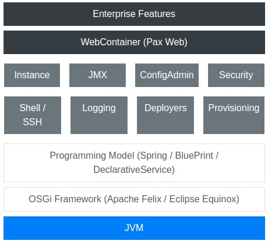

OSGi 框架中部署的基本单元是 Bundle，而 Karfa 将一组用于提供特定功能，且满足依赖关系的 Bundle 集合，加上相关的配置信息，组成为一个 **特征（Feature）**，并以 Feature 为基本单元来简化部署

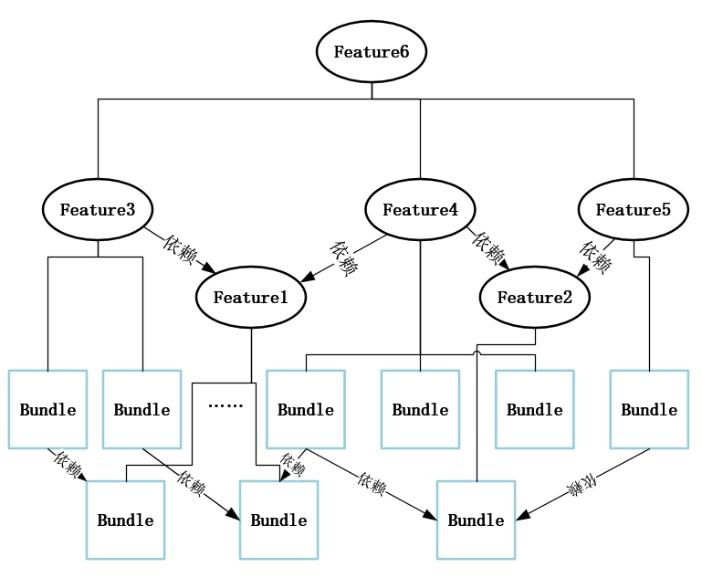


通过 Maven 配合 features-maven-plugin 插件可以对
**Feature 打包** 并输出一个描述 Feature 信息的 `.xml` 文件。用于打包的 POM 文件实例：
``` xml
<project xmlns="http://maven.apache.org/POM/4.0.0"
         xmlns:xsi="http://www.w3.org/2001/XMLSchema-instance"
         xsi:schemaLocation="http://maven.apache.org/POM/4.0.0 http://maven.apache.org/xsd/maven-4.0.0.xsd">
    <modelVersion>4.0.0</modelVersion>

    <groupId>com.my</groupId>
    <artifactId>xxx-feature</artifactId>
    <version>3.1.1</version>
    <packaging>feature</packaging>
    <name>xxx:feature</name>
    
    <dependencies>
        <dependency>
          <groupId>com.my</groupId>
          <artifactId>nrc-all</artifactId>
          <version>3.0.0</version>
          <type>xml</type>
          <classifier>features</classifier>
        </dependency>
    </dependencies>

    <build>  
        <pligins>
            <plugin>
            <groupId>org.apache.karaf.tooling</groupId>
                <artifactId>features-maven-plugin</artifactId>
                <version>2.3.2</version>
                <executions>
                    <execution>
                        <id>add-features-to-repo</id>
                        <phase>generate-resources</phase>
                        <goals>
                            <goal>add-features-to-repo</goal>
                        </goals>
                        <configuration>
                            <descriptors>
                                <descriptor>mvn:org.apache.activemq/activemq-karaf/5.8.0/xml/features</descriptor>
                            </descriptors>
                            <features>
                                <feature>war</feature>
                                <feature>webconsole</feature>
                                <feature>drools-common</feature>
                            </features>
                            <repository>${project.build.directory}/features-repo</repository>
                        </configuration>
                    </execution>
                </executions>
            </plugin>
        </plugins>
    </build>    
</project>  
```

该文件中主要的信息包含其名称、版本号、描述信息、配置信息、仓库信息、所依赖的 Bundle、所依赖的 Feature 等，如下：
``` xml
<?xml version="1.0" encoding="UTF-8" standalone="yes"?>
<features xmlns="http://karaf.apache.org/xmlns/features/v1.4.0" name="ffad4ebb-16a1-4d24-aafb-099e66a7adc5">
    <repository>mvn:org.apache.karaf.features/framework/4.1.7/xml/features</repository>
    <!-->...定义用于下载 Bundle/Feature 的 Maven 仓库</-->
    <feature name="feature-xxx" version="0.0.0">
                <feature prerequisite="false" dependency="false">framework</feature>
                <!-->...更多依赖的 Feature</-->
                <bundle>mvn:org.apache.aries.quiesce/org.apache.aries.quiesce.api/1.0.0</bundle>
                <!--> ...更多依赖的 Bundle</-->
    </feature>
</features>
```
> Karfa 允许 Feature 仓库使用 `mvn:` 表示，这回通过访问 Maven 仓库来获取所依赖的 Feature 和 Bundle

Feature 完成打包后，可以在 Karaf 控制台中可以通过 `feature:*` 相关命令对 Feature 进行安装、卸载等操作

通过 Maven 配合 karaf-maven-plugin 插件和其它打包相关插件，可以对 **Karaf 项目打包** 并输出一个压缩包，同时可设定相关 Karaf 配置，比如自动安装启动的 Feature 项

Karaf 压缩包是可用于发布的，其内容是一个完整的 Kafka 工作目录，通过其中的 `bin/karfa` 命令，可使用打包预设的相关配置来启动 Karfa 容器

Karaf 打包的 POM 文件示例：
``` xml
<project xmlns="http://maven.apache.org/POM/4.0.0" xmlns:xsi="http://www.w3.org/2001/XMLSchema-instance" xsi:schemaLocation="http://maven.apache.org/POM/4.0.0 http://maven.apache.org/xsd/maven-4.0.0.xsd">
    <modelVersion>4.0.0</modelVersion>
    <parent>
        <artifactId>karaf</artifactId>
        <groupId>ossu.sandbox.karaf</groupId>
        <version>2.0.0-SNAPSHOT</version>
    </parent>
    
    <groupId>ossu.sandbox.karaf</groupId>
    <artifactId>karaf.launcher</artifactId>
    <packaging>pom</packaging>
    <name>Ossu Sandbox :: Karaf :: Launcher</name>
    <description>Run karaf instance or debug karaf instance</description>
  
    <dependencies>
        <dependency>
            <groupId>org.apache.karaf.features</groupId>
            <artifactId>framework</artifactId>
            <type>kar</type>
        </dependency>
        <dependency>
            <!-- scope is runtime so the feature repo is listed in the features service config file, 
            and features may be installed using the karaf-maven-plugin configuration -->
            <groupId>org.apache.karaf.features</groupId>
            <artifactId>standard</artifactId>
            <classifier>features</classifier>
            <type>xml</type>
            <scope>runtime</scope>
        </dependency>
    </dependencies>
    
    <build>
        <plugins>
            <plugin>
                <groupId>org.apache.karaf.tooling</groupId>
                <artifactId>karaf-maven-plugin</artifactId>
                <!-- Revert to ${karaf.plugin.version} once the POM deployment issue is fixed -->
                <version>4.1.6</version>
                <executions>
                    <execution>
                        <id>process-resources</id>
                        <phase>process-resources</phase>
                        <goals>
                            <goal>assembly</goal>
                        </goals>
                    </execution>
                    <execution>
                        <id>package</id>
                        <goals>
                            <goal>archive</goal>
                        </goals>
                    </execution>
                </executions>
                <configuration>
                    <installedFeatures>
                        <feature>wrapper</feature>
                    </installedFeatures>
                    <bootFeatures>
                        <feature>standard</feature>
                        <!-- Features always assumed to be present. Keep in sync with feature parent exclusions. -->
                        <feature>ssh</feature>
                        <!-- Local feature if any -->
                        <feature>${karaf.localFeature}</feature>
                    </bootFeatures>
                    <javase>1.8</javase>
                    <archiveTarGz>${karaf.archiveTarGz}</archiveTarGz>
                    <archiveZip>${karaf.archiveZip}</archiveZip>
                </configuration>
            </plugin>                                  
        </plugins>
    </build>
</project>
```
> 通过 exec-maven-plugin 插件可以设置 Karfa 的启动参数等配置

通过 `<bootFeatures>` 设置自动安装启动的 Feature 项，会体现在 `${karaf.home}/etc/org.apache.karaf.features.cfg` 文件中：
``` cfg
# 定义 Feature 的 xml 文件
featuresRepositories = file:${karaf.home}/etc/featuresRepositories1.xml

# 需要自动部署启动的 Feature
featuresBoot = feature-xxx, ...
```

常用 Karaf 客户端命令：
``` bash
# 列出 bundle 信息
bundle:list

# 诊断 bundle 启动情况
bundle:diag
```

## Spring Boot
**Spring** 是一套高效的 Java 开发框架，而 Spring Boot 则进一步简化了 Spring 应用的创建及部署，更快捷地构建出企业级应用。它提供了丰富的Spring 模块化支持，包括 IoC 容器、AOP 支持、事务支持、MVC 开发等，并且支持自动化配置功能，非常简单高效。[Spring 官方网站](https://spring.io/why-spring)、[Spring Boot  官方文档](https://spring.io/projects/spring-boot)、[Spring Boot 中文文档](https://springdoc.cn/spring-boot/index.html)