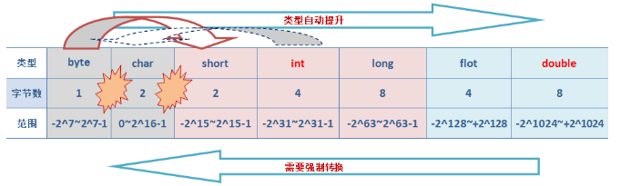
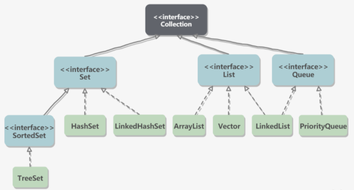
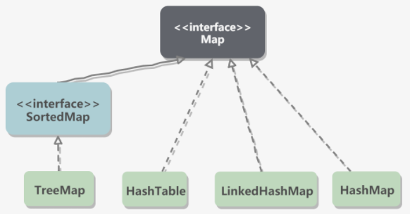

#【Java】数据类型

* [【Java】数据类型](#java数据类型)
  * [简介](#简介)
  * [字面值](#字面值)
  * [基本类型](#基本类型)
	  * [分类](#分类)
	  * [转换](#转换)
	  * [运算](#运算)
  * [引用类型](#引用类型)
     * [包装类型](#包装类型)
	  * [字符串](#字符串)
	  * [数组](#数组)
	  * [枚举](#枚举)
  * [容器](#容器)
	  * [合集](#合集)
	  * [映射](#映射)

## 简介
Java 内存管理系统会根据变量的数据类型，来为其分配不同大小的内存空间，用来储存对应类型的数据

数据类型可分为以下两大类：
- **基本类型**，变量的内存空间中直接保存了值，即实际值保存在变量所在的内存分区，赋值操作中传递了值，还是值传递
- **引用类型**，变量的内存空间中保存了对象的引用地址，即实际值就保存在了堆区，赋值操作中传递了引用地址，相当于引用传递

> 在 Java 中的赋值操作本质上都是值传递，这里的值指变量的内存空间中保存的内容

## 字面值
Java 字面值（也称为直接量，Literal ）表示一个 **区分数据类型的固定值（Fixed Value）**，直接用于赋值或传参。字面值类型包含以下几种：

- **整型字面值**
    - int 类型，如 `10`
    - long 类型，如 `100000L`
    - 以上例子是用十进制表示的，还可以用八进制表示，如 `0123`、用十六进制表示，如 `0X1ff`
    - 若字面值超过了对应数据类型的限制，则会触发编译错误

- **浮点型字面值**
    - float 类型，如 `11.4F`
    - double 类型，如 `1.21`、`10.0D`

- **布尔型字面值**
    - boolean 类型，如 `false`、`true`

- **字符字面值**
    - char 类型，如 `'H'`
    - 可以用转义符来表示无法直接表示的字符，如 `\n`
    - 可以用 Unicode 编码表示，如 `\u0ff2`

- **字符串字面值**
    - String 类型，如 `"hello"`
    - 也可以使用转义符和 Unicode 编码表示

- **特殊字面值** 
    - 如 `null`

> 从 JDK7 开始，可以在整型字面值和浮点字面值的两个数字之间，插入一个或者多个下划线，用于分隔数字。如 `int x = 123_456_789`，在编译时下划线会自动去掉

## 基本类型
Java 提供的基本类型有 **四大类八小种**：4 个整数型、2 个浮点型，1 个字符型，还有 1 个布尔型

### 分类
**byte**

- 占用 8 bit 的空间大小，是有符号的、是以二进制补码表示的整数
- 最小值是 `-128(-2^7)`；最大值是 `127(2^7-1)`；默认值是 `0`
- 主要用于在大型数组中代替整数，以节约内存空间，因为其占用空间只有 int 类型的 1/4
- 例子：`byte a = 100;`
  

**short**

- 占用 16 bit 的空间大小，是有符号的、以二进制补码表示的整数
- 最小值是 `-32768(-2^15)`；最大值是 `32767(2^15-1)`；默认值是 `0`
- 也可以像 byte 类型那样节约内存空间，其占用空间只有 int 类型的 1/2
- 例子：`short s = 1000;`
  

**int**

- 占用 32 bit 的空间大小，是有符号的、以二进制补码表示的整数
- 最小值是 `-2,147,483,648(-2^31)`；最大值是 `2,147,483,647(2^31 - 1)`；默认值是 `0`
- 是整数型字面值的默认类型，用于表示一般情况下的整数
- 例子：`int a = 100000;`

**long**

- 占用 64 bit 的空间大小，是有符号的、以二进制补码表示的整数
- 最小值是 `-9,223,372,036,854,775,808(-2^63)`；最大值是 `9,223,372,036,854,775,807(2^63 -1)`；默认值是 `0L`
- 主要用于需要比较大整数的系统上
- 例子：`long a = 100000L;`，`L` 理论上不分大小写，但若写成 `l` 容易与数字 `1` 混淆

**float**

- 占用 32 bit 的空间大小，是单精度、符合 IEEE 754 标准的浮点数
- 有效位数 7 位
- 默认值是 `0.0f`
- 用于大型浮点型数组中，可节省内存空间，不能用来表示精确的值，比如货币
- 例子：`float f1 = 234.5f;`
- 货币可以使用精度更高的引用类型 `BigDecimal`

> 浮点数在计算机中是区分了整数和小数部分，小数部分的第 n 位表示 $2^{-n}$，因此表示的是小数的近似值，近似程度则取决于其精度

**double**

- 占用 64 bit 的空间大小，是双精度、符合 IEEE 754 标准的浮点数
- 有效位数 15 位
- 默认值是 `0.0d`
- 是浮点型字面值的默认类型，用于表示一般情况下的浮点数，同样不能用来表示精确的值，比如货币
- 例子：`double d1 = 123.4;` 或 `double d2 = 12.34d;`

**boolean**

- 占用 1 bit 的空间大小，只有 `true` 和 `false` 两个取值
- 默认值是 `false`
- 例子：`boolean one = true;`
- 虽然占用的空间大小理论上是1 bit ，但具体大小官方没有明确规定，依赖于 JVM 厂商考虑计算机高效存储因素后的具体实现
- 通常情况下，JVM 在编译时期将 boolean 类型转换为 int 类型，占用 4 byte；将 boolean 数组转换为 byte 数组，占用 1 byte 

**char**

- 占用 64 bit 的空间大小，是一个单一的 Unicode 字符
- 最小值是 `\u0000`（第 0 个字符，空格）；最大值是 `\uffff`（第 65535 个字符）
- 默认值是 `\u0000`
- 可以储存任何的字符
- 例子：`char letter1 = 'A';`

### 转换
除了 boolean 类型外，其他基本类型之间可以互相进行转换，类型级别表示为：



- 当低级别类型转换为高级别类型时，可以自动转换
- 当高级别类型转换为低级别类型时，需要强制转换，可能会损失精度，要慎重使用
- 使用 int 类型字面值为低级别类型变量赋值时，若值不超过其类型限制，可以自动转换
- byte 类型和 char 类型之间、char 类型和short 类型之间无法自动转换

``` java
// 低级别 -> 高级别，自动转换
long l = 10;
float f = 10;

// 高级别 -> 低级别，强制转换
int a = (int) 1.0;
char c = (char) 128;

// int 字面值 -> 低级别，自动转换
byte b = 1;
char c1 = 5;

// byte <-> char， char <-> short，强制转换
char c2 = (char)b;
short s = (short)c;
```

<br>
boolean 类型可以进行逻辑运算，其他基本类型可以进行数值相关的运算，对于多种类型之间的数值运算，会自动都转化为高级别类型再进行运算

> 数字在计算机中是以补码的形式进行存储的，这样可以将数字的加减运算都统一为加运算
> 
> 正数的补码和原码相同，负数的补码取反再加 1 等于原码的绝对

### 运算
没有返回的运算：

- **赋值运算符**

  等于 `=`、加等于 `+=`、减等于 `-=`、乘等于 `*=`、除等于 `/=`、取模等于 `%=`

  > 表示先使用变量值进行运算，再赋值回变量中，且强制保持类型不变。比如 `short a = 5; a *= 5;`，结果 `a` 为 `25`
  > 
  > `a *= 5` 不等于 `a = a * 5`，因为前者类型保持不变，后者的 `a * 5` 会被转化为 int 类型，因此 `a *= 5` 等于 ` a = (short)(a * 5)` 
返回数值的运算：

- **算术运算符**

  加 `+`、减 `-`、乘 `*`、除 `/`、取模 `%`、自增 `++`、自减 `--`

  > `v++` 和 `v++` 分别表示变量 `v` 在被访问前自增和被访问后自增

- **位运算符**

  按位与 `＆`、按位或 `|`、按位异或 `^`、按位取反 `~`、按位左移 `<<`、按位右移 `>>`、无符号按位右移 `>>>`

  > `<<` 和 `>>` 在移动过程中符号位不变，`>>>` 在移动过程中符号位会被置 0

返回布尔值的运算：

- **关系运算符**

  大于 `>`、大于等于 `>=`、小于 `<`、小于等于 `<=`、等于 `==`、不等于 `!=`

- **逻辑运算符**

  逻辑与 `&&`、逻辑或 `||`、逻辑非 `!`

  > 当运算结果已决定时，不会继续后续的运算，比如 `a && b`，若 `a` 表达式为 `false`，不会执行 `b` 表达式，这个现象称为短路现象

## 引用类型
### 包装类型
由于基本类型并不具有面向对象的能力，因此 Java 为每个基本类型都实现了对应的包装类型，使其具有了面向对象的能力，并且为其添加了属性和方法，丰富了基本类型的操作

| 原始类型 | 包装类型 |
| --- | --- |
| byte | `java.lang.Byte`  |
| short | `java.lang.Short` |
| int | `java.lang.Integer` |
| long | `java.lang.Long` |
| float | `java.lang.Float` |
| double | `java.lang.Double` |
| boolean | `java.lang.Boolean` |
| char | `java.lang.Character` |

基本类型和包装类型的主要区别：

- 声明方式：基本类型不使用 new 关键字，而包装类型需要使用 new 关键字来在堆中分配存储空间
- 存储方式：基本类型是直接将变量值存储在栈中，而包装类型是将对象放在堆中，然后通过内存地址来引用
- 初始值：基本类型有对应类型的初始值，包装类型初始值为 `null`

自动装箱和拆箱：

```java
// 自动装箱
// 隐式调用了 Integer x = Integer.valueOf(2)
Integer x = 2; 

// 自动拆箱
// 隐式调用了 Integer y = x.intValue()
int y = x;
```
> 能避免装箱和拆箱则尽量避免，因为会有少量的消耗，比如使用：`Boolean b = Boolean.True ` 或 `boolean b = true`

缓存池（也称为常量池）：

``` java
// 每次都会新建一个对象并返回
new Integer(123) 

// 会返回缓存池中的对象，多次调用会取得同一个对象
Integer.valueOf(123) 
```

`valueOf()` 方法会先判断缓存池中是否存在值相等的对象，如果在的话就直接返回缓存池中的对象，否则创建新的对象

不同基本类型的对应包装类型，其缓存池内容如下：

- byte 类型：所有值
- short 类型：`-128 ~127`
- int 类型：`-128 ~127`
- boolean 类型：` true` 和 `false`
- char 类型： `\u0000` ~`\u007F`

> 在 JDK 1.8 中，Integer 缓冲池上界是可以配置的，在启动 JVM 时通过 `-XX:AutoBoxCacheMax=<size>` 来指定这个缓冲池的大小，而选项在 JVM 初始化时会设定一个名为 `java.lang.IntegerCache.high` 的系统属性，然后 Integer 缓冲池初始化时就会读取该系统属性来决定上界

包装类型的常见方法：
``` java
// 解析指定类型的对象，返回基本类型的值
// 此处以解析 String 返回 int 为例
static int parseInt(String s)
```

### 字符串
字符串声明和拼接：

```java
// 声明并使用字面值进行初始化
String s = "aaa";

// 声明并创建对象进行初始化
// 实际会创建两个对象
// 编译时期会创建一个对象保存在 String 缓存池中，运行时会通过 new 再创建一个对象
String s = new String("aaa");

// 字符串之间使用 + 运算可以进行字符串拼接
"aaa" + "bbb"	// "aaabbb"
```

字符串（String）类型和其他包装类型声明时都使用了 `final` 修饰符，因此它们都不可被继承

在 Java 8 中，String 内部使用 char 数组存储字符
```java
public final class String implements java.io.Serializable,Comparable<String>, CharSequence {
    // 该 value 变量用于字符存储
    private final char value[];
}
```

在 Java 9 及之后，String 内部改用 byte 数组存储字符，同时使用 `coder` 来标识字符编码
```java
public final class String
    implements java.io.Serializable, Comparable<String>, CharSequence {
    // 该 value 变量用于字符存储
    private final byte[] value;

    // 该 coder 变量用于标识 bytes 转为字符时的字符编码
    private final byte coder;
}
```
> value 被 final 修饰，表示 value 在初始化之后就不能再引用其它数组，并且 String 内部没有改变 value 本身的方法，因此可以保证 String 不可变

String 不可变的好处：
- 可以缓存 hash 值，由于 String 的 hash 值常被使用，比如 String 用做 HashMap 的 key。其不可变的特性则可保证 hash 值也不可变，因此只需进行一次计算就可将 hash 结果缓存

- String 缓存池的需要，若一个 String 对象已经被创建过了，那么就会从 String 缓存池中取得引用。只有 String 不可变，才可能使用这个缓存池机制

- 安全性，String 经常作为参数，String 不可变可以保证参数也不可变

- 线程安全，String 由于不可变天生具备线程安全，可以在多个线程中安全地使用

<br>
**String 缓存池（String Pool）**

String 缓存池保存着所有显式使用的字面值，这些字面值在编译时期就确定，而且在运行过程中使用字符串对象的 `intern()` 方法也可以将其添加到缓存池中

当一个字符串对象调用 `intern()` 方法时，若 String 缓存池中已经存在值相等的字符串对象（使用 `equals()` 方法确定），那么就会返回 该字符串对象；否则会在缓存池中添加一个新的字符串对象并返回

```java
// 初始化没使用 String 缓存池中的对象
String s1 = new String("aaa");
String s2 = new String("aaa");
System.out.println(s1 == s2);           // false

// 初始化使用了 String 缓存池中的对象
String s3 = s1.intern();
String s4 = s2.intern();
System.out.println(s3 == s4);           // true
```

采用字面值对字符串对象进行初始化时，编译时期自动将字面值先保存到 String 缓存池中，然后此时用于初始化的值是缓存池中的对象

```java
String s5 = "bbb";
String s6 = "bbb";
System.out.println(s5 == s6);  // true
```
> 在 Java 7 之前，String Pool 被放在运行时常量池中，它属于永久代，而在 Java 7，String Pool 被移到堆中。这是由于永久代的空间有限，在大量使用字符串的场景下会导致 `OutOfMemoryError` 异常

<br>
**StringBuffer 和 StringBuilder**

`StringBuffer` 和 `StringBuilder` 提供了用于表示可变字符串的类型，其中 `StringBuffer` 是线程安全的，内部使用了 synchronized 进行同步操作，`StringBuilder` 不是线程安全的

String 和 `StringBuffer` 和 `StringBuilder` 的主要性能区别：String 是不可变的，因此在每次对 String 对象进行改变的时候，都会生成一个新的 String 对象，然后将指针指向新的 String 对象。所以经常改变内容的字符串最好不要用 String ，每次生成对象都会对系统性能产生影响，特别当内存中无引用对象多了以后， JVM 的 GC 就会开始工作，性能就会降低

在字面值拼接的情况下， String 对象其实是被 Java 编译成了 `StringBuffer` 对象的拼接，所以性能不会降低，如：

```java
String s1 = “This is only a” + “ simple” + “ test”;

// 编译后相当于
// StringBuffer s1 = new StringBuilder(“This is only a”).append(“ simple”).append(“ test”);
```

String 相关类型的基本使用原则：
- 如果要操作少量字符串，用 String 
- 单线程操作大量字符串，用 `StringBuilder`
- 多线程操作大量字符串，用 `StringBuffer`

> 不要使用 String 类的 `+` 运算进行频繁的字符串拼接，那样性能是极差的

### 数组
数组（Array）用来存储固定大小的同类型元素，对比容器，数组拥有最高的存储和随机访问效率，并且其元素可以使用基本类型

数组的声明和初始化方式：
``` java
// 声明数组
int[] array;

// 声明数组（C/C++ 风格语法）
int array[]; 

// 动态初始化，指定数组容量
int[] array = new int[2];

// 静态初始化，不指定数组容量
int[] array = new int[]{1, 2, 3};

// 简化的静态初始化
int[] array = {1, 2, 3};
```
> 静态初始化是指定每个元素的初始值，由 JVM 自动决定数组的容量
> 
> 动态初始化是指定数组的容量，由 JVM 自动为每个元素初始化为默认值
> 
> 静态初始化和动态初始化不可同时使用
> 
> 数组的容量是有上限的，理论上为 int 类型的最大值，即 2147483647，实际取决于 JVM 的堆内存大小设置

不允许直接创建泛型数组，但可以通过创建一个类型擦除的数组，然后强制转型的方式来创建泛型数组
``` java
array = (T[]) new Object[num];
```

通过下标可访问数组的任意元素，首个元素的下标为 0
``` java
int var1 = array[0]
```

Java 中提供了一个很有用的数组工具类 `Arrays`，其主要的类方法有：
``` java
// 自然排序
void sort(int[] a)

// 使用指定比较器排序
void sort(T[] a, Comparator<? super T> c)

// 二分查找指定值
int binarySearch(int[] a, int key)

// 填充所有元素为指定值
void fill(int[] a, int val)

// 判断是否相等
boolean equals(int[] a, int[] a2)

// 转化为 ArrayList 列表对象
<T> List<T> asList(T... a)

// 转化为字符串
String toString(int[] a)

// 计算哈希值
int hashCode(int a[])
```

<br>
有序类型的排序方式分为两种：
- 自然排序：根据元素的比较策略进行排序，元素必须为可比较类型，即该类型实现了 `Comparable` 接口，其比较策略就是 `compareTo` 成员方法

  ``` java
  // 返回负数表示小于指定对象
  // 返回 0 表示等于指定对象，需要和 equals 方法等价
  // 返回正数表示大于指定对象 
  int compareTo(E o)
  ```

- 比较器排序：通过比较器指定的比较策略进行排序，比较器需要实现 `Comparator` 接口，其比较策略是 `compare` 类方法

  ``` java
  // 返回负数表示 o1 小于 o2
  // 返回 0 表示 o1 等于 o2，需要和 equals 方法等价
  // 返回正数表示 o1 大于 o2 
  int compare(T o1, T o2);
  ```

> 一般来说，比较器排序优先于自然排序

### 枚举
枚举（Enum）用于将常量组织起来统一管理，提高代码的可维护性

枚举的声明：
``` java
public enum ColorEn {
    RED,
    // 相当不传入构造参数
    BLUE(),
    // 也可以额外传入参数
    YELLOW("yellow"),   
    
    ColorEn(){}
    
    ColorEn(String s){}
}
```

以下为枚举通过 javap 反编译后的代码：
``` java
Compiled from "ColorEn.java"
public final class io.github.dunwu.javacore.enumeration.ColorEn extends java.lang.Enum<io.github.dunwu.javacore.enumeration.ColorEn> {
  public static final io.github.dunwu.javacore.enumeration.ColorEn RED;
  public static final io.github.dunwu.javacore.enumeration.ColorEn YELLOW;
  public static final io.github.dunwu.javacore.enumeration.ColorEn BLUE;
  public static io.github.dunwu.javacore.enumeration.ColorEn[] values();
  public static io.github.dunwu.javacore.enumeration.ColorEn valueOf(java.lang.String);
  static {};
}
```
可以看到，枚举本质上是 `java.lang.Enum` 的子类，并且顶级类被 `static` 和 `final` 共同修饰，这里的不符合 Java 语法，表示了枚举作为一种受限制的特殊类，不能继承其他类，也无法被其他类所继承

每个枚举数都被声明为静态常量，是由枚举类本身实例化得到的对象，在定义枚举数时，可以通过传入构造参数，来使用对应的 构造方法为枚举数进行初始化

枚举本身提供了一些基本的方法：
``` java
// 返回包含自然排序的枚举数数组，即按次序排列
static ColorEn[] values()

// 返回枚举数的命名
String name()

// 返回枚举数的次序，从 0 开始
int ordinal()
```

`java.lang.Enum` 实现了 `Comparable` 接口，因此枚举数是可比较对象，支持自然排序，其 `compareTo` 方法是按照枚举数的次序进行比较的

## 容器
容器主要包括了合集（Collection）和映射（Map）两大接口

### 合集
合集（Collection）表示由若干个确定的元素所构成的整体，又派生了列表（List）、集合（Set）、队列（Queue）接口，其中集合（Set）又派生了 有序集合（SortedSet ）接口



合集接口定义的主要成员方法：

```java
// 增加指定元素
boolean add(E e);

// 添加指定合集中的所有元素
boolean addAll(Collection<? extends E> c);

// 删除指定元素
boolean remove(Object o);

// 删除指定合集中的所有元素
boolean removeAll(Collection<?> c);

// 保留指定合集中的所有元素，即删除指定合集中不存在的所有元素
boolean retainAll(Collection<?> c)

// 查询是否存在指定元素
boolean contains(Object o);

// 查询是否包含指定合集
boolean containsAll(Collection<?> c);

// 判断合集是否为空
boolean isEmpty();

// 查询合集的大小
int size();

// 将合集转换为数组
Object[] toArray();
```

<br>
Java 中提供了一个很有用的合集工具类 `Collections`，其主要的类方法有：
``` java
// 对指定列表进行自然排序
static void sort(List<T> list);

// 对指定列表进行比较器排序
static void sort(List<T> list, Comparator<? super T> c);

// 对指定列表进行倒转
static void reverse(List<T> list);

// 对指定列表进行乱序
static void shuffle(List<T> list);

// 指定元素进行构造单例列表
static List<T> singletonList(T o);

// 指定键值进行构造单例映射
static Map<K,V> singletonMap(K key, V value);

//返回指定容器转化得到的支持的线程安全容器
static Collection<T> synchronizedCollection(Collection<T>  c) 
    
// 返回指定列表转化得到的线程安全列表
static List<T> synchronizedList(List<T> list);

// 返回指定集合转化得到的线程安全集合
static Set<T> synchronizedSet(Set<T> s)

// 返回指定映射转化得到的线程安全映射
static Map<K,V> synchronizedMap(Map<K,V> m)
```

>  `Collections.synchronizedXxx()` 方法得到的线程安全对象，虽然仅保证读写操作使用 synchronized 同步，遍历时不进行同步，但效率还是非常低的

#### 列表
列表（List）的最大特点就是有序、可重复，因此重新定义或额外定义了一些与排序和位置操作相关的成员方法：

```java
// 增加指定元素到末尾
boolean add(E e);

// 增加指定元素到指定位置
void add(int index, E e)

// 删除指定位置的元素
E remove(int index);

// 修改指定位置的元素
E set(int index, E e);

// 查询指定位置的元素
E get(int index);

// 使用指定比较器进行排序
void sort(Comparator<? super E> c);
```

List 接口的具体实现类主要有 `ArrayList` 和 `LinkedList` 两种，其中 `ArrayList` 的底层是使用数组来实现的，而 `LinkedList` 底层是使用双向链表实现的

数组和链表的最大区别就是数组是可以随机访问的，但链表的插入删除效率高。因此 `ArrayList` 随机访问速度快，插入删除非尾部元素较慢，而 `LinkedList` 插入删除速度快，查找则需要遍历链表，速度较慢

比较两者具体方法实现的时间复杂度：

| 功能       |        方法         | ArrayList | LinkedList |
| :--------- | :-----------------: | :-------: | :--------: |
| 增到末尾 |      `add(E e)`       |   $O(1)$    |    $O(1)$    |
| 按位置增         | `add(int index, E e)` |   $O(n)$    |    $O(n)$    |
| 按元素删 |     `remove(E e)`     |   $O(n)$    |    $O(n)$    |
| 按位置删         |  `remove(int index)`  |   $O(n)$    |    $O(n)$    |
| 按位置改         | `set(int index, E e)` |   $O(1)$    |    $O(n)$    |
| 按位置查         |   `get(int index)`    |   $O(1)$    |    $O(n)$    |

> `LinkedList` 插入或删除指定位置或指定元素时，虽然其时间复杂度为 $O(1)$，但查找到指定位置或元素的复杂度为 $O(n)$，综合时间复杂度和 `ArrayList` 相同，但由于查找效率是高于元素移动效率的，因此还是 `LinkedList` 的效率更高

数组和链表还有容量上的区别，数组是有固定容量的，而链表的容量是动态扩展的。因此 `ArrayList` 的容量取决于其底层数组的容量，并且有自动扩缩的机制，默认初始容量是 10，当容量不足时就会触发自动扩容，每次扩容增加 0.5 倍的当前容量，自动扩容是消耗性能的

在不同使用场景对两者的选择：
- 当查询和修改操作较多时，选择 `ArrayList`
- 当增加和删除操作较多且不在尾部时，选择  `LinkedList` 
- 其他情况下，如果时间复杂度一样，选择 `ArrayList`，因为内存的使用更有效率

<br>
List 还有一个已废弃的 `Vector` 实现类，它和  `ArrayList` 的实现基本一致，除了以下两点：
- `Vector` 是线程安全的，其方法内部使用了 synchronized 同步操作
- 当自动扩容时，`Vector` 每次扩容增加一培的当前容量

由于其自带的线程安全特性，执行效率较低，这是它被废弃的主要原因，`ArrayList` 作为代替后，同步操作的使用交回编程者本身会更灵活高效

`Vector` 还有一个派生实现类 `Stack`，实现了先进后出的栈，和 `Vector` 同样的原因也已被废弃

#### 集合
集合（Set）的最大特点就是无序、不可重复，代表数学上的集合，没有额外的集合操作相关的成员方法

Set 接口直接的具体实现类有 `HashSet` 和 `LinkedHashSet`，其中 `HashSet` 底层使用 `HashMap` 的 key 来储存元素，基本操作都是 $O(1)$ 的时间复杂度，效率很高；而 `LinkedHashSet` 在 `HashSet` 的基础上，还加入了双向链表来记录元素的插入顺序，在高效率的基础上又保证了元素的插入顺序

> 元素放在 Map 的 key 上，其 value 上放了个仅用于占位的 `PRESENT` 静态变量，每个 key  的 value 都指向这个 `PRESENT`

<br>
有序集合（SortedSet）接口是 Set 的派生接口，其中的元素可以采用自然排序或比较器排序

SortedSet 接口的具体实现类有 `TreeSet`，也是 `Set` 的间接实现类，它底层使用红黑树结构的 `TreeMap` 的 key 来存储元素，因此能够实现有序，但基本操作都是 $O(log_{2}n)$ 的时间复杂度，效率较低

#### 队列
队列（Queue）的最大特点是先进先出、仅一端可入队，代表排队的概念上，因此额外定义了一些和单端队列操作相关的成员方法

这些方法根据队列异常时的处理可以分为两组，其基本功能是一样的，但是一组会是会抛异常，另一组会返回特殊值：

```java
/* 抛异常 */
// 添加元素到队尾，队列容量不足则报错
boolean add(E e);

// 删除并返回队头的元素，队列为空则报错
E remove();

// 不删除，仅返回队头的元素，队列为空则报错
E element();

/* 返回特殊值 */
// 添加元素到队尾，队列容量不足则返回 false
boolean offer(E e);

// 删除并返回队头的元素，队列为空则返回 null
E poll();

// 不删除，仅返回队头的元素，队列为空则返回 null
E peek();
```

Queue 接口直接的具体实现类包括 `LinkedList`  和 `PriorityQueue`，其中 `LinkedList` 既实现了 List 接口，又实现了 Queue 接口，而 `PriorityQueue` 是优先级队列，也被称为 Heap，不遵守先进先出的规则，而是通过元素的优先级来决定其出队的顺序

`PriorityQueue` 的优先级排序也是有自然排序和比较器排序两种方式，其中比较器排序优先

<br>
双端队列（Deque）是 Queue 的派生接口，表示两端都可入队的队列，因此额外定义了一些和双队列操作相关的成员方法

同样地，这些方法根据队列异常时的处理可以分为两组

```java
/* 抛异常 */
// 添加元素到队头/队尾，队列容量不足则报错
boolean addFirst(E e);
boolean addLast(E e);

// 删除并返回队头/队尾的元素，队列为空则报错
E removeFirst();
E removeLast();

// 不删除，仅返回队头/队尾的元素，队列为空则报错
E getFirst();
E getLast();

/* 返回特殊值 */
// 添加元素到队头/队尾，队列容量不足则返回 false
boolean offerFirst(E e);
boolean offerLast(E e);

// 删除并返回队头/队尾的元素，队列为空则返回 null
E pollFirst();
E pollLast();

// 不删除，仅返回队头/队尾的元素，队列为空则返回 null
E peekFirst();
E peekLast();
```

Deque 的具体实现类有 `ArrayDeque`，也是 Queue 的间接实现类，底层基于数组实现

### 映射
映射（Map）表示两种元素之间的映射关系，因此键（key）时可重复的，但值可以重复，键和值都可以为 `null`



Map 初始化时设置键值的快捷方式：
``` java
 Map<String, Object> map = new HashMap<String, Object>(){{
    put("key1", value1);
    put("key2", value2);
    put("key3", value3);
}};
```

Map  接口定义了以下基本方法：
```java
// 存入一个键值对，返回值是被替换的值
Object put(Object key, Object value);

// 存入指定映射中的所有键值对
void putAll(Map mapping);

// 移除指定的键，返回指定对应的值
Object remove(Object key);

// 移除所有键值对
void clear();

// 返回是否包含某个键
boolean containsKey(Object key);

// 返回是否包含某个值
boolean containsValue(Object value);

// 返回包含该映射所有键的集合
Set keySet();

// 返回包含该映射所有值的列表
public Collection values();

// 返回一个实现 Map.Entry 接口对象集合，可以遍历每个键值对
public Set entrySet();
```

Map 接口直接的具体实现类主要有 `HashMap`、`LinkedHashMap` ，其中 `HashMap` 是基于哈希表实现的，而 `LinkedHashMap`  是在哈希表的基础上，加入了双向链表来维护键值对的顺序，顺序可以为插入顺序或最近最少使用（LRU）顺序

`HashMap` 使用拉链法来解决哈希冲突，从 Java 8 开始，一个 `HashMap`  桶所存储的链表长度大于等于 8 时，会将链表转换为红黑树，提升操作的性能

`HashMap` 的默认初始化容量是 16 ，默认扩容因子是 0.75，即当前容量的使用比例超过了 扩容因子，就会触发自动扩容，扩容后容量为当前容量的一倍，由于 `HashMap` 扩容需要重哈希，因此非常耗时

`HashTable` 也是 Map 接口的具体实现类，它和 `HashMap` 类似，但是有几个区别：

- `HashTable` 是线程安全的，内部使用了 synchronized 进行同步操作
- `HashTable` 的键不能为 `null`
- `Hashtable` 的默认初始化容量为 11，扩充后容量为当前容量的 `2n+1`
- `HashTable` 没有桶链表转红黑树的机制

`HashTable` 由于效率低已被废弃，被由于引入了分段锁效率更高的 `ConcurrentHashMap` 所代替

`SortedMap` 接口是 `Map` 的派生接口，其中的键值对可以根据键采用自然排序或比较器排序

`TreeMap` 是 `SortedMap` 接口直接的具体实现类，底层通过红黑树实现，基本操作都是 $O(log_{2}n)$ 的时间复杂度，效率较低

在使用的选择上：

- 查找、删除、插入更多，选择 `HashMap` 
- 排序、遍历更多，选择 `TreeMap`

### 流
流（Stream）类似于合集，也由若干个确定的元素所构成，但可用于串联地进行并行汇聚操作

Stream 对应 `java.util.stream.Stream` 类，其对象的创建方式有以下几种：
``` java
// 1. 使用 Stream.of 静态方法
Stream<String> stream = Stream.of("A", "B", "C", "D");

// 2. 基于数组或 Collection 创建
Stream<String> stream1 = Arrays.stream(new String[] { "A", "B", "C" });
Stream<String> stream2 = List.of("X", "Y", "Z").stream();
        
// 3. 基于 Stream.generate 静态方法配合 Supplier 创建
Stream<String> s = Stream.generate(new Supplier<Double>() {
    @Override
    public String get() {
        return "A";
    }
});
```
> Supplier 是一个函数式接口，表示某种类型的供应者，其 `T get()` 方法签名返回一个指定类型的对象

<br>
汇聚操作的内部过程是并发的，当某个操作返回类型是 Stream 时，则可以串联进行其他汇聚操作，其中常用的汇聚操作方法如下：

``` java
// 过滤 Stream 中断言为 true 的元素并保留
Stream<T> filter(Predicate<? super T> predicate);

// 将 Stream 中的元素都转化为指定的元素
<R> Stream<R> map(Function<? super T, ? extends R> mapper);
  
// 将 Stream 进行去重
Stream<T> distinct();

// 将 Stream 进行自然排序
Stream<T> sorted();

// 将 Stream 使用比较器排序
Stream<T> sorted(Comparator<? super T> comparator);

// 指定 Stream 的最大长度，去除多余的元素
Stream<T> limit(long maxSize);

// 跳过 Stream 中指定个数的元素
Stream<T> skip(long n);

// 将 Stream 中的元素都进行处理，并任返回 Stream
Stream<T> peek(Consumer<? super T> action);

// 将 Stream 中的元素都进行处理，不再返回
void forEach(Consumer<? super T> action);

// 将 Stream 中的元素都按顺序串型进行处理，不再返回
void forEachOrdered(Consumer<? super T> action);

// 将 Stream 转化为指定类型的合集
// A 是合集的元素类型，R 是合集类型
<R, A> R collect(Collector<? super T, A, R> collector);
```

> Predicate 是一个函数式接口，表示某种类型的断言，其 `boolean test(T t)` 方法签名返回一个断言结果
> 
> Function 是一个函数式接口，表示 T 类型转为 R 类型的转换方式，其 `    R apply(T t)` 方法签名返回一个转化后的对象
> 
> Consumer 是一个函数式接口，表示谋者类型的消费者，其 `void accept(T t)` 方法签名接受对象并执行消费后无返回