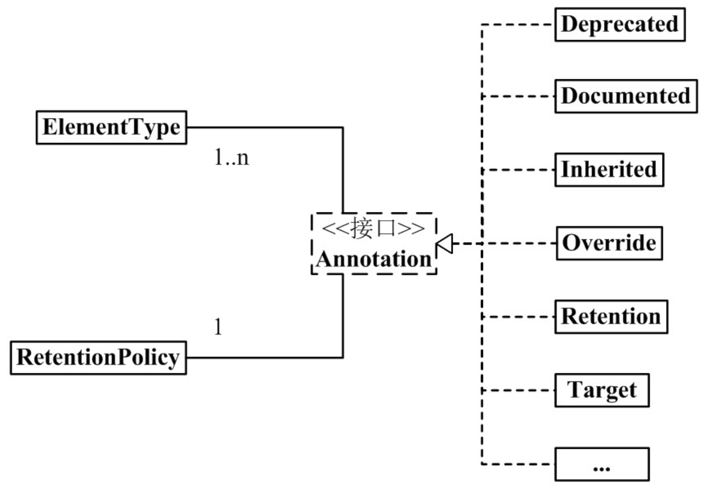
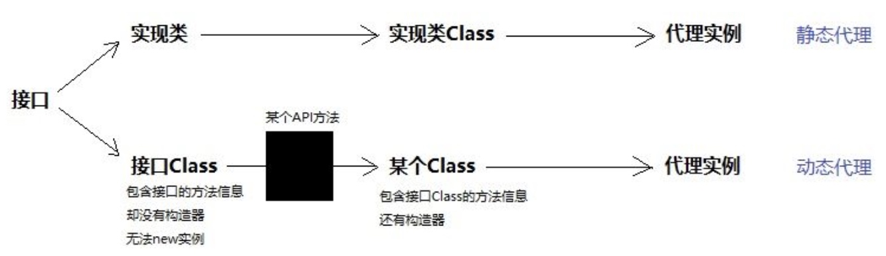
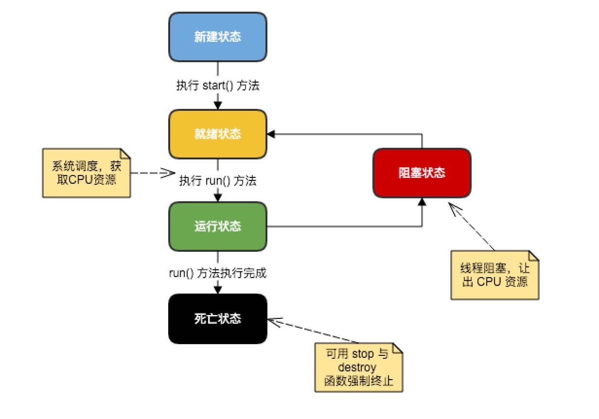

# 【Java】进阶知识

* [【Java】进阶知识](#java进阶知识)
* [泛型](#泛型)
	* [泛型方法](#泛型方法)
	* [泛型类](#泛型类)
	* [泛型接口](#泛型接口)
	* [类型参数和通配符](#类型参数和通配符)
	* [未检查声明](#未检查声明)
* [反射](#反射)
	* [相关的类](#相关的类)
	* [使用方式](#使用方式)
* [注解](#注解)
	* [内置注解](#内置注解)
	* [自定义注解](#自定义注解)
* [动态代理](#动态代理)
	* [内置动态代理](#内置动态代理)
	* [CGLib 动态代理](#CGLib-动态代理)
* [并发编程](#并发编程)
    * [线程](#线程)

## 泛型
**泛型（Generics）** 是 JDK 5 中引入的新特性，其本质是参数化类型，也就是将所操作的数据类型指定为一个参数，作用是在编译时提供了类型安全检测机制

> 在 JDK 5 之前，没有泛型的情况下，通过对类型 Object 的引用来实现参数的任意化，而任意化带来的缺点是要做显式的强制类型转换，而这种转换是要求开发者对实际参数类型可以预知的情况下进行的
> 
> 对于强制类型转换错误的情况，编译器可能不提示错误，在运行的时候才出现异常，这是一个安全隐患

这种参数化类型可以用在类、接口和方法的创建，分别称为泛型类、泛型接口和泛型方法

泛型只在编译阶段有效，不会进入到运行时阶段。在编译过程中，正确检验泛型结果后，会将泛型的相关信息擦除，并且在对象进入和离开方法的边界处添加类型检查和类型转换的方法

因此泛型在逻辑上看是多个不同的类型，实际上都是相同的基本类型

### 泛型方法
泛型方法在调用时既可以接收不同类型的参数，也可以返回不同类型的响应。调用泛型方法时，根据传递的参数类型、期望的响应类型或指定的泛型类型，编译器会适当地处理每一个方法调用

定义规则：
- 所有泛型方法声明都有一个类型参数声明部分 `<T>`，该类型参数声明部分在方法返回类型之前

- 每一个类型参数声明部分包含一个或多个类型参数，参数间用逗号隔开 `<T, E>`

- 类型参数能被用来声明返回值类型，并且能作为泛型方法的形参

- 泛型方法体的声明和其他方法一样，但类型参数只能代表引用类型，不能代表原始类型
 
示例：
``` java
public class GenericMethodTest {

    // 泛型方法，编译器根据传递的参数类型来处理
    public static <E> void printArray(E[] inputArray) {
        // 输出数组元素
        for (E element : inputArray) {
            System.out.printf("%s ", element);
        }
        System.out.println();
    }

    // 泛型方法，编译器根据期望的响应类型或指定的泛型类型来处理
    public static <E> E changeObject(Object obj) {
        // 类型转换为所需类型
        return (E)obj;
    }

    public static void main(String args[])
    {
        // 创建不同类型数组
        Integer[] intArray = {1, 2, 3, 4, 5};
        Character[] charArray = {'H', 'E', 'L', 'L', 'O'};
        String[] strArray = {"a", "b", "c", "d", "e"};

        // 传递不同类型的数组，可通过不同的调用方式
        GenericMethodTest.<Integer>printArray(intArray);
        GenericMethodTest.printArray(strArray);
        printArray(charArray);

        // 得到不同类型的对象，可通过不同的调用方式
        Character c = GenericMethodTest.<Character>changeObject(new Object());
        Integer i = GenericMethodTest.changeObject(new Object());
        String s = changeObject(new Object());
    }
}
```

### 泛型类
泛型类可以完成对各种类型对外开放相同的方法，其定义规则和泛型方法类似，除了在类名后面添加类型参数声明部分

使用泛型类时，传入了类型实参，则在泛型类中使用泛型的方法或成员变量定义的类型，都为指定类型，否则可以为任何类型

示例：
``` java
// 泛型类 Box
public class Box<T> {
    
    private T t;
 
    public void add(T t) {
        this.t = t;
    }
 
    public T get() {
        return t;
    }
     
    public static void main(String[] args)
    {
        // 使用不同泛型类型的类创建对象
        Box<Integer> integerBox = new Box<Integer>();
        Box<String> stringBox = new Box<String>();
        // 未传入类型实参
        Box anyBox = new Box();
        
        // 传递不同类型的值
        integerBox.add(new Integer(10));
        stringBox.add(new String("abc"));
        anyBox.add(10.5);
        
        // 输出不同类型的值
        System.out.printf("整型值为 :%d\n", integerBox.get());
        System.out.printf("字符串为 :%s\n", stringBox.get());
        System.out.printf("任意值为 :%s\n", anyBox.get());
    }
}
```

### 泛型接口
泛型接口可以作为各种类的生成器，这些类可以对各种类型开放进行各种操作的相同方法，其定义和使用规则和泛型类相同

当实现泛型接口的类时，未传入类型实参，则与泛型类的定义相同，所有类型参数直接写到类中，否则所有类型参数都要替换成传入的实参类型

示例：
``` java
// 泛型接口 GeneratorInterface
public interface GeneratorInterface<T>
{
    public T next();
}

// 未传入类型实参
public class FruitGenerator<T> implements GeneratorInterface<T> 
{
    @Override
    public T next() {
        return null;
    }
}

// 传入了类型实参
public class VegetablesGenerator implements GeneratorInterface<String>
{
    private String[] vegetables = new String[]{"Potato", "Tomato"};

    @Override
    public String next() {
        Random rand = new Random();
        return vegetables[rand.nextInt(2)];
    }
}
```

### 类型参数和通配符
**类型参数** 也称为类型变量，是用于表示一个泛型的标识符，用任意符号如 `A-Z `，其作用都是一样的

约定俗成下的意义：
- T（Type）：代表具体的 Java 类型
- K（Key）：代表 Java 键值中的 Key
- V（Value）：代表 Java 键值中的 Value
- E（Enum）：代表 Java 枚举的元素

可以通过 `类型参数 extends 类` 为参数类型限定上边界，也称为子类限定，即类型实参只允许传入指定类型的子类

**通配符** 用 `?` 来定义，用于表示不确定类型的类型实参

通配符和类型参数的作用是不一样的，类型参数用于表示不确定类型的形参，也就是对于泛型类、泛型接口、泛型方法来说，**类型参数用于声明它们，而通配符用于使用它们**

示例：
``` java
public class Fruit
{
    // 使用类型参数实现打印包含 Fruit 子类的列表
    public static <T extends Fruit> void print(List<T> list)
    {
        for (T fruit : list)
        {
            System.out.println(fruit);
        }
    }
    
    // 使用通配符实现打印包含 Fruit 子类的列表
    public static void print(List<? extends Fruit> list)
    {
        for (Fruit fruit : list)
        {
            System.out.println(fruit);
        }
    }
}
```

除了作用不一样外，两者之间还有以下区别：
- 类型参数可以确保实参类型的一致性

  ``` java
// list1 和 list2 的实参类型能确保一致
public static <T extends Fruit> void print(List<T> list1, List<T> list2)
//
// list1 和 list2 的实参类型不能确保一致
public static void print(List<? extends Fruit> list1, List<? extends Fruit> list1)
```

- 类型参数可以多重限定，而通配符不可以

  ``` java
// T 表示 Fruit 和 Vegetables 的共有子类型
public static <T extends Fruit && Vegetables> void print(List<T> list1)
```

- 通配符可以使用超类限定，而类型参数不可以

  不仅可以通过 `? extends 类` 为通配符限定上边界，表示指定类型的子类，还可以通过 `? super 类` 为通配符限定下边界，即超类限定，表示指定类型的父类，没有使用边界限定的通配符被称为无边界通配符

### 未检查声明
当对原类型 X 进行强制类型转换时，若目标类型 Y 是一个泛型类型，但不是无边界通配符的泛型类型，则会出现以下警告：
```
Type safety: Unchecked cast from X to Y
```

比如：
``` java
Object source = Collections.singletonMap("a", 2);
Map<String, String> target = (Map<String, String>) source;
String value = target.get("a");                       
```

由于泛型的类型擦除，因此无法在类型转换真正执行时确认 `source` 可以转化为了 `Map<String, String>` 类型

可通过以下两种写法消除警告：
``` java
// 1. 先转化为无边界通配符的泛型类型，在使用前做类型确认

Object source = Collections.singletonMap("a", 2);
Map<?, ?> target = (Map<?, ?>) source;
Object t = target.get("a");
                                                   
if (t instanceof String) {
    String value = (String) t;
}

// 2. 构造一个可以忽略警告的类型转化工具类

public final class CastUtils {

    @SuppressWarnings("unchecked")
    public static <T> T cast(Object obj) {
        return (T) obj;
    }

    private CastUtils() {
        throw new UnsupportedOperationException();
    }
}

Object source = Collections.singletonMap("a", 2);
Map<String, String> target= CastUtils.cast(source);
String value = target.get("a"); 
```


## 反射
反射（Reflect）使 Java 代码能够在 **运行时动态地** 获取已加载类的信息，包括字段、方法和构造函数，并能够使用这些反射信息来对其底层对象进行操作，且并不需要 **在编程或编译时** 就知道所运行的类型

反射 API 主要提供以下功能：
- 在运行时构造任意一个类的对象
- 在运行时判断任意一个类所具有的字段和方法
- 在运行时判断任意一个对象所属的类
- 在运行时访问任意一个对象的字段和方法

反射最重要的用途就是开发各种通用框架，但会额外消耗一定的系统资源，若不需要时尽量不要随便使用

### 相关的类
与反射相关的类如下：
- Class（`java.lang.Class`）

  其对象代表着类和接口，只能由 JVM 加载类时在内部创建，该类是一个泛型类

- Field（`java.lang.reflect.Field`）

  其对象代表着类和接口的成员字段，既可以是类字段，也可以是实例字段

- Method（`java.lang.reflect.Method`）

  其对象代表着类和接口的方法，既可以是类方法，也可以是实例方法

- Constructor（`java.lang.reflect.Constructor`）

  其对象代表着类的构造器，或称为构造方法，该类是一个泛型类

> 只有在 Java 代码中真正用到一个类时，JVM 才会去加载这个类，此时 JVM 会先读取 `.class` 文件到内存，然后为这个类创建一个 Class 对象并关联起来，因此 Class 对象包含了这个类的所有信息

### 使用方式
**获取 Class 对象**

``` java
// 返回 Class 对象，代表 classPath 对应的类 
// classPath 是类的完整路径
// 最常用于根据配置文件来动态加载类
Class<?> classType = Class.forName(classPath);

// 返回 Class 对象，代表 object 所属的类 
// object 是一个对象
Class<?> classType = object.getClass();

// 返回 Class 对象，代表指定的类本身
// Object 是一个已导入的类
// 通过类名常量来获取，好处就是实现懒加载
Class<?> classType = Object.class;
```

**获取 Field 对象**

``` java
// 返回 Field 对象，代表指定名称的公共字段
// classType 是一个 Class 对象
// fieldName 是字段名
Field field =  classType.getField(fieldName);

// 返回 Field 对象数组，代表所有的公共字段
Field[] fields = classType.getFields();

// 返回 Field 对象，代表指定名称的字段，包括所有访问级别的
Field field =  classType.getDeclaredField(fieldName);

// 返回 Field 对象数组，代表所有的字段，包括所有访问级别的
Field[] fields = classType.getDeclaredFields();
```

**获取 Method 对象**

``` java
// 返回 Method 对象，代表指定名称的公共方法，包括继承的方法
// classType 是一个 Class 对象
// methodName 是方法名
// new Class[]{} 是代表所有参数类型的 Class 对象数组
Method method =  classType.getMethod(methodName, new Class[]{});

// 返回 Method 对象数组，代表所有的公共方法，包括继承的方法
Method[] methods = classType.getMethods();

// 返回 Method 对象，代表指定名称的方法，包括所有访问级别的，不包括继承的方法
Method method =  classType.getDeclaredMethod(methodName, new Class[]{});

// 返回 Method 对象数组，代表所有的方法，包括所有访问级别的，不包括继承的方法
Method[] methods = classType.getDeclaredMethods();
```

**获得 Constructor 对象**

``` java
// 返回 Constructor 对象，代表指定参数的公共构造器
// classType 是一个 Class 对象
// new Class[]{} 的元素是代表所有参数类型的 Class 对象数组
Constructor<?> ctor = classType.getConstructor(new Class[]{});
Constructor<?> ctor = classType.getConstructor(new Class[]{String.class, int.class});

// 返回 Constructor 对象数组，代表所有的公共构造器
Constructor<?>[] ctors = classType.getConstructors();

// 返回 Constructor 对象，代表指定参数的构造器，包括所有访问级别的
Constructor<?> ctor = classType.getDeclaredConstructor(new Class[]{});
Constructor<?> ctor = classType.getDeclaredConstructor(new Class[]{String.class, int.class});

// 返回 Constructor 对象数组，代表所有的构造器，包括所有访问级别的
Constructor<?>[] ctors = classType.getDeclaredConstructors();
```

**创建对象**

``` java
// 通过代表类的 Class 对象进行实例化
// classType 是一个 Class 对象
// params 是传入的实例化参数，可根据参数使用不同的构造器
// className 是对象的所属类名
Object object = classType.newInstance(params);
className object = (className)classType.newInstance(params);

// 通过代表构造器的 Constructor 对象进行实例化
// ctor 是一个 Constructor 对象
// params 是传入的实例化参数，必须为该构造器所接收的参数
Object object = ctor.newInstance(params);
className object = (className)ctor.newInstance(params);
```

**访问成员字段**

``` java
// 通过 Field 对象获取所代表字段的值，需要有访问权限
// 若 Field 对象代表着实例字段，obj 是一个对象
// 若 Field 对象代表着静态字段，obj 可以是 null
// className 是值的所属类名
Object value = field.get(obj);
className value = (className)field.get(obj);

// 通过 Field 对象修改所代表字段的值，需要有访问权限
// value 是字段的值
// 对于 final 字段，只能修改当前 Field 对象的值，不会影响其原始值
field.set(obj, value);

// 若对 Field 对象代表的字段没有访问权限，则必须先进行设置，才能进行访问
field.setAccessible(true);
```

**调用方法**

``` java
// 通过 Method 对象调用所代表的方法，需要有访问权限
// params 是传入的实参，必须为该方法所接收的参数
method.invoke(params);

// 若对 Method 对象代表的方法没有访问权限，则必须先进行设置，才能进行访问
method.setAccessible(true);
```

**Class 对象的常用方法**

``` java
// 返回 Class 对象，代表指定类的父类
// classType 是一个 Class 对象
Class<?> superClassType = classType.getSuperClass()

// 返回 Class 对象数组，代表指定类实现的所有接口
Class<?>[] interfaces = classType.getInterfaces()

// 通过 Class 对象获取其代表的类的名字
String name = classType.getSimpleName()
```

## 注解
注解（Annontation）是 Java 5 开始引入的新特性，他提供了一种类似注释的安全机制，能将任何的信息与程序元素（如类、方法、成员字段等）进行关联，起到一个辅助性的作用，不能影响代码的实际逻辑
> 注解可以理解成贴在程序元素的标签，使得程序元素可以被方便地辨认

和注释不同的是，注解在程序编译和运行的过程时，可以允许不被丢弃，并且可以通过反射来获取指定程序元素上的注解，供指定的工具或框架使用

注解常见的使用方式：
- 生成文档
- 跟踪代码依赖性，实现替代配置文件功能
- 在编译时进行格式检查

### 内置注解
Java 内置定义了一套注解，分布在 `java.lang` 和 `java.lang.annotation` 包中

作用在程序元素上的注解：
``` java
// 标注指定方法为重写方法
// 若其父类或者是所实现的接口中并没有该方法时，会报编译错误
@Override

// 标记指定元素为废弃的
// 若该元素仍被使用，会报编译警告
@Deprecated

// 标记指定元素为抑制警告的
// 编译器会忽略注解中指定的警告
// warns 可以是单个字符串或字符串列表，每个字符串是警告的关键字，如 all 表示所有警告
@SuppressWarnings(warns)
```

作用在注解上的注解（元注解）：
``` java
// 标注指定注解的保存策略
// retentionPolicy 存在以下选择：
// RetentionPolicy.SOURCE 表示编译时被丢弃
// RetentionPolicy.CLASS 表示运行时被丢弃
// RetentionPolicy.RUNTIME 表示一直被保存
@Retention(retentionPolicy)

// 标注指定注解需要记录到 javadoc 或类似工具中
@Documented

// 标记指定注解用于注解哪些 Java 程序元素
// elementType 可以是单个或列表，可分为以下元素：
// ElementType.TYPE 类、接口、注解、枚举
// ElementType.FIELD 字段、枚举项
// ElementType.METHOD 方法
// ElementType.PARAMETER 参数
// ElementType.CONSTRUCTOR 构造器
// ElementType.LOCAL_VARIABLE 局部变量
// ANNOTATION_TYPE 注解
// PACKAGE 包
// TYPE_PARAMETER 类型参数
// TYPE_USE 类型使用，如声明语句、强制转换语句、泛型使用时
@Target(elementType)

// 标注指定注解需要被类继承关系所继承
@Inherited
```

在 Java 8 之后，额外增加的 3 个注解:
``` java
// 标注指定方法或构造器，忽略调用时使用泛型变量作为参数而所产生的警告
@SafeVarargs

// 标注制定类型为一个匿名函数或函数式接口
// 函数式接口是指仅仅只包含一个抽象方法的接口
@FunctionalInterface

// 标识指定注解可以在同一个声明上使用多次
@Repeatable
```
<br>
注解本质是一个继承了 Annotation 的特殊接口，具体实现类是在 Java 运行时生成的动态代理类。其实现架构如下：


### 自定义注解
在底层实现上，所有注解都会自动继承 `java.lang.annotation.Annotation` 接口，通过关键字 `@interface` 来定义一个注解：

``` java
// 元注解定义：用于标注该注解的作用元素和保存策略等
// 访问修饰符：默认且必须为 public
// 内容方法声明，可以为其设置返回默认值
@Target({ElementType.FIELD, ElementType.TYPE})
@Retention(RetentionPolicy.RUNTIME)
public @interface Info {
    String value() default "none";
    boolean isDelete();
}
```

使用自定义注解：
``` java
// 通过传入参数的形式，来为注解配置对应方法的返回值
@Info(value = 'person', isDelete = false)
public class Person {

    @Info(value = 'name', isDelete = true)
    private String name;
}
```

通过反射来获取注解对象：
``` java
// 返回该反射类是否被指定注解标注
// class 可以是其他的反射类
// annotation 是代表注解的 Class
class.isAnnotationPresent.Class(annotation)

// 返回该反射类上的指定注解对象
class.getAnnotation(annotation)

// 返回该反射类上的所有注解对象
class.getAnnotations()

// 返回该反射类上的指定注解对象，忽略继承的注解
class.getDeclaredAnnotation(annotation)

// 返回该反射类上的所有注解对象，忽略继承的注解
class.getDeclaredAnnotations()

// 最后通过注解对象来获取注解信息，如以下示例：
@Info(value = 'person', isDelete = false)
public class Person {

    @Info(value = 'name', isDelete = true)
    private String name;
    
    public void static main (String[] args){
        if (Person.class.isAnnotationPresent.Class(Info.class) {
            anno = Person.class.getAnnotation(Info.class);
            if (not anno.isDelete()) {
                System.out.println(anno.value());
            } 
        }
    }
}
```

## 动态代理
代理模式，就是让代理类和目标类实现相同的接口，客户端通过代理对象来调用目标对象方法时，代理对象会将所有的方法调用，分派到目标对象的对应方法上执行，并且在执行前后进行功能增强，不需要修改目标类的代码

对于静态代理，需要为现有的每个类都编写一个对应的代理类，并且让它们实现和目标类相同的接口，工作量非常大且重复

对于动态代理，则是通过反射机制，来为每个目标对象生成一个对应的代理对象，开发者不需要编写大量的代理类，只需要专注于功能增强代码的编写

### 内置动态代理
Java 通过 `java.lang.reflect.InvocationHandler` 接口和 `java.lang.reflect.Proxy` 类来实现内置的动态代理，和静态代理相比较，其实现思路如下：



`InvocationHandler` 表示调用处理类需要实现的接口，包含唯一的 `invoke` 方法

每个代理对象都需要关联一个调用处理对象，当客户端通过代理对象调用方法时，会转化为调用处理对象的 `invoke` 方法，进行分派执行和功能增强

附加日志打印的调用处理类，示例如下：
``` java
public class ProxyHandler implements InvocationHandler{
    
    // proxy 是代理对象
    // method 是 Method 对象，代表需要调用的目标对方法
    // args 是调用目标方法时传入的参数
    @Override
    Object invoke(Object proxy, Method method, Object[] args) throws Throwable
    {
        System.out.println("调用实际方法前的日志打印");
        // 执行代理对象的指定调用方法
        Object result = method.invoke(proxy, args);
        System.out.println("调用实际方法前的日志打印");
        // 返回方法调用的结果
        return result;
    }
}
```

`Proxy` 类可用于创建 Class 对象，表示指定接口的代理类。这个 Class 对象既拷贝了原有接口的方法信息，又带有用于来创建对象的构造器，其创建方式如下：
``` java
// 返回 Class 对象，代表指定接口 Class 的代理类
// targetClassLoader 是指定目标类的类加载器，通过 targetClass.getClassLoader() 方法获取
// interfaceClass 是代表指定接口的 Class 对象，可传入多个
proxyClass = Proxy.getProxyClass(targetClassLoader, targetInterfaceClass)

// 返回一个接收调用处理对象作为参数的构造器，用于创建代理对象
// proxyClass 是代理 Class 对象
proxyConstrutor = proxyClass.getConstrutor(InvocationHandler.class)

// 返回一个关联到指定收调用处理对象的代理对象
targetInterface proxy = (targetInterface)proxyConstrutor.newInstance(new ProxyHandler())
```
> 类加载器的作用是把 `.class` 文件加载进内存，并为其创建对应 Class 对象

`Proxy` 也有一个方法可直接完成以上的操作，得到代理对象：

``` java
// 返回一个关联到指定收调用处理对象的代理对象
// 接口需要传入列表，表示所有代理类需要实现的接口
TargetInterface.class proxy = (TargetInterface.class) Proxy.newProxyInstance(targetClassLoader,
new Class[]{TargetInterface.class}, new ProxyHandler());
```

构造一个方便使用的动态代理类：
``` java
public class DynamicProxy implements InvocationHandler {
	
	private Object obj;
	
	public Object bind(Object obj)
	{
		this.obj = obj;
		return Proxy.newProxyInstance(obj.getClass().getClassLoader(), obj
		.getClass().getInterfaces(), this);
	}
	
	@Override
	public Object invoke(Object proxy, Method method, Object[] args)
	throws Throwable
	{
		System.out.println("调用实际方法前的日志打印");
		Object res = method.invoke(obj, args);
		System.out.println("调用实际方法前的日志打印");
		return res;
	}
}

// 得到代理对象
TargetInterface dynamicProxy = (TargetInterface) DynamicProxy().bind(targetObject)
// 通过代理对象调用方法
dynamicProxy.method()
```

### CGLib 动态代理
若需要目标类未实现任何接口，则不能使用内置动态代理的方式得到代理对象

CGLib 采用了非常底层的字节码技术，其通过字节码技术为目标类创建一个子类，并在子类中采用方法拦截来拦截所有父类方法的调用，进行分派执行和功能增强

CGLib 不仅能够代理类，也能代理接口。但其局限是不能对 fianl 类进行代理，以及不能够拦截 final 方法，如 `Object.getClass()` 方法，而且性能较内置动态代理较差一些

主要通过 `net.sf.cglib.proxy.MethodInterceptor` 接口和 ` net.sf.cglib.proxy.Enhancer` 类来实现 CGLib 动态代理

`MethodInterceptor` 表示方法拦截类需要实现的接口，包含唯一的 `intercept` 方法，所有通过代理类调用的方法，都会被 `intercept` 方法所拦截

附加日志打印的方法拦截类，示例如下：
``` java
public class ProxyInterceptor implements MethodInterceptor{
    
    // obj 是动态生成的代理子类对象 
    // method 是代表实际调用方法的 Method 对象
    // args 是调用方法入参
    // proxy（net.sf.cglib.proxy.MethodProxy），可以进行目标类对象的方法调用
    @Override
    public Object intercept(Object obj, Method method, Object[] args, MethodProxy proxy) 
    throws Throwable
    {
        System.out.println("调用实际方法前的日志打印");
		// 或者 Object res = method.invoke(obj, args);
		Object res = proxy.suoperInvoke(obj, args);
		System.out.println("调用实际方法前的日志打印");
		return res;
    }
}
```

`Enhancer` 类用于创建代理对象，作用和内置动态代理的 `Proxy` 类似，使用方式如下：

``` java
// 实例化 Enhancer，设置目标类和关联的方法拦截对象
// targetClass 是代表目标类的 Class 对象
Enhancer enhancer = new Enhancer();  
enhancer.setSuperclass(targetClass);  
enhancer.setCallback(new ProxyInterceptor());  

// 创建动态代理子类的对象  
TargetClass proxy = (TargetClass)enhancer.create();  
```

构造一个方便使用的动态代理类：
``` java
public class DynamicProxy implements MethodInterceptor{
    private Object obj;
    
    public Object bind(final Object target)
    {
    this.obj = target;
		Enhancer enhancer = new Enhancer();
		enhancer.setSuperclass(obj.getClass());
		enhancer.setCallback(this)
		return enhancer.create()
    }
    
    @Override
    public Object intercept(Object obj, Method method, Object[] args, MethodProxy proxy) 
    throws Throwable
    {
        System.out.println("调用实际方法前的日志打印");
		Object res = proxy.suoperInvoke(obj, args);
		System.out.println("调用实际方法前的日志打印");
		return res;
    }
}

// 得到代理对象
TargetInterface dynamicProxy = (TargetInterface) DynamicProxy().bind(targetObject)
// 通过代理对象调用方法
dynamicProxy.method()
```

## 并发编程
关于 Java 并发编程，一般指的是多线程编程，很少提及多进程编程或多协程编程， Java 通过 `java.util.concurrent`  内置包提供了一系列用于支持多线程的接口，[Java 8 官方文档](https://docs.oracle.com/javase/8/docs/api/java/util/concurrent/package-summary.html)

选择使用 Java 多线程来实现并发时，JVM 中每个 Java 线程都基于操作系统的原生线程，并通过操作系统的调度机制来并发执行，不仅开销小且内置支持好

很少选择开销较大的 Java 多进程，因为需要创建多个 JVM 实例；选择 Java 多协程理论上开销更小，但由于 Java 对协程的内置支持不足，因此也很少选择

### 线程
一个 Java 线程的生命周期和对应状态转换：



- **新建状态**：线程从新建状态开始了它的生命周期，并保持该状态直到该线程的 `start()` 方法被调用 

- **就绪状态**：当新建状态的线程的 `start()` 方法被调用后，或阻塞状态的线程结束其阻塞操作后，会转换为就绪状态，开始等待操作系统调度，来获取 CPU 资源

- **运行状态**：当就绪状态的线程因操作系统调度获取到 CPU 资源，会转换为运行状态，继续执行其 `run()` 方法

- **阻塞状态**：当运行状态的线程执行阻塞操作，会转换为阻塞状态，并释放它的 CPU 资源，直到阻塞操作结束

- **终止状态**：当运行状态的线程执行完其 `run()` 方法，或其他终止条件发生，会转换为终止状态，结束该线程的生命周期

> 在一个 JVM 实例中，Java 主线程新建于程序的 `main()` 方法，在主线程中可以新建和运行其他线程

创建 Java 线程可以通过以下两种方法：

- **继承 `Thread` 类**

``` java
class MyThread extends Thread {

    @Override
    public void run() {
        // 代码逻辑
    }
}

t = new MyThread()
```

- **实现 `Runnable` 接口**

  `Runnable` 接口只包含一个方法签名 `public abstract void run();`，`Thread` 类也实现了该接口
  
``` java
class MyRunnable implements Runnable{

    @Override
    public void run() {
        // 代码逻辑
    }
}

t = new Thread(new MyRunnable())

// 由于 Runnable 接口是函数式接口，可以通过匿名函数快速实现并实例化
// 因此以上过程可简化为

t = new Thread(() -> {
    // 代码逻辑
})
```

`Thread` 常用的类方法：
``` java
// 返回对当前正在执行的线程对象
Thread currentThread();

// 使当前正在执行的线程暂停执行指定毫秒
// millis 表示毫秒数
// 具体精度取决于操作系统的定时器和调度器
void sleep(long millis);

// 使当前线程放弃目前的 CPU 资源，转换为就绪状态等待调度
void yield();
```

`Thread` 常用的成员方法
``` java
// 启动该线程
void start();

// 返回该线程的标识符
long getId();

// 返回该线程的名字
String getName();

// 设置该线程的名字
void setName(String name);

// 返回该线程是否为存活的
// 存活表示就绪状态、运行状态或阻塞状态
boolean isAlive();

// 为该线程设置中断标记，用于线程中断运行
void interrupt();

// 返回该线程是否已存在中断标记
boolean isInterrupted();

// 返回该线程是否已存在中断标记，可选择是否清除标记
boolean isInterrupted(boolean ClearInterrupted);

// 返回线程是否为守护线程
boolean isDaemon();

// 设置线程是否为守护线程
void setDaemon(boolean on);

// 等待直到该线程结束或超时
// millis 表示超时毫秒数
void join(long millis);

// 返回该线程的优先级
int getPriority();

// 设置该线程的优先级
void setPriority(int newPriority);
```

线程的分类：
- **用户线程**：运行在前台，用于独立执行具体的任务
- **守护线程**：Daemon 线程，运行在后台，用于为其他前台线程服务，因此当所有用户线程都运行结束，JVM 会结束所有守护线程

> 常见的守护线程：垃圾回收线程、数据库连接检测线程
> 
> 设置守护线程必须在线程启动之前，否则会抛出 `IllegalThreadStateException` 异常

线程的优先级用于设置操作系统针对某个线程的调度优先程度，优先级有以下几个特性：
- **继承性**，比如 A 线程启动 B 线程，则 B 线程的优先级与 A 是一样的
- **规则性**，线程的调度优先程度跟其启动先后顺序无关，与其优先级大小有关
- **随机性**，操作系统尽量会先调度优先级较高的线程，但无法百分百肯定线程优先级较高一定比线程优先级较低的先执行完

