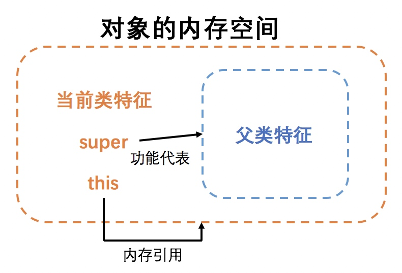

# 【Java】面向对象

* [【Java】面向对象](#java面向对象)
    * [简介](#简介)
    	* [编程范式](#编程范式)
    	* [概念](#概念)
    	* [三大特点](#三大特点)
    	* [类的声明](#类的声明)
    	* [变量和属性](#变量和属性)
    	* [方法](#方法)
    	* [构造器](#构造器)
    	* [代码块](#代码块)
    	* [类的继承](#类的继承)
    * [对象](#对象)
    	* [对象的创建](#对象的创建)
    * [接口](#接口)
    	* [接口的声名](#接口的声名)
    	* [接口的实现](#接口的实现)

## 简介
Java 是一门 **面向对象** 的编程语言

### 编程范式
编程范式根据不同编程方式的特点进行了分类，代表了对于问题的不同解决思路，大多数编程语言只支持一种编程范式，其中主要分为面向过程编程和面向对象编程：

- **面向过程编程**，又称 **POP（Procedural-Oriented Programming）**：将程序要解决的大问题，分解成要解决的多个小问题，再得出能解决这些问题的步骤，一步步地从上到下执行，从而实现程序的功能

  执行性能高，开发速度快，适合开发功能简单的、一次性使用的程序
  
- **面向对象编程**，又称 **OOP（Object-Oriented Programming）**：利用类来描述抽象的事物，管理什么样东西能做什么事，利用对象来描述具体的事物，管理哪个东西要做什么事，从而实现程序的功能
  
  结构更灵活，更容易维护、复用和扩展，适合开发功能复杂、多人协作、持续维护和迭代的程序

### 概念
**类（Class）** 是对拥有相同属性和方法的对象的抽象定义。在类中定义了这些对象所具备的属性和方法

**对象（Object）** 是类结合个体特殊性后的具体实例化。通过对象可以访问其属性和方法

> 把有相同属性（哺乳动物、长寿、姓名）和方法（走路、思考）的归为一个类（人类），结合类（人类）和个体特殊性（姓名不同、走路方式不同）产生了对象（一个具体的人），于是就可以通过这个对象访问其属性（哺乳动物、长寿、具体姓名），以及调用其方法完成实际事情（令这个人走路、思考）

### 三大特点
**封装（Encapsulation）**

类中的内部属性和方法的访问，对于外部使用的用户是透明的，即类相当于是一个定义了对外属性和方法的黑匣子，既保证了内部属性和方法的安全性，也保证了对外属性和方法的易用性

``` java
public class Dog {

    private String flavor;
    
    private void eat(String food) {
        System.out.println("eating " + food)
    }
    
    // 对外的 getFlavor 封装了对 flavor 属性的读操作
    public void getFlavor(String flavor) {
        return flavor
    }
    
    // 对外的 setFlavor 封装了对 flavor 属性的写操作    
    public void setFlavor(String flavor) {
        this.flavor = flavor
    }
    
    // 对外的 action 方法封装了 flavor 属性和 eat 内部方法
    public void action() {
        eat(flavor)
    }
}
```
> 内部属性的读写操作常用 `getField` 和 `setField` 方法进行封装

**继承（Inheritance）**

一个类可以派生出子类，在父类中定义的非私有属性和方法自动被子类所继承

``` java
public class Animal {
    
    public void eat() {}
    public void barking() {}
}

// Dog 和 Cat 继承了 Animal 方法，并各自对 barking 方法进行了不同的实现

public class Dog extends Animal {
    
    public void barking() {
        System.out.println("wooo~"); 
    }
}

public class Cat extends Animal {
    
    public void barking() {
        System.out.println("miao~"); 
    } 
}
```

**多态（Polymorphism）**

一个父类可以派生出了不同的子类，并且所有子类对象的类型都可以转换为父类，调用方调用父类对象的方法时，就可以得到不同子类对象对该方法的不同实现，并且调用方不用感知这个不同

也就是说，多态允许任意子类的对象传入到表示父类类型的变量，作为父类的对象来使用，在程序运行期间才能决定，该变量发出的方法调用到底引用的是哪个具体子类中实现的方法

``` java
public class Test {

    public static void main(String[] args) {
        // 所有 Animal 子类对象都可以转换为 Animal 类型来使用
        animalBraking(new Dog())
        animalBraking(new Cat())
    }
    
    private static void animalBraking(Animal animal) {
        // 调用一个 braking 方法，不同的 Animal 子类会提供不同的实现
        // 不需要感知实际接收到的是哪个 Animal 子类
        animal.braking();
    }
}
```
> 但在编译阶段，编译器认为调用的是父类对象，因此方法必须是存在于父类中的，若要调用子类独有的方法，则需要向下转型

## 类
类可以看成是模板，用于描述一类对象的状态和行为

### 类的声明
类的声明语法：
``` java
[修饰符列表] class 类名 [extends 父类名] [implements 接口名] {
    类体
}
```
> 在类体中，不允许包含除了定义属性、方法和构造方法之外的其他语句

类的声明示例：
``` java
public class Dog {

    // 构造方法，又称为构造器
    public Dog() {}
    public Dog(String name) {}

    // 属性，表示状态
    int age;
    String color;
      
    // 方法，表示行为
    void barking() {}
    void eat() {}
}
```
在类体中，通过变量来描述一类对象的属性，通过方法来描述一类对象的行为，并通过构造方法（构造器）来描述一类对象的初始化过程

一个类可以拥有多个属性和方法，并且必须拥有至少一个构造器，构造器名称与类同名，但不需要声明返回值类

### 变量和属性
变量本质上就一块内存空间，内存空间所在的内存分区取决于变量的分类。变量的声明语法：
``` java
// 变量声明
变量类型 变量名;

// 变量声明并初始化
变量类型 变量名 = 字面值;
```
> 四个注意点：
> - 变量的作用域指的是变量的有效范围，变量无法在其作用域外被访问，在 Java 中以 `{}` 来划分作用域
> - 同一作用域下的同名变量不允许重复声明
> - 未初始化的局部变量不允许访问
> - 类体中声明的类变量或成员变量，会在对象初始化时进行初始化，若这些变量无初始化操作，则会自动初始化为默认值

变量的声明示例：
``` java
public class Dog {

    // 单个变量声明
    int a;
    
    // 单个变量声明且初始化
    int b = 1;
    
    // 多个变量声明
    int c, d, e;
    
    // 不支持多个变量声明且初始化，只能初始化到最后一个变量
    int f, g, h = 1;
}
```

变量根据其声明的位置，可进行以下分类：
- **局部变量**：在方法、构造器或语句块中声明的变量。变量声明和初始化都是在方法中，方法结束后，变量就会自动销毁。内存空间是从栈区分配的

- **成员变量**：在类体中、方法之外声明的变量。这些变量会随着对象创建过程被拷贝，分别存在于各自所属的对象之中，必须通过对象进行访问。内存空间是从堆区分配的

- **类变量**：在类体中、方法之外声明，且使用了 `static` 进行修饰的变量。这些变量只存在于所属的类之中，独立于各个对象存在，也称为静态变量。内存空间是从方法区分配的

> 在类体中方法之外声明的变量就是属性，因此成员变量也称为成员属性，类变量也称为类属性

### 方法
方法的声明语法：
``` java
[修饰符列表] 返回值类型 方法名([形参列表]) {
    方法体
}
```

方法的声明示例：
``` java
public class Dog {
    
    // 类属性和类方法
    private static String type;
    private static void show() {};
    
    // 成员属性和成员方法
    private String color;
    private void go() {};
      
    // 类方法，不允许访问成员属性和成员方法
    static void barking() {
        // 访问类的变量
        type
        Dog.type
        
        // 访问类的方法
        show() 
        Dog.show() 
    }
    
    // 成员方法
    void eat() {
        // 访问自身的成员变量
        color;
        this.color;
        
        // 访问自身的成员方法
        go();
        this.go();
        
        // 访问类的变量
        type
        this.type
        Dog.type
        
        // 访问类的方法
        show() 
        this.show() 
        Dog.show() 
    }
}
```
> 在类体声明的方法中，访问当前类体的其他方法或变量时，可以直接通过 `变量名` 或 `方法名` 来访问
> 
> 但若需要访问的 `变量名` 或 `方法名` 和形参名或局部变量名相同，因为 Java 中有就近访问原则，因此仍需要使用 `类/this.变量名` 或 `类/this.方法名` 来访问
> 
> `this` 关键字除了可以用于构造器，还可以在成员方法中表示当前对象，用于区分局部变量和成员变量

在一个类中，可以定义多个同名但不同形参的方法，当方法被调用时，自动根据所传入的实参执行对应的方法，这个机制称为 **方法重载（Overload）**

方法和属性一样分为成员方法和类方法，若使用 `static` 进行修饰就会成为类方法，这些方法只存在于所属的类之中，独立于各个对象存在，也称为静态方法

类方法中不允许调用当前类中所声明的成员属性和成员方法

### 构造器
构造器的声明语法：
``` java
public 类名([形参列表]) {
    构造器体
}
```
在一个类中若没有显式地定义构造器，Java 编译器会提供一个默认的空构造器，否则空构造器需要显示自行显式声明

根据方法重载机制，一个类也可以有多个构造器，创建一个对象时，会根据所接收的参数来调用对应的构造器，至少会调用一个构造器进行对象的初始化

构造器可以通过 `this` 关键字调用其他构造器来完成对象的初始化，必须在首行且只能调用一次：
``` java
public class Dog {

    private String color;
    
    public Dog(String name, String color) {
        this(name)
        this.color = color
    }
    
    public Dog(String name) {
        System.out.println("Dog name is: " + name ); 
    }
}
```

在子类的构造方法中，首行既没有 `this` 语句，也没有 `super` 语句时，会默认存在一行 `super()`，表示先调用父类的无参数构造方法进行父类特征的初始化

若在首行显式使用 `super([构造器实参列表])`，则会替代性地调用父类的其他构造方法来进行父类特征的初始化，只能使用一次

``` java
public class Animal {

    private String name;

    public Animal() {
    }
    
    public Animal(String name) {
        this.name = name;
    }
}

public class Dog extends Animal {

    private String color;

    public Dog(String color) {
        // 默认会存在 super();
        this.color = color;
    }

    public Dog(String name, String color) {
        // 调用父类的其他构造器先对其父类特征进行初始化
        // 若没有这个调用，则无法对未继承属性 name 进行初始化 
        super(name);
        this.color = color;
    }
}
```
> 但无论如何，父类的构造方法是一定会被执行的，并最先进行初始化，以保证对象的父类特征能够得到初始化
> 
> 对象的父类特征表示在父类中所定义方法和属性的集合，也归属于对象本身，但未继承的特征、已继承但已覆盖的方法、已继承但同名的属性都无法直接通过对象访问

### 代码块
在类体中可以声明代码块，包括成员代码块和使用 `static` 进行修饰的类代码块

成员代码块在对象初始化前执行，类代码块在类加载时执行，都只会执行一次，通常用于完成类或对象的一些初始化工作，若存在多个则自上而下地执行

``` java
public class Dog {
    // 成员代码块
    {
        System.out.println("init object" ); 
    }
    
    // 类代码块
    static {
        System.out.println("init class" ); 
    }
}
```

### 类的继承
Java 中只提供单类继承和多重继承，不支持多类继承，其语法格式：

``` java
[修饰符列表] class 类名 [extends 父类名] {
    类体
}
```
> 子类继承了父类中除构造器外的非 private 属性和方法，即由访问权限的属性和方法
> 
> 父类又称为基类、超类、superClass；子类又称为派生类、subClass；在多重继承关系中则分别称为祖先类和子孙类
>
> 若一个 Java 类没有显式地继承任何一个类，那么它将默认继承 `java.lang.Object` 类，也就是说 `java.lang.Object` 是任何类的祖先类

<br>
可以通过在子类中重新声明从父类继承的方法，来对其进行 **方法覆盖（Override / Overwrite）**，完成方法的重新实现，但子类方法需要符合以下条件：
- 父类方法的方法名、参数列表都要相同
- 不能比父类方法返回的返回值类型更宽泛
- 不能比父类方法的访问权限更严格
- 不能比父类方法抛出的异常类型更宽泛

> 可以使用 `Override` 注解来保证方法的正确覆盖

``` java
public class Dog extends Animal {

    private String color;

    public void barking() {
        System.out.println("no"); 
    }
}

public class Dog extends Animal {

    private String color;

    @Override
    public void barking() {
        System.out.println("wooo~"); 
    }
}
```

方法才会出现覆盖，变量即使同名也不会出现覆盖。并且就算出现了方法覆盖，父类的方法也不会无法访问，因为在 Java 中，对象的当前类特征和父类特征是独立储存的



通过 `super` 关键字，可以在子类的成员方法中访问已继承但无法直接访问的父类特征，即已覆盖的方法和同名的属性，`super` 此时表示当前对象父类特征

``` java
public class Dog extends Animal {

    String color;
    
    String attr;
    
    public void barking() {
        System.out.println("no"); 
    }
    
    public void method() {
        System.out.println("method"); 
    }
}

public class Dog extends Animal {

    String color;

    @Override
    public void barking() {
        System.out.println("wooo~");
    } 
     
   public void test() {     
        // 访问当前类中的已被覆盖的方法
        this.barking();
        barking();
        // 访问父类中已被覆盖的方法
        super.barking();
        
        // 访问当前类中的同名属性
        this.color;
        color;
        // 访问父类中的同名属性
        super.color;
        
        // 访问已从父类继承，没被覆盖的方法和不同名属性
        // 可以直接当作访问自身方法和属性
        super.method();
        this.method();
        method();
        super.attr;
        this.method();
        attr;
    }
}
```
> 当需要区分当前类特征和父类特征的访问时，用 `super.属性名` 或 `super.方法名` 进行访问，否则可以直接当作访问自身方法和属性
> 
> `super` 和 `this` 还有一个很大的区别，`super` 只是一个功能关键字，而 `this` 是对象的引用

<br>
子孙类可以自动转换为祖先类，称为向上转型（Upcasting）；祖先类需要强制转换为子孙类，称为向下转型（Downcasting）

向下转型时，父类对象底层引用的子类对象类型必须是能够转换为目标类型的，否则会触发 `ClassCastException` 异常，建议先通过 `instanceof` 运算符进行检查

``` java
// 当 animal 对象是 Dog 类对象时为 True
// 或者说 animal 对象类型是 Dog 类或其子孙类时为 True
if (animal instanceof Dog) {
    (Dog)animal
}
```

## 对象
对象是类的一个实例，拥有自己的状态和行为。即通过对象可以访问它本身的成员属性和成员方法，也可以访问它所属类的类属性和类方法（相当于通过类本身来访问其类属性和类方法，因此最好通过类本身来访问）

### 对象的创建
对象的创建语法：
``` java
new 类名/构造器名([构造器实参列表])
```

对象的创建示例：
``` java
public class Dog {
    
    private static String type;
    
    private static void show() {};
    
    private String color;
    
    private void go() {};
    
    public Dog(String name) {
        System.out.println("Dog name is: " + name ); 
    }
    
    public static void main(String[] args) {
        // 对象的创建
        Dog myDog = new Dog("tommy");
        
        // 访问对象的变量和方法
        myDog.color;
        myDog.go();
        
        // 访问类的变量和方法
        Dog.type;
        myDog.type;
        Dog.show(); 
        myDog.show();
        
        // 此处不会出现空指针异常
        // 因为此处 show 方法的执行和 myDog 对象无关，只与 myDog 的类型有关
        myDog = null;
        myDog.show();
    }
}
```

对象的创建过程：
- 对象创建，使用 `new` 关键字创建对象，会从堆区来分配内存空间
- 对象初始化，调用对应的构造方法来初始化对象

## 接口
接口是 Java 中的抽象类型，表示包含一系列抽象方法的集合，无法被实例化，被只能类进行实现

### 接口的声名
接口的声名语法：
``` Java
[修饰符列表] interface 接口名 [extends 接口名,...] {
    // 接口体
    // 抽象方法（方法签名）
}
```
> 接口体中声明的抽象方法，其隐式的默认修饰符为 `public abstract`
>
> 接口体中可以声明静态变量，从 JDK 1.8 开始，还可以声明静态方法和静态代码块，以上静态声明有隐式的默认修饰符 `public static final`  

接口的声明示例：
``` Java
interface Animal {
   public void eat();
   
   public void travel();
}

interface Dog extends Animal {
   public void bark();
   
   // 带默认实现的接口
   default String showColor() {
        return "black";
    }
}
```
接口可以被接口所继承并且支持多继承，子接口会继承父接口所声明的抽象方法，父接口的静态变量和静态方法不会被继承

在接口体中可以定义带默认实现的抽象方法，也称为扩展方法，其实现类可以重写或直接使用该扩展方法的实现。扩展方法不能够重写 Object 中的方法，但可以重载 Object 中的方法

在接口多继承时，在相同层级的父接口中不允许包含同样的扩展方法，若在不同层级的父接口中包含同样的扩展方法，则更具体更低层级的扩展方法生效

### 接口的实现
``` Java
class 类名 implements 接口名,... {
    // 类体
    // 全部抽象方法的实现
}

abstract class 类名 implements 接口名,... {
    // 类体
    // 部分抽象方法的实现
}
```

一个实现接口的类，必须实现接口内所描述的所有非扩展方法，或者声明为抽象类

实现接口的类，其对象的类型可以被视为接口类，但实现不是继承，实现类并不会继承接口的静态变量和静态方法

一个类可以同时实现多个接口，相当于实现对这些接口多重继承得到的接口

接口的实现示例：
``` java
class SpottedDog implements Dog {
   @Override
   public void eat() {
       System.out.println("eat" ); 
   }
   
   @Override
   public void travel() {
        System.out.println("travel" ); 
   }
   
   @Override
   public void bark() {
        System.out.println("bark" ); 
   }
}
```
> 实现接口的方法，通常使用 `@Override` 注解，表示方法的覆盖

<br>
可以使用简便的语法，对接口进行实现并实例化，示例如下：
``` java
interface MathOperation {
    int operation(int a, int b);

    int echo(int a);
}

MathOperation addition = new MathOperation() {
            @Override
            public int operation(int a, int b) {
                return 0;
            }
             @Override
            public int echo(int a) {
                return 0;
            }
        };
```
> 若接口仅包含单个方法签名，则称为函数式接口，可以使用匿名函数来对接口简便实现并实例化，函数式接口允许包含其他扩展签名
> 
> 内置的函数式接口包含在 `java.util.function` Package 中