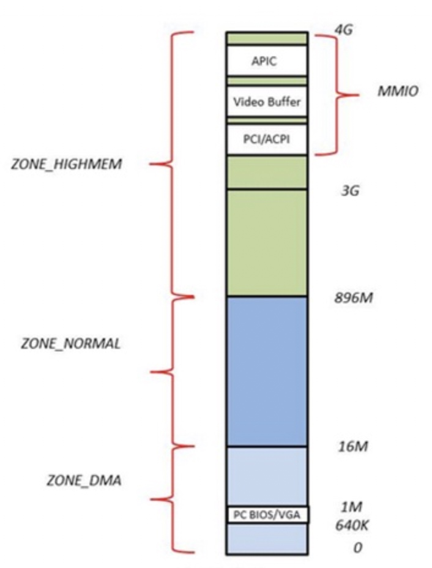
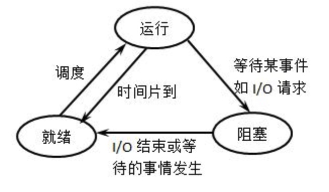
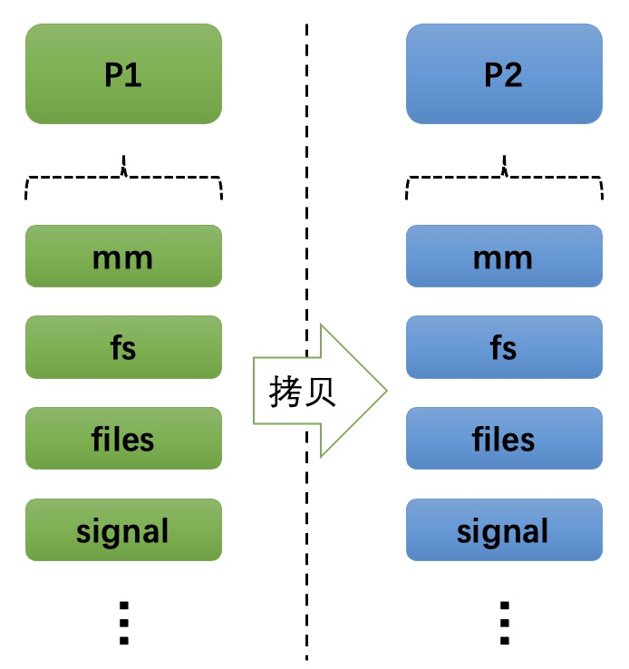
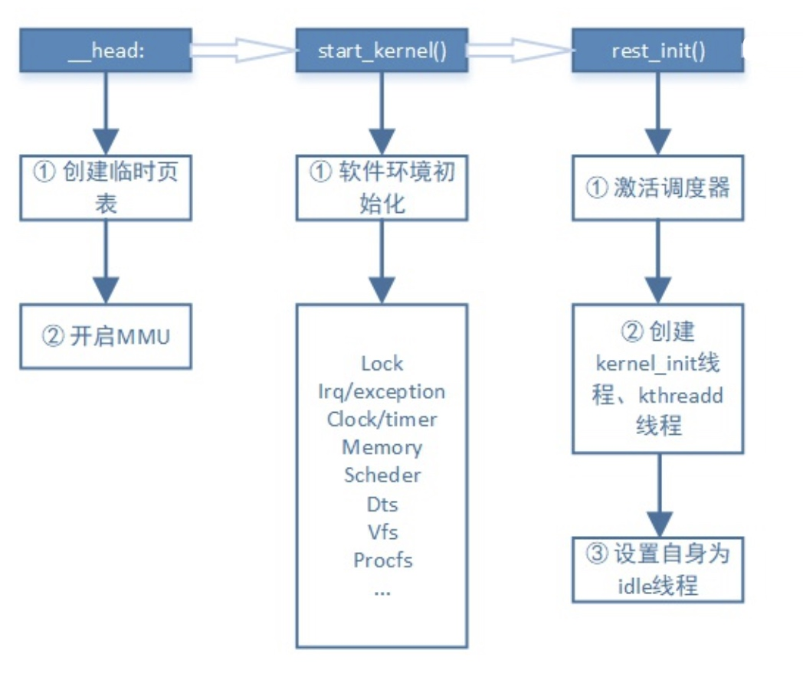
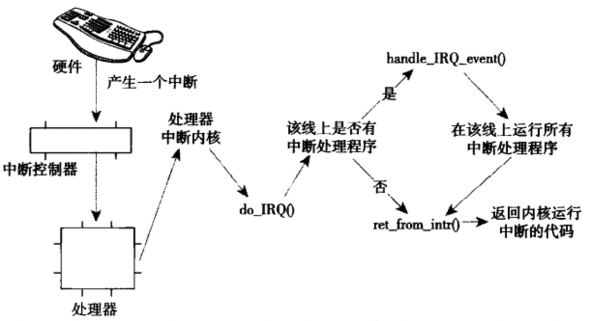
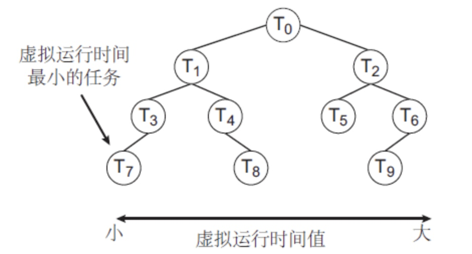
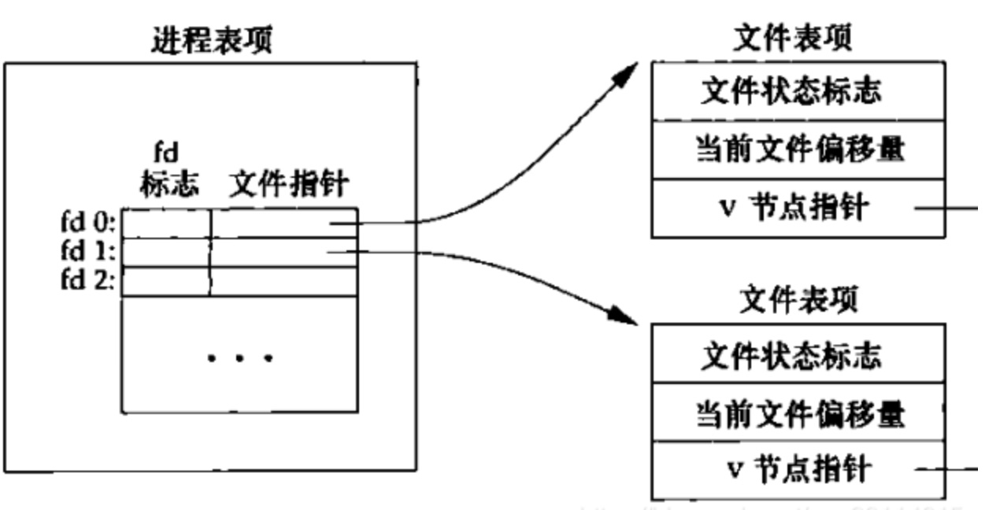
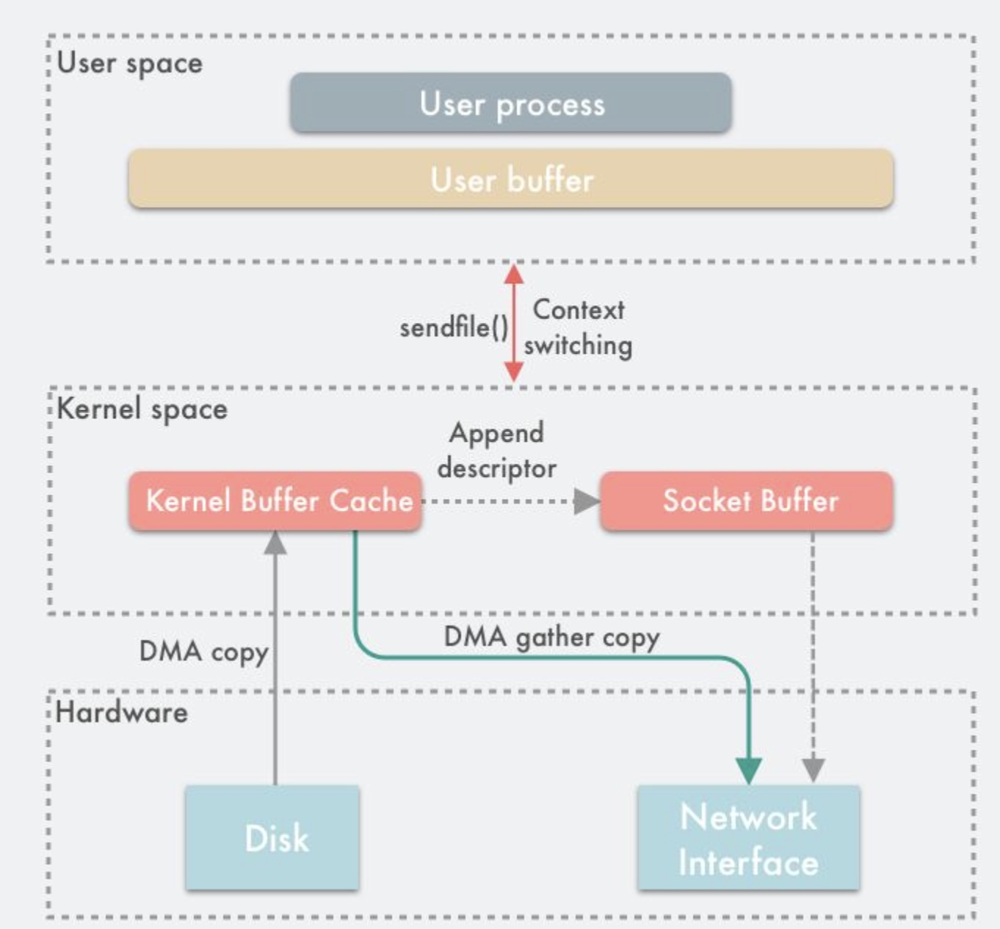

# 【Linux】内核原理

* [【Linux】内核原理](#linux内核原理)
   * [内存管理](#内存管理)
      * [虚拟内存](#虚拟内存)
      * [分段机制](#分段机制)
      * [分页机制](#分页机制)
      * [段页式机制](#段页式机制)
      * [内存分配管理](#内存分配管理)
      * [虚拟地址空间划分](#虚拟地址空间划分)
      * [物理内存分区](#物理内存分区)
      * [内核空间分布](#内核空间分布)
      * [用户空间分布](#用户空间分布)
      * [大页内存](#大页内存)
   * [进程管理](#进程管理)
      * [进程的组成](#进程的组成)
      * [进程的状态](#进程的状态)
      * [进程的创建](#进程的创建)
      * [线程的区别](#线程的区别)
      * [内核线程](#内核线程)
      * [进程的终止](#进程的终止)
      * [用户态和内核态](#用户态和内核态)
      * [上下文切换](#上下文切换)
      * [进程间通信](#进程间通信)
      * [中断和信号](#中断和信号)
      * [优先级与调度](#优先级与调度)
   * [IO 管理](#io-管理)
      * [存储器结构](#存储器结构)
      * [磁盘 IO](#磁盘-io)
      * [网络 IO](#网络-io)
      * [数据传输模式](#数据传输模式)
      * [零拷贝](#零拷贝)
      * [IO 模型](#io-模型)
      * [IO 多路复用](#io-多路复用)

`如无特殊标注，操作系统是 X86_32 CPU 架构下的 Linux`

[内核原理系列参考文章](https://blog.acean.vip/post/linux-kernel/gai-shu-linuxnei-he-san-jia-ma-che-zhi-jin-cheng-guan-li#toc_7)

## 内存管理
**内存（Memory）** 用于暂存 CPU 中的运算数据，是 CPU 与硬盘等外存的沟通桥梁，所有程序的运行都需要在内存中

内存物理设备又被称为 **RAM**，即 **随机访问内存（Random Access Memory）**，可被 CPU 直接高速地随机读写，一旦断电所存储的数据将丢失

内存中的每个存储单元都具有一个用于被识别的 **地址（Address）**，这些地址的组合称为 **地址空间（Address Space）**，或 **内存空间（Memory Space）**

CPU 所能访问最大的内存空间，取决于其程序计数器的位数，比如 32 位 CPU 能处理最大的内存地址是 $2^{32}$，能访问最大的内存空间也为 $2^{32}$ Bit，即 4 GB，这个值也被称为 CPU 的寻址能力或寻址空间

> **程序计数器（Process Counter，PC）** 是 CPU 中的寄存器，用于存放下一条指令所在的内存地址。每当一条指令的内存地址被获取后，PC 的存储地址会自动加 1，给出下一条指令的内存地址


当 CPU 直接访问物理内存时，CPU 寻址空间和物理内存会由于大小不匹配造成资源浪费：
- 若前者大于后者：一部分 CPU 寻址空间没有对应的内存存储单元，浪费了 CPU 的寻址能力
- 若后者大于前者：一部分内存空间无法被 CPU 访问，浪费了物理内存的空间

> CPU 寻址空间能访问到物理内存的空间大小，还受限于总线地址的位数大小

### 虚拟内存
**虚拟内存（Virtual Memory）** 是一种地址映射技术，可以为每个进程提供一个 **独立、连续、一致** 的 **虚拟地址空间（Virtual Address Space）**，大多数操作系统包括 Linux，都基于虚拟内存技术来进行内存管理


在虚拟内存技术中，实际的内存又被称为 **主存（Main Memory）**，或者 **物理内存（Physical Memory）**，其地址空间被称为 **物理地址空间（Physical Address Space）**

虚拟地址空间被 CPU 和进程所使用，物理地址空间被 DMA 等外部硬件设备通过地址总线所使用。当进程使用虚拟地址来访问内存空间时，CPU 和操作系统会合作完成地址翻译，将虚拟地址映射为合适的物理地址，最终访问到物理内存


> MMU：是 CPU 中负责地址翻译的内存管理单元，通过访问操作系统所维护的映射表来完成地址翻译

通过虚拟内存技术，还可以使用辅存中划分出的 **交换分区（Swap）** 来作为主存的扩展，此时物理地址空间只有活动数据保存在主存中，其他非活动数据暂存在辅存中。MMU 根据 CPU 的访问需要和操作系统所维护的映射表，在主存和辅存之间进行数据交换，这个过程称为 **内存交换**


> 在内存交换时，数据从主存复制到辅存的过程被称为 **换出（Swap Out）**，而数据从辅存读取到主存的过程被称为 **换入（Swap Out）**

对比直接使用物理内存，虚拟内存技术的优势有：
- 每个进程具有独立、连续、一致的地址空间，以及不同的地址映射关系，解决了进程并发时的内存隔离和管理问题

- 每个进程可以使用大于物理内存的地址空间，既提高了物理内存的使用效率，也解决了物理内存不足的问题

- 允许不同的虚拟地址映射为相同的物理地址，在程序之间实现了有效而安全的通信方式

### 分段机制
CPU 和进程所能使用的虚拟地址空间大小，取决于 CPU 的寻址空间大小，在早期 CPU 的寻址空间小于物理地址空间时，为了能使虚拟地址空间能映射到每个物理存储单元，因此引入 **分段机制（Segmentation）**，并在 CPU 产生了一个专用于分段的段寄存器

通过 **段基地址 + 段内偏移** 来组成一个 **逻辑地址**，其中段基地址保存在段寄存器，段内偏移和原来的虚拟地址一样保存在 PC，使虚拟地址空间和物理地址空间在逻辑上也被分成了固定大小的段，且段内的物理地址是连续的，而切换段需要改变段寄存器的值

逻辑地址先通过 MMU 的分段单元处理，转化为位数等于物理地址的 **线性地址（虚拟地址）**，再进行地址翻译得到物理地址，从而增大了 CPU 的寻址能力


比如段寄存器是 16 位，PC 位数是 16 位，但物理地址是 20 位。计算时先将段寄存器中的段基地址向左移 4 位，在和PC 中的段内偏移相加，就得到 20 位的线性地址了，此时虚拟地址空间就在逻辑上被分成多个大小为 $2^4$ Bit 的段了

以上段基地址直接保存在段寄存器的分段机制，被称为 **真实模式（Real Mode）**，因为它既没有对段内偏移进行限制，也没有判断当前 CPU 的访问权限，后续则产生了具有这些机制的 **保护模式（Protected Mode）**

保护模式中，操作系统维护了一张 **全局描述符表（GDT）** 以及若干张保存在在 GDT 中的 **局部描述符表（LDT）**，用于保存所有的段描述符


段描述符的组成包括了段基地址、段界限和属性。段界限是对段内偏移的限制，属性则是和段权限相关的信息

而段寄存器中保存的则是 **选择器（Selector）**，通过选择器的索引号和 T1 来找到对应的段描述符，然后根据 RPL 和段属性来判断访问权限，RPL 一共分为 0～3 四层，0 为最高特权级，3 为最低特权级


逻辑地址计算得到线性地址（虚拟地址），在操作系统和 MMU 的合作下，翻译为物理地址的过程如下：


通过段描述符中的段界限值，虚拟地址空间和物理地址空间可以在逻辑上被分成不同大小的段

分段机制虽然解决了虚拟地址空间不足的问题，但由于每个段的空间较大，内存分配和内存交换都以段为单位，这存在两个主要缺陷：


- 内存分配容易产生内存碎片，且内存段中存在内部浪费
- 内存交换的效率低，需要进行较大空间的换入还出

> 内存碎片产生后最终需要通过内存交换机制来解决

### 分页机制
为了解决分段机制中由于段空间较大存在的问题，因此引入 **分页机制（Paging）**，使虚拟地址空间和物理地址空间在逻辑上分成了固定且更小的页，页内的物理地址是连续的

和分段机制类似，**逻辑地址（虚拟地址）** 由 **页号 + 页内偏移** 所组成，但不同的是，由于 CPU 的 PC 位数随着技术发展，其寻址能力也足够映射到物理空间了，因此页号和页内偏移是直接通过切分原来的虚拟地址得到的，没有用到额外的寄存器

由于逻辑地址的位数大于等于物理地址的位数，因此逻辑地址可以直接通过 MMU 的分页单元，根据操作系统维护的页表进行地址翻译，得到物理地址

在访问物理地址前，MMU 会先通过 **请求分页机制** 来请求主存中的内存页，若该内存页不存在，则会产生 **缺页异常** 从而触发内存交换，从辅存换入该物理页

逻辑地址（虚拟地址）在操作系统和 MMU 的合作下，翻译为物理地址的过程如下：


这时内存分配和内存交换是以页为单位的，由于每个页的空间较小，比如在 Linux 中默认为 4K Byte，因此所产生的内存碎片更少，内存交换的效率也更高

虽然页对比段的空间更小，但虚拟页对应物理页所需要的页映射关系则更复杂了，这些关系被保存在操作系统所维护的页表中，意味着页表所需要的映射条目更多了

并且操作系统存在多个进程，若要将所有进程的页映射关系保存起来，则意味着页表需要占用非常庞大的内存空间。为了解决这个问题，因此采用了名为 **多级页表（Multi-Level Page Table）** 的解决方案

在多级页表方案中：把一级页表分为 1024 个二级页表，每个二级页表中包含 1024 个页表项，形成二级分页，此外三级分页、四级分页也如此类推


这时只有最后一级页表保存映射关系，其他的上级页表可以视为目录，保存下一级页表（目录）的索引

页表分级之后虽然总体占用的内存空间更大了，但可以根据使用情况来创建下一级页表，比如某个一级页表的页表项没有被使用到，就不需要立即创建该页表项对应的二级页表了，而是在需要时才创建

对于大多数进程来说，不会使用到所有虚拟地址空间，因此页表总体不一定要覆盖所有虚拟地址空间，节约了很多的内存空间

对于 64 位的 Linux 系统，其虚拟地址空间更大了，因此页表通过四级分页来实现：


各级页表从上到下的命名分别为：
- 全局页目录项 PGD（Page Global Directory）
- 上层页目录项 PUD（Page Upper Directory）
- 中间页目录项 PMD（Page Middle Directory）
- 页表项 PTE（Page Table Entry）

多级页表虽然解决了内存空间占有的问题，但是地址翻译的速度因此也降低了。进程的内存访问存在局部性，即在一段时间内，进程的执行仅限于程序中的某一部分，对应的内存访问也仅限于某一区域


根据内存访问的局部性，在 CPU 中加入访问速度更快的 Cache 硬件，用于存储最常访问的页表项，这个 Cache 就是 **TLB（Translation Lookaside Buffer）**，也被称为快表或页表缓存


CPU 引入了 TLB 后，MMU 的地址翻译过程会先查询 TLB，若没命中才继续按常规去查询由操作系统维护的页表。由于 TLB 的命中率很高，因此大大提高了地址翻译的速度

### 段页式机制
内存的分段和分页机制并不对立的，因此可以组合起来使用，组合起来后称为 **段页式机制**

段页式机制的实现：
- 先通过分段机制将虚拟内存空间划分为多个不同大小的段，段基信息保存在段寄存器
- 接着每个段划分为多个固定大小的页，段内偏移则切分为段内页号和页偏移内，保存在原来的虚拟地址中
- 此时逻辑地址就由 **段号 + 段内页号 + 页内位移** 三部分组成


整个虚拟地址空间对应一张段表，每个段表项又对应一张页表，段表项中保存页表的起始地址，页表项中保存物理页的页号

包含段号（段选择器）的逻辑地址，先通过 MMU 的分段单元处理，转化 **线性地址（虚拟地址）**，再通过 MMU 的分页单元处理，翻译为物理地址


随着技术发展，CPU 的 PC 位数已经达到 64 位，也具备了足够的寻址能力，但由于向前兼容，仍然保留了 16 Bit 的段寄存器

因此 Linux 内存管理主要采用的是分页机制，但同时也不可避免地涉及了段机制。此时 Linux 采用了一个方式避开了段机制，将所有段的段基地址都设置为 0，只用段内偏移来访问整个虚拟内存空间，这种方式称为 **扁平模式（Flat Mode）**

因此 Linux 中每个段的地址都是整个虚拟地址空间，即所有段的起始地址都是一样的。这意味着，Linux 本身和其进程所使用的地址空间就是线性地址空间，相当于屏蔽了 CPU 的逻辑地址概念，段机制只用来进行访问控制和内存保护

每个进程的页表存储在其 PCB 的 `mm_struct` 结构体中，既包含了内核空间的页表项，也包含了用户空间的页表项，即描述了进程整个虚拟地址空间的内存映射关系。而内核空间的页表项是内核初始化时生成好的，存放在 `swapper_pg_dir` 地址中，全局只有一份。内核在进程创建时，将这份内核空间的页表项复制到进程的页表中，所以说内核空间是所有进程共享的，而对于内核线程来说，由于一直工作在内核态，因此只拥有内核空间的页表项

进程中内核空间的页表项更新是异步进行的，内核使用 `vmalloc` 系统调用分配内存时，就已经分配了物理内存，并做了映射和建立了页表项，但这些页表项仅写入了 `swapper_pg_dir` 地址中，并不会实时更新到进程 PCB 的页表中。当进程在内核态首次访问相关内核空间地址时，才会触发 **缺页异常 （Page Fault）**，在异常处理流程中完成页表中对应内核空间的页表项更新

### 内存分配管理
由于内存分配时操作系统会尽量保证物理页的连续，因此分页机制仍会产生不少内存碎片。这些内存碎片可以分为两种：
- **外部碎片**：夹杂在已分配页间少部分的页，不能满足分配需求
- **内部碎片**：页内存中没有完全被使用的部分

外部碎片虽然可以通过修改页映射关系避免，但频繁地修改页表和快表会影响内存分配的效率。于是 Linux 引入了 **伙伴系统（Buddy System）** 算法，来优化内存分配过程产生的外部碎片问题

在伙伴系统中，对于每个物理内存分区，会将它所有的空闲页分为 `MAX_ORDER` 个组。n 分组表示下标为 n 的分组，记录了包含 2^n 个连续页的页块，并以双向链表的形式组织起来

`MAX_ORDER` 的默认值为 11，即当页大小为 4KB 时，分组所记录的最大页块包含 2^10 个连续页，对应 4MB 的连续物理内存


分配规则：当需要分配包含 m 个页的内存时，找到 2^n >= m 的 n 分组并获取其中的页块，然后将多余的 2^n - m 个页拆分为 $\sum\limits_{i=0}^{n-1}2^i$，存回对应的分组中。若 n 分组的页块为空，则从 n+1 分组中获取取页块，并把剩余页按上述拆分后存回对应的分组中

> 比如通过内核申请 11 KB 的内存，既需要分配包含 3 个页的内存。先从 5 分组中取出包含 4 个页的页块，再拆分为包含 3 个 和 1 个内存页的页块，其中 3 个的分配给申请方，1 个的存到 0 分组
>
> 若 5 分组中没有页块，则从 6 分组获取包含 8 个页的页块，拆分为包含 4 个、3 个 和 1 个页的页块，3 个的分配给申请方，4 个的存到 5 分组，1 个的存到 0 分组

释放规则：当包含 m 个连续页的内存释放时，将这些页拆分为 $\sum\limits_{i=0}^{n}2^i$ 且 2^n <= m，放回对应的分组中，若发现存在两个包含 2^i 个页的连续页块，则将其合并后放回 i+1 分租

> 比如包含 3 个连续页的内存释放时，拆分为包含 2 个 和 1 个页的页块，2 个的存到 1 分组，1 个的存到 0 分组，此时若发现存在包含 1 个内存页的连续页块，则合并为包含 4 个页的页块，最后存入 2 分组

由于伙伴系统是按内存分区（内存域）来管理的，因此不同内存分区的分配优先级也各不相同。所以内核维护了如下的内存分配备用列表，列表中的域按珍稀程度排序，并优先分配不稀有的内存域。


备用列表中还会考虑 NUMA 下的其他节点的内存分区，最终综合的优先级为：`本地内存 > 其他节点内存` 且 `HIGH_MEM > NORMAL > DMA`

> NUMA（Non-Uniform Memory Access) 非统一内存访问，是一种为多核处理器设计的内存架构，在此架构中存在和处理器相对近的内存，称为本地内存，而处理器访问本地内存的速度比非本地内存快很多

随着内核升级，每个分组根据页的类型，包含 `MIGRATE_TYPES` 个双向链表，页的类型分别为：
- **不可移动页（Non-movable pages）**：在内存当中有固定的位置，不能移动。内核核心部分分配的内存大多属于这种类型
- **可回收页（Reclaimable pages）**：不能直接移动，但可以删除后再从其他地方重新生成。如映射自文件的数据，这类页内核有专门的回收处理
- **可移动页（Movable pages）**:可随意移动，如用户空间所用到的页。这类页通过页表来映射，移动后对页表项做出相应的更新即可
- 其他如 PCPTYPES、RESERVE、ISOLATE、TYPES

根据页的类型来区分多个页块链表，相当于再为它们划分了物理区域，防止比如已分配的不可移动页插在了多个可回收页之间，导致可回收页也无法分配大块的连续内存的现象

比如以下四个灰色的是不可移动页：


根据类型区分多个页块链表后，相当于划分了不同类型页的物理区域：


而对于内部碎片的优化，Linux 则引入了 **Slab 分配器** 机制，作为伙伴系统算法的补充

Slab 分配器机制利用了内存缓存池的思想，采用 **Cache（内核高速缓存）** 来完成较小的内核对象的分配。每种内核的数据结构如 `unix_sock`、`file_struct` 都有一个对应 Cache，每个 Cache 由一个或多个 Slab 组成，每个 Slab 由一个或多个连续的物理页组成

<br>


Cache 初始化时，若干标记为 `free` 的内核对象被分配到 Cache 内的 Slab 中。当需要申请创建一个内核对象时，可以从 Cache 上分配任何标记为 `free` 的内核对象以满足申请，并将该分配出去的内核对象标记为 `used`

Cache 在内核中的数据结构是 `kmem_cache`，其中包含三种 Slab 链表，分为表示三种状态的 Slab，分别是 **完全用尽（`slabs_full`)**、**部分空闲（`slabs_partial`）**、**空闲（`slabs_empty`)**，并且部分空闲链表中的 Slab，其分配优先级大于空闲链表中的 Slab


为了更好地利用 CPU 缓存，Cache 还会为每个 CPU 保存一个 **缓存列表（`array_cache`）**，并按照后进先出的顺序进行分配，比如刚释放的内核对象仍在 CPU 高速缓冲中，则会尽快再次分配它，只有当对应 CPU 的释放列表为空时，才会从部分分配或未分配列表中获取 Slab 并分配内核对象

每个 Slab 相当于按对应的内核对象大小来分块，并以分块为单位进行内存分配，同时这些内核对象可以在 Slab 中预先创建，对象释放后能回收并复用分配给其他创建申请。这既避免了内部碎片的产生，又提高了创建请求的效率

### 虚拟地址空间划分
虚拟地址空间的大小取决于 CPU 的寻址能力，Linux 又将虚拟地址空间划分为了两部分，高位部分为内核空间，低位部分为用户空间


比如在 32 位的 Linux 中，将高位的 1GB 地址空间（从虚拟地址 0xC0000000 到 0xFFFFFFFF ）划分为内核空间，而低位的 3GB 地址空间（从虚拟地址0x00000000到0xBFFFFFFF）划分为用户空间，而对于 64 位的操作系统，即使存在未定义的地址空间，以上两个空间也非常大了


内核是操作系统的核心代码，运行时独立于用户进程之外。当进程处于用户态时可以使用特权指令以及访问底层硬件设备，内核空间是只允许内核访问的地址空间，这保证了内核的运行安全，以免受到用户进程的影响

不同进程的内核空间所映射的物理地址空间是相同的，而用户空间所映射的物理地址空间是不同的，也就是对于不同的进程来说， **其内核空间是共享的，用户空间是独立的**

内核空间中存放的是内核的代码、数据和堆栈信息，而用户空间中存放的是用户程序的代码、数据和堆栈信息

### 物理内存分区
由于 Linux 简化了分段机制，虚拟地址等同于线形地址，因此 32 位的内核空间最多只能访问到 1G 的物理地址空间

为了让内核空间能访问到所有物理地址内存，则通过物理内存的 **高端内存区** 和内核空间的 **高端内存线性地址空间** 配合来实现

> 用户空间没有这种机制，因此 32 位的用户空间最多只能访问到 3G 的物理地址空间
> 
> 对于 64 位的内核空间，由于地址空间远大于可安装的物理地址空间，因此不需要划分高端内存区。只有当物理地址空间大于内核空间的直接映射区时，才需要划分高端内存区

Linux 将物理内存分为以下三个管理区：



- **ZONE_DMA**：DMA 内存区，包含0MB ~ 16MB 之间的内存页，供老式基于 ISA 的设备通过 DMA 使用，直接被映射到内核空间

- **ZONE_NORMAL**：常规内存区，包含 16MB ~ 896MB 之间的内存页，直接被映射到内核空间

- **ZONE_HIGHMEM**：高端内存区，包含 896MB 以上的内存页，不被直接映射，通过内核空间的永久映射和临时映射来访问这些内存页

### 内核空间分布
内核空间存储了内核镜像、物理页表、驱动程序等数据，32 位的内核空间为了实现对高端内存的映射，也进行了如下细分区域：


- **直接映射区（Direct Memory Region）**：直接与物理地址空间的前 896MB 进行映射，即这部分物理地址是连续的。内核空间的虚拟地址和所对应的物理地址之间相差一个偏移量 `PAGE_OFFSET = 0xC0000000`

- **高端内存线性地址空间**：最高位的 128M 地址空间，划分成以下三个高端内存映射区，实现对所有物理地址空间进行映射
    - **动态内存映射区（Vmalloc Region）**： 该区域由内核函数 `vmalloc` 来分配，特点是线性空间连续，但是对应的物理地址空间不一定连续。`vmalloc` 分配的线性地址所对应的物理页可能处于高端内存，可能处于非高端内存

    - **永久内存映射区（Persistent Kernel Mapping Region）**：该区域可访问高端内存。访问方法是使用  `alloc_page` 分配高端内存页或者使用 `kmap` 将分配到的高端内存映射到该区域

    - **固定映射区（Fixing kernel Mapping Region）**：该区域和 4G 的顶端只有 4k 的隔离带，其每个地址项都服务于特定的用途，如 ACPI_BASE 等

> 对于 64 位的 Linux，直接映射区近乎为 128T，远大于可安装的物理地址空间，因此即使划分了高端内存线性地址空间也不会使用到

关于内存的分配和映射，这是两个独立的行为，分配使得物理地址空间可被使用，映射使得虚拟地址空间可被访问，进程若要真正使用到物理内存，既需要进行内存分配也需要进行内存映射

理论上来说，内存先进行分配再进行映射是最符合运行安全的，但为了性能考虑，内核空间会存在直接映射区来提前完成映射，后续内核使用到物理内存时只需要进行分配即可

### 用户空间分布
用户空间分布是由程序所实现的，C/C++ 程序为了更好地管理用户空间，将其划分了不同功能的程序段。以 32 位的 Linux 为例，其用户空间分布如下：


从低位到高位的程序段包括：
- **程序文件段（text）**：存储程序代码转化得到的 CPU 二进制执行指令，是可共享且只读的，执行同一程序的多个进程，在内存中也只需有一个副本

- **数据段（data）**：存储已初始化的静态变量，内核在程序执行前会读入程序为此段中的数据赋值

- **BSS 段（bss）**：存储未初始化的静态变量，内核在程序执行前会将此段中的数据初始化为 0 或空指针

- **堆段（heap）**：可动态向上扩张地址空间，用于访问通过 `malloc()`、`new()` 系统调用动态分配的内存，这些内存通过 `free()`、`delete()` 系统调用进行回收，操作方式类似数据结构中的链表

- **空白段**：用于扩张堆段或栈段，以及使用 `mmap()` 系统调用时，用于进行内存映射的地址空间

- **栈段（stack）**：可通过参数调整其固定大小，在 Linux 中一般为 8 MB，可根据固定大小向下扩张地址空间，存储局部变量、函数调用时的参数和返回值，作用域执行结束后会被立即回收，操作方式类似数据结构中的栈，先进后出

### 大页内存
在分页机制中，若页设置得太大，容易产生内存碎片以及降低内存交换的效率；若页设置得太小，则会产生大量的页表项，既降低了地址翻译得速度，也浪费了存放页表的空间

随着物理内存空间的提升，且在某个进程需要独占大部分内存且对性能要求非常苛刻且的场景下，需要将该进程使用的页设置得非常的大，这样的页被称之为 **大页（Huge Page）**

启用大页能够提高进程性能的原因：
- 减少页表条目，加快地址翻译的速度
- 提升快表的命中率，更少进行常规的地址翻译
- 无需交内存换，不存在页的换入换出问题

> 一般情况下，启用大页和禁止内存交换会被共同设置，否则大容量的内存交换会让辅存的读写成为性能瓶颈

启用大页的缺点：
- 大页会在系统启动时，直接分配并保留对应大小的内存区域
- 大页在在系统启动后，若没有管理员的介入，不会自动释放和改变

Linux 采用了 **hugetlb 和 hugetlbfs** 来实现对大页的支持，其中，其中 hugetlb 是记录在 TLB 中的条目并指向物理大页 hugepages，而 hugetlbfs 则是一个内存文件系统，用于使得进程可以根据需要灵活地选择虚拟内存空间的页大小，而不会全局性地指定


Linux 可以通过 hugetlb 来访问已分配的 hugepages，再将 hugepages 挂载为 hugetlbfs 内存文件系统。进程会使用 `mmap()` 系统调用把大页映射到用户态的虚拟地址空间，然后就可以正常使用了

## 进程管理
**进程（Process）** 是程序代码的运行实体，是操作系统进行资源分配和调度的基本单位，每个进程都占有一个独立的、连续的、一致的虚拟地址空间，其中包括共享的内核空间和独立的用户空间

**线程（Thread）** 是进程中单一顺序的控制流，是进程中的实际执行单元，是操作系统进行 CPU 运算和调度的基本单位。进程可看作线程的容器，一个进程包含至少一个线程，并且同一进程内的线程可以共享资源


Linux 的进程管理设计基于两个独立的概念：**资源分组和运算执行**，而线程的引入即是对这两个概念的区分，进程用于把资源集中到一起，而线程则用于在 CPU 上被调度执行

### 进程的组成
进程在虚拟内存中的实体组成分为两个部分，分别是 **用户空间中的各个程序段** 和 **内核空间中的程序控制块 PCB（Process Control Block）和内核栈（Kernel Stack）**

PCB 在 Linux 上被实现为 `task_struct` 结构体，其空间大小与操作系统的位数有关，在 32 位系统中大概为 1.7K Byte，用于描述进程的各种信息以及作为唯一标识，其主要构成如下：


- **描述信息**：用于标识和描述进程，如 PID（进程 ID）、进程名、所属用户、所属组、父进程、兄弟进程等。其中 PID 总是实时唯一的非负整数，并且会被延迟复用

- **控制信息**：用于调度和管理进程，进程状态、优先级、调度策略、计时信息、信号和管道这些进程通信信息等

- **资源信息**：用于保存除 CPU 外的进程资源，如虚拟地址空间 `mm_struct`、文件系统 `fs_struct`、打开的文件 `files_struct`、I/O 设备信息等

- **上下文信息**：即 CPU 现场相关的结构，用于进程的挂起和恢复执行，如程序计数器、寄存器值、栈数据等

对于 PCB 的组织方式，Linux 基于以空间换时间的思路，使用了以下三种数据结构：
- **双向循环链表**
  
  
  
  - **任务队列**：由所有进程的 PCB 组成，按照进程的创建顺序排列，链表的头尾都是 PID 为 0 的进程，用于遍历所有进程
  - **运行队列**：由正在执行或者可执行的进程的 PCB 组成，便于内核快速寻找可调度的进程
  - **等待队列**：由阻塞或暂定的进程的 PCB 组成，便于内核在进程等待的条件满足时快速寻找可唤醒的进程

- **树**

  

  根据进程之间的亲属关系，通过指针互指形成的 PCB 树形结构，用于按亲属关系查找进程

- **哈希表**

  
  
  将 PCB 的 PID 作为哈希键（Hash Key），使得可通过 PID 快速检索进程。并使用链地址法来处理哈希冲突，即哈希表项是由 PID 哈希冲突的 PCB 组成的双向链表

进程处于用户态时，使用位于用户空间的栈程序段来存放临时数据，当进程陷入内核态后，切换为使用位于内核空间的内核栈，这个切换时通过改动 CPU 的 **栈指针寄存器（Stack Pointer，SP）** 中的值完成的

在 Linux 2.6 之前，`task_struct` 结构体被存储于每个进程的内核栈的底部；在 Linux 2.6 之后，`thread_info` 结构体存储于内核栈的底部，而 `task_struct` 被 `thread_info` 中的 `task` 指针所指向，同时 `task_struct` 中的 `stack` 指针也指向内核栈的低位地址，如下图所示：


当进程被创建时，内核会通过伙伴系统分配内存栈，通常为两个连续的物理页，总大小为 8K Byte，其中内核栈的底部用于存储 `thread_info` 结构体，约 1K Byte，栈数据从高位地址向下增长，约 7K Byte，当内存栈写入新数据时，CPU 的 SP 值会递减。然后内核通过内核高速 Cacha 分配 `task_struct` 结构体，并使其和内核栈内部的指针互相指向

`thread_info` 结构体保存了 PCB 中需要频繁访问和快速访问的字段，并且内核提供了 `current` 宏定义，依赖 `thread_info` 结构体来获取当前 CPU 上所运行进程的 PCB，宏定义如下：

``` c
// #define 标识符 批处理代码
#define get_current() (current_thread_info()->task)
#define current get_current()
```

当进程由于系统调用或触发异常而陷入了内核空间时，CPU 仍处于进程的上下文，即 CPU 栈寄存器值为进程内核栈中的地址，此时 `current` 宏是有效的。若因中断处理而陷入了内核空间时，CPU 则处于中断上下文，从而 `current` 宏也无效了

### 进程的状态
在通常的操作系统设计中，用于管理进程状态转化的传统模型有以下几种：
- **三态模型**：经典简单的模型

  

  - **就绪状态（Ready）**：进程已获得除 CPU 外的所需资源，只是在等待分配 CPU 资源，只要分配了 CPU 进程就可执行
  
  - **运行状态（Running）**：进程占用 CPU 资源，处于此状态的进程数量小于或等于 CPU 核数
  
  - **阻塞状态（Blocked）**：进程等待某种条件，如 I/O 操作或进程同步，在条件满足前无法继续执行，该事件发生前即使把 CPU 资源分配给该进程，该进程也无法执行

- **五态模型**：在三态模型基础上，引入新建和终止两个状态

  

  - **创建状态（New）**：进程刚被创建，正等待系统完成创建进程的所有必要信息，还未被允许调度 CPU 资源

  - **终止状态（Exit）**：进程已被结束运行，回收除进 PCB 之外的其他资源，并等待其他进程从 PCB 中收集有关信息

- **七态模型**：在五态模型基础上，考虑到进程的挂起和恢复操作，引入了静止就绪状态和静止阻塞状态，对应地将原本的就绪状态和阻塞状态称为活跃就绪状态和和活跃阻塞状态

  

  - **静止就绪状态（Suspended Ready）**：进程被调离出主存，即位于辅存时的就绪状态，不能被直接分配 CPU 资源，只有当主存中没有绪态进程，或者是挂起的就绪态进程具有更高的优先级，内核才会把静止就绪状态的进程调回主存并转化为活跃就绪状态

  - **静止阻塞状态（Suspended Blocked）**：进程被调离出主存，即位于辅存时的阻塞状态，一旦等待的条件满足便转化为静止就绪状态

  > 挂起指的是将进程被调离出主存，存储到辅存的操作。除了通过系统调用主动进行挂起和激活，在资源不足的情况下，操作系统也会自动对内存中的进程合理地挂起，当条件允许后，挂起的进程再被操作系统自动恢复到主存

在 Linux 中，参考但不同于传统的进程状态模型，它使用包含六种状态的模型来管理进程状态转化：


| 状态 | 缩写 | 含义 |
| --- | --- | --- |
| **TASK_RUNNING** | **R** | 正在执行或者可执行的进程，即位于运行队列的进程 |
| **TASK_UNINTERRUPTIBLE** | **D** | 不可中断阻塞，通常进程处于 IO 阻塞 |
| **TASK_INTERRUPTIBLE** | **S** | 可中断阻塞，通常进程正在等待某个事件完成 |
| **TASK_STOPPED** 或 **TASK_TRACED** | **T** | 暂停，可能是接收到 SIGSTOP 等信号，也可能是被 `ptrace()` 追踪分析 |
| **EXIT_ZOMBIE**| **Z** | 僵死，进程已终止但是未被其父进程获取信息，并回收其 PCB |
| **EXIT_DEAD** | **X** | 终止，进程即将彻底被销毁 |

Linux 进程状态模型和传统的五态模型的区别：
- 将 Running 状态和 Ready 状态，统一为了 TASK_RUNNING 状态

- 将 Block 状态区分为 TASK_UNINTERRUPTIBLE 状态和 TASK_INTERRUPTIBLE 状态，此处的不可中断，指的是进程不会因响应信号而被唤醒

- 将 Exit 状态区分为 EXIT_ZOMBIE 状态和 EXIT_DEAD 状态，区别是进程的 PCB 是否已被操作系统回收

> 在进程对某些硬件进行交互时（IO 操作），TASK_UNINTERRUPTIBLE 状态能拒绝响应信号，保护该交互过程不被打断，此状态的进程也就无法通过 `kill` 命令杀死，通常来说该状态是非常短暂的

### 进程的创建
在 Linux 中，除了 PID 为 0 的首个进程外，其他进程都不能被凭空创建出来，而是需要复制已存在的进程来创建。进程的复制也存在不同的机制，并对应以下三个系统调用：
- **fork**

  完全复制当前进程的资源来创建一个子进程，子进程有独立的内核栈和 `task_struct` 结构体，而和父进程的区别仅在于 PID、父进程 ID 和统计量，比如挂起的信号
  
  

  为了降低 `fork()` 过程中用户空间的复制开销，内核采用了写时复制的机制：一开始只为子进程拷贝父进程的页表，从而父子进程的用户空间可以共享对应的物理页。当父进程或子进程发起数据修改时，内核才真正分配并复制新的物理页，并更新地址映射关系到其页表中，再完成数据修改。此过程依赖 MMU 来实现，因此在没有 MMU 的平台上，Linux 内核是不支持 `fork()` 系统调用的
  
  
  
  发起一次 `fork()` 系统调用，会在父进程和子进程分别得到一次返回，子进程中的返回值是 0，父进程中的返回值则是所创建子进程的 PID

  一个进程可以拥有多个的子进程，且没有函数可以获取其所有子进程的 PID，但可以通过 `getpid()` 获取自身的 PID，以及调用 `getppid()` 获取父进程的 PID
  
  子进程的程序计数器值也和父进程完全相同，即子进程和父进程都运行到相同的位置，但父子进程哪个更谁执行则取决于操作系统的调度程序
  
  此系统调用所创建的子进程完全独立于父进程，且具有良好的并发性，但是二者之间需要通过专门的通信机制，防止某些资源的竞态冲突

- **vfork**

  共享当前进程的地址空间以及复制其他资源，来创建一个子进程，子进程的数据修改操作同时会影响父进程

  

  发起 `vfork()` 系统调用后，父进程会阻塞直到子进程退出或者调用 `exec()` 系统调用簇，用 `vfork()` 创建的子进程必须显式调用 `exit()` 来推出，否则将不能自动退出

  同样地，发起一次 `vfork()` 系统调用，会在父进程和子进程分别得到一次返回，子进程中的返回值是 0，父进程中的返回值则是所创建子进程的 PID
  
  若子进程被创建后仅仅是为了执行另一个程序，不会对父进程的地址空间有任何引用，对地址空间的复制就显得多余了，此时适合通过 `vfork()` 来创建子进程

- **clone**

  通过 `clone_flags` 参数定义如何从当前进程的复制资源，来创建一个子进程，其系统调用函数较为复杂
  
  ``` c
  // 参数：
  // fn 表示需允许的程序地址
  // child_stack 表示需为子进程分配的内存栈地位地址
  // flags 表示描述如何从父进程复制资源的标识
  // arg 表示传递到子进程程序的参数
  int clone(int (*fn)(void *), void *child_stack, int flags, void *arg);
  ```

  

  发起一次 `clone()` 系统调用，会在父进程和子进程分别得到一次返回，父进程中的返回值是所创建子进程的 PID，而子进程中的返回值，当不指定运行函数时为 0，否则其对应地址会被进行以下处理

  由于 `clone()` 是 C 库封装的系统调用，其对应的内核态系统调用是 `sys_clone()`，后者不支持 `fn` 和 `arg` 参数。因此 `clone()` 通过将 `fn` 指针放在子进程的栈程序段的返回地址，`arg` 指针紧接其后，当 `clone()` 调用返回后，CPU 从栈上取出返回地址，从而实现了执行 `fn(arg)`

在 x86 架构的 Linux 中，`fork()`、`vfork()` 实际上都是通过 `clone()` 系统调用来实现的，只是携带了不同的参数。`clone()` 对应的内核系统调用为 `sys_clone()`，由 `sys_clone()` 去调用 `do_fork()` 函数，最终有选择地完成某些的资源复制工作


进程的复制完成后，通过 `exec()` 系统调用簇把新程序载入进程的用户空间，并从入口点开始运行，除非出现 `exec()` 错误，否则进程的运行永远不会返回到原始的程序中

### 线程的区别
在操作系统的定义上，线程是能共享进程资源的独立执行单元，且能被单独进行 CPU 运算和调度，以及存在独立的 **线程控制块（Thread Control Block，TCB）**，用于描述线程的各种信息以及作为唯一标识

在 Linux 中，线程的 TCB 和进程的 PCB 都被实现为 `task_struct` 结构体，与进程一视同仁为任务的概念，以双向循环链表、树、哈希表三种数据结构进行组织，统一进行 CPU 的运算和调度

一个进程的创建总伴随着一个线程的创建，这个线程被称为这个进程的 **主线程（Main Thread）**，以运行态的角度来看，进程和其主线程是一个概念。另外线程还可由同进程的其他线程通过系统调用来创建，内核会为其分配独立的内核栈、TCB，以及在进程的空白段中分配 **线程栈（Thread Stack）**，用于存储线程运行期间的临时数据


线程栈是通过 `mmap()` 分配的内存空间，位于进程的空白段，默认为 8M Byte。和进程栈（栈程序段）不同的是，线程栈不能动态增长，一旦用完则会内存溢出，线程栈之间原则上是独立的，但由于线程共享进程的地址空间，因此通过虚拟地址互相访问各自的线程栈

> 线程栈也可以使用 `malloc` 系统调用来分配，此情况下则位于进程的堆程序段

在用户态可通过 `pthread_create()` 系统调用来创建线程，实际上是使用 `clone()` 系统调用实现的，通过传入参数使得共享当前进程的所有进程，来创建一个子进程，这样的子进程就是线程了，因此线程在 Linux 中也被称为 **轻量级进程（Light Weight Process，LWP）**


基于操作系统的标准，同一个进程内的多个线程应该有同样的 PID，但 Linux 中的进程（主线程）和线程都有独立的  `task_struct` 结构体，即有独立的 PID。为了实现该标准，Linux 在 `task_struct` 中增加了一个 TGID，并使同一个进程中的所有线程的 TGID 都等于主线程的 PID，且 `getpid()` 函数的返回值设为 TGID


不同命令对于 PID 或 TGID 的使用也不一样，比如直接使用 `top` 时显示的是 TGID，而使用 `top -H` 时显示的是线程真正的 PID

线程和进程在使用上的主要区别如下：
- 多个进程的地址空间是独立的，同一进程的线程共享地址空间，但线程拥有独立的栈

- 多个进程之间必须通过 IPC 方式进行通信，同一进程的线程之间可以直接通信

- 线程的创建基于资源共享，而进程的创建基于资源复制，后者的开销会大很多

- 线程间的上下文切换不涉及资源切换，因此对 CPU Cache 和 TLB 的命中率有所保证，因此比进程间的上下文切换效率高很多

- 线程可以管理同一进程下的其他线程，而进程只能管理其子进程

- 对主线程进行操作可能会影响同一进程下其他的线程，但对父进程的操作不会影响其子进程

### 内核线程
除了上述通过用户态系统调用所创建的 **用户进程（User Process）** 或 **用户线程（User Thread）** 之外，还有一种由内核创建的 **内核线程（Kernel Process）**，由于 Linux 不区分进程和线程，因此也称其为 **内核进程（Kernel Process）**

内核线程会周期性被内核唤醒和调度，主要用于实现系统后台操作，如页面对换，刷新磁盘缓存，网络连接等操作系统任务。其和用户线程主要的相同点如下：
- 都由 `do_fork()` 内核函数所创建
- 具有独立的`task_struct` 结构体和内核栈
- 统一且公平地被内核进行 CPU 运算和调度

而主要的不同点如下：
- 内核线程只运行在内核态，而用户线程一般运行在用户态，需要通过上下文切换才能陷入内核态
- 内核线程仅拥有内核空间，而用户线程不管处于用户态还是内核态，都拥有完整的虚拟地址空间

Linux 中最典型的几个专用的内核线程：
- **0 号进程**

  被创建的第一个进程，也是唯一一个被内核直接创建的进程，不同于其他的进程，其对应的数据结构几乎都静态定义的
  
  
  
  0 号进程先完成了部分的内核初始化，然后在 `rest_init()` 函数中通过 `kernel_thread()` 系统调用创建了 1 号进程和 2 号进程，最后循环执行一个 `idle()` 函数演变为 **idle 进程**，或称为 **swapper 进程**，负责进程的调度和交换

- **1 号进程**

  被创建的第二个内核进程，先完成了剩余的内核初始化后，通过 `exec()` 系统调用簇载入 `/sbin/init` 程序，成为用户空间中的 **init 进程**，即首个用户进程
  
  在操作系统关闭之前，init 进程会一直存活，负责创建其他用户进程，以及监测它们的活动，是所有用户进程的父进程
  
- **2 号进程**

  被创建的第三个内核进程，即循环执行一个 `kthread()` 函数的 **kthreadd 进程**，负责管理和调度其他内核线程，是所有内核线程直接或间接的父进程

### 进程的终止
Linux 进程的终止，需要通过系统调用来告知内核，以进行进程的资源释放，包括占用的内存、打开的文件等，相关的系统调用如下：
- `exit()`：根据 PID 终止当前进程，其内核态系统调用为 `sys_exit()`，并通过调用 `do_exit()` 函数实现

- `exit_group()`：根据 TGID 终止当前线程组中的所有进程，其内核态系统调用为 `sys_exit_group()`，并通过调用 `do_group_exit()` 函数实现，其中至少调用一次 `do_exit()` 函数

就 C/C++ 进程而言，对以上系统调用的触发方式，可分为以下几种：
- **主动的正常终止方式**
    - 调用 C 库中的 `exit()` 函数，触发 `exit_group()` 系统调用
    - 调用 C 库中的 `pthread_exit()` 函数，触发 `exit()` 系统调用
    - C 程序 main 函数 return，等同于 C 库中的 `exit()` 函数

- **被动的异常终止方式**
    - 调用C 库中的 `abort()` 函数，向自身发送 SIGABRT 终止信号，触发 `exit()` 系统调用
    - 接收到到各种终止信号，触发 `exit()` 系统调用

Linux 中虽然父进程无法直接获取所有子进程的 PID，但允许获取所有子进程的执行结果，考虑到这个设计的完整性，避免子进程的执行结果还未被父进程获取就被内核销毁掉了。因此内核在回收了进城的其他资源后，会保留其 `task_struct` 结构体以存储进程号、退出状态、运行时间等少量信息，直到父进程发起了与被终止的子进程相关的 `wait()` 系统调用簇后，才释放其 `task_struct` 结构体，彻底销毁该进程

如此一来，这种已经终止但未被父进程通过`wait()` 系统调用簇彻底销毁的进程，就称为 **僵尸进程（ZOMBIE）**，其进程状态为 **僵死（EXIT_ZOMBIE，Z）**。由于系统所能使用的 PID 是有限的，如果产生大量僵尸进程，将因为没有可用的 PID 而导致系统不能产生新的进程，并且会导致内存泄漏

`wait()` 系统调用簇中两个常用的系统调用：
- **wait**

  ``` c
  // status 用于保存被收集子进程退出时的状态，如退出代码、信号等
  pid_t wait(int *status)
  ```

  父进程调用 `wait()` 会一直阻塞，直到找到一个僵死状态的子进程，然后收集该子进程的信息，并释放该子进程的 `task_struct` 结构体以彻底销毁，最后返回该子进程的 PID
  
  若调用的父进程没有子进程，则调用就会失败，此时返回 `-1`，同时 `errno` 被置为 `ECHILD`，`errno` 是记录系统最后一次错误的代码

  如果不在意这些信息，只想彻底销毁子进程，可以设置 `status` 参数为 `NULL`

- **waitpid**

  ``` c
  // pid 表示只关心指定 PID 的子进程
  // status 用于保存被收集子进程退出时的状态，如退出代码、信号等
  // options 可包含 WNOHANG 和 WUNTRACED 两个选项，使用 | 运算符连接
  pid_t waitpid(pid_t pid, int *status, int options)
```

  作用和 `wait()` 完全相同，只是多了两个可传入的参数 `pid` 和 `options`，使得功能更加强大

  `pid` 若为 -1，则表示关心所有子进程；若为 0，则表示关心同一个线程组中的任何子进程；若小于 -1，则取其绝对值

  `options` 若包含 `WNOHANG` 表示非阻塞调用，即调用会立即返回，父进程可以继续执行其它任务，若返回时没有收集到僵死状态的子进程，则返回 0，否则返回子进程的 PID


`wait()` 系统调用簇所得到的 `status` 子进程退出状态，其检测方式有：
```c
// 如果进程子进程正常结束，返回一个非零值
WIFEXITED(status) 

// 如果 WIFEXITED 非零，返回子进程退出码
WEXITSTATUS(status)

// 子进程因为捕获信号而终止，返回非零值
WIFSIGNALED(status) 

// 如果 WIFSIGNALED 非零，返回信号代码
WTERMSIG(status) 

// 如果进程被暂停，返回一个非零值
WIFSTOPPED(status) 

// 如果 WIFSTOPPED 非零，返回信号代码
WSTOPSIG(status) 
```

为了避免过多的僵尸进程产生，父进程需要阻塞或轮询进行子进程的 `wait()` 操作，这个对于程序实现非常复杂。子进程在终止时，会给父进程发送一个 `SIGCHLD` 信号，父进程对该信号的默认处理动作是忽略。为了简化父进程的程序实现，可以通过重自定义 `SIGCHLD` 信号的处理函数，在信号处理函数中调用 `wait()` 销毁子进程即可

事实上还有一个不产生僵尸进程的方法，父进程通过 `sigaction()` 系统调用将 `SIGCHLD` 的处理动作置为 `SIG_IGN`，这样 `fork()` 出来的子进程在终止时会自动彻底销毁，不会成为僵尸进程，也不会通知父进程

如果父进程在其子进程终止之前先终止了，那么这些子进程将会成为 **孤儿进程**，此时 Linux 会通过 **托孤机制**，为这些进程找到一个新的父进程


在 Linux 3.4 之前，内核会将这些孤儿进程交给 **init 进程**，由它完成这些进程的退出状态收集和彻底销毁，init 进程会循环通过 `wait()` 系统调用簇，完成僵尸进程的销毁，不关心子进程具体的退出状态

而在 Linux 3.4 之后，用户进程可以把自己声明为 **subreaper 进程**，而内核会将这些孤儿进程交给 subreaper 进程，此时 subreaper 进程在完成僵尸进程的销毁之余，还自定义对于退出状态的处理方式

因此要消灭系统中大量的僵尸进程，只需要将其父进程杀死，此时僵尸进程就会变成孤儿进程，从而被 init 进程或 subreaper 进程所收养，从而释放掉这些僵尸进程所占有的内存空间，彻底销毁僵尸进程

### 用户态和内核态
在所有的 CPU 指令里，存在一些非常危险的指令，比如清内存、设置时钟等，若错用将会导致系统崩溃。为了安全起见，CPU 划分了不同的 **执行级别**，表示不同程度的特权，用来执行不同危险程度的 CPU 指令

Intel x86 CPU 便划分了四种执行级别，特权从高到低分别是 Ring0 ~ Ring3，而 Linux 只使用了其中的 Ring0 和 Ring3，分别用来表示 **内核态** 和 **用户态**，仅内核态能执行的 CPU 指令称为 **特权指令**，用户态也能执行的 CPU 指令称为 **非特权指令**，如下：


应用程序的执行依托于内核提供的硬件资源，包括 CPU、内存、IO 设备等，而 Linux 体系架构则为在应用程序和内核之间架起了桥梁，如下：


- **内核（Kernel）**：操作系统的核心，真正进行硬件设备管理的程序，属于内核态的活动区域

- **系统调用（System Call）**：内核为用户程序提供访问的接口，是内核的最小功能单位，但跨平台的可移植性差，属于用户态的活动区域

- **公共函数库（Libs）**：对系统调用进行统一封装后的 C 函数库，为了提供跨平台的可移植性，属于用户态的活动区域

- **Shell**：可编程的命令行解释器，可连接程序间的协同工作，并提供用户交互，属于用户态的活动区域

- **用户程序（Application）**：在操作系统上安装的应用程序，属于用户态的活动区域

以上的分层只有内核属于内核态的活动区域，其他都属于用户态的活动区域。对于一个进程来说，用户态和内核态的区别：

- 当一个进程在运行用户程序的代码时，则称其处于用户运行态，即用户态。当进程处于用户态时，只能访问受限的内存空间，使用位于用户空间的栈程序段来保存临时数据，只能执行非特权指令（特权等级 Ring 3），不能直接访问内存等硬件资源

- 当一个进程在运行内核的代码时，则称其处于内核运行态，即内核态。当进程处于内核态时，使用位于内核空间的内核栈来保存临时数据，能够执行特权指令（特权等级 Ring 0），可以直接访问所有硬件资源

用户进程从用户态切换到内核态的方式如下：
- **系统调用（Trap）**：应用程序的主动操作，陷入内核态，并由内核完成对应的操作，之后返回用户程序，切换回用户态

- **异常（Exception）**：被动的操作，且用户进程无法预测其发生的时机。当用户进程在运行期间发生了异常，而异常会触发软中断，使得从当前运行进程切换到处理此异常的内核相关程序中，即切换到了内核态

- **中断（Interrupt）**：被动的操作，当硬件设备完成用户请求的操作后，会向 CPU 发出相应的中断请求，此时 CPU 会暂停执行下一条即将要执行的指令，而转到与中断请求对应的处理程序去执行。若前面执行的指令是用户态下的应用程序，那么就会从用户态切换到内核态

### 上下文切换
Linux 将进程和线程都视为任务，而 CPU 执行每个任务时，需要知道任务从哪里加载、已经从哪里开始，也就是说，操作系统需要根据需执行的具体任务，为 CPU 事先设置好程序计数器和各个寄存器的值，设置时所使用的这些数据统称为 **上下文（Context）**


当操作系统需要令 CPU 切换任务时，会先从 CPU 获取当前任务的上下文，并保存到当前任务的数据结构中，然后将新任务的上下文设置到 CPU 上，此后 CPU 将根据程序计数器执行新的指令，完成切换到新任务，这个过程称为 **上下文切换（Context Switch）**，而这个过程是针对 CPU 进行的，因此也称为 **CPU 上下文切换**

根据 CPU 进行上下文切换的不同场景，可以有以下分类：
- **用户态内核态上下文切换**

  用户进程在用户态和内核态之间的进行切换时，由于使用的栈所在地址空间不一样，一个在用户空间一个在内核空间，因此需要对 CPU 进行上下文切换，这中切换通常也称为 **特权模式切换**
  
  用户态内核态上下文切换的 CPU 变动过程，以系统调用为例：
  1. 从 CPU 的程序计数器和各个寄存器中，获取并保存为原来用户态的上下文
  2. 根据内核态的上下文，为 CPU 的程序计数器和各个寄存器设置好值
   3. CPU 跳转到内核态的上下文对应的指令，执行内核程序
  4. 当内核程序执行完成后，将原来保存的用户态上下文恢复到 CPU 的程序计数器和各个寄存器，继而切换到用户空间，继续运行应用程序
  
  在一次系统调用的过程中，其实 CPU 发生了两次上下文切换，但不会涉及相关资源的切换

- **进程或线程上下文切换**

  **进程上下文切换** 即发生在不同进程间的上下文切换，**线程上下文切换** 即发生在不同线程间的上下文切换，由于 Linux 将进程和线程都视为任务，因此两种场景的底层实现都是一样的
  
  > 此处不同线程间指的是同进程的不同线程间，因为不同进程间就等同于跨进程的不同线程间
  
  Linux 中发生进程或线程上下文切换的时机：
  - 进程或线程的执行时间片耗尽
  - 进程或线程存在系统资源不足，比如内存不足
  - 进程或线程主动进行睡眠
  - 有优先级更高的进程或线程需要执行
  
  进程或线程的上下文切换 CPU 变动过程，以进程切换为例：
  1. 从 CPU 的程序计数器和各个寄存器中，获取并保存为原来进程的上下文
  2. 根据新进程的上下文，为 CPU 的程序计数器和各个寄存器设置好值
  3. CPU 跳转到内核态的上下文对应的指令，执行新进程
  
  线程上下文切换对比进程上下文切换，区别在于仍属于一个进程中，系统资源是共享的，因此 CPU Cache 和 TLB 的命中率不会降低，后者比前者的上下文切换效率要高很多
  
  - **中断上下文切换**

  为了快速响应硬件的事件，中断处理会打断进程的正常调度和执行，转而调用内核的中断处理程序，响应设备事件，此时则发生上下文切换。将当前进程的上下文保存下来，并为 CPU 设置中断上下文，在中断处理结束后，仍然可以从原来的进程上下文恢复运行

  中断上下文主要是包括内核态中断服务程序执行所必需的状态，包括 CPU 寄存器、内核堆栈、硬件中断参数等

  对同一个 CPU 来说，中断处理比进程拥有更高的执行优先级，所以中断上下文切换并不会与进程或线程上下文切换同时发生。同样道理，由于中断会打断正常进程或线程的调度和执行，所以大部分中断处理程序都短小精悍，以便尽可能快的执行结束

一般每次 CPU 上下文切换都需要几十纳秒到数微秒的 CPU 时间，如果切换较多还是很容易导致 CPU 时间的浪费在 CPU 寄存器、内核栈、用户栈等资源的保存和恢复上，进而大大缩短了真正运行进程的时间，导致系统平均负载升高

根据进程或线程上下文切换的触发原因，可以分为以下两种类型：

- **自愿上下文切换**

  指进程由于无法获取所需资源，所导致的上下文切换。比如 I/O、内存等系统资源不足时，就会发生自愿上下文切换
  
- **非自愿上下文切换**

  指进程由于时间片已到等原因，被系统强制调度，进而发生的上下文切换。比如大量进程都在争抢 CPU 时，就容易发生非自愿上下文切换

当自愿上下文切换比较多时，说明进程都在等待资源，有可能发生了 I/O 等其他问题；当非自愿上下文切换比较多时，说明进程都在被强制调度，也就是都在争抢 CPU，说明 CPU 的计算能力成为了瓶颈

### 进程间通信
由于每个进程都有独立的虚拟地址空间，进程之间的通信必须依赖内核提供的机制，这些机制就是 **进程间通信（InterProcess Communication，IPC）**，主要的 IPC 方式如下：
- **管道（Pipe）**
  
  
  
  也称为 **匿名管道**，是一种半双工的通信方式，同一时间只允许单向通信，而且只能在有亲缘关系的进程间使用，即父子进程或兄弟进程之间。管道本质上是两个的内存文件，其数据结构基于 Linux 的 VFS 文件系统，分别表示输入端和输出端，创建管道会返回两个对应的文件描述符
  
  管道可以看作一个 **FIFO 的字节流环形队列**，数据总是写入到管道缓冲区的末尾，并从缓冲区的头部读出。在管道的数据结构实现中，仅保存了数据所在的物理地址，因此通过管道通信时，并不会进行真正的数据拷贝，只需要拷贝物理地址等元信息即可
  
  管道的其他局限有：
  - **缓冲区大小有限**：当读空或者写满时，有一定的规则让管道的使用进程阻塞等待
  - **传输的数据是无格式字节流**：管道两端的使用进程必须事先约定好数据的格式

  管道的使用步骤：
  1. 父进程创建管道，得到两个⽂件描述符指向管道的两端
  2. 父进程创建出子进程，⼦进程也有这两个⽂件描述符指向同⼀管道
  3. ⽗进程关闭读端描述符，⼦进程关闭管道写端描述符
  4. ⽗进程可以往管道⾥写，⼦进程可以从管道⾥读，实现进程间通信

- **命名管道（FIFO）**

  

  对比匿名管道，只解决了无亲缘关系的进程间无法使用的问题，这是因为命名管道本质上是一个文件系统中的设备文件，从而任何进程都可以通过文件路径对其进行访问，同样可以看作一个 **FIFO 的字节流环形队列**
  
  命名管道的写入和读出都通过同一个文件进行，命名管道文件的操作方式和普通文件一致，先通过 `open()` 系统调用打开并得到文件描述符，再通过 `write()/read()` 函数调用进行读写
  
  命名管道需要保证两端都正在打开文件，否则将阻塞等待，比如一个进程以可读模式打开文件时，必须有另一个进程在以可写模式打开管道，否则进行阻塞等待。不应该使用读写模式打开文件，该行为也未明确定义，一般来说进程会读取到自己的写入

- **信号（Signal）**

  是一种比较复杂的通信方式，基于对目标进程的中断来通知某个事件的发生

- **消息队列（Message Queue）**

  是内核空间中由消息组成的链表，存放在内核中并由消息队列标识符标识，和管道不同的是，消息队列是非阻塞的，即某个进程往队列写入消息时，并不需要另外一个进程在该队列上读取消息

- **信号量（Semaphore）**

  是一个计数器，用来控制多个进程对共享资源的访问，常作为一种进程同步机制，防止某个资源被过多的进程同时访问

- **共享内存（Shared Memory）**

  是通过映射一块多个进程可以共享的地址空间，一个进程创建后多个进程都可以访问，是最快的通信方式

- **套接字（Socket）**

  是一种客户端和服务端形式的双向网络通信方式

### 中断和信号
**中断（Interrupt）** 又被称为 **硬中断（Hardware Interrupt）** 或 **异步中断（Asynchronous Interrupt）**，本质上来讲是一种电信号。当硬件设备有某种事件发生时，它就会产生中断，通过总线把电信号发送给中断控制器。如果中断的线是激活的，中断控制器就把电信号发送给 CPU 的某个特定引脚。CPU 接收到 **中断请求（Interrupt Request，IRQ）** 后，立即停止正在做的事，并根据 **中断向量表（Interrupt Vector Table，IDT）** 跳到 **中断处理程序（Interrupt Handler）** 的入口点，进行中断处理



> 硬中断，指中断的产生来源是硬件设备；异步中断，指中断不是随正在执行的指令同步发生的，而是由其他硬件设备依照 CPU 时钟信号随机产生的，是不可预知的

CPU 通常设置了两根中断请求的输入线，分别是 **INTR** 用于接收 **可屏蔽中断请求（Interrupt Require）**，以及 **NMI** 用于接收 **不可屏蔽中断请求（NonMaskable Interrupt）**，其中 INTR 可以通过设置 CPU 的屏蔽位，或者设置 CPU 标识寄存器的 **中断允许标识位 IF(Iinterrupt Flag)**，对可屏蔽中断请求进行屏蔽

硬中断是可以嵌套的，并且没有优先级的概念，也就是说，任何一个新的中断都可以打断正在处理的中断，但同种类型的中断除外。这样意味着当某个中断处理的执行时间较长时，很有可能就会造成同种类型的其他中断无法响应而丢失，同时也影响了其他进程的调度运行

Linux 为了满足实时系统的要求，将中断处理按照 **登记和执行** 的概念分为两个阶段，称为中断的 **上半部（Top-Half）** 和 **下半部（Bottom-Half）**，其中上半部由硬中断触发，用于完成紧急且不耗时的工作，比如设置 CPU 寄存器、发起软中断，而下半部由软中断触发，用于完成不紧急且耗时的工作，比如复杂的逻辑处理


**软中断（Hardware Interrupt）** 相对于硬中断，是一种由内核从软件层面引发的中断，也被称为 **同步中断（Synchronous Interrupt）**，由正在运行的线程（包括硬中断处理程序）通过 `INT` CPU 指令产生，是一种对硬中断所未完成工作的延迟执行机制

软中断是不可屏蔽的，而且是不能嵌套的，但相同类型的软中断可以在不同 CPU 上并行执行。中断向量表维护了中断号和中断处理程序地址之间的映射关系，硬中断的中断号由中断控制器提供，而软中断的中断号由指令直接给定，无需使用中断控制器

软中断提供了系统的中断响应能力，并通过在内核中的以下三种实现，减少了对其他进程调度运行的影响：
- **softirq**

  softirq 处于中断的上下文中，其执行优先级比进程高，所以会抢占进程调度运行，用于处理对实时性要求高的任务。当 softirq 过于繁忙时，会触发调和机制将 softirq 放到内核线程中运行，和进程进行公平地调度
  
  存在两个缺点，一是 softirq 可能在不同的 CPU 上并发执行，为开发者增加了一定的复杂度；而是 softirq 只允许静态地编译到内核中，不能动态地添加到系统中，非常不方便

- **tasklet**

  tasklet 是基于 softirq 实现的，但不允许在不同 CPU 上的并发执行，同时可以动态地添加到内核中。虽然简化和方便了开发者的工作，但由于不支持 CPU 并发执行，会造成一定的性能损失，算是在性能和使用简便性的矛盾调和下出现的产物

- **workqueue**

  总是放到内核线程中运行，和进程进行公平地调度，用于处理对执行时间不严格的、耗时的、甚至导致睡眠的任务，内核实现最为复杂

软中断不仅仅作为中断处理的下半部，也包括了一些内核自定义事件，比如内核调度、RCU 锁等。而硬软中断最典型的配合就是用于处理网络设备 IO 事件，其过程如下：


**信号（Signal）** 是进程间唯一的异步通信机制，是内核在软件层面上对中断机制的一种模拟，一个进程收到一个信号，和在原理上与处理器收到一个中断请求，基本是一样的

对于 **中断和信号** 的理解：硬中断是硬件设备对 CPU 的中断，软中断通常是硬中断服务程序对内核的中断，信号是由内核（或其他进程）对某个进程的中断

Linux 信号的编号范围是 1~64，其中 32 和 33 没有对应信号，其余的信号可以分为：


- **非实时信号**：也称为 **不可靠信号**，编号范围是 1~31，不支持排队，信号可能会丢失
- **实时信号**：也称为 **可靠信号**，编号范围是 34~64，支持排队，信号不会丢失

信号的生命周期可以分为四个阶段：**信号产生 -> 信号注册 -> 信号注销 -> 信号处理**


信号的产生来源可分为两种：
- **硬件来源**：比如按下某些组合键，常见有 `Ctrl+C` 产生 `SIGINT`、`Ctrl+/` 产生 `SIGQUIT`、`Ctrl+Z` 产生 `SIGTSTP`，以及因硬件设备故障发生的硬中断

- **软件来源**：比如常用于发送信号的 `kill()`、`raise()`、`alarm()`、`setitimer()` 和 `sigqueue()` 系统调用，以及一些非法运算或指令所触发的异常，以及某种特定的软件行为，如时钟函数 `alarm()`  超时产生 `SIGALRM` 信号

当一个信号被发送给指定的进程，内核就会对该进程进行信号注册，进程 `task_struct` 中存在一个 `sigpending` 结构体，其中包含一个用于存放信号信息的链表和一个用于表示未处理信号集的位图，而信号的注册就是将其标识到未处理信号集中，并对应信息存入链表。通过未处理信号集可以得知信号是否已在进程中注册过，对于非实时信号，若已在进程中注册过则不会被重复注册，故信号会丢失；而对于实时信号，无论是否在进程中注册过都会被重复注册，故信号不会丢失

当进程被唤醒或者调度，或因系统调用、中断等原因从内核态转换为用户态时，内核会检查 `sigpending` 结构体中的链表，判断是否有未被处理的信号，若有且信号未被阻塞，则进行信号的处理。在此之前，内核需要对进程进行信号注销，即先把信号从链表中删除，然后判断是否为非实时信号或链表中最后一个实时信号，若是则从未处理信号集中清除掉


在进程进行信号处理期间，有可能收到内核递送来的相同信号，则会形成信号的嵌套处理，因此要求信号处理的函数必须是可重入的，即幂等的。若进程正在执行某些关键操作时，不希望被其他信号打断，则可以像 CPU 屏蔽硬件中断一样，阻塞某个特定的信号，待解除阻塞后再进行处理。信号的阻塞也是通过类似 `sigpending` 的位图实现的，并通过 `sigprocmask()` 系统调用来设置

信号的处理方式有三种：
- **默认处理**：由操作系统定义的，当没有特殊指定时所采用的处理方式
- **忽略处理**：通过 `signal()` 或 `sigaction()` 系统调用将信号处理函数设置为 `SIG_IGN`，即可忽略处理
- **自定义处理**：通过 `signal()` 或 `sigaction()` 系统调用将信号处理函数设置为自定义函数，从而在用户空间完成信号的处理

**异常（Exception）** 会通过 CPU 指令触发软中断，并且也会对进程发送相关信号，异常处理的主要流程如下：


1. 异常发生，产生一个指定中断号的软中断
2. CPU 根据中断向量表跳转到中断号从对应的异常处理程序的入口处执行
3. 保存当前的进程上下文，切换到中断上下文，运行异常处理程序
4. 异常处理程序最后向进程发送一个信号 `SIGXXX`，注册在进程的 PCB 里
5. 如果进程自定义了该信号的处理程序，则跳转并执行它，否则执行内核预定义的行为
6. 中断处理返回后，切换回原来的进程上下文，继续运行

### 优先级与调度
Linux 中的进程调度采用了 **基于时间片轮转的抢占式调度方式**，并且结合进程的 **优先级和调度策略** 进行实际调度


内核将所有进程的 **优先级（Priority）** 范围规定在在 0~139 之间，其值越小优先级越高，其中优先级 0~99 是 **RT 进程**，或称为 **实时进程（Real Time Process）**，存在两个可用的 **实时调度策略**：
- **SCHED_FIFO**：先进先出，对于同等优先级的进程除非主动挂起，否则一直会占用 CPU，而对于不同优先级的进程，高优先级进程会立即抢占 CPU

- **SCHE_RR**：时间片轮转，对于同等优先级的进程，按照时间片轮转进行调度，而对于不同优先级的进程，高优先级进程会立即抢占 CPU

而优先级 100~139 是 **普通（Normal）进程**，或称为 **非实时进程**，其优先级基于进程的 nice 值，又称为 **静态优先级**，nice 值的 -20~19 对应优先级的 100~139，只有三个 **分时调度策略**：
- **SCHED_OTHER**：默认的分时调度策略，基于进程的 nice 值为进程分配 CPU 时间，其时间片是动态决定的

- **SCHED_BATCH**：休眠时间不影响调度优先级，在 CFS 调度器中，和 SCHED_OTHER 几乎没有区别，因此可以不使用

- **SCHED_IDLE**： 当 CPU 空闲时，即除调度策略为 SCHED_IDLE 以外的其他进程消失时，才会被赋予执行权，即优先级最低的进程

Linux 2.6 开始，调度策略由 **CFS（Completely Fair Scheduler）完全公平调度器** 来实现，其中包含针对 RT 进程的实时调度类和针对 Normal 进程的分时调度类，分时调度类的核心思想是 **奖惩机制**，即进程的调度优先成都随着实际运行时间降低，而这个降低速率由 nice 值影响，nice 值越低降低得越慢

CFS 根据 **虚拟运行时间（vruntime）** 来进行 CPU 调度，并通过一颗红黑树进行维护，当任务变成可运行时被添加到树上，且当任务变成不可运行时从树上被删除，然后得到较少虚拟运行时间的任务会偏向树的左侧，而得到较多虚拟运行时间的任务会偏向树的右侧，然后每次调度都选择虚拟运行时间最小的任务



vruntime 的计算方式：
```
vruntime = ptime * 1024 / wight

ptime 是实际运行的物理 CPU 时间
wight 是进程的权重，其值为 1024 / 1.25 ^ nice_value，nice 值越小 wight 值越大
```

CFS 虽然不直接使用优先级，但通过保证每个任务的 vruntime 互相追赶，而每个任务的 vruntime 增加速度不同，nice 值越小的任务增加的越慢，如此一来就能获得更多的 CPU 执行时间，同时也照顾了 IO 密集型任务，因为 IO 密集型任务容易睡眠，造成实际运行的 ptime 会比较小，更容易在树的左边

由于红黑树是平衡的，CFS 找到 vruntime 最小任务的时间复杂度是 $O(log_2N)$，但为了高效起见，CFS 将这个值缓存在变量 `rb_leftmost` 中，从而只需检索缓存中的值找到需要运行的任务

CFS 中还存在一个 **RT 熔断机制**，即通过设置 RT 进程的运行时长门限（period 时间段内最多运行 runtime 的时长），使得 RT 进程能让给 Normal 线程运行的机会。该熔断机制默认是不开启的，而且也很难被触发，一旦出现这种情况，大概率是 RT 进程中遇到程序 BUG 了

## IO 管理
Linux 之中一切皆文件，而文件也可看作是一串二进制 **流（Stream）**。在用户程序进行信息交换的过程中，会对这些流进行数据的 **读（Read）和写（Write)**，或者说数据的 **输入（Input）和输出（Output）**，这也就是所谓的 **IO** 操作

内核在每个进程 PCB 中维护了一张用于记录已打开文件的文件描述表，**文件描述符（fd）** 是该表的索引，为一个非负整数，每当进程调用内核打开一个现有文件或者新建一个文件时，内核都会分配一个文件描述符并返回给进程，而进程也通过该文件描述符在调用内核时标识所要操作的文件

同时内核会为所有已打开文件维护了一张全局的 **文件表**，而每个进程中的文件描述表项包含一个指向文件表项的指针，文件表项包含该打开文件的各种状态标志、偏移量以及一个指向文件节点的指针，同一个文件在内存中只会存在一个文件节点



若根据 IO 操作的底层设备分类，被主要关注的两种慢速 IO 类型为 **磁盘 IO** 和 **网络 IO**。Linux 以一种 **分层和抽象的思想** 来进行 IO 管理，其内部层级架构主要可以分为 **用户空间、内核空间和硬件平台**，如图下：


对于传统的 Linux IO 管理过程，所涉及的用户空间和内核空间的互相转换，其主要规则如下：

- 用户程序存在于用户空间，其管理的缓冲区被称为 **应用缓冲区（Application Buffer）**，内核存在于内核空间，其管理的缓冲区被称为 **内核缓冲区（Kernel Buffer）**

- 用户程序不能直接访问内核空间，因此常需要进行应用缓冲区和内核缓冲区之间的数据拷贝，该过程需要占用 CPU 和内存，同时会覆盖 CPU 高速缓存

- 底层设备的读写操作虽然由用户程序通过系统调用发起，但实际执行由内核管理，且发生在内核空间

### 存储器结构
存储器是计算机用于存放数据的核心部件之一，在完全理想的状态下，存储器应该要同时具备以下三种特性：
- **速度足够快**：存储器的存取速度应当快于 CPU 执行一条指令，这样 CPU 的效率才不会受限于存储器
- **容量足够大**：容量能够存储计算机所需的全部数据
- **价格足够便宜**：价格低廉，所有类型的计算机都能配备

由于目前的计算机技术无法同时满足上述的三个条件，于是乎现代的存储器设计就采用了分层的结构。从顶至底，以下存储器的速度逐级递减而容量逐级递增，分别有：


- **寄存器（Registers）**：其制作材料和 CPU 相同，因此速度也和 CPU 一样快，CPU 访问寄存器是没有时延的，但其价格昂贵，且容量也极小。一般 32 位的 CPU 配备的寄存器容量是 32 * 32 Bit，64 位的 CPU 则是 64 * 64 Bit

- **高速缓存（Cache）**：即 CPU 高速缓存 L1、L2、L3，一般 L1 是每个 CPU 独享，L3 是全部 CPU 共享，而 L2 则根据不同的架构设计会被设计成独享或者共享两种模式之一。如 Intel 的多核芯片采用的是共享 L2 模式，而 AMD 的多核芯片则采用的是独享 L2 模式

- **主存（Memory）**：即内存，或称作随机访问存储器（Random Access Memory, RAM）

- **磁盘（Disk）**：对比主存，其成本低了两个数量级、因此容量大，但随之的是访问速度慢了三个数量级。机械硬盘速度慢主要是因为机械臂需要不断在金属盘片之间移动，等待磁盘扇区旋转至磁头之下，然后才能进行读写操作，因此效率很低

### 磁盘 IO
以下是 Linux 磁盘 IO 涉及的内部层级架构，根据所读写的数据是否经过内核缓冲区，可划分为两种 IO 方式：


- **缓冲 IO（Buffered IO）**

  又被称为 **标准 IO**，是绝大多数文件系统的默认 IO 操作类型，应用程序和设备之间交换的数据，都要经过内核缓冲区，即 **Page Cache** 和 **Buffer Cache**，再通过 DMA 模式完成内核缓冲区到设备之间的数据拷贝

  内核会为用户进程所打开的文件在内核空间分配一块缓冲区，由文件对应的 **文件描述符（fd）** 所指向，每个文件底层都有对应的 IO 设备

  

  读操作：用户程序发起系统调用后，内核先检查内核缓冲区是否能命中数据，若命中则直接将数据从内核缓冲区拷贝到用户缓冲区，否则得先等待数据通过 DMA 模式从磁盘拷贝到内核缓冲区

  写操作：用户程序发起系统调用后，内核先将数据从用户缓冲区拷贝到内核缓冲区，此时对于用户程序来说 IO 操作就已经完成了，至于数据何时通过 DMA 模式写入到磁盘中则由内核决定，除非系统调用时显式地使用了 `fsync` 命令

  优点：
  - 在一定程度上分离了内核空间和用户空间，保护系统本身的运行安全
  - 可以减少读盘的次数，从而提高性能

  缺点：

  - DMA 模式不能直接进行用户缓冲区和磁盘之间的数据拷贝，如此一来用户缓冲区和内核缓冲区之间需要进行额外一次的数据拷贝操作，对 CPU 和内存的开销都是非常大的

- **直接 IO（Direct IO）**

  应用程序和设备之间交换的数据，直接通过 DMA 模式完成应用缓冲区到设备之间的拷贝，绕过内核缓冲区。在 `open()` 系统调用函数打开文件时增加 `O_DIRECT` 选项，后续进行读写系统调用时将发起直接 IO 操作

  

  优点：
  - 减少一次用户缓冲区和内核缓冲区之间的数据拷贝操作
  - 对于数据库管理系统这类应用，它们更倾向于选择使用自己的缓存机制，因为数据库管理系统往往比操作系统更了解数据库中存放的数据，可以提供一种更加有效的缓存机制来提高数据库中数据的存取性能
  
  缺点：
  - 若数据不能在用户程序自行管理的用户缓冲区中，则每次数据都会直接从磁盘读取，开销和性能会更加差
  - 直接 IO 通常与异步 IO 结合使用，会得到比较好的性能，发出系统调用后进程不需要阻塞，由内核来直接完成用户缓冲区和磁盘之间的数据传输

磁盘 IO 层级中除用户程序（Application）之外其他层级都处于内核空间，分别是：
- **文件系统（File System）**：用于对存储设备的空间进行组织和分配，为用户空间提供数据访问的接口
- **页缓存（Page Cache）**：文件系统用于缓存文件的读写内容，以内存页为单位，缓存着由若干磁盘 Block 的内容
- **块设备 IO 层（Block IO Layer）**：负责对块设备进行 IO 调度和执行，其中存在以 Block 为单位的缓存区 Buffer Cache
- **物理设备（Device）**：比如磁盘等物理存储设备

Page Cache 和 Buffer Cache 的关系：


虽然两者所处的架构层级和单位大小都不相同，但其所缓存的内容是存在相同部分的，除了绕过文件系统直接进行块设备操作的内容

因此随着内核演进，两者的数据结构进行了融合，且若 Page Cache 中已缓存的内容就不会在 Buffer Cache 上再缓存一份，而是将 Buffer Cache 中的指针指向 Page Cache 中的对应数据

磁盘 IO 的主要时延，取决于物理设备的 IO 性能，比如机械硬盘，由 **机械转动延时 + 寻址延时 + 块传输延时** 决定，平均大概 5ms

### 网络 IO
网络 IO 若经过内核中的 **网络协议栈（TCP/IP 协议栈）** 处理，其 IO 方式一定是缓冲 IO。用户程序需要通过 **套接字（Socket）** 来进行基于传输层的双向通信，而 Socket 本质上就是协议栈在用户空间的抽象接口，协议栈会为每个通信过程中的 Socket 对象维护两个缓冲区，分别是 **发送缓冲区（Send Buffer）和接收缓冲区（Recv Buffer）**，合称为 **Socket 缓冲区（Socket Buffer）**

网络 IO 的具体过程如下：


接收数据：用户程序发起系统调用后，内核先等待数据通过 DMA 模式从网卡设备拷贝到 Recv Buffer，该过程由内核的网络协议栈决定，且受网络环境影响，然后再将数据从 Recv Buffer 拷贝到用户缓冲区

发送数据：用户程序发起系统调用后，内核先将数据从用户缓冲区拷贝到 Send Buffer，此时对于用户程序来说 IO 操作就已经完成，至于何时通过 DMA 模式拷贝到网卡设备由内核的网络协议决定，且受网络环境影响

网络 IO 的主要延时，取决于网络等待和传输的过程，由 **对端处理延时 + 带宽限制 + 网络延时 + 跳转路由延时 + 本地接收延时** 决定，波动大且非常受网络环境干扰

半连接的 TCP Socket 在成功建立连接后，会创建一个全连接的 TCP Socket 并分配单独的 Socket Buffer，而 UDP Socket 没有连接的概念，因此半连接的 UDP Socket 需要通过一组 Socket Buffer，处理发出任何对端和从任何对端接收的报文

除了包括传输层协议的标准 Socket，Linux 还提供一种 **原始套接字（Raw Socket）**，允许用户进程直接发送或接受网络层数据包或数据链路层数据帧，而不需要经过更高层的协议

Raw Socket 接收数据的原理：在数据帧进入网络层之前，检查是否有工作于数据链路层且协议相符的 Raw Socket，若有则拷贝一份到其接收缓冲区；同样地，在数据包进入传输层之前，检查是否有工作于网络层且协议相符的 Raw Socket，若有则拷贝一份到其接收缓冲区

### 数据传输模式
数据传输模式，负责管理的是内存和磁盘、网络设备之间的数据传输，主要的方式有 **PIO（Programming Input/Output Model）编程式 IO 模型** 和 **DMA（Direct Memory Access）直接存储器访问** 两种

PIO 是一种通过 CPU 执行 I/O 端口指令来进行数据读写的模式。这是最早先的数据交换模式，其数据传输速率低下，CPU 占有率也很高，传输的数据量大时会因为占用过多的 CPU 而导致系统停顿，无法进行其它操作。以读操作为例，其执行过程如下：


其详细步骤如下：


1. 用户进程通过 `read()` 系统调用向发起 IO 请求，然后进入阻塞状态
2. 内核收到用户进程的请求后，进一步将 IO 请求发送给磁盘
3. 磁盘驱动器收到 IO 请求后，把数据读取到自身缓冲区中，此时不占用 CPU。直到磁盘的缓冲区读满，才向内核发起中断信号
4. 内核收到磁盘发来的中断信号，使用 CPU 将磁盘缓冲区中的数据拷贝到内核缓冲区中
5. 若内核缓冲区的数据少于用户申请读的数据，则重复步骤 2、3、4，直到内核缓冲区的数据符合用户程序的 IO 请求
6. 内核缓冲区的数据已经符合用户程序的 IO 请求，CPU 停止向磁盘 IO 请求
7. CPU 将数据从内核缓冲区拷贝到用户缓冲区，同时从系统调用中返回
8. 用户进程读取到数据后继续执行原来的任务

DMA 是一种不经过 CPU 而直接从储存器进行数据读写的模式。在 DMA 模式下，CPU 只须向 DMA 控制器下达指令，让 DMA 控制器来处理数据的交换，数据交换完毕后再把信息反馈给 CPU，相当于是 CPU 这部分工作的代理，很大程度上地减轻了 CPU 占有率。以读操作为例，其执行过程如下：


其详细步骤如下：


1. 用户程序通过 `read()` 等系统调用向内核发出 IO 请求，然后进入阻塞状态
2. 内核收到用户进程的请求后，进一步将 IO 请求发送给 DMA 控制器，包括数据在内存的位置，要写入数据的大小以及目标设备等信息，然后 CPU 切换到其他进程继续执行
3. DMA 控制器将 IO 请求转发给磁盘
4. 磁盘驱动器收到 IO 请求后，把数据读取到自身缓冲区中，此时不占用 CPU。直到磁盘的缓冲区读满，才向 DMA 控制器发起中断信号
4. DMA 控制器收到磁盘驱动器的信号，将磁盘缓存区的数据拷贝到内核缓冲区中，此时也不占用 CPU
5. 若内核缓冲区的数据少于用户申请读的数据，则重复步骤 3、4、5，直到内核缓冲区的数据符合用户程序的 IO 请求
6. 内核缓冲区的数据已经符合用户程序的 IO 请求，DMA 控制器停止向磁盘 IO 请求
7. DMA 发送中断信号给 CPU。
8. CPU 收到 DMA 的信号，将数据从内核缓冲区拷贝到用户缓冲区，同时从系统调用中返回
9. 用户进程读取到数据后继续执行原来的任务

### 零拷贝
Linux 中传统的缓冲 IO 读写是通过 `read()/write()` 系统调用进行的，假设一个读取磁盘数据并从网卡发送出去的常见场景，其底层传输过程如下：


在以上过程中，触发了 4 次用户态和内核态的上下文切换，分别是 `read()/write()` 系统调用和返回时的切换，2 次 DMA 数据拷贝，2 次 CPU 数据拷贝，一共 4 次拷贝操作

即使引入 DMA 后，其中的 CPU 拷贝操作已从 4 次减少到了 2 次，但 CPU 拷贝依然是代价很大的操作，对系统性能的影响还是很大

特别对于那些频繁 I/O 的场景，更是会因为 CPU 拷贝而损失掉很多性能，因此需要进一步优化，降低、甚至是完全避免 CPU 拷贝，因此诞生了 **零拷贝（Zero-copy）** 技术

零拷贝技术的作用，就是在用户程序进行 IO 操作时，减少甚至避免 CPU 进行内存区域间的数据拷贝，常用于通过网络传输数据时减少 CPU 和内存的开销

在 Linux 上，存在着很多不同零拷贝技术实现，并在不同的内核版本上持续迭代更新，这些技术实现按照其核心思想分类，可以大致归纳为以下三类：


**内核旁路技术** 有两种是现实方式：

- **用户程序直接访问硬件**

  赋予用户进程直接访问硬件设备的权限，在数据传输过程中只需要内核做一些虚拟内存配置相关的工作，虽然理论上是最高效的数据传输技术，但是其适用性也非常窄，因为其破坏了现代计算机操作系统关于硬件抽象的重要概念。这样一来，用户程序的设计需要实现各个内核抽象层级的功能，除非其功能非常简单，并且也由于访问权限过高，可能会带来严重的安全问题

  用户程序的设计还要保证用户缓冲区在数据传输过程中进行 **页锁定（Page Pinning）**，因为该过程是通过 DMA 模式进行的，需要防止其物理页框地址被交换到磁盘或者被移动到新的地址而导致 DMA 去拷贝数据的时候在指定的地址找不到内存页从而引发缺页错误，而页锁定的开销并不比 CPU 拷贝小，所以为了避免频繁的页锁定系统调用，应用程序必须分配和注册一个持久的内存池，用于作为数据缓冲。最后该技术还高度依赖定制的硬件设备，进一步降低了其适用性
  
- **内核控制访问硬件**

  即上述的直接 IO 方式，对比用户程序直接访问，内核在数据传输过程中会以代理人的形式进行更多地干预，负责接受系统调用并控制 DMA 控制器去完成数据传输工作，因此也更加安全。还有一个优势就是，如果发生了不可预知的错误从而无法使用该技术时，内核会自动切换为传统的缓冲 IO
  
  和用户程序直接访问有着同样的限制：比如高度依赖硬件；需要在数据传输过程中进行页锁定；用户缓冲区无法像内核缓冲区那样，提前加载进 CPU 高速缓存来提高性能；CPU 高速缓存中的缓存数据也要被冲刷掉，以保证 DMA 传输前后内存和缓存的数据一致性；用户缓冲区的内存页可能分布在物理内存中的任意位置，一些实现不好的 DMA 控制器可能会有寻址限制从而导致无法访问这些内存区域

**内核中的数据拷贝优化**

- **内存映射（MMap）**

  通过 `mmap()` 系统调用，将把一段用户缓冲区映射到指定的内核缓冲区上，减少一次 `read()` 系统调用，从而减少一次用户空间和内核空间之间的数据拷贝
  
  

  MMap 有两大优点：一是节省内存空间，因为用户缓冲区这段内存是虚拟内存，并不真正占用物理内存，映射到指定内核缓冲区可以节省一半的物理内存占用；二是节省一次 CPU 数据拷贝开销，但由于 `mmap()` 也是系统调用，因此用户态和内核态的切换次数还是不变
  
  MMap 虽然既节省内存空间又节约 CPU 开销，比较适合大文件传输的场景，但其并不总是能达到理想的数据传输性能。原因首先是仍存在一次 CPU 数据拷贝开销，其次是内存映射是一个开销很大的虚拟存储操作，因为该操作需要修改页表以及用内核缓冲区里的文件数据汰换掉当前 TLB 里的缓存以维持虚拟内存映射的一致性

  因为内存映射通常针对的是相对较大的数据区域，所以对于相同大小的数据来说，内存映射所带来的开销远远低于 CPU 拷贝所带来的开销。此外，使用 `mmap()` 还可能会遇到一些需要值得关注的特殊情况
  
  例如，在 `mmap() -> write()` 这两个系统调用的整个传输过程中，如果有其他的进程突然截断了这个文件，那么这时用户进程就会因为访问非法地址而被一个从总线传来的 `SIGBUS` 中断信号杀死并且产生一个 Core Dump。有两种解决办法：
  - 设置一个信号处理器，专门用来处理 SIGBUS 信号，这个处理器直接返回。 `write()` 就可以正常返回已写入的字节数而不会被 SIGBUS 中断，`errno` 错误码也会被设置成 `success`。然而这实际上是一个掩耳盗铃的解决方案，因为 `BIGBUS` 信号的带来的信息是系统发生了一些很严重的错误，而程序却选择忽略掉它，一般不建议采用

  - 通过内核对文件描述符上读或写的租借锁来解决，此时若其他进程尝试对该文件进行截断时，内核会发送给当前程序一个实时`RT_SIGNAL_LEASE` 信号，告诉当前程序内核正在破坏该文件上的租借锁，此时 `write()` 系统调用会被中断，并且当前进程会被 `SIGBUS` 信号杀死，返回值则是中断前写的字节数，`errno` 同样会被设置为 `success`。文件租借锁需要在对文件进行内存映射之前设置，最后在用户进程结束之前释放掉

  > Core Dump 又叫核心转储，当用户程序运行过程中发生异常退出时，操作系统会把程序当前的内存状况存储在一个 core 文件中，该操作称为叫 Core Dump
  >
  > errno 用于存储系统调用的错误，由内核进行维护，但仅最近发生的错误，即下一次的错误会覆盖掉上一次的错误
  
- **sendfile**

  `sendfile()` 系统调用将 `mmap() + write()` 这两个系统调用合二为一，实现了一个效果相同且简化的用户接口，从而直接将数据从一个文件描述符的内核缓冲区拷贝到另一个文件描述符的内核缓冲区
  
  

  和 `mmap() + write()` 相比，`sendfile()` 仅有一次系统调用，因此少了一次用户态和内核态的上下文切换开销。对于上述的文件截断情况，`sendfile()` 系统调用在被中断杀死之前会返回给用户进程其已传输的字节数，`errno` 会被设置为 `success`，无须用户程序关心。`sendfile()` 还有一个优势在于数据在传输过程中始终没有越过用户态和内核态的边界，因此极大地减少了内存管理的开销
  
  即便如此 `sendfile()` 依然是一个适用性很窄的技术，最适合的场景基本就是静态文件服务器。因为其存在以下缺陷：
  - 系统调用接口没有进行标准化，Linux 上的实现在和其他类 Unix 上的实现并不相同
  - 由于网络传输的异步性，很难在接收端实现和 `sendfile()` 对应的技术
  - 性能方面，把磁盘文件从内核缓冲传输到到套接字缓冲区的过程中依然需要 CPU 参与，无法避免 CPU 的高速缓存被传输的数据所覆盖

- **sendfile with DMA Scatter/Gather Copy**

  Linux 2.4 中引入了 DMA 的分散/收集（Scatter/Gather）功能，并修改了 `sendfile()` 的代码与之适配, 再配合新的 DMA 硬件支持，避免了两个内存缓冲区之间的一次 CPU 数据拷贝

  

   Scatter 使得 DMA 数据拷贝时允许离散存储，即不需要把数据存储在连续的物理内存空间上；Gather 则使得 DMA 可以根据包含内存地址和数据大小的缓冲区描述符中的元信息，收集各个非连续物理内存空间的数据，最终还原成一个完整的数据包，直接拷贝到网卡而并非 socket 缓冲区中

  如此一来唯一的 CPU 数据拷贝也避免了，虽然严格来说还有一次关于元信息的 CPU 数据拷贝，但其开销几乎可以忽略不计。理论上数据传输过程就没有 CPU 参与，因此 CPU 高速缓存不会被污染，也不需要 CPU 来计算数据校验和了。CPU 可以去执行其他的业务计算任务，同时和 DMA 的 I/O 任务并行，极大地提升系统性能

  由于需要引入新的硬件支持，且文件描述符的类型限制问题，虽然输出文件描述符在 Linux 2.6 后已支持任意类型，但输入文件描述符依然只能是文件类型，这都限制 `sendfile() + DMA scatter/gather` 的适用场景

- **splice**

  Linux 2.6 引入了新的系统调用 `splice()`，在功能上它和 `sendfile()` 相似，能实现在任意类型的两个文件描述符时之间传输数据，而在底层实现上它又比 `sendfile() ` 少了一次 CPU 拷贝，也就是等同于从内核上实现了 `sendfile() + DMA scatter/gather` 的效果，也是完全避免了 CPU 数据拷贝

  

  `splice()` 是基于 Linux **管道缓冲区 (Pipe Buffer)** 机制实现的，因此其系统调用参数中的输入文件描述符和输出文件描述符，必须其中一个是管道设备。由此整个数据传输过程其实涉及三次系统调用：
  - 用户进程调用 `pipe()` 创建匿名单向管道
  - 用户进程调用 `splice()`，DMA 控制器将数据从硬盘拷贝到内核缓冲区，再从管道的写入端 "拷贝" 进管道
  - 用户进程调用 `splice()`，内核把数据从管道的读取端 "拷贝" 到套接字缓冲区，DMA 控制器将数据从套接字缓冲区拷贝到网卡
  
  Pipe Buffer 是管道，在 Linux 上是跨进程间的信道，具有写入端和读出端，从进程视角来看，管道表现为一个 FIFO 字节流环形队列

  

  管道本质上是两个内存中的文件，即基于 Linux 的 VFS 文件系统。一个管道创建完成后，会有两个 VFS 的 `file` 结构体的 `inode` 分别指向其写入端和读取端，并返回对应的两个文件描述符，用户进程通过这两个文件描述符来读写管道
  
  管道的容量单位是一个虚拟内存页，即默认 4 kb，一般是总大小是 16 个页，基于其环形结构，这些管道页可以被循环使用。Linux 中以 `pipe_buffer` 结构体封装管道页，`file` 结构体的 inode 中保存了一个 `pipe_inode_info` 结构体指代管道，其中会保存很多读写管道时所需的元信息，环形队列的头部页指针页，当前读写的页指针，读写时的同步机制如互斥锁、等待队列等
  
  `pipe_buffer` 中保存了数据在内存中的物理页、偏移量和长度，以这三个值来定位数据，因为管道时跨进程的信道，因此不能使用虚拟内存来表示，只能使用物理内存页来定位数据；管道的读写操作实际上是通过把数据在内存缓冲区中的物理页指针、偏移量和长度赋值给 `pipe_buffer` 中的对应字段来完成数据 "拷贝" 的，也就是只拷贝了数据的内存地址等元信息，并没有进行 CPU 数据拷贝

  因此即便 `splice()` 需要三次系统调用和用户态和内核态的上下文切换，但由于其避免了 CPU 数据拷贝，仍然是可视为实现门槛更低的 `sendfile() + DMA scatter/gather`，且。正因如此，后来的 `sendfile()` 的底层实现已经替换成 `splice()`，仅暴露给用户一次系统调用，便在内核创建管道并调用两次 `splice()` 进行写入和读取

- **send with MSG_ZEROCOPY** 

  Linux 4.14 版本在 TCP 网络报文的通用发送接口 `send()` 实现了零拷贝（MSG_ZEROCOPY）技术，使得用户进程能把用户缓冲区的数据通过零拷贝的方式经过内核空间发送到网络套接字
  
  该技术和以上的几种零拷贝技术相比更加先进，因为前面几种零拷贝技术都是要求用户进程不能处理加工数据而是直接转发到目标文件描述符中去，目前该技术仅支持 TCP，到 Linux 5.0 版本后才支持 UDP

  该技术的底层原理，简单来说就是通过 `send()` 把数据在用户缓冲区中的分段指针发送到 socket 缓冲区中，利用页锁定机制锁住用户缓冲区的内存页，然后利用 DMA 直接在用户缓冲区通过内存地址指针进行数据读取，实现零拷贝。可配置 `mmap()` 完成数据从磁盘到用户缓冲区过程的零拷贝，从而实现整个数据传输过程的零拷贝

  该技术的主要缺陷有：
  - 只适用于大文件 (10KB 左右) 的场景，小文件场景因为页锁定和等待缓冲区释放的通知消息这些机制，甚至可能比直接 CPU 拷贝更耗时
  - 因为可能异步发送数据，需要额外调用 `poll()` 和 `recvmsg()` 系统调用等待 buffer 被释放的通知消息，增加代码复杂度，以及会导致多次用户态和内核态的上下文切换
  - 目前只支持发送端，接收端暂不支持

**内核缓冲区和用户缓冲区之间的数据传输优化**
- **动态重映射与写时复制**

  当一个内核缓冲区需要共享，即存在多个进程共同通过系统调用进行读写的场景。在通常模式下，用户进程是对共享的缓冲区进行同步阻塞读写的，以此避免数据竟态冲突，但效率并不高。而提升效率的一种方法就是异步地对共享缓冲区进行读写，而这样必须引入保护机制来避免数据冲突问题，**写时复制 (Copy-On-Write，COW)** 就是这样的保护机制
  
  COW 是一种计算机程序设计领域的优化策略。其核心思想是，若有多个调用者同时请求相同资源，他们会共同获取相同的指针指向相同的资源，直到某个调用者试图修改资源的内容时，系统才会真正复制一份 **专用副本（Private Copy）** 给该调用者，而其他调用者所见到的最初的资源仍然保持不变，且该过程对其他的调用者都是透明的。主要的优点是如果调用者没有修改该资源，就不会有专用副本被创建，因此多个调用者只是读取操作时可以共享同一份资源

  COW 是一种建构在虚拟内存重映射技术之上的技术，因此它需要 MMU 的硬件支持。MMU 会记录当前哪些内存页被标记成只读，当有进程尝试往这些内存页中写数据的时候，MMU 就会抛一个异常给操作系统内核，内核处理该异常时会触发一个 COW 事件，并为该进程分配一份物理内存并复制数据到此内存地址，重新向 MMU 发出执行该进程的写操作

  COW 既提高共享缓冲区的读写效率，也节省了内存和减少了数据拷贝次数，不过这是通过增加操作系统内核 I/O 过程复杂性作为代价的，其局限性有是比较适用于那种多读少写的场景，从而使得发生较少 COW 事件，因为 COW 事件所带来的系统开销要远远高于一次 CPU 拷贝

- **缓冲区共享**

  对于传统的 Linux 缓冲 IO，用户进程在每次 `read()/write()` 系统调用前后，需分配和回收一块用户缓冲区，内核对应则需要进行虚拟内存地址的映射和解除。这种虚拟内存重映射机制的效率严重受限于缓存体系结构、MMU 地址转换速度和 TLB 命中率，若能避免处理虚拟地址转换和 TLB 刷新所带来的开销，则有可能极大地提升 IO 性能，**缓冲区共享 (Buffer Sharing)** 就是用来解决该问题的一种技术

  内核实现了一种名为 **fbufs** 的缓冲区共享的框架，也称为 **快速缓冲区（ Fast Buffers ）**，使用一个 **fbuf** 缓冲区作为数据传输的最小单位，使用这种技术需要调用新的系统调用接口
  
  用户区和内核区、内核区之间的数据都必须严格地在 fbufs 这个体系下进行通信。fbufs 为每一个用户进程分配一个 buffer pool，里面会储存预分配好的 buffers，这些 buffers 会被同时映射到用户内存空间和内核内存空间。fbufs 只需通过一次虚拟内存映射操作即可创建缓冲区，有效地消除那些由存储一致性维护所引发的大多数性能损耗
  
  利用 fbufs 框架来实现数据传输的话，首先可以把 buffers 都缓存到 pool 里循环利用，而不需要每次都去重新分配，而且缓存下来的不止有 buffers 本身，而且还会把虚拟内存地址到物理内存地址的映射关系也缓存下来，也就可以避免每次都进行地址转换，从发送接收数据的层面来说，用户进程和 IO 子系统（设备驱动程序、文件系统等）可以直接传输整个缓冲区本身而不是其中的数据内容，也可以理解成是传输内存地址指针，这样就就避免了大量的数据内容拷贝
  
  
  
  比如用户进程或 IO 子系统通过发送一个个的 fbuf 写出数据到内核而非直接传递数据内容；相对应的，用户进程或 IO 子系统通过接收一个个的 fbuf 而从内核读入数据，这样就能减少传统的 `read()/write()` 系统调用带来的数据拷贝开销
  
  共享缓冲区技术目前还处于实验阶段，其主要局限有：
  - 其实现需要依赖于用户进程、操作系统内核、以及 I/O 子系统（设备驱动程序，文件系统等）之间协同工作
  - 会对系统调用接口造成变动，需要使用一些新的函数调用，其次还需要设备驱动程序配合改动，
  - 由于是内存共享，内核需要很小心谨慎地实现对这部分共享的内存进行数据保护和同步的机制，而这种并发的同步机制是非常容易出 bug 的从而又增加了内核的代码复杂度

### IO 模型
以缓冲 IO 模式的网络 IO 为例，对于用户进程来说，进行一次读或写 IO 操作的过程，可分为以下两个阶段：
- **数据准备阶段**
    - **读操作**：等待内核空间的 Socket 缓冲区可读，即 DMA 控制器已经把数据从网卡读取到 Socket 缓冲区
    - **写操作**：等待内核空间的 Socket 缓冲区可写，即 Socket 缓冲区的数据已经被 DMA 控制器发送到网卡，允许更多的数据写入

- **数据拷贝阶段**
    - **读操作**：等待内核把数据从内核空间的 Socket 缓冲区拷贝到用户空间的用户缓冲区
    - **写操作**：等待内核把数据从用户空间的用户缓冲区拷贝到内核空间的 Socket 缓冲区

不同 IO 模型，区别就在于进程在以上两个 IO 操作阶段的处理以及所处状态，Linux 中存在以下五种常见 IO 模型，以用户进程的读操作过程为例来说明的：
- **阻塞 IO（Blocking IO）**

  

  特点：用户进程在数据准备阶段和数据拷贝阶段都是阻塞的，是最常用的 IO 模型
  
  详细过程：
  - 用户进程通过系统调用发起读操作，然后进入阻塞状态
  - 等待 DMA 完成数据准备以及内核完成数据拷贝后，返回成功
  - 用户进程解除阻塞状态并继续处理数据

- **非阻塞 IO（Nonblocking IO）**

  

  特点：用户进程在数据准备阶段不是阻塞的，但需要不断的发起系统调用来询问内核是否完成数据准备，该过程也称为 **polling**
  
  详细过程：
  - 用户进程不断通过系统调用发起读操作，若 DMA 控制器未完成数据准备，内核会立即返回异常，进程不会进入阻塞状态
  - 一旦数据准备完成，用户进程再次发起系统调用，就会进入阻塞状态
  - 等待内核完成数据拷贝后，返回成功
  - 用户进程解除阻塞状态并继续处理数据

- **IO 多路复用（IO Multiplexing）**

  

  特点：和阻塞 IO 类似，用户进程在数据准备阶段和数据拷贝阶段都是阻塞的，但用户进程是一次性等待多个 socket 完成数据准备
  
  详细过程：
  - 用户进程发起多路复用系统调用后进入阻塞状态
  - 内核同时监测多个 socket，一旦发现有已通过 DMA 控制器完成数据准备的 socket，返回这些可读的 socket
  - 进程解除阻塞状态，并对这些可读的 socket 通过系统调用发起读操作，然后再次进入阻塞状态，由于数据准备已完成，可以调用非阻塞 I/O 的系统调用函数
  - 等待内核完成数据拷贝后，返回成功
  - 用户进程解除阻塞状态并继续处理数据

  对于 sockct 服务端，IO 多路复用的优势就是可以同时处理多个连接，但如果连接数很低的话，使用 IO 多路复用就不一定比使用多线程 + 阻塞 IO 的性能要高，因为发起多路复用函数的系统调用时，内核需要有很多额外的开销

- **信号驱动 IO（Signal Driven IO）**

  

  特点：用户进程在数据准备阶段不阻塞，并且只需要发起一次系统调用
  
  详细过程：
  - 用户进程的 SIGIO 信号处理程序发起系统调用，内核立即会返回，用户进程继续执行
  - 当 DMA 控制器完成数据准备后，内核会递交 SIGIO 信号到用户进程，此时用户进程的 SIGIO 信号处理程序会发起系统调用进行读操作，进入阻塞状态
  - 等待内核完成数据拷贝后，返回成功
  - 用户进程解除阻塞状态并继续处理数据

  信号驱动 IO 不适合处理 TCP socket，因为 TCP socket 的信号产生的过于频繁，连接请求完成、断开连接发起、断开连接完成、数据可读、数据可写等都会产生 SIGIO，而这里只需要 SIGIO 信号在数据可读或数据可写时产生。但是适合处理 UDP socket，因为 SIGIO 信号只在数据报到达以及发生异步错误才会产生

- **异步 IO（Asynchronous IO）**

  

  特点：用户进程在数据准备阶段和数据拷贝阶段都不需要阻塞，IO 操作的过程完全异步
  
  详细过程：
  - 用户进程发起异步系统调用进行读操作，内核会立即返回，用户进程继续执行
  - 当 DMA 完成数据准备以及内核完成数据拷贝后，内核会给用户进程递交一个信号，通知异步操作已经完成
  - 用户进程的 SIGIO 信号处理程序收到信号，然后处理数据

各个模型的汇总和对比如下：


**阻塞/非阻塞** 是指当用户进程不能立即得到调用结果时，是否会被挂起当前线程直到函数返回调用结果，阻塞是一种线程的主动行为，并且不占用处理器资源

**同步/异步** 是指在 IO 操作的过程中，是否包含用户进程需要阻塞等待内核执行的过程，若完全不需要等待，则当前线程会继续运行后续的操作，当内核完成执行后会再进行信号通知

**阻塞 IO、非阻塞 IO、IO 多路复用、信号驱动 IO** 这四种模式都有用户进程等待内核处理的阶段，因此都属于 **同步 IO**

但对于发起系统调用的用户进程来说，等待数据拷贝的耗时是远低于等待数据准备的，因此对于仅没有等待数据准备的 IO 模型，比如 **IO 多路复用、信号驱动 IO，也可以算实现了 IO 的异步化**

### IO 多路复用
IO 多路复用模型与传统的多线程或多进程相比，其最大优势是操作系统开销小，不需要创建和维护其他的进程或线程，更适用于以下场景：
- 用户进程需要同时处理多个处于监听状态或连接状态的套接字
- 用户进程需要同时处理多种网络协议的套接字

在 Linux 中，支持了多种 IO 多路复用的机制，分别对应着不同的系统调用函数，而最常见的三种如下：

- **select**

  ``` c
  // 参数：
  // n 表示所监测的文件描述符总数
  // readfds、writefds 和  exceptfds 是三个 bitmap 位图，表示所要监测的文件描述符集合，且就绪状态分别为可读、可写和异常
  // timeout 表示阻塞超时
  //
  // 返回：
  // 小于 0 表示函数调用异常
  // 等于 0 表示函数调用超时
  // 大于 0 表示就绪的文件描述符总数
  int select (int n, fd_set *readfds, fd_set *writefds, fd_set *exceptfds, struct timeval *timeout);
  ```

  工作原理：
  1. 用户进程发起 `select()` 系统调用后，内核先把参数中的文件描述符位图从用户空间拷贝到内核空间，并为每个文件描述符位图初始化一个大小一致状态全为零的结果位图

  2. 对每个文件描述符位图中的文件描述符注册一个中断回调函数，令其唤醒当前线程

  3. 遍历扫描每个文件描述符位图中的文件描述符，若存在已就绪的文件描述符，则写入状态到对应的结果位图中，并将所有结果位图从内核空间拷贝回用户空间，覆盖到文件描述符位图引用的地址空间，解除每个文件描述符位图中的文件描述符的中断回调函数，最后返回

 4. 若不存在就绪的文件描述符，则当前线程进入睡眠，直到被某个文件描述符的中断处理唤醒，然后再次进行遍历扫描动作，或者直到系统调用超时，直接返回

  5. 进程解除阻塞状态，若返回表示存在就绪的文件描述符，则遍历各个结果位图，对不同就绪状态的文件描述符进行处理

  一个文件描述符，其各个就绪状态的定义如下：
  
  

  `select()` 所剩不多的优点是良好跨平台支持，目前几乎在所有的操作系统上支持，而其缺点主要包括以下三点：
  - 最大支持同时监测的文件描述符数量为 `1024`，由于存储件描述符列表的数据结构 `FD_SETSIZE` 宏定义的限制，可以通过修改该宏定义并重新编译内核来去除该限制

  - 每次系统调用都需要把所有的文件描述符位图从用户空间拷贝到内核空间，以及为每个要监测的文件描述符注册中断回调函数
  
  - 内核都需要遍历扫描每个文件描述符位图中的文件描述符，来确定具体已就绪的文件描述符，其时间复杂度为 $O(n)$

  - 用户程序在系统调用返回后，需要遍历结果位图来处理已就绪的文件描述符，其时间复杂度也为 $O(n)$

  以上的缺点都限制了同时监测的文件描述符数量，内存和 CPU 的开销会随着文件描述符数量变大而变得很大，不能适用于高并发场景

- **poll**

  ``` c
  // 参数：
  // fds 表示 pollfd 数组的首个元素
  // nfds 表示所要监测的文件描述符总数
  // timeout 表示阻塞超时
  // 返回：
  // 小于 0 表示函数调用异常
  // 等于 0 表示函数调用超时
  // 大于 0 表示就绪的文件描述符总数
  int poll (struct pollfd *fds, unsigned int nfds, int timeout);
  ```

  其中 `pollfd` 数据结构用于存储所要监测的文件描述符信息，其数据结构如下：

  ``` c
  struct pollfd {
    int fd; /* 文件描述符 */
    short events; /* 检测的事件 */
    short revents; /* 当前发生的事件，由内核填充 */
  }
  ```
  
  `poll()` 的工作原理本质上和 `select()` 没有太大区别，在内核现实上主要区别是：遍历扫描从用户空间拷贝而来的 `pollfd` 数组，若存在就绪的文件描述符，则将 `revents` 事件信息拷贝回用户空间，覆盖到对应 `pollfd.revents` 引用的地址空间，然后返回
  
  `poll()` 对比 `select()` 的优势在于：
  - 使用 `pollfd` 数据结构存储所要监测的文件描述符信息，从而支持了更多的事件类型
  - 内核通过链表来存储 `pollfd` 数组，没有了最大同时监测文件描述符的数量限制
  - 内核不会重置 `pollfd` 数组中表示所监测文件描述符和就绪状态的信息，下次系统调用不需像 `select()` 那样重建文件描述符位图
  
  但 `poll()` 不仅平台兼容性较差，只能被 Unix 平台支持，而且有着和 `select()` 一样的局限性：
  - 每次系统调用都需要把所有的文件描述符信息从用户空间拷贝到内核空间
  
  - 内核都需要遍历扫描每个在 `pollfd` 数组中的文件描述符，来确定具体已就绪的文件描述符，其时间复杂度为 $O(n)$

  - 用户程序在系统调用返回后，需要遍历 `pollfd` 数组来找到并处理已就绪的文件描述符，其时间复杂度也为 $O(n)$
  
   以上缺点导致和 `select()` 一样限制了同时监测的文件描述符数量，内存和 CPU 的开销会随着文件描述符数量变大而变得很大，不能适用于高并发场景
  
- **epoll**

  ``` c
  // 创建一个 epoll 文件描述符
  // 参数：
  // size 表示所要监测的文件描述符总数，但大于 0 即可，不用作限制
  // 返回：
  // epoll 文件描述符
  int epoll_create(int size)；
  //
  // 添加、删除或修改所要监测的文件描述符和事件
  // 参数：
  // epfd 表示 epoll 文件描述符
  // op 表示添加、删除或修改的操作行为
  // fd 表示需要操作的文件描述符
  // event 表示需要监测的事件类型
  // 返回：
  // 成功返回 0，失败返回 -1
  int epoll_ctl(int epfd, int op, int fd, struct epoll_event *event)；
  // 阻塞等待直到存在就绪的文件描述符或超时
  // 参数：
  // epfd 表示 epoll 文件描述符
  // events 用于接收就绪的文件描述符和当前事件类型
  // maxevents 表示最大接收的事件数
  // timeout 表示阻塞超时
  // 返回：
  // 小于 0 表示函数调用异常
  // 等于 0 表示函数调用超时
  // 大于 0 表示就绪的文件描述符总数
  int epoll_wait(int epfd, struct epoll_event *events, int maxevents, int timeout);
  ```

  工作原理：
  - 在操作系统启动时，即内核初始化阶段，epoll 模块会注册一个 `eventpollfs` 文件系统，并挂载到内核空间，并会创建两个内核 Cache，用于分配 epoll 相关数据结构的对象
  
  - 用户程序发起 `epoll_create()` 系统调用，内核先在 `eventpollfs` 文件系统上建立一个 epoll 文件，对应也就创建一个一个 `file` 数据结构的对象，以及分配了一个文件描述符

  - 内核再为 `file` 对象创建一个`eventpoll` 数据结构的对象，其中包含一个红黑树和一个就绪链表，最后返回 epoll 文件描述符，作为 epoll 实例的唯一标识
  
  - 用户程序发起 `epoll_ctl()` 系统调用，管理 epoll 实例所要监测的文件描述符，内核从用户空间拷贝所要操作文件描述符和事件类型，并通过红黑树来存储这些监测信息，以支持文件描述符的快速查找、插入和删除，时间复杂度 $O(lg_{2}N)$，并在插入新的文件描述符时，会对文件描述符注册一个回调，将发生中断事件的文件描述符和对应状态直接存入到就绪链表中，且唤醒当前线程，最后返回

  - 用户程序发起 `epoll_wait()` 系统调用后，进入阻塞状态。内核检查就绪链表是否为空，若不为空：
      - 文件描述符为 ET 模式，则其中内容拷贝到用户空间 `events` 对应地址空间，然后清空就绪链表
      - 文件描述符为 LT 模式，则先检查其中的文件描述符是否就绪，若就绪则拷贝到用户空间 `events` 对应地址空间，然后清空就绪链表，再将拷贝到用户空间 `events` 的内容回写到就绪链表

  - 若就绪链表为空，则当前线程进入睡眠，直到被某个文件描述符的中断处理唤醒，然后再次检查就绪链表，或者直到系统调用超时，直接返回

  - 用户程序在系统调用返回后，仍然需要遍历 `events` 数组来直接处理已就绪的文件描述符，其时间复杂度也为 $O(1)$

  epoll 监测文件描述符的的两种工作模式：
   - **ET（边缘触发）**：根据状态改变而触发，是 `epoll()` 额外支持的工作模式，每次系统调用仅获取等待时间内就绪的文件描述符。其性能比 LT 模式更高一些，但是代码实现更复杂一些

  - **LT（水平触发）**：根据当前状态而触发，是 `select()`、`poll()` 使用的工作模式。每次系统调用获取所有就绪状态的文件描述符，即若当次调用获取的文件描述符的对应事件未进行处理，则下次调用，仍会获取到该文件描述符

  epoll 的局限性是只能被 Linux 2.6 以上所支持，而其优势有以下几点：
  - 支持 LT 和 ET 两种工作模式

  - 没有同时监测文件描述符最大数量的限制，这个最大值由使用的内存空间决定，1G 的内存空间大概可以支持检测 10 万个文件描述符

  - 通过功能解耦为多个系统调用接口和建立了用于存储监测信息的数据结构，不需要每次 `epoll_wait()` 系统调用时都把文件描述符从用户空间拷贝到内核空间，以及注册中断回调函数，减少了很多开销

  - 内核无需历遍所有红黑树中的文件描述符，来确定具体就绪的文件描述符，而是通过为每个文件描述符注册中断回调函数的方式，让就绪的文件描述符添加到就绪链表中，进而根据就绪链表获得具体进入监测状态的文件描述符，将时间复杂度降为 $O(1)$

 - 内核填充到 `events` 数组中的文件描述符都是已就绪的，遍历数组时不需要判断文件描述符是否处于就绪状态，而是可以直接进行处理，将时间复杂度降为 $O(1)$

  `epoll()` 对比 `select()`、`poll()`，通过 **接口解耦 + 红黑树 + 扩展中断回调 + 就绪链表**，解决了随着需要监测文件描述符的数量提升时性能下降的问题，因此能够适用于大并发场景。但在需要监测的文件描述符较少、或者活跃文件描述符占比较大的情况下，三者在性能上并没有很大差别
