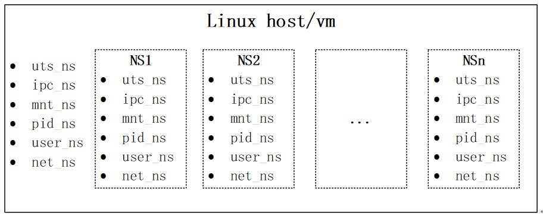
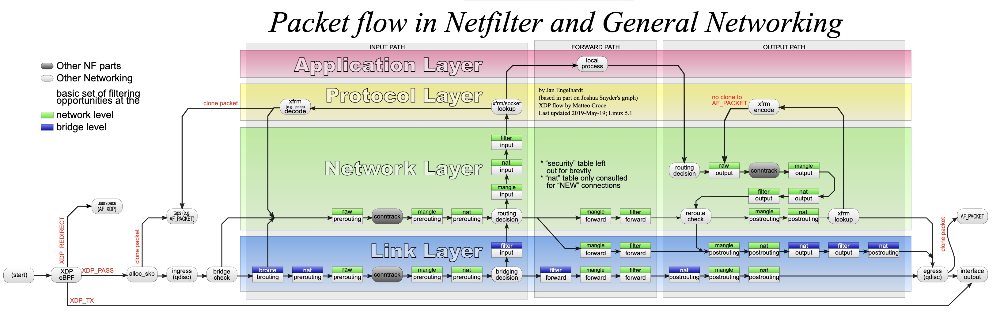
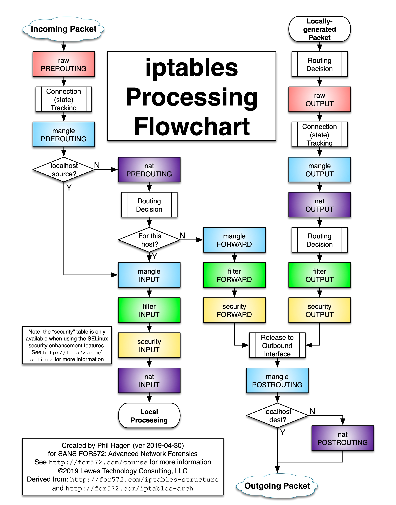
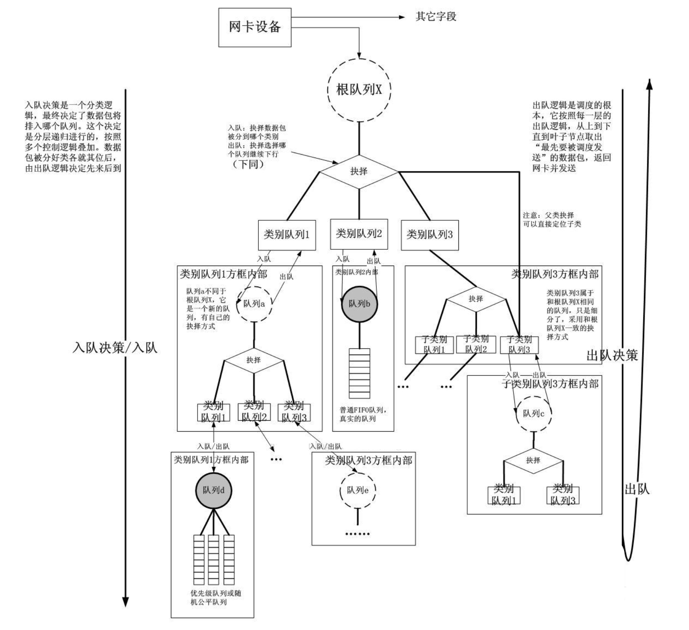
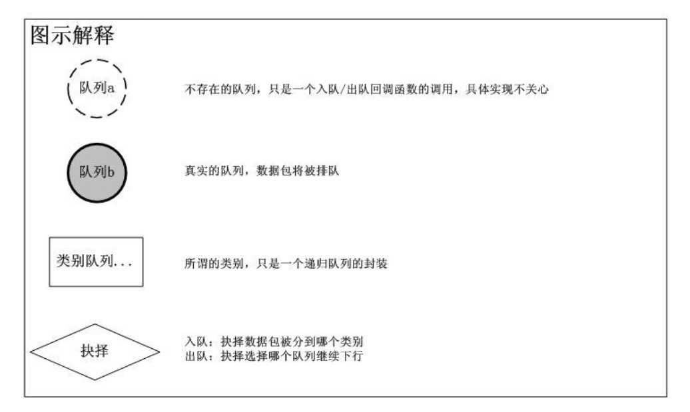
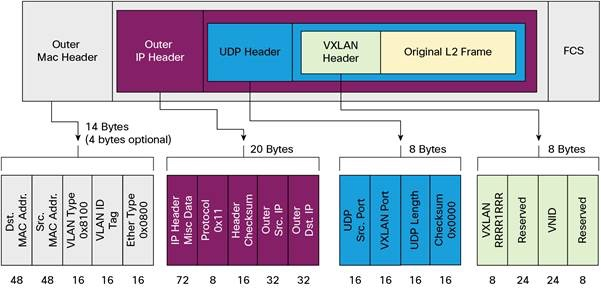
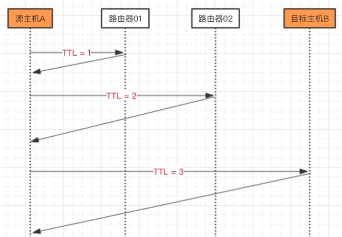

# 【Linux】网络管理

*[【Linux】网络管理](#linux网络管理)
  * [基础网络](#基础网络)
    * [网络接口](#网络接口)
    * [IP 地址](#ip地址)
    * [策略路由](#策略路由)
  * [虚拟网络](#虚拟网络)
    * [命名空间](#命名空间)
    * [虚拟设备](#虚拟设备)
  * [防火墙](#防火墙)
    * [工作原理](#工作原理)
    * [命令使用](#命令使用)
    * [Contrack](#contrack)
  * [流量控制](#流量控制)
    * [工作原理](#工作原理-1)
    * [qdisc](#qdisc)
    * [命令使用](#命令使用-1)
  * [网络分析](#网络分析)
    * [抓包](#抓包)
    * [可达探测](#可达探测)
    * [路由跟踪](#路由跟踪)
    * [流量和连接](#流量和连接)
  * [网卡多队列](#网卡多队列)

## 基础网络
### 网络接口
网络设备和磁盘设备类似，在 Linux 中使用网络功能不能直接操作硬件来完成，而需要通过操作 Linux 在系统中所抽象出来的网络设备，这种抽象设备又称为 **网络接口 Iface**

网络接口可以看作一个双向的管道，数据从一头进，就会从另一头出。比如下图的 `eth0` 接口，一头是内核网络协议栈，另一头网卡，用户应用通过 socket 发送的数据，先由网络协议栈处理，再通过 `eth0` 接口进入物理网卡，其接收数据的过程则相反

```
+---------------------------------------+
|        +-------------------+          |
|        | User Application  |          |
|        +-------------------+          |   
|.................|.....................|
|                 ↓                     |     
|           +----------+                |     
|           |  socket  |                |     
|           +----------+                |     
|.................|.....................|
|                 ↓                     |     
|      +------------------------+       |     
|      | Network Protocol Stack |       |     
|      +------------------------+       |     
|.................|.....................|
|                 ↓                     |     
|        +----------------+             |     
|        |      eth0      |             |     
|        +----------------+             |     
|  192.168.0.11   |                     |
+-----------------|---------------------+
                  ↓
          Physical Network
```

`ifconfig` 命令可查看和管理所有的网络接口，包括虚拟设备：

``` bash
# 显示所有信息
ifconfig

eth0: flags=4163<UP,BROADCAST,RUNNING,MULTICAST>  mtu 1500
        inet 10.90.73.6  netmask 255.255.255.0  broadcast 10.90.73.255
        ether 52:54:00:c8:e8:d2  txqueuelen 1000  (Ethernet)
        RX packets 2353057046  bytes 1053851711497 (981.4 GiB)
        RX errors 0  dropped 231240  overruns 0  frame 0
        TX packets 2600490252  bytes 539343011179 (502.3 GiB)
        TX errors 0  dropped 0 overruns 0  carrier 0  collisions 0

lo: flags=73<UP,LOOPBACK,RUNNING>  mtu 65536
        inet 127.0.0.1  netmask 255.0.0.0
        loop  txqueuelen 1000  (Local Loopback)
        RX packets 1013988  bytes 121542286 (115.9 MiB)
        RX errors 0  dropped 0  overruns 0  frame 0
        TX packets 1013988  bytes 121542286 (115.9 MiB)
        TX errors 0  dropped 0 overruns 0  carrier 0  collisions 0
        
# 显示摘要信息
ifconfig -s

Iface    MTU   RX-OK      RX-ERR RX-DRP RX-OVR TX-OK      TX-ERR TX-DRP TX-OVR Flg
eth0     1500  2353573386 0	     231265 0      2601066252 0      0      0      BMRU
lo       65536 1014053    0      0	    0      1014053    0      0      0      LRU
```

`ip` 命令目前逐渐代替了 `ifconfig`，其子命令 `ip link` 和 `ip addr` 可已查看和管理所有的网络接口，且其他子命令功能丰富完善：
``` bash
# 仅显示链路层信息
ip link show

1: lo: <LOOPBACK,UP,LOWER_UP> mtu 65536 qdisc noqueue state UNKNOWN mode DEFAULT group default qlen 1000
    link/loopback 00:00:00:00:00:00 brd 00:00:00:00:00:00
2: eth0: <BROADCAST,MULTICAST,UP,LOWER_UP> mtu 1500 qdisc pfifo_fast state UP mode DEFAULT group default qlen 1000
    link/ether 52:54:00:c8:e8:d2 brd ff:ff:ff:ff:ff:ff
    
# 也显示网络层信息
ip addr show

1: lo: <LOOPBACK,UP,LOWER_UP> mtu 65536 qdisc noqueue state UNKNOWN group default qlen 1000
    link/loopback 00:00:00:00:00:00 brd 00:00:00:00:00:00
    inet 127.0.0.1/8 scope host lo
       valid_lft forever preferred_lft forever
2: eth0: <BROADCAST,MULTICAST,UP,LOWER_UP> mtu 1500 qdisc pfifo_fast state UP group default qlen 1000
    link/ether 52:54:00:c8:e8:d2 brd ff:ff:ff:ff:ff:ff
    inet 10.90.73.6/24 brd 10.90.73.255 scope global eth0
       valid_lft forever preferred_lft forever
    inet 10.90.73.43/24 scope global secondary eth0
       valid_lft forever preferred_lft forever
```

网络接口的命名规范：

- `eth{n}`：以太网接口

- `lo`：本地回环接口，用于支持 UNIX Domain Socket 的进程互相通信

- `ppp{n}`：点对点协议接口，用于拨号网络或点对点协议的 VPN 等

- `bond{n}`：多个物理网卡绑定得到的虚拟设备，实现网卡负载均衡和冗灾

### IP 地址
通过 `ip addr` 命令可以管理网络接口的网络层信息，即可以查看和管理其绑定的 IP 地址

``` bash
# 查看指定接口 的 IP 信息
ip addr show ${ifce}

3: eth1: <BROADCAST,MULTICAST> mtu 1500 qdisc pfifo_fast state DOWN qlen 1000
    link/ether 00:0c:29:42:91:29 brd ff:ff:ff:ff:ff:ff
    inet 192.168.1.118/24 scope global eth1
    inet 192.168.0.12/24 scope global eth1:0

# 为指定接口配置 IP
ip addr add dev ${ifce} ${ip} [label ${ifce_alias}]

# 例子
## 为 eth1 配置 IP
ip addr add dev eth1 192.168.1.118/24

## 为 eth1 的别名配置 IP
ip addr add dev eth1 192.168.0.12/24 label eth1:0
```
> 使用 `ip addr` 命令配置的 IP 信息不能使用 `ifconfig` 命令查看

### 策略路由
从内核 2.1 开始，Linux 采用了基于策略的路由来代替传统路由

策略路由算法的功能更强大，用法更灵活，引入了多路由表以及规则的概念，支持按数据包属性（源地址、目的地址、协议、端口、数据包大小、内容等规则）来选择不同路由表

对比传统路由，策略路由存在多个路由表，路由表的编号范围为 0~2^32 -1（内核 2.6 之前是 0~255），并存在以下 4 个默认路由表：
- **0 表（unspec）**：系统保留，查看时表示所有路由表
- **253 表（defulte）**：包含无特别指定的默认路由，默认情况下内容为空
- **254 表（main）**：包含无指明路由表的所有路由，默认情况下使用该路由表来传输数据包
- **255 表（locale）**：包含包含本机路由及广播信息，由系统维护且用户不可更改

> 具体路由表和编号的对应关系可以查看 `/etc/iproute2/rt_tables`

策略路由可以根据路由规则中定义的数据包属性来选择路由表，规则编号越小则优先级越高，默认存在以下三条规则：
- **0 规则**：所有数据包选择 local 表
- **32766 规则**：所有数据包选择 main 表
- **32767 规则**：所有数据包选择 default 表

路由的转发方式分为两种：
- **三层转发**，根据网关地址转发
- **二层转发**，根据 ARP 查找获取的目的 MAC 地址转发 

传统路由或策略路由，当在一张路由表中时，路由会根据数据包目的 IP 地址进行最长匹配，而路由的类型可以分为三种，匹配优先级则越来越低：
- **主机路由**，UH（Host），指定地址匹配
- **网络路由**：UN（Network），指定网段匹配
- **默认路由**：UG（Gateway），默认匹配

通过 `route` 命令查看和管理 main 表中的路由
``` bash
route -n

Kernel IP routing table
Destination     Gateway         Genmask         Flags Metric Ref    Use Iface
0.0.0.0         10.248.34.1     0.0.0.0         UG    0      0        0 eth0
10.248.34.0     0.0.0.0         255.255.255.192 U     0      0        0 eth0
10.248.34.0     0.0.0.0         255.255.255.192 U     0      0        0 eth2
```
> -n 表示以数字形式查看路由避免反解主机名，造成查询过慢

通过 `ip route` 命令可以查看和管理任意路由表的路由
``` bash
# 默认查看 main 表的路由
ip route

default via 10.248.34.1 dev eth0 onlink
10.248.34.0/26 dev eth0 proto kernel scope link src 10.248.34.36
10.248.34.0/26 dev eth2 proto kernel scope link src 10.248.34.49

# 查看指定路由表的路由
ip route list table main

default via 10.248.34.1 dev eth0 onlink
10.248.34.0/26 dev eth0 proto kernel scope link src 10.248.34.36
10.248.34.0/26 dev eth2 proto kernel scope link src 10.248.34.49

# 查看 main 表的 ipv6 路由
ip -6 route show
::1 dev lo proto kernel metric 256 pref medium
2403:c80:200:1000::/64 dev bond0 proto kernel metric 256 pref medium
2403:c80:200:1005::2aba:4a50 dev bond1 metric 1024 pref medium
2407:b180:200:1000::/64 dev bond1 proto kernel metric 256 pref medium
```
> via 后的地址表示网关，若为 0.0.0.0 或 * 则表示二层转发，不需要通过网关
> 
> dev 后的接口表示转发数据包的出接口
> 
> proto kernel 表示是路由由内核添加的，类似于路由器中自动生成的直连路由
> 
> scope 后表示路由合法范围，global 表示全局单播合法、link 表示直连单播合法、host 表示本机内转发合法
> 
> src 表示默认的源 IP，当源地址还未指定时，比如当程序还没有进行绑定 IP 的发送情况，会使用该默认的源 IP 和随机的端口

通过 `ip rule` 命令可以查看和管理所有路由规则
``` bash
ip rule show

0:	from all lookup local
32766:	from all lookup main
32767:	from all lookup default
```
> from 后表示数据包的来源，all 是任意来源
> 
> lookup 后的表名或表编号表示选择用于转发数据包的路由表

## 虚拟网络
### 命名空间
**命名空间（Namespace）** 是 Linux 内核提供的功能，通过不同类型的命名空间，能对不种类型的资源进行隔离，包括：



- **UTS（UnixTimesharing  System）**：包含内存名称、版本、底层体系结构等信息
- **IPS**：所有与进程间通信 IPC 有关的信息
- **MNT**：装载的文件系统
- **PID**：有关进程 ID 的信息
- **USER**：资源配额的信息
- **NET**：网络信息

其中 **网络命名空间（Network Namespace，net_ns）** 用于隔离网络信息，是实现网络虚拟化的重要功能，利用它所创建出来的隔离空间，拥有独立网络资源和网络协议栈

因此每个网络命名空间中的虚拟机或容器，都仿佛运行在一个独立的网络中，只可见当前网络命名空间的网络设备

每个网络设备只能属于一个 网络命名空间，但某些设备支持在网络命名空间之间进行转移，这种设备称为可转移设备，比如 VETH

通过 `ip netns` 命令可以查看和管理所有网络命名空间

``` bash
# 查看所有网络命名空间
ip netns list

# 添加网络命名空间
ip netns add ${namespace}

# 删除网络命名空间
ip netns delete ${namespace}

# 在指定网络命名空间中执行命令
ip netns exec ${namespace} ${cmd}

# 查看指定进程的网络命名空间
ip netns identify ${pid}	

# 查看使用了指定网络命名空间的进程
ip netns pids ${namespace}

# 给网络命名空间分配 id，该 id 分配后将无法更改
# 内核将在某些 netlink 消息中使用此 id
ip netns set ${namespace} ${netns_id }
```

`ip netns` 命令是从 `/var/run/netns` 目录中获取信息的，docker 容器的网络命名空间存放在 `/proc/${pid}/ns/net`。因此当 docker 容器被创建出来后，使用该命令无法看到容器对应的网络命名空间

若要使用该命令管理容器的网络命名空间，则需要使用软链接：
``` bash
# 先查询容器的 pid
docker inspect --format '{{.State.Pid}}' ${container}

4775

# 再将容器的网络命名空间软链接到  /var/run/netns/
ln -s /proc/4775/ns/net /var/run/netns/${namespace}
```

### 虚拟设备
除了传统网络设备，Linux 还提供了许多虚拟网络设备，这些虚拟设备有助于构建复杂的网络拓扑，满足各种网络需求

- **TAP/TUN**

  TAP/TUN 是一种能让用户态程序和内核协议栈交换数据包的设备，TAP 工作在二层协议，TUN 工作在三层协议，设备的两端分别是内核网络协议栈和用户态程序。
  
  创建 TAP/TUN 时同时会创建一个对应的字符设备，用户态程序可以通过直接 `read()/write()` 字符设备，和本机的内核协议栈进行通讯
  
  程序 A 通过 sokcet 和网络协议栈发出数据包，数据包被转发到 TAP/TUN 设备后，由程序 B 接收并处理后，通过 sokcet 和网络协议栈发出数据包，送到 eth0 对应的物理网卡
  
```
+----------------------------------------------------------------+
|                                                                |
|  +--------------------+      +--------------------+            |
|  | User Application A |      | User Application B |<-----+     |
|  +--------------------+      +--------------------+      |     |
|               | 1                    | 5                 |     |
|...............|......................|...................|.....|
|               ↓                      ↓                   |     |
|         +----------+           +----------+              |     |
|         | socket A |           | socket B |              |     |
|         +----------+           +----------+              |     |
|                 | 2               | 6                    |     |
|.................|.................|......................|.....|
|                 ↓                 ↓                      |     |
|             +------------------------+                 4 |     |
|             | Network Protocol Stack |                   |     |
|             +------------------------+                   |     |
|                | 7                 | 3                   |     |
|................|...................|.....................|.....|
|                ↓                   ↓                     |     |
|        +----------------+    +-----------------+         |     |
|        |      eth0      |    | tun/tap char dev|         |     |
|        +----------------+    +-----------------+         |     |
|    10.32.0.11  |                   |   192.168.3.11      |     |
|                | 8                 +---------------------+     |
|                |                                               |
+----------------|-----------------------------------------------+
                 ↓
         Physical Network
```

- **VETH**

  VETH 的作用是反转数据包的方向，将需要发送数据包转换成需要接收数据包重新送入网络协议栈进行处理，从而间接完成数据的传输。设备的两端分别是网络协议栈和另一个 VETH
  
  VETH 总是以 VETH Pair 形式成对出现，送到一端请求发送的数据包总是从另一端以请求接受的形式出现，可以用于跨 Namespace 通信
  
```
+-----------------------------------------------------------------+
|             Namespace 1         :        Namespace 2            |
|     +------------------------+  :  +------------------------+   |
|     | Network Protocol Stack |  :  | Network Protocol Stack |   |
|     +------------------------+  :  +------------------------+   |
|                  ↑              :            ↑                  |
|..................|..............:............|..................|
|                  ↓              :            ↓                  |
|            +-----------+        :      +-----------+            |
|            |   veth0   |        :      |   veth1   |            |
|            +-----------+        :      +-----------+            |
|                  ↑              :            ↑                  |
|                  +--------------:------------+                  |
|            192.168.2.11         :      192.168.2.1              |
+-----------------------------------------------------------------+
```

- **Bridge**

  Bridge 是一个二层虚拟交换机，和物理交换机有类似的功能，和其他设备不同的是 Bridge 有多个端口，数据包可以从任何端口进来，Bridge 根据数据包的 MAC 地址信息进行广播、转发或丢弃处理
  
```
-----------------------------------------------------------------+-----------------------------------------+-----------------------------------------+
|                          Host                                  |              VirtualMachine1            |              VirtualMachine2            |
|                                                                |                                         |                                         |
|       +------------------------------------------------+       |       +-------------------------+       |       +-------------------------+       |
|       |             Newwork Protocol Stack             |       |       |  Newwork Protocol Stack |       |       |  Newwork Protocol Stack |       |
|       +------------------------------------------------+       |       +-------------------------+       |       +-------------------------+       |
|                          ↑                                     |                   ↑                     |                    ↑                    |
|..........................|.....................................|...................|.....................|....................|....................|
|                          ↓                                     |                   ↓                     |                    ↓                    |
|                     +--------+                                 |               +-------+                 |                +-------+                |
|                     | .3.101 |                                 |               | .3.102|                 |                | .3.103|                |
|        +------+     +--------+     +-------+                   |               +-------+                 |                +-------+                |
|        | eth0 |<--->|   br0  |<--->| vnet0 |                   |               | vnet1 |                 |                | vnet3 |                |
|        +------+     +--------+     +-------+                   |               +-------+                 |                +-------+                |
|            ↑             ↑             ↑                       |                   ↑                     |                    ↑                    |
|            |             |             +-------------------------------------------+                     |                    |                    |
|            |             ↓                                     |                                         |                    |                    |
|            |         +-------+                                 |                                         |                    |                    |
|            |         | vnet2 |                                 |                                         |                    |                    |
|            |         +-------+                                 |                                         |                    |                    |
|            |             ↑                                     |                                         |                    |                    |
|            |             +-------------------------------------------------------------------------------|--------------------+                    |
|            |                                                   |                                         |                                         |
|            |                                                   |                                         |                                         |
|            |                                                   |                                         |                                         |
+------------|---------------------------------------------------+-----------------------------------------+-----------------------------------------+
                 ↓
         Physical Network (192.168.3.0/24)
```

- **Bond**

  Bond 是通过多个物理设备绑定为一个逻辑设备，实现物理网络设备的冗余，带宽扩容和负载均衡，在生产场景中是一种常用的技术。其工作原理就是虚拟设备开启混杂模式，接收多张网卡的数据，并改成相同的 MAC 地址
  
```
  +----------------------------------------------------------------+
|                                                                |
|       +------------------------------------------------+       |
|       |             Newwork Protocol Stack             |       |
|       +------------------------------------------------+       |
|                              ↑                                 |
|                              |                                 |
|       +------------------------------------------------+       |
|       |                    eth2 (one mac)              |       |
|       +------------------------------------------------+       |
|              ↑                                ↑                |
|..............|................................|................|
|              ↓                                ↓                |
|        +----------+                     +------------+         |
|        |   eth0   |                     |    eth1    |         |
|        +----------+                     +------------+         |
|              ↑                                 ↑               |
|              |                                 |               |
|              |                                 |               |
+--------------|---------------------------------|---------------+
               ↓                                 ↓
         Physical Network 1              Physical Network 2
```

> Linux Kernels 2.4.12 及以后的版本均供 bonding 模块，以前的版本可以通过 patch 打补丁实现

- **VLAN**

  VLAN 关联着一个物理设备的虚拟设备，类似物理设备的功能，但所有流经这个设备的数据包将被加上 VLAN Tag 并转发到其关联的物理设备
  
  VLAN 主要用于划分广播域，有助于控制流量、简化网络管理、提高网络的安全性

## 防火墙
### 工作原理
netfilter/iptables 组合实现了一个 Linux 内核防火墙，其中 iptables 是工作于用户空间，负责规则配置的命令行工具，而 netfilter 则是工作于内核空间的包过滤框架，负责数据包的实际处理

netfilter 提供了一系列 Hook，每个接收或发送的数据包在经过内核协议栈时都会触发这些 Hook，程序可以通过注册 Hook 函数的方式在一些关键路径上处理网络流量。而 iptables 相关的内核模块在这些 Hook 上都注册了处理函数，并根据用户配置的规则对网络流量进行匹配和处理



以下是 netfilter 提供的五个 Hook：
- **NF_IP_PRE_ROUTING**: 接收的数据包，进入协议栈后立即触发此 Hook，在进行路由判断前
- **NF_IP_LOCAL_IN**: 接收的数据包经过路由判断后，如果目的是本机，则触发此 Hook
- **NF_IP_FORWARD**: 接收的数据包经过路由判断后，如果目的是其他机器，则触发此 Hook
- **NF_IP_LOCAL_OUT**: 本机产生并准备发送的数据包，在进入协议栈后立即触发此 Hook
- **NF_IP_POST_ROUTING**: 本机产生并准备发送的数据包，在经过路由判断后触发此 Hook

iptables 使用 **表（Table）** 和 **链（Chain）** 来组织 **规则（Rule）**，它先根据规则所实现的网络功能，将规则组织为不同的 Table，然后在 Table 内部，再根据规则所应用的 Hook，将规则组织为不同的 Chain

iptables 中有五个内置的 Chain，每个 Chain 对应着不同的 Hook，决定了它所包含的规则应用于网络流量的时间点。每个 Chain 和 Hook 的对应关系如下：
- **PREROUTING**: 应用于 NF_IP_PRE_ROUTING Hook 上注册的函数
- **INPUT**: 应用于 NF_IP_LOCAL_IN Hook 上注册的函数
- **FORWARD**: 应用于 NF_IP_FORWARD Hook 上注册的函数
- **OUTPUT**: 应用于 NF_IP_LOCAL_OUT Hook 上注册的函数
- **POSTROUTING**: 应用于 NF_IP_POST_ROUTING Hook 上注册的函数

iptables 共划分五个 Table，代表了不同的网络功能，由于所需要注册的 Hook 函数不同，内置的 Chain 也不同。每个 Table 的功能，以及和五个 Chain 的对应关系如下：
- **raw**：用于决定数据包是否被状态跟踪系统处理
- **filter**：用于过滤数据包
- **nat**：用于网络地址转换
- **mangle**：用于对报文进行修改
- **security**：用于根据 SELinux 安全策略为数据包打标记

| Table/Chain | PREROUTING | INPUT | FORWARD | OUTPUT | POSTROUTING |
| --- | --- | --- | --- | --- | --- |
| raw | Y | | | Y | |
| filter | | Y | Y | Y | |
| nat | Y | | | Y | |
| mangle | Y | Y | Y | Y | Y |
| security | | Y | Y | Y | |



对于不同 Table 之间的相同 Chain，数据包进行匹配的优先级是：`raw` -> `mangle` -> `filter` -> `security` -> `nat`	

所有链默认都是没有规则的，用户可以通过 iptables 命令添加规则，每个规则都包括匹配和目标两个部分：
- **匹配（Match）**：可包含多个条件，比如匹配端口、IP、数据包协议等，还可以插入模块并包含模块条件，比如 `conntrack`、`recent` 等，实现更为复杂的匹配

- **目标（Target）**：只能有一个行为，既有任何 Table 的任何 Chain 都可用的目标，比如 `ACCEPT`、`DROP` `RETURN` 等，也有根据功能需要，在指定 Table 和指定 Chain 才可用的目标，比如 `SNAT`、`DNAT`、`MASQUERADE`、`NOTRACK` 等

根据是否终止数据包在当前 Chain 的匹配，又将目标分为 **终止目标（terminating targets）** 和 **非终止目标（non-terminating targets）** 两种类型，比如 `ACCEPT` 是一个终止目标，它可以直接允许数据包通过并终止匹配其他规则，而 `LOG` 是一个非终止目标，它记录数据包的相关信息到系统日志之后继续匹配其他规则

### 命令使用
使用 `iptables` 命令，可以查看和配置当前的防火墙规则：

``` bash
# -t 指定查看的 Table，默认是 filter
# -n 数字化显示 IP 和端口
# -v 详细化显示
# -L 列出 Table 中指定或者所有 Chain 和 Rule
iptables [-t ${table} ] -nvL [${chain}]

# 管理 Table 值的规则
# command 表示管理命令，常用有：
## -A 追加、-D 删除
## -I [${relenum}]，插入到 relenum 序号的规则前，默认序号为 1
iptables [-t ${table}] ${command} [${match}] [${target}]
```

### Contrack
netfilter/iptables 防火墙是有状态的，也就是会将数据包看作连接的一部分，而不是单个独立的数据包来做出规则判断，这个特性是基于 netfilter 框架的 **conntrack（连接跟踪）** 子系统实现的

conntrack 系统使用 conntrack id 作为每个连接的唯一标识，对于经过 `raw` Table `PREROUTING` Chain 但未被 `NOTRACK` 的数据包，它会收集数据包中 IP 地址、端口以及连接状态等信息，将其关联到一个新建或已存在的连接上，并进行连接状态的更新，然后其他 Table 和 Chain 中与连接状态相关的规则，就可以根据数据包对应的连接状态对其完成匹配和处理

conntrack 系统中的连接状态有以下几种：
- `NEW`：如果一个数据包不能关联到任何已存在的连接，则新建一个连接并关联。对面向连接的协议以及非面向连接的协议都适用

- `ESTABLISHED`：当一个连接收到应答方向的数据包时，状态从 `NEW` 变成 `ESTABLISHED`。对于 TCP 这个包还需要是 `SYN/ACK` 包，而对于 `UDP` 和 `ICMP` 则只要是应答方向即可

- `RELATED`：数据包不能关联到已存在的连接，但是和已有的连接有一定关系。这可能是辅助连接，例如 FTP 数据传输连接，或者是其他协议试图建立连接时的 ICMP 应答包

- `INVALID`：数据包不能关联到已存在的连接，并且因为某些原因不能用来创建一个新连接，例如无法 识别、无法路由等

- `UNTRACKED`：数据包在 `raw` Table `PREROUTING` Chain 被标记 `NOTRACK` 的数据包，将不会进入 conntrack 系统

- `SNAT`：数据包的源地址经过 NAT 修改之后会进入的虚拟状态，conntrack 系统据此在收到反向包时对地址做反向转换

- `DNAT`：数据包的目的地址经过 NAT 修改之后会进入的虚拟状态，conntrack 系统据此在收到反向包时对地址做反向转换

## 流量控制
**流量控制（Traffic Control，TC）** 指通过为网络设备设置数据包进出的排队机制，决定接收数据包的速度和发送数据包的速度和顺序，从而实现流量的整形、调度、策略控制和丢弃。TC 包括了工作于用户空间，负责队列和策略配置的命令行工具 `tc`，以及工作于内核空间，负责数据包处理的的流量控制子系统

流量控制的行为包括以下几种：
- **整形（Shaping）**：限制数据包的发送速率
- **调度（Scheduling）**：调整数据包的发送优先级
- **监管（Policing）**：限制数据包的接收速率
- **丢弃（Dropping）**：丢弃接收或发送的数据包

### 工作原理
TC 以 qdisc、class、filter 三种对象组成的树形结构来实现对流量的分层控制，对象的组织结构和入队出队逻辑如下：




- **qdisc，队列调度器（Queueing Discipline）**

  是用于管理和传输数据包的队列。qdisc 可以被看作是一个数据包缓冲区，用于在数据包到达之后进行排队等待传输。TC 中有很多种类型的 qdisc，每种 qdisc 都有自己的特点和适用场景

- **class，类别（Class）**

  表示针对数据包的处理策略。某些类型的 qdisc 中可以包含多个 class，然后不同的 class 中可以包含更深层次的 class，即 class 的父级对象可以是 class 或 qdisc。叶子对象的 class 必须关联一个 qdisc 来处理数据包，默认会关联一个 `pfifo_fast` qdisc

- **filter，过滤器（Filter）**

  用于过滤指定条件的数据包以进行处理。filter 可以为父级的 qdisc 或 class 进行过滤，然后交由其子级的 class 进行处理。可以根据数据包的源 IP 地址、目的 IP 地址，或者数据包的协议类型等条件进行过滤

### qdisc
qdisc 可分为 **无分类（Classless）** 和 **分类（Classful）** 两大类型，其中无分类 qdisc 会对网络设备上的所有流量进行无差别的控制处理，而分类 qdisc 会对网络设备上的所有流量根据过滤器进行分类，然后根据类型进行不同的控制处理

无分类 qdisc 的常用类型如下：  
- **Packet FIFO Fast**

  其类型名为 `pfifo_fast`，是先进先出的快速队列调度器，用于在低负载场景下对不需要特殊处理的数据包进行快速转发
  
  pfifo_fast 由于将所有数据包放在一个缓冲区，并按照数据包的优先级进行排序，当缓冲区已满时，较低优先级的数据包将被丢弃，高优先级的数据包才会被缓存且优先转发，因此在高负载的场景下容易丢包
  
  `bands <n>` 表示 pfifo_fast 内部固定划分了 `<n>` 个具有优先级 band，其优先级从高到低的编号为 `0~n-1`，通常内核指定 `n` 值为 `3`，当高优先级 band 中有数据包需要处理时，则低优先级 band 中的数据包就不会被处理
  
  `priomap` 可指定了数据包的优先级与各个 band 的映射关系，数据包的优先级取决于其 TOS/DSCP 字段，实际使用时通过 TOS/DSCP 字段的高 4 位表示优先级，即把数据包划分为 16 个优先级，所以 `priomap` 数组的长度也是 16，表示第 0～16 个优先级的数据包要分配到哪个 band
  
  pfifo_fast 在内部对数据包进行了分类，但它仍属于无分类 qdisc，因为它并不允许添加子级的 class，即网络设备上的所有流量都是被无差别地通过分优先级转发被处理的，并且其 `bands` 和 `priomap` 都是内核指定的，`tc` 命令无法指定

- **Token Bucket Filter**

  其类型名为 `tbf`，是基于令牌桶过滤器的队列调度器，用于对存在波动的流量整形，确保不同的流量在网络上被平衡地分配，防止因网络拥塞导致数据包的丢失和延迟
  
  tbf 会按照固定的速率向 bucket 桶中注入 token 令牌，当一个数据包需要发送时必须先从 bucket 中获取一个 token，如果此时 bucket 中没有可用的 token，则数据无法发送，直到有足够数量的 token 可供使用为止，注意 token 是基于字节而不是包数的
  
  当流量速率小于预设 token 速率时，不仅转发没有延时，还会积压部分 token，从而能够容忍超过预设 token 速率的短时间抖动，但如果流量速率长时间大于预设 token 速率时，则会出现丢包

  `limit <n>` 指定因等待可用 token 而被放入队列的字节数，也可通过 `latency <n>` 指定每个包在队列中停留的最长时间来间接指定 `limit`，tbf 会根据 `latency`、`burst`、`rate` 和 `peakrate` 的值来计算出 `limit` 的值 

   `rate <n>bit` 指定预设的 token 速率，`burst <n>` 指定 bucket 的字节大小，也就是积压的 token 所支持的最大字节数，一般越大的预设速率需要越大的 bucket 空间，否则流量抖动时容易出现丢包
   
   `mpu` 指定最小包单元，即一个包所使用的最小 token 量，因为通常大小为 0 的包并不表示占用 0 带宽，比如以太网，任何一个包的字节数不会少于 64，该值默认为 `0`。

- **Stochastic Fairness Queueing**

  其类型名为 `sfq`，是实现随机公平排队的队列调度器，用于为不同的数据流进行公平地获得传输，实现公平地共享带宽。对比其他公平排队算法，sfq 的精准性要差一些，但所需的计算量更少，且结果是几乎完全公平的
  
  sfq 会将相同五元组的数据包被归为一个 Conversion，Conversion 通常表示了一个 TCP Session 或 UDP Stream，并且会根据哈希分配到一个内部队列，然后 sfq 会轮询所有的队列进行数据包发送
  
  sfq 只有在实际出向带宽已经非常饱和的情况下才有效，否则转发过程不存在 排队情况，自然没有公平排队的效果。换句话说，上层没有整流对象，单纯在网络接口上配置 sfq 是毫无意义的
  
  `perturb` 指定每隔多少秒就重新配置哈希算法，以防止流之间的哈希冲突，默认为 `0` 即永远不会重新配置，最好显式设置一个值。

  `quantum` 指定在轮到下一个队列发送前，当前队列允许出队的最大字节数。默认是一个 MTU，不建议设置为小于 MTU 的值
  
  `limit` 指定 sfq 能缓存的最大包数，若超过这个阈值将导致丢包

- **Network Emulation**

  其类型名为 `netem`，是支持网络模拟的队列调度器，用于模拟网络延迟、丢包等情况，以支持测试和验证网络应用程序在高延迟网络环境下的性能和稳定性
  
  `delay <time> [<jitter> [<correlation>]] <distribution>` 指定模拟延迟的机制，其中 `time` 是延迟的时间，`jitter` 是延迟的抖动时间，`correlation` 是下一个报文延迟时间和上一个报文的相关系数，而 `distribution` 是延迟的分布模式，可选值有 `uniform` 均匀分布、`normal` 正态分布、`pareto` 长尾分布和 `paretonormal` 长尾混合正态分布
  
  `loss <x%> [<%y>]` 指定模拟丢包的机制，可以指定 `x%` 的固定丢包率，也可以指定 `x%~y%` 的范围丢包率
  
  和 `loss` 类似，`duplicate <x%> [<%y>]` 指定模拟包重复的机制，`corrupt <x%> [<%y>]` 指定模拟包损坏的机制，`reorder <x%> [<%y>] ` 指定模拟包乱序的机制
  
  `gap <n>` 可以指定网络模拟机制生效的包间隔，而不是每一个包都进行

分类 qdisc 的常用类型如下：
- **Multi-Queue**
  
  其类型名为 `mq`，是虚拟的分类队列调度器，用于作为多队列网络设备的默认根对象，并且会将每个网络设备队列作为其子类别，从而允许独立地统计或处理各个网络设备队列

- **Priority Queue**

  其类型名为 `prio`，是区分优先级类别的队列调度去，用于将不同的流量分配到不同的类别中，并按照类别的优先级进行转发处理。可以看作 pfifo_fast 的升级版，但其内部的多个 band 都是一个独立的 class
  
  `bands <n>` 指定内部的 band 数量，每个 band 都对应一个 class，默认是 3 个；`priomap` 指定在没有 filter 参与下的优先级映射关系，跟 pfifo_fast 的工作方式一致

- **Hierarchical Token Bucket**

  其类型名为 `htb`，是区分类型进行令牌桶过滤的队列调度器，用于将不同的流量分配到不同的类别中，然后对其不同的整形处理，其提供了更加灵活的流量控制机制，支持带宽控制、优先级、延迟等设置

### 命令使用 <a id="命令使用1">
使用 `tc` 命令，查看和管理 tc 对象：

 ``` bash
 # 查看指定网络设备当前配置的对象
 # object 可以是 qdisc、class 和 filter 等
 tc -s ${object} ls dev ${dev}
 tc -s ${object} show dev ${dev}

# 为指定网络设备创建队列
# root_or_parent 表示对象层级关系
# - root 指定为根对象，即最靠近网络设备的对象
# - parent 指定其父级对象，值为父级对象的 handle，与 root 互斥
# handle 表示对象在网络设备中的唯一标识
# - 其一般格式为 <major>:<minor>，可以指定也可以自动分配
# - root qdisc 的 handle 为 1:，即 1:0
# - qdisc major 表示其唯一编号，是大于 0 的整数
# - qdisc minor 永远是 0，表示时可以简写忽略
# qdisc 表示队列类型名，不同队列具有不同的 qdisc_options
tc qdisc add dev ${dev} ${root_or_parent} handle ${handle} ${qdisc} ${qdisc_options}

# 为指定网络设备的分类队列添加类别
# parentid 指定父级对象的 handle
# classid 指定类别的唯一标识
# - 其一般格式为 <major>:<minor>，可以指定也可以自动分配
# - class major 继承所在 qdisc 的 major，即 parentid 中的 major
# - class minor 表示所在 qdisc 中的唯一编号
# qdisc 表示队列类型名，不同队列具有不同的 qdisc_options
tc class add dev ${dev} parent ${parentid} classid ${classid} ${qdisc} ${qdisc_options}

# 为指定网络设备的分类队列添加过滤器
# root_or_parent 表示对象层级关系
# protocol 表示所基于的协议，可以是 ip、tcp 或 udp 等
# prio 表示优先级，数字越小，优先级越高
# filter 表示过滤器类型名，不同过滤器具有不同的 filter_options
# flowid 表示目的类别的 classid
tc filter add dev ${dev} ${root_or_parent} protocol ${protocol} prio ${prio} ${filter} ${filter_options} flowid ${flowid}

 # 删除指定网络设备当前配置的所有对象
 # 删除根 qdisc 则所有的 filter、class 和 filter 等对象都会被删除
tc qdisc delete dev <device> root
```

简单的 `tc` 使用例子：
``` bash
# 添加 htb 为 eth0 的根对象
tc qdisc add dev eth0 root handle 1: htb default 30

# 为 root 添加一个子类别，进行整流处理
tc class add dev eth0 parent 1: classid 1:1 htb rate 6mbit burst 15k

# 为 1:1 添加三个子类别，进行不同的整流处理
tc class add dev eth0 parent 1:1 classid 1:10 htb rate 5mbit burst 15k
tc class add dev eth0 parent 1:1 classid 1:20 htb rate 3mbit ceil 6mbit burst 15k
tc class add dev eth0 parent 1:1 classid 1:30 htb rate 1kbit ceil 6mbit burst 15k

# 添加将 1:1 指定流量导向其子类别的过滤器
# 没有被过滤的流量将导向未配置过滤器的 1:30
tc filter add dev eth0 protocol ip parent 1:0 prio 1 u32 match ip dport 80 0xffff flowid 1:10
tc filter add dev eth0 protocol ip parent 1:0 prio 1 u32 match ip sport 25 0xffff flowid 1:20
```

## 网络分析
### 抓包
使用 `tcpdump` 命令，可以截获和分析通过网络发送和接收的数据包，得到其传输层及其上层的数据包信息，其常用的用法如下：

``` bash
# iface 指定网络接口，不指定则默认第一个网络接口
# expression 指定过滤条件，过滤方式有：
# - host ${ip}              数据包包含指定 ip 
# - src/dst host ${ip}      数据包源/目的 ip 为指定 ip
# - tcp/udp/icmp/arp        数据包协议为 tcp/udp/icmp/arp                
# - port ${port}            数据包包含指定 端口
# - src/dst port ${port}    数据包源/目的端口为指定端口
# 条件里和条件间都可以使用 and、or、! 表示与或非
tcpdump -i ${iface} ${expression}   

# 其他选项：
-c ${n}         # 指定要抓取的包数量
-n              # 不解析 ip 地址为主机名
-nn             # 不解析 ip 地址为主机名之外，还不解析端口和协议为服务名
-P in/out/inout # 指定要抓取接收、发送、收发的包，默认 inout
-s ${len}       # 设置抓取的包长度，默认 65535 bytes
                # 当长度设置不够时，可能会产生包截断，出现 ·[|proto]` 标志
                # 当长度设置过大时，包的处理时间会变长，并且会减少 tcpdump 可缓存的数据包数量，从而会导致数据包的丢失
-T vxlan        # 强制根据 vxlan 规则解析报文内容

# 输出选项：
-w ${file}      # 将抓包结果输出到文件中而不是标准输出
-q              # 输出简短的结果
-v/vv/vvv       # 输出更加详细的结果

# 案例：
# 得到通过 eth1 和 210.27.48.1 通信的数据包
tcpdump -i eth1 host 210.27.48.1

# 得到通过 eth1 和地址 210.27.48.1 访问 web 服务的数据包
tcpdump -i eth1 tcp and src host 210.27.48.1 and dst port 80

# 得到 210.27.48.1 和除 210.27.48.2 外的地址通过 eth1 通信的数据包
tcpdump -i eth1 host 210.27.48.1 and host ! 210.27.48.2

# 得到 210.27.48.1 和 210.27.48.2 或 210.27.48.3 通过 eth1 通信的数据包
tcpdump -i eth1 host 210.27.48.1 and host \(210.27.48.2 or 210.27.48.3\)
```

通过使用 udp 层内容作为过滤条件，可以抓取指定内层报文的 vxlan 报文，使用到的过滤条件有：
``` bash
# 从 proto 层内容的 x 字节开始截取 y 字节，其值等于 value
${proto}[x:y] = ${value}

# 字节位置从 0 开始计算
# 比较符可以使用 =、!=、>、>=、<、<=
# 比较值需要使用十六进制
# 截取值可以使用 & 进行与计算
``` 

根据 vxlan 报文结构，常用的根据内层报文抓取 vxlan 报文的方式如下：


> Originl L2 Frame 表示内层的二层报文

``` bash
# 抓取内层 vni 等于 6 的 vxlan 报文
tcpdump -i bond0  port 4789 and udp[11:4]=0x06 -nn

# 抓取内层源 ip 等于 10.90.66.133 的 vxlan 报文
tcpdump -i bond0  port 4789 and udp[42:4]=0xa5a4285 -nn

# 抓取内层目的 ip 等于 10.93.174.161 的 vxlan 报文
tcpdump -i bond0  port 4789 and udp[46:4]=0xa5daea1 -nn

# 抓取内层源 port 等于 8080 的 vxlan 报文
tcpdump -i bond0  port 4789 and udp[50:2]=0x1f90 -nn

# 抓取内层目的 port 等于 8080 的 vxlan 报文
tcpdump -i bond0  port 4789 and udp[52:2]=0x1f90 -nn
```

### 可达探测
使用 `arping` 命令可用于二层网络内的 IP 地址和 MAC 地址之间的映射关系查询，从而探测指定主机的二层网络存活性

``` bash
# 查询指定 IP 地址对应的 MAC 地址
arping ${ip}

# 查询指定 MAC 地址对应的 IP 地址
arping ${mac}

# 查询指定 IP 地址是否被不同 MAC 地址占用
arping -d ${ip}
```

使用 `ping` 命令可用于发送 ICMP Echo Request 数据包，从而探测指定 主机的三层网络存活性

``` bash
ping ${ip}
```

使用 `nc` 命令可用于发送和接收 TCP/UDP 数据，从而探测指定主机的四层网络存活性

``` bash
# 探测指定 IP 地址和端口的 TCP 存活性
nc -zvv ${ip} ${port}

# 探测指定 IP 地址和端口的 UDP 存活性
nc -zuvv ${ip} ${port}
```

### 路由跟踪
使用 `traceroute` 命令可用于查看 IP 数据包达到目的地址的过程中所经过的路径，其常用的用法如下：

``` bash
traceroute ${host}

# 常用选项：
-n              # 不解析 ip 地址为主机名
-s              # 使用指定的 IP 地址发送检测数据包
-i              # 使用指定的网络接口发送检测数据包
-q              # 指定发送检测数据包的个数，默认 3
-m              # 设置检测数据包的 TTL 大小，即跟踪的最大跳数
```

命令输出：
``` bash
traceroute 10.212.210.136 -n

traceroute to 10.212.210.136 (10.212.210.136), 30 hops max, 60 byte packets
 1  * * *
 2  10.62.99.192  7.361 ms  7.466 ms  7.548 ms
 3  * * *
 4  * * *
 5  10.212.210.136  0.081 ms  0.101 ms  0.096 ms
```
> 记录的序列号从 1 开始，记录着数据包每一跳的信息，记录包括当前这一跳的地址，和每个数据包到达该跳的往返时间，单位都是 ms
> 
> 中间的某些记录出现 * 号，可能是途经节点的防火墙封掉了返回的 ICMP 的数据包
> 
> 末尾的连续多个记录出现 * 号，可能是目的节点的封掉了返回的 ICMP 的数据包，客户端还不停地递增 TTL 并发送监测数据包

`traceroute` 可以基于 UDP 或 ICMP，Linux 使用的是前者，但两个实现的工作原理是相同的：



- 客户端从 1 开始逐步递增数据包的 TTL 值，来对目的地址发送端口大于 30000 的 UDP 数据包
- 途经的节点收到对应 TTL 值的数据包后，会返回一个 TTL 超时的 ICMP 数据包，目的节点则会返回端口不可达的 ICMP 数据包
- 客户端收集所有返回的 ICMP 数据包，通过数据包信息判断是否达到目的地址，以此生成完整的路径信息

### 流量和连接
- 按网卡查看流量：`ifstat`、`sar -n DEV 1`、` nload -m`、`dstat -nf` 或 `vnstat -l`
- 按进程查看流量：`nethogs`
- 按连接查看流量：`iftop` 或 `tcptrack -i eth0`
- 查看连接统计：`ss` 或 `netstat`

## 网卡多队列
使用 `lspci -vvv` 命令，根据 `Ethernet controller` 确认网卡是否支持多队列：

``` bash
lspci -vvv

01:00.0 Ethernet controller: Red Hat, Inc Virtio network device (rev 01)
	Subsystem: Red Hat, Inc Virtio network device
	Physical Slot: 0
	Control: I/O+ Mem+ BusMaster+ SpecCycle- MemWINV- VGASnoop- ParErr- Stepping- SERR+ FastB2B- DisINTx+
	Status: Cap+ 66MHz- UDF- FastB2B- ParErr- DEVSEL=fast >TAbort- <TAbort- <MAbort- >SERR- <PERR- INTx-
	Latency: 0
	Interrupt: pin A routed to IRQ 22
	Region 1: Memory at fe800000 (32-bit, non-prefetchable) [size=4K]
	Region 4: Memory at fd000000 (64-bit, prefetchable) [size=16K]
	# Capabilities 中的 Count 大于 1，因此支持多队列
	Capabilities: [dc] MSI-X: Enable+ Count=18 Masked-
		Vector table: BAR=1 offset=00000000
		PBA: BAR=1 offset=00000800
```

查看网络设备各个队列的软中断处理数量：

``` bash
cat /proc/interrupts

           CPU0       CPU1       CPU2       CPU3       CPU4       CPU5       CPU6       CPU7
 50:  538915929  471487434  301926043  363788471  723278536  404270469  209917826  316697673   PCI-MSI 524289-edge      virtio0-input.0
 51:  458599013  230204660  318026108  241301585  257608918  218494550  277990093  344415622   PCI-MSI 524290-edge      virtio0-output.0
 52:  343639316  178140654  296075491  577532536  591573301  272860718  533390221  456720671   PCI-MSI 524291-edge      virtio0-input.1
 53:  246807427  539711612  207938976  201681862  258897526  305268646  181901552  336420334   PCI-MSI 524292-edge      virtio0-output.1
 54:  258006666  557701220  410703677  435055347  220142093  565044872  319204870  503605828   PCI-MSI 524293-edge      virtio0-input.2
 55:  131868012  315032988  726043086  224324135  287580225  273223441  305555733  241927400   PCI-MSI 524294-edge      virtio0-output.2
 56:  278135030  256811463  550577872  475752953  344002613  535011784  408031907  433375574   PCI-MSI 524295-edge      virtio0-input.3
 57:  194160504  209416368  192198602  658647497  290381362  310128485  249136646  291560778   PCI-MSI 524296-edge      virtio0-output.3
 58:  337846198  282169066  543798723  534797884  228698382  408351420  479950339  463164476   PCI-MSI 524297-edge      virtio0-input.4
 59:  282875743  321076041  180689841  199568172  674001523  266697252  213208904  312920272   PCI-MSI 524298-edge      virtio0-output.4
 60:  426195313  540666407  574554977  401949427  214935416  407943313  471976873  199161719   PCI-MSI 524299-edge      virtio0-input.5
 61:  297180827  269655627  257136206  164715221  180513776  517569075  286593259  324257377   PCI-MSI 524300-edge      virtio0-output.5
 62: 1031791226  371313092  132357139  499790639  202382944  301389950  459169538  209381726   PCI-MSI 524301-edge      virtio0-input.6
 63:  155884058  260181257  312819398  202459340  193484338  299787652  450447040  286400614   PCI-MSI 524302-edge      virtio0-output.6
 64:  299933540  474326283  438675456  235378832  784687217  231385266  493022041  200584491   PCI-MSI 524303-edge      virtio0-input.7
 65:  369589770  228593138  209105938  283324471  221327874  229028336  300474711  336722137   PCI-MSI 524304-edge      virtio0-output.
```

手动为网卡队列设置 CPU 亲和性：

``` bash
# 根据 /proc/interrupts 找到队列的进出软中断编号 irq_num
# 找到以下配置该软中断亲和性的文件
cat /proc/irq/${irq_num}/smp_affinity

# 其中的值表示为八进制
# 八进制展开为二进制后，每一位表示一个 CPU，值为 1 表示设置亲和性
04
# 即 0000 0100，绑定了 CPU6 的亲和性
```

使用 irqbalance 自动设置软中断负载均衡到各个 CPU，会覆盖手动设置：

``` bash
# 查看 irqbalance 服务状态
service irqbalance status
 
# 启用 irqbalance 服务
service irqbalance start
```
