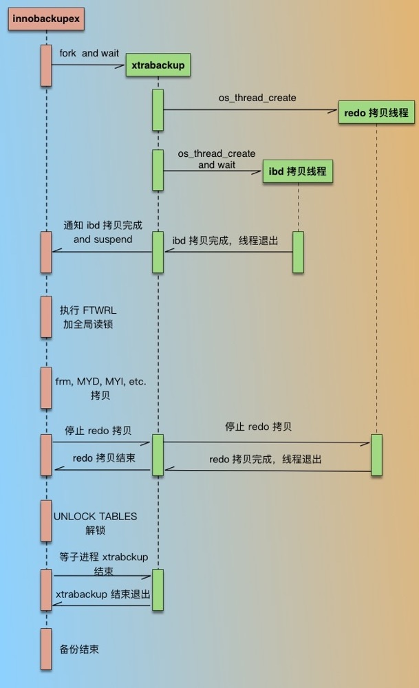

# 【Mysql】数据备份

* [【Mysql】数据备份](#mysql数据备份)
    * [MysqlDump 逻辑备份](#MysqlDump-逻辑备份)
    	* [工具使用](#工具使用)
    	* [其他参数](#其他参数)
    	* [全备恢复](#全备恢复)
    * [binlog 增量备份](#binlog-增量备份)
    	* [日志格式](#日志格式)
    	* [相关配置](#相关配置)
    	* [增量恢复](#增量恢复)
    * [XtraBackup 物理备份](#XtraBackup-物理备份)
    	* [可执行文件](#可执行文件)
    	* [备份过程](#备份过程)
    	* [备份和恢复原理](#备份和恢复原理)
    	* [工具安装](#工具安装)
    	* [备份中的相关文件](#备份中的相关文件)
    	* [工具使用](#工具使用)
    	* [优化参数](#优化参数)

## MysqlDump 逻辑备份
MySQL 官方提供的二进制工具，用于数据的全量逻辑备份

> 逻辑备份：
> 备份时将数据以 SQL 语句的形式导出，还原时则将这些 SQL 语句导入数据库执行
> 备份文件大，速度慢，适合小数据量的库，备份还原是非幂等操作，不可重复还原
>
> 物理备份：
> 备份时将数据以文件的形式拷贝，还原时则将这些文件拷贝到数据库的数据目录
> 备份速度快，适合大数据量的库，备份还原是幂等操作，可重复还原，但无法备份内存型引擎的数据

### 工具使用
**单个库的全部表备份**
``` bash
mysqldump -u${DB_USER} -p${DB_PWD} --socket=${SOCKET_FILE_PATH} ${DATABASE} > all_databases.sql
```
**单个库的选择表备份，可用于分表备份**
``` bash
mysqldump -u${DB_USER} -p${DB_PWD} --socket=${SOCKET_FILE_PATH} ${DATABASE} ${TABLE1} ${TABLE2} > all_databases.sql
```
注意以上的两个表备份命令导出的 SQL 语句，不包含创建库过程

**全部库备份**
``` bash
mysqldump -u${DB_USER} -p${DB_PWD} --socket=${SOCKET_FILE_PATH} -A > all_databases.sql
```
**选择库备份，可用于分库备份**
``` bash
mysqldump -u${DB_USER} -p${DB_PWD} --socket=${SOCKET_FILE_PATH} -B ${DATABASE1} ${DATABASE2} ${DATABASE3} > all_databases.sql
```
注意以上的两个库备份命令导出的 SQL 语句，包含创建库过程

需要注意：
- 备份命令的输出默认是标准输出，并且内容是全文本，因此可以接管道符进行压缩后再存到文件中

- 以下两个库不允许加锁，并且不需要备份，全部库备份时会自动排除，在选择库备份时则不应该选择
    - information_schema 库是 MySQL 用于存储数据库元数据的，元数据即关于数据的数据，如数据库名或表名、列的数据类型、访问权限等
    - performance_schema 库是 MySQL 从 5.5 版本以后新增的，用于存储采集的数据库性能数据

### 其他参数
**关于导出的 SQL 语句过程**
- `--add-drop-database` 
创建库之前先删除同名库，默认 off

- `--add-drop-table`
创建表之前先删除同名表，默认 on，使用 `--skip-add-drop-table` 进行 off
- `--add-locks`
插入记录前先对该表加写锁，默认 on，使用 `--skip-add-locks` 进行 off
    
**关于备份过程锁表**
- ` --lock-tables`
备份前为需要备份的库的所有表加局部读锁，只能保证单个库的数据一致性，无法保证库之间的数据一致性，默认 on，使用 `--skip-lock-tables` 进行 off

- `--single-transaction`
开启隔离级别为可重复读的单个事务用于备份，仅用于支持多版本并发控制（MVCC）的引擎（InnoDB），否则无法保证备份数据一致性，进行 on 后，自动使 `--lock-tables` off

- `--lock-all-tables`
备份前为所有库的所有表加读锁，即全局读锁（FTWRL），阻塞操作来保证数据一致性，默认 off，进行 on 后，自动使 `--single-transaction` 和 `--lock-tables` off

**关于记录用于做主从的 binlog 位置点**，一般在全部库备份时使用
- `--master-data=N`
当值为1时，导出的 SQL 语句开头，包含将 `MASTER_LOG_FILE` 和 `MASTER_LOG_POS` 设置为的备份数据对应 bin log 的语句，当值为2时，包含的是语句的注释

- `--dump-slave=N`
在从库上执行备份时，当值为1时，导出的 SQL 语句开头，包含将 `MASTER_LOG_FILE` 和 `MASTER_LOG_POS` 设置为的备份数据对应 master 的 bin log 的语句，当值为 2 时，包含的是语句的注释。从而实现用从库的备份，来创建其主库的其他从库

> 使用 `--master-data` 和 `--dump-slave` 都会自动使 `--lock-all-tables` on，并使 `--lock-tables` off，整个备份过程使用全局读锁，如果同时有使用 `--single-transaction`，则只需要再备份前进行短暂的全局读锁，以取得 binlog 信息

- `-F`
备份前刷新 binlog 文件，是备份前后的 binlog 存放在不同文件，应该与 `--lock-all-tables`、`--master-data`、`--dump-slave`  或 `--single-transaction` 一起使用

**关于备份内容**
- `-d`
备份不包含数据创建阶段，用于仅备份库中的表结构

- `-t`
备份不包含表创建阶段

- `--events`
备份包含 MySQL 的调度事件表，存在于 mysql 库中，不使用参数时是忽略该表的

### 全备恢复
**客户端命令标准输入**
``` bash
# 表备份
mysql -u${DB_USER} -p${DB_PWD} --socket=${SOCKET_FILE_PATH} -D${database} < tables.sql 

# 库备份
mysql -u${DB_USER} -p${DB_PWD} --socket=${SOCKET_FILE_PATH} < databases.sql 
```

**交互模式加载**
``` bash
[root@127.0.0.1 ~] mysql -u${DB_USER} -p${DB_PWD} --socket=${SOCKET_FILE_PATH}
mysql> # 表备份
mysql> use database
mysql> source tables.sql
mysql> # 库备份
mysql> source database.sql
```

## binlog 增量备份
binlog 是记录数据库中所有表结构变更和数据修改（除了 DQL 外）的二进制日志

若 binlog 处于启用状态，在提交之前的修改操作，会被记录在 binlog 缓存中，直到修改操作提交之后，binlog 缓存才会一次性写入 binlog 文件中，最后执行操作并保存结果

binlog 日志最常见的用处 **增量备份** 以及 **主从复制**

### 日志格式
binlog 存在三种日志格式：

- **STATMENT**

  基于 SQL 语句的复制，会记录每一条会修改操作的 SQL 语句
  
  优点：不需要分别记录一条 SQL 语句中导致的每行数据变化，日志量小，减少了磁盘 IO，提高性能
  
  缺点：由于是记录的 SQL 语句，所以为了让这些语句能正确执行，必须记录每条语句所处的执行上下文信息，但由于 MYSQL 新功能迭代较快，可能在使用某些特定的函数或功能，无法进行有效地记录
  
- **ROW**

  基于数据行的复制，只需要被修改的数据行，以及其被修改后的结果

  优点：会清楚地记录下每一行数据的修改，对比 STATMENT 格式，不会出现无法有效记录的问题
  
  缺点：日志量大，尤其是进行表结构变更时会造成日志数暴涨

- **MIXED**

  对以上两种格式的混合使用，根据每一条具体的 SQL 语句来区分日志格式，优先是使用STATEMENT 格式
  
  可以综合两者的优点，避开缺点

> 在 MySQL 5.7.7 之前，默认格式是 STATEMENT，在 MySQL 5.7.7 及更高版本中，默认格式是 ROW
> 
> 需要完全保证日志的可靠性，应该使用 ROW 格式

### 相关配置

``` ini
[mysqld]
# 启用 binlog，设置文件命名，也可以设置保存路径
log-bin = mysql-bin

# 设置日志格式
binlog_format = mixed

# 设置 binlog 过期天数，会自动清理
# 若要利用 binlog 进行增量恢复，则在最近的天数内必须进行过全备
expire_logs_days = 7

# 每个 binlog 文件的最大空间
max_binlog_size = 100m

# 每个 binlog 缓存的空间相关
# 事务小于 binlog_cache_size，则记录到 binlog 缓存
# 事务大于 binlog_cache_size 但小于 max_binlog_cache_size，则暂存到磁盘中
# 事务大于 max_binlog_cache_size，则事务失败
binlog_cache_size = 4m
max_binlog_cache_size = 512m

# binlog 文件缓冲区刷新到磁盘的方式
# 0 表示由文件系统来控制 binlog 文件缓冲区刷新到磁盘的频率，性能好风险大
# 1 表示每次事务提交，都将 binlog 文件缓冲区刷新到磁盘，性能差风险小
# N 表示每 N 次写入 binlog 文件缓冲区后，将其刷新到磁盘，可自行调节
sync_binlog = 0

# 指定的库才记录二进制文件，默认为空，表示所有库都记录
# binlog-do-db = database 

# 指定的库忽略记录二进制文件，默认为空，表示所有库都记录
# binlog-do-db 为空时才生效
binlog-ignore-db = database
```
> 可以通过 `SHOW VARIABLES` 查看 MYSQL 变量来确认 binlog 的相关配置

### 增量恢复
**文件管理**

日志相关的文件默认保存数据目录中，由以下组成：
- mysql-bin.index：binlog 索引文件，记录所有二进制日志的文件名

- mysql-bin.xxxxxx：二进制日志，xxxxxx 是日志编号

日志刷新，即令后续的日志保存到一个新的日志文件中，有以下方式：
- 执行 SQL 语句 `FLUSH LOGS`

- 通过管理命令 `mysqladmin -uroot -p ${password} flush-logs`

- 通过备份命令 `mysqldump` 的 `-F` 参数

**文件使用**

通过 `mysqlbinlog` 命令可以查看或导出二进制日志为 SQL 语句

``` bash
mysqlbinlog /app/mysql/data/mysql-bin.000001 > data.sql

# 常用参数：
# -d ${database}  指定读取的库
# -r              输出结果到指定文件，可以使用标准输出代替
# -v              详细输出，即重建为 ROW 格式的日志

# 指定读取的时间范围
# --start-datetime="2020-01-02 19:18:00"
# --stop-datetime="2020-01-02 19:18:00"

# 指定读取的位置范围
# --start-position = 100
# --stop-positon=100
```

得到的 SQL 文件，可以通过SQL 语句 `SOURCE sql_file` 或命令 `mysql -u${user} -p${password} < ${sql_file}`，将增量备份导入数据库中

**备份策略**

增量恢复的必要条件：全备以及全备之后的所有binlog 日志都存在

进行全备的频率：
- 频率高：优点是恢复速度快、操作简单，但缺点是系统开销和占用空间大、经常需要锁表；

- 频率低：优点是系统开销和占用空间小、不经常锁表，但是恢复速度慢复、运维成本高

## XtraBackup 物理备份
由 Percona 开发的一个开源软件，可实现 **InnoDB 引擎的数据热备份，MySIAM 引擎的数据温备份**，是商业备份工具 InnoDB Hotbackup 优秀的代替方案
> 工具的初衷是对于 MariaDB 中的 Percona-XtraDB 支持热备份，因此兼容 MySQL 的 InnoDB，下面统称为 InnoDB

[官方说明文档](https://www.percona.com/doc/percona-xtrabackup/2.3/index.html) 

> 热备 
> 指在数据库运行中直接备份，对正在运行的数据库没有任何影响

> 冷备 
> 指在数据库停止的情况下进行备份

> 温备 
> 温备份备份同样是在数据库运行时进行，但是会对当前数据库的操作有所影响，例如加全局读锁

### 可执行文件
- 用于备份：xtrabackup 和 innobackupex
    - 2.3 版本以前：
    xtrabackup 是一个 C/C++ 编译的二进制，用于备份 InnoDB 数据，和 mysqld server 没有交互
    innobackupex 是一个 perl 脚本，用来备份非 InnoDB 数据、调用 xtrabackup 并和 mysqld server 交互
    
    - 2.3 版本及以后：
    innobackupex 的所有功能到 xtrabackup 已经集成上，只是作为 xtrabackup 的一个软链存在
    
- 用于备份的远程传输：xbcrypt 和 xbstream
    xbcrypt 用于加解密
    xbstream 用于流备份，输出的文件格式是 Percona 实现的一种支持并发写的流文件格式

### 备份过程
2.3 版本以前，xtrabackup 和 innobackupex 的进程间通信方式是通过控制文件的创建和删除来实现的，以下是 2.3 版本以前的备份过程：



在 2.3 及以后，两个功能则都作为线程存在于一个进程中，可以直接通信，备份过程不变：
1. 备份进程启动后，会先备份 InnoDB 数据，此时会先后启动两个线程，一个是 redo 日志拷贝线程，一个是 ibd 文件拷贝线程

2. redo 日志拷贝线程启动后，会从当前最新的 checkpoint 点开始顺序拷贝 redo 日志，接下来 ibd 文件拷贝线程启动后，会在 ibd 文件拷贝完成后结束

3. ibd 文件拷贝线程结束后，备份进程会连接数据库，并执行全局读锁（FTWRL），取得一致性位点，然后开始备份非 InnoDB 数据（包括 frm、MYD、MYI、CSV、opt、par 等）

4. 非 InnoDB 数据备份结束后，则会结束 redo 日志拷贝线程，并解开全局读锁，结束备份进程

### 备份和恢复原理
**全量备份**

按照备份过程进行备份，在进行非 InnoDB 数据备份之前，需要加全局读锁，因此在对同时包含两种数据的实例备份时，会有一段锁表时间，阻塞写操作
<font color=red>在 MariaDB 10.0 及以后版本，使用了轻量级的锁代替全局读锁，因此不会阻塞 InnoDB 数据的操作</font>
> 如果没有自行创建的 MyISAM 表的话，阻塞时间在几秒左右
> 如果备份在从库上进行，会影响主从同步，造成数据延迟

**增量备份**

只有 InnoDB 数据的备份有增量机制，其他引擎的数据每次增量备份都是全部拷贝，并且会锁表
> 增量机制：
> 每次全备或增备都会把拷贝到的最后一条 redo 日志 的 LSN 记录到 xtrabackup_checkpoints 文件中，在下次增备时，只需要拷贝 LSN 大于指定文件中的 LSN 的页

**数据恢复**

非 InnoDB 数据备份的恢复是直接拷贝的，以下恢复过程是针对 InnoDB 数据备份的
> 备份数据在用于恢复数据之前需要应用日志，应用完成后备份的状态会改变为完全准备（full-prepared），这时才能进行数据恢复，应用日志中分两步：
> 1、应用 redo 日志重做数据并恢复 undo 日志
> 2、应用 undo 日志回回滚未提交的数据
> 使用  `--apply-log` 参数表示应用日志，附加  `--redo-only` 参数表示仅应用 redo 日志 

**全备恢复**

全备可以直接应用日志，完成数据的重做和回滚，然后进行数据恢复
    
**增备恢复**
 
全备在合并增备之前，全备需要单独应用 redo 日志，增备（除了最后一份）也需要单独应用 redo 日志，而最后一份增备则可以直接应用日志

每次全备合并增备完成，全备中的数据文件和信息文件都会更新，所以使用 rsync 来传输合并后的全备，是无法实现数据文件增量传输的

全部备份合并之后，需要对完整的备份进行一次应用日志，以改变备份的状态，然后进行数据恢复
> backup-my.cnf、xtrabackup_logfile 和 xtrabackup_slave_info 和增备无关，不会更新
>
> 全备在应用了 undo 日志之后，就不允许再合并增备。因为当前备份未提交的数据会在下次备份中提交，因此只有最后一份增备才应该应用 undo 日志

### 工具安装
``` bash
# 安装版本 2.3.6，其他版本可以参考官方教程
yum -y install http://www.percona.com/downloads/percona-release/redhat/0.1-4/percona-release-0.1-4.noarch.rpm
yum -y install percona-xtrabackup
```
[2.3官方安装教程](https://www.percona.com/doc/percona-xtrabackup/2.3/installation/yum_repo.html)
> 版本选择
> 2.0 适用于 MySQL 5.0、5.1、5.5 和 5.6
> 2.1-2.3 适用于 MySQL 5.5 和 5.6
> 2.4 适用于 MySQL 5.5、5.6 和 5.7
> 8.0 适用于 MySQL 5.5、5.6、5.7 和 8.0

### 备份中的相关文件
- backup-my.cnf
记录了和 mysqld 的 innnodb 相关的备份配置信息

- xtrabackup_info
记录了备份的概要信息

- xtrabackup_binlog_info
记录了备份数据所对应的 bin-log 文件、bin-log 位置和 GTID（全局事务 ID）

- xtrabackup_binlog_pos_innodb
记录了 InnoDB 备份数据所对应的 bin-log 文件、bin-log 位置

> xtrabackup_binlog_pos_innodb 中的信息只有当备份数据仅包含 InnoDB 数据时正确，利用主库备份创建从库时应该使用 xtrabackup_binlog_pos_info 文件中的信息

- xtrabackup_checkpoints
记录了备份状态  `backup_type`，备份起始的 LSN `from_lsn`，备份结束的 LSN `to_lsn`等信息

- xtrabackup_logfile
记录了备份过程中拷贝的 redo 日志，通过应用日志将备份数据还原成一致的可用的数据

- xtrabackup_slave_info
在从库中进行备份加上参数 `--slave-info` 时产生，记录了从库备份数据对应主库的 bin-log 文件、bin-log 位置，用于利用从库备份创建其他从库
> `--slave-info` 和 `--safe-slave-backup` 结合使用，备份时会把从库的 slave 线程暂停，并确保没有临时表打开，保证主从复制状态的一致性

### 工具使用
**前期准备**
1. 为了方便数据恢复方便，备份用户应使用 mysqld 启动用户
2. 在 mysql 配置文件中配置好 `datadir` 等自定义项

``` bash
# 查看 innobackupex 读取参数后的配置信息
innobackupex --defaults-file=${DB_CONFIG_PATH} --user=${DB_USER} --password=${DB_PWD} --help 
```

**全量备份**
``` bash
# 两种连接数据库的方式：
# 1、通过 ip 和 port 连接数据库
innobackupex --defaults-file=${DB_CONFIG_PATH} --user=${DB_USER} --password=${DB_PWD} --host=${DB_HOST} --port=${DB_PORT} ${FULL_BACKUP_BASEDIR}

# 2、通过 socket 连接数据库
innobackupex --defaults-file=${DB_CONFIG_PATH} --user=${DB_USER} --password=${DB_PWD} --socket=${SOCKET_FILE_PATH} ${FULL_BACKUP_BASEDIR}
```

针对部分库、表的全量备份，可用附加参数：
- `--include='\^库名[.]表名'`
    正则匹配指定库、表

- `--databases="库名.表名 库名 …"`
    以空格分隔指定库、表
    
- `--tables-file=文件`
    以文件内容指定库、表，格式：每行一个`库名.表名`

**增量备份**
``` bash
# 以 ip 和 port 连接数据库为例
innobackupex --defaults-file=${DB_CONFIG_PATH} --user=${DB_USER} --password=${DB_PWD} --host=${DB_HOST} --port=${DB_PORT} --incremental-basedir=${FULL_BACKUP_DIR} --incremental ${INCREMENT_BACKUP_BASEDIR}
```

**全备恢复**
``` bash
# 应用日志
innobackupex --apply-log ${FULL_BACKUP_DIR}

# 恢复数据，需要先停止数据库，并把原数据目录备份出来
innobackupex --defaults-file=${DB_CONFIG_PATH} --copy-back ${FULL_BACKUP_DIR}
```

**增备恢复**
``` bash
# 全备应用 redo 日志
innobackupex --apply-log --redo-only ${FULL_BACKUP_DIR}

# 非最后的增备应用 redo 日志，且合并到全备
innobackupex --apply-log --redo-only --incremental-dir=${INCREMENT_BACKUP_DIR} ${FULL_BACKUP_DIR}

# 最后的增备应用日志，且合并到全备
innobackupex --apply-log --incremental-dir=${INCREMENT_BACKUP_DIR} ${FULL_BACKUP_DIR}

# 完整备份再进行一次应用日志，以改变备份状态
innobackupex --apply-log ${FULL_BACKUP_DIR}

# 恢复数据，需要先停止数据库，并把原数据目录备份出来
innobackupex --defaults-file=${DB_CONFIG_PATH} --copy-back ${FULL_BACKUP_DIR}
```
> 部分库恢复，恢复数据时不使用 `--copy-back`，而是手动把备份中库同名目录，替换掉当前数据目录中的库同名目录
> 注意：InnoDB 数据需要使用独立表空间，否则不支持数据的单独拷贝

**流备份并压缩**

只能压缩 InnoDB 数据

``` bash
# 流备份并压缩，输出到 xbstream 文件
innobackupex --defaults-file=${DB_CONFIG_PATH} --user=${DB_USER} --password=${DB_PWD} --host=${DB_HOST} --port=${DB_PORT} --stream=xbstream --compress ${TMP_BACKUP_DIR} > backup.xbstream

# 解压 xbstream 文件
xbstream -C ${BACKUP_DIR} -x < backup.xbstream

# 流备份并压缩，发送到远程机器，然后解压（远程机器需要装 xtrabackup）
innobackupex --defaults-file=${DB_CONFIG_PATH} --user=${DB_USER} --password=${DB_PWD} --host=${DB_HOST} --port=${DB_PORT} --stream=xbstream --compress ${TMP_BACKUP_DIR} | ssh ${USER}@${REMOTE_HOST} "xbstream -x -C ${BACKUP_DIR}
```

### 优化参数
- `--parallel=N`：设置备份时使用的文件拷贝线程数，数据量需要分散在多个文件时，才能实现备份速度提升，即 InnoDB 数据使用独立表空间，或者使用共享表空间，但存储在多个文件中。还需要考虑线程数过多会造成过高的 IO</font>

- `--compress-threads=N`：设置流备份压缩时使用的文件压缩线程数

- `--rsync`：设置备份时对于非 InnoDB 数据拷贝使用 rsync 方式，可以加速非 InnoDB 数据的拷贝和缩短全局读锁阻塞操作的时间
> 使用该参数后，总共会调用两次 rsync
> 1、在加全局读锁前调用一次
> 2、加全局读锁后再调用一次
> 如此一来，全局读锁阻塞操作的时间，只是拷贝小部分非 InnoDB 数据文件的所需时间，这小部分文件即在第一次调用 rsync 后仍有改动的文件

- `--throtte=N`：限制备份时对于 InnoDB 数据文件的每秒 IO 次数