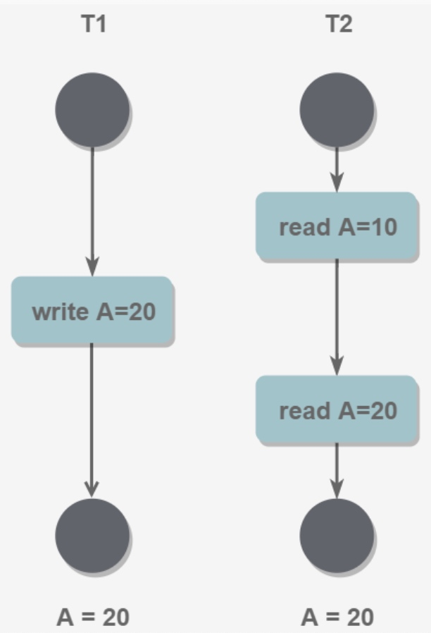

# 【Mysql】数据库原理

* [【Mysql】数据库原理](#mysql数据库原理)
    * [事务](#事务)
    	* [ACID 特性](#ACID-特性)
    	* [并发事务问题](#并发事务问题)
    	* [隔离级别](#隔离级别)
    	* [事务日志](#事务日志)
    	* [事务操作](#事务操作)
    	* [锁的分类](#锁的分类)
    	* [表级锁](#表级锁)
    	* [行级锁](#行级锁)
    	* [封锁协议](#封锁协议)
    * [隔离级别实现](#隔离级别实现)
    	* [MVCC](#MVCC)
    	* [Next-Key 锁](#Next-Key-锁)
    * [关系设计](#关系设计)
    	* [范式](#范式)
    	* [ER 图](#ER-图)
    * [数据库性能优化](#数据库性能优化)

## 事务
事务是指逻辑上的一组 SQL 语句操作，执行时要么全部成功，要么全部失败，满足 ACID 四大特性

使用 `Commit` 来提交事务，保存全部操作；使用 `Rollback` 或发生 `Error` 都会回滚事务，撤销全部操作


### ACID 特性
- **原子性（Atomicity）**：事务被视为不可分割的最小单元，事务中的所有操作，要么全部执行成功，要么全部执行失败

- **一致性（Consistency）**：数据库在事务执行前后都保持一致性状态。在一致性状态下，数据满足所有定义的完整性约束

- **隔离性（Isolation）**：一个事务所做的修改在提交以前，对其它事务是不可见的

- **持久性（Durability）**：一旦事务提交，则其所做的修改将会永远保存到数据库中

> 事务的回滚是通过回滚日志（Undo Log）来实现的，回滚日志记录着事务所执行的修改操作，在回滚时反向执行这些修改操作即可
> 
> 当系统发生奔溃时，通过重放日志（Redo Log）进行恢复，从而实现事务的持久性。与回滚日志记录数据的逻辑修改不同，重放日志记录的是数据页的物理修改

ACID 特性的举例说明：
- 原子性

```
银行转账场景，从 A 账户转 10 元至 B 账户，需要经过两个步骤：
1、从 A 账户取 10 元
2、存入 10 元至 B 账户
这两步要么一起完成，要么一起不完成
```

- 一致性

```
现有完整性约束 A 账号+ B 账号 = 100 元
如果一个事务改变了 A 账号，那么必须得改变 B 账号
事务结束后需要仍然满足完整性约束，否则事务失败
```

- 隔离性

```
在交易的过程中，从 A 账户转了 10 元至 B 账户
在这个交易还未完成的情况下，如果此时查询 B 账户，无法看到新增的 10 元
```

- 持久性

```
交易一旦完成，A 账户和 B 账户的余额就被永久保存下来，即使系统发生崩溃也不会丢失
```

ACID 特性间的层层递进：
- 事务只有满足一致性，其执行结果才是正确的

- 在无并发的情况下，多个事务串行执行，隔离性一定能够满足。此时只要能满足原子性，就一定能满足一致性

- 在并发的情况下，多个事务并行执行，事务不仅要满足原子性，还需要满足隔离性，才能满足一致性。

- 事务满足持久性是为了能应对系统崩溃的情况


### 并发事务问题
在并发环境下，事务的隔离性很难保证，因此会出现很多一致性问题，常见的问题有：

- **丢失更新（Lost Update）** 

  当两个或多个事务选择同一行进行更新，由于每个事务都不知道其他事务的存在，第一类丢失是当一个事务回滚更新，会丢失在它之前其他事务提交的更新，即回滚丢失；第二类丢失是当一个事务提交更新，会覆盖在它之前其他事务提交的更新，即提交丢失
  
  

- **脏读（Dirty Reads）** 

  一个事务读取到了另一个事务已经修改但尚未提交的数据，并且在这个数据基础上做了操作，这时如果后者回滚，那么前者读取的数据无效，不符合一致性要求
  
  

- **不可重读（Non-Repeatable Reads）**
 
  一个事务在读取某些数据后，再次读取这个数据时，却读取到了另一个事务对该数据已经修改并提交的操作，不符合隔离性的要求
　　
  
　　 
- **幻读（Phantom Reads）**

  本质上也属于不可重复读，一个事务按相同的查询条件重新读取以前检索过的数据，却发现其他事务插入了满足其查询条件的新数据，不符合隔离性的要求

  

### 隔离级别
隔离级别指对于并发事务的隔离性，数据库存在着不同程度的保证机制，这个机制在不同程度上解决了并发一致性的问题

标准的隔离级别：
- **未提交读（Read uncommitted**）：事务中的修改，即使没有提交，对其它事务也是可见的

- **已提交读（READ COMMITTED）**：一个事务所做的修改在提交之前对其它事务是不可见的

- **可重复读（Repeatable read）**：保证在同一个事务中多次读取同一数据的结果是一样的

- **可串行化（Serializable）**：强制读取同一数据的事务串行执行，这样多个事务互不干扰，不会出现并发一致性问题

> 可串行化的隔离级别需要通过锁实现，因为要保证同一时间只有一个事务执行，即事务串行执行

| 隔离级别 | 回滚丢失 | 提交丢失 | 脏读 | 不可重复读 | 幻读 |
| --- | ---| --- | --- | --- | --- |
| 未提交读 | 否 | 是 | 是 | 是 | 是 |
| 已提交读 | 否 | 是 | 否 | 是 | 是 |
| 可重复读 | 否 | 否 | 否 | 否 | 是 |
| 可串行化 | 否 | 否 | 否 | 否 | 否 |

### 事务日志
事务日志分为 **回滚日志（Undo Log）** 和 **重放日志（Redo Log）**，用于保证事务的持久性，避免在脏页刷回磁盘过程中，掉电或系统故障带来的数据丢失、数据不一致问题

Undo 日志是逻辑日志，InnoDB 为了维护事务的原子性、一致性，以逻辑日志的形式记录了事务提交前的数据版本，以便于数据回滚

Undo 日志同时也用来实现 **多版本并发控制（MVCC）**，即两个事务可以并发执行分别读和写同一条数据，读到的数据是该数据通过 Undo 日志记录的快照版本

Redo 日志物理日志，InnoDB 为了确保事务的持久性，以物理日志的形式记录了所有对数据的操作，用于数据重做

对于 Redo 日志而言，Undo 日志是数据，因此在记录 Undo 日志之前，会先在 Redo 日志写入一条记录 Undo 日志的记录，因此在 Redo 日志重做时，也会把 Undo 日志恢复最新状态

为了保证事务的原子性、一致性和持久性，InnoDB 中事务的执行过程如下：
1. 事务执行到修改数据库中数据的操作时，InnoDB 会先将对应数据页从磁盘缓存到缓冲池中
2. 写入 Undo 日志到缓冲池的 Undo 页，并 Undo 页的修改写入到 Redo 日志缓冲
3. 修改缓冲池中的对应数据页，并数据页的修改写入到 Redo 日志缓冲
4. 事务提交后，InnoDB 会将该事务对应的 Undo 日志放入待清理的链表，由 purge 线程进行清理

> 在上述过程中，InnoDB 会根据相关的配置和规则，将缓冲池中的脏数据、脏日志持久化到磁盘上

在数据库崩溃或者机器宕机后，数据库再启动时 InnoDB 会利用事务日志来恢复数据，其过程是：
1. 首先通过 Redo 日志重做所有事务（包括未提交的事务），使得 Undo 日志更新到最新状态
2. 通过 Undo 日志回滚那些未提交的事务，再将 Undo 日志放入待清理的链表，由 purge 线程进行清理

> Redo 日志是物理日志，重复应用不会影响数据，Undo 日志是逻辑日志，不可以重复应用，因此事物提交后或者应用后需要删除

### 事务操作
MySQL 默认采用自动提交模式，也就是说，如果不显式地开始一个事务，那么每个 SQL 操作都会被当做一个事务并根据设置自动提交

设置自动提交模式：
``` sql
# 0 为禁止自动提交，1 为开启
SET AUTOCOMMIT=0 
```

事务操作：
``` sql
# 显式开启事务，两个方式
START TRANSACTION
BEGIN

# 回滚事务，回到事务开始前状态
ROLLBACK 

# 提交事务
COMMIT 
```

## 锁
锁是数据库用来协调多个线程并发访问数据的机制，保证数据的一致性、有效性

锁机制是需要消耗资源的，锁的各种操作，包括获得锁、检测锁是否已释放、释放锁等，都会增加系统的开销

### 锁的分类
根据锁对数据的操作粒度区分：
- 表级锁

  开销小，加锁快，不会出现死锁
  锁定粒度大，锁冲突概率高，读写之间是串行的，并发能力低
  适合于查询为主，少量更新数据的应用

- 行级锁

  开销大，加锁慢，会出现死锁
  锁定粒度小，锁冲突概率低，在默认的隔离级别下读写是并行的，并发能力高
  适合于大量按索引条件并发更新数据，又有并发查询的应用

> 在 MySQL 中，不同的存储引擎支持不同的锁机制，比如 MyISAM 和 MEMORY 使用的是表级锁，InnoDB 默认使用的是行级锁，同时也支持表级锁
> 
> InnoDB 的行级锁是通过给索引项加锁来实现的，因此只有通过索引条件来检索数据，才使用行级锁；否则使用的是表级锁

根据锁的兼容性分：
- 共享锁（S锁）
 
  读锁，在同一个数据对象上可以存在多个共享锁
    
- 排他锁（X锁）

  写锁，在同一个数据对象上只能存在一个排他锁
  
### 表级锁
由 MySQL 本身提供支持，锁归属于线程，主要通过 4 个队列来维护锁定信息：
- Current read-lock queue （当前读锁队列)
- Pending read-lock queue (等待读锁队列)
- Current write-lock queue (当前写锁队列)
- Pending write-lock queue (等待写锁队列)

> 当读、写锁的等待队列中出现对同一个表的锁定信息时，等待写锁队列默认优先级更高
>
> 这也是为什么 MYISAM 不适合作为写操作为主的表的存储引擎，因为表加了写锁后，其他线程不能做任何操作，大量的更新会使查询很难得到锁，从而造成永久阻塞
>
> 可以通过配置变量 `low-priority-updates` 的值为 1，使等待读锁队列的优先级更高，由于读锁是共享锁，因此可以减少表级锁冲突的情况，但会降低写的效率

**隐式锁操作**

MyISAM 和 MEMORY 在执行读操作前，会给涉及的表加读锁，在执行写操作前，会给涉及的表加写锁
> 读操作语句：SELECT
> 写操作语句：UPDATE、DELETE、INSERT

操作完成后释放相应的锁，如果线程断开，也会释放该线程获取的所有锁

因此线程自动断开的空闲超时，会影响锁表的最大时间，修改空闲超时的方法有：

- 修改局部变量（只对当前线程生效）
``` sql
SET wait_timeout = 28800
```

- 修改全局变量（服务重启前生效）
``` sql
SET GLOBAL wait_timeout = 28800
```

- 修改配置文件（永久生效）

``` ini
# 对于非交互式连接，如 JDBC，局部变量 wait_timeout 的值继承自以下全局变量
wait_timeout = 28800

# 对于交互式连接，如 mysql 客户端，局部变量 wait_timeout 的值继承自以下全局变量
interactive_timeout = 28800
```

> 指定线程的当前空闲时间可以在 `show processlist` 中查看

**显式锁操作**

**1、对表加锁**

``` sql
LOCK TABLES tbl_name lock_type;
```
以下为可选的 lock_type：

- **read（读锁）**：禁止当前线程对该表的写操作，阻塞其他线程对该表的写操作
- **write（写锁）**：阻塞其他线程对该表的读、写操作
- **read local（本地读锁）**：对于 MySIAM 表，则根据变量 `concurrent_insert` 的值确定是否允许其他线程在该表的尾部并发插入数据，对于其他引擎的表，效果和读锁一样
> 当 `concurrent_insert` 为 0 时，不允许并发插入
> 当 `concurrent_insert` 默认为 1 ，如果表中没有空洞，即表中间没有被删除的行，允许并发插入
> 当 `concurrent_insert· 为 2 时，始终允许并发插入
- **low_priority write（低优先级写锁）**：效果和写锁一致，但本次写锁的锁定优先级低于读锁，默认情况下，写锁的锁定优先于读锁
> 从 MySQL 5.6.5 及以后的版本，弃用该类型的锁

注意持有表锁的线程不允许操作其他未加锁的表
    
MySQL 在每次执行 `LOCK TABLES` 前都会先释放当前的表锁，因此对多个表同时加锁需要在一条语句中完成：
    
``` sql
LOCK TABLES tbl_name1 lock_type,tbl_name2 lock_type,tbl_name3 lock_type;
``` 

**2、全局读锁**

``` sql
FLUSH TABLES WITH READ LOCK;
```

关闭所有已打开的表，禁止当前线程对所有表的写操作，阻塞其他线程对所有表的写操作，一般用于数据备份以保证数据一致性

**3、释放所有锁**

``` sql
UNLOCK TABLES;
```

**4、锁状态查询**

- 查看打开的表以及锁定状态

``` sql
SHOW OPEN TABLES;
```

列出在表对象缓存中的非临时表，如果其 in_use 列的值为1，表示其为已加锁的表
> 表对象缓存，是将某个打开过的表对象字典信息缓存到内存中，以提高对表访问的效率，能缓存表的最大数量由变量 `table_open_cache` 配置

- 查看表级锁的锁冲突情况

``` sql
SHOW STATUS LIKE 'table_locks%';
```

变量的含义：
- `table_locks_immediate`：所有线程立即获得表级锁的总次数
- `table_locks_waited`：所有线程等待后获得表级锁的总次数
 
若后者占两者之和比例过大，则表级锁的锁冲突情况严重

### 行级锁
由 InnoDB 引擎提供支持，锁归属于事务，是通过对索引项加锁来实现的，因此如果两个事务的语句对同一个索引项加锁，虽然访问的是不同行的记录，但是也会发生锁冲突

``` sql
# 以下两个语句会发生锁冲突
SELECT FROM table WHERE id = 1 AND name = ‘z’ FOR UPDATE;
SELECT FROM table WHERE id = 1 AND name = ‘h’ FOR UPDATE;
```

当 InnoDB 所操作的表没有索引，或者语句没有使用到索引的情况下，会无法使用行锁，因此会使用表锁代替

> 即便在检索条件中使用了索引字段，但是否使用索引来检索数据是由 MySQL 通过判断不同执行计划的代价来决定的，如果 MySQL 认为全表扫描效率更高，就不会使用索引
> 
> 可以通过 `EXPLAIN` 来查看语句的索引使用情况

**隐式锁操作**

当语句使用了索引检索数据时，InnoDB 会为写操作所涉及的数据行加上写锁，而读操作默认不会加任何锁，除非使用显式锁操作

> 在可重复读的隔离级别中，读操作 `SELECT` 不加锁，而是通过一定机制生成一个数据请求时间点的一致性数据快照（Snapshot)，并用这个快照来提供事务级的一致性读取
> 
> 从用户的角度来看，好像是数据库可以提供同一数据的多个版本，因此这种技术叫做数据多版本并发控制（MVCC）

在语句操作完成后，释放相应的锁，当事务 `COMMIT`提交或者 `ROLLBACK` 回滚时，释放当前事务获取的所有锁

**显式锁操作**

- 读锁
``` sql
SELECT tbl_name WHERE condition LOCK In SHARE MODE;
```

- 写锁
``` sql
SELECT tbl_name WHERE condition FOR UPDATE;
```

**意向锁**

InnoDB 在为所涉及的数据行加锁前，必须先取得这些行所在表的对应意向锁：
- 在给数据行加读锁前，必须先取得的意向共享锁（IS）
- 在给数据行加写锁前，必须先取得的意向排他锁（IX）

通过引入意向锁，当一个事务想要对表 A 加 X 锁，只需要先检测是否有其它事务对表 A 加了 X/IX/S/IS 锁，就可以知道是否有其它事务对表 A 或者表 A 中的任意一行加了锁，而不需要检测表 A 中的每一行

在 Innodb 中，可能出现的四种表级锁的兼容性：

|  | S | IS | X | IX |
| --- | --- | --- | --- | --- |
| S | 兼容 | 兼容 | 冲突 | 冲突 |
| IS | 兼容 | 兼容 | 冲突 | 兼容 |
| X | 冲突 | 冲突 | 冲突 | 冲突 |
| IX | 冲突 | 兼容 | 冲突 |兼容|

> 任意 IS/IX 锁之间都是兼容的，因为它们只表示想要对表加锁，而不是真正加锁
> 这里兼容关系针对的是表级锁，而表级的 IX 锁和行级的 X 锁兼容，两个事务可以对两个数据行加 X 锁

**锁状态查询**

- 查看行级锁的锁冲突情况：
``` sql
SHOW STATUS LIKE 'innodb_row_lock%';
```
变量的含义
- `Innodb_row_lock_current_waits`: 当前正在等待锁定的数量 
- `Innodb_row_lock_time`: 从系统启动到现在锁定总时间长度 
- `Innodb_row_lock_time_avg`: 每次等待所花平均时间 
- `Innodb_row_lock_time_max`：从系统启动到现在等待最长的一次所花时间 
- `Innodb_row_lock_waits`:系统启动后到现在总共等待的次数

如果 `InnoDB_row_lock_waits` 和 `InnoDB_row_lock_time_avg` 的值比较高，则锁冲突的情况比较严重

**死锁**

两个或两个以上的事务在执行过程中，因相互持有对方所需要的锁时，造成互相等待锁释放的现象，若无外力作用，所有线程都无法继续执行下去

InnoDB 能自动检测死锁，并使一个事务释放锁并回退，另一个事务获得锁后继续完成事务 

### 封锁协议
**三级封锁协议**

在运用 X 锁和 S 锁对数据对象加锁时，需要约定一些规则，如何时申请、持锁时间、何时释放等，这些规则称为封锁协议（Locking Protocol）

对封锁方式规定不同的规则，就形成了各种不同的封锁协议。不同的封锁协议，在不同的程度上解决了并发操作的一致性问题

- 一级封锁协议

  事务 T 要修改数据 A 时必须加 X 锁，直到 T 结束才释放锁

  

  可以解决丢失修改的问题，因为不能同时有两个事务对同一个数据进行修改，那么事务的修改就不会被覆盖

- 二级封锁协议

  在一级的基础上，要求读取数据 A 时必须加 S 锁，读取完马上释放 S 锁
  
  

  可以解决读脏数据问题，因为如果一个事务在对数据 A 进行修改，根据 1 级封锁协议，会加 X 锁，那么就不能再加 S 锁了，也就是不会读入数据

- 三级封锁协议

  在二级的基础上，要求读取数据 A 时必须加 S 锁，直到事务结束了才能释放 S 锁
  
  

  
  可以解决不可重复读的问题，因为读 A 时，其它事务不能对 A 加 X 锁，从而避免了在读的期间数据发生改变

**两段锁协议**

事务中所有的加锁操作和释放锁操作，分为两个阶段来进行

遵循两段锁协议，是事务保证可串行化调度的充分条件，但不是必要条件。因为它防止了其他事务在本事务执行期间对相同的数据进行操作，从而导致数据最终不一致的情况

例如以下操作满足两段锁协议，它是可串行化调度

```
lock-x(A)...lock-s(B)...lock-s(C)...unlock(A)...unlock(C)...unlock(B)
```
> 可串行化调度是指，通过并发控制，使得并发执行的事务结果与某个串行执行的事务结果相同，即不会出现并发一致性问题

## 隔离级别实现
InnoDB 默认的隔离级别是可重复读，通过自有的 MVCC 机制实现，并搭配 Next-Key 锁额外解决了幻读的问题

在 InnoDB 中，读数据的操作可以分为两种，对于并发问题的解决，在 MVCC 中有着不同的实现：
- SELECT（读操作）读数据，即读写并发问题

  读取的数据是快照中的数据，即快照读，通过 MVCC 实现，不需要加锁操作，但读到的数据可能是历史数据，不是当前的数据，因此解决了快照读的脏读、不可重复读、幻读问题

- `INSTER`、`UPDATE`、`DELETE`（写操作）读数据，即写写并发问题

  读取的数据是当前数据，也就是当前读，需要进行加锁操作，并通过 Next-Key 锁解决了脏读、不可重复读、幻读的问题

> MVCC 并不是完全不用加锁，而只是避免了 SELECT 的加锁操作
> 
> 可重复读的隔离级别下，MVCC 的加锁操作对于用户是隐式锁操纵，并且遵循三级封锁协议
> 
> 隐式锁操作遵循两段锁协议，所有的锁都是在同一时刻被释放

### MVCC
多版本并发控制（Multi-Version Concurrency Control, MVCC）是 MySQL 的 InnoDB 存储引擎实现隔离级别的一种具体方式，用于实现提交读和可重复读这两种隔离级别

未提交读隔离级别总是读取最新的数据行，要求很低，无需使用 MVCC，可串行化隔离级别需要对所有读取的行都加锁，单纯使用 MVCC 无法实现

MVCC 利用了多版本的思想，写操作更新最新的版本快照，而读操作去读旧版本快照，没有互斥关系

脏读和不可重复读最根本的原因是事务读取到其它事务未提交的修改。在事务进行读取操作时，为了解决脏读和不可重复读问题，MVCC 规定只能读取已经提交的快照

**Undo 日志**

快照存储在 Undo 日志中，该日志通过回滚指针 `ROLL_PTR` 把一个数据行的所有快照连接起来，结合所维护的当前系统未提交的事务列表 `TRX_IDs`，可以定位到已经提交的快照

事务的 `INSERT`、`UPDATE`、`DELETE` 操作会创建一个日志，并将事务版本号 `TRX_ID` 写入

SQL 语句操作：
``` sql
INSERT INTO t(id, x) VALUES(1, "a");
UPDATE t SET x="b" WHERE id=1;
UPDATE t SET x="c" WHERE id=1;
```

Undo 日志：


> `INSERT`、`UPDATE`、`DELETE` 操作会创建一个日志，并将事务版本号 `TRX_ID` 写入
>
> `DELETE` 可以看成是一个特殊的 `UPDATE`，还会额外将 `DEL` 字段设置为 1

### Next-Key 锁
InnoDB 行锁存在三种锁实现：
- 行锁（Record Lock）

  按照符合检索条件的，存在记录的索引项加锁

- 间隙锁（Gap Lock）

  当语句使用的是范围条件而不是使用相等条件，来请求共享或排他锁时，InnoDB 会给符合条件的的索引项加锁，无论该索引项是否已存在记录，而对于这些索引项在条件范围内但并不存在的记录，叫做间隙（GAP 锁)
  > 当语句使用的是相等条件，来请求给一个不存在的记录加锁时，InnoDB 也会使用间隙锁

- Next-Key 锁：

  行锁和间隙锁的结合使用

  其中行锁防止其他事务修改或删除记录，解决了当前读的脏读和不可重复读问题

  间隙锁防止其他事务新增记录，解决了当前读的幻读问题

  行锁和间隙锁结合形成的 Next-Key 锁，就解决了上述的所有问题

 > 在实际应用开发中，尤其是并发插入比较多的应用，应该避免过度使用到间隙锁，因此需要优化业务逻辑，尽量使用相等条件来代替范围条件来检索数据

## 关系设计
### 范式
**函数依赖**

设 A、B 是关系 R 的两个属性集合，当任何时刻 R 中的任意两个元组中的 A 相同时，它们的 B 也相同，则记为 `A->B`，表示 A 决定了 B ，或 B 依赖于 A  

如果 `{A1，A2，... ，An}` 是关系 R 的一个属性集合，该集合函数决定了关系 R 的其它所有属性并且是最小的集合，那么该集合就称为键码

对于 `A->B`，如果能找到 A 的真子集 A'（小于 A 的子集），使得 `A'->B`，那么 B 对 A 是部分函数依赖，否则就是完全函数依赖

对于 `A->B`，`B->C`，则 `A->C` 是一个传递函数依赖

**异常**

以下的学生课程关系的函数依赖为 `{Sno, Cname}` -> `{Sname, Sdept, Mname, Grade}`，键码为 `{Sno, Cname}`：

| Sno	| Sname | Sdept | Mname | Cname | Grade |
| --- | --- | --- | --- | --- | --- |
| 1 | 学生-1 | 学院-1 | 院长-1	| 课程-1 | 90 |
| 2 | 学生-2 | 学院-2 | 院长-2	| 课程-2 | 80 |
| 2 | 学生-2 | 学院-2 | 院长-2 | 课程-1 | 100 |
| 3 | 学生-3 | 学院-2 | 	院长-2 | 课程-2 | 95 |

不符合范式的关系，会出现以下四种异常情况：
- 冗余数据：例如 `学生-2` 出现了两次

- 修改异常：修改了一个记录中的信息，但是另一个记录中相同的信息却没有被修改

- 删除异常：删除一个信息，那么也会丢失其它信息。例如删除了 `课程-1` 需要删除第一行和第三行，那么 `学生-1` 的信息就会丢失

- 插入异常：例如想要插入一个学生的信息，如果这个学生还没选课，那么就无法插入

**三大范式**

范式理论是为了解决以上提到四种异常，高级别范式的依赖于低级别范式：

- 第一范式：属性不可分

- 第二范式：每个非主属性完全函数依赖于键码
  
  原本存在的函数依赖：
  `Sno -> Sname, Sdept`
  `Sdept -> Mname`
  `Sno, Cname-> Grade`
  
  可以通过将属性分解为两个关系来满足，分解后：
  
| Sno	| Sname | Sdept | Mname |
| --- | --- | --- | --- | 
| 1 | 学生-1 | 学院-1 | 院长-1	|
| 2 | 学生-2 | 学院-2 | 院长-2	|
| 2 | 学生-2 | 学院-2 | 院长-2 |
| 3 | 学生-3 | 学院-2 | 	院长-2 |
 
 有以下函数依赖：
 `Sno -> Sname, Sdept`
 `Sdept -> Mname`
 
| Sno	| Cname | Grade |
| --- | --- | --- |
| 1 | 课程-1 | 90 |
| 2 | 课程-2 | 80 |
| 2 | 课程-1 | 100 |
| 3 | 课程-2 | 95 |

 有以下函数依赖：
 `Sno, Cname-> Grade`
 
- 第三范式：非主属性不传递函数依赖于键码

 分解后第一个关系，存在以下传递函数依赖：
 `Sno -> Sdept -> Mname`
 
 需要再通过将属性分解为两个关系来满足，分解后：
 
| Sno	| Sname | Sdept |
| --- | --- | --- |
| 1 | 学生-1 | 学院-1 |
| 2 | 学生-2 | 学院-2 |
| 3 | 学生-3 | 学院-2 |

 有以下函数依赖：
 `Sno -> Sname, Sdept`
 
| Sdept | Mname |
| --- | --- | 
| 学院-1 | 院长-1	|
| 学院-2 | 院长-2	|

  有以下函数依赖：
  `Sdept -> Mname`

### ER 图
实体关系图（Entity-Relationship），有三个组成部分：实体、属性、关系，用来进行关系型数据库系统的概念设计

**组成表示**

- 实体：使用矩形表示
- 属性：使用椭圆形表示，和实体之间用线段连接，键码属性下划线表示
- 关系：使用菱形表示

**关系表示**

- A 对 B 是一对多关系：关系用线段连接 A，用带箭头线段指向 B
- A 对 B 是一对一关系：关系用两个带箭头分别指向 A 和 B
- A 对 B 是多对多关系：关系用两个线段分别连接 A 和 B

上述学生课程关系的 ER 图：


**多次关系**

一个实体出现几次关系，就要用几条线连接

下图表示一个课程的先修关系，先修关系出现两个 Course 实体，第一个是先修课程，后一个是后修课程，因此需要用两条线来表示这种关系


**子类**

用一个三角形和两条线来连接类和子类，与子类有关的属性和都连到子类上，而与父类和子类都有关的连到父类上


## 数据库性能优化
数据库的性能优化可以从底层到上层逐步考虑：
1. 服务器硬件优化
2. Mysql 服务配置优化
3. SQL 语句使用优化
4. 反范式设计优化
5. 索引优化

SQL 语句优化，可以根据慢查询日志进行，打开日志并设置好慢查询时间阈值，然后使用慢查询日志分析工具来分析日志，如原生 perl 工具 `mysqldumpslow.pl`

反范式化设计优化，指适当违反三大范式以提高查询效率，以空间交换时间，比如字段可以适量冗余来提高查询性能