# 【Mysql】索引知识

* [【Mysql】索引知识](#mysql索引知识)
    * [简介](#简介)
    * [底层数据结构](#底层数据结构)
    	* [哈希](#哈希)
    	* [BTREE](#BTREE)
    * [索引实现](#索引实现)
    	* [非聚集索引](#非聚集索引)
    	* [聚集索引](#聚集索引)
    * [索引分析](#索引分析)
    	* [执行计划](#执行计划)
    	* [优化策略](#优化策略)

## 简介
**索引（Index）** 是帮助 Mysql 来 **高效查询数据** 的 **数据结构**

索引分类：
- 唯一索引：索引列的值必须唯一，但允许有空值
- 普通索引：一个索引只包含单个列
- 复合索引：一个索引包含多个列

索引的创建修改：
``` sql
# 查看索引
SHOW INDEX FROM table_name;

# 创建索引
CREATE [UNIQUE] INDEX index_name ON table_name(column_name(length));
ALTER TABLE index_name ADD [UNIQUE] INDEX [index_name] ON (column_name(length)) 

# 删除索引
DROP INDEX [index_name] ON table_name;
ALTER TABLE index_name DROP [UNIQUE] INDEX [index_name];
```

适合建立索引的条件：
- 较频繁的作为查询条件的字段应该创建索引

- 更新非常频繁的字段不适合创建索引，这样会增大更新的 IO 开销

- 唯一性太差的字段不适合单独创建索引，即使该字段频繁作为查询条件，因为对于大量数据来说，先访问索引再定位到数据，可能会比直接遍历数据要慢，毕竟访问索引需要付出额外的 IO 开销

## 底层数据结构
### 哈希
也称为散列，就是把任意 key 通过哈希函数映射为固定长度的哈希值（或者叫哈希桶 bucket），而哈希值则对应着内存地址，再通过该地址来存放具体数据的数据结构

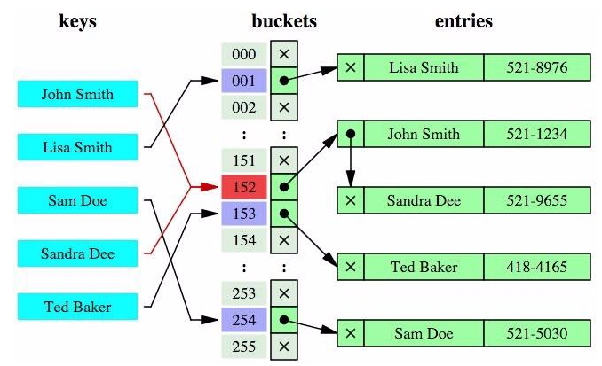

哈希函数的算法存在一个碰撞问题，即不同的 key 有可能会映射到相同的哈希值解决碰撞问题的常见处理方式是链地址法

链地址法，即用链表把碰撞的数据接连起来，查找时计算出哈希值后，还需要检查该哈希值是否存在碰撞数据链表，有则一直遍历链表，直到找到 key 真正对应的数据

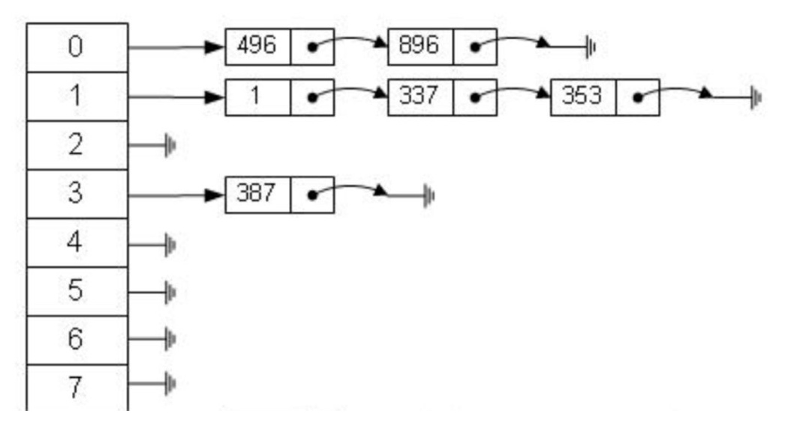

哈希算法的时间复杂度是 $O(1)$，因此哈希索引在非大量碰撞产生的情况下检索速度非常快，但其无法实现高效率的范围查询

mysql 中只有 Memory/Heap 引擎支持哈希索引，且只有在使用 `=` 条件下才会用到索引

### BTREE
指的是使用 B+ 树数据结构，mysql 中所有存储引擎（InnnoDB、MyISAM、Memory/Heap 和 NDB）都支持 BTREE 索引

在使用 B+ 树前的相关树结构如下：

**二叉查找树**

也称为有序二叉查找树，满足二叉查找树的一般性质且结点是有序的

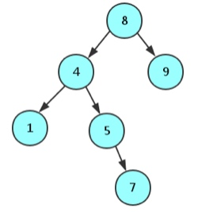

其局限性是在极端情况下可能会退化为一个 N 长度的单向链表，二分查找则退化为遍历查找，查找的时间复杂度退化为 $O(n)$，效率大大降低

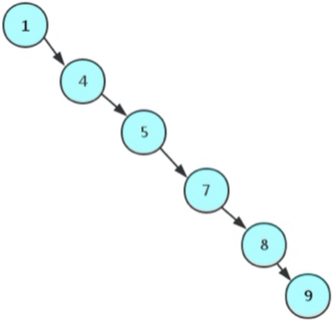

**红黑树**

是一种自平衡二叉查找树，具有非严格的平衡条件，即从根结点到叶子结点的最长路径不会是最短路径的 2 倍

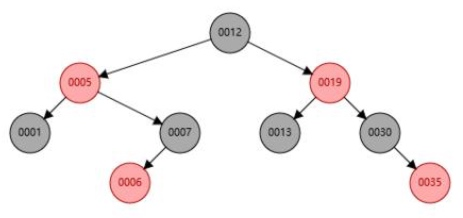

用非严格的平衡条件来换取插入、删除操作时的旋转次数降低，任何不平衡都会在三次旋转之内解决，但会比 AVL 树会稍微不平衡

因此红黑树的查找性能略微逊色于 AVL 树，但是插入、删除性能比 AVL 树高非常多，适合查找、插入、删除都比较多的情况

由于没有严格平衡，因此虽然解决了二叉树的极端情况，顺序插入结点仍然会存在"左倾"或"右倾"的现象，查询的时间复杂度为 $O(log_{2}n)$，当节点数很大时查找性能会有严重的降低

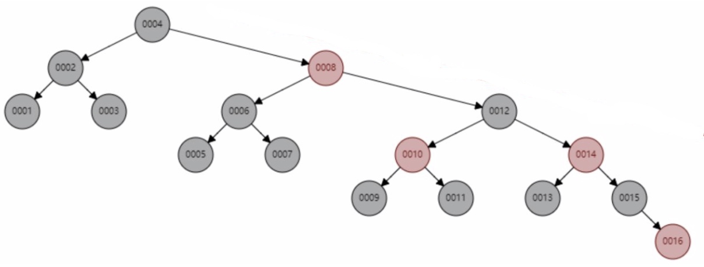

**AVL 树**

也是一种自平衡二叉查找树，具有严格的平衡条件，即所有结点的左右子树高度差不能大于 1

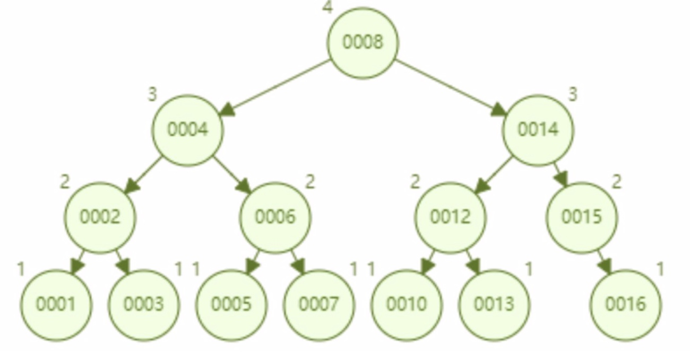

在插入还是删除结点时，只要不满足严格的平衡条件，就要通过旋转来保持其平衡，而旋转是非常耗时的，因此适合用于插入、删除比较少，但查找多的情况

AVL 树完全解决了红黑树的"左倾"或"右倾"现象，但由于每个结点只存储一个数据，对结点进行几次比较则需要几次磁盘 IO 操作，这个开销非常大

**B 树**

是一种自平衡多路搜索树，是多叉树而非二叉树，并且每个结点可以存在多个 key，但保证了数据有序

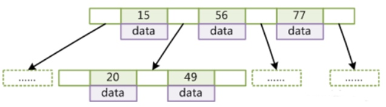

M 阶 B 树（M>2）表示每个节点最多包含 M 个孩子结点和 M-1 个键，4 阶 B 树的数据插入过程：


可通过 [这个网站](https://www.cs.usfca.edu/~galles/visualization/BTree.html) 查看 B 树插入结点的动态过程

在查找、插入、删除的时间复杂度都能保持在 $O(log_{2}n)$，由于尽可能地减少了磁盘 IO 开销，因此提升了检索性能

**B+ 树**

是 B 树的变体，也是一种是一种自平衡多路搜索树，是多叉树而非二叉树，其具体区别是：
- B 树中每个非叶子节点都存着数据，而 B+ 树中每个非叶子节点存储着孩子节点的地址，由于地址不大，使得 B+ 树的非叶子节点能存下很多索引，而叶子节点中则存着所有的数据
- B+ 树中存着数据的叶子节点之间通过一个有序链表串联起来

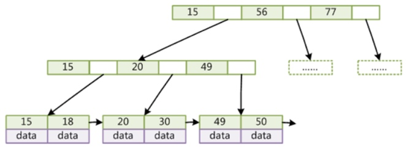

由于 B+ 树必须到达叶子结点才能命中数据，其查询的时间复杂度稳定在 $O(log_{2}n)$，并且树的高度更低，磁盘 IO 的次数更少，叶子节点形成有序链表也方便了范围查询

## 索引实现
索引实现指的是对于索引和数据的不同组织方式，对于两种储存引擎 MyISAM 和 InnoDB，分别使用了两种不同的索引实现

### 非聚集索引
是 MyISAM 使用的索引实现，指索引树上不储存数据，即表现为两个磁盘文件，并且主键索引和辅助索引的储存方式是一样的

使用 MyISAM 创建表后生成的文件有：
- `.frm`：创建表的语句
- `.MYD`：表的数据文件（MyISAM Data）
- `.MYI`：表的索引文件（MyISAM Index）

主键索引：
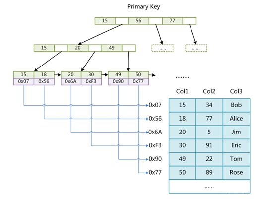

辅助索引：
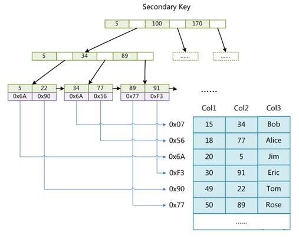

### 聚集索引
是 InnoDB 使用的索引实现，指索引树上同时储存数据，即表现为同一个磁盘文件，并且主键索引和辅助索引的储存方式是不同的，辅助索引的叶子节点不储存数据，仅储存主键值

使用 Innodb 创建表后生成的文件有：
- `.frm`：创建表的语句
- `.idb`：表的数据和索引文件

主键索引：
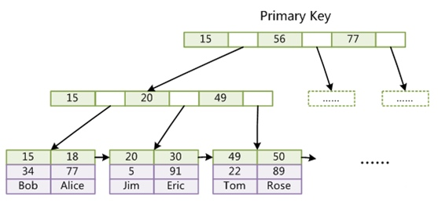

辅助索引：
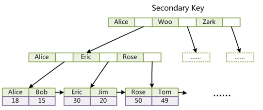

辅助索引的叶子节点仅储存主键，一是节省存储空间，二是保证数据一致性，在数据更新时只需要更新主键索引的数据即可

InnoDB 推荐必须有主键，因为辅助索引中存放着主键，如果没有主键 mysql 则会自行生成一个 rowid 作为自增主键

InnoDB 推荐使用整形自增主键，一是方便查找比较，二是新增数据的时候只需要在树末尾加入，不会大规模调整树结构。如果是 UUID 这种无序主键，新增数据时也极有可能在树中间插入数据，会导致树结构大规调整，造成插入效率变慢，同时频繁的移动、分页操作会造成索引产生大量碎片，后续只能通过重建表并优化存储空间

从辅助索引的储存方式可以体现出 MyISAM 非主键查询性能更好，MyISAM 从辅助索引找到物理地址后就可以直接定位到数据，但 InnoDB 则需要再查询一次主键索引，才可以定位到数据

## 索引分析
### 执行计划
可以模拟 MySQL 优化器执行 SQL 查询语句，从而分析查询语句或是表结构的性能瓶颈

使用方式：
``` sql
EXPLAIN SQL 查询语句
```

结果字段：
```
+------+-------------+-------+------+---------------+------+---------+------+------+-------+
| id   | select_type | table | type | possible_keys | key  | key_len | ref  | rows | Extra |
+------+-------------+-------+------+---------------+------+---------+------+------+-------+
```

字段含义：
- id

    查询序号，表示查询子句的执行顺序，相同的 id 表示从上往下顺序执行，不同的 id 则值越大越优先执行，对于子查询其 id 会递增

- select_type

    查询类型，常用的以下类型：
    
    | 类型 | 描述 |
    | --- | --- |
    | SIMPLE | 简单查询，不包含子查询或者 `UNION` |
    | PRIMARY | 当查询中包含子查询时，在最外层的查询 |
    | SUBQUERY | 在 `SELECT` 或 `WHERE` 列表中的子查询 |
    | DERIVED | 在 `FROM` 列表中的子查询 |
    | UNION | 在 `UNION` 之后的 `SELECT` 语句 |
    | UNION RESULT | 对于 UNION 结果的查询 |
    
- table

    所查询的表
    
- type

    连接类型，性能从好到坏依次为：
    NULL > **system** > **const** > **eq_ref** > **ref** > fulltext > ref_or_null > index_merge > unique_subquery > index_subquery > **range** > **index** > **ALL**
    其中加粗的类型为常见类型：
    
    | 类型 | 描述 |
    | --- | --- |
    | system | 表只有一条记录，是 const 的特例 |
    | const | 通过索引一次性完成查找 |
    | eq_ref | 唯一性索引扫描，对于每个索引键，只存在一条记录相匹配 |
    | ref | 非唯一性索引扫描，匹配某个值的所有行 |
    | range | 使用一个索引来检索给定范围的行 |
    | index | 按照索引的顺序，遍历全表数据以找到所匹配的行 |
    | ALL | 遍历全表数据以找到所匹配的行 |

    一般来说需要保证查询至少达到 range 级别
 
- possible_keys
    
    可能使用到的索引

- key

    实际使用到的索引
    
- key_len

    索引中使用的字节数，可通过该列计算出查询中所使用索引的长度，在不损失查询精确性的情况下，该长度越小越好
    
    该列所显示的值为索引字段的最大可能长度，并非实际使用长度，即根据表定义计算而得，不是通过表内检索出的。在使用组合索引时，根据该值可判断所有的索引字段都被使用到

- ref

    被用于在索引上查找的值，可能是常量或者列
    
- rows

    估算出找到所需的记录所需要读取的行数
    
- Extra
    解决查询的重要额外信息，有以下情况：
    
    | 信息 | 描述 | 
    | --- | --- |
    | Using filesort | 无法利用表内的索引完成排序，而会使用一个外部的索引完成排序，称为"文件排序"，需要优化排序方式 |
    | Using temporary | 需要使用临时表来存储结果集，常见于排序和分组查询 |
    | Using where | 使用了 WHERE 过滤 |
    | Using index | 使用了覆盖索引，当查询结果都是索引列时，只全部扫描了索引库，而没有去查询数据 |
    | Using join buffer | 使用了连接缓存 |
    | Impossible where | `WHERE` 子句总是没有符合条件的行 |
    
索引长度的计算方式：
- CHAR 类型：长度 * 字符编码占位 + 是否允许为 NULL
- VARCHAR 类型：变长长度 * 字符编码占位 + 2 + 是否允许为 NULL
- TINYINT 类型：1 + 是否允许为 NULL
- INT 类型：4 + 是否允许为 NULL
- BIGINT 类型：8 + 是否允许为 NULL
- FLOAT 类型：4 + 是否允许为 NULL
- DOUBLE 类型：5（在 mysql 5.5 前是 8）+ 是否允许为 NULL
- DATE 类型：3 + 是否允许为 NULL
- DATETIME 类型：8 + 是否允许为 NULL
- TIMESTAMP 类型：4 + 是否允许为 NULL

> 允许为 NULL 则占位 1 个字节
> latin1 占用 1 个字节，gbk 占用 2 个字节，utf8 占用 3 个字节

### 优化策略
**尽量全值匹配**

对于联合索引，在 `WHERE` 条件中对于其中的列能用就要尽量用，使用得越多则性能越高

对于已建索引 `idx_name_age_pos(name,age,pos)` 后的查询语句：
``` sql
# 使用了索引中的 1 个列
EXPLAIN SELECT * FROM staffs WHERE name = 'July';

# 使用了索引中的 2 个列
EXPLAIN SELECT * FROM staffs WHERE name = 'July' AND age = 25;

# 使用了索引中的 3 个列
EXPLAIN SELECT * FROM staffs WHERE name = 'July' AND age = 25 AND pos = 'dev';
```

**最佳左前缀法则**

对于联合索引，要遵守最左前缀法则，即查询是从索引的最左列开始并且不跳过中间的列，才能完全地使用索引

对于已建索引 `idx_name_age_pos(name,age,pos)` 后的查询语句：
``` sql
# 不遵守，从第 2 列开始，无法使用索引
EXPLAIN SELECT * FROM staffs WHERE age = 25 AND pos = 'dev';

# 不遵守，跳过了第 2 列，只使用了索引中的第 1 列
EXPLAIN SELECT * FROM staffs WHERE name = 'July' AND pos = 'dev';

# 遵守，完全地使用了索引
EXPLAIN SELECT * FROM staffs WHERE name = 'July' AND age = 25 AND pos = 'dev';
```

**范围条件放最后**

对于联合索引，在 `WHERE` 条件中使用范围条件会导致后续的列无法使用索引

对于已建索引 `idx_name_age_pos(name,age,pos)` 后的查询语句：
``` sql
# 使用了索引中的前 2 个列，范围条件会导致后面的索引列全部失效
EXPLAIN SELECT * FROM staffs WHERE name = 'July'  and age >22 and pos='manager';

# 完全地使用了索引
EXPLAIN SELECT * FROM staffs WHERE name = 'July'  and age =22 and pos='manager';
```

**不在索引列上做任何操作**

在索引列上做任何操作，包括计算、函数、自动或手动的类型转换，都会导致索引失效而转向全表扫描

对于已建索引 `idx_name(name)` 后的查询语句：
``` sql
# 正常使用索引
EXPLAIN SELECT * FROM staffs WHERE name = 'July';

# 索引列上进行了操作，无法使用索引
EXPLAIN SELECT * FROM staffs WHERE left(name,4) = 'July';
```

**覆盖索引尽量用**

减少使用 `SELECT *`，尽量使用覆盖索引，即索引包含所有满足查询需要的数据，避免了访问数据，也就是无回表操作

对于已建索引 `idx_name_age_pos(name,age,pos)` 后的查询语句：
``` sql
# 需要访问数据来完成查询
EXPLAIN SELECT * FROM staffs WHERE name = 'July'  and age =22 and pos='manager';

# 仅访问索引即可完成查询
EXPLAIN SELECT name,age,pos FROM staffs WHERE name = 'July' and age =22;

# 通过使用覆盖索引可以优化一些原本无法使用索引的查询，如：
EXPLAIN SELECT name, age FROM staffs WHERE name != 'July';

EXPLAIN SELECT name, age FROM staffs WHERE name IS NOT NULL;

EXPLAIN SELECT name, age FROM staffs WHERE name LIKE '%abc%';
```

**不等于要慎用**

在 `WHERE` 条件中使用不等于 `!=` 或 `<>` 时会无法使用索引，导致全表扫描

对于已建索引 `idx_name_age(name,age)` 后的查询语句：
``` sql
# 正常使用索引
EXPLAIN SELECT * FROM staffs WHERE name = 'July';

# 无法使用索引
EXPLAIN SELECT * FROM staffs WHERE name != 'July';
```

**Null 和 Not Null 有影响**

字段为 `Not Null` 的情况下，在 WHERE 条件中使用 `IS NULL` 或 `is NOT NULL` 会无法使用索引

字段为 `Null` 的情况下，在 WHERE 条件中使用 `IS NOT NULL` 会无法使用索引

对于已建索引 `idx_name_age(name, age)` 后的查询语句：
``` sql
# 无论字段 name 为 Null 还是 Not Null，无法使用索引
EXPLAIN SELECT * FROM staffs WHERE name IS NOT NULL;

# 字段 name 为 Not Null，无法使用索引
EXPLAIN SELECT * FROM staffs WHERE name IS NULL;
```

**Like 查询要当心**

在 `WHERE` 条件中使用 `LIKE` 时，值以通配符 `%` 开头会无法使用索引，导致全表扫描

对于已建索引 `idx_name_age(name, age)` 后的查询语句：
``` sql
# 无法使用索引
EXPLAIN SELECT * FROM staffs WHERE name LIKE '%july%';

# 无法使用索引
EXPLAIN SELECT * FROM staffs WHERE name LIKE '%july';

# 正常使用索引
EXPLAIN SELECT * FROM staffs WHERE name LIKE 'july%';
```

**字符类型加引号**

在 `WHERE` 条件中对于字符类型字段的条件值需要加单引号，否则会引起类型转换，从而无法使用索引，导致全表扫描

对于已建索引 `idx_name_age(name, age)` 后的查询语句：
``` sql
# 无法使用索引
EXPLAIN SELECT * FROM staffs WHERE name = 123;

# 正常使用索引
EXPLAIN SELECT * FROM staffs WHERE name = '123';
```

**OR 改 UNION 效率高**

对于或逻辑查询，通过 `UNION` 语句比通过 `WHERE` 条件中的 `OR` 的效率要高

对于已建索引 `idx_name(name, age)` 后的查询语句：
``` sql
# 通过 `WHERE` 条件中的 `OR` 实现或逻辑查询
EXPLAIN SELECT * FROM staffs WHERE name='July' OR name = 'z3';

# 通过 `UNION` 语句实现或逻辑查询
EXPLAIN SELECT * FROM staffs WHERE name='July' UNION SELECT * FROM staffs WHERE  name = 'z3';
```