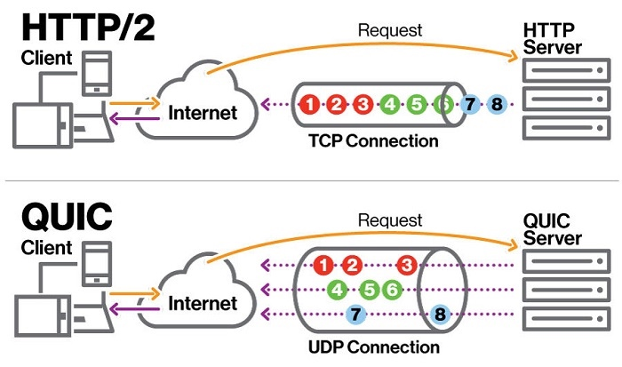
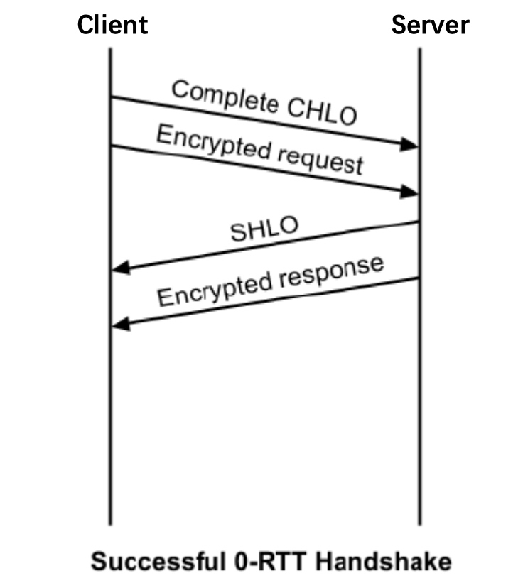

# 【Network】HTTP

* [【Network】HTTP](#networkhttp)
   * [简介](#简介)
   * [发展历程](#发展历程)
      * [HTTP/0.9](#http09)
      * [HTTP/1.0](#http10)
      * [HTTP/1.1](#http11)
      * [HTTP/2](#http2)
      * [HTTP/3](#http3)
   * [HTTP/1.1](#http11-1)
      * [报文结构](#报文结构)
      * [请求方法](#请求方法)
      * [数据提交](#数据提交)
      * [状态码](#状态码)
      * [头部](#头部)
      * [KeepAlive](#keepalive)
      * [Pipeline](#pipeline)
      * [Chunked](#chunked)
      * [Encoding](#encoding)
      * [Cache](#cache)
      * [Cookie](#cookie)
      * [Session](#session)
      * [CORS](#cors)
      * [Proxy](#proxy)
   * [HTTP/2](#http2-1)
      * [SPDY](#spdy)
      * [Multiplexing](#multiplexing)
      * [Frame](#frame)
      * [HPACK](#hpack)
   * [HTTP/3](#http3-1)
      * [基于 UDP](#基于-udp)
      * [快速建立连接](#快速建立连接)
      * [改进拥塞控制](#改进拥塞控制)
      * [改进流量控制](#改进流量控制)
      * [包结构](#包结构)
      * [帧结构](#帧结构)
   * [HTTPS](#https)
      * [安全传输算法](#安全传输算法)
      * [身份认证](#身份认证)
      * [握手过程](#握手过程)
      * [密钥交换](#密钥交换)
      * [会话恢复](#会话恢复)
      * [HSTS](#hsts)

## 简介
**HTTP（Hyper Text Transfer Protocol）超文本传输协议**，是 **万维网（World Wide Web）** 的基础协议，主要用于传输各种 **超媒体（HyperMidia）** 类型的内容，但也可用于其他目的，它属于 **TCP/IP 协议族** 中的应用层协议，通常使用 TCP 作为传输层协议。[官方文档](https://httpwg.org/specs/
)，[火狐中文教程](https://developer.mozilla.org/zh-CN/docs/Web/HTTP)，[优秀的笔记博客](https://halfrost.com/tag/protocol/)


**HTML（Hyper Text Markdown Language）** 是典型的 **超文本（HyperText）**，而超媒体则是对超文本的扩展，由标准化的 **MIME 类型** 所定义，包含了以下的分类和具体类型：
- **文本（Text）**：如 HTML、CSS、JS 等
- **图片（Image）**：如 JPG、JPEG、PNG 等
- **声音（Audio）**：如 MP3、MIDI、WAV 等
- **视频（Video）**：如 WEBM、OGG 等
- **应用数据（Application）**：如 JSON、XML 等

HTTP 本身的主要特点如下：
- **简单快速**：客户端请求服务器时，主要是发送请求方法和路径，由于协议的简单，使得 HTTP 服务器的程序规模小，通信速度很快

- **灵活**：HTTP 支持多种不同行为的请求方法，允许传输任意超媒体类型、字符集的内容

- **无连接**：每次连接只处理一个请求，也就是每个请求-响应过程客户端和服务器都要新建一个连接，完成之后立即断开连接。这样虽然简化了协议，但多次请求会因连接建立和关闭产生很多额外的消耗

- **无状态**：协议对于请求处理没有记忆能力，缺少状态意味着如果后续处理需要前面的信息，则客户端必须重传。这样可能导致每次连接传送的数据量增大，但在服务器不需要先前信息时响应速度就比较快

## 发展历程
HTTP 多个版本的发展历程如下：


### HTTP/0.9
最初版本的 HTTP 并没有版本号，而首个正式发布的 HTTP 版本是 HTTP/1.0，因此之前的协议版本被定义为 HTTP/0.9

HTTP/0.9 的功能极为简单，请求报文由单行指令构成，包含唯一可用的 GET 方法以及访问的资源路径，因此也被称为 **单行（one-line）协议**。请求报文实例如下：

```
GET /mypage.html
```

响应报文也不包含 Header，因此仅能传输 HTML，无法传输其他超媒体类型的内容，同时也不包含状态码，一旦出现问题，则通过返回一个特殊的 HTML，用以告知问题的描述信息。响应报文实例如下：

```
<HTML>
this is a simple html
</HTML>
```

### HTTP/1.0
HTTP/1.0 作为首个正式发布的 HTTP 版本，其在 HTTP/0.9 基础上扩展了大量的功能，主要具有以下几个特点：
- 报文首行都增加了协议版本信息
- 响应报文首行增加了状态码，以便浏览器了解请求执行的结果，并触发相应处理行为
- 引入 POST 和 HEAD 方法，丰富了协议的交互方式
- 引入 Header 头部，允许在报文中附加信息，使协议变得非常灵活，以及更具扩展性
- 支持任意超媒体类型和字符集的内容，使协议更加灵活
- 支持多种编码格式的内容压缩，以降低响应内容的传输消耗
- 支持 KeepAlive 长连接，但默认不启用

请求报文实例如下：

```
GET /myimage.gif HTTP/1.0
User-Agent: NCSA_Mosaic/2.0 (Windows 3.1)
```

响应报文实例如下：

```
200 OK
Date: Tue, 15 Nov 1994 08:12:32 GMT
Server: CERN/3.0 libwww/2.17
Content-Type: text/gif
(...image content of few bytes...)
```

### HTTP/1.1
HTTP/1.0 多种不同的实现方式在实际运用中显得有些混乱，因此没有被引入到标准中以促进协助工作。HTTP/1.0 作为首个标准化的 HTTP 版本，消除了大量歧义内容并引入了多项改进，主要具有以下几个特点：
- 引入 OPTIONS、PUT、DELETE、TRACE 和 CONNECT 方法，继续丰富协议的交互方式
- 默认启用 KeepAlive 长连接，减少反复建立和断开 TCP 连接的消耗
- 支持 Pipeline 管道化，允许在前一个响应被完全接收之前就发送下二个请求，以提高连接的使用率
- 支持 Chunked 分块传输，允许在响应内容总大小未确定的情况下开始发送响应，以降低通信延迟
- 支持更多的 Cache 缓存控制策略
- 支持内容协商，包括其语言、超媒体类型、字符集、编码格式等，并允许客户端从服务端获取最合适的内容
- 支持 Host 区分，令不同域名的 HTTP 服务可以复用同一个 IP 地址和端口号

请求报文实例如下：

```
GET /static/img/header-background.png HTTP/1.1
Host: developer.mozilla.org
User-Agent: Mozilla/5.0 (Macintosh; Intel Mac OS X 10.9; rv:50.0) Gecko/20100101 Firefox/50.0
Accept: */*
Accept-Language: en-US,en;q=0.5
Accept-Encoding: gzip, deflate, br
Referer: https://developer.mozilla.org/en-US/docs/Glossary/Simple_header
```

响应报文实例如下：

```
200 OK
Age: 9578461
Cache-Control: public, max-age=315360000
Connection: keep-alive
Content-Length: 3077
Content-Type: image/png
Date: Thu, 31 Mar 2016 13:34:46 GMT
Last-Modified: Wed, 21 Oct 2015 18:27:50 GMT
Server: Apache

(image content of 3077 bytes)
```

### HTTP/2
由于网页愈发变得复杂，更多的数据通过 HTTP 请求被传输，其传输性能也愈发受到关注，而 HTTP/1.1 的 Pipeline 机制、并行连接都无法更好地解决传输性能问题

谷歌因此推出了一个 SPDY 协议，旨在解决 HTTP/1.1 的传输性能以及一些其他的问题，HTTP/2 以 SPDY 作为整个协议的蓝图进行开发和完善，主要具有以下几个特点：
- 引入 Stream 流和 Frame 帧的概念，报文需经过二进制分帧处理，不再是可读的文本且不能无障碍地手动创建
- 支持 Multiplexing 连接多路复用，不再受到 Pipeline 的队头阻塞约束
- 支持 HPACK Header 压缩，减少了数据的重复传输以提高效率
- 支持服务端推送，主动向客户端推送当前请求相关的资源，减少了不必要的多次请求


### HTTP/3
**QUIC（Quick UDP Internet Connections）快速 UDP 互联网连接协议**，是谷歌提出的一种基于 UDP 的低延时、多并发且安全的传输层协议，但其完全工作在用户空间，实现了 TCP 的可靠传输、流量控制和拥塞控制等功能，以及 TLS 的安全性功能，[中文详细文档](https://quic.readthedocs.io/zh/latest/Introduction.html)

而基于 QUIC 的 HTTP 协议称为 HTTP/UNIC，功能上类似基于 UDP 上的 TCP + TLS + HTTP/2，目前 HTTP/UNIC 已经正式更名为 HTTP/3，作为最先进的 HTTP 版本


HTTP/3 主要具有以下几个特点：
- 通过使用 UDP 进行底层传输，脱离操作系统的束缚使得协议演进更迅速，且避免 TCP 层面的队头阻塞
- 合并连接和加密的握手过程，还可以缓存上次连接的信息直接使用，大大减少了因握手导致的多个 RTT 时延
- 改进 TCP 拥塞控制，优化因传输层带来的网络性能瓶颈
- 改进 TCP 流量控制，分别提供基于流和连接的两种级别
- 支持连接迁移，以一个 64 位随机数作为连接的唯一标识，即使 IP 地址和端口号变化也不需要重建连接
- 支持 FEC 前向纠错，用来在数据包发生错误时进行数据恢复，从而避免代价高昂的超时重传（由于额外的消耗流量在不同场景下收益不一样，为了更好适应所以场景目前已移除，但仍在探索更好的使用方式）

## HTTP/1.1
### 报文结构
**请求（Request）** 报文共分为四个部分：


- **请求行（Request Line）**

  用来说明请求方法，目标 URL 以及所使用的 HTTP 版本

- **请求头部（Request Headers）**

  紧接着请求行之后，用来说明需传递给服务端器的附加信息

- **空行（Blank Line）**

  请求头部后面的空行是必须的，即使没有请求包体部分

- **请求包体（Request Body）**

  存放着任意类型的超媒体内容作为请求数据，用来提交给服务器，如 POST、PUT、PATCH 等提交数据的请求会包含该部分

**响应（Response）** 报文共分为四个部分：


- **状态行（Status Line）**
    
  由 HTTP 协议版本号、状态码和状态码描述组成

- **响应头部（Response Headers）**
    
  紧接着状态行之后，用来说明需传递给客户端器的附加信息
    
- **空行（Blank Line）**
    
  请求头部后面的空行是必须的，即使没有响应包体部分

- **响应包体（Response Body）**
    
  存放着任意类型的超媒体作为响应数据，用来返回给客户端

### 请求方法
**请求方法（Request Method）** 用于表示了对资源进行不同的操作方式，丰富协议的交互方式，以应对不同的功能

HTTP/1.0 中仅定义了三种请求方法，分别是 GET、POST 和 HEAD；而 HTTP 1.1 新增了六种请求方法，分别是 PUT、PATCH、DELETE、OPTIONS、TRACE 和 CONNECT

不同请求方法的具体描述如下：

| 请求方法 | 描述 |
| --- | --- |
| GET  | 请求指定的资源，服务器返回完整的响应，用于资源的查询 |
| HEAD |	 请求指定的资源，服务器返回不包含包体部分的响应，用于资源的测试 |
| POST | 请求向指定资源提交数据并进行处理，一般用于资源的创建，也可能用于资源的更新或其他操作 |
| PUT | 请求向指定资源提交数据并进行取代，用于资源的更新 |
| PATCH | 请求向指定资源提交数据并进行部分内容修改，用于资源的部分更新 |
| DELETE | 请求删除指定的资源 |
| OPTIONS | 请求指定资源的支持信息，如所支持的请求方法、请求头部等，用于资源的功能查询 |
| TRACE | 请求回显，服务器返回收到的请求，用于服务器的测试或诊断 |
| CONNECT | HTTP/1.1 中预留给能够将连接改为隧道方式的代理服务器 |

在实际应用中最常用的也就是 GET 请求和 POST 请求

GET 请求一般不包含 Body，通过在 URL 末尾以 `?` 开头追加表示 **查询参数（Query Params）** 的字符串，以便将查询信息发送给服务器

查询参数中每个参数名和对应值都必须使用 `encodeURLComponent()` 进行编码，而且所有键值对由 `&` 分隔，如：`http://www.amazon.com/ap/signin?openid.assoc_handle=aws&openid.ns=http%3A%2F%2Fspecs.openid.net%2Fauth%2F2.0`

查询参数中的列表参数，通过多个相同参数名分别传入不同的值来实现的，如 `http://www.amazon.com/ap/signin?users=aws&users=google&users=baidu`

POST 请求一般包含 Body，以便向提交向指定资源提交数据，数据放在 Body 中

一个请求的使用哪个请求方法和是否包含查询参数或 Body 没有强制限定，但是有使用规范：
- 请求资源的请求方法才会包含查询参数
- 需要向资源提交数据的请求方法才会包含 Body

为什么不直接使用查询参数代替 Body 来提交数据？
- 通过 Body 提交数据不显式附加在 URL 中，相对较为安全
- 查询参数的字符串大小有限制，一般限制在 2KB

HEAD 请求指定资源时不会得到响应的 Body，可以用于对资源进行以下测试：
- 判断资源类型
- 通过响应的状态码，测试资源是否存在

POST 和 PUT、PATCH 的区别：主要是在协议上语义有很大区别，POST 请求用于创建资源，是非幂等的，PUT、PATCH 请求用于更新资源，是幂等的

幂等是指相同的请求无论发生多少次，其作用结果都是一样的，因此当幂等操作没有达到预期目标时，可以不停进行重试，而不会对资源产生副作用

### 数据提交
请求是通过 Body 来进行数据提交的，其中数据指的是任意超媒体类型和字符集的内容，而通过 `Content-Type` Header 说明了所提交内容的超媒体类型和字符集，也代表着客户端不同的数据提交方式

在 Postman 或其他的 API 工具中，常用的数据提交方式有如下几种：

- **application/x-www-from-urlencoded**

  最常用的数据提交方式，可以提交键值对形式的表单数据，Body 所使用的编码格式和请求参数的编码格式相同，即各个键值对之间以 `&` 分隔
  
  请求实例：

``` 
POST / HTTP/1.1
Host: www.test.com
Content-Type: application/x-www-from-urlencoded

arg1=a&arg2=b
```

- **multipart/form-data**

  既可以提交键值对形式的、也可以提交键文件对形式的表单数据，Body 所使用的编码格式以每条表单数据为单位，以分隔符为开头和分隔，以分隔符加 `--` 为结尾，并且在 `Content-Type` Header 中附带了随机生成的分隔符

  Body 中的每个 `Content-Disposition` 表明了该表单数据的信息，如名字，若该数据是文件，则其 `Content-Disposition` 还包括文件名，以及存在 `Content-Type` 表明文件内容类型
  
  和 x-www-from-urlencoded 一样，列表参数也是通过多个相同参数名分别传入不同的值来实现的
  
  请求实例：

``` 
POST / HTTP/1.1
Host: www.test.com
Content-Type: multipart/form-data; boundary=----WebKitFormBoundaryJ4gCBmgcSDcVqaQH

------WebKitFormBoundaryJ4gCBmgcSDcVqaQH
Content-Disposition: form-data; name="arg1"

a
------WebKitFormBoundaryJ4gCBmgcSDcVqaQH
Content-Disposition: form-data; name="arg2"

b
------WebKitFormBoundaryJ4gCBmgcSDcVqaQH
Content-Disposition: form-data; name="file1"; filename="tmp.txt"
Content-Type: text/plain


------WebKitFormBoundaryJ4gCBmgcSDcVqaQH
Content-Disposition: form-data; name="file2"; filename="tmp.gif"
Content-Type: image/gif


------WebKitFormBoundaryJ4gCBmgcSDcVqaQH--
```

- **application/json**

  通用的数据序列化格式，可以反序列化为多种编程语言的类型，便于完成不同程序间的数据交换，其编码格式就是 JSON 独特的编码格式，类似于一个 Key-Value 字典
  
  类似的面向不同编程语言的数据提交方式还有 `application/xml`

  请求实例：

```
POST / HTTP/1.1
Host: www.test.com
Content-Type: application/json

{"arg1":"a","arg2":"b"}
```

- **application/octet-stream**

  用于提交单个文件，Body 为该文件的二进制数据
  
  请求实例：

```
POST / HTTP/1.1
Host: www.test.com
Content-Type: application/octet-stream

6\  ̒y4    '[ ,  "   Qu  W" uq P
[Ճ X Y   Njv  U _ FT       g c b C K     -e p 
~0j+    {H     8բ4
```

### 状态码
**状态码（Status Code）** 由三位数字组成，第一位数字定义了响应的类别，总共分五种类别：
- **1xx**：指示信息，表示请求已被接收，且需要继续操作
- **2xx**：请求成功，表示请求已被成功接收和处理
- **3xx**：重定向，表示需要进一步操作，以完成请求
- **4xx**：客户端错误，表示请求包含语法错误或无法完成
- **5xx**：服务端错误，表示服务器处理合法请求时发生内部错误

常见的状态码及其状态码描述如下：

| 状态码 | 状态码描述 | 表示 |
| --- | --- | --- |
| 100 | Continue | 继续请求，需要继续发送请求 |
| 101 | 	Switching Protocols| 切换协议，需要切换协议后继续发送请求，`Upgrade` header 表明了需要切换的协议 |
| 200 | OK | 请求成功 |
| 201 | Created | 请求成功并创建了新资源 |
| 202 | Accepted | 请求已被接收，但未处理完成 |
| 204 | Not Conntent | 请求成功，但响应不包含包体部分 |
| 206 | Partial Content | 范围请求成功，响应包体部分返回由 `Content-Range` header 指定范围的内容 |
| 301 | Moved Permanently | 永久重定向，请求应该以后都使用由 `Location` header 指定的重定向目标，非 GET、HEAD 请求不允许直接进行重定向|
| 302 | Found | 临时重定向，请求仅当次使用由 `Location` header 指定的重定向目标，非 GET、HEAD 请求不允许直接进行重定向 |
| 303 | See Other | 临时重定向，请求仅当次使用由 `Location` header 指定的重定向目标，非 GET、HEAD 请求会被改变为 GET 请求并删除请求包体 |
| 304 | Not Modified | 资源未改变，可直接使用客户端未过期的缓存 |
| 305 | Use Proxy | 请求使用由 `Location` header 指定的代理 |
| 307 | Temporary Redirect | 临时重定向，请求仅当次使用由 `Location` header 指定的重定向目标，非 GET、HEAD 不会被改变请求方法 |
| 400 | Bad Request | 请求有语法错误，不能被服务器所理解 |
| 401 | Unauthorized | 请求没有通过 HTTP 基础认证 |
| 403 | Forbidden | 请求被服务器拒绝，通常是因为权限不足等原因 |
| 404 | Not Found | 请求的资源无法在服务器上找到 |
| 405 | Method Not Allowed | 请求方法不被服务器允许 |
| 409 | Conflict | 请求的资源和其当前状态之间存在冲突，无法完成 |
| 429 | Too Many Requests | 发出的请求次数太多 |
| 431 | Request Header Fields Too Large | 请求 header 字段太大 |
| 500 | Internal Server Error | 服务器内部发生错误，如配置错误 |
| 502 | Bad Gateway | 作为网关或者代理工作的服务器尝试执行请求时，从上游服务器接收到无效的响应 |
| 503 | Service Unavailable | 临时的服务器维护或者过载，无法处理请求 |
| 504 | Gateway Timeout | 作为网关或者代理工作的服务器尝试执行请求时，未能及时从上游服务器或者辅助服务器（如 DNS ）收到响应 |
| 505 | HTTP Version Not Supported | 服务器不支持，或者拒绝支持在请求中使用的 HTTP 版本 |

### 头部
**头部（Header）** 允许客户端和服务器通过请求或响应报文来传递任意的附加信息，也就是除超媒体内容以外的元数据，利用这些头部能够为协议扩展出各种各样的约定和特性

每个头部都是一组 Key-Value，其组成首先是一个不区分大小写的名字，其后跟一个冒号 `:`，冒号后跟一个不带换行符的具体值，值前面的空白符会被忽略，如 `User-Agent: Mozilla/5.0 (Linux; X11)`。在名称中的若需要连接符隔开不同的单词，需要使用 `-` 而不能使用 `_`

自定义专用 Header 可通过 `X-` 作为名字前缀来添加，但是这种用法在后续的标准化说明中被明确弃用，原因是其会在非标准字段升级成为标准时造成不便，标准化的 Header、以及着被提议标准化的新 Header，都维护在 [IANA 注册表](https://www.iana.org/assignments/message-headers/message-headers.xhtml) 中

根据不同适用场景和作用，可将头部分为以下四种类型：
- **通用头部（General Headers）**：同时适用于请求和响应报文，但与最终报文 Body 中传输的数据内容无关的头部
  
- **请求头部（Request headers）**：包含有关请求的附加信息，比如描述所需获取的资源或者客户端本身信息的头部

- **响应头部（Response Headers）**：包含有关响应的附加信息，比如描述服务器本身的位置、域名和版本等信息的头部

- **实体头部（Entity Headers）**: 包含有关 Body 实体内容的更多信息，比如描述内容的长度、超媒体类型、字符集等信息的头部

根据代理对头部的处理方式，也可将头部分为以下两种类型：
- **端到端头部（End-To-End Header）**：这类头部必须被传输到最终的报文接收者，即请求的服务器或响应的客户端，中间的代理服务器必须缓存并转发未经修改的端到端头部

- **逐跳头部（Hop-By-Hop Header）**：这类头部仅对单次传输的连接有意义，不能通过代理或缓存进行重新转发，比如描述报文所经过的代理消息、当前使用的传输编码等信息的头部

在请求或响应报文中最为常见的头部如下：

| 字段 | 场景 |描述 | 实例 |
| --- | --- | --- | --- |
| Host | 请求 | 目标服务器域名和端口 | `Host: www.example.com` |
| User-Agent | 请求 | 客户端信息，是浏览器类型的重要标识 | `User-Agent: Mozilla/5.0 (Linux; X11)` |
| Accept	| 请求 | 期望接收的内容类型 | `Accept: text/plain, text/html` |
| Accept-Charset | 请求 | 期望接收的内容字符集 | `Accept-Charset: iso-8859-5` |
| Accept-Encoding | 请求 | 期望接收的内容编码格式 | `Accept-Encoding: br, gzip, deflate` |
| Accept-Language | 请求 | 期望接收的内容的所使用语言 | `Accept-Language: zh-cn` |
| Referer | 请求 | 报文来源，即浏览器所访问的前一个网页地址 | `Referer: http://itbilu.com/nodejs` |
| Content-Length | 请求或响应 | 内容的长度，十进制的字节数 | `Content-Length: 348` |
| Content-Type | 请求或响应 | 内容的多媒体类型和字符集 | `Content-Type: application/x-www-form-urlencoded` |
| Content-Encoding | 响应 | 内容的编码格式 | `Content-Encoding: gzip` | 
| Content-Language | 响应 | 内容所使用的语言 | `Content-Language: zh-cn` |
| Content-Disposition | 响应 | 内容的多媒体类型补充，浏览器可根据该值决定对内容的处理方式，如下载或打开 |	`Content-Disposition: attachment; filename="fname.ext"` |
| Server | 响应 | 服务端的信息 | `Server: Apache/2.4.17 (Unix) OpenSSL/1.0.1e-fips` |
| Date | 响应 | 发送时的日期时间 | `Date: Mon, 08 Jun 2020 02:24:51 GMT` |
| Location | 响应 | 用于重定向，或定位新资源创建后的地址 | `Location: http://example.com/nodejs` |
| Refresh | 响应 | 用于重定向，或定位新资源创建后的地址，浏览器默认会在 5 秒后刷新并重定向 | `Refresh: 5; url=http://itbilu.com` |

### KeepAlive
**HTTP KeepAlive** 能够使用同一个 TCP 连接来处理多次的请求-响应过程，而不是像原本的无连接那样，为每次的请求-响应过程都新建一个 TCP 连接，避免了多次连接建立和关闭产生的额外消耗。这种连接管理模式也被称为 **长连接**、**持久连接** 或 **连接复用**，在 HTTP/1.0 被提出，而在 HTTP/1.1 被默认启用


启用了 HTTP KeepAlive 的客户端，其发送的请求携带 `Connection: Keep-Alive` Header，告知服务端完成响应后不要关闭当前 TCP 连接，而客户端继续复用该 TCP 连接来处理下一个请求

请求还可以通过携带 `Keep-Alive: max=5, timeout=120` Header 来告知服务端关于长连接的配置：
- `max` 表示当前 TCP 连接的最大处理请求数，在非 Pipeline 连接下，非 0 的值都会被忽略

- `timeout` 表示当前 TCP 连接的最大空闲超时，在没有启用 TCP KeepAlive 的情况下，大于 TCP 层面的最大空闲超时将会被忽略

`Keep-Alive` Header 中的 `timeout` 只代表客户端的期望，是否启用长连接和具体配置还是取决于服务端本地的配置，若服务端根据本地配置在响应处理后主动关闭该 TCP 连接，则会通过响应中携带 `Connection: Close` 告知客户端

HTTP KeepAlive 和 TCP KeepAlive 虽然命名相同且存在前者对后者存在依赖关系，但它们是两个完全不同的概念。HTTP KeepAlive 旨在复用 TCP 连接，而 TCP KeepAlive 旨在保证连接的存活

虽说 HTTP KeepAlive 有很多优点，但对于某些场景，比如请求的发起方属于低频访问的情况，若为这些请求都保持 TCP 连接，就会比较浪费服务端的系统资源

### Pipeline
**管道化（Pipeline）** 也是一种连接管理模式，它能够使用同一个 TCP 连接连续发送多个请求，而不是跟原本的长连接那样，必须等待之前请求的响应返回后，才能发送下一个请求，提高了每个 TCP 连接的使用效率，减小了通信的延迟。在理想情况下，使用 Pipeline 连接获取所有资源仅需要一个 RTT 时长，而使用非 Pipeline 连接则需要 N 个 RTT 时长，N 为资源的数目


Pipeline 虽然看起来优点很大，但主流浏览器即便支持了该模式默认也都是不启用的，而原因就是因为可能发生请求的 **队头阻塞**。原因在于 HTTP 是无状态的，服务端必须按顺序地返回每个请求的响应，否则客户端无法将请求和响应一一对应起来

这样一来，在 Pipeline 连续发送的多个请求中，若其中一个请求的服务端处理出现问题，则排在后面的其他请求都会被阻塞，反而导致请求间的相互影响，影响整体的传输效率

另外需要注意的是，只有幂等的方法才允许使用 Pipeline，因为请求的响应虽然按顺序返回，但处理过程并不是按顺序的，因此非幂等的方法可能会出现非期望的情况

并且对于新建立的 TCP 连接不能直接使用 Pipeline，因为此时无法得知服务端的协议版本，可能存在不支持的情况，即只能在复用连接时才能使用 Pipeline 发送请求

浏览器在不启用 Pipeline 的前提下，为了提高资源的获取速率，于是采用了 **并行连接** 的方式，即对于一个域名的服务端创建多个 TCP 连接并行发送 HTTP 请求，比如 Chrome 默认的并行连接数为 6

并行连接数也并非越多越好，因为每个连接的建立过程需要消耗资源。比如对于带宽有限的客户端，单连接的情况下可能就经常会占满带宽了，此时即便开启多个连接，也只会互相抢占或平分有限的带宽，未真正对性能有所提升，反而额外消耗很多其他资源，再者过多的并行连接数也会加大对服务器端的负担

### Chunked
**分块传输编码（Chunked Transfer Encoding）** 是一种数据传输机制，它允许服务端在响应内容总大小未确定的情况下，也就是响应并未完全计算出来之前，将已经计算出来的部分作为一个 **块（Chunk）** 先返回给客户端，实现动态内容的一边计算一边发送，以降低通信的延迟时间，并且客户端也可以提前接收到一部分的数据并进行渲染显示

使用 Chunked 机制的响应会携带 `Transfer-Encoding: chunked` Header，并且不会再携带说明内容长度的 `Content-Length` Header，此时响应 Body 被划分为若干个块，并且以最后一个块为空块，其结构如下：


非空块以所包含的字节数开头，以十六进制表示，然后跟随一个 CRLF，再跟随包含的数据，最后再以 CRLF 结尾；最后的空块仅由 0 以及 CRLF 组成，然后 Body 以仅包含 CRLF 的空行结束

Chunked 响应的实例如下：
```
HTTP/1.1 200 OK
Content-Type: text/plain
Transfer-Encoding: chunked

1c
Data in the first chunk!!!!!
18
Data in the second chunk
6
after
4
that
0

```

### Encoding
**内容编码（Content Encoding）** 可以使用指定的编码格式对响应内容进行编码，而使用具有压缩效果的编码格式能实现内容压缩，从而减小内容的体积以节约带宽消耗，在 HTTP/1.0 被支持，而在 HTTP/1.1 支持对编码格式进行协商

请求通过携带 `Accept-Encoding: {type}` Header 告知服务端所期望的编码格式，可以包含多种编码格式。而响应通过携带 `Content-Encoding` Header 告知客户端最终内容所使用的编码格式，以便客户端进行对应的数据恢复


常用的内容编码格式如下：
- **`gzip`**：使用 GUN Zip 对内容进行编码压缩
- **`compress`**：使用 UNIX 文件压缩程序对内容进行编码压缩
- **`deflate`**：使用 Zlib 对内容进行编码压缩
- **`identity`**：不对内容进行编码压缩，当没有 `Accept-Encoding` Header 时的默认情况

注意并非所有文件进行压缩，文本类型比如 HTML、JS 等会有很好的压缩效果，但是图片、视频类型则不会有更好的压缩效果，因为这些类型得内容已经内部压缩过了，再去压缩可能会让生成的内容体积更大，并且也会浪费客户端和服务端用于压缩和恢复的计算资源

### Cache
**缓存（Cache）** 是一种复用之前已获取资源的机制，能够极大地提高客户端的访问速率，缓解服务端的压力，节约资源传输所需的网络流量。在 HTTP/1.0 已存在 Cache 基础支持，而在 HTTP/1.1 新增更多 Cache 控制策略

Cache 类型可以分为 **共享缓存（Shared Cache）** 和 **私有缓存（Private Cache）** 两种，前者需要缓存服务器作为多个客户端可以共用的缓存端，后者则通过客户端本地的浏览器缓存来实现


缓存能带来很多好处，但完善的 Cache 控制机制，需要能过解决以下一些问题：
- 客户端能在本地判断收到的缓存资源是否过期
- 缓存端能判断请求是否访问缓存资源
- 缓存端能判断是否能缓存响应资源
- 缓存端能查看已过期的缓存资源是否在服务端发生了变化

`Cache-Control: {directives}` Header 表示 Cache 机制中最重要的控制策略，这里是其 [详细用法说明](https://developer.mozilla.org/zh-CN/docs/Web/HTTP/Headers/Cache-Control) ，值可设置为多个用 `,` 分隔的指令组合，无论是请求还是响应，都可通过携带它来表示 Cache 的缓存访问策略、过期策略、验证策略等，常用的指令如下：
- **缓存访问策略**
    - **`no-store`**
    
      于请求中表示不允许访问缓存资源，于响应中表示不允许缓存响应资源。都能使每次由客户端发起的请求都能从服务端获取到最新的资源
    
    - **`no-cache`**
    
      于请求中表示不允许直接访问缓存资源，需要先到服务端验证是否变化，于响应中表示允许缓存响应资源，但每次使用时需要到服务端验证是否变化。都能使每次由客户端发起的请求都能先由服务端验证后再决定是否使用缓存资源
    
    - **`public`**
    
      于响应中表示的内容可公开，可以被共享缓存的缓存端进行缓存
    
    - **`private`**
        
      于响应中表示的内容是私有的，不可被共享缓存的缓存端进行缓存，只能被缓存于私人的浏览器中

- **过期策略**
    - **`max-age={seconds}`**
    
      于请求和响应中都表示缓存的最大存活秒数，超过该时长的缓存被认为过期，指的是缓存时间相对于请求时间的差值，优先级大于 `Expires` Header
    
    - **`s-maxage={seconds}`**

      于响应中表示缓存的最大存活秒数，优先级大于 `max-age` 或者 `Expires` Header，但仅适用于共享缓存，私有缓存都会忽略它
      
    - **`max-stale={seconds}`**

      于请求中表示愿意访问一个已过期的资源，但过期时长不能超过所设置的秒数
      
    - **`min-fresh={seconds}`**

      于请求中表示期望访问一个在指定秒数内能保持不过期的资源

`Pragma: no-cache` Header 是对 HTTP/1.0 的兼容，它只能被请求所携带，且作用等同于 `Cache-Control: no-cache`，但其优先级更高

`Expires: {datetime}` Header 也是对 HTTP/1.0 的兼容，只能被响应所携带，用于表示资源的过期时间，概念上和 `Cache-Control: max-age` 相反，且其优先级更低

`Etag: {string}` Header 只能被响应所携带，以根据资源内容计算出的摘要作为资源的唯一标识，客户端再次请求该资源时，会用这个摘要作为 `If-None-Match: {string}` Header 的值，服务端通过对比这个摘要和文件实际计算的出摘要，从而返回客户端资源无修改以及可继续使用缓存，或者是已修改的资源


`Last-Modified: {datetime}` Header 只能被响应所携带，表示资源的最后修改时间，客户端再次请求该资源时，会用这个时间值作为 `Last-Modified-Since : {time}` Header 的值，服务端通过对比这个时间值和文件实际的最后修改时间，从而返回客户端资源无修改以及可继续使用缓存，或者是已修改的资源。这也属于 HTTP/1.0 中的 Cache 机制，和 `Etag` Header + `Last-Modified-Since` Header 类似，但比其优先级更低

`Last-Modified` Header 还可以在没有 `Expires` Header 和 `Cache-Control` Header 的响应中，结合 `Date` Header 来指定资源的有效期，即 `Date` Header 值 - `Last-Modified` Header 值再除以 10，这成为 **启发性过期值**

`Vary: {header}` Header 可以被响应所携带，指定缓存资源需要保存的内容形态信息，比如 `Vary: Content-Encoding`，这时响应的 `Content-Encoding: gzip` 值就会作为资源的 Key 保存在缓存端。客户端再次请求该资源时，若请求期望的形态信息和缓存端的 Key 匹配，比如 `Accept-Encoding: gzip`，则缓存端返回缓存资源，否则请求服务端获取对应内容形态的资源


`Vary` Header 有利于缓存端的内容形态多样性，比如可以用 `User-Agent` 作为缓存的 Key，实现为移动端和网页端划分不同缓存等功能

### Cookie
**Cookie** 指服务端发送到客户端并保存在客户端本地的一小份数据，并以 Key-Value 的形式存储着一些信息，客户端下次向同一服务端再发起请求时就会携带上这些信息，使得无状态的 HTTP 能够记录稳定的状态信息

Cookie 常见的应用场景有：会话状态管理，比如用户的登录状态信息；个性化设置，比如用户自定义的主题、背景信息；浏览器的行为跟踪，比如用户历史操作信息等等


服务端通过在响应中里面添加多个 `Set-Cookie` Header，每个 `Set-Cookie` Header 分别表示一组 Key-Value 数据，指示客户端在本地存储把这些 Cookie 都存储起来，其格式和实例如下：

```
// 格式
Set-Cookie: cookie_key=cookie_value[flag[=flag_value]]

// 实例
Set-Cookie: yummy_cookie=choco
Set-Cookie: tasty_cookie=strawberry
```

其中 `Set-Cookie` Header 可以利用以下标识对 Cookie 进行一些属性设置：
- **`Expires={datetime}`**	
    
   设置 Cookie 的过期时间
   
- **`Max-Age={seconds}`**
    
  设置 Cookie 的存活时间有效期，其优先级大于 Expires
  
  对于既没有指定过期时间或者有效期的 Cookie，默认情况下是 **会话期 Cookie**，会在浏览器关闭之后它会被自动删除。但有些浏览器提供了会话恢复功能，这种情况下即使关闭了浏览器，会话期 Cookie 也会被保留下来，就像浏览器从来没有关闭一样
  
  而指定了过期时间或有效期的 Cookie 称为 **持久性cookie**，但 Cookie 是否仍有效的判定只与浏览器的实现相关

- **`Secure`**

	标记安全属性，只有在请求使用 HTTPS 协议时才会被发送到服务端，目前很多浏览器已经不支持 HTTP 来源响应设置带 Secure 属性的 Cookie
	
- **`HttpOnly`**

  阻止使用 JS 的 `Document.cookie` 属性对浏览器的 Cookie 进行访问，只允许用于发送至服务端，防止跨站脚本 (XSS) 攻击

- **`Domain={domain}`**

  设置 Cookie 可发送的域名，默认为当前访问的域名（不包括其子域名），但如果指定了域名，则一般包含子域名，如设置 `Domain=mozilla.org`，则包括子域名`developer.mozilla.org`
  
  所设置的 Domain 若不能覆盖来源响应的域名的话，则该 Cookie 会被浏览器拒绝设置，因此无法设置其他域名的 Cookie，只能设置当前域名或父域名的 Cookie
  
- **`Path={path}`**

  设置 Cookie 可发送的 URI 路径，满足包含关系即匹配，比如设置 `Path=/docs`，则匹配 `/docs/Web/` 路径
  
  Cookie 的作用域由其 Domain 和 Path 属性共同决定，这也就代表了 Cookie 具有不可跨域性

还有一些特殊命名的 Cookie：
- **以 `__Secure-` 为前缀**

  必须与 `Secure` 属性一同设置，同时必须通过 HTTPS 来源响应设置
  
- **以 `__Host-` 为前缀**

  必须与 `Secure` 属性一同设置，同时必须通过 HTTPS 来源响应设置，也必须不能设置 Domain 属性以及 Path 属性必须设置为 `/`，也就不能发往子域名了

之后客户端对该服务器每一次请求中都会将本地的 Cookie 数据整合起来，并通过携带 `Cookie` Header 将这些数据发送给服务端，其格式和实例如下：

```
// 格式
Cookie: cookie_key1=cookie_value1; cookie_key2=cookie_value2

// 实例
Cookie: yummy_cookie=choco; tasty_cookie=strawberry
```

Cookie 虽然能在不占用服务端资源的情况下将 HTTP 改造为有状态协议，但它仍然具有以下的缺陷：
1. Cookie 若被其他人获取，可以对服务端进行 Cookie 欺骗
2. Cookie 安全性偏低，不能用于存放敏感信息，被分析或获取到本地的 Cookie 会导致信息泄漏
3. Cookie 具有长度和数量的限制，单个 Cookie 保存的数据不能超过 4K，很多浏览器都限制一个域名最多只能保存 20 个 Cookie
4. Cookie 在浏览器每次发送请求都需要全部被发送到服务端，当数据量较大时会造成带宽浪费
5. Cookie 不能保存某些与服务端相关状态，如表单提交次数等，放在 Cookie 可能会导致这些状态并不准确

### Session
**Session** 是另一种记录客户端状态的机制，但其数据保存在服务端本地，且在每个 Session 所表示的客户端状态信息中，包含一个用于识别客户端身份的标识，以及其他任意形式的状态信息

Session 的引入是为了改善 Cookie 上述的种种缺陷，但 Session 需要通过 Cookie 发送过来的身份标识来识别一个客户端，因此 Session 其实是依赖于 Cookie 来实现的


在客户端首次访问服务端时，服务端经过一定的身份验证机制后，会把该客户端的状态信息作为一份 Session，并且为其生成一个唯一的 SessionId，然后存储在服务器本地上，并且通过响应携带 `Set-Cookie` Header 将 SessionId 作为 Cookie 设置到客户端

客户端再次访问服务端时，请求就会携带 `Cookie` Header 将 SessionId 发送给服务端，服务端根据 SessionId 在本地检索出该客户端对应的 Session，获得其所有的状态信息

但由于 Session 存储在服务端，若数量过多和数据量太大都会影响服务器的性能，因此需要有相关的 Session 过期删除策略。若是分布式的服务端还需要有 Session 同步策略，以保证任一服务端节点都能处理客户端的有状态请求

### CORS
**同源策略（Same-Origin Policy）** 是浏览器访问网页过程中最基础的安全策略，即同一页面中所访问资源的 **协议、域名、端口** 是需要相同的，否则浏览器会禁止访问

之所以需要同源策略，是为了防止 **跨站请求伪造攻击（Cross-Site Request Forgery，CSRF）**，该攻击的实施者可以盗用用户的身份，以用户的名义向其他服务器发送恶意请求，攻击过程如下：


其他网站通过 JS 发起对于银行网站的请求，从而盗用了浏览器中关于银行网站的用户态，伪装成用户本身来请求银行网站，从而完成银行存款的转移

虽然同源策略有利于网络安全，但随着网络技术的发展，特别是微服务的盛行，很多场景需要绕过同源策略去完成安全的跨域请求，于是就产生了 **跨域资源共享（Cross-Origin Resource Sharing, CORS）** 机制，其原理是服务端与客户端配合，通过一组 Header 允许服务器声明哪些源站有权限访问哪些资源


CORS 将跨域请求分为了以下三种情况：
- **简单请求（Simple Request）**

  一个跨域请求属于简单请求的条件是：请求方法仅限于 GET、HEAD、POST；手动设置的 Header 仅限于 `Accept`、`Accept-Language`、`Content-Language`、`Content-Type`；`Content-Type` Header 的值仅限于 `application/x-www-form-urlencoded`、`multipart/form-data`、`text/plain`
  
  当浏览器需要进行跨域请求时，会首先检查该请求的类型，如果它是简单跨域请求，则会立刻发送这个请求

- **预检请求（Preflight Request）**

  不是简单请求的跨域请求就是预检请求，浏览器会先发送一个 OPTION 方法的 **预检（Preflight）**，当服务端接受预检并返回包含验证结果的预检响应后，若验证是通过的，浏览器才会发送该请求，否则浏览器会拒绝发送该请求
  
  预检中需要包含以下 Header：
  - **`Origin`**：普通请求也带有，在 CORS 中主要提供来源域给服务端认证
  - **`Access-Control-Request-Method`**：跨域请求的请求方法
  - **`Access-Control-Request-Headers`**：跨域请求的自定义 Header 和 `Content-Type` Header，所有这些 Header 的名字都将会以 `,` 隔开的形式包含在该值中

  预检的 Header 实例如下：
  ```
  Access-Control-Request-Headers: content-type,x-data-struct
  Access-Control-Request-Method: POST
  Origin: http://localhost:63342
  ```
  
  服务端返回的预检响应中需要包含以下 Header：
  - **`Access-Control-Allow-Origin`**：允许跨域请求的来源域，可以是多个域以逗号隔开，也可以是通配符 `*`
  - **`Access-Control-Allow-Methods`**：允许跨域请求使用的请求方法，以逗号隔开
  - **`Access-Control-Allow-Headers`**：允许跨域请求使用的自定义 Header，以 `,` 隔开，大小写不敏感

  验证成功的预检响应，其 Header 实例如下：
  ```
  Access-Control-Allow-Origin: *
  Access-Control-Allow-Methods: GET, POST, OPTIONS
  Access-Control-Allow-Headers: Origin, X-Requested-With, Content-Type, Accept
  ```
  
- **附带身份凭证请求（Request With Credential）**
    
  指的是包含了当前页面的用户凭证的跨域请求，也就是 Cookie 状态信息，它可以是简单请求也可以是预检请求
    
  附带身份凭证请求需要将 JS `XMLHttpRequest` 的 `withCredentials` 标志设置为 `true`，否则浏览器不会为该请求携带对应的 Cookie 状态信息
  
  并且服务端返回的预检响应或资源响应中需要携带 `Access-Control-Allow-Credentials: true` Header，否则浏览器不会把这些响应内容返回给请求的发送方

### Proxy
HTTP 代理的功能就是接收客户端的请求，转发到后端服务器，获得响应之后返回给客户端，代理可以针对不同的应用场景可以提供不同的功能，包括内容过滤、结果缓存、网络加速和增加安全性等


HTTP 代理又分为 **反向代理** 和 **正向代理**，其中反向代理对客户端是透明的，代理会预先配置好目标服务端的地址，即可到达的目标服务端是固定的；而正向代理则需要客户端额外配置，并且代理从客户端获取目标服务端的地址，即可到达的目标服务端是变化的

客户端配置了正向代理之后，会通过不含 Body 的 Connect 请求，在请求 URL 需填充目标服务端的地址，让代理服务器建立与目的服务端双向通信的隧道。这个请求必须明文的 HTTP 请求，即便目标服务端使用的是 HTTPS 协议

客户端通过 `Proxy-Connection: Keep-Alive Header` 请求与代理服务器保持长连接，若代理服务器要求进行身份验证，则通过 `Proxy-Authorization` Header 来传递凭证

```
CONNECT server.destination.com:80 HTTP/1.1
Host: server.proxy.com
Proxy-Connection: Keep-Alive
Proxy-Authorization: basic aGVsbG86d29ybGQ=
```

代理根据请求与目标服务端的连接建立好之后，会返回状态码为 200 的响应告知客户端连接已建立，之后客户端发送的请求数据都会被代理服务器直接传输到目的服务端，同时目的服务端的响应数据也会被直接返回给客户端，此时两端再使用 HTTPS 协议也不影响代理服务器的正常工作

```
 HTTP/1.0 200 Connection Established
```

## HTTP/2
### SPDY
**SPDY（Speedy）** 是位于 HTTP 和 SSL 之间的应用层协议，旨在解决 HTTP/1.1 的传输性能以及一些其他的问题，后续 HTTP/2 以 SPDY 为蓝图进行开发和完善


SPDY 和 HTTP/2 之间存在的主要区别如下：
- **层次结构**

  

  在协议协商阶段，在发现对端不支持 SPDY 的情况下，可以延用 HTTP 或 HTTPS 来实现最大程度的兼容，若要使用 SPDY 则必须基于 TLS。对于 HTTP/2 而言则没有这个限制，它既可以建立在 TLS 之上，也可以直接建立在 TCP 之上

- **协议协商**

  SPDY 使用 **NPN（Next Protocol Negotiation）** 进行协议协商，而 HTTP/2 使用 **ALPN（Application Layer Protocol Negotiation）** 作为替代。ALPN 与 NPN 都是 TLS 扩展协议，发生在 ClientHello 和 ServerHello 的 TLS 握手阶段

- **压缩算法**

  SPDY 使用 **DEFLATE** 压缩算法来进行 Header 压缩，而 HTTP/2 使用 **HPACK** 压缩算法作为代替

- **帧格式**

  SPDY 和 HTTP/2 虽然在多路复用和二进制分帧上的概念是一致的，但对于帧的数据结构的具体设计是不同的

- **服务端推送**

  SPDY 服务端通过 `X-Associated-Content` Header 来告知客户端，将会有新的资源推送过来，而 HTTP/2 则通过 PUSH_PROMISE 类型的帧来代替

### Multiplexing
**多路复用（Multiplexing）** 指在一个连接上同时发送和接收多组的请求-响应，从而提高连接的使用效率，解决 HTTP/1.1 因 Pipline 会发生队头阻塞，导致传输性能不足的问题


为实现多路复用，SPDY 引入了 **流（Stream）** 和 **帧（Frame）** 的概念，将一组完整的请求-响应称为一个流，再将每个流的报文通过拆分二进制形式的多个帧，以帧作为基本单位来进行数据的传输。不同流的帧是可以乱序发送的，但同一流的帧必须是严格有序的


客户端将多个并发请求的帧，利用同一个连接按照流的优先级发送到服务端，服务端再根据流 ID 来重组各个请求，分别完成处理之后，以同样的方式将响应发送给客户端，从而解决了队头阻塞的问题。此方案的基本思想是通过携带流的标识，让各个乱序的请求和响应之间可以一一对应

### Frame
帧的数据结构可以分为 **帧首部（Frame Header）** 和
**帧荷载（Frame Payload）** 两个部分，其中首部大小为 9 Bytes，其主要的字段如下：


- **长度（Length）**

  帧荷载部分的长度，单位 Bytes
  
- **类型（Type）**

  帧的类型，根据承载内容的不同分为了 **控制帧（Control Frame）** 和 **数据帧（Date Frame）**，而这些帧又根据不同的作用分为以下具体类型：

  

- **标志（Flags）**

  8 个 Bit 的标志位，对于不同类型的帧具有不同含义，若不具备含义时会被忽略。比如在 PRIORITY 类型的帧中，标志位可用于设置流的优先级
  
- **保留位（Reserved）**

  1 个 Bit 的标志位，暂未定义其含义

- **流标识符（Stream Identifier）**  

  标识帧所属流的 31 Bit 整数，用于连接的多路复用

### HPACK
SPDY 使用的 Deflate 压缩算法，即 Zlib 内部使用的压缩算法，该算法可以将重复出现的字符串以另一种形式来表示，达到缩小内容体积的效果，但该算法会受到 **CRIME/BREACH 攻击**，也就是通过暴力构造请求报文的内容，通过观察请求的压缩结果是否变小确定是否与请求其他信息相同，比如逐步推断出 `Cookie` Header 的值，从而完成伪装攻击

HTTP/2 为避免攻击的问题，使用了 HPACK 压缩算法，该算法通过维护一张 **静态列表（Static Table）** 和一张 **动态列表（Dynamic Table）**，在静态列表中会预置一些常用的 Header，而动态列表则针对特定连接来设置一些常用的 Header，若发送的 Header 符合列表中设置的内容，在 Header 编码时会使用其对应的索引进行替换，从而达到压缩头部的目的


通过对于 Header 使用不同的编码格式，可以表示 Header 属于以下情况的组合：
- **索引情况**
    - Name 和 Value 都在列表中
    - Name 和 Value 都不在列表中
    - Name 在在列表中，但 Value 不在列表中
- **索引设置**
    - 不需要加入动态列表中
    - 绝对不加入动态列表中，即使经过代理也要原样转发

当 Header 的 Name 或 Value 不在列表中，从而未能使用索引替换时，则可以直接使用字面值编码，也可以使用 **静态霍夫曼编码**，该霍夫曼编码是从大量 HTTP Header 样本获得的统计信息中生成的，可以对字符序列进行压缩，其原理是对于出现概率比较大的字符采用较短的编码，而概率较小的字符采用较长的编码

动态列表的总大小是有限制的，由 SETTINGS 类型的帧进行设置，其大小计算方式为 `(每个 Header 的字节数 + 32) * Header 条目数`，额外的 32 Bytes 用于保存与 Header 条目引用相关的信息，比如保存一个两个 64 Bit 的指针分别引用该 Name 和 Value，以及使用两个 64 Bit 的整数来计数对该 Name 和 Value 的引用次数

## HTTP/3
### 基于 UDP
由于 TCP 太过悠久，使得很多中间设备比如防火墙、NAT 网关，等出现了一些约定俗成的动作，并且 TCP 依赖于操作系统的实现，使得整个协议的改进优化变得举步维艰，也很难快速推广，演进出基于传统的 UDP，但在用户空间完成其他传输层功能的 QUIC 协议

HTTP/2 的多路复用虽然解决了多个请求间的队头阻塞问题，但在 TCP 层面仍然存在队头阻塞的情况。因为 TCP 的工作原理，需要等待报文段都按顺序到达后，才能提交到其上层去处理，若其中有一个数据报文段没有到达，则即便其后面的报文段无法提交到上层去



由于 QUIC 是基于 UDP 的，因此并不存在 TCP 层面的队头阻塞，也就是即使属于某个流的某个帧的报文段存在丢失，也仅仅只是影响这个流的处理，而不会影响到其他的流

但是由于 QUIC 使用的是 HPACK 算法进行 Header 压缩，动态列表的信息依赖于本连接的排在前面的流来传递，因此受到算法限制，传输 Header 类型的帧时仍然存在队头阻塞的问题

### 快速建立连接
TCP 的三次握手过程需要 1.5 个 RTT 来完成，而 TLS 的完整握手过程需要 2 个 RTT 来完成，即便通过 TLS 恢复机制也需要 1 个 RTT 来完成，也就是在发送一个安全的 HTTP 请求之前，就需要消耗 2.5 ~ 3.5 个 RTT，这种因连接建立而带来的长时延，显然对于用户是不可接受的

于是 QUIC 提出一个新的建立连接机制，把传输握手和加密握手合并起来，最小化延迟地快速建立连接，仅消耗 1 个 RTT。后续的连接还可以通过客户端缓存的 ServerConfig，使用上一次连接的信息生成加密通道并直接用于传输数据，到达不消耗额外握手时间，即 0 个 RTT 的效果


QUIC 握手时基于 DHE 算法来进行密钥交换的，其详细的握手过程如下：


1. 服务端生成随机的 DH 私钥 `Kpri`、素数 `p` 和原根 `g`，计算出 DH 公钥 `Kpub = g ^ Kpri mod p`，这些值会被定期更新，在更新后客户端缓存的 `ServerConfig` 将失效
2. 客户端发送 Inchoate Client Hello 报文，表示请求握手
3. 服务端发送 Reject 报文，其中包含之前准备的  `ServerConfig{p, g, Kpub}`
4. 客户端将 `ServerConfig{p, g, Kpub}` 缓存起来，并动态生成随机的 DH 私钥 `Kc_pri`，然后计算出对称密钥 `K1 = Kpub ^ Kc_pri mod p`
5. 客户端发送 Complete Client Hello 报文，其中包含 DH 公钥 `Kc_pub`，以及发送使用 `K1` 加密后的数据
6. 服务端根据 `Kc_pub` 计算对称密钥 `K1' = Kc_pub ^ Kpri mod p`，并且 `K1' = K1`，然后使用 `K1'` 对数据进行解密
7. 服务端重新生成 DH 私钥 `Kpri2`，并计算出 `Kpub2 = g ^ Kpri2 mod p`、`K2 = Kc_pub ^ Kpri2 mod p`
8. 服务端发送 Server Hello 报文，其中包含新的 DH 公钥 `Kpub2`，以及发送使用 `K2` 加密后的数据
9. 客户端重新生成 DH 私钥 `Kc_pri2`，并计算出 `Kc_pub2= g ^ Kc_pri2 mod p`、`K2' = Kpub2 ^ Kc_pri2 mod p`，并且 `K2' = K2`，然后使用 `K2'`，对数据进行解密
10. 如此反复完成通信，对于每一次的请求或响应，其加解密数据所使用的对称密钥，都基于一个动态的 DH 私钥

当客户端根据缓存发现请求的域名是已经存在对应的 ServerConfig，则直接进入步骤 5，服务端也检查对应的值是否存在，若不存在或者过信息已过期，则返回 Reject 报文回到步骤 3，否则继续处理请求，从而实现 0 个 RTT 的握手



ServerConfig 在客户端一般会缓存一周左右，这段时间内存在前向安全的隐患，并且由于服务端无法主动更新 ServerConfig 对应的对称密钥，因此容易受到重放攻击，所以大多数服务器仅允许幂等请求使用 0-RTT 握手

### 改进拥塞控制
TCP 的拥塞控制包含了慢启动、拥塞避免、快重传和快恢复四个机制，各个机制由对应的拥塞控制算法所实现，QUIC 默认的拥塞控制也和 TCP 类似，但具有以下改进点：
- **可插拔**

  直接在用户空间中实现不同的拥塞控制算法，不需要操作系统，不需要内核支持
  
  即便对于单个应用程序，对于不同连接也能支持配置不同的拥塞控制算法
  
  应用程序不需要停机和升级内核，就能实现拥塞控制算法的变更
  
- **Packet Number**

  TCP 为了保证可靠性，使用了基于字节的序号 Sequence Number 及 ACK 来确认数据的有序到达。而 QUIC 则使用了基于数据包的 Packet Number 代替了 Sequence Number，并且每个 Packet Number 都严格递增
  
  也就是当 Packet N 丢失了，对于重传的 Packet N 来说，其 Packet Number 已经不是 N，而是一个比 N 大的值，在没有启用 Timestamp 选项的情况下，这样可以避免因重传导致的 RTT 采样歧义
  
  
  
  为了保证 Packet 的有序性，引入了流偏移量 Stream Offset 的概念，表示数据包在流的位置，报文段的拆分和重组都与该字段相关
  
  

- **禁止 Reneging**

  Reneging 对数据重传会产生很大的干扰，因为在 SACK 字段中表明已接收到的数据，事实上却被接收端丢弃
  
  QUIC 则在协议层面禁止 Reneging 行为，一个 Packet 只要被 SACK 确认，就认为已经是被正确接收的，降低了重传的复杂度

- **更多 ACK 范围**
  
  由于 Tcp 选项字段的最大长度只有 40 Bytes，再加上 Tcp Timestamp 选项占用了 10 Bytes，所以留给 SACK 选项的大小只有 30 Bytes 

  每一个 SACK 确认范围需占用 8 Bytes，加上 SACK 选项 存在2 个字节的首部，即 SACK 选项最大只能提供 3 个确认范围

  而 QUIC 帧可以同时提供 256 个 SACK 范围，在丢包率比较高的网络下，更多的 SACK 范围可以提升网络的恢复速度，减少重传的数据量

- **ACK Delay 时间**

  使用 Tcp Timestamp 选项无法统计接收方从接收到报文段到发送对应 Ack 报文段的时间，也就是 Ack Delay 时间，这样会导致 RTT 计算的误差，从而影响重传超时 RTO 的计算
  
  

  QUIC 会统计 ACK Delay 的时间 $T_{D}$，从而通过以下方式计算 RTT：
  
  $$RTT = T2 - T1 - T_{D}$$
  
- **Packet Pacing**

  支持 **Packet Pacing（PP）** 探测，通过追踪 PP 数据包到达的时间来估计当前的带宽情况，从而决定后续的发包速率，以进一步避免网络拥塞和丢包的情况发生

  

### 改进流量控制
TCP 流量控制是基于连接的，由接收方通过首部的窗口字段告知发送方当前的接收窗口大小，然后发送方根据该接收窗口大小设置当前的发送窗口大小，从而控制发送速率。当接收窗口大小发送变化时，接收方能通过首部的窗口字段告知发送方

QUIC 流量控制分为以下两个级别：
- **流级别（Based Stream）**

  工作原理是由接收方通过 WINDOW_UPDATE 类型的帧告知发送方当前允许接收的最大流偏移量，然后发送方不会发送超过该流偏移量的数据，从而控制发送速率
  
  接收方在接收数据的过程中，需要通过 WINDOW_UPDATE 类型的帧更新这个最大流偏移量，保证发送方能发送后续的数据，否则当发送方由于流量控制被阻塞了，会通过 BLOCK_FRAME 类型的帧告知接收方

  接收方对最大流偏移量的确定，涉及以下几个值：

  

  - **最大接收窗口（Max Received Window）**：取决于接收方的流缓存区大小，由流的设置确定
  - **最大已接收偏移量（Highest Received Offset）**：在当前已接收到的数据中最大的偏移量
  - **流量控制窗口（Flow Control Window）**：直观表示允许的发送速率，即 `最大接收窗口 - 最大已接收偏移量`

  最大接收窗口滑动的条件，是已提交数据的字节数大于最大接收窗口的一半，这时候会向右滑动当前已提交数据的字节数

  

  最大接收窗口整体随着已提交数据的最大偏移量来滑动，概念上等同于 TCP 中的接收窗口；流量控制窗口左沿会随着接收数据的最大偏移来滑动，而右沿随着最大接收窗口来滑动，在概念上等同于 TCP 中的当前可用窗口
  
- **连接级别（Based Stream）**

  仅存在流级别的流量控制，可能会遭到创建多条流且每条流都同时达到速率极限的攻击，因此出现了连接级别的流量控制作为补充

  工作原理同样涉及 WINDOW_UPDATE 和 BLOCK_FRAME 两种类型的帧，但 WINDOW_UPDATE 帧中的流编号会设置为 0，最大流偏移量会设置为所包含的流的流量控制窗口的最大值或者是总和
  
  

### 包结构
由于 QUIC 理论上是一个传输层协议，因此其通信单元被称为数据包（Packet），而一个 QUIC 数据包的结构如下：


其中包含大小为 1～19 Bytes 的公共头部，以及一系列的区分类型的帧，公共头部是需要认证的内容，而帧是需要认证和加密的内容。公共头部中的字段如下：
- **公共标记（Public Flags）**

  - 0x01 = PUBLIC_FLAG_VERSION

    当由客户端发送时，设置该 Bit 时表示版本提议，此时 QUIC Version 字段为当前的 QUIC 版本，客户端必须在所有的包中设置该 Bit，直到收到来自服务器的确认；当由服务端发送时，不设置该 Bit 的包来表示同意客户端的版本提议，若设置该 Bit 则表示该包是版本协商包
  
  - 0x02 = PUBLIC_FLAG_RESET

    设置来表示包是公共复位包，通常用于连接 ID 不存在或服务需要重启时，指示客户端重新发送请求
    
  - 0x0C 上的 2 Bit
  
    指示连接 ID 的占用大小，包含以下四种情况：
    - 0x0C 表示连接 ID 占了 8 Bytes
    - 0x08 表示连接 ID 占了 4 Bytes
    - 0x04 表示连接 ID 占了 1 Bytes
    - 0x00 表示连接 ID 被删除了

  - 0x30 上的 2 Bit
   
    指示包编号的占用大小，仅用于帧包，对于其他包设必须置为 0x00，包含以下四种情况：
    - 0x30 表示包编号占用 6 Bytes
    - 0x20 表示包号占用 4 Bytes
    - 0x10 表示包号占用 2 Bytes
    - 0x00 表示包号占用 1 Bytes

  - 0x40

    多路径使用保留

  - 0x80

    暂时未使用，且必须被设置为 0

- **连接 ID（Connection ID）**

  由客户端生成的无符号随机数，作为一个连接的标识符
  
- **版本（Version）**
  
  表示 QUIC 协议版本，仅在 PUBLIC_FLAG_VERSION = 1 时存在，客户端只能设置一个准确的提议版本，服务端则可以设置一个列表表示可接受的版本

- **包编号（Packet Number）**

  每个普通包由发送者分配包编号，并且首包的包编号应该为 1，而后续每个包的包编号应该比前一个包大 1

根据公共头部中的标记，能将 QUIC 包分为两大类，分别是不包含帧的 **特殊包（Special Packets）**，即版本协商包和公共复位包；以及包含帧的 **普通包（Regular Packet）**，即帧包，而基于标记的判断流程如下：


### 帧结构
帧结构取决于帧类型，根据帧类型字段的解释方式，可以分为 **特殊帧（Special Frame）** 和 **普通帧（Regular Package）** 两大类，特殊帧的帧类型字段中包含相关的标记，而普通帧的帧类型字段则是固定的

特殊帧的具体分类和结构如下：
- **STREAM**

  用于隐式地创建流和在流上发送数据

- **ACK**

  用于客户端向服务端通知已接收的包和认为丢失的包
  
- **CONGESTION_FEEDBACK**

  当前未使用的实验性的帧，用于在 ACK 帧之外提供额外的拥塞反馈信息
  
普通帧的具体分类和结构如下：
- **PADDING**

  使用 0x00 字节填充一个包。当遇到该帧时，包的剩余部分都是被填充的 0x00 字节

- **RST_STREAM**

  用于允许异常终止一个流。当该帧由流的创建者发出时，表示期望取消这条流，而当该帧由接收端发送时，则表示有错误或者当前接收端不希望接收这个流

- **CONNECTION_CLOSE**

  用于通知连接将被关闭，如果还有流在传输，所有这些流都被隐式关闭，理论上先通过足够的 GOAWAY 帧保证流已经全部关闭

- **GOAWAY**

  用于通知该连接将停止使用，接收端从任何活跃的流收到该帧后，将继续进行处理，但是该帧的发送端将不再初始化任何额外的流，也不会接受任何新的流

- **WINDOW_UPDATE**

  用于通知本端流量控制接收窗口的增长

- **BLOCKED**

  用于通知本端有数据要发送且已经准备好发送数据，但当前被流量控制阻塞了

- **STOP_WAITING**
  
  用于通知对端不应该继续等待包号小于特定值的包

- **PING**

  用来验证对端是否仍然存活

## HTTPS
网络安全随着发展愈发被重视，而 HTTP 存在的显著安全问题如下：
- 明文传输，信息可能被窃听
- 没有内容校验机制，信息可能被篡改
- 无法认证对端身份，信息可能被中间人伪装劫持

为了解决 HTTP 的安全问题，提出了 **HTTPS（HTTP over SSL/TLS）**，作为 HTTP 协议的安全版本


**SSL（Secure Socket Layer）安全套接字协议**，是 Netscape 开发专门用于保护 Web 通信的，最高版本为 SSL/3.0

**TLS（Transport Layer Security）安全传输层协议**，则是 SSL/3.0 的后续版本，由 IETF 建立在SSL/3.0 协议规范之上制定并重命名的一种标准协议，目前版本为 TLS/1.3，这两个协议都用于为服务端和客户端之间提供 HTTP 内容的保密性和完整性，可统称为 **SSL/TLS**

### 安全传输算法
安全传输过程中用到的常见算法及其分类如下：
- **对称加密算法（Symmetric-key Algorithm）**
  
  
  
  加密和解密过程都使用相同的密钥，过程不会丢失信息。常见算法有：
  - **DES（Data Encryption Standard）**：简单易破解
  - **3DES（Thrible DES）**：DES 密钥长度增强版
  - **AES（Advanced Encryption Standard）**：目前最流行、安全性最高
  - **RC（Rivest Cipher）**：具有不同特性的 2/3/4/5 等版本

- **非对称加密算法（Asymmetric-Key Algorithm）**

  

  加密和解密过程使用不同的密钥，可以是私钥加密也可以是公钥加密，过程中不会丢失信息。常见算法有：
  - **RSA（Rivest Shamir Adleman）**：基于大质数分解，目前最流行，用于加密传输场景
  - **DSA（Digital Signature Algorithm）**：基于离散对数，解密速度快，用于数字签名场景
  - **ECC（Elliptic Curve Cryptography）**：基于椭圆曲线，性能和安全性都更好，是新一代的趋势，用于移动设备加密传输
  - **ECDSA（Elliptic Curve DSA）**：基于椭圆曲线，性能和安全性都更好，是新一代的趋势，用于移动设备数字签名
  
- **散列算法（Hash Algorithm）**

  

  不可逆地生成信息摘要，会丢失信息因此无法用于加密解密，主要用于完整性验证。常见算法有：
  - **MD5（Message-Digest 5）**：长度固定 128 Bit，易被暴力破解
  - **SHA（Security Hash Algorithm）**：有不同长度的 1/256/512 等版本系列，更安全但速度更慢，数字签名场景
  - **HMAC（Hash-based Message Authentication）**：使用对称密钥加密，更安全
  - **CRC（Cyclic Redundancy Check）**：长度最短，但简单快速，数据纠错场景

- **密钥交换算法（Key Exchange Algorithm）**

  

  在不直接传输密钥的前提下协商出一个共同的密钥，用于保证前向安全，常见算法有：
  - **DH（Diffie-Hellman）**：基于离散对数，一端使用静态私钥来生成公钥，不保证前向安全
  - **DHE（DH Ephemeral）**：两端使用动态的私有来生成公钥，并不断互相同步公钥
  - **ECDHE（Elliptic Curve DHE）**：基于椭圆曲线，性能和安全性都更好

HTTPS 工作过程中使用到的所有算法被称为 **算法套件**，其中需包含以下四种不同作用的算法：
- **密钥交换（KeyExchange）**：可选择非对称加密算法或者密钥交换算法

- **身份验证（Au）**：也称为数字签名，需要选择非对称加密算法

- **信息加密（Enc）**：需要选择对称加密算法

- **完整性校验（Mac）**：需要选择散列算法

算法套件的表示方式，就是以协议名开头，然后紧接着根据作用选择对应类型的具体算法，将这些内容按照顺序连接起来，比如：`TLS-RSA-DSA-AES-SHA256`

虽然非对称加密避免了在密钥交换过程中泄漏信息的危险，但其算法原理是基于复杂的数学难题，运算速度都非常慢，比对称加密差上好几个数量级
            
如果为了安全而导致通信速度大幅下降的话，那就得不偿失了，因此 HTTPS 采用了 **对称加密和非对称加密混用** 的加密机制，在交换密钥时使用非对称加密算法，在信息加密时则使用对称加密算法

### 身份认证
为了证明一个站点的公钥就是货真价实的公钥，因此需要 **数字证书认证机构（CA,CertificateAuthority）** 以及其相关机构颁发的公钥证书，而 CA 无法自证的问题，则通过浏览器内置公钥证书的方式规避了，这些 CA 证书又称为 自**签名证书（Self-Signed Certificate）** 或者 **根证书（Root Certificate）**。一个证书的颁发和验证过程如下：


CA 不一定直接颁发用户站点的证书，可能会通过其相关的子机构颁发，而其只需要颁发子机构的证书，从而构成一条 **证书信任链（Certificate Chain）**，CA 证书则作为证书信任链的起源，在验证时逐步从通过其父证书进行认证，如下所示：


HTTPS 证书的颁发和验证离不开 **数字签名（Digital Signature）**，数字签名可以验证颁发证者的身份，并且保证证书内容不被篡改，为了数字签名降低运算量，仅对摘要内容进行非对称加密，即结合了散列算法和非对称加密算法。数字签名附在证书正文末尾一并发送，通过对比证书正文的散列值以及通过颁发机构的公钥解密数字签名得到的散列值，若一致则代表证书有效


### 握手过程
SSL/TLS 握手可以分为 **单向认证** 和 **双向认证** 两种模式，其中双向认证指的是不仅客户端需要认证服务端的身份，服务端也需要认证客户端的身份

在一般情况下，通过浏览器访问网站，并不需要安装额外的数据加密插件时，则属于单向认证，而类似于支付宝应用、银行 U 盾支付之类的，需要安装额外的数据加密插件时，则属于双向验证

基于 RSA 进行密钥交换的、双向认证的 SSL/TLS 握手过程如下，也可参考文章 [HTTPS 握手过程](doc/5/HTTPS握手过程.pdf) ：


1. **Hello 阶段**
    1. 客户端生成随机数 RNc
    2. 客户端发送 Client Hello 报文，其中包含最高支持版本、算法套件候选列表、RNc 等信息，还有 SNI 等扩展协议信息
    3. 服务端生成随机数 RNs
    4. 服务端发送 Server Hello 报文，其中包含所选择的协议版本、算法套件和、RNs 等信息

2. **服务端认证阶段**
    1. 服务端发送 Server Certificate 报文，包含服务端的公钥证书，及证书信任链中除根证书外的其他公钥证书
    2. 服务端发送 Certificate Request 报文，表示请求客户端的公钥证书
    3. 服务端发送 Server Hello Done 报文，表示已发送完所有用于交换信息的报文
    4. 客户端验证服务端的公钥证书，除了根据证书信任链验证其有效性外，还需要验证其有效期、域名匹配、没被吊销等信息

3. **客户端认证 + 密钥协商阶段**
    1. 客户端发送 Client Certificate 报文，包含客户端的公钥证书，及证书信任链中除根证书外的其他公钥证书
    2. 服务端验证客户端的公钥证书
    3. 客户端发送 Certificate Verify 报文，摘要除本信息外的所有握手报文信息后，通过客户端私钥加密
    4. 服务端通过客户端公钥，验证客户端的发来的信息摘要，以确认客户端发来的公钥证书是它所拥有的
    5. 客户端发送 Client Key Exchange 报文，包含预备主密钥 PMS（Pre-Master-Secert），并通过服务端公钥加密，从而验证服务端发来的公钥证书是它所拥有的
    6. 客户端和服务端均根据 RNc、RNs、PMS 三个数，使用协商好的对称加密算法计算出主密钥 MS（Master Secert）

4. **密钥确认阶段**
    1. 客户端发送 Change Cipher Spec 报文，以表示密钥交换和认证过程是成功的，后续发出的报文开始使用 MS 加密
    2. 客户端紧接着发送 Client Finished 报文，包含摘要了除本信息外的所有握手报文信息，是客户端首个使用 MS 加密的消息
    3. 客户端也发送 Change Cipher Spec 报文，以表示密钥交换和认证过程是成功的，后续发出的报文开始使用 MS 加密
    4. 服务端紧接着发送 Server Finished 报文，包含摘要了除本信息外的所有握手报文信息，是客户端首个使用 MS 加密的消息
    5. 一旦一端已经发送了自身的 Finished 报文且接收并验证了对端发送的 Finished 报文，就可以使用该安全通道开始发送和接收数据了

**SNI（Server Name Indication）** 是 TLS/1.2 开始支持的扩展协议，用于解决一个服务器包含多个不同虚拟 Host 的情况。之前握手过程中并服务端无法获得客户端所要访问的目标 Host，因此无法为其选择对应的公钥证书，而 SNI 就是在 Clent Hello 报文中附带关于目标 Host 的信息

若是单向认证的情况，则第二阶段中的第 2 步不需要进行，且第三阶段的第 1～4 步也不需要进行

### 密钥交换
基于 RSA 等非对称加密算法进行密钥交换，即通过服务端公钥加密 PMS，若服务端私钥出现泄漏，则之前的所有通信信息都会被破解，这也叫无法保证前向安全。为了解决这个问题，因此出现了 DHE 等专用于密钥交换的算法


若是基于 DH 等密钥交换算法的握手过程，则在第二阶段的第 1 步之后，服务端要发送 Server Key Exchange 报文，以传递服务端 DH 公钥以及其他参数信息，而在第三的第 5 步中，客户端发出的 Client Key Exchange 报文中还要传递客户端 DH 公钥以及其他参数信息


PMS 的生成通过 DHE 算法生成，而最终的 MS 则还是根据 RNc、RNs、PMS 三个数，通过之前协商好的对称加密算法计算得出

### 会话恢复
由一端连续发出报文的时间消耗，可以归并为一个 RTT，因此整个握手过程的总时间消耗为 2 个 RTT。为了减少时间消延迟，节约络流量，以及非对称加密算法所消耗的计算资源，TLS 提供了会话恢复的功能，可以直接使用之前已经通过握手建立的安全通道来传输数据

TSL 会话恢复存在两种实现方式：
- **Session ID**

  在一次新的完整握手过程中，服务端会为本次建立的会话生成一个 Session ID，并通过 ServerHello 报文将 Session ID 传递给客户端，客户端也会将域名和对应的 Session ID 保存到浏览器缓存中。当本次完整握手完成后，服务端会将 Session ID 和对应的会话信息保存到本地 Session Cache 中，会话信息包括协议版本、算法套件、MS 等
  
  

  当客户端通过缓存发现所请求的域名是之前请求过的，即内中存在 Session ID，那么再次进行 TLS 握手时会在 ClientHello 报文中域名对应的 Session ID
  
  服务端从 Session Cache 查找 Session ID，若存在则根据会话信息进行会话恢复，并回复 Server Hello 报文，然后使用当前的 RNc + RNs + MS 生成新的 **会话密钥（SessionKey）** 并进入第四阶段，最终使用每次都会改变的会话密钥来加密；若不存在则继续开始一次新的完整握手，并生成新的 Session ID 通过 Server Hello 报文传递给客户端
  
  Session ID 方式利用的是协议中的标准字段，因此基本所有服务器都能够支持，但会话较多时会占用较多的服务器资源，并且限制了服务端的横向扩展能力，因为需要关注 Session Cache 的同步

- **Session Ticket**

  服务端在完成一次完整握手后，会在发送 ChangeCipherSpec 报文先发送 New Session Ticket 报文，告知客户端将会话信息作为 Session Ticket 缓存起来
  
  
  
  当客户端通过缓存发现所请求的域名是之前请求过的，会通过 ClientHello 报文的扩展字段将 Session Ticket 传递给服务端，后续的会话恢复的过程与 Session ID 方式是一样的

  这个方式解决了 Session ID 中存在的问题，但由于 Session Ticket 利用的是协议中的扩展字段，因此需要在客户端和服务端都支持的情况下使用
  
### HSTS
**HTTP 严格传输安全(HTTP Strict Transport Security，HSTS)** 用于服务端强制让浏览器后续使用 HTTPS 进行通信，以减少安全风险
  
当浏览器通过 HTTPS 发出请求时，若服务器返回的响应中包含 `Strict-Transport-Security` Header，则启用 HSTS 策略，但浏览器通过 HTTP 发出请求时 HSTS 字段无效
  
`Strict-Transport-Security: max-age=20000` 表示需要持续使用 HTTPS 通信的时间为 20000 秒，而 `Strict-Transport-Security: max-age=20000; includeSubDomains`表示需要持续使用 HTTPS 通信的时间为 20000 秒，且适用于站点的所有子域名
