# 【Network】传输层

* [【Network】传输层](#network传输层)
   * [简介](#简介)
   * [端口](#端口)
   * [UDP](#udp)
   * [TCP](#tcp)
   * [TCP 面向连接](#tcp-面向连接)
      * [三次握手](#三次握手)
      * [连接建立](#连接建立)
      * [四次挥手](#四次挥手)
      * [状态转换图](#状态转换图)
   * [TCP 可靠传输](#tcp-可靠传输)
      * [ARQ](#arq)
      * [停止等待 ARQ](#停止等待-arq)
      * [连续 ARQ](#连续-arq)
      * [重传超时](#重传超时)
   * [TCP 流量控制](#tcp-流量控制)
   * [TCP 拥塞控制](#tcp-拥塞控制)
      * [慢启动与拥塞避免](#慢启动与拥塞避免)
      * [快重传与快恢复](#快重传与快恢复)
      * [SACK 和 D-SACK](#sack-和-d-sack)
   * [TCP 网络利用率优化](#tcp-网络利用率优化)
      * [Nagle 算法](#nagle-算法)
      * [延迟确认](#延迟确认)
      * [捎带确认](#捎带确认)
   * [TCP 非标准规范](#tcp-非标准规范)
      * [TCP KeepAlive](#tcp-keepalive)
   * [更多协议](#更多协议)
   * [KCP](#kcp)
   * [KCP 技术特性](#kcp-技术特性)
   * [KCP 工作原理](#kcp-工作原理)
      * [使用方式](#使用方式)
      * [协议配置](#协议配置)

## 简介
**网络层（Network Layer）** 只负责将通信数据传递到同一网络的目的主机，但是真正通信的并不是主机而是主机中的进程，因此通信数据最终还需要交付到具体的进程

**传输层（Transport Layer）** 则负责将到达主机的通信数据传递到该主机的目的进程，提供了进程间的逻辑通信。传输层向进程屏蔽了网络层的路由细节，使得从进程看来像是在两个传输层实体之间有一条端到端的通信信道

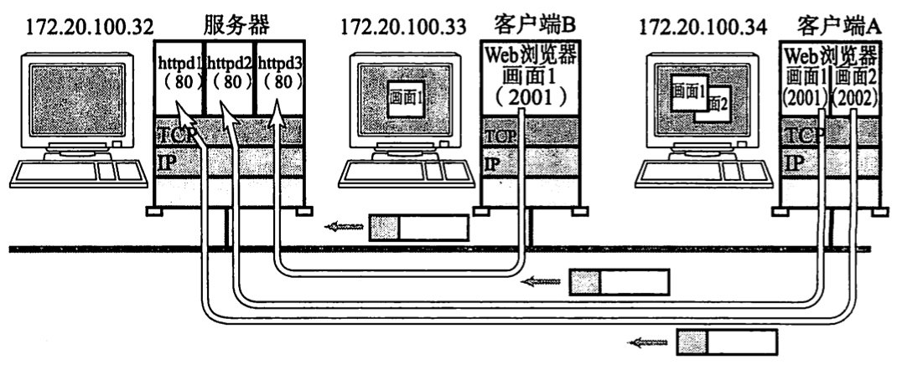

**数据包（Packet）** 指网络层的 **协议数据单元（Protocol Data Unit，PDU）**，也被译为 **分组**，因而网络层的通信过程也称为 **分组交换（Packet Switching）**

**数据报（Datagram）** 指传输层面向无连接的 PDU，**报文段（Segment）** 指传输层面向有连接的 PDU，以上两者都是数据包的数据部分，某些情况为描述简洁可使用数据包进行统称

当网络层在处理包含大量数据的数据报或报文段时，会根据实际情况在发送时将其分片并封装为多个数据包，并在接收时解包并重组回原本的数据报或报文段

传输层应当尽量去避免网络层的分片行为，原因是网络层没有超时重传机制，只要有一个分片丢失了，只能依赖于传输层进行重传，结果是所有的分片都要重传一遍，这个重传时的代价比较大，从另一个角度看，数据包分片也大大降低传输层数据传输成功率

## 端口
数据链路层通过 MAC 地址识别同一链路上的节点，网络层通过 IP 地址识别同一网络中的不同主机和路由器。类似地，传输层通过 **端口** 来识别同一主机中的不同进程，因此端口也被称为 **进程地址**

具有代表性的两个传输层协议是 **UDP 和 TCP**，端口的处理取决于其使用的传输层协议，也就是说，**对于不同的传输层协议可以使用相同的端口**

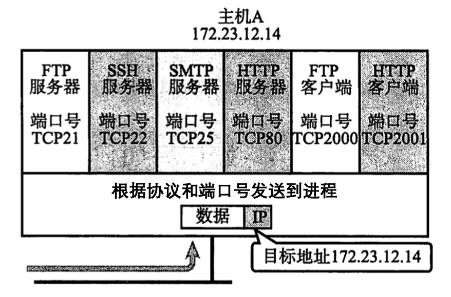

数据包到达网络层并进行了 IP 地址的处理后，会先检查 **IP 首部中的协议号**，若是 TCP 则传给 TCP 模块，若是 UDP 则传给 UDP 模块，然后再由具体模块进行端口的处理

端口的确定方式分为以下两种：
- **标准既定**，静态方法，广泛应用层协议如 SSH（22）、HTTP（80） 所使用的端口，也称为 **知名端口（Well Known Port端口）**，分布在 0～1023 范围内。还有一些注册端口，分布在 1024~49151 范围内，应用程序应避免使用知名端口进行既定用途以外的通信，但可以正常使用注册端口进行任意用途的通信

- **时序分配**，动态方法，服务端需要确定的端口来监听请求，但客户端则不需要确定的端口，因此可以交给操作系统进行互不冲突的动态分配，分布在 45192~65535 范围内

理论上，知名端口的使用和传输层协议无关，任意传输层协议的既定端口都被用于同一种用途的通信。但实际上，基于某些原因存在一些传输层协议的端口可能未投入使用，例如 53 号端口在 TCP 和 UDP 协议都用于 DNS 服务，而 80 号端口仅在 TCP 用于 HTTP 服务，目前UDP 的 80 号端口尚未投入使用 

一个传输层通信通常通过五个信息来标识，也称为其 **五元组信息**，分别是 **源 IP 地址、目的 IP 地址、协议号、源端口、目的端口**，其中的协议号表示该通信所使用的传输层协议

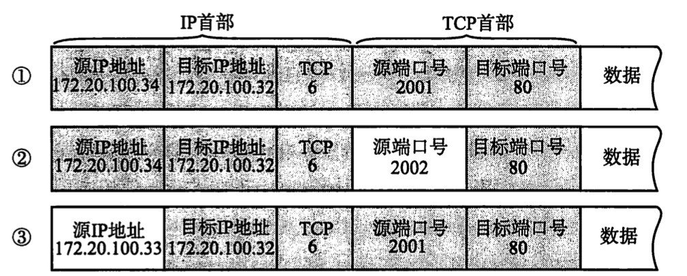

## UDP
**UDP（User Datagram Protocol）用户数据报协议**，是无连接的，不保证可靠传输，尽最大可能交付，没有拥塞控制，面向报文（对于应用程序传下来的报文不合并也不拆分，只是添加 UDP 首部），支持一对一、一对多、多对一和多对多的交互通信

UDP 本身简单高效，不提供复杂的控制机制，更多的控制细节需要交给应用层去处理，包括避免网络层分片的控制，更适合于对高速传输和实时性有较高要求的通信或广播通信，常见应用场景如下：
- 即时通信，比如文字、语音或视频聊天
- 包总量较少的通信，比如 DNS、SNMP
- 限定于 LAN 等特定网络中的通信
- 广播通信

**UDP 首部格式**

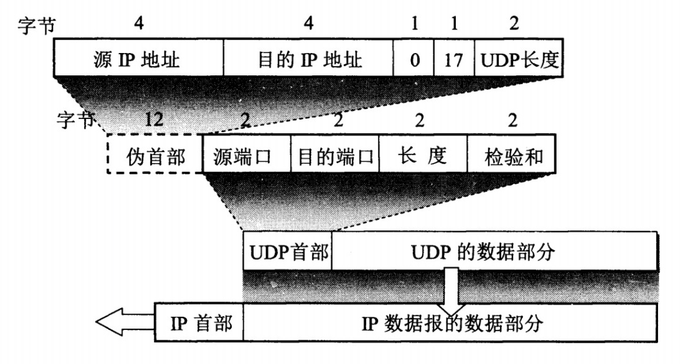

UDP 首部的长度只有 8 Bytes，包括字段有：
- **源端口（Source Port）**

  发送方的端口，可选项，在不需要返回的通信中，有时可以不进行设置，此情况下值为 0

- **目的端口（Destination Port）**

  接收方的端口

- **长度（Length）**

  首部和数据部分的长度之和，单位是 Bytes

- **检验和（Checksum）**

  为了保证数据报本身的完整性和可靠性，防止传输过程中出现篡改或损坏。若发送方直接填充为 0，则表示关闭校验和计算，进而提高数据转发的速度

  校验和计算之前，会临时构造 12 Bytes 的伪首部，包括位于 IP 首部的源 IP 地址、目的 IP 地址和协议号，以保证数据报完整五元组信息的可靠性，伪首部只参与校验和计算，不参与传输。校验和的计算方式是：

  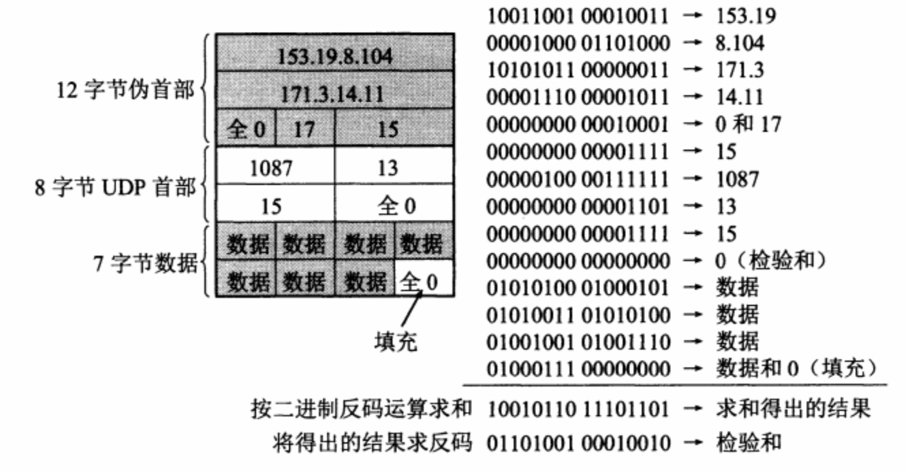

  1. 将本身字段填充为 0
  2. 将所有内容分割成多个 16 Bit 的值，数据部分可补 0 对齐
  3. 将所有 16 Bit 的值求和，若有进位就加到末位
  4. 得出求和结果的反码（Ones' Complement）

> 反码计算又被称为 Ones’ Complement，表示对全 1 的补足，即 00000001（+1）的反码是 11111111 - 00000001 = 11111110
> 
> 负数的补码计算又被称为 Two‘s Complement，表示对 2 次方的补足，即 10000001（-1）的补码是 100000000 - 00000001 = 11111111

## TCP
**TCP（Transmission Control Protocol）传输控制协议**，是面向连接的，提供可靠传输，有流量控制，拥塞控制，提供全双工通信，面向字节流（把应用层传下来的报文看成字节流，把字节流组织成大小不等的数据块），每一条 TCP 连接只能是点对点的（一对一）

TCP 本身提供了多种复杂的控制机制，由于是面向连接的流协议，流表示不间断的数据，仅在确认对端存在时才会发送数据，从而也提高网络的利用率，更适合于对可靠性有较高要求的通信，有着大多数的应用场景

**TCP 首部格式**

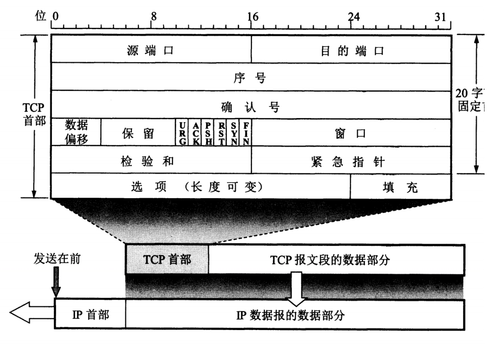

TCP 首部的长度是可变的，其中固定部分的长度为 20 Bytes，包括的字段有：
- **源端口（Source Port）**

  发送方的端口

- **目的端口（Destination Port）**

  接收方的端口

- **序号（Seq Number）**

  用于对字节流进行编号。例如序号为 301，表示第一个字节的编号为 301，如果携带的数据长度为 100 字节，那么下一个报文段的序号应为 402
  
  序号是 32 位的无符号数，在它增大到 2^32-1 时，便会回绕到 0，首个 SYN 包会选择一个随机数作为序号的初值，以克制 TCP 序号预测攻击
  
  此外，在握手或挥手过程中发送的 SYN、FIN 等报文段虽然不携带数据，但也会作为 1 个字节增加对应的序号

- **确认号（Ack Number）**

  期望收到的下一个报文段的序号。例如 B 正确收到 A 发送来的一个报文段，序号为 501，携带的数据长度为 200 字节，因此 B 期望下一个报文段的序号为 702，B 发送给 A 的确认报文段中确认号就为 702

- **数据偏移（Data Offset）** 

  指的是数据部分距离报文段起始处的偏移量，单位为 4 个 Bytes，实际上指的是首部长度

- **保留（Reserved）**

  保留为了以后扩展时使用，目前会被忽略

- **控制位（Control Flag）**

  共有 8 个控制位，依次的意义如下：
  - **拥塞窗口减小 CWR**

    CWR 和 ECE 标识都用于 IP 首部的 ECN 字段，当 CWR=1，ECE=1 时，通知接收方自身已将拥塞窗口减小
  
  - **显式拥塞通知宣告 ECE**
  
    当 ECE=1 时，表示通知发送方到自身的网络有拥塞，当收到数据包的 IP 首部中 ECT=1,CE=1 时，将 ECE 置为 1
    
  - **紧急 URG**

    当 URG=1 时，表示包含紧急处理的数据，紧急指针字段生效
  
  - **确认 ACK**

    当 ACK=1 时确认号字段有效，否则无效。TCP 规定，在连接建立后所有传送的报文段都必须把 ACK 置 1

  - **推送 PSH**

    当 PSH=1 时，将收到的数据立即交付给应用层，而不是先缓存起来

  - **同步 SYN**

    在连接建立时用来同步序号。当 SYN=1，ACK=0 时表示这是一个连接请求报文段。若对方同意建立连接，则响应报文段中 SYN=1，ACK=1

  - **终止 FIN**

    用来释放一个连接。当 FIN=1 时，表示此报文段的发送方的数据已发送完毕，并要求释放连接
    
    **重置 RST**
    
    表示连接出现异常，必须强制断开连接，比如当接收到对未处于监听状态的端口的连接请求时，或者连接信息因宕机等原因已经丢失时
    
- **窗口大小（Window Size）**

  表示接收方从确认号开始所能接收的数据大小，不允许对方发送超过此大小的数据，因此会作为发送方设置其发送窗口的依据。之所以要有这个限制，是因为接收方的数据缓存空间是有限的，相当于告知对方自身剩余的可用缓冲区大小
  
  若该值为 0，则发送方不会再发送数据，而是定期地发送窗口探测，以了解接收方最新的窗口大小
  
- **校验和（Checksum）**

  和 UDP 的计算方式相同，也需要临时构造同样的伪首部，不同的是 TCP 无法关闭校验和计算
  
- **紧急指针（Urgent Pointer）**

  或称为 **紧急偏移（Urgent Offset）**，数据部份由指针所示位置的前 1 Byte 数据为紧急数据，用于告知接收方加速数据处理。一般在中断通信的情况下使用，也用作数据流分段的标志，目前已经是废弃的功能，不建议使用

- **选项（Options）**

  用于提高 TCP 的传输性能，其长度时动态变化的，而最大长度是 40 Bytes，并会补 0 对齐 4 Bytes 的大小。常用的选项有：
  
  - **MSS（Maximum Segment Size）**
  
    用于在建立连接时决定最大消息长度的情况，通常来说 MSS = MTU - IP 首部长度 - TCP 首部长度，从而令 IP 数据包小于 MTU，防止分片行为
  
  - **WSOPT-Window Scale**

    用于窗口扩大以改善 TCP 吞吐量，由于 TCP 首部中的窗口大小字段仅占用 2 Bytes，其最大值为 64 KBytes。若采用此选项，窗口大小的最大值可以扩展到 1 GBytes，由于 $吞吐量 = \frac{窗口大小}{RTT}$，从而达到更高的吞吐量。
  
  - **TimeStamp**

    发送方在发送报文段时把当前时间戳放入该字段，接收方在确认该报文段时把该时间戳复制到 ACK 报文段。发送方可以根据 ACK 报文段准确计算出 RTT，并且可以判断报文段的发送先后顺序，处理发生序号回绕的报文段
  
  > 大带宽并且高延迟的网络通常被称为 **长胖管道（Long Fat Pipe）**，而 WSOPT-Window Scale 和 TimeStamp 常用于这类型的网络中，因此这两个选项也被称为 **长胖选项**
  
## TCP 面向连接
### 三次握手
TCP 连接建立的过程需要经过三次握手：

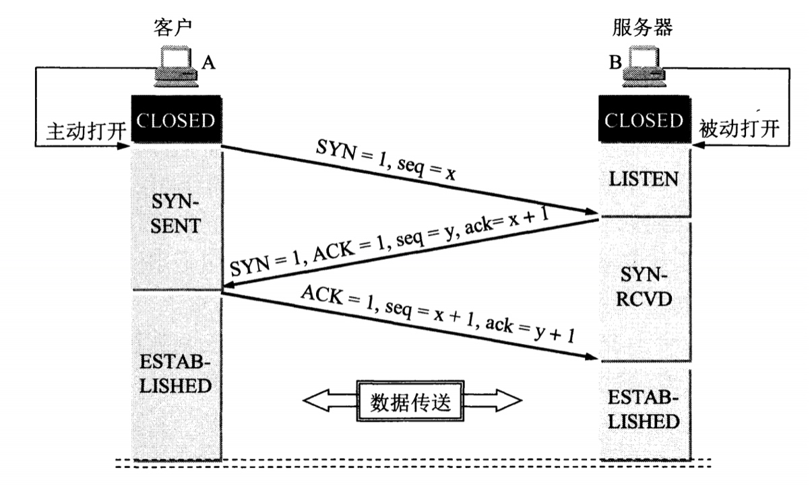

假设 A 为客户端，B 为服务器端：

- 首先 B 处于 LISTEN（监听）状态，等待客户的连接请求

- A 向 B 发送连接请求报文段，SYN=1，ACK=0，选择一个初始的序号 x

- B 收到连接请求报文段，如果同意建立连接，则向 A 发送连接确认报文段，SYN=1，ACK=1，确认号为 x+1，同时也选择一个初始的序号 y

- A 收到 B 的连接确认报文段后，还要向 B 发出确认，确认号为 y+1，序号为 x+1。

- B 收到 A 的确认后，连接建立

**三次握手的原因**

第三次握手是为了防止失效的连接请求到达服务器，让服务器错误地打开连接。比如客户端发出的第一个连接请求报文段并没有丢失，而是在某个网络节点长时间的滞留了，以致延误到连接释放以后的某个时间才到达服务端，本来这是一个早已失效的报文段，不应该令服务端为其打开连接，这时由于存在第三次握手，客户端会忽略服务器之后发送的对滞留连接请求的连接确认，不进行第三次握手，因此服务端就不会再次打开连接

### 连接建立
TCP 连接建立后，数据传输的过程：

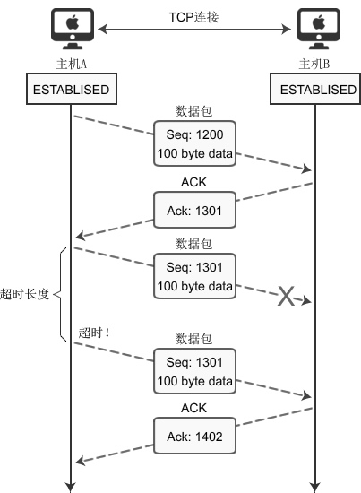
假设 A 为客户端，B 为服务器端：

- A 向 B 发送一个包含 100 Bytes 数据的报文段，报文的序号设置为 1200

- B 收到之后发出确认报文段，确认号设置为 1301，即 SEQ + data_length + 1

TCP 会在三次握手的过程中协商好 MSS 的大小，在传输大量数据时，会以 MSS 的大小将数据进行分割发送，以防止出现网络层分片。因此可认为 TCP 是以段为单位传输数据的，这也就是 TCP 数据传输单元被称为报文段的原因

### 四次挥手
TCP 连接释放的过程需要经过四次挥手：

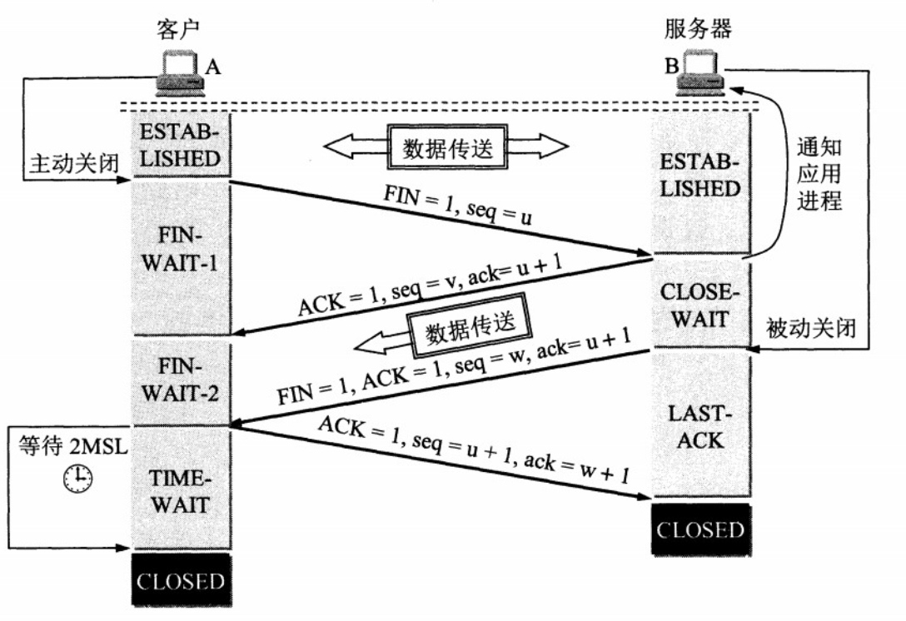
假设 A 为客户端，B 为服务器端：

- A 发送连接释放报文，FIN=1

- B 收到之后发出确认，此时 TCP 属于半关闭状态，B 能向 A 发送数据但是 A 不能向 B 发送数据

- 当 B 不再需要连接时，发送连接释放报文段，FIN=1

- A 收到后发出确认，进入 TIME-WAIT 状态，等待 2 MSL（最大存活时间）后释放连接

- B 收到 A 的确认后释放连接

> 以上描述不讨论序号 Seq 和确认号 Ack，因为 Seq 和 Ack 的规则比较简单，Seq 在连接建立后都为上次 Seq + data_length + 1，Ack 在连接建立之后都为接收到的 Seq + 1

**四次挥手的原因**

客户端发送了 FIN 连接释放报文段之后，服务器收到了这个报文段，就进入了 CLOSE-WAIT 状态。这个状态是为了让服务器端发送还未传送完毕的数据，传送完毕之后，服务器会发送 FIN 连接释放报文段

**TIME_WAIT 阶段的作用**

客户端接收到服务器端的 FIN 报文段后进入此状态，此时并不是直接进入 CLOSED 状态，还需要等待一个时间计时器设置的时间 2MSL。这么做有两个理由：

- 确保最后一个确认报文段能够到达。如果 B 没收到 A 发送来的确认报文段，那么就会重新发送连接释放请求报文段。A 等待的这段时间，前 1 MSL 保证了 A 发送的确认报文段，后 1 MSL 保证了 B 重发的连接释放请求报文段

- 等待一段时间是为了让本连接持续时间内所产生的所有报文段都从网络中消失，使得下一个新的连接中不会出现旧的连接释放请求报文段

### 状态转换图
一个 TCP 连接的生命周期包括建立、通信和终止三个阶段，总共可以使用 11 种状态进行描述，并且各种状态之间的转换规则如下：

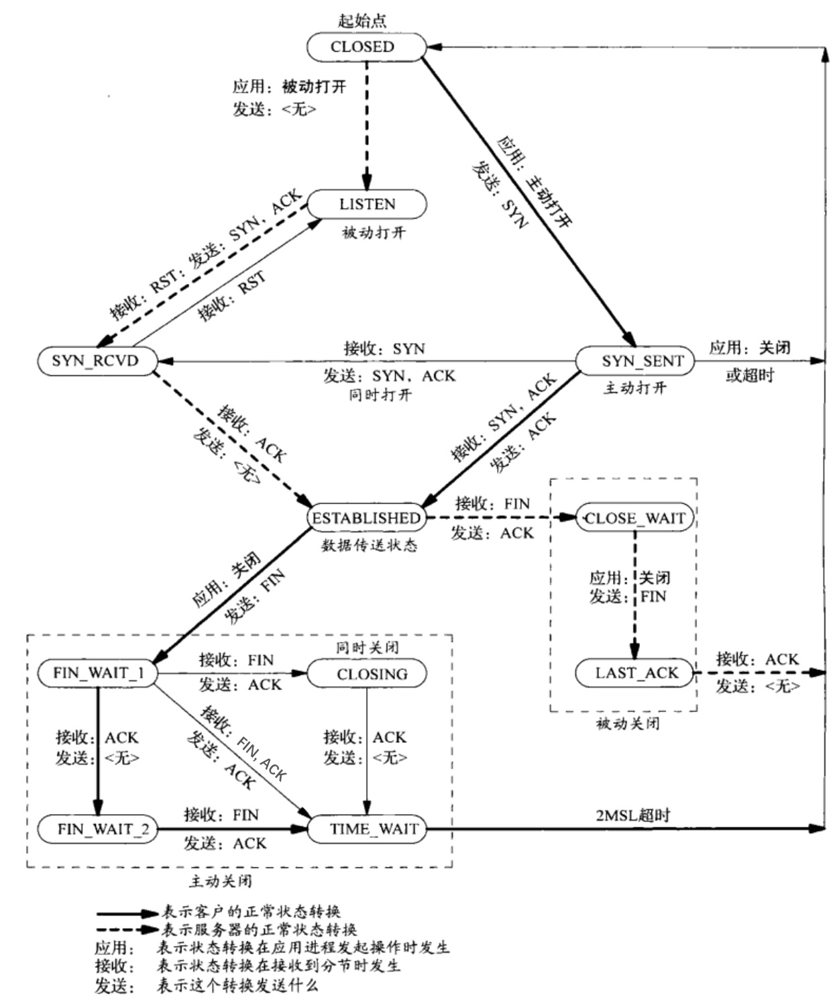
- **CLOSED**：连接关闭，是初始状态

- **LISTEN**：正在监听连接，等待 SYN 包开始建立连接

- **SYN-SENT**：主动建立连接，已发送 SYN 包，正在等待 SYN-ACK 包

- **SYN-RECEIVED**：被动建立连接，已收到 SYN 包并返回 SYN-ACK 包后，正在等待 ACK 包

- **ESTABLISHED**：连接完成建立，双方可以进行数据传输

- **FIN-WAIT-1**，主动关闭连接，发送 FIN 包后，等待 ACK 包，由于对端一般很快会返回 ACK ，因此该状态很少见到

- **CLOSE-WAIT**：被动关闭连接，收到 FIN 包并返回 ACK 包，，等待本端主动关闭连接，在此之前一直保持该状态

- **FIN-WAIT-2**：等待对端关闭连接，收到主动关闭连接返回的 ACK 包后，等待对方发送 FIN 包，现在只能接收数据不能发送数据，也叫半关闭状态，持续时间也短

- **LAST-ACK**：等待对端确认关闭连接，进行一次被动关闭连接后，发起主动关闭连接，发送 FIN 包后等待 ACK

- **TIME-WAIT**：发起主动关闭连接并收到确认后，收到对端发送的 FIN 包并返回 ACK，等待两倍的 MSL 之后进入 CLOSED，完成连接关闭

- **CLOSING**：发起主动关闭后，先收到对端发送的 FIN 包，返回 ACK 并等待 ACK 包

## TCP 可靠传输
### ARQ
**ARQ（Automatic Repeat-reQuest）自动重传请求**，该协议通过 **序号（Seq）和确认号（Ack）**，自动判断并为发送失败的报文段重传，直到其被正确接收为止，从而完成可靠的信息传输。其中包括了以下的可靠传输机制：
- **错误检测（Error Detection）**：
- **正面确认（Positive Acknowledgment）**
- **超时重传（Retransmission after Timeout）**
- **负面确认及重传（Negative Acknowledgment and Retransmission）**

传统 ARQ 根据不同的报文段处理方式，可分为 **停止等待（Stop-And-Wait）ARQ**、**回退 N（Go-Back-N）ARQ** 以及 **选择性重传（Selective Repeat）ARQ**。后两者是与滑动窗口机制的结合成果，由于窗口大小开到足够大时，报文段可以连续地流动，因此又称其为 **连续（Continue）ARQ**。以上三种 ARQ 协议的复杂性和效率都是依次递增的，而除了传统 ARQ 外，还有结合多种报文段处理方式的 **混合 ARQ（Hybrid-ARQ）**

### 停止等待 ARQ
TCP 连接是全双工信道，下面为了简化问题，仅考虑 A 作为发送方，B 作为接收方的情况，停止等待 ARQ 在不同情况下的报文段处理方式如下：
- **无差错情况**

  A 发送报文段 M1，发送完就暂停发送，等待 B 的确认。B 收到 M1 就向 A 发送确认。A 在收到了对 M1 的确认后，就再发送下一个报文段 M2。依次下去发送剩余的数据，如下图所示：

  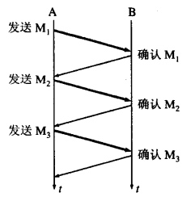

- **出现差错情况**

  如果 A 发送的过程中出现差错，B 在接收 M1 时检测出了差错，就丢弃 M1，其他什么都不做。又或者 A 发送的过程中 M1 丢失了，以上这两种情况下，B 不会发送任何信息

  而发送方 A 发送完一个报文段后，就会设置一个超时计时器，如果超时计时器到期之前没有收到接收方发来的确认，则会重发刚发送过的报文段；如果收到确认，则撤销该超时计时器。如下图所示：
  
  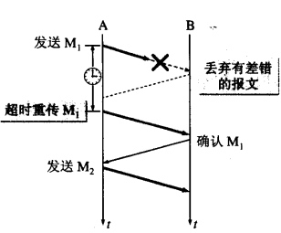

  - **确认丢失或延迟情况**

  如果 A 发送了 M1 报文段，到达 B，B 发送了 M1 的确认，但由于网络原因，该确认丢失。此时 A 在超时重传时间内，没有收到 M1 的确认，因此它并不知道是自己的报文段有差错或丢失，还是 B 发送的确认丢失了，因此 A 重发刚发送过的报文段
  
  这时 B 则会丢弃重发的 M1 报文段，不向上层交付，因为 B 之前已经收到过 M1 报文段了，然后再向 A 重新发送确认。如图下所示：
  
  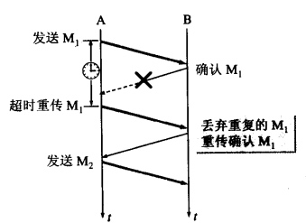

  还有可能是另一种情况，就是 B 发送了确认，没有丢失，但是延迟了，即在A超时计时器过期后才到达。这种情况下，A 收到确认后会丢弃，然后重传刚才的报文段，B 收到后，丢弃重复的报文段，并重传确认报文
  
  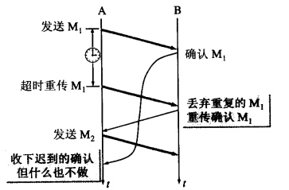

由于发送的报文段可能需要重传，因此发送方会暂时保留已发送的报文段副本，只有收到确认后才清除。报文段和确认报文之间的对应关系，通过报文段的序号和确认报文段的确认号来标识

停止等待 ARQ 的优点是简答，但也有很严重的问题，就是其信道利用率太低。假设发送方处理报文段的耗时为 $T_D$，B 接收方处理报文段的耗时为 $T_A$，报文段往返时间为 $RTT$，则信道利用率 $U$ 为：
$$U = \frac{T_D}{T_D + RTT + T_A}$$
  
### 连续 ARQ
为了改善停止等待 ARQ 信道利用率太低的问题，连续 ARQ 中发送方采用 **流水线（Pipline）传输**，即连续发送一组报文段，然后再等待这些报文段的确认，而不必每发完一个报文段就停下来等待

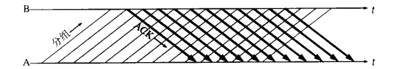

而连续 ARQ 是结合滑动窗口机制来使用的，发送方需要维持一个发送窗口，表示一组可以连续发送出去的报文段，
用于提高信道利用率。如下图所示：

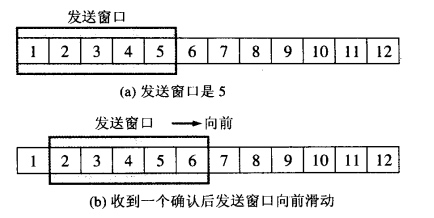

连续 ARQ 协议规定，发送方每收到一个确认，就把发送窗口向前滑动一个报文段的位置。例如上图当报文段发送方收到第一个报文段的确认，就把发送窗口向前移动一个报文段的位置。如果原来已经发送了前 5 个报文段，则现在可以发送窗口内的第6个报文段。 

接收方对报文段的确认方式有 **累积确认** 和 **逐个确认**，累积确认指的是接收方不必对收到的报文段逐个发送确认，而是在收到几个报文段后，对按序到达的最后一个报文段发送确认，即如果收到了这个报文段的确认，则表示到这个报文段为止的所有报文段都已经正确接收到了

**累积确认（UNA）** 的优点是实现简单，且即使确认丢失也不必重传。但缺点是不能正确的向发送方反映出接收方已经正确收到的报文段信息。比如发送方发送了前 5 个报文段，而中间的第 3 个报文段丢失了，这时候接收方只能对前 2 个报文段发出确认

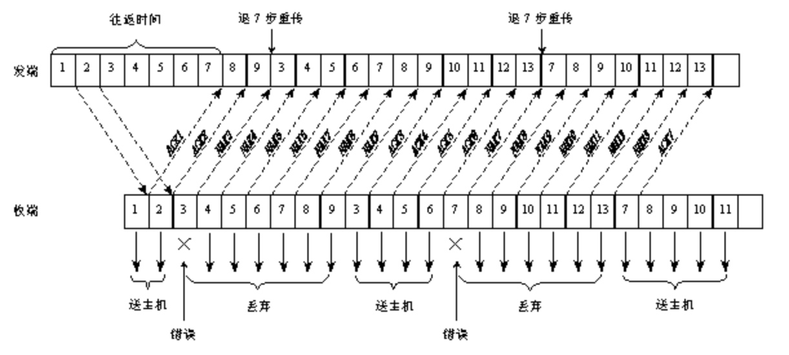

发送方不知道后面 3 个报文段的情况，因此只能把后面的 3 个报文段都重传一次，这种处理方式也叫 Go-back-N，表示需要再退回来重传已发送过的 N 个报文段，而使用这种处理方式的连续 ARQ 被称为回退 N ARQ，在极端网络不佳的情况下，可能会比停止等待 ARQ 还慢

**逐个确认（ACK）** 虽然可以更精确地处理每个报文段的重传，但确认丢失需要重传，并且接收方需要额外的缓冲空间，以保存不连续的报文段，待缺失的报文段到达后再一并交付给上层

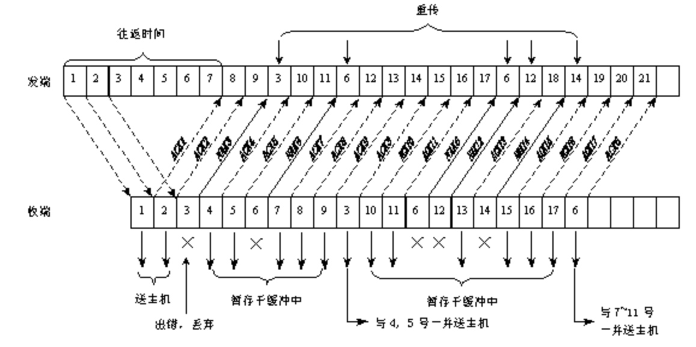

当报文段发生丢失时，发送方仅需根据每个报文段的确认情况，进行具体报文段的重传即可，这种处理方式也叫选择性重传，而使用这种处理方式的连续 ARQ 被称为选择性重传 ARQ

**TCP 使用连续 ARQ 中的回退 N ARQ 来实现可靠传输**。连续 ARQ 的工作依赖滑动窗口大小的支持，比如回退 N ARQ 的发送窗口必须大于 1，择性重传 ARQ 的发送窗口和接收窗口都必须大于 1

由于选择性重传 ARQ 接收报文段存在乱序现象，其接收窗口不能超过序号范围的 1/2，否则当确认大量丢失时，可能造成重传报文段和已接收报文段和序号重叠

### 重传超时
超时重传指如果一个已经发送的报文段在超时计时器到期前没有收到确认，那么发送方就重传这个报文段，这个计时器所设定的时间则为 **重传超时（RTO，Retransmission Timeout）**

一个报文段从发送再到接收到确认所经过的时间称为往返时间 $RTT$，加权平均往返时间 $RTT_s$ 计算如下：
$$RTT_s=(1-α)*RTT_s+α*RTT$$
> 其中 $a$ 为更新系数，$0 ≤ α ＜ 1$，$RTT_s$ 随着 $α$ 的增加更容易受到新的 $RTT$ 的影响

$RTT_s$ 和当前 RTT 的加权移动平均值 $RTT_d$ 计算如下：
$$RTT_d =(1-β)RTT_d+β(|RTT - RTT_s|)$$

重传超时时间 $RTO$ 应该略大于 $RTT_s$，最终 TCP 使用的重传超时时间计算如下：
$$RTO=μ*RTTs+∂*RRT_d$$

在 Linux 下，$α=0.125，β=0.25，μ=1，∂=4$，且初始情况下，$RTT=RRT_s=6，RTT_d=0$，根据公式得到的重传超时应如下：

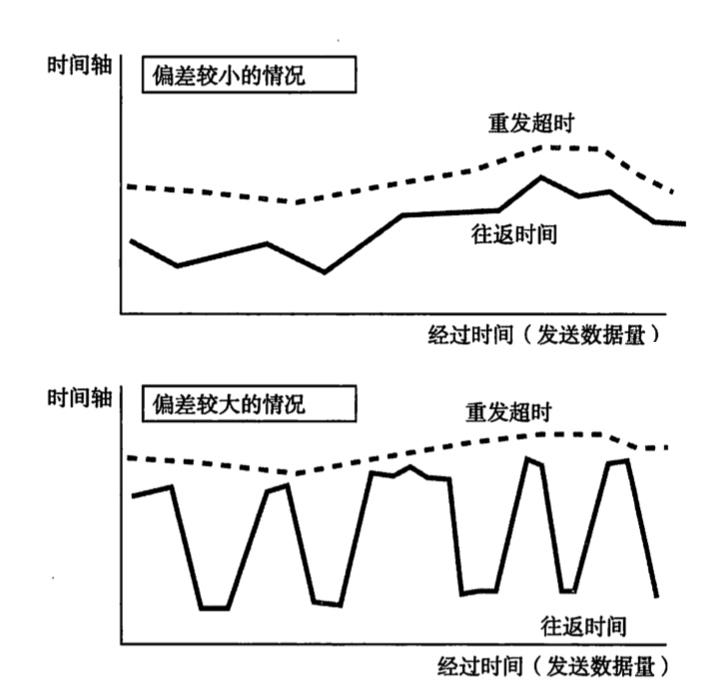

以上公式是没有出现重传情况下的计算公式，每次出现重传都会对上次的 RTO 值进行翻倍，直到接收到报文段的确认，才重新根据上图所示式子计算超时重传时间，或者达到最大重传次数，最终发送报文段失败

最大重传次数会根据系统设置的不同而有所区别，比如 Windows 中默认为 5 次，而 Linux 中默认为 15 次，对于可靠性要求更高的业务系统，可以手动设置很高的重传次数，以不断地重传丢失的报文段，尽最大可能保证业务数据的正常交互

## TCP 流量控制
TCP 使用 **滑动窗口（Slide Window）** 机制来实现流量控制，为了控制发送方发送速率，保证接收方来得及接收，也用于搭配连续 ARQ 协议保证可靠传输 

滑动窗口是缓存的一部分，用来暂时存放字节流，因此其大小受到内存的限制。发送方和接收方各有一个窗口，接收方在发送连接确认报文段或确认报文段时，可以通过 TCP 首部中的窗口字段，告知发送方自身的接收窗口大小，发送方根据这个值和其它信息设置自身的发送窗口大小

这样以来，接收方能够持续控制着数据的发送速率，若接收方将接收窗口设置为 0，则发送方不能发送数据，只会周期性地对接收窗口的大小变化进行探测，此种探测报文段仅包含 1 Bytes 的数据

发送窗口内的字节都允许被发送，也就是无需等待确认而可以连续发送的数据最大值，如果发送窗口左部的字节已经发送并且收到了确认，那么就将发送窗口向右滑动一定距离，直到左部第一个字节不是已发送并且已确认的状态；接收窗口内的字节都允许被接收。接收窗口的滑动类似，接收窗口左部字节已经发送确认并交付到进程，就向右滑动接收窗口

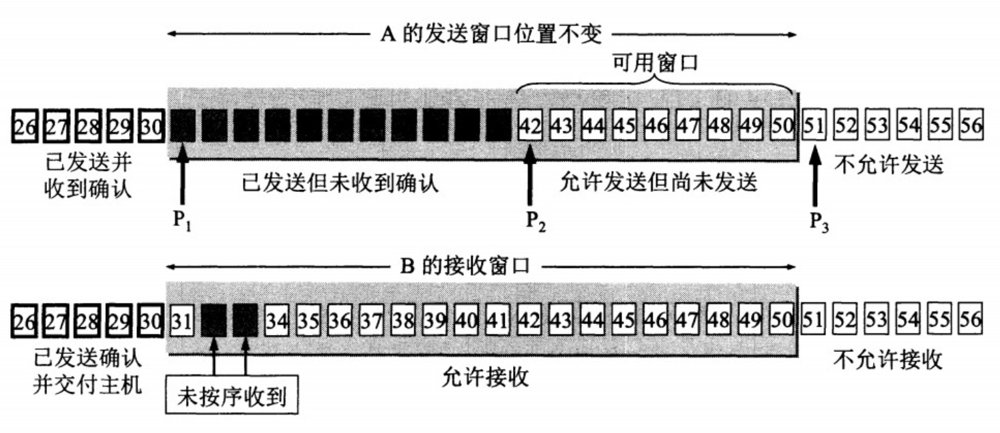

接收窗口只会根据窗口内最后一个按序到达的字节进行确认，例如接收窗口已经收到的字节为 `{31, 34, 35}`，其中 `{31}` 按序到达，而 `{34, 35}` 就不是，因此只会发送字节 31 的确认，发送方得到一个字节的确认之后，就知道这个字节之前的所有字节都已经被接收

## TCP 拥塞控制
如果网络出现拥塞，报文段将会丢失，此时发送方会继续重传，从而导致网络拥塞程度更高

因此当出现拥塞时，应当控制发送方的速率。这一点和流量控制很像，但是出发点不同。流量控制是为了让接收方能来得及接收，而拥塞控制是为了降低整个网络的拥塞程度，所起作用如下：

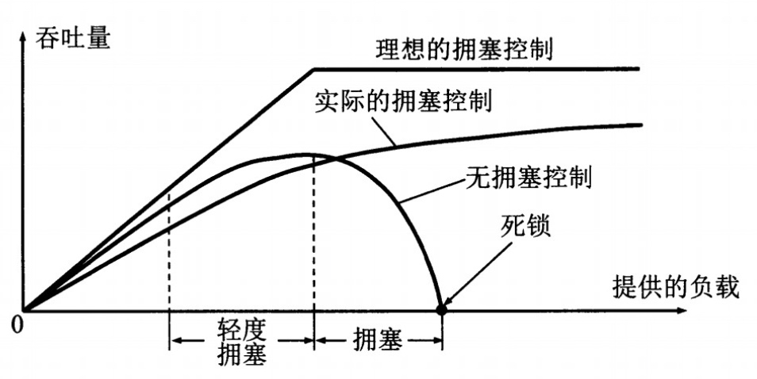

TCP 主要通过四个算法来进行拥塞控制：慢启动、拥塞避免、快重传、快恢复

发送方需要维护一个叫做拥塞窗口 cwnd 的状态变量，注意拥塞窗口与发送方窗口的区别：拥塞窗口只是一个状态变量，实际决定发送方能发送多少数据的是发送方窗口

为了便于讨论，做如下假设：
- 接收方有足够大的接收缓存，因此不会发生流量控制
- 虽然 TCP 的窗口基于字节，但是这里设窗口的大小单位为报文段

拥塞窗口 cwnd 在拥塞控制时的变化情况：

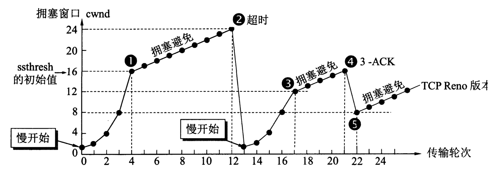

### 慢启动与拥塞避免
发送的最初执行慢启动，令 cwnd = 1，发送方只能发送 1 个报文段的字节数；当收到确认后，将 cwnd 加倍，因此之后发送方能够发送的报文段数量为：2、4、8 ...

注意到慢启动每个轮次都将 cwnd 加倍，这样会让 cwnd 增长速度非常快，从而使得发送方发送的速度增长速度过快，网络拥塞的可能性也就更高

设置一个慢启动门限 ssthresh，当 cwnd >= ssthresh 时，进入拥塞避免，每个轮次只将 cwnd 加 1。

如果出现了超时重传，则令 ssthresh = cwnd / 2，然后重新执行慢启动，如果出现重复确认导致的快重传，则令 ssthresh = cwnd / 2 ，cwnd = ssthresh，然后直接进入拥塞避免

### 快重传与快恢复
对于接收方，要求每次接收到报文段都应该对最后一个已收到的有序报文段进行确认。例如已经接收到 M1 和 M2，此时收到 M4，应当发送对 M2 的确认

在发送方，如果收到三个重复确认，那么可以知道下一个报文段丢失，此时执行快重传，立即重传下一个报文段。例如收到三个 M2，则 M3 丢失，立即重传 M3，这样的快重传机制会比超时重传机制更加地效率

这种情况没有超时重传严重，只是丢失了个别报文段，而并不是发生了网络拥塞。因此执行快恢复，也就是令 ssthresh = cwnd / 2 ，cwnd = ssthresh，然后直接进入拥塞避免

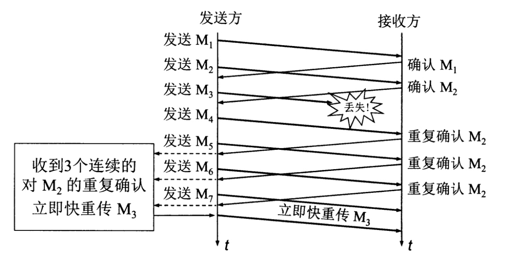

慢启动和快恢复的快慢指的是 cwnd 的设定值，而不是 cwnd 的增长速率。慢启动将 cwnd 设定为 1，而快恢复将 cwnd 设定为 ssthresh

### SACK 和 D-SACK
由于 TCP 使用连续 ARQ 中的回退 N ARQ 来实现可靠传输，某些 TCP 实现由 M1 报文 ACK 触发的快重传时，为了提高传输效率，不会仅重传 M2 报文，而是使用 Go-back-N 重传 M1 之后的所有报文段

但这样一来容易产生无效的重传，为了解决这个问题，提出了 **Selective Acknowledgment (SACK)** 的机制，令快重传能实现选择性重传，在 Linux 2.4 后通过 `tcp_sack` 内核参数默认启用该机制

使用该机制后，ACK 报文段的 TCP 首部中会新增的 SACK 选项，表示接收方已经收到的其他字节序号，使触发快重传时能选择未被接收的字节进行重传

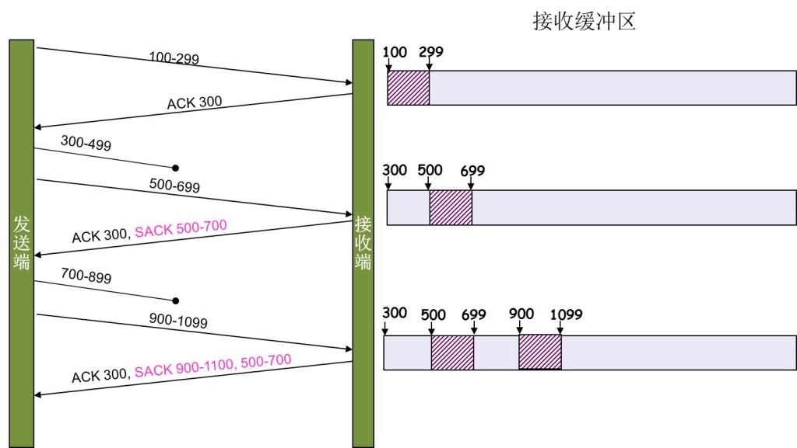

但 SACK 机制中存在一个 **Reneging** 的问题，即接收方有权把已经通过 SACK 确认的数据丢弃，从而紧急让出一部分的内存。所以发送方对于数据成功接收的确认，不能完全依赖 SACK，还是要依赖 ACK，比如达到重传超时后 ACK 没有增长，则还是需要重传 SACK 中的数据

**Duplicate SACK（D-SACK）**，是基于 SACK 选项的扩展， 用于告知发送方有哪些数据被重复接收了，在 Linux 2.4 后通过 `tcp_dsack` 内核参数默认启用该机制，其解析方式为：
- 若 SACK 的第一个段的范围被 ACK 所覆盖，那么这个范围就是 D-SACK，比如 `ACK=1000,SACK=500-1000`

- 若 SACK 的第一个段的范围被 SACK 的第二个段所覆盖，那么这个范围就是 D-SACK，比如 `ACK=1000,SACK=1500-2000,1800-2500`

D-SACK 可以告知发送方一些情况，比如重传超时设置过低、ACK 包发生丢失、数据包在传输过程被复制等等，便于发送方对重传的策略进行动态调整

## TCP 网络利用率优化
### Nagle 算法
**Nagle 算法** 指发送方即使还有应该发送的数据，但如果这部分数据很少的话，则进行延迟发送的一种处理机制，旨在提高网络的利用率

具体来说，未发送的数据必须满足以下条件才会被立即发送：
- 已发送的数据都已经收到接收方的确认时
- 累积已达到 MSS 最大段长度时

虽然该算法能提高网络利用率，但可能会发生某种程度的延迟，因此在大多数系操作系统往往会关闭对该算法的启用 

### 延迟确认
若接收方每次收到数据都立即回复确认的话，由于缓冲区刚被填满，可能会返回一个较小的接收窗口。此时发送方根据接收窗口设置发送窗口时，就会降低发送速率，以致网络利用率的降低

为此，**延迟确认（Delay Ack）** 就是接收方收到数据后并不立即回复确认，而是延迟一段时间的机制，延迟的方式有以下两种：

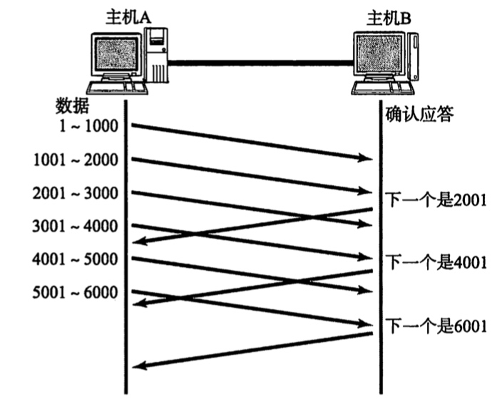

- 在收到 2 * MSS 的数据后回复确认，根据操作系统的不同，Linux 的实现是不论数据大小，只要收到 2 个报文段则立即回复确认
- 在延迟 500 ms 后进行回复确认，根据操作系统的不同，Linux 的实现是 200 ms

### 捎带确认
根据应用层协议，发送出去的报文达到接收方，接收方进行处理以后会返回一些响应数据。**捎带确认（PiggyBack Ack）** 就是指在此类通信中，将确认信息和响应数据通过一个报文段回复，从而减少收发的数据量，提升网络的利用率
  
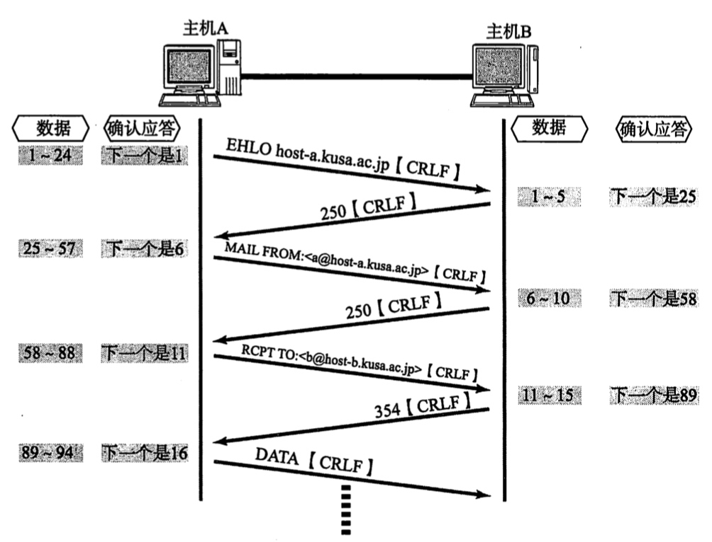
另外，接收方如果收到数据后立即回复确认，则无法实现捎带应答，因为需要先等待应用层完成对数据的处理。也就是说，若不启用延迟确认机制就无法实现捎带确认

## TCP 非标准规范
### TCP KeepAlive
TCP KeepAlive 是一种保证连接存活性的机制，若一个已建立的连接在一段时间内都没有活动，本地就会开始向连接发送 TCP KeepAlive 报文作为心跳检测，若多次未能获得响应，则判定连接的对端已经断开然后关闭连接

若没有检测连接的存活性，当对端出现意外断电、死机或重启的情况，则本地内存中会残留这个无效连接，并且对该连接执行阻塞 `recv` 或 `send` 操作时，会一直等待下去

TCP KeepAlive 虽然在主流的 OS，包括 Linux、Windows 的内核协议栈中都有实现，但它不属于 TCP 协议标准的一部分，仅是协议栈实现者提供的扩展实现。官方认为 TCP KeepAlive 不应该成为标准的原因如下：
- 可能存在由于暂时的网络故障破坏，但后续能继续正常工作的连接
- 消耗不必要的带宽，因为如果没人用该连接，它到底是否有效根本无所谓
- 当网络链路按照报文数来收费时，会产生额外的费用

但从某些场景来看，比如对端本身网络是不稳定的，对比大量无效且残留的连接所造成的存储与计算开销，上述原因几乎是可以忽略不计的。因此允许用户通过设置内核协议栈的参数来打开 TCP KeepAlive 机制，默认这是关闭的

以 Linux 为例，关键的配置参数及其默认值如下：

``` bash
# 触发检测的连接空闲时间，单位秒
net.ipv4.tcp_keepalive_time = 7200

# 检测的时间间隔，单位秒
net.ipv4.tcp_keepalive_intvl = 75

# 检测的报文数量
net.ipv4.tcp_keepalive_probes = 9 
```

按照以上默认配置，即当连接空闲 7200 秒后，会以每 75 秒的间隔连续发送 9 次心跳检测，也就是需要大概额外 11 分钟的时间来判断当前连接是否还可用

## 更多协议
除了 UDP 和 TCP 两个传输层协议外，还有以下几个协议也从试验阶段步入了实用阶段，也许今后会被广泛应用：

- **UDP-Lite（Lightweight UDP）**

  轻量级 UDP，是扩展 UDP 机制的一种传输层协议。在 UDP 通信中如果校验和出现错误，则会将所收到的数据报全部丢弃，然而某些应用此时是不希望全部丢弃的，若不启用校验和，万一五元组相关信息出现损坏则会造成严重的后果
  
  因此 UDP-Lite 的作用就是可以由应用自定义计算校验和的范围，比如是数据报 + 伪首部，或者说首部 + 伪首部，如此一来仅需要对不允许发送错误的部分进行校验即可
  
- **SCTP（Stream Control Transmission Protocol）**

  流控制传输协议，与 TCP 一样是一种提供了可靠传输的传输层协议，但其主要的特点如下：
  - **以消息为单位进行收发**：消息的大小是协商确定的
  - **支持多宿主**：在有多个 NIC 的主机中，即使 NIC 发生变化仍可以继续通信，比如以太网切换为无线 LAN
  - **支持一对多连接**：支持一对多的连接形式，一个服务端套接字可分别与多个客户端建立 SCTP 连接，每个 SCTP 连接也被称为 **关联**
  - **支持多数据流通信**：一个 SCTP 连接能够分为多个有序的数据流，实现多个 TCP 连接的通信效果
  - **可定义消息的生存期限**：超过生存周期的消息不会重发

  SCTP 主要用于应用之间发送众多较小消息的情况，这些小消息也被称为 **数据块（Chunk）**，由多个数据块组成一个数据包，然后根据流号划分的消息序列组成一条数据流
  
- **DCCP（Datagram Congestion Control Procotol）**

  数据报拥塞控制协议是一个辅助 UDP 的传输层协议，由于 UDP 没有拥塞控制，因此发送大量数据时极容易出现问题。为了解决这个缺陷，于是诞生了这么一个协议，其具有的特点：
  - 不提供可靠传输、面向连接
  - 提供类似 TCP 和 TCP 友好升级版两种拥塞控制
  - 接收方需要进行数据报确认

- **T/TCP（Transactional/Transmission Control Protocol）**

  事务传输控制协议，是 TCP 协议的变体，在传输可靠性、流量控制、拥塞控制得以保留之余，得到了类似 UDP 的轻量性，填补了 TCP 和 UDP 之间的间隙
  
  对于通信过的主机，能够减少通信过程的报文段总数目，适用于高效面向事务的服务，即读取全部请求数据才进行产生全部回复数据，并且数据量不大的情况，比如 HTTP/1.1
 
  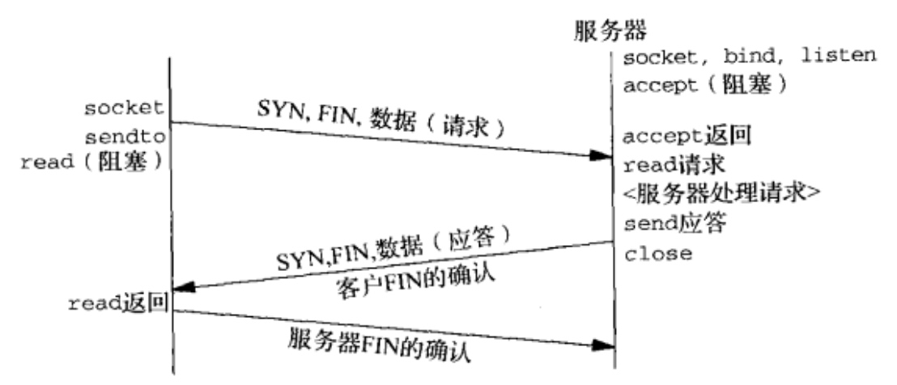

## KCP
KCP 是一个快速可靠的 ARQ 协议，能以比 TCP 浪费 10%~20% 带宽的代价，换取平均延迟降低 30%~40% 且最大延迟降低三倍的传输效果，[官方地址](https://github.com/skywind3000/kcp)

从功能划分上来看，KCP 是一个传输层协议，但从其运行态来看，KCP 完全工作在用户态，因此也可看作是在传输层协议基础上，用纯算法方式实现了 ARQ 模型的应用层协议，旨在额外提供可靠传输的能力。由于 KCP 仅负责传输层相关的功能处理，并不涉及应用层相关的功能处理，因此仍将其视为传输层协议的一部分

纯算法实现意味着 KCP 不负责底层协议的收发，使用者需要自行定义底层报文段的发送方式，以回调的形式注册到 KCP 中，所有信息包括时钟都由外部传入，内部不存在任何一次系统调用。通常使用 UDP 作为 KCP 的底层协议，以此在 UDP 简单高效的基础上，补充可靠传输的能力

在理想的网络状态下，KCP 和 TCP 的传输速度并无明显区别，但考虑到在弱网环境下，即在高延时或高丢包等的异常网络环境下，KCP 对于传输速度的提升相比 TCP 就非常明显了

**KCP 首部格式**

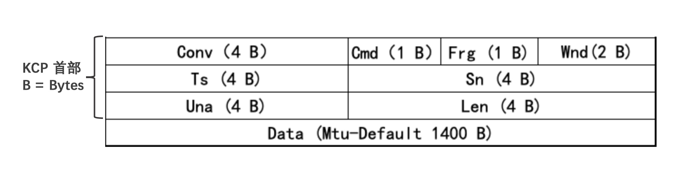

KCP 首部的长度是 24 Bytes，以下是需要关注的字段：
- **会话编号（Conv）**

  通信双方必须一致才能使用 KCP 协议交换数据，相当于虚拟连接

- **命令（Cmd）**

  表明当前报文段的命令类型，共有以下四种类型：
  - **IKCP_CMD_PUSH**：传输数据的报文段
  - **IKCP_CMD_ACK**：确认报文段，类似于 TCP 中的 ACK，告知对方确认收到的包
  - **IKCP_CMD_WASK** : 用于探测远端的窗口大小
  - **IKCP_CMD_WINS** : 用于告知对方自身的窗口大小

- **分片编号（Frg）**

  当输出数据大于 MSS 时，需要将数据进行分片，用于记录了分片时的倒序序号
  
- **窗口（Wnd）**

  己方的可用窗口大小
  
- **时间戳（TS）**
  
  记录发送时的时间戳，用来估算 RTT
  
- **序号（SN）**
  
  基础数据报文段的序号或者 ACK 报文段的确认序号
  
- **未确认序号（UNA）**

  当前还未确认的报文段的序号，即该序号前的报文段都已确认

- **重传时间（Resendts）**

  下一次重传该报文段的时间

- **重传超时（RTO）**

  发送报文段之后设置的超时计时器时间

- **快确认（Fastack）**

  记录了该报文段在收到 ACK 时被跳过了几次，用于快重传
  
- **传输次数（Xmit）**
  
  记录了该报文段被传输了几次

## KCP 技术特性
TCP 是为流量设计的，注重网络的利用率，即充分利用带宽，以提高网络传输的数据总量。而 KCP 是为流速设计的，注重网络的时延，即允许浪费部分带宽，以提高网络传输的速度

可以想象成，TCP 信道是一条流速很慢，但每秒流量很大的大运河，而 KCP 是水流湍急的小激流。KCP 有正常模式和快速模式两种，通过以下策略达到提高流速的结果：
- **RTO 翻倍 vs 不翻倍**

  TCP 重传超时计算是 2 * RTO，这样一来在出现连续丢包时的增长过快了。KCP 启动快速模式后每次重传超时为 1.5 * RTO，提高了传输速度

- **全部重传 vs 选择性重传**
  
  TCP 在丢包时需要进行回退 N 重传，重传所丢失报文段以及其之后的所有报文段，而 KCP 只需要进行选择性重传，即只重传真正丢失的报文段

- **快速重传**
  
  TCP 在三次重复确认（UNA）后快速重传，而 KCP 在两次跨越确认（ACK）后快速重传。比如发送方发了`{1, 2, 3, 4, 5}` 个报文段，然后收到对端回复 ACK 1、ACK3、ACK4，当收到 ACK3 时，意味着报文段 2 被跳过 1 次，收到 ACK4 时，意味着报文段 2 被跳过了 2 次，此时可以认为 2 报文段丢失，直接重传 2 报文段，大大改善了丢包时的传输速度

- **延迟确认 vs 非延迟确认**
 
  TCP 为了充分利用带宽，延迟发送确认，这样重传超时计算会算出较大 RTT 时间，延长了丢包时的判断过程。而 KCP 可以手动调节是否延迟确认

- **UNA vs ACK+UNA**

  ARQ 模型的确认方式有两种，累积确认（UNA）和逐个确认（ACK），TCP 使用 UNK 需要回退 N 重传，但仅使用 ACK 则确认丢失的成本太高，因此 KCP 兼有 ACK 和 UNA 两种确认

- **非退让流控**
  
  TCP 的流量控制使用公平退让法则，即发送窗口的大小由 **发送缓存大小、接收端剩余接收缓存大小、丢包退让及慢启动** 四个要素决定，KCP 在快速模式时仅用前两项来控制发送速率。以牺牲部分公平性及带宽利用率之代价，换取流畅传输的效果

## KCP 工作原理
### 使用方式
整个协议只有 `ikcp.h` 和 `ikcp.c` 两个源文件，可以方便地集成到用户自身的协议栈中，其使用方式如下：
1. 创建一个 KCP 实例，相当于一个句柄

  ``` c
ikcpcb* ikcp_create(IUINT32 conv, void *user)
```

2. 设置发送数据的接口，底层为任意协议的 socket 都没问题，建议使用简单高效的 UDP

  ``` c
int output(const char *buf, int len, ikcpcb *kcp, void *user)
```

3. 更新 KCP 状态。KCP 运行于用户空间，所以需要手动去更新每个实例的状态，其实主要就是检测哪些数据包该重传了

 ``` c
void ikcp_update(ikcpcb *kcp, IUINT32 current)
```

4. 发送数据。调用 `ikcp_send` 之后，KCP 最后会使用上面设置的 `output` 函数来将发送数据

  ``` c
int ikcp_send(ikcpcb *kcp, const char *buffer, int len)
```

5. 预接收数据。先手动预接收数据，然后再调用`ikcp_input` 将裸数据交给 KCP，这些数据有可能是 KCP 控制报文，并不是应用数据

  ``` c
int ikcp_input(ikcpcb *kcp, const char *data, long size)
```

6. 接收数据。此时收到的数据才是真正的数据，重组操作在调用 `ikcp_recv` 之前就完成了

  ``` c
int ikcp_recv(ikcpcb *kcp, char *buffer, int len)
```

总体的工作流程还是容易理解的，从前是直接使用各种 socket 和对端通信，各种功能由自己控制。现在则在 socket 之上使用了一个 KCP 中间件，从而实现快速可靠传输功能，其工作流程如下：

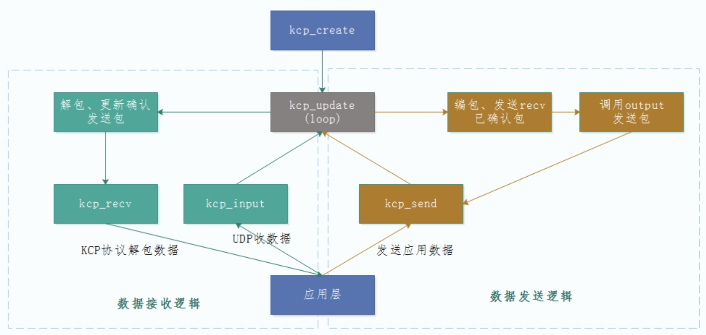

### 协议配置
KCP 协议的默认模式是一个标准的 ARQ，相当于 TCP 的 ARQ 机制，需要通过以下配置打开各项加速开关，启用快速模式

工作模式的配置：
``` c
int ikcp_nodelay(ikcpcb *kcp, int nodelay, int interval, int resend, int nc)

// nodelay 表示是否启用无延时确认模式，默认 0 不启用，1 启用
// interval 表示协议内部工作的 interval，单位毫秒，影响报文段重发的频率
// resend 表示快速重传模式，默认 0 关闭，设置 2 则表示 2 次 跨越确认将会直接重传
// nc 表示是否关闭流控，默认 0 代表不关闭，1 代表关闭
```
- 普通模式：`ikcp_nodelay(kcp, 0, 40, 0, 0)`
- 极速模式：`ikcp_nodelay(kcp, 1, 10, 2, 1)`

最大窗口的配置：
``` c
int ikcp_wndsize(ikcpcb *kcp, int sndwnd, int rcvwnd);
// 将会设置协议的最大发送窗口 sndwnd 和最大接收窗口 rcvwnd 的大小，默认为 32，单位是报文段数
```

最大传输单元的配置：
``` c
int ikcp_setmtu(ikcpcb *kcp, int mtu)
```

纯算法协议并不负责探测 MTU，默认 MTU 是 1400 字节，设置该值将会影响数据包归并及分片时的最大传输单元

最小 RTO：
``` c
kcp->rx_minrto = 10;
```

TCP 和 KCP 计算 RTO 时都有最小 RTO 的限制，即便计算出来 RTO 为 40 ms，由于默认的 RTO 是 100 ms，协议只有在 100 ms 后才能检测到丢包，快速模式下为 30 ms，可以手动更改该值

