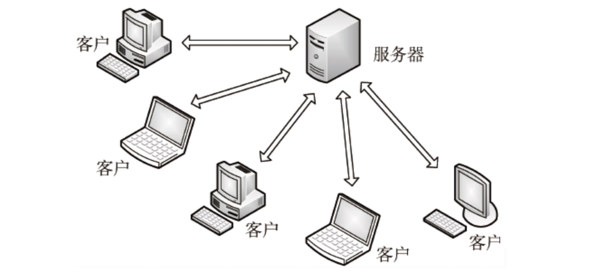
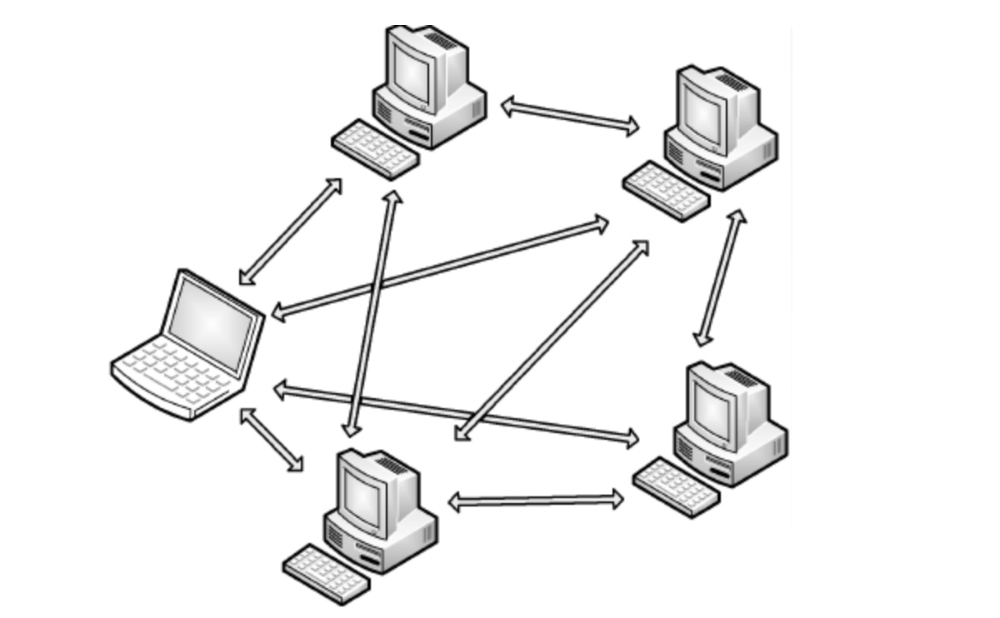
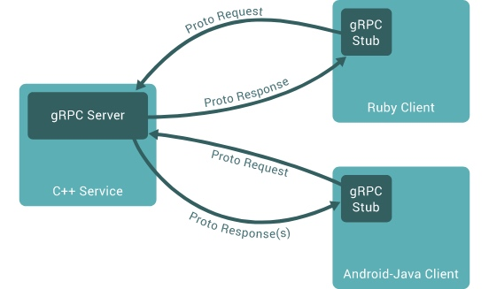

# 【Network】应用层

* [【Network】应用层](#network应用层)
   * [简介](#简介)
   * [gRPC](#grpc)
      * [Service 定义](#service-定义)

## 简介
**传输层（Transport Layer）** 负责将到达主机的通信数据传递到该主机的目的进程，提供了进程间的逻辑通信，但是需要一定的规则，来对通信数据需要进行特定的处理

**应用层（Application Layer）** 负责根据一定的规则，来处理到达进程的通信数据，从而实现通信最终的目的，即完成实际被用户所感知的业务功能

应用层协议根据其通信模式，可以分为以下两种网络模型：
- **Client/Server 模型**

  

  Server 负责永久地在线提供服务，Client 负责间断地访问 Server 使用服务，常见的应用层协议有 HTTP、SSH 等
  
- **Peer To Peer 模型**

  

  不存在永久在线的节点，每个节点既可以提供服务，也可以请求服务，任意的节点之间可以进行通信，常见的应用层协议有 BitTorrent、eDonkey 等

## gRPC
在分布式架构中，**RPC（Remote Procedure Call）远程过程调用** 是一个基于 TCP 的应用层协议。该协议允许一台机器上的程序能够像调用本地程序一样，跨网络地调用另一台机器上的的程序，而无需关注交互的细节过程

**gRPC（google RPC）** 是一种开源、高性能的通用 RPC 框架，最初由谷歌进行开发，基于 HTTP2 协议进行通信，支持多种语言的实现，同时具有负载均衡、Tracing、健康检查和身份验证等可插拔支持，[官方文档](https://grpc.io/docs/)，[中文说明和实现](http://doc.oschina.net/grpc?t=60134#client)



gRPC 围绕着面向服务思想，工作过程也基于 Service 的定义。Service 可看作服务接口，其中包含所有可被远程调用的方法签名，而方法签名中指定了参数和返回

gRPC 服务端是对 Service 的实现，而 gRpc 客户端则存在一个 Stub，它根据 Service 提供相同的方法，此时客户端对服务端的远程调用，则被简化为对本地 Stub 的调用了

### Service 定义
**Protocol Buffer** 是谷歌开源的序列化机制，gRpc 通过该机制来定义 Service 的相关内容，并保存到后缀名为 `.proto` 的 proto 文件中

proto 文件的内容可以分为以下两种：

- **服务接口**：`service`

``` proto
service GnmiService {
  // 方法签名可以分为以下四种：
  
  // 1. 普通 RPC 方法
  // - 和普通的函数调用一样
  rpc SayHello(HelloRequest) returns (HelloResponse);
  
  // 2. 服务器端流式 RPC
  // - 客户端发送请求到服务端后，通过流对象来读取消息序列
  // - 客户端读取流对象直到里面没有任何消息
  rpc LotsOfReplies(HelloRequest) returns (stream HelloResponse);

  // 3. 客户端流式 RPC
  // - 客户端通过流对象发送消息序列到服务器
  // - 一旦客户端完成全部消息的写入，就会等待服务端返回响应
  rpc LotsOfGreetings(stream HelloRequest) returns (HelloResponse);

  // 4. 双向流式 RPC
  // - 客户端和服务端都通过读写流对象来发送读取消息序列。
  // - 两个流对象是独立的，客户端和服务器可按任意顺序来读写
  rpc BidiHello(stream HelloRequest) returns (stream HelloResponse);  
}
```

- **消息结构**：`message`

``` proto
// message 表示 RPC 方法的参数和返回，用于描述其数据结构

message HelloRequest {
  string name = 1;
}

message HelloReply {
  string message = 1;
}

message Example {
  // 属性的定义格式：类型 属性名 = 序号
  // 属性常见的类型：
  
  // 1. 其他 message 类型
  HelloReply var1 = 1;
  
  // 2. 字符串
  string var1 = 2;
  
  // 3. 指定类型的列表，如字符串列表
  repeated string var3 = 3;
  
  // 字节串
  bytes var4 = 4;
  
  // 布尔值
  bool var5 = 5;
  
  // 32 位整数
  int32 var6 = 6;
  
  // 单精度浮点数
  float var7 = 7;
  
  // 双精度浮点数
  double var8 = 8;
}
```

使用编译器 `protoc` 对 proto 文件进行编译后：
- 根据每个 `service` 会生成对应语言的客户端和服务端相关代码，用于客户端发起调用和服务端实现具体的方法

- 根据每个 `message` 会生成对应语言的数据结构类，用于对参数和返回进行序列化和反序列化
