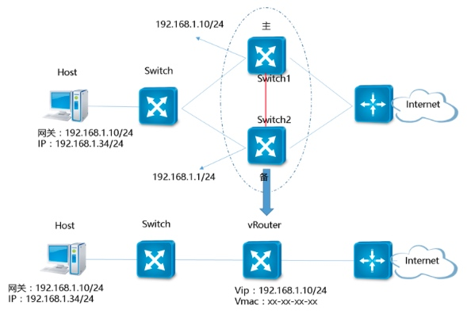

# 【Network】数据链路层

* [【Network】数据链路层](#network数据链路层)
   * [简介](#简介)
   * [基本功能](#基本功能)
   * [MAC 地址](#mac-地址)
   * [网络拓扑](#网络拓扑)
   * [防冲突机制](#防冲突机制)
   * [介质访问控制](#介质访问控制)
   * [PPP](#ppp)
   * [以太网](#以太网)
   * [交换机](#交换机)
      * [三层网络架构](#三层网络架构)
      * [类型](#类型)
      * [VLAN](#vlan)
      * [互连方式](#互连方式)
      * [M-LAG](#m-lag)
   * [Overlay](#overlay)
      * [VXLan](#vxlan)

## 简介
**物理层（Physical Layer）** 是网络的物理实体构成，包含传输介质和通过通信媒介互连的设备，其中传输介质包括双绞线电缆、同轴电缆、光纤、电波以及红外线等，而设备包括计算机、交换机、网桥、中继器等。这些互连设备之间想要进行通信，则必须使用同一种传输规范

**数据链路层（Data Link Layer）** 定义了互连设备之间的传输规范，负责将通信数据传递到通过传输介质互连的目的节点。数据链路层在物理层之上，采用透明传输、差错控制和流量控制等方法，向网络层提供高质量的数据传输服务

互连设备之间的传输介质被称为 **链路（Link）**，并用作两者之间通信的 **信道（Channels）**，链路是一个物理实体，而信道是一个通信传输的逻辑概念

在链路的基础上，结合实现了传输规范的硬件和软件，就构成了 **数据链路（Data Link）**，数据链路层的主要职责就是通过单个数据链路来传输通信数据，常见的数据链路对应通信介质如下：

**传输速率（Bits Per Second）** 也称为 **带宽（Bandwide）**，仅用于衡量数据链路的传输能力，越大表示其传输能力越强。而吞吐量表示网络的实际传输速率，但这个词不仅衡量数据链路的传输能力，还受两端的设备性能、网络拥堵程度等因素影响

在网络层来看，网络是根据分段的 IP 地址来划分的，在数据链路层来看，网络是根据分段的数据链路段来划分的。因此连接在二层交换机的两台设备，在网络层上属于一个网络，而在数据链路层上属于两个网络

## 基本功能
数据链路层提供了以下几个基本功能：
- **封装成帧**

  

  发送端将网络层传下来的 IP 数据包添加数据链路层的首部和尾部，便组成了用于数据链路层发送的帧。帧的首部和尾部中，包含用于界定帧的开始和结束的标记符
  
  **MTU（Maximum Transfer Unit）最大传送单元**，是协议所规定帧的数据部分的最大长度，也就是 IP 数据包的最大长度

- **透明传输**

  通常情况下，首部的开始标记符表示为 **SOH（Start Of Header）** `0x01(0000001)` 表示，尾部的结束标记符表示为 **EOT（End Of Transmission）** `0x04(00000100)`
  
  

  接收端在收到物理层上交的比特流后，就能根据首部和尾部的标记，从收到的比特流中识别出帧的开始和结束，但如果帧的数据部分含有和首部或尾部的标记符相同的内容，那么帧的开始和结束位置就会被错误的判定
  
  因此出现了以下几种组帧方式，通过附加一定的控制信息，用于避免帧的定界错误：
  
  - **字符计数法**
  
    
  
    在帧的首部使用一个计数字段来标明帧内字符数，但如此一来，若首个帧的计数字段出现了错误，就会导致所有帧的界定错误
  
  - **字符填充法**

    

    在数据部分出现首部尾部相同的内容前面插入转义字符，如果数据部分出现转义字符，那么就在转义字符前面再加个转义字符
    
  - **零比特填充法**
    
    
    
    在首部和尾部均用 `0x7E（0111 1110）` 表示，然后对于帧的数据部分，每出现 5 个 1 则填充 1 个 0

  - **违规编码法**

    

    比如对于以太网中常用的曼彻斯特编码中，只会出现 `高-低`、`低-高` 的情况，因此可以使用 `高-高`，`低-低` 来定界帧的开始和结束

  由于字节计数法的脆弱性，以及字符填充法在实现上的复杂性和不兼容性，目前较普遍使用的是零比特填充法和违规编码法

  这些附加了控制信息的帧，在接收端进行处理之后可以都还原出原始数据，整个过程透明传输的内容就是这些控制信息，网络层察觉不到控制信息的存在

- **差错控制**

  电信号传输的过程中会由各种噪声引起差错，而数据链路层通过差错控制，使有差错的物理链路转化为无差错的数据链路
  
  差错控制分为 **检错机制和纠错机制**，其中最广泛使用的检错机制是 **循环冗余检查（Cyclic Redundancy Check，CRC）**
  
  

  

  发送端通过循环冗余检查的一定算法得出检验位，附加在帧的尾部，供接收端对数据的正确性进行校验，这些检验位组成的序列称为 **帧检查序列（Frame Check Sequence，FCS）**

- **流量控制和可靠传输**

  由于较高的发送速度和较低的接收能力不匹配时，会造成传输出错，因此流量控制也是数据链路层的重要工作之一
  
  数据链路层对比传输层的流量控制区别：
  - 前者是节点到节点的，而后者是终端到终端的
  - 前者基于回复确认机制，当接收方接收不下时则不回复确认
  - 后者基于滑动窗口机制，接收端会给发送端确定一个发生窗口大小

  数据链路层对比传输层的可靠传输都是基于超时重传机制，同样支持不同的 ARQ 协议

## MAC 地址
**MAC 地址** 用于识别互连在同一链路上的节点，同时也是 **网络适配器**，即 **网卡（Network Interface Card， NIC）** 的唯一标识，一个节点拥有多少个网卡就拥有多少个 MAC 地址

MAC 地址的长度为 32 Bits，为了便于人类识别，MAC 地址采用了一种特殊的记法，即以每 8 Bit 为一组，分为 4 组数，每组数用 `:` 隔开后并转化为十六进制，比如 `01:00:A4:B1:21:01`。其编址方式如下：

- **第 1 Bit**：0 表示单播地址，1 表示组播地址
- **第 2 Bit**：0 表示全局地址，1 表示本地地址
- **第 3～24 Bit**：由 IEEE 管理并保证各厂家之间不重复
- **第 24～48 Bit**：由厂家管理并保证各产品之间不重复

MAC 地址可以分为三种类型，分别是 **单播地址、组播地址和广播地址**，其中广播地址中每个 Bit 都是 1，是组播地址的特例

## 网络拓扑
传输数据的链路可以分为以下两种类型：
- **点对点链路**

  

  进行一对一通信，没有第三个节点的存在，不会发生冲突，因此也比较简单。常用于广域网，比如 PPP 协议

- **广播式链路**

  

  进行一对多通信，多个节点可能会同时使用信道发送数据，导致发生冲突，需要有专门的控制方法进行协调。常用于局域网，比如以太网、无线局域网

由广播式链路形成的网络主要包含以下几种拓扑结构：
- **总线结构**

  

  所有设备连接到一条传输介质上。所需的线缆数量少、长度短，易于布线和维护，信道利用率高，但若某段链路出现故障，其影响面大且排查困难

- **星型结构**

  

  由一个中心和多个分节点组成，中心是集线器。结构简单，易于管理和维护，且扩展性强。网络延迟时间较小，传输误差低，但中心出现故障影响面大，同时信道利用率不高
  
- **环型结构**

  

  所有节点形成一个闭合环。不需要额外的设备，结构简单，但某个节点或某段链路出现故障，其影响面大且排查困难

- **树型结果**

  

  从总线拓扑演变而来，由各个根和其分支组成，根接收分支的数据并广播发送到全网。容易扩展和故障排查，但对根设备的性能要求很高

- **全网状结构（FullMash）**

  

  所有节点之间都是直接连接的，应用最为广泛。没有设备瓶颈问题，没有单点故障问题，单条线路出问题时，可以选择其他线路，但维护和管理太复杂，且成本高

## 防冲突机制
由广播式链路形成的网络，其链路可能会发生冲突，因此必须有专门的控制方法进行协调。根据网络对于传输介质的使用方式，可以分为两种类型的网络，并且使用不同的控制方法作为防冲突机制：
- **共享介质型网络**

    

  各个节点共享一个传输介质，节点自身的接收和发送也共享一个传输介质，因此采用的是半双工通信，且其防冲突机制是 **介质访问控制（Medium Access Control）**
  
  比如早期的以太网、无线局域网，其传输介质分别为同轴电缆和电波

- **非共享介质型网络**

  

  节点直连交换机并通过交换机转发数据，各个节点不共享一个传输介质，节点自身的接收和发送也不共享一个传输介质，因此采用的是全双工通信，且其防冲突机制是通过交换机对介质采用专用的传输控制
  
  比如当前的以太网、ATM，其传输介质为双绞线电缆或光纤

在非共享介质型网络中，通过交换机的传输控制能力，解决了冲突问题，对比共享介质型网络中的介质访问控制具有更高的效率，但它具有一个致命的缺点，就是网络的可用性完全依赖于交换机的正常运行

## 介质访问控制
共享介质型网络的介质访问控制可以分为以下两个大类：
- **静态划分信道**

  

  在节点通信前，就已经规定好了传输介质的使用规则，即固定好了信道的分配方式。其包含 **频分复用**、**时分复用**、**统计时分复用**、**波分复用**、**码分复用** 等信道复用技术

- **动态分配信道**

  在节点通信时，才根据对应的协议来动态划分信道，并且分配给需要通信的节点，其根据节点使用介质的模式，又分为以下两个类型：
  - **随机访问型**

    每个节点随时都可以使用介质，并按照协议分配信道，其典型的技术包括 **ALOHA**、**间隙 ALOHA**、**CSMA**、**CSMA/CD** 和 **CSMA/CA**

  - **轮训访问型**
    
    依次询问各个节点，而这些节点必须等待被轮询到时才可以发送数据，其典型的技术为 **令牌传递协议**
  
ALOHA 的思想是不侦听信道，随机发送数据，如果发生冲突，即超过一定时间没有得到接收方的确认，则进行重发 

间隙 ALOHA 为了提升 ALOHA 的吞吐量和效率，减少冲突和重发的概率，它把时间分成若干个相同的时间片，所有节点仅在时间片开始时刻同步接入网络信道，若发生冲突，则必须等到下一个时间片开始时刻再发送

CSMA 全称为 **载波监听多路访问**，CSMA 具有三种算法：
- **坚持 CSMA**

  节点每次发送数据前都侦听信道上有没有数据传输，若无则立即发送准备好的数据，否则不发送数据且继续侦听
  
  虽然避免了信道利用率的损失，但若有两个或两个以上的节点有数据要发送时，则冲突就不可避免

- **非坚持 CSMA**

  节点每次发送数据前都侦听信道上有没有数据传输，若无则立即发送准备好的数据，否则不发送数据且等待一个随机的时间之后再进行侦听
  
  以损失信道利用率为代价，降低了发生冲突的概率

- **P-坚持 CSMA**

  节点每次发送数据前都侦听信道上有没有数据传输，若无则以 `P` 概率直接传输，并以 `1 - P` 概率等待到下一个时间片再传输，否则不发送数据且继续侦听
  
  既能像非坚持 CSMA 那样减少冲突概率，又能像坚持 CSMA 那样避免信道利用率的损失

CSMA/CD 则在 CSMA 的基础上，加入了 **冲突检测（Collision Detection）** 的特性，发送节点在发出数据的同时，还必须侦听判断同一时刻，有无其他节点也在发送数据，若有则停止发送数据

CSMA/CA 则在 CSMA 的基础上，加入了 **冲突避免（Collision Avoidance）** 的特性，其和 CSMA/CD 的区别在于，前者用于有线以太网，通过电缆电压来检测冲突，而后者用于无线局域网，通过能量检测、载波检测和能量载波混合检测三种方式来检测冲突

令牌传递协议则通过一个特殊格式的 MAC 控制帧，确保同一时刻只有一个节点独占信道，这种方式不会产生冲突，并且每个节点都能公平地获得令牌，应用于令牌环网

## PPP
**PPP（Point to Point Protocol）点对点协议**，采用支持全双工通信的点对点链路，是用户计算机和 ISP 进行通信时使用的数据链路层协议。用户计算机通常需要连接到某个 ISP 之后，才能接入到 **WAN（Wide Area Network）广域网**

PPP 协议可以分为两部分协议，分别是：
- **链路控制协议（Link Control Protocol，LCP）**：负责建立和断开连接、身份认证、设置最大接收单元（Max Receive Unit，MRU）等

- **网络控制协议（Network Control Protocol，NCP）**：为网络层协议配置相关逻辑连接，比如设置 IP 地址和启用 IP/TCP 首部压缩等

PPP 帧的首部为 5 Bytes，尾部为 4 Bytes，其 MTU 为 1500 Bytes，具体格式如下：

- **F（Flag）**

  帧的定界符，规定为 `0x7E`，表示一个帧的开始或结束。连续的两帧之间只需要用一个定界符，如果接收到两个连续的定界符，就表示中间有一个空帧，应当丢弃

- **A 和 C**

  这两个是保留字段，分别规定为 `0xFF` 和 `0x03`，暂时没有意义

- **协议**
  
  网络层的协议类型，`0x0021` 表示 IP 数据包

- **FCS**

  使用 CRC 算法对数据部分计算后得到的帧检查序列

**PPPoE（PPP over Ethernet）**，可以理解为将改进后的 PPP 帧作为以太网帧的数据部分，从而使用以太网数据链路来完成 PPP 帧的传输，同样是用户计算机接入 ISP 时常用的数据链路协议

PPPoE 帧的具体格式如下：

## 以太网
**LAN（Local Area Network）局域网**，是一种典型由广播式链路形成的网络，主要特点是网络为被一个单位所拥有，且地理范围和站点数目均有限

LAN 的分类要取决于其采用的 **网络拓扑、传输介质、介质访问控制和数据链路协议**，其中可采用的数据链路协议包含以太网、令牌环网、FDDI 和 ATM，而以太网是有线局域网的主流协议

**以太网（Ethernet）** 是一种星型结构的局域网，早期的以太网使用集线器作为中央节点，并使用同轴电缆作为传输介质，是共享介质型的网络，通常采用 CSMA/CD 作为介质访问控制

**集线器（Ethernet Hub）** 是一种物理层设备，其作用于比特而不是帧，当一个比特到达接口时，集线器会重新生成这个比特，并将其能量强度放大，从而扩大网络的传输距离，之后再将这个比特发送到其它所有接口。当集线器同时收到两个不同接口的帧，那么就会发生冲突

目前的以太网使用 **交换机（Switch）** 替代了集线器，并使用双绞线或光纤作为传输介质，是非共享介质型网的络，交换机作为链路层设备，能通过传输控制能力解决了冲突问题，并根据 MAC 地址进行帧的存储转发

以太网主要有以下两个标准：
- **DLX Ethernet V2**：由 DEC、Intel、Xerox 等几家公司先推出的标准，并成为当前的事实标准

- **IEEE 802.3**：由 IEEE 随后推出的标准，虽然是传统意义上的标准，但事实上仅被兼容处理，根据上层协议的识别方式分为 802.3 LCC 和 802.3 SNAP，主流为 802.3 SNAP 
  
以太网帧前端有个叫做 **前导码（Preamble）** 的部分，由 1 和 0 交替组合而成，表示一个以太网帧的开始。而前导码的末尾是一个叫做 SFD（Start Frame Delimeter）的字段，其值是 `11`，前导码与 SFD 总共是 8 Bytes。前导码是由物理层附加上去的，因此不属于帧的结构

初期的以太网是低速的半双工通信，引入了前导码，来确保对端网卡能够同步并做好接收数据帧的准备，且以允许由于信号延迟而丢失一些比特，但当前的以太网已经是高速的全双工通信，也就意味着这前导码是可以废弃的，但是为了保证后向兼容依然保留着

Ethernet V2 以太网帧的首部大小为 14 Bytes，数据部分为 46～1500 字节，尾部为 4 Bytes，其结构如下：

- **目的 MAC 地址（Destination MAC Address）**
  
  接收端的物理地址

- **源 MAC 地址（Source MAC Address）**

  发送端的物理地址

- **类型（Type）**

  标记网络层使用的协议类型

- **帧检查序列（FCS）**

  使用 CRC 算法对数据部分计算后得到的帧检查序列

802.3 LLC 帧的首部大小为 17 Bytes，数据部分为 43～1497 字节，尾部为 4 Bytes，其结构与 Ethernet V2 以太网帧的区别，类型字段替换为指示数据部分长度的帧长度字段，并且多了 LLC 部分

802.3 SNAP 以太网帧的首部大小为 22 Bytes，数据部分为 38～1492 字节，尾部为 4 Bytes，其结构与 Ethernet V2 以太网帧的区别，类型字段替换为指示数据部分长度的帧长度字段，并且多了 LLC 和 SNAP 两个部分
  

802.3 以太网标准将数据链路层细分为两层：
- **介质访问控制（Media Access Control，MAC）**：根据不同数据链路协议特有的首部信息进行控制，即对数据帧进行发送和接收

- **逻辑链路控制（Logical Link Control，LLC）**：根据不同数据链路协议共有的首部信息进行控制，即识别数据帧需交付的网络层协议

**LLC（Logical Link Control）** 和 **SNAP（Subnetwork Access Protocol）** 两个 LLC 层的部分，其包含的具体字段如下：

- **目的服务访问点（Destination Service Access Point，DSAP）**  

  接收端网络层服务类型，与协议类型相似，但支持发送端和目的端使用不同的网络层协议，固定为 `0xAA` 根据 SNAP 信息

- **源服务访问点（Source Service Access Point，SSAP）** 

  发送端网络层服务类型，固定为 `0xAA`，固定为 `0xAA` 表示根据 SNAP 信息

- **控制属性（Control）**

  数据链路层的服务类型，固定为 `0x03` 无连接服务

- **组织（Organizationally Unique Identifier，OUI）**

  网络层协议的发布组织

- **类型（Type）**

  标记网络层使用的协议类型，防止 DSAP 和 SSAP 无法列举所有网络层协议情况

交换机先检查帧的 **类型/帧长度** 字段，若大于 1500 则为 Ethernet V2 以太网帧，否则为 802.3 以太网帧，若要更细区分是 LCC 帧还是 SNAP 帧，则需要检查 **类型/帧长度** 字段后端的 2 Bytes，若为 `0xAA` 则为 SNAP 帧，否则为 LCC 帧

## 交换机
**交换机（Switch）** 具有自学习能力，学习到交换表的内容，交换表中存储着 MAC 地址到接口的映射，一个端口可以对应多个 Mac 地址，但一个 MAC 地址只能对应一个端口。由于这种自学习能力，使得交换机成为一种即插即用设备，其学习过程如下：

1. 交换机有 4 个接口，主机 A 向主机 B 发送数据帧时，交换机把主机 A 到接口 1 的映射写入交换表中
2. 为了发送数据帧到 B，先查交换表，此时没有主机 B 的表项，那么就发送广播帧
3. 主机 C 和主机 D 会丢弃该帧，主机 B 回应该帧向主机 A 发送数据包
4. 交换机查找交换表得到主机 A 映射的接口为 1，就发送数据帧到接口 1，同时交换机添加主机 B 到接口 2 的映射

交换机的数据转发都是使用 ASIC 芯片来完成的，ASIC 芯片专用于处理数据帧转发，其转发效率比 CPU 运算实现要高非常多

### 三层网络架构
三层网络架构是现在网络构成方式的一个结构分层，采用层次化架构，也就是将复杂的网络设计分成三个层次：

- **核心层**：网络的高速交换主干

  是整个网络性能的保障，提供高速转发通信的能力。应该采用拥有更高带宽、更高可靠性、更高性能和吞吐量的千兆甚至万兆以上的管理交换机，并且采用双机冗余热备份是非常必要的，也可以使用负载均衡功能，来改善网络性能

- **汇聚层**：提供基于策略的连接

  具有实施策略、安全、工作组接入、虚拟局域网（VLAN）之间的路由、源地址或目的地址过滤等多种功能，是接入层交换机的汇聚点，可减轻核心层设备的负荷。应该选用较高性能和更少接口的的管理交换机

- **接入层**：将工作站接入网络

  主要解决相邻工作站之间的互访需求，并且为这些访问提供足够的带宽。往往具有低成本和高端口密度的要求，普遍采用即插即用、性价比高的非管理型交换机

> 为了方便管理、提高网络性能，大中型网络应按照标准的三层结构设，但对于网络规模小，联网距离较短的环境，可以采用 “收缩核心” 设计，即忽略汇聚层，使接入层设备直接连接核心层设备，一定程度上省去部分汇聚层费用，还可以减轻维护负担，更容易监控网络状况

### 类型
**非管理型交换机**

也称为 **非网管型交换机** 或 **二层交换机**，是一种工作在 OSI 网络参考模型中第二层的网络交换设备，其端口不存在 IP 地址和 MAC 地址

非管理型交换机的数据转发是基于 MAC 地址的，它可以识别数据包中的 MAC 地址，并根据其内部保存的 MAC 地址表将数据发送到相应的端口

在初始状态，当 MAC 地址表为空时，交换机会将数据广播到所有的端口，随着数据的发送和接收，逐步建立 MAC 地址与端口的关系，并根据实际情况及时更新

非管理型交换机属于即插即用设备，不支持路由管理，能够划分 VLAN 但不支持跨 VLAN 通信，由于不识别 IP 报头，所有节点只能划分到同一个子网中

非管理型交换机价格相对便宜，使用方便，适合用于设备内部网络，主要用于接入层和汇聚层

**管理型交换机**

也称为 **网管型交换机** 或 **三层交换机**，是一种工作在 OSI 网络参考模型中第三层的网络交换设备，支持虚拟局域网（VLAN）划分，支持路由功能，支持简单网络管理协议（SNMP），可以通过 WEB 来进行配置管理，，其端口存在 IP 地址和 MAC 地址

支持跨 VLAN 通信是管理型交换机的特点之一。通过 VLAN 划分可以将交换机所连接的局域网从逻辑上划分成不同的 **子网（Subnet）**，各子网之间不能直接进行二层通信，从而有效的隔离网络风暴，增强了网络的安全性。同时 VLAN 还增加了网络管理的灵活性，只需要从软件上配置就可以更改设备所属网络，不需要物理连线上的更改

支持路由功能是管理型交换机的另一个特点。路由功能可以分析报文中的 IP 地址，并根据交换机内部的路由表生成转发表，再根据转发表进行数据转发，可以实现不同子网之间的数据交换

当一个数据包进入交换机，交换机会先查询转发表，若存在对应的转发关系，则直接进行数据转发，否则再使用路由功能，生成转发关系并保存到转发表中，再进行数据转发，以实现一次路由，多次转发

管理型交换机相对非管理型交换机提供了更多的功能，价格也贵些，主要用于网络核心层和汇聚层

### VLAN
**VLAN（Virtual LAN）** 虚拟局域网，可以建立与物理位置无关的逻辑组，只有在同一个虚拟局域网中的成员才会收到链路层广播信息

如图中 `(A1, A2, A3, A4)` 属于一个虚拟局域网，`A1` 发送的广播会被 `A2`、`A3`、`A4` 收到，而其它站点收不到

使用 VLAN 干线连接来建立虚拟局域网，每台交换机上的一个特殊接口被设置为干线接口，以互连 VLAN 交换机

IEEE 定义了一种扩展的以太网帧格式 802.1Q，它在 Ethernet V2 以太网帧的首部中新增了 4 Bytes 的首VLAN 标签，标签末尾长度为 12 bit 的 VLANID 用于表示该帧所属的虚拟局域网

### 互连方式
单独一台交换机的端口数量是有限的，不足以满足网络终端设备接入网络的需求，因此需要使用多台交换机来提供终端接入功能，并将多台交换机互连，形成一个局域网

交换机的互连主要有 **级联（Uplink）** 和 **堆叠（Stack）** 两种方式

| 互连方式 | 级联 | 堆叠 |
| --- | --- | --- |
| 设备限制 | 无限制 | 只能在相同厂商的设备之间进行 |
| 数目限制 | 理论上无限制，但超过一定数量时会由于网络广播风暴，导致性能严重下降 | 各个厂商的设备会标明最大堆叠台数，一般是 8 |
| 逻辑属性 | 独立设备，但存在分层关系 | 同一个设备，不存在分层关系 |
| 性能 | 当级联层数较多时，越深层级的设备，其延时越大 | 交换机之间的延时是相等的 |
| 连接距离限制 | 可以通过双绞线延长连接距离 | 堆叠线缆最长只有几米，一般堆叠的交换机需处于同一个机柜中 |

**级联**

指两台或以上的交换机通过一定的方式相互连接，是目前主流的连接技术，三层网络架构中的各层交换机之间一般都采用级联方式

其连接方式是采用双绞线或光纤通过 RJ-45 接口、Uplink 接口或光纤接口将交换机连接在一起：
- 两个 RJ-45 接口级联采用交叉双绞线
- 两个 Uplink 接口进行级联采用交叉双绞线
- RJ-45 接口和 Uplink 接口级联采用直通双绞线
- 两个光纤接口进行级联采用光纤，光纤束应该交叉

使用普通 RJ-45 接口级联：

使用 Uplink 接口接口级联：

其优点是不受设备厂商的限制、连接距离的限制，而缺点是随着级联层数和设备数的增长，网络延时会变大，产生性能瓶颈

**堆叠**

堆叠是指两台或以上的交换机通过专用的方式组合起来，其技术思想就是将一个交换机作为一个模块嵌入到另外一台交换机

连接方式是采用专用的堆叠线缆，通过专用的堆叠模块将交换机连接起来

堆叠系统有三种角色：

- 主交换机：负责整个堆叠系统的管理，只有一台
- 备交换机：是主交换机的备份，只有一台，当主交换机故障时接管主交换机所有业务
- 从交换机：负责实现二层 MAC 地址以及三层单播与组播路由的分布式转发，可以多台

其优点是不会产生性能瓶颈，还能扩展上链带宽，并且作为一个逻辑对象仅占用一个 IP，方便进行管理，同时也通过设备之间的互相备份增强可用性，而缺点是受设备厂商的限制、连接距离的限制，以及设备数的限制

### M-LAG
**M-LAG（Multichassis Link Aggregation Group）** 跨设备链路聚合组，是华为设备定义的一种实现跨设备链路聚合机制，其他厂商也有类似功能，但命名不同

可以将一台设备与另外两台设备进行跨设备链路聚合，从而把链路可靠性提高到了设备级

M-LAG 配对交换机之间部署 Peer-Link，用于 M-LAG 协议消息交互，以及设备间横向业务流量转发，对外提供则 M-LAG 接口，用于接入二层业务

从二层视角看，M-LAG 可理解为一种横向虚拟化技术，将 M-LAG 的两台设备在逻辑上虚拟成一台设备，形成一个统一的二层逻辑节点

从三层视角看，M-LAG 的配对设备又是两个独立的设备，可以支持独立的网管，并作为独立的 OSPF 路由节点，同时支持双主检测。M-LAG 支持本地优先转发，最大程度减少 M-LAG 配对设备之间的东西向流量，可以选择通过 VRRP 来对外提供接入

M-LAG、VRRP、堆叠都可以归纳为交换机虚拟化技术，用来实现交换机的高可用：

- 对比 **VRRP（Virtual Router Redundancy Protocol）**

  虚拟路由冗余协议，通过把几台设备联合组成一台虚拟的路由设备，将虚拟路由设备的 IP 地址作为用户的默认网关实现与外部网络通信

  该技术是使用比较早的网络可靠性技术，将多台物理设备配置对外呈现一个 VRRP 备份组，正常情况下由主设备负责转发数据流。当主设备故障时，会选择备组里优先级较高的设备为主设备继续负责转发数据流

  

- 对比交换机堆叠

  M-LAG 本质上还是控制平面虚拟化，和堆叠不同的是，由于 M-LAG 仅仅是在链路聚合协商时，对外表现出同样的状态，因此设备间更独立、方便升级、性能高

  

## Overlay
Overlay 延展网络，指构建在另一个网络上的计算机网络，这是一种网络虚拟化技术的形式，底层依赖的网络就是 Underlay 网络

Underlay 网络是真正存在的网络设备，而 Overlay 网络是依托在下层实体使用软件虚拟出来的层级

### VXLan
**VXLan（Virtual Extensible LAN）** 虚拟可扩展局域网，是一种将二层报文封装在四层 UDP 报文中进行传输的通信协议（MAC-in-UDP），通过三层网络来搭建虚拟的二层网络，属于虚拟化隧道通信技术

将原始的二层以太网帧，增加 8 字节 VXLAN 头部，8 字节 UDP 头部，20 字节 IP 头部和 14 字节以太网头部，共 50 字节
 
相关术语：
- **VTEP（VXLan Tunnel Endpoint）**

  VXLAN 使用 VTEP 设备对 VXLAN 报文进行封装与解封装，包括 ARP 请求报文和正常 VXLAN 报文，VTEP 将原始以太网帧通过VXLAN 封装后发送至对端 VTEP 设备，对端 VTEP 接收到 VXLAN 报文后解封装然后根据原始 MAC 进行转发，VTEP 可以通过物理交换机、物理服务器或者其他支持 VXLAN 的硬件设备或软件来实现
  
- **VNI（Virtual Network ID）**

  VNI 在 VXLAN 头部，共 24 bit ，支持 1600 万个虚拟网段，对比长度为 12 bit 的传统 VLANID 字段，有很大的扩展性
  
- **VXLAN 网关**

  VXLAN 网关用于连接 VXLAN 网络和传统 VLAN 网络，VXLAN 网关实现 VNI 和 VLAN ID 之间的映射，VXLAN 网关实际上也是一台 VTEP 设备
  
- **组播组**

  VTEP 设备要加入相同的组播组，主要用于控制平面表项的学习，控制平面表项由 VNI、Inner Source MAC、Outer Source IP 三元组组成，表示对于一个指定 VNI 的报文，若目的为 Inner Source MAC， 则要发送到 Outer Source IP 上

VXLan 帧的传输过程如下：
  

在数据包的传输过程中，通信的双方都不知道底层网络做的这些转换，它们认为两者可以通过二层的网络互相访问，但是实际上经过了三层 IP 网络的中转，通过 VTEP 之间建立的隧道实现了连通
