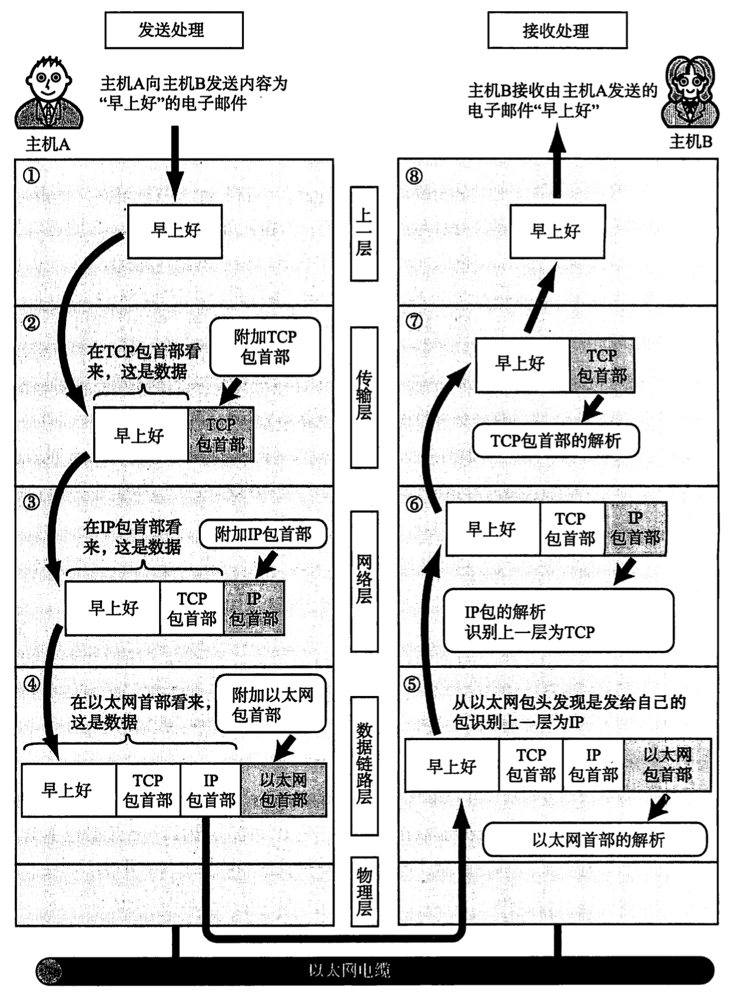
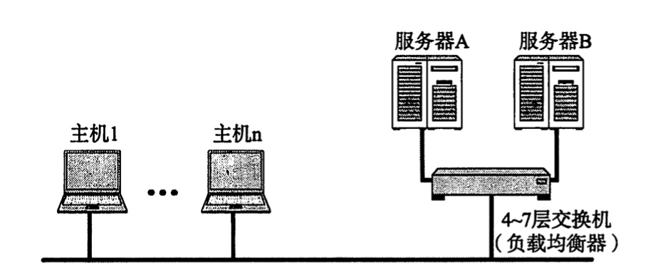
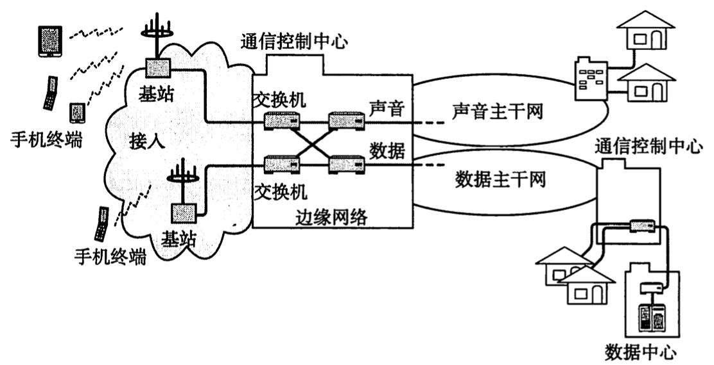

# 【Network】概述

* [【Network】概述](#network概述)
   * [发展背景](#发展背景)
   * [协议标准化](#协议标准化)
      * [OSI](#osi)
      * [TCP/IP](#tcpip)
   * [传输方式分类](#传输方式分类)
   * [字节序](#字节序)
   * [网络物理构成](#网络物理构成)
   * [现实网络实态](#现实网络实态)

## 发展背景
随着计算机的发展，其工作模式 **从单机模式走向网络互连模式**，以实现多台计算机之间的即时通信；而随着网络的发展，其作用也 **从计算机通信走向信息通信**，以支持计算机外的各种设备之间通过网络互连

计算机与网络的发展过程可归纳为以下七个阶段：
1. **批处理（Batch Processing）**：计算机仅读取程序和数据进行批量处理

2. **分时系统（Time-sharing System，TSS）**：计算机支持多终端和资源共享

3. **计算机互连**：特定的计算机通过通信线路进行互连

4. **计算机网络产生**：各式各样的计算机通过网络进行互连

5. **互联网的普及**：网络的架构成本降低，技术兼容性提高，连接范围变广

6. **以互联网为中心**：网络技术均向互联网靠拢，连接范围扩展到计算机外的产品

8. **以 TCP/IP 为标准**：众多网络技术融合为统一的 TCP/IP 协议族

网络根据其规模大小可分为 **广域网（Wide Area Network，WAN）** 和 **局域网（Local Area Network，LAN）**

## 协议标准化
在计算机通信中，需要事先达成一个详细的约定，然后遵循该约定进行逻辑处理，这个约定其实就是 **协议（Procotol）**

### OSI
不同厂商生产的网络设备，若都使用不同的网络协议，则几十载物理层面连接起来也无法正常通信。为此 **ISO（International Standardization Organization）国际标准化组织** 制定了一个国际标准 **OSI（Open Systems Interconnection）开放式通信系统互联**，虽然 OSI 协议没有得到普及，但在 OSI 协议设计之初作为指导方针 **OSI 参考模型**，却常被用于其他网络协议的制定

OSI 参考模型采用分层的思想，类似于程序设计中的模块化开发，每个分层接收由它下一层所提供的特定服务，并为它上一层提供特定的服务。上下层之间遵循的约定称为 **接口（Interface）**，而同一层之间遵循的约定称为 **协议（Procotol）**

分层的优势是高扩展性和高灵活性，因为每个分层可以独立实现细分的通信功能，即使某个分层发生变化也不会影响系统整体。而劣势就是过分模块化可能会导致每个分层都需要实现相似的逻辑，从而处理变得沉重和低效

OSI 参考模型中总共分为七层，其定义以及负责的功能如下：

- **应用层（Application Layer）**

  为应用程序提供服务并规定应用程序中通信相关的细节，比如文件传输、远程登录、电子邮件等具体应用的通信协议

- **表示层（Presentation Layer）**

  提供数据转换相关的功能，使被应用处理的数据格式和与适合网络传输的数据格式能互相转化，具体来说是将设备固有的数据格式转换为网络标准传输格式，因为不同设备对同一比特流的解释可能不一样，同时包含数据的加密解密、压缩恢复等功能

- **会话层（Session Layer）**

  提供通信管理相关的功能，包含建立、保持和断开通信会话，会话指得的是允许数据在应用间流动的逻辑通路，会话具有保证数据连续、进行数据分割等能力

- **传输层（Transport Layer）**

  提供任意终端进程之间跨网络的端到端通信，并包含可靠传输、拥塞控制、流控制等传输控制功能，为进程屏蔽了网络层的路由细节

- **网络层（Network Layer）**

  提供任意终端节点之间跨数据链路的端到端通信，通过网络编址和路由控制完成尽可能的数据交付，为节点屏蔽了数据链路层的转发细节

- **数据链路层（Data Link Layer）**

  提供节点在物理层面上的互连和数据传输，完成比特流和数据帧之间的互相转换，并通过差错控制令存在差错的物理线路变为无差错的数据链路

- **物理层（Physical Layer）**

  针对不同的物理传输介质，提供比特流和电信号之间的互相转换，电信号指电压的高低变化或者光的闪灭变化，从而提供比特流的透明传输

OSI 参考模型的通信过程，就是数据先在发送端被从高到底逐层处理，然后在接收端被从低到高逐层处理，如下所示：

### TCP/IP
OSI 先定义了参考模型再制定协议，太过理想化且实现困难，后来 **IETF（Internet Engineering Task Force）互联网工程任务组** 先制定了协议再定义参考模型，所标准化的 **TCP/IP 协议族** 成为全世界最广泛应用的通信协议，所有遵循协议的设备不再因为硬件或操作系统的差异而无法通信

TCP/IP 标准是通过 **RFC（Request For Comment） 文档** 进行发布的，并且标准分为五种状态，其中各种状态的转化流程如下：

TCP/IP 指标准化的网络通信中所用到的所有协议的集合，并以其中最典型的两个协议 TCP 和 IP 进行命名，再此之外还包含 Ethernet、ARP、BGP、UDP、HTTP 等协议。并且 TCP/IP 在 OSI 参考模型上，将这些协议重新划分得到一个分层网络模型，其结构如下：

- **应用层（Application Layer）**

  为应用程序提供服务并规定应用程序中通信相关的细节，整合了 OSI 参考模型中的应用层、表示层、会话层
  
- **传输层（Transport Layer）**

  提供任意终端进程之间跨网络的端到端通信，并包含可靠传输、拥塞控制、流控制等传输控制功能，为进程屏蔽了网络层的路由细节，等同于 OSI 参考模型中的传输层

- **网络层（Network Layer）**

  提供任意终端节点之间跨数据链路的端到端通信，通过网络编址和路由控制完成尽可能的数据交付，为节点屏蔽了数据链路层的转发细节，等同于 OSI 参考模型中的网络层
  
- **网卡层（Link Layer）**

  也被称为数据链路层，提供基于硬件的互连和数据传输，完成比特流和数据帧之间的互相转换，并通过差错控制令存在差错的物理线路变为无差错的数据链路，等同于 OSI 参考模型中的数据链路层

TCP/IP 的组包方式，是接收上层协议的完整数据，然后作为当前协议的数据部分，并附加当前协议的首部，然后传递到下层协议进行处理：

TCP/IP 分层模型和 OSI 参考模型的通信过程类似，就是数据先在发送端被从高到底逐层处理，然后在接收端被从低到高逐层处理，如下所示：

## 传输方式分类
网络通信的传输方式，根据发送数据前是否需要建立连接，可以分为 **面向有连接型（Connection-Oriented）** 和 **面向无连接型（Connectionless）** 两种类型

在面向有连接型的传输方式下，在数据传输前后需要进行连接建立和断开的处理，当对端无法通信时则连接无法建立，或者关闭当前的连接，可以避免发送无效的数据

在面向无连接型的传输方式下，发送端不存在阻塞，可以随意地发送数据，即便对端不存在或无法通信，而接收端不知道何时会接收到数据，因此需要时常确认是否接收到数据

在不同分层的协议中，连接的具体含义可能不同，比如数据链路层的连接指物理通信线路之间的连接，而传输层的连接则是管理逻辑上的连接

网络通信的传输方式，根据数据的具体交换模式，可以分为 **电路交换（Circuit Switching）**、**报文交换（Message Switching）** 和 **分组交换（Packet Switching）** 三种类型

在电路交换的传输方式中，数据传输前需要与对端建立物理通信线路，并在数据传输时需要一直独占该线路，线路的利用率较低，但是传输时延小

在报文交换的传输方式中，数据传输前无需建立物理通信线路，数据传输时能够以逐段占用的形式共享线路，以报文为单位进行数据传输，交换机可以对突发到来的报文先进行存储，再按规则根据报文首部进行转发，线路的利用率较高，但传输时延大，且重传开销大

在分组交换的传输方式中，工作方式和报文交换类似，但数据以更小的分组为单位进行传输，缩短了共享线路的逐断占用时长，既保证了线路的高利用率，又避免了过大的传输时延和重传开销，并且可以是数据的传输更加灵活，同一数据的不同分组可以选择不同的线路

网络通信的传输方式，根据接收端的数量，可以分为 **单播（Unicast）**、**广播（Broadcast）**、**多播（Multicast）** 和 **任播（Anycast）** 四种类型

在单播的传输方式中，发送端是指定一个对端为接收端进行数据传输的

在广播的传输方式中，发送端是将所有相连的对端作为接收端进行数据传输的

在多播的传输方式中，发送端是将多个指定的对端作为接收端进行数据传输的

在任播的传输方式中，发送端是将多个指定的对端中的任意一个对端作为接收端进行数据传输的

## 字节序
**字节序（Byte Order）** 指多字节数据的存储顺序，低地址存放低序字节称为 **小端序（Small-Endian）**，高地址存放低序字节称为 **大端序（Big-Endian）**，不同平台具有不同的字节序，比如 Intel x86 平台使用的是小端序

人类输入输出的顺序是从左到右的，因此输出数组时其下标也从左到右递增的，此时其内存地址也是从左到右递增的。人类输入输出数字是从高序到低序的，高序字节需要保存在左边的低地址上，因此数字使用大端序处理是符合人类习惯的

网络协议标准规定的是，接收时先得到的是高序字节，并存放到低地址，而发送时先去低地址取出高序字节进行处理，也就是使用大端序

不同平台进行通信时必须进行转换，不转换会造成错误的收发数据，字节序转换函数比如 `ntohs()`、`htons()`、`ntohl()`、`htonl()` 根据当前平台的存储模式做出相应正确的转换

## 网络物理构成
一套网络环境的搭建涉及各种各样的通信介质和设备，其在物理层面的构成如下：

- **通信介质和数据链路**

  通信介质指各种类型的电缆，而数据链路则是通信介质结合实现了传输规范的软件和硬件设备，不同的数据链路采用特定的通信介质，比如以太网数据链路，可以采用同轴电缆、双绞线电缆、光纤等通信介质，从而达到不同的传输速率

- **网卡（NIC）**

  

  也称为网络适配器、网络接口卡，用于计算机接入有线或者无线的局域网

- **中继器（Repeater）**

  

  工作在物理层用于延长网络的设备，即将一端电缆所传来的电信号或光信号进行波形调整和放大后，传递给另一端电缆。不可以无限地延长网络距离，因为每次波形调整和放大都存在一定失真，因此数据链路会有最多分段连接多少个中继器的规定
  
- **集线器（Hub）**

  

  工作在物理层用于广播网络信号的设备，即将一端电缆所传来的电信号或光信号，广播到所有端口连接电缆中，它的每个端口相当于连接了一个中继器，内部属于共享介质型网络，具备信号放大的功能，但存在冲突的情况

- **网桥（Bridge）**

  

  工作在数据链路层用于连接两个相同类型的网络，即识别一端网络传来的数据帧，并将其临时存储于内存中，若数据帧没有错误且目的 MAC 地址不属于该端网络，则将其转发到另一端网络。网桥具备 MAC 地址自学习能力，并由于数据帧是基于存储转发的，因此网桥可以连接两个传输速率不同的网络

- **二层交换机（L2 Switch）**
  
  
  
  工作在数据链路层用于连接多个相同类型的网络，相当于具备多个端口的网桥，同时网桥也相当于两个端口的二层交换机，因此常常可将其视为同一概念。二层交换机同样具备 MAC 地址自学习能力，能根据目的 MAC 地址转发数据帧到对应的端口

- **交换集线器（Switch Hub）**

  

  交换集线器属于二层交换机的一种类型，是数据链路层设备，它的每个端口相当于连接了一个网桥，内部为非共享介质型网络，既能进行存储转发，又具备防冲突机制

- **路由器（Router）**
  
  
  
  工作在网络层用于连接两个网络，即识别一端网络传来的数据包，并将其临时存储于内存中，若数据包没有错误且目的 IP 地址不属于该端网络，则将其转发到另一端网络，即具备路由控制功能，支持多种数据链路的端口，支持网络安全、限流策略等功能

- **三层交换机（L3 Switch）**

  

  工作在网络层用于连接多个网络，相当于具备多个端口的路由器，同时路由器也相当于两个端口的二层交换机，因此常常可将其视为同一概念。三层交换机同样支持路由控制功能，但它更偏向于高效转发，而路由器更偏向于兼容接入和网络控制

- **四层/七层交换机（L4/L7 Switch）**
  
  
  
  工作在传输层或应用层，负责根据指定协议对从端口进入的数据包，进行特定的处理和转发，典型的例子就是负载均衡器

- **四层/七层网关（L4/L7 Gateway）**

  

  工作在传输层或应用层，负责根据指定协议对从端口进入的数据包，进行协议的翻译转化和转发，典型的例子就是邮件代理。四层/七层网关和四层/七层交换机由于功能扩展，其界限也逐渐越来越模糊，常常可将其视为同一概念

## 现实网络实态
现实网络以三层网络架构为思想的，划分为两个维度的网络：

- **核心网络**：又称为骨干网络，相当于各城市网络中心互连的网络，处于三层网络架构中的核心层，负责数据的高速传输
- **边缘网络**：相当于各城市内部的数据中心，处于三层网络架构中的汇聚层和接入层，负责网络设备的汇聚和接入

边缘网络中的组织接入互联网，需要向 **网络服务提供商（ISP）** 或 **区域网** 提出申请，然后通过 **网络操作中心（NOC）** 进行连接，然后异构网络之间还需要通过 **网络交换中心（IX）** 进行连接

现实有线通信中边缘网络的终端接入细节：

现实移动通信中边缘网络的终端接入细节：

