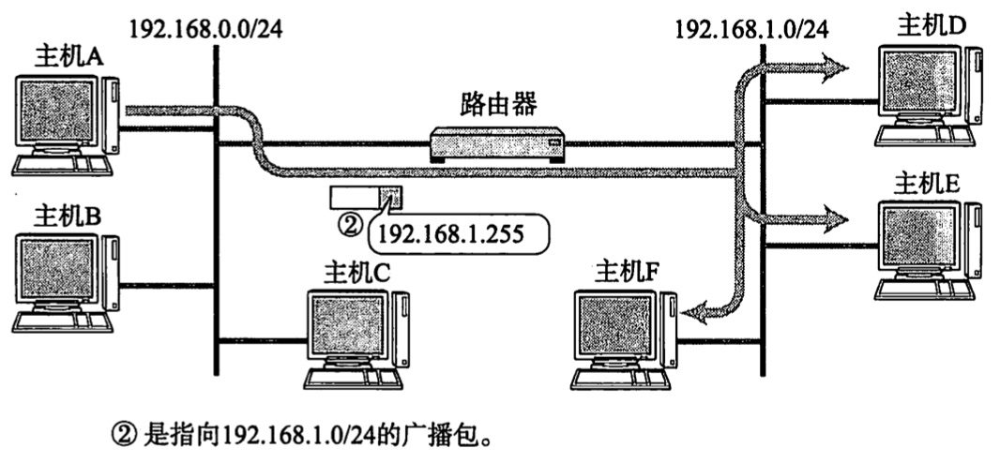
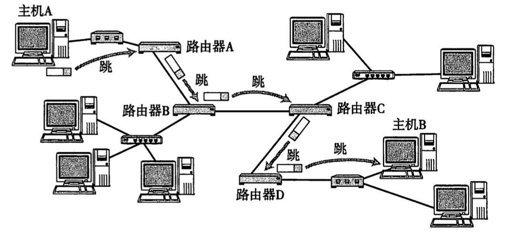
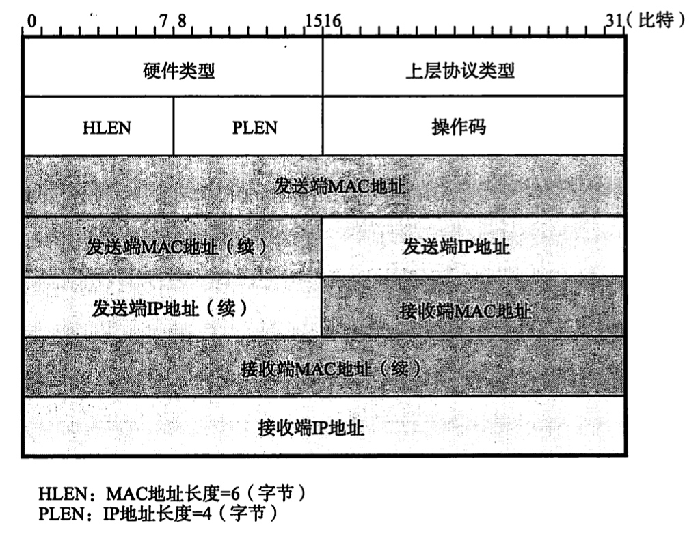
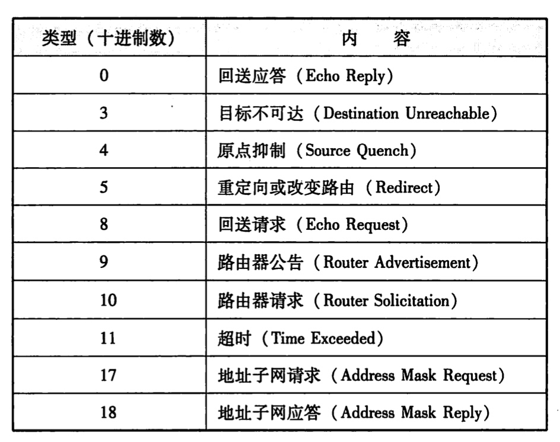
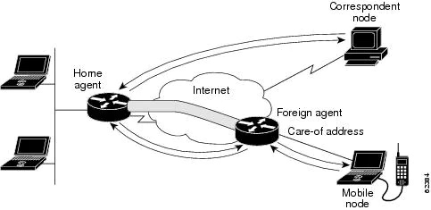

# 【Network】网络层

* [【Network】网络层](#network网络层)
   * [简介](#简介)
   * [IP 地址](#ip-地址)
      * [编址方式](#编址方式)
      * [私有地址](#私有地址)
      * [广播和多播](#广播和多播)
   * [IP 协议](#ip-协议)
   * [IP 路由控制](#ip-路由控制)
   * [IP 分片](#ip-分片)
   * [IPv6 地址](#ipv6-地址)
   * [IPv6 协议](#ipv6-协议)
   * [IP 辅助协议](#ip-辅助协议)
      * [ARP](#arp)
      * [ICMP](#icmp)
      * [IGMP](#igmp)
      * [DNS](#dns)
      * [DHCP](#dhcp)
   * [IP 辅助技术](#ip-辅助技术)
      * [NAT](#nat)
      * [IP 隧道](#ip-隧道)
      * [QoS](#qos)
      * [移动 IP](#移动-ip)
   * [路由选择协议](#路由选择协议)
      * [RIP](#rip)
      * [OSPF](#ospf)
      * [BGP](#bgp)
   * [其他路由技术](#其他路由技术)
      * [ECMP](#ecmp)
      * [BFD](#bfd)
      * [路由器配置](#路由器配置)
      * [MPLS](#mpls)

## 简介
**数据链路层（Data Link Layer）** 只负责将通信数据传递到互连在同一种数据链路的目的节点，但当目的节点连接在其他数据链路时则无法完成通信，因此需要让通信数据能跨越不同数据链路到达目的节点

**网络层（Network Layer）** 则负责将通信数据传递到不同数据链路上的目的节点，提供任意终端节点之间的通信，是 TCP/IP 协议栈的心脏。网络层向节点屏蔽了数据链路层的转发细节，使得从节点看来像是在两个网络层实体之间有一条端到端的通信信道

**协议数据单元（Protocol Data Unit，PDU）** 指各层实体之间的进行交换的信息单元，每层的 PDU 通过其下层所提供的服务接口，传递到下层并作为其 **服务数据单元（Service Data Unit，SDU）** 被封装到其 PDU 中

**帧（Frame）** 指数据链路层的 PDU，**数据包（Packet）** 指网络层的 PDU，也被译为 **分组**，因而网络层的通信过程也称为 **分组交换（Packet Switching）**，若 PDU 中不包含由上层传递进来的 SDU，就可被称为 **报文（Message）**，叫法和应用层的 PDU 一致

数据链路层实体是配置了 MAC 地址的设备，称为 **节点（Node）**，网络层实体是配置了 IP 地址的设备，其中具备 **路由控制（Routing）** 功能的称为 **路由器（Router）**，而不具备路由控制功能的称为 **主机（Host）**，节点则可以作为主机和路由器的统称

目前携带了现代操作系统的主机，基本都具备了路由控制功能，但默认情况下只会启用了 **路由选择（Routing）** 功能，而没有启用 **分组转发（Forwarding）** 功能，如果手动将两个功能都开启，那么这时的主机也就等同于路由器了

## IP 地址
数据链路层通过 MAC 地址识别同一链路上的节点，网络层通过 **IP 地址** 识别同一网络的不同主机和路由器。节点无论位于何种数据链路，其 IP 地址形式都是一致的。对应于不同版本的 IP 协议，存在 **IPv4 和 IPv6** 两种 IP 地址，无特殊说明的情况下 IP 则表示 IPv4

IP 地址是 **32 Bit 的正整数**，总共可以表示约 43 亿个 IP 地址。为了便于人类识别，IP 地址采用了一种特殊的记法，即以每 8 Bit 为一组，分为 4 组数，每组数用 `.` 隔开后并转化为十进制，比如 `172.20.1.1`

### 编址方式
IP 地址由 **网络号（Network ID）和主机号（Host ID）** 两个部分组成，网络号用于确定一个唯一网络，也可以称其为网段，主机号用于确定某个网段中的唯一主机或路由器

IP 地址的 **编址方式**，即以上两个部分的区分方式，总共经历了以下三个历史阶段：
- **分类（Classification）**

  对 IP 地址进行分类，分别表示不同的使用场景，而每种分类具有不同的网络号长度，并且是固定的

  IP 地址格式：`{< 网络号 >, < 主机号 >}`

  主要分为 A~E 五类，其中常用来给网络中的主机或设备分配的是 A、B、C 三类，分别对应了大、中、小型的网段，D 类地址为 **多播地址（Multicast Address）**，E 类地址保留

  

- **子网划分（Subnet Division）**

  由于分类固定了 A、B、C 类地址的网段大小，容易造成资源浪费，长此以往网段资源会越来越不够用。于是出现了子网号，使得网段大小不再受限于分类，可灵活划分出粒度更小的网段，可看作从主机号中划分一部分作为子网号，把两级 IP 地址划分为三级 IP 地址

  IP 地址格式：`{< 网络号 >, < 子网号 >, < 主机号 >}`
  
  使用了子网划分后，IP 地址必须关联一个 **子网掩码（Netmask）**。比如对于一个 B 类网段，能容纳 65534 个主机，其子网掩码为 `11111111 11111111 00000000 00000000`，即 `255.255.0.0`
  
  增加占用 2 Bit 的子网号后，划分为更小的网段，仅容纳 16382 个主机，其子网掩码变为 `11111111 11111111 11000000 00000000`，也就是 `255.255.192.0`
  
  子网既避免了网段的资源浪费，也可以灵活控制网段的广播域大小，但对于外部网络来说，不感知其中子网的存在

- **无分类（Non-Classification）**

  **CIDR（Classless Inter-Domain Routing）无类型域间选路**，属于无分类的编址方式，它消除了传统的 A、B、C 类地址以及划分子网的概念，使用 **网络前缀（Network Prefix）** 来定义网段，并且网络前缀号长度是可以根据需要变化的，从而更加的灵活

  IP 地址格式：`{< 网络前缀 >, < 主机号 >}`

  使用了 CIDR 后，IP 地址后面必须加上网络前缀长度，例如 `128.14.35.7/20`，表示 IP 地址的前 20 Bit 为网络前缀

  CIDR 沿用了子网掩码的概念，并且 IP 地址的网络前缀长度就是其子网掩码的首 1 长度，比如网络前缀长度为 16，对应子网掩码为 `255.255.192.0`

但是并非每个 IP 地址都可以分配给主机或路由器，比如以下几种 IP 地址就不行：
- **网段地址（Network Address）**：主机号为 0 的地址，以 CIDR 地址为例，如 `192.168.1.0/24`

- **广播地址（Broadcast Address）**：主机号都为 1 的地址，以 CIDR 地址为例，如 `192.168.1.255/24`。其中 `255.255.255.255/X` 是受限广播地址，不会被路由器所转发

- **回环地址（Loopback Address）**：就是 `127.0.0.1/8`，对应主机名 `localhost`，用于主机上的进程进行本地网络通信，不需要进行路由控制

- **D 类多播地址和 E 类保留地址**

### 私有地址
为了防止 IP 地址耗尽，对于没有连接互联网的独立网络中的主机，其 IP 地址只要保证在该独立网络中唯一即可，而不需要保证在全互联网中唯一。这种允许非全互联网唯一的地址被称为 **私有地址（Private Address）**

私有地址要能被正常使用，则必须有统一的地址范围，而在为其划分地址范围的时候，IP 地址还在使用分类的编址方式，因此存在如下三段不同分类的地址范围：
- A 类地址：`10.0.0.0/8` ~ `10.255.255.255/8`
- B 类地址：`172.16.0.0/16` ~ `172.31.255.255/16`
- C 类地址： `192.168.0.0/24` ~ `192.168.255.255/24`

除私有地址外的其他 IP 地址被称为 **公共地址（Public Address）**，或者称为 **全局地址（Global Address）**，公共地址由 **ISP（Internet Service Provider）网络服务提供商** 负责分配和管理，比如国内的移动、电信和联通三大运营商

通过 NAT 可以完成私有地址和公共地址之间的转换，从而实现让独立网络中的主机也能间接地连接到互联网中

### 广播和多播
**单播（Unicast）** 是给一个主机发送数据包，这个主机由可分配的 IP 地址来指定，是目前最广泛的传输方式

**广播（Broadcast）** 则是给一个网段的所有主机发送数据包，这个网段由广播地址来指定，分为两种情况：
- **本地广播（Local Broadcast）**：在本网段内的广播，广播行为不会扩散到其他网络

  

- **直接广播（Directed Broadcast）**：在不同网段之间的广播，广播行为作用于其他网络，由于存在安全问题，多数情况下路由器会设置为不转发

  

广播在二层交换机上的实现也称为 **泛洪（Flooding）**，指将数据帧从所有端口发送出去，除了接收该数据帧的端口，常见场景是当 MAC 地址表中无法找到与数据帧的目的 MAC 地址一致的条目时，就将数据帧泛洪出去，以期望找到目的主机来接收数据帧

**多播（Multicast）** 是给一个多播组的所有主机发送数据包，这个多播组由多播地址来指定。多播出现之前，是通过广播并由主机的上层协议决定是否接受数据来实现的，这样会造成很多不必要的网络流量

多播地址即 D 类地址，其前 4 Bit 为 `1110`，而剩余 28 Bit 则表示多播组的组编号，多播的通信实现，除了地址外还需要 IGMP 协议的支持

存在一些既定已知的多播组地址，比如 `224.0.0.1` 组包含了所有的主机，`224.0.0.2` 组包含了所有的路由器

## IP 协议
**IP（Internet Protocol）网际协议**，可以抽象地将异构的数据链路连接起来，使得从网络层看起来好像是一个同构的网络。由于网络层是 TCP/IP 协议栈的心脏，而 IP 协议又是网络层的心脏，所以应当让其尽可能地简单灵活、面向无连接，旨在保证通信服务的性能，而非通信服务的质量

**IP 首部格式**

IP 首部的长度是可变的，固定部分的长度为 20 Bytes，可变部分的长度为 0～40 Bytes，包括的字段有：
- **版本（Version）**

  通常有 4（IPv4）和 6（IPv6）两个值，若为 IPv6，则首部通过可选字段进行扩展，使其固定部分的长度变为 40 Bytes

- **首部长度（IHL，Internet Header Length）**

  占 4 Bits，因此最大值为 15。值为 1 则表示的是 1 个 32 Bits 的长度，也就是 4 Bytes。由于固定部分长度为 20 Bytes，因此该值最小为 5

- **服务类型（TOS，Type Of Service）**

  用来表明所需的服务类型，从而进行 **服务质量控制（Quality Of Service，QoS）**。但由于不同服务类型的质量控制极其复杂，所以目前几乎所有网络层实现都忽略这个字段，通常情况下都不使用
  
  后续又有人提出将 TOS 再划分为以下两个字段，也用于保证服务质量的相关功能：
  
  
  
  - **区分服务代码点（DSCP，DiffServ Codepoint）**：占 6 Bit，可表示 64 种服务类型，值越大其质量优先级越高，用于 **DiffServ** 实现的 QoS
  
  - **显式拥塞通告（ECN，Explicit Congestion Notification）**：占 2 Bit，分别表示：
      - **ECT（ECN-Capable Transport）**：当 ECT=1 时表示上层的 TCP 协议需要进行 ECN 处理
      - **CE（Congestion Experienced）** 当路由器转发 ECT=1 的数据包的过程中，若出现网络拥堵则将设置 CE=1
    
    当发生网络拥塞时，主机应该减少发送的数据包，但由于 TCP 是依据数据报的损坏情况来进行拥塞控制的，并不能够在发送数据包之前就进行拥塞控制

    

    因此 IP 首部的两个 ECN 标志，配合上 TCP 首部的 CWR 和 ECE 标志，令网络层的 IP 协议和传输层的 TCP 协议可以互相协助，前者负责拥塞检查，后者负责拥塞通知

- **总长度（Total Length）**

  包括首部和数据部分的总长度
  
- **标识（ID）**

  标识一个分片，用于分片重组，但若 ID 相同但三元组信息不同，也会认为是不同的分片
  
- **标志（Flags）**

  表示数据包被分片的相关信息，包括三个 Bit：
  - 首个 Bit 必须为 0
  - 第二个 Bit 意义为 dno‘t fragment，即 0 表示允许分片， 1 表示不允许分片
  - 第三个 Bit 用于数据包已分片的情况下，意义为 more fragment， 即 0 表示最后一个分片， 1 表示中间的分片

- **片偏移（FO，Fragment Offset）**

  占 13 Bit，最大值为 8192，表示分片数据开头相对于原始数据开头的偏移量。值为 1 则表示的是 1 个 64 Bits 的偏移量，即 8 Bytes，因此最多表示 65536 Bytes 的偏移量

- **生存时间（TTL，Time To Live）**
  
  为了防止无法交付的数据报在网络中不断兜圈子。以路由器的跳数为单位，路由器接收到数据包后将其 TTL 递减 1，若之后 TTL 为 0 则丢弃该数据包
  
- **协议（Procotol）**
  
  由编号指出携带的数据应该上交给哪个协议进行处理，例如 ICMP、TCP、UDP 等

- **首部校验和（Header Checksum）**

  只校验首部而不校验数据部分，因为数据包每经过一个路由器，都要重新计算校验和，因此不包含数据部分可以减少校验和计算的工作量，其计算方式和 UDP/TCP 相同
  
- **源地址（Source Address）**

  发送端的 IP 地址

- **目的地址（Destination Address）**

  接收端的 IP 地址

- **可选项（Options）**

  长度可变，最大为 40 Bytes，除了用于扩展为 IPv6，就是在实验或诊断时使用
  
- **填充（Padding）**
  
  存在可选相的情况下，首部长度若没有对齐 4 Bytes，则在填充字段通过补 0 对齐

## IP 路由控制
**路由控制（Routing）** 指能够将数据包发送到最终目的节点的功能，具备此项功能的网络层实体则被称为路由器。路由器可以跨越不同的数据链路，将数据包转发到通往最终目的节点的下一节点

数据包从一个节点被转发到另一节点称为 **一跳（1 Hop）**，一跳这代表了数据链路层所能传输数据帧的一个区间，数据包正是在网络中的一个个跳之间被转发，这种路由方式也被称为 **多跳路由（Multi-Hop Routing）**

路由器的结构组成从功能上来划分，可以分为 **路由选择（Routing）** 和 **分组转发（Forwarding）** 两个部分

路由转发部分由 **路由选择协议和路由表** 组成，而分组转发部分由 **交换结构、输入端口和输出端口**，端口里的数字表示了不同层次的处理构件，其中包含了两张关键的表：
- **路由表（Routing Info Base，RIB）**

  

  用于存储路由信息的表，记录数据包应该送往的下一节点，每条路由信息包含三个要素：**目的地址（Destination）、子网掩码（Netmask）、下一跳（Nexthop）**，子网掩码可用 CIDR 记法中的 **网络前缀长度** 代替
  
  根据路由表进行路由匹配的过程：

  - 采用了 **最长前缀匹配算法（Longest Prefix Match Algorithm）**，将全部路由的按子网掩码的数值从大到小排序，然后进行逐条路由的匹配
  
  - 对路由的子网掩码和数据包的目的地址做 `&` 与运算，将得到的结果与该路由的目的地址进行匹配，若匹配则其下一跳就会作为转发目标，否则继续下一条路路由的匹配
  
  - 最后都匹配不到路由时，就会使用 **默认路由（Default Route）** 的下一跳就会作为转发目标，默认路由的目的地址为 `0.0.0.0`，子网掩码也是 `0.0.0.0`，一般被记为 `0.0.0.0/0` 或 `default`，网络前缀长度为 0 表示它不是个 IP 地址，若是单个节点的 IP 地址应记为 `0.0.0.0/32`

  子网掩码为 `255.255.255.255` 的路由，即网络前缀长度为 32 的路由，称为 **主机路由（Host Route）**，意味着最高优先级的匹配，以及是对确切的节点 IP 地址而非一个网段进行路由
  
- **转发表（Forwarding Info Base，FIB）** 

  是路由器用于存储转发信息的表，直接指示数据包需要输出的端口，相当于一个路由结果缓存的机制，实现快速地进对数据包进行转发
  
  若路由没指定下一跳的输出端口，则会自动选择所配置 IP 地址和下一跳同属一个网段的输出端口；若路由指定了下一跳的输出端口，但该端口所配置的 IP 地址和下一跳不同属一个网段时，该路由会被视为无效路由

转发表直接作用于数据包，而路由表是转发表生成的依据。路由表描述网络信息，将数据包从一个机器导向另一机器，而转发表描述了主机信息，在主机内部将数据包从一个端口导向另一端口

路由器接收到数据包，在查询转发表和路由表之前，需要先判断数据包的 MAC 地址是否和对应端口的 MAC 地址所匹配，若不匹配则丢弃数据包；若路由器开启了 **混杂模式（promiscuous mode）**，则能接收并处理任何目的 MAC 地址的数据包

由于网络前缀长度更小的 CIDR 网段，可以表示出很多原来编址方式的更小网段，若这些更小网段的路由规则相同，则路由表中只需要一条路由就可以代替原来的多条路由，从而减少路由表项的数量。把这种通过使用网络前缀来减少路由表项的方式称为 **路由聚合**，也称为 **构成超网**

**三层交换机（Layer Three Switch）** 和路由器类似，也支持路由控制功能，但还是有以下的区别：
- **核心功能不同**
    - 三层交换机的核心功能是数据交换，并附加部分路由转发功能
    - 路由器的核心功能就是路由转发，包括选择最佳路由、负荷分担、链路备份、路由信息交换等高级功能，并可能附加防火墙、二层交换技术等其它功能

- **适应环境不同**
    - 三层交换机主要面向的是局域网连接，提供频繁的以太网数据交换
    - 路由器主要面向的是各种网络互联，支持各种类型的接口以及网络协议 

- **性能不同**：
    - 三层交换机的数据转发是由硬件实现的，通过专用 ASIC 芯片来处理数据转发，而路由选择是由软件实现的，通过 CPU 运算得到的转发信息会缓存到硬件中，完成一次路由，多次转发
    - 路由器的路由选择和数据转发是由软件实现的，每次都需要通过 CPU 运算完成路由选择和数据转发
    - 三层交换机的转发效率较高，但转发功能和稳定性较弱，因为其转发功能是固化在硬件中的，不具备可扩展性，因此也不具备路由器的附加功能，如防火墙；并且其路由结果会缓存硬件中，若路由经常变动的情况下，其转发效率也会大大受影响

## IP 分片
每种数据链路都存在 **MTU（Max Transport Unit）最大传输单元** 的数据帧大小限制，网络层作为数据链路层的抽象，必须保证数据包的传输不受限于其底层数据链路，IP 协议通过 **IP 分片（IP Fragmentation）** 机制来处理这些体积过大的数据包，将其分解为多个体积合格的数据包

数据包的分片处理过程：

当一个数据包由于其数据部分过大，导致数据包整体大于底层数据链路的 MTU 时，就会触发 IP 分片机制。这时会先将该数据包的数据部分拆分为多个体积合格的等长数据段，再为每个数据段加上 IP 首部，并通过 **标志字段和片偏移字段** 附上必要的控制信息，从而得到多个更小的数据包

路由器上不会存在分片的重组，因为重组需要等待所有分片达到且损耗性能，而且重组后仍可能由于下一段数据链路的限制再次需要分片，因此现行的规范中，分片的重组行为都是在目标主机上进行的

为了降低路由器的负担，达到更好的传输性能，是不希望路由器进行分片行为的，但由于各种数据链路的 MTU 不尽相同，即便是已被分片处理过的数据包，到达下一站路由器后，仍有可能会被再次进行分片。为了对应这个问题，产生了一种 **路径 MTU 发现（Path MTU Discovery）** 的技术

路径 MTU 指的是从发送端主机到接收端主机之间不需要进行分片的最大 MTU 大小，其工作原理是：发送端在发送数据包时将其首部设为不允许分片，途中的路由器接收到该数据包后，即使体积过大也不进行分片，而是直接丢弃，然后通过一个 ICMP 的不可达消息将其下一段数据链路的 MTU 告知发送端，然后发送端如此反复直到没有再收到 ICMP 数据包，得到路径 MTU 的大小

当传输层为 UDP 时，在发现过程期间会丢失数据包，在发现结束后，网络层根据缓存的路径 MTU 对后续的数据包进行 IP 分片，再发送到路由器，避免了路由器的 IP 分片行为，若有避免网络层分片则需要应用层参与控制

当传输层为 TCP 时，在发现过程期间会重传数据包，在发现结束后，TCP 根据网络层缓存的路径 MTU 计算出 MSS 最大数据段长度，同时避免了网络层和路由器的 IP 分片行为。路径 MTU 的缓存时间一般是十分钟，过期后会重新触发路径 MTU 发现机制

## IPv6 地址
**IPv6（IP Version 6）** 是为了根本解决 IPv4 地址耗尽问题而产生的网际协议，IPv6 地址是 **128 Bit 的正整数**，其长度为 IPv4 地址的四倍，可以表示约 $3.4 \times 10^{38}$ 个地址，可理解为无穷无尽的数量

IPv6 地址的记法是以每 16 Bit 为一组，分为 8 组数，每组数用 `:` 隔开后并转化为十六进制，比如 `fe80:efac:dacf:29bd:db16:bea2`，并且如果出现连续的 `0` 时可以省略并用 `::` 隔开，但一个地址中只能出现一次 `::`，比如 `fe80:0000:0000:00bd:db16:bea2` 可记为 `fe80::bd:db16:bea2`

IPv6 地址类似于 IPv4 地址，使用 CIDR 作为编址方式，将地址分为网络号和主机号两个部分，也通过地址的前几 Bit 来为地址的进行分类，其中分为三大类：
- **单播地址（Unicast）**：给一个主机发送数据包时使用的 IP 地址，和 IPv4 一样

- **多播地址（Multicast)**：给一组主机发送数据包时使用的 IP 地址，同时取代了 IPv4 广播地址的功能

- **任播地址（Anycast）**：给一组主机中的任意一个主机发送数据包时使用的 IP 地址，在不同位置的多个主机上配置相同的地址，数据包只发往离发送端最近的主机

单播地址和任播地址的可用地址种类之间存在交集，包括以下地址种类：
- **唯一本地地址（Unique Local Address）**：前 7 Bit 为 `1111 110`，即网段 `fc00::/7`，相当于 IPv4 中的私有地址，在没有连接互联网的独立网络中通信时使用

  

- **链路本地地址（Link Local Use Addresses）**：前 10 Bit 为 `1111 1110 10`，即网段 `fe80::/10`，相当于通信范围更小的私有地址，仅在不经过路由器或处于同一数据链路中通信时使用，由终端根据 MAC 地址自动生成

  

- **全局单播地址（Global Unicast Addresses）**：除所有种类的地址外剩余的地址，相当于 IPv4 中的公共地址，在互联网中通信时使用

  

而仅仅用于单播的地址如下
- **未定义地址（Reserved Address）**：全部 Bit 值都为 0，即 `::/128`

- **环回地址（LoopBack Address）**：仅最后 1 Bit 为 1，即 `::1/128`

- **IPv4 内嵌地址（IPv4-Embedded Address）**：最高 80 Bit 为 0，往后 16 Bit 为 1，最后 32 位为 IPv4 地址，即 `::ffff:0:0/96`，用于将 IPv4 节点转化为 IPv6 地址，使得两种不同地址的本地进程之间可以进行通信

**多播地址** 则前 8 Bit 为 `1111 1111`，即网段 `ff00::/8`

以上不同种类地址，其通信场景可汇总为下图所示：

关于不可分配给主机和路由器使用的地址，和 IPv4 定义类似，就是网段地址、多播地址、回环地址、未定义地址

## IPv6 协议
IPv6 具有以下几个特性，虽然有部分功能已在 IPv4 得以实现，但由于作为非必要功能，仍存在很多无法使用或需要管理员介入的情况，而 IPv6 则将这部分都作为必要的功能，减轻了管理员的负担
- **IP 地址的扩充与路由控制的聚合**

  增大 IP 地址的位数，并通过为节点分配与其通信场景所适应的地址种类，避免了路由表膨大

- **性能提升**

  包首部长度采用了固定值，并且不再采用首部校验和，从而简化了首部结构，减轻路由器负担
  
  并且路预期不再进行分片处理，因此路径 MTU 发现在发送端变得必不可少，若对于存在资源限制无法实现路径 MTU 发现的发送端，则会直接以最小的 MTU 即 1280 Bytes 进行分片

- **支持即插即用功能**

  即使没有 DHCP 服务，也能根据规则自动生成 IP 地址

- **采用认证与加密功能**

  应对伪造 IP 地址的网络安全功能以及防止线路窃听的功能，如 IPsec

- **多播、Mobile IP 成为扩展功能**

  这两个功能曾在 IPv4 中难以应用，如今已定义为扩展功能

**IPv6 首部格式**

IP 首部的长度是固定的 40 Bytes，包括的字段有：
- **版本（Version）**

  和 IPv4 一样，IPv6 则值为 6
  
- **通信分类（Traffic Class）**

  相当于 IPv4 的 TOS 字段，同样的也规划分为 DSCP 和 ECN 两个部分

- **流标签（Flow Label）**

  用于 **IntServ** 实现的 QoS，当使用 IntServ 时，对于同属一个流的数据包，其流标签会被设置为一个随机数，从而被路由器识别出其所属的流并完成相应的 QoS 处理，当不使用 IntServ 时全置为 0
  
- **载荷长度（Payload Length）**

  也就是数据部分的长度，由于 IPv6 的可选项存在于扩展首部，也就是连接首部的数据部分，因此当有可选项时，该值也包括了可选项的长度
  
- **下一个首部（Next Header）**

  相当于 IPv4 中的协议字段，通常表示 TCP 或 UDP，但若存在扩展首部，则为扩展首部的协议号

- **跳数限制（Hop Limit）**

  相当于 IPv4 中的 TTL 字段，为了强调所经过路由器的数量而更改了名字

- **源地址（Source Address）**

  发送端的 IP 地址

- **目的地址（Destination Address）**

  接收端的 IP 地址

IPv6 的首部长度是固定的，无法包含长度可变的可选项，因此通过 **扩展首部** 来实现这部分的功能扩展。对比于 IPv4 具有最大长度限制的可选项，IPv6 的扩展首部没有长度限制，并且扩展首部中还可包含扩展首部协议字段和下一扩展首部字段

具体的扩展首部协议使用场景：
- IPv6 中没有分片相关的字段，通过 **IPv6 分片首部（IPv6 Frag ment Header）** 来完成，协议号为 44

- IPv6 需要使用到 IPsec 时，通过 **载荷加密首部（ESP Header）** 和 **认证首部（Auth Header）** 完成，协议号分别为 50 和 51

- Mobile IPv6 则通过 **目标地址选项首部（IPv6-Opts Header）** 和 **移动首部（Mobile Header）** 来完成，协议号分别为 60 和 135

## IP 辅助协议
在实际的网络通信中，仅凭 IP 协议是远远不够的，还需要众多提供了相关支持的辅助协议，其中不仅包括 **ARP、ICMP 和 IGMP** 这些 **网络层协议**，还有 **DNS、DHCP** 这些 **应用层协议**

###  ARP
网络层实现任意主机之间的通信，而数据链路层实现底层每段数据链路的通信，因此在通信过程中，IP 数据包的源 IP 地址和目的 IP 地址始终不变，但其数据帧的源 MAC 地址和目的 MAC 地址随着数据链路的改变而改变的

因此在进行路由转发时，需要得到下一跳 IP 地址对应的 MAC 地址，才能完成底层数据链路的转发，而通过 **ARP（Address Resolution Protocol） 地址解析协议**，则能够根据 IP 地址获取其对应的 MAC 地址。但 ARP 只适用于 IPv4，在 IPv6 中使用了 ICMPv6 来代替

ARP 的工作机制基于 ARP 请求和 ARP响应两种类型的报文，ARP 报文格式如下：

为了避免节点对同一 IP 地址的重复查询，每个节点都在本地维护了一个 **ARP 缓存表**，缓存着本数据链路节点的 IP-MAC 映射关系，每条缓存记录都有一定的期限且过期后会被清除，使得当某个节点的 IP-MAC 映射关系发生了改变时，ARP 缓存表也能得到相应的更新

详细的 ARP 工作过程如下：

1. 当主机 A 需要知道主机 B 的 MAC 地址时，若本地 ARP 缓存表查询不到相应记录，则通过广播的方式发送 ARP 请求

2. 同一数据链路中的主机 B 收到该 ARP 请求后，会将主机 A 的 IP-MAC 地址映射关系写入本地 ARP 缓存，判断请求 IP 是自身 IP 后，然后通过单播的方式发送 ARP 响应给主机 A

3. 同一数据链路中的其他主机收到该 ARP 请求后，也会将主机 A 的 IP-MAC 地址映射关系写入本地 ARP 缓存，但由于请求 IP 不是自身 IP，因此丢弃 ARP 请求

4. 随后主机 A 再将主机 B 的 IP-MAC 地址映射关系写入本地 ARP 缓存，两种 ARP 数据包都可以传递 IP-MAC 地址映射关系

对于不具备路由选择功能的主机，访问其他网段的 IP 地址时会直接广播该 IP 地址的 ARP 请求，但由于这个 ARP 请求的目的 IP 地址和路由器的 IP 地址不同，通常会被路由器直接丢弃，因此主机无法正常访问该 IP 地址

也就是路由器会隔离不同网段 ARP 请求，但若是使用了 **代理 ARP（Proxy ARP）** 的路由器，当 ARP 请求的目的 IP 地址可被路由，则 路由器会使用自身的 MAC 地址来回复 APR 响应，从而使得主机能够正常访问该 IP 地址。但如果对于具备路由选择功能的主机来说，不会用得到代理 ARP 的功能

**免费 ARP（Gratuitous ARP）** 是一种特殊的 ARP 请求，和普通 ARP 请求不同的是，其中的目的 IP 地址是自身的 IP 地址，并非其他主机的 IP 地址。免费 ARP 请求通常在主机启动时进行发送，其作用包括：

- **宣告 MAC 地址**：免费 ARP 请求被广播出去后，不需要得到回应，只为了向其他主机宣告自身的 IP 地址和 MAC 地址，并更新其他主机的 ARP 缓存表

- **检测 IP 地址冲突**：当一台主机发送免费 ARP 请求后，若收到了对应的 ARP 响应，则说明网络内已经存在使用该 IP 地址的主机

**RAPR（Reverse ARP）** 是和 ARP 相反的协议，能够根据 MAC 地址获取其对应的 IP 地址，对于某些嵌入式设备，在没有其他可用接口以及无法通过 DHCP 获取 IP 地址时，就可以通过该协议来获取需要配置的 IP 地址

### ICMP
**ICMP（Internet Control Message Protocol）网际控制报文协议**，用于网络上的问题诊断，从而更有效地转发 IP 数据包和提高其交付成功的概率

ICMP 报文被封装在 IP 数据包中，但是并不属于高层的协议，其报文格式如下：

ICMP 报文可以分为两大类，即用于通知网络出错原因的 **差错报告报文**，以及用于网络功能诊断的 **询问报文**，而常见的 ICMP 具体类型如下：

- **终点不可达（Destination Unreachable）**

  当路由器无法将数据包发送到目的地址时，将会回复此类型的 ICMP 报文，其数据部分包含了一个 **错误号**，用于表示本次发送不可达的具体原因，错误号的含义如下：
  
  

- **改变路由（Redirect）**

  又称为 **重定向**，当路由器发现发送端主机使用了次优的发送路径时，将会回复此类型的 ICMP 报文，其数据部分包含了更优的 **路由信息和源数据**，用于发送端自动追加路由以选择更优的发送路径，其作用过程如下：
  
  

  自动追加的路由会在一段时间后被清除，并且这种追加路由的方式会引发一系列问题，比如某个路由器的路由表存在错误，所以一般主机会设置为不允许重定向

- **超时（Time Exceeded）**

  当路由器接收到数据包并对其 TTL 减 1 后，发现 TTL 变为 0 时，将会丢弃该数据包并回复此类型的 ICMP 报文，其主要目的是为了在路由控制发生循环时，避免数据包在网络中无休止地被转发，占用网络带宽资源

- **回显请求（Echo Request）和回显应答（Echo Reply）**

  用于进行通信的节点之间，判断所发送的数据包是否可以成功到达对端

- **路由器请求（Router Solicitation）和路由器宣告（Router Advertisement）**

  用于发现与节点本身在网络中相连的路由器

基于 ICMP 的两个常见应用：
- **Ping**

  主要用来测试两台节点之间的网络连通性
  
  

  其原理是通过客户端向目的节点发送 ICMP Echo 请求报文，目的主机收到之后会回复 ICMP Echo 应答报文。Ping 会根据时间和成功响应的次数估算出数据包往返时间以及丢包率
  
- **TraceRoute**
  
  主要用来跟踪一个分组从源点到终点的路径
  
  
  
  客户端向目的节点发送的，可以是 ICMP Echo 请求报文，最终目的主机回复 ICMP Echo 应答报文；也可以是一个无法交付的 UDP 数据报，最终目的主机回复 ICMP 终点不可达报文。以后者为例，其详细工作过程是： 
  1. 客户端从 1 开始逐步递增数据包的 TTL 值，来对目的节点发送端口大于 30000 的 UDP 数据包
  
  2. 途经的节点收到对应 TTL 值的数据包后，会返回一个 TTL 超时的 ICMP 数据包，目的节点则会返回端口不可达的 ICMP 数据包
  
  3. 客户端收集所有返回的 ICMP 数据包，通过数据包信息判断是否达到目的地址，以此生成完整的路径信息

**ICMPv6** 是对应 IPv6 的 ICMP 协议，但对于 IPv4 来说，ICMP 仅起辅助作用，即使没有也不影响正常通信，而对于 IPv6 来说，ICMPv6 的作用变得很大，甚至没有则无法正常通信

ICMPv6 的报文类型对比 ICMP 多了很多，可分为两大类，即类型号为 **0～127** 的 **错误报文** 和类型号为 **128~255** 的 **信息报文**，常见的报文具体类型如下：

ICMPv6 如此重要的原因，主要是 IPv4 中的 ARP，在 IPv6 中被替换为 ICMPv6 的 **邻居探索（Neighbor Discovery）报文**，对应类型号为 **133～137**。该些报文集 ARP、ICMP 重定向、ICMP 路由探索等功能于一体，甚至还提供了自动自动 IPv6 地址的功能

IPv6 节点获取 IP 地址对应 MAC 地址的过程类似 ARP，请求节点是通过 IPv6 多播地址来发送 **邻居请求报文（Neighbor Solicitation）**，而目的节点回复的是 **邻居宣告报文（Neighbor Advertisement）**

IPv6 主机在没有 DHCP 的环境下，若是处于没有路由器的网络中，则本地链路单播地址直接通过 MAC 地址生成；若是处于有路由器的网络中，则通过发送 **邻居请求报文（Router Solicitation）** 给理由起，从路由器回复的 **邻居宣告报文（Router Advertisement）** 获得 IPv6 地址的前面部分，后面部分再由 MAC 地址生成

### IGMP
**IGMP（Internet Group Management Protocol）网际组管理协议**，通过不同类型的报文实现 **多播监听发现（MultiCase Listener Discovery，MLD）**，用来在 IP 主机和与其直接相邻的多播路由器之间建立和维护多播组的成员关系

IGMP 报文格式如下：

其主要功能是：当一个节点加入到一个新的多播组时，它会发送一个 IGMP 报文到组地址以宣告它的成员身份，这时多播路由器就可以从 IGMP 报文中学习到该多播组的新成员

多播路由器利用这些从 IGMP 报文中得到的信息，在每个接口上维护了一个列表，表示该接口所属的多播组，从而实现数据包的多播

### DNS
**DNS（Domain Name System）域名系统**，负责管理域名和 IP 地址之间的转换关系，从而可以通过具备语义的域名来访问对应的 IP 地址，解决了 IP 地址不便于记忆的问题，具体主机的域名也称为 **主机名（Hostname）**

DNS 协议基于 UDP 协议进行通信，服务端固定使用 53 端口，在标准既定中同时占用了 53 TCP 端口，但尚未使用

**域名（Domain）** 由多个字母和 `.` 号连接构成，并由 `.` 号将其划分为多个 **层级（Zone）**，形成如下的树状结构：

比如对于域名 `www.huaming.com` 来说，可记为 `www.huaming.com.`，其中：
- `.` 是 **根域名（Root Domain）**
- `com.` 是 **一级域名或顶级域名（Top-Level Domain）**
- `huaming.com.` 是 **二级域名或权威域名（Authoritative Domain）**
- `www.huaming.com` 是 **三级域名**

**公共 DNS 服务（Public DNS Servers）** 相当于一个分布式数据库，其节点就是多个 DNS 服务器，节点间组织方式和域名的分层结构相对应，每个节点负责一个特定层级的域名，对外提供这个域名的下一层域名的解析信息，比如负责顶级域名的节点就被称为顶级域名服务器

根域名 DNS 服务器在全球有 13 个，由 Internet 公司和数字地址分配机构（ICANN）的非营利组织进行监督；顶级域名 DNS 服务器则由 Internet 编号分配机构（IANA）加以处理，它是 ICANN 的一个分支机构；权威域名 DNS 服务器由具体域名对应的域名注册商管理，让用户能够对具体域名进行管理

负责进行 DNS 查询的客户端称为 **解析器（Resolver）**，为了缓解公共 DNS 服务的压力，解析器还会设置一个 **本地 DNS 服务器（Local DNS Server）**，负责查询公共 DNS 服务以及缓存结果

DNS 查询的方式可分为 **递归（Recursion）** 和 **迭代（Iteration）**，前者用于解析器与所设置的本地 DNS 服务器之间，后者用于本地 DNS 服务器和其他 DNS 服务器之间，这样设计是为了防止根域名服务器的查询压力过大

解析器进行一次 DNS 查询的详细工作过程如下：

1. 解析器需要解析一个三级域名，先查找本地的 DNS 缓存，若命中则完成查询，否则向已设置的本地 DNS 服务器发起查询请求

2. 本地 DNS 服务器先查询自身 DNS 缓存，若命中则返回结果，否则向根域名服务器发起查询请求

3. 根域名服务器返回顶级域名服务器的 IP 地址

4. 本地 DNS 服务器向顶级域名服务器发起查询请求

5. 顶级域名服务器返回权威域名服务器的 IP 地址

6. 本地 DNS 服务器向权威域名服务器发起查询请求

7. 顶级域名服务器返回三级域名的 IP 地址

8. 本地 DNS 服务器将三级域名的 IP 地址缓存起来，然后返回给解析器

9. 解析器将三级域名的 IP 地址缓存起来，完成本次 DNS 查询

在 DNS 查询的过程中，通过 DNS 协议进行不同节点间的通信，DNS 协议定义了不同类型的 **DNS 记录（DNS Record）** 用来表示不同含义的解析结果，常见的 DNS 记录类型如下：

| DNS 记录类型 | 编号 | 含义 |
| --- | --- | --- |
| A（Address） | 1 | 域名对应的 IP 地址 |
| NS（Name Server） | 2 | 域名服务器的 IP 地址 |
| CNAME（Canonical Name） | 5 | 当前别名对应的规范名称 |
| SOA（Start Of Authority） | 6 | 众多权威域名服务器中的主服务器 |
| PTR（Pointer Record）| 12 | IP 地址对应的域名，即反向解析 |
| AAAA | 28 | 域名对应的 IPv6 地址，AAAA 表示 IPv6 的长度为 IPv4 的 4 倍 |

DNS 协议在设计之初没用充分考虑到数据安全层面，因此原始协议容易受到缓存投毒、信息监听、DNS 劫持等各种攻击，因此后续出现了一系列 DNS 安全方面的扩展协议，其中主要有 **DNSSEC、DoT（DNS over TSL）和 DoH（DNS over HTTPS）** 三种

DNSSEC 指递归 DNS 和权威 DNS 之间采用签名的方式，保证 DNS 数据的完整性，而 DoT 和 DoH 主要在应用客户端和递归 DNS 直接通过加密通道来传输 DNS 数据，防止数据劫持和信息泄露

### DHCP
**DHCP（Dynamic Host Configuration Protocol）动态主机设置协议**，主要用于局域网或网络服务供应商自动分配 IP 地址给用户，以及对局域网中的所有服务器进行统一管理

DHCP 协议基于 UDP 协议进行通信，服务端固定使用 67 端口，客户端固定使用 68 端口，在 IPv4 和 IPv6 中都可以使用

DHCP 的工作过程可以分为四个阶段：

- **发现（Discover）**：DHCP 客户端以广播方式发送 DHCP Disvocer 报文来寻找 DHCP 服务器

- **提供（Offer）**：在网络中接收到 DHCP Discover 报文的 DHCP 服务器都会做出响应，它从尚未出租的 IP 中挑选一个用于出租，并向 DHCP 客户端发送一个包含该出租 IP 和其他设置的 DHCP Offer 报文

- **选择（Select）**：即使有多台 DHCP 服务器向 DHCP 客户端发来的 DHCP Offer 报文，DHCP 客户端只接受第一个收到的 DHCP Offer 报文，并以广播方式回答一个 DHCP Request 报文，该报文中包含向它所选定的 DHCP 服务器 IP 地址。当其他 DHCP 服务器收到了该 DHCP Request 报文后，会收回所有可能已提供给该客户的出租 IP

- **确认（Ack）**：当 DHCP 服务器收到 DHCP 客户端发来的 DHCP Request 报文后，便向 DHCP 客户端发送一个包含出租 IP 和其他设置的 DHCP Ack 报文，告诉 DHCP 客户端可以使用这个出租 IP。最后 DHCP 客户端将这个出租 IP 与网卡绑定，并完成其他设置

**客户端的 IP 续租**：
- DHCP 服务器向 DHCP 客户端出租的 IP 一般都有一个租借期限，期满后 DHCP 服务器便会收回该出租 IP。若 DHCP 客户端要延长其 IP 租约，则必须发送包含前一次所分配 IP 的 DHCP Request 报文进行续租

- 当 DHCP 客户端重新登陆或 IP 租期过一半时，DHCP 客户机都会自动向 DHCP 服务器发起续租，待服务器回复 DHCP Ack 报文即续租成功，若服务器回复的是 DHCP Nack 报文则续租失败，客户端需要重新发送 DHCP Discover 报文获取新的 IP

**客户端的 IP 释放**：
- 客户端可以主动向 DHCP 服务器发送一个 DHCP Release 报文，使其立即回收出租给该客户端的 IP

在存在多个网段的大型网络中，由于路由器会屏蔽广播数据包，因此需要为每个网段单独维护一个 DHCP 服务器，但这样会导致难以管理。此时可用 **DHCP 中继代理（DHCP Relay）** 来解决问题，它能够接收 DHCP 客户端的广播报文，然后以单播的方式转发给 DHCP 服务器，从而实现在一个 DHCP 服务器上进行多个网段的 IP 分配管理

## IP 辅助技术
### NAT
**NAT（Network Address Translation）网络地址转换**，当独立网络中使用私有 IP 地址的主机，需要与互联网中使用全局 IP 的主机进行通信时，就可以使用 NAT 来将私有 IP 地址转换为全局 IP 地址

当独立网络和互联网之间的节点利用 NAT 完成通信时，根据请求的发起方，或者根据 NAT 路由器对请求数据包的处理方式，可以将 NAT 分为三种模式：
- **SNAT（Source Nat）**：发起方是私有网络的节点，仅对请求数据包的源 IP 地址进行转换，然后根据这个转换关系，再对响应数据包的目的 IP 地址进行转换

- **DNAT（Destination Nat）**：发起方是互联网的节点，仅对请求数据包的目的 IP 地址进行转换，然后根据这个转换关系，再对响应数据包的源 IP 地址进行转换

- **FullNat（SNAT + DNAT）**：发起方可以是任意节点，对请求数据包的源 IP 地址和目的 IP 地址都进行转换，然后根据这个转换关系，再对响应数据包的源 IP 地址和目的 IP 地址进行转换，以实现某种特定的地址转换需求

在独立网络主动访问互联网的传统场景，也就是处于 SNAT 模式下，其通信过程如下：

在 NAT 路由器内部存在一个 NAT 转换表，每条 NAT 记录都代表了一个双向的 IP 通信会话，即双向通信的过程中，私有 IP 地址和全局 IP 地址的一对一转换关系。在 SNAT 模式下，NAT 记录由发往某个服务器的首个请求数据包自动生成

由于每条 NAT 记录中的私有 IP 地址和全局 IP 地址是一一对应的，因此在一个拥有 N 个全局 IP 地址的独立网络内，最多只可以同时有 N 台主机接入互联网，这样一来根本无法更有效地利用全局 IP 地址

为了改善这个问题，如今常用的方式是在进行地址转换时同时进行端口号转换，使得独立网络中使用 TCP/UDP 通信的多个主机，能够共享一个全局 IP 地址，这种方式称为 **NAPT（Network Address Port Translation）网络地址与端口转换**，其通信过程如下：

在 SNAT 模式下，每条 NAPT 记录生成时都需要选择一个随机的源端口。对于 TCP 五元组，NAPT 记录在发送 TCP 首次握手的 SYNC 包时生成，在发送TCP 关闭连接的 FIN 包时删除；对于 UDP 五元组，NAPT 记录在发送首个 UDP 数据报时生成，在一定时间内没有发送数据报时删除

由于 NAPT 记录仅在 SNAT 模式下可以自动生成，若是在 DNAT 模式下，或者通信双方都处于需要 NAT 的独立网络中，则必须手动管理 NAPT 转换表，无法利用 NAT 路由器自动完成通信。为了解决这个问题，产生了一种称为 **NAT 穿透（NAT Traversal）** 的技术

NAT 穿透就是通过 **中转服务器和相关协议（STUN、TURN 或 ICE）**，使得处于私有网络的节点在被对端访问之前，先发送一个数据包到对端的全局 IP 地址上，从而在本地 NAT 路由器生成好相应 NAPT 记录，这个生成记录的过程称为 **打洞（Hole Punching）**，打洞巧妙地利用了 SNAT 模式来生成 DNAT 模式所需 NAPT 记录

为了保证使用 IPv6 的主机能在 IPv4 网络中正常通信，需要一种将 IPv6 首部转化为 IPv4 首部的技术，这就是 **NAT-PT（NAT Procoto Translation）** 和 **NAPT-PT（NAPT Procoto Translation）**，其通信过程如下：

### IP 隧道
**IP 隧道（IP Tunnel）**，是一种对网络层数据包继续封装一层网络层首部的通信方式，能够对转发过程中的网络层数据包，施加额外的路由控制

IP 隧道常见的应用有 **VPN（Virtual Private Network）虚拟专用网**，或称为 **虚拟私有网**， 它是使用公用的互联网作为本机构各专用网络之间的通信载体。专用网指的是同一机构的所有节点，能像处于独立网络中的节点一样进行通信，而虚拟指的是其通信的过程实际上经过了公用的互联网

比如两个处于不同独立网络的场所 A 和场所 B，场所 A 的主机 X 和场所 B 的主机 Y 通过 IP 隧道技术经过互联网进行通信，其通信过程如下：

1. IP 数据报的源地址是 `10.1.0.1`，目的地址是 `10.2.0.3`
2. 数据报先发送到与互联网相连的路由器 R1，R1 对内部数据进行加密，然后重新加上数据报的首部，源地址是路由器 R1 的公有地址 `125.1.2.3`，目的地址是路由器 R2 的公有地址 `194.4.5.6`
3. 路由器 R2 收到数据报后将数据部分进行解密，恢复原来的数据报，此时目的地址为 `10.2.0.3`，就交付给 Y

IP 隧道也可以应用于在 **Pv4 互联网中传输 IPv6 的数据包（6to4），或者在 IPv6 互联网中传输 IPv4 的数据包（4to6）**，使得具有相同网络层协议的私有网络，能够经过不同协议的互联网进行通信

IP 隧道还可以应用于 **跨互联网多播**，使得多播消息能够封装为单播消息，从而避免路由器的屏蔽，最终向不同数据链路的转发多播消息

除以上应用，IP 隧道还能应用于 **Mobile IP**、**L2TP（Layer Two Tunneling Protocol）二层隧道协议** 等，Mobile IP 用于保持主机 IP 不随所连接的子网变化而变化，L2TP 用于将 PPP 数据链路帧封装为 IP 包经过互联网来转发，也属于是一种 VPN 实现

### QoS 
IP 协议的初衷设计旨在保证通信服务的性能，而非通信服务的质量，也就是一个 **尽力服务模型（Best-Effort Service）**，因此当线路发生拥堵时会出现大量丢包的现象。但随着更多类型的音频、视频服务对实时性的要求逐渐提高，通过 IP 协议提供 **服务质量控制（QoS）** 的技术越来越被重视

QoS 的工作机制类似于 VIP 通道，对于需要保证通信质量的高优先级数据包，路由器会进行特殊处理，甚至丢弃那些低优先级数据包，以保证其带宽、时延、丢包率、时延波动等指标符合通信质量要求

为了实现 QoS，人们提出了以下两种服务模型技术：
- **IntServ（Integrated Services）**

  综合服务模型，提供点对点的精细优先控制，针对特定应用的通信进行质量控制，特定应用的通信指其五元组信息是完全一致的，也称之为 **流（Flow）**
  
  同属于一个流的数据包，其流标签字段会被设置为一个随机数，用于路由器对该流的识别。然后 IntServ 在必要时利用 **RSVP（Resource Reservation Prorocol）资源预留协议**，对途中的路由器进行 **流设置**，即为指定的流进行资源预留，而后这些路由器就会根据数据包的流标签字段做出相应的 QoS 处理
  
  

- **DiffServ（Differentiated Service）**

  区分服务模型，提供较粗粒度的优先级控制，进行 DiffServ 控制的网络称为 **DiffServ 域**
  
  DiffServ 域中的路由器对于首次进入的数据包，会对其首部 DSCP 字段进行替换，为期望被优先处理的数据包设置一个优先值，而后域中的其他路由器就会根据数据包的 DSCP 字段做出相应的 QoS 处理

  

IntServ 每进行一次新的通信都需要设置一次路由器，路由器也要对每一个流进行不同的 Qos 处理，复杂的工作机制影响了其实用性，而 DiffServ 只需要按照约定进行一次标记，路由器根据标记完成较粗粒度的 QoS 处理，工作机制更简单也更实用

### 移动 IP
对于便携性强的移动设备来说，每次连接到不同的子网，都会由 DHCP 或手动的方式分配新的 IP 地址，这样会导致原本应用的通信出现中断

**移动 IP（Mobile IP，MIP）** 技术可保持主机 IP 不随所连接的子网变化而变化，应用不需要做任何改动，即使在 IP 发生变化的环境，通信也能够继续

Mobile IP 的主要概念如下：
- **移动主机（Mobile Host，MH）**：实现了移动后不需改变 IP 地址的主机

- **归属地址（Home Address）**：移动主机在移动前后都不变的 IP 地址，其子网是归属网络

- **移动地址（Care-of Address，CoA）**：移动主机在移动后配置的 IP 地址，用于接收归属代理发来的隧道包，其子网是外部网络。移动地址分为以下两种类型：
    
    - **配置在外部代理上的移动地址**，这种移动地址可以被多个移动主机共享，但移动地址的登记需要经过外部代理，且各个移动主机还需额外配置一个用于路由定位的 IP 地址
    
    - **配置在移动主机的本身接口上的移动地址**，这种移动地址仅用于一个移动主机，移动地址的登记可以直接由移动主机完成，并可通过该移动地址路由定位到移动主机

- **归属代理（Home Agent，HA）**：连接在归属网络中的路由器，能监视移动主机的移动情况，并在它移动后为它代收数据包，然后通过 IP 隧道转发给它

- **外部代理（Foreign Agent，FA）**：连接在外部网络中的路由器，用于支持移动后的移动主机，为它接收和处理 IP 隧道数据包，也可为其分配移动地址

Mobile IP 的工作机制如下：

移动主机在移动之前，并会使用 ICMP 路由器请求报文来发现当前的归属代理和其他可用的外部代理，此时其通信过程和一般的主机相同。而在移动之后：
1. 移动主机配置与当前位置相应的移动地址，并将移动地址登记到其归属代理中，外部代理配置达到归属地址的路由

2. 归属代理充当移动主机，为其归属地址进行 ARP 回复，以及代收发往其归属地址的数据包

3. 归属代理通过 IP 隧道，将代收的数据包发送到移动主机所登记的移动地址

4. 外部代理收到目的地址为移动地址的数据包，进行 IP 隧道的拆解后，根据归属地址路由，把原始数据包转发给移动主机

5. 移动主机收到原始数据包并处理，然后使用归属地址回复数据包给对端 

6. 从两端的应用层来看，移动主机一直在使用归属地址进行通信

若像以上步骤所示，移动主机直接使用归属地址进行回包，会因为途中路由器出于安全考虑的设置，如丢弃从内部网络发出但源地址不为内部网络 IP 地址的数据包，从而导致回包失败

由于该路由器越来越广泛，因此需要使用 **双向隧道** 来解决，由外部代理先通过 IP 隧道将数据包发送给归属代理，归属代理拆解隧道后再转发到对端

**Mobile IPv6** 是对应 IPv6 的移动 IP 技术，解决了一系列 Mobile IP 现存的问题：
- **依赖外部代理**：Mobile IP 的移动主机若移动到没有外部代理的网络中则不能通信；Mobile IPv6 的移动主机自行承担了外部代理的功能

- **路径非最优，转发效率低**：Mobile IP 的通信路径需要经过归属代理；Mobile IPv6 的对端感知移动主机的移动地址，直接通过 IP 隧道进行发送数据包

- **回包被丢弃**：Mobile IP 除非使用降低转发效率的双向隧道，否则回包可能被途中路由器丢弃；Mobile IPv6 由于通过 IP 隧道回包，其源地址就是移动地址

## 路由选择协议    
IP 路由控制是基于路由表来进行的，而路由表中包含了众多的路由信息，根据路由信息的不同管理方式，可将其分为以下两种类型：
- **静态路由（Static Routing）**：路由信息是固定不变的，由管理者事先手动设置好，虽然工作机制简单，但无法高效地管理大型复杂的网络

- **动态路由（Dynamic Routing）** 路由信息是动态变化的，由代表了不同路由策略的路由选择协议自动设置，并会随着网络通信量和拓扑结构的变化进行自适应的调整，但需要在路由器之间定期交换信息，给网络带来一定程度的负荷

静态路由和动态路由并不是互相对立的，在一个网络中可以将其组合起来使用，达到更好的 IP 路由控制效果

**自治系统（Autonomous System）** 是一个有权自主地决定采用何种路由策略，即的何种路由选择协议的小型单位，也被称为 **路由选择域（Routing Domain）**，互联网可以划分为许多较小的 AS，比如 **区域网络（Area Network，AN）** 和 ISP 网络就是典型例子

根据路由选择协议的负责范围，也可划分为以下两大类：
- **内部网关协议（Interior Gateway Protocol，IGP）**：负责 AS 内部的路由控制，比如 **RIP、RIP2 和 OSPF**

- **外部网关协议（Exterior Gateway Protocol，EGP）**：负责 AS 之间的路由控制，比如 **BGP**

路由算法是路由选择协议的底层实现，最具代表性的路由算法有以下两种：
- **距离向量（Distance-Vector，DV）**

  根据 **距离和方向** 来决定通往目标网络或主机的路径，距离的 **度量（Metrics）** 指途径跳数
  
  路由器仅与相邻路由器进行信息交换，内容是自身到达目的网络的方向和距离，并以这些信息为基础来制作路由表。这种方式虽然在路由器上的处理过程比较简单，但路由收敛需要消耗较多的时间，且每个路由器所掌握的信息都不相同，极易发生路由循环等问题
  
  **路由收敛** 指网络的拓扑结构发生变化后，路由表经历重建、同步、学习直至稳定，最终在所有路由器中重新达成一致的过程
    
  

- **链路状态（Link-State，LS）**

  根据 **网络整体连接状态** 来决定通往目标网络或主机的路径，链路状态指路由器自身可达的网络和 **开销（Cost）**
  
  路由器与所有路由器进行信息交换，内容是网络整体连接状态的拓扑图，并以这些信息为基础来制作路由表。这种方式即使用于复杂网络，路由收敛也可以较快地完成，且每个路由器所掌握的信息是一致的，能够稳定地保持正确的路由信息，但在路由器上的处理过程相当复杂，需要消耗大量的 CPU 和内存
  
  

主要的路由协议如下：

| 协议 | 类型 | 传输协议 | 路由算法 | 交换节点 | 交换方式 | 交换内容 | 交换模式 | 循环检测 | 选路原则 |
| --- | --- | --- | --- | --- | --- | --- | --- | --- | --- |
| RIP | IGP | UDP（520 port） | 距离向量 | 相邻路由器 | 广播 | 自身的距离向量信息 | 全量 | 不可以 | 跳数最少 |
| OSPF | IGP | IP（89 protocol） | 链路状态 | 邻接路由器 | 多播/单播 | 所有的链路状态信息 | 增量 | 可以 | 质量最优 |
| BGP | EGP | TCP（179 port） | 路径向量 | 相邻路由器 | 单播 | 所有的路径向量信息 | 增量 | 可以 | 较好非最优 |

### RIP
**RIP（Routing Information Protocol）路由信息协议**，是一种基于 **距离向量** 的路由选择协议，广泛应用于局域网 LAN

RIP 路由器定期向本 AS 的所有节点广播自身的距离向量信息，其频率是每 30 秒一次，从而完成相邻路由器之间的信息交换，若等待了 6 个周期，即 3 分钟仍未收到某个距离向量信息，则认为与该目标网络或主机已经断开。经过若干次的信息交换之后，所有路由器最终都会知道从自身到达本 AS 中任一网络或主机的距离和方向

路由器本地使用距离向量数据库来维护自身的距离向量信息，通过选择最短距离的方向，生成最终的路由表，指示目标为本 AS 中任一网络或主机的下一跳地址

RIP 虽然不能交换子网掩码信息，但仍可用于使用子网掩码的网络环境，这种情况下需使用以下方式，来确定距离向量信息的子网掩码：

- 先从路由器接口的 IP 地址对应分类得出网络地址，再从距离向量信息的 IP 地址对应分类得出网络地址
- 若这两个网络地址相同，则距离向量信息的子网掩码视为和接口的 IP 地址相同
- 若这两个网络地址不同，则距离向量信息的子网掩码视为和其 IP 地址对应分类得出的网络地址相同

路由器 A 虽察觉到自身与网络 A 已断开，但又收到路由器 B 曾经从自身获知的距离向量信息，从而使得路由器 A 误以为自身还可以通过路由器 B 到达网络 A，从而产生 **无限计数（Counting to Infinity）** 的问题

为了解决无限计数问题，采用了以下两个机制：

- **最长距离（Longest Distance）**：最大距离的跳数限制为 15，超过该值的距离向量信息只能被保留 120 秒，一旦超过这个时间，信息将会被删除
- **水平分割（Split Horizon）**：路由器不允许把所收到的距离向量信息原路返还给发送端

然而以上两个机制，对于存在环路的网络来说是无法完全解决问题的，因为其反向的回路会成为消息迂回的通道，曾经的距离向量信息会被循环往复地不断转发，导致路由收敛需要很长时间才能完成，如下图所示：

因此在最长距离和水平分割的基础上，再补充了以下两个机制：

- **毒性逆转（Posioned Reverse）**：当网络中发生链路被断开时，从不再发送这个距离向量信息，改为发送一个距离为 16 的这个距离向量信息
- **触发更新（Triggered Update）**：当距离向量信息发生变化时，则不再等待定期进行发送，而是立即进行发送

综上所述，路由器处理一个包含距离向量信息的 RIP 报文，其过程如下：
1. 收到 IP 地址为 `X` 的相邻路由器发来的 RIP 报文

2. 迭代 RIP 报文中所有的距离向量信息，逐条进行以下处理：
    1. 假设距离向量信息为 `目的网络 D, 方向 V, 距离 5`
    2. 把方向 IP 地址改为 X，并把距离的值加 1，成为 `D, X, 6`
    3. 若距离向量数据库中不存在目的网络为 `D` 的信息，则将该信息添加到数据库中
    4. 否则，若方向 IP 地址为 `X`，则用该信息替换原来的信息
    5. 否则，若距离小于原来信息的距离，则用该信息替换原来的信息

3. 某条距离向量信息若超过 3 分钟未被更新，则将其标记为不可达，即将其距离设为 16 并立即发送给相邻的路由器

RIP 路由选择协议 **实现简单且开销小**，但 **网络规模受到** 其最大距离的 **限制**，并且当网络出现链路故障时，要经过比较长的时间才能将此消息传送到所有路由器，**路由收敛的速度较慢，无法稳定保证路由的正确**

**RIP2** 是 RIP 的改良版，其与 RIP 的工作机制基本相同，但具有以下几个新特性：
- **使用多播**：信息交换时用多播代替 RIP 的广播，减少因信息交换产生的流量，缩小对无关节点的影响

- **支持子网掩码**：在距离向量信息中新增子网掩码信息

- **逻辑路由选择域**：在同一个 AS 网络中划分多个逻辑上的路由选择域，可分别使用独立的 RIP

- **外部路由标识**：用于把从 EGP 路由选择协议中获得的路由控制信息通过 RIP 传递到 AS 内部

- **身份验证密钥**：RIP 报文中携带密码，用于防止报文被篡改

### OSPF
**IS-IS（Intermediate System To Intermediate System）中间系统到中间系统协议**，是 **最早提出** 的一种基于 **链路状态** 的路由选择协议，但它不是为 IP 网络而设计

IS-IS 里作为 **中间系统** 的路由器，必须从 **网络或者网络的限定区域内** 的所有其他路由器上收集链路状态信息，最终每个路由器上都具有一份 **完整且一致** 的链路状态信息，再各自通过 **最短路径算法（Shortest Path First，SPF）**，也称为 **Dijkstra 算法** 独立计算一颗以自己为根的 **最短路径树（SPF Tree）**，最终生成指向最优路径的路由表

**OSPF（Open Shortest Path First）开放式最短路径优先**，是根据 **IS-IS** 提出的一种为 IP 协议而设计的路由选择协议，一样是基于 **状态链路** 且使用 **SPF 算法**，分为 **OSPFv2 和 OSPFv3** 两个版本，其中 OSPFv2 用于支持 IPv4 网络，而 OSPFv3 用于支持 IPv6 网络

OSPF 旨在克服 RIP 存在的缺陷，其对比 RIP，除了状态链路对比距离向量的优势外，还具有以下几个优势：
- **支持子网掩码**：链路状态信息中支持子网掩码信息

- **划分区域**：使用 **区域（Area）** 将一个 AS 网络逻辑上划分为若干个更小的范围，减少因信息交换产生的流量

- **支持 TOS**：根据 IP 首部的 TOS 字段生成多个路由表，但并非所有 OSPF 路由器都强制支持

- **最小开销路径**：不优先选择最少跳数的路径，而是使用灵活的 **开销（Cost）** 作为路径的优先级度量，优先选择最小开销的路径

- **多种报文类型**：通过不同类型的 OSPF 报文，基于 **邻接关系（Adjacency）** 来进行信息交换，减少因信息交换所产生的流量

- **身份验证密钥**：OSPF 报文中携带密码，用于防止报文被篡改

OSPF 路由器使用 **链路状态数据库（Linked State Database，LSDB）** 来维护所获取到的链路状态信息，这些链路状态信息又被称为 **链路状态通告（Linked State Advertisement，LSA）**，其中又可分为两类：

- **网络 LSA（Network LSA）**：以网络为中心生成的信息，表示该网络与哪些路由器相连，只存在一个路由器连接的 **末端网络（End Network）** 不需要生成网络 LSA

- **路由器 LSA（Router LSA）**：以路由器为中心生成的信息，表示该路由器与哪些网络相连

RIP 总是优先选择最少跳数的路径，这样可能会选择到虽然跳数最少但质量并非最优的路径。OSPF 为了解决这个问题，使用 **开销（Cost）** 作为链路的优先级度量，而路径的 Cost 则是其所包含链路的 Cost 之和，总是选择 Cost 最小的路径，从而选择到质量最优的路径

链路的 Cost 只与其接口的出方向质量有关，OSPF 默认是根据接口带宽自动计算得到的，计算的公式为 `Cost = 参考带宽 / 接口带宽`，其中参考带宽的默认值为 100MBit/s，可自行手动调整

管理员也可以手动设置链路的 Cost，并且手动设置的 Cost 会比自动计算得到的 Cost 更优先，也可以使用程序动态地根据链路的时延、带宽、误码率等指标来计算 Cost，并实时设置到对应链路上，最终同步到各个路由器的 LSDB 中，通过 SPF 算法生成指向最优路径的路由表

OSPF 还支持 **等价多路径 ECMP**，发往同一个目标的流量，可以通过多个 Cost 相同的路径共同分担，实现基于三层的负载均衡，再配合上 OSPF 的信息交换机制，还能实现路径的 **故障转移**

对于在 OSPF 网络中的两个路由器之间，可形成以下两种关系：
- **邻居关系（Neighboring）**：可以相互感知对方存在，以及共享一系列公共配置信息，但不交换任何链路状态信息

- **邻接关系（Adjacency）**：需要在互为邻居关系的路由器之间形成，会进行链路状态信息的交换

不同的二层网络使用了不同的数据链路层协议， OSPF 根据所处的二层网络，分为了不同类型的 OSPF 网络，而不同 OSPF 网络中的 OSPF 报文发送形式是不同的，此处以最常见的 **广播多路访问（Broadcast Multi Access，BMA）** 网络为例：

- 数据链路层协议可以为 **以太网（Ethernet）**，各个路由器都是互相连接的，都能形成邻居关系

- 需要选举一个 **指定路由器（Designated Router，DR）** 和一个  **备用指定路由器（Backup Designated Router，BDR）**，其他路由器和 DR 形成邻接关系，以它为中心进行信息交换，当 DR 从网络中断开后由 BDR 代替 DR

- HELLO 报文以组播形式发送，组播地址使用表示所有 OSPF 路由器的 `224.0.0.5`
  
  LSU 报文和 LSACK 报文以组播形式发送，组播地址使用表示 OSPF DR 和 BDR 的 `224.0.0.6`
  
  DD 报文和 LSR 报文以单播形式发送，目的地址为 DR 的 IP 地址

**Router ID** 是用于在一个 AS 网络中唯一标识一个 OSPF 路由器的 32 Bit 整数，可以通过手动设置或让路由器根据以下规则自动设定：
- 若配置了 Loopback 接口，优先在其中选择最大的 IP 地址中作为 Router ID

- 否则，在其他接口的 IP 地址中选取最大的 IP 地址作为Router ID

DR 和 BDR 是由选举产生的，而和选举相关的两个路由器属性是 **DR 优先级和 Router ID**，而选举的原则有以下三个：
- **选举制**：DR 优先级大于 0 的路由器会竞选 DR，经过其他路由器的投票，最终选出一个 DR 和 BDR，其中优先选择 DR 优先级较高的路由器，若 DR 优先级相等时则选择 Router ID 较大的路由器

- **终身制**：也称为 **非抢占制**，新加入网络的路由器会优先承认已存在的 DR 和 BDR，其次才是发起选举，有利于增加网络的稳定性、提高网络的可用带宽

- **继承制**：若 DR 从网络中断开了，那么下一个当选为 DR 的一定是 BDR，其他的路由器只能去竞选 BDR

RIP 的报文类型只有一种，就是用于传递路由距离信息，这样即使在稳定不变的网络环境中，也会产生极大的信息交换流量。OSPF 为了解决这个问题，使用 **HELLO 协议** 基于连接来进行信息交换，其包含以下五种表示不同功能的报文类型：
- **问候（HELLO）报文**

  最常用的报文，用于建立和维护邻居关系、获取或选举 DR 和 BDR。HELLO 报文中包含了一些基本配置信息，如各种定时器的数值、已存在的 DR 和 BDR，以及已知的邻居路由器

- **数据库描述（Database Dscription，DD）报文**

  在建立邻接关系阶段用于协商主从关系，在信息交换阶段用于同步状态链路数据库的摘要信息，协商主从关系时报文中不包含摘要信息，由 Router ID 较大的路由器成为 Master
  
  主从协商完成后正式建立了邻接关系，然后两者通过 DD 报文交换 LSDB 中所有 LSA 的摘要信息，对端可以根据摘要信息可以判断出具体某条 LSA 是否存在。DD 报文的起始序列号均由 Master 规定，每发送一个 DD 报文其序列号加 1，Slave 使用序列号一致的 DD 报文作为确认响应

- **链路状态请求报文（Linked State Request，LSR）**

  路由器通过 DD 报文确认缺失哪些 LSA 之后，需要发送LSR 报文向对方请求更新 LSA。LSR 报文中包含所需要的 LSA 的摘要信息

- **链路状态更新报文（Link State Update，LSU）**

  用来发送对端其所请求 LSA，或者发送自身发生变化的 LSA。LSR 报文中包含多条完整的 LSA 内容
  
  为了实现泛洪的可靠性传输，需要 LSAck 报文对其进行确认，对没有收到确认报文的 LSA 将进行重传，重传的LSA 是直接发送到邻居路由器

- **链路状态响应（Link State Acknowledgment，LSAck）**
  
  用来对接收到的 LSU 报文进行确认，LSAck 报文中包含多个需要确认的 LSA 的摘要信息

OSPF 路由器根据基础配置信息，会定期发送一个 HELLO 报文，以及定期根据接收到的 HELLO 报文来维护已知的邻居关系。若超过指定个周期仍未收到某个邻居发来的 HELLO 报文，则认为其从网络中断开，无论是邻居从网络中断开还是恢复，都会触发自身的 LSA 更新，并通过一个 LSU 报文将更新内容发送出去，通知邻接的路由器

OSPF 支持在一个 AS 网络中划分多个更小的 **区域（Area）**，使用 **Area ID** 作为唯一标识，其中必须存在一个 **主干区域（Backbone Area）**，并且其他区域都需要和主干区域相连接

其中连接主干区域内部的路由器称为 **主干路由器**，连接其他区域内部的路由器称为 **内部路由器**，连接区域和主干区域的路由器称为 **区域边界路由器**，连接外部 AS 网络的路由器称为 **AS 边界路由器**。AS 边界路由器通常可以兼顾一个其他角色，如下：

内部路由器只维护区域内部的 LSA，关于区域以外的路径信息，需要从边界路由器获取，且只能获取从边界路由器到达某个路由器的 Cost，而无法获取完整的 LSA，这样一来可以有效地减少了内部路由器的 LSDB 大小

和末端网络类似，仅存在一个区域边界路由器的区域被称为 **末端区域（End Area）**，其内部不需要获取区域外的路径信息，选择唯一的区域边界路由器作为对外区域的发送路径即可

### BGP
由于互联网规模太大，使得自治系统 AS 之间路由选择非常困难，主要原因有：
- 各个 AS 内部使用不同的路由选择协议，无法准确定义路径的度量
- AS 之间的路由选择必须考虑有关的 AS 策略，比如有些 AS 不愿意让其它 AS 经过

**BGP（Border Gateway Protocol）边界网关协议** ，是一种基于 **路径向量（Path-Vector）** 的路由选择协议，负责各个 AS 网络之间的路由控制，力求寻找一条能够达到目的且较好的路径，而并非最优的路径

IGP 所支持逻辑上划分的限定范围称为 **网络域**，比如 RIP2 划分的路由选择域和 OSPF 划分的的区域，通过 **区域网络和 ISP 网络** 来将这些网络域编排为一个个 AS，并为每个 AS 分配一个 **ASN（AS Number）**，BGP 则根据 ASN 来进行路由控制

每个 AS 都可以配置多个路由器作为 **BGP 发言人（BGP Speaker）**，通过在两个相邻 BGP 发言人之间建立 TCP 连接来交换路由信息，这两个相互交换消息的 BGP 发言者之间互称 **BGP 对等体（BGP Peer）**

若一个 BGP 对等体两端的路由器同属一个 AS，则称其为 **IBGP（Internal BGP Peer）内部对等体**，否则称其为 **EBGP（External BGP Peer）外部对等体**，这样无论在 AS 内部和外部都可以进行路由信息的交换

每个 BGP 发言人都维护了一个 **AS 路径列表（AS Path List）**，其中每个 **AS-Path** 代表了一条路径，包含由路径到达目标网络所有需要经过的 AS 的编号。然后基于 **路径向量** 进行路由控制，此处的路径向量指的就是 AS-Path

路径对比于距离向量，每个 BGP 发言人都存在一份完整且一致的路径信息，因此可以检测出环路，并且路由收敛的速度更快，同时它还支持策略路由，即设置指定达到某个目标网络必须途径指定的 AS 等策略

AS 路径列表的维护规则是，当 BGP 发言人从相邻 AS 收到 AS 路径列表，会追加自身的 ASN 到其中，再发送给其他相邻的 AS

BGP 在遵循各个 AS 之间所签约的策略的前提下，以途径 ASN 的个数作为路径的度量，优先选择 AS 路径列表中 AS-Path 较短的路径，然后生成对应的路由表，从而进行较粗粒度的路由控制

## 其他路由技术
### ECMP
**ECMP（Equal-Cost Multi-Path） 等价多路径**，是基于流的三层负载均衡策略，对于同一个目标存在多个最优路径，即对应于多个数据链路时，可同时利用这些链路转发数据

对于传统的路由技术，发往该目标的流量只能通过其中的一条路径，其它路径处于备份状态，并且在动态路由环境下进行相互切换也需要一定时间

ECMP 技术被多种路由协议支持，比如 OSPF、ISIS、EIGRP、BGP 等，也被主流路由器和交换机支持，而最多同时执行负载均衡的路径数，由路由器的 `maximum load-balancing` 参数所决定

ECMP 的路径选择策略有多种方法，比如轮询、权重轮询、哈希等等

ECMP 面临的问题：
- **可能增加链路的拥塞**：ECMP 并没有拥塞感知的机制，只是将流分散到不同的路径上转发，对于已经产生拥塞的路径来说，可能会加剧路径的拥塞

- **非对称网络使用效果不好**：各条路径的带宽、时延和可靠性等不一样时，不能很好地利用较优的路径，尤其在路径间差异大时，效果会非常不理想

- **基于流的负载均衡效果不好**：ECMP 对于流大小相差不多的情况效果较好，而对于流大小差异较大时，容易造成拥塞

### BFD
**BFD（Bidirectional Forwarding Detection）双向转发检测**，是用于检测两个网络设备之间故障的网络协议，可以提供毫秒级的检测，可以实现链路的快速检测

网络设备可以和每条下层链路建立 BFD 会话，当某条下层链路出现问题时，通过 BFD 协议与上层路由协议联动，可以实现路由的快速收敛，确保业务的永续性

BFD 报文封装在 UDP 报文中传送，目的端口号为 3784，当一端的交换机检在测时间内未收到对端交换机发来的 HELLO BFD 报文，则认为链路发生了故障

工作模式：
- **双向探测的 BFD**

  支持 IP 链路的单跳检测和多跳检测 ，单跳检测时设置 BFD 会话绑定对端 IP 且绑定出接口，多跳检测上设置 BFD 会话绑定对端 IP 但不绑定出接口

  

- **单臂回声的 BFD**

  当一个交换机 A 支持 BFD，而交换机 B 不支持 BFD 时，在交换机 A 上配置单臂回声 BFD 会话，检测交换机 A 到交换机 B 之间的单跳链路

  交换机 B 接收到交换机 A 发来的 BFD 报文后，需要直接在网络层将该报文环回，从而快速检测交换机 A 到交换机 B 之间的单跳链路的连通性
  
  

实用联动场景：
- **BFD + OSPF**：OSPF 自身的健康检查时间延迟很大，通过 BFD 的联动，能够实现加速网络收敛速度

- **BFD + ECMP**：ECMP 提供了三层负载均衡的能力，通过 BFD 的联动，能够进行更为灵敏的健康检查和故障转移，比 OSPF + ECMP 的延迟时间更小

### 路由器配置
路由器或者三层交换机中，为了实现某些功能或路由策略，会存在一些特殊的接口，如下：
- **Null0 接口**

  属于虚拟接口，会丢弃所有转发过来的数据包，因此指向 Null0 接口的静态路由又被称为 **黑洞（BlackHole）路由**，通常用于预防环路

  比如目的为 A 网段会被 SW1 上层交换机转发到 SW2 交换机，在 SW2 交换机上存在一组关于 A 网段明细路由

  当数据包在 SW2 能匹配到明细路由时，能够正常地转发，但若不能没有匹配到明细路由时，这时数据包就会通过默认路由，又转发回SW1 上层交换机，形成环路，因此在 SW2 创建一条目的为 A 网段的到黑洞路由，防止环路的产生

- **LoopBack 接口**

  属于虚拟接口，任何送往该接口的数据包都会被认为是送往设备本身，又称为 **回环（LoopBack）接口**，该接口的状态永远是 UP 的

  LoopBack 接口通常用于提高可靠性，比如在 BGP 中，为了使 BGP 会话不受物理接口故障的影响，可将发送 BGP 报文的源接口配置成 Loopback 接口

### MPLS
**MPLS（Multi-Protocol Label Switching）多协议标签交换**，处于网络层和数据链路层之间，也被称为 **2.5 层协议**，使用 **标记交换** 而并非路由控制来进行数据包的转发，因此无法在通常的路由器上进行，也就无法被整个互联网使用

对比 IP 路由控制，MPLS 的优势可以归纳为两点，一是 **转发速度快**，因为处理过程简单且控制信息简略；二是 **可生成虚拟的路径**，因为可以通过标记指定每个节点的转发方式。从而能为 IP 网络提供基于 MPLS 的 QoS、带宽保证和 VPN 等功能

MPLS 的标记并不对应到硬件设备，转发过程也就不需依赖数据链路层的能力，只需关注与上面 IP 层之间的协议和功能即可。MPLS 会先对每个数据包设定一个 **标记（Label）**，再根据每个数据包的标记进行转发

实现了 MPLS 功能的路由器称为 **标记交换路由器（Label Switching Router，LSR）**，其中和外部网络连接的 LSR 又称为 **标记边缘路由器（Label Switching Edge，LER）**，额外负责数据包标记的设置和删除

LSR 对数据包的处理动作可以归纳为以下三种：

- **Push**：添加标记并转发，接收 IP 数据包
- **Swap**：替换标记并转发，接收 MPLS 数据包
- **Pop**：删除标记并转发，接收 MPLS 数据包

LSR 根据标记表中的标记信息，来处理具有特定标记的数据包，而数据包传递其标记的方式有两种，当所使用数据链路层的首部具有标记字段时，可直接使用该字段来传递标记，否则追加一个 **垫片头（Shim Header）** 来传递标记，比如以太网就是后面这种方式

在 MPLS 网络中相同特性的数据包，比如目标地址一致的数据包，都会设置经过指定的同一个路径，这个路径又称为 **标记交换路径（Label Switching Path，LSP）**，LSP 又分为两种类型，分别是一对一连接的 **点对点 LSP** 和一对多绑定的 **合并 LSP**。LSP 是单方向的路径，因此双向通信需要两条 LSP

LSP 的建立取决于为所有途径 LSR 分配和设置好相应的标记信息，实现方式有两种，一是使用 **标记分配协议（Label Distribution Procotol）** 进行邻近 LSR 之间的信息交换，二是使用路由选择协议携带标记信息来完成 LSR 之间的信息交换
