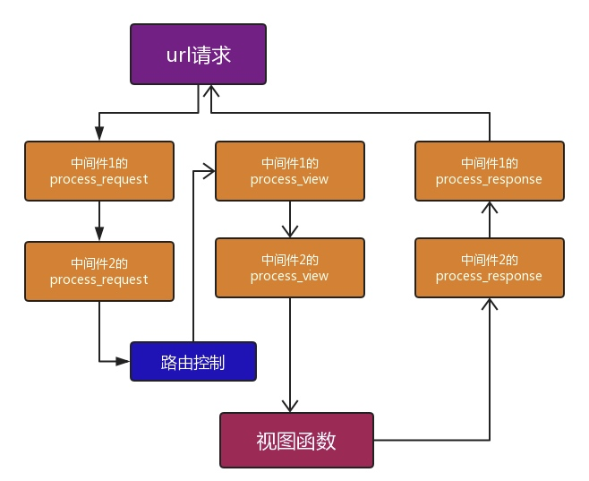
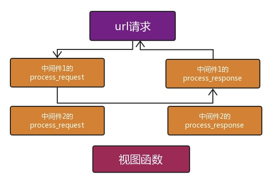
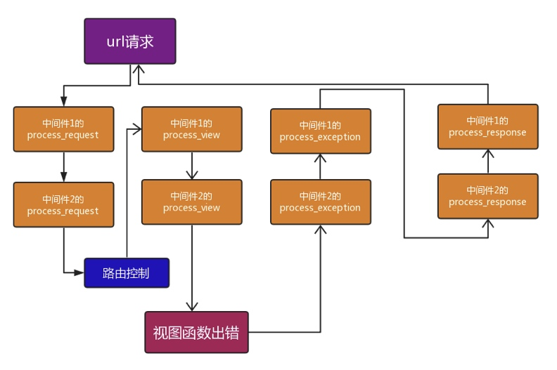
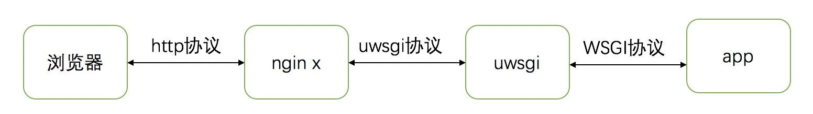

# 【Python】Django

* [【Python】Django](#pythondjango)
   * [简介](#简介)
   * [项目创建](#项目创建)
      * [基础环境搭建](#基础环境搭建)
      * [项目和应用创建](#项目和应用创建)
   * [路由](#路由)
   * [视图](#视图)
      * [请求对象](#请求对象)
      * [响应对象](#响应对象)
      * [cookie 和 session](#cookie-和-session)
      * [函数视图和类视图](#函数视图和类视图)
   * [模型](#模型)
      * [模型迁移](#模型迁移)
      * [模型建立](#模型建立)
      * [模型操作](#模型操作)
   * [中间件](#中间件)
   * [静态文件和模版](#静态文件和模版)
   * [uwsgi 部署](#uwsgi-部署)

## 简介
Django 是一个 Web 应用框架，通过它可以快速构建 Web 应用，但它不包括高性能的 Web 服务

[官方文档](https://www.djangoproject.com/start/overview/)，[中文文档](https://docs.djangoproject.com/zh-hans/3.2/)

在开发测试阶段，可以使用 django 默认调用 wsgiref 库实现的 web 服务，但在生产环境中一般使用 uwsgi 来作为 web 服务

django 的请求生命周期：
- 接收客户端的 http 请求，并将该请求解析为请求对象

- 为请求的 URL 进行路由匹配，路由匹配成功后获取到其对应视图和路由位置参数、路由关键字参数

- 调用该视图，并传入请求对象、路由位置参数、路由关键字参数，得到响应对象

- 解析响应对象为 http 响应，并返回给客户端

## 项目创建
### 基础环境搭建
``` bash
# 创建并进入项目目录
mkdir ${prefix}/${project_name}
cd ${prefix}/${project_name}

# 安装并创建虚拟环境
pip3 install virtualenv
virtualenv --no-site-packages venv

# 进入虚拟环境
. ./venv/bin/activate
# 退出虚拟环境
# deactivate

# 安装 django
# django2.1 后需要 Python3.5 或以上版本
pip3 install django
```

### 项目和应用创建
项目是一个网站中相关配置和多个应用的集合，创建项目和应用：
``` bash
# 创建项目
django-admin startproject ${project_name} ./

# 创建应用
Python3 manage.py startapp ${app_name}
```

针对该项目的 django 相关设置：
``` Python
# ${project_name}/settings.py

# 接收的请求 host 列表
# 默认为 127.0.0.1，支持 '*' 通配符
ALLOWED_HOSTS = ['*']

# 是否打开 debug 模式，即将触发的异常信息发送到响应
DEBUG = True                             

# 时区，默认为世界标准时 UTC，常用上海时区 Asia/Shanghai
TIME_ZONE = 'Asia/Shanghai'

# 语言，默认为英语 en-us，常用中文 zh-hans
LANGUAGE_CODE = 'zh-hans'

# 自定义的配置
VAR_NAME = object
```

在其他模块中引用设置变量：
``` Python
from django.conf import settings
settings.VAR_NAME
```

启动服务：
``` bash
Python3 manage.py runserver 0.0.0.0:8000
```

## 路由
路由用于定义 URL 对应和可执行视图模式之间的映射关系

针对该项目的路由相关设置：
``` Python
# ${project_name}/settings.py

# 项目总路由文件入口，默认为项目同名目录下的 urls.py
ROOT_URLCONF = 'project_name.urls'

# 若请求的 URL 不以 / 结尾并且匹配不上路由，且不包含 body 时，是否自动重定向到追加 / 的 URL
# 默认是，适合在设计的 URL 均以 / 结尾的情况
APPEND_SLASH = True
```

路由文件:
``` Python
# ${project_name}/urls.py | ${app_name}/urls.py
from django.urls import path, re_path

urlpatterns = [
   # 返回字符串匹配路径的路由
	path('hello/', viewFunc)
	# 返回正则匹配路径的路由
	re_path(r'^hello/$', viewClass.as_view())
		
	# 返回带路由名的路由
	path('hello/', viewFunc, name='hello_view')
	
	# 通过分组匹配传递路由参数，可用于伪静态
	# 作为位置参数传递
	re_path(r'^hello/([a-z]+)$', view_func)
	# 作为关键字参数传递
	re_path(r'^hello/(?P<name>[a-z]+)$', view_func)
	
	# 路由分发，将路径的匹配部分的右边内容，分发其他指定的路由文件
	# 路由文件通过导入路径路径指定
	path(r'book/', include('book.urls'))
	
	# 通过参数对应值的字典设置默认参数
	re_path(r'^hello/$', view_func, {key : value})
]
```
`re_path` 是部分匹配，即路径存在匹配的部分则视为匹配，可以通过 `^` 和 `$` 防止误匹配

`re_path` 可以用一些分组来从路径匹配值，如果该分组没打标签，这些值会依次作为路由位置参数，否则会作为路由关键字参数，传入到视图中

路由反解析：
``` Python
from django.urls import reverse
# 通过路由名获取路由的路径
path = reverse(name)

# 通过路由名、路由参数获取包含分组匹配的路由的路径
path = reverse(name, args=(), kwargs={})
```
当路由名或参数错误导致匹配不到路由时，触发异常

`path` 和 `re_path` 支持额外参数 `name` 来为路由命名，在路由反解析时使用

`include` 支持额外参数 `namespace` 来为分发的路由指定命名空间，在路由反解析时通过 `namespace:name` 来定位路由

为分发的路由指定命名空间时，需要在该分发路由的文件中设置 `app_name` 变量为对应命名空间
``` Python
# books/urls.py
app_name = 'namespace'
```

## 视图
### 请求对象
请求对象是 django 解析请求后生成的，用于进行请求信息获取和上下文的传递

请求对象的常用属性：

| 属性 | 类型 | 说明 |
| --- | --- | --- |
| method | str | 请求方法的大写形式 |
| path | str | 请求路径 |
| scheme | str | 请求协议|
| GET | QueryDict | 请求的路由参数 |
| POST | QueryDict | 请求的表单参数 |
| environ | dict | 请求的环境信息 |
| META | dict | 请求的元信息，基于环境信息提取并设置了一些键值 |
| headers | dict | 请求的 header，是从元信息中提取的 |
| body | bytes | 请求 body |

`QueryDict` 是 django 实现的一种多值字典对象，在其内部为每个 key 对应一个值列表，获取值的方法如下:
``` Python
# 返回 key 对应值列表的首个值
query_dict[key]
# key 不存在则返回默认值
query_dict.get(key, default=None)

# 返回 key 对应的值列表，key 不存在则返回默认值   
query_dict.getlist(key, default=None)
```

存储在环境信息的 header 的 key 是 header 名的 `-` 被替换成了 `_` ，且开头附加了 `HTTP_` 的，如：`HTTP_CONTENT_TYPE`

请求对象的常用方法：
``` Python
# 返回请求的域名
host = request.get_host()

# 返回请求的端口，字符串形式
port = request.get_port()

# 返回附带参数的完整路径，可指定路径是否追加 /
path = request.get_full_path(force_append_slash=False)

# 返回请求的协议是否为 https
secure = request.is_secure()	
```

当请求上传文件时，其请求方法为 `POST` 且 CONTENT-TYPE header 为 `multipart/form-data` ，上传文件信息的获取：
``` Python
# 返回包含表单名字对应文件对象的多值字典对象 
files = request.FILES

# 返回指定表单名字的文件对象
f = request.FILES.get(name)

# 返回文件对象的文件名
fname = f.name

# 返回文件大小，单位 byte
fsize = f.size

# 返回包含文件的所有块的生成器对象，块中内容的类型为 bytes
chunk_iter = f.chunks()

# 保存文件对象
# 对文件对象进行迭代相当于对其 chunks() 返回进行迭代
with open(f.name, 'wb') as nf:
    for i in f:
        nf.write(i)
```

### 响应对象
响应对象用于视图或中间件的返回，django 提供了多种不同功能的响应类去实例化响应对象

常用的内容响应类：
``` Python
from django.http import *

# 获取 html 响应对象，指定字符串作为内容
HttpResponse(content)

# 获取临时重定向响应对象，指定重定向地址
HttpResponseRedirect(redirect_to)

# 获取永久重定向响应对象，指定重定向地址
HttpResponsePermanentRedirect(redirect_to)

# 获取 json，指定字典作为数据
JsonResponse(data)
```

常用的流响应类：
``` Python
from django.http import *

# 获取 stream 响应对象，指定流对象作为内容
StreamingHttpResponse(streaming_content)

# 获取文件响应对象，指定文件对象作为内容
FileResponse(file_object)
```

响应对象的常用属性：

| 属性 | 类型 | 说明 |
| --- | --- | --- |
| content | bytes | 内容，内容响应对象使用 |
| streaming_content | bytes 迭代器 | 流内容，流响应对象使用 |
| charset | str | 编码，生效优先级为：属性 > Content-Type > setting 的 DEFAULT_CHARSET |
| status_code | int | 状态码 |

可以将响应对象看作包含所有 header 的字典，通过名字可获取操作指定的 header：
``` Python
# 获取指定名字的 header
reponse['Content-Type']
# 获取失败时返回默认值
reponse.get('Content-Type', None)

# 修改指定名字的 header
reponse['Content-Type'] = 'text/plain;charset=UTF-8'
# 修改未设置的 header
reponse.setdefault('Content-Type', text/plain;charset=UTF-8'
)

# 删除指定名字的 header
del reponse['Content-Type']

# 返回所有 header 值的可迭代对象
reponse.items()
```

django 在视图返回指定响应异常时，也会自动将其转化为 http 响应：
``` Python
from django.http import Http404

# 返回 404 响应异常
Http404(message='')       
```

### cookie 和 session
请求对象的 cookie 获取：
``` Python
# 返回包含所有 cookie 名字对应值的字典
request.COOKIES

# 获取指定名字的 cookie 值
request.COOKIES.get(name)

# 获取指定名字的签名 cookie 值
# 可指定最大存活时间，若指定名字的 cookie 不存在或过期，则返回默认值，默认值没指定则报错
# 盐需要和设置签名 cookie 时使用的盐相同，才能正确解析 cookie 值
request.get_signed_cookie(name, salt='', default=error, max_age=None）
```

响应对象的 cookie 设置：
``` Python
# 添加 Cookie-Set header 到响应，使客户端设置 cookie
reponse.set_cookie(key, value)	

# 添加 Cookie-Set header 到响应，使客户端设置签名的 cookie
set_signed_cookie(self, key, value, salt=''):
```
`set_cookie` 和 `set_signed_cookie` 支持的额外参数：

| 参数 | 类型 | 默认值 | 说明 |
| --- | --- | --- | --- |
| expires | datatime 对象 | None，永不失效 | 失效时间 |
| max_age | int | None，永不过期 | 最大存活时间，单位秒，负数表示立即过期，优先于 expires |
| domain | str | None，当前域名 | 作用域名，可设置二级域名来包含其所有三级域名，当前域名需要在作用域名下 |
| path | str | / | 作用路径，包含匹配（匹配路径的左边部分即匹配）|
| secure | bool | False | 客户端是否只允许 https 协议下使用该 cookie |
| httponly | bool | False | 客户端是否只允许发生请求时访问该 cookie，敏感信息需要使用 |

`secure` 用于防止 cookie 信息在传递过程中被监听捕获
`httponly` 使得 js 无法获取 cookie 信息，防止 XSS 攻击 信息

session 是存储在服务端的客户端信息，并依赖 cookie 来认证客户端，django 通过中间件进行支持，自动完成的如下过程：

- 设置一个的 session 时
    - 随机生成 session_key
    - 通过存储引擎存储包括 session_key 和 session 数据的记录
    - 为响应对象设置 cookie，其名字是指定的，值是 session_key

- 获取 session 的数据时
    - 从请求 cookie 中获取到 session_key
    - 使用 session_key 初始化一个 session 对象，对应一条 session 记录
    - 从 session 对象中获取指定 key 的值

django 提供了多种 session 存储引擎可用于设置：
``` Python
# ${project_name}/settings.py

# 安装 session 应用
INSTALLED_APPS = [
    ...
    'django.contrib.sessions',
    ...
]

# 设置 session 中间件
MIDDLEWARE = [
    ...
    'django.contrib.sessions.middleware.SessionMiddleware',
    ...
]

# 引擎设置
# 数据库（默认）
SESSION_ENGINE = 'django.contrib.sessions.backends.db'    

# 缓存
SESSION_ENGINE = 'django.contrib.sessions.backends.cache'
# 使用的缓存别名
SESSION_CACHE_ALIAS = 'default'               

# 文件
SESSION_ENGINE = 'django.contrib.sessions.backends.file'
# 文件目录路径，如为 None 则会自动生成一个临时目录  
SESSION_FILE_PATH = None                     
        
# 缓存并使用数据库持久化，提高效率 
SESSION_ENGINE = 'django.contrib.sessions.backends.cached_db'
# 使用的缓存别名
SESSION_CACHE_ALIAS = 'default'

# 使用签名 cookies，即通过 cookie 保存数据，无服务端的持久化
SESSION_ENGINE = 'django.contrib.sessions.backends.signed_cookies'

# 其他通用设置，存在默认
# session 使用的 cookie 名字
SESSION_COOKIE_NAME ＝ "sessionid" 

# session 使用的 cookie 有效路径
SESSION_COOKIE_PATH ＝ "/"                  

# session 使用的 cookie 有效域名，None 表示当前域名
SESSION_COOKIE_DOMAIN = None                 

# session 使用的 cookie 的 secure 是否启用
SESSION_COOKIE_SECURE = False                    

# session 使用的 cookie 的 httponly 是否启用
SESSION_COOKIE_HTTPONLY = True 

# session 使用的 cookie 的最大存活时间，单位秒，默认 2 周
SESSION_COOKIE_AGE = 1209600

# 是否关闭浏览器使得 session 过期
SESSION_EXPIRE_AT_BROWSER_CLOSE = False       

# 是否每次请求都保存 session，默认当 session 被修改时才会保存
SESSION_SAVE_EVERY_REQUEST = False              
```

通过请求对象管理 session：
``` Python
# 返回请求对应的 session 类字典对象
session = request.session

# 返回该 session 对象的 session key
session_key = session.session_key

# 返回指定的 session key 是否存在 session 数据
session.exists(session_key)	

# 删除指定的 session key 的所有 session 数据
session.delete(session_key)
		
# 删除所有失效的 session 数据
session.clear_expired()

# 设置该 session 对象 的 session 过期时间，过期主要通过控制 cookie 过期来实现
# 当 value 是个整数，在这个指定秒数后失效
# 当 value 是个 datatime 或 timedelta，在这个指定时间或叠加时间后失效
# 当 value 是 0，在关闭浏览器后就会失效
# 当 value 是 None，依赖 setting 中的失效策略
session.set_expiry(value)		
```

一个请求的进行多 session 处理：
``` Python
from SESSION_ENGINE import SessionStore

# 通过多个 session key 获取多个 session 对象进行处理
session1 = SessionStore(session_key1)
session2 = SessionStore(session_key2)
```

### 函数视图和类视图
视图分为两种，分别是基于函数的视图 FBV（function base views）和基于类的视图 CBV（class base views）

基于函数的视图：
``` Python
# 接受任何请求方法的匹配路由的请求
def view_func(request, *args, **kwargs):
	pass
```

基于类的视图：
``` Python
from django.views import View

class ViewClass(View):
    # 接受 GET 请求方法的匹配路由的请求
    def get(request, *args, **kwargs):
        pass
```
视图类的处理流程：
- 通过 as_view 方法实例化视图类，调用该视图实例
- 视图实例调用 dispatch 方法，并传入请求对象
- dispatch 方法根据请求对象的请求方法来反射调用处理方法
- 处理方法接收请求对象，处理并返回响应对象

可以通过重构视图类的 dispatch 方法，追加功能或改变调用处理方法的规则：
``` Python
def dispatch(self, request, *args, **kwargs):
	print(request.method)
	return super(self.__class__,self).dispatch(request, *args, **kwargs)
```

类视图装饰器：
``` Python
from django.utils.decorators import method_decorator

# 对 get 方法进行装饰 
class ViewClass(Views):
	@method_decorator(decorator_func)
	def get(self,request):
		pass
		
# 对指定方法进行装饰
@method_decorator(decorator_func, name=method_name)
class ViewClass(Views):
	def get(self,request):
		pass
```

## 模型
### 模型迁移
设置已安装应用以及模型后端：
``` Python
# ${project_name}/settings.py

# 已安装应用设置，默认包含 6 个 django.contrib 包中的应用  
INSTALLED_APPS = [
    # 管理站点框架
    'django.contrib.admin',
    # 用户认证框架
    'django.contrib.auth',
    # 内容类型框架，被其他应用所使用
    'django.contrib.contenttypes',
    # 会话框架
    'django.contrib.sessions',
    # 消息框架
    'django.contrib.messages',
    # 静态文件管理框架
    'django.contrib.staticfiles',
    # 自定义应用
	 ...
]

# 后端数据库设置
DATABASES = {
    # 标签，default 表示默认
    'default': {
        # 数据库引擎
        'ENGINE': 'django.db.backends.mysql',
        # 数据库库名
        'NAME': 'hi',
        # 数据库地址
        'HOST': '119.28.155.72',
        # 数据库端口
        'PORT': '3306',
        # 数据库用户
        'USER': 'huaming',
        # 数据库密码
        'PASSWORD': '1amgood'
    },
    'sqlite': {
        # 数据库引擎
        'ENGINE': 'django.db.backends.sqlite3',
        # 数据库文件路径
        'NAME': os.path.join(BASE_DIR, 'task_execute.sqlite3'),
    }
}
```
数据库引擎存在支持不同的数据库的 4 种，不同的引擎需要不同的后续参数：
- `django.db.backends.mysql`

    Python3 需要安装 `mysqlclient` 模块，django2.1 后需要 mysql5.6 或以上版本
    
    pip 安装时遇到 `mysql_config not found` 的报错，需要先在环境变量中加入 mysql 命令目录：`export PATH=$PATH:${mysql_prefix}/bin`
     
- `django.db.backends.sqlite3`

    在编译安装 Python3 前需安装开发包 `yum install sqlite-devel` 
    
- `django.db.backends.postgresql`
- `django.db.backends.oracle`

**执行数据库迁移**

``` bash
# 生成迁移文件，如检测不到某个 app，可在其目录下创建 migrations 包
Python3 manage.py makemigrations

# 查看迁移文件所要执行的SQL语句
# migration_file_number 是迁移文件序号，如：0001
Python3 manage.py sqlmigrate app_name migration_file_number 

# 执行迁移到数据库的操作
Python3 manage.py migrate
```
迁移文件存在于应用的的 migration 包中，每次生成的文件其名字包含编号，如：`0001_initial.py`、`0002_auto_20190128_1120.py`

执行迁移时需要确保数据库对 django 使用的用户有增删改查的权限

应用执行迁移的日志保存在 `django_migrations` 表中

**重建指定 app 的迁移记录**

- 重置执行记录，但实际不操作：`Python3 manage.py migrate --fake ${app_name} zero`

- 手动删除 `${app_name}/migrations` 中除 `__init__.py` 外的所有文件
- 重新生成迁移文件：`Python manage.py makemigrations `
- 执行初始化迁移，但实际不操作：`Python manage.py migrate --fake-initial`
- 查看迁移文件和执行记录：`Python manage.py showmigrations`

### 模型建立
``` Python
from django.db import models

class Model(models.Model):
    # 元属性，是一个类
    class Mate:
        verbose_name = '模型'
        
    # 字段属性，是一个字段实例
    field = models.CharField(max_length=32)
```
常用字段，传入参数是必须参数：
``` Python
# 自增整数字段，必须为主键，起始值为 1
models.AutoField(primary_key=True)

# 自增64位整数字段，必须为主键，起始值为 1
models.BigAutoField(primary_key=True)

# 整数字段
models.IntegerField()

# 浮点数字段
models.FloatField()

# 字符串字段
models.CharField(max_length=128)

# 布尔值字段
models.BooleanField()

# 日期字段，对应 datetime.date 类型
models.DateField()

# 日期时间字段，对应 datetime.datetime 类型
models.DateTimeField()
```
字段的常用默认参数：

| 参数 | 类型 | 默认 | 作用 |
| --- | --- | --- | --- |
| primary_key | bool | False | 是否为主键 |
| null | bool | False | 值是否允许为 None |
| default | 对应类型 | 无 | 默认值 |
| db_column | str | 属性名 | 字段名 |
| verbose_name | str | 属性名 | 备注字段名 | 
| db_index | bool | False | 是否建立索引 |
| help_text | str | '' | 说明文字 |
| unique | bool | False | 是否建立唯一索引 |
| unique_for_date | str | None | 是否设置和指定日期或日期时间字段的日期部分建立联合唯一索引 |
| unique_for_month | str | None | 是否设置和指定日期或日期时间字段的月部分建立联合唯一索引 |
| unique_for_year | str | None | 是否设置和指定日期或日期时间字段的年部分建立联合唯一索引 |
| auto_now_add | bool | False | 是否自动设置为创建时间，只用于日期或日期时间字段 |
| auto_now | bool | False | 是否自动设置为更新时间，只用于日期或日期时间字段 |
| blank | bool | False | 值是否允许为空值，空值包括 None、空字符串、空元祖、空列表、空字典，作用于 django 表单 |
| choices | tuple | None | 包含所有选项的元祖，选项也是元祖 `(值, 说明)`，用于指定值的可选值，作用于 django 表单 |
| validators | tuple | () | 进行验证时使用的验证器，验证器接受字段值，当验证失败时触发 `ValidationError` 异常，作用于 django 表单 |

若一个模型不存在主键字段，django 会自动创建名字为 `id` 的自增整数主键字段

元属性 `Meta` 的属性：

| 属性 | 类型 | 默认 | 作用 |
| --- | --- | --- | --- |
| db_table | str | 小写的 `应用名_模型名` | 表名  |
| verbose_name | str | 表名 | 备注表名 |
| unique_together | tuple | () | 包含所有联合唯一键的元祖，联合唯一键也是元祖 `("字段名1", "字段名2")` |
| index_together  | tuple | () | 包含所有联合唯一约束的元祖，联合索引也是元祖 `("字段名1", "字段名2")` |
| ordering | list | [] | 结果集的排序规则，列表包含多个排序字段，从左到右依次按字段排序，每个字段默认表示升序，添加 `-` 前缀则为降序，字段 `?` 表示随机排序 |
| abstract | bool | False | 是否为抽象类，即不会作用于数据库，只用于定义模型共同的属性和方法 |

### 模型操作
模型对象的查询，通过模型管理器来从数据库中获取对象并构造查询集

每个模型都至少存在一个管理器保存在 objects 属性中，该属性只能通过模型类进行访问

查询集是包含模型对象的类列表，它可以链式调用任意个过滤器，过滤器根据参数来对其中的模型对象进行过滤

模型管理器不是查询集，但在调用其方法时可将其视为包含所有模型对象的查询集

模型管理器或查询集的查询方法，若返回的是查询集则允许链式调用：
``` Python
# 返回包含所有模型对象的查询集
all()

# 返回包含满足条件参数的模型对象的查询集
filter(条件参数)

# 返回包含不满足条件参数的模型对象的查询集
exclude(条件参数)

# 返回指定字段分组且排序后的查询集
# 指定多个字段的情况下，从左到右依次按字段排序
# 每个字段默认表示升序，添加 - 前缀则为降序，字段 ? 表示随机排序
order_by(*fields)

# 返回字段聚合计算的结果，如 {'filed__聚合计算小写名': value}
aggregate(聚合计算('field'))

# 附加一个字段用于存放字段聚合计算结果或者额外数据
annotate(new_field=聚合计算('field'))

# 返回查询集，其中的模型对象被转化为包含指定列和值的字典，默认为所有列
values(*fields)

# 返回查询集，其中的模型对象被转化为包含指定列的值的元祖，默认为所有列
values_list(*fields)

# 返回符合条件的模型对象，若不存在则触发异常
get(条件参数)

# 返回首个模型对象
first()

# 返回最后一个的模型对象
last()

# 返回最后一个的模型对象
count()
```
条件参数是关键字参数，多个表示 and 关系，包含：

| 参数 key | 参数 value | 作用 |
| --- | --- | --- |
| 字段名__exact | str | 精确匹配，等同于 LIKE 值 |
| 字段名__iexact | str | 忽略大小写的精确匹配，等同于 ILIKE 值 |
| 字段名__contains | str | 包含匹配，等同于 LIKE %值% |
| 字段名__icontains | str | 忽略大小写的包含匹配，等同于 ILIKE %值% |
| 字段名__startswith | str | 指定开头，等同于  LIKE 值% |
| 字段名__istartswith | str | 忽略大小写的指定开头，等同于  ILIKE 值% |
| 字段名__endswith | str | 指定结尾，等同于  LIKE %值 |
| 字段名__iendswith | str | 忽略大小写的指定结尾，等同于  ILIKE %值 |
| 字段名__gt | number | 大于 |
| 字段名__gte | number | 大于等于 |
| 字段名__lt | number | 小于 |
| 字段名__lte | number | 小于等于 |
| 字段名__range | [min, max] | 在指定范围内 |
| 字段名__year | number | 指定年，用于日期或日期时间字段 |
| 字段名__month | number | 指定月，用于日期或日期时间字段 |
| 字段名__day | number | 指定日，用于日期或日期时间字段 |
| 字段名__isnull | bool | 是否为 null |

查询集是惰性执行的，即生成查询集是不会带来任何数据库操作，直到访问查询集结果，django 才会对数据库执行查询

复杂查询：
``` Python
from django.db.models import Q

# and 查询
Model.objects.filter(Q(条件参数) & Q(条件参数))

# or 查询
Model.objects.filter(Q(条件参数) | Q(条件参数))

# 非查询
Model.objects.filter(~Q(条件参数))
```

引用查询结果的指定字段
``` py
from django.db.models import F

# 引用指定的查询字段，将该结果用于后续操作
# 用于更新
Model.objects.filter(条件参数).update(new_id=F(id)+1)

# 用于过滤
Model.objects.filter(条件参数).filter(price=F(paid))
```

常用聚合计算：
``` Python
from django.db.models import (
    Sum,    # 总和
    Max,    # 最大值
    Min,    # 最小值
    Avg     # 平均值)
```

模型管理器或查询集的操作方法：
``` Python
# 创建记录，返回记录对应模型对象
create(字段设置)

# 修改记录，返回修改的记录数目
update(字段设置)

# 删除记录，返回删除的记录数目，模型管理器不可以直接调用
delete()
```
字段设置为关键字参数，参数 key 为字段名，参数值为字段要设置的值

通过模型对象进行操作：
``` Python
# 创建记录
obj = Model(字段设置)
obj.save()

# 修改记录
obj.field = value
obj.save()

# 删除记录，删除后，模型对象的主键属性会被置为 None
obj.delete()
```
实例化模型时，字段不存在默认值且未赋值的情况下，字符串字段的值为 `''`，而其他字段的值为 `None`

定义了默认值或者自增的字段，是在记录创建完成后才会把值更新到对应的对象属性

通过模型对象的属性可以访问到对应字段的值

通过模型对象的 `__dict__` 属性，去除一个名为 `_state ` 的 key，可以获取包含其字段和值的字典形式

## 中间件
中间件用于拦截对象请求或者响应对象进行额外的处理，实现附加的功能

django 的中间件就是一个包含特定方法的类，要使其起作用需要在 settings 中按顺序配置导入路径
``` Python
# ${project_name}/settings.py

MIDDLEWARE = [
    # 默认中间件       
    'django.middleware.security.SecurityMiddleware',
    'django.contrib.sessions.middleware.SessionMiddleware',
    'django.middleware.common.CommonMiddleware',
    'django.middleware.csrf.CsrfViewMiddleware',
    'django.contrib.auth.middleware.AuthenticationMiddleware',
    'django.contrib.messages.middleware.MessageMiddleware',
    'django.middleware.clickjacking.XFrameOptionsMiddleware',
]
```

定义中间件：
``` Python
from django.utils.deprecation import MiddlewareMixin

class Middleware(MiddlewareMixin):
    """
    通过重写指定方法来实现功能
    """
    
    # 请求对象到达路由前的预处理
    # 该方法返回 None，则继续下一个中间件的同名方法，否则这个返回值会被作为响应对象交给当前中间件的 process_response 方法
    # 可用于对请求信息进行筛选返回，实现验证信息、过滤请求的功能
    def process_request(self, request):
        pass
    
    # 请求对象通过路由后，到达视图前的预处理  
    # 该方法返回 None，则继续下一个中间件的同名方法，否则这个返回值会被作为响应对象交给当前中间件的 process_response 方法
    # 可用于获取请求的目的视图、路由参数，实现鉴权或额外设置请求属性
    def process_view(self, request, callback, callback_args, callback_kwargs):
        # callback: 目的视图
        # callback_args: 路由位置参数
        # callback_kwargs: 路由关键字参数
        pass
    
    # 视图返回响应对象后的处理
    # 该方法返回响应对象，则继续上一个中间件的同名方法，否则会触发异常
    # 可用于对响应进行修改
    def process_response(self, request, response):
        # response 响应对象
        pass
    
    # 视图发生异常后的处理
    # 该方法若返回 None，则继续上一个中间件的同名方法，否则这个返回值会被作为响应对象交给最后中间件的 process_response 方法
    # 可以用于将视图发生的异常转化为指定的响应对象
    def process_exception(self, request, exception)
        # exception: 异常对象
        pass
    
    # 当视图返回的是模版响应对象时进行处理，模版响应对象即包含 render 方法的响应对象
    # 该方法返回响应对象，则继续上一个中间件的同名方法，否则会触发异常，最后响应对象会交给所有中间件的 process_response 方法
    def process_template_response(self, request, response):
        # response 模版响应对象
        pass	
```

正常的中间件方法执行顺序：


预处理（process_request 或 process_view）返回非 `None` 的中间件方法执行顺序：


视图发生异常时的中间件方法执行顺序：



## 静态文件和模版
开发环境中，通过默认应用 staticfiles 将自动从指定的资源目录和各个应用的 static 子目录中搜索静态文件，以完成匹配指定静态路由的请求

生产环境中，静态文件一般交由 Web 服务器处理，需要通过 `Python manage.py collectstatic` 将所有静态文件收集到指定静态根目录中

``` py
# ${project_name}/settings.py

# 表示开发环境，配合 Python manage.py runserver 启动服务，staticfiles 才会工作
DeBug = True

# 静态路由
STATIC_URL = /static/

# 指定的资源目录
STATICFILES_DIRS = (
    os.path.join(BASE_DIR, ‘static’),
)

# 指定的静态根目录
STATIC_ROOT
```

生产环境也想通过 django 本身来支持静态文件，则需要收集静态文件后，额外添加路由

``` py
# ${project_name}/url.py
from django.conf import settings
from django.conf.urls.static import static

urlpatterns += static(settings.STATIC_URL, document_root=settings.STATIC_ROOT)
```

## uwsgi 部署
uswgi 实现了 WSGI 协议，可以为 django 的 web 应用提供 web 服务，uwsgi 拥有以下特点：
- 低内存占用
- 多 web 应用管理
- 详细的日志功能
- 高度定制化，如内存大小限制、服务一定次数后重启等

安装和使用：
``` bash
# 安装
pip3 install uwsgi

# 启动
uwsgi ${config_file}

# 关闭
uwsgi --stop ${pid_file}

# 重启
uwsgi --reload ${pid_file}
```

配置文件中的常用配置项：
``` ini
[uwsgi]
# 项目目录
chdir=/Users/near/myGithub/flex_finance
# 环境目录
home=../venv/flex_finance
# WSGI 应用模块
module=flex_finance.wsgi
# 开启 uwsgi_socket 的 socket 文件
socket=uwsgi/uwsgi.sock
# 开启 http 的 host 和端口
http=0.0.0.0:5555
# 是否启用 master 进程
master=true
# worker 进程个数
workers=4
# pid 文件
pidfile=uwsgi.pid
# uwsgi 进程的用户名和用户组
uid=root
gid=root
# 当服务停止的时候，自动移除 pid 文件
vacuum=true
# 后台运行并设置日志文件
daemonize=uwsgi.log
# 允许进程中启用多线程
enable-threads = true
# 附属进程入口文件
mule = event/mule.py
# uwsgi 支持静态文件访问的目录和路由映射
static-map=/static=static
```

uwsgi 不仅可以用于为 django 的 web 应用提供 web 服务，还可以作为中间件，用于提供其他 web 服务和 django 的 web 应用进行uwsgi 协议的 socket 通信

因为 uwsgi 作为 web 服务不能支持高并发，并且静态请求的处理性能也不高，因此通常作为中间件搭配 nginx 使用

nginx 直接提供静态请求的处理，而动态请求通过 uwsgi 协议转发到支持 uwsgi 服务的 socket，由 django 的 web 应用进行处理



nginx 配置：
``` conf
# 使用 nginx 来支持静态文件访问
location /static/ {
    root /work/apps/op_keystone/static/;  
}

location / {
    include uwsgi_params;
    uwsgi_pass unix:/work/apps/op_keystone/uwsgi/uwsgi.sock;  
}
```


