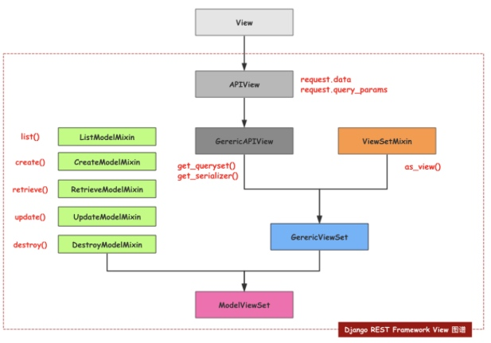
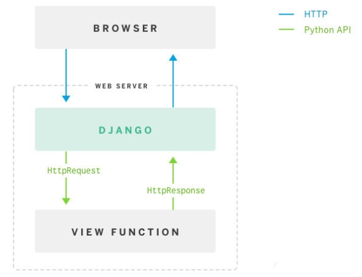
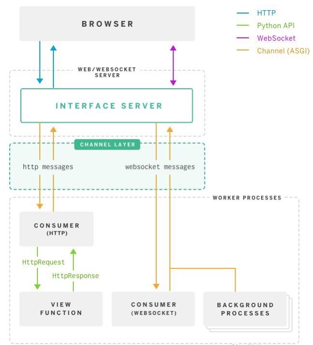

# 【Python】Django 扩展

* [【Python】Django 扩展](#pythondjango-扩展)
   * [Django Rest Framework](#django-rest-framework)
      * [组件介绍](#组件介绍)
         * [序列化器](#序列化器)
            * [序列化和反序列化](#序列化和反序列化)
            * [已验证数据的保存](#已验证数据的保存)
            * [字段](#字段)
            * [嵌套、多对象处理和上下文](#嵌套多对象处理和上下文)
            * [数据验证](#数据验证)
            * [模型序列化器](#模型序列化器)
         * [视图和视图集](#视图和视图集)
            * [视图](#视图)
            * [通用视图类](#通用视图类)
            * [视图集](#视图集)
         * [路由器](#路由器)
      * [使用步骤](#使用步骤)
         * [基础配置](#基础配置)
         * [定义序列化器类](#定义序列化器类)
         * [定义视图集](#定义视图集)
         * [设置路由](#设置路由)
   * [Django Channels](#django-channels)
      * [使用步骤](#使用步骤-1)
         * [基础配置](#基础配置-1)
         * [通信层配置](#通信层配置)
         * [消费者创建](#消费者创建)
         * [在消费者外部向信道发送消息](#在消费者外部向信道发送消息)
      * [Model 操作连接超时](#model-操作连接超时)
      * [daphne 部署](#daphne-部署)

## Django Rest Framework
rest framework 为 django 的 restful api 开发提供更方便的实现方式

[官方文档](https://www.django-rest-framework.org) 和 [中文版文档](http://www.iamnancy.top/djangorestframework/Home/)

安装：
``` bash
pip3 install djangorestframework
```

### 组件介绍
#### 序列化器
序列化器 `Serializer` 用于对实例（对象、资源）进行序列化和反序列化，以实现对实例的各种操作

##### 序列化和反序列化
``` Python
from rest_framework import serializers

# 定义对于该实例类型的序列化器
class InsSerializer(serializers.Serializer):
    # 定义序列化器的字段对象
    pass
 
# 传入实例进行序列化，得到序列化器对象
serialized_ins = InsSerializer(ins)

# 传入数据进行反序列化，得到序列化器对象，一般用于创建实例
serialized_ins = ObjSerializer(data=dict)

# 传入实例和数据进行反序列化，得到序列化器对象，一般用于更新实例
serialized_ins = InsSerializer(ins, data=dict)

# 获取序列化器对象中的实例，未传递为 None
ins = serialized_ins.instance

# 获取序列化器对象中的传入数据，未传递则不存在
initial_data = serialized_ins.initial_data

# 获取序列化器对象中的数据，即实例的代表，若实例不存在则是为已验证数据的代表
# 若序列化器对象中包含传入数据，则需要先对其验证
data = serialized_obj.data

# 对序列化器对象中的传入数据验证，并返回是否有效
# 可以传入布尔值表示验证无效时是否触发异常
ok = serialized_obj.is_valid(bool?)

# 获取序列化器对象中的已验证数据
serialized_obj.validated_data

# 获取序列化器对象中的传入数据的验证错误字典
# 字典中的键是字段名，值是该字段对应的错误信息列表
error = serialized_obj.errors
```

##### 已验证数据的保存
``` Python
# 根据序列化器对象中是否存在实例来调用 update 或 create 方法
# 需要重写 update、create 来定义更新或创建操作
# 也可以重写 save 方法来重新定义保存操作
serialized_obj.save()

# 定义对于该实例类型的序列化器
class InsSerializer(serializers.Serializer):
    # 定义序列化器的字段对象
    pass
    
    # 需要实现自定义更新操作
    def update(self, instance, validated_data):
        pass
    
    # 需要实现自定义创建操作
    def create(self, validated_data):
        pass
        
    # BaseSerializer 实现了的保存方法，会根据是否存在 self.instance 来调用 update 和 create
    def save(self, **kwargs):
        pass
```

默认序列化器的传入数据必须包含所有必须字段的值，否则会引发验证错误，通过 `partial` 参数可以允许部分更新
``` Python
serialized_ins = InsSerializer(ins, data=dict, partial=True)
```

##### 字段
序列化器类可以定义多个 `Field` 字段对象属性，和 `Model` 定义类似

字段实例化的常用参数包括：

| 参数 | 默认值 | 作用 |
| --- | --- | --- |
| read_only | False | 该字段在反序列化期间是否被使用 |
| write_only | False | 该字段在序列化期间是否被使用 |
| required | True | 该字段是否必须，若是则在反序列化期间，如传入数据中未提供字段且字段无默认值，会引发验证错误 |
| default | 空类 | 默认值，在序列化或反序列化期间，若该字段没有输入时被应用，但部分更新时不会被应用 |
| allow_null | False | 该字段的值是否允许为 None，若允许且无默认值时，则序列化输出为 None |
| source | 字段名 | 用于填充到字段的对象的属性名 |
| validators | [ ] | 验证器列表 |
| error_messages | 默认错误消息 | 错误代码为键，错误消息为值的字典 |

`default` 参数可以设置为返回值的可调用对象或函数，使其在每次被应用时生成，并且支持定义验证器相同的 `set_context` 方法，该方法在其本身被调用前被调用

`source` 参数可以设置为是只接受 `self` 参数且返回值的方法，或者通过 `.` 来表示属性本身的属性，`*` 则表示对象本身应该被传递到该字段

互斥的参数：
- `read_only` 和 `write_only`
- `read_only` 和 `required`
- `required` 和 `default`

常用的字段类型包括：

| 字段类型 | 数据类型 | 支持的参数 |
| --- | --- | --- |
| BooleanField | 布尔值 |  |
| CharField | 字符串 | max_length（最大长度）、min_length（最小长度）、allow_blank（允许空字符串）、trim_whitespace（去除前后空格）|
| UUIDField | UUID | format（输出格式），包括 hex_verbose 标准格式十六进制、hex 不带横杆十六进制 |
| IntegerField | 整数 | max_value（最大值）、min_value（最小值）|
| FloatField | 浮点数 | max_value（最大值）、min_value（最小值）|
| DateTimeField | 日期时间 | format（输出格式）、input_formats（输入格式）|
| ListField | 列表 | child（用于验证元素的字段对象）、min_length（最小个数）、max_length（最大个数）|
| DictField | 字典 | child（用于验证值的字段对象）|
| JSONField | json | binary（输入输出是否为二进制）|

特殊字段：

| 字段类型 | 含义 | 说明 |
| --- | --- | --- | 
| ReadOnlyField | 只读字段 | 只返回字段的值而不进行修改 |
| HiddenField | 隐藏字段 | 不通过输入获取值，而是从默认值中获取值 |
| SerializerMethodField | 方法字段 | 只读字段，通过所在序列化器类的 `get_<field_name>` 方法的返回来获取输出，且该方法接收的参数是序列化器类接收的对象 |

决定字段输入输出的两个方法：
- `to_internal_value` 用于转化原始数据为本地值，决定保存操作
- `to_representation` 用于转化本地值为原始数据，决定查询操作

通过字段的 `parent` 属性可以获取字段所在的序列化器对象

##### 嵌套、多对象处理和上下文
字段是序列化器的主要组成，而 `Serializer` 类继承了 `Field` 类，序列化器本身也是一种字段，因此可以进行嵌套
``` Python
class InsSerializer(serializers.Serializer):
    name = serializers.CharField()
    # 嵌套序列化器对象
    user = UserSerializer()
```

序列化器还可以序列化或反序列化对象的列表，传入对象的列表或者查询集，并且通过 `many` 参数可以实现
``` Python
serialized_ins = InsSerializer(queryset, many=True)
```
多对象操作实际是通过 `ListSerializer` 类来实现的

多对象的反序列化操作默认只支持多对象创建，不支持多对象更新

序列化或反序列化时，可以传递额外的上下文到序列化器中，以便其中的方法调用
``` Python
serialized_ins = InsSerializer(ins, context=dict)
```

##### 数据验证
字段级别验证，通过为序列化器类定义添加 `validate_<field_name>` 方法：
``` Python
class InsSerializer(serializers.Serializer):
    name = serializers.CharField()
    
    # 接收和返回是字段值
    def validate_name(self, value):
        # 验证为无效，则触发验证异常
        # raise serializers.ValidationError("invalid value")        
        return value
```

对象级别验证，通过为序列化器类定义添加 `validate` 方法：
``` Python
class InsSerializer(serializers.Serializer):
    pass
    
    # 接收和返回是数据
    def validate(self, data):
        # 验证为无效，则触发验证异常
        # raise serializers.ValidationError("invalid data")        
        return data
```

自定义验证器，可添加到字段上或者序列化器类的 `Meta` 上：
``` Python
# 函数验证器
def custom_validate(value):
    # 验证为无效，则触发验证异常
    # raise serializers.ValidationError("invalid value")        
    return value
    
# 类验证器，利用构造函数使更好被复用
class CustomValidate():
    def __init__(self):
        # 初始化验证条件
    
    # 用于序列化器类或字段
    # def set_context(self, serializer):
    def set_context(self, serializer_field):
        # 在验证前会被调用
        # 用于根据字段（序列化器类）对象，设置它或验证器对象的属性或传递上下文
    
    # 用于序列化器类或字段
    # def __call__(self, data):
    def __call__(self, value):
        # 验证为无效，则触发验证异常
        # raise serializers.ValidationError("invalid value")        
        return value

class InsSerializer(serializers.Serializer):
    # 添加到字段上，验证时自动传入该字段的值
    name = serializers.CharField(validators=[custom_validate, CustomValidate()])
    
    # 添加到序列化器器类的 Meta 上，验证时自动传入该对象的数据
    class Meta:
        validators=[custom_validate, CustomValidate()]
```

内置验证器：
``` Python
# 验证字段值的唯一性，应用于字段
class UniqueValidator:
    def __init__(self, queryset, message=None, lookup='exact'):
    # queryset 是对象的查询集
    # message 是验证错误消息，默认存在
    # lookup 是检索方式，默认为 extra 精确匹配

# 验证字段值的联合唯一，应用于序列化器类
class UniqueTogetherValidator:
    def __init__(self, queryset, fields, message=None):
        # queryset 是对象的查询集
        # fields 是联合唯一的字段名元组
        # message 是验证错误消息，默认存在

# 验证字段值和指定日期字段中的日期、月或年联合唯一，应用于序列化器类
class UniqueForDateValidator(BaseUniqueForValidator)
class UniqueForMonthValidator(BaseUniqueForValidator)
class UniqueForYearValidator(BaseUniqueForValidator)

class BaseUniqueForValidator:
    def __init__(self, queryset, field, date_field, message=None):
        # queryset 是对象的查询集
        # field 是联合唯一的字段
        # date_field 是联合唯一的日期字段
        # message 是验证错误消息，默认存在
```
用于验证联合唯一的字段，需要为以下三种情况：

- 必须字段（require=True）
- 隐藏字段（HiddenField）
- 含默认值的只读字段（read_only=True, default=...）

##### 模型序列化器
模型序列化器类 `ModelSerializer` 提供了一个快捷方式，可以自动创建具有与 django `Model` 字段对应的字段的序列化器类类

快捷方式包括以下自动操作：
- 根据模型自动生成一组字段
- 为序列化器类生成验证器设置到 Meta 中
- 包含默认简单实现的 `create` 和 `update` 方法

``` Python
InsSerializer(serializers.ModelSerializer)
    class Meta:
        # 定义对应的模型
        model = InsModel
        # 定义包含的字段，设置为 __all__ 表示所有字段
        fields = ('uuid', 'name')
```
可以额外显式定义字段对象属性，或者定义同名字段对象属性来进行重写

当使用 `ModelSerializer` 时，带有 `auto_now=True` 或 `auto_now_add=True` 的模型字段将默认使用 `read_only=True` 的 `DateTimeField` 字段对象，如需要重写则在序列化器中显式定义

在 `Meta` 中设置 `read_only_fields` 属性可以定义多个只读字段

#### 视图和视图集
##### 视图
本包提供的视图类 `APIView` 用于实现视图，其与 django 的 `View` 存在以下不同：

- 传递到处理方法的 `request` 是本包的 Request 对象，而不是 django 的 HttpRequest 对象
- 处理方法的返回可能是本包的 Response 对象，而不是 django 的 HttpResponse 对象
- 任何 APIException 异常都会被捕获并调解为适当的响应
- 传入的请求将被认证，并且在将请求分派给处理程序方法之前将运行适当的的权限或限流检查

实现查询用户列表的视图：
``` Python
from rest_framework.response import Response
from .models import User

class ListUsers(APIView):
 
    def get(self, request, format=None):
        users = User.objects.all()
        return Response(users)
```

##### 通用视图类
通用视图类 `GenericAPIView` 集合了视图常用的方法，可以混合其他 minxins 来组成自定义可重用视图类

``` Python
class ListUsers(GenericAPIView):
    # 该属性定义从该视图返回对象的查询集，必须设置此属性或重写 get_queryset() 方法
    # 获取最新的查询集需要调用 get_queryset()，而不是直接访问该属性
    queryset = User.objects.all()
    
    # 该属性定义序列化类，必须设置此属性，或重写 get_serializer_class() 方法
    serializer_class = UserSerializer
    
    # 该属性定义执行各个模型实例的对象查找的模型字段，默认为 pk
    lookup_field = 'uuid'
    
    # 用于对象查找的 URL 的关键字参数名，默认使用与 lookup_field 相同的值
    lookup_url_kwarg = 'uuid'
        
    def get(self, request, format=None)
        queryset = self.get_queryset()
        serializer = self.serializer_class(queryset, many=True)
        return Response(serializer.data)
```

通用视图的常用方法：
``` Python
# 返回用于列表视图的最新查询集
get_queryset()

# 返回用于详细视图的对象
get_object()

# 使用后端过滤器过滤查询集，返回过滤后的查询集
filter_queryset(queryset)

# 返回用于序列化的类
get_serializer_class()
```

常用的其他通用视图类：
``` Python
# 混入了 create 方法，并作为 post 方法的返回
class CreateAPIView

# 混入了 list 方法，并作为 get 方法的返回
class ListAPIView

# 混入了 retrieve 方法，并作为 get 方法的返回
class RetrieveAPIView

# 混入了 delete 方法，并作为 delete 方法的返回
class DestroyAPIView

# 混入了 update 和 partial_update 方法，并作为 put 和 patch 方法的返回
class UpdateAPIView
```
> ListCreateAPIView、RetrieveUpdateAPIView、RetrieveDestroyAPIView、RetrieveUpdateDestroyAPIView 是对以上视图类的功能集合

##### 视图集
视图集 `ViewSet` 用于定义资源的一系列动作方法，根据请求方法来调用视图集中的对应方法，获取响应

常用的视图集：
``` Python
# 基础视图集
class ViewSet

# 通用视图集，包含一些视图的通用方法
class GenericViewSet

# 只读视图集，包含 list 和 retrieve 动作方法
class ReadOnlyModelViewSet

# 模型视图集，包含 create、retrieve、update、partial_update、destroy 和 list 动作方法
class ModelViewSet
```
视图集是在通用视图类之上混入了视图集 mixin 和动作方法 mixin 来实现的，因此可以自定义构造视图集，通过需要的混入视图类和动作方法 mixin



``` Python
# 仅包含 create、partial_update 和 update 动作方法
class CreateUpdateViewSet(mixins.CreateModelMixin, mixins.UpdateModelMixin)
```

使用 `@action` 装饰器可以标记一个方法为动作方法，并指示其接受的请求方法，当视图集被使用路由器注册时生效
``` Python
from rest_framework.decorators import action


class UserViewSet(viewsets.ModelViewSet):
    # method 表示接收的请求方法列表
    # detail 表示路由是否需要获取其 uuid
    @action(methods=['post', 'put'], detail=True)
    def set_password(self, request, pk=None):
    pass
```

#### 路由器
路由器 `Router` 能快速为指定的视图集注册路由，并将请求方法和视图集的动作方法进行约定好的关系对应

``` go
# 实例化路由器
router = DefaultRouter()

# 注册路由
router.register(r'/users', UserViewSet)

# 获取路由列表
router.urls
```
生成的路由：

| 方法 | 路由 | 名字 |
| --- | --- | --- |
| GET | `^/users/$` | user-list |
| POST | `^/users/$` | user-created |
| GET | `^/users/(?P<pk>[^/.]+)/$` | user-retrieve |
| PUT | `^/users/(?P<pk>[^/.]+)/$` | user-update |
| PATCH | `^/users/(?P<pk>[^/.]+)/$` | user-partial_update | 
| DELETE | `^/users/(?P<pk>[^/.]+)/$` | user-delete |
| POST、PUT | `^/users/(?P<pk>[^/.]+)/set_password/$` | user-set_password |

### 使用步骤
#### 基础配置
安装 djangorestframework 库：
``` bash
pip install djangorestframework
```

将 `rest_framework` 加入 `INSTALLED_APPS` 安装应用：
``` Python
# mypoject/settings.py
INSTALLED_APPS = [
    ...
    'rest_framework',
    # 其他业务应用
    ...
]
```

#### 定义序列化器类
继承 `ModelSerializer` 可以通过 django 的 `Model` 快速创建序列化器：
``` Python
# identity/serializers.py
from rest_framework import serializers
from .models import User

class UserSerializer(serializers.ModelSerializer)
    class Meta:
        model = User
        fields = ('uuid', 'name', 'email', 'phone', 'comment', 'enable')
```

#### 定义视图集
继承 `ModelViewSet` 创建包含 `create`、`retrieve`、`update`、`partial_update`、`destroy`、`list` 方法的视图集：
``` Python
# identity/views.py
from rest_framework import viewsets
from .serializers import UserSerializer
from .models import User

class UserViewSet(viewsets.ModelViewSet):
    queryset = User.objects.all()
    serializer_class = UserSerializer
```

#### 设置路由
自定义视图集中的方法和请求方法对应关系后，注册到指定 URL：
``` Python
# identity/urls.py
from .views import UserViewSet

user_list = UserViewSet.as_view({
    'get': 'list',
    'post': 'create'
})

user_detail = UserViewSet.as_view({
    'get': 'retrieve',
    'put': 'update',
    'patch': 'partial_update',
    'delete': 'destroy'
})

urlpatterns = [
    re_path(r'^users/$', user_list),
    re_path(r'^users/(?P<pk>[^./]+)/$', user_detail)
```

使用路由器进行配置，实现和上述自定义实现的结果：
``` Python
# identity/urls.py
from rest_framework.routers import DefaultRouter

router = DefaultRouter()
router.register(r'users', views.UserViewSet)

urlpatterns += router.urls
```

### 批量操作
djangorestframework-bulk 包在 django restf ramework 基础上提供批量操作的支持

[说明文档](https://pypi.org/project/djangorestframework-bulk/)

其提供的序列器类混合和视图集混合，使得实现允许处理对象的批量创建、更新、删除，当其序列化集对象创建时包含 `many=True` 参数

安装包：
``` bash
pip3 install djangorestframework-bulk
```

利用该包创建序列化器类：
``` Python
from rest_framework_bulk import (
    BulkListSerializer,
    BulkSerializerMixin,
    ListBulkCreateUpdateDestroyAPIView,
)

# 混入该包提供的序列化器类 mixin
class FooSerializer(BulkSerializerMixin, ModelSerializer):
    class Meta:
        model = FooModel
        list_serializer_class = BulkListSerializer
        update_lookup_field = 'uuid'

# 定义视图
class FooView(ListBulkCreateUpdateDestroyAPIView):
    queryset = FooModel.objects.all()
    serializer_class = FooSerializer
```

利用该包创建视图集和注册路由：
``` Python
from rest_framework_bulk.routes import BulkRouter

class UserViewSet(BulkModelViewSet):
    queryset = User.objects.all()
    serializer_class = UserSerializer

    def allow_bulk_destroy(self, qs, filtered):
    # 这种删除方法需要重写，进行精细化处理

router = BulkRouter()
router.register(r'users', UserViewSet)
```

## Django Channels
channels 为 django 提供 websocket 的支持，实现了服务端可以通过长连接主动推送消息到客户端的功能

[官方文档](https://channels.readthedocs.io/en/latest/)

在 Python 中，http 请求是通过 WSGI 处理的，websocket 请求则需要通过 ASGI 来处理的

ASGI（Asynchronous Server Gateway Interface）异步网关协议接口，能过处理包括 http、http2 和 websocket 等多种通信协议类型的请求，是 WSGI 的扩展

原生 django 框架，通过 WSGI 处理请求


集成 channels 的 django 框架，通过 ASGI 进行协议分类并处理请求


### 使用步骤
#### 基础配置

安装 channels 库：
``` bash
pip3 install channels
```

将 `channels` 加入 `INSTALLED_APPS` 安装应用：
``` Python
# mypoject/settings.py
INSTALLED_APPS = [
    'channels',
    ...
]
```

创建 channels 路由 `URLRouter`：
``` Python
# myproject/routing
from channels.routing import ProtocolTypeRouter, URLRouter
from django.urls import path
from identity.consumers import CheckConsumer
import catalog.routing

websocket_urlpatterns = [
    path(r'catalog/', catalog.routing.websocket_urlpatterns),
    path(r'identity/ws/check/', CheckConsumer)
]

application = ProtocolTypeRouter({
    # (http->django views is added by default)
    'websocket': URLRouter(websocket_urlpatterns)
})
```
> 用于 URLRouter 实例化的 websocket_urlpatterns 和 django 的 urlpatterns 格式相似，但分发路由的方式是使用嵌套的 URLRouter 而非 incloud 方法 

channels 应用安装后，django 原生的 manage.py runserver 将会被替换掉，则需要定义替换后的 manage.py runserver 所执行 application：
``` Python
# identity/consumers.py
ASGI_APPLICATION = 'mysite.routing.application'
```

#### 通信层配置
通过通信层 channel_layer 允许多个消费者实例之间相互通信，以及和 django 的其他部分通信，通常使用 redis 作为存储后端

以下为存储在通信层的概念：
channel（信道），可以通过信道名将消息发送到信道
group（信道组），可以通过组名为组添加或者删除信道，以及将消息发送到组内的所有信道

每个消费者实例会自动生成一个唯一的信道名，以致可以通过通信层通信

安装 channels_redis 库：
 ``` bash
 pip3 install channels_redis
 ```

配置通信层：
``` Python
# mypoject/settings.py
CHANNEL_LAYERS = {
    'default': {
        'BACKEND': 'channels_redis.core.RedisChannelLayer',
        'CONFIG': {
            "hosts": [('127.0.0.1', 6379)],
        },
    }
}
```

#### 消费者创建
继承 `WebsocketConsumer` 创建同步的消费者：
``` Python
# identity/consumers.py
from channels.generic.websocket import WebsocketConsumer
from asgiref.sync import async_to_sync
import json

class CheckConsumer(WebsocketConsumer):
    # 处理 websocket 连接
    def connect(self):
        self.group_name = self.scope['url_route']['kwargs']['group_name']
    
        # 将所在信道加入通信层的组   
        async_to_sync(self.channel_layer.group_add)(
        self.group_name,
        self.channel_name
        )
        
        self.accept()

    # 处理 websocket 断开
    def disconnect(self, close_code):
        # 将所在信道离开通信层的组
        async_to_sync(self.channel_layer.group_discard)(
            self.group_name,
            self.channel_name
        )

    # 处理从 websocket 中接收到的消息
    def receive(self, text_data=None, bytes_data=None):
        text_data_json = json.loads(text_data)
        message = text_data_json['message']

        # 发送消息到通信层的组
        async_to_sync(self.channel_layer.group_send)(self.group_name, {
                'type': 'chat_message',
                'message': message
            })
            
    # 处理从通信层接收到指定类型的消息
    # 方法名需要和消息的 type 值一致
    def chat_message(self, event):
        message = event['message']

        # 发送消息到 websocket
        self.send(text_data=json.dumps({
            'message': message
        }))            
```

`CheckConsumer` 的处理方法中 `self` 对象的属性和方法：

| 类型 | 名字 | 说明 |
| --- | --- | --- |
| 属性 | channel_layer | 返回使用的通信层对象 |
| 属性 | scope['url_route'][args] | 路由位置参数 |
| 属性 | scope['url_route'][kwargs] | 路由关键字参数 | 
| 方法 | accept | 接收 websocket 连接 |
| 方法 | send | 发送消息到 websocket |
| 方法 | close | 关闭 websocket 连接 |
> 父类为 WebsocketConsumer 时，以上方法为同步的，当父类为 AsyncWebsocketConsumer 时，以上方法为异步的

通信层对象的属性和方法：

| 类型 | 名字 | 说明 |
| --- | --- | --- |
| 方法 | group_add | 将信道加入组 |
| 方法 | group_discard | 将信道离开组 |
| 方法 | send | 发送消息到信道 |
| 方法 | group_send | 发送消息到组 |
> 以上方法都是异步的

同步方法和异步方法之间的转换，可以通过 `asgiref.sync` 库中的 `async_to_sync` 或 `sync_to_async` 装饰器进行互相转换  

继承 `AsyncWebsocketConsumer` 创建同步的消费者：
``` Python
# identity/consumers.py
from channels.generic.websocket import AsyncWebsocketConsumer
import json

class CheckConsumer(AsyncWebsocketConsumer):
    # 处理 websocket 连接
    async def connect(self):
        self.group_name = self.scope['url_route']['kwargs']['group_name']
    
        # 将所在信道加入通信层的组   
        await self.channel_layer.group_add(
        self.group_name,
        self.channel_name
        )
        
        await self.accept()

    # 处理 websocket 断开
    async def disconnect(self, close_code):
        # 将所在信道离开通信层的组
        await self.channel_layer.group_discard(
            self.group_name,
            self.channel_name
        )

    # 处理从 websocket 中接收到的消息
    async def receive(self, text_data=None, bytes_data=None):
        text_data_json = json.loads(text_data)
        message = text_data_json['message']

        # 发送消息到通信层的组
        await self.channel_layer.group_send(self.group_name, {
                'type': 'chat_message',
                'message': message
            })
            
    # 处理从通信层接收到的消息
    # 方法名需要和消息的 type 值一致
    async def chat_message(self, event):
        message = event['message']

        # 发送消息到 websocket
        await self.send(text_data=json.dumps({
            'message': message
        }))            
```

#### 在消费者外部向信道发送消息
``` Python
from channels.layers import get_channel_layer
from asgiref.sync import async_to_sync

channel_layer = get_channel_layer()

# 同步调用，发送信息到通信层的信道
async_to_sync(channel_layer.send)("channel_name", {
    "message": "this is message"
})

# 同步调用，发送信息到通信层的组
async_to_sync(channel_layer.group_send)("group_name", {
    "message": "message"
})
```

### Model 操作连接超时
在 `Consumer` 中使用 `Model` 来操作 mysql 数据库时，会出现连接超时错误 ` (2006, 'MySQL server has gone away')`，但在 view 中使用 model 不会出现这种情况

原因分析：

在 `WSGIHandler` 中，每接收到一个请求，都会发送一个信号到数据库引擎，信号会触发 `close_old_connections` 回调，将连接池中不可用的连接（包括超时的连接）关闭掉
> 在 settings 的 DATABASES 配置中，配置数据库 OPTIONS 的 CONN_MAX_AGE 可以最大连接存活时间，默认为无限制，设置适当的时间，即可以保证高效的重用连接，又防止连接长时间占用

由于 websocket 的处理不会经过 `WSGIHandler`，因此连接池中超时的连接不会被及时地关闭，因此导致了以上的错误

解决方法：

在使用 `Model` 来操作 mysql 数据库之前，主动调用 `close_old_connections` 来清理不可用的连接

``` Python
from django.db import close_old_connections 

# 操作数据库前主动清理
close_old_connections()
model_oprate(*args, **kwargs)

# 也可以定义一个装饰器，对数据库的操作函数进行装饰
def close_old_connections_wrapper(func):
    def wrapper(*args, **kwargs):
        close_old_connections()
        return func(*args, **kwargs)
    return wrapper

model_oprate = close_old_connections_wrapper(model_oprate)
model_oprate(*args, **kwargs)
```

### daphne 部署
由于 websocket 请求通过 ASGI 协议处理的，因此 uwsgi 服务只实现了 WSGI 协议，因此不能处理该请求，需要通过实现了 ASGI 协议的 daphne 服务来处理

daphne 服务实现的 ASGI 协议能兼容处理 WSGI 协议支持的 http 请求，但由于无法实现 uswgi 服务的多进程，因此需要将处理 http 和 websocket 的两者使用不同端口分离部署

创建功能类似 wsgi.py 的应用文件 asgi.py：
``` Python
import os
import django
from channels.routing import get_default_application

os.environ.setdefault("DJANGO_SETTINGS_MODULE", "myproject.settings")

django.setup()

application = get_default_application()
```

安装并启动 daphne：
``` bash
pip3 install daphne

nohup daphne -b 0.0.0.0 -p 8080 myproject.asgi:application &
```