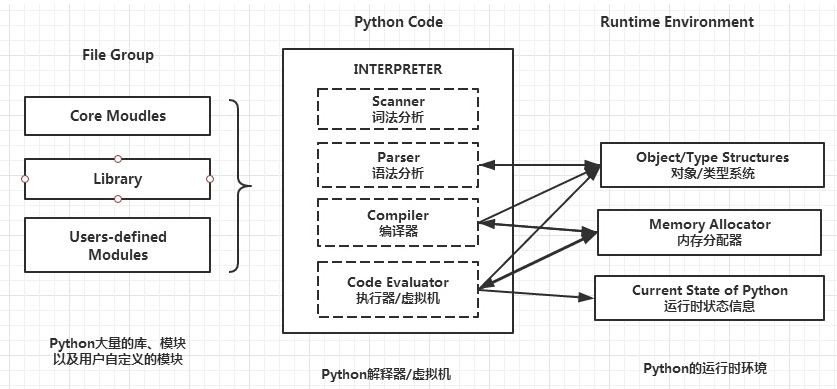

# 【Python】基础知识

* [基础知识](#基础知识)
   * [简介](#简介)
      * [语言类型](#语言类型)
         * [程序执行角度](#程序执行角度)
         * [数据类型角度](#数据类型角度)
      * [解释过程](#解释过程)
      * [解释器](#解释器)
      * [编程范式](#编程范式)
      * [优缺点](#优缺点)
      * [应用领域](#应用领域)
      * [版本和安装使用](#版本和安装使用)
      * [其他注意](#其他注意)
   * [基础语法](#基础语法)
      * [代码格式](#代码格式)
      * [字符编码](#字符编码)
      * [变量](#变量)
      * [命名空间和作用域](#命名空间和作用域)
      * [内存管理](#内存管理)
      * [注释](#注释)
      * [类型提示](#类型提示)
      * [模块和包](#模块和包)
      * [流程控制](#流程控制)
   * [数据类型](#数据类型)
      * [类型分类](#类型分类)
      * [运算](#运算)
         * [返回数值](#返回数值)
         * [返回布尔值](#返回布尔值)
      * [运算优先级](#运算优先级)
      * [序列](#序列)
         * [字符串](#字符串)
         * [列表](#列表)
         * [元祖](#元祖)
      * [字典](#字典)
      * [集合](#集合)
   * [输入输出](#输入输出)
      * [标准输入输出](#标准输入输出)
      * [读写文件](#读写文件)
   * [功能对象](#功能对象)
      * [函数](#函数)
         * [复杂函数](#复杂函数)
         * [内置函数](#内置函数)
      * [装饰器](#装饰器)
      * [生成器](#生成器)
      * [迭代器](#迭代器)
   * [测试](#测试)
      * [性能测试](#性能测试)
         * [timeit](#timeit)
         * [cProfile](#cprofile)
         * [flameprof](#flameprof)
         * [line_profiler](#line_profiler)
         * [memory_profiler](#memory_profiler)
      * [功能测试](#功能测试)
         * [unittest](#unittest)
         * [pytest](#pytest)
         * [doctest](#doctest)

## 简介
Python 是一门以 **优雅、明确、简单** 为设计哲学的编程语言

[官方网站](https://www.Python.org/) 、[官方中文文档](https://docs.Python.org/zh-cn/3/) 和 [简明教程](https://bop.mol.uno/)

### 语言类型
Python 是一门 **解释型的**、**动态类型的**、**强类型定义的** 编程语言

编程语言分类方式：
- 从程序执行角度，分为编译型语言和解释型语言，还有特殊的混合型语言
- 从数据类型角度，分为动态类型语言和静态类型语言、强类型定义语言和弱类型语言

#### 程序执行角度
编译器和解释器的区别：
- 编译器：用于源代码编译，即把源代码中的所有语句全部转化为机器码后，保存为可执行的二进制文件

- 解释器：用于源代码解释，即把源代码中的所有语句逐条转化为机器码并交给计算机执行

编译型语言和解释型语言的区别：


- 编译型语言：用编译器进行源代码编译得到可执行的机器码二进制文件，通过执行该文件来执行程序
    - 优点：
        - 执行效率较高，一次编译多次执行，并且编译器会有预编译过程来对代码进行检查和优化
        - 批量部署较简单，程序执行不依赖编译器，即不依赖语言环境，在一个平台上完成编译，就能对该平台的所有机器进行批量部署
    - 缺点：
        - 版本迭代较复杂，代码修改后需要重新编译
        - 跨平台性较差，因为代码编译时是根据操作系统来生成机器码的，所以需要在不同平台下重新编译

- 解释型语言：通过用解释器进行源代码解释来执行程序，代表有 
    - 优点：
        - 版本迭代较简单，代码修改后直接重启程序即可
        - 跨平台性较强，任何平台只要安装了解释器，就可以直接执行程序
    - 缺点：
        - 执行效率较低，每次执行都需要进行解释
        - 批量部署较复杂，因为程序执行依赖解释器，即依赖语言环境，所以无论是否跨平台，都需要先批量安装解释器

典型编程语言的分类：

| 分类 | 语言 |
| --- | --- |
| 编译型语言 | C、C++、GoLang |
| 解释型语言 | Python、PHP、Ruby、Shell、JavaScript、Perl |
| 混合型语言 | Java、C# |

随着设计技术与硬件的不断发展，两者语言的界限逐渐变得模糊，混合型语言同时包含两者特点，既保留了高抽象、跨平台性强的特点，又在执行前完成了大部分的编译工作，提供执行效率

Java 源代码必须先通过编译器进行编译，得到介于源代码和机器码之间的中间码，也称为 Java 字节码，然后这些中间码可以跨平台地通过 JVM（Java 虚拟机，可以视为 Java 解释器）进行引入了 JIT 动态编译的解释执行，更加接近解释型语言

C# 则必须先先通过编译器进行编译得到中间码，也称为 .NET 字节码，然后再通过 .NET 虚拟机（可以视为 .NET 解释器）进行解释执行，但由于这些中间码更接近机器码，因此跨平台性比较弱，更加接近编译型语言

#### 数据类型角度
动态类型语言和静态类型语言的区别：
- 动态类型语言：在执行期间才会做数据类型检查，也就是说，不用给任何变量声明数据类型，在给该变量赋值给时，语言会自动为变量指定数据类型

- 静态类型语言：在编译过程就会做数据类型检查，也就是说，在给任何变量赋值之前，就要先声明该变量的数据类型

- 动态类型语言为实际编程带来了很大的灵活性，允许只关注变量的行为，而不关注其本身，但程序执行时容易发生与数据类型相关的错误，静态类型语言则相反

强类型定义语言和弱类型语言的区别：
- 强类型定义语言：又称类型安全语言，数据类型被强制定义，也就是说，一个变量被指定了某个数据类型，如果不经过强制转换，那么该变量就永远是这个数据类型

- 弱类型定义语言：又称类型不安全语言，数据类型可以被忽略，也就是说，一个变量被指定了某个数据类型，该变量的数据类型，会根据其执行上下文的变化自动进行转换

- 强类型定义语言在执行速度上可能略逊色于弱类型定义语言，但强类型定义语言带来的数据类型严谨性能够有效地避免许多错误

典型编程语言的分类：

|  | 动态类型语言 | 静态类型语言 |
| --- | --- | --- |
| 强类型定义语言 | Python、Ruby | Java、Golang、C# |
| 弱类型定义语言 | PHP、Shell、JavaScript、Perl  | C、C++ |

对于一门编程语言，是动态类型语言还是静态类型语言，是强类型定义语言还是弱类型定义语言，两个分类直接没有关系，是相互独立的

### 解释过程
Python 解释器组成和解释过程：



解释器与对象/系统类型、内存分配器之间的箭头表示使用，而与运行时状态信息之间的箭头表示修改，即 Python 程序在执行过程中会不断修改当前解释器程序的状态

Python 是解释型语言，从解释器外部看，其源文件是通过解释器进行解释执行的，从解释器内部看，解释器包括了用于编译的编译器和用于解释的虚拟机，实际解释过程是先编译再解释的，类似于混合型语言，但编译结果不一定会被保存，而且完成的编译程度比较低

Python 子节码是在解释器内的编译结果，也称为中间码，可以跨平台地通过虚拟机进行解释执行，可以被反编译

Python 字节码对象 `PyCodeObject` 是子节码在内存中的表现形式，Python 字节码文件 `.pyc` 是字节码在存储中的表现形式，存放在对应源文件所在目录的`__pycache__` 目录中，用于提高模版的导入速度，Python2.x 会直接保存在源文件所在目录

解释器内部的实际解释过程为：
1. 读取主程序源代码文件，编译得到字节码对象
2. 导入相关依赖模块源代码
    1. 检查是否存在对应的字节码文件
    2. 如存在，且其修改时间晚于模块文件的修改时间，则读取该字节码文件，得到字节码对象
    3. 如不存在，或其修改时间早于模块文件的修改时间，则读取该模块源代码文件，编译得到字节码对象
3. 通过虚拟机对字节码对象进行解释执行
4. 执行结束后，对于通过读取模块源代码文件进行导入的模块，则对其字节码对象进行保存为更新到存储中

### 解释器
Python 程序允许通过多种不同的解释器来执行，其中主要有：

- **CPython**：基于 C 开发的官方解释器，是目前使用最广泛的解释器

  [下载地址](https://www.Python.org/downloads/)

- **IPython**：基于 CPython 的交互式解释器，支持 bash shell、自动补全，自动缩进，记录历史输入等功能

  `pip3 install iPython` 进行安装 

- **PyPy**： 基于 RPython 开发的解释器，并在解释执行时引入了 JIT 即时编译，执行速度很快，但不是对所有的库都支持

  PyPy 项目分为两部分，一是 RPython 开发的解释器，二是 Python 开发的 RPython 编译工具链

  RPython 是能被静态编译的 Python 限制子集，它限制了 Python 中关于类型动态变化的部分，而 RPython 编译工具链就是 RPython 的编译器，可以对 RPython 代码进行类型推导，翻译为可被编译的低级别语言，如 C、或者可在 Java 和 .NET 虚拟机上运行的高级别字节码，进而完成编译

  RPython 还有一种定义就是能被 RPython 编译工具链接受的 Python 部分，Pypy 也常被称为基于 Python 实现的解释器
  
  Pypy 中的引入 JIT 即时编译的解释过程：
  - 先对 Python 字节码对象进行解释执行
  - 对一些被经常解释执行的字节码进行标识
  - 将这些字节码进行编译得到机器码，并缓存结果
  - 当同样的字节码再次被解释执行时，则从缓存结果中取得对应机器码来执行，以优化循环和重复代码的执行速度
  
  [下载地址](http://pypy.org/download.html)

- **Jython**：基于 Java 开发的解释器，可以将源代码转化为中间码，再通过 JVM 解释执行，而且不仅提供了还有 Java 平台相关的支持

  [下载地址](https://www.jython.org/download)

- **IronPython**：基于 C# 开发的解释器，可以将源代码转化为中间码，再通过 .Net 虚拟机解释执行，而且不仅提供了还有 .NET 平台相关的支持

  [下载地址](https://ironPython.net)

要使用 Java 或 .Net 相关的支持，最好的办法不是用 Jython 或 IronPython 解释器，而是通过网络调用来实现，来确保各个不同功能的程序的独立性

### 编程范式
Python 是一门 **面向对象的** 编程语言

编程范式根据不同编程方式的特点进行了分类，代表了对于问题的不同解决思路，大多数编程语言只支持一种编程范式，其中主要分为面向过程编程和面向对象编程：

- **面向过程编程**，又称 **POP（Procedural-Oriented Programming）**：将程序要解决的大问题，分解成要解决的多个小问题，再得出能解决这些问题的步骤，一步步地从上到下执行，从而实现程序的功能

  执行性能高，开发速度快，适合开发功能简单的、一次性使用的程序
  
- **面向对象编程**，又称 **OOP（Object-Oriented Programming）**：利用类来描述抽象的事物，管理什么样东西能做什么事，利用对象来描述具体的事物，管理哪个东西要做什么事，从而实现程序的功能
  
  结构更灵活，更容易维护、复用和扩展，适合开发功能复杂、多人协作、持续维护和迭代的程序
  
### 优缺点
Python 的优点：
- 简单易懂：语法简洁，代码可读性高

- 开发效率高：拥有非常强大的标准库和第三方库，可以避免重复造轮子，减少开发周期

- 高级语言：无需考虑关于内存管理、指针计算等底层细节

- 跨平台性：由于解释器开源，已经被移植到了大多数的平台上，Python 程序也可以在这些平台上执行

- 可扩展性：可以通过动态链接库或扩展模块的形式，将部分功能通过 C、C++ 来实现，然后 Python 对其进行调用以扩展功能，也可以通过其他方式调用其他语言

- 可嵌入性：可以使用 Python 为 C、C++ 程序提供脚本接口来嵌入功能，也可以通过其他方式被其他语言调用

Python 的缺点：
- 执行速度慢，相对编译型语言和混合型语言来说会比较慢

- 源代码无法保密：由于是解释性语言，源代码对于使用者是公开的

- 多线程无法利用多核 cpu：官方解释器 CPython 由于 GIL 的存在所导致（IronPython、Jython 则不存在 GIL）

### 应用领域
Python 有许多成熟且擅长的应用领域

| 领域 | 典型项目 |
| --- | --- |
| WEB 开发 | `Django`、`Flask`、`Tornado` |
| 网络编程 | `Twisted`、`Requests`、`Scrapy`、`Paramiko` |
| 科学计算 | `Numpy`、`Pandas`、`Scipy`、`Matplotlib` |
| 人工智能 | `Sklearn`、`PyTorch`、`tensorflow` |
| 运维自动化 | `OpenStack`、`SaltStack`、`Ansible` |
| GUI 开发 | `wxPython`、`PyQT`、`Kivy` |

### 版本和安装使用
Python 目前生产中有两个系列的版本并存，分别是 Python 2.x 和 Python 3.x

- Python 2.x 是过去的版本，解释器名为 Python，包管理器名为 pip
- Python 3.x是现在和未来的版本，解释器名为 Python3，包管理器名为 pip3

Python 3.x 对比 Python 2.x 有较大的升级，为了不带入过多的累赘，因此在设计时并没有考虑向下兼容，导致许多用早期 Python 2.x 版本的程序都无法在 Python 3.x 解释器上正常运行

为了兼顾这些程序，官方提供了一个过渡版本 Python 2.6，该版本基本使用了 Python 2.x 的语法和库，但同时允许使用部分 Python 3.0 的语法与函数，后续其推出升级版本的 Python 2.7 被确定为 Python 2.x 的最后一个版本，2020 年后不再维护

目前编写的 Python 程序时都应该使用 Python 3.x 的语法，因此以下的基础知识都是基于 Python 3.x 的

CentOS 下的快速安装命令：

``` bash
tmp_dir='/app/package'
# 常用版本有 3.6.9、3.7.5、3.8.0
pkg_version='3.8.0'

yum -y install wget gcc bzip2-devel openssl-devel zlib-devel jpeg-devel ncurses-devel sqlite-devel readline-devel tk-devel libffi-devel xz-devel
mkdir -p ${tmp_dir}
cd ${tmp_dir}
wget "https://www.Python.org/ftp/Python/${pkg_version}/Python-${pkg_version}.tgz"
tar -zxf Python-${pkg_version}.tgz
cd Python-${pkg_version}
./configure
make
make install
```

虚拟环境的安装和使用：

``` bash
pip3 install virtualenv

# 创建指定的虚拟环境目录
virtualenv ./venv
# -p '/usr/bin/Python3' 表示指定 Python 解释器

# 激活环境
. ./venv/bin/active

# 退出环境
deactive
```

虚拟环境目录内包括以下目录：
- bin 目录：包含了开启虚拟环境和一些在虚拟环境中可用的命令
- incloud 目录：包含了虚拟环境中的头文件，以及Python 的头文件
- lib 目录：包含了标准库和在 `site-packages` 中的第三方库

如果编写的是 Python 脚本，则在脚本首行需要增加脚本幻数：
- `#!/usr/bin/Python`，表示指定操作系统执行该脚本时需要调用的解释器
- `#!/usr/bin/env Python`，表示指定操作系统执行该脚本时，在 env 的环境变量中查找指定命令，得到需要调用的解释器，可以为了防止 Python 没有安装在固定的路径

### 其他注意
MacOS 环境下的 Python 3.6 以上需要自行安装 ssl 证书，否则会进行 https 请求时出现以下错误：

```
[SSL: CERTIFICATE_VERIFY_FAILED] unable to get local issuer certificate (_ssl.c:1076)
```

在 `/Applications/Python\ 3.7/ReadMe.rtf` 中有相关说明，执行 `/Applications/Python\ 3.7/Install\ Certificates.command` 可自动安装

## 基础语法
### 代码格式
- 强制缩进，缩进作为语法的一部分，最高级的代码是顶格没有锁进的，同级的代码缩进要一致，且越低级的代码缩进越多

> 在 linux 中每个缩进（tab）的大小为 8 个空格，在 windows 中每个缩进（tab）的大小只有 4 个空格

- 物理行中使用 `;` 表示逻辑行的结束，每个物理行只写一个逻辑行则不需要使用

- 物理行末使用 `\` 表示表示逻辑行未结束，紧接的物理行内容也属于当前逻辑行

- `pass` 表示一个空的语句块，用于：
    - 使函数、流程控制中出现无处理但成功执行
    - 预留代码位置以后补充编写
    - 在父类中进行方法定义由子类进行覆写

### 字符编码
字符集是多个字符的集合，字符编码是各个字符映射为字节串的规则，字节或字节序列是即二进制数值，便于计算机进行存储、传输和识别

通常特定的字符集一对一地采用了特定的字符编码，如 ASCII、IOS-8859-1、GB2312、GBK 既表示了字符集又表示了对应的字符编码，但 Unicode 只表示字符集，它可以采用多种不同的字符编码

根据字符编码，将字符转化为字节串的过程称为编码（Encode），相反地将字节串转化为字符的过程称为解码（Decode）

常见的字符集：
- ASCII
    - 码位占1字节，即8位，最多表示256个字符，编码后占1字节，即8位

- Unicode
    - 码位占 4 个字节，即 32 位，但目前大部分字符只用 2 个字节就可以表示，高位的2个字节全部是0，因此 Unicode 区分为 UCS-4 和 UCS-2 两种字符集，前者最多表示 1114111 个字符，后者最多表示 65536 个字符，Python 使用的是前者
    
    - 可采用多种字符编码，最常用 utf-8 字符编码，
        - utf8，编码后占1～4字节，即8～32位，其中英文1字节，中文3字节，复杂汉字4字节
        
        - utf-32，编码后占4字节，即32位，易于解码，但存储和传输效率低，不常用
        - utf-16，编码后占2字节或4字节，即16或32位，固定了大部分字符编码后为2字节，复杂字符占4字节，不常用
    - 可变长度的字符编码，解码时是通过判断其高位的值来确定以多少字节的数值来表示该字符的

字符串中的元素是 Unicode 字符，字节串中的元素是 ASCII 字符，其中 Unicode 字符包含了 ASCII 字符

在 Python2.x 中，字符串对象内部为 `u'字节串'`，因此输出结果也会是 ASCII 字符，于是解释器读取 Python 文件时默认使用 ASCII 字符编码，因此当文件内容含中文时，则需要定义字符编码为 utf-8，在文件内加入以下内容：

``` py
#_*_coding:utf-8_*_

# 或者

#coding=utf-8
```

在 Python3.x 中，严格区分了字符串类型 `str` 和字节串类型 `bytes`，解释器读取 Python 文件时默认使用 utf-8 字符编码，不需要再在文件内进行定义编码类型

字符串对象内部为 `'字符串'`，字节串对象内部为 `b'字节串'`，两者的输出结果分别是 Unicode 字符和 ASCII 字符

字符串对象通过编码（Encode）转化为字节串对象，而 字节串对象通过解码（Decode）转化为字符串对象，两种类型不能混用：


```
>>> name = '你'   
>>>print(type(name))
<class 'str'>
>>> name
'你'	
>>>name.encode('utf-8')
b'\xe4\xbd\xa0'  # \xe4 是一个字节，\x 表示16进制
>>>name.encode('gbk')
b'\xc4\xe3'
>>>print(type(name.encode('utf-8')))
<class 'bytes'>
```

### 变量
在 Python 中一切皆是对象，对象有以下三个要素：
- 标识（ID）：对象所占用的内存地址
- 类型（Type）：对象的所属类型
- 值（Value）：对象的实际值

Python 是动态语言，变量本身是没有类型且不能独立存在的，因此变量不需要声明，而是直接通过赋值语句来进行变量赋值，从而完成创建

``` py
# 单变量赋值
var1 = 'str1'

# 多个变量赋值相同对象
var1 = var2 = var3 = 'str1'

# 多个变量赋值不同对象，通过列表或元祖来组织多个赋值目标对象
var1, var2, var3 = ['hehe', 'haha', 'hihi']
var1, var2, var3 = ('hehe', 'haha', 'hihi')
# 通过 `,` 连接来组织多个赋值目标对象，也表示为元祖
var1, var2, var3 = 'hehe', 'haha', 'hihi'

# 根据条件来赋值不同对象
# var1 == 'str1' 条件为真，则赋值为 'str2'，否则赋值为 'str1'
var2 = 'str2' if var1 == 'str1' else 'str1'
```

无论通过变量赋值进行变量创建还是变量修改，其作用总是使变量成为对象的引用，而不是复制对象，因此可以将变量本身类比没有类型的指针，每个变量只能作为一个对象的引用


在完成变量赋值后，也就是变量成为了对象的引用后，变量的标识就是所引用对象的内存地址，变量的类型就是所引用对象的所属类型，变量值就是所引用对象的实际值，变量本身则可被看作一个没有类型的指针

对于赋值的目标对象，可以是新建的对象，即对象不存在引用，也可以是通过变量来引用已存在的对象，即对象存在至少一个引用

允许多个变量同时成为同一个对象的引用，可以通过这些变量的任一变量都可以访问到该对象

函数、类、模块也是对象，成为它们的引用的变量，分别被称为函数名、类名、模块名，因此函数定义、类定义和模块导入语句，本质上都是特殊的赋值语句，同样是完成了变量赋值

改变一个变量的值，可以有以下两种操作：
- 对变量重新赋值，使变量成为另一个对象的引用
- 对变量的所引用对象是可变类型，则可以对其值进行操作，如对列表对象进行元素追加、删除

变量的命名规范：
- 由字母、数字、下划线组成，且首字符不允许是数字
- 大小写敏感
- 不能使用 Python 内置的关键字，如 `if`、`while`、`global` 等
- 约定俗成，使用大写表示常量，即程序执行中不会改动的变量，而小写表示普通变量
- 约定俗成，类名的通过大驼峰来连接，如 `FirstName`，其他变量则通过下划线来连接，如 `first_name`

判断字符串中的内容是否符合变量命名规范：
``` py
'var_name'.isidentifier()
```

`del var1` 删除变量，对于可变类型的对象，可以用于删除元素，如 `del list[key]`、`del dict[key]`，对于不可变类型的对象则不可以

### 命名空间和作用域
命名空间是一个映射，维护了变量和对象的引用关系，可以看作为一个包含在该命名空间中 **变量-对象** 的字典，命名空间有创建时间和生存周期，在程序运行期间会同时存在多个命名空间，但互相独立，没有任何关系

命名空间的类型：


- Local（局部命名空间）：每个函数所拥用的，包括函数中所声明的局部变量，函数调用时被创建，结束时删除
- Global（全局命名空间）：程序所拥有的，包括最外层代码中声明的全局变量，文件执行时被创建，结束时删除
- Built-in（内置命名空间）：包括所有内置变量，解释器启动时创建，退出时删除

作用域是一块 Python 代码的文本区域，是针对命名空间和变量而言的，指的是它们的可应用范围，也就是它们的可见性

在其他语言中，一般是以块级代码来区分作用域，但在Python 中是以函数来区分作用域，可分为以下类型：


- Local（局部作用域）：在最内层的函数内部
- Enclosing	（嵌套作用域）：在嵌套函数中的外层函数内部，可以不存在或存在多个嵌套作用域
- Global	（全局作用域）：在整个文件
- Built-in（内置作用域）：在整个解释器环境

> 以上四个作用域从上到下越来越大，根据变量的所处位置，查找的优先级也是从上到下进行（称为 LEGB 规则）

作用域和命名空间的关系：
- 作用域是静态的，而命名空间是动态的，在执行中产生
- 一个作用域中可以访问到多个对应的命名空间
- 变量按照一定规则在静态的作用域中查找，在执行中可以动态地看作，变量在所在作用域的可访问命名空间按一定层次叠加的命名空间中查找

在一个作用域内，变量的定义不能滞后于使用，因为在代码未正式执行前，解释器根据代码结构和其中的赋值语句，就已经形成了作用域和作用域链，作用域链是指根据每个变量的作用域查找顺序，分别确定所处的作用域

下面代码会报错，由于这个原因 Python 无法支持重新为外层变量赋值的闭包：
``` py
# 变量 b 使用时，应该查找的作用域被确定在 a 函数中，但执行时未能在 a 函数中找到该变量
b = '111'
def a():
   print(b)
   b = '222'
a()

# 以下实现的闭包执行时会报错
def wrapper():
    i = 0
    def package():
        print(i)
        i += 1
    return package
p = wrapper()
p()

# Python 中的闭包应该这样实现：
def wrapper():
    i = []
    def package():
        print(len(i))
        i.append(1)
    return package
p = wrapper()
p()
```

### 内存管理
由于每个对象需要一块内存空间来保存其信息，因此每次创建对象，Python 都会通过内存分配系统，向操作系统请求内存并为该对象分配一块内存空间

内存分配系统中存在一个对象缓存机制，使得为已缓存对象建立的所有引用，都引用了同一个对象，从而以节约多次内存分配和回收的开销，缓存的对象有以下几种：
- 位于 `[-5,256]` 的小整数对象，程序启动时就常驻的
``` py
v1 = 256
v2 = 255 + 1
print(id(v1) == id(v2)) # True
v3 = 257
v4 = 256 + 1
print(id(v3) == id(v4)) # False
```

- 通过定义值来创建过的整数对象，会被 Intern 机制加入缓存池
``` py
v1 = 20000
v2 = 20000
print(id(v1) == id(v2)) # True
v3 = 19999 + 1
print(id(v2) == id(v3)) # False
```

- 通过定义值来创建过的字符串对象，会被 Intern 机制加入缓存池
``` py
v1 = 'a'
v2 = 'a'
print(id(v1) == id(v2)) # True
v3 = 'abcdefghijklmnopqrstuvw'
v4 = 'abcdefghijklmnopqrstuvw'
print(id(v3) == id(v4)) # True
```

- 通过拼接来创建过的，长度不大于 20 的字符串对象，会被 Intern 机制加入缓存池
``` py
v1 = 'abcdefghijklmnopqrst'
v2 = 'abcdefghijklmnopqrs' + 't'
print(len(v1)) # 20
print(id(v1) == id(v2)) # True
v3 = 'abcdefghijklmnopqrstu'
v4 = 'abcdefghijklmnopqrst' + 'u'
print(len(v3)) # 21
print(id(v3) == id(v4)) # False
```

**垃圾收集**

后续不会再被使用的对象又称为垃圾对象，对于垃圾对象所占的内存空间，Python 依靠垃圾收集系统（Garbage Collection, GC）来进行自动回收，其采用的回收策略是：
- 以引用计数机制为主
- 以标记-清除机制和分代收集机制为辅

引用计数机制：一旦某个对象的引用计数为 0，即不存在引用时，该对象所占的内存空间就会被立即回收

要保证一个对象后续能被继续访问，就要通过赋值语句使得至少存在一个引用

其优点是：能够实时垃圾回收，不像其他机制则需要通过某些特定条件来触发垃圾回收，如此一来将垃圾回收需要的总消耗时间进行了分摊

但其存在以下缺点：
- 维护引用计数消耗资源
- 无法回收存在循环引用对象，导致内存泄露

标记-清除机制：每次执行垃圾回收，先遍历所有对象进行垃圾检测并标记垃圾对象，然后回收这些垃圾对象

其主要是用来解决引用计数机制无法回收存在循环引用的对象的问题，每次执行垃圾回收，gc 会遍历各代列表中每个对象，检查出存在循环引用的对象，若根据规则减掉其引用计数后的结果为 0，则记为垃圾对象，然后回收这些垃圾对象

存在缺点：在执行垃圾回收的过程中，程序会被暂停直到垃圾回收结束

分代收集机制：假设存活越久的对象，越不可能在后续变成垃圾对象，将所有对象根据其存活时间划分为不同的集合，每一个集合就成为一个代，使存活越久的对象进行越少次垃圾检测

其主要是用来减少标记-清除机制导致的程序暂停时间，Python 通过 0、1、2 代三个列表定义了三个代，当某个代的对象经历过回收后依然存活，那么 gc 就会把它归入下一代，当某个代触发垃圾回收，在其之前的代也会被触发垃圾回收

对于标记-清除机制和分代收集机制，存在三种触发垃圾回收的情况：
- 主动调用触发

``` py
import gc

# 设置 generation 为 0、1、2，对指定代触发垃圾回收# 不设置 generation，则对全部代触发垃圾回收
gc.collect(generation=None)
```

- 某个代达到阈值

``` py
import gc
# 每个代的判断值是：从上次垃圾回收以来，创建对象数目和回收对象数目的差值

# 返回包含 0、1、2 代对应阈值的元祖
gc.get_threshold()

# 设置 0、1、2 代的对应阈值
gc.set_threshold(threshold0, threshold1, threshold2)
```
- 程序退出

### 注释
单行注释：会被直接忽略，用于在任何位置进行注释
``` py
# 可以独占一行进行注释

print('ok') # 可以进阶代码进行注释
```

多行注释：本质上是未建立引用的字符串对象，在执行时才被忽略
``` py
"""
这是多行注释之行 1
这是多行注释之行 2
这是多行注释之行 3
""" 

'''
这是多行注释之行 1
这是多行注释之行 2
这是多行注释之行 3
'''
```
`""""""`  和 `''''''`  在使用上并无区别，主要作用能相互对包含 `"` 或 `'` 的内容进行扩住

用于对函数、类或方法进行注释，并且对于函数、类或方法的定义语句，在其下方创建的字符串对象会成为定义对象的 `__doc__` 属性

``` py
def func_name(arg):
    """
    func_name.__doc__
    函数的注释
    :param arg: 参数的注释
    :return: 返回的注释
    """
    pass
    
class ClassName:
    """
    ClassName.__doc__
    类的注释
    """

    def method_name(self, arg):
        """
        ClassName.method_name.__doc__
        方法的注释
        :param arg: 参数的注释
        :return: 返回的注释
        """
        pass
```

### 类型提示
Python 3.5 以后引入了类型提示，可以对函数、方法的参数和返回的类型进行注释，来供 IDE 和各种开发工具使用，以及增加代码可读性，[官方文档](https://docs.python.org/zh-cn/3/library/typing.html)

``` py
# 位置参数、关键字参数的类型提示
def str_count(s: str, strip: bool = False) -> int:
    if strip:
        return len(s.strip())
    else:
        return len(s)

# 不限长参数的类型提示，所提示仍然是实参类型
def str_count(*args: str, **kwargs: bool) -> int:
    if kwargs.get('strip'):
        return len(args[0].strip())
    else:
        return len(args[0])
```

用于注释的类型可以是内置类型，也可以是自定义类型，或者通过 `typing` 库来描述出更更灵活类型

``` py
from typing import (Any, List, Tuple, 
                    Dict, Optional, Iterable,
                    AnyStr, BinaryIO)

# 任何类型
Any

# 包含 int 的 list
List[int]

# 包含指定个 str 的 tuple
Tuple[str, ...]

# key 为 str，value 为 int 的 dict
Dict[str, int]

# 可选的（即可为 None的）包含 int 的 list
Optional[List[int]]

# 包含 int 的可迭代对象
Iterable[int]

# 可以为 str 或 bytes
Union[str, bytes]

# 可以为 str 或 bytes
AnyStr

# 二进制 IO 对象，如 file 文件对象
BinaryIO

# 定义类型别名
Squeue = Union[str, list, tuple]

# 使用泛型进行函数定义
```

在 Python 3.12 后，可以使用类型参数来表示泛型函数和泛型类，并且类型参数可被约束的：
``` py
def first[T](l: List[T]) -> T:
    return l[0]

# 具有限制时至少要两个类型以上，否则等同于 type 定义
class MyClass[T: Optional[str, int]]:
    def __init__(v: T):
        pass

# 通过 TypeVar 直接声明类型参数
from typing import TypeVar
U = TypeVar('U')
def first(l: List[U]) -> U:
    return l[0]

# 具有限制时至少要两个类型以上
U = TypeVar('U', str, int)
class MyClass:
    def __init__(v: U):
        pass
```

通过函数、方法的 `__annotations__` 属性，可以查询到其类型提示的内容

类型提升中若使用了尚未定义的类型，会出现报错，在 Python 3.7 后，可以使在文件首行导入以下内容，使类型提示的代码得到延迟解析
``` Python
from __future__ import annotations
```

### 模块和包
在 Python 中，模块是一个基于文件来组织 Python 代码的对象，其本质是一个代码文件，程序可以通过模块，来对各个代码文件中实现的功能进行扩展调用

包是一种特殊的模块，是基于目录来组织模块（Python 代码文件）的对象，其本质是一个包含`__init__.py` 文件以及其他模块（Python 代码文件）的目录，程序可以通过包，来对组织了多个模块的功能进行扩展调用，称为普通包

在 Python 3.3 后，允许包的对应目录中不存在 `__init__.py` 文件，称为命名空间包程序可以通过命名空间包，来导入目录分散的多个模块

比如项目的目录结构：

  ```
   |-foo-package/
         |-spam/
             |-blah.py
   |-bar-package/
         |-spam/
             |-grok.py
  ```

利用 `spam` 命名空间包将两个同名目录中的模块了合并到了一个包中     
   ``` py
import sys
sys.path.extend(['foo-package', 'bar-package'])
import spam.blah
import spam.grok
   ```

模块导入：
``` Python
# 导入单个模块
import module

# 导入多个模块
import module1, module2, module3

# 从包中导入模块
from package import module

# 从模块中导入变量，包括类、函数
from module import var, Class

# 从模块中导入所有暴露的变量
from module import *

# 对导入目标进行别名，简化调用命令，或者避免目标名字冲突
import module as md
from module import Class as Cls
```

包导入：
``` py
# 导入包
import package

# 从包中导入包
from package import package

# 从包中导入变量，包括类、函数
from package import var, Class

# 从包中导入所有暴露的变量
from package import *
```

包和模块的路径可以是名字或层次结构，层级结构是以 `.` 来连接表示的，通过层级结构可以搜索到层级较深的包和模块

在导入语句中，在 `from` 后的路径是来源，在 `import` 后的路径或变量是目标，可根据来源分为两种导入方式：
- 绝对导入：来源使用绝对路径
- 相对导入：来源使用相对路径，使用 `.` 表示当前包，`..` 表示上级包

由于相对路径中的 `.` 或 `..`，导入语句是基于所在代码文件的 `__name__` 来解析得到的，因此相对导入需要正常执行，则要满足两个条件：
- 相对导入只能用于被作为模块导入的代码文件中
- `.` 或 `..` 表示的包不能超过所在代码文件的 `__name__` 的最顶级包，比如当前代码文件的 `__name__` 为 `pkg.mdl`，则只能使用 `.` 不能使用 `..`

相对路径的使用场景：
- 在包的 `__init__.py` 文件中，导入目录中所有模块的变量，程序可以导入包来调用所有模块
- 在只作为模块的代码文件中，再通过导入其他模块的变量以实现功能，程序可以只导入该模块来调用此功能，

导入语句的执行过程：
- 当来源不存在时，目标只能是路径，并且可以使用层级结构，导入语句会先搜索到目标层级结构最顶级的包，然后从左到右依次导入各个包或模块

- 当来源存在时，来源可以使用层级结构，目标只能是变量或一级路径，导入语句会先搜索到来源层级结构最顶级的包，然后从左到右依次执行各个包或模块，最后导入目标的包或模块或变量

包和模块的搜索过程：从左到右依次在 `sys.path` 列表中的目录中，搜索对应名字的包和模块，直到得到首个搜索结果，`sys.path` 列表中包括以下目录，优先级从上到下：
- 执行文件的所在目录
- `PythonPATH` 环境变量设置的目录
- 解释器的标准库目录
- 解释器的 `site-packages` 第三方库目录
- `site-packages` 第三方库中的 `.pth` 文件内容，一行一个目录路径

新增包和模块的搜索目录：
- 通过修改 `sys.path`

  ``` py
  import sys
sys.path.append(new_dir)
  ```
- 通过修改 `PythonPATH` 环境变量
 ``` bash
export PythonPATH=${PythonPATH}:new_dir
 ```
- 通过增加 `.pth` 文件到 `site-packages` 第三方库中，一行一个目录路径

包和模块的执行本质：
- 普通包是执行对应目录的 `__init__.py` 文件
- 命名空间包是不进行任何执行
- 模块是执行对应的代码文件
- 即使痛一个包和模块被多条导入语句进行多次执行，也只有首次才会真正起作用

包和模块的导入过程：
- 对于包和模块执行后存在的每个变量，先创建一个模块对象，然后赋值给该模块对象的同名属性
- 将该模块对象赋值给包或模块同名的变量，若定义了别名，则赋值给别名变量

变量的导入过程：
- 对于包和模块执行后存在的需要导出的变量，赋值给同名变量
- 若定义了别名，则赋值给别名变量

可以通过在代码文件中设置 `__all__` 变量，表示该代码文件被作为导入语句所执行时，对外暴露的变量
``` py
__all__ = [
    "func1", "func2", "var1",
    "var2", "Class1", "Class2"
]
```

代码文件中的 `__name__` 变量，当代码文件被作为主程序执行时，其值为 `'__main__'`，当代码文件被作为模块导入时，其值为模块路径，可以区别文件代码被执行的方式

用于定义在代码文件被作为主程序执行时，才被执行的代码，防止代码文件被作为模块导入时执行： 
``` py
if __name__ == '__main__':
	pass
```

代码文件中的 `__file__` 变量，其值执行该代码文件时所用的绝对路径或相对路径，由于命名空间包导入时不需要执行文件，因此命名空间包对象不包含 `__file__` 属性

导入语句会为表示包的模块对象设置 `__path__` 属性，其值为包所对应的目录路径，若是命名空间包还可以包含多个目录路径，而模块则不包含该属性

依赖库安装：
``` py
pip install 库名

# 根据依赖库说明文件安装
pip install -r requirements.txt
```

为当前环境生成依赖库说明文件：
``` bash
pip3 freeze > requirements.txt
```

模块动态导入：
``` py
# 1、使用内置函数
# 若 module 是 '模块'，则返回模块对象
# 若 module 是 '包' 或 '包.模块'，则返回包对象
__import__(module)

# 示例：
module = __import__('mod')
module.method()

module = __import__('pkg.mod')
module.mod.method()

# 2、使用 importlib.import_module
# 无论 module 是什么，都直接返回模块对象
from importlib import import_module 
import_module(module)


# 动态加载模块中的类或属性：
def import_string(dotted_path):
    try:
        module_path, class_name = dotted_path.rsplit('.', 1)
    except ValueError as err:
        raise ImportError("%s doesn't look like a module path" % dotted_path) from err

    module = import_module(module_path)

    try:
        return getattr(module, class_name)
    except AttributeError as err:
        raise ImportError('Module "%s" does not define a "%s" attribute/class' % (
            module_path, class_name)
        ) from err
```

### 流程控制
条件控制：
``` py
# condition 一般是条件表达式，若其返回不是布尔对象，会被自动转化为布尔对象
if condition:
    pass
elif condition:
    pass
else:
    pass
```

循环控制：
- 迭代循环

``` py
# iterable 是可迭代对象
for var in iterable:
    pass
else:
    # else 语句块是循环完成后执行的，相当于循环的同级语句
    pass
```

- 条件循环

``` py
# condition 一般是条件表达式，若其返回不是布尔对象，会被自动转化为布尔对象
# condition 可使用 True 实现无限循环
while condition:
    pass
else:
    # else 语句块是循环完成后执行的，相当于循环的同级语句
    pass
```

循环内的控制语句：
- continue：结束当前循环，继续下次循环
- break：结束当前循环，跳出该层循环

若条件语句块、循环语句块中只包含一条命令，则可以将语句和语句块都写在同一行：
``` PY
if True:print(ok)
while True:print(ok)
```

跳出多层循环的技巧：
- 通过标志变量，在多层循环的每层循环开始前，检测该标志变量的值来决定是否跳出当前循环，需要跳出多层循环时先设置标志变量再结束当前循环
  
  使用条件循环时，每层循环可以使用 `while 标志变量条件`
  
``` py
# 迭代循环
flag = True
for i in range(100):
    if not flag:
        break
    for i in range(100):
        if not flag:
            break
        for i in range(100):
            # 跳出多层循环
            flag = False
            break

# 条件循环                     
flag = True
while not flag:
    while not flag:
        while not flag:
            # 跳出多层循环
            flag = False
            break 
```

- 将需退出的多重循环打包成一个函数，跳出多层循环时进行函数返回

``` py
def multi_loop():
    for i in range(100):
        for i in range(100):
            for i in range(100):
                # 跳出多层循环
                return
```

## 数据类型
### 类型分类
按特征来划分：

| 特征 | 数据类型 |
| --- | --- |
| 整数类型 | 整数 `int`、布尔型 `bool`、|
| 非整数类型 | 浮点数 `float`、复数 `complex` |
| 序列类型 | 字符串 `str`、字节串 `bytes`、字节数组 `bytearray`、列表 `list`、元祖 `tuple`、区间 `range` |
| 映射类型 | 字典 `dict` |
| 集合类型 | 可变集合 `set`、不可变集合 `frozenset` |
> 字典被当作序列来处理时，可看作没有顺序、元素为 key 的序列

按可变性来划分

| 可变性| 数据类型 |
| --- | --- |
| 不可变（immutable） 类型 | 整数 `int`、布尔型 `bool`、浮点数 `float`、复数 `complex`、字符串 `str`、字节串 `bytes`、元祖 `tuple`、区间 `range`|
| 可变（mutable）类型 | 列表 `list`、字典 `dict`、可变集合 `set`、字节数组 `bytearray` |

### 运算
#### 返回数值
算术运算：

| 运算符 | 所调对象的特殊方法 | 描述 |
| --- | --- | --- |
| `+` | `__add__(self, other)` | 加 |
| `-` | `__sub__(self, other)` | 减 |
| `*` | `__mul__(self, other)` | 乘 |
| `/` | `__truediv__(self, other)` | 除 |
| `//` | `__floordiv__(self, other)` | 整除 |
| `%` | `__mod__(self, other)` | 取模 |
| `**` | `__sub__(self, other)` | 幂 |
| `()` | - | 括号，优先计算 |

> 运算返回的数据类型，是按照运算因子中数字占位较大的类型，如：
> ```
> >>> 1/3     
>  0
> >>> 1.0/3   
> 0.3333333333333333
> ```

按位运算：

| 运算符 | 所调对象的特殊方法 | 描述 |
| --- | --- | --- |
| `<<` | `__lshift__(self, other)` | 按位左移 |
| `>>` | `__rshift__(self, other)` | 按位右移 |
| `&` | `__and__(self, other)` | 按位与 |
| `|` | `__or__(self, other)` | 按位或 |
| `^` | `__xor__(self, other)` | 按位异或 |
| `~@` | `__invert__(self)` | 按位取反，数值最高位是符号位 |
| `+@` | `__pos__(self)` | 取正，`@` 指对象 |
| `-@` | ` __neg__(self)` | 取负, `@` 指对象 |

> 数值被按位移出最右侧则清空，移出最左侧则进位

赋值运算：

算术运算符或按位运算符接上 `=` 如 `a += 1`、`a >>= 1` 表示运算并赋值，相当于：
```
a = a + 1
a = a >> 1
```

#### 返回布尔值
比较运算：

| 运算符 | 所调对象的特殊方法 | 描述 |
| --- | --- | --- |
| `==` | `__eq__(self, other)` | 等于 |
| `!=` 或 `<>` | `__ne__(self, other)` | 不等于 |
| `>` | `__gt__(self, other)` | 大于 |
| `<` | `__lt__(self, other)` | 小于 |
| `>=` | `__gt__(self, other) or __eq__(self, other)` | 大于等于 |
| `<=` | `__lt__(self, other) or __eq__(self, other)` | 大于等于 |

> 运算 ins1 == ins2 时，内部调用为：ins1.__eq__(ins2)

逻辑运算：

| 运算符 | 作用 |
| --- | --- |
| `and` | 与 |
| `or` | 或 |
| `not` | 非 |

成员运算：

| 运算符 | 所调对象的特殊方法 | 描述 |
| --- | --- | --- |
| `in` | `__contains__(self, other)` | 包含在序列中	 |
| `not in` | `not __contains__(self, other)` | 不包含在序列中 |

身份运算：

| 运算符 | 作用 |
| --- | --- |
| `is` | 引用自同一对象，即引用自同一内存地址 |
| `not is` | 引用自不同对象，，即引用自不同内存地址 |

### 运算优先级
| 运算符 | 描述 |
| --- | --- |
| `**` | 幂 |
| `~@ +@ -@` | 按位反转、取正、取负 |
| `* / % //` | 乘、除、取模、整除 |
| `+ -` | 加、减 |
| `>> <<` | 按位右移、按位左移 |
| `&` | 按位与 |
| `| ^` | 按位或、按位异或 |
| `> < >= <= ` | 大于、小于、大于等于、小于等于 |
| `== !=` | 等于、不等于 |
| `**= += ...` | 赋值运算 |
| `is not is` | 身份运算 |
| `in not in` | 成员运算 |
| `and or not` | 逻辑运算 |

### 序列
序列类型包括：字符串 `str`、字节串 `bytes`、列表 `list`、元祖 `tuple` 、区间 `range`，序列类型拥有一些共同的特性

对于长度为 N 的序列，从左边数，其索引以 0 开始、以 N-1 结束；从右边数，其索引以 -1 开始、以 -N 结束

序列类型有两个主要特性：
- 索引操作符：访问序列中的特定元素

``` py
# 返回序列中指定索引的对应元素
array[index]

# 为序列中指定索引的对应元素重新赋值，只有可变类型的序列支持重新赋值
array[index] = new_value
```
- 切片操作符：获取序列的切片，即子序列或部分序列的浅拷贝

``` py
# 返回索引从 start 到 end 之前的切片，但不包含索引为 end 的元素
array[start:end]

# step 为正数时表示正序切片，为负数时表示倒序切片
# step 是切片根据索引取元素时每次递增的数目，默认是 1
array[start:end:step]

# 正序切片时，省略 start 表示切片从序列头开始，省略 end 表示切片到序列尾结束
# start 和 end 都省略表示切片是完整的序列
array[:end]
array[start:]
array[:]

# 相反地，倒序切片时，省略 start 表示切片从序列尾开始，省略 end 表示切片到序列头结束
# start 和 end 都省略表示切片是完整序列的倒序
array[:end:-1]
array[start::-1]
array[::-1]
```

实例：
``` py
>>>array = [1,2,3,4,5,6,7,8]
>>>array[2:-1]
[3,4,5,6,7]
>>>array[2:-1:3]
[3,6]
>>>array[:3:-1]
[8,7,6,5]
>>>array[::-1]
[8,7,6,5,4,3,2,1]
```

#### 字符串
字符串类型为 str，其对象定义（实例化）为：
``` py
# '' 和 "" 作用是一样的，主要作用是可以相互定义包含对方的字符串，常用是 ''

# 单行定义
s = 'i have "apple" !'

# 多行定义
s = '''aaa
bbb
ccc'''

# 自然字符串，不进行 ascii 转义，常用于正则模式的字符串
s = r'a\nb'
# 如希望通过正则 '\b' 来匹配单词边界，则表示为 '\\b' 或 r'\b'
# 如希望通过正则 '\' 来匹配反斜杠, 则表示为 '\\\\' 或 r'\\'
# 因为普通字符串在进行正则转义之前还会进行 ascii 转义
```

字符串的拼接：
``` py
# 首尾相接
'abc' + 'de'    # 'abcde'

# 字符串重复拼接
'ab' * 3    #   'ababab'

# 变量拼接
var = 'ok'
f'it is {var}!'  # 'it is ok!'
# 以下效果等同
'it is {0}!'.format(var)
'it is {v}!'.format(v=var)
'it is {v}!'.format_map({'v':var})
'it is %s' % var
```

通过 `%` 拼接时，通过占位符进行更复杂的处理：
``` py
# 非字符串对象调用 __str__() 得到的字符串
'%s'

# 非字符串对象调用 __repr__() 得到的字符串
'%r'

# 指定长度的字符串，长度太长时不做处理，长度不足时左侧补空格
# - 表示补空格时从右侧开始
'%7s' % 'hello'     # '  hello'
'%-7s' % 'hello'    # 'hello  '  

# 截取长度的字符串  
'%.2s' % 'hello'     # 'he'
 
# 结合指定长度和截取长度使用
'%7.2s' % 'hello'     # '     he'

# 指定长度的整数，长度太长时不做处理，长度不足时左侧补 0
'%05d' % 33     # '00033'
'%.5d' % 33     # '00033'

# 指定精度的浮点数，.3 表示保留小数点后三位
'%.3f' % 1.4556      # '1.455'
```

常用的方法：
``` py
# 返回去除两边换行符（包括 \r、\n 及其组合）的字符串
# 只去除右边则使用 rstrip、左边则使用 lstrip
'\raaa\n'.strip()   # 'aaa'

# 返回字符串从左向右进行分隔得到的列表
# 默认分隔符为空格和换行符（包括 \r、\n 及其组合），默认最大分隔次数为无限制
# 从右往左分隔则使用 rsplit
'abab'.split('a')   # ['', 'b', 'b']
'abab'.split('a', 1)   # ['', 'bab']

# 返回通过字符串连接字符串列表的所有元素得到的结果
'aa'.join(['xx','vv', 'zz'])    # 'xxaavvaazz'

# join 和 split 搭配去除字符串中的所有空格和换行符
''.join('a\n\na\ra\r\na\n\ra'.split())  # 'aaaaa'  

# 返回字符串从左向右以换行符（包括 \r、\n 和 \r\n）分隔得到的列表
'b\rab\nab\r\nab'.splitlines()  # ['b', 'ab', 'ab', 'ab']

# 返回字符串中寻找到子串的最小索引，可指定寻找的起始和结束索引
# 从右往左寻找则使用 rindex
# 在寻找失败时通过返回 -1 代替触发异常，则使用 find 和 rfind
'ababcabcd'.index('ab')  # 0
'ababcabcd'.index('ab', 1)  # 2
'ababcabcd'.index('ab', 3, 7)   # 5
'ababcabcd'.find('ab', 3, 6)   # -1

# 返回字符串中寻找到子串的次数
'ababcabcd'.count('ab')  # 3

# 返回字符串替换后的结果，可以指定替换的次数
'abcdabcd'.replace('a', 'x')    #'xbcdxbcd'
'abcdabcd'.replace('a', 'x', 1)     #'xbcdabcd'

# 返回保证原字符串在中心，两边添加补充符以达到指定长度的字符串，默认补充符为空格
# 原字符串在左边则使用 ljust，在右边则使用 rjust
# 原字符串在左边且通过 0 补充则使用 zfill
'aa'.center(5)  # '  aa '
'aa'.center(5, '%')  # '%%aa%'
'aa'.ljust(5, '%')  # 'aa%%%'
'3'.zfill(2)    # '03'

# 返回字符串中的字符是否都为数字且非空
# isdecimal、isdigit 识别半角数字、全角数字
# isnumeric 额外识别罗马数字、中文简体数字、中文繁体数字
'1１'.isdecimal()    # True
'1１'.isdigit()    # True
'1１Ⅰ三叁'.isnumeric() # True

# 返回字符串中的字符是否都为字母且非空
# 进为小写字母使用 islower， 仅为大写字母使用 isupper
'abc'.isalpha()     # True
'abc'.islower()     # True
'ABC'.isupper()     # True

# 返回字符串中的字母进行大小写转换后的结果
# 大小写互相转化使用 swapcase
# 首字母大写使用 capitalize
'Aabc11%'.upper()   # 'AABC11%'
'Aabc11%'.lower()   # 'aabc11%'
'Aabc11%'.swapcase()    # 'aABC11%'

# 返回字符串只包含阿拉伯数字和英文字母
# 相当于 isnumeric 且 str.isalpha 的结果
'ItIs1OK叁'.isalnum()    # True

# 返回字符串是否以指定字符串开头
# 以指定字符串结尾则使用 endswith
'abcd'.startswith('ab')  # True

# 返回字符串是每个单词是否仅首字母大写
'It Is OK'.istitle()    # True

# 返回字符串是否都为空格和 Tab
'           '.isspace()     # True

# 返回字符串中的 Tab 转化为指定数目的空格，默认 8 个
'   '.expandtabs(1)    # ' '

# 返回字符串中的内容是否可打印
# 纯空格、纯 Tab、存在转义字符等是不可打印的
'    '.isprintable()    # False  
'111\b'.isprintable()   # False

# 先创建字符翻译规则，再进行字符串翻译c
trans = str.maketrans('abc', '123')
'abcdef'.translate(trans)   # '123def'
```

#### 列表
列表类型为 list，其对象定义（实例化）为：
``` py
l = [1, 'a', 2, 'b']

# 生成表达式定义：[元素处理 循环控制 条件控制]，条件控制可省略
l = [ i*2 for i in range(1,8) if i%2 == 0 ]  # [4,8,12]

# 拼接定义：
l = [1, 2, *[3, 4]]
# [1,2,3,4]
```

常用的方法：
``` py
l = ['a', 'z']

# 追加元素到列表的末尾
l.append('b')   # l = ['a', 'z', 'b']

# 删除列表中的所有元素
l.clear()   # l = []

# 返回列表中指定元素的数量
['a', 'a'].count('a')   # 2

# 为列表扩展指定可迭代对象的元素
l.extend(['b', 'c'])    # l = ['a', 'z', 'b', 'c']

# 返回列表中寻找到指定元素的最小索引，可指定寻找的起始和结束索引
ll = ['a', 'b', 'c', 'b']
ll.index('b')     # 1
ll.index('b', 2, 3)   # 3

# 在列表的指定索引前插入元素
l.insert(0, 'b')    # l = ['b', 'a', 'z']

# 返回并删除列表末尾的一个元素，也可以指定元素的索引
l.pop()     # 'z'   l = ['a']
l.pop(0)     # 'a'   l = ['z']

# 删除列表中的首个指定元素
l.remove('a')   # l = ['z']
# 删除列表中指定索引的元素
del l[0]    # l = ['a']

# 反转列表中的元素
l.reverse()     # l = ['z', 'a']

# 为列表中的元素进行顺序排序
# 字符串元素排序规则：特殊符号->数字->大写->小写
l.sort()    # l = ['a', 'z']

# 返回列表的浅拷贝，即仅对原列表本身进行了内存拷贝，而对其元素是直接引用的
# 等同于 l[:] 和 list(l)
l.copy()    # ['a', 'z']

# 返回列表的深拷贝，即对原列表本身和其元素都进行了内存拷贝
from copy import deepcopy
deepcopy(l)     # ['a', 'z']
```

深浅拷贝的区别：
``` py
# 浅拷贝可以通过子列表来隔离开公共数据和独立数据
# 如以下，子列表的元素是公共数据，父列表的其他元素是独立数据
>>> l = [1, [1, 2]]
>>> l_copy = l.copy()
>>> l_copy[1].append(3)
>>> l_copy
[1, [1, 2, 3]]
>>> l
[1, [1, 2, 3]]

>>> from copy import deepcopy
>>> l_deepcopy = deepcopy(l)
>>> l_deepcopy[1].append(3)
>>> l_deepcopy
[1, [1, 2, 3]]
>>> l
[1, [1, 2]]
```

#### 元祖
列表类型为 tuple，也被称为只读列表，其对象定义（实例化）为：
``` py
t = ('a', 1)
# 当元祖只包含一个元素时，定义为：('a',)

# 同列表，可以生成表达式定义：
t = ( i*2 for i in range(1,8) if i%2 == 0 )
# (4,8,12)

# 同列表，拼接定义：
t = (1, 2, *[3, 4])
# (1,2,3,4)
```

常用的方法：
``` py
# 返回元祖中指定元素的数量
('a', 'a').count('a')   # 2

# 返回列表中寻找到指定元素的最小索引，可指定寻找的起始和结束索引
t = ('a', 'b', 'c', 'b')
t.index('b')     # 1
t.index('b', 2, 3)   # 3
```

### 字典
字典的键必须是可哈希（hashable）对象，而不可变对象均为可哈希对象

字典的键具有唯一性，其存储结构如下：
```
d = {'timmy': 'red', 'barry': 'green', 'guido': 'blue'}
```

- Python 3.6 前的实现：

``` py
# 通过一个哈希表来维护数据
# 数据存放是无序且稀疏的，并且根据哈希表有多满存在不同程度的内存空间浪费
# 当哈希表容量不足时会自动扩容，常规增长模式是 `0、4、8、16、25、35...`
# 哈希表自动扩容时，数据需要被移动，插入效率会降低
# 通过开放寻址法来解决哈希冲突
entries = [['--', '--', '--'],
           [-8522787127447073495, 'barry', 'green'],
           ['--', '--', '--'],
           ['--', '--', '--'],
           ['--', '--', '--'],
           [-9092791511155847987, 'timmy', 'red'],
           ['--', '--', '--'],
           [-6480567542315338377, 'guido', 'blue']]
```

- Python 3.6 及之后的实现：

``` py
# entries 哈希列表，用于存放数据；indices 哈希表，用于维护哈希列表的索引，用于查找数据
# 数据存储是有序且密集的，哈希列表通过追加来插入数据，不存在内存空间浪费，并且迭代的速度更高
# 哈希表自动扩容时，仅索引需要被移动，插入效率降低较少
indices =  [None, 1, None, None, None, 0, None, 2]

entries =  [[-9092791511155847987, 'timmy', 'red'],
            [-8522787127447073495, 'barry', 'green'],
            [-6480567542315338377, 'guido', 'blue']]
```

字典的类型为 dict，其对象定义（实例化）为：
``` py
d = {
    'key1': 1,
    'key2': 2
}

# 生成表达式定义：[键处理: 值处理 循环控制 条件控制]，条件控制可省略
d = {
    'key' + str(i): i
    for i in range(5)
    if i%2 == 0
}
# {'key0': 0, 'key2': 2, 'key4': 4}

# 拼接定义
d = {
    'key1': 1,
    'key2': 2,
    **{
        'key3': 3,
        'key4': 4
    }
}
# {'key1': 1, 'key2': 2, 'key3': 3, 'key4': 4}
```

常用的方法：
``` py
d = {
    'key1': 1,
    'key2': 2
}

# 获取键对应的值
d['key1']   # 1

# 新增或修改键值对
d['key1'] = 11

# 删除键值对
del d['key1']

# 获取键对应的值，可设置默认值，不设置则为 None，以防当键不存在时触发异常
d.get('key3', 123)  # 123

# 获取并删除键对应的值，可设置默认值
d.pop('key2', 22)   # 2     d = {'key1': 1}

# 获取并删除随机的键值对，字典为空时触发异常
d.popitem()   # ('key2', 2)

# 若指定键不存在则新增键值对，否则返回其对应值
d.setdefault('key3', 3) # 2     d = {'key1': 1, 'key2': 2, 'key3': 3}

# 批量更新或创建键值对，参数可以是关键字参数或者字典、可迭代元祖
d.update(key3=3)    # d = {'key1': 1, 'key2': 2, 'key3': 3}
d.update({'key3': 3})    # d = {'key1': 1, 'key2': 2, 'key3': 3}
d.update([('key3', 3)])    # d = {'key1': 1, 'key2': 2, 'key3': 3}

# 清除字典中的所有键值对
d.clear()   # d = {}

# 返回浅拷贝，即仅对原字典本身和键进行了内存拷贝，而对其值是直接引用的
# 深拷贝的方法和列表相同，使用 copy.deepcopy
d.copy(self)    # d = {'key1': 1, 'key2': 2}

# 返回包含字典所有键的迭代器
d.keys()    # dict_keys(['key1', 'key2'])

# 返回包含字典所有值的迭代器
d.values()    # dict_values([1, 2])

# 返回包含字典所有键值对元祖的迭代器
# 由于需要先转化为可迭代对象，因此在性能方面比不上 for k in d: d[K]
d.items()   # dict_items([('key1', 1), ('key2', 2)])

# 返回一个字典，其包含指定列表中所有元素的键，值则引用为同一指定对象，是一个类方法
dict.fromkeys(['k1', 'k2', 'k3'], 1)    # {'k1': 1, 'k2': 1, 'k3': 1}
```

### 集合
集合是一个无序的、不重复的元素组合，其主要作用有去重、关系测试
集合的类型为 set，其对象定义（实例化）为：
``` py
s = {'a', 'b'}

# 同列表，生成表达式定义：
s = {i for i in range(5)}   # {1, 2, 3, 4, 5}

#  同列表，拼接定义
s = {'a', 'b', *['c', 'd']}     # {'a', 'b', 'c', 'd'}
```

常用的方法：
``` py
s = {'a', 'b'}
ss = {'b', 'c'}

# 返回和指定集合的交集
# 等同 s.intersection(ss)
s & ss  # {'b'}

# 更新自身为与指定集合的并集，也可看作若不存在于指定集合则删除
s.intersection_update(ss)     # s = {'b'}

# 返回和指定集合的并集
# 等同 s.union(ss)
s | ss  # {'b', 'a', 'c'}

# 返回和指定集合的差集
# 等同 s.difference(ss)
s - ss  # {'a'}

# 更新自身为与指定集合的差集，也可看作若元素存在于指定集合则删除
s.difference_update(ss)     # s = {'a'}

# 返回和指定集合的对称差集，即 并集 - 交集
# 等同 s.symmetric_difference(ss)
s ^ ss  # {'a', 'c'}

# 更新自身为与指定集合的对称差集，也可看作若元素存在于指定集合则删除，否添加
s.symmetric_difference_update(ss)   # s = {'a', 'c'}

# 添加元素
s.add('c')      # s = {'a', 'b', 'c'}

# 批量添加指定的元素
# 也可看作更新自身为与指定集合的并集，
s.update(['c', 'd'])    # s = {'a', 'b', 'c', 'd'
s.update(ss)    # s = {'b', 'a', 'c'}

# 清空所有元素
s.clear()      # s = {}

# 删除指定元素，不存在则触发异常
s.remove('a')   # s = {'b'}

# 删除指定元素，不存在则忽略
s.discard('a')   # s = {'b'}

# 删除随机元素并返回
s.pop()     # 'a'   s = {'b'}

# 返回集合的浅拷贝，即仅对原集合本身进行了内存拷贝，而对其元素是直接引用的
# 深拷贝的方法和列表相同，使用 copy.deepcopy
s.copy()    # {'a', 'b'}

# 返回与指定集合的交集是否为空
s.isdisjoint(ss)    # False

# 返回是否为指定集合的子集
# 等同 s.issubset(ss)
s <= ss

# 返回是否为指定集合的父集
# 等同 issuperset(ss)
s >= ss
```

## 输入输出
### 标准输入输出
**标准输入**

``` py
# 返回标准输入的字符串
input('message')

# 隐藏标准输入的过程，返回输入的字符串
import getpass
getpass.getpass('message')
```

**标准输出**

``` py
# 以字符串形式输出指定对象，可指定多个对象
# sep 表示对象分隔符，默认空格
# end 表示结束符，默认换行符
# file 表示输出到文件对象，默认 sys.stdout，即标准输出
# flash 表示是否输出到文件对象时，强制刷新内核缓冲区到磁盘，默认否
print(*args, sep=' ', end='\n', file=None, flush=False)

# 控制输出的效果，基于 Unix 的支持
# 效果控制 \033[N1;N2;...m，N 表示效果的编号，多个使用 ; 分隔
# 以下控制效果为红底黑字，输出内容后，关闭所有颜色和效果
print('\033[30;41m内容\033[0m')
```
> 颜色效果编号：
> 
| 颜色 | 背景 | 字体 |
| --- | --- | --- |
| 黑色 | 30 | 40 |
| 红色 | 31 | 41 |
| 绿色 | 32 | 42 |
| 黄色 | 33 | 43 |
| 蓝色 | 34 | 44 |
| 紫红色 | 35 | 45 |
| 青蓝色 | 36 | 46 |
| 白色 | 37 | 47 |
> 
> 其他效果：
> 
| 编号 | 效果 |
| --- | --- |
| 0 | 关闭所有颜色和效果 |
| 1 | 设置高亮度 |
| 4 | 下划线 |
| 5 | 闪烁 |
| 7 | 反显 |
| 8 | 消隐 |

使用 `print` 函数或 `str` 函数处理非字符串对象时，打印或返回的是 `对象.__str__()` 的返回结果

在交互式解释器中自动打印或使用 `repr` 函数处理非字符串对象时，打印或返回的是 `对象.__repr__()` 的返回结果

`__str__()` 和 `__repr__()` 的返回值必须为字符串对象

### 读写文件
流对象允许通过其 `write()` 和 `read()` 方法从当前的流位置进行写入和读取 str 或 bytes 类型的数据

通过 `open()` 函数打开文件得到文件对象，文件对象是存放文件的名称、大小、位置等信息的流对象：
``` py
# 返回打开的文件对象
# file 可以是文件路径或者文件描述符
# mode 为打开模式
# buffering 为缓冲设置
# encoding 为字符模式中进行编码和解码的方式，默认 utf-8
# errors 为定义字符模式中对编码错误的处理，strict 表示触发异常；ignore 为忽略错误，可能导致数据丢失，默认为 strict
# newlines 为字符模式中换行符的转换规则
# closefd 为文件对象关闭后是否释放文件描述符，当 file 是文件描述符时才能为 False
f = open(file, mode='r', buffering=None, encoding=None, errors=None, newline=None, closefd=True)
```
> 打开模式：
> 
| 模式 | 作用 |
| --- | --- |
| r | 只读，流位置会放在文件开头，默认模式 |
| w | 只写，若文件不存在则新建，流位置会放在文件开头，即会清空旧内容 |
| a | 追加只写，若文件不存在则新建，流位置会放在文件末尾 |
| + | 将任何只读或只写升级为读写 |
| b | 二进制模式，读写数据为 bytes 类型，默认文本模式，数据为 str 类型 |
>
> 缓冲设置：
- 0 表示无缓冲，只能在二进制模式使用
- 1 表示行缓冲，见到换行符就刷新到磁盘，只能在文本模式使用
- 大于 1 表示自定义的缓冲大小
- 二进制模式默认使用 io.DEFAULT_BUFFER_SIZE 大小的缓冲，4096 或者 8192，文本模式默认使用行缓冲
>
> 不同操作系统的文本换行符不同，由 os.linesep 决定，linux：\n，windows：\r\n，macOS：\r
> 换行符转换规则：
- 文件读取时
    - None 表示识别任何换行符，并将其转换为 \n
    - '' 表示识别任何换行符，但不进行转换
    - \n、\r\n、\r 表示只识别指定换行符
- 文件写入时    
    -  None 表示 \n 会被转换为当前操作系统的换行符
    - '' 和 \n 表示不进行转换
    - \r\n 和 \r 表示 '\n' 会被转化为指定换行符
>
> 区别于文本模式，二进制模式不对数据进行任何处理，可以直接避免换行符转换造成的影响

文件对象的使用：
``` py
# 文件对象的属性：

# 返回文件名
f.name

# 返回文件打开模式
f.mode

# 返回文件是否已关闭
f.closed

# 以下属性是文本模式才存在：
# 返回文件编码
f.encoding

# 返回文件缓冲对象
f.buffer

# 返回文件编码错误的处理方式
f.errors

# 返回文件换行符的转化规则
f.newlines


# 文件对象的方法：

# 从流位置开始写入数据到文件，内容结尾不会自动添加换行符
# 流位置所在的原本数据会被覆盖，如文本 hello，流位置在 e 上，写入 hi 后文本为 hehio
f.write(content)

# 从流位置开始写入列表中的所有数据到文件
f.writelines(content_list)

# 返回从流位置开始读取文件的数据，可以指定字节数，默认读取到文件末尾
f.read(size=None)

# 返回从流位置开始读取到该行结束的数据，流位置已在文件末尾会返回空数据
f.readline()

# 返回包含从流位置开始的每一行数据的迭代器
# 直接对文件对象进行 for 循环，文件对象内部会自动生成迭代器，等同于对 f.readlines() 进行 for 循环
f.readlines()

# 返回从流位置开始到该行结束的数据, 指针已在文件末尾触发 StopIteration 异常
# 对文件对象调用了 netx() 方法后，在读完所有数据前不可以再调用 readlines() 方法
f.next()           

# 返回文件的流位置，即下次读写会从数据的第多少个字节开始
f.tell()

# 改变文件的流位置
# offset 是移动的字节数，可以是负数
# from 是移动字节时的参考位置，0 表示将文件开头；1 表示将当前流位置；2 表示文件末尾
# 利用 tell() 和 seek() 可以实现多次打开关闭文件来读取增量数据
f.seek(offset, from=0)      

# 刷新缓冲数据到磁盘，当为刷新的数据超过缓冲大小时也会自动刷新，缓冲机制是为了降低系统 IO 次数，提高性能
f.flush()

# 刷新缓冲数据到磁盘，并关闭文件
f.close()

# 返回文件对象的文件描述符
f.fileno()

# 从文件开头清除指定字节数的数据，默认清空整个文件
f.truncate(size=None)

# 返回文件对象是否可读
f.readable()

# 返回文件对象是否可写
f.writeable()

# 返回文件对象是否为 tty 文件
f.isatty()

# 返回文件对象的流位置是否可移动，tty 文件则不可移动
f.seekable()
```

文件对象支持上下文协议，再退出时自动关闭，回收系统资源：
``` py
# 打开单个文件
with open(file) as f:
	pass

# 打开多个文件
with open(file1) as f1,open (file2) as f2:
	pass
```

## 功能对象
### 函数
函数对象可以被多个变量同时引用，拥有多个函数名，也可以做为匿名函数，没有函数名并且用完即被回收

对于函数使用，有一种函数式编程范式，把程序过程尽量写成一系列嵌套的函数调用，每个函数的返回仅决定于传入函数的参数，而不依赖其他状态

使用函数的好处：代码重用、代码保持一致性、可扩展性高

定义函数时所声明的参数称为形参，而调用函数时所传入的参数值称为实参

函数的定义：
``` py
# 位置形参不带默认值，关键字形参带有默认值，可以不被传入实参
# 关键字形参的默认值一般来说不要用可变类型
# 位置形参的声明必须在关键字形参之前
def func1(arg1, arg2, kwarg1='default1', kwarg2='default2'):
    pass
    
# *形参 或 **形参 能接收多余的位置实参和关键字实参，并组织以元组或字典的形式，传入到形参中
# *形参 必须是最后一个位置形参，**形参 必须是最后一个关键字形参
def func2(arg1, *args, kwarg1='default1', **kwargs):
    type(args)    # 元祖
    type(kwargs)  # 字典
    
# 函数中通过 return 进行返回并结束函数
# 每个无显式返回的函数都默认 return None
# return 多个对象时，实际上是 return 一个包含多个对象的元祖
def func3():
    # 返回单个对象
    return object
    # 返回多个对象
    return object1, object2
```

函数的调用：
``` py
# 函数调用必须在定义之前
# 位置实参是直接传入值，关键字实参指定形参
# 位置实参的传入必须在关键字实参之前
func1('a', 'b', kwarg1='c', kwarg2='d')

# 实参数目要大于等于位置形参数目，若函数不可接收多余实参要小于等于总形参数目，否则没有该限制
func1('a', 'b')
func1('a', 'b', kwarg2='c'）

# 位置实参也可以传入到关键字形参，但要对应位置
# 关键字实参也可以传入到位置形参，但要对应参数名
func1('a', arg2='b', kwarg1='c', kwarg2='d')
func1('a', 'b', 'c', kwarg2='d')

# 使用 *序列、*字典、*集合 作为实参时，其中的元素会被拆成一个个的位置实参再传入函数
# 使用 **字典 作为实参时，其中的元素会被拆成一个个的关键字实参再传入函数
# **字典 必须作为最后一个实参
func2('a', 'b', kwarg1='c', kwarg1='d', *['e', 'f'], **{'kwarg2': 'g', 'kwarg3': 'h'})

# func2 接收到的多余参数：
#   args = ('b', 'c')
#   kwargs = {'kwarg2': 'e', 'kwarg3': 'f'}
```

对于函数在形参 `*` 后声明的形参，传入实参时必须使用关键字参数

``` py
def func3(a, b, *, c, d):
    pass
    
func3(1, 2, 3, 4)        # 调用异常
func3(1, 2, c=3, d=4)    # 调用成功
```

由于 Python 通过函数来区分作用域，函数内创建的变量为局部变量，作用域是对应函数内，在函数结束后被 gc 回收，无法被函数外所访问

对于全局变量，在函数内操作的是和其引用了相同对象的局部变量，对于传入的实参，会被赋值到形参这个局部变量上，再在函数内被操作

由于是局部变量，所以在函数内只会访问其引用的对象，即使进行重新赋值，在函数结束后也会被 gc 回收，函数外所访问到的还是原来的对象，但如果该对象是可变数据类型，则在函数内可以改动该对象，并在函数结束后，函数外可以继续访问到这些改动

``` py
flag = 1
flag_list = []
arg = 1
arg_list = []
def func(arg, arg_list):
    # 不可变对象只能访问
    print(flag, arg)
    # 可变对象能够改动
    flag_list.append(1)
    arg_list.append(1)
```

若要在函数中重新为全局变量赋值，改变其引用的对象，则需要声明并获取全局变量，再对全局变量进行赋值
``` py
flag = 123
def func():
    global flag
    flag = 456
```
> 形参只能是局部变量，不可以用 global 声明

#### 复杂函数
**递归函数** 是在函数内中调用自己本身的函数，有以下递归特性：
- 必须有明确的结束条件，否则若无会触发最大递归次数的异常
- 每层递归的运行规模应该比上一层递归更小
- 递归效率不高，递归层次过高会导致栈溢出

> 在进程的用户空间中，函数调用相关的数据是存储在栈的，每进入一层函数调用，栈就会加一层栈帧，每当一个函数返回，栈就会减一层栈帧，由于栈的大小是有限的，所以递归调用的次数过多会导致栈溢出

其实现示例：

``` py
def cal(n):
	if int(n/2) > 0:
		return cal(int(n/2))
```

**高阶函数** 是接收另一个函数作为实参的函数，其实现示例：

``` py
def adv_func(x, y, func):
	return func(x) + func(y)
```

**嵌套函数** 是在函数内中嵌套定义其他函数的函数，被嵌套定义的函数其作用域只是在嵌套函数中，其实现示例：

``` py
def hehe():
	print('hehe')
	def haha():
		print('haha')
		def hihi():
		  print('hihi')
		hihi()
	haha()
```

被嵌套定义的函数内，使用了外层函数所创建的变量，那么这个函数就形成了一个闭包，若返回闭包接收外部调用，可以通过外层函数的变量来保存闭包的状态，但该变量需要是可变类型对象，因此 Python 不支持在一个作用域内，变量的定义滞后于使用。其实现示例：

``` py
def wrapper():
    i = []
    def package():
        print(len(i))
        i.append(1)
    return package
p = wrapper()
p()
```

**匿名函数** 是没有定义函数名的函数，其实现示例：

``` py
# 创建并返回的一个函数对象，不需要定义函数名
# arg 是位置形参，函数返回的是 expression 的返回
lambda arg1, arg2, ...: expression

# 直接使用匿名函数
rst = (lambda arg1, arg2: arg1 + arg2)(1,3)
print(rst)

# 赋值给变量来为其定义函数名
sum = lambda arg1, arg2: arg1 + arg2
print(sum(1,3))
```

**参数封装** 是通过 `functools.partial` 实现的，对函数的固有参数封装能够减少调用的复杂度，例如在 `asyncio` 中为 `future` 添加的回调函数不能出现 `kwargs`，就可以为回调函数预先进行封装

``` py
from functools import partial

def func(value, arg='123', kwarg='456'):
    print('%s: %s: %s' %(value, kwarg, arg))

partial_func = partial(func, arg='123', kwarg='456')

partial_func ('zhang')  # zhang: 456: 123
```

#### 内置函数
数据类型转化和判断相关：

``` py
# 返回 obj 转化得到的整数对象
# base 是 obj 的计算进制，使用时 obj 必须为字符串
# 不传入 obj 则返回 0
int(obj, base=10)

# 返回 obj 转化得到的布尔值对象
# 不传入 obj 则返回 False
bool(obj)

# 返回 obj 转化得到的浮点数对象
# 不传入 obj 则返回 0
float(obj)

# 返回 real_int、imaginary_int 转化得到的浮点数对象
# real_int 是实部，imaginary_int 是虚部，都不传入则返回 0j
complex(real_int, imaginary_int)

# 返回 obj 转化得到的字符串对象
# 不传入 obj 则返回 ''
# encoding 表示表示编码，默认 utf-8
# errors 表示编码错误处理的方式，默认触发异常
# 调用 `obj.__str__()` 方法
str(obj, encoding=None, errors='strict')          

# 返回 obj 转化得到的字节对象
# 不传入 obj 则返回 b''
# encoding 表示表示编码，默认 utf-8
# errors 表示编码错误处理的方式，默认触发异常
bytes(obj, encoding=None, errors='strict')     

# 返回 obj 转化得到的字节数组对象
# 不传入 obj 则返回 bytearray(b'')
# 该类型是包含单个字节的序列，相当于可变的 bytes 类型
# 元素是字符对应的 ascii 序号，同 ord() 返回的 unicode 序号相同
bytearray(obj, encoding=None, errors='strict')    

# 返回 obj 转化得到的列表对象
# 不传入 obj 则返回 []
list(obj)

# 返回 obj 转化得到的字典对象
# obj 可以是字典，也可以是元祖列表 [(k, v),...]
# kwargs 是键值对
# obj 和 kwargs 都不传入 则返回 {}
ditc(obj, **kwargs)             

# 返回 obj 转化得到的元祖对象
# 不传入 obj 则返回 ()
tuple(obj)

# 返回 obj 转化得到的集合对象
# 不传入 obj 则返回 set()
set(obj)

# 返回 obj 转化得到的不可变集合对象
# 不传入 obj 则返回 frozenset()
frozenset(obj)

# 返回 obj 的所属类
type(obj）

# 返回 obj 是否属于 cls 类
# 如不考虑继承关系，相当于 type(obj) is cls
isinstance(obj，cls)

# 例如：
a = type('a', (object,), {})
b = type('b', (a,), {})
c = b()

isinstance(c，a)     # True
isinstance(c，b)     # True
type(c) is a         # False
type(c) is b         # True

# 创建并返回一个类
# () 是包含基类的元祖
# {} 是包含属性对应值的字典
type(cls_name, (), {})
```

数字处理相关：
``` py
# 返回数字的绝对值
abs(num)

# 返回可迭代对象中或所有数字中的最大值
# 可迭代对象中的元素都是字符，则比较 ord()
# 可迭代对象中的元素都是序列，则比较 len()
max(iterable)
max(*num)

# 返回可迭代对象中或所有数字中的最小值
min(iterable)
min(*num)

# 返回最大精确度为小数点后 digits 位的数字
round(num, digits)

# 返回 x 的 y 次方，若 z 不为 None，则再对 z 取余
pow(x, x, z=None)      
    
# 返回可迭代对象中从 start 开始的求和结果
sum(iterable, start=0)

# 返回一个包含取模和取余的元祖 (x//y, x%y)
divmod(x，y)

# 返回一个十进制整数转化的字符串，是 '0b' + '整数的二进制'     
bin(int)

# 返回一个十进制整数转化的字符串，是 '0b' + '整数的八进制'     
oct(int)

# 返回一个十进制整数转化的字符串，是 '0b' + '整数的十六进制'  
hex(int)
```

可迭代对象处理：
``` py
# 返回可迭代对象中的元素是否都为真
all(iterable) 

# 返回可迭代对象中的元素是否任一为真      
any(iterable)

# 返回包含 start <= int < step 的 range 迭代器对象
# start 不传入时默认为 0，step 不传入时默认为 1
# 只传入一个实参则为 stop，否则第二个实参为 stop
range(start, stop, step=1)			    
# 返回可迭代对象的长度
len(iterable)

# 返回可迭代对象转化的序列，包含元素为 (索引, 值) 的元祖
enumerate(iterable)

# 返回将可迭代对象中的元素位置反转的迭代器
reversed(iterable)

# 返回将可迭代对象中的元素排序后的序列
# 子序列会按第一个值作为比较 key 来排序
# key 可以指定函数，用于返回所需要比较的 key，可以返回元祖表示多级比较
# reverse 表示是否降序
# key 和 reverse 都要通过关键字参数传入
sorted(iterable, key=None, reverse=False)

# 返回将可迭代对象中的元素过滤后的可迭代对象
# func 是过滤函数，接收元素返回是否通过
filter(func, iterable)

# 将可迭代对象中的元素传入函数中执行，返回包含所有执行结果的可迭代对象
map(func, iterable)

# 返回一个包含元祖的可迭代对象，每个元祖的元素是各个可迭代对象中相同位置的元素
# 执行的效果相当于矩阵对角线翻转，可以进行逆操作
zip(*iterable) 

# 矩阵对角线翻转
list(zip([1, 2, 3], 
         [4, 5, 6],
         [7, 8, 9]))
# [(1, 4, 7),
#  (2, 5, 8),
#  (3, 6, 9)]

# 逆操作
z = zip([1, 2, 3], 
         [4, 5, 6],
         [7, 8, 9])
list(zip(*z))              
# [(1, 2, 3),
#  (4, 5, 6), 
#  (7, 8, 9)]
```

其他功能：
``` py
# 返回数字在 unicode 编码下对应位置的字符
chr(num)

# 返回字符在 unicode 编码下对应位置的数字
ord(char)

# 返回表示 obj 的字符串对象
# 调用 `obj.__repr__()` 方法
repr(obj)

# 相当于不打印非 ascii 字符的 repr()
ascii(obj)

# 返回将代码编译成可执行的字节码对象
# code 是字符串，内容可以为模块名、代码或表达式
# error_file 是错误输出文件
# mode 是编译模式，exec 表示编译代码块，single 表示编译一行代码，eval 表示编译一个表达式
compile(code, error_file, mode) 

# 执行 code 的内容，没有返回
# code 可以是字符串或字节码
# 若 exec 在主程序中执行，所创建变量的作用域是全局的
# 若 exec 在函数中执行，所创建变量的作用域是 exec 的执行过程
exec(code)

# 例如：
exec('a = 1')
print(a+1)  # 执行成功

def
    exec(a=1)
    print(a+1)
o()	# 执行失败

# 执行 code 的内容，返回执行结果
# code 是字符串或字节码，内容不允许做赋值操作
# 可用于动态执行函数 eval('func')(args)
eval(code)    运算对象的内容，并返回，因此内容可以是表达式或者命令，但不可以做赋值操作
 
# 返回 obj 是否为可调用对象
callable(obj)

# 返回 obj 的标识 id，即虚拟内存空间地址
id（obj）   

# 返回包含 obj 中所有命名的列表，若不传入 obj 表示当前作用域
dir(obj)

#返回包括 obj 中的所有命名对应值的字典，若不传入 obj 则表示当前作用域
vars(obj)

# 返回包含全局变量的键值对的字典
globals()

# 返回包含当前作用域所有局部变量的键值对的字典
# 在全局作用域中执行相当于 globals()
locals()                  

# 返回 obj 的哈希值
hash(obj)

# 退出程序并指定返回值
exit(code) 
quit(code)

# 查看帮助文档，可以指定模块、方法、数据类型等
help(arg)
```

### 装饰器
**装饰器（Decorator）** 可以看作为其他函数添加附加功能的高阶函数 + 嵌套函数，且装饰器对于被装饰函数是透明

装饰器的特性：
- 不能修改被装饰函数的源代码（利用高阶函数，将被装饰的函数作为实参传递给装饰器）

- 不能修改被装饰函数的调用方式（利用嵌套函数，把装饰函数进行返回，装饰函数通过参数来接收需要被传入装饰函数的实参）

- 不能修改被装饰函数的返回结果（利用嵌套函数，在装饰函数中，最终会返回调用被装饰函数所得到的返回）

装饰器的实现：

``` py
import time

# 装饰器：计算函数运行时间
def cost_time(func):
    def fc(*args, **kwagrs):
        start = time.time()
        rst = func(*args, **kwagrs)
        end = time.time()
        print('it costs %f s' %(end - start))
        return rst
    return fc

# 定义一个函数，并使用装饰器来装饰
# 相当于在定义函数后执行 test = costtime(test)
@cost_time  
def test(what):
    print(what)
    time.sleep(3)
    return what

# 实际上调用的是装饰函数，装饰函数中调用了原来的函数
test('123')
```

优化装饰器的实现，使能够根据不同的参数进行不同的装饰，需要多增加一层嵌套：

``` py
import time

# 增加一层嵌套函数，根据参数来决定返回计算函数运行时间或者结果长度的装饰器
def decorator(d_type):
    if d_type == 'cost_time':
        # 定义并返回计算函数运行时间的装饰器
        def cost_time(func):
            def fc(*args,**kwagrs):
                start = time.time()
                res = func(*args, **kwagrs)
                end = time.time()
                print('it costs %f s' %(end - start))
                return res
            return fc
        return cost_time
    elif d_type == 'lens':
        # 定义并返回计算结果长度的装饰器
        def lens(func):
            def fc(*args,**kwagrs):
                res = func(*args, **kwagrs)
                print('the len is %d' %(len(res)))
                return res
            return fc
        return lens

# 定义一个函数，并使用嵌套函数的返回来装饰
# 相当于在定义函数后执行：aaa = decorator(d_type='cost_time')(aaa)
@decorator(d_type='lens')
# @decorator(d_type='cost_time')
def test(what):
    print(what)
    time.sleep(3)
    return what

# 嵌套函数根据 d_type 参数返回了装饰器，实际上调用的是该装饰器返回的装饰函数，装饰函数中调用了原来的函数
test('123')
```

再优化装饰器的实现，使得装饰函数对外能够暴露被装饰函数的属性，而不是被装饰函数的属性

`functools.wraps` 装饰器用于对装饰函数进行装饰，使得其能保留为被装饰函数的属性，如 `__name__`、`__mudule__`、`__doc__` 等属性

``` py
from functools import wraps

def decorator(func):
	@wraps
	def pack():
		print('hello')
		return func()
	return pack

@decorator():
def test():
    """test_doc"""
    return None
    		
print(test.__doc__)     # test_doc
```

也可以使用 `functools.update_wrapper`，使得装饰器其能指定直接保留或者更新被装饰函数的属性，进行更新属性必须支持 `update` 方法，比如字典

``` py
from functools import update_wrapper

# wrapper 是装饰函数，wrapped 是被装饰函数
# assigned 是包含直接保留属性的元祖，默认 ('__module__', '__name__', '__qualname__', '__doc__','__annotations__')
# updated 是包含更新属性的元祖，默认 ('__dict__',)
update_wrapper(wrapper, wrapped, assigned=WRAPPER_ASSIGNMENTS, updated=WRAPPER_UPDATES)

实现：
def decorator(func):
    def pack():
        print('hello')
        return func()
    update_wrapper(pack, func)
    return pack


@decorator
def test():
    """test_doc"""
    return None

print(test.__doc__)     # test_doc
```

### 生成器
由于内存的限制，列表容量肯定是有限的，若程序只需要访问列表的前几个元素，那后面元素占用的内存空间就白白浪费了

**生成器（Generator）** 在内存中只存储了一系列元素的生成逻辑，当其被唤醒时再生成并返回下一个元素，而不需要在内存中存储所有的元素，节约了内存资源的使用

生成器的特点：
- 只有被唤醒时才会生成并返回元素
- 元素只能根据生成规则被按顺序地一个一个生成

生成器对象的创建和迭代使用：

``` py
# 生成器的创建：

# 1、生成器表达式：(元素处理 循环控制 条件控制)，条件控制可省略
g = ( i*2 for i in range(1,8) if i%2 == 0 )  
# <generator object <genexpr> at 0x10cd4fa50>

# 2、通过调用包含 yield 的生成器函数
def gen():
    for i in range(1, 8):
        if i % 2 == 0:
            yield i * 2
g = gen()
# <generator object gen at 0x101e39050>

# 3、通过调用包含 yield from 的生成器函数
def gen(): 
    yield from range(4, 13, 4)  
g = gen()
# <generator object gen at 0x101f3e150>


# 生成器的迭代使用：

# 1、生成器是特殊的迭代器，自然是可使用 for 循环进行迭代的可迭代对象
for i in g:
    print(i)
# 4 8 12

# 2、通过调用 next 函数进行迭代
next(g)     # 4
next(g)     # 8
next(g)     # 12
next(g)     # StopIteration
```

`yield` 和 `yield from`：
- `yield obj`

  作用是令生成器生成指定对象并暂停执行，释放执行权到主线程，直到生成器被唤醒，得到 `yield` 语句的返回并继续执行

- `yield from iterable`

  效果上等同：`for i in iterable: yield i`

  实际上是令生成器暂停执行，将执行权切换到可迭代对象中，由它来对外生成对象，直到它结束，得到它的返回作为 `yield from` 语句的返回并继续执行

  若可迭代对象是个生成器，则相当于通过嵌套实现生成器的切换，此时外部对父生成器的调用，如 `__next__()`、`send()`、`throw()` 会直接作用到子生成器，并且子生成器中可通过 `return` 指定 `yield from` 的返回

  若可迭代对象是个迭代器，则外部只能对父生成器进行 `__next__()` 调用，并且 `yield from` 的返回为 `None`

  同时实现了生成器和子生成器的双向通信通道，前者通过传参来发数据给后者，后者通过返回来发数据给前者

生成器对象的方法：

``` py
# next(g) 所调用的方法
# 唤醒生成器使其继续运行，返回下个 yield 生成的对象
# 若生成器运行结束，则触发 StopIteration 异常
g.__next__()

# 唤醒生成器使其继续运行，并使上个 yield 返回 obj，返回下个 yield 生成的对象
# 不可对未调用过 __next__() 的生成器调用
# 若生成器运行结束，则触发 StopIteration 异常
g.send(obj)

# 唤醒生成器使其继续运行，并使上个 yield 触发类型为 exception，值为 val 的异常，返回下个 yield 生成的对象
# 不可对未调用过 __next__() 的生成器调用
# 若生成器运行结束，则触发 StopIteration 异常
g.throw(exception, val)

# 关闭生成器，结束生成器的运行
g.close()
```

生成器函数被调用以及生成器对象运行的过程：
- 生成器函数被调用时，检查到函数中包含 `yield` 或 `yield from` 语句，则返回一个生成器对象

- 首次唤醒生成器对象，生成器从头开始执行，直到生成指定对象并暂停执行，释放执行权到主线程

- 再次唤醒生成器对象，生成器得到返回并继续执行，直到下次生成指定对象

- 若生成器对象执行结束则触发 `StopIteration` 异常，并将其返回值作为异常值

利用 `yield` 来实现协程的功能：

``` py
import time

def consumer(name):
    while True:
        product = yield
        print("%s get %s" %(name,product))

def producer(*c_list):
    for i in range(10):
         print('set product %s' %i)
         for c in c_list:
            c.send('product %s' %i)
         time.sleep(3)

# 消费者和生产者并发执行
c1 = consumer('zhang')
c2 = consumer('hua')
next(c1)
next(c2)
producer(c1, c2)
```

利用 `yield from` 来实现协程切换的功能：

``` py
import time

def pre(step):
    for i in range(step):
        yield 'pre step %i' % i
    return 'finish %i step of pre' %step

def post(step):
    for i in range(step):
        yield 'post step %i' % i
    return 'finish %i step of post' %step

def process(pre_step, post_step):
    yield 'start'
    rst = yield from pre(pre_step)
    yield rst
    yield 'working'
    rst = yield from post(post_step)
    yield rst
    yield 'end'

# 处理器在执行过程中切换到了预处理器和后处理器
p = process(3, 4)
for s in p:
    print('msg: %s' % s)
    time.sleep(1)
```

### 迭代器
**迭代器（Iterator）** 能通过传入 `next()` 函数，即调用其 `__next__()` 方法，来唤醒并不断返回一个个对象，直到迭代器运行结束触发 `StopIteration` 异常的

**可迭代对象（Iterable）** 能通过传入 `iter()` 函数能返回迭代器对象，调用的是对象的 `__iter__()` 方法，并能被 `for` 循环直接进行迭代

可迭代对象的类型有以下：
- 序列类型：`list`、`tuple`、`str`
- 映像类型：`dict`
- 集合类型：`set`
- 生成器，本身就是特殊的迭代器对象

判断对象是否可迭代对象或迭代器对象：

``` py
from collections import Iterable, Iterator

# 返回对象是否为可迭代对象
isinstance(object, Iterable)

# 返回对象是否为迭代器对象
isinstance(object, Iterator)
```

迭代器对象一定是可迭代对象，但可迭代对象不一定是迭代器，比如序列、映像、集合等

在 Python 中，迭代器表示的是一个数据流，可以被不断地通过 `next()` 函数唤醒并返回下一个数据，直到没有数据时抛出 `StopIteration` 错误

这个数据流可以被看做是有序序列，但却不能提前知道该序列的长度，迭代器的运行是惰性的，只有在需要返回下一个数据时它才会运行，因此迭代器甚至可以表示一个无限大的数据流，而使用序列、字典、集合等类型是不可能做到的

for 循环的本质：先调用 `iter(iterable)` 转化可迭代对象为迭代器对象，然后不断调用 `next(iterator)` 进行迭代下一个值

``` py
for x in iterable:
    pass

# 效果等价于:
iterator = iter(iterable)
while True:
    try:
        i = next(iterator)
        pass
    except StopIteration:
        break
```

## 测试
### 性能测试
#### timeit
用于测试指定代码的执行时间

``` py
from timeit import Timer, timeit, repeat

# 实例化计时器对象
# smtm：所执行代码
# setup：代码的运行环境
timer = Timer(stmt='func()', setup='from __main__ import func')

# 获取代码执行指定次数的时间
# number：代码执行次数，默认 1000000
timeit_time = timer.timeit(number=1000)
# 等同于以下函数
timeit_time = timeit(stmt='func()', setup='from __main__ import func', number=1000)
print(timeit_time) 
# 0.0034246830000000117

# 获取代码重复地执行指定次数的时间
# repeat：重复执行次数，默认 5
timeit_times = timer.repeat(repeat=5, number=1000)
# 等同于以下函数
timeit_times = repeat('func()', 'from __main__ import func', repeat=5, number=1000)
print timeit_times
# [0.004318089999999997, 0.0035460190000000114]
```

#### cProfile
用于分析程序的各个部分执行的频率和时间

cProfile 和 profile：
- cProfile 由 C 实现，因为其较小的运行开销，适合于分析长时间运行的程序，也更适合大多数用户
- profile 由 Python 实现，更便于对其进行扩展，但其运行开销较大

在命令行中使用 cProfile 分析程序：

``` bash
# 输出程序的各个部分执行的频率和时间
Python -m cProfile process.py
# -o ${output_file} 结果输出到指定文件
# -s ${filed} 按照指定字段排序
```

在代码中使用 cProfile 分析函数：

``` py
import cProfile

def func():
    pass

# 实例化对象，执行函数并打印结果
p = cProfile.Profile()
p.run('func()')
# 输出结果
p.print_stats()
# 导出结果到文件
p.dump_stats('out.prof')

# 实例化对象，执行自定义操作并打印结果
p = cProfile.Profile()
# 开始收集分析数据
p.enable()
func()
# 停止收集分析数据
p.disable()
# 输出结果
p.print_stats()
# 导出结果到文件
p.dump_stats('out.prof')
```

输出结果：

```
    6782 function calls (6656 primitive calls) in 0.037 seconds

Ordered by: standard name

    ncalls  tottime  percall  cumtime  percall filename:lineno(function)
    15/14    0.000    0.000    0.004    0.000 <frozen importlib._bootstrap>:1009(_handle_fromlist)
       11    0.000    0.000    0.000    0.000 <frozen importlib._bootstrap>:103(release)
        9    0.000    0.000    0.000    0.000 <frozen importlib._bootstrap>:143(__init__)
        9    0.000    0.000    0.000    0.000 <frozen importlib._bootstrap>:147(__enter__)
        9    0.000    0.000    0.000    0.000 <frozen importlib._bootstrap>:151(__exit__)
```

第一行说明总调用次数、原始调用次数和执行时间
第二行说明排序情况
第三行后列出了所有函数调用信息，其包含字段依次为：
- ncalls：表示函数调用的次数，分数则表示函数递归，分子是原始调用次数，分母是调用总次数
- tottime：表示函数的自身调用运行时间，即去除了其子函数调用运行时间
- percall：平均调用时间，等于 tottime/ncalls
- cumtime：表示函数的总调用运行时间，即包含了其子函数调用运行时间
- percall：平均调用时间，等于 cumtime/ncalls；
- filename:lineno(function)：函数的具体信息

可以使用 pstats 模块对 cProfile 结果进行分析：
``` Python
import pstats

# 创建 Stats 对象
# 对于命令行分析，通过传入 prof 文件来实例化
p = pstats.Stats('out.prof')
# 对于代码内分析，通过传入 Profile 对象来实例化
p = pstats.Stats(prof_obj)

# 去掉路径信息中的目录
p.strip_dirs()

# 排序，可以指定多个排序字段
p.sort_stats("cumulative", "name"): 

# 打印结果，可以指定打印前多少行
p.print_stats(10)

# 打印指定函数的父函数，即被调用函数
p.print_callers('type')

# 打印指定函数的子函数，即所调用函数
p.print_callees('type')

# 导出结果到文件
p.dump_stats('out.prof')
```

命令行使用示例：

``` bash
Python -c "import pstats; p=pstats.Stats('out.prof'); p.strip_dirs().print_stats(10)"
```

#### flameprof
用于将 cProfile 结果转化为火焰图，以便分析

``` bash
pip install flameprof
flameprof ${prof_file} > flame.svg
```

火焰图分析：


上图为标准火焰图，底层为入口函数，从下至上为函数调用栈，函数的宽度表示当前调用总时间

开销大的函数表现为 **自身宽度大且无上层函数** 或 **自身宽度远大于上层函数**

函数悬停数据为：`路径:行数:函数 当前调用总时间占比 (当前原始调用次数 当前总调用次数 当前自身调用时间 当前总调用时间)`

下图为倒置火焰图，顶层为所有函数，从上至下为函数调用栈，顶层函数的宽度表示其自身调用时间，下层函数的宽度表示占用顶层函数的自身调用时间

开销大的函数表现为 **是顶层函数且自身宽度大**

顶层函数悬停数据为：`路径:行数:函数 自身调用时间占比 (被调用次数 被调用次数 自身调用时间 总调用时间)`

悬停数据为：`路径:行数:函数 占用所调函数的自身调用时间占比 (所调用次数 所调用次数 占用所调函数的自身调用时间 占用所调用函数的总调用时间)`

#### line_profiler
用于逐行分析代码的执行次数和时间

``` bash
pip install line_profiler
```

通过装饰器的语法来标记需要分析的函数：

``` py
@profile
def func():
    pass
```

执行分析：

``` bash
kernprof -l -v process.py
```

输出结果：

```
Wrote profile results to process.py.lprof
Timer unit: 1e-06 s

File: process.py
Function: func at line 2
Total time: 0.00019 s

Line #      Hits         Time  Per Hit   % Time  Line Contents
==============================================================
     2                                           @profile
     3                                           def func(): 
     4         1            2      2.0      1.1      if 2==2:
     5                                                   return [2]
     6         1            1      1.0      0.5      else:
     7                                                   return []
```

信息包括了结果保存文件、时间单位、文件和函数位置、总运行时间，以及表格中包含字段依次为：
- Line：行号
- Hits：执行次数
- Time：执行时间
- Per Hit：每次执行的时间
- Line Contents：行的内容

#### memory_profiler
用于逐行分析代码的内存使用情况

``` bash
pip install memory_profiler
# psutil 能提高 memory_profiler 的性能
pip install psutil
```

通过装饰器的语法来标记需要分析的函数：
``` py
@profile
def func():
    pass
```

执行分析：
``` bash
Python -m memory_profiler process.py
```
输出结果：
```
Filename: primes.py

Line #    Mem usage  Increment   Line Contents
==============================================
     2                           @profile
     3    7.9219 MB  0.0000 MB   def primes(n): 
     4    7.9219 MB  0.0000 MB       if n==2:
     5                                   return [2]
     6    7.9219 MB  0.0000 MB       elif n<2:
     7                                   return []
```

信息包括了执行文件，以及表格中包含字段依次为：
- Line：行号
- Mem usage：内存使用
- Increment：内存增长
- Line Contents：行的内容

### 功能测试
#### unittest
为 Python 程序提供了主流的单元测试框架，来对程序的功能进行验证，[官方文档](https://docs.Python.org/zh-cn/3/library/unittest.html)


unittest 的核心部分如下：
- **测试脚手架（TestFixture）**：定义测试前所需要进行的准备以及测试后所需要的清理操作

- **测试用例（TestCase）**：独立的测试单元，验证输入特定的数据时的输出

- **测试套件（TestSuite）**：一系列的测试用例或测试套件，用于组织需要一起执行的测试

- **测试运行器（TestRunner）**：用于执行测试和输出结果，结果可以是图形、文本或一个特定的值

创建测试用例：
``` py
from unittest import TestCase

class TestStringMethods(TestCase):
    """
    继承了 TestCase，实现自定义测试方法的测试用例
    """
    
    def test_upper(self):
        """
        以 test_* 命名来定义测试方法，这些方法用于进行实际的测试
        """
        # 断言执行的结果等于指定值
        # 断言失败则会触发 AssertionError 异常
        self.assertEqual('foo'.upper(), 'FOO')

    def test_isupper(self):
        # 断言执行的结果为真
        self.assertTrue('FOO'.isupper())
        # 断言执行的结果为假
        self.assertFalse('Foo'.isupper())

    def test_split(self):
        s = 'hello world'
        # 断言执行的结果等于指定值
        self.assertEqual(s.split(), ['hello', 'world'])
        # 断言执行会触发的异常
        with self.assertRaises(TypeError):
            s.split(2)

# 初始化一个测试用例对象并返回
# 传入的测试方法名，指定了该测试用例对象所运行的测试方法
TestStringMethods('test_upper'))
```

创建测试脚手架：
``` py
from unittest import TestCase

class PublicFixture(TestCase):
    """
    继承了 TestCase，本质也是一个测试用例，但自定义了脚手架方法，可实现测试脚手架
    在测试用例中可以定义独立使用的脚手架方法
    作为公共使用的脚手架，其中不应该包含测试方法，而是由测试用例继承后，再定义其测试方法
    """

    def setUp(self):
        """
        准备环境，在每个测试用例对象被运行前运行
        """
        pass


    def tearDown(self):
        """
        环境还原，在每个测试用例对象被运行后运行
        """
        pass
        
    @classmethod
    def setUpClass(self):
        """
        类方法，在所有测试用例对象被运行前运行，只运行一次
        """
        pass

    @classmethod
    def tearDownClass(self):
        """
        类方法，在所有测试用例对象被运行后运行，只运行一次
        """
        pass
```

运行整个的测试流程：

- 代码运行

``` py
import unittest

# 通常限制只允许作为主模块时运行
# 运行整个 unittest 测试流程
# verbosity 是详细程度，1 只返回测试耗时和结果；2 会打印测试方法的注释
if __name__ == '__main__':
    unittest.main(verbosity=1)
```

- 命令行运行

``` bash
# 本质也是调用代码中的 unittest.main()
Python -m unittest discover

# 支持参数
-v                  更详细地输出结果

-s ${directory}     开始进行搜索的目录，默认为当前目录

-p ${pattern}       用于匹配测试文件的模式，默认为 test*.py

-t ${directory}     指定项目的最上层目录，默认为开始进行搜索的目录
```

在 `unittest.main()` 的测试流程中，先会初始化一个测试套件，并对于每个测试用例中的每个测试方法，都会实例化为测试用例后添加到该测试套件，最后通过测试运行器来运行该测试套件

> 多个测试用例的运行顺序，以及测试用例中多个方法的运行顺序，都是由命名的内置字符串排序结果决定

每个测试用例对象在运行时，其脚手架方法和指定测试方法会根据规则被运行，`__init__()`、`setUp()` 、`tearDown()` 一定会被按顺序运行一次

多个测试用例对象的运行顺序，是由测试用例类名和测试方法名的内置字符串排序结果所决定的

通过测试运行器来运行自定义的测试套件：
``` py
import unittest

if __name__ == '__main__':
    # 自定义测试套件，可以自定义测试用例对象的运行顺序
    suite = unittest.TestSuite()
    suite.addTest(TestStringMethods('test_upper'))
suite.addTest(TestStringMethods('test_split'))

    # 通过测试执行器来执行测试套件，测试执行器定义了测试结果的形式
    runner = unittest.TextTestRunner()
    runner.run(suite())
```

#### pytest
更加简单的 Python 测试框架，不仅可以快速实现即写即用的测试，也可以扩展到支持应用程序和库的复杂功能测试，[官方文档](https://docs.pytest.org/en/stable/)，[中文文档](https://www.osgeo.cn/pytest/contents.html#toc)

#### doctest
通过使用 Python 交互式代码的文本，然后执行这些代码来对程序的功能进行验证，[官方文档](https://docs.Python.org/zh-cn/3/library/doctest.html)
