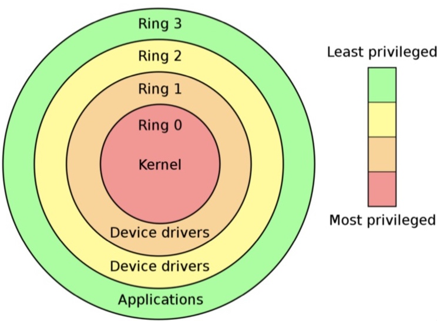
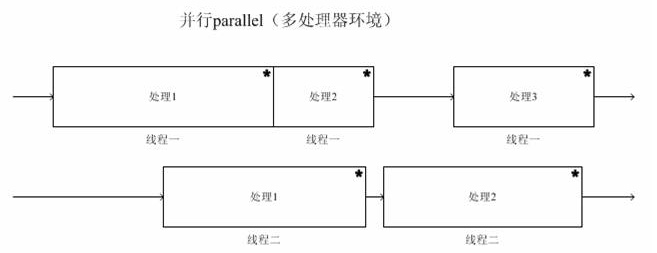
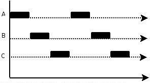
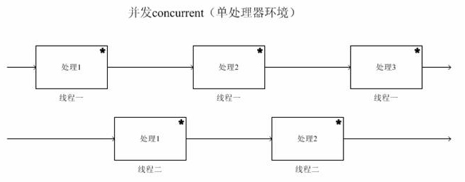
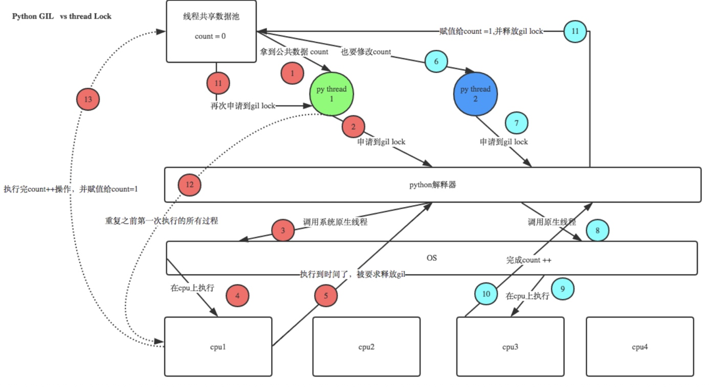
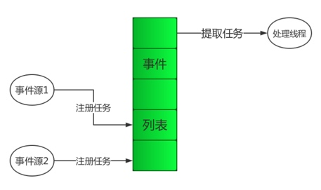
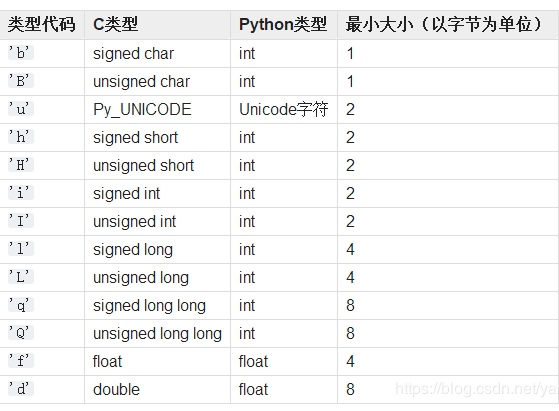

# 【Python】高性能编程

   * [概念](#概念)
      * [内核态和用户态](#内核态和用户态)
      * [并发和并行](#并发和并行)
      * [进程、线程、协程](#进程线程协程)
         * [进程和进程](#进程和进程)
         * [协程](#协程)
      * [全局解释锁](#全局解释锁)
      * [IO 多路复用模型](#io-多路复用模型)
         * [select](#select)
         * [poll](#poll)
         * [epoll](#epoll)
         * [最优实现](#最优实现)
      * [事件驱动](#事件驱动)
   * [实现](#实现)
      * [多线程和多进程](#多线程和多进程)
         * [threading](#threading)
            * [线程管理](#线程管理)
            * [锁和信号量](#锁和信号量)
            * [条件变量和事件](#条件变量和事件)
            * [定时器和栅栏](#定时器和栅栏)
         * [queue](#queue)
         * [multiprocessing](#multiprocessing)
            * [进程管理](#进程管理)
            * [管道和队列](#管道和队列)
            * [共享类型和管理器](#共享类型和管理器)
            * [进程池](#进程池)
         * [concurrent.futures](#concurrentfutures)
      * [事件驱动](#事件驱动-1)
         * [asyncio](#asyncio)
            * [协程和任务](#协程和任务)
         * [gevent](#gevent)
            * [greenlet](#greenlet)
            * [使用方式](#使用方式)

## 概念
### 内核态和用户态
进程的内核态和用户态：



- 当一个进程由于系统调用而陷入内核代码中执行时，称该进程处于内核运行态，即内核态。当进程处于内核态时，执行的内核代码会使用当前进程的内核栈，每个进程都有自己的内核栈，具有最高权限（特权等级 Ring 0），可以直接访问所有资源

- 当一个进程在执行用户程序的代码时，则称其处于用户运行态，即用户态。只能访问受限资源（特权等级 Ring 3），不能直接访问内存等硬件设备，必须通过系统调用陷入到内核中，才能访问这些特权资源

### 并发和并行
**并行（Parallellism）** 指在一个时间点上同时处理多个任务的能力，并行只存在于多处理器系统中




**并发（Concurrency）** 指在一段时间间隔内交替处理多个任务的能力，并发既可存在于单处理器中，也可存在于多处理器系统中，但每个处理器在一个时间点上只有一个任务在处理

也就是说，并发和并行并非是互斥的，并发可以存在于并行系统中，但是每条并行的一个时间点上只有一个任务在处理，比如一个开启了 2 进程，每个进程 4 个协程的系统，就是个并行度为 2，并行度为 8 的系统





在运行速度上，并行系统不一定比并发系统更快，由于运行中的多个任务之间通常是需要通信的，然而这些任务在并行系统上由不同的处理器处理，它们之间的通信开销比较大，但在并发系统上，这种通信开销就很小

### 进程、线程、协程
#### 进程和进程
**进程（Process）** 是用户程序的基本运行实体，是操作系统进行资源分配和调度的基本单位，每个进程都占有一个独立的、连续的、一致的地址空间，其中包括共享的内核空间和独立的用户空间

进程是线程的容器，并且至少包含一个线程，这个线程被称为其主线程，进程内的线程可以创建新线程，除了进程 0 以外，每个进程都由其父所进程创建

**线程（Thread）** 是进程中一个单一顺序的执行流，是进程中的实际执行单位，是处理器进行调度和执行的基本单位，被采用了基于时间片轮转的抢占式调度方式

#### 协程
**协程（Coroutine）** 是一种用户态的轻量级线程，和线程或者进程的最大区别，就是线程或者进程的切换受操作系统控制，而协程的切换由自身控制，即由获得当前执行权的协程来控制

协程必须存在于线程中，一个线程中可以存在一个或多个协程，其中的所有协程共享该线程的地址空间，但它也拥有独立的协程上下文

协程的优势：
- 没有线程上下文切换的开销
- 既没有线程间为各原子操作加锁的开销，也没有进程间进行通信和同步的开销
- 原子操作是指不会被线程调度机制打断的操作，如果一个操作包含多个原子操作，可以通过锁机制来保证该操作的完整性

协程的缺陷：
- 多协程本质也是单线程，无法利用多核处理器，除非配合多进程或者多线程来利用多核处理器，但 CPython 解释器由于 GIL 的限制，多线程也无法利用多核处理器
- 在获得当前执行权的协程发生阻塞时，会阻塞掉整个线程

### 全局解释锁
在 CPython 解释器中引入了一个 **全局解释锁（GLI）**，来保护对 Python object 的访问，防止多个线程同时执行不同的 Python bytecode，从而导致不可预期的结果

CPython 解释器虽然是通过操作系统的原生线程接口（linux 上为 pthread）来创建线程，由操作系统来调度线程的执行，但是其中的每个线程被调度唤醒前，都需要先获得 GIL，才能通过解释器运行对应的 Python bytecods，从而利用到处理器的资源

GIL 这个限制如果在单处理器的环境下不会有任何问题，因为任何一个被唤醒的线程都能成功获得 GIL（只存在一个核心，新线程被唤醒时老线程就会挂起同时释放 GIL），但在多处理器的环境下，被其中一个核心唤醒的线程由于获得 GIL 的线程还在其他核心上运行，未释放 GIL，这段等待获得 GIL 的时间该线程也无法运行

也就是说，同一个时刻只有一个线程可以执行 Python bytecods，因此在 CPython 解释器上实现的多线程编程，即使运行在多处理器的环境下，实际上也只能利用到相当于当个处理器的资源

避免 GIL 限制的方式：
- 选用不同的解释器：GIL 是解释器的特性，并不是 Python 语言的特性，比如 JPython PyPy 就没有 GIL

- 选用不同的编程方式：只有多线程编程会受到限制，比如多进程、多协程就不会受到影响

**GIL 和 线程锁**

为什么 CPython 已经存在 GIL，在多线程编程中还需要使用线程锁？

因为 GIL 只能保证 Python 对象的访问安全，无法保证线程中操作的完整性，从而产生的竞态条件，即结果与线程执行顺序有关，如图：



那么为什么有了用户态的线程锁，CPython 还需要 GIL？

一个重要原因是为了降低 CPython 程序的开发的复杂度，比如 CPython 解释器的内存回收机制，可以理解为有一个独立的线程每过一段时间会做一次全局轮询，对无标识符指向的内存进行回收，假设一个线程 del 了一个变量，然后在内存回收线程在清空这个变量的过程中，另一个线程正好又重新给这个还没来及得清空的内存空间赋值了，结果就有可能新赋值的数据被删除了，为了解决类似的问题，CPython 解释器就简单粗暴地加了 GIL，后续许多新特性也依赖了 GIL

### IO 多路复用模型
#### select
使用实例：

``` py
import select

# 阻塞直到返回进入可读、可写和触发异常状态的三个文件描述符列表
# rfdlist、wfdlist、xfdlist 分别是需要监控可读、可写和触发异常状态的文件描述符列
# timeout 是阻塞超时，默认永不超时
select.select(rfdlist, wfdlist, xfdlist, timeout=None)


# 用例：实现并发的 socket 服务端
import select, socket

ss = socket.socket()
ss.setblocking(0)
ss.bind(('', 9998))
ss.listen()

rfdlist = [ss]
wfdlist = []

while True:
    rable, wable, exceptional = select.select(rfdlist, wfdlist, rfdlist)
    for s in rable:
        if s == ss:
            conn, cli = s.accept()
            rfdlist.append(conn)
        else:
            date = s.recv(1024)
            if date:
                try:
                    s.send(date)
                except ConnectionResetError:
                    rfdlist.remove(s)
            else:
                s.close()
                rfdlist.remove(s)
```

#### poll
使用实例：

``` py
import select

# 对应状态的事件表示，底层是二进制数字，可用按位或来合并事件，用按位与来判断事件
select.POLLIN   # 可读数据（包括 socket 关闭）
select.POLLPRI  # 可读带外（紧迫）数据
select.POLLOUT  # 可写数据
select.POLLERR  # 发生异常
select.POLLHUP  # 发生挂起
select.POLLNVAL # 不是文件描述符

# 初始化 poll 对象
poll = select.poll()

# poll 对象的方法：

# 注册需要监测的文件描述符和状态
# fd 是文件描述符编号
poll.register(fd, eventmask)

# 解除已注册的文件描述符
poll.unregister(fd)

# 阻塞直到返回包含进入状态事件的 (fd, eventmask) 列表
# fd 是文件描述符编号，eventmask 是事件标记
poll.poll(timeout=None)


# 用例：实现并发的 socket 服务端
import select, socket

ss = socket.socket()
ss.setblocking(0)
ss.bind(('', 9998))
ss.listen(1024)

eventmask = select.POLLIN | select.POLLPRI | select.POLLHUP | select.POLLERR
fd_sock_dict = {ss.fileno(): ss}
poller = select.poll()
poller.register(ss,eventmask)

while True:
    for fd, event in poller.poll():
        s = fd_sock_dict[fd]
        if event & ( select.POLLIN | select.POLLPRI ):
            if s == ss:
                conn, cli = s.accept()
                poller.register(conn, eventmask)
                fd_sock_dict[conn.fileno()] = conn
            else:
                date = s.recv(1024)
                if date:
                    try:
                        s.send(date)
                    except ConnectionResetError:
                        poller.unregister(fd)
                else:
                    s.close()
                    poller.unregister(fd)
```

#### epoll
使用实例：

``` py
import select

# 对应状态的事件表示，底层是二进制数字，可用按位或来合并事件，用按位与来判断事件
select.EPOLLIN      # 可读数据（包括 socket 关闭）
select.EPOLLPRI     # 可读带外（紧迫）数据
select.EPOLLOUT     # 可写数据
select.EPOLLERR     # 发生异常
select.EPOLLHUP     # 发生挂起
select.EPOLLET      # 设为边缘触发模式

# 初始化 epoll 对象
epoll = select.epoll()

# epoll 对象的方法：

# 注册需要监测的文件描述符和状态
# fd 是文件描述符编号
epoll.register(fd, eventmask)

# 解除已注册的文件描述符
epoll.unregister(fd)

# 阻塞直到返回包含进入状态事件的 (fd, eventmask) 列表
# fd 是文件描述符编号，eventmask 是事件标记
epoll.poll(timeout=None) 

# 返回 epoll 对象自身的文件描述符编号
epoll.fileno()                      

# 关闭 epoll 对象，使用完毕后需要关闭，否则会占有资源，包括文件描述符
epoll.close()               
                            

# 用例：实现并发的 socket 服务端
import select, socket

ss = socket.socket()
ss.setblocking(0)
ss.bind(('', 9998))
ss.listen(1024)

eventmask = select.EPOLLIN | select.EPOLLPRI | select.EPOLLHUP | select.EPOLLERR
fd_sock_dict = {ss.fileno(): ss}
epoll = select.epoll()
epoll.register(ss, eventmask)

while True:
    for fd,event in epoll.poll():
        s = fd_sock_dict[fd]
        if event & ( select.EPOLLIN | select.EPOLLPRI ):
            if s == ss:
                conn, cli = s.accept()
                epoll.register(conn, eventmask)
                fd_sock_dict[conn.fileno()] = conn
            else:
                date = s.recv(1024)
                if date:
                    try:
                        s.send(date)
                    except ConnectionResetError:
                        epoll.unregister(fd)
                else:
                    s.close()
                    epoll.unregister(fd)
        elif event & select.EPOLLHUP:
            print('OUT')
            s.close()
            epoll.unregister(fd)
```

#### 最优实现
selectors 模块提供根据系统来自动选择最优的 IO 多路复用模型，简化开发过程并且更好地兼容各个系统：
- linux：epoll	
- windows：select	
- macOS：kqueue（原理上等同于 epoll）

使用实例：

``` py
import selectors

# 对应状态的事件表示，底层是二进制数字，可用按位或来合并事件，用按位与来判断事件
selectors.EVENT_READ      # 数据可读
selectors.EVENT_WRIT      # 可写数据

# 返回一个自动选择的 IO 多路复用模型对象 selector
selector = selectors.DefaultSelector()                  

# selector 对象的方法：

# 注册需要监测的文件描述符和事件标识
# data 是可附带的额外数据，对于 select() 返回结果中的 key，可通过 key.data 取出
selector.register(fd, eventmask, data=None)        

# 解除已注册的文件描述符
selector.unregister(fd)

# 阻塞直到超时或返回包含所有进入事件状态的 (key, events) 的列表
# key 是一个 {'fileobj': 文件对象, 'fd': 文件描述符, 'events': 事件标记, 'data': 附带数据} 的字典
# events 是事件标记
selector.select(timeout=None)               
            
# 关闭 selector 对象，使用完毕后需要关闭，否则会占有资源，包括文件描述符
selector.close()                                    


# 用例：实现并发的 socket 服务端
import selectors, socket

def accept(sock):
    conn, addr = sock.accept()
    print('accepted', conn, 'from', addr)
    conn.setblocking(0)
    mode.register(conn, selectors.EVENT_READ,handle)

def handle(conn):
    data = conn.recv(1000)
    if data:
        conn.send(data)
    else:
        mode.unregister(conn)
        conn.close()

mode = selectors.DefaultSelector()
sock = socket.socket()
sock.bind(('localhost', 9998))
sock.listen(1024)
sock.setblocking(0)
mode.register(sock, selectors.EVENT_READ, accept)

# 事件循环，循环监测 socket 的 io 事件，执行回调函数来处理 socket
while True:
    events = mode.select()
    for key, mask in events:
        callback = key.data
        callback(key.fileobj)
```

### 事件驱动
事件驱动一种编程模式，即程序的执行流由外部事件来所决定。其特点是包含一个处理线程，通常是一个事件获取循环，对已注册的事件进行监听和获取，一旦这些事件被外部触发，就会通过回调机制对其进行相应的处理



结合多协程 + IO 多路复用所实现的协程事件驱动模型：
- 存在一个进行事件循环的处理协程，它会不断从事件列表迭代提取事件，将事件的回调作为任务来创建任务协程，再切换到任务协程中对事件进行处理

- 事件列表中的事件，不仅由外部事件源添加，也包括主协程通过调用 IO 多路复用获取的 IO 事件

- 任务协程执行中若遇到 IO 操作，会向 IO 多路复用对象注册监听相关文件描述符的事件，并创建一个切换回当前协程的回调，然后切换回主协程

- 当 IO 事件被主协程从事件列表中提取出来时，通过 IO 事件的回调就会切换回发起 IO 操作的协程中

**多协程让事件处理的异步逻辑可以同步方式编写**，解决了包含多个 IO 操作的任务事件处理中需要嵌套太多层回调的问题，以简单的协程切换代替了复杂的回调逻辑

**IO 多路复用事件处理可以避免 IO 数据准备的阻塞**，解决了主协程对阻塞于 IO 操作的协程，无法确定最佳切换时机的问题，配合协程切换实现了 IO 异步化 

对于实现高并发服务，瓶颈大多数时候在 IO 上面，包括内存 IO、磁盘 IO、网络 IO, 通过结合多协程 + IO 多路复用所实现的事件驱动模型，就能很好地解决这个瓶颈

## 实现
以下用例代码中的线程和进程都用对应执行函数来表示，以省略对象初始化和启动的重复代码

执行函数及其用到的相关变量，前者先定义则必须通过传参的方式来调用后者，前者后定义则可以直接调用后者，因为在子线程中变量会被共享，而在子进程中变量会被复制

### 多线程和多进程
CPython 解释器中由于 GIL 的存在，多线程不适合计算密集型任务，只适合 IO 密集型任务，IO 密集型任务也可以通过多协程 + I/O 多路复用来解决，而计算密集型任务，则应该使用多进程，因为多进程编程在多处理器的环境下可以利用到所有处理器资源

#### threading
threading 模块在较低级的 _thread 模块基础上提供较高级的多线程接口，包括线程间同步状态的多种方式，如 **锁、信号量、条件变量、事件和栅栏**，[官方文档](https://docs.Python.org/zh-cn/3/library/threading.html)

##### 线程管理
线程对象的获取：

``` py
from threading import Thread

# 有两种方法得到线程对象

# 1、直接初始化 Thread 类
# target 为可调用对象
# args、kwargs 分别是调用对象时传入的位置参数和关键字参数
# name 为线程名，默认为 Thread-N
# daemon 表示是否为 daemon 线程
thread = Thread(target=func, args=(), kwargs={}, name=None, daemon=None)

# 2、继承 Thread 类重写方法后，再进行初始化
class MyThread(Thread):
    def __init__(self, word):
        """
        初始化一些用于自定义任务的属性
        """
        super().__init__()
        self.word = word

    def run(self):
        """
        线程的执行入口，原本是调用 target(*args, **kwargs)
        可重写为自定义任务
        """
        print(f'my word is {self.word}')

thread = MyThread('example')
```

线程对象的常用方法和属性：

``` py
# 启动线程，线程是同时执行的，且由主线程创建
thread.start()

# 阻塞等待直到该线程执行结束或超时，默认永不超时
# 该方法并不会终止线程，需要紧接着通过 is_alive() 来判断线程是否超时
thread.join(timeout=None)

# 返回线程是否存活       
thread.is_alive()

# 设置线程是否为 daemon 线程，必须在线程启动前设置
# 也可以直接设置 daemon 属性
# 当主线程结束时，所有 daemon 线程会强制结束，若还有非 daemon 线程存活，则进程会等待所有线程结束时才结束
thread.setDaemon(True)
thread.daemon = True

# 返回线程名字，是只用于识别的字符串
thread.name

# 返回由解释器分配的线程标识符，若线程未开始则为 None
# 是一个非零整数，当线程结束后，该线程 ID 会被回收和复用
thread.ident

# 返回由内核分配的原生线程 ID，若线程未开始则为 None
# 是一个非负整数，当线程结束后，该线程 ID 会被回收和复用
# Python 3.8 新属性
thread.native_id
```

常用的功能函数：

``` py
import threading

# 返回一个线程本地数据对象，可以隔离存储各个线程内的数据
threading.local()

# 返回当前存活的线程数量
threading.active_count()

# 返回包含当前所有存活的线程对象的列表
threading.enumerate()

# 返回当前线程对应的线程对象
threading.current_thread()

# 返回当前线程的线程标识符
threading.get_ident()

# 返回当前线程的原生线程 ID，Python 3.8 新方法
threading.get_native_id()

# 返回主线程对象
threading.main_thread()
```

##### 锁和信号量
锁的作用是限制资源被线程同时访问，修复竞态条件，以及保证操作的完整性，其使用方式：

``` py
from thrading import Lock, RLock

# 初始化线程锁对象
lock = Lock()

def thread_func():
    # 获取线程锁，没获得锁的线程需要阻塞等待
    # 可以设置阻塞超时，或者不阻塞，根据返回值判断是否获取到线程锁
    lock.acquire(blocking=True, timeout=-1)
    # 返回该锁是否已被获取
    lock.locked()
    pass
    # 释放线程锁
    lock.release()

# 初始化递归线程锁对象，一个线程可多次获取锁来实现锁中锁，但每个锁都需要释放
# 用于解决一个线程中使用多个线程锁，容易因为不同线程获取锁的顺序不同而导致死锁问题
rlock = RLock()

def thread_func():
    # 获取递归锁，没获得锁的线程需要阻塞等待
    # 可以设置阻塞超时，或者不阻塞，根据返回值判断是否获取到线程锁
    rlock.acquire(blocking=True, timeout=-1)
    rlock.acquire()
    pass
    rlock.acquire()
    pass
    # 释放递归锁
    rlock.release()
    rlock.release()
```

信号量的作用是限制资源同时访问的线程数，防止过度使用资源，其使用方式：

``` py 
from thrading import Semaphore, BoundSemaphore

# 初始化信号量对象
# value 设置计数器的初始值
semp = Semaphore(value=1)

# 初始化有界信号量对象，使用和信号量对象一致，当计数器的值大于初始值的时候触发异常
# 防止无限制地使用 release() 导致资源保护失败
bound_semp = BoundSemaphore(value=1)

def thread_func():
    # 获取信号量，其计数器 -1，当计数器为 0 时需要阻塞等待
    # 可以设置阻塞超时，或者不阻塞，根据返回值判断是否获取到信号量
    semp.acquire(blocking=True, timeout=None)
    pass
    # 释放信号量，其计数器 +1
    semp.release()
```

两种锁和信号量都支持上下文管理，在进入时获取锁，退出时释放锁：

``` py
with lock_or_semaphore_obj:
    pass
```

##### 条件变量和事件
条件表量的作用是通过锁在线程间同步某些共享状态从而进行活动，所有线程使用同一把锁，不允许同时进行活动，其使用方式：

``` py
from threading import Condition

# 初始化条件表量对象，需要和锁对象相关联，默认自动创建递归锁对象
# 可以多个条件变量对象共用一个锁对象
cv = Condition(lock=None)

# 调用底层锁对象来获取，条件变量也支持上下文管理，实现底层锁的获取释放
cv.acquire(blocking=True, timeout=-1)

# 调用底层锁对象来释放锁
cv.release()

# 释放锁（必须先获获取锁），阻塞直到其它线程使用条件表量进行通知，然后重新获得锁
# timout 可以设置等待超时，返回值为 False 则表示超时
wait(timeout=None)

# 通知指定数目个等待该条件变量的线程（必须先获取锁）
# 如果没有线程在等待，这是一个空操作
# 被唤醒的线程实际上不会立即返回其调用的 wait() ，而是继续阻塞直到有线程已经释放锁，因为 notify() 不会释放锁
cv.notify(n=1)

# 通知所有等待该条件变量的线程（必须先获取锁）
notify_all()

# 若指定条件为假则释放锁（必须先获得锁），阻塞直到其它线程使用条件表量进行通知且对指定条件为真，然后重新获得锁
# predicate 为返回布尔值的可调用对象
# timout 可以设置等待超时，返回值为 False 则表示超时
wait_for(predicate, timeout=None)


# 用例：设置和使用结果的两个线程
def set_thread():
    while True:
        with cv:
            set_result()
            cv.notify()

def get_thread():
    while True:
        with cv:
            cv.wait()
            get_result()


# 用例：为结果增加过期的标志
EXPRIED = 1

def get_expried()
    return EXPRIED

def set_thread():
    while True:
        with cv:
            set_result()
            global EXPRIED
            EXPRIED = 0
            cv.notify()

def get_thread():
    while True:
        with cv:
            cv.wait_for(get_expried)
            get_result()
            global EXPRIED
            EXPRIED += 1
```

事件的作用是让线程间可以直接通过事件通信，即一个线程发出事件通知，而其他线程则等待到事件后同时进行活动，其使用方式：

``` py
from thrading import Event

# 初始化事件对象
event = Event()

# 返回事件是否已设置标记
event.is_set()

# 为事件设置标记，所有正在等待这个事件的线程将被唤醒
event.set()

# 为事件清除标记
event.clear()

# 等待事件，若事件未设置标记则会阻塞，直到事件设置标记
# timout 可以设置等待超时，返回值为 False 则表示超时
event.wait(timeout=None)


# 用例：代表红路灯和汽车的两个线程
event = Event()

def traffic_light_thread():
    timer = 0
    while True:
        timer += 1
        if timer < 5:
            print('red light')
        elif timer == 5:
            event.set() 
        elif timer < 10:
            print('green light')          
        else:
            event.clear()
            timer = 0

def car():
    while True:
        if event.is_set():
            print('runing')
            time.sleep(1)
        else:
            print('stoping')
            event.wait()
```

##### 定时器和栅栏
定时器的作用是通过线程实现一个定时执行的任务，其使用方式：

``` py
from thrading import Timer

# 初始化定时器
# interval 为定时间隔秒数，func 为可调用对象，args、kwargs 为传入参数
timer = Timer(interval, func, args=None, kwargs=None)

# 启动定时器
timer.start()

# 取消定时器
timer.cancel()
```

栅栏的作用是应对固定数量的线程需要彼此相互等待的情况，当该线程等待数满足后，再同时释放所有线程，其使用方式：

``` py
from thrading import Barrier,BrokenBarrierError


# 初始化栅栏对象
# parties 为需要满足的等待线程数，timeout 为线程进行等待的默认超时
# action 是可调用对象，当所有线程被释放时，在其中一个线程中自动调用
# 若此时 action 调用失败，栅栏对象将进入损坏状态
# 栅栏对象进入损坏状态后，若仍有线程当前或未来还进行等待，则会触发 BrokenBarrierError 异常
barrier = Barrier(parties, action=None, timeout=None)

# 阻塞等待直到栅栏对象满足线程等待数或超时，超时后栅栏对象进入损坏状态
# 返回一个范围在 [0, barrier.parties] 的整数，每个线程的返回值不同，用于区分操作
barrier.wait(timeout=None)

# 重置栅栏为初始状态
# 重置时若仍有线程等待释放，这些线程将会收到 BrokenBarrierError 异常
barrier.reset()

# 使栅栏对象进入损坏状态
barrier.abort()

# 返回栅栏对象需要满足的等待线程数
barrier.parties

# 返回当前栅栏对象中阻塞等待的线程数量
barrier.n_waiting

# 返回栅栏对象是否为损坏状态
barrier.broken


# 用例：设置多个线程等待同时工作，工作前改变工作标志
work = False

def chang_flag():
    global work
    work = True

barrier = Barrier(2, chang_flag, timeout=10)

def work_thread():
    pass
    barrier.wait()
    pass
```

#### queue
queue 模块提供了多线程间传递消息的队列，在 threading 模块中是没有的，[官方文档](https://docs.Python.org/zh-cn/3.7/library/queue.html#simplequeue-objects)

队列是有序的，用于进行数据存储和消费的数据容器，它可以：
- 解藕程序的功能
- 保证多线程的数据传递安全
- 提高程序运行效率 

队列对象的获取：

``` py
import queue

# 初始化普通队列对象
# maxsize 设置队列大小，默认无限制
q = queue.Queue(maxsize=0)

# 初始化后进先出（LIFO）队列对象
q = queue.LifoQueue(maxsize=0)

# 初始化优先级队列对象
# 插入数据时可以设置优先级，优先级的值越小越先被取出，取出的形式为  (priority_number, data) 元祖
q = queue.PriorityQueue(maxsize=0)

# 初始化无上限简单队列对象，没有任务追踪功能
# 即不提供 full()、join() 和 task_done() 方法
q = queue.SimpleQueue()
```

队列对象的方法：

``` py
# 插入数据，默认阻塞且永不超时
# 阻塞插入时若队列已满，则阻塞直到队列中的数据被消费掉
q.put(data, block=True, timeout=None)

# 非阻塞插入数据，若队列已满则触发 queue.Full 异常
# 相当于 put(data, (=False)
q.put_nowait(data)

# 取出数据，默认阻塞且不超时
# 阻塞取出时若队列为空，则阻塞直到队列有数据被插入
q.get(block=True, timeout=None)

# 非阻塞取出数据，若队列为空则触发 queue.Empty 异常
# 相当于 get(block=False)
q.get_nowait()

# 返回队列的当前大小
q.qsize()

# 返回队列是否为空
q.empty()
                        
# 返回队列是否已满
q.full()               

# 阻塞写入直到所有的数据都被取出且任务处理完毕
# 每当队列插入数据，未完成任务计数就会加 1，当未完成计数降为 0 时，join() 解除阻塞
q.join()

# 通知队列一个任务处理完毕，即队列的未完成任务计数减 1
# 若队列的未完成任务计数小于 0，则会触发 ValueError 异常
q.task_done()


# 用例：等待队列消费

# 插入队列，并阻塞队列直到消费完成
q = Queue()
for data in all_data:
    q.put(item)
q.join()

# worker 线程，用于消费队列
def worker_thread():
    while True:
        data = q.get()
        pass
        q.task_done()
        

# 用例：生产者消费者模式的实现，解藕并解决两者处理能力不平衡的问题

# 生产者线程
def producer_thread():
    num = 0
    while True:
        q.put(f'put data {num}' )
        num += 1

# 消费者线程，生产者和消费者同时执行
def comsumer_thread():
    while True:
        q.get(f'get data {num}' )
```

#### multiprocessing
multiprocessing 模块用于提供多进程的接口，有着和 threading 模块相似的接口，包括：
- 进程间同步状态的 **锁、信号量、条件变量、事件和栅栏**，是来自 threading 模块的原语等价物
- 进程间传递数据的 **管道和队列**
- 共享数据的 **共享类型和管理器**
- 高效使用进程的 **进程池** 

[官方文档](https://docs.Python.org/zh-cn/3.7/library/multiprocessing.html#all-start-methods)

##### 进程管理
进程对象的获取：

``` py
from multiprocessing import Process

# 和 threadinng 的接口一样，有两种方法得到进程对象

# 1、初始化进程对象
# target 为可调用对象
# args、kwargs 分别是调用对象时传入的位置参数和关键字参数
# name 为线程名，默认为 Process-N
process = Process(target=None, name=None, args=(), kwargs={}, daemon=False)

# 2、继承 Process 类重写方法后，再进行初始化
class MyProcess(Process):
    def __init__(self, word):
        """
        初始化一些用于自定义任务的属性
        """
        super().__init__()
        self.word = word

    def run(self):
        """
        进程的执行入口，原本是调用 target(*args, **kwargs)
        可重写为自定义任务
        """
        print(f'my word is {self.word}')

process = MyProcess('example')
```

进程对象的常用方法和属性：

``` py
# 以下方法和属性与 Thread 线程对象保持一致：

process.start()
process.join(timeout=None)      
process.is_alive()
process.daemon = True    # 不允许 daemon 进程创建子进程
process.name


# 以下方法和属性是进程对象独有的：

# 返回由内核分配的原生进程 ID，若进程未开始则为 None
process.pid

# 返回进程的退出返回码，若线程未结束则为 None
process.exitcode

# 返回进程 byte 类型的身份验证密钥，可用于管理器对象的进程服务验证
# 是通过 os.urandom() 分配一个随机字符串
process.authkey

# 终止进程，在 Unix 上是使用 SIGTERM 信号完成的
process.terminate()

# 终止进程，与 terminate() 类似，但在 Unix 上使用 SIGKILL 信号
process.kill()

# 关闭进程，释放与之关联的所有资源
# 若进程仍在执行，会引发 ValueError
# 若进程成功关闭后，其大部分方法和属性将引发 ValueError
process.close()
```
> `start()` 、 `join()` 、 `is_alive()` 、 `terminate()` 和 `exitcode` 这些方法和属性只能由创建进程对象的进程调用

常用的功能函数：

``` py
import multiprocessing

# 返回当前进程所有存活的子进程列表
multiprocessing.active_children()

# 返回与当前进程对应的进程对象
multiprocessing.current_process()

# 返回系统的 CPU 数量
# 当前进程可用的 CPU 数量由 len(os.sched_getaffinity(0)) 方法获得
multiprocessing.cpu_count()

# 设置进程的启动方式，method 可设置 spawn、fork 和 forkserver 三种
# spawn：父进程启动一个新的 Python 解释器进程分叉
# fork：父进程使用 os.fork() 来产生 Python 解释器分叉，Unix 中默认
# forkserver：启动进程服务器，父进程通过连接到服务器并请求分叉一个新进程
# 在程序中不应该被多次调用，设置和创建进程的代码要注意在 __name__='__main__' 条件下执行
# 在Python 3.8 之后， macOS 默认使用 soawn 方式
multiprocessing.set_start_method(method)

# 返回上下文对象，上下文对象和 multiprocessing 模块拥有一样的接口，用于同步各个不同的进程启动方式
# method 为 None 表示默认
multiprocessing.get_context(method=None)

# 设置子进程时使用的 Python 解释器路径
multiprocessing.set_executable()
```

##### 管道和队列
管道用于在两个进程间进行传递消息，不允许多个进程同时操作管道，其使用方式：

``` py
from multiprocessing import Pipe

# 创建管道，返回一对连接对象
# duplex 表示是否为双工管道，默认是，否则 conn1 仅能接收消息，conn2 仅能发送消息
conn1, conn2 = Pipe(duplex=True)

# 连接对象的使用：

# 发送对象到连接的另一端，必须是可以序列化且不能过大（接近 32MB，该值取决于操作系统）
conn1.send(obj)

# 返回接收到的对象，会一直阻塞直到接收到对象，若对端的连接关闭则触发 EOFError  异常
conn2.recv()

# 返回连接对象所使用的描述符
conn1.fileno()

# 关闭连接对象，连接对象被 gc 回收时会自动调用
conn1.close()

# 返回连接对象是否有可以读取的数据，默认立即返回，也可以指定进行阻塞等待，直到连接对象有可以读取的数据
# timeout 可以指定等待超时，若为 None 则永不超时
# 使用 multiprocessing.connection.wait() 可以一次性阻塞等待并轮询多个连接对象是否有可以读取的数据
conn2.poll([timeout])
```

队列用于多个进程间进行传递消息，同时是线程安全的，其使用方式：

``` py
from multiprocessing import Queue, JoinableQueue, SimpleQueue

# 初始化普通队列对象
# 使用方法和 queue.Queue 基本一致，除了没有 join() 和 task_done() 方法
# 当一个对象被插入队列中时，这个对象首先会被一个后台线程进行 pickle 序列化，并将结果通过一个管道传递到底层的队列
q = Queue(maxsize=0)

# 初始化可阻塞队列对象，是基于 Queue 的扩展
# 使用方法和 queue.Queue 基本一致，包括了 join() 和 task_done() 方法
q = JoinableQueue([maxsize])

# 初始化简化的无上限队列对象
# 只提供了 queue.Queue 中的 empty()、get()、put() 接口，且插入取出都只能是无超时阻塞的
q = SimpleQueue(maxsize=0)

# Queue 和 JoinableQueue 对象的一些额外方法：

# 指示当前进程不会再对队列进行插入数据，该方法在队列被 gc 回收时会自动调用
# 一旦所有缓冲区中的数据被写入管道之后，后台线程会退出
q.close()

# 等待后台线程退出，仅在调用了 close() 后使用，确保所有缓冲区中的数据都被写入管道
# 非队列创建的进程退出时会自动调用
q.join_thread()

# 防止进程退出时被 join_thread() 阻塞等待后台线程，用于立即退出，不在乎缓冲区的数据丢失
q.cancel_join_thread()
```

##### 共享类型和管理器
共享类型对象是一些分配来自共享内存的、可被子进程继承的 ctypes 对象，其使用方式：

``` py
# 更多的共享类型由 multiprocessing.sharedctypes 模块提供
from multiprocessing import Value, Array

# 初始化共享值对象
v = Value(typecode, value)

# 返回共享值对象的值，同时用于修改
v.value = new_value

# 类似 v.value += 1 的操作不具有原子性，要调用它的锁来保证其原子性
with v.get_lock():
    v.value += 1
     
# 初始化共享数组对象
l = Array(typecode, value_list)


# 用例：通过进程操作共享类型
n = Value('d', 1.01)
l = Array('i', range(5))

def work_process():
    pass
    n.value = 2
    l[2] = 3
```
> typecode 的类型对应如下：
> 

管理器的作用是通过控制一个服务进程，该进程可以保存数据并允许其他进程通过代理对象来对数据进行操作，实现本地甚至跨网络机器的进程间的数据共享，其使用方式：

**基础管理器**

``` py
from multiprocessing.manager import BaseManager

# 初始化基础管理器对象
# 基础管理器对象支持上下文协议，进行启动和关闭服务进程
# address 是管理器服务的监听地址，网络地址为 ('ip', port) 元组，默认为文件地址，即不对网络进行监听
# authkey 是 byte 类型的认证标识，用于检查连接服务的进程合法性，默认使用 current_process().authkey
# 当管理器对象被 gc 回收或者父进程退出时，服务进程会立即退出
manager = BaseManager(address=None, authkey=None)

# 为管理器对象启动一个服务进程
# initializer 是可调用对象，若不为 None , 则子进程启动时将调用 initializer(*initargs) 进行初始化
manager.start([initializer=None, initargs=())

# 阻塞启动服务，即 start() 所启动服务进程的运行方法
manager.get_server().serve_forever()

# 将本地管理器对象连接到一个远程的管理器服务进程，自身不需要启动
manager.connect()

# 停止管理器对象的服务进程，只能用于已通过 start() 启动的服务进程
manager.shutdown()

# 将一个类型或者可调用对象注册到管理器对象中成为共享类型，是个类方法
# typeid 是用于唯一表示该共享类型的字符串标识
# callable 是类型或者可调用对象，用于通过管理器对象创建共享类型对象
manager.register(typeid, callable)
```

**使用本地管理器**

``` py
from multiprocessing.manager import SyncManager
from multiprocessing import Manager

# 初始化同步管理器对象，该类是在父类 BaseManager 之上注册了很多类型作为共享类型
# 支持的共享类型有：list、dict、Namespace、Lock、RLock、Semaphore、BoundedSemaphore、Condition、Event、Barrier、Queue、Value 和 Array
manager = SyncManager(address=None, authkey=None)

# 初始化管理器对象，本质是已调用 start() 启动的 SyncManager 同步管理器对象
# 其支持的方法以及类型：list、dict、Namespace、Lock、RLock、Semaphore、BoundedSemaphore、Condition、Event、Barrier、Queue、Value 和 Array
manager = Manager(address=None, authkey=None)


# 用例：使用管理器对象来共享对象
manager = Manager()
d = manager.dict()
l = manager.list(range(10))

def f_process():
    d[1] = '1'
    d['2'] = 2
    d[0.25] = None
    l.reverse()
    
    
# 用例：注册自定义类型为共享类型，可以基于 SyncManager 扩展，或者基于 BaseManager 完全自定义
# 自定义类型必须是可序列化的
class MathsClass:
    def add(self, x, y):
        return x + y
    def mul(self, x, y):
        return x * y

# class MyManager(SyncManager):
class MyManager(BaseManager):
    pass

MyManager.register('Maths', MathsClass)
math = MyManager.Maths()

def f_process():
    math.add(3, 2)
    math.mul(2, 1)
```

**使用远程管理器**

``` py
# 可用于实现简单的进程分布式方案

# 本地服务进程通过网络提供服务
manager = SyncManager(address=('', 50000), authkey=b'abracadabra')
manager.start()
q = manager.Queue()
q.put('1')

# 本地服务进程连接到远程服务
# 本地的管理器对象需要远程服务的管理器对象一致
manager = SyncManager(address=('', 50000), authkey=b'abracadabra')
manager.connect()
q = manager.Queue()
q.put('2')
```

##### 进程池
进程池的作用是通过维护和控制一些工作进程，来执行提交给它的任务，其使用方法：

``` py
from multiprocessing import Pool

# 初始化进程池对象
# processes 是工作进程的数目，默认使用 os.cpu_count() 的值
# initializer 是可调用对象，当其不为 None 时，则每个工作进程将会在启动时调用 initializer(*initargs) 进行初始化
# maxtasksperchild 是一个工作进程的最大完成任务数，达到之后将会退出或被代替，目的是为了释放未使用的资源，默认无限制
pool = Pool(processes=None, initializer=None, initargs=(), maxtasksperchild=None)

# 提交任务，会阻塞直到任务被执行并返回结果
pool.apply(func=callable, args=(), kwds={})

# 批量提交任务，会阻塞直到任务被执行并返回结果迭代器，和内置的 map() 类似
# iterable 是表示每个任务的参数的可迭代对象，只支持单个参数
# chunksize 是将可迭代对象分割为许多任务块提交时，每块的任务数，对于很长的可迭代对象，设置大一些会执行更快，但内存消耗也更多
pool.map(func=callable, iterable=[], chunksize=1)

# 异步提交任务，立即返回一个 multiprocessing.pool.AsyncResult 结果对象 
# callback、error_callback 都是可调用对象，分别表示任务成功和失败的回调
# 回调函数应该立即执行完成，否则会阻塞负责处理结果对象的线程
pool.apply_async(func=callable, args=(), kwds={}, callback=None, error_callback=None)

# 异步批量提交任务，立即返回一个 multiprocessing.pool.AsyncResult 结果对象 
pool.map_async(func=callable, args=(), kwds={}, callback=None, error_callback=None)

# 阻止后续任务提交到进程池，当所有任务执行完成后，工作进程会退出
pool.close()

# 不必等待未完成的任务，立即停止工作进程，当进程池对象被 gc 回收时，会立即调用
pool.terminate()

# 等待所有工作进程退出
# 调用 join() 前必须先调用 close() 或者 terminate()
pool.join()


# multiprocessing.pool.AsyncResult 结果对象的方法：

# 阻塞直到返回执行结果或超时，若执行触发了异常也会通过该方法抛出
# timeout 表示等待超时，超时则触发 multiprocessing.TimeoutError 异常
rst = get(timeout=None)

# 阻塞直到执行完成
rst.wait(timeout=None)

# 返回执行是否已完成
rst.ready()

# 返回执行是否已完成且未触发异常，若未完成则触发 ValueError
successful()
```

#### concurrent.futures
concurrent.futures 模块提供底层为多线程或多进程的异步执行高层接口，封装了 threading 和 multiprocessing 模块，[官方文档](https://docs.Python.org/zh-cn/3.7/library/concurrent.futures.html?highlight=concurrent.futures#module-concurrent.futures)

**任务提交**

``` py
from concurrent.futures import ThreadPoolExecutor, ProcessPoolExecutor

# 初始化以多线程为底层的线程池执行器对象
# max_workers 是最大工作线程数，默认为机器的处理器个数，若为 I/O 密集型任务可以设置为乘 5 的数
# thread_name_prefix 是线程命名前缀
# initializer 是可调用对象，当其不为 None 时，则每个工作线程将会在启动时调用 initializer(*initargs) 进行初始化
t_executor = ThreadPoolExecutor(max_workers=None, thread_name_prefix='', initializer=None, initargs=())

# 初始化以多进程为底层的进程池执行器对象
# max_workers 是最大工作进程数，默认为机器的处理器个数
# mp_context 是多进程上下文，无设置则使用默认
# initializer 是可调用对象，当其不为 None 时，则每个工作进程将会在启动时调用 initializer(*initargs) 进行初始化
p_exector = ProcessPoolExecutor(max_workers=None, mp_context=None，initializer=None, initargs=())


# 两个执行器对象拥有一致的接口
# 执行器对象支持上下文管理，在退出时自动调用 shutdown(wait=True) 等待所有任务完成并关闭

# 提交任务，返回一个代表结果的 concurrent.futures.Future 对象
# fn 是可调用对象，底层执行是调用 fn(*args **kwargs)
exector.submit(fn, *args, **kwargs)

# 批量提交任务，返回一个包含结果的有序迭代器
# fn 是可调用对象，底层执行是调用 fn(*iterables.__next__())
# timeout 是迭代该迭代器时阻塞等待每个结果返回的超时，默认永不超时
# chunksize 是将可迭代对象分割为许多任务块提交时，每块的任务数，对于很长的可迭代对象，设置大一些会执行更快，但内存消耗也更多，对线程池执行器对象无效
exector.map(func, *iterables, timeout=None, chunksize=1)
 
# 关闭执行器对象，释放所有资源
# wait 表示是否阻塞等待所有的任务执行完成
exector.shutdown(wait=True)
```

**结果处理**

``` py
# 期望对象的方法和属性：

# 尝试取消任务，并返回是否成功取消
# 如果任务正在执行或已结束则不能被取消
fu.cancel()

# 返回任务是否已被取消
f.cancelled()

# 返回任务是否正在执行
f.running()

# 返回任务是否已被取消或结束
f.done()

# 返回任务结果，若任务未完成则阻塞等待直到任务结束或者超时，默认永不超时
# 等待超时则触发 concurrent.futures.TimeoutError 异常
# 等待期间任务被取消则触发 concurrent.futures.CancelledError
# 若任务过程触发了异常，该方法会直接抛出异常
f.result(timeout=None)

# 返回由任务触发的异常，若任务未完成则阻塞等待直到任务结束或者超时，默认永不超时
# 如果调用正常完成则返回 None
f.exception(timeout=None)

# 添加一个任务完成后的回调
# fn 是可调用对象，当任务被取消或完成运行时，期望对象将会执行 fn(self) 进行回调
# 如果任务已完成或取消，会立即执行回调
f.add_done_callback(fn)


# 常用函数

from concurrent.futures import wait, as_completed

# 阻塞等待列表中所有期望对象直到满足返回条件或超时，返回一个 (done_fs, not_done_fs) 元组
# done_fs 包含正常结束或被取消的期望对象，not_done_fs 包含挂起的或正在运行的期望对象
# return_when 指定函数的返回条件，有以下三种：
# FIRST_COMPLETED：当任意一个期望对象结束或取消时返回
# FIRST_EXCEPTION：当任意一个期望对象因触发异常而结束时返回
# ALL_COMPLETED：当所有期望对象结束或取消时返回
wait(fs, timeout=None, return_when=ALL_COMPLETED)

# 返回一个包含所有期望对象的迭代器
# 迭代该迭代器时，将阻塞等待直到超时或任意一个期望对象完成或被取消，并返回该期望对象
# 若等待超时则触发 concurrent.futures.TimeoutError 异常
concurrent.futures.as_completed(fs, timeout=None)


# 用例：快速使用多线程执行任务
def task(arg):
    pass

with ThreadPoolExecutor(max_workers=4) as executor:
	fs = [executor.submit(task, i) for i in range(10)]
	
	# 任务每完成一个就处理一个
	for f in as_completed(fs):
	   try:
	       print(f'succeed:{f.result()}')
	   except:
	       print(f'failed:{f.exception}')

# 在执行器的上下文管理执行 shutdown() 后，任务全部完成后统一处理
for f in fs:
	   try:
	       print(f'succeed:{f.result()}')
	   except:
	       print(f'failed:{f.exception}')
```

### 事件驱动
#### asyncio
asyncio 模块是一个基于多协程 + IO 多路复用的事件驱动框架，使用 async/await 语法，实现基于协程的并发和 IO 异步化，[官方文档](https://docs.Python.org/zh-cn/3/library/asyncio.html)

但注意 IO 操作需要使用 asyncio 所支持的模块来进行，即在 asyncio 流控制的基础上封装的模块，如：aiohttp、aiomysql、aioredis 等，[异步库集合](https://github.com/aio-libs)

异步化的 IO 操作过程：
- 主协程使用 await from 异步等待包含 IO 操作的子协程
- 子协程注册 socket 到 I/O seletor 进行监测，回调为唤醒子协程
- 子协程 yeild 释放执行权到事件循环
- 事件循环继续执行其他事件的回调，直到迭代获得上面注册的 I/O seletor 事件，执行回调唤醒子协程
- 主协程完成 IO 操作，返回 IO 操作结果
- 主协程通过 await from 的返回获得 IO 操作结果，继续后续的操作

asyncio 提供的接口中，所需要关注有以下：
- 协程和任务
- 协程间的同步和消息传递
- 协程的流控制
- 协程的子进程控制

##### 协程和任务
协程的定义和打包为任务执行：

``` py
import asyncio

# async def 用于定义一个协程函数，调用协程函数将返回一个协程对象
async def coro_func():
    pass
    # await 表示异步等待，即释放执行权直到可等待对象执行结束，并返回其结果
    # aw 是可等待对象，包括协程对象（coroutine）、任务对象（Task）和期望对象（Future）
    # 若 aw 是协程对象，
    rst = await aw
    pass

# 协程的执行是通过把协程对象打包为任务对象来完成的，任务对象的初始化过程会将协程对象打包后排入事件循环中执行
# 执行协程的三种方式：

# 1、执行协程对象并返回执行结果
# 总是新建并运行一个事件循环，来执行打包为任务对象的协程对象，并在结束时关闭，应该用于运行程序入口协程
# 当前线程存在其他运行中的事件循环时，会触发 async.RuntimeError 异常
# debug 表示是否开启调试模式
asyncio.run(coro, debug=False)

# 2、将协程对象打包为任务对象执行，返回该任务对象
# name 表示任务名
# 会通过 get_running_loop() 获取事件循环，来执行打包为任务对象的协程对象
asyncio.create_task(coro, name=None)

# 3、在协程函数中通过 await 异步等待协程对象
# 协程对象会自动打包为任务对象，并排入当前线程中正在运行的当前事件循环中执行
await coro


用例：包含三种协程的执行方式
async def step1():
    pass

async def step2():
    pass    

async def main():
    # 异步等待
    await step1()
    # 先打包为任务对象执行再异步等待
    task2 = asyncio.step2()
    await task2

asyncio.run(main())
```

任务是期望的子类，任务所提供的高级接口也建立在期望的低级接口之上，因此两种对象的方法和属性也基本一致：

``` py
# 任务对象被用来在事件循环中执行协程
# 任务对象可以通过高级接口 asyncio.create_task() 来创建，也可以通过低级接口 loop.create_task() 或 asyncio.ensure_future() 来创建

# 期望对象被用来保存异步函数的结果
# 期望对象属于不应该被暴露和直接使用的低级对象，通常使用 await 异步等待来直接返回对应结果


# 取消任务对象的执行，将在被打包的协程中触发  CancelledError 异常
# 若取消期间协程正在异步等待一个对象，那该对象也将被取消
# 该方法不能保证任务对象会被取消，因为在协程中可以通过异常捕捉来拒绝取消
task.cancel()

# 返回任务对象是否已取消，即打包的协程没有抑制 CancelledError 异常并且确实被取消
task.cancelled()

# 返回任务对象是否已完成，包括触发异常或被取消
task.done()

# 返回任务对象的结果
# 若任务对象已完成，其打包的协程的结果会被返回
# 若任务对象已取消则触发 CancelledError 异常，而未完成则触发 InvalidStateError 异常
task.result()

# 若任务对象已完成，其打包的协程的异常会被返回，若无触发异常则返回 None
# 类似 task.result()，若任务对象已取消未完成则触发异常
task.exception()

# 返回任务对象打包的协程对象
task.get_coro()

# 返回任务对象的名称
task.get_name()

# 设置任务对象的名称
task.set_name(value)

# 添加一个任务完成后的回调
# fn 是可调用对象，当任务被取消或完成运行时，期望对象将会执行 fn(self) 进行回调
# 如果任务已完成或取消，会立即执行回调
task.add_done_callback(fn)
 
# 从任务的回调列表中移除指定回调，返回被移除的回调函数，通常为 1
task.remove_done_callback(callback)
```

返回可等待对象的函数：

``` py
# 返回一个阻塞指定秒数的协程对象
# result 指定协程对象的结果
# loop 默认为 get_event_loop() 返回的事件循环
asyncio.sleep(delay, result=None, loop=None)

# 返回一个期望对象，等待所有可等待对象都执行完成，其结果是一个包含这些可等待对象的结果的有序列表
# aws 是可等待对象列表
# return_exceptions 默认为 False，当首个可等待对象触发异常时，期望对象的结果会抛出异常，但其他可等待对象不会被都取消
# 为 True 则异常会和成功结果一样，被聚合到列表中作为期望对象的结果
asyncio.gather(*aws, loop=None, return_exceptions=False)

# 返回一个期望对象，等待可等待对象执行完成，其结果是可等待对象的结果，但不允许进行取消
# aw 是可等待对象
# 即使包含它的协程被取消，可等待对象也不会被取消
asyncio.shield(aw, loop=None)

# 返回一个协程对象，等待指定可等待对象执行完成或超时，其结果是可等待对象的结果
# 若 aw 是协程对象，并被自动创建为任务
# timeout 若为 None 则永不超时，否则表示秒数
asyncio.wait_for(aw, timeout, loop=None)

# 返回一个协程对象，等待所有可等待对象达到返回条件或者超时，其结果是（done, pending）元祖
# done 表示已完成的可等待对象列表，pending 表示未完成的可等待对象列表
# 若 aws 中存在协程对象，不会被自动创建为任务，应自行先创建为任务对象再进行传入
# return_when 指定函数的返回条件，有以下三种：
# FIRST_COMPLETED：当任意一个期望对象结束或取消时返回
# FIRST_EXCEPTION：当任意一个期望对象因触发异常而结束时返回
# ALL_COMPLETED：当所有期望对象结束或取消时返回
asyncio.wait(aws, loop=None, timeout=None, return_when=ALL_COMPLETED)

# 返回一个期望对象，线程安全地在指定事件循环中执行协程对象，其结果是协程对象的执行结果
# 应在非事件循环所属的线程中调用
asyncio.run_coroutine_threadsafe(coro, loop)
```

常用的功能函数：

``` py
# 返回当前事件循环中运行中的任务对象，没有则返回 None
asyncio.current_task(loop=None)

# 返回当前事件循环中所有任务对象的集合
asyncio.all_tasks(loop=None)

# 返回当前线程中正在运行的当前事件循环对象，若不存在则触发 asyncio.RuntimeError 异常
# 该函数只能在协程或回调中调用
asyncio.get_running_loop()

# 返回当前线程正在运行的当前事件循环对象，若不存在且当前线程为主线程、未设置过当前事件循环对象，则自动创建并设置，但不会运行
# 该在协程或回调中调用相当于 asyncio.get_running_loop()
asyncio.get_event_loop()

# 创建并返回一个事件循环对象
asyncio.new_event_loop()

# 将指定事件循环对象设置为当前线程的当前事件循环对象
asyncio.set_event_loop(loop)
```

#### gevent
gevent 第三方模块进一步封装了 greenlet，实现了一个基于多协程 + IO 多路复用的事件驱动框架，实现协程进行 IO 操作时的自动切换，达到 IO 异步化的高效率并发，[官方文档](http://www.gevent.org/contents.html)

##### greenlet
利用生成器中的 yield 进行用户态的上下文切换，功能上实现了不便于进行创建和切换的协程，greenlet 第三方模块则通过 C 扩展提供了较高级的协程管理接口，[官方文档](https://greenlet.readthedocs.io/en/latest/)

``` py
import greenlet
# 初始化 greenlet 对象，相当于一个以函数为执行内容的协程
gr = greenlet.greenlet(func)

# greenlet 对象的方法：

# 切换到该 greenlet 对象
# 首次切换表示开始执行协程，可以传入执行参数
# 再次切换到该协程的上下文继续执行              
gr.switch(*args, **kwargs)


# 用例：实现两个互相切换的协程
def func1(*args):
    gr2.switch(*args)
    while True:
        gr2.switch()
        time.sleep(0.5)

def func2(*args):
    while True:
        gr1.switch()
        time.sleep(0.5)

gr1 = greenlet(func1)
gr2 = greenlet(func2)

gr1.swith('a', 'b') 
```

##### 使用方式
``` py
import gevent

# 为 IO 操作的相关模块和方法进行补丁，使协程进行 IO 操作时能自动切换，使得 IO 操作异步化
# 协程进行 IO 操作时，会自动向 IO 多路复用 selector 注册监听 IO 设备，并释放执行权，事件循环待通过 IO 多路复用得知 IO 操作的已完成数据准备阶段后，再切换回该协程
from gevent import monkey;monkey.patch_all()

# 返回一个 greenlet 对象，将以函数为执行内容的协程排入事件循环中执行，并传入执行参数
gr = gevent.spwan(func, *args, **kwargs)     

# 阻塞直到列表中的所有 greenlet 对象执行完毕或超时，返回执行完毕的 greenlet 对象列表
# timeout 是等待超时，默认永不超时
# raise_error 表示当 greenlet 对象触发异常，是否停止阻塞并抛出异常
gevent.joinall(grs, timeout=None, raise_error=False) 

# 使当前协程至少睡眠指定的秒数，会释放执行权
gevent.sleep(second) 


# 用例：实现并发的 socket 服务端
def handle_request(conn, cli_addr):
    while True:
        host, port = cli_addr
        data = conn.recv(1024)
        if not data: break
        respond = "your host is %s, your port is %s, your word is %s" % (host, port, data.decode())
        conn.send(respond.encode())

ss = socket.socket()
ss.bind(('', 6666))
ss.listen()
while True:
    conn,cli_addr = ss.accept()
    gevent.spawn(handle_request,conn,cli_addr)
```