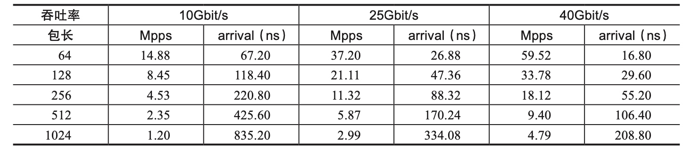
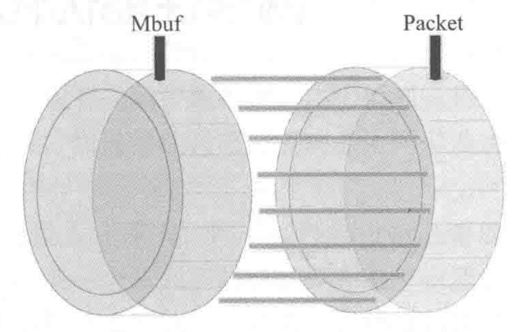
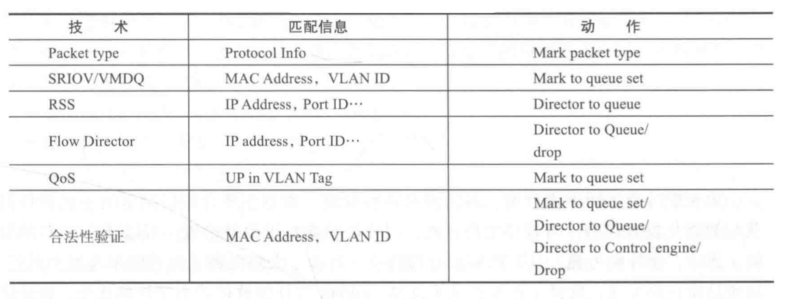

# 【SDN】DPDK

* [【SDN】DPDK](#sdndpdk)
   * [简介](#简介)
   * [演进背景](#演进背景)
   * [框架和优化点](#框架和优化点)
   * [兼容性和应用](#兼容性和应用)
   * [技术原理](#技术原理)
   * [优化细节](#优化细节)
      * [并行计算](#并行计算)
      * [同步机制](#同步机制)
      * [数据包转发](#数据包转发)
      * [内存优化](#内存优化)
      * [网卡性能优化](#网卡性能优化)
   * [其他数据面方案](#其他数据面方案)
      * [方案对比](#方案对比)
      * [IO_URING](#io_uring)

## 简介
**DPDK（Data Plane Development Kit）数据面开发工具**，主要以 **IA（Intel Architecture）** 多核处理器为目标平台，提供一套高性能的基础 IO 开发库和驱动，已实现功能丰富且性能强大的包处理平台，[官方文档](https://core.dpdk.org/doc/)

DPDK 不是网络协议栈，不提供二层、三层转发功能，不具备防火墙 ACL、服务质量 QoS 功能，但这些功能都可以通过 DPDK 开发实现，同时得到媲美硬件级的性能

DPDK 的高性能优势，核心在于数据包从网络设备直接递交到用户态进行处理，待处理完成后转发回网络设备，全程绕过内核，这种机制称为 **Kernel-Bypass**

## 演进背景
以 Linux 为例，使用传统网络设备驱动的数据包处理过程可概括为以下步骤：

1. 数据包到达网卡设备

2. 网卡设备依据配置进行 DMA 操作，将数据包存入 Ring Buffer

3. 网卡触发硬中断，通过总线唤醒 CPU

4. CPU 执行中断处理程序，简单处理后触发软中断

5. 软中断处理程序调用收包函数，从 Ring Buffer 收包并填充为 SKB 结构

6. 递交数据包到网络协议栈，进行高层处理

7. 若目标应用在用户态，数据从内核拷贝到用户态，若目标应用在内核态，在内核继续进行

> **SKB（struct sk_buffer）** 是内核中的缓冲区数据结构，用于保存所收发的数据包，贯穿整个网络协议栈的处理过程
>
> 中断处理程序和软中断处理程序所调用的收包函数都是由驱动程序注册的，因此针对不同的设备需要有不同的处理

传统网络设备驱动的数据包处理过程需要内核的参与，其存在以下问题：
- 内核使用中断模式收包，频繁触发中断的开销很大

- 用户进程以系统调用收发数据包，内核空间和用户空间的数据拷贝开销，内核态和用户态的切换开销都很大

- 用户态线程和内核态的包处理被时分调度，任务的上下文切换开销很大，CPU Cache 命中率降低

- 用户进程并发进行系统调用时，内核在多核场景会发生锁竞争

- 网络协议栈处理流程长，对于某些网络功能节点来说，TCP/IP 协议栈并不是数据转发所必需的

> 大量数据包到来时会频繁地触发中断，导致系统无法承受，为了缓解引入了 NAPI 机制，其策略是内核被中断唤醒后，先将网卡收包模式切换成轮询模式，在软中断处理程序中尽可能地收取数据包，直到网络再次空闲后重新进入中断模式，以提升高吞吐场景的包处理效率

> 数据包收发过程需要在内核缓冲区和用户缓冲区之间复制，其巨大开销会直接影响用户态进程的包处理能力，高性能网络 I/O 框架 **Netmap** 采用共享数据包池的方式，减少内核到用户空间的包复制

网卡线速指的是线缆中流过的帧理论上支持的最大帧数，比如以太网的接口带宽，代表接口所能乘载的最高传输比特率，其单位是 Bit/s。由于帧之间存在帧间距，然后每个帧还有前导码，因此网卡线速与接口带宽的关系如下：



达到网卡线速是包处理平台所追求的最终性能目标，但对于包长越小的场景，其达到网卡线速的处理速度要求就越高，因此小包处理一直是 IA 多核处理器上最艰难的任务

从以上问题可以看到，内核成为了数据包转发性能的瓶颈，无法达到网卡 **线速（(Wire Speed)）** 的转发性能，并不适合处理大规模的网络数据包，因此需要绕过内核来解决问题

## 框架和优化点
DPDK 整体框架中主要包含以下的库：


- **Core Libs 核心库**：提供系统抽象（EAL）、大页内存（MBUF）、缓冲池（MBUF）、内存池（MEMPOOL）、定时器（TIMER）及无锁环（RING）等基础组件

- **PMD 库**：提供全用户态的驱动，以便通过轮询和线程绑定得到极高的网络吞吐，支持各种本地和虚拟的网卡

- **Classify 库**：支持精确匹配（EXACT MATCH）、最长匹配（LPM）和通配符匹配（ACL），提供常用包处理的查表操作

- **QoS 库**：提供网络服务质量相关组件，如限速（METER）和调度（SCHED）

- **Extns 库**：提供平台特性或其他能力，比如为节能考虑的运行时频率调整 (POWER)，与 Linux Kernel Stack 建立快速通道（KNI），而 Packet；而 Framework 和 DISTRIB 为搭建更复杂的多核流水线处理模型提供了基础的组件

DPDK 针对 IA 多核处理器的高性能数据包处理问题，从工程优化角度的迭代和最佳实践的融合，提出了以下优化技术：
- **轮询**：使用 **PMD（Poll Mode Driver）** 轮询模式的驱动，避免中断上下文切换的开销，独占 CPU 使得处理网络报文的核不会被调度到其他任务

- **用户态驱动**：在这种工作方式下，既避免了不必要的内存拷贝又避免了系统调用。应用态申请内存，通过 UIO 机制，设置网卡 DMA 寄存器，网卡收包直接将报文 DMA 到用户申请的内存，减少内核态到用户态的内存拷贝

- **亲和性独占**：DPDK 工作在用户态，线程的调度仍然依赖于内核。利用线程的 CPU 亲和绑定的方式，特定任务可以被指定在某个核上工作

- **降低访存开销**：比如利用大页内存降低 TLB Miss。Linux 默认页大小 4K，大页是 2M/1G。主要两个优势：一是减少了页表项，降低了 TLB 缓存的 Cache Miss；二是大页内存不可换出，这点保证了 DPDK 应用态程序申请的内存不会被内核交换到 Swap 影响性能

- **软件调优**：在 DPDK 的实现中有一系列的调优，比如结构的 Cache Line 对齐，数据在多核间访问避免跨 Cache Line 共享，并适时地预取数据

- **每核一份结构**：DPDK 将数据进行严格按核隔离，每个 CPU 核之间不会出现锁竞争，避免了 CPU Cache  的一致性问题。每个核处理单独的网卡队列和报文内存，并对应单独的数据处理线程

- **利用 IA 新硬件技术**：深挖指令集并行计算提高性能，比如 DDIO 使外部网卡和 CPU 通过 LLC Cache 直接交换数据，绕过了内存这个相对慢速的部件

- **利用网卡特性**：比如向量操作就是 DPDK 利用 Intel 网卡高性能的特性的例子，ixgbe 驱动的 VECTOR 模式，可以批量处理报文，对性能有大幅提升

## 兼容性和应用
DPDK 对于硬件和平台的兼容支持如下：
- **网卡设备**

  支持绝大部分常用的网卡，除了 Intel 自身的网卡驱动，还支持了 Mellanox（mlx）、AMD（axgbe）、Broadcom（bnxt）、Amazon（ena）、Huawei（hinic）、Hisilicon（hns3）、Marvell(bnx2x,qede) 和虚拟网卡

- **CPU 架构**

  支持 X86、Arm、PPC 三种 CPU 架构

- **操作系统**

  支持 Linux 和 FreeBSD，甚至 Roadmap 中把 Windows 支持纳入到计划

DPDK 的实践应用方向如下：
- **加速网络节点**

  DPDK 基于通用的硬件平台，使网络节点的软硬件解耦成为可能，而软硬件解耦正是网络功能虚拟化的一个核心思想，解决不同形态的网络功能在通用节点上的隔离共生问题

- **加速计算节点**

  随着数据中心接口带宽不断提升，计算节点上各种服务对于高并发下的高吞吐有着越来越高的要求，但又受限于内核协议栈的性能，因此由 DPDK 加速的用户态协议栈会越来越多地支撑起计算节点上的网络服务
  
- **加速存储服务**

  比如 SPDK 存储加速开发套件，其主要的应用场景是 iSCSI 性能加速，在前端用 DPDK 提供网络 IO 加速，以用户态 TCP/IP 协议栈支撑起基于 iSCSI 的应用，在后端将 DPDK 用户态轮询驱动的方式实践在 NVMe 上，PMD 的 NVMe 驱动加速了后端存储访问

DPDK 具体的应用案例如下：
- **虚拟交换机**

  VPP（FD.io，思科）、Open vSwitch + DPDK（OVS + DPDK已经被应用于各大厂的虚拟网络中）
  
- **负载均衡**

  DPVS（爱奇艺开源的 DPVS 提供了丰富的负载均衡能力）、SkyLB（京东）
  
- **用户空间协议栈**

  VPP（二三层协议以及路由的支持，可以满足绝大多数的虚拟交换机场景）、mTCP、F-stack（腾讯的 F-stack 提供了微内核协议栈功能）

- **存储**

  SPDK（intel）

- **高性能发包机**

  Pktgen、MoonGen、Ostinato、Trex

## 技术原理
Linux 提供的 **UIO（Userspace I/O）** 机制是 DPDK 的基石，它能拦截网络设备的中断，并重设中断回调行为，从而绕过内核协议栈后续的处理流程，并让驱动的主要部分运行在用户态，[UIO 官方介绍](https://www.kernel.org/doc/html/v4.14/driver-api/uio-howto.html)


UIO 设备的实现机制是通过 mmap 将用户态内存与设备内存映射到同一块物理内存上，并对用户空间暴露文件接口，用户态对该文件的读写就是对设备内存的读写

比如注册一个 UIO 设备 uioX，就会出现文件 `/dev/uioX`，若用户态需要等待设备中断，只须对 `/dev/uioX` 进行 `read()` 操作，同时 UIO 也实现了 `poll()`、`select()` 系统调用，用于等待中断的发生

用户态还可以通过 sysfs 文件的读写来进行设备控制，sysfs 文件即 `/sys/class/uio` 下的各个文件

用户态的驱动要比内核态的驱动多得多，并且内核态的驱动很简单，主要是分配和记录设备需要的资源、注册 UIO 设备以及必须在内核空间实现的小部分中断处理函数

使用 UIO 机制的 DPDK 数据包处理过程，从 `设备 - 中断 - 驱动 - 内核 - 用户态` 简化为 `设备 - 用户态`：

DPDK 和传统数据包处理过程对比：


DPDK 与其他具体应用程序的对比如下：


## 优化细节
### 并行计算
DPDK 里面很多实现的初衷就是，降低那些不得不串行部分占整个任务执行的比例，从而利用多核处理器提升固定工作量性能

DPDK 在多核系统上创建多个线程，通过 CPU 亲和性和将逻辑核从调度系统中剥离，来使每个线程能够单独占有的一个核，减少线程调度的开销，提高 CPU Cache 命中率，以提高性能

DPDK 中的线程可以分为控制线程和数据线程，通常控制线程绑定到 MASTER 核上，用于接受用户配置，并传递配置参数给数据线程等，而数据线程则分布在不同 SLAVE 核上，用于处理数据包

DPDK 的 `lcore` 指的是 EAL 线程，本质是基于 `pthread()` 封装实现，每个 `lcore` 中存在一个 Thread Local Storage `_lcore_id`，其值与 CPU 逻辑核 ID `processor` 是一致的

`lcore` 的初始化阶段会解析 EAL `-c` 参数指定的 `coremask`，并将第一个逻辑核设为 MASTER 核，而其他的逻辑核则为 SLAVE 核，然后为每一个 SLAVE 核创建 `lcore` 并绑定

SLAVE 核上的 `lcore` 执行体为 `eal_thread_loop()`，其中包含一个 `while` 死循环，调用不同模块使用 `rte_eal_mp_remote_launch()` 注册到 `lcore_config[lcore_id].f` 的回调函数

默认情况下，`lcore` 是与逻辑核一一亲和绑定的，在带来性能提升的同时，也牺牲了一定的灵活性和能效。为了应对网络流量空闲的场景，允许 `lcore` 和逻辑核之间打破一一对应的绑定关系，`_lcore_id` 与 CPU 逻辑核 ID `processor` 不严格一致

EAL 定义了参数 `--lcores` 来指定 `lcore` 的 CPU 亲和性，针对一个特定的 `lcore` 或者 `lcore` 组进行设置。其格式和实例意义如下：

``` bash
--lcores=’<lcore_set>[@cpu_set][,<lcore_set>[@cpu_set],...]’

# For example, "--lcores='1,2@(5-7),(3-5)@(0,2),(0,6),7-8'" which means start 9 EAL thread; lcore 0 runs on cpuset 0x41 (cpu 0,6);
lcore 1 runs on cpuset 0x2 (cpu 1);
lcore 2 runs on cpuset 0xe0 (cpu 5,6,7);
lcore 3,4,5 runs on cpuset 0x5 (cpu 0,2);
lcore 6 runs on cpuset 0x41 (cpu 0,6);
lcore 7 runs on cpuset 0x80 (cpu 7);
lcore 8 runs on cpuset 0x100 (cpu 8).
```

如此一来多个 `lcore` 可能亲和到同一个逻辑核，同一个核上多个可抢占式的任务调度涉及非抢占式的库时，会有一定限制，比如对于非抢占式无锁的 `rte_ring`：
- 单生产者与单消费者模式，不受影响，可正常使用
- 多生产者与多消费者模式，且 Pthread 调度策略都是 SCHED_OTHER 时，可以使用，但性能会有所影响
- 多生产者与多消费者模式，且 Pthread 调度策略有 SCHED_FIFO 或者 SCHED_RR 时，建议不使用，会产生死锁

除了使用 DPDK 提供的逻辑核之外，用户也可以将 DPDK 的执行上下文运行在任何用户自己创建的 Pthread 中，而这种情况下其 `_lcore_id` 总是 `LCORE_ID_ ANY`，并且少数 DPDK 库可能无法完全支持用户自创建 的 Pthread，比如 Timer 和 Mempool

当网络吞吐量较小，绑定到某个逻辑核的 `lcore` 并不需要独占其计算能力时，可以使用 Linux CGroup 机制把 CPU 的配额活地配置在不同的线程上，有效改善 IO 核的闲置利用率，并可控地释放一部分计算资源给其他任务

**SIMD（Single-Instruction Multiple-Data）** 单指令多数据，即一个指令操作作用到寄存器中的多个数据单元，可理解为是一种向量化的操作方式，DPDK 在多个基础库中都有利用 SIMD 进行优化，从数据位宽的维度上提升指令的并行度

### 同步机制
**原子操作（Atomic Operation）** 指不可被中断的一个或一系列操作，当多个线程同时执行该操作时，这些线程要么完全完成执行，要么完全没有执行，原子操作是其他内核同步方法的基石

硬件级的原子操作，单核处理系统中，单条指令完成的操作便是原子操作，因为中断只能发生于指令之间；而多核处理系统中，指令之间也会出现互相干扰，因此 CPU 提供了三种独立的原子锁机制，分别是 **原子保证操作**、**加 LOCK 指令前缀** 和 **Cache 一致性协议**

软件级的原子操作，由内核提供，其实现依赖于硬件级的原子操作，对于 Linux 主要有两组原子操作接口，分别用于 **针对整数进行操作** 和 **针对单独的位进行操作**

DPDK 在硬件级和软件级的原子操作的基础上，提供了以下功能的原子操作接口：
- **内存屏障 API**
  
  也称为 **内存栅栏（Member Barrier）**，用于保证输出结果一样的情况下对指令重排序，以合适的执行顺序使性能得到优化，也避免处理器为提高性能而采取乱序执行所导致的问题
  
  以 `rte_{x}mb()` 提供读、写、读写三种屏障，可令处理器立即完成所有加载和存储指令，达到指令有序执行的效果。比如写屏障之后的操作，肯定在写屏障之前的写操作完成后才开始

- **原子操作 API**

  以 `rte_atomic{nn}_xxx()` 函数提供 16、32 和 64 位的原子操作 API

原子操作不适合对临界资源进行长时间的保护，因此需要使用锁机制，**自旋锁（Spin Lock）** 不会令线程进入睡眠状态，而是通过反复检查一个内存单元来确定是否可继续执行，持续进行忙等待直到获取锁

与基于线程睡眠和唤醒的 **互斥锁（Mutex）** 相比，自旋锁虽能避免线程的上下文切换，提高使用锁的效率，但缺点是会持续占有 CPU，递归调用会造成死锁，调用其他阻塞函数也可能造成死锁，因此仅适用于执行时间较短的代码片段，以及 CPU 资源不紧张的多核系统

读写锁实际是一种特殊的自旋锁，它将对共享资源的操作划分为读操作和写操作，对比于普通的自旋锁，它允许多个逻辑核同时执行读操作，但只允许单个逻辑核同时执行写操作

DPDK 通过 `rte_spinlock_xxx()` 函数来提供自旋锁机制，通过 `rte_rwlock_xxx()` 函数来提供读写锁机制

多核系统在高并发环境下，锁竞争机制有时会比数据拷贝、上下文切换等更伤害系统的性能，因此将主要的数据结构从锁保护改造为无锁的访问方式，能够提高程序的性能

Linux 内核中的无锁环形缓冲 `kfifo` 通过一个读指针和一个写指针，提供单生产者与单消费者模式下的无锁访问，但多生产者与多消费者模式下，仍需要加锁同步

DPDK 基于无锁环形缓冲的原理，提供了一个在多生产者与多消费者模式下支持无锁访问的 `rte_ring`，其入队和出队的 [实现原理参考](https://dpdk-docs.readthedocs.io/en/latest/prog_guide/ring_lib.html) 

### 数据包转发
网络数据包的转发过程可分为硬件处理部分和软件处理部分，主要涉及的模块和流程如下：


传统硬件网络设备的转发模型可以分为以下两种：
- **RTC（Run To Completion）模型**

  将一个功能分为多个逻辑功能，但这些逻辑功能都在同一个线程上执行，可通过多个线程进行并行处理，但每个线程所执行的逻辑是一致的
  
  面向过程开发方式的比较友好，只能通过多核并行处理报文，无法通过专用处理器针对某个逻辑功能进行优化，但通用处理器的扩展性较好

- **Pipeline 模型**

  将一个功能分为多个独立阶段，为不同阶段分配不同的线程，并通过对列在不同阶段之间传递数据包
  
  开发复杂，因某些操作仅能在某些阶段进行，通过专用处理器可以针对该阶段的功能进行优化，同时能够提供 Cache 命中率，使处理过程更加高效，不过这也导致其扩展性较差

对于 DPDK 来说，使用以上两种开发模型的区别是：
- RTC 模型

  开发方面需要调用 DPDK 提供的 API 接口实现网络功能，消耗较长的时间，并且单个包的处理始终集中于一个逻辑核，无法利用其他运算单元，并且逻辑处理之间的耦合性太强，但自定义逻辑处理的扩展性更强

- Pipeline 模型

  开发方面可以利用脚本方式快速配置所需的网络单元，从而构建网络产品所需的功能，但多核之间会有 Cache 一致性的问题，模块化功能构建的扩展性较差

DPDK 的 Pipeline 模型又称为 **Packet Framework**，而负责不同阶段功能的 Pipeline 被称为网络单元，一个网络应用由一系列的 Pipeline 组成，且 DPDK 支持一系列现成的 Pipeline，从而能快速构建特定网络功能的应用


每个 Pipeline 都有其独立的输入和输出，并由特定的 **逻辑端口（Port）**、**查找表（Table）** 和 **处理逻辑（Action）** 三大要素组成，各个要素所支持的类型如下：


当 Packet Framework 网络应用中需要 IP 包路由功能，可通过选取三大要素构建的 IP 包路由 Pipeline，其结构如下：


DPDK 转发过程中的重要工作内容，包含对报文字段进行匹配和识别，并主要用到以下算法：
- **精确匹配（Exact Match）**

  利用哈希算法对所要匹配的值进行哈希，从而加快查找速度，并且 DPDK 在解决哈希冲突方面，融合了拉链法和开放地址法的优点
  
- **最长前缀匹配算法（Long Prefix Match，LPM）**

  是路由器使用目的地址在路由表中选择路由的算法，即当目标地址与多个路由的网络地址匹配时，选择其中子网掩码最长的一个，DPDK 通过支持 2^24 个表项的一级表 `tbl24` 和 支持 2^8 个表项的二级表 `tbl8` 来组合实现

- **ACL 算法**

  利用 N 元祖的匹配规则去进行类型匹配，并基于 **AC（Access Domain）** 上下文进行匹配规则的控制

DPDK 提供 **Packet Distributor** 库进行包的分发，以实现动态负载均衡的功能。通过一个 Distributor 将包分发到不同的 Worker 上进行包处理，待包处理完后在通过 Worker 返回给 Distributor


### 内存优化
为了高效访问内存，Mbuf 使用 `rte_mbuf` 结构来封装网络帧缓存，或者封装通用控制信息缓存。`rte_mbuf` 头部为两个 Cache Line 大小，前一个 Cache Line 存放基础性的数据，后一个 Cache Line 存放功能性扩展的数据

DPDK 将网络帧元数据和帧本身存放于固定大小的 `rte_mbuf` 中，能够高效地进行缓存的申请和释放，并且保证对齐 Cache Line，但由于其中的网络帧大小不一，因此需要通过填充 0 的方式塞满缓存，比较耗费内存空间


**头空间（Head Room）** 用于存储和系统中其他实体交互的信息，**尾空间（Tail Room）** 以 0 进行填充 至固定大小

为了高效存取内容，Mempool 提供内存池对网络帧相关的缓存对象进行统一管理，内存池使用环形缓存区来保存空闲对象，并以 **双环形缓存区结构** 组织对象，其中一个 Mbuf 环形缓冲区用于保存`rte_mbuf` 结构，而 Packet 环形缓冲区用于保存实际网络帧



当一个网络帧被网卡接收时，DPDK 的网卡驱动将它存储在一个 Packet 环形缓冲区中，同时在 Mbuf 环形缓冲区中存入一个 `rte_mbuf` 对象，这两个行为都不涉及向系统申请内存，因为它们在内存池被创建时就申请好了

当多核系统访问同一个内存池时，每次读写都需要进行 CAS 操作来保证期间数据未被其他核心修改，因此存储效率较低

DPDK 以空间换时间的思想，使单核在本地缓存一部分数据，然后实时对内存池进行块读写操作，减少访问内存池的次数，由于本地缓存的操作无须中断，因此存取效率得到提高

### 网卡性能优化
DPDK 的驱动程序采用 **轮询** 或 **轮询混杂中断** 的模式进行收发包，前者是收发包完全不适应中断处理的高吞吐方式，后者则类似 NAPI 的思路，通过定义根据流量大小的策略，在轮询模式和中断模式之间切换

轮询混杂中断有利于应对变化的流量，既一定程度上保证大流量场景下的高效收发包，又使流量场景下的计算资源能够得到释放，其工作原理如下：


VFIO 支持队列级别的中断，网卡的每个队列对应一个中断号，而 UIO 只支持一个中断号，网卡的所有队列都共享这个中断号

Burst 收发包是 DPDK 的优化模式，它一次性完成多个数据包的收发，并将这些复杂的处理过程进行分解，把相邻的数据访问、相似的数据运算集中处理

一条指令在 CPU 多发执行单元的开销通常以 **时延（Latency）和吞吐（Throughput）** 来衡量，前者指单核心执行单元完成一条指令所需的时钟周期数，后者指处理端口再次允许接收相同指令所需等待的时钟周期数

DPDK 通过利用 CPU 指令乱序多发的能力，批量处理无数据前后依赖关系的独立事务，其中事务指包含多条需要按序执行的指令，能够达到隐藏指令延迟的效果


> Load、ALU、Store 是一个独立事务，Stall 表示访存操作的时延。第五行通过多发和隐藏指令延迟，减少了整体运行的时延

Burst 收发包既减少对内存或低级 Cache 的访问，充分地利用 Cache 预取机制，又通过隐藏指令延迟，提高了指令执行的效率，从而提升处理性能

DPDK 收发包相关的各种队列及阈值，其设置和意义如下：
- **收包队列长度**

  即每个收包队列分配的描述符个数，其中每个描述符都会分配 Mbuf 缓存块，表示在软件驱动程序读取包之前，软件队列最大的包缓存能力，默认 128

- **发包队列长度**

  即每个发包队列分配的描述符个数，其中每个描述符都会分配 Mbuf 缓存块，表示最大利用硬件发包的能力，网卡迎接在发送完所有队列的包后需要等待一段时间让驱动程序填充发包队列，因此可缓存的包越多则网卡的吞吐量越高，默认 512

- **收包队列可释放描述符阈值（rx_free_thresh）**

  驱动程序检查描述符状态成功后，这些描述符就可以释放或再次利用了，只要对这些描述符重填缓冲区后，需要更新队列的 Tail 寄存器以告知硬件再次利用
  
  但驱动程序不会每次收包完成都更新队列的 Tail 寄存器，而是在可释放描述符达到指定阈值后，再真正对这些描述符重填缓冲区以及更新队列的 Tail 寄存器，用于减少寄存器 MMIO 操作，默认 32

- **发包队列发送报告结果阈值（tx_rs_thresh）**

  硬件完成发包处理后，会通过回写描述符完成状态来通知驱动程序，这种回写涉及网卡和内存的数据交互，因此每次发包完成都会写的效率是比较低的
  
  这阈值的存在允许驱动程序在配置描述符的同时设定一个回写标记，只有设置了回写标记的描述符，硬件才会触发回写行为，从而改善性能，阈值本身则是设置回写标记的描述符的间隔，默认 32

- **发包描述符可释放阈值（tx_free_thresh）**

  驱动程序检查描述符状态成功后，这些描述符就可以释放或再次利用了，但过于频繁的检查和释放并不能很好地利用 Cache 中的数据
  
  因此只有当可用的发生描述符少于该阈值时，才会触发对描述符的检查和释放动作，不过该阈值过小也会影响单次释放的耗时，因此需要根据队列长度设置适当的值，默认 32

DPDK 驱动程序通过为各个处理器核分别分配一个接收软件队列和发送软件队列，其底层分别对应着网卡的某个硬件队列，并且每个核在本地存储中分配用于缓存报文的内存池，从而实现对网卡多队列的支持

对于支持 Packet Type 的网卡，DPDK 通过描述符能够得到对应数据包的类型信息，并以区分协议层级的方式存储于 Mbuf 结构中，供程序进行包处理时访问

对比用于负载均衡的 RSS，Flow Director 用于精确匹配数据包的信息并分配到指定的队列中，这取决于网卡上存储的一张 Flow Director 表，驱动程序负责这张表的操作

DPDK 结合网卡的 RSS 和 Flow Director 功能，可以将控制报文分配到特定队列，由 MASTER 核进行处理，而其他报文则通过 RSS 负载均衡到其他队列，由 SLAVE 核进行处理


网卡所支持的流分类技术及其使用的匹配信息和动作如下：



硬件的缺点在于资源局限，功能固化，一旦设计发布完成则难以修改，但与软件实现相比，同样的功能如果由硬件实现，就可以减少处理器的开销，将某个功能从软件转移到硬件的做法，被称为 **硬件卸载**，即智能网卡的发展趋势

常见的硬件卸载功能如下：


硬件与软件之间的合作，通常由驱动程序提供相应的 API 给上层程序使用，并且驱动程序通过描述符和外部寄存器与硬件进行数据交互，DPDK 驱动程序则需要自身实现这部分工作

## 其他数据面方案
### 方案对比
DPDK、XDP、IO_URING 之间的总结比较如下：

| 特性 | DPDK | XDP | IO_URING |
| --- | --- | --- | --- |
| 系统位置和支持 | 用户态，3.16 以上内核支持 | 内核态，4.9 以上内核支持 | 5.1 以上内核支持 |
| 开发/调试/维护难度 | 易，应用态开发，开源实践较多，可以 GDB 调试	难 | 内核态开发，调试不便，不同内核态版本对 XDP 支持有差异 | 易，提供了用户态接口 |
| 网络功能	| 1、支持协议相对少，多为主流协议 2、需要自己维护路由和邻居 3、协议异常处理少 4、可以使用内核协议栈的流程，支持协议多 | 1、可以使用内核强大的路由子系统和邻居子系统 2、协议处理符合大多数 RFC 标准 3、支持 AF_XDP | 支持替代 epoll 的 polling |
| 性能 | 极高 | 较高 | 高 |
| 占有 | 轮询模式 100% 占用 CPU，也提供了模拟中断的方式 | 不会 100% 占用 CPU | N/A |
| 应用 | 使用广泛，大量基于 DPDK 的开源组件 | Cilium、Facebook 负载均衡器 Katran、AF_XDP | 存储、Nginx 和 Redis 的优化 |

### IO_URING
IO_URING 是 Linux 5.1 内核版本合入的异步 IO 接口，通过用户空间的 liburing 库可与 IO_URING 内核接口交互，是基于 libaio 库的 AIO 异步 IO 接口的演进，[官方文档](https://kernel.dk/io_uring.pdf)

关于原生异步 IO 接口 AIO 的几个缺点：
- **直写直读模式（O_DIRECT）**
    - IO 类型为直接 IO，不是缓存 IO，无法利用操作系统对文件的缓存，只能从磁盘直写直读
    - 直写直读模式的 IO 操作，要求读写缓冲区的地址、内容的大小、文件偏移必须是扇区的倍数（通常是 512 bytes）
- **额外拷贝开销**
    - 在 AIO 的设计中，进行一次 IO 需要至少两次系统调用（submit + wait-for-completion）
    - 两次系统调用在数据结构的传递上总计增加 72（用户态到内核态） + 32（内核态到用户态） = 104 bytes 的额外拷贝
    - 由于 AIO 不支持 IOPOLL，另外每次 IO 都需要两次系统调用，因此在 IO 请求频繁的情况下，系统调用量会非常大。在开启 Meltdown 和 Spectre 安全漏洞补丁的时候，性能会下降更加严重
- **支持的范围有限**
    - 只支持 ext2，ext3，jfs，xfs，不支持 fsync，socket，pipes 等
- **仍存在阻塞可能性**
    - 比如等待的存储设备的请求槽位正在使用、等待元数据 IO 等情况

由于这些原因，AIO（libaio）只在一些底层软件如数据库中有被使用，大多数普通应用都没有使用它，因此后面有了 IO_URING（liburing） 的诞生

IO_URING 基本克服了 AIO 的各种缺点，其特性包括：
- 支持 O_DIRECT 以及非 O_DIRECT 的文件读写
- 支持在各种类型的文件上操作
- 高性能，相比于旧的aio，省去了读写数据的拷贝，减少必须的系统调用次数
- 简单易用的接口、丰富的特性，比如 fixed buffer，polled IO 等

IO_URING 的实现框架核心设计了两个环形队列：
- **SQ（提交队列）**：用于 IO 提交，应用程序为生产者将 IO 事件入队到 SQ 队尾，内核为消费者从 SQ 队头开始出队 IO 事件

- **CQ（完成队列）**：用于获取 IO 完成结果，应用程序为消费者，从队头开始出队 IO 完成结果，内核为生产者，将 IO 完成结果入队到 CQ 队尾


两个环形队列的内存是用户态和内核态共享的，其交互是无锁的，因此系统调用的两个异步接口，提交 IO 请求以及获取 IO 处理结果（submit+wait-for-completion）都不需要拷贝数据，只是将数据写入到和内核约定的共享内存里面，这样做优势有：
- 提交、完成请求时节省应用和内核之间的内存拷贝，比如免去了 AIO 的 104 bytes 的拷贝
- 在使用 SQPOLL 高级特性场景，应用程序都无需调用系统调用，免去了这块的性能损耗
- 环形队列是单生产者单消费者，天然的无锁

应用场景：
- **存储场景**
    - 数据库场景，如 ScyllaDB
    - 虚拟化场景，如 QEMU
    - 分布式存储场景，如 Ceph
- **网络场景**
    - 取代 epoll（多路复用 IO）系统调用 
    - 集成到 Nginx、Redis 应用
