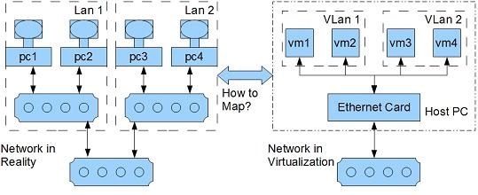

# 【SDN】NFV

* [【SDN】NFV](#sdnnfv)
   * [简介](#简介)
   * [IO 虚拟化](#io-虚拟化)
      * [QEMU](#qemu)
      * [Intel VT-d](#intel-vt-d)
      * [Virtio](#virtio)
   * [虚拟接入技术](#虚拟接入技术)
      * [VEB](#veb)
      * [硬件 VEB](#硬件-veb)
         * [VN-TAG](#vn-tag)
         * [VEPA](#vepa)
         * [SR-IOV](#sr-iov)

## 简介
**NFV（Network Function Virtualization）网络功能虚拟化** 旨使用通用服务器硬件平台以及虚拟化技术，来承载基于软件实现的网络功能，其基本架构如下：

> OSS（Operation Support System）运营支持系统
> BSS（Business Support System）业务支持系统

**VNF（Virtual Network Function）虚拟网络功能** 是 NFV 的重要组成部分之一，负责把传统的非虚拟化网络中的功能节点进行虚拟化，一个 VNF 可以部署于一个虚拟机，也可以部署于多个虚拟机

## IO 虚拟化
虚拟化实现主要可分为 **CPU 虚拟化、内存虚拟化 和 IO 虚拟化** 三个部分，其中 IO 虚拟化包括管理虚拟设备和共享的物理硬件之间 IO 请求的路由选择

目前 IO 虚拟化的实现方式可分为以下三种：

- **IO 全虚拟化**

  虚拟机看到一组模拟的 IO 设备，可直接按照硬件对应的驱动，感知不到自身处于虚拟环境
  
  宿主机截获虚拟机对 IO 设备的访问请求，然后通过软件模拟真实的硬件，但该方式的效率较低

- **IO 半虚拟化**

  虚拟机看到一组统一的 IO 设备，需安装软件提供的特定虚拟设备驱动，因此可感知自身处于虚拟环境
  
  IO 系统分为了**前端驱动** 和 **后端驱动**，前端驱动将虚拟机的请求通过与宿主机间的特殊通信机发送给后端驱动，后端驱动在处理完请求后再发送给物理驱动，该方式不需模拟复杂的真实硬件，可以有更好的性能和更低的宿主机开销，但仍然达不到物理硬件的性能
  
- **IO 透传**

  虚拟机看到一组真实的 IO 设备，可直接按照硬件对应的驱动，感知不到自身处于虚拟环境
  
  宿主机直接把物理设备分配给虚拟机使用，该方式需要硬件平台支持 IO 透传技术，该方式能得到近乎物理硬件的性能，并且宿主机的开销很低

具体场景的四种IO 虚拟化方案，包括 **QUME IVSHMEM、Virtio、SR-IOV PV 透传、PCIe 网卡透传**，其结构如下： 

### QEMU
**QEMU** 是纯软件实现的虚拟化模拟器，几乎可以模拟任何硬件设备，包括 CPU、内存和 IO 设备，虚拟机与 QEMU 模拟出来的设备交互，QEMU 将这些交互指令转译给真正的硬件，是一套全虚拟化的完整方案

由于 QEMU 全虚拟化的性能比较低，因此生产环境通常搭配 **KVM（Kernel Virtual Machine）** 进行虚拟化实现。KVM 是 Linux 的一个内核模块，可在硬件辅助之下，提供更高效的 CPU 虚拟化和内存虚拟化

由于 KVM 是内核模块，无法与用户进程进行直接交互，而 QEMU 则作为交互的桥梁，提供用户空间的 KVM 管理工具，同时为虚拟机提供 KVM 缺失的 IO 全虚拟化

Qume + KVM 平台的虚拟机 IO 访问过程如下：

1. 虚拟机的设备驱动程序发起 IO 请求
2. KVM 模块中的 IO 捕获代码拦截本次 IO 请求
3. 经过处理后将本次 IO 请求的信息放到 IO 共享页，并通知用户空间的 QEMU 进程
4. QEMU 进程获得 IO 请求的信息之后，由硬件模拟代码转换为真实 IO 请求
5. 真实 IO 请求完成之后，QEMU 将结果放回 IO 共享页，并通知 KMV 模块中的 IO 捕获代码
6. KVM 模块的 IO 捕获代码读取 IO 共享页中的操作结果，并根据请求信息存入虚拟机内存

为了进一步优化 QEMU 虚拟网络设备，引入了 **IVSHMEM** 机制，为虚拟机提供一种 PCI 设备，用于虚拟机之间或虚拟机和宿主之间的共享内存，以实现零拷贝的高效网络交互

### Intel VT-d
**Inter VT-d** 搭配支持 SR-IOV 的网卡硬件，能够实现共享网卡的 IO 透传虚拟化，其中 SR-IOV 提供将一块物理网卡以多个独立物理设备呈现的机制，而 VT-d 则解决虚拟机对这些独立物理设备的分配和使用的问题

在 IO 透传虚拟化中，设备的 DMA 操作难以直接访问到宿主机的物理地址，因为虚拟机内核中看到的物理地址空间也是虚拟的，和宿主机的物理地址空间并不一样

VT-d 则令平台上设备所有的 DMA 传输都会被 DMA 重映射硬件截获，根据设备对应的 IO 页表，将虚拟机提供给设备的虚拟物理地址，转化为宿主机的真实物理地址

VT-d 还引入了域的概念来定义一个隔离的环境，宿主机将部分物理内存和 IO 设备分配到一个域，之后 IO 设备只可以访问对应域的物理内存。在虚拟化应用中，宿主机把每一个虚拟机当作是一个独立的域，从而使 DMA 重映射硬件只能访问指定的内存

总结来说，VT-d 技术主要为宿主集提供了以下功能：
- **IO 设备分配**：将 IO 设备分配给虚拟机，并提供内存的隔离保护
- **DMA 重映射**：支持来自设备 DMA 的地址翻译转换
- **中断重映射**：支持对来自设备或外部中断控制器的中断，进行隔离和转发到对应虚拟机
- **可靠性**：记录并报告 DMA 和中断的错误给宿主软件

### Virtio
**Virtio** 是一种半虚拟化的设备抽象接口规范，其前端驱动程序一般直接称为 Virtio，而其后端驱动程序常常称为 Vhost，其优势主要有：
- 主流的操作系统和应用都逐渐加入了对 Virtio 设备的直接支持
- 对比 IO 全虚拟化，其具有更好的性能，
- 对比 IO 穿透虚拟化，其可在宿主机层面对网络包进行处理，并支持虚拟机的动态迁移以及灵活的流分类规则

常见的 Virtio 方案是，宿主机以 VSwitch 连接物理网卡和虚拟机的虚拟网卡，并在 VSwitch 内部通过 DPDK 加速 Vhost 后端驱动，并在虚拟机内部通过 DPDK 加速 Virtio 前端驱动

这样一来，虚拟机收发的网络包都会流经 VSwitch，并接受宿主机 Vhost 内部的逻辑处理，从而实现灵活的流量管理

## 虚拟接入技术
在虚拟化场景中，虚拟接入的服务对象是虚机的网络流量。而虚机运行在 **虚拟化平台软件（Hypervisor）** 上，Hypervisor 又运行在物理服务器上，因此虚机的网络流量同时受到 Hypervisor、宿主服务器网卡和上联交换机的共同影响

而上联交换机和物理机的网络拓扑关系，也需要考虑如何映射为上联交换机和虚机的网络拓扑关系

### VEB
在宿主服务器中存在一个 **VEB（Virtual Etherenet Bridges）** 概念，即虚拟以太网桥，用于连接各个虚拟机和上联交换机之间的二层网络，类似一个虚拟的二层交换机，VEB 有软件和硬件两种实现方式

软件 VEB 的典型实现有 **Open VSwitch** 和 **VMware ESXi VEB**，目前两种实现都只能完成简单的二层网络转发，仍具有以下缺陷：

- **功能欠缺**：欠缺一些物理接入交换机所具备的功能特性，比如没有 QoS 机制和二层安全策略，流量镜像功能薄弱。而且要在 VEB 里完全实现一个接入交换机的功能特性，短期内仍然具有很大难度

- **管理困难**：由于 VEB 没有独立的管理界面以及和接入交换机的功能特性的不一致，管理人员难以将针对交换机物理接口的策略平滑移植到 VEB 上

- **外部流量混杂**：VEB 的管理范围被限制在宿主服务器内部，没法在整个数据中心提供针对虚机的端到端服务，也就是说，同一台宿主服务器上不同虚机的流量在离开宿主服务器网卡后仍然混杂在一起的

### 硬件 VEB
#### VN-TAG
**VN-Tag** 是由 CISCO 和 VMware 共同推出的标准，其核心思想是 **在标准以太网帧中增加一段专用的标记 VN-Tag**，用以区分不同的 **虚拟网络接口（Virtual Interface，VIF）**，从而识别特定虚机的流量。IEEE 最初将 VN-Tag 标准称为 802.1Qbh，后来改为 802.1Br

在数据帧从虚机发送出来后，就被 Hypervisor 加上一个 VN-Tag 标记，而 VN-Tag 标记中最重要的内容是 `dvif_id` 和 `svif_id` 这对地址，分别表示源虚机和目的虚机的 VIF，每个虚机对应唯一的 VIF

而具备 VN-Tag 协议栈的接入交换机，可以根据 VN-Tag 中识别特定虚机的流量，并完成流量的转发和管理

而级联是 VN-Tag 的另一大特点，Port Extender 对应的 Controlling Switch 不必是直接连接服务器的接入交换机，可以是网络内的任意可达的设备。因为接入层设备往往比较简单，通过级联可以将虚拟机的流量拉高到高端的汇聚甚至核心设备上，利用汇聚、核心设备丰富的功能特性对流量进行精细化的管理

其中宿主服务器的出口网卡称为 Port Extender，而上联交换机被称为 Controlling Switch

由于 VN-TAG 是一种新提出的标记格式，没有沿用现有的标准（如 IEEE 802.1Q、 IEEE 802.1ad、IEEE 802.1X tags），因此其缺陷是必须要改变交换机和网卡的硬件，而不能只是简单的对现有的网络设备软件进行升级

#### VEPA
VEPA 由 HP 推出，其核心思想是将虚机的所有流量都引向外部的物理交换机，从而解决虚机相关的流量监管、控制策略和管理可扩展性问题，这种绕过 VEB 的行为称为 Bypass。VEPA 分为标准版 VEPA 和增强版 VEPA 两种

在宿主服务器中，通过 VEPA 组件将虚拟端口根据一定的规则进行分组，完成端口分组（Port Group）功能，通过物理网卡将属于同一组端口的数据一起发送出去，完成端口汇聚功能（Port Aggregation）

VEPA 虽然保留了原有帧协议，但由于将虚机之间的交换行为从服务器内部转移到上联交换机，因此也带来了更多网络带宽开销和转发时延问题

**标准版 VEPA**

宿主服务器中的 VEPA 组件间与虚拟机之间运行 VDP 协议。此处的 VEPA 组件在虚拟机端口接收到的流量，不做任何处理，一律扔给上联的 VEPA 物理交换机，而上联交换机正常做 MAC 自学习

当两个处于同一服务器内的虚机要交换数据时，从虚机出来的数据帧首先会经过服务器网卡送往上联交换机，上联交换机通过查看帧头自带的 MAC 地址发现目的主机在同一台物理服务器中，因此又将这个帧送回原服务器，完成寻址转发，这种流量在上联交换机绕了一圈的行为被称为 "发卡弯"

虽然 "发卡弯" 实现了对虚机的数据转发，但这种行为违反了 STP 协议的一项重要原则，即数据帧不能发往收到这个帧的端口。因此 VEPA 重写了生成树协议，或者说在接入交换机的下联端口上强制进行反射数据帧的行为

**增强版 VEPA**

虽然上联交换机通过 MAC 进行区分不同虚机的流量，但所有流量还是混杂在一起的，不利于做控制策略。因此在标准版 VEPA 的基础上，增强版 VEPA 使用 QinQ 的 S-TAG 来标识虚机的流量，以获得更好的⽹络控制策略可实施性和流量可视性

S-TAG 是通过在虚拟机报文中插入 IEEE 标准报⽂标签实现的，类似于 VN-TAG 的 `dvif_id` 和 `svif_id`，以此将一个交换机端口或网卡划分为多个逻辑通道，这也被称为 **多通道技术（Multi Channel）**

同时多通道技术可以根据 S-TAG 识别出同宿主虚拟机之间的流量，令这些数据包在本地直接进行转发，避免 "发卡弯" 的现象

虚机 MAC 地址之所以不直接用于做控制策略，首先是它容易被用于攻击和伪造，其次是它配置起来比较麻烦，并且无法做到分组策略

#### SR-IOV
VN-TAG、VEPA 都是实现 VEB 的方案，软件 VEB 虽然简单、成本低，但会消耗宿主 CPU 资源，且单一的物理网卡无法对上层多个虚机 OS 提供不同的网卡队列服务

硬件 VEB 虽然解决软件 VEB 的问题，但每个虚机需要独享一个 PCIe 通道，而每个 PCIe 插槽都比较珍贵，涉及能耗、散热、空间支出、以及数量上限等问题

**SR-IOV（Single Root I/O Virtualization）虚拟化网卡** 的出现解决了以上困境，该接口标准由 PCI-SIG 制定，既具备 VN-TAG、VEPA 所实现的 **虚拟接入** 特性，也具备 **虚拟通道** 特性，同时也可作为 VEPA 组件的实现方式之一

> 虚拟接入：对于宿主服务器外部网络，可以区分出不同虚机的流量，并在整个数据中心内部署有针对性的隔离和 QoS 策略
> 
> 虚拟通道：对于宿主服务器内部，虚拟化网卡要在不破坏现有机制的前提下，为每个虚机提供一个模拟真实的网络通道，这个模拟出来的虚拟通道不仅仅要对虚机透明，而且要尽可能重现在非虚拟化环境中的一切网络机制

SR-IOV 的核心思想是将单个 PCIe 设备对上层软件虚拟化为多个独立的 PCIe 设备。由于 SR-IOV 基于物理硬件实现，既能提高物理 I/O 设备的性能与可扩展性，也能使虚机间高效共享 PCIe 设备，获得与宿主机媲美的 I/O 性能

SR-IOV 虚拟出来的通道分为两个类型：
- **PF（Physical Function）**：物理功能，管理 PCIe 设备在物理层面的通道功能，可以看作是一个完整的 PCIe 设备，包含了 SR-IOV 的功能结构，具有管理、配置 VF 的功能

- **VF（Virtual Function）**：虚拟功能，是 PCIe 设备在虚拟层面的通道功能，即仅仅包含了 I/O 功能，VF 之间共享物理资源

  VF 是一种裁剪版的 PCIe 设备，仅允许配置其自身的资源，虚机无法通过 VF 对 SR-IOV 网卡进行管理。所有的 VF 都是通过 PF 衍生而来，有些型号的 SR-IOV 网卡最多可以生成 256 个 VF
  
> 每个 VF 就像是物理网卡硬件资源的一个切片，而 PF 则是对所有物理网卡硬件资源的统筹者，包括管理众多 VF 可以协同工作

SR-IOV 的实现依赖硬件和软件两部分，首先 SR-IOV 需要专门的网卡芯片和 BIOS 版本，其次上层 Hypervisor 还需要安装相应的驱动，具体识别 VF 和 PF 的能力

当 Hypervisor 识别出一个 VF 后，会通过 PF 来管理和配置 VF 的 I/O 资源。对于 Hypervisor 来说，VF 如同普通的 PCIe 网卡一般，安装相应驱动后就能够直接使用

在 SR-IOV 的基础上，通过进一步利用 **Intel VT-d** 或 **AMD IOMMU（IO Memory Management Unit）** 技术，可以直接在虚拟机和 VF 之间做一对一的映射（PCI-Passthought）。在这个过程中，Hypervisor 的软件 VEB 被完全 Bypass，从而实现低延时和近线速。和同硬件 VEB 相比，这种方式既实现了虚拟机对 VF 硬件资源的直接访问，又无需随着虚机数量的增加而增加物理网卡的数量

默认情况下，SR-IOV 网卡的 VF 处于禁用状态，此时 PF 充当传统的 PCIe 设备。一旦启用了 VF，PF 通过寄存器创建 VF，并通过 PF 的总线、设备和功能编号（路由 ID）访问各个 VF 的 PCIe 配置空间。每个 VF 都具有一个 PCIe 内存空间，用于映射其寄存器集。VF 设备驱动程序对寄存器集进行操作以启用其功能，并且显示为实际存在的 PCIe 设备

SR-IOV 的数据包分发机制，从逻辑上可以看作启用了 SR-IOV 技术后的物理网卡内置了一个特别的交换机，将所有的 PF 和 VF 端口连接起来，通过 VF 和 PF 的 MAC 地址以及 VLAN ID 来进行数据包分发：
- **在 Ingress 方向**

  即数据包从外部进入网卡，如果数据包的目的 MAC 地址和 VLAN ID 都匹配某一个 VF，那么数据包会分发到该 VF，否则数据包会进入 PF；如果数据包的目的 MAC 地址是广播地址，那么数据包会在同一个 VLAN 内广播，所有 VLAN ID 一致的 VF 都会收到该数据包

- **在 Egress 方向**

  即数据包从 PF 或者 VF 发出，如果数据包的 MAC 地址不匹配同一 VLAN 内的任何端口（VF 或 PF），那么数据包会向网卡外部转发，否则会直接在内部转发给对应的端口；如果数据包的 MAC 地址为广播地址，那么数据包会在同一个 VLAN 内以及向网卡外部广播

> 所有未设置 VLAN ID 的 VF 和 PF，可以认为是在同一个 LAN 中，不带 VLAN 的数据包在该 LAN 中按照上述规则进行处理。此外设置了 VLAN 的 VF，发出数据包时，会自动给数据包加上 VLAN，在接收到数据包时，可以设置是否由硬件剥离 VLAN 头部
