# 【SDN】OVS

* [【SDN】OVS](#sdnovs)
   * [简介](#简介)
   * [软件架构](#软件架构)
   * [工作原理](#工作原理)
      * [包转发过程](#包转发过程)
      * [datapath flows](#datapath-flows)
      * [元祖空间搜索](#元祖空间搜索)
   * [配置概念](#配置概念)
   * [常用命令](#常用命令)
      * [ovs-vsctl 命令](#ovs-vsctl-命令)
      * [ovs-ofctl 命令](#ovs-ofctl-命令)
      * [ovs-appctl 命令](#ovs-appctl-命令)
   * [流表项字段](#流表项字段)
      * [基本字段](#基本字段)
      * [匹配字段](#匹配字段)
      * [动作字段](#动作字段)
   * [组表项字段](#组表项字段)
      * [组字段](#组字段)
      * [桶字段](#桶字段)
   * [OVS-DPDK](#ovs-dpdk)
      * [简介](#简介-1)
      * [架构](#架构)
      * [工作原理](#工作原理-1)
      * [vHost-User](#vhost-user)

## 简介
**OVS（OpenVSwitch）** 是一个开源的、运行在虚拟平台上的多层虚拟交换机。它支持 **OpenFlow** 标准管理接口，并基于 OpenFlow 交换机提供可编程扩展和控制的转发功能的，旨在实现大规模网络的自动化

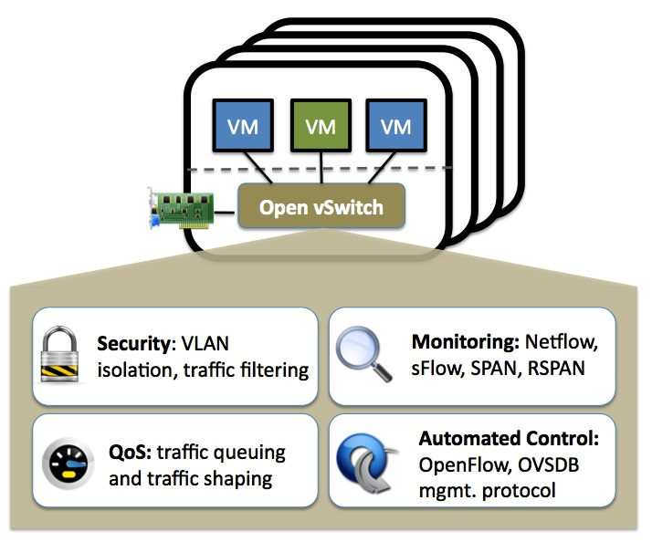

OVS 解决了物理交换机缺乏可编程能力的问题，同时支持安全、监控、QoS 功能，以及 VXLan、Gre 等隧道技术
> QoS（Quality of Service) 服务质量，指一个网络能够利用各种基础技术，来解决网络延迟和阻塞等问题，为指定网络通信提供更好的服务能力

在 SDN 架构下，OVS 作为 SDN 交换机，北向连接控制器，南向连接计算节点。并且 OVS 能够与真实物理交换机通信，相互交流数据

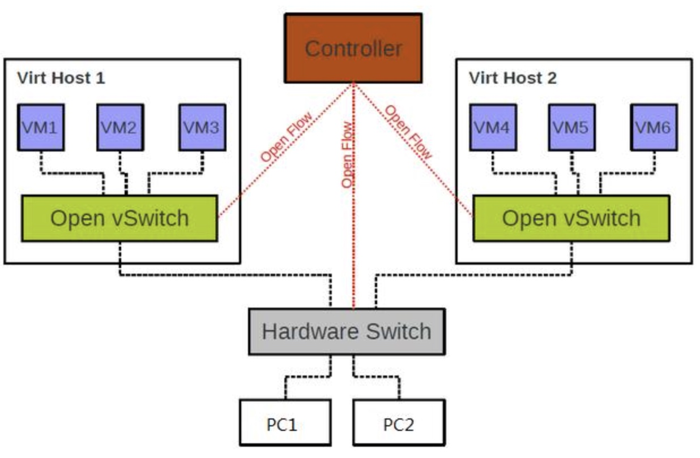

与 Linux Bridge 相比，OVS 的优势有：
- 更易于网络管理，OVS 可以方便地管理和监控网络状态和数据流
- 支持更多隧道协议，OVS 支持 GRE、VXLAN、IPsec 等，而 Linux Bridge 仅支持 GRE
- 作为多层虚拟交换机，OVS 既能工作在第二层，也能工作在第三层，且由于其功能丰富又可编程化，能集成到 SDN 架构中

而 Linux Bridge 的优势有：
- 稳定可靠，Linux Bridge 已使用多年，其稳定性和可靠性得到认可
- 易于安装且便于维护，Linux Bridge 是标准 Linux 安装的一部分，且由于其实现简单，故障排查很方便

[官方网站](https://www.openvswitch.org/) 和 [OpenFlow 在 OVS 中的应用](https://opengers.github.io/openstack/openstack-base-openflow-in-openvswitch/)

## 软件架构
OVS 软件架构中的主要组件：

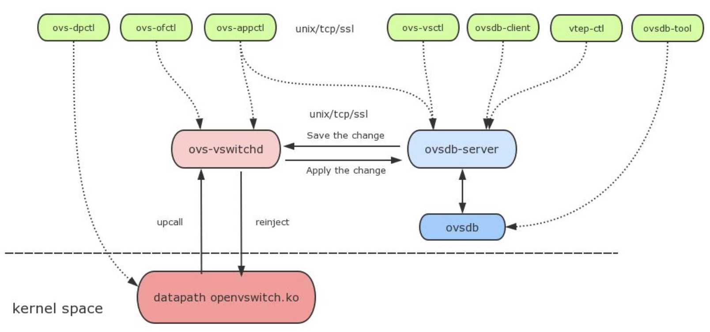
- **ovs-vswitchd**：虚拟交换机守护进程，用户态内存中保存了流表信息，配合 datapath 内核模块，实现基于流（Flow）的数据交换

- **ovsdb-server**：一个轻量级数据库服务端，接收对 ovsdb 数据库的访问。ovsdb 数据库是一个 Json 文件，用于存储 ovs-vswitchd 的配置信息，但不包含流表信息

- **datapath**：负责网络数据的实际转发，通过 Netlink Sockets 和 ovs-vswitchd 通信

- **ovs-dpctl**：用于管理 datapath 内核模块的配置

- **ovs-appctl**：用于发送命令到运行中的 ovs-vswitchd 和 ovsdb-server

- **ovs-ofctl**：用于管理 ovs-vswitchd 的 OpenFlow 流表，通过 OpenFlow 协议

- **ovs-vsctl**：用于管理 ovs-vswitchd 的配置

- **ovsdb-client**：用于访问 ovsdb-server，通过 ovsdb 协议

- **ovsdb-tool**：用于直接对 ovsdb 数据库进行操作，不需要依赖于ovsdb-server

> Netlink Sockets 是一种特殊的进程间通信方式，用以实现用户态进程与内核态进程的通信，也是网络应用程序与内核通信时最常用的方式，upcall、reinject 是需要使用 netlink 封装的函数

## 工作原理
### 包转发过程
OVS 转发数据包的过程：

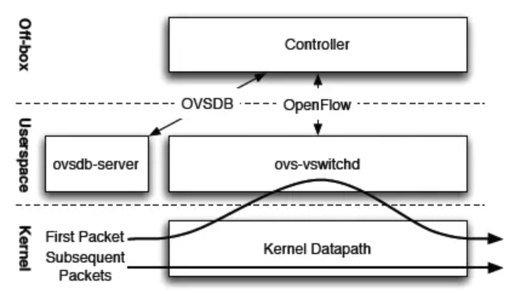

1. datapath 接收到从 OVS 网桥某个网络端口所发来的数据包，会从数据包中提取源/目的 IP、源/目的 MAC、端口等包头信息

2. datapath 查看内核态的 datapath flows，其中包含一次 match-action 即可完成数据包处理的精细流表，若匹配则直接完成对数据包的转发

3. 若是该网络端口发来的首个数据包，不能匹配 datapath flows 中的流表项，则需要发送 upcall 到用户态的 ovs-vswitchd 进程

4. ovs-vswitchd 进程接收到 upcall 后，查找用户态的 vswitchd flows，其中包含精细流表和模糊流表

5. 若仍不能匹配，有 OpenFlow 控制器接入的情况下，则通过 OpenFlow 协议的 Packet-In 递交数据包给控制器，由其下发新的流表进行处理

6. 若进行一次 match-action 就精确命中，则将对应的精细流表项存入 datapath flows；若经过多次 match-action 后模糊命中，则生成一条对应的精细流表项，同时存入 vswitchd flows 和 datapath flows

7. datapath flows 更新后，vswitchd 再次把该数据包注入 datapath 进行处理

8. datapath 再次查看内核态的 datapath flows，完成对数据包的转发

通过 ovs-vswitchd 查找 vswitchd flows 实现转发的路径称为 **slowpath**；通过 datapath flows 直接完成转发的路径称为 **fastpath**。OVS 通过 slow-path 和 fast-path 的配合使用，来完成网络数据的高效转发

OVS 作为一个交换机，既可以工作在上述 SDN 模式也可以工作在 Switch 模式。在 Switch 模式下就相当于一个基于 MAC 地址学习的二层交换机，通过 datapath 的 MAC 自学习功能来管理流表

### datapath flows
datapath flows 是 OVS 在内核态的流表缓存，早期使用了 Microflow Cache，即哈希结构的 OpenFlow 精细流表缓存，但是其命中率很低，转发性能提升有限

后来 OVS 使用 Megaflow Cache 作为 datapath flows，它支持带通配的 OpenFlow 精细流表缓存，可减少 upcall 到用户态查表的次数，但由于它的查表是基于元组空间搜索（TTS）实现的，因此增加了在内核态查表的次数

当前 OVS 使用 Megaflow Cache + Microflow Cache 作为 datapath flows，仍保留了 Microflow Cache 作为一级缓存，即报文进入后首先会查这一个一级缓存

不过这个 Microflow Cache 与原来不同。原来 Microflow Cache 是一个实际存在的精细流 Hash 表，但目前的 Microflow Cache 不是一个表，而是一个索引值，它指向的是最近一次查 Megaflow Cache 表项。这样数据包命中一级缓存后就不需要进行线性地链式搜索，可直接对应到其中一张 Megaflow 元组表

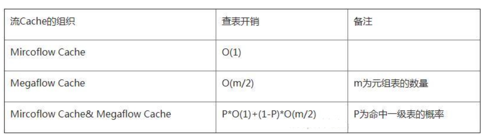

### 元祖空间搜索
元祖空间搜索（TTS）算法用于 OVS 和 OVS-DPDK 的 Megaflow Cache 实现，即 fastflow 需要匹配的流表缓存

TTS 的主要组成部分：
- **Rule**：单条的包过滤规则 + 动作
- **Tuple**：使用相同的匹配字段 + 每个匹配字段都使用相同的掩码长度，用于合并 Rule
- **Key**：先用 Tuple 的掩码按位与 Rule 中的各个字段值，丢弃 Tuple 不关心的位，再用于 hash

TTS 的匹配过程：
- 所有 Rule 都被分到了多个 Tuple 中，并存储在对应 Tuple 的哈希表中

- 当要对一个数据包进行匹配时，将遍历这多个 Tuple 下的哈希表，查出所有匹配成功的结果，然后按一定策略在匹配结果中选出最优的一个

具体的过程和实例可以参考 [OVS 与元组空间搜索算法](doc/3/OVS与元组空间搜索算法.pdf)

## 配置概念
**网桥（Bridge）**

代表一个虚拟交换机，一个主机中可以创建一个或者多个网桥

**端口（Port）**

代表虚拟交换机上的一个端口，一个网桥中可以创建一个或者多个端口。端口的类型可分为以下四种：
- **normal**
  
  创建时默认的端口类型，normal 端口用于处理进出其所绑定物理网卡的的数据包
  
- **internal**
    
  在每个网桥创建后，OVS 会默认为其创建一个同名的 internal 端口，并且会为 internal 端口创建并绑定一块同名的虚拟网卡，用于虚拟交换机接收待处理的数据包
    
- **patch**
    
  当宿主中有多个 OVS 网桥时，可以使用 patch 端口把两个网桥连起来，因此 patch 端口总是成对出现，分别连接在两个网桥上，在两个网桥之间交换数据
    
- **tunnel**
    
  tunnel 端口指一系列类型的虚拟端口，支持使用 VXLan、Gre 等隧道技术与在网络上其他位置的远程端口通信，类型则为对应的隧道技术
    
> normal 端口是二层端口，它所绑定网卡配置的 IP 地址信息无法生效，而 internal 端口是三层端口，它所绑定网卡可以配置 IP 地址信息，用来接收外部网络传入的数据包

**控制器（Controler）**

代表虚拟交换机主动连接的一个控制器，一个网桥上可以同时设置一个或多个控制器，并通过网络进行连接

控制器的主要作用是为主动连接过来的网桥下发 OpenFlow 流表，从而控制虚拟交换机中的数据包转发规则

一旦网桥连接到了一个 OpenFlow 控制器 ，则流表就由控制器统一管理了。若出现了连接中断，虚拟交换机除了会不断一在后台尝试重连，其后续行为由 fail_mode 故障模式决定：
- **standalone**：默认模式，若虚拟交换机连续三次连接不上控制器，则清除所有控制器下发的流表，自动转化为基于 MAC 地址学习的二层交换机，自行管理流表

- **secure**：按照原来控制器下发的流表继续转发

**管理器（Manager）**

用于使 ovsdb-server 根据控制器的配置来对外监听，被动等待 client 连接，并通过 ovsdb 协议管理 ovs-vswitchd 配置信息

## 常用命令
### ovs-vsctl 命令
查看所有网桥信息
``` bash
ovs-vsctl show
```

创建网桥
``` bash
# br_name 指定网桥命名
ovs-vsctl add-br ${br_name}
```

删除网桥
``` bash
# br_name 指定网桥
ovs-vsctl del-br ${br_name}
```

创建端口
``` bash
# br_name 指定网桥
# port_iface 指定绑定网卡，端口将和网卡同名
ovs-vsctl add-port ${br_name} ${port_iface}
```

删除端口
``` bash
# br_name 指定网桥
# port_name 指定端口
ovs-vsctl del-port ${br_name} ${port_name}
```

网桥设置控制器
``` bash
# br_name 指定网桥
# controller 指定主动连接的控制器，有以下写法：
# 1、tcp:${HOST}:PORT        通过 tcp
# 2、ssl:HOST:PORT           通过 ssh 连接
# 3、unix:FILE               通过 unix socket 连接
ovs-vsctl set-controller ${br_name} ${controller}
```

网桥设置 secure fail-mode
``` bash
# br_name 指定网桥
ovs-vsctl set-fail-mode ${br_name} secure 
```

设置管理器
``` bash
# manager 指定被动连接的管理器，有以下写法：
# punix:${file}             监听 unix socket
# ptcp:${port}[:${ip}]      监听 TCP 连接，省略 ip 表示任意本地 IP
# pssl:${port}[:${ip}]      监听 SSL 连接，省略 ip 表示任意本地 IP
ovs-vsctl set-manager ${manager}
```

查看 ovsdb 数据库
```bash
# table 指定具体的表，有以下常用表
# controller        控制器信息
# port              网桥端口信息
# interface         网络接口信息
ovs-vsctl list ${table} 
```

### ovs-ofctl 命令
查看流表项
``` bash
# br_name 指定网桥
# flow 指定流表项过滤，如 table=10，若不指定则表示所有流表项
ovs-ofctl dump-flow ${br_name} '${flow}'
```

添加流表项
``` bash
# br_name 指定网桥
# flow 指定流表项内容
ovs-ofctl add-flow ${br_name} '${flow}'
```

删除流表项
``` bash
# br_name 指定网桥
# flow 指定流表项过滤，如 in_port=eth,table=10，若不指定则表示所有流表项
ovs-ofctl del-flow ${br_name} '${flow}'
```

修改流表项的动作
``` bash
# br_name 指定网桥
# flow 指定流表项内容，如 in_port=eth,table=10,actions=drop，若不指定匹配字段则表示所有流表项
ovs-ofctl del-flow ${br_name} '${flow}'
```

查看组表项
``` bash
# br_name 指定网桥
# group 指定组表项过滤，如 group_id=1，若不指定则表示所有组表项
ovs-ofctl add-groups ${br_name} '${group}'
```

添加组表项
``` bash
# br_name 指定网桥
# group 指定组表项内容
ovs-ofctl add-flow ${br_name} '${group}'
```

删除组表项
``` bash
# br_name 指定网桥
# group 指定组表项过滤，如 group_id=1，若不指定则表示所有组表项
ovs-ofctl add-flow ${br_name} '${group}'
```

### ovs-appctl 命令
查看 Switch 模式下的 MAC 地址表
``` bash
# br_name 指定网桥
ovs-appctl fdb/show ${br_name}
```

## 流表项字段
查看流表项字段相关信息：
``` bash
# 查看 ovs-ofctl 命令相关的流表字段信息
man ovs-ofctl

# 查看 OVS 支持的 OpenFlow 流表字段信息
man ovs-fields

# 查看 OVS 支持的 OpenFlow 动作
man ovs-actions
```

### 基本字段
| 字段名 | 值 | 意义 |
| --- | --- | --- |
| cookie | 64 位 | 自定义标识 |
| duration | 时间长度 | 流表已存在时间 |
| n_packet | 整数 | 流表已匹配包数 |
| n_bytes | 整数 | 流表已匹配字节数 |
| priority | 0～65535 | 权重 |
| hard_age | 整数 | 流表距上次更新的秒数 |
| idle_age | 整数 | 流表空闲的秒数 |
| hard_timeout | 整数 | 流表的距上次更新超时，达到后流表自动被删除，默认 0 表示永不超时 |
| idle_timeout | 整数 | 流表的空闲超时，达到后流表自动被删除，默认 0 表示永不超时 |

> 以上字段仅 cookie 可用于增删查所有动作，且当 cookie 用于匹配时，其值的表示方式为 value/mask
> 
> mask 用于表示 cookie 值的匹配方式，对应位为 1 表示位严格匹配，对应位为 0 表示位通配。当 mask 值为 -1 时，则所有位都必须严格匹配
> 
> priority 仅可用于增加流表，当存在两个 priority 相同的流表，匹配的先后顺序将会是不确定的，应避免这种情况
> 
> 通过使用了 --strict 参数指定完整的流匹配信息，可以删除指定 priority 的流表，或修改流表的 priority

### 匹配字段
| 字段名 | 值 | 意义 |
| --- | --- | --- |
| table | 0～255 | 表 ID |
| in_port | 端口名或 ID | 数据包的进入端口 |
| dl_src | MAC 地址 | 数据包的源 MAC 地址 |
| dl_dst | MAC 地址 | 数据包的目的 MAC 地址 |
| nw_src | ip[/mask] | 数据包的源 IP 地址 |
| nw_dst | ip[/mask] | 数据包的目的IP 地址 |

> 当设置流表时，若不包含 table 字段，则默认为 table=0
> 
> in_port 值可以为 OpenFlow 的保留端口，如 LOCAL、CONTROLLER、ALL 等
> 
> 当 dl_src/dl_dst 用于匹配时，其值可以表示为 addr/mask，mask 为 01:00:00:00:00:00 时，表示仅匹配多播位
> 
> 也就是说，`dl_dst=01:00:00:00:00:00/01:00:00:00:00:00` 匹配所有的组播或广播报文，`dl_dst=00:00:00:00:00:00/01:00:00:00:00:00` 匹配所有的单播报文

通过速记符可以表示某些常用的匹配项，并且会影响流表的匹配字段显示：

| 速记符 | 长格值 | 意义 |
| --- | --- | --- |
| ip | eth_type=0x0800 | ip 协议，并显示相关匹配字段 |
| icmp | eth_type=0x0800,ip_proto=1 |  icmp 协议 |

### 动作字段
动作字段仅用于设置流表，其表示为：
```
actions=action,...
```

常用的动作 action 类型包含：
- `resubmit([port],[table])`
  
  有以下三种使用方式：
  1、若仅指定了 port，则将数据包的 in_port 入端口字段替换为指定端口后，在当前表进行匹配
  2、若两者都指定，则端口替换后将数据包递交到指定的表
  3、若仅指定了 table，则将数据包直接递交到指定的表
  
  > port 可以为端口名或 ID
  > table 为表 ID

- `output:port`
  
  将数据包转发到指定端口
  > port 可以为端口名或 ID

- `move:src[start..end]−>dst[start..end]`
  
  将指定的位从字段 src 复制到字段 dst
  > src 和 dst 必须是 `nicira−ext.h` 中定义的 NXM 字段名，如 NXM_OF_UDP_SRC
  start 和 end 分别表示需要操作的起始位和结束位
  OpenVSwitch 中引入的 OpenFlow1.0 的扩展字段称为 NXM

- `load:value->−>dst[start..end]`
 
  将指定的值 value 存储到字段 dst
  > dst 可以是数据包字段名或 NXM 字段名，若为数据包字段名，则等同于 set_field:value->dst
  > start 和 end 分别表示 dst 需要操作的起始位和结束位
  
- `mod_dl_src:mac`

  设置数据包的源 MAC 地址
  
- `mod_dl_dst:mac`

  设置数据包的目的 MAC 地址
  
- `mod_nw_src:ip`

  设置数据包的源 IP 地址

- `mod_nw_dst:ip`

  设置数据包的目的 IP 地址
  
## 组表项字段
### 组字段
| 字段名 | 值 | 意义 |
| --- | --- | --- |
| group_id | 整数 | 组 ID |
| type | all/select/indirect/ff | 组的类型 |
| selection_method | dp_hash/hash | 选择哈希方式 |
| fields(字段名) | 无 | 选择哈希方式为 hash 时的计算哈希值字段 |
| bucket | bucket_info:value,... | 桶信息 |

> type 的选项意义：
> - all，执行所有的桶
> - select，执行一个桶，根据权重进行负载均衡
> - indirect，执行指定的桶
> - ff/fast_failover，执行首个存活的桶
>
> 当为 select 类型时，OVS 会对于每个活动存储桶使用流数据对桶 ID 进行哈希并乘以权重来获得分数，然后选择分数最高的桶。而 selection_method 表示的选择哈希方式则控制了用于哈希的流数据
> 
> selection_method 的选项意义：
> - dp_hash，使用 datapath 计算哈希值
> - hash，使用 fields 设定的字段计算哈希值
  
### 桶字段
| 字段名 | 值 | 意义 |
| --- | --- | --- |
| bucket_id | 整数 | 桶 ID |
| weight | 整数 | 权重 |
| actions | action:value,... | 动作信息，字段和值等同流表项动作 |

## OVS-DPDK
### 简介
**OVS-DPDK** 是 OVS 使用了 DPDK 作为数据面技术的高性能实现，使其 fastpath 处于用户态，得益于 DPDK 绕过内核的数据包处理过程以及额外的优化，其转发性能远超原生 OVS 的 fastpath

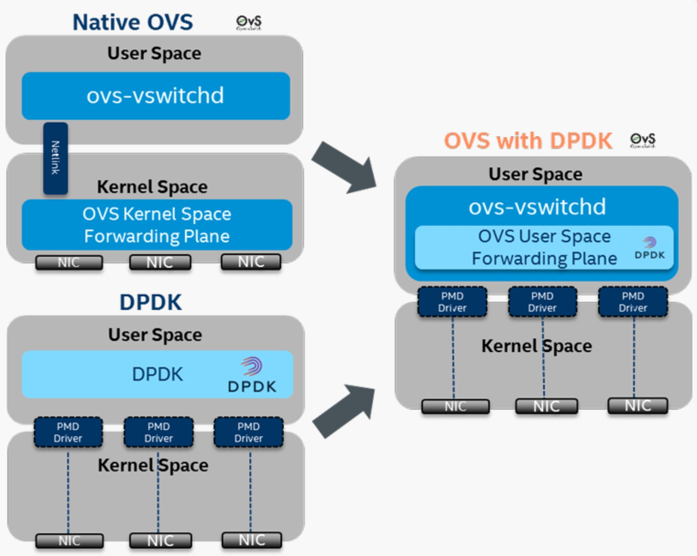

OVS-DPDK 从网络接口接收到的报文不需要内核态的 datapath（openvswitch.ko）处理，而是通过 DPDK PMD 直接递交到用户态 ovs-vswitchd 的转发平面

由于 OVS-DPDK 的 fastpath 和 slowpath 都处于用户态，当数据包在不匹配 fastpath 时，进入 slowpath 也不需要涉及 Netlink Sockets 将数据包从内核态到用户态拷贝的开销，而是直接查找 slowpath 的流表，可以理解 fastpath 就是 slowpath 相同内存空间的缓存

### 架构
原生 OVS 的软件架构如下：

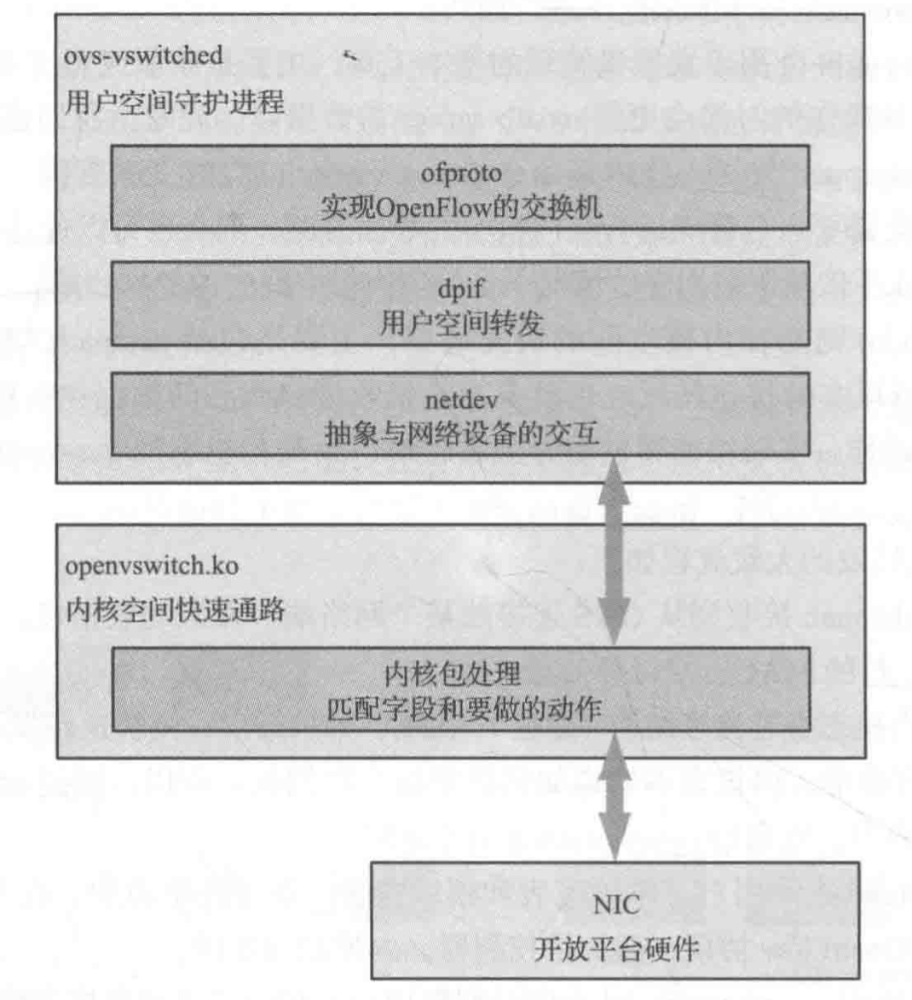
- **ofproto**：OpenFlow 交换机的实现

- **dpif**：完成用户态的报文转发，决定数据包走 fastpath、slowpath 或 controller

- **netdev**：抽象的网络设备接口

OVS-DPDK 的软件架构如下：

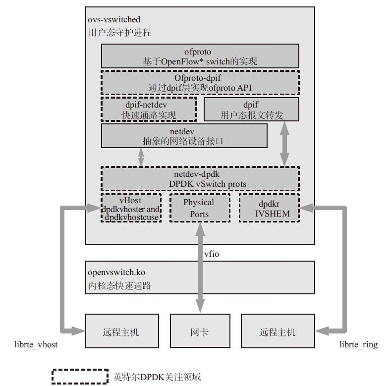

主要的组件如下：
- **Ofproto-dpif**：是基于 dpif 实现的 ofproto API

- **dpif-netdev**：用户态的 fastpath，基于 netdev 实现的 dpif API

- **netdev-dpdk**：实现了基于 DPDK 的 netdev API，其定义的几种网络接口如下：
    - **物理接口**：采用高性能的 DPDK PMD 驱动
    
    - **vhost**：支持两种 DPDK 实现的 vhost 优化接口，分别是 vhost-user 和 vhost-cuse
    
    - **dpdkr**：是基于 DPDK librte_ring 机制创建的DPDK ring 接口

> vhost-user 和 vhost-cuse 接口挂接到用户态的 datapath 上，与虚拟机的 virtio 网口可以快速通信
>
> vhost-cuse 是一个过渡性技术，vhost-user 是建议使用的接口。为了性能，vhost burst 的收发包个数设置需要和物理网口相同
> 
> dpdkr 接口挂接到用户态的 datapath 上，与使用了 IVSHMEM 的虚拟机合作可以通过零拷贝技术实现高速通信

### 工作原理
OVS-DPDK的数据包转发的大致流程如下：

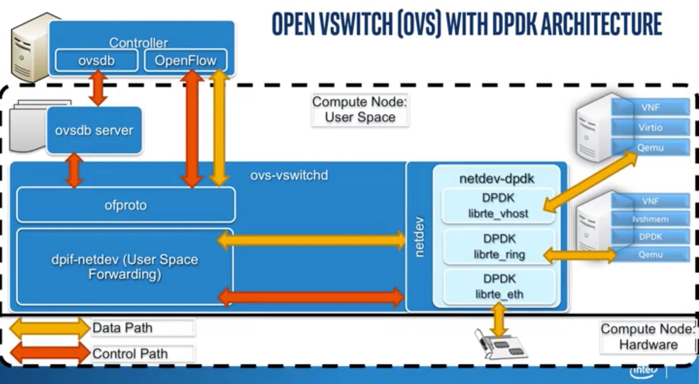

1. ovs-vswitchd 接收到从 OVS 所连接的某个网络端口发来的数据包，从数据包中提取源/目的 IP、源/目的 MAC、端口等包头信息

2. OVS 在用户态通过 EMC 进行流表精细匹配，若命中则通过 fastpath 直接完成转发

3. 若不命中，则在用户态通过 dpcls 进行流表通配符匹配，若命中则走 slowpath 转发，并更新 EMC

4. 若还不命中，有 OpenFlow 控制器接入的情况下，则通过 OpenFlow 协议的 Packet-In 递交数据包给控制器

5. 控制器下发新的流表更新至 EMC 和 dpcls，该数据包重新发起流表匹配，完成报文转发

在 OVS-DPDK 中，用于匹配的流表分为三个层级：

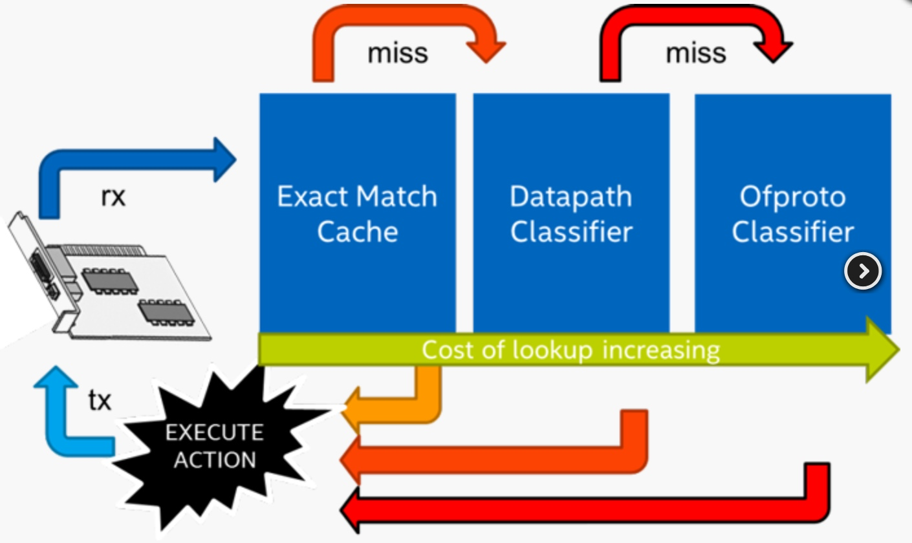

- **EMC（Exact Match Cache）**：只支持精确匹配，用于 faspath，即在步骤 2 中进行的匹配。性能最高

- **dpcls（Datapath Classifier）**：包含所有 Openflow 流表信息，支持通配符匹配，用于 slowpath，即在步骤 3 中进行的匹配，性能只有 EMC 的一半，但比原生 OVS 的 slowpath 性能高很多

- **ofproto（Ofproto Classifier）**：用于连接 controller，即在步骤 5 中匹配，性能最低，比 EMC 慢 10 倍以上

### vHost-User
vHost-User 是 OVS-DPDK 中的一个功能，通过和 QEMU 的协同工作，在用户空间实现虚拟机和虚拟交换机之间的数据通道，从而提高虚拟机的网络性能和吞吐量

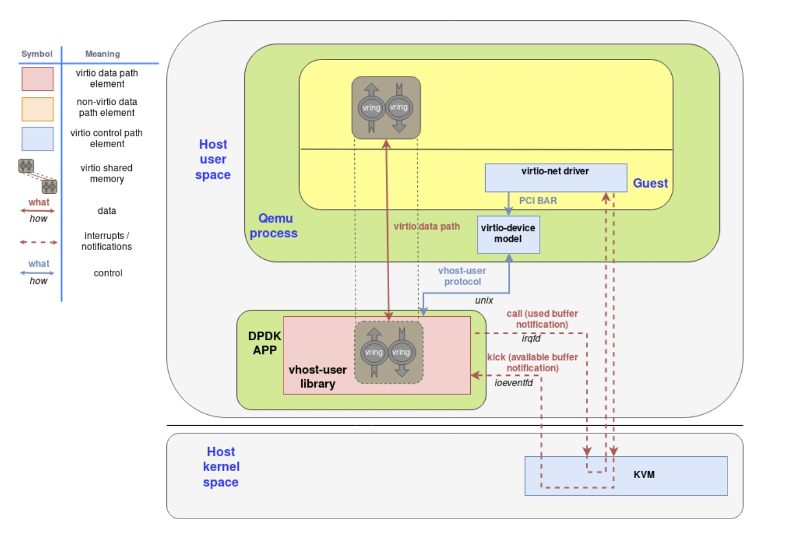

vHost-User Protocol 消息允许 OVS-DPDK 和 QEMU 交换 vBuffer 的内存布局和配置，从而在用户空间建立一对内存共享的 vBuffer，而 vBuffer 中包含读和写两个 vRing

vBuffer 的读写依赖虚拟机和虚拟交换机之间的消息通知，而 `kick` 和 `call` 分别利用了 irqfd 和 ioeventfd 机制实现，其基本原理都通过将一个 eventfd 与一个中断信号关联起来，以传递 eventfd 来进行中断事件的异步通知，其作用如下：

- `kick` 代表了 `Available Buffer` 通知，由虚拟机的虚拟网卡驱动发出，指示有已准备好的缓冲区，等待被虚拟交换机取走

- `call` 代表了 `Used Buffer` 通知，由虚拟交换机发出，指示有已完成处理的缓冲区，等待被虚拟机的虚拟网卡驱动取走

vHost-User 需要 QUME 中支持 client-server model，其中 server 负责创建、管理和销毁 vHost User sockets，client 负责连接到 server。OVS-DPDK 中支持两个类型的 vHost-User Port，其区别如下：

- `vhost-user` Port，OVS-DPDK 作为 server，QUME 作为 client，若 OVS-DPDK 重启，则 QUME 也需要重启才能正常工作

- `vhost-user-client` Port，QUME 作为 server，OVS-DPDK 作为 client，若 OVS-DPDK 重启，而 QUME 不会有影响，只进入等待连接的状态