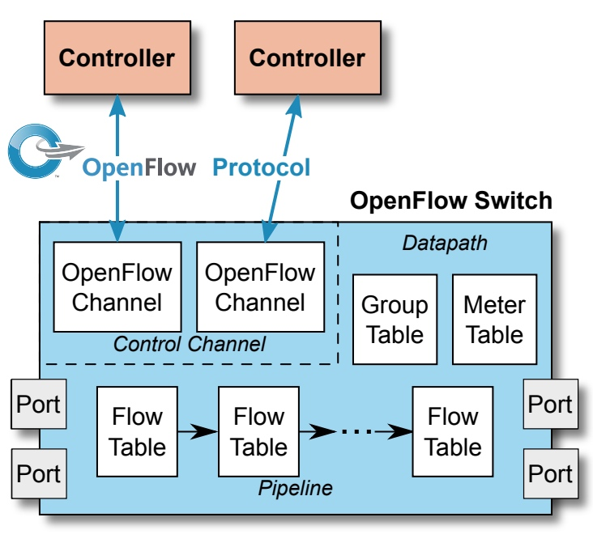
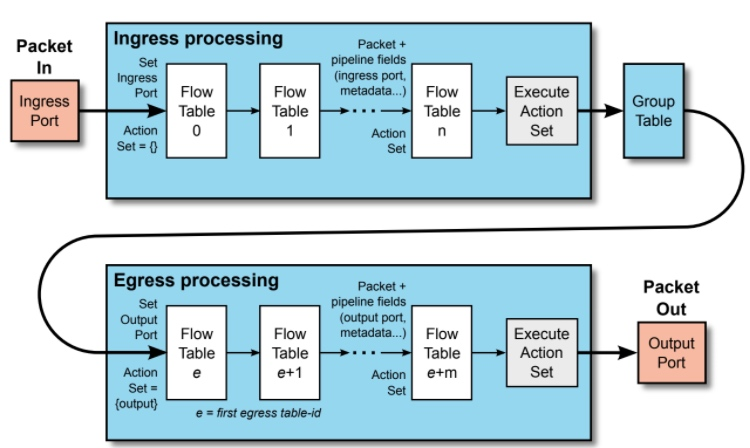
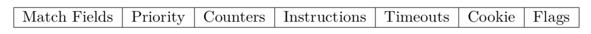
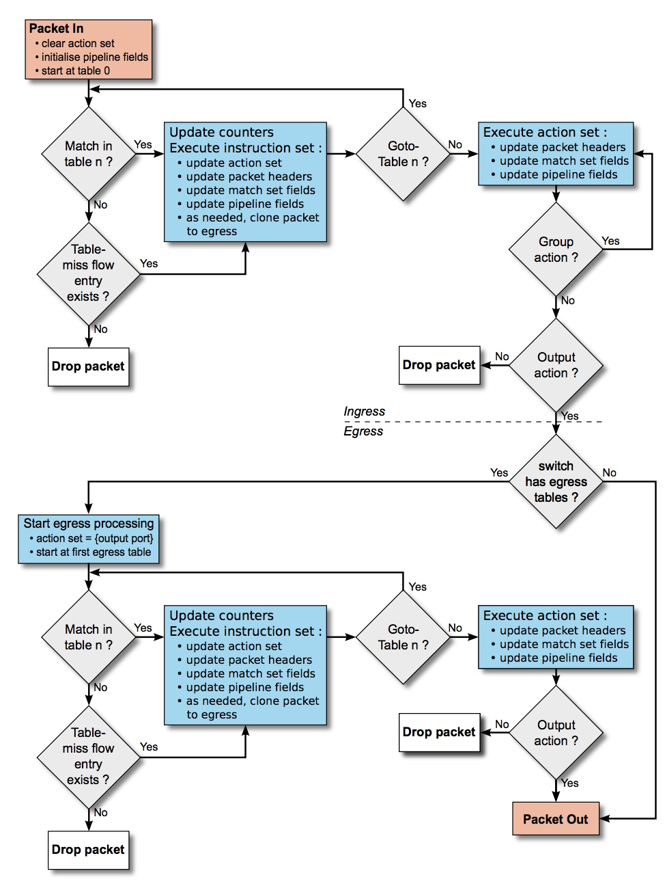
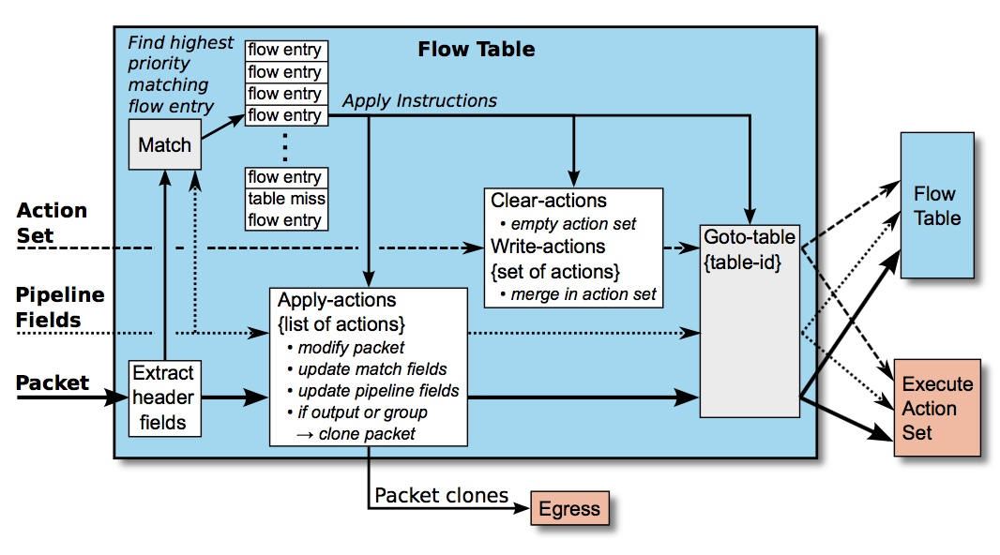
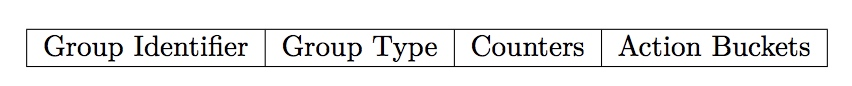
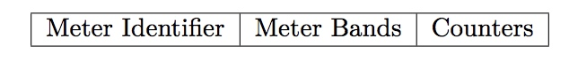
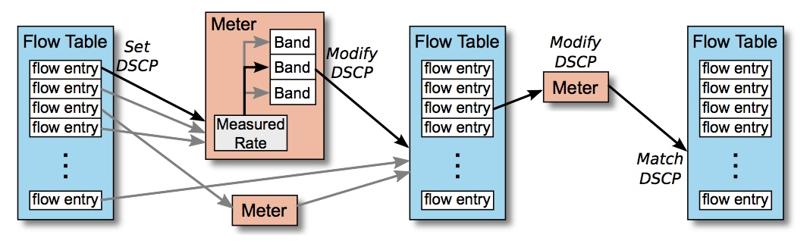

# 【SDN】OpenFlow

* [【SDN】OpenFlow](#sdnopenflow)
   * [简介](#简介)
   * [信道和协议](#信道和协议)
   * [端口](#端口)
   * [流水线和流表](#流水线和流表)
      * [流表项](#流表项)
      * [匹配](#匹配)
      * [指令和动作](#指令和动作)
   * [组表](#组表)
   * [计量表](#计量表)

## 简介
**OpenFlow** 是 ONF 推出的 **首个 SDN 实现规范**，其中提出了控制与转发分离的架构，规定了转发设备的基本组件和功能要求，以及和控制器之间的通信协议，[官方规范文档集合](https://opennetworking.org/software-defined-standards/specifications/) 和 
[OpenFlow v1.5 文档](https://opennetworking.org/wp-content/uploads/2014/10/openflow-switch-v1.5.0.pdf)

在 OpenFlow 规范中，定义了 **OpenFlow 控制器（Controller）** 和 **OpenFlow 交换机（Switch）**

而 OpenFlow 交换机由以下两个部分组成：

- **控制信道（Control Channel）**：指使用 OpenFlow 协议作为通信协议的 OpenFlow 信道（Channel），也称为安全信道（Secure Channel），OpenFlow 协议是目前最流行的南向协议

- **数据通路（Datapath）**：包括多级流表（Flow Table）构成的 OpenFlow 流水线（Pipeline）、端口（Port）、组表（Group Table）和计量表（Meter Table）

OpenFlow 交换机可分为两种：
- **OpenFlow-Hybrid**：同时支持传统网络协议栈和 OpenFlow 规范

- **OpenFlow-Only**：仅支持 OpenFlow 规范

## 信道和协议
OpenFlow 信道用于 OpenFlow 交换机和 OpenFlow 控制器之间建立连接，控制器可以通过该信道来管理交换机，以及接收交换机发出的事件

OpenFlow 信道使用了 OpenFlow 协议，一般是通过 TLS 来实现的，但也支持直接通过明文的 TCP 来实现，默认使用 6653 端口

OpenFlow 信道的两种工作模式：
- **并行模式**

  交换机允许同时与多个控制器建立连接，并独立地进行探活和重连，互相之间不影响。当且仅当交换机与所有控制器连接断开后，交换机才进入 Fail 状态

- **串行模式**

  控制器在同一时刻仅允许与一个交换机建立连接。交换机一旦与当前控制器连接断开后，不会进入 Fail 状态，而是立即根据 控制器 ID 的顺序依次尝试与其他控制器连接。当重复三次遍历所有控制器都无法建立连接，则交换机进入 Fail 状态

OpenFlow 协议支持三种类型的消息报文：
- **Controller-To-Switch**

  由控制器初始化并下发给交换机的消息，主要用于对交换机进行状态查询和管理配置，可能不需要交换机响应
    
  主要包含的消息类型：
  - **Features**：请求了解交换机的功能，交换机必须响应
  
  - **Modify-State**：管理交换机的状态，如流表项和端口状态
  
  - **Read-State**：收集交换机的各方面状态
  
  - **Flow-Mod**：用来添加、删除、修改交换机的流表信息。共有五种类型：ADD、DELETE、DELETE-STRICT、MODIFY、MODIFY-STRICT，其中 STRICT 表示需要完全匹配才生效
  
  - **Packet-Out**：回应交换机发来的 Packet-In 消息，包含一个动作列表来告知交换机需要对数据包执行的处理
  
  - **Asynchronous-Configuration**：设定或查询异步消息过滤器，用于指定希望接收的异步消息报文

- **Asynchronous**

  由交换机发送给控制器的消息，用来通知在交换机上发生的异步事件，以便控制器作出相应的操作
  
  主要包含的消息类型：
  - **Error**：将发生的错误通知控制器
  
  - **Flow-Removed**：通知控制器某个流表项已从流表中移除
  
  - **Port-Status**：将端口状态或设置的改变通知控制器
  
  - **Packet-In**：转移报文的控制权到控制器，通过 Controller 端口发送

- **Symmetric**

  由交换机或控制器发送的双向对称消息，并且可以在无请求情况下发送，主要用来建立连接、探活检测等

  主要包含的消息类型：
  - **Hello**：当连接启动时交换机和控制器会互相发送
  
  - **Echo**：控制器与交换机互相验证两者之间连接的存活

## 端口
OpenFlow 端口是与其他网络协议栈进行数据交换的网络接口，用作输入和输出数据包，并定义为以下类型：
- **物理端口**：与交换机的硬件接口连接

- **虚拟端口**：在物理端口的基础上进行隧道、链路聚合等逻辑性封装

- **保留端口**：
   - **ALL**：代表所有可转发的端口，即除了入端口和交换机配置的非转发端口外的所有端口。可用作出端口
   
   - **CONTROLLER**：代表 OpenFlow 控制信道，会使用 Openflow 协议封装。可用作入端口和出端口
   
   - **TABLE**：代表 OpenFlow 流水线，可用于处理 Packet-Out 数据包。可用作出端口
   
   - **IN_PORT**：代表数据包的入端口。可用作出端口
   
   - **UNSET**：代表未在动作集中设置的输出端口。仅用于 OXM_OF_ACTSET_OUTPUT 匹配字段
   
   - **ANY**：代表任意端口。仅用于在某些 OpenFlow 命令中表示不指定端口
   
   - **LOCAL**：代表本地网络协议栈。可用于入端口和出端口 
   
   - **NORMAL**：代表通过交换机传统流水线来转发数据包。可用于出端口
   
   - **FLOOD**：代表通过交换机传统流水线来泛洪数据包。可用于出端口

> OXM_OF_ACTSET_OUTPUT 匹配字段，表示在动作集中已设置的输出端口，通常用于流水线的出处理阶段
> 
> 每个端口关联着一个端口队列（Port Queue），用于数据包进行排队发送

其中后 3 种为非必需的端口，只在 OpenFlow-Hybrid 交换机中存在

## 流水线和流表
流表指导 OpenFlow 交换机对收到的数据包进行转发，相当于二层的 MAC 地址表和三层的路由表，流水线则组织了多级流表的处理逻辑，从而完成对数据包更为复杂的处理

在 OpenFlow-Hybrid 交换机中，会提供一个分类机制，使数据包由 OpenFlow 流水线或传统流水线处理；而在 OpenFlow-Only 交换机中，所有数据包都由 OpenFlow 流水线处理，否则无法被处理

数据包进入流水线处理的逻辑：

> 动作集（Action Set）中存储了所有匹配流表项所指定的动作（Action）

OpenFlow 流水线分为两个阶段：
- **入处理（Ingress Processing）**：起始于首个流表（即流表 0），最终执行的动作集中包含端口输出动作

- **出处理（Egress Processing）**：可选的阶段，通过交换机配置来指定起始流表，通常根据动作集中设置的输出端口来进一步处理

控制器下发流表的两种方式： 
- **主动下发（Proactive）**：在控制器和交换机建立连接后，数据包还未到达交换机，就主动下发流表，相当于预置流表

- **反应下发（Reactive）**：当数据包到达交换机且因查流表失败时，产生 Packet-In 消息发送到控制器，控制器计算并下发流表到交换机，相当于按需下发流表
  
### 流表项
流表项（Flow Entry）是流表的记录，实质作用于数据包的处理，其组成结构如下：

- **匹配字段（Match Fields）**：包括一系列的匹配字段，用于匹配数据包的包头字段（Header Fields）以及流水线字段（Pipeline Fields）

- **优先级（Priority）**：匹配优先级

- **计数器（Counters）**：所匹配的数据包数量

- **指令集（Instructions）**：修改动作集或流水线处理

- **超时器（Timeouts）**：在交换机中过期的最大超时或空闲超时

- **Cookie**：由控制器选择的任意数据，可用于控制器进行流表项统计和操作过滤，不用作过滤数据包

- **Flags**：用于流表项管理，比如触发交换机向控制器发送异步消息

> 流水线字段，指数据包在流水线处理过程中为其设置的字段，包括入端口、隧道数据包的 Tunnel_Id、先前流表设置的元数据等

在流表项中，最重要结构是匹配字段和指令，OpenFlow 交换机会解析所收到数据包的包头，并与流表中流表项的匹配字段进行匹配，匹配成功则执行指令，因此流表可以简化理解为 key-value 形式的 Match-Instructions 表

流表项从流表中删除有两种方式：一是控制器的流表项删除请求，二是交换机的流表项超时机制，若超时为 0 则表示永不超时

### 匹配
一个流表的匹配过程如下：

1. 数据包会对优先级最高的流表项进行优先匹配
2. 若匹配成功，则更新计数器，并执行相应指令
3. 若匹配失败
    1. 若流表中没有设置 Table-Miss 流表项，丢弃数据包
    2. 若流表中设置了 Table-Miss 流表项，则会匹配该表项，并执行相应指令

> Table-Miss 流表项是指优先级为 0，且没有匹配字段的流表项，由控制器决定是否设置

### 指令和动作
指令是流表项匹配成功时执行的操作，可进行以下分类：
- **操作动作集**
    - **Write-Actions**：表示添加、修改动作集
    
    - **Clear-Actions**：表示清空动作集，OpenFlow 交换机非必须支持
    
    - **Apply-Actions**：表示立即执行指定的行动，而不改变行动集，OpenFlow 交换机非必须支持

- **指示流水线处理逻辑**
    - **Go-To-Table**：表示从序号低的表跳转到序号高的表，不能逆序号大小跳转

- **其他**
    - **Write-Metadata**：表示更新元数据，OpenFlow 交换机非必须支持
    
    - **Stat-Trigger**：表示设定触发器，OpenFlow 交换机非必须支持

动作是指对数据包的具体处理动作，主要有以下分类和动作：
- **定义数据包的转发**
    - **Output $port$**：表示转发数据包到指定端口
    
    - **Drop**：表示丢弃数据包
    
    - **Group $group$**：表示交由组表处理，执行指定组的动作
    
    - **Meter $meter$**：表示交由计量表处理，执行指定计量的动作，OpenFlow 交换机非必须支持
    
- **修改数据包的某些字段**
    - **Set-Field $field$ $value$**：表示设置数据包包头字段的值，OpenFlow 交换机非必须支持
    
    - **Copy-Field $src\_field$ $dst\_field$**：表示复制指定字段的值到另一个字段，可以是包头字段也可以是流水线字段，通常是在两者之间进行复制，OpenFlow 交换机非必须支持

在一个流表中，匹配和指令执行的过程如下：

## 组表
组表由若干条组表项（Group Entry）组成，具有将多个动作定义为一个组的能力，从而实现广播、多播，负载均衡、链路聚合、故障转移等功能

组表项的主要组成：

- **组标识符（Group Identifier）**：用于标识一个组，是 32 位的无符号整数

- **组类型（Group Identifier）**：指定动作桶的执行方式，具有以下类型：
    - **indirect**：只包含一个动作桶，可实现流量汇聚
    
    - **all**：执行所包含的所有动作桶，可实现广播、多播
    
    - **select**：根据指定算法（哈希、轮循等）选择一个动作桶来执行，可实现负载均衡、链路聚合
    
    - **fast failover**：选择第一个有效的动作桶来执行，可实现故障转移

- **计数器（Counters）**：所处理的数据包数量

- **动作桶（Action Buckets）**：是一个有序列表，包含一系列的动作桶，每个动作桶具有一个用于执行的动作集

## 计量表
计量表由若干计量表项（Meter Entry）组成，计量表项定义了针对流的计量，从而实现 QoS 功能，如限速、DiffServ 等

计量表项的组成：

- **计量识符（Group Identifier）**：用于标识一个计量表项，是 32 位的无符号整数

- **计量带（Meter Bands）**：包含一系列的计量带，计量带的主要组成：
    - **带类型（band type）**：定义数据包的处理方式，包括丢弃（Drop）和 DSCP 标记（DSCP Remark），配合 DiffServ 策略生效
    
    - **速率（rate）**：用于计量表项为数据包选择计量带。基于数据包的当前速率，选择低于且最接近该速率的单个计量带，若该速率比任何计量带的速率都低，则不被计量带处理
    
    - **瞬时流量（burst）**：对于超过速率的数据包，提供指定瞬时流量的冗余，当突破了这个瞬时流量才会转换计量带
    
    - **计数器（Counters）**：所处理的数据包数量
    
    - **类型参数（type specific arguments）**：一些带类型需要额外的参数

- **计数器（Counters）**：所处理的数据包数量

计量表的工作过程：

限速操作的基本原理是 burst 令牌桶原理，即每一个数据包想要被转发都需要得到一个令牌，而令牌来自于令牌桶

令牌桶以一个速度获得令牌，该速度就是限速的速度，超过令牌桶容量的令牌会溢出，同时数据包转发以一定的速度消耗令牌，而 burst 指的就是令牌桶的容量

令牌桶的作用是面对突发的大量数据请求可以瞬间消耗令牌桶内的令牌，所以有 burst 的效果就是某个大流量到来的瞬间限速的速度可达到令牌桶的容量 + 限速的速度，而不会丢失数据包
