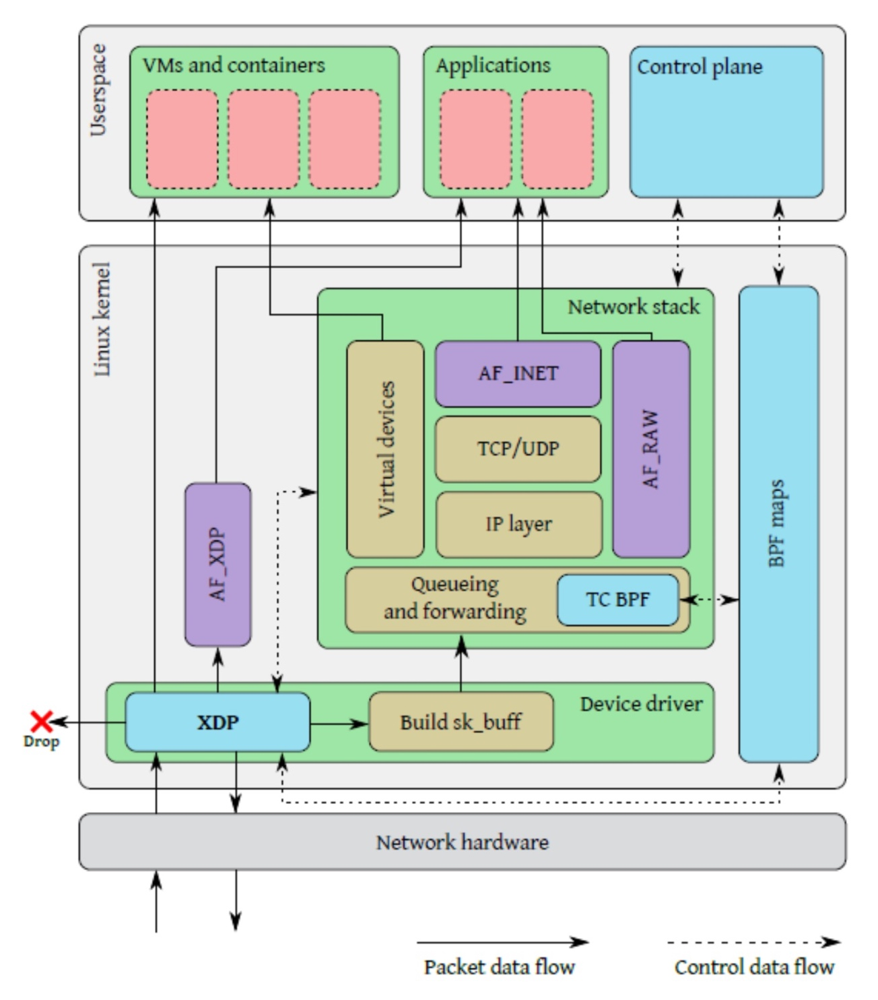

# 【SDN】XDP

* [【SDN】XDP](#sdnxdp)
   * [简介](#简介)
   * [BPF](#bpf)
      * [工作原理](#工作原理)
      * [指令集](#指令集)
      * [基础设施](#基础设施)
   * [包处理](#包处理)
      * [工作模式](#工作模式)
      * [处理流程](#处理流程)
      * [返回码](#返回码)
   * [开发实践](#开发实践)
      * [环境和流程](#环境和流程)

## 简介
**XDP（eXpress DataPath）** 提供一个高性能、可编程、内核态的包处理框架，基于 eBPF 技术实现，可运行于最早进行包处理的位置，且无需内核修改即可动态集成新功能，在 Linux 4.8 内核版本被合入，[官方文档](https://www.iovisor.org/technology/xdp) 和 [Cilium 介绍文档](doc/6/Cilium：BPF和XDP参考指南_2021.pdf)

XDP Hook 点位于网卡驱动从 Ring Buffer 中接收到数据包后，不需要执行任何带来开销的操作，比如分配用于递交到网络协议栈的 SKB 结构，或将数据包递交给 GRO 处理等，XDP 程序就能够对数据包执行尽早处理，比如包解析、查表、创建和管理有状态的防火墙，解封和封装隧道等，其工作过程如下：


XDP 采用和 DPDK 完全相反的技术来保证数据包的高性能转发，**它将数据包的处理逻辑放到了内核态**，并位于进入内核协议栈之前，既免去了内核态到用户态的上下文切换，也不用经历网络协议栈的复杂流程，同时又保留了内核控制网络设备硬件的能力以及其他基础设施

对比于 Kernel Bypass，XDP 将包处理保留在内核态的其他好处还包括：
- 不需要任何专门的硬件支持
- 不需要内核旁路 IO，也不需要任何第三方内核模块
- 不取代网络协议栈并可以复用进行协同工作

XDP 成熟的应用场景如下：
- 容器网络方案 Cilium 
- Facebook 负载均衡方案 Katran
- AF_XDP Socket 和基于它的 DPDK PMD，通过 XDP 直接接收数据包

## BPF
**BPF（Berkeley Packet Filter）** 是一个过滤网络报文的架构，是 tcpdump、wireshark 等网络监控领域的基石，[BPF 介绍文档](doc/6/BPF介绍_2021.pdf)

**eBPF（extended BPF）** 则是经过重新设计后的演进版本，可用于性能分析工具、软件定义网络等场景，此后原来的 BPF 就被称为 **cBPF（classic BPF）**，然后所讨论的 BPF 通常指的就是 eBPF。不同版本内核对 eBPF 的特性支持存在差异，很多新特性只存在于高版本的内核

> tcpdump 的工作流程：
> 位于内核之中的 BPF 模块一方面接收 tcpdump 经由 libpcap 转码而来的滤包条件（Pseudo Machine Language），另一方面将符合条件的报文复制到用户空间最终经由 libpcap 发送给 tcpdump

### 工作原理
BPF 提供一套 **基于寄存器的 RISC 指令集**，其最初的设计目标是能够先用 C 语言的一个子集编写程序，再然后用一个编译器后端比如 LLVM 将其编译成 BPF 指令，最后再通过一个位于内核中的 JIT 即时编译器将 BPF 指令映射成处理器的原生指令，以获得在内核中的最佳执行性能


不同类型的 BPF 程序所支持 Attach 的 Hook 点不一样，Hook 点指位于数据包接收过程或者数据包发送过程中的某个钩子，通过 `bpf()` 系统调用的 `BPF_PROG_LOAD` 命令加载指定的 BPF 程序，得到其对应的文件描述符后，再通过对应的系统调用将其 Attach 到对应 Hook 点上

BPF 程序在内核中的执行总是事件驱动的，内核处理数据包接收或发送，并执行到某个 Hook 点时，则会触发该 Hook 点所 Attach 的 BPF 程序的执行

BPF 程序位于内核执行的好处如下：
- 无需在内核空间和用户空间切换，实现可编程的内核态数据路径
- 可以在无需重启内核的情况下实现原子更新 BPF 程序
- 与内核协同工作，复用已有的内核基础设施
- BPF 程序会被一个位于内核中的校验器进行校验，以确保不会造成内核崩溃，以及程序一定会终止

### 指令集
BPF 指令集的 **指令格式（Instruction Format）** 建模为 **两操作数指令（Two Operand Instructions）**，这种格式可以在 JIT 阶段将 BPF 指令映射为处理器原生指令，整个指令集是固定长度的，即每条指令都以 64 Bit 编码

BPF 指令集中还包含这些组成部分，分别是 1 个 64 位寄存器，1 个程序计数器（PC），以及一个 512 Bytes 固定大小的 BPF 栈空间。寄存器的名字从 `r0` 到 `r10`，其中 `r10` 是只读寄存器，存放的是访问 BPF 栈空间的 **栈帧指针（Frame Pointer）**，而 `r0` 到 `r9` 是可读写的通用目的寄存器

BPF 程序可以调用 **内核核心（Core Kernel）** 而非内核模块所预定义的一些辅助函数，其调用约定的寄存器用法如下：
- `r0` 存放被调用的辅助函数的返回值
- `r1` 到 `r5` 存放 BPF 调用内核辅助函数时传递的参数
- `r6` 到 `r9` 由 **被调用方（Callee）** 保存，在函数返回之后 **调用方（Caller）** 可以读取

每个 BPF 程序的最大指令数限制在 4096 条以内，对于内核 5.1+，这个限制放大到了 100 万条，从设计上来保证每个程序都会很快结束。虽然指令集中包含前向和后向跳转，但内核中的 BPF 校验器禁止程序中有循环，因此可以永远保证程序会终止

Linux 内核中内置了一个 BPF JIT 编译器，能够执行由 BPF 指令所组成的程序，对于不支持 JIT 的架构，则仍通过内核中内置的 BPF 解释器进行执行。与 BPF 解释器相比，BPF JIT 编译器可以降低每个指令的开销，极大加速 BPF 程序的执行

对于 cBPF 程序，在内核中也会被透明地转换成 eBPF 程序，除非是那些仍然内置了 cBPF JIT 的架构，并且还没有迁移到 eBPF JIT

### 基础设施
BPF 在除指令集之外，还提供了围绕自身的一些基础设施，比如：
- **BPF Map**

  

  是驻留在内核空间的高效 Key-Value 存储，Map 中的数据可以被 BPF 程序访问，若想在多次 BPF 程序之间保存状态，可以将状态信息放到 Map。Map 还可以从用户空间通过文件描述符访问，可以在任意 BPF 程序以及用户空间应用之间共享。用户进程可通过 `bpf()` 系统调用的 `BPF_MPA_*` 命令进行 MPA 管理
  
  Map 的实现由内核核心提供，分为使用相同的一组 BPF 辅助函数来操作的通用 MPA，以及使用特定的一组 BPF 辅助函数来操作的非通用 MPA。共享 Map 的 BPF 程序不要求是相同的程序类型，但单个 BPF 程序目前最多可直接访问 64 个不同 Map

- **辅助函数（Helper Function）**

  用于更方便地利用内核功能或与内核交互，不同类型的 BPF 程序能够使用的辅助函数可能是不同的，所有的辅助函数都共享同一个通用的、和系统调用类似的函数签名，签名定义为 `u64 fn(u64 r1, u64 r2, u64 r3, u64 r4, u64 r5)`
  
  所有的 BPF 辅助函数都是内核核心的一部分，无法通过内核模块来扩展或添加，当前可用的 BPF 辅助函数已经有几十个，并且数量还在不断增加

- **对象固定（Object Pinning）**

  

  BPF Map 和 BPF 程序作为内核资源，基于内核中的匿名 Inode，只能通过文件描述符进行访问，但由于文件描述符受限于进程的生命周期，会使得 Map 共享之类的操作非常笨重
  
  为了解决这个问题，内核实现了一个位于内核空间的最小 BPF 文件系统，BPF Map 和 BPF 程序 都可以固定到这个文件系统中，该过程则被称为对象固定。用户进程可通过 `bpf()` 系统调用的 `BPF_OBJ_*` 命令进行BPF 对象管理

- **尾调用（Tail Calls）**

  

  指一个 BPF 程序可以调用另一个 BPF 程序，并且调用完成后不用返回到原来的程序中。和普通的函数调用相比，这种调用方式的开销最小，因为它是使用长跳转指令实现的，而且复用了原来的栈帧
  
  类型相同的 BPF 程序才可以尾调用，并且还要在 JIT 编译方面相匹配， 因此通过尾调用关联的一系列 BPF 程序，要么是 JIT 编译执行，要么是解释器执行，而不能混合使用两种方式。尾调用的层数也是有限制的，目前上限是 33 层调用
  
  尾调用的执行涉及两个步骤，一是设置一个类型为 BPF_MAP_TYPE_PROG_ARRAY 的 BPF Map，该 Map 也被称为程序数组，二是调用辅助函数 `bpf_tail_call()`，并传入一个对程序数组的引用以及一个用于查找程序的 Key，内核将这个辅助函数调用内联到一个特殊的 BPF 指令内

- **BPF-To-BPF 调用**

  

  该特性用于支持 BPF 函数间调用，在此之前，BPF 程序必须将所有需要复用的函数进行特殊处理，比如头文件中声明为 `always_inline`，而当 LLVM 编译和生成 BPF 对象文件时，所有这些函数将被内联，在生成的对象文件中重复多次，导致 BPF 指令膨胀
  
  BPF-To-BPF 调用减小了所生成 BPF 指令的体积，对 CPU Cache 中的指令缓存也更友好，BPF JIT 编译器会先为每个函数体建立独立的镜像，并在完成编译前修改镜像中的函数调用地址，使 BPF-To-BPF 调用的实现类似于 BPF 辅助函数调用
  
  BPF 辅助函数的调用约定也适用于 BPF 函数间调用，其最大嵌套调用深度是 8。在内核 5.9 版本之前，尾调用和 BPF-to-BPF 调用是互斥的，后来才允许同时使用这两种调用类型，充分利用二者各自的优点，但仅限于 `x86_64` 架构
  
  混合使用两种调用类型是有限制的，否则会导致内核栈溢出。程序在运行时期间从栈空间中删除函数对应的栈帧，称为 **栈回溯（Stack Unwinding）**，而尾调用在跳转到目标 BPF 程序之前，只会展开它当前 所处层级的栈帧
  
  
  
  因为若尾调用是从某个子函数发起的，则所有该子函数之前的栈帧都保持在栈上，只有当最后一个函数执行结束时，所有前面的栈帧才将被回溯，然后控制权返回到 BPF 程序的调用者，从而导致内核栈溢出
  
  内核为此引入了额外的限制，对于调用链中的所有 BPF 函数，其栈帧大小不能超过 256 Bytes，对于以上非嵌套子函数使用尾调用的情况，整个 BPF 程序调用链最多能使用大约 8K Bytes 的栈空间，计算方式是 `256 * 尾调用层数上限 33`

## 包处理
### 工作模式
根据 XDP 处理数据包的时机，可以分为以下三种工作模式，讨论 XDP 通常指默认的 Native 模式：
- **Native XDP**

  默认模式，XDP BPF 程序运行在网络驱动的早期接收路径上，数据包在分配 SKB 之前进入 XDP，需要网卡驱动支持，无需网卡设备支持
  
- **Offload XDP**
  
  XDP BPF 程序 Offload 到网卡，而不是在主机的 CPU 上执行，数据包在网卡设备中进入 XDP，需要网卡设备支持，也需要网卡驱动支持，性能是最高的

- **Generic XDP**

  XDP 代码运行在网络协议栈的靠后位置，数据包在内核协议栈中进入 XDP，不需要网卡设备支持，也不需要网卡驱动支持，但性能远低于其他模式

### 处理流程
XDP 作为一个在驱动中运行 BPF 的框架，其保证了包是线性放置的，并适应于单个可读写的 Ring Buffer 记录，还提供了额外的 256 字节 `headroom` 给 BPF 程序，后者可以利用 `bpf_xdp_adjust_head()` 辅助函数增删自定义封装头，或者通过 `bpf_xdp_adjust_meta()` 在包前面增删自定义元数据

XDP BPF 程序允许直接访问包中的数据，即程序直接将数据的指针放到了寄存器中，然后将内容加载到寄存器，相应地再将内容从寄存器写到包中，而数据包在 XDP 中的表示形式是 `xdp_buff`，这也是传递给 BPF 程序的上下文结构：

``` c
// 这些元数据在 DMA 填充 Ring Buffer 时确定
struct xdp_rxq_info {
    struct net_device *dev;     // 网卡设备
    u32 queue_index;            // 队列号
    u32 reg_state;              // 寄存器状态
} ____cacheline_aligned;

struct xdp_buff {             // 某些版本也命名为 xdp_md
    void *data;               // 包数据的起始位置
    void *data_end;           // 包数据的结尾位置
    void *data_meta;          // 包元数据的起始位置，增加自定义元数据时会它向 data_hard_start 靠近
    void *data_hard_start;    // 最大的 headroom 开始位置，增加自定义封装头时 data 会向它靠近
    struct xdp_rxq_info *rxq; // 接收队列的元数据
};
```

对于通过 XDP 处理的数据包，网卡驱动会将 `xdp_buff` 填充为 `sk_buff` 然后递交到网络协议栈，TC Hook 点位于网络协议栈收到数据包后，接收一个 `sk_buff` 的简易镜像结构 `__sk_buff`，作为 TC BPF 程序的上下文结构进行处理，其流程如下：



而 `data_meta` 所指示空间中的元数据，通常对内核网络栈是透明的，但可以被 TC BPF 程序进行读取。`data_meta` 还可以单纯用于在尾调用时传递状态，以上指针的关系是：`data_hard_start <= data_meta <= data < data_end`

### 返回码
XDP BPF 程序接收 `xdp_buff` 作为参数，返回 `xdp_action` 作为处理结果，以告知驱动接下来如何处理该数据包，其包含的值如下：

``` c
enum xdp_action {
    XDP_ABORTED = 0,
    XDP_DROP,
    XDP_PASS,
    XDP_TX,
    XDP_REDIRECT,
};
```
- **XDP_DROP**

  在驱动层立即将该包丢弃
  
- **XDP_PASS**

  允许将这个包递交到网络协议栈，即为其填充 SKB 结构然后送到 GRO 处理，最终进入网络协议栈

- **XDP_TX**

  在收到包的网卡上直接将包再发送出去

- **XDP_REDIRECT**

  通过指定的其他网卡将包发出去，或者将包重定向到一个 BPF CPUMAP，即将包交给非 XDP 的其他 CPU 进行继续处理，包括递交到内核协议栈

- **XDP_ABORTED**

  表示程序产生异常，会和 `XDP_DROP` 一样在驱动层立即将该包丢弃，但会进行打点记录，可通过 tracing 工具来监控这种非正常处理
  
## 开发实践
### 环境和流程
开发环境所需的工具安装，以 Ubuntu 为例：

``` bash
sudo apt-get install -y make gcc libssl-dev bc libelf-dev libcap-dev \
  clang gcc-multilib llvm libncurses5-dev pkg-config libmnl-dev bison flex \
  graphviz
```

XDP 的开发流程如下：

**1. 使用 C 编写 BPF 程序**

实现丢弃包的最小完整 XDP 程序 `xdp-example`：
  
``` c
#include <linux/bpf.h>

#ifndef __section
# define __section(NAME)                  \
   __attribute__((section(NAME), used))
#endif

__section("prog")
int xdp_drop(struct xdp_md *ctx)
{
    return XDP_DROP;
}

char __license[] __section("license") = "GPL";
```

**2. 使用 `clang` 或 `llvm` 命令将 C BPF 程序编译为 BPF 对象文件**

``` bash
# -g 将调试信息以 DWARF 格式存储到 BPF 对象文件中，在反编译时可查看注解

clang -O2 -Wall -target bpf -c xdp-example.c -o xdp-example.o
```

**3. 使用 `ip link` 命令加载 BPF 对象文件并 Attach 到网络设备上**

``` bash
# xdpgeneric 表示 Generic XDP 模式

ip link set dev em1 xdp obj xdp-example.o sec prog
```

调试信息的获取，有以下方式：
- **通过 `clang` 命令将 C BPF 程序编译为 BPF 汇编文件**

``` bash
clang -O2 -S -Wall -target bpf -c xdp-example.c -o xdp-example.S
```

- **通过 `llvm-objdump` 命令将 BPF 对象文件反编译为 BPF 汇编文件**

``` bash
llvm-objdump -S --no-show-raw-insn xdp-example.o
```
