# 【SDN】云网络产品

* [【SDN】云网络产品](#sdn云网络产品)
   * [简介](#简介)
   * [产品演进](#产品演进)
   * [产品体系](#产品体系)
   * [云数据中心网络产品](#云数据中心网络产品)
      * [VPC](#vpc)
      * [弹性公网 IP](#弹性公网-ip)
      * [NAT 网关](#nat-网关)
      * [IPv6 网关](#ipv6-网关)
      * [对等连接](#对等连接)
      * [私网连接](#私网连接)
      * [负载均衡](#负载均衡)
   * [跨地域网络产品](#跨地域网络产品)
      * [云企业网](#云企业网)
      * [全球加速](#全球加速)
   * [混合云网络产品](#混合云网络产品)
      * [VPN 网关](#vpn-网关)
      * [智能接入网关](#智能接入网关)
      * [高速通道](#高速通道)
   * [其他网络产品](#其他网络产品)
      * [云解析](#云解析)
      * [云安全](#云安全)

## 简介
**云网络（Cloud Networing）** 是为 **云计算（Cloud Computing）** 而生的，其对于云计算的主要作用：一是 **支持算力共享**，二是 **支持弹性能力**，三是 **连接无处不在的算力**

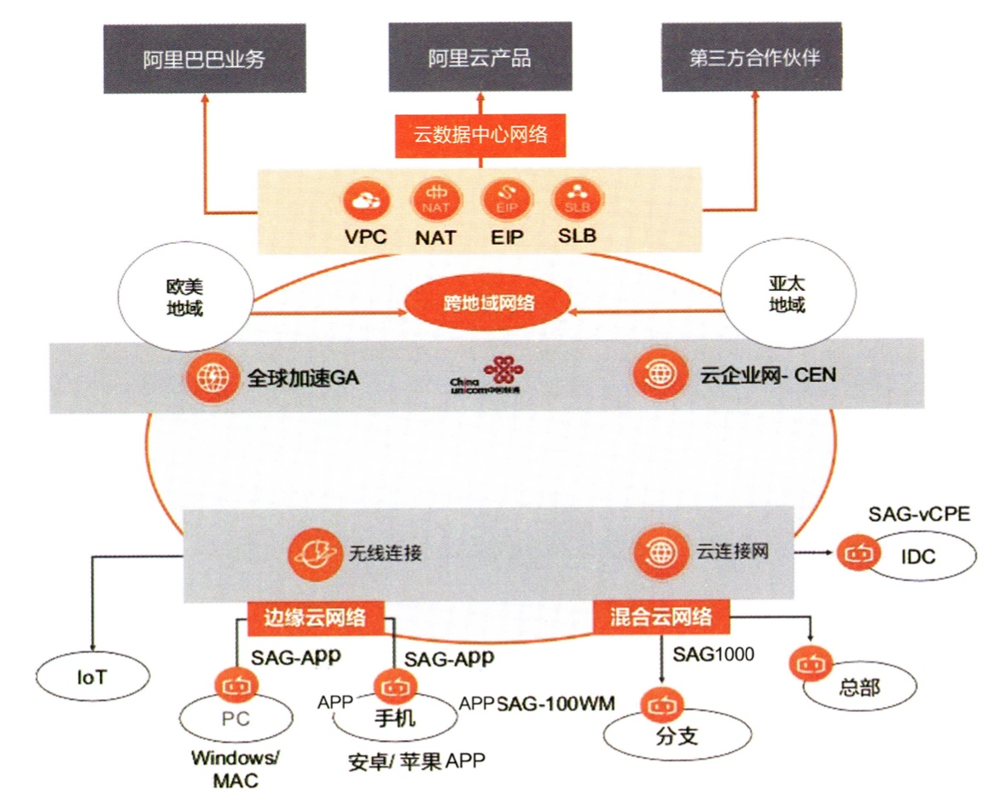

云网络应该具备的特性有：
- **资源共享**：提供租户间的网络隔离，保障各个租户的服务质量

- **弹性伸缩**：网元的控制面和转发面分离部署，后者通过集群方式支持扩展

- **自助服务**：支持集中管理，通过编程或集中的控制台来完成网络维护

- **可计量**：针对每个租户的网络占用进行定时打点，按量计费

- **连接无处不在**：扩大自身覆盖能力，并通过标准与传统网络对接

- **兼容性**：兼容现有的底层物理网络设备，实现透明化

云网络的发展离不开以下多种技术的支持，包括它所服务的云计算技术：
- **NFV**：为其提供基于虚拟化部署的网络功能

- **云计算**：为其提供动态扩容和容灾能力

- **SDN**：为其提供可编程化控制的网络功能框架

- **DPDK**：为其提供高性能的包处理平台

## 产品演进
云网络产品体系的演进过程如下：
- **云上传统网络（Beta 版本）**

  主要提供的产品包括负载均衡、公网 IP 地址、私网 IP 地址、DNS 和 DDos 防护服务等

  基于传统网络设备进行组建，随着云计算的资源扩张，无安全隔离、设备规格有限制、策略复杂难维护的各种缺陷被逐渐放大
  
- **云数据中心网络（1.0 版本）**

  新增 VPC 产品以实现租户间的网络隔离，并且 VPC 内的网络功能也得到丰富，提供的产品包括虚拟交换机、弹性 IP 地址、NAT 网关、负载均衡等
  
  通过隧道技术解决了安全隔离问题，通过虚拟设备解决了设备规格有限和策略复杂难维护的问题，适应了云计算的资源扩张
  
- **云广域网络（2.0 版本）**

  云广域网指混合云网络和多地域互联网络，使得云网络的覆盖和连接能力进一步增大
  
  混合云网络指将云上 VPC 和云下 IDC 连接在一起，催生了 VPN 网关产品；多地域互联网络指支持跨地域的 VPC 网络之间的互联，催生了对等连接、云企业网和云连接网产品

- **云-边-端一体网络（3.0 版本）**

  边缘云相对于中心云，在更靠近用户的地方部署弹性计算资源，令分布在边缘的用户也拥有处于云数据中心的体验
  
  对于网络而已，VPC 本身需要有跨地域能力，使其子网既能处于中心云，又能处于边缘云，边缘云则基于不同诉求，提供给用户端更好地接入能力，从而构造一个云-边-端一体的网络

## 产品体系
云计算在基础设施层面具有以下概念：
- **地域（Region）**

  物理的数据中心，地域之间完全独立，资源所在地域通常根据目标用户的所在物理位置来选择。不同地域的相同实例之间，一般不能直接进行内网通信

- **可用区（Availability Zone，AZ）**

  在同一地域内，电力和网络相互独立的物理区域，同一可用区内实例之间的网络延时更小。同一地域的可用区之间使用低时延链路相连，因此可以进行内网通信，并且做到故障隔离

- **接入点（POP 点）**

  物理专线接入阿里云的物理位置，在每个接入点有两台接入设备。每个地域有一到多个接入点，本地数据中心可以从任意一个接入点与 VPC 相连
  
云网络产品体系主要分为以下三个层级：
- **云数据中心网络**

  为用户提供在云上某个地域构建业务系统的能力，包括基础网络、公网带宽、网元功能等。基础网络包括 VPC、IPv6 等产品；公网带宽包括弹性公网 IP、带宽包等产品；网元功能指与底层硬件分离的软件所实现的网络功能，包括交换机、路由器、NAT 网关、负载均衡等产品
  
- **跨地域网络**
  
  为用户提供多地域私网互联和跨地域公网加速的能力，满足多地域甚至全球化的部署需求，包括云企业网和全球加速等产品
  
- **混合云网络**

  为用户构建云上云下互通的混合云，并提供快捷的上云通道，包括 VPN 网关、智能接入网关、高速通道等产品

云网络产品与传统物理网络存在完整的映射关系，比如云数据中心网络对应于数据中心网络、跨地域网络对应于广域网、混合云网络对应于接入网络

## 云数据中心网络产品
### VPC
**VPC（Virtual Private Cloud）** 为用户提供云上的私有网络环境，在 VPC 中用户可以自行管理的路由和网关、访问控制策略、构建混合云等，还可以使用云主机、云数据库、负载均衡等产品

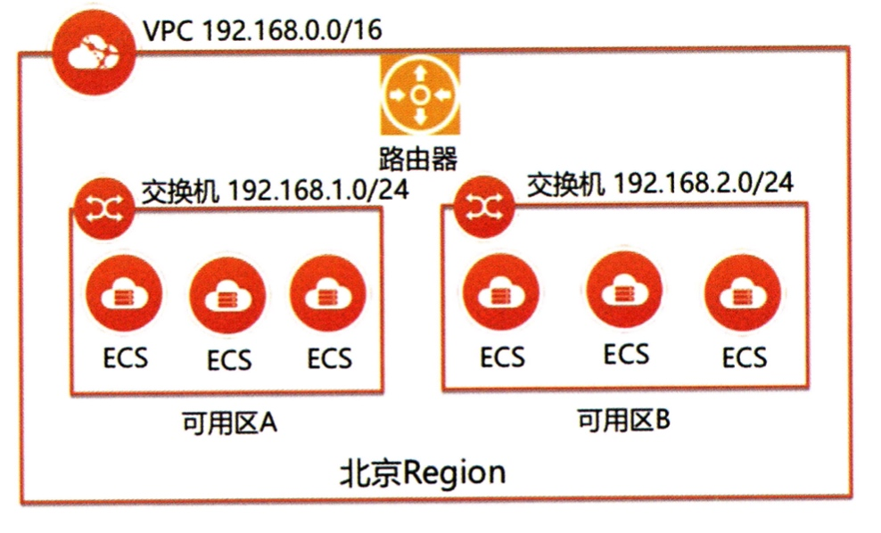

VPC 实现了传统物理网络的映射，其组成部分如下：
- **虚拟交换机（vSwitch）**

  一个 VPC 内部可分为多个 **子网（Subnet）**，用户可根据应用功能或业务类型来划分子网，一个虚拟交换机负责一个子网内的节点
  
- **虚拟路由器（vRouter）**

  是 VPC 的通信枢纽，可连接 VPC 内的各个交换机，同时作为连接 VPC 和其他网络的网关设备。VPC 创建成功后，会自动创建一个路由器，该路由器都关联一张主路由表，内置提供基本通信的默认路由
  
  路由表可分为有主路由表和子网路由表，一个 VPC 只有一张主路由表，其中包含 VPC 网段的本地路由，还有云服务的系统路由；一个 VPC 可以有多张子网路由表，其中包含子网网段的路由
  
  交换机可以显式关联到一张子网路由表，若已关联则会优先查找其中的路由，否则会隐式关联到主路由表
  
### 弹性公网 IP
**弹性公网 IP（Elastic IP）** 由一个公网 IP 地址和一份公网带宽构成，可以绑定到云主机、负载均衡、NAT 网关和弹性网卡上，实现公网 IP 地址和云产品之间的松耦合关系

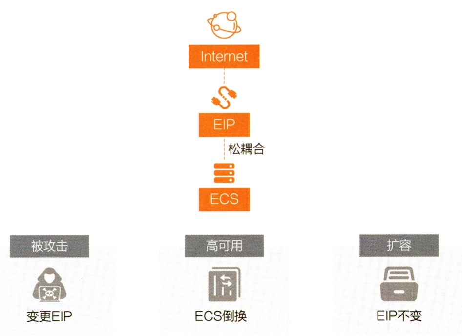

EIP 根据提供不同的的功能，分为以下类型：
- **多线 EIP**

  公网 IP 地址通过 BGP 将与多个运营线直连的链路播报给运营商，避免跨运营商互访导致的访问体验变差的问题
  
- **任播 EIP**
  
  公网 IP 地址从多个地域的 POP 点发布出去，使得用户能够通过该 IP 地址从就近的 POP 接入云网络
  
- **单线静态 EIP**

  公网 IP 地址只连接单个运营商的线路，对比多线 EIP，其不具备动态路由收敛能力和抗 DDos能力，可靠性较低，但是价格较低

### NAT 网关
**NAT 网关（NAT Gateway）** 可以让无公网 IP 地址的云主机访问互联网，或者让用户通过互联网访问云主机之上的服务，即提供 SNAT 和 DNAT 功能

SNAT 功能使 VPC 内的云主机避免暴露在公网上，但却可以正常访问公网，而且能够复用 EIP。为 VPC 内的子网配置 SNAT 规则后，NAT 网关会对其中云主机主动访问公网的流量进行源地址转化，再送出公网

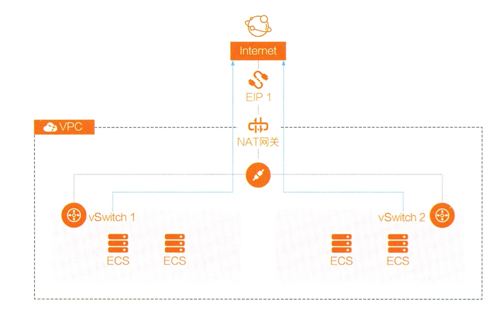

DNAT 功能可以让 VPC 内的云主机能够提供公网服务，支持固定端口或任意端口，也能够复用 EIP。为 VPC 内的多个 EIP 配置 DNAT 规则后，NAT 网关会对公网主动访问 VPC 的流量进行目的地址转化，送往具体云主机的服务

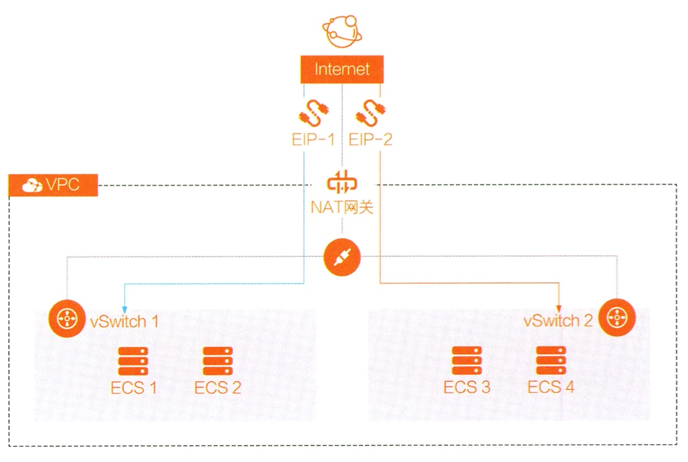

### IPv6 网关
**IPv6 网关（IPv6 Gateway）** 是 VPC 的一个 IPv6 公网流量网关，用户可以通过配置 IPv6 公网带宽和仅主动出规则，灵活定义 IPv6 公网出入流量

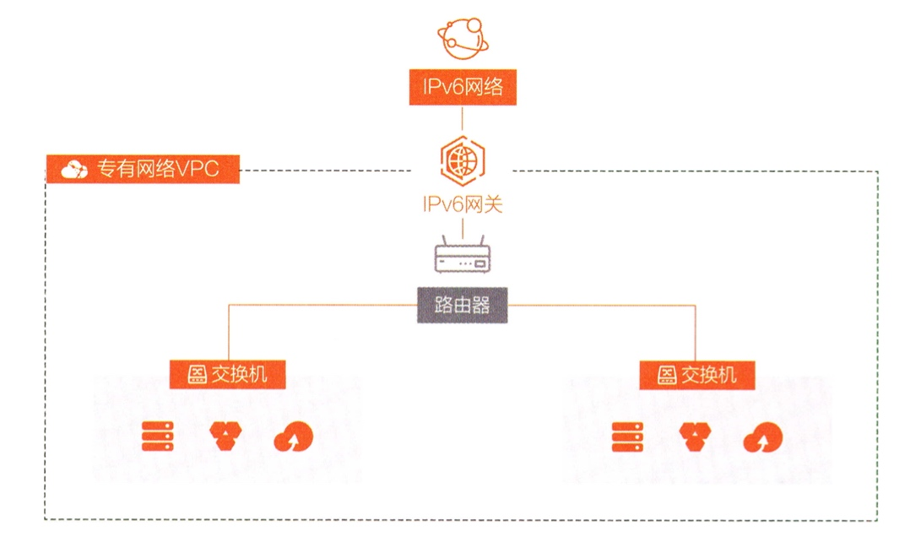

由于 IPv6 地址充足，VPC 中的所有云主机都会被分配一个全局唯一地址 **（Global Unique IPv6 Address，GUA）**。默认情况下，这些 GUA 无法进行公网通信，仅能进行私网通信，必须在 VPC 中配置 IPv6 网关且购买 IPv6 公网带宽后，才能经过 IPv6 网关进行公网通信

### 对等连接
**对等连接（Peering）** 可以对两个不同的 VPC 在网络层面建立一个专属的数据通道，用户可以在每个 VPC 中自定义到对端 VPC 的明细路由，打破两个 VPC 之间的隔离性

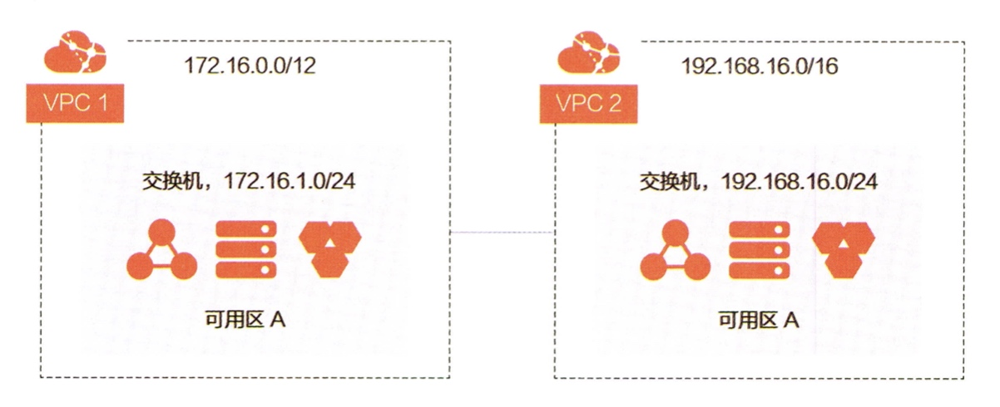

对于多个 VPC 的内网互通，除了使用 Peering 以外还可以使用云企业网来实现，后者针对多个云上 VPC 和 云下 IDC 的一体化网络构建，并且可以提供比前者更为简单的配置方式

### 私网连接
**私网连接（Private Link）** 可以在保证 VPC 隔离性的前提下，实现两个 VPC 之间的内网互通，但局限于同一可用区的内网互通。服务提供方在本地 VPC 发布终端节点服务，而服务使用方在本地 VPC 创建用于连接服务的终端节点，两边都可以实现自定义的访问控制

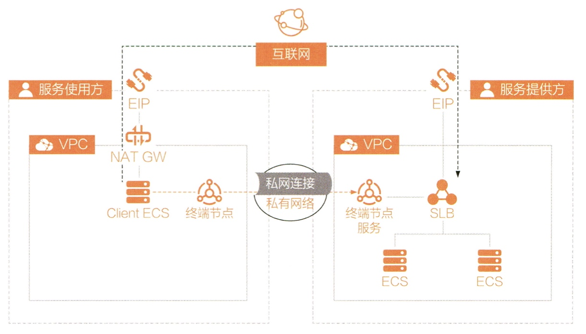

终端节点是一个逻辑上的组件，访问服务的请求流量实际发送到了与终端节点相关联的弹性网卡上，而终端节点网卡需要连接到服务使用方 VPC 的 vSwitch 上，并且分配一个 vSwitch 私网网段的 IP 地址，作为服务使用方所访问的服务地址。终端节点服务也是一个逻辑上的组件，真正提供服务的是与终端节点服务所关联的服务资源，比如负载均衡等网元

### 负载均衡
**负载均衡（Load Balancer，LB）** 是一种对流量进行按需分发的服务，通过将流量按需分发到不同的后端服务，以提升系统整体的吞吐能力和可用性。负载均衡根据其工作时所处的网络层级，可分为 **4 层负载均衡（L4LB）** 和 **7 层负载均衡（L7LB）**，而根据其部署架构和功能，又分为 **传统型负载均衡（Class LB，CLB）** 和 **应用型负载均衡（Aplication LB，ALB）**

CLB 提供 L4LB 和功能简单的 L7LB 服务，采用 4 层服务紧接 7 层服务的部署方式，采用多可用区主备的工作方式，通过用户自有域名解析接入负载均衡所提供的 VIP

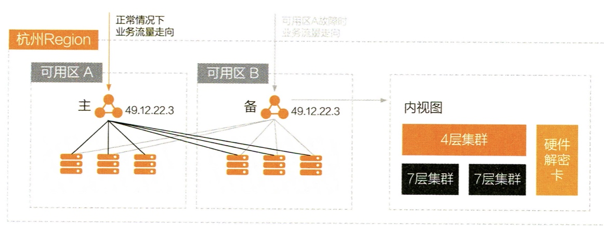

ALB 专门提供 L4LB 服务，提供超强 7 层性能和 HTTPS 卸载功能，以及基于内容的高级路由特性，采用多可用区同时活跃的工作方式，并且使用 EIP 提供公网服务，通过用户自有域名解析接入负载均衡所关联的 EIP

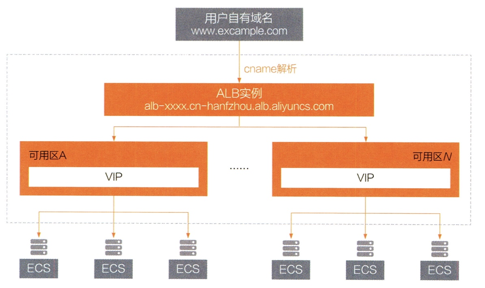

## 跨地域网络产品
### 云企业网
**云企业网（Cloud Enterprise Network，CEN）** 用于在不同地域的 VPC 之间、VPC 与本地数据中心之间搭建云上云下一体化的私有网络，基于全球高质量的网络基础设施，通过自动路由分发与学习，使网络能够快速收敛

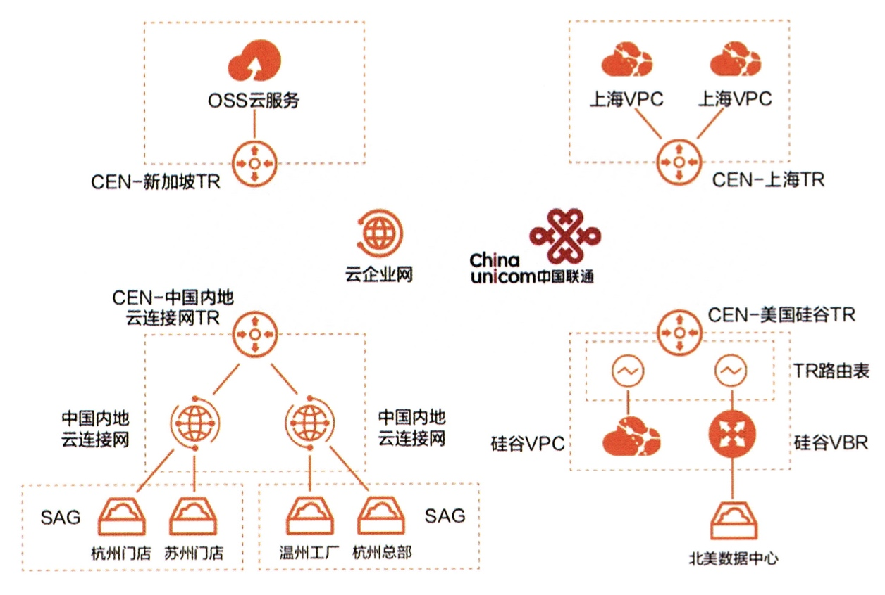

云企业网的组成如下：

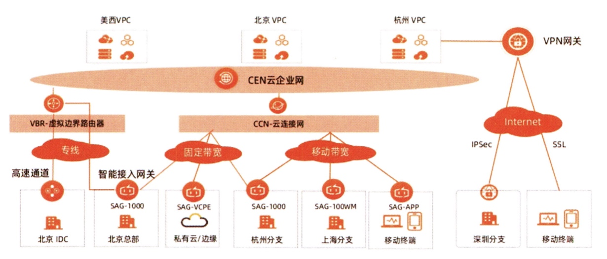

- **云企业网实例**

  企业用户创建和管理云上一体化私有网络的载体，用户要将需要互通的网络实例加载到某个云企业网实例中，购买带宽包，设置跨地域互通带宽，实现全球网络资源的互通
  
- **网络实例**

  所有加载到云企业网实例中的网络实例，包括 VPC、**边界路由器（VBR，Virtual Border Router）** 和 **云连接网（Cloud Connnect Network，CCN）**，后两者属于混合云网络组件，这些网络组件之间是全互联的
  
- **带宽包**

  网络实例之间通信需要的带宽资源，同地域之间的网络实例互通时，无须购买带宽包，跨地域之间的网络实例互通时，必须购买所属地域的带宽包，并设置跨地域带宽
  
- **转发路由器**

  线下 IDC 的网络架构中，企业通过核心交换机或核心路由器将不同部门的网络连接起来，在核心交换机或核心路由器之上部署多 VPN 实例，并设置相关的路由策略。而在云上网络架构中，不同部门处于不同的 VPC 中，此时则通过转发路由器来完成线下 IDC 中核心交换机或核心路由器的工作，一个地域内可以创建一个转发路由器，转发路由器可存在多张路由表

### 全球加速
**全球加速（Global Accelerator，GA）** 是基于跨地域网络构建的公网应用加速产品，实现全球范围就近接入和跨地域部署网络服务，极大地提升了服务可用性和性能

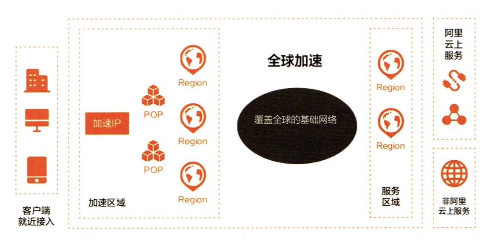

GA 会为每个接入加速区域的地域分配一个加速 IP 地址，客户端流量通过该 IP 地址就近从接入点进入加速网络中，然后加速网络内通过智能选择路由自动完成网络调度，将流量送达最佳终端节点，以减少时延和提升可靠性

GA 提供了高质量、高可用、高安全和易部署的网络加速服务，其常见的应用场景有互联网网站及应用加速、全球办公协作和游戏加速

## 混合云网络产品
### VPN 网关
**VPN 网关（VPN Gateway）** 是基于互联网链路，通过加密通道将企业云下的数据中心、办公网络等和云上 VPC 连接起来的服务，是快速低成本构建混合云的最佳选择，适合对网络质量相对不敏感的业务

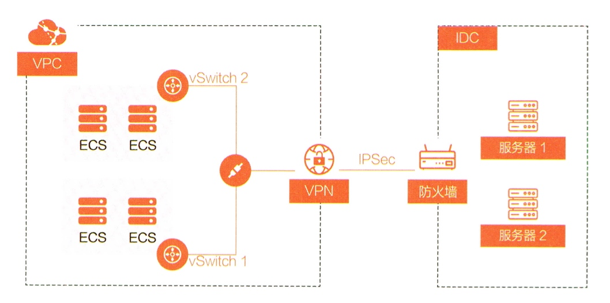

VPN 网关支持 **IPSec 和 SSL/TSL** 两种协议，前者工作于网络层，是 IETF 定义的安全标准框架，后者工作于传输层，是 Netscape 初衷用于保护 Web 通信的安全协议，对应于两种 VPN 网关类型

**IPSec-VPN** 能够基于路由来建立通信隧道，并且支持动态路由，**SSL-VPN** 则支持多因子验证，具有更高的安全性，同时支持客户端的接入

### 智能接入网关
**智能接入网关（Smart Access Gateway，SAG）** 能够让多种类型的网络节点一站式接入上云，是 **软件定义广域网（SD-WAN）** 的解决方案，而 SD-WAN 对比传统广域网，能够降低网络成本和人力维护成本

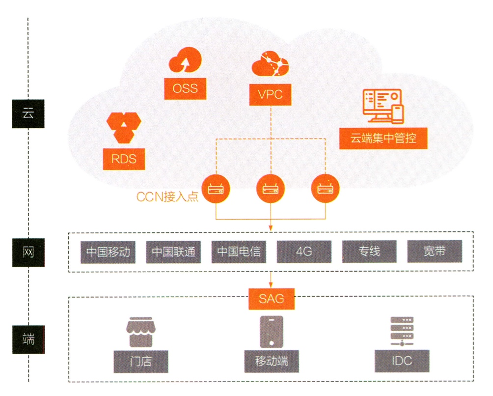

CCN 通过和运营商的网络合作，将云的私有网络通过扩展到用户的就近地域，而用户侧存在不同形态的 SAG 接入设备，比如 IDC 可使用硬件设备进行接入，而 IoT 设备、移动端则可使用应用程序进行接入

通过将购买的专线接入到 SAG，则能够按需将流量调度到专线，并通过 VBR 与 CEN 连接，达到高速通道的效果。SAG 还支持基于五元组的 QoS 功能，通过该功能可以划分不同业务的流量带宽，保证高优先级的流量带宽

### 高速通道
**高速通道（Express Connect）** 提供基于运营商的专线接入云的方法，提供超大带宽、稳定安全的私有上云通道，避免互联网的网络质量不稳定和不安全问题

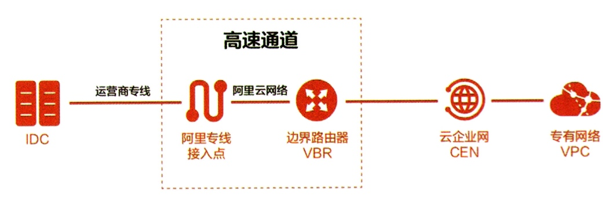

高速通道的一端通过专线接入点与运营商专线连接，另一段通过 VBR 与 CEN 连接，并且支持独享专线以及共享专线两种接入方式

## 其他网络产品
### 云解析
随着对网络质量的要求不断提高，DNS 已经发展为一个智能解析和调度系统，需要具备以下主要功能特点：
- 按照权重解析
- 按照地理位置解析
- 返回最低时延的服务节点
- 实现服务节点状态的健康检查

而云上 DNS 具备以上智能解析和调度系统的特点之外，还有以下发展趋势和特点：
- 安全性和稳定性要求更高
- 具备云上租户隔离能力
- 支持 IoT 和智能终端更快递连接云资源

云解析产品架构如下：

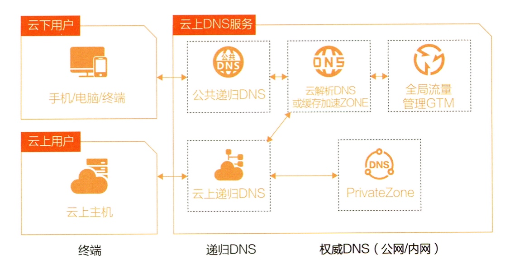

- **公共递归 NDS**：提供更加安全的分布式公网递归解析服务，并且联动云解析 DNS 进行秒级刷新生效

- **云解析 DNS**：提供对权威域名的管理和解析服务，是一种高可用、中心化的公网权威 DNS 服务，并具备抗 DDos 能力

- **缓存加速 Zone**：提供对权威域名的缓存加速服务，是一种基于 DNS 代理实现、分布式的公网权威 DNS 服务，可以回源到用户自建的权威 DNS 服务

- **云上递归 NDS**：与公共递归 NDS 功能相同，但是针对处理云上客户端的递归解析，同样联动云解析 DNS 进行秒级刷新生效

- **Private Zone**：提供针对 VPC 内部的私有域名解析和管理服务，用户可以将域名转化为私网 IP 地址或公网 IP 地址

- **全局流量管理（GTM）**：提供 DNS 服务的就近接入、负载均衡、健康检查等功能，且下发配置到云解析 DNS

### 云安全
**云防火墙** 在云上网络安全方面，实现了以下的层次化防御体系：
- **互联网边界**：针对云内网和互联网之间的南北流量进行管控

- **VPC 区域边界**：针对云内不同的网络分区之间，比如云产品、VPC 之间的东西流量进行管控

- **VPC 内资源边界**：针对 VPC 网络不同资源之间，比如虚拟机、子网之间的流量进行管控

**DDoS 防护系统** 以流量代理的方式实现对大流量攻击防护和精细化 Web 应用层资源耗尽型攻击的防护，不仅能够支持云上业务接入，也可支持云下企业接入

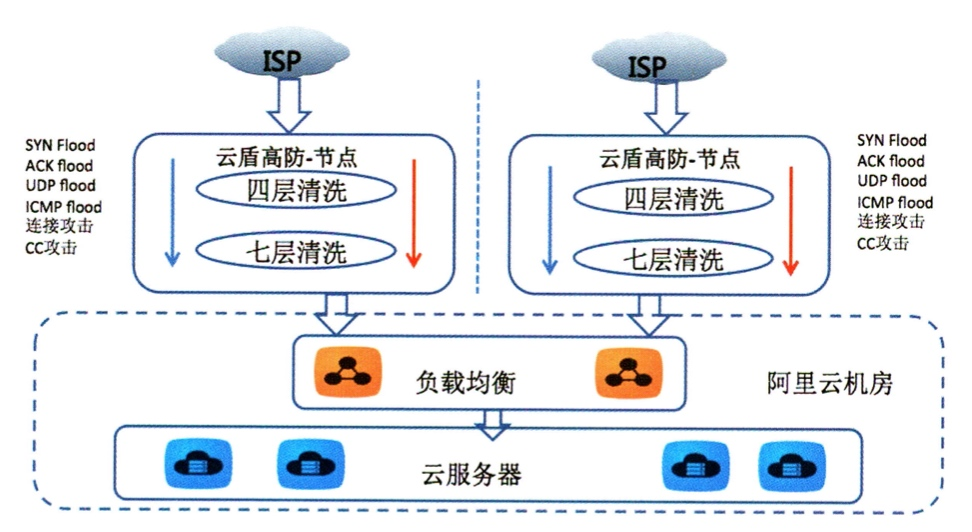

DDoS 防护系统是个全球分布式流量代理，并提供一个用于接入流量的高防 IP 地址，用户只需将域名解析至高防地址并且配置好源站，即可将完成清洗的正常流量转发到源站进行处理

**Web 应用防火墙（WAF）** 以流量代理的方式基于 HTTP/HTTPS 的安全策略来专门为 Web 网站应用提供防护，能够识别常见的 Web 攻击，如 SQL 注入、XSS 跨站脚本、Webshell 上传等
