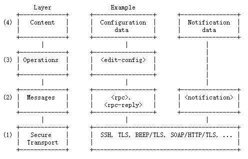

# 【SDN】概述

* [【SDN】概述](#sdn概述)
   * [简介](#简介)
   * [ODL](#odl)
   * [南向协议](#南向协议)
      * [NETCONF](#netconf)
      * [YANG](#yang)

## 简介
**SDN（Software Defined Networking）** 软件定义网络，是一种新型的网络技术，其设计理念是通过 **分离控制平面与数据转发平面** 以及 **开放的通信协议**，实现对网络进行 **可编程化的集中控制**

对比传统网络设备紧耦合的网络架构，SDN 架构存在以下特点：
- 设备的控制和转发分离
- 控制平面可编程化
- 逻辑上的集中控制管理

而 SDN 的整体架构，也是对传统网络架构进行拆分，所得到的三层分离架构：

- **应用层** 包括各种基于 SDN 的业务应用，用户无需关心底层细节就可以得到底层的网络资源和能力

- **控制层** 包含了逻辑上为中心的 SDN 控制器，掌握着全局网络信息，负责各种数据转发层的规则控制，维护网络拓扑

- **数据转发层（基础设施层）** 由交换机等网络通用设备组成，负责基于流表的数据处理、转发和状态收集

控制层和数据转发层之间的通讯信道被称为 **南向接口**，通信协议上已有 OpenFlow 等国际标准，通过这些标准屏蔽了底层物理转发设备的差异，实现了资源的虚拟化

控制层向应用层开发的通讯接口被称为 **北向接口**，通信协议还缺少业界公认的标准，可以根据业务应用的需求进行设计，具有多样化的特征，比如使用 Restful API

## ODL
**ODL（OpenDayLight）** 是基于 Java 的开源 SDN 控制器框架，**具有高度模块化、可扩展、可升级、支持多协议** 等特点，旨在推动 SDN 的创新实施和透明化

ODL 架构从上倒下分为四层，后者为翻译版：

- 网络应用：包含各种基于 ODL 北向接口层的各种应用集合，如 Management GUI/CLI、VTN Coordinator、D4A Protection 和 OpenStack Neutron 等

- 北向接口：包含开放的接口（Rest API 和 OSGI）和认证模块

- 控制平面：包含 MD-SAL（Model Driven Service Abstraction Layer）、网络功能、网络服务和网络抽象等模块，其中 MD-SAL 是核心，所有模块都需要向其注册才可使用，同时也是整个控制器的管理中心，负责数据存储、请求路由、消息的订阅和发布等

- 南向接口：包含多种协议插件，如 OpenFlow 1.0/1.3、OVSDB、NETCONF、LISP、BGP、PCEP 和 SNMP 等，并通过使用 Netty 来管理底层的并发 IO

> 最下方的数据转发平面，由虚拟交换机、物理硬件设备组成，不属于 ODL 的架构

ODL 解决的问题：
- 使控制器能方便快速地开发上线并保持稳定，为其商业化提供了保障，主要原因有：
    - 支持丰富的南向接口协议插件（Openflow，NETCONF，OVSDB 等）以及厂商设备驱动插件，屏蔽底层网络设备的细节
    - 提供基于 MVCC 且性能不错的的强一致内存数据库 Datastore，内嵌式存储模块简化控制器集群的建设和运维
    - 基于模型驱动的服务抽象层（MD-SAL）精简了运维相关的业务接口开发

ODL 存在的瓶颈：
- 性能瓶颈：南向可支持连接数，以及 Datastore 存储数据量都存在一定的瓶颈，且 Datastore 无法水平扩展
- 基于 OSGI 框架迭代困难：引入第三方包的依赖处理尤其复杂，因为依赖的原因甚至影响了某些组件的引入（例如 ETCD）
- 活跃度一般，部分项目仍然不够稳定：所包含的 netconf、ovsdb 等协议插件项目多多少少还存在一些 bug

参考：[腾讯云网络 SDN 控制系统演进之路](doc/0/腾讯云网络SDN控制系统演进之路.pdf)

## 南向协议
### NETCONF
**NETCONF（Network Configuration Protocol）** 网络配置协议，是基于 XML 和 RPC 来实现客户端和服务器之间通信的，主要目的是弥补 SNMP 协议的不足

网络设备通过 NETCONF 协议可以对外提供规范的接口，使应用程序可以通过接口，向网络设备发送和获取配置

NETCONF 和 SNMP 比较：

| 特性 | NETCONF | SNMP |
| --- | --- | --- |
| 并发安全 | 提供保护锁定机制，防止操作产生冲突 | 没有提供保护锁定机制 |
| 查询 | 针对整个系统的配置数据可直接进行操作， 且定义了过滤功能，性能高 | 对某个表的一条或多条记录进行操作， 查询中需要多次交互才能够完成，性能低 |
| 扩展性 | 扩展性好，协议模型采取分层定义，各层  之间相互独立，且采用了 XML，在管理能 力上和系统兼容性方面也更有扩展性 | 扩展性差 |
| 安全性 | 利用现有的安全协议提供安全保证，并不 与具体的安全协议绑定，如传输层首选推荐 SSH 协议 | 协议以全部定义，安全保证上未有扩展 的余地 |
| 事务和回滚 | 支持事务机制和配置回滚，支持分阶段的配置 | 不支持 | 

NETCONF 协议采用了分层结构，每层分别对协议的某一方面进行包装，并向上层提供相关服务，可以划分为四层：

- 安全传输层（Secure Transport）：为客户端和服务器之间交互提供通讯路径

- 消息层（Messages）：提供一种简单的不依赖传输协议层的，生成 RPC 请求和回应消息框架的机制

- 操作层（Operations）：定义一组基本的操作，作为 RPC 的调用方法，可以使用 XML 编码的参数调用这些方法

- 内容层（Content）：由管理对象的数据模型定义，数据模型定义依赖 NETCONF 的实现情况

NETCONF 报文结构如下：

NETCONF 协议的困境：
- 网络设备商不开放接口，比如华为虽然提供了 Execute CLI 能力，但只能支持一些 `system-view`、`return` 、`quit` 命令，非常鸡肋
- 通用化能力极其有限，现状就是同一厂商的不同型号设备开放的 NETCONF 接口可能都不一样，更不用说不同设备上的 NETCONF 接口互通
- 从华为官方文档来看，未来的可编程趋势也将是从 NETCONF + YANG 向 RESTCONF + YANG 方向演进

### YANG
**YANG（Yet Another Next Generation）** 初衷是专为 NETCONF 协议设计的数据建模语言，用于为一系列网络配置协议设计可操作的配置数据和状态数据模型、远程调用签名、事件通知格式等

YANG 是一种模块化语言，以 XML 树格式表示数据结构，使用 XPATH 表达式来定义对 YANG 数据模型的元素的约束，最后可以将已填充的数据模型转换为网络配置协议支持的任何编码格式，例如 XML 或 JSON

 

YANG 模型定义了设备功能的配置模板，和命令行相比，YANG模型具有如下优点：
- 定义丰富：支持丰富的基础数据类型定义和数据属性定义
- 机器语言：结构化定义，支持定义约束条件，机器直接识别，不需要人工干预
- 可扩展：支持 grouping 重用、refine 重定义和 augment 扩展，且支持基于 typedef 扩展数据类型定义
- 易集成：IETF 定义了多个标准类型定义和 YANG 模型，便于各厂商参考和引用
 
NETCONF + YANG 使得对大型网络的配置管理更加地简便高效，参考：[什么是 NETCONF & YANG？](doc/0/什么是NETCONF和YANG.pdf)

