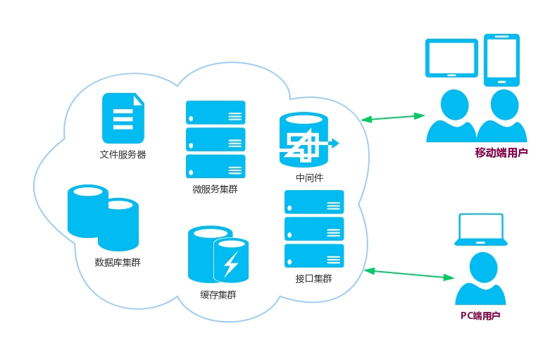
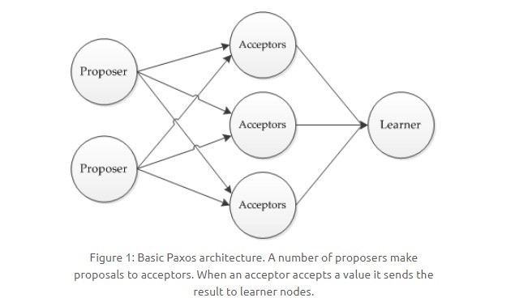

# 【SystemDesign】分布式

* [【SystemDesign】分布式](#systemdesign分布式)
   * [分布式系统](#分布式系统)
   * [分布式理论](#分布式理论)
      * [CAP](#cap)
      * [BASE](#base)
   * [一致性算法](#一致性算法)
      * [Paxos](#paxos)
         * [角色分工](#角色分工)
         * [工作过程](#工作过程)
      * [Raft](#raft)
         * [领导选举](#领导选举)
         * [日志复制](#日志复制)
   * [分布式锁](#分布式锁)
      * [基于 Mysql](#基于-mysql)
      * [基于 Redis](#基于-redis)
      * [基于 ZooKeeper](#基于-zookeeper)
   * [分布式事务](#分布式事务)
      * [两段提交](#两段提交)
      * [本地消息表](#本地消息表)

## 分布式系统
分布式系统是由 **一组分布在不同计算机上、通过网络进行通信、为了对外提供同一服务而协调工作的进程节点** 所组成的系统


> 和分布式系统相对立的是集中式系统，即由单个计算机中的进程来对外提供服务
> 
> 对于分布式系统中的这些进程，其程序可以是不同的，也可以是相同的，若程序是相同的，则这个系统也可以被称为集群

分布式系统的出现是为了组织更多的计算机，来获得单个计算机不具备的能力，主要包括：
- **高性能能力**：处理大量的计算、存储任务
- **高可用能力**：规避因网络、机器等原因所导致的服务不可用

分布式系统的挑战：
- **异构的机器与网络**：机器的硬件配置不一样，其上运行的进程也可能由不同的语言、架构实现；节点间通信所依赖的网络，其带宽、延时、丢包率由于运营商、地区的不一样又是不一样的
- **普遍的节点故障**：单个节点故障的概率虽然不高，当节点数目达到一定规模，出故障的概率就变高了
- **不可靠的网络**：节点间通信所依赖的网络是不可靠的，可能出现网络分割、延时、丢包、乱序等网络问题

分布式系统的特性与衡量标准：
- **透明性**：用户不需要关心请求被分到了哪个节点，数据存储在哪个节点，或者说用户根本感知不到这是个分布式系统
- **可扩展性**：可以方便地通过增加或减少机器来提高或降低系统的处理能力，达到动态伸缩的效果
- **高可用性**：保证系统在各种情况下对外提供正常服务的能力，可以通过不可用时间与正常服务时间的比值来衡量
- **高可靠性**：保证系统在各种情况下的计算结果正确、存储数据不丢失
- **高性能**：不同的系统对性能的衡量指标是不同的，最常见比如：高并发、低延迟等
- **一致性**：保证节点的状态保持一致，一致性分为很多等级，一致性越强，对用户越友好，但会制约系统的可用性

## 分布式理论
### CAP
CAP 理论表示，设计一个分布式系统的读写操作时，只能同时满足以下三个特性中的两个，其命名也是这三个特性的缩写：


- **一致性（Consistence）** : 所有节点访问同一份最新的数据副本

- **可用性（Availability）**: 非故障的节点在合理的时间内返回合理的响应（不是错误或者超时的响应）。

- **分区容错性（Partition Tolerance）** : 分布式系统出现网络分区的时候，仍然能够对外提供服务。

> 分布式系统中，多个节点之前的网络本来是连通的，但是因为某些故障（比如部分节点网络出了问题）某些节点之间不连通了，整个网络就分成了几块区域，这就叫网络分区

分布式系统中，分区容错性是必不可少，因为需要假设网络是不可靠的。因此 CAP 理论实际上是要在可用性和一致性之间做权衡

分布式系统不可能选择 CA 架构，只能选择 AP 架构或 CP 架构，这两种架构在多个节点之间进行数据同步时：
- **AP 架构**：为了保证一致性，不能访问数据未完成同步的节点，也就失去了部分可用性。比如 Cassandra、Eureka
  
- **CP 架构**：为了保证可用性，允许读取所有节点的数据，但是数据可能存在不一致。比如 HBase、ZooKeeper，Nacos 不仅支持 AP 架构也支持 CP 架构

CAP 理论的实际应用，比如 Dubbo（分布式 RPC 框架）架构中的注册中心，它在架构中的位置如下：


- **注册中心（Registry）**：负责服务地址的注册与查找，相当于命名服务，不转发请求
- **服务提供者（Provider）**：初始化时会注册自身的服务地址到注册中心
- **服务消费者（Consumer）**：初始化时会在注册中心订阅服务，拿到注册中心推送的最新服务地址，然后调用服务

可以作为注册中心的组件有 ZooKeeper、Eureka、Nacos 等，其中：
- ZooKeeper 是 CP 架构。任何时刻对 ZooKeeper 的读请求都能得到一致性的结果，但 ZooKeeper 不保证每次请求的可用性。比如在 Leader 选举过程中或者半数以上的机器不可用时，服务就是不可用的
- Eureka 是 AP 架构。Eureka 没有选举机制，每个节点都是平等的，即使大部分节点挂掉也不会影响正常提供服务。Eureka 只要存在一个节点是可用的就服务可用，但节点上的数据可能不是最新的
- Nacos 不仅支持 CP 架构，也支持 AP 架构

### BASE
BASE 理论是根据 CAP 理论进行权衡的结果，其核心思想是：即使节点无法做到强一致性，但可以根据自身业务的特点，采用适当的方式来使系统达到最终一致性

BASE 理论包含以下三个特性，其命名也是这三个特性的缩写：
- **基本可用（Basically Available）**：指分布式系统在出现故障时，保证核心可用的前提下，允许损失时间或功能上的部分可用性

  在时间上损失可用性，响应时间延长：
  
  

  在功能上损失可用性，部分功能不可用：
  
  

- **软状态（Soft State）**：指分布式系统中的数据允许存在中间状态，并且该中间状态不会影响系统整体可用性，即允许不同节点的数据副本之间存在同步时延
  
  允许部分状态已更新，但部分状态未完成的情况，未更新的状态会延迟完成更新：
  
  

- **最终一致性（Eventually Consistent）**：指分布式系统中所有的数据副本，在经过一段时间的同步后，最终能达到一致的状态
  
  任何服务故障、延时同步或其他原因导致的中间状态，最终会达到一致：
  
  

分布式一致性的三种级别：
- **强一致性**：系统写入了什么，读出来的就是什么

- **弱一致性**：不一定可以读取到最新写入的值，也不保证多少时间之后读取到的数据是最新的，只是会尽量保证某个时刻达到数据一致的状态

- **最终一致性** ：弱一致性的升级版，系统会保证在一定时间内达到数据一致的状态

> 业界比较推崇是最终一致性，但是某些对数据一致要求十分严格的场景还是要保证强一致性，比如银行转账

<br>

保证基本可用的方式：
- **削峰填谷**：若业务流量可以控制，比如对于商品抢购业务，进行抢购时间的错开；若业务流量无法控制，可以使用消息队列来缓冲任务。以上削峰填谷做法，可以避免巨大的业务流量压垮系统

- **延迟响应**：正如使用消息队列的情况，对用户来说虽然响应被延迟，但系统却可以处理更多的请求，保证可用性

- **服务降级**：面对超过系统负载的巨大流量时，牺牲系统非必要的功能，比如降低日志级别、显示分辨率更低的图片等手段，来降低系统的资源消耗，保证核心功能的可用性

- **过载保护**：面对以上方法都无法应付的巨大流量时，系统根据自身处理能力抛弃超时的请求，或随机抛弃一些请求，直接返回错误，来保证大部分请求的正常响应

<br>
保证最终一致性的方式：
- **写时修复**：在写入多个节点的数据副本时，若其中一个失败了，就缓存起来，通过系统自动重试的手段进行修复

- **读时修复**：写数据时不关心单个节点的失败或成功，只在读数据时，同时读多个节点的同一份数据，然后根据一定的规则来决定返回的值（比如以超过半数的数据值为准），但写数据时也要按照与之对应的一定规则（比如要超过半数的节点写入成功）

- **异步修复**：通过定时不同节点比对的方式，来对照数据是否需要修复，若需要修复，则进行同步

> 业界比较推荐写时修复，这种方式对性能消耗比较低

## 一致性算法
一致性算法（Distributed Consensus）也被称为共识算法，用于解决分布式系统中各个节点的状态一致性问题，以实现一个最终状态一致的分布式系统

### Paxos
Paxos 是一种经典的分布式一致性算法，其思想是模拟民主提议和投票，按照少数服从多数的方式，使系统中各个节点的状态最终达成一致。主要通过分为三个阶段的工作过程来实现

[工作过程和原理的动画说明](http://harry.me/blog/2014/12/27/neat-algorithms-paxos/)

#### 角色分工
Paxos 系统中的三种角色：



- **提议者（Proposer）**：提议一个值
- **接受者（Acceptor）**：对所有提议进行投票，选出一个值
- **学习者（Learner）**：被告知所有的选票，并根据选票得出结果，但不参与投票

许多提议者向接受者提出提议，当一个接受者接受了某个提议后，会将该提议告知给学习者，学习者选出被大多数接受者所告知的提议

#### 工作过程
规定一个提议包含两个字段：`[n, v]`，其中 `n` 为唯一序号，`v` 为提议值

Paxos 的工作过程分为三个阶段：
- **准备阶段（Prepare）**

  1. 首先每个 Proposer 都会向所有 Acceptor 发送 Prepare 请求

  

  2. 当 Acceptor 接收到一个 Prepare 请求，包含的提议为 `[n1, v1]`，并且之前还未接收过 Prepare 请求，那么发送一个 Prepare 响应，设置当前接收到的提议为 `[n1, v1]`，并且保证以后不会再接受序号小于 `n1` 的请求
  
  

  3. 如果 Acceptor 接收到一个 Prepare 请求，包含的提议为 `[n2, v2]`，并且之前已经接收过提议 `[n1, v1]`。如果 `n1` > `n2`，那么就丢弃该提议；否则，发送 Prepare 响应，该 Prepare 响应包含之前已经接收过的提议 `[n1, v1]`，设置当前接收到的提议为 `[n2, v2]`，并且保证以后不会再接受序号小于 `n2` 的请求
  
  

- **接受阶段（Accept）**
  
  1. 当一个 Proposer 接收到超过一半 Acceptor 的 Prepare 响应时，就可以发送 Accept 请求，Accept 请求所包含的提议，其 `n` 值和之前 Prepare 请求保持一致，其 `v` 值取所收到的 Prepare 响应中最大序号提议对应的 `v` 值
  
  2. 若 Accept 请求的 `n` 值小于之前 Acceptor 已承诺的最小 `n` 值，则该 Accept 请求会被 Acceptor 丢弃

  

- **学习阶段（Learn）**

  1. 若 Accept 请求的 `n` 值大于等于之前 Acceptor 已承诺的最小 `n` 值，则 Acceptor 就会发送 Learn 请求给所有的 Learner。当 Learner 发现超过半数的 Acceptor 接收了某个提议，那么该提议的提议值 `v` 就被选择出来了
  
  

> 在 Proposer 发起一轮提议里，只有且总会有一个提议值生效，Paxos 拥有两个特性：
> 
> 正确性：保证每个生效的提议被多数 Acceptor 接收，并且 Acceptor 不会接受两个不同的提议
> 
> 可终止性：Proposer 发送的提议最终会朝着能被大多数 Acceptor 接受的那个提议靠拢

### Raft
Raft 是一种比 Paxos 更易被理解和实现的分布式一致性算法，其思想是模拟投票选举。主要通过领导选举（Leader Election）和日志复制（Log Repilcation）两个机制来实现

[工作过程和原理的动画说明](http://thesecretlivesofdata.com/raft/)

#### 领导选举
Raft 系统中的三种角色：
- **群众 (Follower）**：被动接收 Leader 发送的请求，所有的节点刚开始的时候是处于 Follower 状态

- **候选人（Candidate）**：由 Follower 向 Leader 转换的中间状态

- **领导（Leader）**：同一时刻只有1个 Leader 存在，负责和客户端交互以及日志复制

选举涉及的两个超时：
- **选举超时（election timeout）**：Follower 等待信息直到成为 Candidate 的总时间，这个值在 150ms～300ms 间随机
  
- **心跳超时（heartbeat timeout）**：Leader 周期性发送追加记录（Append Entries）消息到所有 Follower 的间隔时间
  

选举的具体过程:
1. 当 Follower 在选举超时后没有收到 Leader 的追加记录消息，就会成为 Candidate，并开始一个新的任期（term）
2. Candidate 对自身投票（vote），并发送投票请求到所有节点，然后重置自身的选举超时
3. 节点会给接收到的一个任期的首个投票请求的所属 Candidate 投票，然后重置自身的选举超时
4. 在选举超时内，当 Candidate 接收到大多数节点的投票，就会成为 Leader，否则会重复过程 2 的操作
5. Leader 开始周期性地在每次心跳超时后发送追加记录消息到所有 Follower
6. Follower 会回复每个接收到的追加记录消息，然后重置自身的选举超时

#### 日志复制
Raft 的理论基础是复制状态机（Repilcated State Machine），即满足在一个分布式系统中，如果每个节点的状态一致，每个节点都执行相同的命令序列，那么最终它们状态仍然一致

复制过程:


1. 客户端发送命令到服务端集群的 Leader
2. Leader 的一致性模块（Consensus Module）将命令存入自身日志（Log），并通过下一次的追加记录消息将命令复制到其他 Follower，此时命令处于未提交状态（uncomitted）
3. Follower 会将 Leader 发来的命令存入日志，并回复确认复制，当 Leader 接收到大多数 Follower 的确认复制回复，就会提交这条命令来改变自身状态机（State Machine），即状态机执行该命令，此时命令处于已提交状态（comitted）
4. Leader 返回命令的执行结果给客户端
5. Leader 通过下一次的追加记录消息将命令提交通知到其他 Follower
6. Follower 收到命令提交通知后，就会提交这条命令来改变自身状态机

> 这里的状态机通常指一个程序或进程，对其提交相同的命令，能够得到相同的状态改变
> 
> 提交通知的实现：Leader 会记录已提交的最大日志 index，并在追加记录消息中都会附带这个值，Follower 就能通过这个值知道哪些命令是已提交的

故障恢复后重新加入集群的节点（包括 Leader 和 Follower），通过以下机制能自动保证状态一致性：
- 当 Leader 收到新的更高任期的 Leader 发来的追加记录消息时，就会成为 Follower
- 当 Follower 收到更高任期的 Leader 发来的追加记录消息时，会回滚日志中未提交的命令，并匹配该 Leader 的日志

> 匹配日志的实现：
> 
> Leader 发送日志复制消息中还会附带上一次日志记录的 index 和 term，当 Follower 对比自身 index 和 term 发现自身日志和 Leader 不匹配时，会拒绝这个请求
> 
> 之后 Leader 则会递减上一次的日志记录的 index 来发送日志复制请求，直到找到日志一致的地方，然后把Follower 节点的日志覆盖为 Leader 节点的日志内容

防止故障恢复后重新加入集群的 Follower，日志不完整但是选举为 Leader 的情况，会有以下机制：
- 收到投票请求的节点在回复投票之前，会通过对比投票请求中附带的上一次日志记录的 index 和 term，来确认 Candidate 的日志是比它新的

## 分布式锁
当需要保证一份数据或一段代码在同一时刻只能被一个计算机的一个进程（线程）访问或执行时：

- 集中式系统可以通过语言的内置锁来实现进程（线程）同步

- 分布式系统由于需要同步的进程（线程）位于不同的计算机上，因此需要使用分布式锁来实现跨网络的进程（线程）同步

> 进程和线程在此处文统称为进程，表示基本执行单元


分布式锁应该具备的特性：
- **互斥性**：同一时刻只有一个计算机的一个进程能获取到锁
- **可重入**：可重复进行锁的获取或释放
- **锁失效**：存在一定的锁失效机制，防止死锁
- **阻塞模式可选**：当未能获取到锁时，阻塞模式会等待直到成功，非阻塞模式会立即返回失败
- **高性能和高可用**：保证锁操作的高效可用

### 基于 Mysql
用于保存锁信息的表结构示例：

``` sql
CREATE TABLE `tb_distributed_lock` (
 `dl_id` INT NOT NULL auto_increment COMMENT '主键，自增',
 `dl_method_name` VARCHAR (64) NOT NULL DEFAULT '' COMMENT '方法名/锁名',
 `dl_device_info` VARCHAR (100) NOT NULL DEFAULT '' COMMENT 'ip+线程id',
 `dl_operate_time` TIMESTAMP NOT NULL DEFAULT CURRENT_TIMESTAMP ON UPDATE CURRENT_TIMESTAMP COMMENT '数据被操作的时间',
 PRIMARY KEY (`dl_id`),
 UNIQUE KEY `uq_method_name` (`dl_method_name`) USING BTREE
) ENGINE = INNODB DEFAULT charset = utf8 COMMENT = '分布式锁表';
```
> 唯一索引保证了表示相同锁的记录只能被插入一次，因此可根据记录是否存在来判断锁的状态

实现思路：
- 获取锁时向表中插入一条记录，释放锁时删除该条记录

- 插入成功则获取锁成功，若插入失败，再以 `dl_method_name、dl_device_info、dl_operate_time < 锁失效时间)` 为条件查询
    - 若存在记录：对比 `dl_method_name、dl_device_info` 和当前机器是否一致
        - 一致：已获取过锁，更新 `dl_operate_time`，获取锁成功
        - 不一致：获取锁失败
    - 不存在记录：锁已过期，删除该过期记录，插入一条新记录，获取锁成功
- 代码逻辑执行完成后主动释放锁，不需等待锁失效，删除相关的锁记录

总结：
- 优点：
    - 成本低，不需要引入其他的技术
- 缺点：
    - 只能是非阻塞锁，无法阻塞等待锁的获取
    - 效率低，锁重入、锁过期等场景需要进行两次查询

### 基于 Redis
Redis 分布式锁的 [官方说明参考](doc/0/Redis分布式锁.pdf)，用于实现锁操作的指令：

``` bash
SETNX key value [EX seconds] [PX milliseconds]

# 或者通过 SET 指令配合 NX 参数完成，SETNX 指令或后续被废除 

SET key value NX [EX seconds] [PX milliseconds]

# EX seconds：设置过期时长，单位秒
# PX milliseconds：设置过期时长，单位毫秒
```
> SETNX 或 SET NX 都表示 Set If Not Exist，即插入一个 key-value，若 key 不存在则成功并返回 `OK`，否则失败并返回 `nil`
> 
> SETNX 指令和数据库的唯一索引类似，保证了只能存在一个 key 的键值对，可用于判断锁的状态
> 
> EX 或 PX 参数设置一个过期时间，用于实现锁失效机制，也称为锁的 TTL（Time To live）

实现思路：
- 获取锁时向表中插入一个 key-value记录，释放锁时删除该 key-value
- 命令执行成功就是获取锁成功，执行失败就是获取锁失败
- 代码逻辑执行完成后主动释放锁，不需等待锁失效，提高系统效率，删除自身设置的锁记录，可通过 value 值来进行辨认

总结：
- 优点：
    - 简单易用，一条指令可完成加锁操作
    - 高性能，key-value 读写基于内存操作
- 缺点：
    - 时钟漂移问题，因为 Redis 的过期时间计算是节点独立进行的，因此当 Redis 服务端的时间发生向前跳跃，会导致这个 key 提早过期，从而可能导致多个客户端同时持有同一把锁
    - 单点故障问题，即使使用 Redis 主从模式，由于主从间使用的是异步复制机制的，当主故障而备提升时，可能会丢失锁数据，从而导致多个客户端同时持有同一把锁

为了解决保证时钟漂移问题，可以通过预留时钟漂移容错时间，然后设置 `锁的过期时间 -预留时钟漂移容错时间`比预计业务处理时间稍大，保证锁能提前主动释放，避开时钟漂移的影响
> 时钟漂移（Clock Drift）指由于两个机器都有本地时钟，虽然时间流速基本相同，但依然存在一定的时间差值，这个时间差值称为时钟漂移。两个机器间的距离越远会造成时钟漂移越大

而对于单点故障问题，Redis 提出了 RedLock 算法，以少量性能消耗为代价，利用多个独立的 Redis 实例实现更完善的分布式锁

RedLock 算法的过程如下：


- 设置锁的过期时间为 `x`，时钟漂移容错时间为 `y`，预计业务处理时间为 `z`
- 假设集群中有 `n` 个 Redis 实例，先从所有 Redis 实例中尝试获取锁
- 并记录获取锁的总耗时为 `t`，成功获取锁的数量为 `s`，
- 当且仅当 `s >= (n/2 + 1)` 时，且 `x - y - t > 2`，锁的最小实际有效时间大于预计业务处理时间时，认为获取锁成功
- 否则获取锁失败，需要从所有 Redis 实例中尝试释放锁，不必关心释放结果
- 代码逻辑执行完成后主动从所有 Redis 实例中释放锁，不需等待锁失效，删除自身设置的锁记录，可通过 value 值来进行辨认

> 客户端超时需要设置得远小于 `x`，以免因单节点故障消耗过多时间，最好并发从所有 Redis 实例中获取锁
> 
> 客户端尝试获取所有锁失败后，应该在随机时间后重试，避免客户端都同时重试；并且要有重试次数限制，避免过多无效重试
>
> 锁的过期时间为 `x` 要设置大些，使锁的实际过期时间 `x - y - t` 多一些大于代码逻辑执行时间 `z`，保证锁能在最小有效时间结束前主动释放
> 
> 锁的自动过期，对系统整体效率有很大影响，

### 基于 ZooKeeper
通过 ZooKeeper 的临时顺序节点和 Znode 监视机制来实现：
- **临时顺序节点**：具有临时节点特征，但路径结尾会附加一个递增计数，该计数对于此节点的父节点来说是唯一的
- **watch exists**：当所监视的 Znode 创建、删除或数据更新时触发

实现思路：


- 分布式系统中的节点当需要获取锁时，都去访问表示锁的 Znode，并且访问时会创建子 Znode，类型临时有序节点
- 然后节点都去判断自己是否创建的是序号最小的 Znode，如果是则获取到锁，如果不是，则监听比自己要小 1 的 Znode 变化
- 当拿到锁的系统操作完毕并将节点删除，就会被某个监听到比自己序号小 1 的节点变化的系统所感知，此时这个系统所创建节点就是序号最小的了，因此就获取到了锁

总结：
- 优点
    - 能够满足分布式锁的全部特性
    - 回话超时机制，当节点发生故障，能够立刻触发 Znode 删除，从而释放锁
    - 避免羊群效应，当一个节点释放了锁，只有一个节点会响应变化
- 缺点
    - 部署维护较复杂，需要维护一个 ZooKeeper 集群
    
> 羊群效应：一只羊动起来，其它羊也会一哄而上，也称为惊群效应，会消耗系统整体性能

## 分布式事务
在分布式系统中，事务的各个操作位于不同的节点上，但需要保证事务整体的 ACID 特性

分布式锁的关键在于保证进程执行的互斥性，而分布式事务的关键在于保证事务包含的一系列操作需要满足 ACID 特性

ACID 特性包括以下：
- **原子性（Atomicity）**：事务被视为不可分割的最小单元，事务中的所有操作，要么全部执行成功，要么全部执行失败

- **一致性（Consistency）**：数据库在事务执行前后都保持一致性状态。在一致性状态下，数据满足所有定义的完整性约束

- **隔离性（Isolation）**：一个事务所做的修改在提交以前，对其它事务是不可见的

- **持久性（Durability）**：一旦事务提交，则其所做的修改将会永远保存到数据库中

### 两段提交
**两段提交（Two-phase Commit，2PC）**，其机制是通过引入 **协调者（Coordinator）** 来协调 **参与者（Participant）** 的行为，并最终决定这些参与者是否要真正执行事务

两段提交的工作过程：
1. **准备阶段（Prepare Phase）**
    1. 协调者向所有参与者发送准备请求与事务内容，并等待参与者的响应
    2. 参与者执行事务内容中的操作，并记录用于回滚的 undo 日志和用于重放的 redo 日志，并不真正提交
    3. 然后参与者向协调者返回事务操作的执行结果，这个执行结果可视为投票
  
    

2. **提交阶段（Commit Phase）**
  1. 若协调者接收到所有参与者返回执行成功，则向所有参与者发送提交请求；若存在参与者没及时返回或返回执行失败，则向所有参与者发送回滚请求
  2. 参与者收到提交或回滚请求后，将事务完成提交或回滚，并向协调者返回 ACK 响应
  

存在的缺陷：
- **同步阻塞**：所有事务参与者在等待其它参与者响应的时候都处于同步阻塞等待状态，无法进行其它操作

- **单点问题**：协调者发生故障将会造成很大影响，特别是在提交阶段发生故障，所有参与者会一直同步阻塞等待，无法完成其它操作

- **数据不一致**：在提交阶段，如果协调者只发送了部分 Commit 消息就发生了故障，则只有部分参与者提交了事务，使得系统数据不一致

- **太过保守**：任意一个节点失败就会导致整个事务失败，没有完善的容错机制

### 本地消息表
本地消息表与业务数据表处于同一个数据库中，这样就能利用本地事务来保证在对这两个表的操作满足事务特性，并且使用了消息队列来保证分布式系统的最终一致性

本地消息表的工作过程：


1. 分布式事务的 A 进程完成业务数据的操作后，向本地消息表写入一个事务消息，本地事务能保证该消息一定能成功写入，并转发该消息到消息队列中

2. 分布式事务的 B 进程，从消息队列中读取一个事务消息，并执行消息中的操作，操作成功后将 A 进程的本地消息表中的对应消息设置完成状态或者删除数据

3. 设置一个定时任务，不断将本地消息表中的状态不为成功的消息转发到消息队列中，作为补偿机制。同时 B 进程需要支持幂等的事务操作

存在的缺陷：
- **通用性低**：与业务场景高度绑定，不可作为公共机制使用

- **数据库耦合**：本地消息表与业务数据表在同一个数据库，占用了业务数据库资源，可能会影响业务系统性能
