# 【SystemDesign】设计规则

* [【SystemDesign】设计规则](#systemdesign设计规则)
   * [设计目标](#设计目标)
   * [扩展能力](#扩展能力)
      * [水平扩展](#水平扩展)
      * [服务类型](#服务类型)
   * [数据库使用](#数据库使用)
      * [锁使用](#锁使用)
      * [事务使用](#事务使用)
   * [缓存使用](#缓存使用)
      * [多级缓存](#多级缓存)
   * [服务交互](#服务交互)
      * [交互模式](#交互模式)
      * [消息驱动](#消息驱动)
   * [高可用](#高可用)
      * [故障避免](#故障避免)
      * [依赖治理](#依赖治理)
      * [故障隔离](#故障隔离)
   * [稳定运维](#稳定运维)
      * [运营监控](#运营监控)
      * [灰度发布](#灰度发布)
      * [升级回滚](#升级回滚)

## 设计目标
系统设计是一种工程方法，涵盖了架构、模块、接口、数据、安全等方面的设计，其目标是创建一个满足特定需求的 **高性能**、**高可用**、**可扩展** 的复杂系统

为了实现系统设计的目标，根据理论知识和实际经验，可归纳出一系列的设计原则。但与任何其他规则一样，这些规则也有例外，并非所有规则都适用于具体的项目，需要针对具体项目因地制宜的选择一些适合且需要的规则

## 扩展能力
### 水平扩展
当业务高速增长，系统需要支撑更多的请求容量时，就需要对系统进行扩展，而扩展方式可分为以下两种：

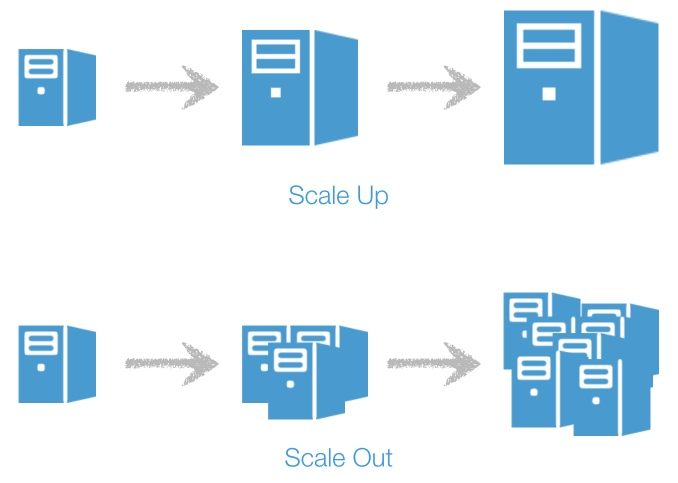

- **垂直扩展（Scale-Up）**：通过硬件升级来提升单机的硬件性能，或者通过软件优化来提升单机的软件性能，从而提供系统整体的处理容量
- **水平扩展（Scale-Out）**：通过增加机器来复制或拆分单个服务，降低单机的负载压力，从而提供系统整体的处理容量

规则：尽量通过水平扩展来实现系统的扩展能力，因为向上扩展注定会失败，不论多贵的硬件，单机性能总是有极限的

### 服务类型
系统中的不同服务，可以根据其是否为请求进行信息保存，划分为以下两种服务类型：

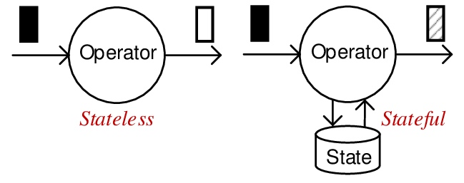

- **有状态服务（Stateful）**：会为请求进行信息保存，并且在处理请求时依赖于之前保存的信息，来提供一致性和个性化的响应
- **无状态服务（Stateless）**：不会为请求进行信息保存，独立地处理每一个请求，提供经过统一逻辑处理的响应

规则：尽可能将系统中的服务实现成无状态服务，因为有状态服务在水平扩展和单节点故障时，都需要保证状态信息的维护，从而限制系统的扩展性，降低可用性并增加成本

## 数据库使用
### 锁使用
数据库在是系统中往往是成本和稳定性风险最高的服务，正确的数据库选型及使用，对于降低成本和提高稳定性非常重要，而对于锁的使用是其中关键的部分

在锁的使用思想上有两种分类：
- **乐观锁（Optimistic Locking）**

  假定最好的情况，即数据不会总发生并发冲突，并发冲突属于小概率事件，因此不用每次都对数据加锁，也就是不采用数据库自身的锁机制，而是通过应用程序代码来实现
  
  程序代码可以在提交操作前，先检查数据的一致性，若仍和原来读取的数据一致则提交操作，否则重试数据读取和处理。通常会用版本号机制或时间戳，配合 **CAS（Compare And Swap）** 逻辑实现。本质上将提交操作分为 **冲突检查** 和 **数据更新** 两个步骤，系统开销小，有极小可能出现数据不一致，适用于读多写少的场景

  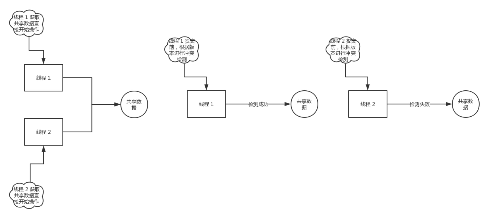

- **悲观锁（Pessimistic Locking）**

  假定最坏的情况，即数据一定会发生并发冲突，因此会保守地每次都对数据加锁，也就是采用数据库自身的锁机制
  
  程序代码通过 **一锁二读三更新** 的逻辑实现，即先对数据加锁，再读取并处理，然后提交操作后再释放锁。整个过程其他线程都不能数据进行访问和操作，这屏蔽了一切可能引起并发冲突的可能，系统开销大，保证了数据的一致性，适用于写并发多的场景
  
  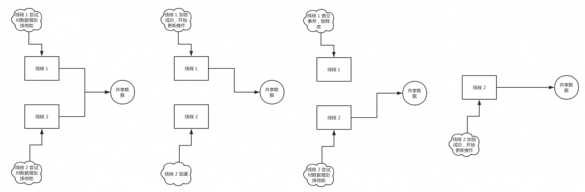

规则：对于涉及资金操作等写并发高且数据一致性要求高的系统，默认使用悲观锁，谨慎使用乐观锁。在悲观锁中只允许使用行锁，即使用主键或唯一键进行上锁，不允许使用页锁、区间锁、表锁等其他粗粒度的锁

**双重检查锁（Double Check Locking）** 结合了乐观锁和悲观锁的思想，先不加锁地检查数据是否需要处理，若要处理则对数据加锁，再检查数据的完整性，处理并提交操作后再释放锁

双重检查锁既完全地保证了数据的一致性，但是又减少了锁的使用频率，适用于多并发且重复写的场景，比如订单并发创建或更新状态等

### 事务使用
关系型数据库提供了高度完整性的事务，能够确保其 ACID 属性，但是成本很高，难以扩展，而且与其他存储系统相比可用性较低，因此对于事务的使用也是降低成本和提高稳定性的重要一环

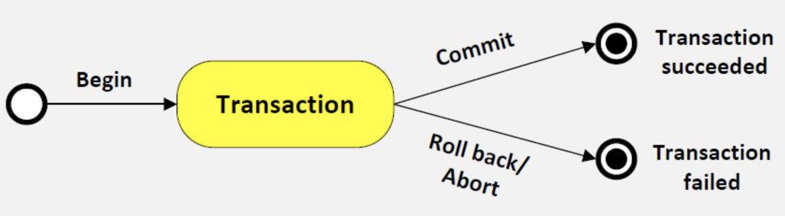

事务是指逻辑上的一组操作，它们要么全部成功，要么全部失败。数据库并发处理事务的能力是有限的，如果在数据库事务的过程中，进行远程网络调用，会导致事务的执行时间变长，导致数据库处理事务的容量变低

比如基于分段提交的分布式事务实现就有这个问题，发起方在本地事务中调用了参与者的远程服务接口，具体过程如下：

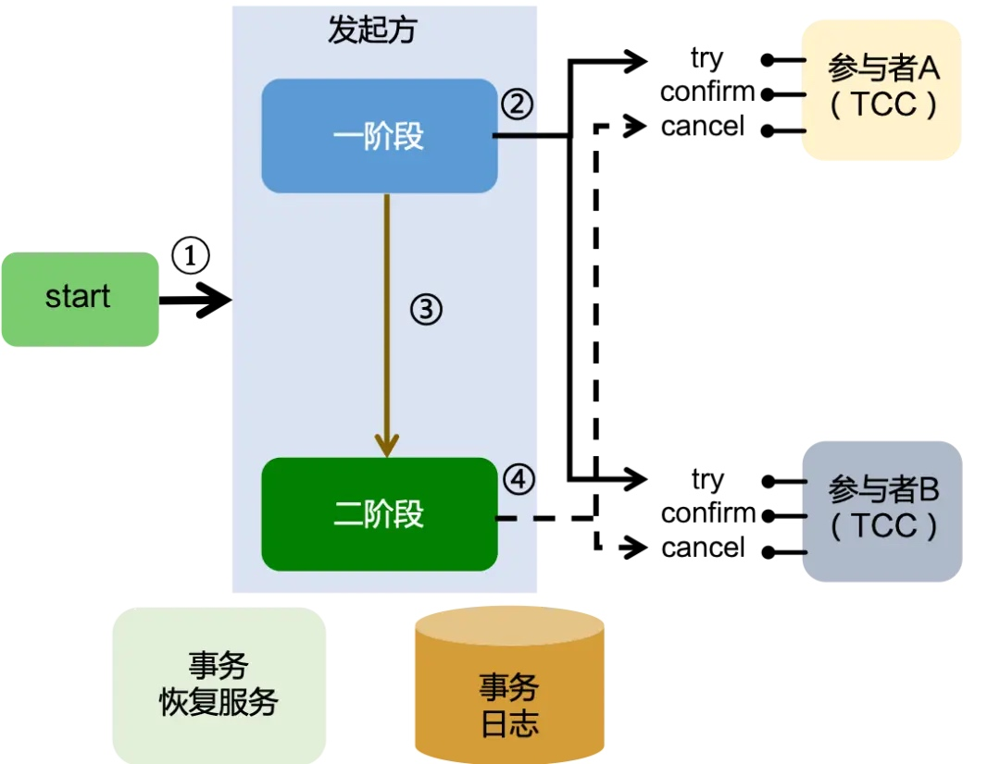

- **第一阶段**：发起方会先开启一个本地事务，然后调用参与者的 `Try` 方法，参与者再开启一个本地事务，完成 `Try` 方法的执行

- **第二阶段**：当有存在一个 `Try` 方法执行失败，则发起方阻断本地事务，并将分布式事务状态置为回滚，否则提交本地事务，并将分布式事务状态置为提交，最后调用参与者的二阶段方法，参与者根据分布式事务状态进行本地事务提交或回滚

规则：在数据库事务中，原则上禁止远程接口调用，因此需要慎用基于分阶段提交的分布式事务。特殊情况下，需要保证提供远程接口调用的服务，即分阶段提交中的参与方，其执行过程只有数据库操作，没有其他外部依赖，响应时间短，以及稳定性高

## 缓存使用
### 多级缓存
性能优化可以解决系统中各个节点的计算问题，提高整体的响应速度，从而支撑更大的并发，但过多的计算在面对巨大的瞬时流量时，并不能最大程度地并发处理。这时则需要使用 **缓存（Cache）** 机制，通过临时保存计算结果，以便之后能直接返回，才是最有效的提高并发处理能力的方法

**多级缓存（Multi-level Caching）** 是系统设计中常用的缓存层次结构，包含了多个层级的缓存组件，每个缓存层级的容量和访问速度有所不同。越接近用户的缓存层级，其访问速度越快但容量越小，越接近数据库的缓存层级，其访问速度越慢但容量较大

多级缓存的设计主要是考虑到了数据访问的局部性，即近期访问的数据在将来可能会被再次访问，因此多级缓存利用这种局部性，将最常用的数据存储在访问速度较快的缓存层次中，减少了从访问速度较慢的数据库中读取数据的频率，从而提高了系统的性能和响应速度

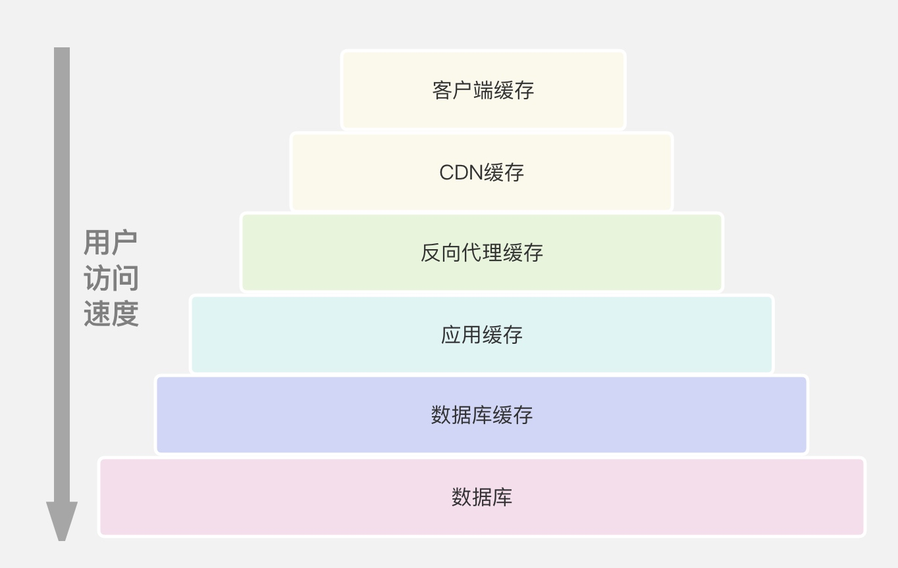

多级缓存的常见层级，访问速度从快到慢有：客户端缓存、CDN 缓存、反向代理缓存、应用缓存、数据库缓存等，具体的多级缓存层级和组织结构可以根据系统的需求和设计决策而有所不同

在缓存使用中需要注意的问题如下：
- **缓存一致性**：当多级缓存中的数据被修改时，需要确保所有缓存层次中的副本都能保持一致，可通过使用一致性协议来实现

- **缓存替换策略**：由于缓存容量有限，当缓存已满时，需要选择哪些数据被保留在缓存中，哪些数据被替换出去。常见的缓存替换策略包括 **先进先出（FIFO，First In First Out）**、**最近最少使用（LRU，Least Recently Used）**、**最不经常使用（LFU，Least Frequently Used）** 等

- **缓存写策略**：当数据被修改时，需要决定何时将数据写回到较慢的存储层次。常见的缓存写策略包括 **写回（Write Back）** 和 **写直通（Write Through）** 两种方式。前者在缓存中修改数据，并在某个时刻将数据写回到存储，而后者则立即将数据写回到存储

规则：尽量使用多层缓存来提高系统的并发能力，但不允许把缓存当数据库使用，因为缓存是容易因容灾而被切换和穿透的，因此缓存数据丢失应视为一个常态，必须继续穿透到数据库进行访问

## 服务交互
### 交互模式
**同步（Synchronous）** 和 **异步（Asynchronous）** 的区别：

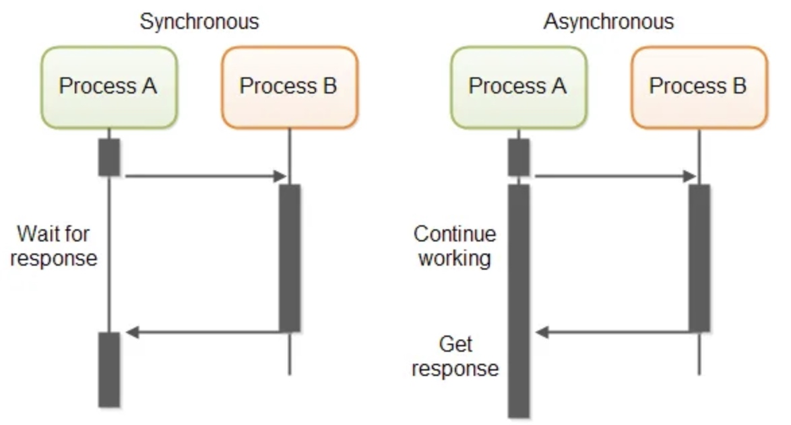

当向远程服务发起调用时，若使用同步通信，则调用方会阻塞自身直到远程服务返回；若使用异步通信，则调用方不需要等待远程服务返回便可继续执行，甚至不关心远程服务是否会处理该调用

**编排（Orchestration）** 和 **协同（Choreography）** 的区别：

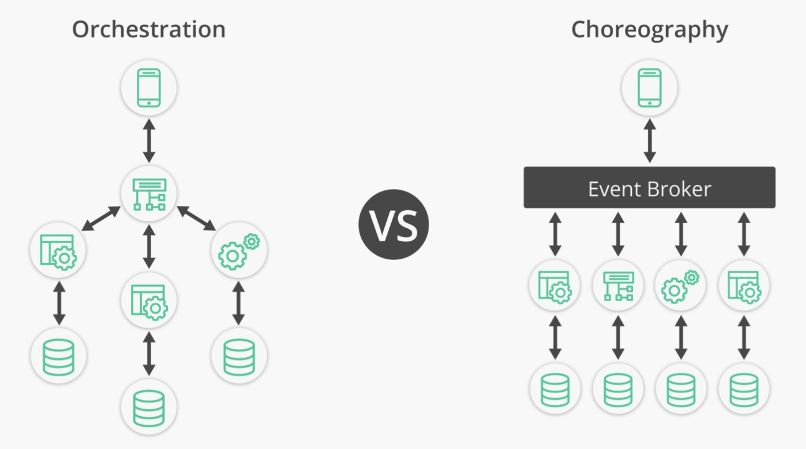

某个请求需要多个服务共同处理时，若使用编排模式，则所有功能服务都依赖于某个中心大脑来指导并驱动整个处理流程；若使用协调模式，则仅会告知各个功能服务关于它自身的职责，而把输入和输出留给服务决定，通过与协商好的输入输出来请求和响应周围的其他服务

规则：服务之间的交互尽可能优先异步通信而不是同步通信，尽可能采用协同模式而不是编排模式，因为同步通信容易产生阻塞从而影响系统并发能力，而编排模式会导致上帝节点出现，而其他节点变成过于轻量，解耦能力不足

### 消息驱动
**同步受理-异步处理** 是异步通信的一种实现，通常被用于涉及外部系统调用的场景，一方面外部系统响应时间长，另一方面外部系统可能非常不稳定，或常常需要进行重试，通过这种实现来屏蔽掉外部系统的响应时间长、不稳定性对内部核心系统的影响

**消息驱动** 是协同模式的一种实现，通常被用于内部服务间的通信场景，生产者将不同主题的消息发布到消息队列，消费者分别订阅不同主题的消息，并且完成消息所对应的请求处理，从而各服务之间不需要感知对方存在，实现松耦合的通信，各组件可以根据自身职责独立地迭代和扩展

消息驱动中的消息发布过程，可以看作为是同步受理-异步处理的一种应用，消息存入消息队列后即可返回响应给生产者，而不需要等待消息被消费。应用以上实现的交易系统架构如下：

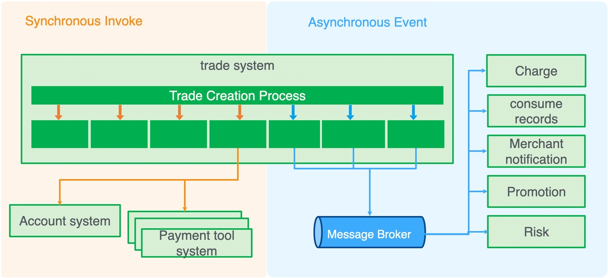

规则：将核心服务进行同步处理，将非核心服务通过同步受理，然后通过消息驱动在协同模式下进行异步处理，使得系统可以处理大量并发请求，并具有较低的耦合性

## 高可用
### 故障避免
**单点故障(Single Point Of Failure，SPOF)** 指系统中仅有一个实例，当它失败时将导致系统范围的事故。单点故障可以存在于系统的任何地方，包括单个网络服务器或单个网络设备，但最常见的是数据库中，因为数据库往往最难跨越多个节点扩展的

不同的数据库也具有不同的容灾方案，比如 MySQL 基于 Replication 和 Cluster 机制的高可用方案、Oracle 基于 RAC 和 DataGuard 机制的高可用方案、Oceanbase 基于 Paxos 的高可用架构

服务链路指一个请求完成处理所需经过的服务节点，由于每个服务都有可用性指标，申联服务出故障的风险具有乘法效应，链路越长则整体可用性就越低。一般来说系统链路越长，其可用性就越低，每月由此产生的停机时间就越长。假设每个系统的可用性为 4 个 9，即 99.99%，那么每增加一个系统，每月停机时间就增加大约 4.3 分钟

规则：在系统中永远不要实施会带来单点故障的设计，要不断地对单点故障进行消除，并且尽可能减少核心功能的服务链路长度

### 依赖治理
系统内服务之间的依赖关系应该表现为树状结构，从上层到下层依赖，避免循环依赖，因为如果存在循环依赖那么，整个系统的可用性将会取决于可用性最差的那个服务

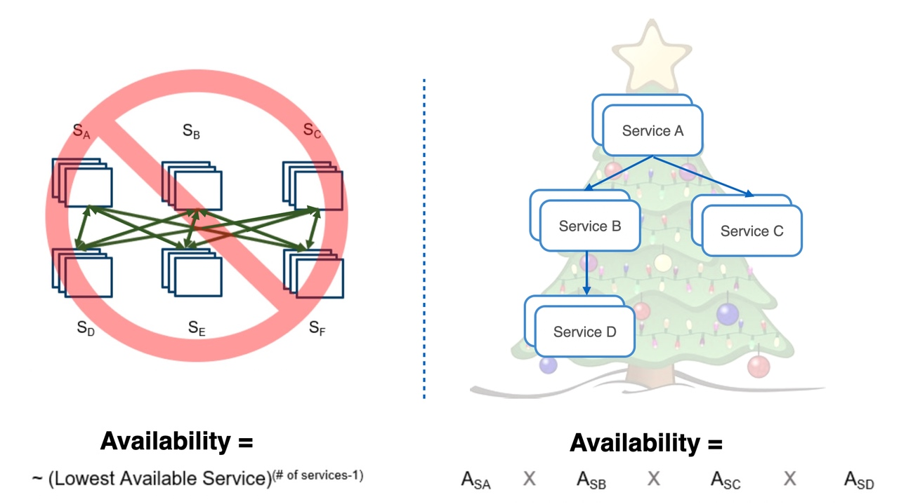

对系统进行服务分层后，上层服务应该依赖下层服务，或者同一层的服务相互依赖，并且越是底层的服务，其可用性要求就越高

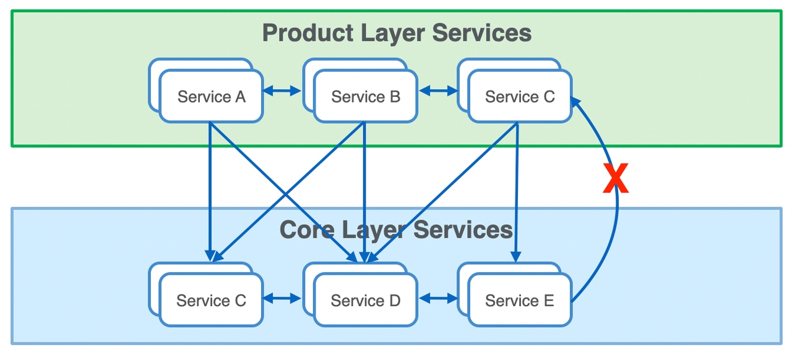

当功能分散在多个不同的、有可能宕掉的服务上时，也就是服务间存在强弱程度不同的依赖，因此重要的是理解每个服务故障的影响，从而安全地降级功能

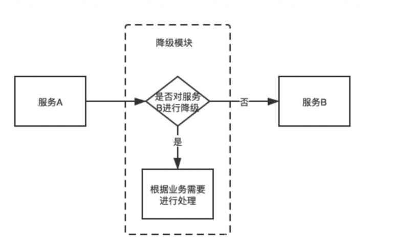

规则：对系统进行分层，尽可能避免出现依赖循环以及从下到上的依赖，提高底层服务的可用性。对于依赖了多个下游服务的服务，需要考虑下游服务的降级能力和对应的功能降级

### 故障隔离
**故障隔离（Fault Isolation）** 指限制故障的传播范围，将故障局限在一个特定的区域，确保故障不会对整个系统产生灾难性的影响。比如将租户划分到不同集群的节点，可以根据内部外部划分，可以根据重要程度划分，指定同一组服务的不同集群服务不同的租户，在租户之间故障隔离

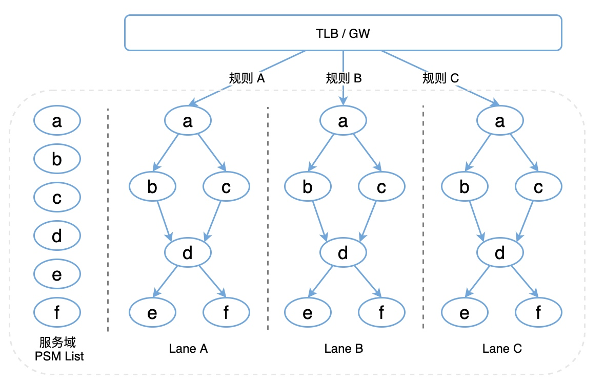

## 稳定运维
### 运营监控
监控与告警可以让系统在发生故障时主动通知我们，当系统无法自动修复该问题时，需要人员介入来调查这项告警，以确定目前是否存在真实故障，并采取一定方法缓解故障，最终找出故障的根源问题。要注意通过告警级别来收敛非关键的报警，避免产生太多告警噪声，从而导致对告警麻木的情况

对系统进行监控，存在以下四个黄金指标：
- **延迟**：服务处理单个请求所需要的时间，区分成功请求和失败请求很重要
- **流量**：系统请求流量的变化，需要进行环比和同比
- **错误**：请求的错误数和错误率，包括系统错误和业务错误
- **饱和度**：服务容量有多接近极限。通常是系统中目前最为受限的某种资源的某个具体指标的度量，例如 CPU、内存、磁盘的利用率

### 灰度发布
**灰度发布（Gray Release）** 也称为渐进式地应用发布策略，用于逐步将新版本的应用或功能引入生产环境，控制风险并最小化潜在的影响，并及时发现和解决新版本可能存在的问题，存在以下两种常见的形式：

- **金丝雀部署（Canary Deployment）**

  将老版本和新版本应用共同部署到一个生产环境中，然后根据一定的用户特征，比如是用户 ID、用户地域、用户类型等不同维度，允许部分用户使用新版本应用。在这个过程中，通过观察新版本的表现，以判断新版本是否符合预期
  
  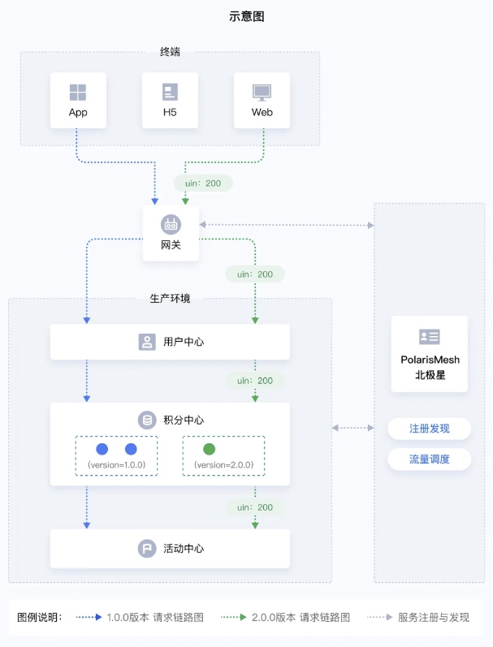

- **蓝绿部署（Blue Green Deployment）**

  部署包含老版本和新版本应用的两个独立的生产环境，旧版本可以称为蓝色环境，而新版本则可称为绿色环境。在保证蓝色环境的状态能同步到绿色环境后，逐步将用户流量从蓝色环境逐步转移到绿色环境中，一旦生产流量完全转移，蓝色环境就可以在回滚或退出生产的情况下保持待机，也可以更新成为下次需更新的版本

  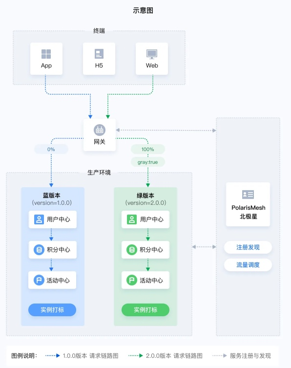

金丝雀发布可以视为应用级别的蓝绿部署，蓝绿部署也可以视为环境级别的金丝雀发布，前者需要更少资源但复杂度更大，具体选用要根据资源限制和新版本迭代成本来决定，比如新版本是否需要多个应用同时变更、是否依赖状态同步的等

### 升级回滚
确保所有版本的代码都有回滚能力，并且在准生产或者 QA 环境演练，同时变更文档不仅需要包含变更流程，还需要包含回滚流程。如果说因为代码复杂老旧、发布太频繁等原因不能回滚，那么这个变更也不应该执行

千万不要冒险地尝试使用 **修改就发布** 的方式去解决生产问题，否则一定会导致意料之外的故障，必须要经过自测、提测、灰度验证等流程

**功能标志（Feature flags)** 是一种软件开发技术，能够在 Feature 维度控制功能模块的发布与回滚，起到功能开关、灰度发布、远程配置、版本控制等作用，通过 `if-else` 或更复杂的决策树声明，解耦 Feature 的部署与发布。将大版本发布解耦为多个 Feature 独立发布，从而实现：
- 在生产环境下测试
- 基于 Feature 细粒度地渐进式发布、灰度发布
- 无需重新部署，基于 Feature 的秒级版本回滚
- 随时部署上线，准备好时再发布

最终达到缓解发布压力，降低发布风险，提高交付质量，提前试错时间，加快反馈速度的效果

规则：发布前必须具备代码回滚的能力，对于新功能上线，建议使用功能开关技术进行 Feature 控制
